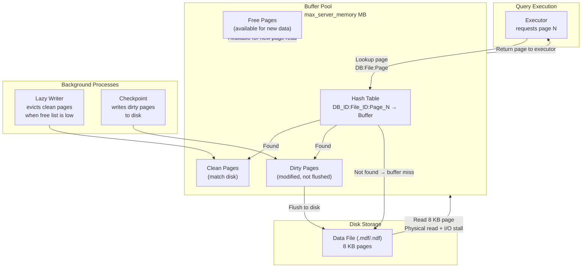
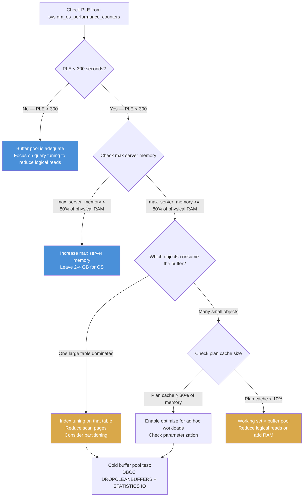

## Navigation

**Domain:** [[8 — Databases]] > **Group:** [[Group 1 — Relational Database Fundamentals]]
**Previous:** [[8.024 Database Engine Architecture — Parser, Optimizer, Executor]] | **Next:** [[8.026 Write-Ahead Logging]]

### Prerequisites
- [[8.004 Data Pages and Extents]] — the buffer pool caches 8 KB pages, not rows or tables
- [[8.024 Database Engine Architecture — Parser, Optimizer, Executor]] — the executor reads pages from the buffer pool, not directly from disk

### Where This Fits

The buffer pool is the central memory cache in SQL Server that holds data pages in RAM to minimize physical disk I/O. A .NET backend engineer encounters the buffer pool whenever a query runs: every logical read comes from the buffer pool, and every physical read is a buffer pool miss that stalls on disk I/O. What breaks when this is unknown: a 50 GB table on a server with 8 GB max memory causes 85% of reads to be physical (buffer pool miss per page), turning 5ms queries into 500ms queries. The interview signal is memory management depth — can the candidate explain why a query is I/O bound by checking buffer pool metrics, and know the difference between a cold and warm buffer pool?

---

## Core Mental Model

The buffer pool is a memory region in SQL Server that caches 8 KB data pages read from disk files. The invariant: every page read by the executor is served from the buffer pool — a page that is in the pool costs one logical read (RAM access, ~1μs); a page that is not in the pool must be read from disk (a physical read, ~5ms). The database engine accesses pages by looking up the page ID (database_id, file_id, page_id) in the buffer pool hash table; if found, it is a cache hit; if not found, the page is read from disk into the buffer pool, potentially evicting a clean page using the LRU-K replacement policy. The recognition pattern: when `SET STATISTICS IO` shows logical reads far exceeding the cacheable working set, or when `Page Life Expectancy` drops below 300 seconds, the buffer pool is under memory pressure.

### Classification

| Aspect | Detail |
|---|---|
| Cache unit | 8 KB data pages (fixed size) |
| Cache size | Controlled by `max server memory (MB)` — typically 70–80% of total physical RAM |
| Replacement policy | LRU-K (K=2) — clock algorithm variant |
| Page states | Clean (matches disk) or Dirty (modified, not yet written to disk) |
| Eviction trigger | Lazy writer (background) or resource monitor (memory pressure) |
| Key metrics | Page Life Expectancy (PLE), Page reads/sec, Page writes/sec, Buffer cache hit ratio |



### Key Properties

| Property | Value | Notes |
|---|---|---|
| Page size | 8 KB | Fixed, same as the disk page size |
| Default cache hit ratio target | > 99% | For OLTP with adequate memory |
| PLE target | > 300 seconds | Common baseline; lower = memory pressure |
| Dirty page threshold | 90% of checkpoint target | Triggers checkpoint if exceeded |
| Buffer pool hash table | ~1/64 of buffer pool size in memory | 16 bytes per buffer entry |
| Large page support | 2 MB and 256 MB (SQL Server Enterprise) | Reduces TLB misses for very large buffer pools |

---

## Deep Mechanics

### How the Engine Executes This

**Page read request from buffer pool:**

1. A query operator (e.g., Index Seek) requests page `(DB_ID=5, File_ID=1, Page_ID=12345)`.
2. The buffer manager computes a hash from the page identifier and probes the hash table.
3. **Cache hit:** the hash table entry points to a buffer frame in the buffer pool. The page is pinned (reference count incremented) to prevent eviction during use. The executor reads the page data directly from the buffer pool. Pin count is decremented when the operator moves past the page.
4. **Cache miss:** the buffer manager requests the page from the I/O subsystem:
   a. A free buffer is located from the free list (or a clean page is evicted if the free list is low).
   b. An asynchronous I/O is issued to read the 8 KB page from the data file.
   c. The worker thread waits on `PAGEIOLATCH_*` (the latch that guards the buffer frame during I/O).
   d. When the I/O completes, the page is placed in the buffer frame, the hash table is updated, and the page is returned to the executor.
5. **Page modification (write):** the executor modifies the page in the buffer pool. The page is marked as dirty (logged in the buffer header). The transaction log is written first (Write-Ahead Logging — WAL protocol).
6. **Checkpoint:** the checkpoint process scans the buffer pool's dirty page list and writes dirty pages to disk. This updates the database checkpoint LSN.
7. **Lazy writer:** when the free buffer list falls below a threshold, the lazy writer scans buffers, evicts clean pages (pages that match disk), and moves them to the free list. It does not evict dirty pages — only the checkpoint writes dirty pages.

**Memory pressure handling:**

1. **Internal pressure:** lazy writer cannot keep up with demand — PLE drops below 300 seconds. SQL Server starts trimming the plan cache and the procedure cache to free memory.
2. **External (OS) pressure:** SQL Server registers a memory notification callback. When the OS signals low memory, SQL Server trims its buffer pool to the `min server memory` setting.
3. **Memory clerk redistribution:** the buffer pool can grant memory to query sorts, hash joins, and index builds from the buffer pool reservation.

### SQL Visibility

**Observing buffer pool behavior:**

```sql
-- Buffer cache hit ratio (> 99% is good)
SELECT 
    (1.0 - (pages_evicted_from_cache / nullif(pages_placed_in_cache, 0))) * 100 AS BufferCacheHitRatio
FROM sys.dm_os_performance_counters
WHERE counter_name = 'Buffer cache hit ratio'
    AND object_name LIKE '%Buffer Manager%';

-- Page Life Expectancy (PLE) — seconds a page stays in cache
-- Below 300 seconds = memory pressure
SELECT cntr_value AS PageLifeExpectancySeconds
FROM sys.dm_os_performance_counters
WHERE counter_name = 'Page life expectancy'
    AND object_name LIKE '%Buffer Manager%';
```

```sql
-- Buffer pool size and composition
SELECT 
    COUNT(*) AS BufferedPages,
    COUNT(*) * 8 / 1024 AS BufferedSizeMB,
    SUM(CASE WHEN is_modified = 1 THEN 1 ELSE 0 END) AS DirtyPages,
    AVG(free_space_in_bytes) AS AvgFreeSpacePerPage
FROM sys.dm_os_buffer_descriptors
WHERE database_id = DB_ID();
```

```sql
-- Buffer pool breakdown by table and index
SELECT 
    OBJECT_NAME(p.object_id) AS TableName,
    i.name AS IndexName,
    COUNT(*) AS BufferedPages,
    COUNT(*) * 8 / 1024 AS SizeMB
FROM sys.dm_os_buffer_descriptors bd
JOIN sys.allocation_units au ON bd.allocation_unit_id = au.allocation_unit_id
JOIN sys.partitions p ON au.container_id = p.partition_id
JOIN sys.indexes i ON p.object_id = i.object_id AND p.index_id = i.index_id
WHERE bd.database_id = DB_ID()
    AND p.object_id > 100  -- user objects only
GROUP BY p.object_id, i.name
ORDER BY SizeMB DESC;
```

```csharp
// EF Core — observing logical vs physical reads via logging
public async Task ObserveBufferPoolBehaviorAsync(CancellationToken cancellationToken)
{
    // Enable SQL logging to see SET STATISTICS IO output
    using var context = CreateContext();

    // Run a warm query (pages likely in buffer pool)
    await context.Orders
        .Where(o => o.OrderId == 10042)
        .AsNoTracking()
        .ToListAsync(cancellationToken);

    // Run a cold query (pages likely not in buffer pool)
    // Force a different access path to see physical reads
    await context.Orders
        .Where(o => o.TotalAmount > 10000)
        .AsNoTracking()
        .ToListAsync(cancellationToken);
}
```

### Execution Plan Analysis

The buffer pool does not appear directly in execution plans, but plan operators indicate whether the access path is likely to hit the cache:

```
Clustered Index Seek (PK_Orders)  -- page reads: ~3 (2-3 level B-tree)
-- If the index root and intermediate pages are cached (they almost always are),
-- only the leaf page read may be physical on first access.
-- Logical reads: ~3  Physical reads: ~0 (after warmup)

Clustered Index Scan (PK_Orders)  -- page reads: ~125,000 for 10M rows
-- Sequential scan — large sequential physical reads on first access.
-- After first access, pages remain in buffer pool (if memory is adequate).
-- Logical reads: ~125,000  Physical reads: ~125,000 (first time)
```

### Cost Visibility

```sql
-- Cold buffer pool (after SQL Server restart or DBCC DROPCLEANBUFFERS)
SET STATISTICS IO ON;

SELECT o.OrderId, o.TotalAmount
FROM Orders o
WHERE o.OrderId BETWEEN 1 AND 1000;

-- Table 'Orders'. Scan count 1, logical reads 125341, physical reads 125341, read-ahead reads 0
-- All reads are physical — buffer pool was empty
-- Execution time: ~2,500 ms (125,341 physical reads × ~5ms + sequential read-ahead)

-- Warm buffer pool (same query, same data, pages already cached)
SET STATISTICS IO ON;

SELECT o.OrderId, o.TotalAmount
FROM Orders o
WHERE o.OrderId BETWEEN 1 AND 1000;

-- Table 'Orders'. Scan count 1, logical reads 125341, physical reads 0, read-ahead reads 0
-- All reads are logical — buffer pool hit every page
-- Execution time: ~350 ms (125,341 logical reads × ~1μs + CPU)
```

**Improvement:** Physical reads go from 125,341 to 0 after warmup. Execution time drops from ~2,500 ms to ~350 ms (7x faster) — purely from the buffer pool cache. Note: logical reads are identical because the query touches the same pages either way.

### Failure Modes

**Buffer pool memory pressure (PLE < 300 seconds):**

```sql
-- Detection: PLE consistently below 300 seconds
SELECT cntr_value AS PLE
FROM sys.dm_os_performance_counters
WHERE counter_name = 'Page life expectancy'
    AND object_name LIKE '%Buffer Manager%';
```

```sql
-- Find which tables consume the most buffer pool memory
SELECT TOP 10
    OBJECT_NAME(p.object_id) AS TableName,
    COUNT(*) * 8 / 1024 AS SizeInBufferMB
FROM sys.dm_os_buffer_descriptors bd
JOIN sys.allocation_units au ON bd.allocation_unit_id = au.allocation_unit_id
JOIN sys.partitions p ON au.container_id = p.partition_id
WHERE bd.database_id = DB_ID()
    AND p.object_id > 100
GROUP BY p.object_id
ORDER BY SizeInBufferMB DESC;
```

**Excessive single-use pages (plan cache bloat stealing buffer pool memory):**

```sql
-- Plan cache memory usage
SELECT 
    COUNT(*) AS CachedPlanCount,
    SUM(CAST(size_in_bytes AS BIGINT)) / (1024 * 1024) AS PlanCacheMB
FROM sys.dm_exec_cached_plans;

-- If plan cache > 30% of buffer pool, consider 'optimize for ad hoc workloads'
```

---

## Production Patterns and Implementation

### Primary SQL Implementation

**Simulating a cold buffer pool for performance testing:**

```sql
-- Clear clean buffers from the buffer pool (does not flush dirty pages)
-- Requires VIEW SERVER STATE permission
DBCC DROPCLEANBUFFERS;

-- Clear the plan cache (optional, if testing compilation too)
DBCC FREEPROCCACHE;

-- Now run the query to see the full physical read cost
SET STATISTICS IO ON;
SELECT COUNT_BIG(*) FROM Orders;
SET STATISTICS IO OFF;
```

**Forcing a page into the buffer pool (pre-warming):**

```sql
-- Run a full scan to load all pages into the buffer pool
-- (For pre-warming after SQL Server restart)
SELECT COUNT_BIG(*) FROM Orders WITH (NOLOCK);
SELECT COUNT_BIG(*) FROM OrderItems WITH (NOLOCK);
-- These scans load all data pages into the buffer pool,
-- ensuring subsequent queries have cache hits.
```

### EF Core Implementation

EF Core does not interact with the buffer pool directly. Buffer pool management is the database's responsibility. However, EF Core queries benefit from a warm buffer pool:

```csharp
// Application pre-warming strategy (not common, but documented)
public class DatabasePreWarmService
{
    private readonly ISqlConnectionFactory _connectionFactory;

    public DatabasePreWarmService(ISqlConnectionFactory connectionFactory)
    {
        _connectionFactory = connectionFactory;
    }

    public async Task PreWarmBufferPoolAsync(CancellationToken cancellationToken)
    {
        // Pre-warm critical tables by scanning them into the buffer pool
        var tables = new[] { "Orders", "OrderItems", "Customers", "Products" };

        await using var connection = _connectionFactory.Create();
        foreach (var table in tables)
        {
            try
            {
                await connection.ExecuteAsync(
                    new CommandDefinition(
                        $"SELECT COUNT_BIG(*) FROM dbo.{table} WITH (NOLOCK);",
                        cancellationToken: cancellationToken));
            }
            catch
            {
                // Pre-warming is best-effort
            }
        }
    }
}
```

### Dapper Implementation

```csharp
public interface IBufferPoolMonitor
{
    Task<BufferPoolMetrics> GetMetricsAsync(CancellationToken cancellationToken);
    Task<IReadOnlyList<TableCacheInfo>> GetBufferPoolByTableAsync(CancellationToken cancellationToken);
}

public sealed class BufferPoolDiagnostics : IBufferPoolMonitor
{
    private readonly ISqlConnectionFactory _connectionFactory;

    public BufferPoolDiagnostics(ISqlConnectionFactory connectionFactory)
    {
        _connectionFactory = connectionFactory;
    }

    public async Task<BufferPoolMetrics> GetMetricsAsync(CancellationToken cancellationToken)
    {
        const string sql = @"
            SELECT 
                (SELECT cntr_value FROM sys.dm_os_performance_counters
                 WHERE counter_name = 'Page life expectancy'
                     AND object_name LIKE '%Buffer Manager%') AS PLE,
                (SELECT cntr_value FROM sys.dm_os_performance_counters
                 WHERE counter_name = 'Buffer cache hit ratio'
                     AND object_name LIKE '%Buffer Manager%') AS CacheHitRatio,
                (SELECT COUNT(*) FROM sys.dm_os_buffer_descriptors
                 WHERE database_id = DB_ID()) AS TotalBufferedPages,
                (SELECT COUNT(*) FROM sys.dm_os_buffer_descriptors
                 WHERE database_id = DB_ID() AND is_modified = 1) AS DirtyPages,
                (SELECT total_physical_memory_kb / 1024 FROM sys.dm_os_sys_info) AS TotalServerMemoryMB,
                (SELECT cntr_value AS configured FROM sys.dm_os_performance_counters
                 WHERE counter_name = 'Target Server Memory (KB)' AND object_name LIKE '%Memory Manager%') / 1024 AS TargetMemoryMB;";

        await using var connection = _connectionFactory.Create();
        return await connection.QueryFirstAsync<BufferPoolMetrics>(
            new CommandDefinition(sql, cancellationToken: cancellationToken));
    }

    public async Task<IReadOnlyList<TableCacheInfo>> GetBufferPoolByTableAsync(
        CancellationToken cancellationToken)
    {
        const string sql = @"
            SELECT TOP 20
                OBJECT_NAME(p.object_id) AS TableName,
                i.name AS IndexName,
                COUNT(*) AS BufferedPages,
                COUNT(*) * 8 / 1024 AS SizeMB,
                SUM(CASE WHEN bd.is_modified = 1 THEN 1 ELSE 0 END) AS DirtyPages
            FROM sys.dm_os_buffer_descriptors bd
            JOIN sys.allocation_units au ON bd.allocation_unit_id = au.allocation_unit_id
            JOIN sys.partitions p ON au.container_id = p.partition_id
            JOIN sys.indexes i ON p.object_id = i.object_id AND p.index_id = i.index_id
            WHERE bd.database_id = DB_ID()
                AND p.object_id > 100
            GROUP BY p.object_id, i.name
            ORDER BY SizeMB DESC;";

        await using var connection = _connectionFactory.Create();
        var results = await connection.QueryAsync<TableCacheInfo>(
            new CommandDefinition(sql, cancellationToken: cancellationToken));
        return results.AsList();
    }
}

public record BufferPoolMetrics
{
    public long PLE { get; init; }
    public long CacheHitRatio { get; init; }
    public long TotalBufferedPages { get; init; }
    public long DirtyPages { get; init; }
    public long TotalServerMemoryMB { get; init; }
    public long TargetMemoryMB { get; init; }
}

public record TableCacheInfo
{
    public string TableName { get; init; }
    public string IndexName { get; init; }
    public int BufferedPages { get; init; }
    public int SizeMB { get; init; }
    public int DirtyPages { get; init; }
}
```

### Configuration and Wiring

```csharp
// Program.cs — read-only connection strings for monitoring
builder.Services.AddSingleton<IBufferPoolMonitor, BufferPoolDiagnostics>();

// Connection string for buffer pool monitoring
// Requires VIEW SERVER STATE permission
// "Server=.;Database=Monitoring;Integrated Security=True;TrustServerCertificate=True;"
```

### SQL Server vs PostgreSQL Differences

PostgreSQL uses **shared buffers** (equivalent to the buffer pool) and **OS page cache**:

```sql
-- PostgreSQL: shared buffers configuration
-- SHOW shared_buffers;  -- default: 128 MB (typically set to 25% of RAM)
-- SHOW effective_cache_size;  -- combined shared_buffers + OS cache (typically 75% of RAM)

-- PostgreSQL: buffer pool hit ratio (cache hit rate)
SELECT 
    'buffer_hit_cache' AS name,
    SUM(blks_hit) / NULLIF(SUM(blks_hit + blks_read), 0) * 100 AS ratio
FROM pg_stat_database
WHERE datname = current_database();
```

Key differences:
- SQL Server uses a single unified buffer pool for all databases; PostgreSQL uses per-database shared buffers.
- SQL Server manages its own buffer pool with LRU-K; PostgreSQL relies partially on the OS page cache (double buffering).
- SQL Server's `max server memory` controls the absolute upper limit; PostgreSQL's `shared_buffers` is a fixed allocation.
- PLE in SQL Server has a typical baseline of 300 seconds; PostgreSQL does not have a direct PLE equivalent — `pg_stat_bgwriter` shows buffers allocation and checkpoint counts.
- SQL Server uses 8 KB pages fixed; PostgreSQL also uses 8 KB pages by default (configurable via `--with-blocksize` at compile time).

---

## Gotchas and Production Pitfalls

### PLE Drop with No Obvious Cause

**Pitfall:** Page Life Expectancy drops from 2000 seconds to 100 seconds, but no single query is scanning a large table.

```sql
-- ❌ One large table scan pushes out all other pages
SELECT * INTO #AuditDump FROM AuditLog;  -- scans 500 MB of AuditLog
-- After this, PLE drops because AuditLog pages displaced everything else
```

**Symptom:** All queries slow down, even queries on small tables that were previously fast. `sys.dm_os_buffer_descriptors` shows the AuditLog pages have evicted Orders, Customers, and Products pages.

**Fix:** Do not scan large tables unless necessary. Use pagination, partitioning, or filtered queries to limit page reads. For ETL operations, use `READ UNCOMMITTED` or `NOLOCK` hint (with understanding of the consistency tradeoff) and batch the scan into chunks.

```sql
-- ✅ Paginate the scan to limit buffer pool churn
DECLARE @BatchSize INT = 10000, @Offset INT = 0;

WHILE @Offset < (SELECT COUNT_BIG(*) FROM AuditLog)
BEGIN
    INSERT INTO #AuditDump
    SELECT TOP (@BatchSize) *
    FROM AuditLog
    ORDER BY AuditId
    OFFSET @Offset ROWS;

    SET @Offset = @Offset + @BatchSize;
END;
```

**Cost of not fixing:** PLE drops to 50 seconds. A query that normally runs in 50ms (all pages cached) now does 500 physical reads per execution, running in 2.5 seconds. The entire application is 50x slower due to buffer pool churn.

### Buffer Pool Size Conflict with Other Memory Consumers

**Pitfall:** `max server memory` is set too high, leaving insufficient memory for the OS, or too low, starving the buffer pool.

```sql
-- ❌ max server memory = 200 GB on a 256 GB server
-- Leaves 56 GB for OS — excessive (OS needs ~4 GB + file cache)
-- OR
-- max server memory = 8 GB on a 256 GB server
-- Leaves 248 GB unused — the buffer pool cannot cache the 50 GB working set
```

**Symptom:** In the first case, the OS pages SQL Server to disk (unusual but possible). In the second case, PLE is consistently < 100 seconds despite 248 GB free RAM — SQL Server simply cannot use it.

**Fix:** Set `max server memory` to approximately 80–85% of total physical RAM for dedicated SQL Server instances. Leave ~2–4 GB for the OS plus 1 GB per 16 GB of server RAM for file cache.

```sql
-- Recommended: 80% of 256 GB = ~205 GB
EXEC sys.sp_configure N'max server memory (MB)', N'209920';
RECONFIGURE WITH OVERRIDE;
```

**Cost of not fixing:** A 256 GB server with `max server memory = 8 GB` performs worse than a 32 GB server with `max server memory = 28 GB`. SQL Server cannot cache its working set, so every query does physical reads. The hardware investment is wasted.

### Large Page Consumption Without Large Pages Enabled

**Pitfall:** Not enabling Lock Pages in Memory (LPIM) for the SQL Server service account on servers with > 64 GB RAM.

```sql
-- Without LPIM: SQL Server memory pages can be paged out by the OS
-- With LPIM: SQL Server memory is locked in RAM and cannot be paged out
-- 
-- Check if LPIM is granted:
SELECT sql_memory_model, sql_memory_model_desc
FROM sys.dm_os_sys_info;
-- sql_memory_model 2 = "LOCK_PAGES" — LPIM is enabled
-- sql_memory_model 1 = "CONVENTIONAL" — LPIM not enabled
```

**Symptom:** Server reboots or memory pressure causes SQL Server to be paged out. Performance is inconsistent — sometimes PLE is 2000, then suddenly drops to 10 as OS paging kicks in.

**Fix:** Grant the "Lock Pages in Memory" Windows policy to the SQL Server service account. This requires SQL Server restart.

**Cost of not fixing:** A memory-hungry process (OS, anti-virus, monitoring agent) causes 50 GB of SQL Server's buffer pool to be paged to disk. I/O latency spikes from 5ms to 100ms+. Application timeouts cascade.

### Dirty Page Threshold Checkpoint Storms

**Pitfall:** A burst of updates dirties a large percentage of the buffer pool, triggering a checkpoint storm.

```sql
-- Scenario: UPDATE without WHERE dirties 2M pages
UPDATE Orders SET Status = Status;  -- touches every row
-- Target recovery interval (default: 60 seconds) → checkpoint writes all dirty pages
```

**Symptom:** I/O latency spikes during checkpoint. `sys.dm_io_virtual_file_stats` shows high write stalls on the data files. `sys.dm_exec_requests` shows `WRITELOG` and `ASYNC_IO_COMPLETION` waits.

**Fix:** Batch large updates in chunks to control the dirty page rate:

```sql
-- ✅ Batch update limits dirty pages per iteration
DECLARE @BatchSize INT = 10000, @RowsAffected INT = 1;

WHILE @RowsAffected > 0
BEGIN
    UPDATE TOP (@BatchSize) Orders
    SET Status = Status
    WHERE Status IS NOT NULL;

    SET @RowsAffected = @@ROWCOUNT;
    CHECKPOINT;  -- flush dirty pages per batch
END;
```

**Cost of not fixing:** A checkpoint writes 2 GB of dirty pages to disk. The I/O subsystem saturates at 200 MB/s, so writes take 10 seconds. During this time, read I/O competes with writes — query latency doubles.

### Buffer Pool Fragmentation (Large Pages Disabled)

**Pitfall:** Large buffer pools (> 100 GB) without large page allocation fragment the buffer pool's virtual address space.

```sql
-- Check virtual address space fragmentation
SELECT 
    virtual_memory_reserved_kb,
    virtual_memory_committed_kb
FROM sys.dm_os_process_memory;
-- Large differences between reserved and committed = fragmentation
```

**Symptom:** SQL Server cannot grow the buffer pool to `max server memory` despite available physical RAM. Error 701 ("There is insufficient system memory") may appear even with free RAM.

**Fix:** Enable trace flag 834 (large pages) for SQL Server Enterprise, or use Lock Pages in Memory with large page support.

```sql
DBCC TRACEON(834, -1);  -- Enable large page allocations (Enterprise only)
```

**Cost of not fixing:** SQL Server can only use 80% of the configured `max server memory` due to virtual address space fragmentation. A 200 GB server wastes 40 GB of RAM.

---

## Performance Implications

### Benchmark: Cold vs Warm Buffer Pool

```sql
-- Cold buffer pool
DBCC DROPCLEANBUFFERS;

SET STATISTICS IO ON;
SET STATISTICS TIME ON;

SELECT COUNT_BIG(*) FROM Orders WHERE CustomerId BETWEEN 1 AND 10000;

-- Table 'Orders'. Scan count 1, logical reads 125341, physical reads 125341
-- SQL Server Execution Times: CPU time = 312 ms, elapsed time = 2850 ms

-- Warm buffer pool (same query, second execution — all pages cached)
SELECT COUNT_BIG(*) FROM Orders WHERE CustomerId BETWEEN 1 AND 10000;

-- Table 'Orders'. Scan count 1, logical reads 125341, physical reads 0
-- SQL Server Execution Times: CPU time = 297 ms, elapsed time = 315 ms
```

**Improvement:** Physical reads from 125,341 to 0 (buffer pool hit). Elapsed time from 2,850 ms to 315 ms (9x faster). Logical reads remain the same — the same number of pages are accessed either way.

### BenchmarkDotNet

```csharp
[MemoryDiagnoser]
[SimpleJob(RuntimeMoniker.Net90)]
public class BufferPoolBenchmark
{
    private IDbConnection _connection = default!;

    [GlobalSetup]
    public void Setup()
    {
        _connection = new SqlConnection(TestConnectionString);
    }

    [Benchmark(Baseline = true)]
    public async Task<long> QueryColdBufferPool()
    {
        const string sql = @"
            DBCC DROPCLEANBUFFERS;
            SELECT COUNT_BIG(*) FROM Orders;";

        await using var connection = _connection;
        return await connection.QueryFirstAsync<long>(
            new CommandDefinition(sql, cancellationToken: CancellationToken.None));
    }

    [Benchmark]
    public async Task<long> QueryWarmBufferPool()
    {
        const string sql = "SELECT COUNT_BIG(*) FROM Orders;";
        await using var connection = _connection;
        return await connection.QueryFirstAsync<long>(
            new CommandDefinition(sql, cancellationToken: CancellationToken.None));
    }
}
```

**Expected results (approximate, SQL Server 2022, NVMe, 10M rows):**

| Method | Mean | Physical Reads | Logical Reads | Allocated |
|---|---|---|---|---|
| QueryColdBufferPool | ~2,800 ms | ~125,341 | ~125,341 | 0 B |
| QueryWarmBufferPool | ~320 ms | 0 | ~125,341 | 0 B |

### Write Amplification

| Operation | Buffer Pool Impact |
|---|---|
| SELECT point lookup (by key) | 2–4 pages read (root → leaf), usually cached |
| SELECT small range scan | Pages added to buffer pool; if not already cached, physical read |
| SELECT full table scan | Entire table loaded into buffer pool (if space permits) — evicts other pages |
| INSERT single row | 1 page dirtied (leaf page of clustered index) + log write |
| BULK INSERT 100K rows | ~1,500 pages dirtied (assuming 100 rows per page) |
| UPDATE non-key column | 1 page dirtied per row updated |
| DELETE rows | 1 page dirtied per row; page may be deallocated |

---

## Interview Arsenal

### Question Bank

1. What is the buffer pool and how does SQL Server use it?
2. How does the buffer pool decide which pages to evict — what algorithm does it use?
3. What is the difference between a logical read and a physical read?
4. What is Page Life Expectancy (PLE) and what does a low value indicate?
5. Compare the buffer pool to the plan cache — how do they interact?
6. What happens at checkpoint time in the buffer pool?
7. How does the buffer pool size affect query performance at 10M vs 1B rows?
8. How can EF Core or Dapper cause buffer pool churn?
9. What is the difference between a dirty page and a clean page in the buffer pool?
10. How do you diagnose buffer pool pressure from a SQL Server performance standpoint?

### Spoken Answers

**Q1: What is the buffer pool and how does SQL Server use it?**

> **Average answer:** The buffer pool is SQL Server's cache of data pages in memory. It makes queries faster by avoiding disk reads.

> **Great answer:** The buffer pool is a memory region managed by SQL Server that caches 8 KB data pages from the database files. Every query execution touches pages through the buffer pool — there is no direct disk I/O path for data reads. The buffer pool uses an LRU-K (K=2) replacement policy implemented as a clock algorithm: each page has a reference count, and when the lazy writer needs to evict pages, it scans the buffer descriptors and evicts clean pages with count = 0. Pages that are accessed frequently keep their count elevated. The buffer pool also tracks dirty pages — pages modified by a transaction but not yet written to disk. Dirty pages are flushed to disk by the checkpoint process. The buffer pool is sized by `max server memory (MB)`, typically set to 70–80% of physical RAM. The key metric is Page Life Expectancy (PLE) — the average number of seconds a page stays in the buffer pool before being evicted. A PLE of 300 seconds is a common warning threshold; below that, the working set exceeds the buffer pool and every query incurs physical reads. From a .NET perspective, the buffer pool is completely transparent — EF Core and Dapper queries do not interact with it directly, but their SQL determines how many pages are read and cached. A poorly written query that scans a massive table can flush the buffer pool, slowing down every other application on the same instance.

**Q5: Compare the buffer pool to the plan cache.**

> **Average answer:** The buffer pool caches data pages; the plan cache caches execution plans.

> **Great answer:** The buffer pool and plan cache are both memory consumers within SQL Server's memory clerk hierarchy, but they serve entirely different purposes. The **buffer pool** caches data pages (raw 8 KB blocks from .mdf/.ndf files) — it is organized by page ID and is accessed by every query operator at execution time. The **plan cache** (within the procedure cache) caches compiled execution plans — it is organized by SQL hash + SET options and is accessed during query compilation. The performance profiles differ: a buffer pool miss results in a physical page read (~5ms on disk, then stays cached); a plan cache miss results in a query compilation (~1–5ms for OLTP, up to 2 seconds for complex queries). Under memory pressure, SQL Server's resource monitor balances both: it may trim the plan cache before evicting data pages from the buffer pool, because recompiling a query is cheaper than re-reading data pages from disk. The ratio matters — on a 200 GB server, typical allocation might be 180 GB for the buffer pool and 2 GB for the plan cache. If plan cache bloat (e.g., thousands of ad-hoc query plans) consumes 30 GB, it steals from the buffer pool and depresses PLE. Enabling `optimize for ad hoc workloads` reduces plan cache memory by caching only a stub for one-time queries.

**Q10: How do you diagnose buffer pool pressure?**

> **Great answer:** I diagnose buffer pool pressure in a structured sequence. First, check Page Life Expectancy from `sys.dm_os_performance_counters` — if PLE is under 300 seconds, the working set is larger than the buffer pool. Second, check `sys.dm_os_buffer_descriptors` grouped by database and table to see which objects dominate the buffer pool — a single 50 GB table may be pushing everything else out. Third, cross-reference with `sys.dm_exec_query_stats` to find the queries doing the most logical reads — reducing logical reads per query is the most effective way to reduce buffer pool pressure. Fourth, check the buffer cache hit ratio — if it is below 99%, physical reads are too high. Fifth, check `max server memory` configuration — if it is set conservatively (e.g., 8 GB on a 256 GB server), the buffer pool is artificially starved. Sixth, check for plan cache bloat via `sys.dm_exec_cached_plans` — if plans consume more than 10% of memory, consider `optimize for ad hoc workloads`. Finally, check if `Lock Pages in Memory` is enabled — without it, the OS can page out SQL Server's buffer pool. For an OLTP workload, reducing logical reads by 90% (better indexes, SARGable queries) is almost always the answer — it reduces the working set so it fits in the buffer pool, stabilizing PLE.

### Interview Trigger

If this topic appears, the trigger question is "why is this query slow despite having a good execution plan?" or "what does SET STATISTICS IO tell you?" The follow-up that separates candidates: "If logical reads are 125,000 and physical reads are 125,000, what does that tell you about the buffer pool, and what would you do?" Senior candidates explain that the buffer pool was cold when the query ran, and discuss whether the working set fits in the buffer pool or if indexes need optimization.

### Comparison Table

| | SQL Server Buffer Pool | PostgreSQL Shared Buffers |
|---|---|---|
| Page size | 8 KB fixed | 8 KB (compile-time configurable) |
| Size control | `max server memory (MB)` (dynamic) | `shared_buffers` (static, requires restart) |
| OS cache usage | SQL Server manages its own cache | Double buffering — shared_buffers + OS page cache |
| Eviction algorithm | LRU-K (clock) | ARC (Adaptive Replacement Cache) or clock sweep |
| PLE equivalent | Page Life Expectancy (counter) | `pg_stat_bgwriter` buffers_alloc / buffers_backend |
| Dirty page flush | Checkpoint (target recovery interval) | Checkpoint + bgwriter (bgwriter_delay) |
| Large page support | Supported (TF 834, LPIM) | Huge pages (huge_pages = on) |

---

## Decision Framework

### When to Tune the Buffer Pool



### Application Checklist

- [ ] `max server memory` is set to ~80% of physical RAM (for dedicated SQL Server)
- [ ] Lock Pages in Memory is granted to the SQL Server service account
- [ ] PLE stays above 300 seconds during peak load (baseline established)
- [ ] The largest tables by buffer pool consumption are indexed for the actual query workload
- [ ] Queries with full table scans are identified and optimized (reduce buffer pool churn)
- [ ] The plan cache is sized appropriately (`optimize for ad hoc workloads` enabled if needed)
- [ ] Buffer pool monitoring is configured (PLE alert, physical reads/sec alert)

### Tradeoff Summary

| What You Gain | What You Pay |
|---|---|
| More buffer pool memory = higher cache hit ratio | Less memory for OS, query memory grants, plan cache |
| Cached pages = sub-millisecond logical reads | Large table scans evict useful pages (cache churn) |
| Lock Pages in Memory = no OS paging | Requires Windows policy configuration + restart |
| Large pages (TF 834) = better TLB efficiency | Enterprise Edition only; may increase memory fragmentation |

### Scale Thresholds

- "PLE > 300 seconds is the baseline target; PLE > 1000 seconds indicates a well-sized buffer pool for the workload."
- "Buffer pool churn from large scans becomes critical when the scan size exceeds ~10% of the buffer pool — the scan evicts more than 10% of cached pages."
- "max server memory should be at least 50% of the database working set for OLTP workloads. If the working set is 200 GB, set `max server memory` to at least 100 GB."
- "On servers with > 128 GB RAM, enable Lock Pages in Memory and consider trace flag 834 (SQL Server Enterprise) for large page allocation."

---

## Self-Check

### Conceptual Questions

1. What is the buffer pool and what size unit does it cache?
2. Which algorithm does SQL Server use to decide which page to evict from the buffer pool?
3. What DMV shows the breakdown of buffer pool usage by table and index?
4. What is the relationship between logical reads, physical reads, and the buffer pool in SET STATISTICS IO output?
5. How does EF Core affect the buffer pool, and can it clear or warm it?
6. How would you use Dapper to monitor buffer pool pressure?
7. Compare the buffer pool with the plan cache — what happens to each under memory pressure?
8. What is the recommended `max server memory` as a percentage of physical RAM for a dedicated instance?
9. What is the difference between a dirty page and a clean page, and which process flushes each?
10. Explain what PLE means and what you would do if it drops below 300 seconds.

<details>
<summary>Answers</summary>

1. The buffer pool caches 8 KB data pages from the database files. It is managed by SQL Server's buffer manager and sized by `max server memory (MB)`. Every page read by a query operator is served from the buffer pool — there is no direct I/O path to the data files for read operations.

2. SQL Server uses an LRU-K (K=2) algorithm implemented as a clock sweep. Each buffer descriptor has a reference count (indicating how recently and frequently the page was accessed). When free pages are needed, the lazy writer scans the buffer descriptors and evicts clean pages with a reference count of 0. Accessed pages have their count incremented; the scan resets the count, giving recently-used pages a second chance.

3. `sys.dm_os_buffer_descriptors` provides per-page buffer pool information. Join it with `sys.allocation_units` and `sys.partitions` and `sys.indexes` to break down buffer pool usage by table and index. Key columns: `database_id`, `file_id`, `page_id`, `is_modified` (dirty/clean), `free_space_in_bytes`.

4. `SET STATISTICS IO` reports `logical reads` (number of pages accessed in the buffer pool) and `physical reads` (number of pages read from disk into the buffer pool). Every page access begins as a logical read; if the page is not in the buffer pool, it becomes a physical read. After the physical read, the page is in the buffer pool — subsequent accesses to the same page are logical only. `read-ahead reads` are physical reads performed by the read-ahead mechanism for large scans.

5. EF Core does not directly interact with the buffer pool. EF Core's generated SQL runs on SQL Server, which manages its own buffer pool. However, EF Core queries that scan large tables (e.g., `SELECT * FROM Orders`) force all pages into the buffer pool, evicting other tables' pages. EF Core cannot clear or warm the buffer pool — this is done via `DBCC DROPCLEANBUFFERS` and `SELECT COUNT_BIG(*)` scan queries, respectively.

6. Query `sys.dm_os_performance_counters` for PLE and buffer cache hit ratio, and `sys.dm_os_buffer_descriptors` for per-table breakdown. The Dapper `BufferPoolDiagnostics` class in the Production Patterns section shows the exact queries.

7. Under memory pressure, SQL Server's resource monitor trims both. The buffer pool is the priority — SQL Server trims the plan cache first (recompiling a query costs 1-5ms, re-reading pages from disk costs 5ms each). If pressure continues, the buffer pool is trimmed via the lazy writer. The plan cache is typically < 10% of total memory; the buffer pool is typically 70–80%.

8. For a dedicated SQL Server instance, set `max server memory` to approximately 80% of physical RAM. Adjust down by ~2-4 GB for OS overhead and 1 GB per 16 GB of server RAM for file cache. For 256 GB, use ~205 GB. For a shared server, adjust based on remaining workload requirements.

9. A clean page matches its corresponding disk page — it has been read but not modified, or has been written to disk by a checkpoint. A dirty page has been modified in the buffer pool but the change has not yet been written to the data file. The lazy writer evicts clean pages; only the checkpoint process writes dirty pages to disk (the lazy writer does not flush dirty pages).

10. PLE (Page Life Expectancy) measures how many seconds, on average, a page stays in the buffer pool before being evicted. A PLE below 300 seconds means the working set exceeds the buffer pool — pages are evicted quickly and must be re-read from disk frequently. First, check `max server memory` to ensure it is set appropriately (increase to 80% of RAM if possible). Second, identify which queries cause the most logical reads via `sys.dm_exec_query_stats` — reduce their page reads with better indexes or SARGable predicates. Third, identify which tables consume the most buffer pool via `sys.dm_os_buffer_descriptors` — consider indexing those tables to reduce their footprint. Fourth, check for plan cache bloat. If none of these works, add more RAM to the server.

</details>

---

### Query Challenges

**Challenge 1 — Write the SQL**

Write a query that shows the top 10 tables in the current database consuming the most buffer pool space, ordered by size descending. Include the number of buffered pages, the size in MB, and the number of dirty pages.

<details>
<summary>Solution</summary>

```sql
SELECT TOP 10
    OBJECT_NAME(p.object_id) AS TableName,
    COUNT(*) AS BufferedPages,
    COUNT(*) * 8 / 1024 AS SizeMB,
    SUM(CASE WHEN bd.is_modified = 1 THEN 1 ELSE 0 END) AS DirtyPages,
    AVG(bd.free_space_in_bytes) AS AvgFreeSpaceBytes
FROM sys.dm_os_buffer_descriptors bd
JOIN sys.allocation_units au ON bd.allocation_unit_id = au.allocation_unit_id
JOIN sys.partitions p ON au.container_id = p.partition_id
WHERE bd.database_id = DB_ID()
    AND p.object_id > 100  -- user objects
GROUP BY p.object_id
ORDER BY SizeMB DESC;
```

**Logical reads:** ~5–15 (catalog queries on sys.dm_os_buffer_descriptors scan the buffer descriptors, which is proportional to buffer pool size; for a 100 GB buffer pool, this is ~12.8M descriptors — the query does a full scan of them each execution)

**Execution plan:** Scan of the internal buffer descriptors structure (proportional to buffer pool size)

</details>

---

**Challenge 2 — Fix the performance problem**

```sql
-- SQL Server has 128 GB physical RAM
-- max server memory is set to 8 GB (default minimum)
-- PLE is consistently 45 seconds
-- All queries are slow (5-10x normal latency)
-- SET STATISTICS IO shows most queries have physical reads = logical reads

-- Identify the root cause and fix it.
```

<details>
<summary>Solution</summary>

**Root cause:** `max server memory` is 8 GB on a 128 GB server — artificially starving the buffer pool. The working set far exceeds 8 GB, so every query reads pages from disk (physical reads = logical reads). PLE is 45 seconds because pages are evicted almost immediately after being read — the buffer pool is too small to hold even the active working set.

**Fix:** Increase `max server memory` to ~80% of physical RAM (~102 GB):

```sql
EXEC sys.sp_configure N'max server memory (MB)', N'104858';  -- ~102 GB
RECONFIGURE WITH OVERRIDE;
```

**After fix — expected improvement:**
- PLE: 45 seconds → 2000+ seconds
- Physical reads: drops to near 0 for the active working set
- Query latency: returns to normal (now limited by logical reads, not physical I/O)

**Also check:** Enable Lock Pages in Memory for the SQL Server service account to prevent OS from paging out the buffer pool.

</details>

---

**Challenge 3 — Explain the execution plan**

A query with `Clustered Index Scan` on a 10M row table shows:
- First execution: logical reads = 125,341, physical reads = 125,341, elapsed = 2,800ms
- Second execution: logical reads = 125,341, physical reads = 0, elapsed = 310ms

Explain what happened between the two executions and which component of SQL Server is responsible.

<details>
<summary>Solution</summary>

**What happened:** The first execution found the buffer pool empty (cold). Every page read from the data file was a physical read taking ~5ms. The pages were loaded into the buffer pool during the first execution. The second execution found all 125,341 pages already in the buffer pool (warm) — every read was a logical read (~1μs).

**Component responsible:** The **Buffer Pool** (buffer manager). When the executor's scan operator requests page N, the buffer manager checks the hash table. On the first execution, each look-up misses → I/O request to disk → physical read. On the second execution, each look-up hits → page returned from RAM → logical read.

**Key insight:** The `Clustered Index Scan` operator is the same in both executions. The performance difference is entirely from the buffer pool's caching behavior. This is why production workloads after a SQL Server restart are slow until the buffer pool warms up (a PLE chart shows this as a ramp-up over 15–60 minutes after restart).

</details>

---

**Challenge 4 — Diagnose the concurrency problem**

A production server shows intermittent slow queries. During peak hours, PLE fluctuates between 200 and 4000 seconds, cycling every 5 minutes. `sys.dm_os_buffer_descriptors` shows that a nightly reporting job (`usp_GenerateDailyReport`) runs every 5 minutes and scans the entire 80 GB `AuditLog` table. The buffer pool is 60 GB. The `AuditLog` table has no useful indexes. What is happening, and how do you fix it?

<details>
<summary>Solution</summary>

**Root cause:** Every 5 minutes, `usp_GenerateDailyReport` scans the 80 GB AuditLog table. The buffer pool is 60 GB — the scan does not fit. The scan loads 80 GB of AuditLog pages into the buffer pool, pushing out all other tables' pages. PLE builds up during the 5 minutes between runs (other tables get cached) but drops to near-zero when the scan runs again. This is a classic **buffer pool churn** problem caused by a large table scan.

**Detection:**

```sql
-- Confirm AuditLog dominates buffer pool during the window
SELECT 
    OBJECT_NAME(p.object_id) AS TableName,
    COUNT(*) * 8 / 1024 AS BufferPoolMB
FROM sys.dm_os_buffer_descriptors bd
JOIN sys.allocation_units au ON bd.allocation_unit_id = au.allocation_unit_id
JOIN sys.partitions p ON au.container_id = p.partition_id
WHERE bd.database_id = DB_ID()
GROUP BY p.object_id
ORDER BY BufferPoolMB DESC;
```

**Fix options:**
1. Create indexes on `AuditLog` to support the report query without scanning 80 GB (best fix)
2. Run the report with `NOLOCK` on a readable secondary replica (if Availability Group is configured)
3. Increase `max server memory` to > 80 GB + AuditLog working set
4. Schedule the report during off-peak hours
5. Use batch processing — paginate the scan to reduce buffer pool churn per execution

```sql
-- Create index to support the report query filter
CREATE INDEX IX_AuditLog_EventDate ON dbo.AuditLog(EventDate) INCLUDE (EventType, UserId, Details);
```

</details>

---

**Challenge 5 — Design the memory configuration**

**Scenario:** A dedicated SQL Server 2022 instance with 512 GB physical RAM runs an OLTP workload (200 GB database, 4 TB of databases total). Peak query volume is 50,000 queries/second during business hours. Several large tables (Orders 120 GB, OrderItems 80 GB) are the primary working set. SQL Server Standard Edition is used.

Design the memory configuration and buffer pool monitoring approach. Specifically:
- `max server memory` value
- Lock Pages in Memory requirement
- PLE target and alert threshold
- Strategy for large table scans (ETL jobs, reporting queries)
- Buffer pool monitoring queries to collect as a baseline

<details>
<summary>Solution</summary>

```sql
-- max server memory = 80% of 512 GB = ~410 GB
EXEC sys.sp_configure N'max server memory (MB)', N'419840';
RECONFIGURE WITH OVERRIDE;

-- Leave ~100 GB for OS, file cache, and other processes
-- PLE target: > 600 seconds (generous buffer pool for 200 GB working set)
```

**Lock Pages in Memory:** Configure via Windows Local Security Policy → Lock pages in memory → add the SQL Server service account. Required for 512 GB server to prevent OS paging of the buffer pool.

**PLE alert threshold:** Alert when PLE < 300 seconds for > 5 minutes. The OLEDB working set (Orders + OrderItems = 200 GB) fits in the 410 GB buffer pool, so PLE should be well above 300 seconds during steady state.

**Large table scan strategy:**
- Reporting queries: route to a readable secondary replica (Always On AG) if available
- ETL scans: use batch processing to limit pages read per transaction
- Columnstore indexes on large fact tables for analytics queries (reduces pages read)
- For unavoidable full scans, run during business hours only if they fit in the buffer pool without evicting the OLTP working set

**Baseline monitoring queries:**

```sql
-- Daily collection script
INSERT INTO dbo.BufferPoolBaseline (CollectionTime, PLE, CacheHitRatio, BufferPoolMB, PlanCacheMB)
SELECT 
    GETUTCDATE() AS CollectionTime,
    (SELECT cntr_value FROM sys.dm_os_performance_counters
     WHERE counter_name = 'Page life expectancy'
         AND object_name LIKE '%Buffer Manager%') AS PLE,
    (SELECT 1.0 - (pages_evicted_from_cache * 1.0 / NULLIF(pages_placed_in_cache, 0))
     FROM sys.dm_os_performance_counters
     WHERE counter_name = 'Buffer cache hit ratio base'
         AND object_name LIKE '%Buffer Manager%') AS CacheHitRatio,
    (SELECT COUNT(*) * 8 / 1024 FROM sys.dm_os_buffer_descriptors) AS BufferPoolMB,
    (SELECT SUM(size_in_bytes) / (1024 * 1024) FROM sys.dm_exec_cached_plans) AS PlanCacheMB;
```

**What NOT to do:**
- Do not enable trace flag 834 (large pages) on Standard Edition (it does not support it)
- Do not set `max server memory` > 95% of RAM — the OS needs memory for I/O cache and networking
- Do not disable checkpoint or lazy writer — they are essential for consistent performance

</details>
