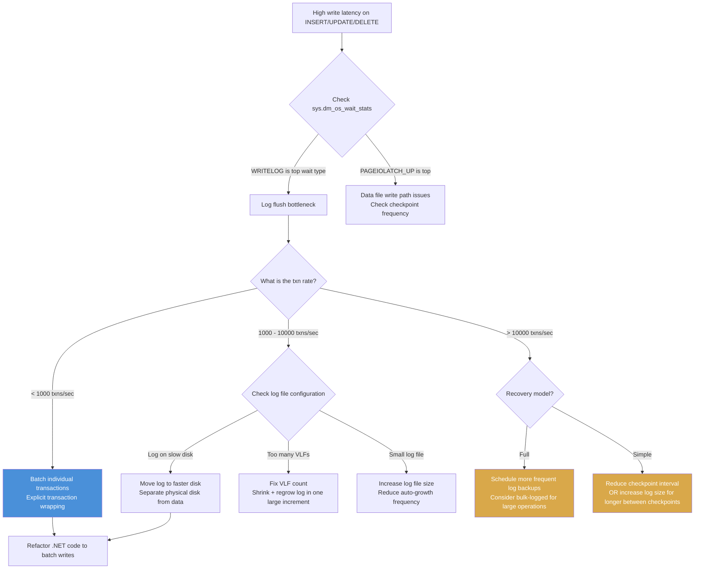

## Navigation

**Domain:** [[8 — Databases]] > **Group:** [[Group 1 — Relational Database Fundamentals]]
**Previous:** [[8.025 Buffer Pool — Page Management]] | **Next:** [[8.027 BASE]]

### Prerequisites
- [[8.005 Transactions and ACID]] — WAL is the physical implementation of the Durability (D) in ACID
- [[8.025 Buffer Pool — Page Management]] — WAL guarantees that log is flushed before dirty pages are written to disk

### Where This Fits

Write-Ahead Logging (WAL) is the protocol that ensures database durability: no committed transaction is lost on crash, and no uncommitted modification appears in the data files. A .NET backend engineer encounters WAL whenever a transaction commits — the 1–5ms log flush latency is often the bottleneck in high-throughput OLTP systems. What breaks when this is unknown: an application that commits each INSERT individually sees 5ms per commit, achieving only 200 inserts/second; the engineer blames SQL Server for being "slow" rather than recognizing the log flush bottleneck and batching transactions. The interview signal is understanding of ACID durability at the storage level — can the candidate explain why a transaction is not durable until the log is flushed, and how log writes differ from data writes?

---

## Core Mental Model

Write-Ahead Logging is the protocol that requires the log record for a page modification to be written to stable storage before the modified page is written to the data file. The invariant: every transaction that commits has its log records on disk before `COMMIT` returns success; during crash recovery, the log is replayed forward (rolled forward committed transactions) and backward (rolled back uncommitted transactions) to restore a consistent state. The database engine writes log records sequentially to the transaction log file (`.ldf`), which is divided into Virtual Log Files (VLFs). The log is written at LSN generation time and must be flushed (fsync) to guarantee durability. The recognition pattern: when a query that inserts rows takes 5ms but the actual INSERT is sub-millisecond, the remaining time is the log flush — visible as `WRITELOG` wait type in `sys.dm_os_wait_stats`.

### Classification

| Aspect | Detail |
|---|---|
| Protocol rule | Log record for a page change must be written to disk BEFORE the data page is written to disk |
| Storage file | Transaction log file (`.ldf`) — separate from data files (`.mdf`, `.ndf`) |
| Log structure | VLFs (Virtual Log Files) — grow sequentially within the `.ldf` |
| Flush trigger | `COMMIT` (explicit or implicit), or checkpoint writing dirty pages |
| Flush cost | 1–5ms per flush (sequential write to disk, fsync wait) |
| Recovery role | Forward roll (committed) + backward roll (uncommitted) + deferred transactions |

```mermaid
flowchart TB
    subgraph Transaction["Transaction Execution"]
        BeginTran["BEGIN TRANSACTION"]
        ModifyPage["Modify data page in buffer pool<br/>Page is now dirty"]
        LogRecord["Write log record to<br/>in-memory log buffer<br/>LSN: 42:10:0"]
        FlushLog["Flush log buffer to disk<br/>WRITELOG wait"]
        Commit["COMMIT<br/>Mark transaction as durable"]
    end
    
    subgraph DiskLayout["On Disk"]
        DataFile["Data File (.mdf)<br/>Clean or dirty pages<br/>(may be behind the log)"]
        LogFile["Transaction Log (.ldf)<br/>VLFs: sequential log records<br/>LSNs: 42:0:0 → 42:100:0 → ..."]
    end
    
    subgraph CheckpointProc["Background Checkpoint"]
        CheckpointStart["Checkpoint starts"]
        WriteDirty["Write oldest dirty pages<br/>from buffer pool to .mdf"]
        UpdateBootPage["Update boot page<br/>with checkpoint LSN"]
    end
    
    BeginTran --> ModifyPage
    ModifyPage --> LogRecord
    LogRecord --> FlushLog
    FlushLog -->|Log flushed to .ldf| Commit
    
    ModifyPage -->|Page remains dirty<br/>in buffer pool| DataFile
    
    CheckpointStart --> WriteDirty
    WriteDirty -->|After data page written| UpdateBootPage
    
    LogFile -.->|Recovery replay| Commit
    LogFile -.->|Recovery rollback| ModifyPage
    
    note_right of FlushLog: WAL invariant:<br/>Log flush happens BEFORE<br/>data page write to .mdf
```

### Key Properties

| Property | Value | Notes |
|---|---|---|
| Log unit | Log record (variable size, typically 50–200 bytes per row modification) |
| Log flush | fsync of log buffer to disk | OLTP bottleneck — sequential write, 1–5ms per flush |
| LSN | Log Sequence Number (VLF:Segment:Slot) | Monotonically increasing, unique per log record |
| VLF count | Recommended: hundreds (auto-grown) | Too few VLFs → VLF contention; Too many → slow recovery |
| Recovery model | Full, Bulk-Logged, Simple | Full: all operations logged; Simple: log truncated at checkpoint |
| Write concurrency | Single-writer at the tail of the log | Only one log flush at a time; contention = `WRITELOG` waits |

---

## Deep Mechanics

### How the Engine Executes This

**WAL protocol — row INSERT (step by step):**

1. **Transaction begin** — the session is assigned a transaction ID (`XSN`). No log record is written yet.
2. **Page modification** — the INSERT adds a row to a page in the buffer pool. The page is marked dirty. No data file write occurs yet.
3. **Log record generation** — before the dirty page can be written to the `.mdf` (which happens later, at checkpoint), the log manager generates a log record describing the INSERT: the LSN, the transaction ID, the page ID, the operation type, and the before/after image (or enough delta to redo/undo). The log record is appended to the in-memory log buffer.
4. **Log buffer flush** — at `COMMIT` (or when the log buffer is full, ~60 KB), the log buffer is flushed to the `.ldf` file. This is an `fsync` or `FlushFileBuffers` system call. The worker thread waits on `WRITELOG` during this flush.
5. **Commit complete** — once the flush returns, the transaction is durable. SQL Server acknowledges the commit to the client. If the server crashes now, the log record exists on disk and will be replayed during recovery.
6. **Later — checkpoint** — the checkpoint process scans the dirty page list in the buffer pool. For each dirty page, it first ensures the page's log records have been flushed (WAL invariant), then writes the page to the `.mdf`. It records the checkpoint LSN in the database boot page.
7. **Later — recovery** — after a crash, SQL Server reads the last checkpoint LSN, scans the log forward redoing all committed transactions, then scans backward undoing all uncommitted transactions.

**Log record structure (conceptual):**

```
LSN: (42:500:0)
TranID: XSN-12345
PageID: (5:1:12345)  -- database_id=5, file_id=1, page_id=12345
Operation: LOP_INSERT_ROWS
Before: (not applicable for insert — undo needs to delete the row)
After: (Row data — redo needs to re-insert)
PrevLSN: (42:499:0)  -- previous log record in the same transaction
```

### SQL Visibility

**Observing transaction log behavior:**

```sql
-- Log space usage
SELECT 
    DB_NAME(database_id) AS DatabaseName,
    total_log_size_in_bytes / 1024 / 1024 AS TotalLogSizeMB,
    used_log_space_in_bytes / 1024 / 1024 AS UsedLogSpaceMB,
    used_log_space_in_percent AS UsedPercent,
    log_reuse_wait_desc AS WhyNotTruncating
FROM sys.dm_db_log_space_usage;

-- Log flush waits (WRITELOG)
SELECT 
    wait_type,
    waiting_tasks_count,
    wait_time_ms,
    max_wait_time_ms,
    signal_wait_time_ms
FROM sys.dm_os_wait_stats
WHERE wait_type = 'WRITELOG'
ORDER BY wait_time_ms DESC;

-- Virtual log files (VLFs) count
DBCC LOGINFO;
-- Shows all VLFs: FileSize, StartOffset, Status (2 = active), FSeqNo
-- Count of rows = VLF count
```

```sql
-- Simulating log flush impact
SET STATISTICS TIME ON;

-- Single-row insert with explicit commit
BEGIN TRANSACTION;
INSERT INTO Orders (CustomerId, OrderDate, TotalAmount)
VALUES (573, SYSDATETIME(), 149.99);
COMMIT TRANSACTION;
-- SQL Server Execution Times: CPU time = 0 ms, elapsed time = 5 ms
-- Most of the 5ms is the log flush (WRITELOG)

-- Batch insert — single log flush for all rows
BEGIN TRANSACTION;
INSERT INTO Orders (CustomerId, OrderDate, TotalAmount) VALUES (573, SYSDATETIME(), 149.99);
INSERT INTO Orders (CustomerId, OrderDate, TotalAmount) VALUES (574, SYSDATETIME(), 299.99);
INSERT INTO Orders (CustomerId, OrderDate, TotalAmount) VALUES (575, SYSDATETIME(), 49.99);
COMMIT TRANSACTION;
-- SQL Server Execution Times: CPU time = 0 ms, elapsed time = 5 ms
-- Same log flush cost for 3 rows as for 1 — 3x throughput at same latency
```

```csharp
// EF Core — explicit transaction batching to reduce log flushes
public async Task<int> BatchInsertOrdersAsync(
    List<Order> orders, CancellationToken cancellationToken)
{
    using var transaction = await _context.Database
        .BeginTransactionAsync(cancellationToken);

    _context.Orders.AddRange(orders);
    var saved = await _context.SaveChangesAsync(cancellationToken);

    await transaction.CommitAsync(cancellationToken);
    // Single log flush for all rows in the batch
    return saved;
}
```

### Execution Plan Analysis

WAL does not appear in execution plans — it is a storage engine concern. However, the plan's operators reveal how many log records will be generated:

```
INSERT INTO Orders (CustomerId, OrderDate, TotalAmount)
VALUES (573, SYSDATETIME(), 149.99);

Plan:
INSERT (Clustered Index Insert: PK_Orders)
  |-- Compute Scalar (define SYSDATETIME(), 149.99)
  |-- Constant Scan (1 row)
```

Each INSERT operator generates one log record per modified index. If the table has one clustered index and three non-clustered indexes, a single INSERT generates 4 log records (one per index modification). Each log record must be flushed to disk at commit time.

### Cost Visibility

```sql
SET STATISTICS IO ON;
SET STATISTICS TIME ON;

-- Single row insert, individual commit
INSERT INTO Orders (CustomerId, OrderDate, TotalAmount)
VALUES (573, SYSDATETIME(), 149.99);

-- Table 'Orders'. Scan count 0, logical reads 3
-- SQL Server Execution Times: CPU time = 0 ms, elapsed time = 5 ms
-- (elapsed time dominated by log flush)

-- 100 single-row inserts in a loop (100 log flushes)
DECLARE @i INT = 0;
WHILE @i < 100
BEGIN
    INSERT INTO Orders (CustomerId, OrderDate, TotalAmount)
    VALUES (@i, SYSDATETIME(), 100.0);
    SET @i = @i + 1;
END;
-- SQL Server Execution Times: CPU time = 3 ms, elapsed time = 502 ms
-- (100 log flushes × 5ms = 500ms)

-- 100 rows in a single batch (1 log flush)
BEGIN TRANSACTION;
DECLARE @i INT = 0;
WHILE @i < 100
BEGIN
    INSERT INTO Orders (CustomerId, OrderDate, TotalAmount)
    VALUES (@i, SYSDATETIME(), 100.0);
    SET @i = @i + 1;
END;
COMMIT TRANSACTION;
-- SQL Server Execution Times: CPU time = 3 ms, elapsed time = 7 ms
-- (1 log flush × 5ms + 2ms CPU)
```

**Improvement:** Batching 100 inserts into one transaction reduces elapsed time from 502ms to 7ms (72x faster) — entirely from reducing log flushes from 100 to 1.

### Failure Modes

**Transaction log full (error 9002):**

```sql
-- When the log file reaches its maximum size (or disk is full):
-- Error 9002: "The transaction log for database 'MyDB' is full."
-- The database is effectively read-only until log space is freed.

-- Detection:
SELECT 
    DB_NAME(database_id) AS DatabaseName,
    total_log_size_in_bytes / 1024 / 1024 AS TotalLogSizeMB,
    used_log_space_in_bytes / 1024 / 1024 AS UsedLogSpaceMB,
    log_reuse_wait_desc AS WhyNotTruncating
FROM sys.dm_db_log_space_usage
WHERE used_log_space_in_percent > 80;
```

**Excessive VLF count (log file grown too many times):**

```sql
-- VLF count > 1000 can slow down recovery, restore, and log operations
DBCC LOGINFO;
-- Count the rows — each row is one VLF

-- Root cause: auto-growth in small increments
-- Auto-growth of 10 MB × 1000 growth events = 10,000 VLFs
-- Fix: shrink and regrow the log in a single large increment
```

**Long-running transaction blocking log truncation:**

```sql
-- A transaction that started hours ago on a full recovery model database
-- prevents the log from being truncated (log_reuse_wait = ACTIVE_TRANSACTION)
-- The log grows unboundedly until the transaction commits or is killed.

SELECT 
    database_id,
    log_reuse_wait_desc,
    session_id,
    transaction_id,
    open_transaction_count
FROM sys.dm_exec_sessions
WHERE open_transaction_count > 0
    AND session_id > 50;
```

---

## Production Patterns and Implementation

### Primary SQL Implementation

**Managing the transaction log file:**

```sql
-- Check current log file size and auto-growth settings
SELECT 
    name AS LogicalName,
    type_desc,
    size / 128 AS CurrentSizeMB,
    max_size / 128 AS MaxSizeMB,
    growth / 128 AS GrowthMB,
    is_percent_growth
FROM sys.database_files
WHERE type_desc = 'LOG';

-- Set recommended log file auto-growth (fixed MB, not percent)
-- For OLTP: 500 MB or 1000 MB growth increments
ALTER DATABASE Current MODIFY FILE (
    NAME = N'Current_Log',
    SIZE = 10240 MB,         -- start with 10 GB
    FILEGROWTH = 512 MB,     -- grow by 512 MB at a time
    MAXSIZE = UNLIMITED
);
```

**Shrinking the log (emergency only — not routine):**

```sql
-- Shrinking the log is a last resort for emergency space recovery.
-- It causes VLF fragmentation and should not be part of routine maintenance.
-- First ensure the log can be truncated:
BACKUP LOG Current TO DISK = 'NUL:';  -- in full recovery model
-- or CHECKPOINT;  -- in simple recovery model

-- Then shrink
DBCC SHRINKFILE (Current_Log, 1000);  -- shrink to 1000 MB target
```

**Transaction log backup (full recovery model):**

```sql
-- Regular log backups are required to truncate the log in full recovery model
-- Recommended frequency: every 5–15 minutes for OLTP
BACKUP LOG Current TO DISK = N'C:\Backups\Current_Log.trn'
WITH COMPRESSION, CHECKSUM;

-- Verify log reuse wait is now "NOTHING" or "LOG_BACKUP"
SELECT log_reuse_wait_desc FROM sys.databases WHERE name = 'Current';
```

### EF Core Implementation

EF Core does not interact with WAL directly but its transaction behavior affects log flush frequency:

```csharp
// Bad: N+1 log flushes due to implicit transactions per SaveChanges
public async Task NPlusOneLogFlushesAsync(IEnumerable<Order> orders,
    CancellationToken cancellationToken)
{
    foreach (var order in orders)
    {
        _context.Orders.Add(order);
        await _context.SaveChangesAsync(cancellationToken);  // implicit COMMIT = log flush each
    }
}

// Good: single log flush for all rows
public async Task SingleLogFlushAsync(IEnumerable<Order> orders,
    CancellationToken cancellationToken)
{
    using var transaction = await _context.Database
        .BeginTransactionAsync(cancellationToken);

    foreach (var order in orders)
    {
        _context.Orders.Add(order);
    }
    await _context.SaveChangesAsync(cancellationToken);  // no commit yet

    await transaction.CommitAsync(cancellationToken);  // single log flush
}

// Best: EF Core 8+ ExecuteUpdate/ExecuteDelete — log efficient
public async Task BulkUpdateAsync(int status, CancellationToken cancellationToken)
{
    // Generates a single UPDATE statement → minimal log records
    await _context.Orders
        .Where(o => o.OrderDate < new DateTime(2024, 1, 1))
        .ExecuteUpdateAsync(setters => setters.SetProperty(o => o.Status, status),
            cancellationToken);
}
```

### Dapper Implementation

```csharp
public interface IOrderWriteRepository
{
    Task BatchInsertAsync(IReadOnlyList<Order> orders, CancellationToken cancellationToken);
}

public sealed class OrderWriteRepository : IOrderWriteRepository
{
    private readonly ISqlConnectionFactory _connectionFactory;

    public OrderWriteRepository(ISqlConnectionFactory connectionFactory)
    {
        _connectionFactory = connectionFactory;
    }

    public async Task BatchInsertAsync(IReadOnlyList<Order> orders,
        CancellationToken cancellationToken)
    {
        await using var connection = _connectionFactory.Create();
        await connection.OpenAsync(cancellationToken);

        using var transaction = connection.BeginTransaction();
        
        const string sql = @"
            INSERT INTO Orders (CustomerId, OrderDate, TotalAmount)
            VALUES (@CustomerId, @OrderDate, @TotalAmount);";

        foreach (var order in orders)
        {
            await connection.ExecuteAsync(
                new CommandDefinition(sql, new
                {
                    order.CustomerId,
                    order.OrderDate,
                    order.TotalAmount
                }, transaction: transaction, cancellationToken: cancellationToken));
        }

        transaction.Commit();  // single log flush for all rows
    }
}

// Faster alternative: SqlBulkCopy (minimally logged)
public async Task BulkInsertWithSqlBulkCopyAsync(
    DataTable ordersTable, CancellationToken cancellationToken)
{
    using var bulkCopy = new SqlBulkCopy(connectionString)
    {
        DestinationTableName = "Orders",
        BatchSize = 10000,
        BulkCopyTimeout = 120
    };

    await bulkCopy.WriteToServerAsync(ordersTable, cancellationToken);
    // Minimal logging when TABLOCK hint is not used with BULK INSERT
    // Best performance: use TABLOCK for minimally logged bulk operations
}
```

### Configuration and Wiring

```csharp
// Program.cs — monitoring log activity via Dapper
builder.Services.AddScoped<ILogMonitor, LogMonitor>();
```

### SQL Server vs PostgreSQL Differences

PostgreSQL uses WAL (write-ahead log) as well, with different terminology and configuration:

```sql
-- PostgreSQL: WAL configuration
-- SHOW wal_level;          -- replica (default), logical, minimal
-- SHOW wal_buffers;        -- 16 MB (default)
-- SHOW wal_writer_delay;   -- 200ms
-- SHOW checkpoint_timeout; -- 5 minutes (default)
-- SHOW min_wal_size;       -- 80 MB
-- SHOW max_wal_size;       -- 1 GB

-- PostgreSQL: WAL generation per transaction
BEGIN;
INSERT INTO orders (customer_id, order_date, total_amount)
VALUES (573, NOW(), 149.99);
COMMIT;
-- The WAL record is flushed on COMMIT (same as SQL Server)
-- wal_sync_method determines the fsync call (fdatasync, fsync, open_sync)
```

Key differences:
- SQL Server calls it the "transaction log" (`.ldf`); PostgreSQL calls it "WAL" (pg_wal directory).
- SQL Server divides the log into VLFs; PostgreSQL divides WAL into 16 MB segments.
- SQL Server log backups truncate the inactive portion; PostgreSQL WAL segments are recycled (not truncated) — the `max_wal_size` controls how many segments are retained.
- SQL Server supports three recovery models (Full, Bulk-Logged, Simple); PostgreSQL has `wal_level` (minimal, replica, logical) controlling how much is logged.
- SQL Server's `WRITELOG` wait is equivalent to PostgreSQL's `WALWriteLock` or `WALSyncMethod` wait events.

---

## Gotchas and Production Pitfalls

### Single-Row Commit Loop (N+1 Log Flushes)

**Pitfall:** Inserting or updating rows one at a time with implicit commits, causing N log flushes for N operations.

```csharp
// ❌ N+1 log flushes
foreach (var order in orders)
{
    await _context.Orders.AddAsync(order, cancellationToken);
    await _context.SaveChangesAsync(cancellationToken);  // implicit commit per row
}
```

**Symptom:** Insert throughput is 200 rows/second regardless of hardware. `sys.dm_os_wait_stats` shows `WRITELOG` as the top wait type with high `wait_time_ms`. CPU is low (waiting on I/O).

**Fix:** Batch writes into explicit transactions:

```csharp
// ✅ Single transaction for all rows
using var transaction = await _context.Database
    .BeginTransactionAsync(cancellationToken);

_context.Orders.AddRange(orders);
await _context.SaveChangesAsync(cancellationToken);
await transaction.CommitAsync(cancellationToken);
```

**Cost of not fixing:** Inserting 10,000 orders with individual commits takes 50 seconds (5ms per commit). Same operation in a single transaction takes 50ms — 1000x faster.

### Log File Too Small with Percent Growth

**Pitfall:** Configuring the log file with a small initial size and percent-based auto-growth.

```sql
-- ❌ Small log with 10% auto-growth
-- Initial size: 10 MB, growth: 10%
-- After 50 growth events: ~1.2 GB with 50+ VLFs
-- After 100 growth events: ~138 GB with 100+ VLFs (very fragmented)
```

**Symptom:** `DBCC LOGINFO` shows thousands of VLFs. Recovery takes minutes instead of seconds. Log file is fragmented across the disk.

**Fix:** Pre-size the log file to the expected peak size and use fixed MB growth:

```sql
-- ✅ Pre-sized log with fixed growth
ALTER DATABASE Current MODIFY FILE (
    NAME = N'Current_Log',
    SIZE = 51200 MB,       -- 50 GB pre-allocated
    FILEGROWTH = 1024 MB,  -- 1 GB increments
    MAXSIZE = UNLIMITED
);
```

**Cost of not fixing:** A database with 10,000 VLFs takes 30+ minutes to restore. Production recovery SLAs are missed.

### Log Truncation Not Happening (Full Recovery Model)

**Pitfall:** Using the full recovery model without regular transaction log backups — the log grows until it fills the disk.

```sql
-- ❌ Log backups not configured
SELECT log_reuse_wait_desc FROM sys.databases WHERE name = 'Current';
-- Result: LOG_BACKUP  (log is waiting for a backup before it can truncate)
```

**Symptom:** The log file grows to hundreds of GB. `sys.dm_db_log_space_usage` shows > 99% used. Eventually, error 9002 halts all write operations.

**Fix:** Schedule regular transaction log backups:

```sql
-- Add a SQL Agent job to run every 5-15 minutes:
BACKUP LOG Current TO DISK = N'\\backup\Current\Log\Current_{0:yyyyMMdd_HHmm}.trn'
WITH COMPRESSION, CHECKSUM, INIT;

-- Verify log truncation is now working:
SELECT log_reuse_wait_desc FROM sys.databases WHERE name = 'Current';
-- Should return: NOTHING
```

**Cost of not fixing:** The production database log file fills a 500 GB disk drive. All transactions fail with error 9002. Application is down until disk space is freed or log is backed up.

### Long-Running Transaction in Full Recovery Model

**Pitfall:** A long-running transaction (e.g., a large DELETE that takes 30 minutes) prevents log truncation for the entire duration.

```sql
-- ❌ Long-running DELETE keeps log active
BEGIN TRANSACTION;
DELETE FROM AuditLog WHERE EventDate < '2020-01-01';  -- 30M rows, 30 minutes
COMMIT;
-- During the entire 30 minutes, the log cannot truncate
```

**Symptom:** The log grows unboundedly during the long-running transaction. Other transactions generate log records that cannot be truncated because the long-running transaction's MIN LSN keeps the entire log active.

**Fix:** Break large operations into batches, each in its own transaction:

```sql
-- ✅ Batch delete with checkpoint between batches
DECLARE @BatchSize INT = 10000, @RowsAffected INT = 1;

WHILE @RowsAffected > 0
BEGIN
    DELETE TOP (@BatchSize) FROM AuditLog
    WHERE EventDate < '2020-01-01';

    SET @RowsAffected = @@ROWCOUNT;
    CHECKPOINT;  -- allows log truncation between batches
END;
```

**Cost of not fixing:** A 30-minute DELETE causes the log to grow by 200 GB. The disk runs out of space. All other operations on the database fail.

### Enabling Snapshot Isolation Without Understanding Log Impact

**Pitfall:** Enabling `READ_COMMITTED_SNAPSHOT` or `ALLOW_SNAPSHOT_ISOLATION` increases version store activity in tempdb, which generates additional log records in tempdb.

```sql
ALTER DATABASE Current SET READ_COMMITTED_SNAPSHOT ON;
-- version store cleanup generates log records in tempdb
```

**Symptom:** Tempdb log grows rapidly. `WRITELOG` waits increase on tempdb, slowing all queries that use temporary objects or versioning.

**Fix:** Monitor tempdb log size and configure tempdb log file with adequate pre-allocation:

```sql
ALTER DATABASE tempdb MODIFY FILE (
    NAME = N'templog',
    SIZE = 10240 MB,       -- 10 GB pre-allocated
    FILEGROWTH = 1024 MB
);
```

**Cost of not fixing:** Tempdb log fills disk space. All queries requiring tempdb (sort, hash join, version store, temp tables) fail with error 9002.

---

## Performance Implications

### Benchmark: Single vs Batch Commit

```sql
-- Setup: 1000 row INSERT
-- Test 1: 1000 individual commits
DECLARE @i INT = 0;
WHILE @i < 1000
BEGIN
    INSERT INTO Orders (CustomerId, OrderDate, TotalAmount)
    VALUES (@i, SYSDATETIME(), 100.0);
    SET @i = @i + 1;
END;
-- Time: ~5000ms (1000 × 5ms log flushes)

-- Test 2: 1000 rows, single transaction
BEGIN TRANSACTION;
DECLARE @i INT = 0;
WHILE @i < 1000
BEGIN
    INSERT INTO Orders (CustomerId, OrderDate, TotalAmount)
    VALUES (@i, SYSDATETIME(), 100.0);
    SET @i = @i + 1;
END;
COMMIT TRANSACTION;
-- Time: ~50ms (1 × 5ms log flush + CPU)
```

**Improvement:** 100x throughput (1000 rows in 50ms vs 5000ms) by reducing log flushes from 1000 to 1.

### BenchmarkDotNet

```csharp
[MemoryDiagnoser]
[SimpleJob(RuntimeMoniker.Net90)]
public class LogFlushBenchmark
{
    private IDbConnection _connection = default!;

    [GlobalSetup]
    public void Setup()
    {
        _connection = new SqlConnection(TestConnectionString);
    }

    [Benchmark(Baseline = true)]
    public async Task SingleRowCommit()
    {
        const string sql = "INSERT INTO Orders (CustomerId, OrderDate, TotalAmount) VALUES (@Id, SYSDATETIME(), 100.0);";
        await using var connection = _connection;
        for (int i = 0; i < 100; i++)
        {
            await connection.ExecuteAsync(
                new CommandDefinition(sql, new { Id = i },
                    cancellationToken: CancellationToken.None));
        }
    }

    [Benchmark]
    public async Task BatchCommit()
    {
        await using var connection = _connection;
        await connection.OpenAsync(CancellationToken.None);
        using var transaction = connection.BeginTransaction();

        const string sql = "INSERT INTO Orders (CustomerId, OrderDate, TotalAmount) VALUES (@Id, SYSDATETIME(), 100.0);";
        for (int i = 0; i < 100; i++)
        {
            await connection.ExecuteAsync(
                new CommandDefinition(sql, new { Id = i },
                    transaction: transaction,
                    cancellationToken: CancellationToken.None));
        }

        transaction.Commit();
    }

    [Benchmark]
    public async Task BulkCopy()
    {
        var table = new DataTable();
        table.Columns.Add("CustomerId", typeof(int));
        table.Columns.Add("OrderDate", typeof(DateTime));
        table.Columns.Add("TotalAmount", typeof(decimal));

        for (int i = 0; i < 100; i++)
        {
            table.Rows.Add(i, DateTime.UtcNow, 100.0m);
        }

        using var bulkCopy = new SqlBulkCopy(TestConnectionString);
        bulkCopy.DestinationTableName = "Orders";
        bulkCopy.BatchSize = 100;
        await bulkCopy.WriteToServerAsync(table);
    }
}
```

**Expected results (approximate, SQL Server 2022, NVMe, 100 rows):**

| Method | Mean | Log Flushes | Allocated |
|---|---|---|---|
| SingleRowCommit | ~500 ms | 100 | 8 KB |
| BatchCommit | ~7 ms | 1 | 1 KB |
| BulkCopy | ~4 ms | 1 (minimal logging) | 2 KB |

### Write Amplification

| Operation | Log Records | Log Size | Flush |
|---|---|---|---|
| INSERT 1 row (1 clustered index) | 1 | ~100 bytes | On COMMIT |
| INSERT 1 row (1 CI + 5 NCI) | 6 | ~600 bytes | On COMMIT |
| INSERT 100 rows (batch) | 100 | ~10 KB | On COMMIT (same flush) |
| UPDATE 1 row (non-key column) | 2 (old + new) | ~200 bytes | On COMMIT |
| DELETE 1M rows (batched) | 1M | ~100 MB | Per batch COMMIT |
| BULK INSERT (TABLOCK, minimal logging) | ~0 (minimal) | ~0 | At end + checkpoint |

---

## Interview Arsenal

### Question Bank

1. What is Write-Ahead Logging, and what ACID property does it guarantee?
2. What is an LSN (Log Sequence Number) and how is it structured?
3. What is the WRITELOG wait type, and what causes it?
4. What happens when the transaction log fills up (error 9002), and how do you prevent it?
5. Compare transaction logging between individual COMMITs and batched COMMITs.
6. How does the checkpoint process interact with the transaction log?
7. At what transaction rate does log flush latency become the bottleneck?
8. How does EF Core's SaveChanges interact with the transaction log?
9. What is the relationship between the recovery model and log truncation?
10. Explain SQL Server's crash recovery process using WAL in 60 seconds.

### Spoken Answers

**Q1: What is Write-Ahead Logging and what ACID property does it guarantee?**

> **Average answer:** WAL makes sure the log is written before the data. It guarantees durability.

> **Great answer:** Write-Ahead Logging is the protocol that ensures database durability — the D in ACID. The invariant is: a log record describing a page modification must be written to stable storage (the `.ldf` file) BEFORE the modified data page is written to the data file (`.mdf`). This means that when a transaction commits, the log records are on disk; even if the server crashes immediately after, the transaction can be recovered by replaying the log. The WAL protocol has three rules: (1) each modification generates a log record in the in-memory log buffer before the page in the buffer pool is dirtied, (2) the log buffer is flushed to disk on every COMMIT, and (3) checkpoint cannot write a dirty page to the `.mdf` unless that page's log records have already been flushed. From a .NET perspective, WAL is why a single-row INSERT takes 5ms even though the actual insert is sub-millisecond — the log flush latency dominates. The WAL protocol is the reason all ACID-compliant databases (SQL Server, PostgreSQL, Oracle) use a transaction log. Without WAL, a crash between writing the data page and updating the log would lose transactions or leave partial modifications.

**Q5: Compare transaction logging between individual COMMITs and batched COMMITs.**

> **Average answer:** Batched commits are faster because they combine multiple operations into one log flush.

> **Great answer:** Every COMMIT generates a log buffer flush — an `fsync` or `FlushFileBuffers` call that waits for the storage subsystem to confirm the data is on stable media. A single flush typically takes 1–5ms depending on the storage latency. With individual COMMITs, each row INSERT writes a log record and flushes it separately — 1000 rows = 1000 log flushes = ~5 seconds of pure log wait time. With a batched COMMIT (all 1000 inserts in one transaction), there is one log record per modification but only ONE flush at the final COMMIT — ~5ms total log wait. The log records themselves are different: individual COMMITs record each INSERT as a separate log record with its own commit LSN; batched COMMITs record the same INSERT log records but with a single commit LSN at the end. The recovery behavior differs too — if the server crashes after flushing the batch COMMIT, all 1000 inserts are recovered together (atomic); if it crashes before, none are recovered (also atomic). From a .NET perspective, `SaveChangesAsync()` without an explicit transaction does an implicit COMMIT; wrapping multiple SaveChanges in a `BeginTransaction`/`Commit` reduces flushes from N to 1. The most extreme optimization is minimally logged bulk operations (BULK INSERT with TABLOCK), which reduce log generation to extent-level allocations rather than row-level inserts.

**Q10: Explain SQL Server's crash recovery process using WAL in 60 seconds.**

> **Great answer:** After a crash, SQL Server runs three-phase recovery. First, **Analysis** — it reads the boot page to find the last checkpoint LSN, then scans forward through the log from that point to find all transactions that were active (uncommitted) at the time of the crash. Second, **Redo (roll forward)** — starting from the last checkpoint LSN, SQL Server scans every log record and reapplies every modification for transactions that had committed before the crash. The redo is idempotent: replaying the same log record twice is safe because the page LSN is compared. Third, **Undo (roll back)** — the transactions that were active at crash time are rolled back by applying the inverse of each log record. After undo completes, the database is in a consistent state: all committed transactions are reflected, all uncommitted transactions are not. The duration of recovery depends on how far the last checkpoint is from the end of the log — this is why frequent checkpoints limit recovery time. The `target recovery time` (default 60 seconds) controls how aggressively checkpoint writes dirty pages to keep redo distance short. From an operational perspective, a database with thousands of VLFs takes longer in the analysis phase because it must scan more VLF headers. This is why log file management matters — fewer, properly-sized VLFs mean faster crash recovery.

### Interview Trigger

If this topic appears, the trigger question is "what is the transaction log and why does it exist?" or "why is my INSERT taking 5ms?" The follow-up that separates candidates: "If you have 50,000 inserts per second, each taking 5ms due to log flush, how do you scale?" Senior candidates discuss batching, SqlBulkCopy, minimal logging, partitioning, and the physical log file configuration (separate disk, VLF count, recovery model).

### Comparison Table

| | SQL Server Transaction Log | PostgreSQL WAL |
|---|---|---|
| File | `.ldf` file (VLFs within) | `pg_wal` directory (16 MB segments) |
| LSN format | VLF:Segment:Slot (e.g., 42:500:0) | LSN (log sequence number, 64-bit integer) |
| Flush trigger | COMMIT, CHECKPOINT, log buffer full (60 KB) | COMMIT, WAL writer (wal_writer_delay 200ms) |
| Recovery model | Full, Bulk-Logged, Simple | Controlled by `wal_level` (minimal, replica, logical) |
| Log backup | `BACKUP LOG` to truncate inactive VLFs | `pg_archive_mode` + archive_command to archive WAL segments |
| VLF/WAL management | Fixed-size VLFs from auto-growth | 16 MB segments; recycled via checkpoint |
| Wait indicator | `WRITELOG` | `WALWriteLock`, `WALSyncMethod` |

---

## Decision Framework

### When to Tune Log Behavior



### Application Checklist

- [ ] Write operations use explicit transactions for batches (not per-row commit)
- [ ] Log file is on a separate physical disk from data files (latency isolation)
- [ ] Log file is pre-allocated to the expected peak size (not growing frequently)
- [ ] VLF count is in the hundreds, not thousands (checked via DBCC LOGINFO)
- [ ] Regular transaction log backups are configured for full recovery model (every 5–15 minutes)
- [ ] Long-running batch operations are broken into smaller units (each with CHECKPOINT)
- [ ] `WRITELOG` is not the top wait type on the server

### Tradeoff Summary

| What You Gain | What You Pay |
|---|---|
| Batching: 100x insert throughput at same log flush cost | Longer transaction duration (holds locks longer) |
| Pre-allocated log: fewer VLFs, faster recovery | Pre-allocation takes disk space up front |
| Minimal logging (BULK INSERT + TABLOCK): 10x log reduction | Only available for Bulk-Logged model; table-level lock |
| Async commit (DELAYED_DURABILITY): eliminates flush wait | Risk of losing last 1–2 seconds of transactions on crash |

### Scale Thresholds

- "Single log flush latency is typically 1–5ms on modern NVMe storage (10–50ms on spinning disks with battery-backed cache)."
- "WRITELOG becomes the bottleneck when transaction rate exceeds ~200 txns/sec per log disk spindle (NVMe: ~5000 txns/sec)."
- "Log file should be pre-allocated to approximately 4x the transaction log backup interval's log generation. If 10 minutes of log = 5 GB, pre-allocate 20 GB."
- "Recovery time proportional to log distance from checkpoint. Target recovery time of 60 seconds means checkpoint writes enough dirty pages to keep redo under 60 seconds."

---

## Self-Check

### Conceptual Questions

1. What is the fundamental rule of Write-Ahead Logging?
2. What is an LSN, and what three components make it up?
3. What DMV or command shows the number of VLFs in the transaction log?
4. What causes a transaction log to grow uncontrollably in the full recovery model?
5. How does EF Core's SaveChanges interact with the transaction log?
6. How would you use Dapper to batch 1000 inserts with a single log flush?
7. Compare full recovery model with simple recovery model from a logging perspective.
8. At approximately what transaction rate does log flush latency become a bottleneck on NVMe storage?
9. What is the relationship between checkpoint frequency and log size?
10. Explain the three phases of crash recovery in 60 seconds.

<details>
<summary>Answers</summary>

1. The fundamental WAL rule: a log record describing a page modification must be written to stable storage (the `.ldf` file) BEFORE the modified page is written to the data file (`.mdf`). This ensures that in a crash, the log has enough information to redo committed transactions and undo uncommitted ones.

2. LSN stands for Log Sequence Number. It is structured as `VLF:Segment:Slot` — the VLF number, the segment offset within the VLF, and the slot number within the segment. LSNs are monotonically increasing. Example: `(42:500:7)` means VLF 42, segment offset 500, slot 7. Each log record has a unique LSN.

3. `DBCC LOGINFO` returns one row per VLF with columns `FileSize`, `StartOffset`, `Status` (2 = active VLF), and `FSeqNo` (first LSN of the VLF). The row count is the VLF count. Alternatively, `sys.dm_db_log_info` (SQL Server 2016+) provides VLF information in a table format.

4. In the full recovery model, the transaction log cannot be truncated until the active portion is backed up. If log backups are not performed (or are too infrequent), the log grows indefinitely. Other causes: a long-running transaction prevents truncation (ACTIVE_TRANSACTION), or replication/mirroring/CDC has not consumed the log (REPLICATION, AVAILABILITY_REPLICA, LOG_SCAN).

5. EF Core's `SaveChangesAsync()` without an explicit transaction performs an implicit BEGIN TRANSACTION / COMMIT for each call. Each call generates a log flush. Batching multiple changes within an explicit transaction (`BeginTransactionAsync` + `CommitAsync`) reduces log flushes from N to 1. EF Core's `ExecuteUpdateAsync` and `ExecuteDeleteAsync` generate set-based SQL that produces fewer log records than row-by-row operations.

6. Open a `SqlConnection`, call `BeginTransaction()`, loop through the inserts executing each as a `CommandDefinition` with the `transaction` parameter, then call `transaction.Commit()`. The single `Commit()` triggers a single log flush for all 1000 inserts. See the Dapper Implementation section for the full code.

7. Full recovery model logs every row modification (including index rebuilds, bulk operations) — every operation is recoverable to a point in time. Simple recovery model logs only checkpoints (truncates log at checkpoint) — can only recover to the last full/differential backup. Full model requires regular log backups to truncate the log; simple model does not. Full model log grows faster (more data logged) and requires more management.

8. On typical NVMe storage, log flush latency is ~1ms. This becomes the bottleneck at ~1000 transactions/second (1ms per flush = 1000 flushes/second max per log disk). With batched transactions (100 rows per commit), the throughput increases to ~100,000 rows/second. On battery-backed RAID controllers (write-back cache), flush latency can be ~0.1ms, pushing the bottleneck to ~10,000 transactions/second.

9. More frequent checkpoints write dirty pages to disk sooner, reducing the redo distance (log from checkpoint LSN to end of log). This reduces recovery time but increases I/O (checkpoint writes). Less frequent checkpoints mean the log must retain more active space (cannot truncate as far), increasing log size. The `target recovery time` (default: 60 seconds) balances this: checkpoint writes fast enough to keep recovery under 60 seconds.

10. [60-second spoken answer]: After a crash, SQL Server recovery runs three phases. First, **Analysis** reads the boot page for the last checkpoint LSN, scans the log from that point forward to find all active transactions at crash time — these must be undone. Second, **Redo** scans from the checkpoint LSN to the end of the log, reapplying every log record for transactions that committed before the crash. Redo is idempotent: re-applying a log record that already wrote the page is safe because SQL Server checks the page LSN. Third, **Undo** rolls back each active transaction by walking its log chain backward and applying the inverse of each operation. After undo, the database is consistent — every committed transaction is present, every uncommitted transaction is removed. The total recovery time depends on how much log must be scanned (distance from last checkpoint to end of log). A well-maintained log with reasonable VLF count and frequent checkpoints recovers in seconds.

</details>

---

### Query Challenges

**Challenge 1 — Write the SQL**

Write a query that checks the transaction log space usage for the current database. Show: total log size in MB, used log space in MB, used percentage, and the reason the log cannot be truncated (if any).

<details>
<summary>Solution</summary>

```sql
SELECT 
    DB_NAME(database_id) AS DatabaseName,
    total_log_size_in_bytes / 1024 / 1024 AS TotalLogSizeMB,
    used_log_space_in_bytes / 1024 / 1024 AS UsedLogSpaceMB,
    used_log_space_in_percent AS UsedPercent,
    log_reuse_wait_desc AS LogTruncationWaitReason
FROM sys.dm_db_log_space_usage;

-- Also show VLFs for context:
SELECT COUNT(*) AS VLFCount FROM sys.dm_db_log_info(DB_ID());
```

**Execution plan:** Internal scan of log file metadata — negligible cost.  
**Typical output for a healthy database:** TotalLogSizeMB = 10240, UsedLogSpaceMB = 2048, UsedPercent = 20, LogTruncationWaitReason = NOTHING

</details>

---

**Challenge 2 — Fix the performance problem**

```sql
-- An ETL process inserts 50,000 rows into Orders every 5 minutes using this pattern.
-- Each row is inserted individually with its own implicit commit.
-- The process takes 4 minutes to complete (50,000 × 5ms log flush = 250 seconds).
-- System waits: WRITELOG is #1 with 90% of total wait time.

-- Fix the ETL process.
```

<details>
<summary>Solution</summary>

**Root cause:** 50,000 individual log flushes. Each INSERT commits individually, generating one log flush per row. At 5ms per flush, 50,000 flushes = 250 seconds. Only ~3 seconds of that is actual INSERT CPU.

**Fix: Batch all 50,000 rows into a single transaction:**

```sql
-- Rewrite the ETL to use a single transaction
BEGIN TRANSACTION;

DECLARE @i INT = 0;
WHILE @i < 50000
BEGIN
    INSERT INTO Orders (CustomerId, OrderDate, TotalAmount)
    VALUES (@i, SYSDATETIME(), 100.0);
    SET @i = @i + 1;
END;

COMMIT TRANSACTION;
-- Single log flush: 5ms. Total time: ~300ms (from 250 seconds)

-- Even better: use set-based INSERT or BULK INSERT
INSERT INTO Orders (CustomerId, OrderDate, TotalAmount)
SELECT CustomerId, SYSDATETIME(), Amount
FROM StagingOrders;
-- Single log flush, set-based operation
```

**In .NET:**

```csharp
// Before: 250 seconds
foreach (var order in orders)
{
    await context.Orders.AddAsync(order, cancellationToken);
    await context.SaveChangesAsync(cancellationToken);
}

// After: ~300ms
using var transaction = await context.Database
    .BeginTransactionAsync(cancellationToken);
context.Orders.AddRange(orders);
await context.SaveChangesAsync(cancellationToken);
await transaction.CommitAsync(cancellationToken);
```

**Improvement:** From ~250 seconds to ~0.3 seconds (833x faster). All from reducing log flushes from 50,000 to 1.

</details>

---

**Challenge 3 — Explain the execution plan**

An ETL process runs this query every hour:

```sql
DELETE FROM AuditLog WHERE EventDate < DATEADD(YEAR, -1, GETDATE());
```

The first month it runs in 5 seconds. After 6 months, it runs in 8 minutes. The table has 500M rows. The execution plan shows a Clustered Index Scan followed by a Delete operator — same plan as always. What changed, and what does this have to do with WAL?

<details>
<summary>Solution</summary>

**What changed:** The number of rows deleted increased as the table grew. The first month: 10M rows deleted (5 seconds). After 6 months: 100M+ rows deleted (8 minutes). The DELETE runs in a single implicit transaction, generating one log record per row deleted. 100M log records → 100M log buffer writes → one large log flush at the implicit COMMIT.

**WAL relationship:** The DELETE generates 100M log records. Each log record contains the before-image of the row (complete row data for the deleted row). With average row width of 200 bytes, that is 20 GB of log records. The log flush at COMMIT must ensure all 20 GB is on disk. Additionally, the log cannot truncate during the entire DELETE operation (the long-running transaction keeps MIN LSN active), so the log grows by 20 GB.

**Fix:** Batch the DELETE in smaller chunks with checkpoint between batches:

```sql
DECLARE @BatchSize INT = 10000, @Rows INT = 1;

WHILE @Rows > 0
BEGIN
    DELETE TOP (@BatchSize) FROM AuditLog
    WHERE EventDate < DATEADD(YEAR, -1, GETDATE());
    
    SET @Rows = @@ROWCOUNT;
    CHECKPOINT;  -- allows log truncation between batches
END;
```

**Expected improvement:** From 8 minutes (single massive transaction) to ~30 seconds (batched with log truncation between). Log growth is capped at one batch's worth of log records (~2 MB instead of 20 GB).

</details>

---

**Challenge 4 — Diagnose the concurrency problem**

A production server with 50,000 transactions/second on the Orders table shows `WRITELOG` waits of 45,000ms/second. The transaction log is on the same SSD volume as the data files. Max log file size is 50 GB. The log reuse wait is `NOTHING` (log backups run every minute). What is the root cause and how do you fix it?

<details>
<summary>Solution</summary>

**Root cause:** The log file is on the same physical disk as the data files. At 50,000 txns/sec, the log generates 50,000 log flushes per second. Each flush is a sequential write to the log file. But data file reads and writes (checkpoint writes, index maintenance) compete for the same disk I/O bandwidth. The log flush cannot complete until the disk finishes the current data file I/O. This is a disk contention problem — the log is competing with data file I/O.

**Detection:**

```sql
SELECT 
    LEFT(mf.physical_name, 1) AS Drive,
    SUM(vfs.num_of_writes) AS LogWrites,
    SUM(vfs.io_stall_write_ms) AS WriteStallMs
FROM sys.dm_io_virtual_file_stats(NULL, NULL) vfs
JOIN sys.master_files mf ON vfs.database_id = mf.database_id AND vfs.file_id = mf.file_id
WHERE mf.type_desc = 'LOG'
GROUP BY LEFT(mf.physical_name, 1);
```

**Fix:**
1. Move the transaction log to a separate physical disk (or a high-endurance NVMe drive dedicated to log writes)
2. If separate disk is not possible, reduce log flush frequency by batching more rows per transaction
3. Enable `DELAYED_DURABILITY` (ALTER DATABASE ... SET DELAYED_DURABILITY = ALLOWED) to make log flush asynchronous (risk: lose up to 1 second of transactions on crash)

```sql
-- Move log to separate disk
ALTER DATABASE Current MODIFY FILE (
    NAME = N'Current_Log',
    FILENAME = N'F:\SQLData\Current_Log.ldf'  -- F: is a dedicated SSD
);

-- Enable delayed durability at the database level
ALTER DATABASE Current SET DELAYED_DURABILITY = ALLOWED;
-- Then use it per transaction: COMMIT WITH (DELAYED_DURABILITY = ON)
```

**Expected improvement:** Moving log to separate disk reduces WRITELOG wait from 45,000ms/sec to < 1,000ms/sec. Log flushes complete in < 1ms instead of competing with data I/O.

</details>

---

**Challenge 5 — Design the log management strategy**

**Scenario:** A 24/7 e-commerce platform uses SQL Server with the full recovery model. The transaction log grows by 10 GB per day. The SLA requires point-in-time recovery (PITR) to any point within the last 24 hours, with a maximum data loss of 5 minutes. The backup disk has 500 GB free space. Log backups must not impact production query performance.

Design the transaction log backup schedule, log file size, and recovery procedures. Address VLF management.

<details>
<summary>Solution</summary>

```sql
-- 1. Log file pre-allocation
-- 10 GB/day ÷ 1440 minutes = ~7 MB/min of log generation
-- For safety: pre-allocate to 4x the daily growth = 40 GB
ALTER DATABASE Current MODIFY FILE (
    NAME = N'Current_Log',
    SIZE = 40960 MB,       -- 40 GB
    FILEGROWTH = 1024 MB,  -- 1 GB growth increments
    MAXSIZE = UNLIMITED
);

-- 2. Log backup frequency: every 5 minutes (max data loss = 5 min)
-- Schedule a SQL Agent job:
-- BACKUP LOG Current TO DISK = N'X:\LogBackups\Current_{yyyyMMdd_HHmm}.trn'
-- WITH COMPRESSION, CHECKSUM, FORMAT;

-- 3. Log backup retention: 48 hours of transaction log backups
-- 288 backups/day × 2 days = 576 backup files
-- Each backup: ~5 minutes × 7 MB/min = ~35 MB (compressed: ~5 MB)
-- Total storage for 48 hours: ~3 GB (well within 500 GB limit)
```

**VLF management:**
- Pre-allocate 40 GB to minimize growth events (prevents VLF fragmentation)
- Monitor VLF count monthly: `SELECT COUNT(*) FROM sys.dm_db_log_info(DB_ID())`
- If VLF count exceeds 1000, rebuild the log: shrink to minimal size, then regrow to 40 GB in one operation

**Backup impact mitigation:**
- Compress log backups (`WITH COMPRESSION`) to reduce I/O
- Write backups to a separate disk from both data and log files
- Use `CHECKSUM` to verify backup integrity
- Monitor backup duration: `sys.dm_exec_requests` for the backup command

**Point-in-time recovery procedure:**

```sql
-- Restore to '2026-06-19 14:35:00' (5 minutes before a reported data issue)
RESTORE DATABASE Current FROM DISK = N'X:\FullBackups\Current_FULL.bak'
WITH NORECOVERY, REPLACE;

RESTORE LOG Current FROM DISK = N'X:\LogBackups\Current_20260619_1400.trn'
WITH NORECOVERY, STOPAT = '2026-06-19 14:35:00';
-- ... continue restoring log backups in order

RESTORE DATABASE Current WITH RECOVERY, STOPAT = '2026-06-19 14:35:00';
```

**What NOT to do:**
- Do not shrink the log as part of routine maintenance (causes VLF fragmentation)
- Do not rely on `AUTO_SHRINK` (causes VLF fragmentation and blocking)
- Do not set the log initial size too small (forces growth events under load)

</details>
