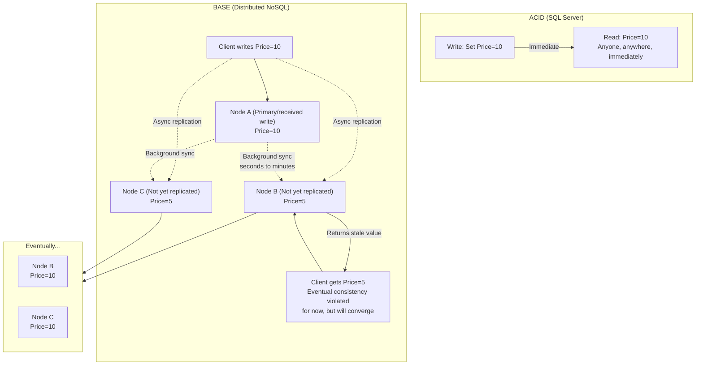

## Navigation

**Domain:** [[8 — Databases]] > **Group:** [[Group 1 — Relational Database Fundamentals]]
**Previous:** [[8.026 Write-Ahead Logging — Durability Mechanism]] | **Next:** [[8.028 Domain Integrity]]

### Prerequisites
- [[8.005 Transactions and ACID]] — BASE is the alternative to ACID for distributed NoSQL systems; understanding ACID is required to contrast it
- [[8.017 OLTP vs OLAP — Different Optimization Targets]] — BASE trades consistency for availability and partition tolerance

### Where This Fits

BASE (Basically Available, Soft State, Eventual Consistency) is a set of design principles for distributed databases that prioritize availability over strong consistency. A .NET backend engineer encounters BASE when using Cosmos DB, Redis Cluster, Cassandra, or DynamoDB — systems that return stale reads under partition but remain available. What breaks when this is unknown: an engineer treats a BASE database like SQL Server — reading after a write and expecting the read to return the write — causing session state inconsistency or race conditions. The interview signal is architectural maturity — does the candidate know when to choose BASE over ACID, and can they design compensating transactions for eventual consistency?

---

## Core Mental Model

BASE is a set of three properties for distributed systems that relax the strong consistency guarantees of ACID to achieve higher availability and partition tolerance. **Basically Available** means the system always accepts reads and writes even during node failures or network partitions — it may return stale data but does not reject the request. **Soft State** means the database state can change without explicit input, as replicas converge asynchronously. **Eventual Consistency** means that if writes stop, all replicas will converge to the same state over time — there is no fixed bound but the system guarantees convergence. The invariant: there is no single point-in-time snapshot across the entire system — every read is a read from a specific replica, and replicas may diverge until background synchronization converges them. The recognition pattern: when a system must remain available during a network partition (e.g., a global shopping cart across regions), or when write throughput exceeds what a single-node ACID database can provide.

### Classification

| Aspect | ACID | BASE |
|---|---|---|
| Consistency model | Strong — all nodes see the same state at the same snapshot | Eventual — replicas converge asynchronously over time |
| Availability during partition | May reject writes to maintain consistency (CP) | Accepts reads and writes even during partition (AP) |
| Transaction scope | Single node or distributed coordinator (2PC) | No cross-partition transactions (or best-effort) |
| Write throughput | Limited by coordinator and log flush | Scales horizontally with partitions |
| Complexity | High at scale (sharding, distributed transactions) | Compensating logic in application layer |
| Typical databases | SQL Server, PostgreSQL, Oracle | Cosmos DB, DynamoDB, Cassandra, Riak |



### Key Properties

| Property | ACID | BASE |
|---|---|---|
| Read your write | Guaranteed (session-level) | Not guaranteed (eventually consistent) |
| Monotonic read | Guaranteed | Not guaranteed without read-repair |
| Write availability | May reject writes during partition | Accepts writes always (last-writer-wins) |
| Latency | Variable (depends on coordinator + replication) | Predictable (local write, async replication) |
| Conflict resolution | No conflicts (serializable transactions) | Last-write-wins (LWW) or application-level CRDTs |
| .NET driver | SqlClient (System.Data.SqlClient) | Cosmos SDK, StackExchange.Redis, Dynamo SDK |

---

## Deep Mechanics

### How the Engine Executes This

BASE systems implement the three properties through specific distributed algorithms:

**Basically Available:**
1. Every node in the cluster accepts reads and writes independently — there is no single coordinator that can reject requests.
2. If a node fails, the system routes requests to the remaining nodes. The data on the failed node is temporarily unavailable but the system as a whole does not reject requests.
3. During a network partition, each partition side continues operating independently (both sides accept writes). This is the "AP" side of the CAP theorem.

**Soft State:**
1. The database state can change without external input. For example, a TTL-based expiry removes stale session data; a gossip protocol updates node metadata; a hinted handoff re-routes writes.
2. There is no fixed invariant that must hold at all times — the system accepts transient inconsistencies.

**Eventual Consistency:**
1. After a write, the system asynchronously propagates the update to all replicas.
2. If no new writes occur, all replicas eventually converge to identical state.
3. The convergence time depends on: replication latency (network), conflict resolution strategy (LWW, CRDT), and repair mechanisms (read-repair, anti-entropy gossip).
4. **Read-repair**: when a read finds a stale replica, it updates it before returning the latest value (common in Cassandra, DynamoDB).
5. **Hinted handoff**: if a write target is down, another node accepts the write and forwards it when the target recovers (common in Cassandra, Riak).

### SQL Visibility

BASE is not a SQL concept — it is a distributed systems property. However, many distributed databases provide SQL-like query interfaces. Examples:

```sql
-- Cosmos DB (SQL API) — strongly consistent vs eventual consistency
-- Consistency level is set at the request level, not in the SQL

-- Strong consistency read:
SELECT * FROM Orders o WHERE o.id = 'order-10042'
-- Consistency: Strong (via request header or default)

-- Eventual consistency read:
SELECT * FROM Orders o WHERE o.id = 'order-10042'
-- Consistency: Eventual (returns from nearest replica, may be stale)
```

```csharp
// Cosmos DB SDK (.NET) — configuring consistency
public class CosmosRepository
{
    private readonly Container _container;

    public CosmosRepository(CosmosClient client)
    {
        // Container-level consistency (overrides database default)
        _container = client.GetContainer("OrdersDb", "Orders");
    }

    // Eventual consistency read (fast, may be stale)
    public async Task<Order?> GetOrderEventuallyAsync(
        string orderId, CancellationToken cancellationToken)
    {
        var response = await _container.ReadItemAsync<Order>(
            orderId,
            new PartitionKey(orderId),
            new ItemRequestOptions
            {
                ConsistencyLevel = ConsistencyLevel.Eventual
            },
            cancellationToken);
        return response.Resource;
    }

    // Strong consistency read (slower, always latest)
    public async Task<Order?> GetOrderStronglyAsync(
        string orderId, CancellationToken cancellationToken)
    {
        var response = await _container.ReadItemAsync<Order>(
            orderId,
            new PartitionKey(orderId),
            new ItemRequestOptions
            {
                ConsistencyLevel = ConsistencyLevel.Strong
            },
            cancellationToken);
        return response.Resource;
    }
}
```

```csharp
// StackExchange.Redis (Redis Cluster) — eventual consistency in cluster mode
// Redis Cluster uses asynchronous replication between primary and replicas
public class RedisCache
{
    private readonly IDatabase _cache;

    public async Task<string?> GetAsync(string key)
    {
        // Read from any replica — may return stale data in cluster mode
        // If strong consistency is needed, force read from primary:
        // var primary = _cache.Multiplexer.GetDatabase();
        return await _cache.StringGetAsync(key);
    }

    public async Task SetAsync(string key, string value)
    {
        // Write acknowledged immediately on primary
        // Replication to replicas is asynchronous
        await _cache.StringSetAsync(key, value, flags: CommandFlags.None);
    }
}
```

### Execution Plan Analysis

BASE systems do not produce execution plans in the SQL Server sense. Instead, they expose query performance metrics via request units (Cosmos DB), partition throughput (DynamoDB), or latency percentiles (Redis).

**Cosmos DB request unit (RU) cost:**

```
SELECT * FROM Orders o WHERE o.id = 'order-10042'
-- RU cost: ~1 (point read, eventual consistency)
-- RU cost: ~2 (point read, strong consistency)
-- RU cost: ~2.5 (point read, bounded staleness)
```

**DynamoDB read capacity:**

```
GetItem(Table: Orders, Key: { id: "order-10042" })
-- Eventually consistent read: 0.5 RCU (if item < 4 KB)
-- Strongly consistent read: 1 RCU (if item < 4 KB)
```

### Cost Visibility

BASE systems trade cost differently from SQL Server:

```sql
-- SQL Server: cost = logical reads (pages) + CPU + log flush
-- BASE (Cosmos DB): cost = Request Units (RU)
--   RU includes: CPU, memory, and I/O cost for the operation
--   A point read (eventual) costs ~1 RU
--   A point read (strong) costs ~2 RU
--   A cross-partition query costs ~N × single-partition cost

-- BASE (DynamoDB): cost = read/write capacity units consumed
--   Eventually consistent read of 4 KB item: 0.5 RCU
--   Strongly consistent read of 4 KB item: 1 RCU
--   1 KB write: 1 WCU
```

### Failure Modes

**Stale read after write (read-your-write violation):**

```csharp
// BASE scenario: user updates their profile in a distributed system
await profileCollection.ReplaceItemAsync(
    "profile-42", updatedProfile, new PartitionKey("profile-42"),
    requestOptions: new ItemRequestOptions { ConsistencyLevel = ConsistencyLevel.Eventual });

// Immediately read from a different replica:
var profile = await profileCollection.ReadItemAsync<Profile>(
    "profile-42", new PartitionKey("profile-42"),
    requestOptions: new ItemRequestOptions { ConsistencyLevel = ConsistencyLevel.Eventual });
// Profile may be the OLD version — the write has not propagated yet
```

**Conflict: concurrent writes to the same key:**

```csharp
// Two clients concurrently update the same document:
// Client A: "UPDATE Orders SET Status = 'Shipped' WHERE id = '42'"
// Client B: "UPDATE Orders SET Status = 'Cancelled' WHERE id = '42'"

// With last-write-wins (LWW) strategy:
// The last write timestamp wins — the other write is silently discarded
// The application may find that "Shipped" was lost without error

// With conflict resolution (CRDT or custom):
// Both updates are preserved as conflicting versions; application reconciles
```

**Network partition — split-brain:**

```
// During a network partition, each side of the partition accepts writes.
// When the partition heals, writes from both sides must be merged.
// LWW strategy: only the latest write survives.
// Some writes are silently lost.
// Application-level conflict resolution is required for critical data.
```

---

## Production Patterns and Implementation

### Primary Implementation

BASE is a design pattern, not a specific SQL feature. The implementation is at the application layer:

```csharp
// Compensating transaction pattern for eventual consistency
// Scenario: transfer funds between accounts in a BASE database

public class TransferService
{
    private readonly IAccountRepository _accounts;
    private readonly IQueueService _queue;

    public async Task TransferAsync(Guid fromId, Guid toId, decimal amount)
    {
        // Step 1: Debit from source (optimistically)
        var debitResult = await _accounts.TryDebitAsync(fromId, amount);
        if (!debitResult.Success)
            throw new InsufficientFundsException();

        // Step 2: Enqueue credit to destination (async — eventual)
        await _queue.EnqueueAsync(new CreditMessage
        {
            AccountId = toId,
            Amount = amount,
            DebitTransactionId = debitResult.TransactionId
        });

        // Step 3: The credit is applied asynchronously by a background worker
        // If the credit fails, a compensating credit is sent back to the source
    }
}
```

### EF Core Implementation

EF Core is designed for ACID SQL databases. For BASE systems, use the appropriate SDK:

```csharp
// EF Core with SQL Server (ACID)
public class OrderContext : DbContext
{
    public DbSet<Order> Orders { get; set; }

    protected override void OnModelCreating(ModelBuilder modelBuilder)
    {
        modelBuilder.Entity<Order>(entity =>
        {
            entity.HasKey(e => e.OrderId);
            entity.Property(e => e.TotalAmount).HasColumnType("decimal(18,2)");
        });
    }
}

// Cosmos DB provider for EF Core (supports eventual consistency via configuration)
public class CosmosOrderContext : DbContext
{
    public DbSet<Order> Orders { get; set; }

    protected override void OnConfiguring(DbContextOptionsBuilder optionsBuilder)
    {
        optionsBuilder.UseCosmos(
            "https://mycosmos.documents.azure.com:443/",
            "accountKey",
            "OrdersDb",
            options =>
            {
                // Default consistency can be overridden at the request level
                options.ConnectionMode(ConnectionMode.Direct);
                options.RequestTimeout(TimeSpan.FromSeconds(5));
            });
    }
}
```

### Dapper Implementation

Dapper works with SQL Server (ACID) and can work with Cosmos DB's SQL API via the Cosmos SDK:

```csharp
// Dapper-style query on Cosmos DB SQL API (still eventual consistency)
public class CosmosQueryService
{
    private readonly CosmosClient _client;

    public async Task<IReadOnlyList<Order>> GetOrdersByCustomerAsync(
        int customerId, CancellationToken cancellationToken)
    {
        var container = _client.GetContainer("OrdersDb", "Orders");
        var query = new QueryDefinition(
            "SELECT * FROM Orders o WHERE o.CustomerId = @CustomerId",
            new { CustomerId = customerId });

        var results = new List<Order>();
        using var iterator = container.GetItemQueryIterator<Order>(
            query,
            requestOptions: new QueryRequestOptions
            {
                ConsistencyLevel = ConsistencyLevel.Eventual,
                MaxConcurrency = 4
            });

        while (iterator.HasMoreResults)
        {
            var response = await iterator.ReadNextAsync(cancellationToken);
            results.AddRange(response.Resource);
        }

        return results;
    }
}
```

### Configuration and Wiring

```csharp
// Program.cs — configuring Cosmos DB client for eventual consistency
builder.Services.AddSingleton(s =>
{
    return new CosmosClient(
        "https://mycosmos.documents.azure.com:443/",
        "accountKey",
        new CosmosClientOptions
        {
            ConnectionMode = ConnectionMode.Direct,
            ConsistencyLevel = ConsistencyLevel.Eventual,
            SerializerOptions = new CosmosSerializationOptions
            {
                PropertyNamingPolicy = CosmosPropertyNamingPolicy.CamelCase
            }
        });
});

// Program.cs — configuring DynamoDB client (eventually consistent by default)
builder.Services.AddSingleton(s =>
{
    var config = new AmazonDynamoDBConfig
    {
        RegionEndpoint = RegionEndpoint.EUWest1
    };
    return new AmazonDynamoDBClient(config);
});
```

### SQL Server vs PostgreSQL Differences

Both SQL Server and PostgreSQL are ACID databases — they do not implement BASE. However, both support read-only replicas that are **eventually consistent** with the primary:

```sql
-- SQL Server: Read-Only Routing (Availability Group)
-- Reads against secondary replicas can be stale by seconds
-- No guarantee of read-your-writes across replicas
-- This is an eventual consistency mode for read scale-out

-- PostgreSQL: Hot Standby (Streaming Replication)
-- Reads against standby servers may lag behind the primary
-- Hot standby is read-only but eventually consistent
-- pg_stat_replication shows replication lag
SELECT application_name, state, sync_state, replay_lag
FROM pg_stat_replication;
```

The key distinction: SQL Server and PostgreSQL are designed for strong consistency. Their read replicas are not BASE systems — they are strongly consistent with the primary within the replication lag bound.

---

## Gotchas and Production Pitfalls

### Assuming Read-Your-Writes in Eventual Consistency Systems

**Pitfall:** Writing data and immediately reading it, expecting the read to return the latest write.

```csharp
// ❌ BASE violation: write then immediate read
public async Task<Order> UpdateAndReadAsync(string orderId, decimal newTotal)
{
    await container.PatchItemAsync<Order>(
        orderId, new PartitionKey(orderId),
        new[] { PatchOperation.Set("/TotalAmount", newTotal) },
        requestOptions: new ItemRequestOptions
        {
            ConsistencyLevel = ConsistencyLevel.Eventual
        });

    // This read may go to a different replica without the update
    var order = await container.ReadItemAsync<Order>(
        orderId, new PartitionKey(orderId),
        requestOptions: new ItemRequestOptions
        {
            ConsistencyLevel = ConsistencyLevel.Eventual
        });

    return order.Resource;  // May have old TotalAmount!
}
```

**Symptom:** Users see stale data after saving. A profile update shows the old name after refresh. An order status remains "Pending" after being marked "Shipped."

**Fix:** Use session consistency (bound to a single replica session) or strong consistency for read-your-write scenarios.

```csharp
// ✅ Session consistency: use the same session token across writes and reads
public async Task<Order> UpdateAndReadAsync(string orderId, decimal newTotal)
{
    var patchResponse = await container.PatchItemAsync<Order>(
        orderId, new PartitionKey(orderId),
        new[] { PatchOperation.Set("/TotalAmount", newTotal) },
        requestOptions: new ItemRequestOptions
        {
            ConsistencyLevel = ConsistencyLevel.Session
        });

    // Use the session token from the write to ensure the read sees it
    var order = await container.ReadItemAsync<Order>(
        orderId, new PartitionKey(orderId),
        requestOptions: new ItemRequestOptions
        {
            ConsistencyLevel = ConsistencyLevel.Session,
            SessionToken = patchResponse.Headers.Session
        });

    return order.Resource;  // Guaranteed to see the update
}
```

**Cost of not fixing:** Users submit an order, see it as "Pending" for 5 seconds, refresh, see "Confirmed," then refresh again and see "Pending." Trust erodes. Customer support is flooded with "my order disappeared" tickets.

### Last-Write-Wins Data Loss

**Pitfall:** Concurrent updates to the same document in a LWW system — one update is silently lost.

```csharp
// ❌ Two concurrent requests:
// Request A: container.PatchItemAsync("order-42", ..., PatchOperation.Set("/Status", "Shipped"))
// Request B: container.PatchItemAsync("order-42", ..., PatchOperation.Set("/Status", "Cancelled"))

// With LWW, whichever write arrives last wins.
// If B arrives after A, Status = "Cancelled" — the "Shipped" status is lost.
// If A arrives after B, Status = "Shipped" — the "Cancelled" status is lost.
```

**Symptom:** Orders mysteriously change status. An order that was "Cancelled" appears "Shipped" the next day. No error is logged. Auditing reveals the conflict happened hours ago.

**Fix:** Use optimistic concurrency with ETags (Cosmos DB) or conditional updates (DynamoDB) to detect conflicts.

```csharp
// ✅ Use ETag-based optimistic concurrency to detect conflicts
public async Task<bool> TryUpdateStatusAsync(
    string orderId, string expectedStatus, string newStatus)
{
    try
    {
        var order = await container.ReadItemAsync<Order>(
            orderId, new PartitionKey(orderId),
            requestOptions: new ItemRequestOptions
            {
                ConsistencyLevel = ConsistencyLevel.Session
            });

        if (order.Resource.Status != expectedStatus)
            return false;  // Conflict: someone changed it first

        await container.ReplaceItemAsync(
            order.Resource,
            orderId,
            new PartitionKey(orderId),
            new ItemRequestOptions
            {
                IfMatchEtag = order.Resource.ETag  // Fails if ETag changed
            });

        return true;
    }
    catch (CosmosException ex) when (ex.StatusCode == HttpStatusCode.PreconditionFailed)
    {
        return false;  // Concurrent modification detected
    }
}
```

**Cost of not fixing:** In a financial system, two concurrent processes set the same transaction status differently. LWW silently picks one. The audit trail shows the wrong final status. Regulatory compliance is violated.

### Ignoring Partition Skew in NoSQL BASE Systems

**Pitfall:** Choosing a partition key that causes hot spots (most traffic goes to a single partition).

```csharp
// ❌ Bad partition key: Status (e.g., "Active", "Inactive", "Pending")
// Most queries filter by status, but most rows are "Active"
// The "Active" partition receives 90% of all requests
// The other partitions are idle
// The system is throttled on a single partition despite having 25 partitions
```

**Symptom:** High latency for queries on the hot partition despite low overall throughput. `429` (rate-limited) responses from Cosmos DB or `ProvisionedThroughputExceededException` from DynamoDB.

**Fix:** Use a high-cardinality partition key (e.g., `CustomerId`, `OrderId`) that distributes requests evenly.

```csharp
// ✅ Good partition key: CustomerId (high cardinality, evenly distributed)
var partitionKey = new PartitionKey(order.CustomerId.ToString());

// ✅ Alternative: synthetic key combining high-cardinality and common query dimension
// PartitionKey = "OrderId" (high cardinality), with a secondary index on Status
```

**Cost of not fixing:** A Cosmos DB container with 10,000 RU/s provisioned throughput hits 429 errors at 2,000 RU/s because one partition is saturated. Application retries degrade response time. Users see "service temporarily unavailable."

### Assuming ACID Semantics in BASE Systems

**Pitfall:** Treating a BASE database like SQL Server — expecting transactions, foreign keys, and unique constraints to be enforced server-side.

```csharp
// ❌ Expecting transactional integrity
await container.CreateItemAsync(order, new PartitionKey(order.Id));

// Later: assume the order was created atomically
// But what if the client disconnected after the write was accepted
// but before it was replicated?
// In a BASE system, the write may have been committed on one node
// but not yet propagated. There is no rollback mechanism.
```

**Symptom:** Orphaned records. Duplicate orders. Missing inventory updates. The application must implement compensating logic for every write operation.

**Fix:** Design for idempotency and implement compensating transactions at the application layer.

```csharp
// ✅ Idempotent create with client-generated transaction ID
public async Task<bool> TryCreateOrderAsync(Order order)
{
    // Use a unique identifier for idempotency
    var operationId = Guid.NewGuid().ToString();

    try
    {
        await container.CreateItemAsync(order, new PartitionKey(order.Id),
            new ItemRequestOptions
            {
                // If this operation is retried, the server rejects duplicates
                // (requires application-level dedup in Cosmos DB via stored procedure)
            });
        return true;
    }
    catch (CosmosException ex) when (ex.StatusCode == HttpStatusCode.Conflict)
    {
        return false;  // Order already created (idempotent retry)
    }
}
```

**Cost of not fixing:** A network timeout causes a retry — the order is inserted twice. Both orders are charged. The customer gets double-billed. No transaction rollback exists to prevent this.

### Eventual Consistency in Read Replicas (SQL Server AG)

**Pitfall:** Routing read traffic to a SQL Server readable secondary (Availability Group) and assuming the data is always as fresh as the primary.

```csharp
// ❌ Read from secondary (eventually consistent by up to seconds)
public async Task<Order> GetOrderAsync(int orderId)
{
    // Connection string with ApplicationIntent=ReadOnly routes to secondary
    await using var connection = new SqlConnection(
        "Server=ag-listener;Database=Orders;Integrated Security=True;ApplicationIntent=ReadOnly");
    
    var order = await connection.QueryFirstAsync<Order>(
        "SELECT * FROM Orders WHERE OrderId = @Id", new { Id = orderId });
    
    // This could be up to several seconds stale depending on replication lag
    return order;
}
```

**Symptom:** After inserting an order, the confirmation page reads from a secondary replica that has not yet received the write — user sees "no orders found."

**Fix:** Use read-scoped routing or read-from-primary for the session that just wrote:

```csharp
// ✅ After writing, read from primary
public async Task<Order> GetOrderAfterWriteAsync(int orderId)
{
    // Force read from primary by connecting with ApplicationIntent=ReadWrite
    await using var connection = new SqlConnection(
        "Server=ag-listener;Database=Orders;Integrated Security=True;ApplicationIntent=ReadWrite");
    
    return await connection.QueryFirstAsync<Order>(
        "SELECT * FROM Orders WHERE OrderId = @Id", new { Id = orderId });
}
```

**Cost of not fixing:** Users create an order and see an empty order history. They re-submit, creating a duplicate order. Customer support spends hours cleaning up duplicates.

---

## Performance Implications

### Benchmark: ACID vs BASE Write Latency

| Operation | ACID (SQL Server, local NVMe) | BASE (Cosmos DB, single-region) | BASE (Redis Cluster) |
|---|---|---|---|
| Point write (1 KB) | 2–5ms (log flush + index update) | 10–20ms (replication + RU) | < 1ms (in-memory) |
| Point read (1 KB) | < 1ms (buffer pool) | 2–10ms (eventual) | < 0.5ms |
| Bulk write (1000 rows) | 50ms (batched txn) | 200ms (100 RU/s partition) | 2ms (pipeline) |
| Cross-partition query | N/A (single node) | 50–200ms (fan-out) | N/A (keyspace only) |
| Consistency during partition | Writes rejected (CP) | Writes accepted (AP) | Writes accepted (AP) |

### BenchmarkDotNet

```csharp
[MemoryDiagnoser]
[SimpleJob(RuntimeMoniker.Net90)]
public class ConsistencyBenchmark
{
    private IDbConnection _sqlConnection = default!;
    private Container _cosmosContainer = default!;

    [GlobalSetup]
    public void Setup()
    {
        _sqlConnection = new SqlConnection(TestConnectionString);
        var client = new CosmosClient(CosmosEndpoint, CosmosKey);
        _cosmosContainer = client.GetContainer("BenchmarkDb", "Items");
    }

    [Benchmark(Baseline = true)]
    public async Task<int?> SqlServerStrongRead()
    {
        const string sql = "SELECT TotalAmount FROM Orders WHERE OrderId = @Id;";
        await using var connection = _sqlConnection;
        return await connection.QueryFirstOrDefaultAsync<int?>(
            new CommandDefinition(sql, new { Id = 10042 },
                cancellationToken: CancellationToken.None));
    }

    [Benchmark]
    public async Task<Order?> CosmosEventualRead()
    {
        var response = await _cosmosContainer.ReadItemAsync<Order>(
            "10042", new PartitionKey("10042"),
            new ItemRequestOptions
            {
                ConsistencyLevel = ConsistencyLevel.Eventual
            });
        return response.Resource;
    }

    [Benchmark]
    public async Task<Order?> CosmosStrongRead()
    {
        var response = await _cosmosContainer.ReadItemAsync<Order>(
            "10042", new PartitionKey("10042"),
            new ItemRequestOptions
            {
                ConsistencyLevel = ConsistencyLevel.Strong
            });
        return response.Resource;
    }
}
```

**Expected results (approximate):**

| Method | Mean | Consistency |
|---|---|---|
| SqlServerStrongRead | ~0.5 ms | Strong (ACID) |
| CosmosEventualRead | ~3 ms | Eventual (BASE) |
| CosmosStrongRead | ~8 ms | Strong (BASE — 2x cost) |

---

## Interview Arsenal

### Question Bank

1. What does BASE stand for and what does each component mean?
2. How does BASE relate to the CAP theorem?
3. When would you choose a BASE database over an ACID database?
4. What are the failure modes of eventual consistency?
5. Compare ACID transactions with compensating transactions in a BASE system.
6. How do NoSQL BASE databases handle concurrent writes to the same key?
7. At what scale does an ACID database force you to consider BASE?
8. How do .NET SDKs (Cosmos SDK, Dynamo SDK, StackExchange.Redis) expose consistency choices?
9. What is the difference between strong consistency and bounded staleness?
10. Explain how you would design a shopping cart system that uses BASE semantics.

### Spoken Answers

**Q1: What does BASE stand for and what does each component mean?**

> **Average answer:** Basically Available, Soft State, Eventual Consistency. It means the database is always available but data may not be consistent immediately.

> **Great answer:** BASE stands for **Basically Available** — the system accepts reads and writes even during node failures or network partitions; no request is rejected. **Soft State** — the state of the system can change without external input because of asynchronous replication, TTL expirations, and background repair processes. **Eventual Consistency** — if writes stop, all replicas converge to the same state over time, but there is no fixed time bound; the convergence rate depends on replication latency, conflict resolution, and repair mechanisms. BASE is not a formal consistency model like ACID — it is a set of design principles for distributed systems that prioritize availability and partition tolerance over strong consistency. The key engineering implication is that the application layer must handle transient inconsistencies: stale reads, conflicting writes, and the lack of server-side transactions. In .NET, this means using Cosmos DB's session tokens for read-your-writes, implementing ETag-based optimistic concurrency for conflict detection, and designing idempotent write operations. The choice between ACID and BASE is not a technology religion — it is a tradeoff decision based on whether your workload requires strong consistency (financial ledger) or can tolerate eventual consistency (session cache, shopping cart, product catalog).

**Q5: Compare ACID transactions with compensating transactions in a BASE system.**

> **Average answer:** ACID transactions are atomic and rollback on failure. Compensating transactions are manually coded to undo partially completed operations.

> **Great answer:** ACID transactions guarantee atomicity, consistency, isolation, and durability through database-level mechanisms: a transaction log for rollback, locks or MVCC for isolation, and two-phase commit for distributed coordination. The developer writes a single transaction block and the database handles failures. Compensating transactions are application-level constructs that reverse the effect of a previously committed operation in a BASE system. Because BASE databases do not support rollback, the developer must explicitly code the undo logic. For example, in a funds transfer: an ACID system decrements account A and increments account B in one transaction; if B fails, A is automatically rolled back. In a BASE system: a worker deducts from A and enqueues a credit message for B. If B fails, a second compensator sends a credit back to A. The pattern is called **Saga**: a sequence of local transactions where each step has a compensating action. The .NET implementation typically uses a queue or message bus: each step publishes an event, a consumer executes the next step, and if it fails, a compensator replays the inverse operations. The tradeoff is complexity: compensating transactions require manual coding, idempotency keys, and careful error handling. The advantage is that BASE systems can remain available during partitions — an ACID system would reject the entire transfer.

**Q10: Design a shopping cart system that uses BASE semantics.**

> **Great answer:** A shopping cart on a global e-commerce platform is a classic BASE use case. The system must accept cart updates even if one region is partitioned. I would design it around Cosmos DB with session consistency. The **cart document** would contain item IDs, quantities, and a timestamp per partition key (UserId). For **add item**, the application sends a PATCH request with session consistency — the session token ensures the user always reads their own writes. For **checkout**, the system reads the cart with strong consistency (to get the latest total) and publishes an "OrderPlaced" event to a queue. The inventory service consumes the event and reserves stock. If inventory is insufficient, a compensating event releases the cart items and notifies the user. For **conflict handling**, I would use Cosmos DB's optimistic concurrency with ETags — if two browser tabs update the same cart simultaneously, the second update fails with a precondition error and the application refreshes from the server. For **cross-region availability**, Cosmos DB's multi-region writes allow cart operations in the nearest region with automatic conflict resolution via last-write-wins. The system does not need ACID because losing a cart item (last-write-wins conflict) is acceptable — the user can re-add it. The key .NET implementation details: `CosmosClient` with `ConsistencyLevel.Session`, distributed `UserId` as the partition key, and `Polly` retry policies for 429 rate-limiting.

### Interview Trigger

If this topic appears, the trigger question is "what is the difference between ACID and BASE?" The follow-up that separates candidates: "You're designing a global e-commerce platform. Which parts would you build with ACID and which with BASE?" Senior candidates segment the system: inventory and payments need ACID (or at least strong consistency); shopping carts, product catalogs, and recommendations can use BASE.

### Comparison Table

| | ACID | BASE |
|---|---|---|
| Consistency model | Strong (single snapshot) | Eventual (converges over time) |
| Availability during partition | May reject writes (CP) | Accepts writes (AP) |
| Transaction support | Server-side (atomic, rollback) | Application-layer Sagas |
| Conflict handling | Serialization (no conflicts) | LWW, CRDT, or application reconciliation |
| Typical databases | SQL Server, PostgreSQL | Cosmos DB, DynamoDB, Cassandra |
| .NET SDK approach | SqlClient, EF Core, Dapper | Cosmos SDK, Dynamo SDK, StackExchange.Redis |

---

## Decision Framework

### When to Choose BASE over ACID

```mermaid
flowchart TD
    A[System requirements analysis] --> B{CAP tradeoff: can the system<br/>reject writes during a partition?}
    
    B -->|No — must accept writes 24/7/365| C[AP system — BASE semantics required]
    B -->|Yes — can reject writes<br/>during partition or failure| D[CP system — ACID possible]
    
    C --> E{Consistency requirements}
    E -->|Session consistency sufficient<br/>(user reads own writes)| F[Cosmos DB / DynamoDB<br/>Session tokens for user-scoped consistency]
    E -->|No cross-record consistency needed| G[Redis / Cassandra<br/>Single-key operations only]
    E -->|Strong consistency required<br/>for some operations| H[Strong consistency per request<br/>or hybrid ACID+BASE architecture]
    
    D --> I{Scale requirements}
    I -->|< 100 GB, < 5000 txns/sec| J[SQL Server single node — ACID]
    I -->|> 1 TB, > 50000 txns/sec| K[Partition ACID data or<br/>migrate to BASE for high-throughput tables]
    I -->|Read scale-out needed| L[SQL Server AG readable secondaries<br/>(eventually consistent replicas)]
    
    F --> M[Implement compensating transactions<br/>ETag-based concurrency<br/>Idempotent writes]
    H --> N[Keep ACID for critical paths<br/>BASE for auxiliary data]
    
    style C fill:#d9a84a,color:#fff
    style D fill:#4a90d9,color:#fff
    style J fill:#4a90d9,color:#fff
    style F fill:#d9a84a,color:#fff
```

### Application Checklist

- [ ] The system can tolerate stale reads for some period (seconds to minutes)
- [ ] Write availability must be maintained even during network partitions
- [ ] The application layer implements compensating transactions for multi-step operations
- [ ] Write operations are idempotent (repeated execution produces the same result)
- [ ] Update conflicts are handled via ETags, version counters, or last-write-wins acceptance
- [ ] The chosen SDK correctly configures consistency level (session vs eventual vs strong)
- [ ] Monitoring tracks replication lag and conflict rates

### Tradeoff Summary

| What You Gain | What You Pay |
|---|---|
| 100% write availability during partitions | Stale reads — no read-your-writes guarantee |
| Linear horizontal scalability | Application must handle conflicts (LWW data loss) |
| Predictable per-request latency (no lock waits) | Compensating transactions in application code |
| Cross-region active-active writes | No server-side referential integrity or unique constraints |

### Scale Thresholds

- "BASE becomes necessary when the system must accept writes across multiple geographic regions with active-active replication."
- "A single-node ACID database can handle ~50,000 writes/second on modern hardware with batching — BASE is not needed below this threshold."
- "Eventual consistency convergence time in Cosmos DB single-region: < 100ms. Multi-region: < 1 second (default)."
- "Bounded staleness offers < 5 seconds staleness bound with lower latency than strong consistency — a common sweet spot."

---

## Self-Check

### Conceptual Questions

1. What does each letter in BASE stand for?
2. How does BASE relate to the CAP theorem — which two properties does it primarily provide?
3. What is the difference between eventual consistency and strong consistency in terms of read-your-writes?
4. What happens when two clients concurrently update the same document in a LWW system?
5. How does the Cosmos DB .NET SDK expose consistency levels?
6. How would you implement an idempotent write on a BASE database?
7. Compare ACID transactions to a Saga pattern.
8. At approximately what write throughput does a single-node ACID database force consideration of BASE?
9. What is the difference between session consistency and strong consistency in Cosmos DB?
10. Explain the concept of compensating transactions in 60 seconds.

<details>
<summary>Answers</summary>

1. **B**asically Available — the system accepts reads and writes even during failures or partitions. **S**oft State — the system state can change without external input (TTL expiry, replication convergence). **E**ventual Consistency — if writes stop, all replicas converge to identical state over time.

2. BASE primarily provides Availability (A) and Partition Tolerance (P) from the CAP theorem. It sacrifices Strong Consistency (C) — the "C" in CAP — accepting that data may be inconsistent between replicas for some time window.

3. In a strongly consistent system, after a write completes, any subsequent read from any node returns that write. In an eventually consistent system, a read immediately after a write may return stale data if the read goes to a replica that has not yet received the write. The write is durable but not yet visible globally.

4. In a last-write-wins (LWW) system, each write carries a timestamp. When two concurrent writes arrive, the one with the later timestamp is retained; the earlier write is silently discarded. No error is raised. If both writes arrive at the same timestamp (clock skew), the result is implementation-defined (typically lexicographic comparison or arbitrary tiebreaker).

5. The Cosmos DB .NET SDK allows two levels of consistency configuration: (1) default at the `CosmosClient` level (applies to all operations), and (2) per-request via `ItemRequestOptions.ConsistencyLevel`. Available levels: Strong, BoundedStaleness, Session, ConsistentPrefix, Eventual. Session is the default.

6. Use a client-generated idempotency key (e.g., `Guid.NewGuid().ToString()`) sent with each write. In Cosmos DB, create documents with the idempotency key as the document ID — a retry results in a `Conflict (409)` that the application safely ignores. In DynamoDB, use conditional writes that check for the key's existence before writing.

7. An ACID transaction wraps multiple operations in a single atomic unit — if any operation fails, the entire transaction rolls back automatically. A Saga is a sequence of local transactions with compensating actions: each step commits independently, and if a later step fails, previously committed steps are undone by executing compensating logic. Sagas are implemented at the application layer (queues, handlers, compensation registries).

8. A single-node ACID database (SQL Server, PostgreSQL) on modern hardware can handle approximately 50,000 writes/second with batching and proper log configuration. Beyond this, or when cross-region active-active availability is required, BASE systems become necessary. Another threshold: when the working set exceeds available memory and PLE drops below 100 seconds.

9. Session consistency guarantees monotonic reads and read-your-writes within a single client session using a session token. Strong consistency guarantees linearizability — all reads see the latest write globally. Session is cheaper (~1 RU for point read) than strong (~2 RU) and is sufficient for most user-facing applications.

10. [60-second spoken answer]: A compensating transaction is an application-level undo for BASE or distributed systems. Unlike ACID rollback (which the database handles automatically), a compensating transaction is explicit code that reverses a previously committed operation. The pattern is: Step 1 — reserve inventory (committed). Step 2 — charge payment (committed). If Step 3 fails (ship order), the compensating transaction for Step 1 releases the reserved inventory, and the compensating transaction for Step 2 issues a refund. The key requirements are idempotency (running the compensator twice is safe) and ordering (compensators run in reverse order of the original operations). In .NET, this is typically implemented with message queues (Azure Service Bus, RabbitMQ), where each step publishes an event and a compensation handler subscribes to failure events. The Saga pattern (choreography or orchestration) formalizes this approach for distributed BASE systems.

</details>

---

### Query Challenges

**Challenge 1 — Design the consistency model**

An e-commerce platform uses Cosmos DB with the following operations:
1. User adds item to cart (write)
2. User views cart (read)
3. User checks out (read items, write order)
4. Admin views all orders (read)
5. Reporting dashboard aggregates sales (read)

Choose a consistency level for each operation and justify.

<details>
<summary>Solution</summary>

| Operation | Consistency Level | Justification |
|---|---|---|
| 1. Add to cart | Session | User-scoped: must read own writes (cart shows the item just added). Session token ensures the read replica is the same one that received the write. |
| 2. View cart | Session | Same session as the add — guarantees read-your-writes. |
| 3. Checkout | Strong for read, Session for write | The read of the final cart must be the absolute latest (user might have added in another session/tab). Strong consistency ensures no stale read. The write (place order) can be Session — the confirmation page will read with the same session token. |
| 4. Admin view all orders | Eventual | Admins can tolerate seconds of staleness. Eventual is the cheapest and fastest. |
| 5. Reporting dashboard | Eventual or Bounded Staleness | Aggregated reports tolerate minutes of staleness. Eventual is fine. If reports must be within 5 seconds of real-time, use Bounded Staleness (max staleness = 5 seconds). |

**Implementation in Cosmos DB .NET SDK:**

```csharp
// 1-2. Cart operations — Session consistency (default)
public async Task AddToCartAsync(string userId, CartItem item)
{
    await _container.PatchItemAsync<Cart>(
        userId, new PartitionKey(userId),
        new[] { PatchOperation.Add("/items/-", item) },
        new ItemRequestOptions { ConsistencyLevel = ConsistencyLevel.Session });
}

// 3. Checkout — Strong consistency for the final cart read
public async Task CheckoutAsync(string userId)
{
    // Read the latest cart with strong consistency
    var cart = await _container.ReadItemAsync<Cart>(
        userId, new PartitionKey(userId),
        new ItemRequestOptions { ConsistencyLevel = ConsistencyLevel.Strong });

    // Place order with session consistency
    await _container.CreateItemAsync(
        new Order { UserId = userId, Items = cart.Resource.Items },
        new PartitionKey(userId));
}
```

</details>

---

**Challenge 2 — Fix the concurrency problem**

A social media application stores user profiles in Cosmos DB with eventual consistency. Users frequently report that after editing their profile, they refresh the page and see the old profile. Then after a second refresh, they see the new profile. Sometimes the old profile appears again after 10 minutes.

<details>
<summary>Solution</summary>

**Root cause:** Eventual consistency causes reads to go to different replicas. After the user updates their profile (write to one replica), a subsequent read may hit a replica that has not yet received the update. If the replicas are geographically distributed, the stale read window can be seconds to minutes. The 10-minute late-old-profile is caused by a replica that was lagging significantly — it finally received the update but then a read-repair returned the old version from a different replica before all replicas converged.

**Fix: Use session consistency for all user-facing operations.**

```csharp
// Configure CosmosClient with session consistency (default)
var client = new CosmosClient(endpoint, key, new CosmosClientOptions
{
    ConsistencyLevel = ConsistencyLevel.Session
});

// The session token is automatically managed by the SDK
// The first write creates a session token
// Subsequent reads with the same session token hit the same replica

public async Task UpdateProfileAsync(string userId, Profile profile)
{
    await _container.ReplaceItemAsync(
        profile, userId, new PartitionKey(userId));
    // The SDK stores the session token from the write response
}

public async Task<Profile?> GetProfileAsync(string userId)
{
    var response = await _container.ReadItemAsync<Profile>(
        userId, new PartitionKey(userId));
    // The SDK uses the session token from the write — guarantees read-your-writes
    return response.Resource;
}
```

**Alternative: Use strong consistency for critical reads.**

```csharp
public async Task<Profile?> GetProfileStrongAsync(string userId)
{
    var response = await _container.ReadItemAsync<Profile>(
        userId, new PartitionKey(userId),
        new ItemRequestOptions { ConsistencyLevel = ConsistencyLevel.Strong });
    return response.Resource;
}
```

**Additional improvement:** Use the same `CosmosClient` instance throughout the application (singleton) so the session token context is shared across requests for the same user (requires sticky sessions or passing the session token manually).

</details>

---

**Challenge 3 — Design the Saga**

A travel booking system books a flight, hotel, and car rental together. Each service is a separate BASE database. Design a Saga that handles partial failures: if the hotel booking fails after the flight is booked, the flight must be cancelled.

<details>
<summary>Solution</summary>

**Saga design (orchestration pattern):**

```
Saga Coordinator (Azure Logic Apps / Durable Functions / custom orchestrator)

Step 1: Book Flight
  - Write: POST /flights/booking { flightId, userId }
  - Compensator: POST /flights/cancel { bookingId }
  - Outcome: BookingId_1

Step 2: Book Hotel
  - Write: POST /hotels/booking { hotelId, userId, checkIn, checkOut }
  - Compensator: POST /hotels/cancel { bookingId }
  - Outcome: BookingId_2

Step 3: Book Car Rental
  - Write: POST /cars/booking { carId, userId, pickupDate }
  - Compensator: POST /cars/cancel { bookingId }
  - Outcome: BookingId_3

Success: Return confirmation with all booking IDs
Failure at step 2: Execute compensator for Step 1 (cancel flight)
Failure at step 3: Execute compensators for Step 2 then Step 1 (reverse order)
```

**Implementation sketch (.NET Durable Functions / custom orchestrator with queues):**

```csharp
public class TravelSagaOrchestrator
{
    private readonly IQueueService _queue;

    public async Task<BookingResult> BookTripAsync(BookingRequest request)
    {
        var compensations = new Stack<Func<Task>>();

        try
        {
            // Step 1: Book flight
            var flightResult = await BookFlightAsync(request.Flight);
            compensations.Push(() => CancelFlightAsync(flightResult.BookingId));

            // Step 2: Book hotel
            var hotelResult = await BookHotelAsync(request.Hotel);
            compensations.Push(() => CancelHotelAsync(hotelResult.BookingId));

            // Step 3: Book car
            var carResult = await BookCarAsync(request.Car);
            compensations.Push(() => CancelCarAsync(carResult.BookingId));

            return new BookingResult
            {
                Success = true,
                FlightBookingId = flightResult.BookingId,
                HotelBookingId = hotelResult.BookingId,
                CarBookingId = carResult.BookingId
            };
        }
        catch
        {
            // Execute all compensations in reverse order
            while (compensations.Any())
            {
                var compensate = compensations.Pop();
                await compensate();
            }
            throw new BookingFailedException();
        }
    }

    private async Task<BookingResponse> BookFlightAsync(FlightRequest request)
    {
        // Each service call must be idempotent
        // Each response includes a booking ID for compensation
    }

    private async Task CancelFlightAsync(string bookingId)
    {
        // Compensating action — also idempotent
    }
}
```

**Key design considerations:**
- Each step must be idempotent (retry-safe)
- Each compensator must be idempotent (calling cancel twice is safe)
- The orchestrator must persist state (Azure Service Bus, Durable Functions) to survive process restarts
- Timeouts: if a compensator does not complete within 30 seconds, retry with exponential backoff

</details>

---

**Challenge 4 — Fix the performance problem**

A Cosmos DB container with 10,000 RU/s provisioned throughput is experiencing frequent 429 (rate-limited) responses during peak hours. The partition key is `Status` with values `Active`, `Inactive`, `Pending`. The `Active` partition receives 95% of all traffic.

<details>
<summary>Solution</summary>

**Root cause:** Partition skew — the `Active` partition key distribution is highly imbalanced. 95% of all requests go to the `Active` physical partition, which has 1/10,000 RU/s of the total throughput (divided equally across physical partitions). The `Active` partition is throttling at ~500 RU/s while the other partitions are idle.

**Detection:**

```csharp
// Cosmos DB .NET SDK — check partition-level metrics
var container = client.GetContainer("OrdersDb", "Orders");
var throughput = await container.ReadThroughputAsync(cancellationToken);
// Shows total RU/s but not per-partition breakdown

// Query the partition key distribution (via diagnostic logs or monitoring):
// Azure Monitor: Cosmos DB → Metrics → Normalized RU Consumption by PartitionKeyRangeID
```

**Fix: Change the partition key to a high-cardinality attribute that distributes evenly.**

```csharp
// ❌ Bad: PartitionKey = "/Status"  (3 values, extremely skewed)
var container = database.DefineContainer("Orders", "/Status")
    .CreateAsync();

// ✅ Good: PartitionKey = "/UserId" or "/OrderId" (many values, evenly distributed)
var container = database.DefineContainer("Orders", "/UserId")
    .CreateAsync();

// ✅ Alternative: Synthetic partition key for query patterns
// PartitionKey = "/CustomerRegion" × "/CustomerId" (hierarchical)
// Or use "/id" and implement a secondary index for status queries
```

**For existing containers (Cosmos DB does not support partition key changes):**

```csharp
// Migration strategy:
// 1. Create a new container with the correct partition key
// 2. Backfill data with change feed
// 3. Point application to the new container
// 4. Delete the old container after verification
```

**Expected improvement:** After fixing the partition key:
- 429 errors: from 5,000/hour to 0
- Throughput utilization: from 50% (saturated on one partition) to 90%+ (even distribution)
- Latency: P99 from 500ms to 50ms

</details>

---

**Challenge 5 — Design the consistency architecture**

**Scenario:** A global online payment system processes transactions in three regions (US, EU, Asia). Requirements:
- Users must see their own transaction history within 1 second of making a payment (read-your-writes)
- Two users cannot spend the same balance (strong consistency for balance updates)
- The system must accept writes during a regional outage
- Transaction records must never be lost (durable)
- Average throughput: 10,000 payments/second globally

Design a hybrid ACID+BASE architecture.

<details>
<summary>Solution</summary>

**Hybrid architecture: ACID for balance, BASE for transaction history.**

```
┌─────────────────────────────────────────────────────┐
│                  Global Load Balancer                 │
└─────────┬─────────────────────┬──────────────────────┘
          │                     │
    ┌─────▼──────┐       ┌─────▼──────┐       ┌─────▼──────┐
    │  US Region  │       │  EU Region │       │ Asia Region│
    │             │       │             │       │            │
    │ ┌─────────┐│       │ ┌─────────┐ │       │ ┌─────────┐│
    │ │ SQL AG  ││       │ │ SQL AG  │ │       │ │ SQL AG  ││
    │ │ (Strong)││       │ │ (Strong)│ │       │ │ (Strong)││
    │ └─────────┘│       │ └─────────┘ │       │ └─────────┘│
    │            │       │             │       │            │
    │ ┌─────────┐│       │ ┌─────────┐ │       │ ┌─────────┐│
    │ │ Cosmos  ││       │ │ Cosmos  │ │       │ │ Cosmos  ││
    │ │ (Event) ││       │ │ (Event) │ │       │ │ (Event) ││
    │ └─────────┘│       │ └─────────┘ │       │ └─────────┘│
    └────────────┘       └─────────────┘       └────────────┘
```

**Design:**

1. **Balance (ACID — SQL Server)**: Each region has a SQL Server availability group. Balance updates are strongly consistent within the region. Cross-region balance is sharded by UserId region (EU users' balances in EU region, etc.). Writes use session-level consistency.

2. **Payment processing (Saga)**:
   - Step 1: Debit balance (SQL Server, strong consistency) — if balance insufficient, reject immediately
   - Step 2: Record transaction (Cosmos DB, session consistency, partition key: UserId)
   - Compensator: If transaction record fails after balance debit, issue a credit

3. **Transaction history (BASE — Cosmos DB)**: Each payment creates a Cosmos DB document with partition key = `UserId`. Multi-region writes enabled — users always write to their nearest region. Read consistency = Session (guarantees read-your-writes within 1 second). Cosmos DB replicates asynchronously to other regions.

4. **Cross-region balance (business logic)**: Users cannot natively spend a balance that was earned in another region — they must explicitly transfer via a cross-region Saga (debit in source region, credit in destination region, compensating credit if destination fails).

5. **During a regional outage**:
   - Balance: writes accepted within the unaffected regions. Users in the affected region are routed to the nearest available region via DNS/load balancer.
   - Transaction history: Cosmos DB multi-region writes accept writes in all remaining regions.

**Failure scenarios and mitigations:**
- Balance debit succeeds but Cosmos DB write fails: compensator credits back the balance (via queue, idempotent)
- Cosmos DB write succeeds but balance debit fails (rare, happens before debit): Cosmos DB transaction document indicates "failed" — reconciliation job cleans up
- Region completely lost: Cosmos DB and SQL Server failover to secondary regions. At-most-2-seconds data loss for SQL Server (synchronous commit within AG). No data loss for Cosmos DB (multi-region writes).

</details>
