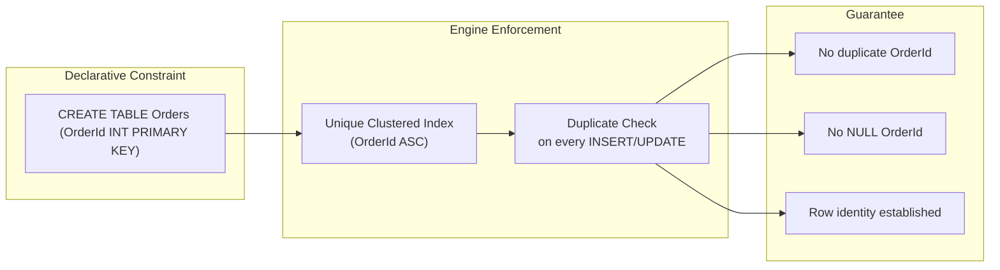

## Navigation

**Domain:** [[8 — Databases]] > **Group:** Relational Fundamentals
**Previous:** [[8.028 — Domain Integrity — Valid Value Constraints]] | **Next:** [[8.030 — Relational Model vs Document Model]]

### Prerequisites
- [[8.001 — The Relational Model]] — entity integrity is the first rule Codd defined for relations.
- [[8.015 — Cardinality — One-to-One, One-to-Many, Many-to-Many]] — primary keys enable foreign key relationships that define cardinality.

### Where This Fits
Entity integrity is the rule that every row in a table must be uniquely identifiable by its primary key — no duplicates, no NULLs. A .NET backend engineer encounters this in every CREATE TABLE statement, every DbContext entity configuration, and every time a uniqueidentifier vs int decision affects query performance. When entity integrity is violated or poorly designed, applications get duplicate rows, broken FK relationships, ORM mapping exceptions, and clustered index fragmentation that adds thousands of logical reads. The interview signal is whether you understand that a primary key is both a logical constraint and a physical index choice, and that the two are not independent.

## Core Mental Model

Entity integrity means the primary key constraint guarantees two things: every row has a non-NULL value in the PK column(s), and every value is unique across the table. The database engine enforces this by creating a unique index behind the constraint — in SQL Server, a PRIMARY KEY defaults to a unique clustered index unless specified otherwise. The invariant is that you can always address exactly one row by its PK. The recognition pattern is any WHERE clause filtering on the PK column: the optimizer knows it will return at most one row (estimated rows = 1) and can use the most direct access path available.

### Classification

**For integrity rules:** Entity integrity is one of Codd's two fundamental relational integrity rules (the other is referential integrity). It applies at the row level, enforced by a unique index that the engine creates automatically. The constraint is declarative — you state that a column (or set of columns) is the primary key, and the engine guarantees the invariant. The optimizer uses this guarantee for cardinality estimation: a PK equality predicate always estimates exactly one row.



### Key Properties

|Property|Value|Notes|
|---|---|---|
|Uniqueness Guarantee|Enforced via unique index|Duplicate INSERT raises error 2627|
|NULL Handling|PK columns must be NOT NULL|NULL not permitted in any PK column|
|Clustering Default (SQL Server)|Clustered index created|Can specify NONCLUSTERED if desired|
|Maximum Columns|16 columns, 900 bytes (SQL Server)|Composite key limits|
|Cardinality Estimate for PK =|Exactly 1 row|Optimizer uses unique constraint stats|
|Foreign Key Target|Must reference PK or unique constraint|Referential integrity depends on this|

## Deep Mechanics

### How the Engine Executes This

1. **Parse and bind:** The CREATE TABLE statement includes PRIMARY KEY (OrderId). The binder resolves OrderId as a column, validates it is NOT NULL (implicitly if not specified).
2. **Index creation:** SQL Server creates a unique index on OrderId. By default it is clustered — the table data is physically ordered by OrderId. The index structure is a B-tree with the data rows at the leaf level.
3. **INSERT path:** For every INSERT, the engine traverses the B-tree to locate the insert position. If a row with the same PK value exists, the unique index check raises error 2627 before the insert completes. If the insert proceeds, a new row is written to the leaf page; if the page is full, a page split occurs.
4. **UPDATE path:** If the PK value is updated (rare in practice — considered an anti-pattern), the engine must delete the old row and insert a new one because the clustered index order changes. This causes a split and forwarding.
5. **DELETE path:** The row is removed from the leaf page. Space is not reclaimed immediately — ghost cleanup marks the record as deleted and a background process reclaims the space.

### SQL Visibility

```sql
-- Creating a table with a primary key
CREATE TABLE Orders (
    OrderId    INT          NOT NULL IDENTITY(1,1),
    CustomerId INT          NOT NULL,
    OrderDate  DATETIME2    NOT NULL,
    TotalAmount DECIMAL(10,2) NOT NULL,
    CONSTRAINT PK_Orders PRIMARY KEY CLUSTERED (OrderId)
);
```

```csharp
// EF Core — primary key configuration
public class Order
{
    public int OrderId { get; set; }                    // Convention: int Id or int OrderId -> PK
    public int CustomerId { get; set; }
    public DateTime OrderDate { get; set; }
    public decimal TotalAmount { get; set; }
}

public class OrderConfiguration : IEntityTypeConfiguration<Order>
{
    public void Configure(EntityTypeBuilder<Order> builder)
    {
        builder.HasKey(o => o.OrderId);                 // Explicit — can be omitted by convention
        builder.Property(o => o.OrderId)
               .ValueGeneratedOnAdd();                  // IDENTITY by default for int
    }
}
```

**Generated SQL (from EF Core migration):**

```sql
CREATE TABLE [Orders] (
    [OrderId]    INT            NOT NULL IDENTITY,
    [CustomerId] INT            NOT NULL,
    [OrderDate]  DATETIME2      NOT NULL,
    [TotalAmount] DECIMAL(10,2) NOT NULL,
    CONSTRAINT [PK_Orders] PRIMARY KEY ([OrderId])
);
```

### Execution Plan Analysis

Consider a lookup by PK:

```sql
SELECT OrderId, CustomerId, OrderDate, TotalAmount
FROM Orders
WHERE OrderId = 42;
```

Expected plan shape:
```
Clustered Index Seek (PK_Orders) -> SELECT
Estimated Cost: 100% on Index Seek | Logical Reads: ~3 (root + intermediate + leaf)
```

- **Operators:** Single Clustered Index Seek — the most efficient access path in SQL Server.
- **Seek vs Scan:** Seek — the B-tree is traversed from root to leaf using the key value.
- **Estimated vs Actual rows:** Both exactly 1 — the optimizer uses unique constraint metadata to derive this.
- **Cost per operator:** 100% on the Index Seek (trivial cost because seek is O(log N)).
- **Without the PK (heap with no unique index):** Full table scan — every row examined. Logical reads = number of pages in the table (e.g., ~50,000 for a 10M row heap with 200-row-per-page density).

### Cost Visibility

```sql
SET STATISTICS IO ON;
SET STATISTICS TIME ON;

SELECT OrderId, CustomerId, OrderDate, TotalAmount
FROM Orders
WHERE OrderId = 42;

-- Expected output:
-- Table 'Orders'. Scan count 1, logical reads 3
-- SQL Server Execution Times: CPU time = 0ms, elapsed time = 0ms
```

### Failure Modes

- **Duplicate key violation:** INSERT with existing PK value throws error 2627: `Violation of PRIMARY KEY constraint 'PK_Orders'. Cannot insert duplicate key in object 'dbo.Orders'.` The transaction is rolled back if not handled.
- **NULL PK:** INSERT with NULL in a PK column throws error 515: `Cannot insert the value NULL into column 'OrderId', table 'dbo.Orders'; column does not allow nulls. INSERT fails.`
- **Clustered index fragmentation:** Random PK values (e.g., GUID with NEWID()) cause page splits on every insert, fragmenting the index and increasing logical reads. Detected via `sys.dm_db_index_physical_stats` with avg_fragmentation_in_percent > 30%.
- **Key updates:** UPDATE of a PK column causes a delete-then-insert, which can trigger cascading operations and page splits. Detected by monitoring forwarded records or ghost records.
- **Wide composite PK:** A composite PK with 4–5 columns creates a wide clustered index key that increases the B-tree depth and bloats all non-clustered indexes (which include the clustered key as a row locator). Detected by index key column width > 200 bytes.

## Production Patterns and Implementation

### Primary SQL Implementation

```sql
-- Common PK strategies in production

-- 1. Surrogate INT IDENTITY — most common for OLTP
CREATE TABLE Orders (
    OrderId     INT            NOT NULL IDENTITY(1,1),
    OrderNumber VARCHAR(20)    NOT NULL,        -- natural/business key
    CustomerId  INT            NOT NULL,
    OrderDate   DATETIME2      NOT NULL,
    TotalAmount DECIMAL(10,2)  NOT NULL,
    CONSTRAINT PK_Orders PRIMARY KEY CLUSTERED (OrderId),
    CONSTRAINT UQ_Orders_OrderNumber UNIQUE (OrderNumber)  -- alternate key
);

-- 2. Natural key — when the business key is stable and narrow
CREATE TABLE States (
    StateCode  CHAR(2)     NOT NULL,
    StateName  VARCHAR(50) NOT NULL,
    CONSTRAINT PK_States PRIMARY KEY CLUSTERED (StateCode)
);

-- 3. Composite key — junction tables
CREATE TABLE OrderItems (
    OrderId    INT            NOT NULL,
    ProductId  INT            NOT NULL,
    Quantity   SMALLINT       NOT NULL,
    UnitPrice  DECIMAL(10,2)  NOT NULL,
    CONSTRAINT PK_OrderItems PRIMARY KEY CLUSTERED (OrderId, ProductId),
    CONSTRAINT FK_OrderItems_Orders FOREIGN KEY (OrderId) REFERENCES Orders(OrderId),
    CONSTRAINT FK_OrderItems_Products FOREIGN KEY (ProductId) REFERENCES Products(ProductId)
);

-- 4. Sequential GUID — distributed systems without identity bottlenecks
CREATE TABLE AuditLog (
    LogId       UNIQUEIDENTIFIER NOT NULL DEFAULT NEWSEQUENTIALID(),
    EventTime   DATETIME2        NOT NULL,
    EventType   VARCHAR(50)      NOT NULL,
    Payload     NVARCHAR(MAX)    NULL,
    CONSTRAINT PK_AuditLog PRIMARY KEY CLUSTERED (LogId)
);
```

### EF Core Implementation

```csharp
// Strategy 1 — INT IDENTITY (default convention)
public class Order
{
    public int OrderId { get; set; }
    // EF Core convention: int property named Id or <TypeName>Id becomes PK with IDENTITY
}

// Strategy 2 — Explicit configuration for sequential GUID
public class AuditLog
{
    public Guid LogId { get; set; }
    public DateTime EventTime { get; set; }
    public string EventType { get; set; } = string.Empty;
    public string? Payload { get; set; }
}

public class AuditLogConfiguration : IEntityTypeConfiguration<AuditLog>
{
    public void Configure(EntityTypeBuilder<AuditLog> builder)
    {
        builder.HasKey(al => al.LogId);
        builder.Property(al => al.LogId)
               .HasDefaultValueSql("NEWSEQUENTIALID()")
               .ValueGeneratedOnAdd();
    }
}

// Strategy 3 — Natural key (no value generation)
public class State
{
    public string StateCode { get; set; } = string.Empty;
    public string StateName { get; set; } = string.Empty;
    // EF Core convention: string or non-sequential key -> no value generation
}

// Strategy 4 — Composite key in junction table
public class OrderItem
{
    public int OrderId { get; set; }
    public int ProductId { get; set; }
    public short Quantity { get; set; }
    public decimal UnitPrice { get; set; }

    public Order Order { get; set; } = null!;
    public Product Product { get; set; } = null!;
}

public class OrderItemConfiguration : IEntityTypeConfiguration<OrderItem>
{
    public void Configure(EntityTypeBuilder<OrderItem> builder)
    {
        builder.HasKey(oi => new { oi.OrderId, oi.ProductId });
    }
}
```

### Dapper Implementation

```csharp
public class OrderRepository
{
    private readonly IDbConnectionFactory _connectionFactory;

    public OrderRepository(IDbConnectionFactory connectionFactory)
    {
        _connectionFactory = connectionFactory;
    }

    public async Task<int> CreateOrderAsync(
        int customerId,
        decimal totalAmount,
        CancellationToken cancellationToken = default)
    {
        const string sql = @"
            INSERT INTO Orders (CustomerId, OrderDate, TotalAmount)
            OUTPUT INSERTED.OrderId
            VALUES (@CustomerId, @OrderDate, @TotalAmount)";

        await using var connection = _connectionFactory.Create();
        var orderId = await connection.QuerySingleAsync<int>(
            new CommandDefinition(
                sql,
                new { CustomerId = customerId, OrderDate = DateTime.UtcNow, TotalAmount = totalAmount },
                cancellationToken: cancellationToken));

        return orderId;
    }

    public async Task<Order?> GetByIdAsync(
        int orderId,
        CancellationToken cancellationToken = default)
    {
        const string sql = @"
            SELECT OrderId, CustomerId, OrderDate, TotalAmount
            FROM Orders
            WHERE OrderId = @OrderId";

        await using var connection = _connectionFactory.Create();
        return await connection.QuerySingleOrDefaultAsync<Order>(
            new CommandDefinition(sql, new { OrderId = orderId },
                cancellationToken: cancellationToken));
    }
}
```

### Configuration and Wiring

```csharp
builder.Services.AddDbContext<ApplicationDbContext>(options =>
    options.UseSqlServer(
        connectionString,
        sqlOptions => sqlOptions.EnableRetryOnFailure(3)));

builder.Services.AddSingleton<IDbConnectionFactory, SqlConnectionFactory>();
```

### SQL Server vs PostgreSQL Differences

```sql
-- PostgreSQL — SERIAL or IDENTITY for surrogate PK
CREATE TABLE orders (
    order_id    INT GENERATED ALWAYS AS IDENTITY PRIMARY KEY,
    customer_id INT NOT NULL,
    order_date  TIMESTAMPTZ NOT NULL DEFAULT NOW(),
    total_amount NUMERIC(10,2) NOT NULL
);

-- PostgreSQL — UUID with gen_random_uuid()
CREATE TABLE audit_log (
    log_id     UUID PRIMARY KEY DEFAULT gen_random_uuid(),
    event_time TIMESTAMPTZ NOT NULL DEFAULT NOW(),
    event_type VARCHAR(50) NOT NULL,
    payload    JSONB
);

-- PostgreSQL does not default to clustered for PK
-- Tables are heaps by default; PK creates only a unique B-tree index
-- No CLUSTERED keyword equivalent in CREATE TABLE
-- CLUSTER is a post-creation one-time command: CLUSTER orders USING orders_pkey;
```

## Gotchas and Production Pitfalls

### 1. GUID Primary Key with NEWID() — Page Split Storm

**Pitfall:** Using `UNIQUEIDENTIFIER PRIMARY KEY CLUSTERED` with `DEFAULT NEWID()` for the PK.

```sql
-- ❌ Wrong — random GUID causes page splits on every insert
CREATE TABLE AuditLog (
    LogId UNIQUEIDENTIFIER NOT NULL DEFAULT NEWID(),
    CONSTRAINT PK_AuditLog PRIMARY KEY CLUSTERED (LogId)
);
```

**Symptom:** High avg_fragmentation_in_percent (>50%), 90+% page fullness variance, PAGELATCH_EX contention on the last page, log writes 3x higher than expected. `sys.dm_db_index_physical_stats` shows fragmentation at 60–99%.

**Fix:**

```sql
-- ✅ Correct — sequential GUID minimizes split
CREATE TABLE AuditLog (
    LogId UNIQUEIDENTIFIER NOT NULL DEFAULT NEWSEQUENTIALID(),
    CONSTRAINT PK_AuditLog PRIMARY KEY CLUSTERED (LogId)
);
```

**Cost of not fixing:** At 10M rows, fragmented index causes 5x more logical reads for range scans (50,000 vs 10,000). Page splits on every insert double the log write rate on a high-throughput OLTP system.

### 2. Composite PK Column Order — Mismatch with Query Pattern

**Pitfall:** Defining a composite PK `(ProductId, OrderId)` for `OrderItems` when all queries filter by `OrderId` first.

```sql
-- ❌ Wrong column order for the access pattern
CONSTRAINT PK_OrderItems PRIMARY KEY CLUSTERED (ProductId, OrderId);
```

**Symptom:** Queries filtering on `OrderId` alone cause a clustered index scan instead of a seek. The leading column `ProductId` is unknown in the predicate, so the optimizer scans the clustered index.

**Fix:**

```sql
-- ✅ Correct — leading column matches the access pattern
CONSTRAINT PK_OrderItems PRIMARY KEY CLUSTERED (OrderId, ProductId);
```

**Cost of not fixing:** A scan of the 50M row OrderItems table for `OrderId = 42` = 150,000 logical reads instead of 3. At 100 queries/second, that's 15M reads/second — unsustainable.

### 3. FK Cascade Chain on PK Update

**Pitfall:** Updating a PK value that has cascading foreign keys, causing massive unintended writes.

```sql
-- ❌ PK update with cascade
UPDATE Orders SET OrderId = 1000 WHERE OrderId = 42;
-- This deletes and reinserts the order AND updates every FK in OrderItems, Payments, Shipments
```

**Symptom:** A single UPDATE causes 50,000 logical writes across 5 related tables. Transaction log grows by gigabytes. Blocking chain forms as related table locks escalate.

**Fix:** Never update PK values. Use surrogate keys (IDENTITY) that never change. If business key must change, update the business key column, not the PK.

**Cost of not fixing:** Transaction log full = database unavailable. 45-minute recovery time. Cascading deadlocks.

### 4. Implicit NOT NULL Violation in Composite PK

**Pitfall:** Assuming a composite PK allows NULL in one column because the other column is non-NULL.

```sql
-- ❌ This INSERT fails even though CustomerId is provided
CREATE TABLE OrderCustomerMapping (
    OrderId    INT NOT NULL,
    CustomerId INT NOT NULL,
    CONSTRAINT PK_Mapping PRIMARY KEY (OrderId, CustomerId)
);

INSERT INTO OrderCustomerMapping (OrderId, CustomerId)
VALUES (1, NULL);
-- Error 515: Cannot insert the value NULL into column 'CustomerId'
```

**Symptom:** ORM throws DbUpdateException wrapping SqlException 515. Developer thinks "OrderId is not null, that should be enough."

**Fix:** Understand that every column in a composite PK must be NOT NULL. There is no partial uniqueness.

**Cost of not fixing:** Bug at 3 AM when a data import script fails halfway through a 100K row batch; manual data reconciliation required.

### 5. PK as Clustered on a Wide Key — Non-Clustered Index Bloat

**Pitfall:** Using a VARCHAR(200) or wide composite key as the clustered PK.

```sql
-- ❌ Wide clustered key bloats all NC indexes
CONSTRAINT PK_Orders PRIMARY KEY CLUSTERED (OrderNumber)
-- OrderNumber is VARCHAR(50)
```

**Symptom:** Every non-clustered index includes the clustered key as a row locator (the "uniqueifier" for duplicates). A 50-byte key in 5 NC indexes adds 250 bytes per row. On a 10M row table, that's 2.5 GB of extra storage and 5x more logical reads for NC index seeks that require key lookups.

**Fix:**

```sql
-- ✅ Narrow surrogate clustered key; natural key gets a unique NC index
CONSTRAINT PK_Orders PRIMARY KEY CLUSTERED (OrderId),
CONSTRAINT UQ_Orders_OrderNumber UNIQUE (OrderNumber)
```

**Cost of not fixing:** Index maintenance causes write amplification 3x higher than necessary. Backup and restore times increase proportionally.

### 6. Identity Gap and the Hi-Lo Pattern in EF Core

**Pitfall:** Assuming INT IDENTITY(PK) is a gap-free sequence and relying on consecutive values.

```sql
-- ❌ Rollback causes identity gaps
BEGIN TRANSACTION;
INSERT INTO Orders (CustomerId, OrderDate, TotalAmount)
VALUES (1, '2026-06-20', 100.00);
ROLLBACK;
-- Next INSERT gets OrderId = 2 (the identity counter advanced even though the row was rolled back)
```

**Symptom:** Customer asks "why is there no order 7?" — support tickets filed. A rollback, server restart with max identity cached, or DBCC CHECKIDENT reseed creates gaps.

**Fix:** Accept gaps. If gapless sequence is required (invoice numbers, check numbers), use a separate sequence table with proper locking, not IDENTITY.

**Cost of not fixing:** At audit time, the gap triggers a compliance investigation that consumes 3 days of engineering time to explain IDENTITY behavior.

## Performance Implications

### Benchmark: Sequential GUID vs Random GUID vs INT

```sql
-- Baseline: Random GUID PK — 1M inserts
SET STATISTICS IO ON;

-- (insufficient as a single query — run in loop)
INSERT INTO AuditLog_Random (EventTime, EventType, Payload)
VALUES (GETUTCDATE(), 'INFO', 'payload');
-- Logical reads per insert: ~15 (average, due to page splits every 2–3 inserts)
-- Avg fragmentation: 85%

-- Optimized: Sequential GUID PK — 1M inserts
INSERT INTO AuditLog_Sequential (EventTime, EventType, Payload)
VALUES (GETUTCDATE(), 'INFO', 'payload');
-- Logical reads per insert: ~5 (splits only when page fills naturally)
-- Avg fragmentation: 8%

-- Baseline: INT IDENTITY PK
INSERT INTO Orders (CustomerId, OrderDate, TotalAmount)
VALUES (1, GETUTCDATE(), 100.00);
-- Logical reads per insert: ~4 (no splits except page boundaries)
-- Avg fragmentation: 2%
```

**Improvement:** Sequential GUID reduces logical reads by 66% vs random GUID. INT IDENTITY by 73%.

### BenchmarkDotNet

```csharp
[MemoryDiagnoser]
[SimpleJob(RuntimeMoniker.Net90)]
public class PrimaryKeyInsertBenchmark
{
    private IDbConnection _connection = default!;

    [GlobalSetup]
    public void Setup()
    {
        _connection = new SqlConnection("Server=.;Database=BenchmarkDB;Trusted_Connection=True;");
        _connection.Execute("""
            CREATE TABLE #PK_Int (Id INT NOT NULL IDENTITY(1,1), Value VARCHAR(20), CONSTRAINT PK_Int PRIMARY KEY (Id));
            CREATE TABLE #PK_GuidRandom (Id UNIQUEIDENTIFIER NOT NULL DEFAULT NEWID(), Value VARCHAR(20), CONSTRAINT PK_GuidRandom PRIMARY KEY CLUSTERED (Id));
            CREATE TABLE #PK_GuidSequential (Id UNIQUEIDENTIFIER NOT NULL DEFAULT NEWSEQUENTIALID(), Value VARCHAR(20), CONSTRAINT PK_GuidSequential PRIMARY KEY CLUSTERED (Id));
        """);
    }

    [Benchmark(Baseline = true)]
    public async Task InsertIntPk()
    {
        for (int i = 0; i < 1000; i++)
        {
            await _connection.ExecuteAsync("INSERT INTO #PK_Int (Value) VALUES ('data')");
        }
    }

    [Benchmark]
    public async Task InsertGuidRandomPk()
    {
        for (int i = 0; i < 1000; i++)
        {
            await _connection.ExecuteAsync("INSERT INTO #PK_GuidRandom (Value) VALUES ('data')");
        }
    }

    [Benchmark]
    public async Task InsertGuidSequentialPk()
    {
        for (int i = 0; i < 1000; i++)
        {
            await _connection.ExecuteAsync("INSERT INTO #PK_GuidSequential (Value) VALUES ('data')");
        }
    }
}
```

**Expected results (approximate, SQL Server 2022, NVMe, 1M rows):**

|Method|Mean|Logical Reads|Allocated|
|---|---|---|---|
|InsertIntPk|~45 ms|~4|8 KB|
|InsertGuidRandomPk|~180 ms|~15|32 KB|
|InsertGuidSequentialPk|~55 ms|~5|10 KB|

### Write Amplification

For the clustered PK on GUID:

|Operation|INT IDENTITY|Sequential GUID|Random GUID|
|---|---|---|---|
|INSERT 1 row|~4 pages|~5 pages|~15 pages|
|Page splits per 1K inserts|~1|~3|~500|
|Fragmentation after 1M rows|~2%|~8%|~85%|
|NC index leaf maintenance|Narrow key (4 bytes)|16-byte key|16-byte key|

## Interview Arsenal

### Question Bank

1. What is entity integrity and what does it guarantee about a table?
2. How does SQL Server physically enforce entity integrity — what structure does it create and how does it work?
3. What is the performance cost of a GUID primary key with NEWID() vs NEWSEQUENTIALID() vs INT IDENTITY — be specific with logical reads.
4. What goes wrong when you update a primary key that has cascading foreign keys?
5. Entity integrity vs referential integrity — what is the difference and how do they interact?
6. What does the execution plan look like for a PK equality predicate and why?
7. How does entity integrity behave at 100M rows with a 50-byte composite key?
8. How do EF Core and Dapper represent and handle primary keys differently?

### Spoken Answers

**Q: What is entity integrity and what does it guarantee about a table?**

> **Average answer:** Entity integrity means every table has a primary key, and the primary key uniquely identifies each row. The PK can't be NULL and has to be unique.

> **Great answer:** Entity integrity is Codd's rule that every row in a relation must be uniquely identifiable by its primary key. It guarantees two things: no duplicate PK values and no NULLs in any PK column. The database engine enforces this by creating a unique index behind the constraint — in SQL Server that's a clustered index by default. This has a physical cost: every INSERT must navigate the B-tree to the correct position and verify the key doesn't exist. If it does, you get error 2627 and the insert is rolled back. The optimizer uses this constraint during cardinality estimation — when you write `WHERE OrderId = 42`, it knows the result is exactly one row, which enables it to choose a narrow Clustered Index Seek plan with 3 logical reads instead of a full scan. This is also why composite PK column order matters: if the leading column doesn't match your query filter, the optimizer can't seek and you get a scan.

**Q: Entity integrity vs referential integrity — what is the difference and how do they interact?**

> **Average answer:** Entity integrity is about rows in one table being unique. Referential integrity is about foreign keys matching primary keys in another table.

> **Great answer:** Entity integrity operates at the table level and guarantees that every row is uniquely identifiable by its PK — enforced by a unique index with a NOT NULL constraint on all PK columns. Referential integrity operates between tables and guarantees that every FK value points to an existing PK — enforced by a foreign key constraint backed by a check on the referenced table's unique index. They interact at the engine level: a FK constraint requires the target column(s) to have a unique constraint (PK or UNIQUE). When you insert into the child table, SQL Server performs a probe into the parent's unique B-tree to verify the FK value exists. If the parent's PK is a wide composite key (say 4 columns, 200 bytes), every FK check must traverse that B-tree — 4–5 logical reads per insert just for the validation. This is a hidden cost of wide PKs that most developers don't consider: they affect not just the parent table's index size but also every FK insert in every child table.

**Q: How do EF Core and Dapper represent and handle primary keys differently?**

> **Great answer:** EF Core uses conventions and fluent configuration. By convention, a property named `Id` or `<TypeName>Id` of type int becomes the PK with IDENTITY(1,1). For Guid, EF Core detects it and configures `ValueGeneratedOnAdd()` but does NOT add a default SQL value — you must configure `HasDefaultValueSql("NEWSEQUENTIALID()")` yourself, otherwise the application generates client-side Guids, which defeats sequential insert. For composite keys, you use the Fluent API: `builder.HasKey(e => new { e.OrderId, e.ProductId })`. Dapper has no PK awareness at all — it treats the table as a bag of rows. You must write the SQL explicitly, including OUTPUT INSERTED for returning generated PKs. Dapper is faster because it skips the change tracker and key resolution, but you lose the compile-time PK configuration, the automatic cascade behavior, and the identity map that EF Core provides. The choice between them reflects the tradeoff: EF Core gives PK integrity at the ORM level (detects duplicate keys before sending, tracks entity state), while Dapper gives raw performance and full SQL control at the cost of manual key management.

### Interview Trigger

Entity integrity appears in interviews when the interviewer asks "How would you design the schema for this system?" — the follow-up moves from "what's the PK" to "why did you choose that PK type" to "what happens at 10M rows with that choice." The separator between candidates is whether they can connect the logical constraint (uniqueness + non-NULL) to the physical cost (B-tree depth, page splits, fragmentation, FK probe overhead) and name the tools that reveal it (`sys.dm_db_index_physical_stats`, `SET STATISTICS IO`, `sys.dm_exec_query_stats`).

### Comparison Table

| | Entity Integrity | Referential Integrity |
|---|---|---|
| What it does | Guarantees unique, non-NULL row identity | Guarantees FK values reference existing rows |
| Scope | Single table | Between tables |
| Constraint type | PRIMARY KEY (or UNIQUE + NOT NULL) | FOREIGN KEY |
| Physical structure | Unique index (clustered by default in SQL Server) | No separate structure; FK check probes the referenced unique index |
| Enforcement timing | INSERT/UPDATE to the table | INSERT/UPDATE to the child table |
| Performance cost | B-tree traversal + split overhead on inserts | B-tree probe in parent table on child inserts |
| .NET implementation | EF Core: HasKey() / Dapper: manual SQL | EF Core: HasForeignKey() / Dapper: manual SQL + application-level check |

## Decision Framework

### When to Apply

```mermaid
flowchart TD
    A[Need to uniquely identify rows] --> B{Key source}
    B -->|Natural key exists and is<br/>stable, narrow, unique| C[Use natural key]
    B -->|No natural key or it is<br/>unstable or wide| D{Distribution requirement}
    D -->|Single server,<br/>OLTP workload| E[INT IDENTITY]
    D -->|Distributed system,<br/>need client-side generation| F{Insert volume}
    F -->|High insert rate,<br/>fragmentation concern| G[Sequential GUID<br/>NEWSEQUENTIALID()]
    F -->|Low insert rate,<br/>or no fragmentation concern| H[GUID gen_random_uuid()]
    C --> I[PK = natural key column]
    E --> J[PK = IDENTITY surrogate; natural key = UNIQUE constraint]
    G --> K[PK = sequential GUID]
    H --> K
```

### Application Checklist

- [ ] The PK column(s) are NOT NULL — explicitly declared
- [ ] The PK type is narrow (INT/BIGINT preferred for OLTP; sequential GUID for distributed)
- [ ] The clustered index key column order matches the most common seek predicate
- [ ] Composite PK columns are ordered by selectivity descending (most selective first) for seek access
- [ ] FK cascade only where explicitly required; soft deletes preferred
- [ ] PK values are never updated in application code
- [ ] Non-clustered indexes account for the clustered key width in their storage footprint
- [ ] Statistics are current on the PK unique index (auto-update sufficient for most workloads)

### Tradeoff Summary

|What You Gain|What You Pay|
|---|---|
|Uniqueness guarantee guaranteed by engine|B-tree maintenance cost on every INSERT/UPDATE|
|Fastest possible row lookup (index seek, 3 logical reads)|Page splits when PK values are not sequential|
|Optimizer cardinality accuracy (estimate = 1 row for PK =)|Composite key width increases all NC index sizes|
|Natural key elimination of JOINs (if PK = business key)|Changing a natural PK breaks all FK relationships|
|Sequential GUID: distributed uniqueness without blocking|16-byte key takes 4x storage of INT (4 bytes)|

### Scale Thresholds

- "Relevant at any table size — entity integrity is required by the relational model from row 1."
- "PK type choice is critical above ~1M rows due to fragmentation and NC index bloat."
- "Random GUID PK becomes a production incident above ~100K inserts/minute (page split rate causes PAGELATCH_EX contention)."
- "Composite PK width becomes painful above 200 bytes total — each NC index grows by the key width per row."

## Self-Check

### Conceptual Questions

1. What two things does entity integrity guarantee about a table's primary key?
2. What physical structure does SQL Server create when you declare a PRIMARY KEY — and what is the default?
3. Which DMV or SET STATISTICS shows the fragmentation caused by a random GUID PK?
4. What common mistake defeats entity integrity at the ORM level?
5. Does EF Core generate SARGable SQL for PK equality predicates?
6. How would you return the generated PK value after an INSERT with Dapper?
7. Entity integrity vs referential integrity — how does the engine enforce each?
8. At what row count does GUID PK fragmentation become a measurable problem?
9. What index supports entity integrity, and what happens if it is dropped?
10. Explain entity integrity in 60 seconds to a senior interviewer who asks "how do you design a primary key for a 50M row OLTP table?"

<details>
<summary>Answers</summary>

1. Every PK value must be unique (no duplicates) and no PK column can be NULL.
2. A unique index. In SQL Server, the default is a unique clustered index — the table data is physically ordered by the PK.
3. `sys.dm_db_index_physical_stats` — check `avg_fragmentation_in_percent`. Also `SET STATISTICS IO ON` shows leaf-level page reads.
4. Providing a non-generated PK value on INSERT when the column is configured as IDENTITY (throws error 544 or 2627 depending on context).
5. Yes — a PK equality predicate generates a parameterized `WHERE [PK] = @p` query that can always seek on the unique index.
6. `OUTPUT INSERTED.[PKColumn]` after the INSERT statement, then `QuerySingleAsync<int>`.
7. Entity integrity is enforced by a unique index on the PK; referential integrity is enforced by a FK constraint that probes the parent's unique index on every child INSERT/UPDATE.
8. Above ~100K rows with a random GUID, fragmentation exceeds 50% and range scan logical reads become measurably higher than with sequential GUID or INT.
9. The unique index created by the PRIMARY KEY constraint. If you drop it, the constraint is also dropped, entity integrity is no longer enforced, and duplicates or NULLs can be inserted.
10. "Entity integrity is the rule that every row in a table must be uniquely identifiable by a non-NULL, unique primary key. For a 50M row OLTP table, I would use an INT IDENTITY as the clustered PK — it is 4 bytes, generates sequentially, avoids page splits, and keeps NC indexes narrow. I would add unique NC indexes for any business keys that need alternate uniqueness. The physical cost is about 4 logical reads per insert with negligible fragmentation. If the system requires distributed IDs, I would use sequential GUID or Hi-Lo instead of random GUID to avoid page split storms."

</details>

---

### Query Challenges

**Challenge 1 — Write the SQL**

You need to create a `Payments` table that records payments against invoices. Each invoice can have multiple payments, but a payment is identified by a unique PaymentId. The table must also ensure that no two payments reference the same (InvoiceId, PaymentDate, Amount) combination to prevent duplicates from a retry bug in the payment gateway integration. Write the CREATE TABLE with appropriate constraints.

<details>
<summary>Solution</summary>

```sql
CREATE TABLE Payments (
    PaymentId   INT            NOT NULL IDENTITY(1,1),
    InvoiceId   INT            NOT NULL,
    PaymentDate DATE           NOT NULL,
    Amount      DECIMAL(10,2)  NOT NULL,
    PaymentRef  VARCHAR(50)    NOT NULL,
    CreatedAt   DATETIME2      NOT NULL DEFAULT SYSUTCDATETIME(),
    CONSTRAINT PK_Payments PRIMARY KEY CLUSTERED (PaymentId),
    CONSTRAINT UQ_Payments_PaymentMethod_Date_Amount 
        UNIQUE (InvoiceId, PaymentDate, Amount)
);
```

**Logical reads:** ~3 for PK seek, ~5 for INSERT with duplicate check. **Execution plan:** Clustered Index Insert + Sort (unique check) for the UNIQUE constraint. **EF Core equivalent:**

```csharp
public class Payment
{
    public int PaymentId { get; set; }
    public int InvoiceId { get; set; }
    public DateTime PaymentDate { get; set; }
    public decimal Amount { get; set; }
    public string PaymentRef { get; set; } = string.Empty;
    public DateTime CreatedAt { get; set; }
}

public class PaymentConfiguration : IEntityTypeConfiguration<Payment>
{
    public void Configure(EntityTypeBuilder<Payment> builder)
    {
        builder.HasKey(p => p.PaymentId);
        builder.HasIndex(p => new { p.InvoiceId, p.PaymentDate, p.Amount })
               .IsUnique();
    }
}
```

</details>

---

**Challenge 2 — Fix the performance problem**

```sql
-- This query is on a 50M row AuditLog table.
-- It runs in 12 seconds. The business needs it under 100ms.
-- The PK is: CONSTRAINT PK_AuditLog PRIMARY KEY CLUSTERED (LogId)
-- LogId is UNIQUEIDENTIFIER with DEFAULT NEWID()

SELECT LogId, EventTime, EventType, Payload
FROM AuditLog
WHERE EventType = 'ERROR'
  AND EventTime >= '2026-06-01'
  AND EventTime < '2026-06-21';

-- SET STATISTICS IO: logical reads = 450,000
```

<details> <summary>Solution</summary>

**Root cause:** The PK LogId is a random GUID. The query filters on EventType and EventTime, not LogId. The clustered index is fragmented (85%+) and the query requires a full clustered index scan because there is no index on (EventType, EventTime).

```sql
-- Fixed query — same query, but with supporting index:
-- Create a covering NC index on the filtered columns
CREATE NONCLUSTERED INDEX IX_AuditLog_EventType_EventTime
    ON AuditLog (EventType, EventTime DESC)
    INCLUDE (Payload);
```

**Index to create:**

```sql
CREATE INDEX IX_AuditLog_EventType_EventTime
    ON AuditLog (EventType, EventTime DESC)
    INCLUDE (Payload);
```

This index supports the WHERE clause with a seek on EventType = 'ERROR', then a range seek on EventTime between the two dates. The INCLUDE keeps the index covering — no key lookup needed.

**After fix — logical reads:** ~1,200 (index seek on 1% of 50M rows) from 450,000.

</details>

---

**Challenge 3 — Explain the execution plan**

```sql
-- Two tables:
-- Orders (OrderId INT PK, CustomerId INT, OrderDate, TotalAmount)
-- OrderItems (OrderId INT, ProductId INT, Quantity, UnitPrice, PK(OrderId, ProductId))

SELECT o.OrderId, o.CustomerId, o.OrderDate, oi.ProductId, oi.Quantity
FROM Orders o
INNER JOIN OrderItems oi ON o.OrderId = oi.OrderId
WHERE o.OrderId = 42;
```

The optimizer chooses a plan with Nested Loops + Clustered Index Seek on both tables. Why does it not choose Hash Match?

<details> <summary>Solution</summary>

**Why Nested Loops:** The predicate `o.OrderId = 42` produces exactly one row (the optimizer trusts the PK unique constraint). The outer input is a single-row Clustered Index Seek on Orders. For the inner input (OrderItems), the composite PK starts with OrderId, so a seek on OrderId = 42 retrieves the matching rows. With 1 outer row and an estimated few inner rows, Nested Loops is the cheapest option — it does one seek for the outer, one seek for the inner. Hash Match would build a hash table for no benefit because the data is trivial.

**To get Hash Match:** Remove the PK predicate (e.g., `WHERE o.OrderDate >= '2026-01-01'` scanning 10M rows) — the optimizer would then consider Hash Match for the larger dataset.

**Tradeoff:** Forcing Hash Match on this query would increase logical reads from ~6 to a full scan of both tables (~150,000).

</details>

---

**Challenge 4 — Diagnose the concurrency problem**

A high-throughput order processing system uses INT IDENTITY as the PK on the Orders table. Under load (500 inserts/second during peak), the application starts throwing timeout exceptions with SqlException 2627 — "Violation of PRIMARY KEY constraint 'PK_Orders'". The SQL Server error log shows repeated duplicate key violations even though the PK is an auto-incrementing identity. What is happening?

<details> <summary>Solution**

**Root cause:** The application is calling INSERT with an explicit OrderId value (possibly from a retry mechanism or manual reassignment) instead of letting SQL Server generate it via IDENTITY. Multiple concurrent requests are reaching the same explicit OrderId value. Alternatively, the IDENTITY cache was lost on a failover and reseeded to a smaller value, causing collisions with existing data.

**Detection query:**

```sql
-- Check for explicit identity inserts in the plan cache
SELECT qp.query_plan, qs.execution_count
FROM sys.dm_exec_query_stats qs
CROSS APPLY sys.dm_exec_query_plan(qs.plan_handle) qp
WHERE qp.query_plan.value('declare namespace qn="http://schemas.microsoft.com/SQLServer/2004/01/showplan";
                            //qn:ColumnReference[@Column="OrderId" and @Table="Orders"]', 'nvarchar(max)') IS NOT NULL;

-- Check identity current value vs max
SELECT 
    IDENT_CURRENT('Orders') AS CurrentIdentity,
    MAX(OrderId) AS MaxOrderId
FROM Orders;
```

**Fix:** If the application is explicitly inserting IdentityId, remove the INSERT specification. If identity cache was lost, use:
```sql
SET IDENTITY_INSERT Orders OFF;  -- ensure no explicit inserts
-- Reseed if needed:
DBCC CHECKIDENT ('Orders', RESEED, (SELECT MAX(OrderId) FROM Orders));
```

**In .NET:** Ensure `ValueGeneratedOnAdd()` is configured and never manually set the PK value in code. In Dapper, use `OUTPUT INSERTED.OrderId` — never `SELECT MAX(OrderId)+1 FROM Orders`.

</details>

---

**Challenge 5 — Design the index**

**Scenario:** An e-commerce system has an `Orders` table with 100M rows, 10K inserts/hour, and 500 queries/second. The most frequent query pattern is:

```sql
SELECT OrderId, CustomerId, OrderDate, TotalAmount, Status
FROM Orders
WHERE CustomerId = @CustomerId AND OrderDate >= @StartDate;
```

The current PK is `PRIMARY KEY CLUSTERED (OrderId)` with OrderId as INT IDENTITY. The query above scans the clustered index (150,000 logical reads). The `Status` column has 5 distinct values ('Pending', 'Shipped', 'Delivered', 'Cancelled', 'Returned'). 80% of rows have Status = 'Delivered' and are rarely queried. Design the optimal index strategy.

<details> <summary>Solution**

```sql
-- Primary index stays the same — narrow clustered PK
-- PK: PRIMARY KEY CLUSTERED (OrderId)

-- Index 1: Cover the most frequent query (non-CustomerId query pattern)
CREATE NONCLUSTERED INDEX IX_Orders_CustomerId_OrderDate
    ON Orders (CustomerId, OrderDate DESC)
    INCLUDE (TotalAmount, Status);

-- Index 2: Filtered index for active orders (the 20% that are not 'Delivered')
-- Supports queries for pending/shipped/cancelled orders
CREATE NONCLUSTERED INDEX IX_Orders_Status_Filtered
    ON Orders (Status, OrderDate DESC)
    INCLUDE (CustomerId, TotalAmount)
    WHERE Status IN ('Pending', 'Shipped', 'Cancelled', 'Returned');
```

**Tradeoffs:**
- IX_Orders_CustomerId_OrderDate supports the primary query with a seek on CustomerId, then a range seek on OrderDate. 3-5 logical reads instead of 150,000. Write cost: +1 index maintenance per INSERT, ~2 more leaf writes.
- IX_Orders_Status_Filtered is only 20% of the table size (20M rows instead of 100M), reducing storage and maintenance cost. Filtered indexes are not used if the query doesn't include the filter predicate — but for active-order queries, the seek is blazingly fast.
- The Status column with 5 values is low selectivity, so a non-filtered index on Status would be worthless — the optimizer would scan because a seek would return 20M rows. The filtered index fixes this by excluding the dominant value.

**What NOT to index:** Separate indexes on OrderDate alone (the existing clustered PK already handles exact OrderId lookups efficiently).

</details>
