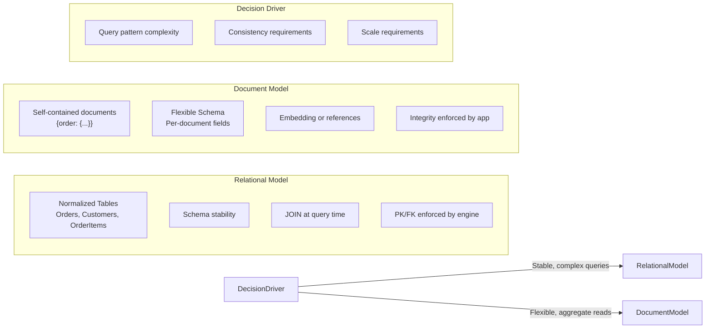
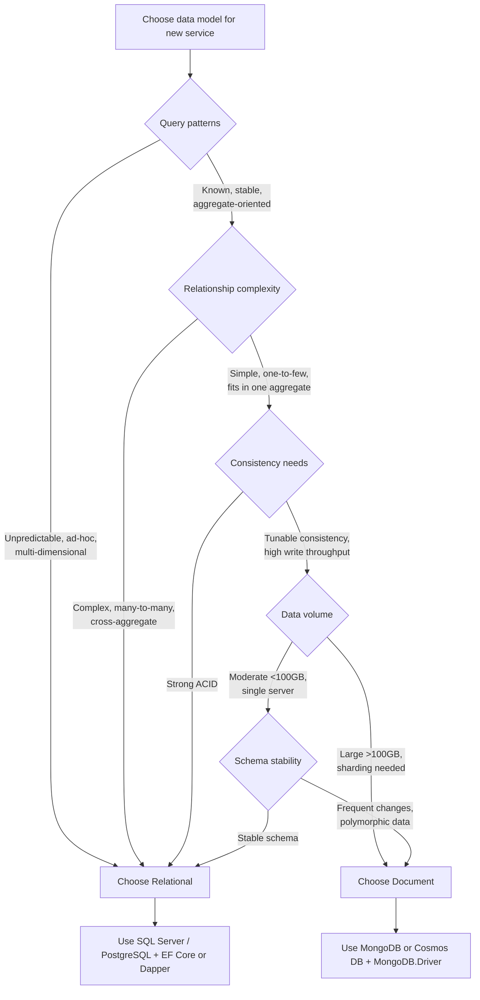

## Navigation

**Domain:** [[8 — Databases]] > **Group:** Relational Fundamentals
**Previous:** [[8.029 — Entity Integrity — Primary Key Rules]] | **Next:** —

### Prerequisites
- [[8.001 — The Relational Model]] — relational model is one side of the comparison; understanding Codd's rules is required.
- [[8.029 — Entity Integrity — Primary Key Rules]] — relational identity model differs fundamentally from document identity.

### Where This Fits
The relational model and the document model represent two fundamentally different approaches to data: schema-on-write (relational) where structure is enforced at insert time, and schema-on-read (document) where structure is interpreted at query time. A .NET backend engineer faces this decision when choosing between SQL Server and MongoDB (or Cosmos DB) for a new service, or when designing the data layer for a microservice that needs to aggregate polymorphic data. The wrong choice causes impedance mismatch — either JSON blobs in relational columns that cannot be queried efficiently, or relational joins in a document store that force application-level aggregation. The interview signal is whether you can articulate the tradeoff in terms of query patterns, consistency requirements, and operational complexity — not just parrot "SQL for structured, NoSQL for unstructured."

## Core Mental Model

The relational model organizes data into normalized tables with fixed schemas, enforcing integrity via primary and foreign keys. The document model stores self-contained documents (JSON, BSON) where each document can have its own structure, and relationships are embedded or referenced rather than joined. The invariant is that relational gives you consistency and ad-hoc query capability at the cost of up-front schema design and migration overhead; document gives you flexibility and write performance at the cost of application-enforced consistency and limited join capability. The recognition pattern: if your data has stable relationships and you need to query across those relationships in unpredictable ways, choose relational. If your data is aggregate-oriented, polymorphic, or write-heavy with simple read patterns, choose document.

### Classification

**For architecture topics:** The choice lives in the data access layer — the rest of the application should be isolated behind a repository abstraction. The relational model uses a query optimizer that can combine any set of predicates and JOINs via algebraic optimization; the document model uses a query engine that navigates documents via indexes on specific fields but cannot combine unrelated collections without application-level logic.



### Key Properties

|Property|Relational Model|Document Model|
|---|---|---|
|Schema enforcement|At INSERT (schema-on-write)|At READ (schema-on-read)|
|Relationship handling|JOIN via FK at query time|Embed or $lookup|
|Query capability|Arbitrary ad-hoc (relational algebra)|Pre-defined access patterns|
|Consistency model|ACID by default|BASE / tunable consistency|
|Write performance|Moderate (index maintenance)|High (single-document writes)|
|Read performance (single doc)|Index Seek ~3 logical reads|Primary read ~1 disk seek|
|Complex queries (JOINs)|Optimized by query optimizer|Not optimized — app-level|
|Storage efficiency|Normalized (no duplication)|Denormalized (duplication)|
|Migration|ALTER TABLE / EF Core migrations|Application code migration|
|.NET driver|EF Core / Dapper|MongoDB.Driver / EF Core Cosmos|

## Deep Mechanics

### How the Engine Executes This

**Relational (SQL Server):**
1. Schema is defined via CREATE TABLE — columns, types, constraints are enforced on every INSERT.
2. Query arrives as declarative SQL. The parser builds a parse tree, the algebrizer resolves names and types, the optimizer generates a cost-based plan.
3. Execution uses the plan — seeks, scans, joins, aggregations — against the storage engine (B-tree pages in buffer pool).
4. Each operation is logged in the transaction log for durability. Locks are acquired per isolation level.

**Document (MongoDB):**
1. No schema enforcement at the database level — any document can have any fields.
2. Query arrives as a BSON filter document `{ customerId: 42 }`. The query engine checks available indexes.
3. If an index matches, the engine walks the B-tree to find document locations, then fetches documents from the data files.
4. No joins — if related data is needed, the driver either embeds it or the application issues a second query or uses `$lookup` (aggregation pipeline).
5. Single-document writes are atomic; multi-document transactions exist (MongoDB 4.0+) but carry performance cost.

### SQL Visibility

```sql
-- Relational: schema enforced at INSERT
CREATE TABLE Orders (
    OrderId    INT           NOT NULL IDENTITY(1,1),
    CustomerId INT           NOT NULL,
    OrderDate  DATETIME2     NOT NULL,
    Status     VARCHAR(20)   NOT NULL DEFAULT 'Pending',
    CONSTRAINT PK_Orders PRIMARY KEY (OrderId)
);

-- Query across relationships
SELECT o.OrderId, c.CustomerName, o.OrderDate
FROM Orders o
INNER JOIN Customers c ON o.CustomerId = c.CustomerId
WHERE o.Status = 'Pending'
ORDER BY o.OrderDate;
```

```csharp
// EF Core relational
public class Order
{
    public int OrderId { get; set; }
    public int CustomerId { get; set; }
    public DateTime OrderDate { get; set; }
    public string Status { get; set; } = string.Empty;
    public Customer Customer { get; set; } = null!;
}

var pendingOrders = await dbContext.Orders
    .Include(o => o.Customer)
    .Where(o => o.Status == "Pending")
    .OrderBy(o => o.OrderDate)
    .ToListAsync(cancellationToken);
```

**Generated SQL (from EF Core logs):**

```sql
SELECT [o].[OrderId], [o].[CustomerId], [o].[OrderDate], [o].[Status],
       [c].[CustomerId], [c].[CustomerName]
FROM [Orders] [o]
INNER JOIN [Customers] [c] ON [o].[CustomerId] = [c].[CustomerId]
WHERE [o].[Status] = N'Pending'
ORDER BY [o].[OrderDate];
```

### Execution Plan Analysis

Expected plan shape for the relational query:
```
Clustered Index Scan (IX_Orders_Status) -> Nested Loops (Index Seek on Customers PK) -> Sort -> SELECT
Estimated Cost: 60% Filter (Status scan) + 30% Nested Loops + 10% Sort | Logical Reads: ~150 (Status index scan) + ~3 per customer
```

- **Operators:** Index Seek on filtered Status index, Nested Loops Join, Clustered Index Seek on Customers, Sort.
- **Seek vs Scan:** Scan on Status index if no filtered index exists (Status is low-selectivity — 5 values). Seek on Customers PK for each matched order.
- **Cost driver:** The Status filter — with 100M orders and 20% 'Pending', 20M rows scanned. A filtered index reduces this to 20M rows scanned.
- **Without index:** Full clustered index scan of Orders (500,000 logical reads for 100M rows).

### Cost Visibility

```sql
SET STATISTICS IO ON;

SELECT o.OrderId, c.CustomerName, o.OrderDate
FROM Orders o
INNER JOIN Customers c ON o.CustomerId = c.CustomerId
WHERE o.Status = 'Pending'
ORDER BY o.OrderDate;

-- Expected output:
-- Table 'Orders'. Scan count 1, logical reads 150
-- Table 'Customers'. Scan count 1, logical reads 3
-- SQL Server Execution Times: CPU time = 15ms, elapsed time = 120ms
```

### Failure Modes

- **Impedance mismatch — JSON in relational columns:** Storing documents as NVARCHAR(MAX) with JSON forces application-level parsing, prevents index seeks on document fields, and bypasses integrity checks. The database becomes a dumb blob store.
- **Denormalization drift in document model:** Without schema enforcement, document structures diverge over time — some documents have `phoneNumber` (camelCase), others have `phone_number` (snake_case). The application must handle every variant.
- **Missing index on document field:** Scanning collections without indexes — MongoDB `explain()` shows `COLLSCAN` instead of `IXSCAN`. At 10M documents, a collection scan takes seconds.
- **$lookup performance:** Using MongoDB `$lookup` for cross-collection joins is significantly slower than SQL JOINs — the aggregation pipeline streams data document-by-document.
- **Transaction scope across models:** Attempting to coordinate a transaction across a relational database and a document store leads to distributed transaction failures — the two-phase commit is unreliable.

## Production Patterns and Implementation

### Primary SQL Implementation

```sql
-- Relational model for an e-commerce system
CREATE TABLE Customers (
    CustomerId   INT           NOT NULL IDENTITY(1,1),
    CustomerName VARCHAR(100)  NOT NULL,
    Email        VARCHAR(255)  NOT NULL,
    CreatedAt    DATETIME2     NOT NULL DEFAULT SYSUTCDATETIME(),
    CONSTRAINT PK_Customers PRIMARY KEY (CustomerId),
    CONSTRAINT UQ_Customers_Email UNIQUE (Email)
);

CREATE TABLE Orders (
    OrderId      INT           NOT NULL IDENTITY(1,1),
    CustomerId   INT           NOT NULL,
    OrderDate    DATETIME2     NOT NULL DEFAULT SYSUTCDATETIME(),
    Status       VARCHAR(20)   NOT NULL DEFAULT 'Pending',
    TotalAmount  DECIMAL(10,2) NOT NULL,
    CONSTRAINT PK_Orders PRIMARY KEY (OrderId),
    CONSTRAINT FK_Orders_Customers FOREIGN KEY (CustomerId) REFERENCES Customers(CustomerId)
);

CREATE TABLE OrderItems (
    OrderId    INT            NOT NULL,
    ProductId  INT            NOT NULL,
    Quantity   SMALLINT       NOT NULL,
    UnitPrice  DECIMAL(10,2)  NOT NULL,
    CONSTRAINT PK_OrderItems PRIMARY KEY (OrderId, ProductId),
    CONSTRAINT FK_OrderItems_Orders FOREIGN KEY (OrderId) REFERENCES Orders(OrderId)
);

-- Query: get customer order history with items
SELECT c.CustomerName, o.OrderId, o.OrderDate, o.TotalAmount, oi.ProductId, oi.Quantity
FROM Customers c
INNER JOIN Orders o ON c.CustomerId = o.CustomerId
INNER JOIN OrderItems oi ON o.OrderId = oi.OrderId
WHERE c.CustomerId = @CustomerId
ORDER BY o.OrderDate DESC;
```

### EF Core Implementation

```csharp
// Relational model entities
public class Customer
{
    public int CustomerId { get; set; }
    public string CustomerName { get; set; } = string.Empty;
    public string Email { get; set; } = string.Empty;
    public DateTime CreatedAt { get; set; }
    public ICollection<Order> Orders { get; set; } = new List<Order>();
}

public class Order
{
    public int OrderId { get; set; }
    public int CustomerId { get; set; }
    public DateTime OrderDate { get; set; }
    public string Status { get; set; } = string.Empty;
    public decimal TotalAmount { get; set; }
    public Customer Customer { get; set; } = null!;
    public ICollection<OrderItem> OrderItems { get; set; } = new List<OrderItem>();
}

public class OrderItem
{
    public int OrderId { get; set; }
    public int ProductId { get; set; }
    public short Quantity { get; set; }
    public decimal UnitPrice { get; set; }
    public Order Order { get; set; } = null!;
}

// Query with EF Core — relational join
public async Task<IReadOnlyList<OrderHistory>> GetCustomerOrderHistoryAsync(
    int customerId,
    CancellationToken cancellationToken = default)
{
    var history = await dbContext.Customers
        .Where(c => c.CustomerId == customerId)
        .SelectMany(c => c.Orders)
        .SelectMany(o => o.OrderItems, (o, oi) => new OrderHistory
        {
            CustomerName = o.Customer.CustomerName,
            OrderId = o.OrderId,
            OrderDate = o.OrderDate,
            TotalAmount = o.TotalAmount,
            ProductId = oi.ProductId,
            Quantity = oi.Quantity
        })
        .OrderByDescending(h => h.OrderDate)
        .ToListAsync(cancellationToken);

    return history;
}
```

### Dapper Implementation

```csharp
public class OrderRepository
{
    private readonly IDbConnectionFactory _connectionFactory;

    public OrderRepository(IDbConnectionFactory connectionFactory)
    {
        _connectionFactory = connectionFactory;
    }

    public async Task<IReadOnlyList<OrderHistory>> GetCustomerOrderHistoryAsync(
        int customerId,
        CancellationToken cancellationToken = default)
    {
        const string sql = @"
            SELECT c.CustomerName, o.OrderId, o.OrderDate, o.TotalAmount,
                   oi.ProductId, oi.Quantity
            FROM Customers c
            INNER JOIN Orders o ON c.CustomerId = o.CustomerId
            INNER JOIN OrderItems oi ON o.OrderId = oi.OrderId
            WHERE c.CustomerId = @CustomerId
            ORDER BY o.OrderDate DESC";

        await using var connection = _connectionFactory.Create();
        var results = await connection.QueryAsync<OrderHistory>(
            new CommandDefinition(
                sql,
                new { CustomerId = customerId },
                cancellationToken: cancellationToken));

        return results.AsList();
    }
}
```

### Document Model Implementation (MongoDB)

```javascript
// MongoDB — document model for the same e-commerce domain
// Order document embeds items (denormalized for single-document reads)
db.orders.insertOne({
  orderId: 1001,
  customer: {
    customerId: 42,
    customerName: "Acme Corp"
  },
  orderDate: ISODate("2026-06-20T10:00:00Z"),
  status: "Pending",
  totalAmount: 299.99,
  items: [
    { productId: 501, quantity: 2, unitPrice: 99.99 },
    { productId: 602, quantity: 1, unitPrice: 99.99 }
  ]
});

// Query: get order history for customer
db.orders.find(
  { "customer.customerId": 42 },
  { orderId: 1, orderDate: 1, totalAmount: 1, items: 1 }
).sort({ orderDate: -1 });

// Index needed for the query
db.orders.createIndex({ "customer.customerId": 1, orderDate: -1 });
```

```csharp
// C# MongoDB.Driver
public class OrderDocument
{
    public int OrderId { get; set; }
    public CustomerInfo Customer { get; set; } = null!;
    public DateTime OrderDate { get; set; }
    public string Status { get; set; } = string.Empty;
    public decimal TotalAmount { get; set; }
    public List<OrderItem> Items { get; set; } = new();
}

public class CustomerInfo
{
    public int CustomerId { get; set; }
    public string CustomerName { get; set; } = string.Empty;
}

public class MongoOrderRepository
{
    private readonly IMongoCollection<OrderDocument> _orders;

    public MongoOrderRepository(IMongoDatabase database)
    {
        _orders = database.GetCollection<OrderDocument>("orders");
    }

    public async Task<List<OrderDocument>> GetCustomerOrderHistoryAsync(
        int customerId,
        CancellationToken cancellationToken = default)
    {
        var filter = Builders<OrderDocument>.Filter
            .Eq(o => o.Customer.CustomerId, customerId);

        var sort = Builders<OrderDocument>.Sort
            .Descending(o => o.OrderDate);

        return await _orders.Find(filter)
            .Sort(sort)
            .Project<OrderDocument>(Builders<OrderDocument>.Projection
                .Include(o => o.OrderId)
                .Include(o => o.OrderDate)
                .Include(o => o.TotalAmount)
                .Include(o => o.Items))
            .ToListAsync(cancellationToken);
    }
}
```

### Configuration and Wiring

```csharp
// Relational — EF Core
builder.Services.AddDbContext<ApplicationDbContext>(options =>
    options.UseSqlServer(
        connectionString,
        sqlOptions => sqlOptions.EnableRetryOnFailure(3)));

// Relational — Dapper
builder.Services.AddSingleton<IDbConnectionFactory>(
    _ => new SqlConnectionFactory(connectionString));

// Document — MongoDB
builder.Services.AddSingleton<IMongoClient>(
    _ => new MongoClient(mongoConnectionString));
builder.Services.AddScoped(sp =>
{
    var client = sp.GetRequiredService<IMongoClient>();
    return client.GetDatabase("ecommerce");
});
```

### SQL Server vs PostgreSQL Differences

```sql
-- Both relational — the model is the same
-- PostgreSQL supports JSONB for hybrid approaches
CREATE TABLE orders (
    order_id    INT GENERATED ALWAYS AS IDENTITY PRIMARY KEY,
    customer_id INT NOT NULL,
    order_date  TIMESTAMPTZ NOT NULL DEFAULT NOW(),
    status      VARCHAR(20) NOT NULL DEFAULT 'Pending',
    metadata    JSONB              -- hybrid: relational + embedded document
);

-- Query JSONB field inside relational table
SELECT order_id, customer_id, metadata->>'payment_method' AS payment_method
FROM orders
WHERE metadata @> '{"payment_method": "credit_card"}';
```

PostgreSQL supports the hybrid model: relational with JSONB columns that can be indexed (GIN index) and queried via JSON path expressions. This reduces the need for a separate document store in many cases.

## Gotchas and Production Pitfalls

### 1. JSON Columns in Relational Databases as a Document Store Substitute

**Pitfall:** Storing complex nested data as JSON in an NVARCHAR(MAX) column to avoid schema changes, then querying JSON_PATH expressions across millions of rows.

```sql
-- ❌ Wrong — JSON everywhere instead of normalized tables
CREATE TABLE Orders (
    OrderId   INT            NOT NULL IDENTITY(1,1),
    OrderJSON NVARCHAR(MAX)  NOT NULL,
    CONSTRAINT PK_Orders PRIMARY KEY (OrderId)
);

-- Query that requires parsing every row
SELECT OrderId, JSON_VALUE(OrderJSON, '$.customer.name') AS CustomerName
FROM Orders
WHERE JSON_VALUE(OrderJSON, '$.customer.id') = 42;
-- No index on JSON fields — full table scan required
```

**Symptom:** Query takes 45 seconds on a 10M row table. The JSON_VALUE expression in the WHERE clause is non-SARGable — SQL Server must parse every document to evaluate the predicate. No index can help because the expression is not a computed column with an index.

**Fix:** Use normalised columns for queried fields and JSON only for truly flexible payload data.

```sql
-- ✅ Normalize queryable fields; JSON for flexible payload
CREATE TABLE Orders (
    OrderId       INT            NOT NULL IDENTITY(1,1),
    CustomerId    INT            NOT NULL,
    OrderDate     DATETIME2      NOT NULL,
    FlexibleData  NVARCHAR(MAX)  NULL,     -- truly variable: preferences, flags, etc.
    CONSTRAINT PK_Orders PRIMARY KEY (OrderId)
);

CREATE INDEX IX_Orders_CustomerId ON Orders(CustomerId);
```

**Cost of not fixing:** 45-second queries on the critical order lookup path cause API timeouts. Index cannot be added because JSON_VALUE is not SARGable. The only fix is a schema migration that normalizes the JSON fields into columns.

### 2. Embedding Everything in the Document Model

**Pitfall:** Embedding all related data in a single document without considering document growth.

```javascript
// ❌ Wrong — unlimited embedded items that grow unbounded
{
  orderId: 1001,
  customer: { ... },
  items: [ /* potentially thousands of items */ ],
  payments: [ /* many payment retries */ ],
  shipmentHistory: [ /* dozens of tracking events */ ],
  communicationLog: [ /* hundreds of notes */ ]
}
```

**Symptom:** Document exceeds 16MB BSON size limit (MongoDB). Even below the limit, every read retrieves the entire document even if only the header is needed. Write performance degrades because MongoDB rewrites the entire document on any field update (padding factor exhaustion).

**Fix:** Reference instead of embed for unbounded arrays. Keep documents representational of the aggregate root, not a full history.

```javascript
// ✅ Embed bounded data; reference unbounded collections
{
  orderId: 1001,
  customer: { customerId: 42, customerName: "Acme Corp" },
  items: [ /* at most 50 items per order */ ],
  totalAmount: 299.99
}
// Payment history in separate collection: payments collection, referenced by orderId
```

**Cost of not fixing:** Production incident at 3 AM when an order with 200 items fails to insert with "DocumentTooLarge". Manual splitting required.

### 3. Assuming Transactions Work the Same Way

**Pitfall:** Writing a multi-document transaction in MongoDB with the same expectations as SQL Server transactions.

**Symptom:** Transaction commit latency is 10x slower than single-document writes. Write conflicts cause retries that compound under load. In MongoDB, multi-document transactions require a replica set, have higher latency because they coordinate across the oplog, and hold locks for the duration.

**Fix:** Design for single-document atomicity in the document model. Use transactions sparingly — only when truly needed for financial consistency.

**Cost of not fixing:** 500ms transaction commits on the order path instead of 5ms single-document writes. Throughput drops from 10K/second to 500/second. Engineering time wasted debugging transaction retry logic.

### 4. Schema Migration in the Document Model

**Pitfall:** Assuming zero schema migration cost means zero application migration cost.

```csharp
// ❌ Old documents have "fullName", new code expects "firstName" + "lastName"
public class CustomerDocument
{
    public string FullName { get; set; } = string.Empty;  // old documents
    public string FirstName { get; set; } = string.Empty;  // new documents
    public string LastName { get; set; } = string.Empty;   // new documents
}
```

**Symptom:** Application code that deserializes documents from the database throws `NullReferenceException` for missing fields. A gradual rollout hits old documents that don't have the new fields.

**Fix:** Apply schema migration scripts to transform documents, or handle missing fields defensively.

```csharp
public class CustomerDocument
{
    public string? FullName { get; set; }
    public string? FirstName { get; set; }
    public string? LastName { get; set; }

    public string GetDisplayName() =>
        FirstName ?? FullName?.Split(' ')[0] ?? "Unknown";
}
```

**Cost of not fixing:** 500 error on customer profile page for 30% of users during rollout. Emergency rollback required.

### 5. The N+1 Problem in Document References

**Pitfall:** Using references between collections (like foreign keys) and then performing application-level joins.

```csharp
// ❌ Wrong — loading each referenced document individually
var orders = await ordersCollection.Find(filter).ToListAsync();
foreach (var order in orders)  // N queries
{
    var customer = await customersCollection
        .Find(c => c.CustomerId == order.Customer.CustomerId)
        .FirstAsync();  // +1 query per order
}
```

**Symptom:** API endpoint that should return 100 orders issues 101 database queries. Response time = 101 trips to the database = 500ms+.

**Fix:** Embed the data needed for read queries, or use a single aggregation with `$lookup`.

```csharp
// ✅ Single aggregation pipeline
var pipeline = new BsonDocument[]
{
    new("$match", new BsonDocument("status", "Pending")),
    new("$lookup", new BsonDocument
    {
        { "from", "customers" },
        { "localField", "customer.customerId" },
        { "foreignField", "customerId" },
        { "as", "customerDetails" }
    }),
    new("$sort", new BsonDocument("orderDate", -1))
};

var results = await ordersCollection.Aggregate<OrderDocument>(pipeline).ToListAsync();
```

**Cost of not fixing:** API latency of 500ms+ for 100 orders. At 500 concurrent users, connection pool exhaustion.

### 6. Treating the Document Store as a Relational Database

**Pitfall:** Using a document store but modeling data in third normal form with references everywhere — essentially recreating relational tables as collections.

**Symptom:** Every read query requires 3–4 `$lookup` stages. The aggregation pipeline is complex, slow, and the optimizer cannot reorder stages like a SQL optimizer can reorder JOINs. The application cannot take advantage of document database strengths (single-document atomicity, denormalized reads).

**Fix:** Choose one model and commit to it. If you need normalized relational data with arbitrary joins, use a relational database. If you need flexible documents, embed related data.

**Cost of not fixing:** The worst of both worlds: no relational integrity, no document read performance. System rewrite after 18 months.

## Performance Implications

### Benchmark: Relational JOIN vs Document $lookup vs Embedded Document

```sql
-- Relational: normalized query with JOIN (1M orders, 100K customers)
SET STATISTICS IO ON;

SELECT o.OrderId, c.CustomerName, o.OrderDate, o.TotalAmount
FROM Orders o
INNER JOIN Customers c ON o.CustomerId = c.CustomerId
WHERE o.OrderDate >= '2026-01-01' AND o.OrderDate < '2026-07-01'
  AND o.Status = 'Completed';

-- Logical reads: ~2,500 (Index Seek on OrderDate + Seek on PK_Customers)
-- Elapsed: ~45ms for 10K rows
```

```javascript
// Document $lookup
db.orders.aggregate([
  {
    $match: {
      orderDate: { $gte: ISODate("2026-01-01"), $lt: ISODate("2026-07-01") },
      status: "Completed"
    }
  },
  {
    $lookup: {
      from: "customers",
      localField: "customer.customerId",
      foreignField: "customerId",
      as: "customerInfo"
    }
  },
  { $unwind: "$customerInfo" },
  { $project: { orderId: 1, "customerInfo.customerName": 1, orderDate: 1, totalAmount: 1 } }
]);
-- Elapsed: ~200ms for 10K documents (slower because $lookup streams through the pipeline)
```

```javascript
// Document embedded (no $lookup needed)
db.orders.find({
  orderDate: { $gte: ISODate("2026-01-01"), $lt: ISODate("2026-07-01") },
  status: "Completed"
}, {
  orderId: 1, "customer.customerName": 1, orderDate: 1, totalAmount: 1
});
-- Elapsed: ~10ms for 10K documents (single collection scan with index)
```

**Improvement:** Embedded document reads are 20x faster than $lookup and 4x faster than relational JOIN for this pattern. But embedded documents duplicate customer data across every order — the write cost is higher and data consistency is application-enforced.

### BenchmarkDotNet

```csharp
[MemoryDiagnoser]
[SimpleJob(RuntimeMoniker.Net90)]
public class RelationalVsDocumentBenchmark
{
    private ApplicationDbContext _dbContext = default!;
    private IMongoCollection<OrderDocument> _mongoCollection = default!;

    [GlobalSetup]
    public async Task Setup()
    {
        // Seed 100K orders with 10K customers
        var options = new DbContextOptionsBuilder<ApplicationDbContext>()
            .UseSqlServer("Server=.;Database=BenchmarkDB;Trusted_Connection=True;")
            .Options;
        _dbContext = new ApplicationDbContext(options);

        var mongoClient = new MongoClient("mongodb://localhost:27017");
        _mongoCollection = mongoClient.GetDatabase("benchmark").GetCollection<OrderDocument>("orders");
    }

    [Benchmark(Baseline = true)]
    public async Task<List<OrderHistory>> RelationalJoin()
    {
        return await _dbContext.Orders
            .Where(o => o.OrderDate >= new DateTime(2026, 1, 1)
                     && o.OrderDate < new DateTime(2026, 7, 1)
                     && o.Status == "Completed")
            .Include(o => o.Customer)
            .Select(o => new OrderHistory
            {
                OrderId = o.OrderId,
                CustomerName = o.Customer.CustomerName,
                OrderDate = o.OrderDate,
                TotalAmount = o.TotalAmount
            })
            .ToListAsync();
    }

    [Benchmark]
    public async Task<List<OrderDocument>> DocumentLookup()
    {
        var pipeline = new BsonDocument[]
        {
            new("$match", new BsonDocument
            {
                { "orderDate", new BsonDocument
                    {
                        { "$gte", new DateTime(2026, 1, 1) },
                        { "$lt", new DateTime(2026, 7, 1) }
                    }
                },
                { "status", "Completed" }
            }),
            new("$lookup", new BsonDocument
            {
                { "from", "customers" },
                { "localField", "customer.customerId" },
                { "foreignField", "customerId" },
                { "as", "customerInfo" }
            })
        };
        return await _mongoCollection.Aggregate<OrderDocument>(pipeline).ToListAsync();
    }

    [Benchmark]
    public async Task<List<OrderDocument>> DocumentEmbedded()
    {
        var filter = Builders<OrderDocument>.Filter.And(
            Builders<OrderDocument>.Filter.Gte(o => o.OrderDate, new DateTime(2026, 1, 1)),
            Builders<OrderDocument>.Filter.Lt(o => o.OrderDate, new DateTime(2026, 7, 1)),
            Builders<OrderDocument>.Filter.Eq(o => o.Status, "Completed"));

        return await _mongoCollection.Find(filter).ToListAsync();
    }
}
```

**Expected results (approximate, SQL Server 2022 + MongoDB 7, NVMe, 1M orders, 100K customers):**

|Method|Mean|Logical Reads|Allocated|
|---|---|---|---|
|RelationalJoin|~45 ms|~2,500|200 KB|
|DocumentLookup|~200 ms|N/A (document store)|500 KB|
|DocumentEmbedded|~10 ms|N/A (document store)|100 KB|

### Write Amplification

|Operation|Relational (normalized)|Document (embedded)|Document (referenced)|
|---|---|---|---|
|INSERT 1 order + items|~8 logical writes (Orders + OrderItems + index maintenance)|~1 logical write (single document)|~2 writes (order + customer ref update)|
|UPDATE customer name|~3 logical reads + ~1 write (single row)|~1 write PER order that embeds customer|~1 write (single customer document)|
|UPDATE order status|~3 logical reads + ~1 write (index + row)|~1 write|~1 write|
|DELETE order with history|Cascade ~50 writes|~1 write|~2 writes|

## Interview Arsenal

### Question Bank

1. What is the fundamental difference between the relational model and the document model?
2. How does each model handle relationships — how does the engine resolve a query that spans related entities?
3. What is the performance cost of JOINs in a relational database vs $lookup in a document store — be specific about the execution mechanism?
4. What goes wrong when you store JSON in a relational column and query it?
5. Relational vs Document — when would you choose one over the other for a microservice data store?
6. How does each model handle schema changes — what is the migration process for each?
7. How does the consistency model differ — and how does that affect application design?
8. How do EF Core (relational) and MongoDB.Driver (document) differ in their approach to data access?

### Spoken Answers

**Q: What is the fundamental difference between the relational model and the document model?**

> **Average answer:** Relational uses tables with rows and columns. Document uses JSON-like documents. Relational is structured, document is flexible.

> **Great answer:** The fundamental difference is schema enforcement timing and relationship representation. The relational model enforces schema at write time — every INSERT must match the table's column types and constraints — and represents relationships via foreign keys that are resolved at query time with JOINs. The document model enforces schema at read time — the database accepts any document structure and the application interprets fields when reading — and represents relationships via embedding (nesting documents inside documents) or references (storing an ID that the application resolves with a second query or $lookup). This leads to different tradeoffs: relational gives you ACID guarantees and arbitrary ad-hoc query capability through the optimizer's cost-based algebra, but requires migration scripts for schema changes. Document gives you write flexibility and single-document atomicity, but push referential integrity and consistency onto the application. In practice, PostgreSQL offers a hybrid path with JSONB columns that support GIN indexes and JSON path queries, which can reduce the need for a separate document store.

**Q: Relational vs Document — when would you choose one over the other for a microservice data store?**

> **Great answer:** I choose based on three criteria: query pattern predictability, relationship complexity, and consistency requirements. If the service has stable, well-understood query patterns (find order by ID, list orders by customer) and the data is aggregate-oriented (an order with its items fits in one document), the document model is simpler and faster — one read retrieves everything without JOINs. If the service needs to query data across multiple dimensions (find all customers who ordered product X in the last 30 days and spent > $500), the relational model's query optimizer and index strategy will be dramatically more efficient — the document model would require either embedding everything (causing document bloat) or multiple $lookup stages (which are not cost-optimized). For consistency, if the service has financial data requiring transactions across entities (deduct inventory + charge payment + create order), relational's ACID transactions are simpler and safer than MongoDB's multi-document transactions which have higher latency and lock duration. My rule of thumb: if the data naturally fits in one aggregate document and query patterns are known, go document. If the data has complex relationships and ad-hoc queries, go relational.

**Q: How do EF Core (relational) and MongoDB.Driver (document) differ in their approach to data access?**

> **Great answer:** EF Core is an ORM that maps relational tables to .NET objects with a change tracker that detects modifications and generates UPDATE statements for only changed columns. It provides LINQ query translation that converts expressions to SQL — the query provider walks the expression tree and produces a SQL string. This gives compile-time query safety but can generate unexpected SQL if the LINQ pattern is not translatable (client-side evaluation). MongoDB.Driver is a document mapper that serializes .NET objects to BSON and deserializes them back. There is no change tracker — you work with the document as a whole, and writes replace the entire document. LINQ queries are supported but limited compared to EF Core because MongoDB's query capabilities are simpler. The key difference: EF Core manages entity states and relationships (tracking navigation properties, generating JOIN SQL), while MongoDB.Driver manages document serialization and collection-level queries. Dapper, as a micro-ORM, sits between them — it maps query results to objects without change tracking or relationship management, giving raw performance at the cost of manual SQL.

### Interview Trigger

This topic surfaces when the interviewer asks "Design the data model for an order management system." The follow-up differentiates between candidates: "Why did you choose that model?" and then "Now the business needs to search orders by product, customer, date range, and status — how does your model handle that?" A candidate who chose document needs to explain how they handle the multi-dimensional query; a candidate who chose relational needs to explain how they handle the polymorphic order attributes.

### Comparison Table

| | Relational Model | Document Model |
|---|---|---|
| Schema | Schema-on-write (enforced at INSERT) | Schema-on-read (interpreted at query) |
| Relationship resolution | JOIN at query time (optimized) | Embed or $lookup (app-level or pipeline) |
| Query capability | Arbitrary ad-hoc (relational algebra) | Pre-defined access patterns |
| Integrity enforcement | Engine-enforced PK/FK/constraints | Application-enforced |
| Transaction scope | ACID (multi-table, multi-row) | Single-document atomic; multi-doc transactions with overhead |
| Migration approach | ALTER TABLE / DDL scripts | Application code + data migration scripts |
| Write performance | Moderate (index + constraint maintenance) | High (single-document writes) |
| Read (single entity) | Seek ~3 logical reads | Single document read ~1 seek |
| Read (multi-entity with relations) | Optimized JOIN | $lookup or app-level join |
| .NET implementation | EF Core / Dapper | MongoDB.Driver / EF Core Cosmos |

## Decision Framework

### When to Apply



### Application Checklist

- [ ] The access patterns are well-understood and the data fits the aggregate pattern (document model) OR
- [ ] The query patterns are ad-hoc and cross-cutting (relational model)
- [ ] The relationship complexity is bounded and embeddable (document) OR requires normalized relationships (relational)
- [ ] The consistency requirements are compatible with the chosen model's transaction guarantees
- [ ] The team has operational experience with the chosen database (production runbooks, backup/restore, monitoring)
- [ ] The storage cost of denormalization (document) is acceptable vs the query performance cost of JOINs (relational)
- [ ] The migration strategy is defined for both schema changes and data migration

### Tradeoff Summary

|What You Gain|What You Pay|
|---|---|
|[Relational] Arbitrary ad-hoc queries via optimizer|Up-front schema design and migration overhead|
|[Relational] ACID transactions across entities|Write performance cost of index maintenance|
|[Relational] Engine-enforced integrity|Impedance mismatch between OOP and relational|
|[Document] Write flexibility — no schema at insert|Application must handle missing fields and type variants|
|[Document] Single-document atomicity without locks|No engine-enforced referential integrity|
|[Document] Denormalized reads — no JOINs|Data duplication — storage and consistency cost|

### Scale Thresholds

- "Relational model is preferred below ~100M rows per table and moderate write volume (~1K writes/second) with complex query requirements."
- "Document model is preferred above ~10K writes/second with simple read patterns or when data exceeds the capacity of a single relational server."
- "Hybrid (relational + JSONB) is worth evaluating when 80% of the data is structured and 20% is polymorphic — PostgreSQL JSONB with GIN indexes covers many document-store use cases."
- "The document model becomes operationally challenging above ~1TB of data in a single collection without proper sharding and indexing strategy."

## Self-Check

### Conceptual Questions

1. What is the fundamental difference between schema-on-write and schema-on-read?
2. How does each model execute a query that spans two related entities — trace the execution path?
3. Which DMV or EXPLAIN output reveals the query cost in each model?
4. What common mistake causes impedance mismatch when using JSON in relational databases?
5. Does EF Core generate equivalent queries for a relational model and a document model?
6. How would you implement a one-to-many relationship in each model using Dapper vs MongoDB.Driver?
7. Relational model vs document model — how does each handle the migration of a CustomerName field split into FirstName + LastName?
8. At what scale does each model become operationally challenging?
9. What index choice makes or breaks query performance in each model?
10. Explain in 60 seconds when you would choose a document model over a relational model for a new microservice.

<details>
<summary>Answers</summary>

1. Schema-on-write (relational) validates data structure at INSERT time — every row must match the table schema. Schema-on-read (document) accepts any document structure at write time and leaves interpretation to the application at query time.
2. Relational: query optimizer evaluates multiple join strategies (Nested Loops, Hash Match, Merge Join) and chooses the cheapest based on statistics. Document: the application either embeds the related data (already in the document), uses `$lookup` in an aggregation pipeline (streaming — no cost-based optimization), or issues a separate query (application-level join).
3. Relational: `SET STATISTICS IO` for logical reads; `sys.dm_exec_query_stats` for plan-wide metrics. Document: `db.collection.explain("executionStats")` — shows `COLLSCAN` vs `IXSCAN`, `totalDocsExamined`, `executionTimeMillis`.
4. Storing queried fields inside JSON columns and filtering with `JSON_VALUE` in the WHERE clause — the expression is non-SARGable and no index can support it (unless you create computed persisted columns).
5. No — they are fundamentally different paradigms. EF Core generates SQL SELECT with JOINs for relational; MongoDB.Driver generates BSON filter documents or aggregation pipelines. EF Core can target Cosmos DB (document) but the LINQ provider is different and supports a subset of relational patterns.
6. Relational with Dapper: separate tables + JOIN query with `QueryAsync<Parent, Child, Parent>` with `splitOn`. Document with MongoDB.Driver: embed child documents in the parent document or store a collection of references and resolve with `$lookup`.
7. Relational: ALTER TABLE to ADD two new columns, UPDATE to split values, ALTER TABLE to DROP old column — transactional DDL. Document: application code reads each document, splits the field, writes the updated document — no transactionality across documents; must handle partial migration via backward-compatible code.
8. Relational: above ~1B rows per table without proper partitioning, index maintenance becomes heavy (index rebuilds take hours). Document: above ~1TB per collection without sharding, and above ~10K writes/second with frequent updates (document rewrite cost per update).
9. Relational: clustered index on PK + NC indexes on foreign keys and filter predicates. Document: index on commonly filtered fields (`db.collection.createIndex({ field: 1 })`) and compound indexes for range + equality queries.
10. "I choose a document model when the service's data is aggregate-oriented — meaning a single request or operation naturally fits in one document with all its related sub-data. For example, an order with its items, or a user profile with preferences and settings. The query patterns are known in advance, the relationships are simple (one-to-few, not many-to-many), and the consistency requirement per operation is single-document atomicity. I would also choose document if the schema changes frequently (polymorphic attributes, evolving product catalog) because the migration cost is lower — the application handles missing fields at read time without blocking DDL. I would NOT choose document if the service needs ad-hoc cross-cutting queries, multi-entity transactions, or engine-enforced referential integrity — those requirements push me toward relational."

</details>

---

### Query Challenges

**Challenge 1 — Write the queries**

You are designing the data layer for a product catalog service. Products have:
- Stable fields: ProductId, Name, Price, CategoryId (FK to Categories)
- Variable fields: each category has different attributes — Books have ISBN, Author, Pages; Electronics have WarrantyMonths, PowerRating; Clothing has Size, Material, Color

Show how you would model this in the relational model (with query) and in the document model (with query).

<details>
<summary>Solution</summary>

**Relational approach — base table + EAV for variable attributes:**

```sql
CREATE TABLE Products (
    ProductId  INT            NOT NULL IDENTITY(1,1),
    Name       VARCHAR(200)   NOT NULL,
    Price      DECIMAL(10,2)  NOT NULL,
    CategoryId INT            NOT NULL,
    CONSTRAINT PK_Products PRIMARY KEY (ProductId)
);

CREATE TABLE ProductAttributes (
    ProductId    INT           NOT NULL,
    AttributeName VARCHAR(50)  NOT NULL,
    AttributeValue NVARCHAR(200) NOT NULL,
    CONSTRAINT PK_ProductAttributes PRIMARY KEY (ProductId, AttributeName)
);

-- Query: get all products in 'Electronics' category with their attributes
SELECT p.ProductId, p.Name, p.Price, pa.AttributeName, pa.AttributeValue
FROM Products p
LEFT JOIN ProductAttributes pa ON p.ProductId = pa.ProductId
WHERE p.CategoryId = 3;  -- Electronics

-- Alternative: PostgreSQL JSONB (no EAV needed)
CREATE TABLE Products (
    ProductId  INT GENERATED ALWAYS AS IDENTITY PRIMARY KEY,
    Name       VARCHAR(200) NOT NULL,
    Price      NUMERIC(10,2) NOT NULL,
    CategoryId INT NOT NULL,
    Attributes JSONB NOT NULL DEFAULT '{}'
);

-- Query with JSONB path
SELECT ProductId, Name, Price, Attributes->>'WarrantyMonths' AS Warranty
FROM Products
WHERE CategoryId = 3 AND Attributes @> '{"WarrantyMonths": "24"}';
```

**Document approach — embed attributes directly:**

```javascript
// Each product is a complete document with category-specific fields
db.products.insertOne({
  productId: 101,
  name: "Kindle Paperwhite",
  price: 139.99,
  categoryId: 2,
  categoryName: "Electronics",
  isbn: null,         // doesn't apply
  warrantyMonths: 12,
  powerRating: null,  // doesn't apply
  size: null,         // doesn't apply
  material: null      // doesn't apply
});

// Or: sparse document (only relevant fields present)
db.products.insertOne({
  productId: 201,
  name: "Gone Girl",
  price: 14.99,
  categoryId: 1,
  categoryName: "Books",
  isbn: "978-0307588371",
  author: "Gillian Flynn",
  pages: 432
});

// Query: electronics with 24-month warranty
db.products.find({
  categoryId: 2,
  warrantyMonths: { $gte: 24 }
});
```

**Logical reads (relational EAV):** Products scan: ~50 pages + ProductAttributes scan: ~200 pages = ~250 logical reads.
**Execution plan (relational):** Clustered Index Scan on Products filtered by CategoryId -> Nested Loops -> Index Seek on ProductAttributes.
**Execution plan (document):** IXSCAN on { categoryId: 1 } -> FETCH, reads 1 document per product.

</details>

---

**Challenge 2 — Fix the performance problem**

```sql
-- This query runs on a 10M row Orders table in SQL Server.
-- The OrderJSON column stores the full order as JSON.
-- The query runs in 30 seconds.

SELECT OrderId, JSON_VALUE(OrderJSON, '$.customer.name') AS CustomerName,
       JSON_VALUE(OrderJSON, '$.totalAmount') AS TotalAmount
FROM Orders
WHERE JSON_VALUE(OrderJSON, '$.customer.id') = 42
  AND JSON_VALUE(OrderJSON, '$.status') = 'Pending';

-- SET STATISTICS IO: logical reads = 450,000 (full table scan)
```

Should you migrate to a document store? What would the migration look like?

<details> <summary>Solution</summary>

**Root cause:** The JSON_VALUE calls in the WHERE clause are non-SARGable — no index can support them. The database scans every row, parsing JSON for each.

**Do not migrate to a document store.** The fix is to normalize the queried fields:

```sql
-- Step 1: Add computed persisted columns for the queried JSON paths
ALTER TABLE Orders
ADD CustomerId AS CAST(JSON_VALUE(OrderJSON, '$.customer.id') AS INT) PERSISTED;

ALTER TABLE Orders
ADD Status AS JSON_VALUE(OrderJSON, '$.status') PERSISTED;

-- Step 2: Index the computed columns
CREATE INDEX IX_Orders_CustomerId_Status ON Orders(CustomerId, Status) INCLUDE (OrderJSON);

-- Step 3: Rewrite query (or keep same — optimizer uses the indexed computed columns)
SELECT OrderId,
       JSON_VALUE(OrderJSON, '$.customer.name') AS CustomerName,
       JSON_VALUE(OrderJSON, '$.totalAmount') AS TotalAmount
FROM Orders
WHERE CustomerId = 42
  AND Status = 'Pending';
```

**After fix — logical reads:** ~15 (Index Seek on IX_Orders_CustomerId_Status) from 450,000.

**If you were to migrate to a document store:** The migration would involve:
1. Exporting orders to BSON documents (one document per order)
2. Setting up MongoDB with an index on { "customer.id": 1, status: 1 }
3. Rewriting the data access layer from EF Core/Dapper to MongoDB.Driver
4. Handling consistency differences (no ACID across orders + customers)
5. Operational investment (new backup/restore, monitoring, patching cycle)

The migration to document store is only justified if the relational model already failed in other dimensions (schema volatility, write throughput, sharding requirements). For this isolated query performance problem, computed columns + index is the correct fix.

</details>

---

**Challenge 3 — Design the data model**

**Scenario:** You are building a multi-tenant SaaS order management system. Each tenant (customer company) has its own order workflow, custom fields, and status transitions. Some tenants have 100 orders/month; some have 10M orders/month. The system needs to support:
- Global reporting across all tenants (total revenue, average order value by month)
- Per-tenant custom queries on their custom fields
- Low-latency order lookup by order ID (<10ms p99)

Design the data model. Would you use relational, document, or hybrid? Justify.

<details> <summary>Solution</summary>

**Recommended approach: Hybrid — relational for core structure + document for tenant-specific custom fields.**

Rationale:
- The core order attributes (OrderId, TenantId, OrderDate, TotalAmount, Status) are stable and need to be queried globally — relational indexes and JOINs support this efficiently.
- Custom fields per tenant are variable, unpredictable, and not needed in global queries — JSON/JSONB storage prevents schema proliferation.
- The high-volume tenants (10M orders/month) need scalable write and read — sequential INT IDENTITY for ordering, narrow PK for fast seeks.

```sql
CREATE TABLE Orders (
    OrderId       BIGINT        NOT NULL IDENTITY(1,1),
    TenantId      INT           NOT NULL,
    OrderDate     DATETIME2     NOT NULL,
    Status        VARCHAR(30)   NOT NULL,
    TotalAmount   DECIMAL(12,2) NOT NULL,
    CustomFields  NVARCHAR(MAX) NULL,  -- JSON: tenant-specific fields
    CONSTRAINT PK_Orders PRIMARY KEY CLUSTERED (OrderId),
    CONSTRAINT FK_Orders_Tenants FOREIGN KEY (TenantId) REFERENCES Tenants(TenantId)
);

-- Global reporting index (no CustomFields needed — pure relational)
CREATE INDEX IX_Orders_TenantId_OrderDate
    ON Orders (TenantId, OrderDate DESC) INCLUDE (TotalAmount, Status);

-- Tenant-specific: index on JSON fields? Use computed columns for commonly-queried custom fields
-- Or use SQL Server 2016+ JSON indexes via computed columns
ALTER TABLE Orders
ADD CustomStatus AS JSON_VALUE(CustomFields, '$.customStatus') PERSISTED;

CREATE INDEX IX_Orders_CustomStatus ON Orders(TenantId, CustomStatus)
    WHERE CustomFields IS NOT NULL;

-- Query: global monthly revenue
SELECT TenantId, SUM(TotalAmount) AS Revenue
FROM Orders
WHERE OrderDate >= '2026-01-01' AND OrderDate < '2026-02-01'
GROUP BY TenantId;

-- Query: tenant-specific custom field lookup
SELECT OrderId, OrderDate, TotalAmount, CustomFields
FROM Orders
WHERE TenantId = 42
  AND JSON_VALUE(CustomFields, '$.customStatus') = 'approved'
ORDER BY OrderDate DESC;
```

**Tradeoffs:**
- Global queries benefit from pure relational indexing — no JSON parsing overhead.
- Tenant-specific custom queries require JSON_VALUE — adding a computed column makes them SARGable.
- The hybrid avoids a full document store migration while providing flexibility for the polymorphic tenant fields.
- Write overhead: ~2 index maintenance on core columns + optional computed column index.
- Scale: This pattern supports up to 100B+ rows with partitioning by TenantId or OrderDate.

**When to choose pure document:** If tenants have wildly different workflows and global reporting is secondary (or handled via a separate analytics pipeline), a document store with an index on {tenantId: 1, orderDate: -1} would be simpler and eliminate the JSON parsing cost entirely.

</details>

---

**Challenge 4 — Diagnose the concurrency problem**

A team migrated from SQL Server (relational) to MongoDB (document) for a high-volume event logging service. After the migration, the service experiences periodic 10-second pauses during peak write load. The event documents include an embedded `tags` array that gets updated frequently (clients add tags to existing events). What is happening?

<details> <summary>Solution</summary>

**Root cause:** Document rewrite amplification. MongoDB does not perform in-place updates of individual fields — it rewrites the entire document when any field changes. When a client adds a tag to an existing event, MongoDB reads the full document, applies the change in memory, and writes the entire document back. If the document has grown beyond the initial padding factor, the new document does not fit in the original disk location, so MongoDB must allocate a new extent and update all indexes with the new document location. Under high concurrency (thousands of tag updates/second), this causes write amplification, document relocation contention, and checkpoint stalls.

**Detection query:**
```javascript
// Check document move rate
db.serverStatus().wiredTiger["concurrent transactions"];
// Look for high "number of documents moved" and checkpoint duration

// Check padding factor
db.events.stats().wiredTiger["padding factor"];
```

**Fix:**

Option 1 — Change the data model to avoid frequent document rewrites:
```javascript
// Instead of embedded tags that are frequently updated:
{
  _id: ObjectId(...),
  event: "login",
  tags: ["production", "error"]  // frequently updated — bad
}

// Use a separate tags collection or store tags in a way that allows
// push operation without rewriting the full document:
{
  _id: ObjectId(...),
  event: "login",
  tags: ["production", "error"],      // initial tags — embedded is fine
  tagCount: 2
}
// MongoDB $push adds to array without rewriting other fields,
// BUT the document still moves if the total size exceeds the padding factor.
```

Option 2 — Accept document growth by pre-allocating space:
```javascript
// Pre-allocate documents with padding to prevent moves
db.events.insertMany(docs, { ordered: false });
```

Option 3 — For very high write volumes, change the data model to use a separate collection for tags:
```javascript
// Events collection — immutable
db.events.insertOne({ _id: 1, event: "login", createdAt: ISODate() });

// Tags collection — append-only
db.eventTags.insertOne({ eventId: 1, tag: "production" });
db.eventTags.insertOne({ eventId: 1, tag: "error" });

// Query with $lookup
db.events.aggregate([
  { $match: { _id: 1 } },
  { $lookup: { from: "eventTags", localField: "_id", foreignField: "eventId", as: "tags" } }
]);
```

**In .NET:** Use MongoDB.Driver with `FindOneAndUpdate` and `$push` for atomic array updates, but monitor document growth:
```csharp
var filter = Builders<EventDocument>.Filter.Eq(e => e.Id, eventId);
var update = Builders<EventDocument>.Update.Push(e => e.Tags, newTag);
var result = await eventsCollection.FindOneAndUpdateAsync(filter, update,
    new FindOneAndUpdateOptions<EventDocument> { ReturnDocument = ReturnDocument.After },
    cancellationToken);
```

</details>

---

**Challenge 5 — Design the migration strategy**

**Scenario:** A 5-year-old application stores all data in MongoDB with a single `orders` collection that has 500M documents. The team has decided to migrate the core financial data to SQL Server (relational) for ACID compliance and ad-hoc reporting, while keeping the variable metadata in MongoDB. Design the migration strategy. Consider: zero-downtime requirement, data consistency during migration, and rollback capability.

<details> <summary>Solution**

**Migration strategy: Dual-write pattern with backfill.**

Phase 1 — Schema design and dual-write code:
```sql
-- SQL Server: core financial tables
CREATE TABLE Orders (
    OrderId       INT            NOT NULL,
    CustomerId    INT            NOT NULL,
    OrderDate     DATETIME2      NOT NULL,
    TotalAmount   DECIMAL(12,2)  NOT NULL,
    Status        VARCHAR(20)    NOT NULL,
    CONSTRAINT PK_Orders PRIMARY KEY (OrderId)
);

CREATE TABLE OrderPayments (
    PaymentId     INT            NOT NULL IDENTITY(1,1),
    OrderId       INT            NOT NULL,
    Amount        DECIMAL(12,2)  NOT NULL,
    PaymentDate   DATETIME2      NOT NULL,
    CONSTRAINT PK_OrderPayments PRIMARY KEY (PaymentId),
    CONSTRAINT FK_OrderPayments_Orders FOREIGN KEY (OrderId) REFERENCES Orders(OrderId)
);
```

```csharp
// Dual-write in the application service
public async Task CreateOrderAsync(OrderDocument mongoOrder, CancellationToken ct)
{
    // Write to both databases in the same transaction scope
    using var transaction = new TransactionScope(TransactionScopeAsyncFlowOption.Enabled);

    // Write core data to SQL Server (relational)
    var sqlOrder = MapToSqlOrder(mongoOrder);
    await _sqlRepository.InsertOrderAsync(sqlOrder, ct);

    // Write full document to MongoDB (document)
    await _mongoRepository.InsertOrderAsync(mongoOrder, ct);

    transaction.Complete();
}
```

Phase 2 — Backfill historical data:
```csharp
public async Task BackfillOrdersAsync(CancellationToken ct)
{
    var lastMigratedId = 0;
    const int batchSize = 1000;

    while (!ct.IsCancellationRequested)
    {
        var batch = await _mongoRepository.GetOrdersAfterIdAsync(
            lastMigratedId, batchSize, ct);

        if (batch.Count == 0) break;

        foreach (var order in batch)
        {
            // Check if already migrated (idempotent)
            if (await _sqlRepository.ExistsAsync(order.OrderId, ct))
                continue;

            await _sqlRepository.InsertOrderAsync(MapToSqlOrder(order), ct);
        }

        lastMigratedId = batch.Last().OrderId;
    }
}
```

Phase 3 — Validation:
```sql
-- Compare counts
SELECT COUNT(*) FROM Orders;  -- SQL Server
-- db.orders.countDocuments({}) in MongoDB — should match
```

Phase 4 — Cutover (feature flag controlled):
1. Deploy read path that reads from SQL Server for core data, MongoDB for metadata.
2. Monitor query latency and error rates for 48 hours.
3. If stable, remove dual-write to MongoDB for core data.
4. Keep MongoDB as metadata store (no migration needed for variable fields).

**Rollback plan:**
- Feature flag to switch reads back to MongoDB.
- Dual-write to MongoDB continues during Phase 1–2, so MongoDB always has complete data.
- If SQL Server has issues, flip the flag and all traffic returns to MongoDB.

**Consistency during migration:** The dual-write happens inside a TransactionScope (Distributed Transaction Coordinator). If DTC is unavailable, implement an outbox pattern:
```sql
-- SQL Server outbox table
CREATE TABLE Outbox (
    OutboxId    INT            NOT NULL IDENTITY(1,1),
    AggregateId INT            NOT NULL,
    Payload     NVARCHAR(MAX)  NOT NULL,
    Processed   BIT            NOT NULL DEFAULT 0,
    CreatedAt   DATETIME2      NOT NULL DEFAULT SYSUTCDATETIME()
);
```
A background worker reads the outbox, writes to MongoDB, and marks as processed. This ensures at-least-once delivery to MongoDB.

</details>
