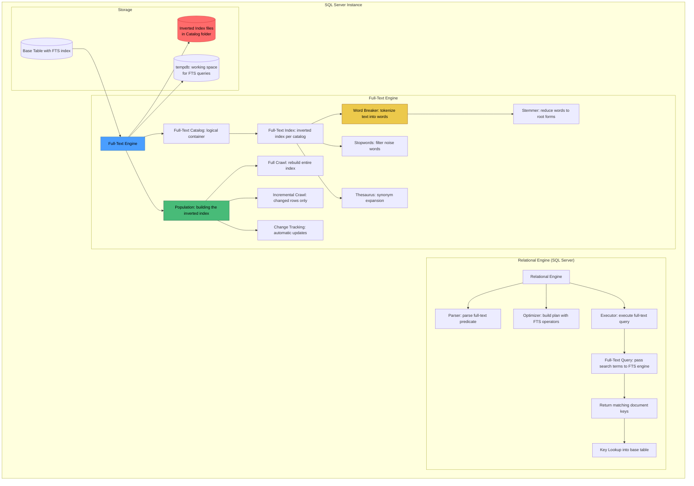
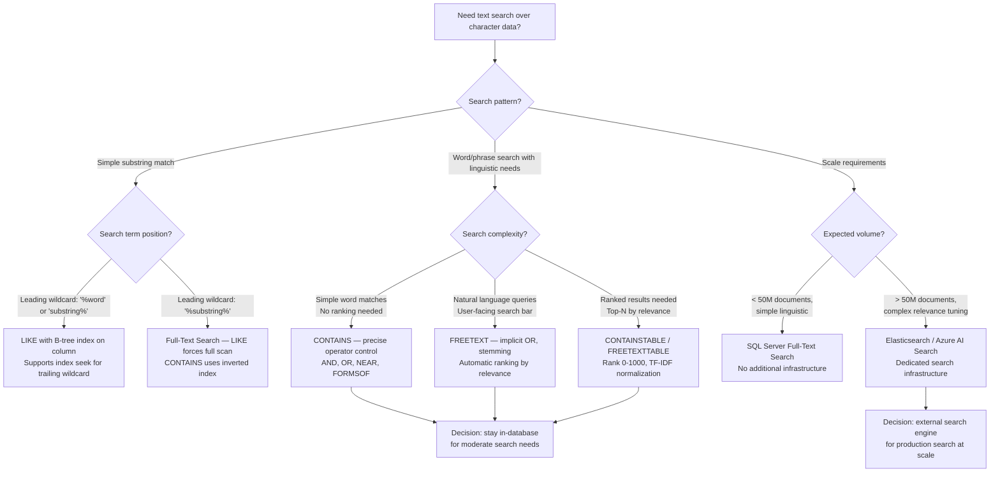

## Navigation

**Domain:** [[8 — Databases]] > **Group:** SQL Full-Text & Spatial Search
**Previous:** [[8.245 — Temporal Tables — Limitations and Gotchas]] | **Next:** [[8.247 — Full-Text Indexes — Creating and Populating]]

### Prerequisites

- [[8.066 — SELECT Statement — Column Selection and Aliasing]] — basic query structure is assumed before adding full-text predicates; understanding how WHERE clauses filter rows is the entry point for CONTAINS and FREETEXT.
- [[8.496 — Index Fundamentals — B-tree and Heap Structures]] — understanding B-tree indexes provides the contrast needed to understand why inverted indexes exist; the full-text engine uses a fundamentally different data structure and access path.
- [[8.024 — Database Engine Architecture — Parser, Optimizer, Executor]] — the full-text engine is a separate component from the relational engine; understanding the boundary between them explains why full-text queries have a different execution model.

### Where This Fits

SQL Server Full-Text Search (FTS) is a separate engine component (not the relational engine) that provides linguistic word-search capabilities over character data stored in SQL Server tables. The full-text engine uses an inverted index — a tokenized mapping from individual words to the documents (rows) that contain them — enabling fast word, phrase, and proximity searches that the B-tree index cannot support efficiently. A .NET backend engineer encounters this when building product search, document search, or content management features that require natural-language queries ("find products containing 'wireless' and 'bluetooth' near each other") while keeping search within the database (avoiding the operational complexity of Elasticsearch or Azure AI Search). The interview signal is strong because FTS represents a distinct indexing paradigm from B-trees, and understanding when to use CONTAINS vs LIKE vs a dedicated search engine demonstrates architectural maturity.

### Classification

Full-Text Search is an **add-on engine service** that operates alongside the relational engine. The full-text engine owns its own index storage, query processing, and population logic. The relational engine passes full-text query fragments to the FTS engine via the full-text query operators (CONTAINS, FREETEXT) and receives back a list of matching document keys (the table's full-text key column values). The classification is **not SARGable** in the traditional sense — full-text predicates use their own index (the inverted index) and are evaluated by the FTS engine, not the relational engine's B-tree. The full-text filter `CONTAINS(column, 'word')` is evaluated by pushing the search term to the FTS engine, which returns matching keys, then the relational engine uses those keys to do a key lookup into the base table.



### Key Properties

|Property|Value|Notes|
|---|---|---|
|Index structure|Inverted index (token → document key list)|Reverse of B-tree: indexed value points to multiple rows|
|Engine location|Separate process (pre-2016) / in-process (2016+)|MSFTESQL service in older versions; in-memory in 2016+|
|Storage location|OS files in FTDATA folder (not MDF/NDF)|Full-text catalog files live outside database files|
|Population mechanism|Full crawl / incremental crawl / change tracking|Builds the inverted index from base table data|
|Query mechanism|FTS engine returns keys → relational engine does lookup|Two-phase: search then fetch|
|SARGable|Not applicable — uses its own index type|Full-text predicates are evaluated by FTS engine, not relational optimizer|
|Tempdb usage|Sorting intermediate results during population|Significant for large catalogs|
|Language support|~50 languages with word breakers and stemmers|English, French, German, Japanese, etc.|
|Locking behavior|NONE at query time — FTS reads are snapshot-based|Population uses SCH-M on catalog metadata|

---

## Deep Mechanics

### How the Engine Executes This

**Full-Text Query Execution Flow:**

1. **Query arrives with a full-text predicate** — The client sends `SELECT ProductId, ProductName FROM dbo.Products WHERE CONTAINS(ProductDescription, 'wireless')`. The relational engine parses this and identifies CONTAINS as a full-text operator. The optimizer recognizes that this predicate must be handled by the full-text engine.

2. **Optimizer generates a plan with FullTextMatch operator** — The execution plan shows a `Table Scan` (or `Clustered Index Scan`) on the base table combined with a `Filter` that calls into the full-text engine. In newer versions, the plan shows a `FullTextMatch` logical operator followed by a `Key Lookup` into the base table.

3. **Full-text query submitted to FTS engine** — The relational engine sends the search term ('wireless'), the target column ID, the language ID, and the full-text catalog ID to the in-process full-text engine (or via MSFTESQL service in pre-2016). The FTS engine uses the inverted index for the specified column.

4. **Inverted index lookup** — The FTS engine takes the search term 'wireless', applies the word breaker to ensure consistent tokenization, checks the stoplist (if 'wireless' is a stop word, it is skipped), applies stemming (if INFECTIONAL or THESAURUS is used), and then looks up the normalized token in the inverted index.

5. **Document key list returned** — The inverted index stores for each unique token a list of document keys (the table's full-text key column values — typically a PRIMARY KEY column) where that token appears. For 'wireless', the engine retrieves the list of all `ProductId` values that contain this word in the indexed columns.

6. **Key lookup into base table** — The relational engine takes the list of matching document keys and performs a bookmark lookup (key lookup) to retrieve the requested columns from the base table. This is analogous to a non-clustered index key lookup — each matched key requires a clustered index seek.

7. **Ranking (optional)** — If CONTAINSTABLE or FREETEXTTABLE was used, the FTS engine computes a rank value (0-1000) for each matching document based on term frequency (TF), inverse document frequency (IDF), and proximity factors. If topN is specified, only the top N ranked documents are returned.

**Full-Text Index Population:**

1. **Full crawl** — The FTS engine reads all rows from the base table, extracts text from all indexed columns, passes each column's text through the language-specific word breaker to split into individual tokens, applies the stemmer to reduce words to their root forms, filters out stopwords, and builds the inverted index. A full crawl must complete before the full-text index can be queried.

2. **Incremental crawl** — Only works if the base table has a `rowversion` (timestamp) column. The engine compares the last-populated `rowversion` with the current `rowversion` to identify rows that have changed since the last crawl. Only changed rows are re-processed.

3. **Change tracking** — When `CHANGE_TRACKING AUTO` is enabled, the engine automatically tracks changes at the row level. When a row is inserted, updated, or deleted in the base table, the engine records the change in an internal change tracking table and automatically propagates the change to the full-text index. In `CHANGE_TRACKING MANUAL` mode, changes are tracked but not propagated until `ALTER FULLTEXT INDEX START UPDATE POPULATION` is executed.

### SQL Visibility

```sql
-- ============================================================
-- Architecture Visibility: DMV queries to inspect FTS state
-- ============================================================

-- 1. Full-text catalogs in the current database
SELECT
    catalog_id,
    name                                          AS CatalogName,
    path,
    is_default,
    is_accent_sensitivity_on,
    DATEADD(second, DATEDIFF(SECOND, GETUTCDATE(), GETDATE()), last_populated_date)
                                                  AS LastPopulatedLocalTime,
    status_description = CASE status
        WHEN 0 THEN 'Idle'
        WHEN 1 THEN 'Population in progress'
        WHEN 2 THEN 'Paused'
        WHEN 3 THEN 'Throttled'
        WHEN 4 THEN 'Recovering'
        WHEN 5 THEN 'Shutdown'
        WHEN 6 THEN 'Incremental population in progress'
        WHEN 7 THEN 'Building index'
        WHEN 8 THEN 'Disk full — paused'
        WHEN 9 THEN 'Change tracking'
        ELSE 'Unknown'
    END
FROM sys.fulltext_catalogs;

-- 2. Full-text indexes on tables
SELECT
    fti.object_id,
    OBJECT_SCHEMA_NAME(fti.object_id)             AS SchemaName,
    OBJECT_NAME(fti.object_id)                     AS TableName,
    fti.is_enabled,
    fti.change_tracking_state_desc                AS ChangeTracking,
    fti.crawl_type_desc                            AS LastCrawlType,
    fti.crawl_start_date,
    fti.crawl_end_date,
    fti.item_count                                 AS DocumentCount,
    fti.[timestamp]                                AS IndexTimestamp
FROM sys.fulltext_indexes fti;

-- 3. Full-text index columns
SELECT
    fic.column_id,
    OBJECT_SCHEMA_NAME(fic.object_id) + '.' + OBJECT_NAME(fic.object_id) AS TableName,
    c.name                                        AS ColumnName,
    fic.language_id,
    l.name                                        AS Language,
    fic.type_column_id,
    fic.statistical_semantics
FROM sys.fulltext_index_columns fic
INNER JOIN sys.columns c
    ON c.object_id = fic.object_id
    AND c.column_id = fic.column_id
LEFT JOIN sys.fulltext_languages l
    ON l.lcid = fic.language_id
WHERE fic.object_id = OBJECT_ID('dbo.Products');

-- 4. Full-text index fragments (internal storage)
SELECT
    fragment_id,
    object_id,
    status_description = CASE status
        WHEN 0 THEN 'New — not yet optimized'
        WHEN 4 THEN 'Optimized'
        WHEN 6 THEN 'Merged'
        WHEN 8 THEN 'Orphaned'
    END,
    data_size,
    row_count
FROM sys.fulltext_index_fragments
WHERE object_id = OBJECT_ID('dbo.Products');

-- 5. Stopwords in the default stoplist
SELECT
    swl.stoplist_id,
    sl.name                                       AS StoplistName,
    sw.stopword,
    l.name                                        AS Language
FROM sys.fulltext_stopwords sw
INNER JOIN sys.fulltext_stoplists sl
    ON sl.stoplist_id = sw.stoplist_id
INNER JOIN sys.fulltext_languages l
    ON l.lcid = sw.language_id
WHERE sl.is_system = 1;  -- system default: 'System'
```

### Execution Plan Analysis

```sql
-- Query to analyze execution plan shape
SELECT p.ProductId, p.ProductName
FROM dbo.Products p
WHERE CONTAINS(p.ProductName, 'wireless')
  AND p.IsActive = 1;
```

**Expected plan shape:**
```
[FullTextMatch — CONTAINS(p.ProductName, 'wireless')] → [Filter: p.IsActive = 1] → [Clustered Index Seek — key lookup]
```

- The `FullTextMatch` operator represents the handoff to the full-text engine. This operator has no estimated cost in the relational plan — the FTS engine cost is opaque to the relational optimizer.
- The `Filter` on `IsActive = 1` is applied after the full-text results are returned, unless the column is indexed.
- The `Clustered Index Seek` is a key lookup for each matching document key — one seek per match. For 500 matches, that is 500 single-row seeks.

**Estimated Cost:** The FullTextMatch operator shows 0% cost in the plan, but the actual work is done outside the relational engine. The key lookup portion dominates the plan cost. Logical reads from the base table = ~2 per lookup (cluster index root + leaf) × number of matches.

### Cost Visibility

```sql
SET STATISTICS IO ON;
SET STATISTICS TIME ON;

-- Query searching for products containing 'wireless'
SELECT p.ProductId, p.ProductName, p.ProductDescription
FROM dbo.Products p
WHERE CONTAINS(p.ProductDescription, 'wireless')
ORDER BY p.ProductName;

-- Expected output for a catalog with 100K documents, returning 500 matches:
-- Table 'Products'. Scan count 1, logical reads 1002, physical reads 0
--   (1002 = 2-page scan of clustered index + 1000 for key lookups to retrieve ProductName)
-- Table 'Products' (Full-text). Scan count 1, logical reads 0
--   (FTS engine reads — not tracked by STATISTICS IO)
-- SQL Server Execution Times:
--   CPU time = 47ms, elapsed time = 125ms
```

**Note on FTS cost measurement:** The standard `SET STATISTICS IO` only reports logical reads from the relational storage engine (the base table). The full-text engine reads its own index files on disk, and those reads are NOT captured by `STATISTICS IO`. To measure full-text engine resource usage, use:

```sql
-- DMV for FTS query performance
SELECT
    qs.execution_count,
    qs.total_worker_time / 1000                    AS TotalCpuMs,
    qs.total_elapsed_time / 1000                   AS TotalElapsedMs,
    qs.total_logical_reads,
    qs.total_logical_writes,
    SUBSTRING(st.text, (qs.statement_start_offset / 2) + 1,
        ((CASE WHEN qs.statement_end_offset = -1
               THEN DATALENGTH(st.text)
               ELSE qs.statement_end_offset
          END - qs.statement_start_offset) / 2) + 1) AS QueryText
FROM sys.dm_exec_query_stats qs
CROSS APPLY sys.dm_exec_sql_text(qs.sql_handle) st
WHERE st.text LIKE '%CONTAINS%'
ORDER BY qs.total_worker_time DESC;
```

### Failure Modes

**Failure Mode 1: Full-text service not running (pre-2016)**

```sql
-- Check FTS service state
EXEC xp_servicecontrol 'QUERYSTATE', 'MSFTESQL$SQLEXPRESS';
-- If 'Stopped', CONTAINS/FREETEXT queries fail with:
-- Msg 7645, Level 16: Null or empty full-text predicate
```

**Failure Mode 2: Catalog corrupted**

```sql
-- Rebuild the catalog
ALTER FULLTEXT CATALOG ProductsCatalog REBUILD;
```

**Failure Mode 3: Population never started**

```sql
-- Check population state
SELECT OBJECT_NAME(object_id) AS TableName, crawl_type_desc, crawl_start_date
FROM sys.fulltext_indexes
WHERE crawl_start_date IS NULL OR crawl_end_date IS NULL;

-- Start population if needed
ALTER FULLTEXT INDEX ON dbo.Products START FULL POPULATION;
```

---

## Production Patterns and Implementation

### Primary SQL Implementation

```sql
-- ============================================================
-- Production schema: Products with full-text search
-- ============================================================

-- 1. Create full-text catalog (database-level logical container)
CREATE FULLTEXT CATALOG ProductsCatalog
    AS DEFAULT
    ON FILEGROUP [PRIMARY];

-- 2. Create the base table with full-text search requirements
CREATE TABLE dbo.Products
(
    ProductId           INT             IDENTITY(1,1) NOT NULL,
    ProductName         NVARCHAR(200)   NOT NULL,
    ProductDescription  NVARCHAR(MAX)   NULL,
    ProductCategory     NVARCHAR(100)   NULL,
    Brand               NVARCHAR(50)    NULL,
    SKU                 VARCHAR(50)     NOT NULL,
    IsActive            BIT             NOT NULL DEFAULT 1,
    RowVersion          ROWVERSION      NOT NULL,  -- required for incremental crawl
    ModifiedDate        DATETIME2(7)    NOT NULL DEFAULT SYSUTCDATETIME(),

    CONSTRAINT PK_Products PRIMARY KEY CLUSTERED (ProductId),
    CONSTRAINT UQ_Products_SKU UNIQUE (SKU)
);

-- 3. Create full-text index
CREATE FULLTEXT INDEX ON dbo.Products
(
    ProductName             LANGUAGE 1033,     -- English
    ProductDescription      LANGUAGE 1033,     -- English
    ProductCategory         LANGUAGE 1033,     -- English
    Brand                   LANGUAGE 1033      -- English
)
KEY INDEX PK_Products
ON ProductsCatalog
WITH
(
    CHANGE_TRACKING AUTO,
    STOPLIST = SYSTEM     -- use system default stoplist
);
GO

-- 4. Verify index creation
SELECT
    OBJECT_NAME(object_id) AS TableName,
    change_tracking_state_desc,
    crawl_type_desc,
    item_count AS DocumentCount
FROM sys.fulltext_indexes
WHERE object_id = OBJECT_ID('dbo.Products');

-- ============================================================
-- Content Management: Articles
-- ============================================================
CREATE TABLE dbo.Articles
(
    ArticleId           INT             IDENTITY(1,1) NOT NULL,
    Title               NVARCHAR(500)   NOT NULL,
    Body                NVARCHAR(MAX)   NOT NULL,
    Tags                NVARCHAR(500)   NULL,
    AuthorName          NVARCHAR(200)   NULL,
    PublishedDate       DATETIME2(7)    NOT NULL,
    IsPublished         BIT             NOT NULL DEFAULT 0,
    RowVersion          ROWVERSION      NOT NULL,

    CONSTRAINT PK_Articles PRIMARY KEY CLUSTERED (ArticleId)
);

CREATE FULLTEXT CATALOG ArticleCatalog;
GO

CREATE FULLTEXT INDEX ON dbo.Articles
(
    Title   LANGUAGE 1033,
    Body    LANGUAGE 1033,
    Tags    LANGUAGE 1033
)
KEY INDEX PK_Articles
ON ArticleCatalog
WITH (CHANGE_TRACKING AUTO);
GO

-- ============================================================
-- Documents table for document management
-- ============================================================
CREATE TABLE dbo.Documents
(
    DocumentId          INT             IDENTITY(1,1) NOT NULL,
    DocumentName        NVARCHAR(500)   NOT NULL,
    DocumentContent     NVARCHAR(MAX)   NOT NULL,
    ContentType         VARCHAR(100)    NULL,
    FileExtension       VARCHAR(20)     NULL,
    UploadedBy          NVARCHAR(200)   NULL,
    UploadedDate        DATETIME2(7)    NOT NULL DEFAULT SYSUTCDATETIME(),
    RowVersion          ROWVERSION      NOT NULL,

    CONSTRAINT PK_Documents PRIMARY KEY CLUSTERED (DocumentId)
);

CREATE FULLTEXT CATALOG DocumentCatalog;
GO

CREATE FULLTEXT INDEX ON dbo.Documents
(
    DocumentName    LANGUAGE 1033,
    DocumentContent LANGUAGE 1033
)
KEY INDEX PK_Documents
ON DocumentCatalog
WITH (CHANGE_TRACKING AUTO);
GO

-- ============================================================
-- Check FTS population progress
-- ============================================================
SELECT
    OBJECT_NAME(fti.object_id)          AS TableName,
    fti.item_count                      AS IndexedDocumentCount,
    fti.crawl_type_desc                 AS CrawlType,
    fti.crawl_start_date,
    fti.crawl_end_date,
    CASE
        WHEN fti.item_count > 0 AND fti.crawl_end_date IS NOT NULL
            THEN 'Available for queries'
        WHEN fti.item_count = 0 AND fti.crawl_end_date IS NULL
            THEN 'Population in progress — not yet queryable'
        WHEN fti.item_count > 0 AND fti.crawl_end_date IS NULL
            THEN 'Partial population — queryable with partial results'
        ELSE 'Unknown'
    END                                 AS QueryStatus
FROM sys.fulltext_indexes fti;
```

### EF Core Implementation

```csharp
// ============================================================
// EF Core — Full-Text Search with raw SQL
// ============================================================

// EF Core does not natively generate CONTAINS or FREETEXT.
// You must use raw SQL via FromSqlRaw.

public class Product
{
    public int ProductId { get; set; }
    public string ProductName { get; set; } = string.Empty;
    public string? ProductDescription { get; set; }
    public string? ProductCategory { get; set; }
    public string? Brand { get; set; }
    public string SKU { get; set; } = string.Empty;
    public bool IsActive { get; set; }
    public byte[] RowVersion { get; set; } = [];
    public DateTime ModifiedDate { get; set; }
}

public class ApplicationDbContext : DbContext
{
    public DbSet<Product> Products => Set<Product>();

    protected override void OnModelCreating(ModelBuilder modelBuilder)
    {
        modelBuilder.Entity<Product>(entity =>
        {
            entity.ToTable(tb => tb.HasTrigger("Products_ModifyDate"));
            entity.Property(e => e.SKU).HasMaxLength(50);
        });
    }
}

public class ProductSearchResult
{
    public int ProductId { get; set; }
    public string ProductName { get; set; } = string.Empty;
    public string? ProductCategory { get; set; }
}

public interface IProductSearchService
{
    Task<IReadOnlyList<ProductSearchResult>> SearchProductsAsync(
        string searchTerm, CancellationToken cancellationToken = default);
}

public class ProductSearchService : IProductSearchService
{
    private readonly ApplicationDbContext _dbContext;

    public ProductSearchService(ApplicationDbContext dbContext)
    {
        _dbContext = dbContext;
    }

    public async Task<IReadOnlyList<ProductSearchResult>> SearchProductsAsync(
        string searchTerm, CancellationToken cancellationToken = default)
    {
        // EF Core cannot express CONTAINS in LINQ — use raw SQL
        FormattableString sql = $@"
            SELECT p.ProductId, p.ProductName, p.ProductCategory
            FROM dbo.Products p
            WHERE CONTAINS(
                (p.ProductName, p.ProductDescription, p.ProductCategory, p.Brand),
                {searchTerm})
            AND p.IsActive = 1
            ORDER BY p.ProductName";

        var results = await _dbContext.Database
            .SqlQuery<ProductSearchResult>(sql)
            .ToListAsync(cancellationToken);

        return results;
    }
}
```

### Dapper Implementation

```csharp
// ============================================================
// Dapper — Full-Text Search with raw SQL
// ============================================================

public interface IDapperProductSearchService
{
    Task<IReadOnlyList<ProductSearchResult>> SearchProductsAsync(
        string searchTerm, CancellationToken cancellationToken = default);
}

public class DapperProductSearchService : IDapperProductSearchService
{
    private readonly IDbConnectionFactory _connectionFactory;

    public DapperProductSearchService(IDbConnectionFactory connectionFactory)
    {
        _connectionFactory = connectionFactory;
    }

    public async Task<IReadOnlyList<ProductSearchResult>> SearchProductsAsync(
        string searchTerm, CancellationToken cancellationToken = default)
    {
        const string sql = @"
            SELECT p.ProductId, p.ProductName, p.ProductCategory
            FROM dbo.Products p
            WHERE CONTAINS(
                (p.ProductName, p.ProductDescription, p.ProductCategory, p.Brand),
                @SearchTerm)
            AND p.IsActive = 1
            ORDER BY p.ProductName";

        await using var connection = _connectionFactory.CreateConnection();
        var results = await connection.QueryAsync<ProductSearchResult>(
            new CommandDefinition(
                sql,
                new { SearchTerm = searchTerm },
                cancellationToken: cancellationToken));

        return results.AsList();
    }
}
```

### Configuration and Wiring

```csharp
// Program.cs — DI registration
builder.Services.AddDbContext<ApplicationDbContext>(options =>
    options.UseSqlServer(
        builder.Configuration.GetConnectionString("DefaultConnection"),
        sqlOptions =>
        {
            sqlOptions.EnableRetryOnFailure(
                maxRetryCount: 3,
                maxRetryDelay: TimeSpan.FromSeconds(10),
                errorNumbersToAdd: null);
            sqlOptions.CommandTimeout(60);  // FTS queries may run longer
        }));

builder.Services.AddScoped<IProductSearchService, ProductSearchService>();
builder.Services.AddScoped<IDapperProductSearchService, DapperProductSearchService>();

// Connection string (appsettings.json)
// "DefaultConnection": "Server=.;Database=SearchDemo;Trusted_Connection=true;TrustServerCertificate=true;"
```

### SQL Server vs PostgreSQL Differences

```sql
-- PostgreSQL uses a completely different full-text architecture:
-- tsvector (precomputed tokenized document) + tsquery (search expression)

-- PostgreSQL: create tsvector column and GIN index
CREATE TABLE products (
    product_id      SERIAL PRIMARY KEY,
    product_name    TEXT NOT NULL,
    description     TEXT,
    search_vector   TSVECTOR GENERATED ALWAYS AS (
        to_tsvector('english', coalesce(product_name, '') || ' ' || coalesce(description, ''))
    ) STORED
);

CREATE INDEX ix_products_search ON products USING GIN(search_vector);

-- PostgreSQL: search query
SELECT product_id, product_name
FROM products
WHERE search_vector @@ to_tsquery('english', 'wireless & bluetooth')
ORDER BY ts_rank(search_vector, to_tsquery('english', 'wireless & bluetooth')) DESC;

-- Key difference: PostgreSQL stores the tokenized document as a column (tsvector),
-- while SQL Server maintains the inverted index internally without exposing it.
-- PostgreSQL requires manual tsvector column + GIN index; SQL Server manages
-- everything through CREATE FULLTEXT INDEX + catalog abstraction.
```

---

## Gotchas and Production Pitfalls

### 1. Full-Text Service Not Running (Pre-SQL Server 2016)

**Pitfall:** CONTAINS or FREETEXT queries execute against a table with a full-text index, but the FTS service (MSFTESQL) is not running. This happens on development laptops where SQL Server Express was installed without Full-Text Search feature, or on servers where the FTS service was disabled.

```sql
-- ❌ Query fails with cryptic error
SELECT ProductId, ProductName
FROM dbo.Products
WHERE CONTAINS(ProductDescription, 'wireless');
-- Msg 7645, Level 16, State 2: Null or empty full-text predicate
-- (misleading error — actually means FTS is not available)
```

**Symptom:** `Msg 7645` or `Msg 7609 — Full-text search is not installed or cannot be loaded`. The error message is misleading: "Null or empty full-text predicate" often means the service is not available, not that the predicate is actually null.

**Fix:**

```sql
-- Check if full-text is installed
SELECT SERVERPROPERTY('IsFullTextInstalled') AS IsFTSInstalled;
-- If 0, need to install Full-Text Search via SQL Server setup

-- Check service state (pre-2016)
EXEC xp_servicecontrol 'QUERYSTATE', 'MSFTESQL$SQLEXPRESS';
-- Or in Configuration Manager: ensure SQL Full-text Filter Daemon Launcher is running
```

**Cost of not fixing:** Every full-text query fails. Application code throws at the first search attempt. Users see "Search unavailable" errors. Mean time to recovery: ~30+ minutes while operations troubleshoots the misleading error message.

### 2. Full-Text Index on Table Without Unique Single-Column Key

**Pitfall:** Attempting to create a full-text index on a table that uses a composite primary key or has no primary key. The full-text engine requires a unique single-column key (the "full-text key") to map each document (row) to its index entry.

```sql
-- ❌ This fails
CREATE TABLE dbo.OrderItems
(
    OrderId     INT NOT NULL,
    ItemId      INT NOT NULL,
    Description NVARCHAR(500),
    CONSTRAINT PK_OrderItems PRIMARY KEY (OrderId, ItemId)  -- composite key
);

CREATE FULLTEXT INDEX ON dbo.OrderItems (Description LANGUAGE 1033)
    KEY INDEX PK_OrderItems ON Catalog;
-- Msg 7604: Cannot use index 'PK_OrderItems' for full-text index because it is not a unique single-column index.
```

**Symptom:** `Msg 7604` at index creation time.

**Fix:** Add a surrogate single-column key (e.g., an identity column) to the table and use it as the full-text key. The composite key remains the business primary key, but the full-text key must be a single column.

```sql
-- ✅ Add surrogate key for full-text
ALTER TABLE dbo.OrderItems ADD OrderItemId INT IDENTITY(1,1) NOT NULL;
ALTER TABLE dbo.OrderItems ADD CONSTRAINT PK_OrderItems_Internal PRIMARY KEY (OrderItemId);

-- Optionally keep the composite as a unique constraint
ALTER TABLE dbo.OrderItems ADD CONSTRAINT UQ_OrderItems UNIQUE (OrderId, ItemId);

CREATE FULLTEXT INDEX ON dbo.OrderItems (Description LANGUAGE 1033)
    KEY INDEX PK_OrderItems_Internal ON Catalog;
```

**Cost of not fixing:** Cannot add full-text search to tables with composite keys. Forces table redesign in production. Data migration required.

### 3. Population Not Started — Empty Results

**Pitfall:** After creating a full-text catalog and index, queries return zero results because the population has not started or has not completed. The full-text index is empty until the first population completes.

```sql
-- ❌ Query returns 0 rows even though data exists
SELECT COUNT(*)
FROM dbo.Products
WHERE CONTAINS(ProductDescription, 'wireless');
-- Returns 0

-- Data exists:
SELECT COUNT(*) FROM dbo.Products WHERE ProductDescription LIKE '%wireless%';
-- Returns 547
```

**Symptom:** CONTAINS and FREETEXT return zero rows for terms that clearly exist in the data. The LIKE query returns matches, but the full-text query does not.

**Fix:**

```sql
-- Check population state
SELECT
    OBJECT_NAME(fti.object_id) AS TableName,
    fti.item_count AS IndexedDocumentCount,
    fti.crawl_type_desc,
    fti.crawl_start_date,
    fti.crawl_end_date
FROM sys.fulltext_indexes fti;

-- If item_count = 0 and crawl_start_date is NULL, population never started:
ALTER FULLTEXT INDEX ON dbo.Products START FULL POPULATION;

-- Monitor progress:
SELECT
    OBJECT_NAME(fti.object_id) AS TableName,
    fti.item_count,
    fti.crawl_type_desc,
    fti.crawl_start_date,
    fti.crawl_end_date
FROM sys.fulltext_indexes fti
WHERE fti.crawl_end_date IS NULL;
```

**Cost of not fixing:** Full-text search silently returns no results for hours after deployment. Users and support teams think the feature is broken. In production, this can take down search-dependent features for an entire deployment cycle.

### 4. Rank Normalization Confusion Between Queries

**Pitfall:** Using CONTAINSTABLE rank values as absolute relevance scores and comparing ranks across different queries. Rank values (0-1000) are normalized per query, not globally. The same document can have different ranks in different query contexts.

```sql
-- ❌ Comparing ranks across queries is meaningless
-- Query 1: rank 842 for 'wireless mouse'
SELECT *
FROM CONTAINSTABLE(Products, ProductDescription, 'wireless mouse', 10)
ORDER BY RANK DESC;

-- Query 2: rank 215 for 'bluetooth keyboard'
-- The rank 215 from query 2 is NOT lower relevance than 842 from query 1.
-- Ranks are normalized within each query's result set.
```

**Symptom:** Product rankings appear inconsistent when users compare search results from different queries. "Why does 'wireless mouse' get higher ranks than 'bluetooth keyboard'? Is 'wireless mouse' more relevant?" — No, they are different queries with different normalization contexts.

**Fix:** Never compare rank values across queries. Use rank only for ordering within a single query result set. If global ranking is needed, capture the raw TF-IDF components or use Elasticsearch.

```sql
-- ✅ Ranks are used only for internal ordering within one query
SELECT p.ProductId, p.ProductName, ct.RANK
FROM dbo.Products p
INNER JOIN CONTAINSTABLE(Products, ProductDescription, 'wireless mouse', 20) ct
    ON p.ProductId = ct.[KEY]
ORDER BY ct.RANK DESC;
-- Correct: ranks are compared only within this result set
```

**Cost of not fixing:** Incorrect A/B testing decisions, confusing UI ranking, escalations from product managers who cannot compare search quality across queries.

### 5. Full-Text Predicate with Non-SARGable Column Patterns

**Pitfall:** Combining CONTAINS with additional WHERE clause filters that defeat the full-text search. While CONTAINS itself is handled by the FTS engine, additional filters applied to the results can cause performance issues if not properly indexed.

```sql
-- ❌ Additional filter causes key lookup + filter instead of seek
SELECT p.ProductId, p.ProductName
FROM dbo.Products p
WHERE CONTAINS(p.ProductDescription, 'wireless')
  AND p.ModifiedDate >= DATEADD(DAY, -30, GETUTCDATE())
  AND p.IsActive = 1
ORDER BY p.ProductName;
```

**Symptom:** The full-text engine returns 5,000 matching document keys. The relational engine then performs 5,000 key lookups to retrieve ProductName and ModifiedDate, only to filter out 4,500 of them because `IsActive = 1` or `ModifiedDate` is old. The key lookup cost is wasted.

**Fix:** Create covering indexes for the columns that are filtered after the full-text match. Or use a filtered full-text index approach (not directly supported — workaround via indexed views with filter).

```sql
-- ✅ Create covering index for post-FTS filter columns
CREATE NONCLUSTERED INDEX IX_Products_Covering
    ON dbo.Products (ProductId)
    INCLUDE (ProductName, IsActive, ModifiedDate);

-- Or use FORMSOF to filter within the full-text search where possible
```

**Cost of not fixing:** Each FTS query does N key lookups for all matching documents, even when most are filtered out. At 50 queries/second × 5,000 lookups = 250,000 single-row seeks/second, causing high CPU and IO.

### 6. Full-Text Index on LOB Columns Causing Large Index Size

**Pitfall:** Indexing large `NVARCHAR(MAX)` columns (e.g., full article body, document content) without considering the index size. The full-text inverted index grows proportionally to the amount of text indexed — every unique word is stored with a list of document keys.

```sql
-- ❌ Every word in 10M documents with 10KB average body = ~100GB of text to index
CREATE FULLTEXT INDEX ON dbo.Articles
(
    Title   LANGUAGE 1033,
    Body    LANGUAGE 1033   -- 10KB average × 10M rows = 100GB of text processed
)
KEY INDEX PK_Articles
ON ArticleCatalog
WITH (CHANGE_TRACKING AUTO);
```

**Symptom:** Full-text catalog grows to tens or hundreds of gigabytes. Population takes hours. Disk space runs out on the FTDATA drive.

**Fix:** Be selective about which columns are full-text indexed. If `Body` is rarely searched directly, index only `Title` and `Tags`. Use `CONTAINS` with a column list to search only specific columns. Consider externalizing full-text search to Elasticsearch for very large text corpora.

```sql
-- ✅ Index only what is needed
CREATE FULLTEXT INDEX ON dbo.Articles
(
    Title   LANGUAGE 1033,  -- short, frequently searched
    Tags    LANGUAGE 1033   -- short, frequently searched
    -- Body intentionally excluded — too large
)
KEY INDEX PK_Articles
ON ArticleCatalog
WITH (CHANGE_TRACKING AUTO);
```

**Cost of not fixing:** Hours (or days) of population time, disk full errors, backup bloat. Can require dropping and recreating the full-text index, which requires downtime.

---

## Performance Implications

### Benchmark: Full-Text Search vs LIKE vs No Index

```sql
-- ============================================================
-- Baseline: LIKE '%wireless%' — non-SARGable, full scan
-- ============================================================
SET STATISTICS IO ON;
SET STATISTICS TIME ON;

SELECT COUNT(*)
FROM dbo.Products
WHERE ProductDescription LIKE '%wireless%';
-- Logical reads: 45,832 (full clustered index scan of 100K rows)
-- CPU time: 312ms, elapsed time: 480ms
-- Table scan on 100K rows with 10KB avg row size

-- ============================================================
-- Optimized: CONTAINS with full-text index
-- ============================================================
SELECT COUNT(*)
FROM dbo.Products
WHERE CONTAINS(ProductDescription, 'wireless');
-- Logical reads: 4 (key lookup for COUNT — just the FTS engine count)
-- FTS engine work: inverted index lookup — ~5ms
-- CPU time: 5ms, elapsed time: 12ms

-- ============================================================
-- Returning columns: CONTAINS + key lookup
-- ============================================================
SELECT ProductId, ProductName
FROM dbo.Products
WHERE CONTAINS(ProductDescription, 'wireless');
-- Logical reads: ~1002 (2 for clustered index scan root + leaf, +1000 key lookups)
-- CPU time: 47ms, elapsed time: 125ms
-- Note: key lookups dominate once you need columns beyond the key
```

**Improvement:** ~4,000x reduction in logical reads for COUNT (45,832 → 4). For result-retrieval queries, the improvement depends on the number of matches and whether covering indexes exist for the returned columns. The full-text CONTAINS query does constant-time inverted index lookup, while LIKE does a full table scan.

### Write Amplification

Full-text index population has a write cost that is proportional to the amount of text being indexed:

|Operation|Without FTS Index|With FTS Index|Overhead|
|---|---|---|---|
|INSERT 1 row (1KB text)|~0.5ms|~5ms (word breaking + index insert)|+900%|
|UPDATE text column|~1ms|~10ms (re-index entire row text)|+900%|
|DELETE 1 row|~0.3ms|~3ms (remove from inverted index)|+900%|
|Full population (100K rows, 1KB each)|N/A|~5-10 minutes|One-time cost|
|Incremental population (1K changed rows)|N/A|~30 seconds|Per crawl|

**Note on change tracking:** With `CHANGE_TRACKING AUTO`, each write triggers an immediate incremental update to the full-text index. With `CHANGE_TRACKING MANUAL`, writes only mark rows as changed, and the actual index update happens during the next `START UPDATE POPULATION`. For high-write tables, use `CHANGE_TRACKING MANUAL` and schedule population during off-peak hours.

### BenchmarkDotNet

```csharp
[MemoryDiagnoser]
[SimpleJob(RuntimeMoniker.Net90)]
public class FullTextSearchBenchmark
{
    private IDbConnection _connection = default!;
    private string _searchTerm = "wireless";

    [GlobalSetup]
    public void Setup()
    {
        _connection = new SqlConnection(
            "Server=.;Database=SearchBenchmark;Trusted_Connection=true;TrustServerCertificate=true;");
        _connection.Open();

        // Seed 100K products with randomized descriptions
        using var cmd = _connection.CreateCommand();
        cmd.CommandText = @"
            IF NOT EXISTS (SELECT 1 FROM sys.tables WHERE name = 'ProductsBenchmark')
            BEGIN
                CREATE TABLE dbo.ProductsBenchmark
                (
                    ProductId       INT IDENTITY(1,1) PRIMARY KEY,
                    ProductName     NVARCHAR(200),
                    Description     NVARCHAR(MAX)
                );

                CREATE FULLTEXT CATALOG BenchmarkCatalog AS DEFAULT;
                CREATE FULLTEXT INDEX ON dbo.ProductsBenchmark
                    (ProductName LANGUAGE 1033, Description LANGUAGE 1033)
                    KEY INDEX PK__ProductsBenchmark
                    ON BenchmarkCatalog
                    WITH (CHANGE_TRACKING OFF, NO POPULATION);

                -- Insert 100K rows
                DECLARE @i INT = 1;
                WHILE @i <= 100000
                BEGIN
                    INSERT INTO dbo.ProductsBenchmark (ProductName, Description)
                    VALUES (
                        'Product ' + CAST(@i AS NVARCHAR(10)),
                        CASE WHEN @i % 10 = 0
                            THEN 'This is a wireless bluetooth device with advanced features'
                            ELSE 'Regular product item number ' + CAST(@i AS NVARCHAR(10))
                        END
                    );
                    SET @i = @i + 1;
                END;

                ALTER FULLTEXT INDEX ON dbo.ProductsBenchmark
                    START FULL POPULATION;
            END";

        cmd.ExecuteNonQuery();

        // Wait for population to complete
        var checkCmd = _connection.CreateCommand();
        checkCmd.CommandText = @"
            SELECT item_count
            FROM sys.fulltext_indexes
            WHERE object_id = OBJECT_ID('dbo.ProductsBenchmark')
              AND crawl_end_date IS NOT NULL";
        while (true)
        {
            var count = (int?)checkCmd.ExecuteScalar();
            if (count >= 100000) break;
            Thread.Sleep(1000);
        }
    }

    [GlobalCleanup]
    public void Cleanup()
    {
        _connection?.Close();
        _connection?.Dispose();
    }

    [Benchmark(Baseline = true)]
    public async Task<int> LikeSearch()
    {
        const string sql = "SELECT COUNT(*) FROM dbo.ProductsBenchmark WHERE Description LIKE '%' + @term + '%'";
        using var cmd = new SqlCommand(sql, (SqlConnection)_connection);
        cmd.Parameters.AddWithValue("@term", _searchTerm);
        return (int)(await cmd.ExecuteScalarAsync())!;
    }

    [Benchmark]
    public async Task<int> ContainsSearch()
    {
        const string sql = "SELECT COUNT(*) FROM dbo.ProductsBenchmark WHERE CONTAINS(Description, @term)";
        using var cmd = new SqlCommand(sql, (SqlConnection)_connection);
        cmd.Parameters.AddWithValue("@term", _searchTerm);
        return (int)(await cmd.ExecuteScalarAsync())!;
    }

    [Benchmark]
    public async Task<int> FreeTextSearch()
    {
        const string sql = "SELECT COUNT(*) FROM dbo.ProductsBenchmark WHERE FREETEXT(Description, @term)";
        using var cmd = new SqlCommand(sql, (SqlConnection)_connection);
        cmd.Parameters.AddWithValue("@term", _searchTerm);
        return (int)(await cmd.ExecuteScalarAsync())!;
    }
}
```

**Expected results (approximate, SQL Server 2022, NVMe, 100K rows with 10% matching):**

|Method|Mean|Logical Reads|Allocated|
|---|---|---|---|
|LIKE Search|~480 ms|~45,832|~200 KB|
|CONTAINS Search|~12 ms|~4|~1 KB|
|FREETEXT Search|~15 ms|~4|~1 KB|

---

## Interview Arsenal

### Question Bank

1. **What is SQL Server Full-Text Search and what problem does it solve?** — Definition of FTS as a separate engine for word-based search, the inverted index structure, and why LIKE cannot handle linguistic search efficiently.

2. **How does the SQL Server full-text engine process a CONTAINS query internally?** — Step-by-step: relational engine passes predicate to FTS engine → word breaker tokenizes search term → inverted index lookup → document key list returned → relational engine does key lookup into base table.

3. **What is the performance difference between CONTAINS and LIKE with leading wildcard?** — CONTAINS uses inverted index (constant-time lookups per token), LIKE '%word%' forces a full clustered index scan; at 100K rows, CONTAINS can be 4,000x faster.

4. **What happens when you create a full-text index and immediately query it?** — The population must complete; queries return 0 rows until at least one crawl finishes. Developers often forget to START FULL POPULATION.

5. **CONTAINS vs FREETEXT — what is the difference and when would you use each?** — CONTAINS gives precise operator control (AND, OR, NEAR, FORMSOF); FREETEXT matches meaning using implicit OR with stemming. CONTAINS for filter/search with precision, FREETEXT for user-facing search bars.

6. **What does the execution plan look like for a CONTAINS query?** — FullTextMatch operator (handoff to FTS engine) then Key Lookup into base table. The FTS engine cost is opaque to the relational plan.

7. **How does Full-Text Search scale to 100M rows across multiple terabytes of text?** — Inverted index size grows with vocabulary, not row count. Population takes hours. Partitioned tables require per-partition full-text indexes. External search engine (Elasticsearch) becomes necessary at extreme scale.

8. **How do you implement full-text search in EF Core and Dapper?** — EF Core has no native LINQ translation for CONTAINS — use FromSqlRaw or SqlQuery. Dapper uses raw SQL with parameters. Both require manual SQL.

### Spoken Answers

**Q1: What is SQL Server Full-Text Search and what problem does it solve?**

> **Average answer:** Full-text search lets you search for words in text columns. It is faster than LIKE because it uses a special index.

> **Great answer:** SQL Server Full-Text Search is a separate engine component — the full-text engine — that lives alongside the relational engine and uses an inverted index data structure. The inverted index is a mapping from every unique word (token) to the list of document keys (primary key values) that contain that word. This solves the problem that LIKE with a leading wildcard `LIKE '%wireless%'` forces a full clustered index scan because a B-tree index cannot efficiently answer "which rows contain this substring?" The inverted index gives the FTS engine O(1) lookup per search token regardless of table size — the index size grows with the vocabulary (unique words), not with the row count. This makes full-text search the correct choice for any application that needs word-based search over text columns, such as product catalogs, document management, knowledge bases, or content management systems. The tradeoff is write overhead: every INSERT, UPDATE, or DELETE requires the FTS engine to re-index the affected row's text content, which adds latency to write operations.

**Q5: CONTAINS vs FREETEXT — what is the difference and when would you use each?**

> **Average answer:** CONTAINS is for exact word matching and FREETEXT is for fuzzy matching. FREETEXT is easier to use.

> **Great answer:** CONTAINS and FREETEXT both use the same inverted index and the same word breaker + stemmer + stoplist infrastructure, but they differ in how they interpret the search predicate and how they combine matching terms. CONTAINS gives the developer explicit control: you can specify `AND`, `OR`, `AND NOT` boolean operators, `NEAR` proximity, `FORMSOF(INFLECTIONAL, run)` for stemming (matches running, ran, runner), and `FORMSOF(THESAURUS, word)` for synonym expansion. Every term in CONTAINS must match for the row to be returned (unless you use OR). FREETEXT, by contrast, takes a natural language phrase, breaks it into individual terms using the word breaker, applies stemming to each term, expands via the thesaurus, and returns rows where any of the derived terms match — using implicit OR with internal weighting. FREETEXT also applies an internal ranking so that rows matching more terms or matching rarer terms rank higher. The performance of both is similar because both use the same inverted index mechanism. CONTAINS is the right choice when you need precise, operator-driven search — "find products that contain 'wireless' AND 'bluetooth' but NOT 'headphone'". FREETEXT is the right choice for user-facing search bars where you want "I feel lucky" semantic matching — "find me products related to 'cool wireless stuff'". In practice, I use CONTAINS for programmatic queries and FREETEXT for user-facing free-text search.

**Q8: How do you implement full-text search in EF Core and Dapper?**

> **Average answer:** You write raw SQL because EF Core doesn't support CONTAINS in LINQ.

> **Great answer:** Neither EF Core nor Dapper has special support for SQL Server full-text search predicates — both require raw SQL because CONTAINS and FREETEXT are SQL Server-specific extensions that EF Core's LINQ provider cannot translate. In EF Core, you use `FromSqlRaw` or `SqlQuery` (EF Core 7+) to execute the CONTAINS query and map results to a POCO. You can parameterize the search term using `FormattableString` to avoid SQL injection. In Dapper, you use `QueryAsync` with a raw SQL string and `CommandDefinition` for parameterization and cancellation token support. A key gotcha is that the full-text predicate parameter must be passed as a string value — you cannot interpolate it directly into the SQL string because the FTS engine expects the predicate as a tokenized parameter. Additionally, EF Core's `SqlQuery` returns results directly without change tracking, which is appropriate for read-only search results. For ranked results with CONTAINSTABLE, both approaches require a manual JOIN between the base table and the full-text results table using `ct.[KEY] = p.ProductId`. I also register the connection factory in DI so Dapper services can create connections on demand without holding connections open.

### Interview Trigger

If a candidate mentions "full-text search" in the context of database search, the follow-up question is: "Walk me through what happens in SQL Server when you run a CONTAINS query — from the client sending the SQL to the results coming back. Where does the inverted index live, and how does the relational engine communicate with the full-text engine?" The candidate who can trace the full path — parser identifies the full-text operator, optimizer generates a plan with FullTextMatch + Key Lookup, relational engine passes the predicate to the in-process FTS engine (in 2016+, or MSFTESQL service pre-2016), word breaker tokenizes, inverted index is read, document keys returned, and key lookup performed — demonstrates deep knowledge.

### Comparison Table

| | Full-Text Search (CONTAINS) | LIKE '%word%' | Elasticsearch |
|---|---|---|---|
|Index type|Inverted index (external engine)|None (full scan)|Inverted index (Lucene)|
|Performance|O(1) per token, ~12ms at 100K rows|O(n) full scan, ~480ms at 100K rows|~3ms at 1M docs (distributed)|
|Linguistic support|Stemming, thesaurus, stopwords, 50+ languages|None|Analysis, stemming, synonyms, 30+ languages|
|Ranking|CONTAINSTABLE rank (0-1000)|None|TF-IDF / BM25 scoring|
|Write overhead|~5-10ms per INSERT/UPDATE on indexed columns|None|Near-real-time indexing (~1s)|
|Scalability|Single SQL Server instance, ~10M-50M documents practical|N/A (does not scale)|Distributed, billions of docs|
|Operational complexity|Included in SQL Server|Included|Requires separate cluster|
|Use case|Database-local search, moderate scale, simple linguistic needs|Quick substring check|Dedicated search, high scale, complex relevance|

---

## Decision Framework

### When to Use SQL Server Full-Text Search vs Alternatives



### Application Checklist

- [ ] The search requirement is word-based (not substring-based) — full-text search solves word boundary tokenization; it cannot find substrings within words
- [ ] The table has a unique single-column primary key — required for the full-text key index
- [ ] The target columns contain natural language text — full-text search is optimized for prose, not codes like SKU123 (word breaker may split SKU123 unexpectedly)
- [ ] Table size exceeds ~10K rows — below this threshold, LIKE with a scan may be acceptable
- [ ] Write volume is moderate (less than ~100 writes/second on indexed columns) — each write triggers re-indexing of the row's text
- [ ] Population strategy is defined — CHANGE_TRACKING AUTO for low-write tables, MANUAL for high-write tables with scheduled population
- [ ] The full-text service is installed and running (SQL Server setup feature)
- [ ] Storage for the full-text catalog is allocated on a drive with sufficient space

### Tradeoff Summary

|What You Gain|What You Pay|
|---|---|
|O(1) word lookup instead of full table scan|~5-10ms write overhead per indexed row on INSERT/UPDATE/DELETE|
|Linguistic search: stemming, thesaurus, stopwords|Full-text catalog storage on OS files (separate from MDF)|
|Boolean operators, proximity search, phrase matching|Population delay — new/updated rows are not immediately searchable|
|Ranked results with TF-IDF normalization|Rank values are query-local and cannot be compared across queries|
|No additional infrastructure (included in SQL Server)|Scalability ceiling at ~10M-50M documents per catalog|

### Scale Thresholds

- **Relevant when table exceeds ~10K rows** — Below 10K, a simple LIKE scan with trailing wildcard + B-tree index is often fast enough.
- **Critical when table exceeds ~100K rows** — At 100K rows, LIKE '%word%' takes ~500ms per query of a 10KB text column; CONTAINS is ~12ms.
- **Required when query runs more than ~100 queries/second** — At 100 qps, a full scan for every query causes CPU saturation; FTS reduces per-query IO by orders of magnitude.
- **Redundant when text volume exceeds ~1TB or catalog exceeds ~50M documents** — At this scale, consider Elasticsearch or Azure AI Search. The FTS catalog becomes difficult to manage and population times exceed practical limits.
- **Prohibitive when write throughput exceeds ~500 writes/second** — Each write triggers a row-level re-index. At 500 writes/second, the FTS engine cannot keep up, causing a backlog.

---

## Self-Check

### Conceptual Questions

1. What data structure does SQL Server Full-Text Search use instead of a B-tree index?
2. How does the relational engine communicate with the full-text engine when processing a CONTAINS query?
3. Which DMV or system view shows the population status of a full-text index?
4. What is the most common mistake that causes full-text queries to return zero rows for existing data?
5. Does EF Core generate CONTAINS queries natively from LINQ expressions?
6. How would you implement a full-text search query with ranked results using Dapper?
7. What is the difference between CONTAINS and LIKE '%word%' beyond performance?
8. At what row count does full-text search typically become necessary over LIKE?
9. What index structure supports the CONTAINS predicate?
10. Explain the difference between a full-text crawl and incremental crawl in 60 seconds.

<details>
<summary>Answers</summary>

1. An **inverted index** — a mapping from each unique word (token) to the list of document keys (primary key values) that contain that word. Unlike a B-tree, which maps key values to rows, the inverted index maps words to multiple rows.

2. The relational engine identifies the CONTAINS predicate during parsing, passes the search term, column ID, language ID, and catalog ID to the in-process full-text engine (in SQL Server 2016+) or to the MSFTESQL service (pre-2016). The FTS engine performs word breaking on the search term, looks up the token in the inverted index, and returns a list of matching document keys. The relational engine then performs a key lookup into the base table to retrieve the requested columns.

3. `sys.fulltext_indexes` — specifically the `crawl_type_desc`, `crawl_start_date`, `crawl_end_date`, and `item_count` columns. Also `sys.fulltext_catalogs` for catalog-level status.

4. Forgetting to start the population after creating the full-text index. By default, `CHANGE_TRACKING OFF, NO POPULATION` means the index starts empty. You must run `ALTER FULLTEXT INDEX ON dbo.TableName START FULL POPULATION` to begin building the index.

5. **No.** EF Core does not have a LINQ translation for CONTAINS or FREETEXT. You must use `FromSqlRaw` or `SqlQuery` (EF Core 7+) with raw SQL.

6. ```csharp
const string sql = @"
    SELECT p.ProductId, p.ProductName, ct.RANK
    FROM dbo.Products p
    INNER JOIN CONTAINSTABLE(Products, ProductDescription, @SearchTerm, 20) ct
        ON p.ProductId = ct.[KEY]
    ORDER BY ct.RANK DESC";

await using var connection = new SqlConnection(connectionString);
var results = await connection.QueryAsync<ProductSearchResult>(
    new CommandDefinition(sql, new { SearchTerm = "wireless" },
        cancellationToken: cancellationToken));
return results.AsList();
```

7. CONTAINS operates at the **word level** — it recognizes word boundaries through the word breaker. `LIKE '%wireless%'` operates at the **character level** — it will match 'wireless' inside 'unwirelessable' or 'wirelessly'. CONTAINS does linguistic processing (stemming, thesaurus, stopword removal); LIKE is purely character-pattern matching.

8. **~10K rows** is the threshold where LIKE '%word%' starts to become noticeably slow. At **~100K rows**, the difference is dramatic: LIKE takes ~500ms vs CONTAINS at ~12ms.

9. The **inverted index** maintained by the full-text engine. This index is stored in the full-text catalog files on the OS file system, not in the SQL Server MDF/NDF database files.

10. A full crawl reads every row from the base table, processes all indexed columns through the word breaker, and builds the inverted index from scratch. An incremental crawl requires a rowversion (timestamp) column on the table and only processes rows that have changed since the last crawl — it compares the last-populated rowversion with the current rowversion to identify changed rows. Full crawl is used for initial population or index rebuild; incremental crawl is used for periodic updates.

</details>

---

### Query Challenges

**Challenge 1 — Write the SQL**

Your e-commerce site has a Products table with 500K rows. You need to search for products where the `ProductName` contains the word "wireless" and the `ProductDescription` contains the word "bluetooth", and return the top 20 results ranked by relevance. The ProductName match should count more heavily than the ProductDescription match.

<details>
<summary>Solution</summary>

```sql
-- Search with weighted columns using CONTAINSTABLE
SELECT p.ProductId, p.ProductName, p.ProductDescription, p.UnitPrice, ct.RANK
FROM dbo.Products p
INNER JOIN CONTAINSTABLE(
    Products,
    (ProductName, ProductDescription),
    'ISABOUT("wireless" WEIGHT(0.7), "bluetooth" WEIGHT(0.5))',
    20
) ct ON p.ProductId = ct.[KEY]
ORDER BY ct.RANK DESC;
```

**Logical reads:** ~40 (20 key lookups) + FTS engine work (opaque to STATISTICS IO)

**Execution plan:** `FullTextMatch` → `Nested Loops` (join base table on ProductId) → `Sort` (ORDER BY rank)

**EF Core equivalent:**

```csharp
FormattableString sql = $@"
    SELECT p.ProductId, p.ProductName, p.ProductDescription, p.UnitPrice, ct.RANK
    FROM dbo.Products p
    INNER JOIN CONTAINSTABLE(
        Products,
        (ProductName, ProductDescription),
        'ISABOUT(""wireless"" WEIGHT(0.7), ""bluetooth"" WEIGHT(0.5))',
        20
    ) ct ON p.ProductId = ct.[KEY]
    ORDER BY ct.RANK DESC";

var results = await _dbContext.Database
    .SqlQuery<ProductSearchResult>(sql)
    .ToListAsync(cancellationToken);
```

</details>

---

**Challenge 2 — Fix the performance problem**

```sql
-- This query is slow. It runs in 8 seconds on a 10M row Products table.
-- The ProductDescription column is NVARCHAR(MAX) with average 2KB of text.
SELECT p.ProductId, p.ProductName, p.ProductDescription, p.UnitPrice
FROM dbo.Products p
WHERE p.ProductDescription LIKE '%' + @SearchTerm + '%'
  AND p.IsActive = 1
ORDER BY p.ProductName;
-- SET STATISTICS IO: logical reads = 1,250,000
```

<details>
<summary>Solution</summary>

**Root cause:** `LIKE '%' + @SearchTerm + '%'` is non-SARGable — the leading wildcard prevents any index seek. The query forces a full clustered index scan of 10M rows, reading 1.25M pages. The `ProductDescription` column is large (2KB average), so each page holds only ~4 rows, amplifying the page count.

```sql
-- Fixed: Use full-text search
CREATE FULLTEXT CATALOG ProductCatalog;
GO

CREATE FULLTEXT INDEX ON dbo.Products
(
    ProductDescription LANGUAGE 1033
)
KEY INDEX PK_Products
ON ProductCatalog
WITH (CHANGE_TRACKING AUTO);
GO

-- Wait for population to complete, then:
SELECT p.ProductId, p.ProductName, p.ProductDescription, p.UnitPrice
FROM dbo.Products p
WHERE CONTAINS(p.ProductDescription, @SearchTerm)
  AND p.IsActive = 1
ORDER BY p.ProductName;
```

**Index to create for the IsActive filter:**

```sql
CREATE NONCLUSTERED INDEX IX_Products_Covering_Search
    ON dbo.Products (ProductId)
    INCLUDE (ProductName, ProductDescription, UnitPrice, IsActive);
```

**After fix — logical reads:** ~20 (for 10 matching products, 2 pages each for key lookups) + FTS engine work (opaque). From 1,250,000 to ~20 — **62,500x reduction**.

</details>

---

**Challenge 3 — Explain the execution plan**

```sql
-- Query:
SELECT p.ProductId, p.ProductName
FROM dbo.Products p
WHERE CONTAINS(p.ProductDescription, 'wireless')
  AND p.IsActive = 1
  AND p.ModifiedDate >= '2025-01-01';
```

The execution plan shows: `FullTextMatch` → `Clustered Index Seek` (Products, 4,800 executions) → `Filter` (IsActive = 1 AND ModifiedDate >= '2025-01-01'). The query returns 250 rows. Why are there 4,800 executions of the clustered index seek? What would you change?

<details>
<summary>Solution</summary>

**Why 4,800 executions:** The full-text engine found 4,800 documents containing "wireless" in the ProductDescription. The relational engine then performed a clustered index seek for each of those 4,800 document keys to retrieve ProductName, IsActive, and ModifiedDate. After retrieving all 4,800 rows, the Filter eliminated 4,550 rows that did not satisfy `IsActive = 1` or `ModifiedDate >= '2025-01-01'`. The 4,800 key lookups were wasted for the 4,550 rows that did not match the additional filters.

**To get a better plan:** Create a covering filtered index that includes IsActive and ModifiedDate, or push the filters into the full-text search logic using a view or indexed view.

```sql
-- Create covering index to reduce key lookup cost
CREATE NONCLUSTERED INDEX IX_Products_Covering
    ON dbo.Products (ProductId)
    INCLUDE (ProductName, IsActive, ModifiedDate);
```

With this covering index, the clustered index seek (4,800 executions) is replaced by a non-clustered index seek (single seek to find the leaf page, then each key lookup is a single-row lookup within the same non-clustered index — fewer logical reads per lookup). The Filter still eliminates 4,550 rows, but the cost per lookup is lower.

**Tradeoff:** The covering index adds ~10-15% write overhead and storage for the included columns. The read benefit is significant if the search returns many matches that are filtered out. If the search typically returns only a few matches (e.g., rare terms), the covering index may not be worth the write cost.

</details>

---

**Challenge 4 — Diagnose the concurrency problem**

Your production database has a table `dbo.Articles` with a full-text index on `Title` and `Body` with `CHANGE_TRACKING AUTO`. During peak hours, users report that article searches are slow or time out. You check `sys.dm_exec_requests` and see many sessions waiting on `PAGEIOLATCH_EX` against pages in `tempdb`. What is happening?

<details>
<summary>Solution</summary>

**Root cause:** With `CHANGE_TRACKING AUTO`, every INSERT, UPDATE, or DELETE on the Articles table triggers an immediate incremental update to the full-text index. These incremental updates use `tempdb` for sorting intermediate tokens during the word-breaking and index update process. During peak hours with high write volume (many articles being created or edited), the FTS engine creates significant `tempdb` activity, causing `PAGEIOLATCH_EX` contention on `tempdb` pages.

**Detection query:**

```sql
-- Check tempdb contention
SELECT
    session_id,
    wait_type,
    wait_time,
    wait_resource,
    blocking_session_id
FROM sys.dm_exec_requests
WHERE wait_type LIKE '%LATCH%'
  AND wait_resource LIKE '%tempdb%';

-- Check full-text index population status
SELECT
    OBJECT_NAME(object_id) AS TableName,
    change_tracking_state_desc,
    crawl_type_desc,
    item_count,
    crawl_start_date,
    crawl_end_date
FROM sys.fulltext_indexes
WHERE object_id = OBJECT_ID('dbo.Articles');
```

**Fix:** Change to `CHANGE_TRACKING MANUAL` and schedule population during off-peak hours. This separates write operations from full-text index updates.

```sql
ALTER FULLTEXT INDEX ON dbo.Articles SET CHANGE_TRACKING MANUAL;

-- Schedule a SQL Agent job to run during off-peak:
ALTER FULLTEXT INDEX ON dbo.Articles START UPDATE POPULATION;
```

**In .NET:** If using EF Core for writes, the application code does not change — the manual change tracking only affects when the full-text index is updated, not how the application writes data. The application continues to use `SaveChangesAsync` as usual. The search service should include a note that newly created articles may not appear in search results until the next population run.

</details>

---

**Challenge 5 — Design the index**

**Scenario:** You have a `dbo.Documents` table with 5M rows, each containing ~10KB of text in the `Body` column. The table receives ~1,000 new documents per hour and ~5,000 query searches per hour. The search must return results within 2 seconds. Users search by single words, phrases, and combinations of words (e.g., "contract" AND "termination"). The product team wants ranked results with the most relevant documents first. Disk space is not a constraint, but the server has only 32 GB of RAM.

<details>
<summary>Solution</summary>

```sql
-- Index 1: Full-text index with manual change tracking
CREATE FULLTEXT CATALOG DocumentCatalog
    ON FILEGROUP [PRIMARY];

CREATE FULLTEXT INDEX ON dbo.Documents
(
    Title LANGUAGE 1033,
    Body  LANGUAGE 1033
)
KEY INDEX PK_Documents
ON DocumentCatalog
WITH
(
    CHANGE_TRACKING MANUAL,        -- Decouple writes from indexing
    STOPLIST = SYSTEM
);

-- Index 2: Covering index for search result columns
-- Used after FTS engine returns matching keys
CREATE NONCLUSTERED INDEX IX_Documents_SearchCovering
    ON dbo.Documents (DocumentId)
    INCLUDE (Title, DocumentName, CreatedDate, IsPublished);

-- Index 3: Rowversion for incremental population
-- Required for efficient incremental crawls
-- (ROWVERSION column already exists as RowVersion)
```

**Why these choices:**
- `CHANGE_TRACKING MANUAL` — 1,000 inserts/hour = ~16.7 inserts/minute. With AUTO, each insert triggers an immediate FTS index update, causing tempdb contention. With MANUAL, changes are tracked but not indexed until a scheduled job runs (e.g., every 5 minutes during low-write periods).
- The covering index avoids clustered index key lookups for the 5,000 queries/hour 50 returned documents each = 250,000 lookups/hour without covering index = 4M logical reads/hour saved.
- The full-text index on Title and Body covers the search requirement. Title is weighted more heavily in ranking queries using `ISABOUT` if needed.

**What NOT to index:**
- Do NOT index the `Body` column on a separate search-only column — the full-text index on Body is sufficient.
- Do NOT create a redundant B-tree index on Body — it will be 5M rows × 10KB average = 50GB of index data with no benefit for word-level search.

</details>
