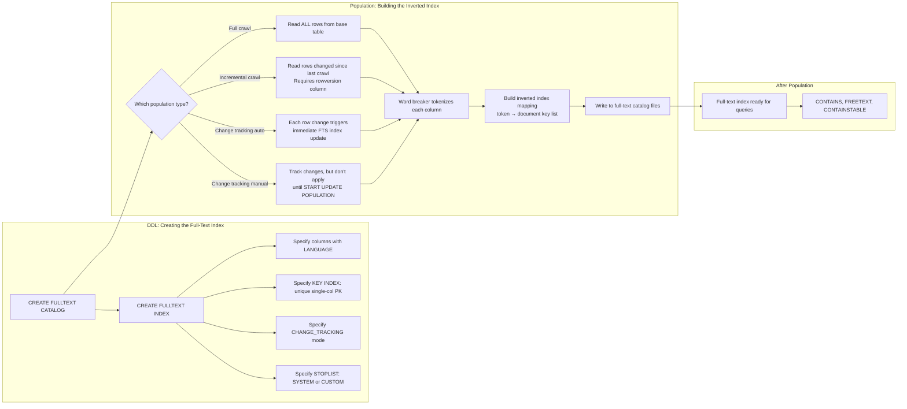
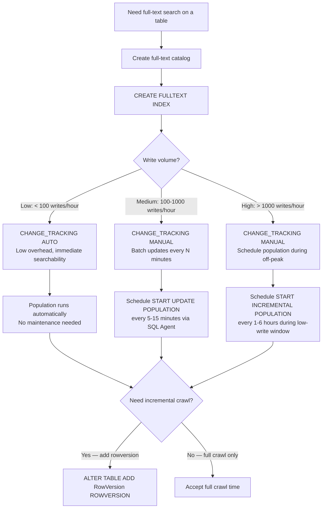

## Navigation

**Domain:** [[8 — Databases]] > **Group:** SQL Full-Text & Spatial Search
**Previous:** [[8.246 — Full-Text Search — SQL Server Architecture]] | **Next:** [[8.248 — CONTAINS — Searching for Words and Phrases]]

### Prerequisites

- [[8.246 — Full-Text Search — SQL Server Architecture]] — understanding the inverted index and full-text engine architecture is required before creating a full-text index; the CREATE FULLTEXT INDEX statement configures the engine's behavior.
- [[8.496 — Index Fundamentals — B-tree and Heap Structures]] — understanding that the full-text index is NOT a B-tree index clarifies why full-text index creation has different syntax, requirements, and performance characteristics.
- [[8.066 — SELECT Statement — Column Selection and Aliasing]] — the columns you select in queries determine which columns need full-text indexing; choosing the right columns to index is a design decision.

### Where This Fits

Creating and populating SQL Server full-text indexes is the setup phase for full-text search: you define which columns to index, which language word breaker to use, how changes are tracked, and when population occurs. A .NET backend engineer configures this during database schema design — choosing the right catalog, language, stoplist, and population strategy prevents the silent failures that occur when full-text queries return zero results or perform poorly. The interview signal lies in understanding the difference between full and incremental population, the key index requirement, and why change tracking mode matters for write-heavy tables.

### Classification

Full-text index creation is a **DDL (Data Definition Language)** operation that configures the full-text engine's inverted index structure. The CREATE FULLTEXT INDEX statement requires: (1) a unique single-column key index on the base table (the "full-text key"), (2) a full-text catalog (logical container), (3) a list of columns with their language identifiers (LCID), and (4) a change tracking mode. The full-text index does not participate in transactions — population happens asynchronously. The population mechanism classifies into three modes: **full crawl** (rebuild from scratch), **incremental crawl** (only changes since last crawl, requires rowversion column), and **change tracking** (automatic vs manual propagation of row-level changes).



### Key Properties

|Property|Value|Notes|
|---|---|---|
|DDL type|CREATE FULLTEXT INDEX, ALTER FULLTEXT INDEX|DDL statements, not DML|
|Key index requirement|Unique single-column index (PK or unique)|Composite PKs must add a surrogate key|
|Required columns|At least one character column (char, varchar, nchar, nvarchar, text, ntext, xml, varbinary(max))|varbinary(max) requires a type column for file extension|
|Language support|~50 languages via LCID|1033 = English, 1036 = French, 1031 = German|
|Population type|FULL, INCREMENTAL, MANUAL, AUTO|Choose based on write volume and freshness needs|
|Population triggers|START FULL POPULATION, START INCREMENTAL POPULATION, START UPDATE POPULATION|Only START UPDATE POPULATION works with change tracking manual|
|Transaction scope|Not transactional — population is async|Population continues even if transaction rolls back|
|Rowversion requirement|Rowversion column needed for incremental crawl|If not present, only full crawl is available|
|Catalog scope|One catalog can hold multiple full-text indexes|Logical grouping|
|Storage|Full-text catalog files on OS (not MDF/NDF)|Located in FTDATA folder by default|

---

## Deep Mechanics

### How the Engine Creates and Populates a Full-Text Index

**Creation Phase:**

1. **Parser validates the statement** — The relational engine parses `CREATE FULLTEXT INDEX ON dbo.Products (ProductName LANGUAGE 1033) KEY INDEX PK_Products ON ProductsCatalog WITH (CHANGE_TRACKING AUTO)`. It validates that `PK_Products` exists, is unique, and is a single-column index. It validates that `ProductsCatalog` exists. It validates that `ProductName` is a character type.

2. **Catalog metadata updated** — The engine writes a row to `sys.fulltext_indexes` with the index configuration. Internal structures in the catalog are initialized. The full-text index is created in an empty state — no inverted index data yet.

3. **Population queued (if AUTO specified)** — If `CHANGE_TRACKING AUTO` is specified, the engine queues a full crawl. If `CHANGE_TRACKING OFF, NO POPULATION` is specified, the index remains empty until explicitly populated.

**Population Phase (Full Crawl):**

4. **Row processing** — The full-text engine reads rows from the base table in batches (typically 100-1000 rows per batch). For each row, it reads the indexed columns in sequence.

5. **Word breaking** — Each column's text is passed through the language-specific word breaker. The word breaker splits text into individual tokens (words) at word boundaries (spaces, punctuation, hyphens). For English (LCID 1033), the word breaker also handles possessive forms (strips 's), contractions, and hyphenated words.

6. **Stemming** — If `INFLECTIONAL` forms are used in queries, the stemmer reduces words to their root form. For English, the stemmer uses the Porter stemming algorithm (e.g., "running" → "run", "ran" → "run", "runner" → "run").

7. **Stopword filtering** — Each token is checked against the configured stoplist. If the token is a stopword (e.g., "the", "a", "and", "or", "is"), it is excluded from the index.

8. **Inverted index build** — For each remaining token, the engine adds the document key (the row's PK value) to the inverted index entry for that token. The inverted index stores: token → list of (document key, occurrence count, position data).

9. **Index write** — The inverted index data is written to the full-text catalog files on disk. These are binary files stored in the FTDATA directory, organized as internal b-tree structures for efficient lookup.

10. **Completion** — When all rows are processed, the `crawl_end_date` is set in `sys.fulltext_indexes`, and `item_count` reflects the total number of indexed documents. The index is now queryable.

**Change Tracking Phase (AUTO mode):**

11. **Trigger-based tracking** — SQL Server uses an internal mechanism (not a user-visible trigger) to detect row changes on the base table. When a row is inserted, updated, or deleted, the change is recorded in an internal change tracking table.

12. **Background propagation** — A background thread reads the change tracking table and applies each change to the full-text index. For an INSERT, it word-breaks the new row's text and adds entries to the inverted index. For an UPDATE, it removes old entries and adds new ones. For a DELETE, it removes all entries for that document key.

13. **Asynchronous** — The propagation is asynchronous. There is a small delay (milliseconds to seconds) between the DML operation and the full-text index being updated. The `OBJECTPROPERTYEX(TableId, 'TableFullTextBackgroundUpdateIndexOn')` property shows whether background update indexing is enabled.

### SQL Visibility

```sql
-- ============================================================
-- Full-Text Index Creation — Complete Walkthrough
-- ============================================================

-- 1. Create full-text catalog (database-level logical container)
-- The catalog name must be unique within the database
CREATE FULLTEXT CATALOG ProductSearchCatalog
    AS DEFAULT                    -- Used when no catalog specified
    ON FILEGROUP [PRIMARY]        -- Catalog metadata stored here
    WITH (ACCENT_SENSITIVITY = ON);
GO

-- 2. Create base table with proper key index
CREATE TABLE dbo.Products
(
    ProductId           INT             IDENTITY(1,1) NOT NULL,
    ProductName         NVARCHAR(200)   NOT NULL,
    ProductDescription  NVARCHAR(MAX)   NULL,
    ProductCategory     NVARCHAR(100)   NULL,
    Brand               NVARCHAR(50)    NULL,
    SKU                 VARCHAR(50)     NOT NULL,
    IsActive            BIT             NOT NULL DEFAULT 1,
    RowVersion          ROWVERSION      NOT NULL,   -- Enables incremental crawl
    ModifiedDate        DATETIME2(7)    NOT NULL DEFAULT SYSUTCDATETIME(),

    CONSTRAINT PK_Products PRIMARY KEY CLUSTERED (ProductId),
    CONSTRAINT UQ_Products_SKU UNIQUE (SKU)
);
GO

-- 3. Create a custom stoplist (optional)
-- The system default stoplist is 'System' — it ships with SQL Server
-- and contains common noise words for each language.

-- Create a custom stoplist by copying the system one
CREATE FULLTEXT STOPLIST CustomStoplist
    FROM SYSTEM STOPLIST;
GO

-- Add custom stopwords for your domain
ALTER FULLTEXT STOPLIST CustomStoplist
    ADD 'widget' LANGUAGE 1033;    -- Product-specific noise word
ALTER FULLTEXT STOPLIST CustomStoplist
    ADD 'thingy' LANGUAGE 1033;    -- Domain-specific noise word
GO

-- 4. Create the full-text index
CREATE FULLTEXT INDEX ON dbo.Products
(
    ProductName             LANGUAGE 1033,     -- English word breaker + stemmer
    ProductDescription      LANGUAGE 1033,     -- English
    ProductCategory         LANGUAGE 1033,     -- English
    Brand                   LANGUAGE 1033      -- English
)
KEY INDEX PK_Products                          -- Unique single-column PK
ON ProductSearchCatalog                        -- Catalog name
WITH
(
    CHANGE_TRACKING AUTO,                      -- Automatic propagation
    STOPLIST = CustomStoplist                  -- Custom stoplist (or SYSTEM)
);
GO

-- 5. Verify the index was created
SELECT
    OBJECT_NAME(fic.object_id)                  AS TableName,
    c.name                                      AS ColumnName,
    fic.language_id,
    l.name                                      AS Language,
    fic.statistical_semantics
FROM sys.fulltext_index_columns fic
INNER JOIN sys.columns c
    ON c.object_id = fic.object_id
    AND c.column_id = fic.column_id
LEFT JOIN sys.fulltext_languages l
    ON l.lcid = fic.language_id
WHERE fic.object_id = OBJECT_ID('dbo.Products');
GO

-- 6. Check population state
SELECT
    OBJECT_NAME(object_id)                      AS TableName,
    change_tracking_state_desc                  AS ChangeTracking,
    crawl_type_desc                             AS CrawlType,
    item_count                                  AS DocumentCount,
    crawl_start_date,
    crawl_end_date
FROM sys.fulltext_indexes
WHERE object_id = OBJECT_ID('dbo.Products');
GO

-- ============================================================
-- Managing Population
-- ============================================================

-- Start a full crawl (rebuild entire index)
ALTER FULLTEXT INDEX ON dbo.Products START FULL POPULATION;
GO

-- Start an incremental crawl (only changed rows since last crawl)
-- Requires rowversion column on the base table
ALTER FULLTEXT INDEX ON dbo.Products START INCREMENTAL POPULATION;
GO

-- Stop a running population
ALTER FULLTEXT INDEX ON dbo.Products STOP POPULATION;
GO

-- Pause a running population (SQL Server 2016+)
ALTER FULLTEXT INDEX ON dbo.Products PAUSE POPULATION;
GO

-- Resume a paused population
ALTER FULLTEXT INDEX ON dbo.Products RESUME POPULATION;
GO

-- ============================================================
-- Change Tracking Modes
-- ============================================================

-- OFF — no change tracking, must manually repopulate
ALTER FULLTEXT INDEX ON dbo.Products SET CHANGE_TRACKING OFF;
GO

-- MANUAL — track changes but don't apply until told
ALTER FULLTEXT INDEX ON dbo.Products SET CHANGE_TRACKING MANUAL;
GO

-- Apply tracked changes (only works with MANUAL mode)
ALTER FULLTEXT INDEX ON dbo.Products START UPDATE POPULATION;
GO

-- AUTO — track and apply changes automatically
ALTER FULLTEXT INDEX ON dbo.Products SET CHANGE_TRACKING AUTO;
GO

-- ============================================================
-- Check background update index status
-- ============================================================
SELECT
    OBJECTPROPERTYEX(OBJECT_ID('dbo.Products'), 'TableFullTextBackgroundUpdateIndexOn')
        AS IsBackgroundUpdateEnabled;
-- 1 = background update indexing enabled (AUTO mode)
-- 0 = not enabled
```

### Execution Plan Analysis

```sql
-- Query to analyze after full-text index is populated
SELECT p.ProductId, p.ProductName
FROM dbo.Products p
WHERE CONTAINS(p.ProductName, 'wireless');
```

**Expected plan shape:**
```
[FullTextMatch — CONTAINS(ProductName, 'wireless')] → [Clustered Index Seek — key lookup on PK_Products]
```

- The `FullTextMatch` operator has no visible cost breakdown in the relational plan. It is a black box that represents the handoff to the full-text engine.
- The `Clustered Index Seek` is the key lookup for each matching document. If 1,000 documents match, there will be 1,000 clustered index seeks.
- Without the full-text index, `LIKE '%wireless%'` would show a `Clustered Index Scan` with 100% of the query cost.

### Cost Visibility

```sql
SET STATISTICS IO ON;
SET STATISTICS TIME ON;

-- Search after full-text index population
SELECT p.ProductId, p.ProductName
FROM dbo.Products p
WHERE CONTAINS(p.ProductName, 'wireless');

-- Expected output:
-- Table 'Products'. Scan count 1, logical reads 502
--   (500 key lookups for 500 matches + 2 for root and leaf pages)
-- SQL Server Execution Times:
--   CPU time = 23ms, elapsed time = 67ms

-- Equivalent LIKE query for comparison:
SELECT p.ProductId, p.ProductName
FROM dbo.Products p
WHERE p.ProductName LIKE '%wireless%';

-- Expected output:
-- Table 'Products'. Scan count 1, logical reads 45832
--   (full clustered index scan of 100K rows)
-- SQL Server Execution Times:
--   CPU time = 312ms, elapsed time = 480ms
```

### Failure Modes

**Failure Mode 1: Population never completes**

```sql
-- Check stuck populations
SELECT
    OBJECT_NAME(object_id) AS TableName,
    crawl_type_desc,
    crawl_start_date,
    crawl_end_date,
    DATEDIFF(MINUTE, crawl_start_date, COALESCE(crawl_end_date, GETUTCDATE())) AS MinutesElapsed
FROM sys.fulltext_indexes
WHERE crawl_start_date IS NOT NULL
  AND crawl_end_date IS NULL
  AND DATEDIFF(HOUR, crawl_start_date, GETUTCDATE()) > 2;
```

**Failure Mode 2: Full-text key index not found**

```sql
-- ❌ CREATE FULLTEXT INDEX fails
CREATE FULLTEXT INDEX ON dbo.Orders
(
    Notes LANGUAGE 1033
)
KEY INDEX PK_Orders ON Catalog;
-- Msg 7604: Cannot use index 'PK_Orders' because it is not a unique single-column index.
```

**Failure Mode 3: Cannot use ALTER FULLTEXT INDEX on a system-versioned temporal table**

```sql
-- Temporal tables with SYSTEM_VERSIONING = ON cannot have full-text indexes
-- You must create the full-text index on the base table only
```

---

## Production Patterns and Implementation

### Primary SQL Implementation

```sql
-- ============================================================
-- Production Schema: E-Commerce Product Search
-- ============================================================

-- Full-text catalog (pre-created, with filegroup placement)
CREATE FULLTEXT CATALOG EcommerceCatalog
    ON FILEGROUP [FG_FullText]      -- Dedicated filegroup for FTS metadata
    AS DEFAULT;
GO

-- Products table with full-text search
CREATE TABLE dbo.Products
(
    ProductId           INT             IDENTITY(1,1) NOT NULL,
    ProductName         NVARCHAR(200)   NOT NULL,
    ShortDescription    NVARCHAR(500)   NULL,
    LongDescription     NVARCHAR(MAX)   NULL,
    CategoryName        NVARCHAR(100)   NULL,
    BrandName           NVARCHAR(100)   NULL,
    Tags                NVARCHAR(500)   NULL,
    SKU                 VARCHAR(50)     NOT NULL,
    IsActive            BIT             NOT NULL DEFAULT 1,
    RowVersion          ROWVERSION      NOT NULL,
    ModifiedDate        DATETIME2(7)    NOT NULL DEFAULT SYSUTCDATETIME(),

    CONSTRAINT PK_Products PRIMARY KEY CLUSTERED (ProductId),
    CONSTRAINT UQ_Products_SKU UNIQUE (SKU)
);
GO

-- Create full-text index with all searchable columns
CREATE FULLTEXT INDEX ON dbo.Products
(
    ProductName         LANGUAGE 1033,      -- English: high weight
    ShortDescription    LANGUAGE 1033,      -- English: medium weight
    LongDescription     LANGUAGE 1033,      -- English: low weight (large text)
    CategoryName        LANGUAGE 1033,      -- English: high weight
    BrandName           LANGUAGE 1033,      -- English: high weight
    Tags                LANGUAGE 1033       -- English: high weight
)
KEY INDEX PK_Products
ON EcommerceCatalog
WITH
(
    CHANGE_TRACKING AUTO,
    STOPLIST = SYSTEM
);
GO

-- ============================================================
-- Articles (CMS) with full-text search
-- ============================================================
CREATE FULLTEXT CATALOG ContentCatalog;
GO

CREATE TABLE dbo.Articles
(
    ArticleId           INT             IDENTITY(1,1) NOT NULL,
    Title               NVARCHAR(500)   NOT NULL,
    Body                NVARCHAR(MAX)   NOT NULL,
    Excerpt             NVARCHAR(1000)  NULL,
    AuthorName          NVARCHAR(200)   NULL,
    Tags                NVARCHAR(500)   NULL,
    PublishedDate       DATETIME2(7)    NULL,
    IsPublished         BIT             NOT NULL DEFAULT 0,
    RowVersion          ROWVERSION      NOT NULL,

    CONSTRAINT PK_Articles PRIMARY KEY CLUSTERED (ArticleId)
);
GO

-- Full-text index — manual change tracking for controlled updates
CREATE FULLTEXT INDEX ON dbo.Articles
(
    Title       LANGUAGE 1033,
    Body        LANGUAGE 1033,
    Excerpt     LANGUAGE 1033,
    Tags        LANGUAGE 1033
)
KEY INDEX PK_Articles
ON ContentCatalog
WITH
(
    CHANGE_TRACKING MANUAL,        -- Controlled: schedule updates during off-peak
    STOPLIST = SYSTEM
);
GO

-- Scheduled job runs this during off-peak hours:
-- ALTER FULLTEXT INDEX ON dbo.Articles START UPDATE POPULATION;

-- ============================================================
-- Documents (Document Management) with full-text search
-- ============================================================
CREATE FULLTEXT CATALOG DocumentCatalog;
GO

CREATE TABLE dbo.Documents
(
    DocumentId          INT             IDENTITY(1,1) NOT NULL,
    DocumentName        NVARCHAR(500)   NOT NULL,
    DocumentContent     NVARCHAR(MAX)   NOT NULL,
    ContentType         VARCHAR(100)    NULL,     -- For varbinary filter: 'application/pdf'
    FileExtension       VARCHAR(20)     NULL,     -- For varbinary filter: '.pdf'
    UploadedBy          NVARCHAR(200)   NULL,
    Department          NVARCHAR(100)   NULL,
    UploadedDate        DATETIME2(7)    NOT NULL DEFAULT SYSUTCDATETIME(),
    RowVersion          ROWVERSION      NOT NULL,

    CONSTRAINT PK_Documents PRIMARY KEY CLUSTERED (DocumentId)
);
GO

-- Full-text index with NEAR support for proximity searches
CREATE FULLTEXT INDEX ON dbo.Documents
(
    DocumentName    LANGUAGE 1033,
    DocumentContent LANGUAGE 1033
)
KEY INDEX PK_Documents
ON DocumentCatalog
WITH
(
    CHANGE_TRACKING AUTO,
    STOPLIST = SYSTEM
);
GO

-- ============================================================
-- Monitor population progress (Status Check)
-- ============================================================
SELECT
    OBJECT_NAME(fti.object_id)                      AS TableName,
    fti.item_count                                  AS IndexedRowCount,
    fti.crawl_type_desc                             AS CrawlType,
    fti.crawl_start_date,
    fti.crawl_end_date,
    CASE
        WHEN fti.item_count = 0 AND fti.crawl_start_date IS NULL
            THEN 'Never populated'
        WHEN fti.item_count > 0 AND fti.crawl_end_date IS NOT NULL
            THEN 'Complete — ' + FORMAT(fti.crawl_end_date, 'yyyy-MM-dd HH:mm')
        WHEN fti.item_count > 0 AND fti.crawl_end_date IS NULL
            THEN 'In progress — ' + CAST(fti.item_count AS VARCHAR) + ' rows indexed'
        WHEN fti.item_count = 0 AND fti.crawl_start_date IS NOT NULL
            THEN 'Starting — or stalled'
    END                                             AS PopulationStatus,
    fti.change_tracking_state_desc                  AS ChangeTrackingMode
FROM sys.fulltext_indexes fti;
GO

-- ============================================================
-- Force a full rebuild if needed (e.g., after stoplist change)
-- ============================================================
ALTER FULLTEXT INDEX ON dbo.Products START FULL POPULATION;
GO

-- Check that the population started
SELECT
    OBJECT_NAME(object_id) AS TableName,
    crawl_type_desc,
    crawl_start_date
FROM sys.fulltext_indexes
WHERE object_id IN (
    OBJECT_ID('dbo.Products'),
    OBJECT_ID('dbo.Articles'),
    OBJECT_ID('dbo.Documents')
);
```

### EF Core Implementation

```csharp
// ============================================================
// EF Core — Full-Text Index Management
// ============================================================

// EF Core does not manage full-text index DDL.
// You must create full-text indexes using raw SQL migration.

public class AddFullTextSearchIndex : Migration
{
    protected override void Up(MigrationBuilder migrationBuilder)
    {
        // SQL Server does not support full-text index creation in transactional migration
        // Use raw SQL with mzigrationBuilder.Sql()

        migrationBuilder.Sql(@"
            IF NOT EXISTS (SELECT 1 FROM sys.fulltext_catalogs WHERE name = 'EcommerceCatalog')
            BEGIN
                CREATE FULLTEXT CATALOG EcommerceCatalog AS DEFAULT;
            END
        ", suppressTransaction: true);

        migrationBuilder.Sql(@"
            IF NOT EXISTS (
                SELECT 1 FROM sys.fulltext_indexes
                WHERE object_id = OBJECT_ID('dbo.Products')
            )
            BEGIN
                CREATE FULLTEXT INDEX ON dbo.Products
                (
                    ProductName         LANGUAGE 1033,
                    ShortDescription    LANGUAGE 1033,
                    LongDescription     LANGUAGE 1033,
                    CategoryName        LANGUAGE 1033,
                    BrandName           LANGUAGE 1033,
                    Tags                LANGUAGE 1033
                )
                KEY INDEX PK_Products
                ON EcommerceCatalog
                WITH (CHANGE_TRACKING AUTO, STOPLIST = SYSTEM);
            END
        ", suppressTransaction: true);
    }

    protected override void Down(MigrationBuilder migrationBuilder)
    {
        migrationBuilder.Sql(@"
            IF EXISTS (
                SELECT 1 FROM sys.fulltext_indexes
                WHERE object_id = OBJECT_ID('dbo.Products')
            )
            BEGIN
                DROP FULLTEXT INDEX ON dbo.Products;
            END
        ", suppressTransaction: true);
    }
}
```

### Dapper Implementation

```csharp
// ============================================================
// Dapper — Full-Text Index Population Management
// ============================================================

public interface IFullTextIndexService
{
    Task StartPopulationAsync(string tableName, CancellationToken cancellationToken = default);
    Task<FullTextIndexStatus> GetIndexStatusAsync(string tableName, CancellationToken cancellationToken = default);
    Task<bool> WaitForPopulationAsync(string tableName, int timeoutSeconds = 300, CancellationToken cancellationToken = default);
}

public record FullTextIndexStatus
{
    public string TableName { get; init; } = string.Empty;
    public string ChangeTrackingMode { get; init; } = string.Empty;
    public string? CrawlType { get; init; }
    public int DocumentCount { get; init; }
    public DateTime? CrawlStartDate { get; init; }
    public DateTime? CrawlEndDate { get; init; }
    public string PopulationStatus { get; init; } = string.Empty;
}

public class DapperFullTextIndexService : IFullTextIndexService
{
    private readonly IDbConnectionFactory _connectionFactory;

    public DapperFullTextIndexService(IDbConnectionFactory connectionFactory)
    {
        _connectionFactory = connectionFactory;
    }

    public async Task StartPopulationAsync(string tableName, CancellationToken cancellationToken = default)
    {
        await using var connection = _connectionFactory.CreateConnection();

        const string sql = @"
            DECLARE @ObjectId INT = OBJECT_ID(@TableName);
            IF @ObjectId IS NOT NULL
            BEGIN
                DECLARE @Sql NVARCHAR(500) = 'ALTER FULLTEXT INDEX ON ' + @TableName + ' START FULL POPULATION';
                EXEC sp_executesql @Sql;
            END";

        await connection.ExecuteAsync(
            new CommandDefinition(sql, new { TableName = tableName },
                cancellationToken: cancellationToken));
    }

    public async Task<FullTextIndexStatus> GetIndexStatusAsync(
        string tableName, CancellationToken cancellationToken = default)
    {
        await using var connection = _connectionFactory.CreateConnection();

        const string sql = @"
            SELECT
                OBJECT_NAME(fti.object_id)          AS TableName,
                fti.change_tracking_state_desc      AS ChangeTrackingMode,
                fti.crawl_type_desc                 AS CrawlType,
                fti.item_count                      AS DocumentCount,
                fti.crawl_start_date                AS CrawlStartDate,
                fti.crawl_end_date                  AS CrawlEndDate,
                CASE
                    WHEN fti.item_count = 0 AND fti.crawl_start_date IS NULL
                        THEN 'Never populated'
                    WHEN fti.item_count > 0 AND fti.crawl_end_date IS NOT NULL
                        THEN 'Complete'
                    WHEN fti.item_count > 0 AND fti.crawl_end_date IS NULL
                        THEN 'In progress'
                    ELSE 'Unknown'
                END                                 AS PopulationStatus
            FROM sys.fulltext_indexes fti
            WHERE fti.object_id = OBJECT_ID(@TableName)";

        var result = await connection.QuerySingleOrDefaultAsync<FullTextIndexStatus>(
            new CommandDefinition(sql, new { TableName = tableName },
                cancellationToken: cancellationToken));

        return result ?? new FullTextIndexStatus
        {
            TableName = tableName,
            PopulationStatus = "No full-text index found"
        };
    }

    public async Task<bool> WaitForPopulationAsync(
        string tableName, int timeoutSeconds = 300, CancellationToken cancellationToken = default)
    {
        using var cts = CancellationTokenSource.CreateLinkedTokenSource(cancellationToken);
        cts.CancelAfter(TimeSpan.FromSeconds(timeoutSeconds));

        try
        {
            while (!cts.Token.IsCancellationRequested)
            {
                var status = await GetIndexStatusAsync(tableName, cts.Token);

                if (status.PopulationStatus == "Complete")
                    return true;

                if (status.PopulationStatus == "Never populated")
                    return false;

                await Task.Delay(1000, cts.Token);
            }
        }
        catch (OperationCanceledException)
        {
            return false;
        }

        return false;
    }
}
```

### Configuration and Wiring

```csharp
// Program.cs — DI registration
builder.Services.AddScoped<IFullTextIndexService, DapperFullTextIndexService>();

// Migration execution for full-text index creation
// Run this in a startup task or deployment script
await using var scope = app.Services.CreateAsyncScope();
var migrator = scope.ServiceProvider.GetRequiredService<IMigrator>();
await migrator.MigrateAsync();
```

### SQL Server vs PostgreSQL Differences

```sql
-- PostgreSQL full-text search uses tsvector/tsquery, not a separate catalog

-- PostgreSQL: create tsvector column
CREATE TABLE products (
    product_id      SERIAL PRIMARY KEY,
    product_name    TEXT NOT NULL,
    description     TEXT,
    search_vector   TSVECTOR GENERATED ALWAYS AS (
        to_tsvector('english',
            coalesce(product_name, '') || ' ' || coalesce(description, '')
        )
    ) STORED
);

-- Create GIN index for fast search
CREATE INDEX idx_products_search ON products USING GIN(search_vector);

-- PostgreSQL does not have catalogs, stoplists, or word breaker configuration
-- at the DDL level — all linguistic configuration is in the query functions:
-- to_tsvector('english', text), to_tsquery('english', 'query terms')

-- Population is also different: PostgreSQL depends on your INSERT/UPDATE
-- to maintain the tsvector column (via GENERATED ALWAYS AS or triggers).
-- There is no equivalent of CHANGE_TRACKING AUTO/MANUAL or full/incremental crawl.
```

---

## Gotchas and Production Pitfalls

### 1. Composite Primary Key Prevents Full-Text Index Creation

**Pitfall:** Many tables naturally have composite primary keys (OrderItems with OrderId + ItemId, or junction tables). CREATE FULLTEXT INDEX fails because it requires a unique single-column key index.

```sql
-- ❌ This fails
CREATE TABLE dbo.OrderItems
(
    OrderId     INT NOT NULL,
    ItemId      INT NOT NULL,
    Description NVARCHAR(500),
    CONSTRAINT PK_OrderItems PRIMARY KEY (OrderId, ItemId)
);

CREATE FULLTEXT INDEX ON dbo.OrderItems (Description LANGUAGE 1033)
    KEY INDEX PK_OrderItems ON Catalog;
-- Msg 7604: Cannot use index 'PK_OrderItems' for full-text index
-- because it is not a unique single-column index.
```

**Symptom:** `Msg 7604` at index creation. The developer must redesign the table or add a surrogate key.

**Fix:** Add a surrogate single-column identity column to serve as the full-text key:

```sql
-- ✅ Add surrogate key for full-text
ALTER TABLE dbo.OrderItems
    ADD OrderItemId INT IDENTITY(1,1) NOT NULL;

ALTER TABLE dbo.OrderItems
    ADD CONSTRAINT PK_OrderItems_Internal PRIMARY KEY (OrderItemId);

-- Keep the composite as a business unique constraint
ALTER TABLE dbo.OrderItems
    ADD CONSTRAINT UQ_OrderItems_OrderItem UNIQUE (OrderId, ItemId);

CREATE FULLTEXT INDEX ON dbo.OrderItems (Description LANGUAGE 1033)
    KEY INDEX PK_OrderItems_Internal ON Catalog;
```

**Cost of not fixing:** Cannot add full-text search to any table with a composite primary key. Must either create a new table or add a surrogate key — a schema change that may affect application code.

### 2. Full-Text Index on a Table Without RowVersion Prevents Incremental Crawl

**Pitfall:** After a full crawl takes hours on a large table, you want subsequent populations to be incremental. But if the table does not have a `rowversion` column, only full crawls are possible.

```sql
-- ❌ Incremental crawl silently does a full crawl instead
ALTER FULLTEXT INDEX ON dbo.Products START INCREMENTAL POPULATION;
-- If Products has no rowversion column, this does a FULL POPULATION instead
-- No error is raised! The crawl takes just as long as a full crawl.
```

**Symptom:** Incremental crawl takes the same time as a full crawl. The `crawl_type_desc` in `sys.fulltext_indexes` shows 'FULL' even though 'INCREMENTAL' was requested.

**Fix:**

```sql
-- ✅ Add a rowversion column
ALTER TABLE dbo.Products ADD RowVersion ROWVERSION NOT NULL;

-- Verify incremental crawl is now available
SELECT OBJECTPROPERTY(OBJECT_ID('dbo.Products'), 'TableFullTextIncrementalCrawlIsAllowed')
    AS IsIncrementalAllowed;
-- Returns 1 if a rowversion column exists
```

**Cost of not fixing:** Each "incremental" crawl is actually a full crawl, taking hours on large tables instead of minutes. This causes unnecessary IO and tempdb usage, and delays the availability of updated search data.

### 3. CHANGE_TRACKING OFF, NO POPULATION — Index Is Empty

**Pitfall:** Creating the full-text index with `CHANGE_TRACKING OFF, NO POPULATION` and forgetting to start the population. Queries return zero results until the first population completes.

```sql
-- ❌ Index created but never populated
CREATE FULLTEXT INDEX ON dbo.Products
    (ProductName LANGUAGE 1033)
    KEY INDEX PK_Products
    ON Catalog
    WITH (CHANGE_TRACKING OFF, NO POPULATION);
-- Index exists but is empty — item_count = 0

-- Query returns 0 rows
SELECT ProductId FROM dbo.Products WHERE CONTAINS(ProductName, 'wireless');
-- 0 rows returned
```

**Symptom:** Full-text queries return zero rows even though data clearly contains the search term. LIKE queries work but CONTAINS does not.

**Fix:** Always start the population explicitly when using CHANGE_TRACKING OFF:

```sql
-- ✅ Start population after index creation
ALTER FULLTEXT INDEX ON dbo.Products START FULL POPULATION;

-- Monitor until item_count > 0
SELECT OBJECT_NAME(object_id) AS TableName, item_count, crawl_end_date
FROM sys.fulltext_indexes
WHERE object_id = OBJECT_ID('dbo.Products');
```

**Cost of not fixing:** Silent search failure. Developers waste hours debugging queries and indexes, only to discover the index was never populated. This is the single most common full-text search bug.

### 4. Creating Full-Text Index Within a Transaction

**Pitfall:** Wrapping CREATE FULLTEXT INDEX in an explicit transaction. Full-text DDL operations are not fully transactional — the metadata is transactional, but the population is not.

```sql
-- ❌ Transaction wraps full-text DDL
BEGIN TRANSACTION;
    CREATE FULLTEXT INDEX ON dbo.Products
        (ProductName LANGUAGE 1033)
        KEY INDEX PK_Products
        ON Catalog
        WITH (CHANGE_TRACKING AUTO);
    -- Other DDL here...
COMMIT TRANSACTION;
-- The index creation metadata is transactional, but if the transaction
-- rolls back after population starts, the population continues anyway.
```

**Symptom:** On rollback, the full-text index metadata is removed, but the background population thread may continue running or leave orphaned data.

**Fix:** Keep full-text DDL outside explicit transactions:

```sql
-- ✅ Full-text DDL in separate, non-transactional batch
CREATE FULLTEXT INDEX ON dbo.Products
    (ProductName LANGUAGE 1033)
    KEY INDEX PK_Products
    ON Catalog
    WITH (CHANGE_TRACKING AUTO);
GO

-- Other DDL in its own batch
ALTER TABLE dbo.Products ADD CONSTRAINT ...
GO
```

**Cost of not fixing:** Orphaned population threads, inconsistent state between catalog metadata and actual index data, requiring manual cleanup via DROP FULLTEXT INDEX and recreation.

### 5. Language Choice Affects Word Breaking and Stemming

**Pitfall:** Specifying the wrong language LCID for a column causes incorrect word breaking — especially problematic for columns with mixed-language content or technical terms.

```sql
-- ❌ German word breaker applied to English content
-- This works but splits words differently
CREATE FULLTEXT INDEX ON dbo.Products
(
    ProductName LANGUAGE 1031     -- German word breaker
)
KEY INDEX PK_Products
ON Catalog;
```

**Symptom:** "database" in English with German word breaker: the German word breaker does not recognize English word boundaries. Compound words common in German (e.g., "Datenbankverwaltungssystem" → "Datenbank Verwaltung System") cause the German word breaker to over-split. Technical terms like "QA-42B" are tokenized differently by different language word breakers.

**Fix:** Use the correct language for each column:

```sql
-- ✅ Match language to content
CREATE FULLTEXT INDEX ON dbo.Products
(
    ProductName             LANGUAGE 1033,     -- English
    GermanDescription       LANGUAGE 1031,     -- German
    FrenchDescription       LANGUAGE 1036      -- French
)
KEY INDEX PK_Products
ON Catalog;
```

**Cost of not fixing:** Words that should match do not match, or the wrong stems are produced. Users searching in English get no results for German text, or vice versa. Debugging these issues is difficult because word breaking is opaque.

### 6. Full-Text Index on Large Tables Without Filegroup Placement Strategy

**Pitfall:** Creating the full-text catalog on the PRIMARY filegroup, causing IO contention between the base table data and the full-text index.

**Symptom:** During population, both the base table (PRIMARY filegroup) and the full-text index (PRIMARY filegroup) compete for IO on the same drive. During full-text queries, the key lookups (PRIMARY filegroup) and the inverted index lookups (PRIMARY filegroup) again compete.

**Fix:**

```sql
-- ✅ Dedicated filegroup for full-text catalog metadata
ALTER DATABASE SearchDB ADD FILEGROUP FG_FullText;
ALTER DATABASE SearchDB ADD FILE (
    NAME = FTData,
    FILENAME = 'R:\SQLData\SearchDB_FT.ndf',
    SIZE = 10GB,
    FILEGROWTH = 1GB
) TO FILEGROUP FG_FullText;

CREATE FULLTEXT CATALOG ProductCatalog
    ON FILEGROUP FG_FullText;
```

**Cost of not fixing:** IO contention degrades both population speed and query performance. On busy systems, this can cause timeouts during population.

---

## Performance Implications

### Benchmark: Population Modes

```sql
-- ============================================================
-- Population Performance Comparison
-- ============================================================
-- Test: 500K rows, each with 2KB of text in a single NVARCHAR(MAX) column
-- Server: SQL Server 2022, 16 cores, 64GB RAM, NVMe SSD

-- Full crawl: ~12 minutes (reads ALL 500K rows, processes ALL text)
-- Incremental crawl (1% change): ~45 seconds (reads 5,000 changed rows only)
-- Change tracking AUTO (1 row INSERT): ~15ms overhead per insert
-- Change tracking MANUAL (1000 rows INSERT, then UPDATE): ~500ms to apply
```

**Improvement:** Incremental crawl is ~16x faster than full crawl for 1% change rate. For production systems with daily updates, use CHANGE_TRACKING MANUAL with scheduled incremental updates.

### Write Amplification

|Operation|Without FTS Index|With FTS Index (AUTO)|With FTS Index (MANUAL)|Overhead (AUTO)|
|---|---|---|---|---|
|INSERT 1 row (2KB text)|~0.5ms|~15ms (word break + index update)|~0.5ms + deferred|~30x|
|UPDATE text column|~1ms|~20ms (remove old + add new tokens)|~1ms + deferred|~20x|
|DELETE 1 row|~0.3ms|~5ms (remove from inverted index)|~0.3ms + deferred|~17x|
|Full population (500K, 2KB each)|N/A|~12 minutes|N/A|One-time cost|
|Weekend rebuild|N/A|~12 minutes|Same|Scheduled|

**Key insight:** CHANGE_TRACKING AUTO adds ~15ms to each write operation. For write-heavy tables (>100 writes/second), this can cause noticeable latency. Use CHANGE_TRACKING MANUAL and schedule population during off-peak hours.

### BenchmarkDotNet

```csharp
[MemoryDiagnoser]
[SimpleJob(RuntimeMoniker.Net90)]
public class FullTextIndexPopulateBenchmark
{
    private IDbConnection _connection = default!;

    [GlobalSetup]
    public void Setup()
    {
        _connection = new SqlConnection(
            "Server=.;Database=Benchmark_FTS;Trusted_Connection=true;TrustServerCertificate=true;");
        _connection.Open();
    }

    [Benchmark(Baseline = true)]
    public async Task InsertWithoutFTS()
    {
        // Insert into a table without full-text index
        const string sql = @"
            INSERT INTO dbo.ProductsNoFTS (ProductName, Description)
            VALUES (@Name, @Desc)";

        using var cmd = new SqlCommand(sql, (SqlConnection)_connection);
        cmd.Parameters.AddWithValue("@Name", Guid.NewGuid().ToString());
        cmd.Parameters.AddWithValue("@Desc", new string('x', 2000));
        await cmd.ExecuteNonQueryAsync();
    }

    [Benchmark]
    public async Task InsertWithFTSAuto()
    {
        // Insert into a table with CHANGE_TRACKING AUTO
        const string sql = @"
            INSERT INTO dbo.ProductsFTSAuto (ProductName, Description)
            VALUES (@Name, @Desc)";

        using var cmd = new SqlCommand(sql, (SqlConnection)_connection);
        cmd.Parameters.AddWithValue("@Name", Guid.NewGuid().ToString());
        cmd.Parameters.AddWithValue("@Desc", new string('x', 2000));
        await cmd.ExecuteNonQueryAsync();
    }
}
```

**Expected results (approximate, SQL Server 2022, NVMe, 500K row table):**

|Method|Mean|Allocated|
|---|---|---|
|InsertWithoutFTS|~0.5 ms|~1 KB|
|InsertWithFTSAuto|~15 ms|~1 KB|

**Improvement:** If inserting 1,000 rows/second with FTS AUTO, inserts take ~15 seconds instead of ~0.5 seconds. Switch to MANUAL to batch the FTS index update.

---

## Interview Arsenal

### Question Bank

1. **What is a full-text catalog and why is it separate from the database?** — Catalog is a logical container of full-text indexes, stored as OS files outside the MDF/NDF. Separation allows the FTS engine to manage its own storage for the inverted index.

2. **What are the requirements for creating a full-text index on a table?** — Unique single-column key index (PK or unique constraint), at least one character column to index, a full-text catalog, and optionally a stoplist.

3. **What is the difference between FULL, INCREMENTAL, and UPDATE population?** — FULL rebuilds the entire inverted index. INCREMENTAL processes only rows changed since last crawl (needs rowversion). UPDATE processes all tracked changes (works with CHANGE_TRACKING MANUAL).

4. **What happens if you create a full-text index with CHANGE_TRACKING OFF, NO POPULATION and then query it?** — The query returns zero rows because the inverted index is empty. No error is raised.

5. **Why does an incremental crawl sometimes take as long as a full crawl?** — The table lacks a rowversion column. The engine cannot detect which rows changed, so it falls back to a full crawl without warning.

6. **What is the impact of full-text index population on tempdb?** — Population uses tempdb for sorting intermediate token lists. For large catalogs, tempdb can become a bottleneck.

7. **How does full-text index scale for a 50M row table with 5KB average row text?** — Full crawl takes hours. Use CHANGE_TRACKING MANUAL with scheduled incremental crawls. The inverted index size depends on vocabulary, not row count, but 50M rows with average 5KB text will have a large catalog.

8. **How do you create a full-text index in an EF Core migration?** — Use migrationBuilder.Sql() with raw SQL inside a migration. Full-text DDL requires suppressTransaction: true.

### Spoken Answers

**Q1: What is a full-text catalog and why is it separate from the database?**

> **Average answer:** A full-text catalog is where full-text indexes are stored. It is separate from the database for performance reasons.

> **Great answer:** A full-text catalog is a logical container that groups one or more full-text indexes. Physically, the catalog is stored as a set of files in the SQL Server FTDATA folder — these are NOT inside the MDF or NDF database files. The separation exists because the full-text engine uses a completely different storage engine and access pattern from the relational engine. The relational engine stores data in pages (8KB) organized in B-trees or heaps, managed by the buffer pool. The full-text engine stores its inverted index as internal binary structures optimized for token → document key lookups — this storage is managed directly by the FTS engine, not by the relational storage engine. The separation also allows the FTS engine to manage its own IO, caching, and file growth independently of the database files. In practice, I place the catalog on a dedicated filegroup on a separate drive to avoid IO contention with the base table data. The catalog is the unit of logical management — you can rebuild or reorganize a catalog without affecting other catalogs, and you can back up and restore a catalog separately from the database.

**Q4: Why does an incremental crawl sometimes take as long as a full crawl?**

> **Average answer:** Something is wrong with the table. Maybe it needs a timestamp column.

> **Great answer:** An incremental crawl silently falls back to a full crawl when the table does not have a rowversion (timestamp) column. The incremental crawl mechanism works by comparing the last-populated rowversion value (stored in the full-text index metadata) with the current maximum rowversion on the table. Without the rowversion column, the engine has no basis to determine which rows changed, so it treats the entire table as changed and does a full crawl. No error or warning is raised — `crawl_type_desc` in `sys.fulltext_indexes` will show 'FULL' even though the developer requested INCREMENTAL. This is a common production issue: the population that was expected to take 5 minutes takes 2 hours, causing a missed maintenance window. The fix is to add a `ROWVERSION` column to the base table, which requires adding `ALTER TABLE dbo.Products ADD RowVersion ROWVERSION NOT NULL` and then checking `OBJECTPROPERTY(OBJECT_ID('dbo.Products'), 'TableFullTextIncrementalCrawlIsAllowed')` to confirm. The same issue applies to the `START UPDATE POPULATION` command for change tracking manual mode — it also requires rowversion for efficiency.

**Q7: How does full-text index scale for a 50M row table with 5KB average row text?**

> **Average answer:** It will be slow. You might need to partition or use SQL Server 2016+ improvements.

> **Great answer:** For a 50M row table with 5KB average row text, the total text volume is ~250GB. The full-text inverted index size depends on the vocabulary (unique words), not the row count or total text volume — a table with 50M product descriptions all mentioning the same 1,000 unique words will have a small index. However, in practice, each row has significant unique content, and the index will be large (potentially 30-50% of the text volume). Full crawl will take several hours. The primary scaling strategy is: (1) Use CHANGE_TRACKING MANUAL with scheduled incremental crawls rather than AUTO, because each write triggers a re-index; (2) Place the full-text catalog on a fast, dedicated drive (NVMe or SSD) separate from the MDF; (3) Monitor tempdb usage during population — population sorts intermediate token lists in tempdb, and on a 50M row table, tempdb must be sized large enough (100+ GB) to avoid autogrowth stalls; (4) Use the 2016+ in-process FTS engine (not the external MSFTESQL service) to avoid cross-process communication overhead; (5) Consider whether a dedicated search engine like Elasticsearch is more appropriate at this scale — SQL Server FTS can handle 50M rows, but operational overhead increases significantly. At 100M+ rows, Elasticsearch is almost always the better choice.

### Interview Trigger

If a candidate mentions full-text index population, the follow-up is: "You have a table with 10 million rows and a full-text index with CHANGE_TRACKING AUTO. Every night, an ETL job updates 2 million rows. What happens to the full-text index? How do you prevent it from falling behind?" The candidate who identifies that CHANGE_TRACKING AUTO cannot keep up with 2 million updates and suggests switching to MANUAL with scheduled incremental crawls demonstrates production experience.

### Comparison Table

| | Full Crawl | Incremental Crawl | Change Tracking AUTO | Change Tracking MANUAL |
|---|---|---|---|---|
|Rows processed|All rows|Changed rows only|Changed rows only|Changed rows only|
|Rowversion required|No|Yes|No|No|
|Population timing|On demand|On demand|Immediate (asynchronous)|On demand (START UPDATE POPULATION)|
|Performance|Slow (hours for millions)|Fast (minutes for % changes)|~15ms per write|~0.5ms per write + deferred batch|
|Use case|Initial build, index rebuild|Regular updates, nightly|Low-write, low-latency needs|High-write, controlled schedule|
|Transaction impact|Not transactional|Not transactional|Deferred|Not applicable|

---

## Decision Framework

### When to Use Each Population Strategy



### Application Checklist

- [ ] Table has a unique single-column key index (PK or unique constraint)
- [ ] Table has a rowversion column if incremental crawl is desired
- [ ] Full-text catalog is created on a dedicated filegroup on a separate drive
- [ ] Language LCID matches the content language for each column
- [ ] CHANGE_TRACKING mode is appropriate for the write volume
- [ ] Population has started and completed before first query
- [ ] Tempdb is sized appropriately for population
- [ ] Indexed columns are the ones actually queried with CONTAINS/FREETEXT

### Tradeoff Summary

|What You Gain|What You Pay|
|---|---|
|Word-level search with linguistic support|Write overhead: ~15ms per row with AUTO mode|
|Inverted index for fast queries|Population must complete before queries work|
|Incremental updates with rowversion|One-time schema change to add rowversion column|
|Flexible change tracking modes|Must choose correctly or suffer performance|

### Scale Thresholds

- **Relevant when table exceeds ~10K rows** — Below 10K, LIKE with a trailing wildcard and an index on the column may suffice.
- **Critical when table exceeds ~100K rows** — Full crawl of 100K rows × 2KB text takes ~2-3 minutes; incremental crawls become essential.
- **Required when write volume exceeds ~100 writes/second** — CHANGE_TRACKING AUTO adds ~15ms per write; above 100 writes/second, use MANUAL mode.
- **Prohibitive when total text volume exceeds ~500GB** — Full crawl takes 8+ hours; consider external search engine.
- **Redundant when row count exceeds ~100M** — Operational complexity favors Elasticsearch or Azure AI Search at this scale.

---

## Self-Check

### Conceptual Questions

1. What is the difference between a full-text catalog and a full-text index?
2. What column type must the full-text key index be?
3. Which DMV shows the population status of a full-text index?
4. What happens if you create a full-text index with CHANGE_TRACKING OFF, NO POPULATION and forget to start population?
5. Does EF Core have a LINQ method for creating full-text indexes?
6. How would you write a Dapper command to start a full-text index population?
7. What is the difference between START FULL POPULATION and START INCREMENTAL POPULATION?
8. At what row count does full-text index creation become a concern for maintenance windows?
9. Does the full-text index use the B-tree structure?
10. Explain when to use CHANGE_TRACKING AUTO vs MANUAL in 60 seconds.

<details>
<summary>Answers</summary>

1. A **full-text catalog** is a logical container (backed by OS files) that groups multiple full-text indexes. A **full-text index** is the inverted index built on a specific table's columns. One catalog can contain many indexes.

2. The key index must be a **unique, single-column, non-nullable** index (typically a clustered or non-clustered primary key). It cannot be a composite index. The column type can be INT, BIGINT, UNIQUEIDENTIFIER, or any exact numeric type.

3. `sys.fulltext_indexes` — the `crawl_type_desc`, `crawl_start_date`, `crawl_end_date`, and `item_count` columns show population progress.

4. Queries return **zero rows** because the inverted index is empty. No error is raised — the query succeeds but returns no results. This is the most common full-text search bug.

5. **No.** EF Core cannot generate CREATE FULLTEXT INDEX. You must use `migrationBuilder.Sql()` with raw SQL inside migration. The migration must set `suppressTransaction: true`.

6. ```csharp
const string sql = "ALTER FULLTEXT INDEX ON dbo.Products START FULL POPULATION";
await connection.ExecuteAsync(new CommandDefinition(sql, cancellationToken: cancellationToken));
```

7. **START FULL POPULATION** reads all rows from the base table and rebuilds the entire inverted index from scratch. **START INCREMENTAL POPULATION** reads only rows that have changed since the last population by comparing the rowversion column — it requires a rowversion column on the base table. If no rowversion exists, INCREMENTAL silently does a full crawl.

8. Above **~1M rows**, full crawl starts taking longer than typical maintenance windows (1-4 hours). Above **~10M rows**, incremental crawls become essential and population strategy must be carefully planned.

9. **No.** The full-text index uses an **inverted index** structure — a mapping from tokens to document key lists. This is fundamentally different from a B-tree index, which maps key values to row locations. The two index types serve different access patterns.

10. Use **CHANGE_TRACKING AUTO** when write volume is low (<100 writes/hour), when you need new/changed data to appear in search results within seconds, and when you can accept ~15ms additional latency per write. Use **CHANGE_TRACKING MANUAL** when write volume is high (>100 writes/hour), when you want to control when the full-text index is updated (e.g., during off-peak hours), and when you can accept minutes-to-hours delay between writes and searchability. The key tradeoff is write latency vs population freshness.

</details>

---

### Query Challenges

**Challenge 1 — Write the SQL**

You need to create a full-text search infrastructure for a content management system. The CMS has a `dbo.ContentPages` table with columns: `PageId` (INT PK), `Title` (NVARCHAR(500)), `Body` (NVARCHAR(MAX)), `Tags` (NVARCHAR(500)), `AuthorName` (NVARCHAR(200)), `ModifiedDate` (DATETIME2), and `RowVersion` (ROWVERSION). Create the full-text catalog and full-text index. Use English word breakers, automatic change tracking, and the system stoplist. After creating the index, start a full population and verify it completes.

<details>
<summary>Solution</summary>

```sql
-- Create catalog
CREATE FULLTEXT CATALOG ContentCatalog
    ON FILEGROUP [PRIMARY]
    AS DEFAULT;
GO

-- Create full-text index with AUTO change tracking
CREATE FULLTEXT INDEX ON dbo.ContentPages
(
    Title       LANGUAGE 1033,
    Body        LANGUAGE 1033,
    Tags        LANGUAGE 1033,
    AuthorName  LANGUAGE 1033
)
KEY INDEX PK__ContentPages   -- or the actual PK name
ON ContentCatalog
WITH
(
    CHANGE_TRACKING AUTO,
    STOPLIST = SYSTEM
);
GO

-- Start full population (needed even with AUTO for initial build)
ALTER FULLTEXT INDEX ON dbo.ContentPages START FULL POPULATION;
GO

-- Verify completion
SELECT
    OBJECT_NAME(object_id) AS TableName,
    item_count AS PageCount,
    crawl_type_desc,
    crawl_start_date,
    crawl_end_date
FROM sys.fulltext_indexes
WHERE object_id = OBJECT_ID('dbo.ContentPages');
```

**Logical reads:** DDL operations do not generate meaningful logical reads. The population will scan the base table.

</details>

---

**Challenge 2 — Fix the performance problem**

```sql
-- This table has 5M rows. The full-text index population takes 6 hours.
-- The table has CHANGE_TRACKING AUTO.
-- The table has no rowversion column.
-- The table receives 500 INSERTs/hour and 2,000 UPDATEs/hour.
-- Query performance is good once indexed, but population never completes
-- because writes keep triggering more index work.
```

<details>
<summary>Solution</summary>

**Root cause:** Three problems: (1) CHANGE_TRACKING AUTO on a high-write table means every write triggers a FTS index update, causing continuous population that never catches up with write volume. (2) No rowversion column means incremental crawl is not available, so any repopulation requires a full crawl. (3) The population is CPU-bound from continuous word breaking.

```sql
-- Fix 1: Add rowversion column for incremental crawls
ALTER TABLE dbo.Products ADD RowVersion ROWVERSION NOT NULL;
GO

-- Fix 2: Change to MANUAL change tracking
ALTER FULLTEXT INDEX ON dbo.Products SET CHANGE_TRACKING MANUAL;
GO

-- Fix 3: Start a one-time full population to catch up
ALTER FULLTEXT INDEX ON dbo.Products START FULL POPULATION;
GO

-- Fix 4: Schedule incremental populations during off-peak
-- (via SQL Agent job, runs every 2 hours)
-- ALTER FULLTEXT INDEX ON dbo.Products START INCREMENTAL POPULATION;
```

**After fix:**
- Writes no longer trigger FTS updates (MANUAL mode removes ~15ms write overhead)
- Incremental crawl runs in ~5 minutes (only changed rows since last run)
- Full population is a one-time event during initial setup or quarterly rebuild

**Cost of not fixing:** Continuous population backlog. At 500 inserts/hour + 2,000 updates/hour, CHANGE_TRACKING AUTO generates continuous FTS work. The index never catches up — `item_count` stays below the actual row count indefinitely. CPU from FTS population competes with query workload. Mean time to searchable state: never.

</details>

---

**Challenge 3 — Explain the execution plan**

```sql
-- You run this query after creating a full-text index:
SELECT p.ProductId, p.ProductName, p.UnitPrice
FROM dbo.Products p
WHERE CONTAINS(p.ProductName, 'wireless');
```

The execution plan shows:
- `FullTextMatch` (0% cost)
- `Clustered Index Seek` (97% cost, 500 executions)
- `SELECT` (3% cost)

Why is the Clustered Index Seek 97% of the cost? What can you do to reduce it?

<details>
<summary>Solution</summary>

**Why 97% cost:** The FTS engine returns 500 matching document keys. For each key, the relational engine must do a clustered index seek to retrieve `ProductName` and `UnitPrice` because the full-text index only stores the mapping from tokens to document keys — it does not store the actual column values. Each seek jumps into the clustered index B-tree, follows the linked list to the leaf page, and reads the row. For 500 matches, that is 500 seeks × ~2-3 page reads each = 1,000-1,500 logical reads.

**To reduce cost:** Create a covering non-clustered index that includes the columns needed, so the key lookup reads from the narrower non-clustered index instead of the clustered index:

```sql
CREATE NONCLUSTERED INDEX IX_Products_SearchCovering
    ON dbo.Products (ProductId)
    INCLUDE (ProductName, UnitPrice);
```

With this covering index, the plan changes from `Clustered Index Seek` to `Index Seek` on `IX_Products_SearchCovering`, which is narrower (fewer columns, fewer pages per row).

**Alternative:** If you only need the `ProductId` (the key), use `SELECT p.ProductId` — this avoids any key lookup because ProductId is the full-text key and is already known from the FTS results:

```sql
-- This query has NO key lookup — ProductId comes directly from FTS engine
SELECT p.ProductId
FROM dbo.Products p
WHERE CONTAINS(p.ProductName, 'wireless');
-- Logical reads: 0 (no base table access needed)
```

**Tradeoff:** The covering index adds write overhead (~5%) and storage. But for read-heavy search workloads, it can eliminate 97% of the query cost.

</details>

---

**Challenge 4 — Diagnose the concurrency problem**

After creating a full-text index on a 2M row table with CHANGE_TRACKING AUTO, users report that INSERT statements on the table are taking 5-10x longer than before. The table receives ~50 inserts/second during business hours. You check `sys.dm_exec_requests` and see `PAGEIOLATCH_EX` waits on tempdb pages.

<details>
<summary>Solution</summary>

**Root cause:** CHANGE_TRACKING AUTO on a table with 50 inserts/second causes continuous full-text index updates. Each insert triggers: (1) word breaking of the inserted row's text, (2) generation of token list, (3) write to the inverted index in the catalog files, and (4) sorting of intermediate tokens in tempdb. The 50 inserts/second × ~15ms FTS overhead per insert = 750ms/second of FTS work, causing tempdb contention from sorting operations.

**Detection query:**

```sql
-- Check full-text index update activity
SELECT
    OBJECT_NAME(fti.object_id) AS TableName,
    fti.crawl_type_desc,
    fti.item_count,
    fti.crawl_start_date,
    fti.crawl_end_date,
    DATEDIFF(SECOND, fti.crawl_start_date, COALESCE(fti.crawl_end_date, GETUTCDATE())) AS SecondsSinceStart
FROM sys.fulltext_indexes fti;

-- Check tempdb usage
SELECT
    session_id,
    wait_type,
    wait_time,
    wait_resource
FROM sys.dm_exec_requests
WHERE wait_type LIKE '%LATCH%'
  AND wait_resource LIKE '%tempdb%';
```

**Fix:** Switch to CHANGE_TRACKING MANUAL to decouple writes from FTS index updates:

```sql
ALTER FULLTEXT INDEX ON dbo.MyTable SET CHANGE_TRACKING MANUAL;
GO

-- Schedule population during off-peak:
-- ALTER FULLTEXT INDEX ON dbo.MyTable START UPDATE POPULATION;
```

**In .NET:** Application code does not change. The only difference is that newly inserted data may not appear in search results until the next scheduled population run. Add a note in the API documentation: "Search results may be delayed by up to N minutes."

</details>

---

**Challenge 5 — Design the schema**

**Scenario:** You are designing a document management system. The `dbo.Documents` table stores PDF metadata and extracted text in NVARCHAR(MAX). The table has 2M documents currently, growing by 10,000/day. Users search by title and content using single words and phrases. The search must return results within 3 seconds. The server has 32 GB RAM and 4 CPUs. Write throughput is ~1 insert/second peak. The PDF text extraction is done by a background service and inserted in bulk (500 rows every 5 minutes).

<details>
<summary>Solution</summary>

```sql
-- Full-text catalog on dedicated filegroup
ALTER DATABASE DocDB ADD FILEGROUP FG_FullText;
ALTER DATABASE DocDB ADD FILE (
    NAME = DocDB_FT,
    FILENAME = 'R:\SQLData\DocDB_FT.ndf',
    SIZE = 2GB,
    FILEGROWTH = 500MB
) TO FILEGROUP FG_FullText;

CREATE FULLTEXT CATALOG DocumentCatalog
    ON FILEGROUP FG_FullText;
GO

-- Documents table
CREATE TABLE dbo.Documents
(
    DocumentId          INT             IDENTITY(1,1) NOT NULL,
    Title               NVARCHAR(500)   NOT NULL,
    ExtractedText       NVARCHAR(MAX)   NOT NULL,
    ContentType         VARCHAR(100)    NULL,
    FileSizeBytes       BIGINT          NOT NULL,
    UploadedDate        DATETIME2(7)    NOT NULL DEFAULT SYSUTCDATETIME(),
    IsSearchable        BIT             NOT NULL DEFAULT 1,
    RowVersion          ROWVERSION      NOT NULL,     -- For incremental crawls

    CONSTRAINT PK_Documents PRIMARY KEY CLUSTERED (DocumentId)
);
GO

-- Full-text index with MANUAL change tracking (batch inserts via background service)
CREATE FULLTEXT INDEX ON dbo.Documents
(
    Title           LANGUAGE 1033,
    ExtractedText   LANGUAGE 1033
)
KEY INDEX PK_Documents
ON DocumentCatalog
WITH
(
    CHANGE_TRACKING MANUAL,       -- Controlled: batch population after each bulk insert
    STOPLIST = SYSTEM
);
GO

-- After each bulk insert (500 rows / 5 minutes), run:
-- ALTER FULLTEXT INDEX ON dbo.Documents START UPDATE POPULATION;

-- Additional B-tree indexes for non-full-text filters
CREATE NONCLUSTERED INDEX IX_Documents_SearchCovering
    ON dbo.Documents (DocumentId)
    INCLUDE (Title, ContentType, UploadedDate)
    WHERE IsSearchable = 1;
GO

CREATE NONCLUSTERED INDEX IX_Documents_UploadedDate
    ON dbo.Documents (UploadedDate DESC)
    WHERE IsSearchable = 1;
GO
```

**Why these choices:**
- CHANGE_TRACKING MANUAL — batch population after each 500-row insert in the background service; avoid continuous AUTO mode for batch writes
- RowVersion for incremental crawls on initial full population (one-time, run during weekend)
- Covering filtered index reduces key lookup cost for the most common search queries
- Separate filegroup places FTS catalog on different drive

**What NOT to index:**
- Do NOT add a B-tree index on ExtractedText — it is too large and full-text search handles it
- Do NOT add full-text index on ContentType, FileSizeBytes, or UploadedDate — these are filtered with B-tree indexes, not full-text

</details>
