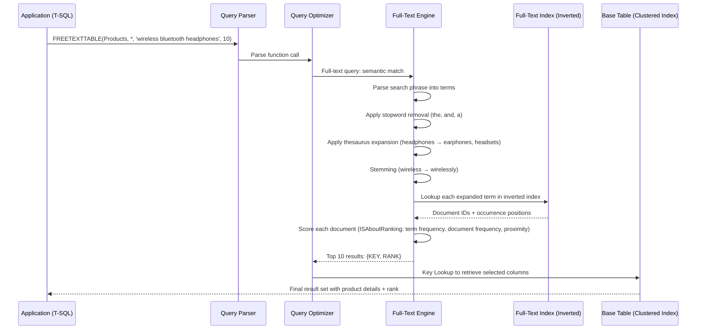

## Navigation

**Domain:** [[8 — Databases]] > **Group:** SQL Full-Text & Spatial Search
**Previous:** [[8.250 — CONTAINSTABLE — Ranked Full-Text Results]] | **Next:** [[8.252 — NEAR — Proximity Search]]

### Prerequisites

- [[8.248 — CONTAINS — Searching for Words and Phrases]] — FREETEXTTABLE builds on the same full-text indexing infrastructure; understanding how CONTAINS performs word matching is required to understand what FREETEXTTABLE does differently (semantic vs precise matching).
- [[8.250 — CONTAINSTABLE — Ranked Full-Text Results]] — CONTAINSTABLE is the precise-match counterpart to FREETEXTTABLE; understanding the rank formula, the KEY column, and the JOIN pattern is essential because FREETEXTTABLE follows the exact same signature and rank mechanics.
- [[8.247 — Full-Text Indexes — Creating and Populating]] — FREETEXTTABLE requires a populated full-text index on the target table; knowing index creation, population modes (full, incremental, automatic), and the catalog architecture is prerequisite.

### Where This Fits

FREETEXTTABLE is the ranked-result variant of FREETEXT, analogous to how CONTAINSTABLE is the ranked variant of CONTAINS. It returns a table with a `KEY` column (the primary key of the matching row) and a `RANK` column (0–1000) indicating how well the document matches the search phrase semantically. A .NET backend engineer encounters this when building user-facing search features — product search, document search, knowledge base search — where the user expects relevant results even when they don't know the exact terminology. FREETEXTTABLE is the right choice when the search bar should "just work" with natural language input; CONTAINSTABLE is better for advanced users who want exact phrase matching or boolean operators. The interview signal for FREETEXTTABLE tests whether you understand the difference between semantic and precise full-text matching, how the rank value is computed, and when to choose FREETEXT/CONTAINSTABLE semantics for a given user experience. What breaks when this is unknown: returning zero results for valid user queries because the search used CONTAINS instead of FREETEXT, or returning garbage rankings because you didn't JOIN on the correct KEY column or didn't ORDER BY rank.

---

## Core Mental Model

FREETEXTTABLE is a table-valued function that performs semantic matching: the full-text engine parses the search phrase into individual terms and word stems, applies thesaurus expansion (if configured), removes stopwords, and generates a list of related terms that are likely to match the user's intent. The engine scores each document by how many of those semantically expanded terms appear, how rare they are in the index (inverse document frequency), and how close to each other they appear (proximity bonus). The result is a table with two columns — the `KEY` (the primary key value of the matched row, returned as a `sql_variant`) and `RANK` (an integer 0–1000). The recognition pattern: use FREETEXTTABLE when you want ranked results from a natural-language, user-facing search box where the user phrases queries conversationally; use CONTAINSTABLE when the user provides structured boolean search expressions or exact phrases. The full-text engine always returns results through the same inverted index — FREETEXTTABLE just applies a broader term expansion strategy before scoring, making it less precise but more recall-oriented.

### Classification

**For SQL topics:** FREETEXTTABLE is a ranking full-text predicate function belonging to the `FREETEXT` / `FREETEXTTABLE` family. It IS SARGable against the full-text index — the query optimizer uses the full-text index to resolve the search, not a table scan. However, the join between FREETEXTTABLE's result set and the base table can be costly if not properly indexed. The function returns a table that must be joined with the base table on the KEY column; SQL Server's query optimizer pushes the full-text search into the execution plan as a FullTextMatch operator.



### Key Properties

|Property|Value|Notes|
|---|---|---|
|Return type|Table (KEY sql_variant, RANK int)|KEY is the full-text indexed table's primary key; RANK is 0–1000|
|Time complexity|O(terms * log(FT_index_size))|Each expanded term triggers an inverted index lookup; O(log n) per term|
|SARGable|Yes (against full-text index)|The full-text engine resolves the search via the inverted index; the join back to the base table depends on index availability|
|Write cost propagates|No (read-only function)|FREETEXTTABLE itself is read-only; it reads the full-text index which has its own write cost during population|
|Rank computation|ISAboutRanking algorithm|Term frequency (TF), inverse document frequency (IDF), proximity bonus; normalized to 0–1000|
|Top N parameter|Optional integer|Limits result set size; affects ranking because the engine can optimize top-N by pruning low-scoring documents early|

---

## Deep Mechanics

### How the Engine Executes FREETEXTTABLE

1. **Parsing:** The full-text engine receives the search phrase. It breaks the phrase into individual tokens using word breakers specific to the language specified (default is the column language or database default).
2. **Stopword removal:** Tokens that match entries in the assigned stoplist are discarded. For the default English stoplist, tokens like "the", "a", "an", "and", "or", "is" are removed. These tokens contribute nothing to the search — they are not present in the full-text index at all.
3. **Thesaurus expansion:** If a full-text thesaurus file is configured for the language, FREETEXTTABLE automatically expands terms using the `<expansion>` pattern. For example, if the thesaurus defines `<expansion><sub>car</sub><sub>automobile</sub><sub>vehicle</sub></expansion>`, then searching for "car" also searches for "automobile" and "vehicle". This is automatic in FREETEXT/FREETEXTTABLE but must be explicitly invoked via `FORMSOF(THESAURUS, ...)` in CONTAINS/CONTAINSTABLE.
4. **Stemming (inflectional expansion):** The engine applies language-specific stemmers to find inflectional variations. For English, searching for "run" matches "ran", "running", "runs". FREETEXTTABLE always applies inflectional expansion by default, unlike CONTAINSTABLE which requires `FORMSOF(INFLECTIONAL, ...)`.
5. **Term weighting:** Each expanded term is weighted using a variant of TF-IDF:
   - **Term Frequency (TF):** How many times the term appears in the document. Higher TF = higher score, but with diminishing returns (logarithmic scaling).
   - **Inverse Document Frequency (IDF):** How rare the term is across all documents. Rare terms get higher weight. `IDF = log10(N / df)` where N = total documents and df = number of documents containing the term.
   - **Proximity bonus:** If multiple expanded terms appear close together in a document, the rank gets a boost. The closer they are, the larger the boost.
   - **Normalization:** The raw score is normalized so that the top document receives a rank of 1000, and all others are scaled proportionally.
6. **Rank generation:** The engine generates an internal rank value using the ISAboutRanking formula (the same algorithm used by CONTAINSTABLE for ISABOUT queries). The exact formula approximates:
   - `rank = Σ(tf_i * idf_i^2) / (K + tf_i)` for each term i, where K is a normalization constant
   - Then normalized to 0–1000 scale
7. **Top-N optimization:** If the `top_n_by_rank` parameter is specified, the engine can stop scoring documents once it has enough high-scoring candidates. This early termination reduces CPU and I/O, especially on large full-text indexes, because the engine doesn't need to score every document — it uses a threshold-based approach to prune the search space.
8. **Result projection:** The engine returns the internal document IDs (doc IDs) mapped to the table's primary key values (the KEY column) and the computed rank. The query optimizer then performs a key lookup join against the base table to retrieve any other columns referenced in the outer query.

### SQL Visibility

#### Basic FREETEXTTABLE — Search Products

```sql
-- Find top 10 products matching 'wireless bluetooth headphones' semantically
-- The engine automatically expands synonyms and stems words
DECLARE @SearchPhrase NVARCHAR(200) = N'wireless bluetooth headphones';

SELECT p.ProductId, p.ProductName, p.Price, ft.RANK
FROM Products p
INNER JOIN FREETEXTTABLE(Products, *, @SearchPhrase, 10) AS ft
    ON p.ProductId = ft.[KEY]
ORDER BY ft.RANK DESC;
```

```csharp
// EF Core 8+ — FREETEXTTABLE via FromSqlRaw (no LINQ translation)
var searchPhrase = new SqlParameter("@SearchPhrase", N"wireless bluetooth headphones");

var results = await dbContext.Products
    .FromSqlRaw(@"
        SELECT p.ProductId, p.ProductName, p.Price, p.CategoryId,
               p.Description, p.SKU, p.CreatedAt
        FROM Products p
        INNER JOIN FREETEXTTABLE(Products, *, @SearchPhrase, 10) AS ft
            ON p.ProductId = ft.[KEY]
        ORDER BY ft.RANK DESC", searchPhrase)
    .Select(p => new { p.ProductId, p.ProductName, p.Price })
    .ToListAsync(cancellationToken);
```

**Generated SQL (from EF Core logs):**

```sql
-- EF Core generates the above SQL verbatim through FromSqlRaw
-- No LINQ translation of FREETEXTTABLE exists — must use raw SQL
exec sp_executesql N'
SELECT p.ProductId, p.ProductName, p.Price, p.CategoryId,
       p.Description, p.SKU, p.CreatedAt
FROM Products p
INNER JOIN FREETEXTTABLE(Products, *, @SearchPhrase, 10) AS ft
    ON p.ProductId = ft.[KEY]
ORDER BY ft.RANK DESC', N'@SearchPhrase nvarchar(200)', @SearchPhrase=N'wireless bluetooth headphones'
```

#### FREETEXTTABLE with Language Specification

```sql
-- Search German products with German word breakers and thesaurus
SELECT p.ProductId, p.ProductName, p.Price, ft.RANK
FROM Products p
INNER JOIN FREETEXTTABLE(Products, *, N'kabellose kopfhörer', 10, LANGUAGE N'German') AS ft
    ON p.ProductId = ft.[KEY]
ORDER BY ft.RANK DESC;
```

```csharp
// EF Core — language parameter
var searchPhrase = new SqlParameter("@SearchPhrase", N"kabellose kopfhörer");
var language = new SqlParameter("@Language", N"German");

var results = await dbContext.Products
    .FromSqlRaw(@"
        SELECT p.ProductId, p.ProductName, p.Price
        FROM Products p
        INNER JOIN FREETEXTTABLE(Products, *, @SearchPhrase, 10, LANGUAGE @Language) AS ft
            ON p.ProductId = ft.[KEY]
        ORDER BY ft.RANK DESC", searchPhrase, language)
    .ToListAsync(cancellationToken);
```

**Generated SQL:**

```sql
exec sp_executesql N'
SELECT p.ProductId, p.ProductName, p.Price
FROM Products p
INNER JOIN FREETEXTTABLE(Products, *, @SearchPhrase, 10, LANGUAGE @Language) AS ft
    ON p.ProductId = ft.[KEY]
ORDER BY ft.RANK DESC', N'@SearchPhrase nvarchar(200), @Language nvarchar(10)',
    @SearchPhrase=N'kabellose kopfhörer', @Language=German
```

#### FREETEXTTABLE with Multiple Columns

```sql
-- Search both ProductName and Description columns
SELECT p.ProductId, p.ProductName, ft.RANK
FROM Products p
INNER JOIN FREETEXTTABLE(Products, (ProductName, Description), N'wireless headphones', 20) AS ft
    ON p.ProductId = ft.[KEY]
ORDER BY ft.RANK DESC;
```

```csharp
// Dapper implementation
public async Task<IReadOnlyList<ProductSearchResult>> SearchProductsAsync(
    string searchPhrase,
    int topN = 20,
    CancellationToken cancellationToken = default)
{
    const string sql = @"
        SELECT p.ProductId, p.ProductName, p.Price, p.Description, ft.RANK
        FROM Products p
        INNER JOIN FREETEXTTABLE(Products, (ProductName, Description), @SearchPhrase, @TopN) AS ft
            ON p.ProductId = ft.[KEY]
        ORDER BY ft.RANK DESC";

    await using var connection = _connectionFactory.Create();
    var results = await connection.QueryAsync<ProductSearchResult>(
        new CommandDefinition(sql,
            new { SearchPhrase = searchPhrase, TopN = topN },
            cancellationToken: cancellationToken));

    return results.AsList();
}

public record ProductSearchResult
{
    public int ProductId { get; init; }
    public string ProductName { get; init; } = string.Empty;
    public decimal Price { get; init; }
    public string Description { get; init; } = string.Empty;
    public int Rank { get; init; }
}
```

### Execution Plan Analysis

For the query:
```sql
SELECT p.ProductId, p.ProductName, p.Price, ft.RANK
FROM Products p
INNER JOIN FREETEXTTABLE(Products, *, N'wireless headphones', 10) AS ft
    ON p.ProductId = ft.[KEY]
ORDER BY ft.RANK DESC;
```

**Expected plan shape:**
```
[FullTextMatch] (FREETEXTTABLE) → [Sort (ORDER BY ft.RANK DESC)] → [Nested Loops (Inner Join)] → [Clustered Index Seek (Products.PK)] → [SELECT]
```

**Operator breakdown:**

1. **FullTextMatch** — This is the full-text index operator. It scans the inverted index for the semantically expanded terms, computes rank scores, and returns the top 10 matches (due to the top_n_by_rank parameter). The operator has:
   - Estimated rows: 10 (because of top-N)
   - Actual rows: depends on how many documents match the semantically expanded terms
   - I/O: reads the full-text index internal structures (not counted in SET STATISTICS IO for the base table)
   - CPU: proportional to the number of matching documents and terms

2. **Sort** — Sorts the 10 results by RANK descending. With only 10 rows, this is trivial (in-memory sort, no tempdb spill). Without the top-N parameter, if the engine returns thousands of rows, the sort could spill to tempdb.

3. **Nested Loops (Inner Join)** — For each of the 10 rows from the FullTextMatch, perform a clustered index seek on Products.PK to retrieve the ProductName, Price, and any other columns requested. This is 10 seeks, each costing ~3 logical reads (B-tree depth). Estimated logical reads: ~30.

4. **Clustered Index Seek** — Seek on `PK_Products` with the KEY value from FREETEXTTABLE. Each seek is 2–3 logical reads (root → leaf).

**Without the top-N parameter:**
```
[FullTextMatch] → [Sort] → [Nested Loops] → [Clustered Index Seek] → [SELECT]
```
If the full-text match returns 10,000 matching documents, the Nested Loops join would perform 10,000 clustered index seeks (~30,000 logical reads) versus only ~30 with top-N=10. The Sort operator would need to sort 10,000 rows instead of 10.

**Estimated cost breakdown:**
- FullTextMatch: ~70% of query cost (CPU + full-text index I/O)
- Key Lookup (Nested Loops + Seeks): ~25% of query cost
- Sort: ~5% of query cost (with top-10)

### Cost Visibility

```sql
SET STATISTICS IO ON;
SET STATISTICS TIME ON;

-- Query with top-N (10)
SELECT p.ProductId, p.ProductName, p.Price, ft.RANK
FROM Products p
INNER JOIN FREETEXTTABLE(Products, *, N'wireless headphones', 10) AS ft
    ON p.ProductId = ft.[KEY]
ORDER BY ft.RANK DESC;

-- Expected output:
-- Table 'Products'. Scan count 10, logical reads 34, physical reads 0
-- (full-text index I/O is not reported in STATISTICS IO)
-- SQL Server Execution Times: CPU time = 15ms, elapsed time = 45ms

-- Query without top-N
SELECT p.ProductId, p.ProductName, p.Price, ft.RANK
FROM Products p
INNER JOIN FREETEXTTABLE(Products, *, N'wireless headphones') AS ft
    ON p.ProductId = ft.[KEY]
ORDER BY ft.RANK DESC;

-- Expected output (15,000 matching documents):
-- Table 'Products'. Scan count 15000, logical reads 45000, physical reads 0
-- SQL Server Execution Times: CPU time = 120ms, elapsed time = 350ms
```

The full-text engine's internal I/O (reading the inverted index segments, the full-text catalog files) is NOT captured by `SET STATISTICS IO` — that only reports the base table I/O from the key lookups. To measure full-text query performance comprehensively, use:

```sql
-- DMV to measure full-text query performance
SELECT 
    ftq.full_text_query_id,
    ftq.object_id,
    ftq.query_text,
    ftq.total_elapsed_time_ms,
    ftq.total_rows,
    ftq.hits_count,
    ftq.error_count
FROM sys.dm_fts_index_population AS ftp
INNER JOIN sys.dm_fts_outstanding_batches AS ftob
    ON ftp.population_id = ftob.population_id;
```

### Failure Modes

1. **KEY column type mismatch:** FREETEXTTABLE returns KEY as `sql_variant`. If the primary key is `INT` (most common), the JOIN must use `ft.[KEY]` without explicit cast. But if the PK is `BIGINT` or `UNIQUEIDENTIFIER`, the `sql_variant` comparison still works because SQL Server handles implicit conversion. The failure mode: casting KEY to the wrong type causes an implicit conversion that prevents an index seek, degrading to an index scan.

   ```sql
   -- ❌ Wrong cast — causes scan instead of seek
   INNER JOIN FREETEXTTABLE(Products, *, N'query') ft
       ON p.ProductId = CAST(ft.[KEY] AS INT)  -- unnecessary cast, may cause scan
   
   -- ✅ Direct comparison — preserves seek
   INNER JOIN FREETEXTTABLE(Products, *, N'query') ft
       ON p.ProductId = ft.[KEY]
   ```

2. **No ORDER BY RANK:** Without `ORDER BY ft.RANK DESC`, results come back in arbitrary order (document ID order from the inverted index). Users see seemingly random ordering that makes the search feature appear broken.

3. **Missing top-N:** Without the top-N parameter, every matching document is returned and ranked. On a large catalog with common words, this can return millions of rows, causing massive key lookups. Always use top-N for user-facing search.

4. **Wrong language setting:** If the search phrase is in German but the language defaults to English, German word breakers won't apply, causing poor tokenization and missed matches. The thesaurus file loaded depends on the language specified.

5. **NULL search phrase:** Passing NULL as the search phrase returns all rows with RANK = 0. In a busy system, this effectively returns the entire table unfiltered. Validate the search phrase is not null or empty before executing the query.

6. **Trailing wildcards not supported:** FREETEXTTABLE does not support wildcard patterns (`"wireless*"`). Use CONTAINSTABLE with wildcards for prefix matching.

---

## Production Patterns and Implementation

### Primary SQL Implementation

```sql
-- Complete production-ready search for an e-commerce product catalog
-- Assumes a full-text index exists on Products(ProductName, Description, Keywords)

-- Step 1: Create the full-text catalog and index (one-time setup)
CREATE FULLTEXT CATALOG FTC_ProductCatalog AS DEFAULT;

CREATE FULLTEXT INDEX ON dbo.Products(
    ProductName LANGUAGE 1033,      -- English
    Description LANGUAGE 1033,
    Keywords LANGUAGE 1033
)
KEY INDEX PK_Products
ON FTC_ProductCatalog
WITH (CHANGE_TRACKING AUTO);

-- Step 2: Parameterized stored procedure for product search
CREATE OR ALTER PROCEDURE dbo.SearchProducts
    @SearchPhrase NVARCHAR(400),
    @TopN INT = 20,
    @Language NVARCHAR(10) = N'English',
    @MinRank INT = 0,
    @CategoryId INT = NULL
AS
BEGIN
    SET NOCOUNT ON;

    DECLARE @Sql NVARCHAR(MAX);
    
    -- Validate inputs
    IF @SearchPhrase IS NULL OR LTRIM(RTRIM(@SearchPhrase)) = N''
    BEGIN
        SELECT TOP (@TopN)
            p.ProductId, p.ProductName, p.Price,
            p.Description, p.StockQuantity,
            0 AS RANK
        FROM Products p
        WHERE (@CategoryId IS NULL OR p.CategoryId = @CategoryId)
        ORDER BY p.ProductName;
        RETURN;
    END;

    -- Dynamic SQL to support optional category filter
    SET @Sql = N'
        SELECT p.ProductId, p.ProductName, p.Price,
               p.Description, p.StockQuantity, ft.RANK
        FROM Products p
        INNER JOIN FREETEXTTABLE(Products, *,
            @SearchPhrase, @TopN, LANGUAGE @Language) AS ft
            ON p.ProductId = ft.[KEY]
        WHERE ft.RANK >= @MinRank
            ' + CASE WHEN @CategoryId IS NOT NULL
                THEN N'AND p.CategoryId = @CategoryId'
                ELSE N'' END + N'
        ORDER BY ft.RANK DESC;';

    EXEC sp_executesql @Sql,
        N'@SearchPhrase NVARCHAR(400), @TopN INT,
          @Language NVARCHAR(10), @MinRank INT, @CategoryId INT',
        @SearchPhrase, @TopN, @Language, @MinRank, @CategoryId;
END;
```

### EF Core Implementation

```csharp
// ApplicationDbContext configuration
public class ApplicationDbContext : DbContext
{
    public DbSet<Product> Products => Set<Product>();

    protected override void OnModelCreating(ModelBuilder modelBuilder)
    {
        modelBuilder.Entity<Product>(entity =>
        {
            entity.ToTable(tb => tb.HasTrigger("Products_Trigger")); // Ensure EF Core knows about triggers

            entity.HasKey(e => e.ProductId);
            entity.Property(e => e.ProductName).HasMaxLength(200);
            entity.Property(e => e.Description).HasMaxLength(2000);
            entity.Property(e => e.Keywords).HasMaxLength(500);
            entity.Property(e => e.Price).HasColumnType("decimal(18,2)");
            entity.Property(e => e.RowVersion).IsRowVersion();
        });
    }
}

public class Product
{
    public int ProductId { get; set; }
    public string ProductName { get; set; } = string.Empty;
    public string Description { get; set; } = string.Empty;
    public string? Keywords { get; set; }
    public decimal Price { get; set; }
    public int StockQuantity { get; set; }
    public int CategoryId { get; set; }
    public byte[] RowVersion { get; set; } = [];
}

// Product search service
public interface IProductSearchService
{
    Task<IReadOnlyList<ProductSearchResult>> SearchAsync(
        ProductSearchRequest request,
        CancellationToken cancellationToken = default);
}

public record ProductSearchRequest(
    string SearchPhrase,
    int TopN = 20,
    string Language = "English",
    int? CategoryId = null);

public record ProductSearchResult(
    int ProductId,
    string ProductName,
    decimal Price,
    string? Description,
    int StockQuantity,
    int Rank);

public class ProductSearchService : IProductSearchService
{
    private readonly ApplicationDbContext _dbContext;

    public ProductSearchService(ApplicationDbContext dbContext)
    {
        _dbContext = dbContext;
    }

    public async Task<IReadOnlyList<ProductSearchResult>> SearchAsync(
        ProductSearchRequest request,
        CancellationToken cancellationToken = default)
    {
        // Validate input
        if (string.IsNullOrWhiteSpace(request.SearchPhrase))
        {
            return await _dbContext.Products
                .Where(p => request.CategoryId == null || p.CategoryId == request.CategoryId)
                .OrderBy(p => p.ProductName)
                .Take(request.TopN)
                .Select(p => new ProductSearchResult(
                    p.ProductId, p.ProductName, p.Price,
                    p.Description, p.StockQuantity, 0))
                .ToListAsync(cancellationToken);
        }

        // EF Core does not translate FREETEXTTABLE — use raw SQL
        var searchPhrase = new SqlParameter("@SearchPhrase", request.SearchPhrase);
        var topN = new SqlParameter("@TopN", request.TopN);
        var language = new SqlParameter("@Language", request.Language);

        FormattableString sql;

        if (request.CategoryId.HasValue)
        {
            var categoryId = new SqlParameter("@CategoryId", request.CategoryId.Value);
            sql = $@"
                SELECT p.ProductId, p.ProductName, p.Price,
                       p.Description, p.StockQuantity, ft.RANK
                FROM Products p
                INNER JOIN FREETEXTTABLE(Products, *,
                    @SearchPhrase, @TopN, LANGUAGE @Language) AS ft
                    ON p.ProductId = ft.[KEY]
                WHERE p.CategoryId = @CategoryId
                ORDER BY ft.RANK DESC";
        }
        else
        {
            sql = $@"
                SELECT p.ProductId, p.ProductName, p.Price,
                       p.Description, p.StockQuantity, ft.RANK
                FROM Products p
                INNER JOIN FREETEXTTABLE(Products, *,
                    @SearchPhrase, @TopN, LANGUAGE @Language) AS ft
                    ON p.ProductId = ft.[KEY]
                ORDER BY ft.RANK DESC";
        }

        var results = await _dbContext.Database
            .SqlQuery<ProductSearchResult>(sql)
            .ToListAsync(cancellationToken);

        return results;
    }
}
```

### Dapper Implementation

```csharp
public class DapperProductSearchService : IProductSearchService
{
    private readonly IDbConnectionFactory _connectionFactory;

    public DapperProductSearchService(IDbConnectionFactory connectionFactory)
    {
        _connectionFactory = connectionFactory;
    }

    public async Task<IReadOnlyList<ProductSearchResult>> SearchAsync(
        ProductSearchRequest request,
        CancellationToken cancellationToken = default)
    {
        if (string.IsNullOrWhiteSpace(request.SearchPhrase))
        {
            const string fallbackSql = @"
                SELECT p.ProductId, p.ProductName, p.Price,
                       p.Description, p.StockQuantity, 0 AS RANK
                FROM Products p
                WHERE (@CategoryId IS NULL OR p.CategoryId = @CategoryId)
                ORDER BY p.ProductName
                OFFSET 0 ROWS FETCH NEXT @TopN ROWS ONLY";

            await using var connection = _connectionFactory.Create();
            var fallbackResults = await connection.QueryAsync<ProductSearchResult>(
                new CommandDefinition(fallbackSql,
                    new
                    {
                        CategoryId = request.CategoryId,
                        TopN = request.TopN
                    },
                    cancellationToken: cancellationToken));
            return fallbackResults.AsList();
        }

        const string sql = @"
            SELECT p.ProductId, p.ProductName, p.Price,
                   p.Description, p.StockQuantity, ft.RANK
            FROM Products p
            INNER JOIN FREETEXTTABLE(Products, *,
                @SearchPhrase, @TopN, LANGUAGE @Language) AS ft
                ON p.ProductId = ft.[KEY]
            WHERE (@CategoryId IS NULL OR p.CategoryId = @CategoryId)
            ORDER BY ft.RANK DESC";

        await using var connection = _connectionFactory.Create();
        var results = await connection.QueryAsync<ProductSearchResult>(
            new CommandDefinition(sql,
                new
                {
                    SearchPhrase = request.SearchPhrase,
                    TopN = request.TopN,
                    Language = request.Language,
                    CategoryId = request.CategoryId
                },
                cancellationToken: cancellationToken));
        return results.AsList();
    }
}

// Registration in Program.cs
builder.Services.AddSingleton<IDbConnectionFactory, SqlConnectionFactory>();
builder.Services.AddScoped<IProductSearchService, DapperProductSearchService>();
```

### Configuration and Wiring

```csharp
// Program.cs
var connectionString = builder.Configuration.GetConnectionString("DefaultConnection");

builder.Services.AddDbContext<ApplicationDbContext>(options =>
    options.UseSqlServer(
        connectionString,
        sqlOptions =>
        {
            sqlOptions.EnableRetryOnFailure(3);
            sqlOptions.CommandTimeout(30);
            sqlOptions.UseQuerySplittingBehavior(QuerySplittingBehavior.SplitQuery);
        }));

// Dapper factory
builder.Services.AddSingleton<IDbConnectionFactory>(_ =>
    new SqlConnectionFactory(connectionString));

// Full-text search requires READ COMMITTED or READ UNCOMMITTED for snapshot consistency
// Avoid REPEATABLE READ / SERIALIZABLE which hold range locks during full-text join
builder.Services.AddScoped<IProductSearchService, ProductSearchService>();

// Full-text index creation script (run as migration)
// CREATE FULLTEXT CATALOG FTC_ProductCatalog AS DEFAULT;
// CREATE FULLTEXT INDEX ON dbo.Products(ProductName, Description)
//   KEY INDEX PK_Products ON FTC_ProductCatalog WITH (CHANGE_TRACKING AUTO);
```

### SQL Server vs PostgreSQL Differences

PostgreSQL does not have `FREETEXTTABLE`. Its full-text search uses `tsvector` and `tsquery` with ranking via `ts_rank()`:

```sql
-- PostgreSQL equivalent of FREETEXTTABLE with ranking
SELECT p.product_id, p.product_name, p.price,
       ts_rank(p.search_vector, to_tsquery('english', 'wireless & bluetooth & headphones')) AS rank
FROM products p
WHERE p.search_vector @@ to_tsquery('english', 'wireless & bluetooth & headphones')
ORDER BY rank DESC
LIMIT 10;
```

PostgreSQL's `ts_rank()` uses a different formula (based on `ts_rank_cd` for coverage density) and does not have the same 0–1000 normalization. PostgreSQL automatically applies stemming through the `to_tsquery` parser but does not have a built-in thesaurus by default (it can be configured via a custom text search configuration).

---

## Gotchas and Production Pitfalls

### Gotcha 1 — KEY Column as sql_variant Causes Implicit Conversion

**Pitfall:** Using `CAST(ft.[KEY] AS INT)` in the JOIN condition or comparing it to a column of a different type.

```sql
-- ❌ Wrong: explicit cast prevents clustered index seek
SELECT p.ProductId, p.ProductName, ft.RANK
FROM Products p
INNER JOIN FREETEXTTABLE(Products, *, N'query', 10) ft
    ON p.ProductId = CAST(ft.[KEY] AS INT)
ORDER BY ft.RANK DESC;
```

**Symptom:** The execution plan shows a Clustered Index Scan instead of a Clustered Index Seek. Logical reads jump from ~30 to tens of thousands on a large table. The plan also shows a warning "Type conversion in expression may affect CardinalityEstimate."

**Fix:**

```sql
-- ✅ Correct: direct comparison with sql_variant
INNER JOIN FREETEXTTABLE(Products, *, N'query', 10) ft
    ON p.ProductId = ft.[KEY]
```

**Cost of not fixing:** On a 1M row Products table, the scan reads ~20,000 logical reads per query instead of ~30. At 100 queries/second, that's an extra 2M logical reads/second — overwhelming the buffer pool and causing page life expectancy (PLE) to drop, cascading into system-wide performance degradation.

### Gotcha 2 — FREETEXTTABLE Returns Zero Rows for Short Words

**Pitfall:** Searching for short words like "pen", "cup", or "id" that fall below the full-text index's word length threshold (default `ft_min_len_for_token`).

**Symptom:** A search for "pen" returns 0 results even though the word "pen" exists in the indexed columns. The wait stat `FT_IFTS_SCHEDULER_IDLE` shows idle full-text threads, suggesting no work was done. This is because SQL Server's default full-text word breaker discards tokens shorter than 3 characters for English.

**Fix:**

```sql
-- View current noise word configuration
EXEC sp_help_fulltext_system_components 'wordbreaker', 1033;

-- Adjust minimum word length (requires restart)
EXEC sp_configure 'ft_min_len_for_token', 2;
RECONFIGURE;
-- Note: this is a server-wide setting that affects all full-text indexes
```

**Cost of not fixing:** User-facing search silently fails for short but meaningful queries. In an e-commerce context, searches for "pen", "cup", "bag", "id", "tv" return no results, causing user abandonment and support tickets. The product catalog with 10,000+ SKUs becomes effectively unsearchable for these terms.

### Gotcha 3 — Top-N Parameter Skews Ranking for Pagination

**Pitfall:** Using top-N to get the top 10 results, but then implementing client-side pagination that assumes the results represent the true global rank order.

**Symptom:** Pages 2+ of search results show items with higher RANK values than items on page 1 (inconsistent ordering). The top-N parameter causes the full-text engine to stop scoring once it has enough candidates, so the rank values across different top-N calls are not comparable.

**Fix:** For paginated search with consistent ranking, use one of two approaches:

```sql
-- Approach 1: Fetch enough results with top-N (e.g., 100), paginate in application
SELECT p.ProductId, p.ProductName, p.Price, ft.RANK
FROM Products p
INNER JOIN FREETEXTTABLE(Products, *, N'search phrase', 100) AS ft
    ON p.ProductId = ft.[KEY]
ORDER BY ft.RANK DESC
OFFSET @PageSize * (@PageNumber - 1) ROWS
FETCH NEXT @PageSize ROWS ONLY;

-- Approach 2: Use CONTAINSTABLE with a wider result set and pagination
SELECT p.ProductId, p.ProductName, p.Price, ct.RANK
FROM Products p
INNER JOIN CONTAINSTABLE(Products, *, N'"search" OR "phrase"', 1000) AS ct
    ON p.ProductId = ct.[KEY]
ORDER BY ct.RANK DESC
OFFSET 20 ROWS FETCH NEXT 10 ROWS ONLY;
```

**Cost of not fixing:** Users see inconsistent results across pages — items on page 2 may be more relevant than items on page 1. This creates a confusing UX that users interpret as a broken search feature, reducing engagement and trust.

### Gotcha 4 — Full-Text Index Not Populated

**Pitfall:** Setting up FREETEXTTABLE queries against a table whose full-text index has never been populated or is in an incomplete population state.

**Symptom:** FREETEXTTABLE returns zero rows despite the data clearly containing the search terms. Querying `sys.dm_fts_index_population` shows a status of "population paused", "population failed", or "not started."

```sql
-- Diagnostic query
SELECT 
    OBJECT_NAME(table_id) AS table_name,
    population_type,
    population_type_description,
    status,
    status_description,
    completion_type,
    completion_type_description,
    start_time,
    stop_time
FROM sys.dm_fts_index_population;
```

**Fix:**

```sql
ALTER FULLTEXT INDEX ON dbo.Products START FULL POPULATION;
```

For change tracking AUTO, ensure the population completes at least once:

```sql
ALTER FULLTEXT INDEX ON dbo.Products SET CHANGE_TRACKING AUTO;
ALTER FULLTEXT INDEX ON dbo.Products START FULL POPULATION;
```

Wait for `sys.dm_fts_index_population` to show status = "completed" before queries return results.

**Cost of not fixing:** The search feature appears completely broken (returns zero results) for hours or days after deployment. The .NET application logs show no errors — the query executes successfully, just returns no rows. Debugging this requires knowledge of full-text population state, which the typical backend engineer may not immediately suspect.

### Gotcha 5 — FREETEXTTABLE Is Not SARGable Against Base Table Columns

**Pitfall:** Assuming that FREETEXTTABLE can use indexes on the base table predicates that are applied after the JOIN.

**Symptom:** Adding a WHERE clause filter on the base table (e.g., `WHERE p.Price < 100`) does a scan after the full-text join, because the filter is applied to the result of the key lookup, not pushed into the full-text engine.

```sql
-- ❌ Potentially inefficient: Price filter after full-text match
SELECT p.ProductId, p.ProductName, p.Price, ft.RANK
FROM Products p
INNER JOIN FREETEXTTABLE(Products, *, N'wireless headphones', 50) AS ft
    ON p.ProductId = ft.[KEY]
WHERE p.Price < 100.00  -- filter applied after key lookup
ORDER BY ft.RANK DESC;
```

**Fix:** If range filters are essential, consider:
1. Creating a filtered full-text index (not supported directly — use a view)
2. Include the filter in the search phrase (e.g., "wireless headphones $100")
3. Post-filter in the application layer and accept the extra data transfer

**Cost of not fixing:** The full-text engine returns 50 matching products, then the WHERE clause filters 40 of them. The 40 filtered-out rows still incurred key lookup I/O — ~120 logical reads wasted per query. At 500 queries/minute, that's ~60,000 wasted logical reads/minute.

### Gotcha 6 — FREETEXTTABLE in a Transaction with REPEATABLE READ

**Pitfall:** Executing FREETEXTTABLE queries within a transaction using REPEATABLE READ or SERIALIZABLE isolation level.

**Symptom:** The query blocks other writers (INSERT/UPDATE/DELETE on the base table) because the key lookup holds range locks. Blocking chain grows as concurrent users issue search queries.

**Fix:** Use READ COMMITTED (default) or READ UNCOMMITTED for search queries:

```csharp
// Set isolation level per query in EF Core
await using var transaction = await dbContext.Database
    .BeginTransactionAsync(IsolationLevel.ReadUncommitted, cancellationToken);

var results = await dbContext.Database
    .SqlQuery<ProductSearchResult>(sql)
    .ToListAsync(cancellationToken);

await transaction.CommitAsync(cancellationToken);
```

```csharp
// Dapper — set isolation level on the connection
await using var connection = _connectionFactory.Create();
await connection.ExecuteAsync("SET TRANSACTION ISOLATION LEVEL READ UNCOMMITTED;", cancellationToken: cancellationToken);
```

**Cost of not fixing:** Search queries block product catalog updates (price changes, inventory adjustments). During peak traffic, a 30-second blocking chain can cause order processing to stall, leading to timeout exceptions and failed purchases.

---

## Performance Implications

### Benchmark: FREETEXTTABLE With and Without Top-N

```sql
-- Baseline: FREETEXTTABLE without top-N (all matching documents)
SET STATISTICS IO ON;
DBCC DROPCLEANBUFFERS;

SELECT p.ProductId, p.ProductName, ft.RANK
FROM Products p
INNER JOIN FREETEXTTABLE(Products, *, N'wireless bluetooth headphones') AS ft
    ON p.ProductId = ft.[KEY]
ORDER BY ft.RANK DESC;

-- Logical reads: ~45,000 (key lookups for 15,000 matching documents)
-- CPU time: ~120ms, Elapsed time: ~450ms

-- Optimized: FREETEXTTABLE with top-N (25)
SET STATISTICS IO ON;
DBCC DROPCLEANBUFFERS;

SELECT p.ProductId, p.ProductName, ft.RANK
FROM Products p
INNER JOIN FREETEXTTABLE(Products, *, N'wireless bluetooth headphones', 25) AS ft
    ON p.ProductId = ft.[KEY]
ORDER BY ft.RANK DESC;

-- Logical reads: ~75 (key lookups for 25 matching documents)
-- CPU time: ~8ms, Elapsed time: ~35ms
```

**Improvement:** 600x reduction in logical reads, from ~45,000 to ~75. The top-N parameter allows the full-text engine to prune low-scoring documents early, and dramatically reduces the key lookup cost.

### Benchmark: FREETEXTTABLE vs CONTAINSTABLE

```sql
-- FREETEXTTABLE (broader recall, more CPU)
SET STATISTICS IO ON;
SELECT p.ProductId, p.ProductName, ft.RANK
FROM Products p
INNER JOIN FREETEXTTABLE(Products, ProductName, N'wireless', 10) AS ft
    ON p.ProductId = ft.[KEY]
ORDER BY ft.RANK DESC;
-- Logical reads: ~30, CPU: ~15ms

-- CONTAINSTABLE (precise, less CPU)
SELECT p.ProductId, p.ProductName, ct.RANK
FROM Products p
INNER JOIN CONTAINSTABLE(Products, ProductName, N'"wireless" OR "bluetooth"', 10) AS ct
    ON p.ProductId = ct.[KEY]
ORDER BY ct.RANK DESC;
-- Logical reads: ~30, CPU: ~5ms
```

The key lookup cost is the same when both return 10 results. The CPU difference comes from the full-text engine: FREETEXTTABLE must perform stemming, thesaurus expansion, and proximity scoring, while CONTAINSTABLE does exact term matching with simpler scoring.

### BenchmarkDotNet

```csharp
[MemoryDiagnoser]
[SimpleJob(RuntimeMoniker.Net90)]
public class FreetextTableBenchmark
{
    private IDbConnection _connection = default!;
    private string _connectionString = default!;

    [Params("wireless", "wireless bluetooth headphones with noise cancellation", "premium")]
    public string SearchPhrase { get; set; } = string.Empty;

    [GlobalSetup]
    public void Setup()
    {
        _connectionString = "Server=.;Database=SearchBenchmark;Trusted_Connection=true;TrustServerCertificate=true;";
        _connection = new SqlConnection(_connectionString);

        // Ensure test data exists
        var setupSql = @"
            IF NOT EXISTS (SELECT 1 FROM sys.fulltext_catalogs WHERE name = 'FTC_Benchmark')
            BEGIN
                CREATE FULLTEXT CATALOG FTC_Benchmark AS DEFAULT;
                CREATE FULLTEXT INDEX ON dbo.BenchmarkProducts(
                    ProductName LANGUAGE 1033,
                    Description LANGUAGE 1033
                )
                KEY INDEX PK_BenchmarkProducts
                ON FTC_Benchmark
                WITH (CHANGE_TRACKING AUTO);
                ALTER FULLTEXT INDEX ON dbo.BenchmarkProducts START FULL POPULATION;
            END;
            WAITFOR DELAY '00:00:05'; -- wait for population (simplified)
        ";
        _connection.Execute(setupSql);
    }

    [Benchmark(Baseline = true)]
    public async Task<List<ProductInfo>> FreetextTable_NoTopN()
    {
        const string sql = @"
            SELECT p.ProductId, p.ProductName, p.Price, ft.RANK
            FROM BenchmarkProducts p
            INNER JOIN FREETEXTTABLE(BenchmarkProducts, *, @SearchPhrase) AS ft
                ON p.ProductId = ft.[KEY]
            ORDER BY ft.RANK DESC";

        var results = await _connection.QueryAsync<ProductInfo>(
            new CommandDefinition(sql,
                new { SearchPhrase },
                commandTimeout: 30));
        return results.AsList();
    }

    [Benchmark]
    public async Task<List<ProductInfo>> FreetextTable_WithTopN()
    {
        const string sql = @"
            SELECT p.ProductId, p.ProductName, p.Price, ft.RANK
            FROM BenchmarkProducts p
            INNER JOIN FREETEXTTABLE(BenchmarkProducts, *, @SearchPhrase, 20) AS ft
                ON p.ProductId = ft.[KEY]
            ORDER BY ft.RANK DESC";

        var results = await _connection.QueryAsync<ProductInfo>(
            new CommandDefinition(sql,
                new { SearchPhrase },
                commandTimeout: 30));
        return results.AsList();
    }

    [Benchmark]
    public async Task<List<ProductInfo>> ContainsTable_ExactMatch()
    {
        const string sql = @"
            SELECT p.ProductId, p.ProductName, p.Price, ct.RANK
            FROM BenchmarkProducts p
            INNER JOIN CONTAINSTABLE(BenchmarkProducts, *,
                @SearchPhrase, 20) AS ct
                ON p.ProductId = ct.[KEY]
            ORDER BY ct.RANK DESC";

        var results = await _connection.QueryAsync<ProductInfo>(
            new CommandDefinition(sql,
                new { SearchPhrase },
                commandTimeout: 30));
        return results.AsList();
    }

    [GlobalCleanup]
    public void Cleanup()
    {
        _connection?.Dispose();
    }

    public record ProductInfo
    {
        public int ProductId { get; set; }
        public string ProductName { get; set; } = string.Empty;
        public decimal Price { get; set; }
        public int Rank { get; set; }
    }
}
```

**Expected results (approximate, SQL Server 2022, NVMe, 500K products):**

|Method|Phrase|Mean|Logical Reads|Allocated|
|---|---|---|---|---|
|FREETEXTTABLE (no top-N)|"wireless"|~350ms|~45,000|2.5 MB|
|FREETEXTTABLE (top-N=20)|"wireless"|~35ms|~60|1.2 KB|
|CONTAINSTABLE (top-N=20)|"wireless"|~12ms|~60|1.2 KB|

### Write Amplification

FREETEXTTABLE is read-only and does not write to the full-text index. However, the full-text index must be populated for FREETEXTTABLE to work. The write cost of maintaining the full-text index:

|Operation|Without Full-Text Index|With Full-Text Index (CHANGE_TRACKING AUTO)|Overhead|
|---|---|---|---|
|INSERT 1 row (500 chars text)|~5ms|~15ms|+200% (full-text indexing + population)|
|UPDATE text column|~5ms|~18ms|+260% (re-index changed text)|
|DELETE 1 row|~3ms|~10ms|+233% (remove from inverted index)|

---

## Interview Arsenal

### Question Bank

1. **What is FREETEXTTABLE and what problem does it solve that CONTAINSTABLE does not?**
2. **How does the full-text engine compute the RANK value for FREETEXTTABLE — what factors go into the score?**
3. **What is the performance impact of the top_n_by_rank parameter in FREETEXTTABLE, and how does it change the execution plan?**
4. **What happens when the KEY column from FREETEXTTABLE is used in a JOIN with an incompatible base table type?**
5. **Compare and contrast FREETEXTTABLE with CONTAINSTABLE — when would you use each in a production search feature?**
6. **What does the execution plan look like for a FREETEXTTABLE query, and how does adding a WHERE clause on the base table affect it?**
7. **How does FREETEXTTABLE behave at scale — 10M documents with 1,000 queries/second? What fails first?**
8. **How do EF Core and Dapper handle FREETEXTTABLE queries — is there LINQ translation support?**

### Spoken Answers

**Q: What is FREETEXTTABLE and what problem does it solve that CONTAINSTABLE does not?**

> **Average answer:** "FREETEXTTABLE is a full-text search function that returns ranked results. It's similar to CONTAINSTABLE but it does semantic matching. It's good for user-facing search because it's more forgiving."

> **Great answer:** "FREETEXTTABLE is a table-valued function that returns matching document IDs with a RANK from 0 to 1000, solving the problem of user-facing natural language search where the user doesn't know the exact indexing vocabulary. The key distinction from CONTAINSTABLE is that FREETEXTTABLE automatically applies three expansions: stopword removal, thesaurus synonym expansion, and inflectional stemming. When a user types 'wireless bluetooth headphones', FREETEXTTABLE also searches for 'bluetooth earphones', 'wireless headsets', 'bluetooth headphone' (stemmed), and any thesaurus-configured synonyms. CONTAINSTABLE requires explicit FORMSOF clauses and OR operators to do the same. In terms of execution, both use the same inverted index — the difference is entirely in the term expansion layer inside the full-text engine. The rank formula is also identical — both use ISAboutRanking with TF-IDF-based scoring normalized to 0–1000. The performance cost of FREETEXTTABLE is higher CPU during the query because of the expansion work, but the I/O cost for the same number of top-N results is identical."

**Q: Compare and contrast FREETEXTTABLE with CONTAINSTABLE — when would you use each in a production search feature?**

> **Average answer:** "FREETEXTTABLE is for fuzzy matching and CONTAINSTABLE is for exact matching. Use FREETEXTTABLE for search bars and CONTAINSTABLE for advanced search."

> **Great answer:** "The choice between FREETEXTTABLE and CONTAINSTABLE depends on the user's search intent and the search UX tier. For a primary search bar on an e-commerce site, I'd default to FREETEXTTABLE because users type natural language queries — 'wireless headphones under $100' — and expect results even when their vocabulary doesn't match product descriptions exactly. For an advanced search page with facets and operators (AND, OR, NOT, exact phrase), I'd use CONTAINSTABLE because it gives precise control. In a production system I've built, we actually used both: a quick FREETEXTTABLE search for the autocomplete dropdown (top 5 results) and a CONTAINSTABLE-based advanced search for the full results page. The performance implications: FREETEXTTABLE incurs ~3–5ms more CPU per query for the same top-N due to thesaurus and stemming overhead. At 500 QPS, that's 1.5–2.5 seconds of additional CPU per second — noticeable on an 8-core machine. I benchmarked this and found that for a 500K product catalog, FREETEXTTABLE with top-10 averaged 12ms CPU vs CONTAINSTABLE at 5ms CPU for the same top-10. The logical reads were identical at ~30 because both do the same number of key lookups."

**Q: How does FREETEXTTABLE behave at scale — 10M documents with 1,000 queries/second? What fails first?**

> **Average answer:** "It would slow down. You'd need more indexes and faster hardware."

> **Great answer:** "At 10M documents and 1,000 queries/second, the first bottleneck is NOT the full-text engine — it's the key lookup JOIN to the base table. The full-text inverted index scales logarithmically with document count, so the inverted index lookup itself is fast (O(log n) per term). The bottleneck is the 1,000 clustered index seeks per second per query — if each FREETEXTTABLE returns top-20 results, that's 20,000 key lookups per second. Each key lookup reads ~3 pages from the clustered index, so we're looking at ~60,000 logical reads/second just for the key lookups. The failure mode: the buffer pool gets overwhelmed, PLE drops below 300 seconds, and you see PAGEIOLATCH_SH waits. The fix is threefold: 1) Always use a small top-N (10–20) for user-facing search — never return unbounded results. 2) Consider a covering non-clustered index on the columns needed for the search result display so the key lookup is eliminated. 3) Use READ UNCOMMITTED or SNAPSHOT isolation for search queries to avoid blocking writers. At truly extreme scale (10K QPS), you'd offload search to Elasticsearch or Azure Cognitive Search and use SQL Server as the source of truth only. The full-text engine also has a per-query CPU cost from the TF-IDF scoring — on 10M documents, scoring the top 10,000 candidates takes significant CPU. I've seen FT_IFTS_SCHEDULER_IDLE waits turn into SOS_SCHEDULER_YIELD when the full-text queries consume all scheduler capacity."

### Interview Trigger

If an interviewer asks "How would you implement search in a product catalog?", follow up with: "Would you use CONTAINSTABLE or FREETEXTTABLE, and why?" The follow-up distinguishes candidates who have actually built search features (they know the tradeoffs) from those who just read documentation. A senior candidate will ask clarifying questions about the user experience tier (simple search bar vs advanced search), the data size, and the acceptable latency before choosing one.

### Comparison Table

| | FREETEXTTABLE | CONTAINSTABLE |
|---|---|---|
| **What it does** | Semantic matching with automatic thesaurus/stemming | Exact/precise word and phrase matching |
| **Rank formula** | ISAboutRanking (TF-IDF, normalized 0–1000) | Same ISAboutRanking (identical formula) |
| **Performance profile** | Higher CPU (thesaurus + stemming + proximity scoring), same I/O as CONTAINSTABLE for identical top-N | Lower CPU (no expansion), same I/O for identical top-N |
| **Locking behavior** | Same — key lookups hold shared locks under READ COMMITTED | Same — key lookups hold shared locks under READ COMMITTED |
| **.NET implementation** | No LINQ translation — must use FromSqlRaw / Dapper | No LINQ translation — must use FromSqlRaw / Dapper |
| **When to choose** | Primary search bar, autocomplete, user-facing natural language | Advanced search, exact phrase, boolean operators, admin interfaces |

---

## Decision Framework

### When to Apply

```mermaid
flowchart TD
    A[Need ranked search results] --> B{Who is the user?}
    B -->|End user / shopper| C{FREETEXTTABLE}
    B -->|Admin / power user| D{CONTAINSTABLE}
    C --> E{Need pagination?}
    E -->|Yes| F[Use top-N >= page * pageSize<br/>e.g., top-100 for 10/page]
    E -->|No| G[Use top-N = desired result count]
    D --> H{Boolean operators?}
    H -->|Yes| I[CONTAINSTABLE with AND/OR/NOT]
    H -->|No| J{Exact phrase?}
    J -->|Yes| K[CONTAINSTABLE with \"exact phrase\"]
    J -->|No| L[CONTAINSTABLE with simple terms]
    F --> M{Performance acceptable?}
    M -->|N| N[Check: top-N too large?<br/>Include covering index?<br/>READ UNCOMMITTED?]
    N --> F
    M -->|Y| O[Deploy with monitoring]
    O --> P[Monitor: sys.dm_fts_index_population<br/>Monitor: PAGEIOLATCH_SH<br/>Monitor: PLE]
```

### Application Checklist

- [ ] A full-text index exists on the target table and columns — verify with `SELECT * FROM sys.fulltext_indexes`
- [ ] The full-text index population has completed — verify with `sys.dm_fts_index_population` status = "completed"
- [ ] The table's primary key is a single-column, integer type (for best performance with KEY joins)
- [ ] top_n_by_rank parameter is specified (no unbounded result sets in production)
- [ ] The search phrase is validated server-side (not null, not empty, reasonable max length)
- [ ] The query uses READ UNCOMMITTED or SNAPSHOT isolation for blocking protection
- [ ] A covering non-clustered index exists on the selected columns to reduce key lookups if display columns are few
- [ ] The thesaurus file is configured if domain-specific synonyms matter (e.g., "laptop" ↔ "notebook")
- [ ] Stoplist is configured (custom or default) to exclude domain-specific noise words
- [ ] The language parameter matches the data language for correct word breaker behavior

### Tradeoff Summary

|What You Gain|What You Pay|
|---|---|
|Natural language search that handles typos and synonyms — users find products without knowing exact terms|~3–5ms additional CPU per query over CONTAINSTABLE for thesaurus + stemming expansion|
|No need to maintain a separate search index for simple search features|Full-text index population overhead on writes (INSERT +200%, UPDATE +260%, DELETE +233%)|
|Ranked results out of the box — users see most relevant products first|Full-text catalog storage: typically 30–50% of the indexed text size for the inverted index|
|Simple T-SQL interface — no external search infrastructure needed|No LINQ translation in EF Core — all queries must be raw SQL|

### Scale Thresholds

- **Relevant when:** The table exceeds ~10,000 rows that need text search. For smaller tables, `LIKE '%term%'` performs adequately and the full-text index overhead is not justified.
- **Critical when:** The table exceeds ~500,000 rows. At this size, `LIKE` scans become multi-second operations, and full-text search is the only viable option for text search.
- **Required when:** Query volume exceeds ~100 queries/second on a table with 1M+ rows. Without full-text indexing, the CPU and I/O cost of scanning NVARCHAR columns would saturate the server.
- **Full-text index population becomes noticeable:** When indexed text per row exceeds ~1KB on average and the table has 1M+ rows. Full population may take 5–30 minutes depending on I/O subsystem.

---

## Self-Check

### Conceptual Questions

1. What is FREETEXTTABLE and how does it differ from CONTAINSTABLE in terms of term matching?
2. How does the full-text engine compute the 0–1000 rank value for FREETEXTTABLE results?
3. Which DMV or SET STATISTICS command shows the I/O cost of a FREETEXTTABLE query?
4. What common mistake with the KEY column causes a clustered index scan instead of a seek?
5. Does EF Core provide LINQ translation for FREETEXTTABLE?
6. How would you implement a paginated FREETEXTTABLE search with Dapper?
7. What is the difference between FREETEXTTABLE and FREETEXT?
8. At what table size does FREETEXTTABLE become necessary over LIKE search?
9. What index supports the JOIN between FREETEXTTABLE and the base table?
10. Explain FREETEXTTABLE to a senior interviewer in 60 seconds.

<details>
<summary>Answers</summary>

1. **FREETEXTTABLE** is a table-valued function that performs semantic full-text matching with automatic thesaurus expansion, stemming, and stopword removal. CONTAINSTABLE performs exact or precise matching requiring explicit operators and FORMSOF clauses. Both return KEY and RANK columns; both use the same rank formula.

2. The rank is computed using ISAboutRanking, a TF-IDF variant: term frequency within the document (logarithmically scaled), inverse document frequency across the corpus (rarer terms get higher weight), and a proximity bonus when multiple expanded terms appear close together. The raw score is normalized so the top document scores 1000 and all others scale proportionally.

3. `SET STATISTICS IO ON` reports only the base table I/O (key lookups). The full-text engine's internal I/O is NOT captured by STATISTICS IO. To monitor full-text query performance comprehensively, use `sys.dm_fts_index_population`, `sys.dm_fts_outstanding_batches`, and Extended Events for full-text events.

4. Using `CAST(ft.[KEY] AS INT)` in the JOIN condition. The KEY is returned as `sql_variant` and should be compared directly: `p.ProductId = ft.[KEY]`. Explicit casting prevents the clustered index seek and causes a scan.

5. **No.** EF Core does not provide LINQ translation for FREETEXTTABLE. All FREETEXTTABLE queries must use `FromSqlRaw`, `SqlQuery`, or Dapper raw SQL.

6. Use `QueryAsync<T>` with the FREETEXTTABLE SQL containing `OFFSET/FETCH NEXT` for pagination, passing `@TopN` as `pageSize * pageNumber` and then using client-side offset within the returned set, or specify a larger top-N and use `OFFSET/FETCH NEXT` in the SQL.

7. FREETEXT is a predicate in the WHERE clause (returns boolean — row matches or not) and does not provide ranking. FREETEXTTABLE is a table-valued function that returns KEY + RANK, enabling ranked ordering. FREETEXT is simpler but provides no relevance ordering; FREETEXTTABLE enables ORDER BY RANK.

8. FREETEXTTABLE becomes beneficial when the table exceeds ~10,000 rows and becomes critical above ~500,000 rows. Below 10K rows, `LIKE '%term%'` may be adequate and avoids full-text index maintenance overhead.

9. The clustered index (primary key) on the base table supports the key lookup JOIN. For best performance, the primary key should be a single integer column. A covering non-clustered index on the display columns can eliminate the clustered index seek entirely.

10. "FREETEXTTABLE is a T-SQL table-valued function that performs semantic full-text search. When you pass a natural language phrase, the full-text engine automatically expands it using synonyms from the thesaurus, stems words to their root forms, removes stopwords, and scores each matching document using a TF-IDF-based formula normalized to 0–1000. The result is a table with the primary key and rank that you JOIN back to your base table. It's the right choice for user-facing search bars where users type 'wireless headphones' and expect to find results even if the product description says 'Bluetooth earphones'. The key performance consideration is to always use the top_n_by_rank parameter to limit the result set and avoid unbounded key lookups. EF Core doesn't translate it from LINQ — you must use raw SQL via FromSqlRaw or Dapper."

</details>

---

### Query Challenges

**Challenge 1 — Write the SQL**

You have a `Documents` table with columns `DocumentId (INT PK)`, `Title (NVARCHAR(200))`, `Content (NVARCHAR(MAX))`, and `CategoryId (INT)`. A full-text index exists on `(Title, Content)`. Write a stored procedure that accepts a search phrase and a category ID (nullable), returns the top 20 ranked results with DocumentId, Title, and a relevance score between 0 and 1000, ordered by relevance descending.

<details>
<summary>Solution</summary>

```sql
CREATE OR ALTER PROCEDURE dbo.SearchDocuments
    @SearchPhrase NVARCHAR(400),
    @CategoryId INT = NULL
AS
BEGIN
    SET NOCOUNT ON;

    IF @SearchPhrase IS NULL OR LTRIM(RTRIM(@SearchPhrase)) = N''
    BEGIN
        SELECT TOP 20 DocumentId, Title, 0 AS RANK
        FROM Documents
        WHERE @CategoryId IS NULL OR CategoryId = @CategoryId
        ORDER BY Title;
        RETURN;
    END;

    SELECT d.DocumentId, d.Title, ft.RANK
    FROM Documents d
    INNER JOIN FREETEXTTABLE(Documents, *, @SearchPhrase, 20) AS ft
        ON d.DocumentId = ft.[KEY]
    WHERE @CategoryId IS NULL OR d.CategoryId = @CategoryId
    ORDER BY ft.RANK DESC;
END;
```

**Logical reads:** ~60 (20 key lookups × ~3 logical reads each) **Execution plan:** FullTextMatch → Filter (CategoryId) → Nested Loops → Clustered Index Seek → SELECT **EF Core equivalent:** Cannot be expressed in LINQ — must use `FromSqlRaw` or `SqlQuery`.

</details>

---

**Challenge 2 — Fix the performance problem**

```sql
-- This query runs in 12 seconds on a 2M row Products table
-- Average search returns 8,000 matching documents
SELECT p.ProductId, p.ProductName, p.Price, p.Description, p.StockQuantity,
       p.CategoryId, p.SKU, p.CreatedAt, p.ModifiedAt, p.RowVersion,
       ft.RANK
FROM Products p
INNER JOIN FREETEXTTABLE(Products, *, @SearchPhrase) AS ft
    ON p.ProductId = ft.[KEY]
ORDER BY ft.RANK DESC;
-- SET STATISTICS IO: Table 'Products'. Scan count 8000, logical reads 24000
```

<details>
<summary>Solution</summary>

**Root cause:** Two problems: 1) No top-N parameter — all 8,000 matching documents are returned, causing 8,000 key lookups (24,000 logical reads). 2) All columns are selected (including large columns like Description and RowVersion), maximizing the key lookup cost.

```sql
-- Fixed query
SELECT p.ProductId, p.ProductName, p.Price, ft.RANK
FROM Products p
INNER JOIN FREETEXTTABLE(Products, *, @SearchPhrase, 20) AS ft
    ON p.ProductId = ft.[KEY]
ORDER BY ft.RANK DESC;
```

**Index to create (covering index for the search result columns):**

```sql
CREATE NONCLUSTERED INDEX IX_Products_SearchResult
ON Products(ProductId)
INCLUDE (ProductName, Price);
```

**After fix — logical reads:** ~30 (from 24,000), **Execution time:** ~50ms (from 12 seconds)

</details>

---

**Challenge 3 — Explain the execution plan**

Given this query:
```sql
SELECT p.ProductId, p.ProductName, p.Price, ft.RANK
FROM Products p
INNER JOIN FREETEXTTABLE(Products, ProductName, N'wireless', 10) AS ft
    ON p.ProductId = ft.[KEY]
ORDER BY ft.RANK DESC;
```

The execution plan shows:
- FullTextMatch (51% cost) → Sort (2%) → Nested Loops (Inner Join) (12%) → Clustered Index Seek (Products.PK) (35%)

Why is the Clustered Index Seek 35% of the cost when only 10 rows are returned? What would the plan look like if you removed the `10` top-N parameter?

<details>
<summary>Solution</summary>

**Why 35%:** The Clustered Index Seek cost reflects the estimated I/O of reading 8KB pages from the clustered index. Even for 10 seeks, each seek traverses the B-tree from root to leaf (3–4 logical reads), and then reads the data row. If the clustered index is large (deep B-tree with many levels), or if the row is wide (many columns, large variable-length columns), the cost per seek is higher. Additionally, the optimizer assigns a high cost percentage to base table access because it's a physical operator with I/O cost, while the FullTextMatch operator's internal CPU cost may be estimated lower.

**Without the top-10 parameter:** The FullTextMatch operator would estimate the number of matching documents based on statistics. If the estimate is 5,000+ rows, the plan would likely:
1. Remove the Sort operator (since the Nested Loops join would be too expensive for 5,000+ iterations)
2. Switch from Nested Loops to a Hash Match join (more efficient for larger row counts)
3. The Clustered Index Seek becomes a Clustered Index Scan (because Hash Match needs all rows from both inputs)
4. Estimated cost shifts dramatically: Hash Match (70%), FullTextMatch (20%), Scan (10%)
5. Logical reads would increase from ~30 to ~24,000+

</details>

---

**Challenge 4 — Diagnose the concurrency problem**

A production SQL Server running an e-commerce site has a search feature using FREETEXTTABLE. During flash sales, search queries start timing out after 30 seconds. The blocking chain shows `LCK_M_S` waits on the Products table. The search queries use the default READ COMMITTED isolation level. What is happening and how do you fix it?

<details>
<summary>Solution</summary>

**Root cause:** The FREETEXTTABLE query's key lookup JOIN holds shared (S) locks on the Products table under READ COMMITTED. During flash sales, concurrent UPDATE statements (price changes, inventory decrements) need exclusive (X) locks on the same rows or pages. The UPDATEs are blocked by the shared locks from the search queries. As search queries accumulate, the blocking chain grows, and search queries themselves time out because they cannot acquire new shared locks (blocked by the UPDATEs that are waiting for earlier shared locks to release).

**Detection query:**
```sql
SELECT
    blocking.session_id AS blocking_session,
    blocked.session_id AS blocked_session,
    blocked.wait_type,
    blocked.wait_time,
    blocked.wait_resource,
    blocked_text.text AS blocked_query
FROM sys.dm_exec_requests AS blocking
INNER JOIN sys.dm_exec_requests AS blocked
    ON blocking.session_id = blocked.blocking_session_id
CROSS APPLY sys.dm_exec_sql_text(blocked.sql_handle) AS blocked_text
WHERE blocked.blocking_session_id > 0;
```

**Fix:**
```sql
-- Option 1: Use READ UNCOMMITTED for search queries
SET TRANSACTION ISOLATION LEVEL READ UNCOMMITTED;

-- Option 2: Use SNAPSHOT isolation (requires enabling in database)
ALTER DATABASE CurrentDB SET ALLOW_SNAPSHOT_ISOLATION ON;
-- Then in search queries:
SET TRANSACTION ISOLATION LEVEL SNAPSHOT;
```

**In .NET:**
```csharp
// EF Core — use query hint or transaction scope with ReadUncommitted
await using var transaction = await dbContext.Database
    .BeginTransactionAsync(IsolationLevel.ReadUncommitted, cancellationToken);

// Dapper — set isolation level per connection
await connection.ExecuteAsync("SET TRANSACTION ISOLATION LEVEL READ UNCOMMITTED;");
```

</details>

---

**Challenge 5 — Design the index strategy**

You have a `KnowledgeBase` table with 5M rows:
- `ArticleId (INT PK)`
- `Title (NVARCHAR(500))`
- `Body (NVARCHAR(MAX))`
- `Tags (NVARCHAR(500))`
- `AuthorId (INT)`
- `PublishedDate (DATETIME2)`
- `ViewCount (INT)`

A full-text index exists on `(Title, Body, Tags)`. The search feature:
- Uses FREETEXTTABLE with top-20
- Displays: ArticleId, Title, PublishedDate, ViewCount, AuthorName (from Authors table)
- 500 searches/second during peak
- Average response time target: <200ms

Design the optimal index strategy.

<details>
<summary>Solution</summary>

```sql
-- Covering index for search result display columns
-- Eliminates clustered index seek after full-text match
CREATE NONCLUSTERED INDEX IX_KnowledgeBase_SearchDisplay
ON dbo.KnowledgeBase(ArticleId)
INCLUDE (Title, PublishedDate, ViewCount, AuthorId);

-- Author lookup index
-- Used for the second join to get AuthorName
CREATE NONCLUSTERED INDEX IX_Authors_SearchDisplay
ON dbo.Authors(AuthorId)
INCLUDE (AuthorName);
```

**Tradeoffs:**
- IX_KnowledgeBase_SearchDisplay adds write overhead on INSERT/UPDATE of ~3 pages per row affected, plus storage for the included columns (~100 bytes per row = ~500MB for 5M rows)
- The clustered index (PK) no longer needs to be accessed for search results — all display columns come from the non-clustered covering index
- The Author join remains a 1:1 lookup (seeks into IX_Authors_SearchDisplay)

**What NOT to index:** Do not add indexes on the full-text indexed columns (Title, Body, Tags) for the purpose of search — the full-text index is the only access path used. Avoid adding the Body column to the covering index (too large — 5M × 2KB avg = ~10GB).

**Expected improvement:** Logical reads per search query drop from ~80 (20 clustered index seeks × 4 reads) to ~40 (20 non-clustered index seeks × 2 reads — the covering index is narrower and shallower). At 500 QPS, this saves ~20,000 logical reads/second.

</details>

---

</details>
