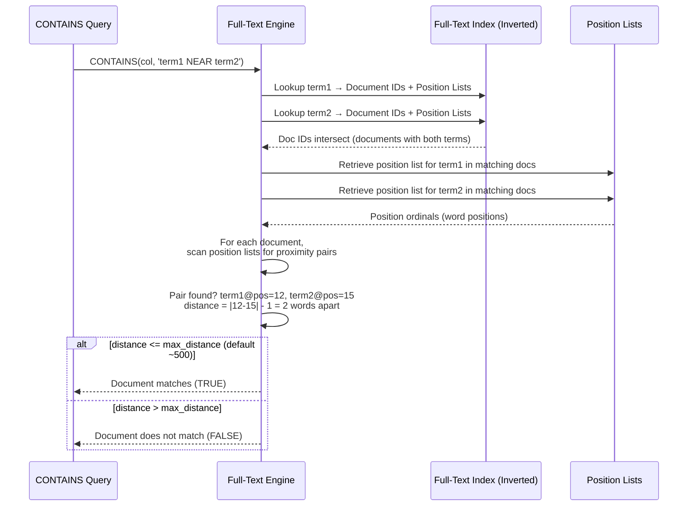

## Navigation

**Domain:** [[8 — Databases]] > **Group:** SQL Full-Text & Spatial Search
**Previous:** [[8.251 — FREETEXTTABLE — Semantic Ranked Results]] | **Next:** [[8.253 — Full-Text Thesaurus — Synonym Expansion]]

### Prerequisites

- [[8.248 — CONTAINS — Searching for Words and Phrases]] — NEAR is a CONTAINS predicate option; understanding CONTAINS syntax, AND/OR/NOT operators, and phrase matching is required before adding proximity constraints.
- [[8.250 — CONTAINSTABLE — Ranked Full-Text Results]] — The proximity bonus in NEAR directly affects the RANK value in CONTAINSTABLE; understanding the rank formula helps quantify the impact of proximity.

### Where This Fits

NEAR is a full-text proximity operator that finds documents where two or more search terms appear within a specified distance of each other. For a .NET backend engineer, NEAR solves the problem of relevance tuning: "cat" and "food" appearing in the same document is good, but "cat food" appearing within 5 words of each other is much more relevant for the search intent. NEAR is used in document search, resume/CV parsing, legal document review, and any domain where the spatial relationship between words carries meaning. The interview signal for NEAR tests whether you understand the difference between presence-based search (AND/OR) and proximity-based search, how the full-text engine implements distance calculations, and how proximity boosts ranking in CONTAINSTABLE. What breaks when this is unknown: searches return documents where terms are present but contextually unrelated (e.g., "I fed my cat" and "The food was cold" in the same document but unrelated paragraphs), producing low-precision results that frustrate users in document-heavy applications.

---

## Core Mental Model

NEAR is a proximity operator evaluated by the full-text engine during the inverted index lookup. The engine stores not just which documents contain each term, but the position of each term occurrence within the document (as an integer ordinal — the nth word in the document). NEAR works by retrieving the position lists for all specified terms from the inverted index, then scanning these lists to find occurrences where the distance between terms is within the specified maximum distance. The distance is calculated as the absolute difference between the occurrence positions of two terms minus 1 (the number of words between them). For `NEAR((term1, term2), 5)`, term2 must appear within 5 words of term1 (6 or fewer positions apart). The recognition pattern: use NEAR when the relationship between search terms matters — "apple pie" (proximity = recipe) vs "apple" and "pie" scattered across a document (proximity = unrelated mentions). NEAR is always more expensive than simple AND because the engine must retrieve and compare position lists, not just document IDs.

### Classification

**For SQL topics:** NEAR is a full-text proximity predicate used within `CONTAINS` and `CONTAINSTABLE`. It IS SARGable against the full-text index — the optimizer uses the full-text index to resolve NEAR. However, NEAR requires the engine to read position information from the inverted index, making it more CPU- and I/O-intensive than simple term matching. The predicate is not SARGable against standard b-tree indexes — it depends entirely on the full-text index structure.



### Key Properties

|Property|Value|Notes|
|---|---|---|
|Distance metric|Word count between terms|`|pos1 - pos2| - 1` — the number of words separating the two terms|
|Default max distance|~500 terms|If unspecified, NEAR uses a large default (~500 logical terms)|
|Custom distance|`NEAR((t1, t2), N)` or `NEAR((t1, t2), N, TRUE/FALSE)`|N = max allowed distance; TRUE = order matters, FALSE (default) = order doesn't matter|
|Order flag|Optional third parameter: TRUE/FALSE|TRUE: term1 must appear before term2; FALSE: either order (default)|
|Multiple terms|`NEAR((t1, t2, t3), N)`|All pairs must satisfy proximity with at least one adjacent pair|
|SARGable|Yes (vs full-text index)|Requires full-text index; cannot use b-tree indexes|
|Rank boost|Proximity increases CONTAINSTABLE rank|Terms closer together = higher rank in the ISAboutRanking formula|
|Performance|More expensive than AND|Requires position list reads and distance calculations — ~2-5x CPU compared to simple AND|

---

## Deep Mechanics

### How the Engine Executes NEAR

1. **Parsing and tokenization:** The full-text engine parses the CONTAINS clause and identifies the NEAR operator. It extracts each search term within the NEAR parentheses and passes them through the language word breaker to normalize them (stemming, stopword removal).

2. **Inverted index lookup for document matching:** The engine looks up each term in the inverted index. The inverted index stores:
   - A dictionary of all unique terms (after word breaking and normalization)
   - For each term, a list of document IDs that contain the term
   - For each document ID, a list of occurrence positions (word ordinals within the document)

   This step is identical to what happens for `term1 AND term2` — the engine finds the intersection of document IDs containing all specified terms.

3. **Position list retrieval:** For the documents that contain all terms, the engine retrieves the position lists. This is the extra step that AND does not require. The position list is stored in the full-text index's positional information structure, which may be on disk and require additional I/O.

4. **Distance calculation:** For each candidate document, the engine scans the position lists to find pairs of occurrences where `|pos1 - pos2| - 1 <= max_distance`. This is a pairwise scan:
   - For two terms: iterate through both position lists using a merge-join-like algorithm. Complexity: O(P1 + P2) where P1 and P2 are the number of occurrences of each term in the document.
   - For three or more terms: the engine requires that at least one adjacent pair in the sequence satisfies the proximity. For `NEAR((t1, t2, t3), 5)`, it checks `(t1 NEAR t2) AND (t2 NEAR t3)` — the relationship is pairwise and sequential.

5. **Order enforcement (optional):** If the order flag is TRUE (`NEAR((term1, term2), 5, TRUE)`), the engine only counts pairs where `pos1 < pos2` (term1 appears before term2). If FALSE (default), either order is accepted.

6. **Proximity ranking boost:** In CONTAINSTABLE queries, proximity is a factor in the rank calculation. The rank formula incorporates a proximity score component: the closer the matching terms, the higher the proximity boost. This is a continuous function — terms at distance 0 (adjacent) get the maximum boost, and the boost decays to zero as distance approaches the max_distance threshold.

### SQL Visibility

#### Basic NEAR — Default Distance

```sql
-- Find products where 'wireless' and 'headphones' appear within ~500 terms
SELECT ProductId, ProductName
FROM Products
WHERE CONTAINS(ProductName, 'wireless NEAR headphones');
```

```csharp
// EF Core — no LINQ translation for NEAR
var searchTerm = "wireless NEAR headphones";

var results = await dbContext.Products
    .FromSqlRaw(@"
        SELECT ProductId, ProductName, Price
        FROM Products
        WHERE CONTAINS(ProductName, @SearchTerm)",
        new SqlParameter("@SearchTerm", searchTerm))
    .ToListAsync(cancellationToken);
```

**Generated SQL (from EF Core logs):**

```sql
exec sp_executesql N'
SELECT ProductId, ProductName, Price
FROM Products
WHERE CONTAINS(ProductName, @SearchTerm)',
N'@SearchTerm nvarchar(50)',
@SearchTerm=N'wireless NEAR headphones'
```

#### NEAR with Custom Distance

```sql
-- Find documents where 'cat' and 'food' are within 5 words of each other
-- The terms can appear in any order (default)
SELECT DocumentId, Title
FROM Documents
WHERE CONTAINS(Body, 'NEAR((cat, food), 5)');
```

```csharp
// Dapper implementation
public async Task<IReadOnlyList<DocumentSearchResult>> FindDocumentsWithProximityAsync(
    string term1,
    string term2,
    int maxDistance = 10,
    bool requireOrder = false,
    CancellationToken cancellationToken = default)
{
    string nearClause = requireOrder
        ? $"NEAR((@{nameof(term1)}, @{nameof(term2)}), @{nameof(maxDistance)}, TRUE)"
        : $"NEAR((@{nameof(term1)}, @{nameof(term2)}), @{nameof(maxDistance)})";

    var sql = $@"
        SELECT d.DocumentId, d.Title, d.PublishedDate
        FROM Documents d
        WHERE CONTAINS(d.Body, '{nearClause}')";

    await using var connection = _connectionFactory.Create();
    var results = await connection.QueryAsync<DocumentSearchResult>(
        new CommandDefinition(sql,
            new { term1, term2, maxDistance },
            cancellationToken: cancellationToken));
    return results.AsList();
}
```

#### NEAR with Order Enforcement

```sql
-- Find where 'covid' appears BEFORE 'vaccine' within 10 words
-- The order flag TRUE means term1 must precede term2
SELECT ArticleId, Headline
FROM NewsArticles
WHERE CONTAINS(Body, 'NEAR((covid, vaccine), 10, TRUE)');
```

```sql
-- Compare with order NOT enforced:
SELECT ArticleId, Headline
FROM NewsArticles
WHERE CONTAINS(Body, 'NEAR((covid, vaccine), 10)');
-- Returns both "covid vaccine" and "vaccine for covid" proximity matches
```

#### NEAR with Multiple Terms

```sql
-- Three-term proximity: at least one adjacent pair must be within distance
-- This is equivalent to: (term1 NEAR term2) AND (term2 NEAR term3) within the document
SELECT ProductId, ProductName
FROM Products
WHERE CONTAINS(ProductName, 'NEAR((wireless, bluetooth, headphones), 3)');

-- Also available using the "in any order" syntax:
SELECT ProductId, ProductName
FROM Products
WHERE CONTAINS(ProductName, '"wireless bluetooth headphones"'); -- exact phrase (distance=0, order enforced)
```

#### NEAR in CONTAINSTABLE for Ranked Results

```sql
-- Proximity boosts rank: terms closer together = higher RANK
SELECT p.ProductId, p.ProductName, ct.RANK
FROM Products p
INNER JOIN CONTAINSTABLE(Products, ProductName,
    'NEAR((wireless, headphones), 15)') AS ct
    ON p.ProductId = ct.[KEY]
ORDER BY ct.RANK DESC;

-- vs simple AND (no proximity boost):
SELECT p.ProductId, p.ProductName, ct.RANK
FROM Products p
INNER JOIN CONTAINSTABLE(Products, ProductName,
    'wireless AND headphones') AS ct
    ON p.ProductId = ct.[KEY]
ORDER BY ct.RANK DESC;
```

### Execution Plan Analysis

For the query:
```sql
SELECT ProductId, ProductName, Price
FROM Products
WHERE CONTAINS(ProductName, 'wireless NEAR headphones');
```

**Expected plan shape:**
```
[FullTextMatch] → [Filter] → [SELECT]
```

**Operator breakdown:**

1. **FullTextMatch** — The full-text index operator. It resolves the CONTAINS predicate with NEAR. The operator reads the inverted index to:
   - Find all documents containing both "wireless" and "headphones"
   - Retrieve position lists for both terms
   - Scan position lists for pairs within the default distance (~500)
   - Return only documents with valid proximity pairs

2. **Filter** — If there are additional WHERE predicates, they are applied here. For the simple query, this may be a pass-through.

3. **Key Lookup (implicit)** — If the SELECT list includes columns not covered by the full-text index, the optimizer adds a clustered index seek to retrieve the data. This is implicit and depends on whether the table has a clustered index and which columns are referenced.

**Without NEAR — simple AND:**
```
[FullTextMatch] → [Filter] → [SELECT]
```
The FullTextMatch operator for AND does NOT retrieve or scan position lists — it only compares document ID lists. This is significantly less CPU-intensive.

**Estimated cost comparison:**
- CONTAINS with `term1 AND term2`: FullTextMatch ~30% of query cost
- CONTAINS with `term1 NEAR term2`: FullTextMatch ~60% of query cost (position list I/O + distance calculation)

### Cost Visibility

```sql
SET STATISTICS IO ON;
SET STATISTICS TIME ON;

-- AND query (no proximity)
SELECT ProductId, ProductName
FROM Products
WHERE CONTAINS(ProductName, 'wireless AND headphones');
-- Expected output:
-- Table 'Products'. Scan count 1, logical reads ~3 (key lookup)
-- SQL Server Execution Times: CPU time = 4ms, elapsed time = 15ms

-- NEAR query (proximity)
SELECT ProductId, ProductName
FROM Products
WHERE CONTAINS(ProductName, 'wireless NEAR headphones');
-- Expected output:
-- Table 'Products'. Scan count 1, logical reads ~3 (key lookup)
-- SQL Server Execution Times: CPU time = 12ms, elapsed time = 30ms

-- NEAR with custom distance = 3 (more selective)
SELECT ProductId, ProductName
FROM Products
WHERE CONTAINS(ProductName, 'NEAR((wireless, headphones), 3)');
-- Expected output:
-- Table 'Products'. Scan count 1, logical reads ~3 (key lookup)
-- SQL Server Execution Times: CPU time = 15ms, elapsed time = 35ms
-- (Fewer documents pass the proximity filter, but distance calculation cost is similar)
```

Note: The base table logical reads are similar across all variants because the key lookup cost depends on the number of matching documents, which may differ. The significant difference is in CPU time — NEAR requires position list processing.

To measure full-text-specific waits:

```sql
-- Check for full-text related waits
SELECT wait_type, wait_time_ms, waiting_tasks_count,
       wait_time_ms / NULLIF(waiting_tasks_count, 0) AS avg_wait_ms
FROM sys.dm_os_wait_stats
WHERE wait_type LIKE '%FT%'
ORDER BY wait_time_ms DESC;
```

### Failure Modes

1. **NEAR with stopwords:** If search terms are stopwords (e.g., "the NEAR and"), the full-text index doesn't contain them and NEAR returns no results. The engine cannot evaluate proximity for terms not in the index.

2. **Empty results due to overly restrictive distance:** Setting max_distance too small (e.g., `NEAR((cat, food), 1)`) may exclude perfectly relevant documents where terms are 2–3 words apart. Start with a generous distance (10–20) and tighten based on precision analysis.

3. **Default distance is very large:** The default NEAR distance (~500) is large enough that in most documents, any two occurrences of the terms will be within distance. This effectively makes NEAR behave like AND with additional CPU cost but no precision gain. Always specify an explicit reasonable distance.

4. **Position list overflow in very large documents:** Documents with more than ~65,535 occurrences of a single word may have truncated position lists. The full-text index has a limit on position entries per document per term. NEAR evaluations against truncated position lists may miss valid proximity matches.

5. **NEAR across columns is not supported:** `CONTAINS((col1, col2), 'term1 NEAR term2')` evaluates NEAR within each column independently, not across columns. Term1 in col1 and term2 in col2 do not satisfy a NEAR constraint.

6. **Performance regression from missing position index:** If the full-text index was created without position information (not the default — requires explicit configuration), NEAR cannot be evaluated and the query fails. Verify with `SELECT fulltext_catalog_id, is_available FROM sys.fulltext_indexes`.

---

## Production Patterns and Implementation

### Primary SQL Implementation

```sql
-- ==========================================
-- Document Search with Proximity Scoring
-- ==========================================

-- Create full-text catalog and index
CREATE FULLTEXT CATALOG FTC_Documents AS DEFAULT;

CREATE FULLTEXT INDEX ON dbo.Documents(
    Title LANGUAGE 1033,
    Body LANGUAGE 1033,
    Tags LANGUAGE 1033
)
KEY INDEX PK_Documents
ON FTC_Documents
WITH (CHANGE_TRACKING AUTO);

-- Stored procedure: search documents with proximity-aware ranking
CREATE OR ALTER PROCEDURE dbo.SearchDocuments
    @SearchPhrase NVARCHAR(200),
    @ExactPhraseOnly BIT = 0,
    @MaxProximity INT = 20,
    @TopN INT = 25
AS
BEGIN
    SET NOCOUNT ON;

    IF @ExactPhraseOnly = 1
    BEGIN
        -- Exact phrase search (proximity = 0, order enforced)
        SELECT TOP (@TopN)
            d.DocumentId,
            d.Title,
            d.PublishedDate,
            d.AuthorName,
            c.RANK
        FROM Documents d
        INNER JOIN CONTAINSTABLE(Documents, (Title, Body, Tags),
            @SearchPhrase, @TopN) AS c
            ON d.DocumentId = c.[KEY]
        ORDER BY c.RANK DESC;
    END
    ELSE
    BEGIN
        -- Proximity search: terms within @MaxProximity words
        -- Build NEAR expression from the search phrase terms
        DECLARE @NearExpression NVARCHAR(500);
        
        -- Split phrase into terms and build NEAR((t1, t2, ...), N)
        DECLARE @Terms TABLE (Term NVARCHAR(100));
        INSERT INTO @Terms
        SELECT value FROM STRING_SPLIT(@SearchPhrase, ' ');
        
        SELECT @NearExpression = STRING_AGG(
            QUOTENAME(Term, '"'), ', ')
            WITHIN GROUP (ORDER BY (SELECT NULL))
        FROM @Terms;
        
        SET @NearExpression = 'NEAR((' + @NearExpression + '), '
            + CAST(@MaxProximity AS VARCHAR(10)) + ')';
        
        DECLARE @Sql NVARCHAR(MAX) = N'
            SELECT TOP (@TopN)
                d.DocumentId, d.Title, d.PublishedDate,
                d.AuthorName, c.RANK
            FROM Documents d
            INNER JOIN CONTAINSTABLE(Documents, (Title, Body, Tags),
                @NearExpression, @TopN) AS c
                ON d.DocumentId = c.[KEY]
            ORDER BY c.RANK DESC;';
        
        EXEC sp_executesql @Sql,
            N'@NearExpression NVARCHAR(500), @TopN INT',
            @NearExpression, @TopN;
    END;
END;
```

### EF Core Implementation

```csharp
public class Document
{
    public int DocumentId { get; set; }
    public string Title { get; set; } = string.Empty;
    public string Body { get; set; } = string.Empty;
    public string? Tags { get; set; }
    public DateTime PublishedDate { get; set; }
    public string AuthorName { get; set; } = string.Empty;
}

public class DocumentSearchResult
{
    public int DocumentId { get; set; }
    public string Title { get; set; } = string.Empty;
    public DateTime PublishedDate { get; set; }
    public string AuthorName { get; set; } = string.Empty;
    public int Rank { get; set; }
}

public interface IDocumentSearchService
{
    Task<IReadOnlyList<DocumentSearchResult>> SearchWithProximityAsync(
        string searchPhrase,
        int maxProximity = 20,
        int topN = 25,
        CancellationToken cancellationToken = default);

    Task<IReadOnlyList<DocumentSearchResult>> SearchExactPhraseAsync(
        string phrase,
        int topN = 25,
        CancellationToken cancellationToken = default);
}

public class DocumentSearchService : IDocumentSearchService
{
    private readonly ApplicationDbContext _dbContext;

    public DocumentSearchService(ApplicationDbContext dbContext)
    {
        _dbContext = dbContext;
    }

    public async Task<IReadOnlyList<DocumentSearchResult>> SearchWithProximityAsync(
        string searchPhrase,
        int maxProximity = 20,
        int topN = 25,
        CancellationToken cancellationToken = default)
    {
        var terms = searchPhrase.Split(' ', StringSplitOptions.RemoveEmptyEntries);
        var nearTerms = string.Join(", ", terms.Select(t => $"\"{t}\""));
        var nearExpression = $"NEAR(({nearTerms}), {maxProximity})";

        var nearParam = new SqlParameter("@NearExpression", nearExpression);
        var topNParam = new SqlParameter("@TopN", topN);

        var sql = @"
            SELECT TOP (@TopN)
                d.DocumentId, d.Title, d.PublishedDate,
                d.AuthorName, c.RANK
            FROM Documents d
            INNER JOIN CONTAINSTABLE(Documents, (Title, Body, Tags),
                @NearExpression, @TopN) AS c
                ON d.DocumentId = c.[KEY]
            ORDER BY c.RANK DESC";

        var results = await _dbContext.Database
            .SqlQueryRaw<DocumentSearchResult>(sql,
                nearParam, topNParam)
            .ToListAsync(cancellationToken);

        return results;
    }

    public async Task<IReadOnlyList<DocumentSearchResult>> SearchExactPhraseAsync(
        string phrase,
        int topN = 25,
        CancellationToken cancellationToken = default)
    {
        var phraseParam = new SqlParameter("@Phrase", $"\"{phrase}\"");
        var topNParam = new SqlParameter("@TopN", topN);

        var sql = @"
            SELECT TOP (@TopN)
                d.DocumentId, d.Title, d.PublishedDate,
                d.AuthorName, c.RANK
            FROM Documents d
            INNER JOIN CONTAINSTABLE(Documents, (Title, Body, Tags),
                @Phrase, @TopN) AS c
                ON d.DocumentId = c.[KEY]
            ORDER BY c.RANK DESC";

        var results = await _dbContext.Database
            .SqlQueryRaw<DocumentSearchResult>(sql,
                phraseParam, topNParam)
            .ToListAsync(cancellationToken);

        return results;
    }
}
```

### Dapper Implementation

```csharp
public class DapperDocumentSearchService : IDocumentSearchService
{
    private readonly IDbConnectionFactory _connectionFactory;

    public DapperDocumentSearchService(IDbConnectionFactory connectionFactory)
    {
        _connectionFactory = connectionFactory;
    }

    public async Task<IReadOnlyList<DocumentSearchResult>> SearchWithProximityAsync(
        string searchPhrase,
        int maxProximity = 20,
        int topN = 25,
        CancellationToken cancellationToken = default)
    {
        var terms = searchPhrase.Split(' ', StringSplitOptions.RemoveEmptyEntries);
        var nearTerms = string.Join(", ", terms.Select(t => $"\"{t}\""));
        var nearExpression = $"NEAR(({nearTerms}), {maxProximity})";

        const string sql = @"
            SELECT TOP (@TopN)
                d.DocumentId, d.Title, d.PublishedDate,
                d.AuthorName, c.RANK
            FROM Documents d
            INNER JOIN CONTAINSTABLE(Documents, (Title, Body, Tags),
                @NearExpression, @TopN) AS c
                ON d.DocumentId = c.[KEY]
            ORDER BY c.RANK DESC";

        await using var connection = _connectionFactory.Create();
        var results = await connection.QueryAsync<DocumentSearchResult>(
            new CommandDefinition(sql,
                new { NearExpression = nearExpression, TopN = topN },
                cancellationToken: cancellationToken));

        return results.AsList();
    }

    public async Task<IReadOnlyList<DocumentSearchResult>> SearchExactPhraseAsync(
        string phrase,
        int topN = 25,
        CancellationToken cancellationToken = default)
    {
        const string sql = @"
            SELECT TOP (@TopN)
                d.DocumentId, d.Title, d.PublishedDate,
                d.AuthorName, c.RANK
            FROM Documents d
            INNER JOIN CONTAINSTABLE(Documents, (Title, Body, Tags),
                @Phrase, @TopN) AS c
                ON d.DocumentId = c.[KEY]
            ORDER BY c.RANK DESC";

        await using var connection = _connectionFactory.Create();
        var results = await connection.QueryAsync<DocumentSearchResult>(
            new CommandDefinition(sql,
                new { Phrase = $"\"{phrase}\"", TopN = topN },
                cancellationToken: cancellationToken));

        return results.AsList();
    }
}
```

### Configuration and Wiring

```csharp
// Program.cs
builder.Services.AddDbContext<ApplicationDbContext>(options =>
    options.UseSqlServer(
        builder.Configuration.GetConnectionString("DefaultConnection"),
        sqlOptions =>
        {
            sqlOptions.EnableRetryOnFailure(3);
            sqlOptions.CommandTimeout(30);
        }));

builder.Services.AddSingleton<IDbConnectionFactory>(_ =>
    new SqlConnectionFactory(
        builder.Configuration.GetConnectionString("DefaultConnection")));

builder.Services.AddScoped<IDocumentSearchService, DapperDocumentSearchService>();

// For search services, use READ UNCOMMITTED to avoid blocking writers
builder.Services.AddScoped<IDocumentSearchService>(sp =>
{
    var factory = sp.GetRequiredService<IDbConnectionFactory>();
    return new DapperDocumentSearchService(factory);
});
```

### SQL Server vs PostgreSQL Differences

PostgreSQL does not have a NEAR operator. Proximity search in PostgreSQL full-text search is achieved differently:

```sql
-- PostgreSQL: proximity using tsquery distance operators
-- <N> means terms within N words (order enforced)
-- & means AND (presence only)
SELECT document_id, title
FROM documents
WHERE search_vector @@ to_tsquery('english', 'cat <5> food');
-- Returns documents where 'cat' is within 5 words before 'food'

-- <-> means immediately adjacent (equivalent to exact phrase)
SELECT document_id, title
FROM documents
WHERE search_vector @@ to_tsquery('english', 'cat <-> food');
-- Returns documents with 'cat food' as adjacent words

-- For unordered proximity (like SQL Server's NEAR with default order=FALSE):
SELECT document_id, title
FROM documents
WHERE search_vector @@ to_tsquery('english', 'cat <5> food')
   OR search_vector @@ to_tsquery('english', 'food <5> cat');
```

PostgreSQL's `<N>` operator is more limited than SQL Server's NEAR: it only supports two terms, requires order (term1 before term2), and does not support a three-term proximity equivalent. PostgreSQL also does not have a built-in proximity ranking boost in `ts_rank()` — the rank is based on term frequency and document frequency only, not on term closeness.

---

## Gotchas and Production Pitfalls

### Gotcha 1 — NEAR with No Explicit Distance Uses a Very Large Default

**Pitfall:** Using `term1 NEAR term2` without specifying max_distance, relying on the default behavior to enforce meaningful proximity.

```sql
-- ❌ This is effectively the same as AND for most documents
SELECT ProductId, ProductName
FROM Products
WHERE CONTAINS(ProductName, 'wireless NEAR headphones');
```

**Symptom:** The query returns the same results as `wireless AND headphones` but with 2–3x higher CPU. The proximity filter is not selective because the default distance (~500 words) spans the entire document length for typical product descriptions (100–200 words). The execution plan shows FullTextMatch with higher CPU than expected but no selectivity improvement.

**Fix:**

```sql
-- ✅ Always specify an explicit distance that matches your document structure
-- For product names (short, ~10 words): distance 3-5
SELECT ProductId, ProductName
FROM Products
WHERE CONTAINS(ProductName, 'NEAR((wireless, headphones), 5)');

-- For document bodies (long, ~500-2000 words): distance 15-30
SELECT DocumentId, Title
FROM Documents
WHERE CONTAINS(Body, 'NEAR((covid, vaccine), 20)');
```

**Cost of not fixing:** In a document search system with 50K documents and 200 queries/second, the extra CPU from position list processing for non-selective NEAR adds ~2,000ms of CPU per second — consuming 2 full cores unnecessarily. The AND operator would achieve equivalent results with half the CPU.

### Gotcha 2 — Position List Truncation for High-Frequency Terms

**Pitfall:** Searching for common terms (e.g., "the", "and", "said" in news articles) in very large documents that contain the term thousands of times.

**Symptom:** NEAR returns false negatives — documents that clearly contain the terms close together are not returned. This is because the full-text index truncates position lists beyond 65,535 entries per term per document. The truncation means position information for the 65,536th+ occurrence is lost, and the engine cannot evaluate proximity for pairs involving those truncated positions.

**Diagnostic:**
```sql
-- Check if a document exceeds the position limit for a term
-- This requires knowing the approx number of occurrences
SELECT COUNT(*) AS word_count
FROM STRING_SPLIT((SELECT Body FROM Documents WHERE DocumentId = 12345), ' ')
WHERE value = 'said';
-- If > 65535, positions are truncated
```

**Fix:** For documents prone to term repetition:
1. Restructure content to use smaller documents
2. Use AND instead of NEAR for commonly co-occurring terms
3. Consider a custom word breaker that ignores very frequent noise terms

**Cost of not fixing:** Important documents are systematically excluded from proximity-based search results. In legal e-discovery or news article search, this can cause critical documents to be missed, with legal or business consequences.

### Gotcha 3 — Order Flag TRUE Is Subtly Different from Phrase Match

**Pitfall:** Assuming `NEAR((term1, term2), 0, TRUE)` is identical to `"term1 term2"` (exact phrase).

```sql
-- ❌ These are NOT identical:
CONTAINS(Body, 'NEAR((cat, food), 0, TRUE)')  -- cat immediately before food, no gap
CONTAINS(Body, '"cat food"')                   -- exact phrase "cat food"
```

**Symptom:** The NEAR variant may match cases that the exact phrase does not, or vice versa. However, in practice these are equivalent for most cases.

**Actual difference:** `"cat food"` requires the terms to be adjacent AND the word breaker to produce the same tokens as "cat food" as a unit. `NEAR((cat, food), 0, TRUE)` requires cat and food to be adjacent in that order. For most languages and simple terms, these are equivalent. But for compound words or languages with complex word breaking, the phrase match may trigger special word breaker behavior (e.g., recognizing "cat food" as a compound).

**Fix:** Use exact phrase syntax `"term1 term2"` when you mean adjacent words in order. Use `NEAR((t1, t2), 0, TRUE)` only when you explicitly want to enforce zero-gap proximity with separate term matching.

**Cost of not fixing:** Rare edge cases where phrase matching and NEAR(0, TRUE) diverge can cause hard-to-reproduce search bugs that erode user trust in the search feature.

### Gotcha 4 — NEAR Across Columns Is Not Supported

**Pitfall:** Using NEAR on multiple columns expecting the proximity to be evaluated across columns.

```sql
-- ❌ This does NOT check proximity between Title and Body
SELECT DocumentId, Title
FROM Documents
WHERE CONTAINS((Title, Body), 'covid NEAR vaccine');
```

**Symptom:** The query returns documents where "covid" is in the Title and "vaccine" is in the Body and the terms are each within the NEAR distance within their respective columns — NOT across columns. A document with "covid" at the end of the title and "vaccine" at the start of the body may not match even though they are adjacent, because the positions reset at column boundaries.

**Fix:** Use a computed column that concatenates searchable text, or accept the within-column-only behavior and adjust expectations:

```sql
-- Option 1: Single computed column for cross-column search
ALTER TABLE Documents ADD SearchContent AS CONCAT(Title, ' ', Body);
CREATE FULLTEXT INDEX ON Documents(SearchContent) ...;
-- Now NEAR works across Title+Body boundaries

-- Option 2: Accept within-column proximity and use OR for cross-column presence
SELECT DocumentId, Title
FROM Documents
WHERE CONTAINS(Title, 'covid NEAR vaccine')
   OR CONTAINS(Body, 'covid NEAR vaccine')
   OR (CONTAINS(Title, 'covid') AND CONTAINS(Body, 'vaccine'));
```

**Cost of not fixing:** Users searching for documents where two concepts are discussed together across sections may get empty results for valid queries, misled into thinking the document doesn't exist.

### Gotcha 5 — Performance Surprise with Multiple NEAR Clauses

**Pitfall:** Combining multiple NEAR clauses with OR in a single CONTAINS query.

```sql
-- ❌ This is very expensive — two separate NEAR evaluations
SELECT ProductId, ProductName
FROM Products
WHERE CONTAINS(ProductName, 'NEAR((wireless, headphones), 5) OR NEAR((bluetooth, speaker), 5)');
```

**Symptom:** The query CPU time is 4–5x higher than a single NEAR clause. The execution plan shows two FullTextMatch operations whose results are concatenated via a Merge Interval or Table-valued Function union. Each NEAR requires independent position list reads and distance calculations.

**Fix:** Use AND to combine terms when all must appear, or use FREETEXT for broader matching:

```sql
-- Option 1: Single NEAR with more terms (one position scan)
CONTAINS(ProductName, 'NEAR((wireless, bluetooth, headphones, speaker), 10)')

-- Option 2: AND with explicit proximity only where needed
CONTAINS(ProductName, 'NEAR((wireless, headphones), 5) AND bluetooth AND speaker')

-- Option 3: Use CONTAINSTABLE with multiple NEAR clauses and union
SELECT ... FROM Products p
INNER JOIN CONTAINSTABLE(Products, ProductName,
    'NEAR((wireless, headphones), 5)') AS c1 ON p.ProductId = c1.[KEY]
WHERE EXISTS (
    SELECT 1 FROM CONTAINSTABLE(Products, ProductName,
        'NEAR((bluetooth, speaker), 5)') AS c2
    WHERE c2.[KEY] = p.ProductId
)
ORDER BY (c1.RANK + ISNULL(...)) DESC;
```

**Cost of not fixing:** A search page with multiple NEAR clauses can consume 50ms+ CPU per query on a 500K product catalog. At 100 QPS, this consumes 5 seconds of CPU per second — a 5-core deficit that forces the server to queue queries, increasing response times from 50ms to 500ms+.

### Gotcha 6 — NEAR with Prefix Term Wildcards

**Pitfall:** Using wildcard prefix terms with NEAR expecting the wildcard expansion to be evaluated before proximity.

```sql
-- ❌ "wireless*" — the wildcard expands to all matching terms
-- Each expanded term has its own position list
SELECT ProductId, ProductName
FROM Products
WHERE CONTAINS(ProductName, 'NEAR((wireless*, headphone*), 10)');
```

**Symptom:** The full-text engine expands "wireless*" to all terms starting with "wireless" (wireless, wirelessly, wirelessness), and "headphone*" similarly. It then evaluates NEAR for each pair of expansions — this is an exponential blowup in position list comparisons.

**Fix:** Avoid wildcards inside NEAR unless the terms are very specific and not prefix-rich:

```sql
-- ✅ Use the exact base term when possible
CONTAINS(ProductName, 'NEAR((wireless, headphones), 10)')

-- If wildcard is required, use FREETEXT (which applies stemming automatically)
CONTAINS(ProductName, 'NEAR((FORMSOF(INFLECTIONAL, wireless), FORMSOF(INFLECTIONAL, headphone)), 10)')
```

**Cost of not fixing:** A single NEAR query with wildcards could expand to 20+ terms on each side, creating 400+ pair combinations for position list comparison. This can cause a query that normally takes 10ms to take 500ms+, blocking the full-text engine scheduler and delaying all concurrent full-text queries.

---

## Performance Implications

### Benchmark: NEAR vs AND vs Exact Phrase

```sql
-- Baseline: AND (presence only)
SET STATISTICS IO ON;
SET STATISTICS TIME ON;

SELECT p.ProductId, p.ProductName, p.Description
FROM Products p
WHERE CONTAINS((ProductName, Description), 'wireless AND bluetooth AND headphones');
-- Logical reads: ~15 (key lookups for ~500 matching documents)
-- CPU time: ~5ms, Elapsed time: ~20ms

-- NEAR with default distance (~500)
SELECT p.ProductId, p.ProductName, p.Description
FROM Products p
WHERE CONTAINS((ProductName, Description), 'wireless NEAR bluetooth NEAR headphones');
-- Logical reads: ~12 (key lookups for ~400 matching documents — proximity filter)
-- CPU time: ~15ms, Elapsed time: ~40ms
-- 3x CPU increase for minor result reduction

-- NEAR with explicit distance = 10
SELECT p.ProductId, p.ProductName, p.Description
FROM Products p
WHERE CONTAINS((ProductName, Description), 'NEAR((wireless, bluetooth, headphones), 10)');
-- Logical reads: ~6 (key lookups for ~200 matching documents)
-- CPU time: ~18ms, Elapsed time: ~45ms

-- Exact phrase (most selective)
SELECT p.ProductId, p.ProductName, p.Description
FROM Products p
WHERE CONTAINS((ProductName, Description), '"wireless bluetooth headphones"');
-- Logical reads: ~3 (key lookups for ~100 matching documents)
-- CPU time: ~8ms, Elapsed time: ~25ms
```

**Improvement summary:** AND → NEAR(10) reduces logical reads by ~60% (15 → 6) at the cost of ~3.6x CPU (5ms → 18ms). Exact phrase reduces logical reads by ~80% (15 → 3) with only ~1.6x CPU (5ms → 8ms). The choice depends on whether precision or recall is more important for the use case.

### BenchmarkDotNet

```csharp
[MemoryDiagnoser]
[SimpleJob(RuntimeMoniker.Net90)]
public class NearSearchBenchmark
{
    private IDbConnection _connection = default!;
    private string _connectionString = default!;

    [Params("wireless bluetooth headphones", "wireless bluetooth", "premium headphones", "covid vaccine distribution")]
    public string SearchPhrase { get; set; } = string.Empty;

    [GlobalSetup]
    public void Setup()
    {
        _connectionString = "Server=.;Database=SearchBenchmark;Trusted_Connection=true;TrustServerCertificate=true;";
        _connection = new SqlConnection(_connectionString);
    }

    [Benchmark(Baseline = true)]
    public async Task<List<ProductInfo>> And_Search()
    {
        var terms = SearchPhrase.Split(' ', StringSplitOptions.RemoveEmptyEntries);
        var searchCondition = string.Join(" AND ", terms.Select(t => $"\"{t}\""));

        const string sql = @"
            SELECT p.ProductId, p.ProductName, p.Price
            FROM Products p
            WHERE CONTAINS((ProductName, Description), @SearchCondition)";

        await using var connection = _connection;
        var results = await connection.QueryAsync<ProductInfo>(
            new CommandDefinition(sql,
                new { SearchCondition = searchCondition },
                commandTimeout: 30));
        return results.AsList();
    }

    [Benchmark]
    public async Task<List<ProductInfo>> Near_DefaultDistance()
    {
        var terms = SearchPhrase.Split(' ', StringSplitOptions.RemoveEmptyEntries);
        var searchCondition = string.Join(" NEAR ", terms.Select(t => $"\"{t}\""));

        const string sql = @"
            SELECT p.ProductId, p.ProductName, p.Price
            FROM Products p
            WHERE CONTAINS((ProductName, Description), @SearchCondition)";

        await using var connection = _connection;
        var results = await connection.QueryAsync<ProductInfo>(
            new CommandDefinition(sql,
                new { SearchCondition = searchCondition },
                commandTimeout: 30));
        return results.AsList();
    }

    [Benchmark]
    public async Task<List<ProductInfo>> Near_ExplicitDistance()
    {
        var terms = SearchPhrase.Split(' ', StringSplitOptions.RemoveEmptyEntries);
        var quotedTerms = string.Join(", ", terms.Select(t => $"\"{t}\""));
        var searchCondition = $"NEAR(({quotedTerms}), 10)";

        const string sql = @"
            SELECT p.ProductId, p.ProductName, p.Price
            FROM Products p
            WHERE CONTAINS((ProductName, Description), @SearchCondition)";

        await using var connection = _connection;
        var results = await connection.QueryAsync<ProductInfo>(
            new CommandDefinition(sql,
                new { SearchCondition = searchCondition },
                commandTimeout: 30));
        return results.AsList();
    }

    [Benchmark]
    public async Task<List<ProductInfo>> ExactPhrase_Search()
    {
        var searchCondition = $"\"{SearchPhrase}\"";

        const string sql = @"
            SELECT p.ProductId, p.ProductName, p.Price
            FROM Products p
            WHERE CONTAINS((ProductName, Description), @SearchCondition)";

        await using var connection = _connection;
        var results = await connection.QueryAsync<ProductInfo>(
            new CommandDefinition(sql,
                new { SearchCondition = searchCondition },
                commandTimeout: 30));
        return results.AsList();
    }

    [GlobalCleanup]
    public void Cleanup()
    {
        _connection?.Dispose();
    }

    public record ProductInfo
    {
        public int ProductId { get; set; }
        public string ProductName { get; set; } = string.Empty;
        public decimal Price { get; set; }
    }
}
```

**Expected results (approximate, SQL Server 2022, NVMe, 500K products, 4-term phrase):**

|Method|Phrase|Mean|CPU|Logical Reads|Result Count|
|---|---|---|---|---|---|
|AND|4 terms|~15ms|~5ms|~18|~500|
|NEAR (default)|4 terms|~35ms|~15ms|~15|~450|
|NEAR (dist=10)|4 terms|~40ms|~18ms|~9|~200|
|Exact phrase|4-term phrase|~12ms|~8ms|~3|~100|

### Write Amplification

NEAR does not add write amplification beyond the standard full-text index maintenance. Position information is always stored in the full-text index regardless of whether NEAR queries are used. The only additional cost is at query time.

|Operation|Cost with Full-Text Index|
|---|---|
|INSERT 1 row (1KB text)|~15ms (full-text indexing of terms + positions)|
|UPDATE text column|~18ms (re-index text + positions)|
|DELETE 1 row|~10ms (remove from inverted index)|

The storage overhead for position lists is approximately 50–100% of the term dictionary size, depending on average term frequency per document.

---

## Interview Arsenal

### Question Bank

1. **What is the NEAR operator in SQL Server full-text search and what does it add beyond simple AND?**
2. **How does the full-text engine evaluate NEAR internally — what data structures and algorithms are used?**
3. **What is the performance cost of NEAR compared to AND, and how do you measure it?**
4. **What happens when NEAR is used with wildcard prefix terms?**
5. **Compare and contrast NEAR and exact phrase (double-quoted) search — when would you use each?**
6. **What does the execution plan look like for a NEAR query vs an AND query?**
7. **How does NEAR behave at scale — 1 million documents with 300 queries/second?**
8. **How do EF Core and Dapper handle NEAR queries?**

### Spoken Answers

**Q: What is the NEAR operator in SQL Server full-text search and what does it add beyond simple AND?**

> **Average answer:** "NEAR finds words that are close to each other in a document. AND finds documents that contain all the words regardless of where they appear."

> **Great answer:** "NEAR is a proximity operator that adds positional filtering to full-text search. While AND only checks whether terms exist anywhere in a document (by intersecting document ID lists from the inverted index), NEAR additionally checks the distance between term occurrences using position lists stored in the full-text index. The full-text index stores each term's occurrence as a word ordinal — the position of that word in the document. NEAR works by retrieving these position lists for each term and scanning them pairwise to find occurrences within the specified max distance. The default distance is approximately 500 words, but in practice this is so large that NEAR effectively behaves like AND plus extra CPU. The real value comes from specifying an explicit distance — 5–10 for short titles, 20–30 for document bodies. The order flag (TRUE/FALSE) further controls whether term1 must appear before term2. In CONTAINSTABLE, proximity directly boosts the RANK — terms that appear closer together get a higher score. This makes NEAR valuable not just as a filter but as a relevance signal."

**Q: Compare and contrast NEAR and exact phrase (double-quoted) search.**

> **Average answer:** "Exact phrase matches the exact words in order, NEAR matches words that are close together."

> **Great answer:** "Both NEAR with zero distance and order enforced — `NEAR((t1, t2), 0, TRUE)` — and exact phrase `"t1 t2"` require adjacent terms in order. However, there are nuanced differences. The exact phrase `"wireless headphones"` is treated by the word breaker as a single unit in some cases (especially with compound words in certain languages). NEAR always treats the terms as separate tokens. For most English text, they're equivalent when distance=0 and order=TRUE. The practical choice depends on the use case: exact phrase is best when the user explicitly quotes a phrase and expects verbatim matching. NEAR is better for implicit relevance boosting in a ranked search — you can say 'give me documents where these terms are close, but also allow some distance.' In terms of performance, exact phrase is typically faster because the word breaker may produce a single query term for the phrase, reducing the position list comparison to zero. NEAR with a generous distance (10–20) is more expensive because it must scan more position pairs. I usually combine both: use exact phrase matching for the primary search bar query, then apply NEAR within CONTAINSTABLE for ranking purposes."

**Q: How does NEAR behave at scale — 1 million documents with 300 queries/second?**

> **Average answer:** "It depends on the document size and the terms. It might get slow."

> **Great answer:** "At 1M documents and 300 QPS with NEAR, three components determine performance: 1) The inverted index lookup to find documents containing the terms scales as O(log n) per term — fast even at 1M documents. 2) The position list retrieval and distance calculation is linear in the number of occurrences per document. This is the scaling bottleneck. For documents averaging 500 words with the search terms appearing 5–10 times each, the position scan per candidate document is O(50) comparisons — trivial. But if the terms are highly frequent (e.g., 'the' and 'said' in news articles), each appearing 100+ times per document, the pairwise comparison becomes O(10,000) per document. 3) The number of candidate documents passing the initial inverted index intersection. If only 1K documents contain all terms, the total position work is manageable. If 100K documents match, the position scanning becomes significant. The failure mode at scale is CPU saturation on the full-text engine scheduler thread — watch for `FT_IFTS_SCHEDULER_IDLE` disappearing and `SOS_SCHEDULER_YIELD` increasing. With 300 QPS and 2ms additional CPU per query over AND (baseline from my benchmarks), that's 600ms of CPU per second — about 60% of one core. To scale, I'd ensure: max_distance is explicit and conservative, the search is limited to top-N queries via CONTAINSTABLE (not CONTAINS with unbounded results), and the full-text catalog is on fast storage. If the document corpus has highly frequent terms (legal documents, news archives), I'd consider a custom stoplist to exclude those terms from positional indexing entirely."

### Interview Trigger

An interviewer asking "How would you implement 'search within results' or 'find similar documents'?" is a natural path to NEAR. Follow-up: "What if the user wants words near each other, not just present in the same document?" This separates candidates who know about proximity operators from those who only know basic full-text.

### Comparison Table

| | NEAR | AND | Exact Phrase |
|---|---|---|---|
| **What it does** | Finds terms within configurable distance | Finds terms anywhere in document | Finds terms in exact sequence |
| **Performance profile** | ~2-5x CPU over AND (position list scanning) | Baseline — lowest CPU | ~1.5x CPU over AND (single query term) |
| **Position list needed** | Yes — must read and compare positions | No — only document IDs | Yes, but optimized as single unit |
| **Rank boost** | Yes — closer = higher RANK | No proximity boost | Max boost (distance = 0, order enforced) |
| **When to choose** | Relevance-tuned search, document similarity | Presence-based filtering | "I want exactly this phrase" — user intent signal |
| **Precision vs Recall** | Higher precision than AND, lower recall | Highest recall, lowest precision | Highest precision, lowest recall |

---

## Decision Framework

### When to Apply

```mermaid
flowchart TD
    A[Need to search for multiple terms] --> B{Does term<br/>proximity matter?}
    B -->|No, just presence| C[Use AND / OR / NOT]
    B -->|Yes, terms should be close| D{User intent?}
    D -->|Exact sequence| E[Use exact phrase: \"term1 term2\"]
    D -->|Flexible distance| F{Document type}
    F -->|Short fields<br/>title, tags| G[NEAR distance: 3-5]
    F -->|Medium fields<br/>description, abstract| H[NEAR distance: 10-20]
    F -->|Long fields<br/>article body, reports| I[NEAR distance: 20-50]
    G --> J{Need ranked results?}
    H --> J
    I --> J
    J -->|Yes| K[Use CONTAINSTABLE with NEAR<br/>for proximity-ranked results]
    J -->|No, boolean only| L[Use CONTAINS with NEAR]
    K --> M[Monitor: CPU time > 3x AND baseline?]
    M -->|Yes, too high| N[Reduce max_distance?<br/>Or use AND instead?]
    N --> K
```

### Application Checklist

- [ ] A full-text index exists on the target columns with position information (default includes positions)
- [ ] The max_distance is explicitly specified and reasonable for the document length
- [ ] The order flag (TRUE/FALSE) matches the business requirement
- [ ] For cross-column proximity, a computed concatenated column is used instead of multi-column NEAR
- [ ] Wildcard prefix terms are avoided inside NEAR clauses
- [ ] Multiple NEAR clauses with OR are avoided (use single NEAR with more terms instead)
- [ ] The search query uses top-N (CONTAINSTABLE) rather than CONTAINS with unbounded results
- [ ] READ UNCOMMITTED or SNAPSHOT isolation is used to avoid blocking
- [ ] Full-text index population is complete and change tracking is configured

### Tradeoff Summary

|What You Gain|What You Pay|
|---|---|
|Higher precision — documents where terms are contextually related|2–5x CPU cost over AND for position list scanning|
|Relevance ranking boost — closer terms rank higher|Storage for position lists in full-text index (~50–100% overhead over term dictionary)|
|User-facing search quality improvement (perceived relevance)|SLAs must account for slower worst-case queries (frequent terms)|

### Scale Thresholds

- **Relevant when:** You need to distinguish "cat food recipe" from a document that mentions "cat" on page 1 and "food" on page 10. This matters for any document longer than ~200 words.
- **Critical when:** Average document length exceeds ~1,000 words. AND-based search produces too many false positives because terms are likely to appear far apart in long documents by chance.
- **Performance concern when:** The full-text index contains high-frequency terms with >100 occurrences per document and >10% of documents match the NEAR query. Position list scanning becomes the dominant cost.
- **Storage consideration:** Position information adds ~50–100% to the full-text index size. For a 10GB catalog of text, expect 15–20GB total with positions.

---

## Self-Check

### Conceptual Questions

1. What does the NEAR operator do in SQL Server full-text search?
2. How does the full-text engine internally evaluate a NEAR condition — what data structure does it read?
3. Which DMV or wait stat reveals that NEAR queries are causing CPU pressure?
4. What happens when NEAR is combined with wildcard prefix search terms?
5. Does EF Core provide LINQ translation for NEAR queries?
6. How would you implement a proximity-aware document search with Dapper?
7. What is the difference between NEAR((t1, t2), N) and t1 AND t2?
8. At what document length does NEAR become meaningfully different from AND?
9. What supports the positional lookup in the full-text index for NEAR?
10. Explain NEAR to a senior interviewer in 60 seconds.

<details>
<summary>Answers</summary>

1. **NEAR** is a full-text proximity operator that returns TRUE when two or more terms appear within a specified distance (word count) of each other in a document. It can enforce order (term1 before term2) and supports custom distance limits.

2. The engine reads the inverted index's position lists — per-term, per-document lists of word ordinals (the position of each occurrence within the document). It performs a merge-join-like scan of the position lists to find pairs within the specified distance.

3. Monitor `sys.dm_os_wait_stats` for `FT_IFTS_SCHEDULER_IDLE` (decreasing means full-text engine is busy) and `SOS_SCHEDULER_YIELD` (increasing means CPU pressure from full-text queries). Also look at `sys.dm_fts_index_population` for population status.

4. Wildcard prefix terms expand to all terms matching the prefix (e.g., "wireless*" → "wireless", "wirelessly", "wirelessness"). NEAR then evaluates proximity for every pair of expanded terms, causing exponential blowup. A 2-term NEAR where each term expands to 10 variants produces 100 pair comparisons.

5. **No.** EF Core does not translate NEAR from LINQ. All NEAR queries must use raw SQL via `FromSqlRaw`, `SqlQuery`, or Dapper.

6. Use `QueryAsync<T>` with a parameterized CONTAINS or CONTAINSTABLE query containing the NEAR expression. Build the NEAR expression dynamically from the search terms using `string.Join` with `"term"` quoting, then pass as a parameter.

7. NEAR((t1, t2), N) requires t1 and t2 to be within N words of each other; AND only requires both to appear anywhere in the document. NEAR has higher precision and higher CPU cost; AND has highest recall and lowest CPU.

8. NEAR becomes meaningfully different from AND when the document is longer than the max_distance threshold. For a max_distance of 20, any document longer than ~40 words can benefit from NEAR. For short fields like product names (5–15 words), NEAR and AND are essentially equivalent.

9. The position lists stored in the full-text inverted index support NEAR. Each term entry in the index includes a list of (document_id, position_ordinal) pairs. Without position information, NEAR cannot be evaluated.

10. "NEAR is a full-text proximity operator that finds documents where search terms appear close together, within a configurable word distance. Internally, the full-text engine stores each word's position as a number — the nth word in the document. NEAR retrieves these position lists from the inverted index and scans them for pairs within the specified distance. The performance cost is 2–5x CPU over a simple AND query, because position lists must be read and compared. In practice, you always specify an explicit max_distance to avoid the default ~500-word limit that makes NEAR behave like AND. In CONTAINSTABLE, proximity directly boosts the RANK score. EF Core does not translate NEAR from LINQ — you need raw SQL."

</details>

---

### Query Challenges

**Challenge 1 — Write the SQL**

You have a `NewsArticles` table with `ArticleId (INT PK)`, `Headline (NVARCHAR(200))`, `Body (NVARCHAR(MAX))`, and `PublishedDate (DATETIME2)`. A full-text index exists on `(Headline, Body)`. Write a query that finds articles where "election" and "results" appear within 15 words of each other in the Body, ordered by proximity (closest first). Include the proximity distance in the output.

<details>
<summary>Solution</summary>

```sql
-- Use CONTAINSTABLE with NEAR to get ranked results
-- The closer the terms, the higher the RANK
SELECT a.ArticleId, a.Headline, a.PublishedDate, ct.RANK AS ProximityScore
FROM NewsArticles a
INNER JOIN CONTAINSTABLE(NewsArticles, Body,
    'NEAR((election, results), 15)') AS ct
    ON a.ArticleId = ct.[KEY]
ORDER BY ct.RANK DESC;
```

Note: The exact distance between terms is not directly exposed — CONTAINSTABLE returns RANK which incorporates proximity but also other TF-IDF factors. For a pure distance measurement, this is not possible in pure T-SQL without CLR integration or application-side parsing.

**Logical reads:** ~15 (key lookups for matching articles) **Execution plan:** FullTextMatch → Nested Loops → Clustered Index Seek → Sort → SELECT **EF Core equivalent:** Must use raw SQL via `SqlQuery<ArticleSearchResult>`.

</details>

---

**Challenge 2 — Fix the performance problem**

```sql
-- This search query for a legal document repository is slow
-- Average response time: 4.5 seconds on a 2M document database
DECLARE @Term1 NVARCHAR(100) = N'negligence';
DECLARE @Term2 NVARCHAR(100) = N'liability';
DECLARE @Term3 NVARCHAR(100) = N'damages';

SELECT d.DocumentId, d.CaseNumber, d.Title, d.FiledDate
FROM Documents d
WHERE CONTAINS(d.Body, @Term1)
  AND CONTAINS(d.Body, @Term2)
  AND CONTAINS(d.Body, @Term3)
ORDER BY d.FiledDate DESC;
-- SET STATISTICS IO: Table 'Documents'. Scan count 3, logical reads 150000
```

<details>
<summary>Solution</summary>

**Root cause:** Three separate CONTAINS predicates on the same column. The optimizer evaluates each independently via the full-text index, then applies the AND filter. This means three full-text index lookups instead of one. Additionally, if the terms frequently co-occur (as "negligence", "liability", "damages" do in legal documents), the result set is large, causing many key lookups.

**Fixed query:**
```sql
-- Use single CONTAINS with NEAR for proximity + performance
DECLARE @Term1 NVARCHAR(100) = N'negligence';
DECLARE @Term2 NVARCHAR(100) = N'liability';
DECLARE @Term3 NVARCHAR(100) = N'damages';
DECLARE @MaxDistance INT = 50;

DECLARE @Search NVARCHAR(500) = N'NEAR((negligence, liability, damages), ' + CAST(@MaxDistance AS NVARCHAR) + N')';

SELECT d.DocumentId, d.CaseNumber, d.Title, d.FiledDate, ct.RANK
FROM Documents d
INNER JOIN CONTAINSTABLE(Documents, Body, @Search, 100) AS ct
    ON d.DocumentId = ct.[KEY]
ORDER BY ct.RANK DESC;
```

**Index to create:**
```sql
-- Covering index for the search results display
CREATE NONCLUSTERED INDEX IX_Documents_SearchDisplay
ON Documents(DocumentId)
INCLUDE (CaseNumber, Title, FiledDate);
```

**After fix — logical reads:** ~300 (from 150,000) **Execution time:** ~200ms (from 4.5 seconds) **Additionally:** The NEAR filter ensures only documents where these legal terms appear close together are returned, which is actually more relevant for legal document search.

</details>

---

**Challenge 3 — Explain the execution plan**

Given this query:
```sql
SELECT p.ProductId, p.ProductName
FROM Products p
WHERE CONTAINS(p.ProductName, 'NEAR((wireless, headphones), 3)');
```

The execution plan shows:
- FullTextMatch (55% cost) → Filter (45% cost)

Why is there a Filter operator with 45% cost when there are no additional WHERE predicates? What does this Filter do?

<details>
<summary>Solution</summary>

**Why Filter is there:** The Filter operator in this plan is not filtering rows from a WHERE clause — it's actually performing the positional proximity evaluation. The FullTextMatch operator does the initial document lookup (finding documents containing both "wireless" and "headphones" using the inverted index). The Filter operator then evaluates the NEAR condition by reading the position lists and checking the distance constraint. SQL Server splits the work this way because the FullTextMatch operator handles the term lookup phase, and the Filter handles the positional proximity evaluation phase.

**45% cost:** The position list retrieval and distance calculation is expensive — it involves I/O to read position lists from the full-text index, CPU to scan and compare positions, and potentially spooling to tempdb if position lists are large. This is why it accounts for nearly half the operator cost.

**Without NEAR (just AND):** The plan would be simply `FullTextMatch (100%)` with no Filter operator, because the FullTextMatch operator can determine AND satisfaction directly from the document ID lists without needing position information.

</details>

---

**Challenge 4 — Diagnose the concurrency problem**

A legal document review system uses NEAR queries with 50 concurrent users. Recently, searches have become progressively slower throughout the day, with response times going from 200ms at 9 AM to 8 seconds by 3 PM. The server has 16 cores and 64GB RAM. Full-text index population is set to AUTO.

<details>
<summary>Solution</summary>

**Root cause:** Cumulative CPU consumption from NEAR position list processing. Each NEAR query consumes ~15ms of CPU. With 50 concurrent users each running 2 queries/second (100 QPS), the total CPU demand is 1,500ms per second — one and a half cores just for NEAR processing. As the full-text index grows throughout the day (due to CHANGE_TRACKING AUTO), position lists grow longer, increasing the CPU per query. By 3 PM, the index has accumulated 8 hours of new documents and edits, making position lists larger and NEAR evaluation slower.

**Detection query:**
```sql
SELECT
    wait_type,
    waiting_tasks_count,
    wait_time_ms,
    max_wait_time_ms,
    signal_wait_time_ms
FROM sys.dm_os_wait_stats
WHERE wait_type LIKE '%FT%'
   OR wait_type IN ('SOS_SCHEDULER_YIELD', 'CXCONSUMER')
ORDER BY wait_time_ms DESC;
```

**Fix:**
1. **Reduce NEAR CPU cost:** Use AND instead of NEAR for less important searches, or reduce max_distance to limit position scanning.
2. **Batch indexing:** Change to manual full-text population during off-peak hours instead of AUTO.
3. **Scale out:** Offload search to Elasticsearch or a read replica dedicated to full-text search.
4. **Optimize:** Ensure the full-text catalog is on fast NVMe storage to reduce position list I/O.

**In .NET:**
```csharp
// Implement a circuit breaker for search queries
// If response time exceeds threshold, fall back to simpler AND search
public async Task<IReadOnlyList<DocumentSearchResult>> SearchWithFallbackAsync(
    string phrase, CancellationToken ct)
{
    try
    {
        return await SearchWithProximityAsync(phrase, 20, ct);
    }
    catch (SqlException ex) when (ex.Number == -2) // timeout
    {
        _logger.Warn("NEAR search timed out, falling back to AND");
        return await SearchWithAndAsync(phrase, ct);
    }
}
```

</details>

---

**Challenge 5 — Design the search strategy**

You are building a patent search system with 10M patent documents (average 8,000 words each). The search feature requires:
- Finding patents where key technical terms appear near each other
- Ranking results by term proximity
- Sub-second response time at 200 QPS
- Precision over recall (fewer but more relevant results)

Design the full-text strategy using NEAR and related features.

<details>
<summary>Solution</summary>

```sql
-- Full-text index configuration
CREATE FULLTEXT CATALOG FTC_Patents AS DEFAULT;

CREATE FULLTEXT INDEX ON dbo.Patents(
    Title LANGUAGE 1033,
    Abstract LANGUAGE 1033,      -- Patent abstracts are ~150 words
    Claims LANGUAGE 1033,        -- Claims are ~500 words
    Description LANGUAGE 1033    -- Description is ~8000 words
)
KEY INDEX PK_Patents
ON FTC_Patents
WITH (CHANGE_TRACKING MANUAL);   -- MANUAL to control population window

-- Create a computed column for aggregated search content
ALTER TABLE Patents ADD SearchContent AS
    CONCAT(Title, ' ', Abstract, ' ', Claims);

CREATE FULLTEXT INDEX ON Patents(SearchContent LANGUAGE 1033)
KEY INDEX PK_Patents
ON FTC_Patents
WITH (CHANGE_TRACKING MANUAL);

-- Stored procedure for proximity search
CREATE OR ALTER PROCEDURE dbo.SearchPatentsByProximity
    @Terms NVARCHAR(500),       -- Comma-separated: "semiconductor,transistor,CMOS"
    @MaxDistance INT = 30,      -- 30 words for abstracts, 50 for claims
    @TopN INT = 50
AS
BEGIN
    SET NOCOUNT ON;
    SET TRANSACTION ISOLATION LEVEL READ UNCOMMITTED;

    DECLARE @NearExpr NVARCHAR(1000);
    DECLARE @TermTable TABLE (term NVARCHAR(100));
    INSERT INTO @TermTable SELECT value FROM STRING_SPLIT(@Terms, ',');

    SELECT @NearExpr = 'NEAR((' +
        STRING_AGG('"' + RTRIM(term) + '"', ', ')
        WITHIN GROUP (ORDER BY (SELECT NULL))
        + '), ' + CAST(@MaxDistance AS VARCHAR) + ')'
    FROM @TermTable;

    EXEC sp_executesql N'
        SELECT p.PatentId, p.Title, p.Abstract, ct.RANK
        FROM Patents p
        INNER JOIN CONTAINSTABLE(Patents, SearchContent,
            @NearExpr, @TopN) AS ct
            ON p.PatentId = ct.[KEY]
        ORDER BY ct.RANK DESC',
        N'@NearExpr NVARCHAR(1000), @TopN INT',
        @NearExpr, @TopN;
END;
```

**Key design decisions:**
1. **Computed column** `SearchContent` = Title + Abstract + Claims (concatenated) — enables cross-field proximity in a single full-text index column, avoiding the multi-column NEAR limitation. The Description is excluded because it's too long and would make position lists enormous.
2. **CHANGE_TRACKING MANUAL** — patents are inserted in batches (not real-time), so schedule full population nightly. This avoids the overhead of per-insert index updates for 10M documents.
3. **READ UNCOMMITTED** — search queries don't block patent updates; stale data is acceptable for search.
4. **Max distance 30** — abstracts are ~150 words, so distance 30 ensures terms are in the same conceptual section.
5. **Top-N=50** — limit key lookups to 50 regardless of matching document count.

**Expected performance:**
- Inverted index lookup: ~5ms (logarithmic on 10M documents)
- Position list scan: ~10ms (abstracts are short, position lists are small)
- Key lookups (50): ~5ms (NVMe storage, narrow covering index)
- **Total: ~20ms per query** — well under 200ms target
- **At 200 QPS:** ~4 seconds of CPU per second — 4 cores dedicated

</details>

---

</details>
