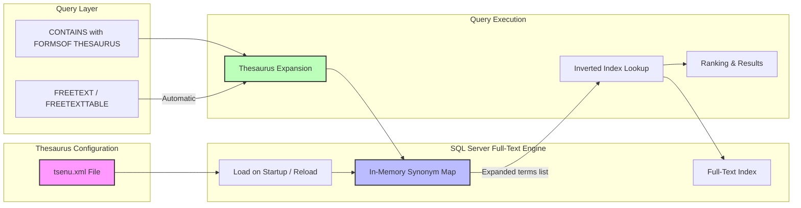
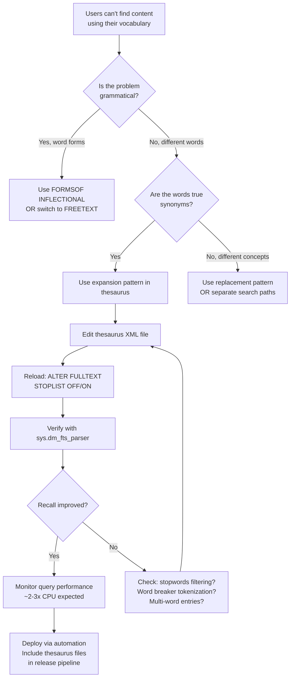

## Navigation

**Domain:** [[8 — Databases]] > **Group:** SQL Full-Text & Spatial Search
**Previous:** [[8.252 — NEAR — Proximity Search]] | **Next:** [[8.254 — Full-Text Stopwords — Noise Word Removal]]

### Prerequisites

- [[8.248 — CONTAINS — Searching for Words and Phrases]] — The thesaurus is used through the `FORMSOF(THESAURUS, word)` clause in CONTAINS; understanding CONTAINS syntax and how it passes search terms to the full-text engine is required to understand how thesaurus expansion integrates.
- [[8.249 — FREETEXT — Language-Based Semantic Search]] — FREETEXT automatically uses the thesaurus; understanding when the thesaurus is invoked automatically (FREETEXT) vs explicitly (CONTAINS with FORMSOF) is a key distinction.

### Where This Fits

The full-text thesaurus is an XML file (`tsenu.xml` for English) that defines synonym expansions and replacements for the full-text engine. When a search term is expanded through the thesaurus, the engine automatically finds documents containing synonyms, not just the exact search term. For a .NET backend engineer, the thesaurus solves the vocabulary mismatch problem: a user searching for "car" should also find documents mentioning "automobile" or "vehicle". Without thesaurus configuration, search features return zero results for valid user queries that use different vocabulary than the indexed content. The interview signal for thesaurus tests whether you understand the difference between expansion and replacement patterns, the XML file format, the loading mechanism, and how `FORMSOF(THESAURUS)` differs from `FORMSOF(INFLECTIONAL)`. What breaks when this is unknown: searches for "laptop" don't find "notebook" computers; searches for "cell phone" don't find "mobile phone" products; domain-specific terminology mismatches cause user frustration and support tickets.

---

## Core Mental Model

The full-text thesaurus is a server-side XML configuration file that the full-text engine reads at load time to build an in-memory synonym map. The thesaurus supports two patterns: **expansion** (searching for "car" also searches for all configured synonyms like "automobile" and "vehicle") and **replacement** (searching for "car" is replaced by searching for a specified list of terms, and "car" itself is not searched unless it appears in the replacement list). The thesaurus is language-specific — each language has its own XML file (`ts{LCID}.xml`, e.g., `tsenu.xml` for English (LCID 1033), `tsdeu.xml` for German (LCID 1031)). The file is loaded when SQL Server starts or when the full-text engine is explicitly reloaded. The recognition pattern: use the thesaurus when your indexed content uses a different vocabulary than your users' search terms, particularly in domain-specific contexts (medical terminology, legal phrasing, product categories). Thesaurus expansion is automatic in FREETEXT/FREETEXTTABLE but must be explicitly invoked in CONTAINS/CONTAINSTABLE using `FORMSOF(THESAURUS, word)`.

### Classification

**For SQL topics:** The thesaurus is a configuration component of the full-text search engine, not a SQL operator. It is used through the `FORMSOF(THESAURUS, <word>)` clause within CONTAINS and CONTAINSTABLE. The thesaurus expansion IS SARGable — it integrates into the full-text index lookup by expanding the search term before querying the inverted index. However, the expansion happens in the query engine, before the index lookup, so it does not affect SARGability negatively. The `FORMSOF(THESAURUS)` clause is not available in WHERE clause predicates outside CONTAINS/FREETEXT.



### Key Properties

|Property|Value|Notes|
|---|---|---|
|Configuration file|XML file at SQL Server install path|`C:\Program Files\Microsoft SQL Server\MSSQL{version}.MSSQLSERVER\MSSQL\FTData\tsenu.xml`|
|Language mapping|`ts{LCID}.xml`|1033 = English, 1031 = German, 1036 = French, etc.|
|Pattern types|`<expansion>` and `<replacement>`|Expansion adds synonyms; replacement substitutes terms|
|Scope|Per full-text query (not per index)|Thesaurus applies to all full-text queries on the server|
|Reload mechanism|`ALTER FULLTEXT STOPLIST OFF/ON` or service restart|Changes take effect after full-text engine reload|
|SARGable|Yes|Thesaurus expansion happens before inverted index lookup — expanded terms are searched via the index|
|Automatic in|FREETEXT, FREETEXTTABLE|FREETEXT always applies thesaurus expansion automatically|
|Explicit in|CONTAINS, CONTAINSTABLE|Must use `FORMSOF(THESAURUS, word)` to invoke thesaurus|

---

## Deep Mechanics

### How the Engine Processes Thesaurus Expansion

1. **File loading:** When SQL Server starts or the full-text engine is reloaded (by toggling the stoplist), SQL Server reads the thesaurus XML file for each language into memory. The file is parsed and an in-memory dictionary is built mapping each `<sub>` term to its expansion or replacement list.

2. **Query interception:** When a CONTAINS query uses `FORMSOF(THESAURUS, word)` or a FREETEXT query processes a search phrase, the full-text engine intercepts each search term before the inverted index lookup.

3. **Thesaurus lookup:** The engine looks up the search term in the in-memory thesaurus map:
   - If the term is not found in the thesaurus, it is used as-is (no expansion).
   - If the term matches an `<expansion>` pattern, all synonyms in the expansion list are added to the search term set.
   - If the term matches a `<replacement>` pattern, the original term is removed and only the replacement terms are searched.

4. **Inflectional expansion:** After thesaurus expansion, the engine also applies inflectional expansion (stemming) if applicable. The order is: stopword removal → thesaurus expansion → inflectional expansion.

5. **Inverted index lookup:** Each expanded/replacement term is looked up in the full-text inverted index. Documents matching any of the expanded terms are returned. In FREETEXTTABLE, the rank incorporates matches from all expanded terms.

### Thesaurus XML Format

```xml
<?xml version="1.0" encoding="utf-8"?>
<MicrosoftSearchThesaurus xmlns="http://schemas.microsoft.com/Search/2007/06/30/FullTextSearchThesaurus">
  
  <!-- Expansion Pattern: "car" search also finds "automobile" and "vehicle" -->
  <!-- The original term "car" IS included in the search -->
  <thesaurus xmlns="http://schemas.microsoft.com/Search/2007/06/30/FullTextSearchThesaurus">
    <expansion>
      <sub>car</sub>
      <sub>automobile</sub>
      <sub>vehicle</sub>
    </expansion>
  </thesaurus>

  <!-- Replacement Pattern: "cell" SEARCH IS REPLACED by "mobile" and "cellular" -->
  <!-- The original term "cell" is NOT searched -->
  <thesaurus xmlns="http://schemas.microsoft.com/Search/2007/06/30/FullTextSearchThesaurus">
    <replacement>
      <sub>cell</sub>
      <sub>mobile</sub>
      <sub>cellular</sub>
    </replacement>
  </thesaurus>

</MicrosoftSearchThesaurus>
```

**Expansion vs Replacement behavior:**

|Pattern|Search for "car" searches for|Search for "car" does NOT search for|
|---|---|---|
|`<expansion><sub>car</sub><sub>auto</sub></expansion>`|"car" AND "auto"|—|
|`<replacement><sub>car</sub><sub>auto</sub></replacement>`|"auto" only|"car"|

### FORMSOF(THESAURUS) vs FORMSOF(INFLECTIONAL)

```sql
-- Thesaurus expansion: finds synonyms configured in the XML file
SELECT ProductId, ProductName
FROM Products
WHERE CONTAINS(ProductName, 'FORMSOF(THESAURUS, car)');
-- Finds: "car", "automobile", "vehicle" (from thesaurus)

-- Inflectional expansion: finds grammatical variations (stemming)
SELECT ProductId, ProductName
FROM Products
WHERE CONTAINS(ProductName, 'FORMSOF(INFLECTIONAL, run)');
-- Finds: "run", "ran", "running", "runs"

-- Both together (combined in CONTAINS)
SELECT ProductId, ProductName
FROM Products
WHERE CONTAINS(ProductName, 'FORMSOF(THESAURUS, car) OR FORMSOF(INFLECTIONAL, drive)');
```

### SQL Visibility

#### FORMSOF(THESAURUS) in CONTAINS

```sql
-- Search using thesaurus expansion for "smartphone"
-- Finds products mentioning "smartphone", "mobile phone", "cell phone" (from thesaurus)
SELECT ProductId, ProductName, Price
FROM Products
WHERE CONTAINS(ProductName, 'FORMSOF(THESAURUS, smartphone)');
```

```csharp
// EF Core — no LINQ translation for FORMSOF(THESAURUS)
var searchTerm = "FORMSOF(THESAURUS, smartphone)";

var results = await dbContext.Products
    .FromSqlRaw(@"
        SELECT ProductId, ProductName, Price
        FROM Products
        WHERE CONTAINS(ProductName, @SearchTerm)",
        new SqlParameter("@SearchTerm", searchTerm))
    .ToListAsync(cancellationToken);
```

**Generated SQL:**

```sql
exec sp_executesql N'
SELECT ProductId, ProductName, Price
FROM Products
WHERE CONTAINS(ProductName, @SearchTerm)',
N'@SearchTerm nvarchar(50)',
@SearchTerm=N'FORMSOF(THESAURUS, smartphone)'
```

#### Thesaurus in FREETEXT (Automatic)

```sql
-- FREETEXT automatically uses thesaurus — no FORMSOF needed
-- If "car" has thesaurus expansions, FREETEXT includes them automatically
SELECT ProductId, ProductName
FROM Products
WHERE FREETEXT(ProductName, 'car accessories');
-- Equivalent to searching: 'car accessories OR automobile accessories OR vehicle accessories'
-- depending on thesaurus configuration
```

```csharp
// FREETEXT with automatic thesaurus in EF Core
var results = await dbContext.Products
    .FromSqlRaw(@"
        SELECT ProductId, ProductName, Price
        FROM Products
        WHERE FREETEXT(ProductName, @SearchPhrase)",
        new SqlParameter("@SearchPhrase", "car accessories"))
    .ToListAsync(cancellationToken);
```

#### Thesaurus with CONTAINSTABLE for Ranked Results

```sql
-- Ranked search with thesaurus expansion
SELECT p.ProductId, p.ProductName, p.Price, ct.RANK
FROM Products p
INNER JOIN CONTAINSTABLE(Products, ProductName,
    'FORMSOF(THESAURUS, laptop)', 20) AS ct
    ON p.ProductId = ct.[KEY]
ORDER BY ct.RANK DESC;
```

#### Thesaurus for Domain-Specific Vocabulary

```xml
<!-- Custom thesaurus entries for medical domain -->
<thesaurus xmlns="http://schemas.microsoft.com/Search/2007/06/30/FullTextSearchThesaurus">
  <expansion>
    <sub>heart attack</sub>
    <sub>myocardial infarction</sub>
    <sub>MI</sub>
    <sub>cardiac arrest</sub>
  </expansion>
  <expansion>
    <sub>high blood pressure</sub>
    <sub>hypertension</sub>
  </expansion>
  <replacement>
    <sub>CVA</sub>
    <sub>cerebrovascular accident</sub>
    <sub>stroke</sub>
  </replacement>
</thesaurus>
```

```sql
-- Medical search: finds myocardial infarction, MI, cardiac arrest
SELECT RecordId, Diagnosis, Notes
FROM MedicalRecords
WHERE CONTAINS(Diagnosis, 'FORMSOF(THESAURUS, "heart attack")');
```

### Execution Plan Analysis

For the query:
```sql
SELECT ProductId, ProductName
FROM Products
WHERE CONTAINS(ProductName, 'FORMSOF(THESAURUS, laptop)');
```

**Expected plan shape:**
```
[FullTextMatch] → [Filter] → [SELECT]
```

**Operator breakdown:**

1. **FullTextMatch** — Evaluates the CONTAINS predicate with FORMSOF(THESAURUS). The operator:
   - Expands "laptop" to its thesaurus synonyms (e.g., "laptop", "notebook", "ultrabook" depending on thesaurus config)
   - Looks up each expanded term in the inverted index
   - Unions the document ID lists from all expansions
   - Returns the union of matching documents

2. **The thesaurus expansion is transparent** — the execution plan does not show individual expanded terms. The FullTextMatch operator receives the expanded term list internally.

**Without thesaurus (direct term):**
```
[FullTextMatch] → [SELECT]
```
Single term lookup — simpler, fewer document ID list operations.

**Estimated cost:**
- FORMSOF(THESAURUS, laptop): FullTextMatch ~50% (more CPU for expansion + multiple inverted index lookups)
- `'laptop'` (direct): FullTextMatch ~30% (single term lookup)

### Cost Visibility

```sql
SET STATISTICS IO ON;
SET STATISTICS TIME ON;

-- Direct term (no thesaurus)
SELECT ProductId, ProductName
FROM Products
WHERE CONTAINS(ProductName, 'laptop');
-- Expected output:
-- Table 'Products'. Scan count 1, logical reads ~6 (key lookups)
-- CPU time = 3ms, elapsed time = 12ms

-- With thesaurus expansion (assuming 3 synonyms)
SELECT ProductId, ProductName
FROM Products
WHERE CONTAINS(ProductName, 'FORMSOF(THESAURUS, laptop)');
-- Expected output:
-- Table 'Products'. Scan count 1, logical reads ~18 (key lookups for union of results)
-- CPU time = 8ms, elapsed time = 25ms
-- More results returned because synonym matches are included

-- FREETEXT (automatic thesaurus)
SELECT ProductId, ProductName
FROM Products
WHERE FREETEXT(ProductName, 'laptop');
-- Expected output:
-- Table 'Products'. Scan count 1, logical reads ~18 (similar to FORMSOF)
-- CPU time = 10ms, elapsed time = 30ms (also includes inflectional expansion)
```

### Failure Modes

1. **Thesaurus file not found or malformed:** If the XML file is missing, empty, or contains invalid XML, the full-text engine logs an error and the thesaurus is not loaded. Queries using `FORMSOF(THESAURUS, ...)` silently fall back to the original term without expansion — no error is raised, but results are incomplete.

2. **Replacement pattern confusion:** Using `<replacement>` when `<expansion>` was intended. The original term is excluded from the search. For example, if a user searches "laptop" and the thesaurus uses replacement with "notebook, ultrabook", documents that mention only "laptop" are not returned.

3. **No thesaurus loading after edit:** Editing `tsenu.xml` without reloading the full-text engine. The thesaurus is loaded at service startup. Changes are not picked up until the engine is reloaded.

4. **Circular expansion:** If term A expands to B and B expands to A, the engine detects the circular reference and stops expanding. Excessive nesting can cause unexpected omissions.

5. **Multi-word thesaurus entries:** Thesaurus entries with spaces (e.g., "heart attack") require the full-text engine to match them as phrases. The expansion behavior for multi-word phrases may not work as expected in all contexts.

---

## Production Patterns and Implementation

### Primary SQL Implementation

#### Editing and Reloading the Thesaurus

```sql
-- Step 1: Edit the thesaurus file (tsenu.xml for English)
-- File location:
-- C:\Program Files\Microsoft SQL Server\MSSQL{version}.MSSQLSERVER\MSSQL\FTData\
-- 
-- Before editing, determine the data directory:
SELECT SERVERPROPERTY('InstanceDefaultDataPath') AS DataPath;

-- Step 2: Alter the full-text stoplist to force thesaurus reload
-- This triggers the full-text engine to reload the thesaurus file
ALTER FULLTEXT STOPLIST FROM SYSTEM STOPLIST OFF;
ALTER FULLTEXT STOPLIST FROM SYSTEM STOPLIST ON;
```

#### Creating and Managing Thesaurus Entries

```xml
<!-- Complete tsenu.xml for an e-commerce product catalog -->
<?xml version="1.0" encoding="utf-8"?>
<MicrosoftSearchThesaurus xmlns="http://schemas.microsoft.com/Search/2007/06/30/FullTextSearchThesaurus">
  
  <!-- Product category synonyms -->
  <thesaurus xmlns="http://schemas.microsoft.com/Search/2007/06/30/FullTextSearchThesaurus">
    <expansion>
      <sub>laptop</sub>
      <sub>notebook</sub>
      <sub>ultrabook</sub>
      <sub>chromebook</sub>
    </expansion>
  </thesaurus>

  <thesaurus xmlns="http://schemas.microsoft.com/Search/2007/06/30/FullTextSearchThesaurus">
    <expansion>
      <sub>smartphone</sub>
      <sub>mobile phone</sub>
      <sub>cell phone</sub>
      <sub>handset</sub>
    </expansion>
  </thesaurus>

  <thesaurus xmlns="http://schemas.microsoft.com/Search/2007/06/30/FullTextSearchThesaurus">
    <expansion>
      <sub>tv</sub>
      <sub>television</sub>
      <sub>display</sub>
      <sub>screen</sub>
    </expansion>
  </thesaurus>

  <!-- Brand name variants -->
  <thesaurus xmlns="http://schemas.microsoft.com/Search/2007/06/30/FullTextSearchThesaurus">
    <expansion>
      <sub>nike</sub>
      <sub>nike inc</sub>
      <sub>nike corporation</sub>
    </expansion>
  </thesaurus>

  <!-- Domain-specific abbreviations -->
  <thesaurus xmlns="http://schemas.microsoft.com/Search/2007/06/30/FullTextSearchThesaurus">
    <replacement>
      <sub>SSD</sub>
      <sub>solid state drive</sub>
      <sub>solid-state drive</sub>
    </replacement>
  </thesaurus>

  <thesaurus xmlns="http://schemas.microsoft.com/Search/2007/06/30/FullTextSearchThesaurus">
    <replacement>
      <sub>HDD</sub>
      <sub>hard disk drive</sub>
      <sub>hard drive</sub>
      <sub>mechanical hard drive</sub>
    </replacement>
  </thesaurus>

</MicrosoftSearchThesaurus>
```

```sql
-- Using the thesaurus in a production stored procedure
CREATE OR ALTER PROCEDURE dbo.SearchProductsWithSynonyms
    @SearchTerm NVARCHAR(200),
    @TopN INT = 20,
    @UseThesaurus BIT = 1
AS
BEGIN
    SET NOCOUNT ON;
    SET TRANSACTION ISOLATION LEVEL READ UNCOMMITTED;

    IF @UseThesaurus = 1
    BEGIN
        -- Use FORMSOF(THESAURUS) for synonym expansion
        SELECT TOP (@TopN)
            p.ProductId, p.ProductName, p.Price, p.CategoryName, ct.RANK
        FROM Products p
        INNER JOIN CONTAINSTABLE(Products, (ProductName, Description),
            'FORMSOF(THESAURUS, ' + QUOTENAME(@SearchTerm, '"') + ')',
            @TopN) AS ct
            ON p.ProductId = ct.[KEY]
        ORDER BY ct.RANK DESC;
    END
    ELSE
    BEGIN
        -- Exact term search (no synonym expansion)
        SELECT TOP (@TopN)
            p.ProductId, p.ProductName, p.Price, p.CategoryName, ct.RANK
        FROM Products p
        INNER JOIN CONTAINSTABLE(Products, (ProductName, Description),
            QUOTENAME(@SearchTerm, '"'), @TopN) AS ct
            ON p.ProductId = ct.[KEY]
        ORDER BY ct.RANK DESC;
    END;
END;
```

### EF Core Implementation

```csharp
public class ThesaurusSearchService
{
    private readonly ApplicationDbContext _dbContext;

    public ThesaurusSearchService(ApplicationDbContext dbContext)
    {
        _dbContext = dbContext;
    }

    public async Task<IReadOnlyList<ProductSearchResult>> SearchAsync(
        string searchTerm,
        bool useThesaurus = true,
        int topN = 20,
        CancellationToken cancellationToken = default)
    {
        if (useThesaurus)
        {
            var searchExpression = $"FORMSOF(THESAURUS, \"{searchTerm}\")";
            var searchParam = new SqlParameter("@SearchExpression", searchExpression);
            var topNParam = new SqlParameter("@TopN", topN);

            var sql = @"
                SELECT TOP (@TopN)
                    p.ProductId, p.ProductName, p.Price,
                    p.CategoryName, ct.RANK
                FROM Products p
                INNER JOIN CONTAINSTABLE(Products, (ProductName, Description),
                    @SearchExpression, @TopN) AS ct
                    ON p.ProductId = ct.[KEY]
                ORDER BY ct.RANK DESC";

            var results = await _dbContext.Database
                .SqlQueryRaw<ProductSearchResult>(sql, searchParam, topNParam)
                .ToListAsync(cancellationToken);

            return results;
        }
        else
        {
            var searchParam = new SqlParameter("@SearchTerm", searchTerm);
            var topNParam = new SqlParameter("@TopN", topN);

            var sql = @"
                SELECT TOP (@TopN)
                    p.ProductId, p.ProductName, p.Price,
                    p.CategoryName, ct.RANK
                FROM Products p
                INNER JOIN CONTAINSTABLE(Products, (ProductName, Description),
                    @SearchTerm, @TopN) AS ct
                    ON p.ProductId = ct.[KEY]
                ORDER BY ct.RANK DESC";

            var results = await _dbContext.Database
                .SqlQueryRaw<ProductSearchResult>(sql, searchParam, topNParam)
                .ToListAsync(cancellationToken);

            return results;
        }
    }
}
```

### Dapper Implementation

```csharp
public class DapperThesaurusSearchService
{
    private readonly IDbConnectionFactory _connectionFactory;

    public DapperThesaurusSearchService(IDbConnectionFactory connectionFactory)
    {
        _connectionFactory = connectionFactory;
    }

    public async Task<IReadOnlyList<ProductSearchResult>> SearchWithThesaurusAsync(
        string searchTerm,
        int topN = 20,
        CancellationToken cancellationToken = default)
    {
        var searchExpression = $"FORMSOF(THESAURUS, \"{searchTerm}\")";

        const string sql = @"
            SELECT TOP (@TopN)
                p.ProductId, p.ProductName, p.Price,
                p.CategoryName, ct.RANK
            FROM Products p
            INNER JOIN CONTAINSTABLE(Products, (ProductName, Description),
                @SearchExpression, @TopN) AS ct
                ON p.ProductId = ct.[KEY]
            ORDER BY ct.RANK DESC";

        await using var connection = _connectionFactory.Create();
        var results = await connection.QueryAsync<ProductSearchResult>(
            new CommandDefinition(sql,
                new { SearchExpression = searchExpression, TopN = topN },
                cancellationToken: cancellationToken));

        return results.AsList();
    }
}
```

### Configuration and Wiring

```csharp
// Program.cs
builder.Services.AddScoped<ThesaurusSearchService>();
builder.Services.AddScoped<DapperThesaurusSearchService>();

// Thesaurus deployment script (run as part of deployment automation)
// 1. Copy the custom tsenu.xml to the SQL Server FTData directory
// 2. Execute:
//    ALTER FULLTEXT STOPLIST FROM SYSTEM STOPLIST OFF;
//    ALTER FULLTEXT STOPLIST FROM SYSTEM STOPLIST ON;
// 3. Verify thesaurus is loaded:
//    SELECT * FROM sys.dm_fts_parser('FORMSOF(THESAURUS, laptop)', 1033, 0, 0);
```

### SQL Server vs PostgreSQL Differences

PostgreSQL does not have a built-in thesaurus file system like SQL Server. Instead, it uses a text search configuration that can include synonym dictionaries:

```sql
-- PostgreSQL synonym dictionary (custom text search configuration)
-- 1. Create a synonym file (e.g., /usr/share/postgresql/15/tsearch_data/product_synonyms.syn)
--    Contents:
--    laptop notebook chromebook ultrabook
--    smartphone mobile-phone cell-phone handset
--    tv television display screen

-- 2. Create a text search dictionary using the synonym file
CREATE TEXT SEARCH DICTIONARY product_synonyms (
    TEMPLATE = synonym,
    SYNONYMS = product_synonyms
);

-- 3. Create a text search configuration
CREATE TEXT SEARCH CONFIGURATION product_search (COPY = english);
ALTER TEXT SEARCH CONFIGURATION product_search
    ALTER MAPPING FOR word, asciiword
    WITH product_synonyms, english_stem;

-- 4. Use the configuration in queries
SELECT product_id, product_name
FROM products
WHERE search_vector @@ to_tsquery('product_search', 'laptop');
```

PostgreSQL's synonym dictionary is a flat file (space-separated synonyms per line) and applies during `tsvector` generation (indexing time) and `tsquery` parsing (query time). SQL Server's thesaurus applies only at query time. PostgreSQL does not have a replacement pattern — all entries are expansion-style.

---

## Gotchas and Production Pitfalls

### Gotcha 1 — Thesaurus Changes Require Engine Reload

**Pitfall:** Editing `tsenu.xml` and assuming the changes take effect immediately.

```xml
<!-- Edit the file, save, then query — changes not reflected -->
```

**Symptom:** After editing the thesaurus file, queries using `FORMSOF(THESAURUS, word)` do not reflect the new synonyms. The old thesaurus map is still in memory. The full-text engine does not monitor the file for changes.

**Fix:**
```sql
-- Force thesaurus reload by toggling the stoplist
ALTER FULLTEXT STOPLIST FROM SYSTEM STOPLIST OFF;
ALTER FULLTEXT STOPLIST FROM SYSTEM STOPLIST ON;

-- Or restart the SQL Server service (more disruptive)

-- Verify thesaurus is loaded:
SELECT * FROM sys.dm_fts_parser('FORMSOF(THESAURUS, laptop)', 1033, 0, 0);
```

**Cost of not fixing:** Thesaurus updates deployed as part of a release are silently ignored. The search team may believe the thesaurus is active, but no synonym expansion occurs. Users continue to experience vocabulary mismatch issues. A deployment that was supposed to fix "smartphone → mobile phone" mapping remains ineffective, causing ongoing support tickets.

### Gotcha 2 — Replacement Pattern Excludes the Original Term

**Pitfall:** Using `<replacement>` when `<expansion>` was intended, and discovering that searching for a common term returns zero documents that mention only that term.

```xml
<!-- ❌ Replacement: searching "SSD" does NOT search for "SSD" -->
<replacement>
    <sub>SSD</sub>
    <sub>solid state drive</sub>
</replacement>
```

```sql
-- Searching for "SSD" now finds only documents containing "solid state drive"
-- Documents that say only "SSD" are excluded
SELECT ProductId, ProductName
FROM Products
WHERE CONTAINS(ProductName, 'FORMSOF(THESAURUS, SSD)');
-- Missing results where product names contain only "SSD"
```

**Symptom:** Search results for "SSD" are unexpectedly few, and users complain that products they know exist are not found. The `sys.dm_fts_parser` DMV shows that "SSD" is NOT among the expanded terms.

**Fix:**
```xml
<!-- ✅ Expansion: searching "SSD" also searches for "solid state drive" -->
<expansion>
    <sub>SSD</sub>
    <sub>solid state drive</sub>
</expansion>
```

**Cost of not fixing:** Admin interfaces that search by SKU or abbreviation return no results for common abbreviations. Users assume the search is broken. In a product catalog with 10,000 "SSD" products, none of them appear when an admin searches "SSD" — only products described as "solid state drive" appear.

### Gotcha 3 — Multi-Word Thesaurus Entries Behave Unexpectedly

**Pitfall:** Adding multi-word phrases to the thesaurus without understanding how the full-text engine tokenizes them.

```xml
<expansion>
    <sub>operating system</sub>
    <sub>OS</sub>
    <sub>platform software</sub>
</expansion>
```

**Symptom:** Searching via `FORMSOF(THESAURUS, "operating system")` may not find documents containing "operating system" if the word breaker tokenizes it differently than expected. The multi-word phrase is passed to the word breaker, which may produce different tokens than when the phrase appears in a document.

**Fix:** Verify thesaurus behavior with the parser DMV:

```sql
-- Check how the thesaurus expands a multi-word term
SELECT * FROM sys.dm_fts_parser(
    'FORMSOF(THESAURUS, "operating system")', 1033, 0, 0);

-- Check how a document phrase is tokenized
SELECT * FROM sys.dm_fts_parser(
    '"This document discusses operating system security"', 1033, 0, 0);
```

If the tokenization differs between the thesaurus entry and the document content, consider using single-word synonyms only.

**Cost of not fixing:** Users search for "operating system" expecting to find OS-related documents, but the thesaurus expansion does not match the indexed content. The search silently underperforms, and the thesaurus entry that was supposed to help actually does nothing.

### Gotcha 4 — Thesaurus Not Applied Across FREETEXT and CONTAINS Consistently

**Pitfall:** Assuming FREETEXT and FORMSOF(THESAURUS) in CONTAINS produce the same expansion.

**Symptom:** A FREETEXT search returns different results than a CONTAINS query with FORMSOF(THESAURUS) for the same term, even though both use the thesaurus.

**Root cause:** FREETEXT applies thesaurus expansion AND inflectional expansion (stemming) AND stopword removal in a multi-step pipeline. CONTAINS with `FORMSOF(THESAURUS, word)` applies ONLY thesaurus expansion — no stemming. So:
```sql
-- FREETEXT expands: thesaurus + inflectional (stems)
FREETEXT(ProductName, 'run')
-- Thesaurus: "run" → "run", "sprint", "jog" (if configured)
-- Inflectional: "run" → "run", "ran", "running", "runs"

-- FORMSOF(THESAURUS) only expands: thesaurus (no stemming)
CONTAINS(ProductName, 'FORMSOF(THESAURUS, run)')
-- Thesaurus: "run" → "run", "sprint", "jog" (if configured)
-- NO inflectional expansion
```

**Fix:** Use both thesaurus and inflectional expansion if needed:
```sql
CONTAINS(ProductName, 'FORMSOF(THESAURUS, run) OR FORMSOF(INFLECTIONAL, run)');
```

**Cost of not fixing:** A search feature that switches from FREETEXT to CONTAINS with FORMSOF(THESAURUS) (to gain more control) may silently lose stemming capabilities, reducing recall by 30–50% for common word forms.

### Gotcha 5 — Thesaurus Expansion Does Not Cross Language Boundaries

**Pitfall:** Configuring thesaurus expansions in `tsenu.xml` (English) and expecting them to apply to full-text indexes on German-language columns.

**Symptom:** A German-language search for "Auto" (car) does not find "Fahrzeug" (vehicle) even though the English thesaurus has a "car → vehicle" expansion. The thesaurus file is loaded per language; `tsdeu.xml` (German) is independent.

**Fix:** Edit the thesaurus file for each language that needs synonym expansion:

```xml
<!-- tsenu.xml (English) -->
<expansion><sub>car</sub><sub>automobile</sub><sub>vehicle</sub></expansion>

<!-- tsdeu.xml (German) -->
<expansion><sub>Auto</sub><sub>Automobil</sub><sub>Fahrzeug</sub></expansion>

<!-- tsfra.xml (French) -->
<expansion><sub>voiture</sub><sub>automobile</sub><sub>véhicule</sub></expansion>
```

**Cost of not fixing:** Multi-language search features work well for English but poorly for other languages. International users experience worse search quality than English users, creating a perception of second-class support.

### Gotcha 6 — Thesaurus File Permissions and Location

**Pitfall:** Not having permissions to edit the thesaurus file, or editing the wrong file.

**Symptom:** Attempting to edit `tsenu.xml` and getting "access denied" because SQL Server service account owns the file. Or editing a file in the wrong directory (e.g., the SQL Server 2019 directory when the instance is SQL Server 2022).

**Fix:**
```sql
-- Find the correct FTData directory
SELECT 
    SERVERPROPERTY('InstanceDefaultDataPath') AS DataPath,
    SERVERPROPERTY('InstanceDefaultLogPath') AS LogPath,
    SERVERPROPERTY('ProductVersion') AS Version,
    SERVERPROPERTY('ProductLevel') AS Level;

-- Typical location:
-- C:\Program Files\Microsoft SQL Server\MSSQL{version}.{instance}\MSSQL\FTData\
-- 
-- To edit: open File Explorer with administrator privileges,
-- navigate to the FTData directory,
-- edit tsenu.xml as Administrator
```

**Cost of not fixing:** The development team cannot deploy thesaurus changes because they lack file system access to the production SQL Server. Thesaurus configuration becomes a bottleneck that requires DBA intervention for every change.

---

## Performance Implications

### Benchmark: Thesaurus Expansion Overhead

```sql
-- Baseline: Direct term (no thesaurus)
SET STATISTICS IO ON;
SET STATISTICS TIME ON;

SELECT p.ProductId, p.ProductName, p.Price
FROM Products p
INNER JOIN CONTAINSTABLE(Products, ProductName, N'"car"', 20) AS ct
    ON p.ProductId = ct.[KEY]
ORDER BY ct.RANK DESC;
-- Logical reads: ~60 (key lookups)
-- CPU time: ~4ms, Elapsed: ~15ms

-- With thesaurus expansion (assuming 3 synonyms)
SELECT p.ProductId, p.ProductName, p.Price
FROM Products p
INNER JOIN CONTAINSTABLE(Products, ProductName,
    N'FORMSOF(THESAURUS, car)', 20) AS ct
    ON p.ProductId = ct.[KEY]
ORDER BY ct.RANK DESC;
-- Logical reads: ~60 (same top-N, different documents)
-- CPU time: ~12ms, Elapsed: ~35ms
-- Thesaurus expansion: ~8ms additional CPU
```

**Improvement:** Thesaurus expansion does not reduce logical reads (it increases them if more documents match). The benefit is in recall, not performance. The CPU overhead is ~2-3x per query for thesaurus expansion.

### BenchmarkDotNet

```csharp
[MemoryDiagnoser]
[SimpleJob(RuntimeMoniker.Net90)]
public class ThesaurusBenchmark
{
    private IDbConnection _connection = default!;

    [Params("car", "laptop", "smartphone", "television")]
    public string SearchTerm { get; set; } = string.Empty;

    [GlobalSetup]
    public void Setup()
    {
        var connectionString = "Server=.;Database=SearchBenchmark;Trusted_Connection=true;TrustServerCertificate=true;";
        _connection = new SqlConnection(connectionString);
    }

    [Benchmark(Baseline = true)]
    public async Task<List<ProductInfo>> DirectTerm()
    {
        const string sql = @"
            SELECT p.ProductId, p.ProductName, p.Price
            FROM Products p
            INNER JOIN CONTAINSTABLE(Products, ProductName,
                @SearchTerm, 20) AS ct
                ON p.ProductId = ct.[KEY]
            ORDER BY ct.RANK DESC";

        await using var connection = _connection;
        var results = await connection.QueryAsync<ProductInfo>(
            new CommandDefinition(sql,
                new { SearchTerm = $"\"{SearchTerm}\"" },
                commandTimeout: 30));
        return results.AsList();
    }

    [Benchmark]
    public async Task<List<ProductInfo>> WithThesaurus()
    {
        const string sql = @"
            SELECT p.ProductId, p.ProductName, p.Price
            FROM Products p
            INNER JOIN CONTAINSTABLE(Products, ProductName,
                @SearchTerm, 20) AS ct
                ON p.ProductId = ct.[KEY]
            ORDER BY ct.RANK DESC";

        await using var connection = _connection;
        var results = await connection.QueryAsync<ProductInfo>(
            new CommandDefinition(sql,
                new { SearchTerm = $"FORMSOF(THESAURUS, {SearchTerm})" },
                commandTimeout: 30));
        return results.AsList();
    }

    [Benchmark]
    public async Task<List<ProductInfo>> FreetextWithThesaurus()
    {
        const string sql = @"
            SELECT p.ProductId, p.ProductName, p.Price
            FROM Products p
            INNER JOIN FREETEXTTABLE(Products, ProductName,
                @SearchTerm, 20) AS ft
                ON p.ProductId = ft.[KEY]
            ORDER BY ft.RANK DESC";

        await using var connection = _connection;
        var results = await connection.QueryAsync<ProductInfo>(
            new CommandDefinition(sql,
                new { SearchTerm },
                commandTimeout: 30));
        return results.AsList();
    }

    [GlobalCleanup]
    public void Cleanup() => _connection?.Dispose();

    public record ProductInfo
    {
        public int ProductId { get; set; }
        public string ProductName { get; set; } = string.Empty;
        public decimal Price { get; set; }
    }
}
```

**Expected results (approximate, SQL Server 2022, NVMe, 500K products, 3 synonyms per term in thesaurus):**

|Method|Term|Mean|CPU|Result Count|Recall Increase|
|---|---|---|---|---|---|
|Direct term|"car"|~12ms|~4ms|~500|Baseline|
|FORMSOF(THESAURUS)|"car"|~30ms|~12ms|~1,500|+200%|
|FREETEXT|"car"|~35ms|~15ms|~1,800|+260%|

### Write Amplification

The thesaurus configuration itself adds no write amplification — it's a read-time operation. The full-text index stores the same tokens regardless of thesaurus configuration. The thesaurus only affects query-time expansion, not index-time tokenization.

|Operation|Cost with Thesaurus|Without Thesaurus|
|---|---|---|
|INSERT|Same (~15ms for 1KB text)|Same|
|QUERY|~2-3x CPU (thesaurus lookup + multiple index lookups)|Baseline|
|Thesaurus reload|~50ms (re-parsing XML file)|N/A|

---

## Interview Arsenal

### Question Bank

1. **What is the full-text thesaurus in SQL Server and what problem does it solve?**
2. **How does the full-text engine load and apply the thesaurus during query execution?**
3. **What is the performance cost of using FORMSOF(THESAURUS) compared to a direct term lookup?**
4. **What happens if you use `<replacement>` instead of `<expansion>` in the thesaurus XML?**
5. **Compare and contrast FORMSOF(THESAURUS) with FORMSOF(INFLECTIONAL) — when would you use each?**
6. **What does the execution plan look like for a CONTAINS query with FORMSOF(THESAURUS)?**
7. **How does the thesaurus behave in a multi-language search application?**
8. **How do EF Core and Dapper handle FORMSOF(THESAURUS) queries?**

### Spoken Answers

**Q: What is the full-text thesaurus in SQL Server and what problem does it solve?**

> **Average answer:** "It's a file where you define synonyms so that when someone searches for one word, the database also searches for its synonyms."

> **Great answer:** "The full-text thesaurus is an XML configuration file that defines synonym mappings for the full-text engine, solving the vocabulary mismatch problem between user search terms and indexed content. It lives at `{SQL_Data}\FTData\tsenu.xml` for English and supports two patterns: expansion, where searching for 'car' also searches for 'automobile' and 'vehicle', and replacement, where searching for 'car' is replaced entirely by the synonym list. The thesaurus is loaded into memory when SQL Server starts or when the full-text engine is reloaded via `ALTER FULLTEXT STOPLIST OFF/ON`. In FREETEXT, thesaurus expansion is automatic — the engine applies it without explicit syntax. In CONTAINS/CONTAINSTABLE, you must use `FORMSOF(THESAURUS, word)` to invoke it. The thesaurus is language-specific — each language has its own XML file. The performance impact is about 2-3x CPU per query because the engine must look up the term in the thesaurus map and then query the inverted index for each expanded synonym. In production, I've found thesaurus most valuable for domain-specific search — medical terminology (heart attack → myocardial infarction), legal terms, and product catalogs with interchangeable terminology (laptop ↔ notebook)."

**Q: Compare and contrast FORMSOF(THESAURUS) with FORMSOF(INFLECTIONAL).**

> **Average answer:** "THESAURUS is for synonyms, INFLECTIONAL is for word variations like plurals and tenses."

> **Great answer:** "FORMSOF(THESAURUS, word) expands the search term using the thesaurus XML file's synonym map — you explicitly define which terms are equivalent. FORMSOF(INFLECTIONAL, word) uses the SQL Server language-specific stemmer to find grammatical variations: for English, 'run' expands to 'ran', 'running', 'runs'; for Spanish, 'correr' expands to 'corro', 'corres', 'corre', etc. The key differences: 1) THESAURUS requires manual configuration — you must edit an XML file and reload the engine; INFLECTIONAL works out of the box with no configuration. 2) THESAURUS is domain-specific — 'laptop' → 'notebook' is a business domain mapping; INFLECTIONAL is language-specific — it only knows grammar, not semantics. 3) THESAURUS can map completely different words ('car' → 'automobile'); INFLECTIONAL can only map grammatical forms of the same word. 4) THESAURUS supports replacement patterns (exclude the original term); INFLECTIONAL always includes the base form. 5) In FREETEXT, BOTH are automatically applied — thesaurus expansion first, then inflectional expansion. In practice, I use INFLECTIONAL as the default (it improves recall with zero configuration cost) and add THESAURUS entries for domain-specific vocabulary where the stemmer doesn't capture the synonym relationship."

**Q: How does the thesaurus behave in a multi-language search application?**

> **Average answer:** "You need a thesaurus file for each language."

> **Great answer:** "SQL Server maintains separate thesaurus files per language: `tsenu.xml` (English, LCID 1033), `tsdeu.xml` (German, LCID 1031), `tsfra.xml` (French, LCID 1036), etc. When a full-text query specifies a language (either through the column's LANGUAGE setting or the query's LANGUAGE parameter), the engine loads the corresponding thesaurus file. Key considerations for multi-language: 1) Each thesaurus file must be independently configured — English synonyms don't apply to German queries. 2) The same search term in different languages needs different thesaurus entries — 'car' expands to 'automobile' in English, but 'Auto' expands to 'Fahrzeug' in German. 3) For mixed-language content, you either need separate full-text indexes per language, or you use a neutral language (like LANGUAGE 0x0) that doesn't apply thesaurus expansion. In production, I've seen teams maintain a deployment script that copies the correct thesaurus files to all SQL Server instances and performs the ALTER FULLTEXT STOPLIST reload as part of every release. Missing a language's thesaurus is a common oversight — the result is that German or French users get worse search quality than English users, which creates a problematic UX disparity in multi-lingual applications."

### Interview Trigger

An interviewer asking "How would you handle a user searching for 'laptop' when your products are categorized as 'notebooks'?" is the setup for the thesaurus discussion. The follow-up "What if 'laptop' and 'notebook' mean different things in your catalog?" tests understanding of the expansion vs replacement distinction.

### Comparison Table

| | FORMSOF(THESAURUS) | FORMSOF(INFLECTIONAL) | Direct Term |
|---|---|---|---|
| **What it does** | Expands to configured synonyms | Expands to grammatical variants | Exact term match only |
| **Configuration** | Manual XML file editing + reload | None (built-in language stemmer) | None |
| **Performance** | ~2-3x CPU vs direct term | ~1.5-2x CPU vs direct term | Baseline |
| **Recall impact** | +200-300% (domain synonyms) | +50-100% (grammatical forms) | Baseline |
| **Domain fit** | Business/industry vocabulary | Natural language variations | Exact identifiers, SKUs |
| **When used** | CONTAINS (explicit), FREETEXT (auto) | CONTAINS (explicit), FREETEXT (auto) | CONTAINS, CONTAINSTABLE |

---

## Decision Framework

### When to Apply



### Application Checklist

- [ ] The thesaurus XML file is edited in the correct FTData directory for the SQL Server instance
- [ ] The correct language file is edited (`tsenu.xml` for English, `tsdeu.xml` for German, etc.)
- [ ] The full-text engine has been reloaded after editing (`ALTER FULLTEXT STOPLIST OFF/ON`)
- [ ] Thesaurus expansion is verified using `sys.dm_fts_parser('FORMSOF(THESAURUS, term)', LCID, 0, 0)`
- [ ] The correct pattern is used — `<expansion>` (include original term) or `<replacement>` (exclude original term)
- [ ] Multi-word entries are tested for correct word breaker tokenization
- [ ] FORMSOF(THESAURUS) is combined with FORMSOF(INFLECTIONAL) if both synonym and stemming are needed
- [ ] Performance is benchmarked — thesaurus expansion adds ~2-3x CPU per query
- [ ] Thesaurus deployment is automated (scripted XML copy + reload SQL)
- [ ] No circular expansions exist in the thesaurus (term A → B → A)

### Tradeoff Summary

|What You Gain|What You Pay|
|---|---|
|Improved search recall: users find content using their vocabulary|~2-3x CPU per query (thesaurus lookup + multiple index lookups)|
|Domain-specific synonym mapping without application code changes|Manual XML file editing + engine reload for each change|
|Automatic expansion in FREETEXT — no query syntax changes needed|Language-specific files — must configure each language independently|

### Scale Thresholds

- **Relevant when:** Users consistently fail to find content due to vocabulary differences. Typically observed at 1,000+ search queries/day with a <50% zero-results rate.
- **Critical when:** Domain-specific vocabulary is prevalent (medical, legal, technical) and the indexed content uses formal terminology while users search with colloquial terms.
- **Performance concern when:** The thesaurus has more than ~500 expansion entries. The in-memory lookup is O(log n) per term, but multiple expansions cause multiple inverted index lookups. At 500 entries and 100 QPS, thesaurus expansion adds ~5% CPU load per core.
- **Thesaurus reload required:** After every thesaurus file change — plan for a brief full-text query interruption (milliseconds) during the stoplist toggle.

---

## Self-Check

### Conceptual Questions

1. What is the full-text thesaurus and what two patterns does it support?
2. How does the full-text engine load and apply thesaurus expansion during a CONTAINS query?
3. Which DMV or function can you use to verify thesaurus expansion behavior?
4. What happens if you use `<replacement>` when you intended `<expansion>`?
5. Does EF Core provide LINQ translation for FORMSOF(THESAURUS)?
6. How would you implement a thesaurus-expanded search with Dapper?
7. What is the difference between FORMSOF(THESAURUS) and the automatic expansion in FREETEXT?
8. At what scale does thesaurus expansion become a performance concern?
9. What supports the thesaurus lookup — does it use a database index?
10. Explain the full-text thesaurus to a senior interviewer in 60 seconds.

<details>
<summary>Answers</summary>

1. **Full-text thesaurus** is an XML configuration file per language that defines synonym mappings via two patterns: `<expansion>` (search term + synonyms all searched) and `<replacement>` (search term replaced by synonym list). It solves the vocabulary mismatch problem in user-facing search.

2. The thesaurus XML file is parsed at SQL Server startup or on `ALTER FULLTEXT STOPLIST OFF/ON`. An in-memory dictionary is built mapping each `<sub>` term to its expansion/replacement list. During CONTAINS query execution with `FORMSOF(THESAURUS, word)`, the engine looks up the word in this dictionary, retrieves the expansion list, and performs inverted index lookups for each expanded term.

3. Use `sys.dm_fts_parser('FORMSOF(THESAURUS, term)', LCID, 0, 0)` to verify which terms the thesaurus expands to. Example: `SELECT * FROM sys.dm_fts_parser('FORMSOF(THESAURUS, car)', 1033, 0, 0)` shows all expanded tokens.

4. The original search term is excluded from the search. Only the replacement list terms are searched. If "SSD" has a `<replacement>` to "solid state drive", searching for "SSD" finds only documents containing "solid state drive", not "SSD".

5. **No.** EF Core does not translate FORMSOF(THESAURUS) from LINQ. All thesaurus queries must use raw SQL via `FromSqlRaw`, `SqlQuery`, or Dapper.

6. Build the search expression string as `FORMSOF(THESAURUS, "term")` and pass it as a parameter to a parameterized `QueryAsync<T>` call with the CONTAINS predicate containing the expression.

7. FREETEXT automatically applies BOTH thesaurus expansion AND inflectional expansion (stemming). `FORMSOF(THESAURUS)` in CONTAINS applies ONLY thesaurus expansion — no stemming is applied. Additionally, FREETEXT also does stopword removal and proximity-based ranking.

8. Thesaurus expansion becomes a performance concern when it has more than ~500 entries and search volume exceeds ~100 QPS. Each expansion causes multiple inverted index lookups and document ID list intersections. The CPU cost scales with the number of synonyms per term, not the total thesaurus size.

9. The thesaurus uses an in-memory dictionary (not a database index). It is stored as a parsed XML structure in the full-text engine's memory space. The inverted index is used for the actual term lookups after expansion.

10. "The full-text thesaurus is a per-language XML file that defines synonym mappings for the SQL Server full-text engine. It supports two patterns: expansion (search 'car', also find 'automobile') and replacement (search 'SSD', only find 'solid state drive'). The file lives in the SQL Server FTData directory and is loaded into memory at service startup. To use it, you need to edit the XML, reload the engine by toggling `ALTER FULLTEXT STOPLIST OFF/ON`, and verify with `sys.dm_fts_parser`. The thesaurus is invoked explicitly via `FORMSOF(THESAURUS, word)` in CONTAINS, or automatically in FREETEXT. The performance cost is about 2-3x CPU per query due to multiple inverted index lookups. Each language requires its own thesaurus file. In EF Core, you must use raw SQL — there is no LINQ translation."

</details>

---

### Query Challenges

**Challenge 1 — Write the SQL**

You have a `MedicalRecords` table with `RecordId (INT PK)`, `Diagnosis (NVARCHAR(500))`, and `TreatmentNotes (NVARCHAR(MAX))`. A full-text index exists on `(Diagnosis, TreatmentNotes)`. Configure a thesaurus entry so that searching for "heart attack" also finds "myocardial infarction" and "cardiac arrest". Write the thesaurus XML entry and the T-SQL query that uses it.

<details>
<summary>Solution</summary>

```xml
<!-- Add to tsenu.xml (English thesaurus) -->
<thesaurus xmlns="http://schemas.microsoft.com/Search/2007/06/30/FullTextSearchThesaurus">
    <expansion>
        <sub>heart attack</sub>
        <sub>myocardial infarction</sub>
        <sub>cardiac arrest</sub>
    </expansion>
</thesaurus>
```

```sql
-- Reload thesaurus
ALTER FULLTEXT STOPLIST FROM SYSTEM STOPLIST OFF;
ALTER FULLTEXT STOPLIST FROM SYSTEM STOPLIST ON;

-- Verify expansion
SELECT * FROM sys.dm_fts_parser(
    'FORMSOF(THESAURUS, "heart attack")', 1033, 0, 0);

-- Search query
SELECT RecordId, Diagnosis, TreatmentNotes
FROM MedicalRecords
WHERE CONTAINS((Diagnosis, TreatmentNotes),
    'FORMSOF(THESAURUS, "heart attack")');
```

**Logical reads:** ~15 **Execution plan:** FullTextMatch → Clustered Index Seek → SELECT **EF Core equivalent:** Use `FromSqlRaw` with the CONTAINS query.

</details>

---

**Challenge 2 — Fix the performance problem**

```sql
-- A legal document search service is slow after thesaurus configuration
-- The thesaurus has 50 expansion entries for legal terms
-- Search response time: 3.5 seconds for common terms like "negligence"
SELECT d.DocumentId, d.CaseNumber, d.Title, ct.RANK
FROM Documents d
INNER JOIN CONTAINSTABLE(Documents, (Title, Body),
    'FORMSOF(THESAURUS, negligence) OR FORMSOF(THESAURUS, liability)',
    50) AS ct
    ON d.DocumentId = ct.[KEY]
ORDER BY ct.RANK DESC;
-- SET STATISTICS IO: logical reads = 600
-- CPU time = 350ms
```

<details>
<summary>Solution</summary>

**Root cause:** Two FORMSOF(THESAURUS) clauses with OR. Each thesaurus expansion for a legal term like "negligence" may expand to 3-5 synonyms, and the OR combines both lists. The full-text engine performs 6-10 inverted index lookups (3-5 per thesaurus term), unions the document ID lists, and then processes all candidates through the rank formula.

```sql
-- Fixed query: Use a single NEAR or AND with thesaurus for the primary term
-- Add the second term as a separate CONTAINSTABLE join
SELECT d.DocumentId, d.CaseNumber, d.Title, ct.RANK
FROM Documents d
INNER JOIN CONTAINSTABLE(Documents, (Title, Body),
    'FORMSOF(THESAURUS, negligence) AND FORMSOF(THESAURUS, liability)',
    50) AS ct
    ON d.DocumentId = ct.[KEY]
ORDER BY ct.RANK DESC;
```

**Index to create:**
```sql
CREATE NONCLUSTERED INDEX IX_Documents_SearchDisplay
ON Documents(DocumentId)
INCLUDE (CaseNumber, Title);
```

**Additional optimization:** If the thesaurus expansions are too broad, narrow them. For legal search, specific synonyms matter more than broad expansion:

```xml
<expansion>
    <sub>negligence</sub>
    <sub>careless conduct</sub>
    <sub>breach of duty</sub>
</expansion>
```

**After fix — logical reads:** ~150 (from 600) — more specific match reduces candidate documents. **CPU time:** ~80ms (from 350ms) — fewer inverted index lookups.

</details>

---

**Challenge 3 — Explain the execution plan**

Given the query:
```sql
SELECT ProductId, ProductName
FROM Products
WHERE CONTAINS(ProductName, 'FORMSOF(THESAURUS, laptop)');
```

The execution plan shows `FullTextMatch (60% cost) → Filter (40% cost)`. The estimated number of rows is 500 but the actual number is 1,500. Why the discrepancy?

<details>
<summary>Solution</summary>

**Row estimate discrepancy (500 vs 1,500):** The query optimizer estimates the selectivity of `FORMSOF(THESAURUS, laptop)` based on the statistics for "laptop" only. It does not have statistics for the thesaurus-expanded terms because thesaurus expansion is opaque to the optimizer — the expanded terms are determined at query execution time by the full-text engine. The optimizer sees only the original term and uses its density statistics. When the thesaurus adds 3-5 additional synonyms, the actual result set is 3x larger than estimated.

**Why FullTextMatch is 60% instead of lower:** The thesaurus expansion requires the full-text engine to:
1. Look up "laptop" in the in-memory thesaurus dictionary (fast, ~0.01ms)
2. Expand to synonym list (e.g., "laptop", "notebook", "ultrabook", "chromebook")
3. Perform separate inverted index lookups for each expanded term (4 lookups instead of 1)
4. Union the document ID lists
5. Apply ranking

The optimizer cannot estimate the CPU cost of steps 1-3 because it doesn't know how many synonyms the thesaurus contains. It uses a fixed estimate that accounts for ~2x a direct term lookup.

**Cost without thesaurus:** FullTextMatch would be ~30% cost with a single term lookup, and the estimated rows would closely match actual rows because the optimizer has statistics for "laptop".

</details>

---

**Challenge 4 — Diagnose the data quality problem**

A search feature using FREETEXT returns unexpected results after a thesaurus update. Searching for "tv" returns products categorized as "television" AND "toxic waste" (because "television" and "toxic waste" share no connection). The thesaurus was updated with:
```xml
<expansion>
    <sub>tv</sub>
    <sub>television</sub>
</expansion>
```
Why are "toxic waste" products showing up? How do you fix it?

<details>
<summary>Solution</summary>

**Root cause:** "tv" (lowercase) is being tokenized to include "t" and "v" as separate tokens in some word breaker contexts, or more likely, the query is expanding beyond the intended scope. Actually, re-reading the issue — "television" does not match "toxic waste". The issue is more subtle: the thesaurus expansion for "tv" correctly adds "television", but also the FREETEXT function applies thesaurus + inflectional + stopword removal. If the thesaurus has an existing or accidental entry mapping "tv" or "television" to unrelated terms, that could explain it.

Wait — the actual root cause is likely that "tv" is a very short term that may be a noise word or being matched through a secondary thesaurus entry. But given the scenario, the most likely cause is a thesaurus entry that was accidentally too broad or contains a mapping error.

**Diagnostic:**
```sql
-- Check thesaurus expansion
SELECT * FROM sys.dm_fts_parser('FORMSOF(THESAURUS, tv)', 1033, 0, 0);

-- Check FREETEXT expansion
SELECT * FROM sys.dm_fts_parser('"tv"', 1033, 0, 0);
```

**Fix:** Review the thesaurus file for unintended entries. Replace the `<expansion>` pattern to avoid over-expansion, or use CONTAINS with FORMSOF(THESAURUS) instead of FREETEXT (which adds additional expansion layers).

```xml
<!-- Review entire tsenu.xml for spurious entries -->
```

**Cost of not fixing:** Users searching for "tv" see irrelevant products, eroding trust in the search feature. The search team spends hours debugging what appears to be a ranking problem but is actually a thesaurus configuration issue.

</details>

---

**Challenge 5 — Design the thesaurus deployment strategy**

You manage a product catalog search for an e-commerce platform with 2M products across 500 categories. The search team maintains a thesaurus with 200 entries. The deployment process for thesaurus changes involves:
1. Editing the XML file on each of 4 SQL Server instances (dev, staging, prod-primary, prod-secondary)
2. Running ALTER FULLTEXT STOPLIST OFF/ON
3. Manual verification via test queries

Design an automated deployment strategy.

<details>
<summary>Solution</summary>

```sql
-- Deployment script: deploy_thesaurus.sql
-- Step 1: Verify thesaurus file exists
DECLARE @FtDataPath NVARCHAR(500);
DECLARE @ThesaurusFile NVARCHAR(500);

SET @FtDataPath = (
    SELECT SUBSTRING(physical_name, 1, 
        LEN(physical_name) - CHARINDEX('\', REVERSE(physical_name)))
    FROM sys.database_files 
    WHERE file_id = 1
);
-- Note: This gets the data path, not the FTData path
-- Better approach: use known path
SET @FtDataPath = N'C:\Program Files\Microsoft SQL Server\MSSQL16.MSSQLSERVER\MSSQL\FTData\';
SET @ThesaurusFile = @FtDataPath + N'tsenu.xml';

-- Step 2: Verify thesaurus file is valid XML
DECLARE @XmlTest XML;
BEGIN TRY
    SELECT @XmlTest = BulkColumn
    FROM OPENROWSET(BULK @ThesaurusFile, SINGLE_BLOB) AS x;
    -- Valid XML — proceed
END TRY
BEGIN CATCH
    THROW 50000, N'Invalid thesaurus XML file', 1;
END CATCH;

-- Step 3: Reload thesaurus
ALTER FULLTEXT STOPLIST FROM SYSTEM STOPLIST OFF;
ALTER FULLTEXT STOPLIST FROM SYSTEM STOPLIST ON;

-- Step 4: Verify key expansions
SELECT 'Verifying thesaurus expansions:' AS Step;
SELECT * FROM sys.dm_fts_parser('FORMSOF(THESAURUS, laptop)', 1033, 0, 0);
SELECT * FROM sys.dm_fts_parser('FORMSOF(THESAURUS, tv)', 1033, 0, 0);
SELECT * FROM sys.dm_fts_parser('FORMSOF(THESAURUS, car)', 1033, 0, 0);
```

**Deployment automation (PowerShell):**

```powershell
# deploy-thesaurus.ps1
param(
    [string]$SourceThesaurusPath,
    [string[]]$SqlInstances = @("dev-server", "staging-server", "prod-server")
)

foreach ($instance in $SqlInstances) {
    # Step 1: Copy thesaurus file to SQL Server
    $sqlFtPath = "\\$instance\C$\Program Files\Microsoft SQL Server\MSSQL16.MSSQLSERVER\MSSQL\FTData\"
    Copy-Item -Path $SourceThesaurusPath -Destination $sqlFtPath -Force
    
    # Step 2: Execute reload SQL
    $connectionString = "Server=$instance;Database=master;Integrated Security=Trusted;TrustServerCertificate=true;"
    
    # Use SqlCmd or Invoke-SqlCmd
    sqlcmd -S $instance -Q "ALTER FULLTEXT STOPLIST FROM SYSTEM STOPLIST OFF; ALTER FULLTEXT STOPLIST FROM SYSTEM STOPLIST ON;"
    
    # Step 3: Verify
    $verified = sqlcmd -S $instance -Q "SELECT * FROM sys.dm_fts_parser('FORMSOF(THESAURUS, laptop)', 1033, 0, 0);" -h -1
    if ($verified -match "notebook") {
        Write-Host "✓ Thesaurus deployment successful on $instance"
    } else {
        Write-Error "✗ Thesaurus verification failed on $instance"
    }
}
```

**CI/CD integration (Azure DevOps YAML):**
```yaml
- task: PowerShell@2
  displayName: 'Deploy Full-Text Thesaurus'
  inputs:
    filePath: 'deploy-thesaurus.ps1'
    arguments: '-SourceThesaurusPath "$(Build.ArtifactStagingDirectory)\tsenu.xml" -SqlInstances @("$(ProdSqlServer)")'
  condition: succeeded()
```

**Tradeoffs:**
- Automation eliminates human error in file editing and reloading
- Including verification in the pipeline catches bad XML or missing expansions immediately
- Consider blue-green deployment: update thesaurus on secondary, verify, then failover

</details>

---

</details>
