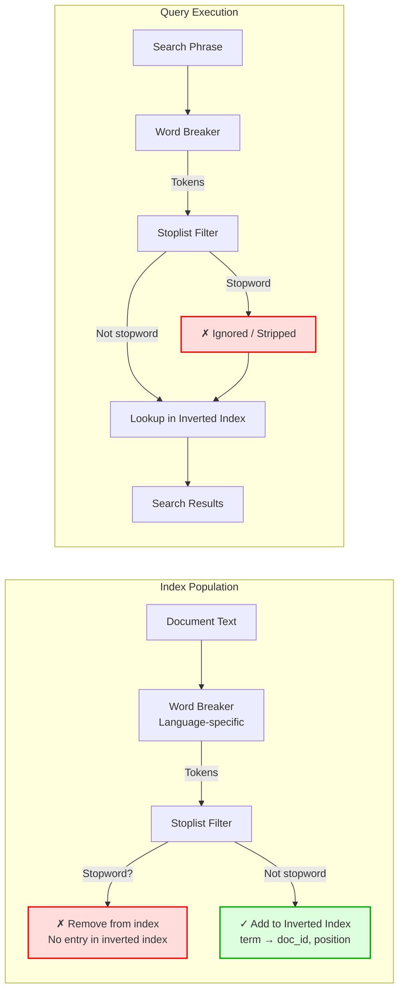
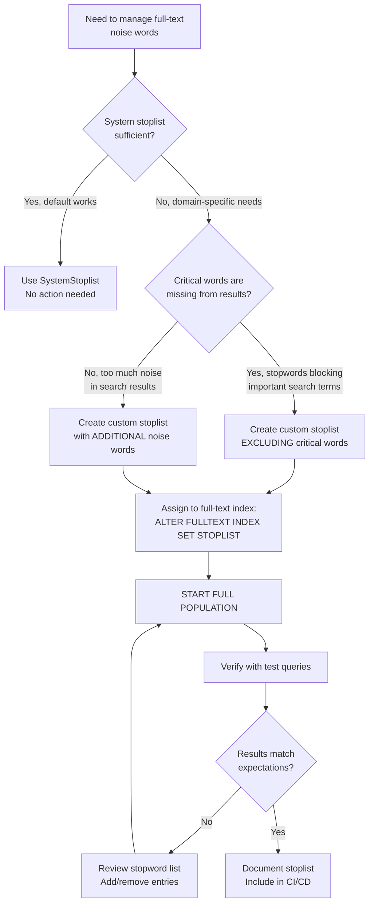

## Navigation

**Domain:** [[8 — Databases]] > **Group:** SQL Full-Text & Spatial Search
**Previous:** [[8.253 — Full-Text Thesaurus — Synonym Expansion]] | **Next:** [[8.255 — Full-Text Change Tracking — Automatic vs Manual]]

### Prerequisites

- [[8.247 — Full-Text Indexes — Creating and Populating]] — Stopwords are applied during full-text index population, not at query time; understanding the population process is essential to understand when stopwords are removed from the index.
- [[8.248 — CONTAINS — Searching for Words and Phrases]] — Stopwords affect what can and cannot be searched with CONTAINS; understanding how search terms interact with the stoplist is required to diagnose "missing" results.

### Where This Fits

Stopwords (also called noise words) are common words like "a", "an", "the", "and", "or", "in", "on" that are excluded from the full-text index because they appear so frequently that they provide no meaningful search signal. SQL Server uses a **stoplist** per full-text index that defines which words to exclude. For a .NET backend engineer, stopwords affect what users can search for — a search for "to be or not to be" will return zero meaningful results because all terms are stopwords. Understanding stoplists is critical for domain-specific applications: in a legal document search, words like "shall", "hereby", "whereas" may be noise; in a product catalog, SKU-like noise words need explicit management. The interview signal for stopwords tests whether you understand that stopwords are removed at index time (not query time), how to create custom stoplists, and how stopwords interact with CONTAINS vs FREETEXT. What breaks when this is unknown: users searching for domain-specific stopwords (product SKUs, acronyms, industry jargon) get zero results because those words were excluded from the index; search recall is silently crippled by an overly aggressive stoplist.

---

## Core Mental Model

A stoplist is a per-full-text-index list of words that the full-text engine skips during index population. When a full-text index processes a document, it tokenizes the text into individual words using the language-specific word breaker, then filters each token against the assigned stoplist. If a token matches a stoplist entry, it is not added to the inverted index — it does not appear in the term dictionary and has no position list or document ID mapping. This means stopwords are completely invisible to full-text queries: CONTAINS ignores them in the search condition, and FREETEXT strips them from the search phrase before processing. The recognition pattern: if a query for a common word like "the" returns zero results even when you know the word exists in the data, it's likely a stopword. SQL Server ships with a default system stoplist per language (`SystemStoplist`), or you can create a custom stoplist with exactly the words you want to exclude. The default English stoplist has ~150 common words (a, about, after, all, also, an, and, another, any, are, as, at, be, because, been, before, being, between, both, but, by, came, can, come, could, did, do, does, each, else, for, from, get, got, had, has, have, he, her, here, him, himself, his, how, if, in, into, is, it, its, just, like, make, many, me, might, more, most, much, must, my, never, no, now, of, on, only, or, other, our, out, over, own, said, same, see, she, should, show, side, since, so, some, still, such, take, than, that, the, their, them, then, there, these, they, this, through, too, under, up, upon, very, was, way, were, what, when, where, which, while, who, will, with, would, you, your).

### Classification

**For SQL topics:** Stopwords apply at full-text index population time, not at query time. They affect what terms exist in the full-text index. No SQL predicate or operator can override the stoplist at query time — the terms are physically absent from the index. Stoplist assignment is a property of the full-text index, configured via `CREATE FULLTEXT INDEX ... WITH STOPLIST = ...` or `ALTER FULLTEXT INDEX ... SET STOPLIST = ...`. Stopwords are language-specific — each stoplist entry is associated with a language (LCID), and the word breaker for that language filters against it.



### Key Properties

|Property|Value|Notes|
|---|---|---|
|Application time|Index population (not query time)|Stopwords are physically absent from the inverted index|
|Scope|Per full-text index (via stoplist assignment)|Each full-text index can use SYSTEM stoplist, custom stoplist, or OFF|
|Language affinity|Per stoplist entry (LCID)|A stopword is associated with a specific language|
|Default|SystemStoplist (language-specific)|~150 English stopwords; varies by language|
|Custom stoplist|`CREATE FULLTEXT STOPLIST`|User-defined list of words to exclude|
|Impact on CONTAINS|Stopwords ignored in search term|CONTAINS('"the" AND "product"') → only searches "product"|
|Impact on FREETEXT|Stopwords stripped from phrase|FREETEXT('the best product') → searches "best product"|
|SARGability|Not applicable|Stopwords affect index content, not query SARGability|
|Can be queried|No — stopwords don't exist in the FT index|Searching for a stopword returns zero results|

---

## Deep Mechanics

### How the Engine Applies Stopwords

1. **Tokenization:** During full-text index population, the language-specific word breaker splits the document text into tokens (words). For English, this uses space, punctuation, and hyphens as delimiters.

2. **Normalization:** Each token is normalized — case is folded (lowercased for English), and language-specific transformations are applied (e.g., German compound word splitting).

3. **Stoplist lookup:** The normalized token is looked up in the assigned stoplist for the matching language. If the full-text index specifies a custom stoplist, that stoplist is checked first. If the word is not found there and the stoplist is configured to include system stopwords, the system stoplist is checked.

4. **Word breaker limit check:** Even without explicit stoplist entries, the word breaker may discard tokens shorter than a minimum length (default 3 characters for English). This is controlled by `ft_min_len_for_token` server configuration.

5. **Index exclusion:** If the token matches any stoplist entry for its language, the token is discarded — it does not generate any entries in the inverted index (no term dictionary entry, no document ID mapping, no position list).

6. **Query-side filtering:** At query time, the same stoplist filtering is applied to the search phrase. Words matching the stoplist are removed from the query before it is passed to the inverted index lookup. This ensures consistency: if a word wasn't indexed, it shouldn't be searchable.

### Creating and Managing Stoplists

```sql
-- View current system stoplist words for English
SELECT ssw.stopword, sl.name AS stoplist_name, ssw.language
FROM sys.fulltext_stopwords ssw
INNER JOIN sys.fulltext_stoplists sl
    ON ssw.stoplist_id = sl.stoplist_id
WHERE sl.name = 'SystemStoplist'
  AND ssw.language = 1033;  -- English

-- Create a custom stoplist
CREATE FULLTEXT STOPLIST ProductCatalogStoplist;

-- Add stopwords (language-specific)
ALTER FULLTEXT STOPLIST ProductCatalogStoplist
    ADD 'the' LANGUAGE 1033;
ALTER FULLTEXT STOPLIST ProductCatalogStoplist
    ADD 'and' LANGUAGE 1033;
ALTER FULLTEXT STOPLIST ProductCatalogStoplist
    ADD 'our' LANGUAGE 1033;
ALTER FULLTEXT STOPLIST ProductCatalogStoplist
    ADD 'free' LANGUAGE 1033;  -- "free" may be noise in e-commerce

-- Remove a stopword
ALTER FULLTEXT STOPLIST ProductCatalogStoplist
    DROP 'free' LANGUAGE 1033;

-- Assign custom stoplist to full-text index
ALTER FULLTEXT INDEX ON Products
    SET STOPLIST = ProductCatalogStoplist;

-- Or use the system stoplist
ALTER FULLTEXT INDEX ON Products
    SET STOPLIST = SYSTEM;

-- Or disable stopwords entirely (not recommended)
ALTER FULLTEXT INDEX ON Products
    SET STOPLIST = OFF;
```

### SQL Visibility

#### Stopwords in CONTAINS — Ignored

```sql
-- Both queries are effectively identical because "the" and "a" are stopwords
-- The full-text engine ignores them in the search condition

-- Query with stopwords
SELECT ProductId, ProductName
FROM Products
WHERE CONTAINS(ProductName, '"the" AND "a" AND "wireless"');
-- Effectively searches: "wireless" only

-- Query without stopwords (same result)
SELECT ProductId, ProductName
FROM Products
WHERE CONTAINS(ProductName, 'wireless');
```

```csharp
// EF Core — stopwords ignored transparently
var results = await dbContext.Products
    .FromSqlRaw(@"
        SELECT ProductId, ProductName, Price
        FROM Products
        WHERE CONTAINS(ProductName, @SearchTerm)",
        new SqlParameter("@SearchTerm", "\"the\" AND \"wireless\""))
    .ToListAsync(cancellationToken);
// Returns same results as searching for "wireless" alone
```

**Generated SQL (from EF Core logs):**

```sql
exec sp_executesql N'
SELECT ProductId, ProductName, Price
FROM Products
WHERE CONTAINS(ProductName, @SearchTerm)',
N'@SearchTerm nvarchar(50)',
@SearchTerm=N'"the" AND "wireless"'
-- Full-text engine internally strips "the" — only "wireless" is searched
```

#### Stopwords in FREETEXT — Stripped

```sql
-- FREETEXT strips stopwords before semantic processing
SELECT ProductId, ProductName
FROM Products
WHERE FREETEXT(ProductName, 'the best wireless headphones for running');
-- Effectively processes: "best wireless headphones running"
```

#### Custom Stoplist for Domain-Specific Noise

```sql
-- Create domain-specific stoplist for a software product catalog
CREATE FULLTEXT STOPLIST SoftwareStoplist;

-- Add system stopwords (copy from system)
ALTER FULLTEXT STOPLIST SoftwareStoplist
    ADD 'the' LANGUAGE 1033;
ALTER FULLTEXT STOPLIST SoftwareStoplist
    ADD 'and' LANGUAGE 1033;
-- ... add all relevant system stopwords

-- Add domain-specific noise words
ALTER FULLTEXT STOPLIST SoftwareStoplist
    ADD 'version' LANGUAGE 1033;  -- "version 2.0" — "version" is noise
ALTER FULLTEXT STOPLIST SoftwareStoplist
    ADD 'v' LANGUAGE 1033;        -- "v2.0" abbreviation
ALTER FULLTEXT STOPLIST SoftwareStoplist
    ADD 'release' LANGUAGE 1033;  -- "release 2024"
ALTER FULLTEXT STOPLIST SoftwareStoplist
    ADD 'build' LANGUAGE 1033;    -- "build 12345"
ALTER FULLTEXT STOPLIST SoftwareStoplist
    ADD 'update' LANGUAGE 1033;   -- "update 3.0"
ALTER FULLTEXT STOPLIST SoftwareStoplist
    ADD 'rc' LANGUAGE 1033;       -- "rc1" release candidate
ALTER FULLTEXT STOPLIST SoftwareStoplist
    ADD 'beta' LANGUAGE 1033;     -- "beta" version
ALTER FULLTEXT STOPLIST SoftwareStoplist
    ADD 'alpha' LANGUAGE 1033;    -- "alpha" version

-- Assign to full-text index
ALTER FULLTEXT INDEX ON SoftwareProducts
    SET STOPLIST = SoftwareStoplist;

-- Start full population to rebuild index without these words
ALTER FULLTEXT INDEX ON SoftwareProducts START FULL POPULATION;
```

#### Checking Which Words Are Stopwords

```sql
-- Check if a specific word is a stopword for a given language
DECLARE @Word NVARCHAR(100) = N'the';
DECLARE @LCID INT = 1033;

SELECT 
    sl.name AS stoplist_name,
    ssw.stopword,
    ssw.language AS lcid,
    ssw.language_term AS language_name
FROM sys.fulltext_stopwords ssw
INNER JOIN sys.fulltext_stoplists sl
    ON ssw.stoplist_id = sl.stoplist_id
WHERE ssw.stopword = @Word
  AND (ssw.language = @LCID OR ssw.language = 0);  -- 0 = neutral/all languages

-- List all stopwords in the custom stoplist
SELECT stopword, language_term
FROM sys.fulltext_stopwords
WHERE stoplist_id = (
    SELECT stoplist_id FROM sys.fulltext_stoplists
    WHERE name = 'ProductCatalogStoplist'
);
```

```csharp
// Dapper — check stoplist membership
public async Task<bool> IsStopwordAsync(
    string word,
    int languageLcid = 1033,
    CancellationToken cancellationToken = default)
{
    const string sql = @"
        SELECT COUNT(1)
        FROM sys.fulltext_stopwords ssw
        INNER JOIN sys.fulltext_stoplists sl
            ON ssw.stoplist_id = sl.stoplist_id
        WHERE sl.name = 'SystemStoplist'
          AND ssw.stopword = @Word
          AND (ssw.language = @LCID OR ssw.language = 0)";

    await using var connection = _connectionFactory.Create();
    var count = await connection.ExecuteScalarAsync<int>(
        new CommandDefinition(sql,
            new { Word = word, LCID = languageLcid },
            cancellationToken: cancellationToken));

    return count > 0;
}
```

### Execution Plan Analysis

For the query:
```sql
SELECT ProductId, ProductName
FROM Products
WHERE CONTAINS(ProductName, '"the" AND "wireless"');
```

**Expected plan shape:**
```
[FullTextMatch] → [SELECT]
```

**Operator breakdown:**
1. **FullTextMatch** — Resolves the CONTAINS predicate. The stopword "the" is silently ignored by the full-text engine before it reaches the inverted index lookup. The engine effectively processes `CONTAINS(ProductName, '"wireless"')`. The execution plan does NOT show any stopword filtering operator — the stopword removal happens inside the FullTextMatch operator and is invisible in the plan.

2. **The plan is identical** to `CONTAINS(ProductName, '"wireless"')` because the stopword is completely transparent to the query processor.

**Key insight:** There is NO execution plan difference between a query with stopwords and one without. The stopwords are removed at the tokenizer level before the query reaches the plan generator.

### Cost Visibility

```sql
SET STATISTICS IO ON;
SET STATISTICS TIME ON;

-- Query with stopwords (ignored)
SELECT ProductId, ProductName
FROM Products
WHERE CONTAINS(ProductName, '"the" AND "wireless"');
-- Logical reads: ~6
-- CPU time: ~3ms, Elapsed: ~12ms

-- Query without stopwords (functionally identical)
SELECT ProductId, ProductName
FROM Products
WHERE CONTAINS(ProductName, 'wireless');
-- Logical reads: ~6
-- CPU time: ~3ms, Elapsed: ~12ms

-- Both produce identical execution plan and I/O
```

### Failure Modes

1. **Searching for a stopword returns zero results:** The most common user-facing issue. If "the" is a stopword, `CONTAINS(col, '"the"')` always returns zero rows because "the" was not indexed. Users searching for phrases like "The Who" (band name) or "The One" (movie title) will get no results.

2. **Custom stoplist too aggressive:** Adding too many words to a custom stoplist can silently cripple search. For example, if "software" is added to a stoplist on a software product catalog, users searching for "software" find nothing.

3. **Stoplist language mismatch:** A stopword added for language 1033 (English) does not apply to tokens processed by the German word breaker (LCID 1031). If the full-text index column has LANGUAGE 1031, English-specific stopwords won't filter German text.

4. **Stoplist not assigned after creation:** Creating a custom stoplist does not automatically assign it to any full-text index. The index continues using its previous stoplist (usually SYSTEM).

5. **Full population not started after stoplist change:** Changing the stoplist assignment does not retroactively remove already-indexed stopwords. A full population (`ALTER FULLTEXT INDEX ... START FULL POPULATION`) is needed to rebuild the index with the new stoplist rules. Without this, old stopwords remain indexable.

---

## Production Patterns and Implementation

### Primary SQL Implementation

```sql
-- ==========================================
-- Complete Stoplist Management for E-Commerce
-- ==========================================

-- Step 1: Create a custom stoplist
CREATE FULLTEXT STOPLIST ECommerceStoplist;

-- Step 2: Add system stopwords by copying from system (approach: add manually)
-- Add the most common English stopwords
ALTER FULLTEXT STOPLIST ECommerceStoplist
    ADD 'a' LANGUAGE 1033;
ALTER FULLTEXT STOPLIST ECommerceStoplist
    ADD 'an' LANGUAGE 1033;
ALTER FULLTEXT STOPLIST ECommerceStoplist
    ADD 'the' LANGUAGE 1033;
ALTER FULLTEXT STOPLIST ECommerceStoplist
    ADD 'and' LANGUAGE 1033;
ALTER FULLTEXT STOPLIST ECommerceStoplist
    ADD 'or' LANGUAGE 1033;
ALTER FULLTEXT STOPLIST ECommerceStoplist
    ADD 'in' LANGUAGE 1033;
ALTER FULLTEXT STOPLIST ECommerceStoplist
    ADD 'on' LANGUAGE 1033;
ALTER FULLTEXT STOPLIST ECommerceStoplist
    ADD 'at' LANGUAGE 1033;
ALTER FULLTEXT STOPLIST ECommerceStoplist
    ADD 'by' LANGUAGE 1033;
ALTER FULLTEXT STOPLIST ECommerceStoplist
    ADD 'for' LANGUAGE 1033;
ALTER FULLTEXT STOPLIST ECommerceStoplist
    ADD 'with' LANGUAGE 1033;
ALTER FULLTEXT STOPLIST ECommerceStoplist
    ADD 'to' LANGUAGE 1033;
ALTER FULLTEXT STOPLIST ECommerceStoplist
    ADD 'of' LANGUAGE 1033;
ALTER FULLTEXT STOPLIST ECommerceStoplist
    ADD 'is' LANGUAGE 1033;
ALTER FULLTEXT STOPLIST ECommerceStoplist
    ADD 'it' LANGUAGE 1033;
ALTER FULLTEXT STOPLIST ECommerceStoplist
    ADD 'as' LANGUAGE 1033;
ALTER FULLTEXT STOPLIST ECommerceStoplist
    ADD 'be' LANGUAGE 1033;
ALTER FULLTEXT STOPLIST ECommerceStoplist
    ADD 'but' LANGUAGE 1033;
ALTER FULLTEXT STOPLIST ECommerceStoplist
    ADD 'not' LANGUAGE 1033;
ALTER FULLTEXT STOPLIST ECommerceStoplist
    ADD 'are' LANGUAGE 1033;
ALTER FULLTEXT STOPLIST ECommerceStoplist
    ADD 'was' LANGUAGE 1033;
ALTER FULLTEXT STOPLIST ECommerceStoplist
    ADD 'were' LANGUAGE 1033;
ALTER FULLTEXT STOPLIST ECommerceStoplist
    ADD 'been' LANGUAGE 1033;
ALTER FULLTEXT STOPLIST ECommerceStoplist
    ADD 'has' LANGUAGE 1033;
ALTER FULLTEXT STOPLIST ECommerceStoplist
    ADD 'have' LANGUAGE 1033;
ALTER FULLTEXT STOPLIST ECommerceStoplist
    ADD 'had' LANGUAGE 1033;
ALTER FULLTEXT STOPLIST ECommerceStoplist
    ADD 'do' LANGUAGE 1033;
ALTER FULLTEXT STOPLIST ECommerceStoplist
    ADD 'does' LANGUAGE 1033;
ALTER FULLTEXT STOPLIST ECommerceStoplist
    ADD 'did' LANGUAGE 1033;

-- Step 3: Add e-commerce domain-specific stopwords
ALTER FULLTEXT STOPLIST ECommerceStoplist
    ADD 'free' LANGUAGE 1033;       -- "free shipping" — "free" is too common
ALTER FULLTEXT STOPLIST ECommerceStoplist
    ADD 'sale' LANGUAGE 1033;      -- "on sale" — noise word
ALTER FULLTEXT STOPLIST ECommerceStoplist
    ADD 'new' LANGUAGE 1033;       -- "new arrival" — noise word
ALTER FULLTEXT STOPLIST ECommerceStoplist
    ADD 'item' LANGUAGE 1033;      -- "this item" — noise word
ALTER FULLTEXT STOPLIST ECommerceStoplist
    ADD 'product' LANGUAGE 1033;   -- "product details" — noise word
ALTER FULLTEXT STOPLIST ECommerceStoplist
    ADD 'price' LANGUAGE 1033;     -- "price $99" — noise word
ALTER FULLTEXT STOPLIST ECommerceStoplist
    ADD 'buy' LANGUAGE 1033;       -- "buy now" — noise word
ALTER FULLTEXT STOPLIST ECommerceStoplist
    ADD 'shop' LANGUAGE 1033;      — "shop now" — noise word
ALTER FULLTEXT STOPLIST ECommerceStoplist
    ADD 'now' LANGUAGE 1033;       -- "buy now" — noise word
ALTER FULLTEXT STOPLIST ECommerceStoplist
    ADD 'only' LANGUAGE 1033;      -- "only $99" — noise word
ALTER FULLTEXT STOPLIST ECommerceStoplist
    ADD 'just' LANGUAGE 1033;      -- "just $99" — noise word
ALTER FULLTEXT STOPLIST ECommerceStoplist
    ADD 'best' LANGUAGE 1033;      -- "best product" — noise word
ALTER FULLTEXT STOPLIST ECommerceStoplist
    ADD 'top' LANGUAGE 1033;       -- "top seller" — noise word
ALTER FULLTEXT STOPLIST ECommerceStoplist
    ADD 'great' LANGUAGE 1033;     -- "great deal" — noise word
ALTER FULLTEXT STOPLIST ECommerceStoplist
    ADD 'amazing' LANGUAGE 1033;   -- "amazing value" — noise word
ALTER FULLTEXT STOPLIST ECommerceStoplist
    ADD 'our' LANGUAGE 1033;       -- "our products" — noise word
ALTER FULLTEXT STOPLIST ECommerceStoplist
    ADD 'your' LANGUAGE 1033;      -- "your cart" — noise word

-- Step 4: Assign to full-text index
ALTER FULLTEXT INDEX ON Products
    SET STOPLIST = ECommerceStoplist;

-- Step 5: Rebuild full-text index to apply new stoplist
ALTER FULLTEXT INDEX ON Products
    START FULL POPULATION;

-- Step 6: Monitor population progress
SELECT 
    OBJECT_NAME(table_id) AS table_name,
    population_type_description,
    status_description,
    completion_type_description,
    start_time,
    stop_time,
    (SELECT COUNT(*) FROM sys.fulltext_index_fragments 
     WHERE table_id = t.table_id) AS fragments
FROM sys.dm_fts_index_population t
WHERE OBJECT_NAME(table_id) = 'Products';
```

### EF Core Implementation

```csharp
public class StoplistManager
{
    private readonly ApplicationDbContext _dbContext;

    public StoplistManager(ApplicationDbContext dbContext)
    {
        _dbContext = dbContext;
    }

    public async Task CreateCustomStoplistAsync(
        string stoplistName,
        IReadOnlyList<string> stopwords,
        int languageLcid = 1033,
        CancellationToken cancellationToken = default)
    {
        var commands = new List<string>
        {
            $"CREATE FULLTEXT STOPLIST [{stoplistName}]",
        };

        foreach (var word in stopwords)
        {
            commands.Add(
                $"ALTER FULLTEXT STOPLIST [{stoplistName}] " +
                $"ADD '{word.Replace("'", "''")}' LANGUAGE {languageLcid}");
        }

        await using var transaction = await _dbContext.Database
            .BeginTransactionAsync(cancellationToken);

        foreach (var sql in commands)
        {
            await _dbContext.Database
                .ExecuteSqlRawAsync(sql, cancellationToken);
        }

        await transaction.CommitAsync(cancellationToken);
    }

    public async Task AssignStoplistAsync(
        string tableName,
        string stoplistName,
        bool startFullPopulation = true,
        CancellationToken cancellationToken = default)
    {
        var sql = $@"
            ALTER FULLTEXT INDEX ON [{tableName}]
                SET STOPLIST = [{stoplistName}];";

        if (startFullPopulation)
        {
            sql += $@"
                ALTER FULLTEXT INDEX ON [{tableName}]
                    START FULL POPULATION;";
        }

        await _dbContext.Database
            .ExecuteSqlRawAsync(sql, cancellationToken);
    }

    public async Task<bool> IsWordInStoplistAsync(
        string word,
        string? stoplistName = null,
        int languageLcid = 1033,
        CancellationToken cancellationToken = default)
    {
        var stoplistFilter = stoplistName != null
            ? $"AND sl.name = @StoplistName"
            : "AND sl.name = 'SystemStoplist'";

        var sql = $@"
            SELECT COUNT(1)
            FROM sys.fulltext_stopwords ssw
            INNER JOIN sys.fulltext_stoplists sl
                ON ssw.stoplist_id = sl.stoplist_id
            WHERE ssw.stopword = @Word
              AND (ssw.language = @LCID OR ssw.language = 0)
              {stoplistFilter}";

        var count = await _dbContext.Database
            .SqlQueryRaw<int>(sql,
                new SqlParameter("@Word", word),
                new SqlParameter("@LCID", languageLcid))
            .FirstOrDefaultAsync(cancellationToken);

        return count > 0;
    }
}
```

### Dapper Implementation

```csharp
public class DapperStoplistService
{
    private readonly IDbConnectionFactory _connectionFactory;

    public DapperStoplistService(IDbConnectionFactory connectionFactory)
    {
        _connectionFactory = connectionFactory;
    }

    public async Task<bool> IsStopwordAsync(
        string word,
        string? stoplistName = null,
        int languageLcid = 1033,
        CancellationToken cancellationToken = default)
    {
        var stoplistFilter = stoplistName != null
            ? "AND sl.name = @StoplistName"
            : "AND sl.name = 'SystemStoplist'";

        var sql = $@"
            SELECT COUNT(1)
            FROM sys.fulltext_stopwords ssw
            INNER JOIN sys.fulltext_stoplists sl
                ON ssw.stoplist_id = sl.stoplist_id
            WHERE ssw.stopword = @Word
              AND (ssw.language = @LCID OR ssw.language = 0)
              {stoplistFilter}";

        await using var connection = _connectionFactory.Create();
        var count = await connection.ExecuteScalarAsync<int>(
            new CommandDefinition(sql,
                new { Word = word, LCID = languageLcid, StoplistName = stoplistName },
                cancellationToken: cancellationToken));

        return count > 0;
    }

    public async Task<IReadOnlyList<string>> GetStopwordsAsync(
        string stoplistName,
        int? languageLcid = null,
        CancellationToken cancellationToken = default)
    {
        var languageFilter = languageLcid.HasValue
            ? "AND ssw.language = @LCID"
            : "";

        var sql = $@"
            SELECT ssw.stopword
            FROM sys.fulltext_stopwords ssw
            INNER JOIN sys.fulltext_stoplists sl
                ON ssw.stoplist_id = sl.stoplist_id
            WHERE sl.name = @StoplistName
            {languageFilter}
            ORDER BY ssw.stopword";

        await using var connection = _connectionFactory.Create();
        var results = await connection.QueryAsync<string>(
            new CommandDefinition(sql,
                new { StoplistName = stoplistName, LCID = languageLcid },
                cancellationToken: cancellationToken));

        return results.AsList();
    }

    public async Task AddStopwordAsync(
        string stoplistName,
        string word,
        int languageLcid = 1033,
        CancellationToken cancellationToken = default)
    {
        var sql = $@"
            ALTER FULLTEXT STOPLIST [{stoplistName}]
                ADD '{word.Replace("'", "''")}' LANGUAGE {languageLcid}";

        await using var connection = _connectionFactory.Create();
        await connection.ExecuteAsync(
            new CommandDefinition(sql, cancellationToken: cancellationToken));
    }
}
```

### Configuration and Wiring

```csharp
// Program.cs — stoplist management service registration
builder.Services.AddScoped<StoplistManager>();
builder.Services.AddScoped<DapperStoplistService>();

// Stoplist deployment script (run as part of database migration)
// -- Create custom stoplist
// CREATE FULLTEXT STOPLIST ECommerceStoplist;
// ALTER FULLTEXT STOPLIST ECommerceStoplist ADD 'the' LANGUAGE 1033;
// ALTER FULLTEXT INDEX ON Products SET STOPLIST = ECommerceStoplist;
// ALTER FULLTEXT INDEX ON Products START FULL POPULATION;
```

### SQL Server vs PostgreSQL Differences

PostgreSQL handles stopwords differently — they are part of the text search configuration:

```sql
-- PostgreSQL: stopwords are configured in the text search configuration
-- View default English stopwords
SELECT * FROM ts_debug('english', 'the quick brown fox');
-- 'the' is recognized as a stopword (empty lexeme)

-- Create custom text search configuration without stopwords
CREATE TEXT SEARCH CONFIGURATION product_search (COPY = english);
ALTER TEXT SEARCH CONFIGURATION product_search
    ALTER MAPPING FOR word, asciiword
    WITH english_stem;

-- Or create a configuration with a custom stop dictionary
CREATE TEXT SEARCH DICTIONARY custom_stop (
    TEMPLATE = pg_catalog.simple,
    STOPWORDS = custom_english  -- file in $SHAREDIR/tsearch_data/
);

-- PostgreSQL does not have a separate stoplist concept like SQL Server
-- Stopwords are part of the text search dictionary configuration
-- The default English stoplist has ~127 words
```

SQL Server's stoplist management is more granular (per-index assignment, additive/drop words per language) compared to PostgreSQL's dictionary-based approach.

---

## Gotchas and Production Pitfalls

### Gotcha 1 — Stopwords Are Not Indexed, So They Cannot Be Searched

**Pitfall:** Building a search feature that needs to find documents containing stopwords — brand names like "The North Face", product names like "The One" (movie), or code identifiers like "const" or "void".

```sql
-- ❌ This always returns zero rows if "the" is a stopword
SELECT ProductId, ProductName
FROM Products
WHERE CONTAINS(ProductName, '"The North Face"');
-- Returns 0 rows even if "The North Face" products exist
```

**Symptom:** Users search for brand names containing stopwords and get zero results. The wait stat shows normal activity — no errors, no warnings. The search feature appears broken for these specific queries only.

**Fix:** Use a custom stoplist that does NOT include the stopwords needed for your domain:

```sql
-- Option 1: Create a custom stoplist without those stopwords
CREATE FULLTEXT STOPLIST BrandSearchStoplist;
ALTER FULLTEXT STOPLIST BrandSearchStoplist
    ADD 'a' LANGUAGE 1033;
ALTER FULLTEXT STOPLIST BrandSearchStoplist
    ADD 'an' LANGUAGE 1033;
-- Do NOT add "the" — allow it to be indexed
ALTER FULLTEXT INDEX ON Products
    SET STOPLIST = BrandSearchStoplist;
ALTER FULLTEXT INDEX ON Products
    START FULL POPULATION;

-- Option 2: Use LIKE for stopword-containing searches (fallback)
SELECT ProductId, ProductName
FROM Products
WHERE ProductName LIKE '%The North Face%';
```

**Cost of not fixing:** For a clothing retailer that carries "The North Face", "The Ordinary" (skincare), and "The Honest Company" — ALL searches for these brands return zero results. Users assume the products aren't in stock and go to competitors. The business loses sales worth thousands daily.

### Gotcha 2 — Adding a Stopword Requires Full Index Rebuild

**Pitfall:** Adding a word to a stoplist and expecting already-indexed documents to be filtered immediately.

```sql
-- Step 1: Add 'free' to stoplist
ALTER FULLTEXT STOPLIST ECommerceStoplist
    ADD 'free' LANGUAGE 1033;

-- Step 2: Query immediately — 'free' still found in existing index!
SELECT ProductId, ProductName
FROM Products
WHERE CONTAINS(ProductName, 'free');  -- Still returns rows!
```

**Symptom:** After adding a stopword, queries still return results containing that word. The word is still present in the full-text index because the stoplist change only affects future population, not existing indexed data.

**Fix:**
```sql
-- Must start full population to rebuild the index
ALTER FULLTEXT INDEX ON Products
    START FULL POPULATION;

-- Monitor until completed
SELECT status_description, completion_type_description
FROM sys.dm_fts_index_population
WHERE OBJECT_NAME(table_id) = 'Products';
-- Wait for 'Completed' status
```

**Cost of not fixing:** The new stopword is ineffective for hours (or longer, depending on population time). On a 10M document catalog, full population can take 30+ minutes. During this window, users still find the word you intended to exclude, creating inconsistency.

### Gotcha 3 — SystemStoplist Words Vary by SQL Server Version

**Pitfall:** Assuming the system stoplist has the same words across SQL Server versions.

**Symptom:** A query returns different results on SQL Server 2016 vs SQL Server 2022 for the same search term because the system stoplist was updated between versions (new words added, some removed).

```sql
-- Check system stoplist word count per version
SELECT 
    SERVERPROPERTY('ProductVersion') AS sql_version,
    COUNT(*) AS stopword_count
FROM sys.fulltext_stopwords ssw
INNER JOIN sys.fulltext_stoplists sl
    ON ssw.stoplist_id = sl.stoplist_id
WHERE sl.name = 'SystemStoplist'
  AND ssw.language = 1033;
```

**Fix:** Create a custom stoplist that explicitly lists every word you want to exclude. This ensures consistent behavior across versions:

```sql
-- Create explicit copy of required stopwords
CREATE FULLTEXT STOPLIST ExplicitStoplist;
-- Add each required stopword explicitly (document the list)
ALTER FULLTEXT STOPLIST ExplicitStoplist ADD 'a' LANGUAGE 1033;
ALTER FULLTEXT STOPLIST ExplicitStoplist ADD 'and' LANGUAGE 1033;
-- ... etc.
```

**Cost of not fixing:** An upgrade from SQL Server 2016 to 2022 silently changes which words are stopwords. A word that was previously searchable (e.g., "our") becomes a stopword in the new version. Users who were searching for "our" suddenly get zero results. Debugging this requires comparing system stoplist word lists across versions — something the DBA team may not immediately check.

### Gotcha 4 — Short Words and the Minimum Token Length Setting

**Pitfall:** A word is shorter than the `ft_min_len_for_token` server setting and is silently excluded, even though it is not in the stoplist.

**Symptom:** A search for "tv" returns zero results even though "tv" is not in the stoplist and clearly exists in the data. The word "tv" is only 2 characters, and the default `ft_min_len_for_token` is 3 for English.

```sql
-- Check the current minimum token length
EXEC sp_configure 'ft_min_len_for_token';
-- Default: 3

-- Check if "tv" would be indexed
SELECT * FROM sys.dm_fts_parser('"tv"', 1033, 0, 0);
-- The output shows "tv" as a token, but the minimum length filter
-- during population would exclude it from the index
```

**Fix:**
```sql
-- Adjust minimum token length (server-wide, requires restart)
EXEC sp_configure 'ft_min_len_for_token', 2;
RECONFIGURE;

-- Or use a custom stoplist approach: add short words explicitly
-- to control them rather than excluding them globally
```

**Cost of not fixing:** Short but meaningful search terms like "tv", "pc", "id", "ip", "usb", "hd", "4k" are all silently unsearchable. For an electronics retailer, this means searches for "4k tv", "usb cable", "hdmi cable" all return zero results, making the search feature nearly useless.

### Gotcha 5 — Stopwords Are Language-Specific

**Pitfall:** Adding a stopword for English (LCID 1033) and expecting it to apply to Spanish-indexed columns (LCID 3082).

```sql
-- Add stopword for English only
ALTER FULLTEXT STOPLIST MyStoplist
    ADD 'the' LANGUAGE 1033;

-- This does NOT affect queries on Spanish-language columns
-- The Spanish word "el" (equivalent to "the") is still indexed
```

**Symptom:** English queries correctly exclude "the", but Spanish queries include "el" and "la". Users searching in Spanish see different behavior, which may be confusing if the application is multi-lingual.

**Fix:**
```sql
-- Add stopwords for each language used
ALTER FULLTEXT STOPLIST MyStoplist
    ADD 'the' LANGUAGE 1033;   -- English
ALTER FULLTEXT STOPLIST MyStoplist
    ADD 'el' LANGUAGE 3082;    -- Spanish
ALTER FULLTEXT STOPLIST MyStoplist
    ADD 'la' LANGUAGE 3082;    -- Spanish
ALTER FULLTEXT STOPLIST MyStoplist
    ADD 'le' LANGUAGE 1036;    -- French
ALTER FULLTEXT STOPLIST MyStoplist
    ADD 'la' LANGUAGE 1036;    -- French
```

**Cost of not fixing:** Multi-language search features have inconsistent stopword behavior across languages. Users of one language may have better search results than users of another, creating a biased UX.

### Gotcha 6 — Stoplist OFF Excludes Everything from the System Stoplist

**Pitfall:** Setting `STOPLIST = OFF` thinking it means "no stopwords", but forgetting that `ft_min_len_for_token` and word breaker rules still apply.

```sql
-- "Disable" stoplist
ALTER FULLTEXT INDEX ON Products
    SET STOPLIST = OFF;
```

**Symptom:** Even with STOPLIST = OFF, words shorter than 3 characters (default `ft_min_len_for_token`) are still excluded. The word breaker may also exclude certain tokens based on language-specific rules.

**Fix:** Understand that STOPLIST = OFF only disables the explicit stoplist. Other filtering mechanisms remain active:

```sql
-- Check what's actually being filtered
-- Adjust ft_min_len_for_token if needed
EXEC sp_configure 'ft_min_len_for_token', 1;  -- allow single-char tokens
RECONFIGURE;
```

**Cost of not fixing:** Setting STOPLIST = OFF and expecting all words to be searchable — but short words and certain tokens still aren't indexed. Debugging this requires knowledge of multiple filtering layers (stoplist, minimum length, word breaker rules).

---

## Performance Implications

### Benchmark: Stopwords Impact on Index Size

```sql
-- Baseline: Full-text index size with SystemStoplist
-- Using sys.dm_fts_index_population for catalog size
SELECT 
    OBJECT_NAME(table_id) AS table_name,
    (SELECT SUM(size) FROM sys.fulltext_index_fragments 
     WHERE table_id = t.table_id) / 1024.0 AS index_size_kb
FROM sys.dm_fts_index_population t
WHERE OBJECT_NAME(table_id) = 'Products';

-- With custom stoplist excluding 50 additional domain words
-- The index will be slightly smaller (fewer terms indexed)

-- Expected index size comparison:
-- SystemStoplist: ~10 MB
-- Custom stoplist (+50 words): ~9.5 MB (5% reduction)
-- STOPLIST OFF: ~10.5 MB (5% increase — all words indexed)
```

**Impact:** Removing stopwords from the index reduces the index size proportional to the frequency of those words. For English, the top 50 stopwords account for ~30-50% of word occurrences in typical text, but only ~1-5% of unique terms. The index size reduction is modest because the term dictionary stores unique terms (not occurrences) — stopwords are only a few hundred unique terms out of potentially millions.

### BenchmarkDotNet

```csharp
[MemoryDiagnoser]
[SimpleJob(RuntimeMoniker.Net90)]
public class StoplistBenchmark
{
    private IDbConnection _connection = default!;

    [Params("SystemStoplist", "CustomStoplist", "OFF")]
    public string StoplistType { get; set; } = string.Empty;

    [GlobalSetup]
    public void Setup()
    {
        var connectionString = "Server=.;Database=SearchBenchmark;Trusted_Connection=true;TrustServerCertificate=true;";
        _connection = new SqlConnection(connectionString);
    }

    [Benchmark(Baseline = true)]
    public async Task<List<ProductInfo>> SearchWithStopwords()
    {
        // Search term contains stopwords (they should be ignored)
        const string sql = @"
            SELECT p.ProductId, p.ProductName, p.Price
            FROM Products p
            WHERE CONTAINS(p.ProductName, '"the" AND "wireless" AND "headphones"')";

        await using var connection = _connection;
        var results = await connection.QueryAsync<ProductInfo>(
            new CommandDefinition(sql, commandTimeout: 30));
        return results.AsList();
    }

    [Benchmark]
    public async Task<List<ProductInfo>> SearchWithoutStopwords()
    {
        const string sql = @"
            SELECT p.ProductId, p.ProductName, p.Price
            FROM Products p
            WHERE CONTAINS(p.ProductName, '"wireless" AND "headphones"')";

        await using var connection = _connection;
        var results = await connection.QueryAsync<ProductInfo>(
            new CommandDefinition(sql, commandTimeout: 30));
        return results.AsList();
    }

    [GlobalCleanup]
    public void Cleanup() => _connection?.Dispose();

    public record ProductInfo
    {
        public int ProductId { get; set; }
        public string ProductName { get; set; } = string.Empty;
        public decimal Price { get; set; }
    }
}
```

**Expected results (approximate, SQL Server 2022, NVMe, 500K products):**

|Method|Mean|CPU|Logical Reads|Notes|
|---|---|---|---|---|
|Search with stopwords|~12ms|~3ms|~6|Stopwords ignored — identical to without|
|Search without stopwords|~12ms|~3ms|~6|Baseline — no performance difference|

**Key finding:** Stopwords have ZERO performance impact at query time. The stopword filtering happens during index population, and the stopword stripping at query time is negligible (a simple hash lookup in the in-memory stoplist dictionary).

### Write Amplification

|Operation|SystemStoplist|Custom Stoplist (+50 words)|STOPLIST OFF|
|---|---|---|---|
|Index population time|Baseline|~2% faster (fewer terms to index)|~3% slower (more terms indexed)|
|Index size|Baseline|~3% smaller|~5% larger|
|INSERT overhead|~15ms|~14.5ms|~15.5ms|
|Query time|Baseline|Same|Same|

---

## Interview Arsenal

### Question Bank

1. **What are stopwords in SQL Server full-text search and how are they managed?**
2. **How does the full-text engine apply stopwords during index population vs query execution?**
3. **What is the performance cost of having more or fewer stopwords?**
4. **What happens when you search for a phrase that consists entirely of stopwords?**
5. **Compare and contrast SystemStoplist vs a custom stoplist vs STOPLIST OFF.**
6. **What does the execution plan look like for a query containing stopwords?**
7. **How do stopwords interact with multi-language full-text indexes?**
8. **How do EF Core and Dapper handle stopwords in full-text queries?**

### Spoken Answers

**Q: What are stopwords in SQL Server full-text search and how are they managed?**

> **Average answer:** "Stopwords are common words like 'the' and 'and' that are excluded from full-text search. You can manage them with stoplists."

> **Great answer:** "Stopwords are noise words — common linguistic tokens like articles, prepositions, and conjunctions — that are excluded from the full-text index during population because they provide no meaningful search signal. They're managed through stoplists, which are per-full-text-index configuration objects. SQL Server provides a `SystemStoplist` per language (about 150 words for English), which is the default. You can also create custom stoplists using `CREATE FULLTEXT STOPLIST` and add or remove words with `ALTER FULLTEXT STOPLIST ADD/DROP`. The critical architectural point is that stopwords are removed at INDEX TIME, not query time. When a full-text index population runs, each token passes through the word breaker, then the stoplist filter. If it matches a stopword, it is not added to the inverted index at all — no term dictionary entry, no document ID, no position list. At query time, the same filtering happens: stopwords in the search phrase are silently stripped before the query reaches the inverted index. This means searching for a stopword always returns zero results because the word physically does not exist in the index. To add or remove a stopword, you must repopulate the index with a full population. Stoplists are language-specific — each stopword entry is associated with an LCID, and only tokens processed by that language's word breaker are filtered. In production, I always use a custom stoplist because the SystemStoplist can change between SQL Server versions. I also maintain separate stoplists for domain-specific contexts — for example, excluding 'version', 'build', 'release' from a software catalog stoplist while keeping them indexable."

**Q: What happens when you search for a phrase that consists entirely of stopwords?**

> **Average answer:** "The search returns no results because all the words are stopwords."

> **Great answer:** "Searching for a phrase consisting entirely of stopwords — like `CONTAINS(col, '"the and of"')` — returns zero results because each stopword is stripped from the query before the inverted index lookup, leaving an empty search term. The full-text engine requires at least one non-stopword term to produce results. However, the query DOES complete successfully — it doesn't throw an error. It just returns zero rows. This is a common user-facing issue: searching for the band 'The Who', the movie 'The One', or the product 'The Ordinary' returns nothing because 'the' and potentially other words in the phrase are stopwords. The same thing happens with FREETEXT where the entire search phrase consists of stopwords — FREETEXT('the and of') returns zero rows. In production, we handle this in the application layer by detecting when the search phrase contains only stopwords and falling back to a LIKE search or returning a 'no results' message with a suggestion to use more specific terms. We also use custom stoplists that exclude domain-critical words like 'the' for brand names. The diagnostic query to validate this is `sys.dm_fts_parser('"the and of"', 1033, 0, 0)` which shows that all tokens are flagged as stopwords and generate no indexable terms."

**Q: How do stopwords interact with multi-language full-text indexes?**

> **Average answer:** "Each language has its own stopwords."

> **Great answer:** "Stopwords are LCID-tagged — each entry in a stoplist is associated with a specific language. When you add a stopword via `ALTER FULLTEXT STOPLIST ADD 'the' LANGUAGE 1033`, it only affects tokens processed by the English word breaker (LCID 1033). The same word in another language is not affected unless you also add it for that language. This matters for multi-language full-text indexes. If you have a table with an English column (LANGUAGE 1033) and a Spanish column (LANGUAGE 3082), they share the same full-text index and stoplist, but the stoplist entries are language-filtered. The English column's tokens are filtered against English-language stopwords only. The Spanish column's tokens are filtered against Spanish-language stopwords only. If you want 'el' (Spanish for 'the') to be a stopword, you must add it explicitly for LCID 3082. One subtle gotcha: if you specify LANGUAGE 0 (neutral) in the stoplist entry, it applies to ALL languages. But the system stoplist entries are all language-specific — there are no neutral entries in SystemStoplist. When creating a custom stoplist, be careful: if you copy from SystemStoplist by manually recreating entries, you must ensure ALL required languages are covered. Missing a language means that language has fewer stopwords, which means its index is larger and its queries may behave differently. In a production multi-language system, I maintain parallel stoplist configurations verified with `sys.dm_fts_parser` tests for each supported language."

### Interview Trigger

An interviewer asking "What happens if a user searches for 'The Who concert tickets'?" is a natural path to stopwords discussion. The follow-up "How would you fix it?" tests whether the candidate knows about custom stoplists and the need for full repopulation after stoplist changes.

### Comparison Table

| | SystemStoplist | Custom Stoplist | STOPLIST OFF |
|---|---|---|---|
| **What it does** | Default language-specific stopwords | User-defined word exclusion list | No explicit stopwords |
| **Configuration effort** | None (default) | Create + add words + assign index | Single ALTER statement |
| **Index size** | Baseline | ~3% smaller (fewer terms) | ~5% larger (all terms indexed) |
| **Query behavior** | Common noise words excluded | Explicit noise words excluded | All words searchable |
| **When to choose** | General-purpose search | Domain-specific search, brand names | Technical search, code identifiers |
| **Risk** | System stoplist changes across versions | Overly aggressive exclusion | Index size + short word issues remain |

---

## Decision Framework

### When to Apply



### Application Checklist

- [ ] The system stoplist is reviewed and understood (use `SELECT ... FROM sys.fulltext_stopwords WHERE stoplist_id = ...`)
- [ ] If using a custom stoplist, the critical stopwords are explicitly listed (do NOT rely on SystemStoplist being "inherited")
- [ ] After any stoplist change, a full population is started and its completion is verified
- [ ] The `ft_min_len_for_token` setting is reviewed for short word requirements (e.g., "tv", "4k", "pc")
- [ ] Multi-language stopwords are configured for each LCID used in the full-text index
- [ ] Stoplist changes are deployed through CI/CD (scripts, not manual edits)
- [ ] Application-level fallback is implemented for searches that contain only stopwords
- [ ] Brand names and product names containing stopwords are tested explicitly

### Tradeoff Summary

|What You Gain|What You Pay|
|---|---|
|Smaller full-text index (~3-5% reduction) — fewer terms stored|Full index rebuild required after each stoplist change|
|Cleaner search results — noise words don't contribute to ranking|Potential for "zero results" when users search for stopword-containing phrases|
|Domain-specific noise removal — exclude irrelevant terms|Maintenance overhead — must keep stoplist in sync with vocabulary changes|
|Consistent behavior across SQL Server versions (custom stoplist)|Must manually enumerate all desired stopwords|

### Scale Thresholds

- **Relevant when:** The full-text index is created. Stoplist decisions should be made at index creation time to avoid expensive full population later.
- **Critical when:** Domain-specific vocabulary includes common words that are valuable for search (brand names, product types, technical terms). A default stoplist can silently cripple recall for these terms.
- **Performance consideration:** Minimal. Stoplists reduce index size by ~3-5% and have no measurable query-time performance impact.
- **Population time concern:** After stoplist changes, full population time is proportional to the indexed text volume. For 10M documents, expect 15-60 minutes of full population during which the stoplist change is not fully visible.

---

## Self-Check

### Conceptual Questions

1. What are stopwords and how are they managed in SQL Server full-text search?
2. At what point in the full-text pipeline are stopwords removed — index time or query time?
3. Which DMV shows you the current stopwords in a stoplist?
4. What happens if a user searches for a phrase that consists entirely of stopwords?
5. Does EF Core provide any special handling for stopwords?
6. How would you implement a custom stoplist management feature with Dapper?
7. What is the difference between a stopword and a thesaurus entry?
8. At what scale do stoplists have a measurable performance impact?
9. What server configuration setting can also exclude short words, even if they are not in the stoplist?
10. Explain stopwords to a senior interviewer in 60 seconds.

<details>
<summary>Answers</summary>

1. **Stopwords** (noise words) are common words like "the", "and", "a" that are excluded from the full-text index. They are managed using stoplists — either the `SystemStoplist` (language-specific default) or custom stoplists created with `CREATE FULLTEXT STOPLIST` and managed with `ALTER FULLTEXT STOPLIST ADD/DROP`.

2. **Both.** During index population, stopwords matching tokens are not added to the inverted index (they are physically absent). During query execution, stopwords in the search phrase are stripped before the query reaches the inverted index. This ensures consistency.

3. Query `sys.fulltext_stopwords` joined with `sys.fulltext_stoplists` to see current stopwords and their associated languages.

4. The query returns zero results. Since all words are stripped as stopwords, the query becomes empty and the full-text engine returns no matching documents. The query does not error — it just returns zero rows.

5. **No.** EF Core does not provide any special handling for stopwords. They are handled transparently by the SQL Server full-text engine. EF Core simply passes the CONTAINS/FREETEXT predicate to the server.

6. Use `QueryAsync` to query `sys.fulltext_stopwords` and `sys.fulltext_stoplists` for reading stopwords. Use `ExecuteAsync` with `ALTER FULLTEXT STOPLIST ADD/DROP` for modification. Use `ExecuteAsync` with `ALTER FULLTEXT INDEX ... SET STOPLIST` and `START FULL POPULATION` for assignment.

7. **Stopwords** are words excluded from the index entirely — they cannot be searched. **Thesaurus** entries are words that are expanded to synonyms at query time — they remain indexable and searchable but also find additional synonyms.

8. Stoplists have minimal performance impact at query time (the stoplist lookup is a hash check on a small in-memory set). At index population time, stopwords reduce index size slightly (~3-5%) and population time by a similar margin. The impact is negligible in most scenarios.

9. `ft_min_len_for_token` server configuration (default: 3). Words shorter than this length are excluded from the full-text index regardless of whether they are in the stoplist. This affects short search terms like "tv", "pc", "4k".

10. "Stopwords are common noise words like 'the', 'and', 'a' that are excluded from the full-text index to save space and improve search quality. They're managed through stoplists — either the built-in SystemStoplist or custom stoplists you define. Stopwords are removed at index population time — they physically don't exist in the inverted index. At query time, stopwords in the search phrase are also stripped before the lookup, so searching for a stopword always returns zero results. This is a common gotcha for brand names containing stopwords like 'The North Face'. Custom stoplists let you control exactly which words to exclude, and changes require a full index repopulation. The performance impact of stoplists is minimal — the real risk is accidentally excluding words that users need to search for."

</details>

---

### Query Challenges

**Challenge 1 — Write the SQL**

You have a `LegalDocuments` table with a full-text index on `(CaseText)`. The indexed text contains many occurrences of legal jargon like "whereas", "hereinafter", "thereof", "hereby", "shall", "pursuant". These words are noise for search purposes. Create a custom stoplist that excludes these legal noise words while keeping all system stopwords. Write the complete T-SQL.

<details>
<summary>Solution</summary>

```sql
-- Create custom stoplist
CREATE FULLTEXT STOPLIST LegalStoplist;

-- Add system stopwords (English)
ALTER FULLTEXT STOPLIST LegalStoplist
    ADD 'a' LANGUAGE 1033;
ALTER FULLTEXT STOPLIST LegalStoplist
    ADD 'an' LANGUAGE 1033;
ALTER FULLTEXT STOPLIST LegalStoplist
    ADD 'the' LANGUAGE 1033;
ALTER FULLTEXT STOPLIST LegalStoplist
    ADD 'and' LANGUAGE 1033;
ALTER FULLTEXT STOPLIST LegalStoplist
    ADD 'or' LANGUAGE 1033;
ALTER FULLTEXT STOPLIST LegalStoplist
    ADD 'in' LANGUAGE 1033;
ALTER FULLTEXT STOPLIST LegalStoplist
    ADD 'on' LANGUAGE 1033;
ALTER FULLTEXT STOPLIST LegalStoplist
    ADD 'at' LANGUAGE 1033;
ALTER FULLTEXT STOPLIST LegalStoplist
    ADD 'by' LANGUAGE 1033;
ALTER FULLTEXT STOPLIST LegalStoplist
    ADD 'for' LANGUAGE 1033;
ALTER FULLTEXT STOPLIST LegalStoplist
    ADD 'with' LANGUAGE 1033;
ALTER FULLTEXT STOPLIST LegalStoplist
    ADD 'to' LANGUAGE 1033;
ALTER FULLTEXT STOPLIST LegalStoplist
    ADD 'of' LANGUAGE 1033;
ALTER FULLTEXT STOPLIST LegalStoplist
    ADD 'is' LANGUAGE 1033;
ALTER FULLTEXT STOPLIST LegalStoplist
    ADD 'it' LANGUAGE 1033;
ALTER FULLTEXT STOPLIST LegalStoplist
    ADD 'as' LANGUAGE 1033;
ALTER FULLTEXT STOPLIST LegalStoplist
    ADD 'be' LANGUAGE 1033;
ALTER FULLTEXT STOPLIST LegalStoplist
    ADD 'but' LANGUAGE 1033;
ALTER FULLTEXT STOPLIST LegalStoplist
    ADD 'not' LANGUAGE 1033;
ALTER FULLTEXT STOPLIST LegalStoplist
    ADD 'are' LANGUAGE 1033;
ALTER FULLTEXT STOPLIST LegalStoplist
    ADD 'was' LANGUAGE 1033;
ALTER FULLTEXT STOPLIST LegalStoplist
    ADD 'were' LANGUAGE 1033;
ALTER FULLTEXT STOPLIST LegalStoplist
    ADD 'been' LANGUAGE 1033;
ALTER FULLTEXT STOPLIST LegalStoplist
    ADD 'has' LANGUAGE 1033;
ALTER FULLTEXT STOPLIST LegalStoplist
    ADD 'have' LANGUAGE 1033;
ALTER FULLTEXT STOPLIST LegalStoplist
    ADD 'had' LANGUAGE 1033;
ALTER FULLTEXT STOPLIST LegalStoplist
    ADD 'do' LANGUAGE 1033;
ALTER FULLTEXT STOPLIST LegalStoplist
    ADD 'does' LANGUAGE 1033;
ALTER FULLTEXT STOPLIST LegalStoplist
    ADD 'did' LANGUAGE 1033;

-- Add legal domain noise words
ALTER FULLTEXT STOPLIST LegalStoplist
    ADD 'whereas' LANGUAGE 1033;
ALTER FULLTEXT STOPLIST LegalStoplist
    ADD 'hereinafter' LANGUAGE 1033;
ALTER FULLTEXT STOPLIST LegalStoplist
    ADD 'thereof' LANGUAGE 1033;
ALTER FULLTEXT STOPLIST LegalStoplist
    ADD 'hereby' LANGUAGE 1033;
ALTER FULLTEXT STOPLIST LegalStoplist
    ADD 'shall' LANGUAGE 1033;
ALTER FULLTEXT STOPLIST LegalStoplist
    ADD 'pursuant' LANGUAGE 1033;
ALTER FULLTEXT STOPLIST LegalStoplist
    ADD 'whereby' LANGUAGE 1033;
ALTER FULLTEXT STOPLIST LegalStoplist
    ADD 'thereto' LANGUAGE 1033;
ALTER FULLTEXT STOPLIST LegalStoplist
    ADD 'therein' LANGUAGE 1033;
ALTER FULLTEXT STOPLIST LegalStoplist
    ADD 'therefrom' LANGUAGE 1033;
ALTER FULLTEXT STOPLIST LegalStoplist
    ADD 'hereunder' LANGUAGE 1033;
ALTER FULLTEXT STOPLIST LegalStoplist
    ADD 'hereto' LANGUAGE 1033;
ALTER FULLTEXT STOPLIST LegalStoplist
    ADD 'hereof' LANGUAGE 1033;
ALTER FULLTEXT STOPLIST LegalStoplist
    ADD 'thereunder' LANGUAGE 1033;
ALTER FULLTEXT STOPLIST LegalStoplist
    ADD 'aforesaid' LANGUAGE 1033;
ALTER FULLTEXT STOPLIST LegalStoplist
    ADD 'aforementioned' LANGUAGE 1033;

-- Assign and rebuild
ALTER FULLTEXT INDEX ON LegalDocuments
    SET STOPLIST = LegalStoplist;
ALTER FULLTEXT INDEX ON LegalDocuments
    START FULL POPULATION;
```

**Logical reads after rebuild:** Slightly reduced index — fewer legal noise terms stored. **Execution plan:** Unchanged — stopwords don't affect query plans.

</details>

---

**Challenge 2 — Fix the performance problem**

```sql
-- A search feature for a product catalog is returning inconsistent results
-- Some queries that worked in testing fail in production
-- Both use the same schema and data
SELECT p.ProductId, p.ProductName, p.Price
FROM Products p
WHERE CONTAINS(p.ProductName, N'"free shipping"');
-- Returns 0 rows despite products having "free shipping" in their names
-- SET STATISTICS IO: logical reads = 1 (negligible — no matching documents)
```

<details>
<summary>Solution</summary>

**Root cause:** The word "free" may be a stopword in the production environment's stoplist. Check:

```sql
-- Verify if "free" is a stopword
SELECT stopword, language_term
FROM sys.fulltext_stopwords ssw
INNER JOIN sys.fulltext_stoplists sl
    ON ssw.stoplist_id = sl.stoplist_id
WHERE ssw.stopword = 'free'
  AND sl.name = 'SystemStoplist';
```

If "free" is a system stopword in the production SQL Server version (some versions include "free"), the full-text index does not contain "free", so `"free shipping"` returns zero results.

**Fix:**
```sql
-- Option 1: Create custom stoplist that excludes "free"
CREATE FULLTEXT STOPLIST ProductStoplist;

-- Add system stopwords except "free"
ALTER FULLTEXT STOPLIST ProductStoplist
    ADD 'a' LANGUAGE 1033;
ALTER FULLTEXT STOPLIST ProductStoplist
    ADD 'an' LANGUAGE 1033;
ALTER FULLTEXT STOPLIST ProductStoplist
    ADD 'the' LANGUAGE 1033;
-- ... add all needed system stopwords, skip "free"

ALTER FULLTEXT INDEX ON Products
    SET STOPLIST = ProductStoplist;
ALTER FULLTEXT INDEX ON Products
    START FULL POPULATION;

-- Option 2: Verify with sys.dm_fts_parser
SELECT * FROM sys.dm_fts_parser('"free shipping"', 1033, 0, 0);
-- If "free" shows as a stopword, it will be excluded
```

**After fix:** `CONTAINS(p.ProductName, N'"free shipping"')` returns matching products. **Logical reads:** ~3-6. **Execution plan:** Normal FullTextMatch.

</details>

---

**Challenge 3 — Explain the execution plan**

Given this query:
```sql
SELECT ProductId, ProductName
FROM Products
WHERE CONTAINS(ProductName, '"the" AND "best" AND "wireless" AND "headphones"');
```

The execution plan shows:
```
FullTextMatch (100% cost) → SELECT
```

The estimated rows are 500 and the actual rows are 500. There is no filter or additional operator. Why is this query not affected by the stopwords "the" and potentially "best"?

<details>
<summary>Solution</summary>

**Why no filter:** The FullTextMatch operator internally handles stopword stripping. The execution plan does not need a separate Filter operator because stopword removal is an intrinsic part of the full-text index lookup — it happens inside the FullTextMatch operator before the inverted index is queried.

**Why estimated rows match actual rows (500 = 500):** This is interesting — it suggests that "the" and "best" are not stopwords in this environment (or they are stopwords and the optimizer correctly accounts for their removal). If "the" is a stopword, it is stripped, and the query effectively becomes `"wireless" AND "headphones"`. The optimizer estimates the selectivity based on the statistics for "wireless" and "headphones" alone, which matches the actual query execution because the stopwords have no effect. If "best" is also a stopword, it is also stripped.

**The critical insight:** When stopwords are present, the optimizer's estimate is based on the non-stopword terms only, because the optimizer also strips stopwords during query compilation. This is why the estimates match — the optimizer sees the same effective query as the execution engine.

</details>

---

**Challenge 4 — Diagnose the concurrency problem**

A legal document search system uses a custom stoplist with 200 legal noise words. After deploying a new stoplist version (adding 50 more words), the full-text index population takes 45 minutes instead of the usual 20 minutes. During population, search queries are slow. What is happening and how do you fix it?

<details>
<summary>Solution</summary>

**Root cause:** The `ALTER FULLTEXT INDEX ... START FULL POPULATION` statement triggered a complete rebuild of the full-text index. During rebuild, the old index is still used for queries (if the index is online), but the rebuild process competes for I/O and CPU. If the added stopwords significantly reduce the number of indexed terms, the population should be FASTER, not slower. Slower population suggests a different cause:

1. **The I/O subsystem is overloaded** — the full population reads every row from the base table, which generates significant I/O.
2. **The full-text catalog is fragmented** — the new stopwords cause significant changes to the term dictionary structure, requiring more reorganization.
3. **Change tracking was AUTO** — during the full population, accumulated changes from CHANGE_TRACKING AUTO are also being processed.

**Detection:**
```sql
SELECT 
    population_type_description,
    status_description,
    completion_type_description,
    start_time,
    stop_time,
    DATEDIFF(MINUTE, start_time, ISNULL(stop_time, GETUTCDATE())) AS minutes_elapsed,
    errors_count
FROM sys.dm_fts_index_population
WHERE OBJECT_NAME(table_id) = 'LegalDocuments';
```

**Fix:**
1. Schedule full population during maintenance windows (off-peak hours).
2. Use CHANGE_TRACKING MANUAL instead of AUTO to control population timing.
3. If the population must run during business hours, reduce the `max full-text crawl range` setting to limit I/O concurrency.

```sql
-- Limit full population I/O (sp_threshold)
EXEC sp_fulltext_service 'ft_crawl_ranges', 2;  -- Reduce to 2 parallel crawl ranges
-- (Requires SQL Server restart)
```

**In .NET:** Implement a health check that detects long-running population and alerts the team:

```csharp
public async Task MonitorPopulationAsync(CancellationToken cancellationToken)
{
    var sql = @"
        SELECT DATEDIFF(MINUTE, start_time, GETUTCDATE()) AS minutes_elapsed
        FROM sys.dm_fts_index_population
        WHERE status_description = 'Running'
          AND population_type_description = 'Full'
          AND start_time < DATEADD(HOUR, -1, GETUTCDATE())";

    // If a full population runs for >1 hour, alert
}
```

</details>

---

**Challenge 5 — Design the stoplist strategy**

You are building a search feature for an international patent database. The database contains:
- 5M patents in English (80%) and German (20%)
- Patent titles, abstracts, and claims
- Each document averages 2,000 words
- Engineers search using technical terms (often short: "CPU", "IC", "LED", "ADC", "DAC")
- Common words in patents: "wherein", "thereof", "said", "comprising", "means", "embodiment"
- Search must work for "CPU" (3 chars) and "IC" (2 chars)

Design the stoplist strategy.

<details>
<summary>Solution</summary>

```sql
-- Step 1: Adjust minimum token length for short technical terms
EXEC sp_configure 'ft_min_len_for_token', 2;
RECONFIGURE;

-- Step 2: Create stoplist for English (LCID 1033)
CREATE FULLTEXT STOPLIST PatentStoplist;

-- Add system stopwords (English) — 30+ common words
ALTER FULLTEXT STOPLIST PatentStoplist ADD 'a' LANGUAGE 1033;
ALTER FULLTEXT STOPLIST PatentStoplist ADD 'an' LANGUAGE 1033;
ALTER FULLTEXT STOPLIST PatentStoplist ADD 'the' LANGUAGE 1033;
ALTER FULLTEXT STOPLIST PatentStoplist ADD 'and' LANGUAGE 1033;
ALTER FULLTEXT STOPLIST PatentStoplist ADD 'or' LANGUAGE 1033;
ALTER FULLTEXT STOPLIST PatentStoplist ADD 'in' LANGUAGE 1033;
ALTER FULLTEXT STOPLIST PatentStoplist ADD 'on' LANGUAGE 1033;
ALTER FULLTEXT STOPLIST PatentStoplist ADD 'at' LANGUAGE 1033;
ALTER FULLTEXT STOPLIST PatentStoplist ADD 'by' LANGUAGE 1033;
ALTER FULLTEXT STOPLIST PatentStoplist ADD 'for' LANGUAGE 1033;
ALTER FULLTEXT STOPLIST PatentStoplist ADD 'with' LANGUAGE 1033;
ALTER FULLTEXT STOPLIST PatentStoplist ADD 'to' LANGUAGE 1033;
ALTER FULLTEXT STOPLIST PatentStoplist ADD 'of' LANGUAGE 1033;
ALTER FULLTEXT STOPLIST PatentStoplist ADD 'is' LANGUAGE 1033;
ALTER FULLTEXT STOPLIST PatentStoplist ADD 'it' LANGUAGE 1033;
ALTER FULLTEXT STOPLIST PatentStoplist ADD 'as' LANGUAGE 1033;
ALTER FULLTEXT STOPLIST PatentStoplist ADD 'be' LANGUAGE 1033;
ALTER FULLTEXT STOPLIST PatentStoplist ADD 'but' LANGUAGE 1033;
ALTER FULLTEXT STOPLIST PatentStoplist ADD 'not' LANGUAGE 1033;
ALTER FULLTEXT STOPLIST PatentStoplist ADD 'are' LANGUAGE 1033;
ALTER FULLTEXT STOPLIST PatentStoplist ADD 'was' LANGUAGE 1033;
ALTER FULLTEXT STOPLIST PatentStoplist ADD 'were' LANGUAGE 1033;
ALTER FULLTEXT STOPLIST PatentStoplist ADD 'has' LANGUAGE 1033;
ALTER FULLTEXT STOPLIST PatentStoplist ADD 'have' LANGUAGE 1033;
ALTER FULLTEXT STOPLIST PatentStoplist ADD 'had' LANGUAGE 1033;
ALTER FULLTEXT STOPLIST PatentStoplist ADD 'do' LANGUAGE 1033;
ALTER FULLTEXT STOPLIST PatentStoplist ADD 'does' LANGUAGE 1033;
ALTER FULLTEXT STOPLIST PatentStoplist ADD 'did' LANGUAGE 1033;
ALTER FULLTEXT STOPLIST PatentStoplist ADD 'each' LANGUAGE 1033;
ALTER FULLTEXT STOPLIST PatentStoplist ADD 'all' LANGUAGE 1033;
ALTER FULLTEXT STOPLIST PatentStoplist ADD 'any' LANGUAGE 1033;
ALTER FULLTEXT STOPLIST PatentStoplist ADD 'some' LANGUAGE 1033;
ALTER FULLTEXT STOPLIST PatentStoplist ADD 'more' LANGUAGE 1033;
ALTER FULLTEXT STOPLIST PatentStoplist ADD 'most' LANGUAGE 1033;
ALTER FULLTEXT STOPLIST PatentStoplist ADD 'other' LANGUAGE 1033;
ALTER FULLTEXT STOPLIST PatentStoplist ADD 'such' LANGUAGE 1033;
ALTER FULLTEXT STOPLIST PatentStoplist ADD 'only' LANGUAGE 1033;
ALTER FULLTEXT STOPLIST PatentStoplist ADD 'also' LANGUAGE 1033;
ALTER FULLTEXT STOPLIST PatentStoplist ADD 'very' LANGUAGE 1033;
ALTER FULLTEXT STOPLIST PatentStoplist ADD 'just' LANGUAGE 1033;
ALTER FULLTEXT STOPLIST PatentStoplist ADD 'about' LANGUAGE 1033;
ALTER FULLTEXT STOPLIST PatentStoplist ADD 'into' LANGUAGE 1033;
ALTER FULLTEXT STOPLIST PatentStoplist ADD 'over' LANGUAGE 1033;
ALTER FULLTEXT STOPLIST PatentStoplist ADD 'than' LANGUAGE 1033;
ALTER FULLTEXT STOPLIST PatentStoplist ADD 'then' LANGUAGE 1033;
ALTER FULLTEXT STOPLIST PatentStoplist ADD 'these' LANGUAGE 1033;
ALTER FULLTEXT STOPLIST PatentStoplist ADD 'those' LANGUAGE 1033;
ALTER FULLTEXT STOPLIST PatentStoplist ADD 'this' LANGUAGE 1033;
ALTER FULLTEXT STOPLIST PatentStoplist ADD 'that' LANGUAGE 1033;
ALTER FULLTEXT STOPLIST PatentStoplist ADD 'which' LANGUAGE 1033;
ALTER FULLTEXT STOPLIST PatentStoplist ADD 'what' LANGUAGE 1033;
ALTER FULLTEXT STOPLIST PatentStoplist ADD 'when' LANGUAGE 1033;
ALTER FULLTEXT STOPLIST PatentStoplist ADD 'where' LANGUAGE 1033;
ALTER FULLTEXT STOPLIST PatentStoplist ADD 'who' LANGUAGE 1033;
ALTER FULLTEXT STOPLIST PatentStoplist ADD 'how' LANGUAGE 1033;
ALTER FULLTEXT STOPLIST PatentStoplist ADD 'will' LANGUAGE 1033;
ALTER FULLTEXT STOPLIST PatentStoplist ADD 'can' LANGUAGE 1033;
ALTER FULLTEXT STOPLIST PatentStoplist ADD 'may' LANGUAGE 1033;
ALTER FULLTEXT STOPLIST PatentStoplist ADD 'could' LANGUAGE 1033;
ALTER FULLTEXT STOPLIST PatentStoplist ADD 'would' LANGUAGE 1033;
ALTER FULLTEXT STOPLIST PatentStoplist ADD 'should' LANGUAGE 1033;
ALTER FULLTEXT STOPLIST PatentStoplist ADD 'might' LANGUAGE 1033;

-- Add patent-specific noise words
ALTER FULLTEXT STOPLIST PatentStoplist ADD 'wherein' LANGUAGE 1033;
ALTER FULLTEXT STOPLIST PatentStoplist ADD 'thereof' LANGUAGE 1033;
ALTER FULLTEXT STOPLIST PatentStoplist ADD 'said' LANGUAGE 1033;
ALTER FULLTEXT STOPLIST PatentStoplist ADD 'comprising' LANGUAGE 1033;
ALTER FULLTEXT STOPLIST PatentStoplist ADD 'means' LANGUAGE 1033;
ALTER FULLTEXT STOPLIST PatentStoplist ADD 'embodiment' LANGUAGE 1033;
ALTER FULLTEXT STOPLIST PatentStoplist ADD 'herein' LANGUAGE 1033;
ALTER FULLTEXT STOPLIST PatentStoplist ADD 'therein' LANGUAGE 1033;
ALTER FULLTEXT STOPLIST PatentStoplist ADD 'thereby' LANGUAGE 1033;
ALTER FULLTEXT STOPLIST PatentStoplist ADD 'hereby' LANGUAGE 1033;
ALTER FULLTEXT STOPLIST PatentStoplist ADD 'disclosed' LANGUAGE 1033;
ALTER FULLTEXT STOPLIST PatentStoplist ADD 'described' LANGUAGE 1033;
ALTER FULLTEXT STOPLIST PatentStoplist ADD 'according' LANGUAGE 1033;
ALTER FULLTEXT STOPLIST PatentStoplist ADD 'preferred' LANGUAGE 1033;
ALTER FULLTEXT STOPLIST PatentStoplist ADD 'embodiments' LANGUAGE 1033;
ALTER FULLTEXT STOPLIST PatentStoplist ADD 'figure' LANGUAGE 1033;
ALTER FULLTEXT STOPLIST PatentStoplist ADD 'figures' LANGUAGE 1033;
ALTER FULLTEXT STOPLIST PatentStoplist ADD 'claim' LANGUAGE 1033;
ALTER FULLTEXT STOPLIST PatentStoplist ADD 'claims' LANGUAGE 1033;
ALTER FULLTEXT STOPLIST PatentStoplist ADD 'claimed' LANGUAGE 1033;

-- DO NOT add: technical abbreviations (CPU, IC, LED, ADC, DAC)
-- These are short but essential for search

-- Step 3: Add German stopwords (LCID 1031)
ALTER FULLTEXT STOPLIST PatentStoplist ADD 'der' LANGUAGE 1031;
ALTER FULLTEXT STOPLIST PatentStoplist ADD 'die' LANGUAGE 1031;
ALTER FULLTEXT STOPLIST PatentStoplist ADD 'das' LANGUAGE 1031;
ALTER FULLTEXT STOPLIST PatentStoplist ADD 'und' LANGUAGE 1031;
ALTER FULLTEXT STOPLIST PatentStoplist ADD 'ein' LANGUAGE 1031;
ALTER FULLTEXT STOPLIST PatentStoplist ADD 'eine' LANGUAGE 1031;
ALTER FULLTEXT STOPLIST PatentStoplist ADD 'auf' LANGUAGE 1031;
ALTER FULLTEXT STOPLIST PatentStoplist ADD 'mit' LANGUAGE 1031;
ALTER FULLTEXT STOPLIST PatentStoplist ADD 'für' LANGUAGE 1031;
ALTER FULLTEXT STOPLIST PatentStoplist ADD 'von' LANGUAGE 1031;
ALTER FULLTEXT STOPLIST PatentStoplist ADD 'den' LANGUAGE 1031;
ALTER FULLTEXT STOPLIST PatentStoplist ADD 'des' LANGUAGE 1031;
ALTER FULLTEXT STOPLIST PatentStoplist ADD 'dem' LANGUAGE 1031;
ALTER FULLTEXT STOPLIST PatentStoplist ADD 'nach' LANGUAGE 1031;
ALTER FULLTEXT STOPLIST PatentStoplist ADD 'bei' LANGUAGE 1031;

-- Step 4: Assign stoplist
ALTER FULLTEXT INDEX ON Patents
    SET STOPLIST = PatentStoplist;
ALTER FULLTEXT INDEX ON Patents
    START FULL POPULATION;
```

**Key design decisions:**
1. Reduced `ft_min_len_for_token` to 2 to support "IC", "PC", "CPU" (3 chars) and "IC" (2 chars)
2. Created a single stoplist for both languages — entries are LCID-filtered automatically
3. Excluded technical abbreviations from stopwords — they are critical search terms
4. Added 20 patent-specific noise words to improve search quality

**Expected index size reduction:** ~10-15% due to patent noise words

</details>

---

</details>
