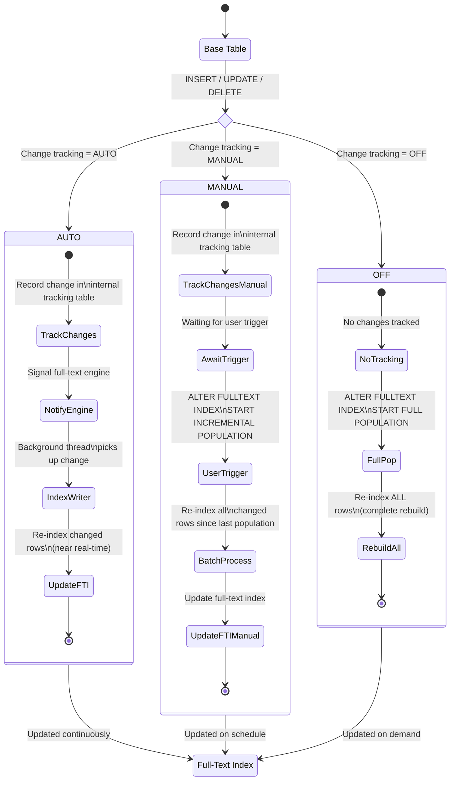
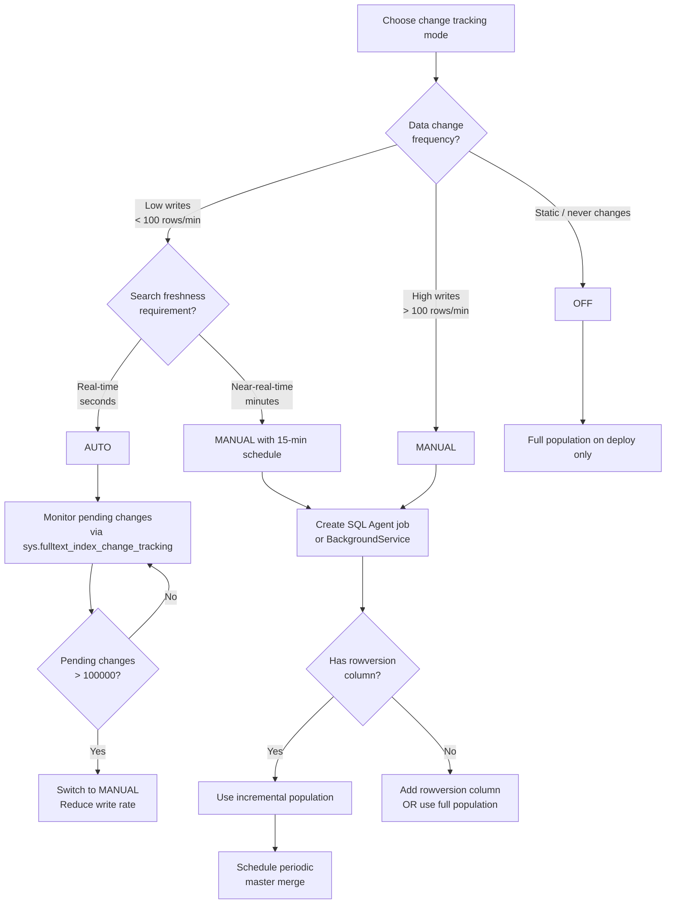

## Navigation

**Domain:** [[8 — Databases]] > **Group:** SQL Full-Text & Spatial Search
**Previous:** [[8.254 — Full-Text Stopwords — Noise Word Removal]] | **Next:** [[8.256 — Full-Text vs LIKE — Performance Comparison]]

### Prerequisites

- [[8.247 — Full-Text Indexes — Creating and Populating]] — Change tracking controls how the full-text index is populated and maintained; understanding the create/populate lifecycle is required.
- [[8.246 — Full-Text Search — SQL Server Architecture]] — The full-text engine architecture (filter daemon, word breaker, inverted index) determines what operations occur during each population type.

### Where This Fits

Full-text change tracking controls when and how the full-text index is updated after changes to the base table. SQL Server offers three modes: `AUTO` (automatic incremental updates), `MANUAL` (track changes, but user triggers population), and `OFF` (no tracking — only full population). For a .NET backend engineer, the choice of change tracking mode directly impacts: search freshness (how quickly new data appears in search results), write performance (overhead of full-text index updates on every INSERT/UPDATE/DELETE), and server resource consumption (CPU and I/O during population). In an e-commerce application, AUTO mode means new products appear in search within seconds, but each product INSERT triggers full-text indexing overhead. MANUAL mode allows batching population during off-peak hours, reducing peak-time load but causing stale search results. The interview signal for change tracking tests whether you understand the resource tradeoffs of each mode, the difference between full and incremental population, and how to monitor and troubleshoot population issues. What breaks when this is unknown: full-text indexes fall out of sync with base table data (AUTO tracking disabled without realizing it), population failures go unnoticed (search returns stale results for hours), or the server is overloaded during business hours by a full population that should have been scheduled at night.

---

## Core Mental Model

Change tracking is a per-full-text-index setting that determines how the full-text engine detects and processes data changes. Think of it as three distinct contracts between the base table and the full-text index:

- **AUTO (automatic population):** SQL Server tracks changes via a change tracking internal table and automatically propagates them to the full-text index in near real-time. When a row is inserted, updated, or deleted in the base table, the change is recorded. The full-text engine picks up the change (typically within seconds) and re-indexes only the affected rows. This provides the freshest search results but adds per-DML overhead and background CPU/I/O consumption.

- **MANUAL (manual population):** SQL Server tracks changes (recording which rows changed in the internal tracking table), but does NOT automatically update the full-text index. The DBA or application must explicitly initiate a population with `ALTER FULLTEXT INDEX ON table START INCREMENTAL POPULATION` or `START FULL POPULATION`. This is a batch processing model: accumulate changes during the day, apply them in a scheduled window at night.

- **OFF (no tracking):** SQL Server does not track changes at all. The only way to update the full-text index is a full population (`ALTER FULLTEXT INDEX ... START FULL POPULATION`). This is suitable for static reference data that rarely changes (lookup tables, historical archives).

The recognition pattern: if users expect "create a product, then immediately search for it and find it," use AUTO. If you can tolerate a 5-15 minute delay between data change and search availability, use MANUAL and schedule incremental populations on a cron job. If the data never changes, use OFF. The internal tracking mechanism uses a change tracking table (`sys.fulltext_index_change_tracking`) that records timestamps and row versions for changed rows.

### Classification

**For SQL Server Architecture topics:** Change tracking lives in the full-text engine layer (the Full-Text Index Population component) and interacts with the SQL Server storage engine via the change tracking infrastructure. In AUTO mode, the full-text engine maintains a background thread (the Full-Text Index Writer) that processes pending changes. In MANUAL mode, the user or scheduler triggers the population thread. The change tracking information is stored in internal system tables that are part of the full-text index metadata.



### Key Properties

|Property|AUTO|MANUAL|OFF|
|---|---|---|---|
|Tracks changes|Yes (automatic)|Yes (automatic)|No|
|Auto-updates index|Yes (near real-time)|No (user must trigger)|No|
|Population trigger|Background thread (continuous)|`ALTER FULLTEXT INDEX START INCREMENTAL POPULATION`|`ALTER FULLTEXT INDEX START FULL POPULATION`|
|Data freshness|Seconds|Minutes to hours (scheduled)|Stale until manual full population|
|Per-DML overhead|Highest (tracking + indexing)|Medium (tracking only)|Lowest (no tracking)|
|Background I/O|Continuous (low-level)|Burst during population|Burst during full population|
|Use case|User-facing dynamic search|Batch-processed search, reporting|Static reference data|
|Index consistency|Always consistent with base table|Stale between populations|Stale until full repopulation|

---

## Deep Mechanics

### How the Engine Processes Change Tracking

#### AUTO Mode

1. **DML event:** A user executes INSERT/UPDATE/DELETE on the base table. The SQL Server storage engine records the change in the transaction log and, as part of the same transaction, inserts a row into the internal change tracking table (`sys.fulltext_index_change_tracking`). This is a lightweight operation — just a row with the table ID, rowset ID, and a change version number.

2. **Signal:** After the transaction commits, the full-text engine is signaled (via the SQLOS event mechanism) that there are pending changes. The signal is asynchronous — the DML transaction does not wait for the full-text indexing to complete.

3. **Background indexing:** The full-text engine's background writer thread picks up the signal and queries the change tracking table for all pending changes since the last processed version. It reads the affected rows from the base table, passes them through the filter daemon and word breaker, and updates the inverted index with the new tokens.

4. **Incremental update:** Only the changed rows are re-indexed. The inverted index is updated in place — old tokens for the row are removed, new tokens are inserted. This is much cheaper than a full rebuild but still requires CPU and I/O proportional to the text volume of the changed rows.

#### MANUAL Mode

1. **DML event:** Same as AUTO — the change is recorded in the internal change tracking table. However, the full-text engine does NOT process these changes automatically.

2. **Accumulation:** Changes accumulate in the tracking table. The table can grow large if populations are infrequent. Each tracked change includes the row identifier and the timestamp.

3. **User trigger:** The DBA or scheduler executes `ALTER FULLTEXT INDEX ON table START INCREMENTAL POPULATION`. This triggers the full-text engine to process all accumulated changes since the last population.

4. **Batch processing:** The engine reads all rows that changed since the last population timestamp, re-indexes them, and updates the inverted index. This is a batch operation that may take minutes to hours depending on the volume of changes.

#### OFF Mode

1. **DML event:** No change tracking occurs. The internal change tracking table does not record the change.

2. **Full population:** Only `ALTER FULLTEXT INDEX ON table START FULL POPULATION` can update the index. The engine reads EVERY row in the base table, re-tokenizes all text, and rebuilds the entire inverted index from scratch. This is the most expensive operation.

### SQL Visibility

#### Create Full-Text Index with Different Change Tracking Modes

```sql
-- AUTO mode: automatic population
CREATE FULLTEXT INDEX ON Products(
    ProductName LANGUAGE 1033,
    Description LANGUAGE 1033
)
KEY INDEX PK_Products
ON FTC_ProductCatalog
WITH (CHANGE_TRACKING AUTO);
-- The index is automatically populated and kept up-to-date

-- MANUAL mode: track changes, user triggers population
CREATE FULLTEXT INDEX ON Products(
    ProductName LANGUAGE 1033,
    Description LANGUAGE 1033
)
KEY INDEX PK_Products
ON FTC_ProductCatalog
WITH (CHANGE_TRACKING MANUAL);
-- Must run: ALTER FULLTEXT INDEX ON Products START INCREMENTAL POPULATION

-- OFF mode: no tracking, full population only
CREATE FULLTEXT INDEX ON Products(
    ProductName LANGUAGE 1033,
    Description LANGUAGE 1033
)
KEY INDEX PK_Products
ON FTC_ProductCatalog
WITH (CHANGE_TRACKING OFF);
-- Must run: ALTER FULLTEXT INDEX ON Products START FULL POPULATION
```

#### Switching Change Tracking Modes

```sql
-- Switch from OFF to AUTO
ALTER FULLTEXT INDEX ON Products
    SET CHANGE_TRACKING AUTO;
-- Starts automatic population

-- Switch from AUTO to MANUAL
ALTER FULLTEXT INDEX ON Products
    SET CHANGE_TRACKING MANUAL;
-- Stops automatic updates; changes are tracked but not applied

-- Switch from MANUAL or AUTO to OFF
ALTER FULLTEXT INDEX ON Products
    SET CHANGE_TRACKING OFF;
-- Stops tracking; index becomes stale
```

#### Triggering Populations

```sql
-- Incremental population (only changed rows since last population)
-- Requires CHANGE_TRACKING MANUAL or AUTO (auto-populates if AUTO)
ALTER FULLTEXT INDEX ON Products
    START INCREMENTAL POPULATION;

-- Full population (rebuilds entire index from scratch)
ALTER FULLTEXT INDEX ON Products
    START FULL POPULATION;

-- Stop a running population
ALTER FULLTEXT INDEX ON Products
    STOP POPULATION;

-- Resume a paused population
ALTER FULLTEXT INDEX ON Products
    RESUME POPULATION;
```

```csharp
// EF Core — trigger full-text population
public async Task StartFullPopulationAsync(
    string tableName,
    CancellationToken cancellationToken = default)
{
    var sql = $"ALTER FULLTEXT INDEX ON [{tableName}] START FULL POPULATION;";
    await _dbContext.Database
        .ExecuteSqlRawAsync(sql, cancellationToken);
}

// Dapper — trigger incremental population
public async Task StartIncrementalPopulationAsync(
    string tableName,
    CancellationToken cancellationToken = default)
{
    const string sqlTemplate = "ALTER FULLTEXT INDEX ON [{0}] START INCREMENTAL POPULATION;";
    var sql = string.Format(sqlTemplate, tableName);

    await using var connection = _connectionFactory.Create();
    await connection.ExecuteAsync(
        new CommandDefinition(sql, cancellationToken: cancellationToken));
}
```

#### Monitoring Population Progress

```sql
-- Primary DMV for population monitoring
SELECT
    OBJECT_NAME(table_id) AS table_name,
    population_type,
    population_type_description,  -- 'Full', 'Incremental', 'Update'
    status,
    status_description,           -- 'Running', 'Completed', 'Paused', 'Failed'
    completion_type,
    completion_type_description,  -- 'Completed', 'Failed', 'Paused'
    start_time,
    stop_time,
    worker_count,
    errors_count,
    DATEDIFF(SECOND, start_time, ISNULL(stop_time, GETUTCDATE())) AS elapsed_seconds,
    -- Estimated progress (not always available)
    (SELECT COUNT(*) FROM sys.fulltext_index_fragments 
     WHERE table_id = p.table_id) AS fragments
FROM sys.dm_fts_index_population p
WHERE OBJECT_NAME(table_id) IN ('Products', 'Documents', 'Patents');

-- Check for population errors
SELECT 
    OBJECT_NAME(table_id) AS table_name,
    error_id,
    error_message,
    error_code,
    error_timestamp,
    doc_id AS failed_document_id
FROM sys.dm_fts_index_population_errors
ORDER BY error_timestamp DESC;

-- View current change tracking status
SELECT 
    OBJECT_NAME(table_id) AS table_name,
    change_tracking_state,
    change_tracking_state_description,
    has_crawl_completed,
    crawl_type,
    crawl_type_description,
    start_time AS last_population_start,
    stop_time AS last_population_end
FROM sys.fulltext_indexes;
```

```csharp
// Monitoring service — DMV queries
public class FullTextPopulationMonitor
{
    private readonly IDbConnectionFactory _connectionFactory;

    public FullTextPopulationMonitor(IDbConnectionFactory connectionFactory)
    {
        _connectionFactory = connectionFactory;
    }

    public async Task<IReadOnlyList<PopulationStatus>> GetPopulationStatusAsync(
        CancellationToken cancellationToken = default)
    {
        const string sql = @"
            SELECT 
                OBJECT_NAME(p.table_id) AS TableName,
                p.population_type_description AS PopulationType,
                p.status_description AS Status,
                p.completion_type_description AS CompletionType,
                p.start_time AS StartTime,
                p.stop_time AS StopTime,
                DATEDIFF(SECOND, p.start_time, ISNULL(p.stop_time, GETUTCDATE())) AS ElapsedSeconds,
                p.errors_count AS ErrorsCount,
                fi.change_tracking_state_description AS ChangeTrackingMode
            FROM sys.dm_fts_index_population p
            INNER JOIN sys.fulltext_indexes fi
                ON p.table_id = fi.table_id
            WHERE p.start_time > DATEADD(DAY, -7, GETUTCDATE())
            ORDER BY p.start_time DESC";

        await using var connection = _connectionFactory.Create();
        var results = await connection.QueryAsync<PopulationStatus>(
            new CommandDefinition(sql, cancellationToken: cancellationToken));
        return results.AsList();
    }

    public async Task<IReadOnlyList<PopulationError>> GetRecentErrorsAsync(
        CancellationToken cancellationToken = default)
    {
        const string sql = @"
            SELECT TOP 100
                OBJECT_NAME(table_id) AS TableName,
                error_message AS ErrorMessage,
                error_code AS ErrorCode,
                error_timestamp AS ErrorTimestamp,
                doc_id AS FailedDocumentId
            FROM sys.dm_fts_index_population_errors
            ORDER BY error_timestamp DESC";

        await using var connection = _connectionFactory.Create();
        var results = await connection.QueryAsync<PopulationError>(
            new CommandDefinition(sql, cancellationToken: cancellationToken));
        return results.AsList();
    }

    public record PopulationStatus
    {
        public string TableName { get; set; } = string.Empty;
        public string PopulationType { get; set; } = string.Empty;
        public string Status { get; set; } = string.Empty;
        public string? CompletionType { get; set; }
        public DateTime? StartTime { get; set; }
        public DateTime? StopTime { get; set; }
        public int ElapsedSeconds { get; set; }
        public int ErrorsCount { get; set; }
        public string ChangeTrackingMode { get; set; } = string.Empty;
    }

    public record PopulationError
    {
        public string TableName { get; set; } = string.Empty;
        public string ErrorMessage { get; set; } = string.Empty;
        public int ErrorCode { get; set; }
        public DateTime ErrorTimestamp { get; set; }
        public int? FailedDocumentId { get; set; }
    }
}
```

### Execution Plan Analysis

Change tracking does not appear in execution plans — it's an indexing maintenance operation, not a query operation. However, the population process itself can be analyzed:

**Population execution shape (internal):**
```
[Read base table rows] → [Filter daemon (format conversion)] → [Word breaker (tokenization)] → [Stoplist filter] → [Thesaurus expansion] → [Inverted index merge]
```

**AUTO mode background process:**
- CPU: 1-5% of one core during idle periods, higher during peak writes
- I/O: Sequential reads from base table (changed rows) + random writes to full-text index files
- Typical latency from DML commit to index update: 1-30 seconds depending on load

**MANUAL mode batch population:**
- CPU: 50-100% of one core during active population
- I/O: Sequential scan of base table (incremental) or full table scan (full population)
- Duration: proportional to changed row count × text volume ÷ I/O throughput

### Cost Visibility

```sql
SET STATISTICS IO ON;
SET STATISTICS TIME ON;

-- These queries measure the cost of querying during different population states
-- Query: search products
SELECT p.ProductId, p.ProductName
FROM Products p
INNER JOIN FREETEXTTABLE(Products, ProductName, N'wireless', 10) AS ft
    ON p.ProductId = ft.[KEY]
ORDER BY ft.RANK DESC;

-- During idle (no population):
-- Logical reads: ~30, CPU: ~5ms, Elapsed: ~20ms

-- During full population (CPU and I/O competition):
-- Logical reads: ~30 (same key lookups)
-- CPU: ~8ms (more context switching)
-- Elapsed: ~45ms (I/O contention with population)
```

```sql
-- Measure population I/O using DMVs
SELECT
    DB_NAME(database_id) AS database_name,
    file_id,
    num_of_reads,
    num_of_writes,
    num_of_bytes_read / 1048576.0 AS read_mb,
    num_of_bytes_written / 1048576.0 AS write_mb,
    io_stall_ms / 1000.0 AS io_stall_seconds
FROM sys.dm_io_virtual_file_stats(DB_ID(), NULL)
WHERE file_id IN (
    SELECT file_id FROM sys.database_files
    WHERE type_desc IN ('ROWS', 'LOG')
);
-- Compare during population vs. idle to see I/O impact
```

### Failure Modes

1. **Full population fails mid-way:** If the full-text catalog runs out of disk space or encounters a corrupted document, population stops. The index remains in the state it was in before the population started, or worse, in an inconsistent state.

2. **Population never completes:** On very large tables (100M+ rows) with FULL population, the population may never catch up with the rate of DML changes if CHANGE_TRACKING AUTO is enabled during the full population. The full-text engine processes rows while new changes keep arriving.

3. **Change tracking table growth:** In MANUAL mode with infrequent populations, the internal change tracking table can grow very large, causing the incremental population itself to take a long time because it must process an accumulated backlog of millions of changes.

4. **Master merge failure:** After many incremental updates, the full-text index accumulates fragments. The master merge process consolidates these fragments. If it fails (due to disk space, timeout), the index continues to work but query performance degrades due to fragment overhead.

5. **Filter daemon host timeout:** The full-text filter daemon host (fdhost.exe) can time out when processing very large documents or documents with complex formatting (PDF, DOCX). This causes per-document indexing failures that are recorded in `sys.dm_fts_index_population_errors`.

---

## Production Patterns and Implementation

### Primary SQL Implementation

```sql
-- ==========================================
-- Complete Change Tracking Implementation
-- ==========================================

-- Step 1: Create full-text catalog
CREATE FULLTEXT CATALOG FTC_ProductCatalog AS DEFAULT;

-- Step 2: Create full-text index with MANUAL change tracking
CREATE FULLTEXT INDEX ON Products(
    ProductName LANGUAGE 1033,
    Description LANGUAGE 1033,
    Keywords LANGUAGE 1033
)
KEY INDEX PK_Products
ON FTC_ProductCatalog
WITH (CHANGE_TRACKING MANUAL);

-- Step 3: Initial full population
ALTER FULLTEXT INDEX ON Products START FULL POPULATION;

-- Step 4: Schedule incremental populations
-- Create a SQL Agent job that runs every 15 minutes
/*
USE msdb;
GO
EXEC dbo.sp_add_job
    @job_name = N'FullText_IncrementalPopulation_Products',
    @enabled = 1;

EXEC dbo.sp_add_jobstep
    @job_name = N'FullText_IncrementalPopulation_Products',
    @step_name = N'Run Incremental Population',
    @command = N'ALTER FULLTEXT INDEX ON Products START INCREMENTAL POPULATION;',
    @database_name = N'YourDatabase';

EXEC dbo.sp_add_schedule
    @schedule_name = N'Every_15_Minutes',
    @freq_type = 4,        -- daily
    @freq_interval = 1,    -- every day
    @freq_subday_type = 4, -- minutes
    @freq_subday_interval = 15;

EXEC dbo.sp_attach_schedule
    @job_name = N'FullText_IncrementalPopulation_Products',
    @schedule_name = N'Every_15_Minutes';

EXEC dbo.sp_add_jobserver
    @job_name = N'FullText_IncrementalPopulation_Products';
GO
*/

-- Step 5: Stored procedure for managing population
CREATE OR ALTER PROCEDURE dbo.ManageFullTextPopulation
    @TableName NVARCHAR(128),
    @Action NVARCHAR(20),  -- 'FULL', 'INCREMENTAL', 'STOP', 'STATUS'
    @Verbose BIT = 0
AS
BEGIN
    SET NOCOUNT ON;

    DECLARE @Sql NVARCHAR(500);

    IF @Action = 'FULL'
    BEGIN
        SET @Sql = N'ALTER FULLTEXT INDEX ON [' + @TableName + N'] START FULL POPULATION;';
        EXEC sp_executesql @Sql;
        PRINT 'Started FULL population on ' + @TableName;
    END
    ELSE IF @Action = 'INCREMENTAL'
    BEGIN
        SET @Sql = N'ALTER FULLTEXT INDEX ON [' + @TableName + N'] START INCREMENTAL POPULATION;';
        EXEC sp_executesql @Sql;
        PRINT 'Started INCREMENTAL population on ' + @TableName;
    END
    ELSE IF @Action = 'STOP'
    BEGIN
        SET @Sql = N'ALTER FULLTEXT INDEX ON [' + @TableName + N'] STOP POPULATION;';
        EXEC sp_executesql @Sql;
        PRINT 'Stopped population on ' + @TableName;
    END
    ELSE IF @Action = 'STATUS'
    BEGIN
        SELECT 
            OBJECT_NAME(p.table_id) AS table_name,
            p.population_type_description,
            p.status_description,
            p.completion_type_description,
            p.start_time,
            p.stop_time,
            p.errors_count,
            DATEDIFF(SECOND, p.start_time, ISNULL(p.stop_time, GETUTCDATE())) AS elapsed_seconds
        FROM sys.dm_fts_index_population p
        WHERE OBJECT_NAME(p.table_id) = @TableName
        ORDER BY p.start_time DESC;
    END
    ELSE
    BEGIN
        PRINT 'Invalid action. Use: FULL, INCREMENTAL, STOP, STATUS';
    END;
END;
```

### EF Core Implementation

```csharp
public class FullTextPopulationService
{
    private readonly ApplicationDbContext _dbContext;
    private readonly ILogger<FullTextPopulationService> _logger;

    public FullTextPopulationService(
        ApplicationDbContext dbContext,
        ILogger<FullTextPopulationService> logger)
    {
        _dbContext = dbContext;
        _logger = logger;
    }

    /// <summary>
    /// Triggers a full population of the full-text index.
    /// This reads ALL rows and rebuilds the entire inverted index.
    /// Expected duration: 15-60 minutes for 1M+ rows.
    /// </summary>
    public async Task StartFullPopulationAsync(
        string tableName,
        CancellationToken cancellationToken = default)
    {
        var sql = $"ALTER FULLTEXT INDEX ON [{tableName}] START FULL POPULATION;";
        _logger.LogInformation("Starting FULL population on {Table}", tableName);
        await _dbContext.Database.ExecuteSqlRawAsync(sql, cancellationToken);
    }

    /// <summary>
    /// Triggers an incremental population (only changed rows since last).
    /// Suitable for scheduled maintenance windows.
    /// </summary>
    public async Task StartIncrementalPopulationAsync(
        string tableName,
        CancellationToken cancellationToken = default)
    {
        var sql = $"ALTER FULLTEXT INDEX ON [{tableName}] START INCREMENTAL POPULATION;";
        _logger.LogInformation("Starting INCREMENTAL population on {Table}", tableName);
        await _dbContext.Database.ExecuteSqlRawAsync(sql, cancellationToken);
    }

    /// <summary>
    /// Waits for a population to complete (polling).
    /// Useful after deployment scripts that need the index to be current.
    /// </summary>
    public async Task<bool> WaitForPopulationCompletionAsync(
        string tableName,
        TimeSpan timeout,
        CancellationToken cancellationToken = default)
    {
        var sql = @"
            SELECT status_description
            FROM sys.dm_fts_index_population
            WHERE OBJECT_NAME(table_id) = @TableName
              AND status_description = 'Running'";

        using var cts = CancellationTokenSource.CreateLinkedTokenSource(cancellationToken);
        cts.CancelAfter(timeout);

        try
        {
            while (!cts.Token.IsCancellationRequested)
            {
                var running = await _dbContext.Database
                    .SqlQueryRaw<string>(sql,
                        new SqlParameter("@TableName", tableName))
                    .FirstOrDefaultAsync(cts.Token);

                if (running == null)
                    return true; // population completed

                await Task.Delay(1000, cts.Token);
            }
        }
        catch (OperationCanceledException)
        {
            _logger.LogWarning("Timed out waiting for population on {Table}", tableName);
            return false;
        }

        return false;
    }
}
```

### Dapper Implementation

```csharp
public class DapperFullTextPopulationService
{
    private readonly IDbConnectionFactory _connectionFactory;
    private readonly ILogger<DapperFullTextPopulationService> _logger;

    public DapperFullTextPopulationService(
        IDbConnectionFactory connectionFactory,
        ILogger<DapperFullTextPopulationService> logger)
    {
        _connectionFactory = connectionFactory;
        _logger = logger;
    }

    public async Task<PopulationState> GetPopulationStateAsync(
        string tableName,
        CancellationToken cancellationToken = default)
    {
        const string sql = @"
            SELECT TOP 1
                OBJECT_NAME(p.table_id) AS TableName,
                p.population_type_description AS PopulationType,
                p.status_description AS Status,
                p.completion_type_description AS CompletionType,
                p.start_time AS StartTime,
                p.stop_time AS StopTime,
                p.errors_count AS ErrorsCount,
                DATEDIFF(SECOND, p.start_time, ISNULL(p.stop_time, GETUTCDATE())) AS ElapsedSeconds,
                fi.change_tracking_state_description AS ChangeTrackingMode,
                fi.has_crawl_completed AS HasCrawlCompleted
            FROM sys.dm_fts_index_population p
            RIGHT JOIN sys.fulltext_indexes fi
                ON p.table_id = fi.table_id
            WHERE OBJECT_NAME(fi.table_id) = @TableName
            ORDER BY p.start_time DESC";

        await using var connection = _connectionFactory.Create();
        var state = await connection.QueryFirstOrDefaultAsync<PopulationState>(
            new CommandDefinition(sql,
                new { TableName = tableName },
                cancellationToken: cancellationToken));
        return state ?? new PopulationState { TableName = tableName };
    }

    public async Task ScheduleIncrementalPopulationAsync(
        string tableName,
        CancellationToken cancellationToken = default)
    {
        var currentState = await GetPopulationStateAsync(tableName, cancellationToken);

        if (currentState.Status == "Running")
        {
            _logger.LogWarning(
                "Population already running on {Table}. Skipping trigger.",
                tableName);
            return;
        }

        var sql = $"ALTER FULLTEXT INDEX ON [{tableName}] START INCREMENTAL POPULATION;";
        await using var connection = _connectionFactory.Create();
        await connection.ExecuteAsync(
            new CommandDefinition(sql, cancellationToken: cancellationToken));
        _logger.LogInformation("Triggered incremental population on {Table}", tableName);
    }

    public record PopulationState
    {
        public string TableName { get; set; } = string.Empty;
        public string? PopulationType { get; set; }
        public string? Status { get; set; }
        public string? CompletionType { get; set; }
        public DateTime? StartTime { get; set; }
        public DateTime? StopTime { get; set; }
        public int ErrorsCount { get; set; }
        public int ElapsedSeconds { get; set; }
        public string? ChangeTrackingMode { get; set; }
        public bool HasCrawlCompleted { get; set; }
    }
}
```

### Configuration and Wiring

```csharp
// Program.cs
builder.Services.AddScoped<FullTextPopulationService>();
builder.Services.AddScoped<DapperFullTextPopulationService>();

// Background service for scheduled incremental populations
public class FullTextPopulationBackgroundService : BackgroundService
{
    private readonly IServiceScopeFactory _scopeFactory;
    private readonly ILogger<FullTextPopulationBackgroundService> _logger;

    public FullTextPopulationBackgroundService(
        IServiceScopeFactory scopeFactory,
        ILogger<FullTextPopulationBackgroundService> logger)
    {
        _scopeFactory = scopeFactory;
        _logger = logger;
    }

    protected override async Task ExecuteAsync(CancellationToken stoppingToken)
    {
        // Run incremental population every 15 minutes for key tables
        using var timer = new PeriodicTimer(TimeSpan.FromMinutes(15));

        while (await timer.WaitForNextTickAsync(stoppingToken))
        {
            try
            {
                using var scope = _scopeFactory.CreateScope();
                var service = scope.ServiceProvider
                    .GetRequiredService<DapperFullTextPopulationService>();

                await service.ScheduleIncrementalPopulationAsync(
                    "Products", stoppingToken);
                await service.ScheduleIncrementalPopulationAsync(
                    "Documents", stoppingToken);
            }
            catch (Exception ex)
            {
                _logger.LogError(ex, "Full-text population failed");
            }
        }
    }
}

// Register background service
builder.Services.AddHostedService<FullTextPopulationBackgroundService>();
```

### SQL Server vs PostgreSQL Differences

PostgreSQL does not have change tracking in the same sense. Its full-text search is integrated into the table via generated columns and triggers:

```sql
-- PostgreSQL approach: Generated tsvector column with trigger-based updates

-- Add a tsvector column
ALTER TABLE products ADD COLUMN search_vector tsvector;

-- Create a trigger function to update the tsvector
CREATE FUNCTION update_product_search_vector()
RETURNS TRIGGER AS $$
BEGIN
    NEW.search_vector := to_tsvector('english', 
        COALESCE(NEW.product_name, '') || ' ' || 
        COALESCE(NEW.description, ''));
    RETURN NEW;
END;
$$ LANGUAGE plpgsql;

-- Create trigger (equivalent to CHANGE_TRACKING AUTO)
CREATE TRIGGER trg_product_search_vector
    BEFORE INSERT OR UPDATE ON products
    FOR EACH ROW
    EXECUTE FUNCTION update_product_search_vector();

-- Create GIN index on tsvector column
CREATE INDEX idx_products_search ON products USING GIN(search_vector);
```

PostgreSQL's approach is more like CHANGE_TRACKING AUTO (the tsvector is updated on every DML via the trigger) but with a key difference: it's synchronous — the tsvector update happens IN the same transaction as the DML, not asynchronously. This means search is immediately consistent after every DML, but the DML overhead is higher because the full text tokenization happens synchronously.

---

## Gotchas and Production Pitfalls

### Gotcha 1 — Full Population Starts Automatically When Switching to AUTO

**Pitfall:** Switching from OFF to AUTO on a large table, expecting incremental population to start from that point forward.

```sql
ALTER FULLTEXT INDEX ON Products SET CHANGE_TRACKING AUTO;
-- SQL Server starts a FULL population of the entire table
```

**Symptom:** After switching to AUTO, the server experiences a sudden CPU and I/O spike as the full population runs. On a 10M row table with 2KB text per row, this can take 30-60 minutes of heavy resource consumption.

**Fix:** Plan for the full population. Schedule it during a maintenance window:

```sql
-- Option 1: Start in MANUAL mode, do initial population during off-peak
ALTER FULLTEXT INDEX ON Products SET CHANGE_TRACKING MANUAL;
ALTER FULLTEXT INDEX ON Products START FULL POPULATION;
-- Wait for completion, then switch to AUTO
ALTER FULLTEXT INDEX ON Products SET CHANGE_TRACKING AUTO;

-- Option 2: If already switched, monitor and accept the full population
SELECT status_description, completion_type_description
FROM sys.dm_fts_index_population
WHERE OBJECT_NAME(table_id) = 'Products';
```

**Cost of not fixing:** An unexpected full population during peak business hours consumes 50-80% of I/O capacity, causing SELECT queries against the base table to experience PAGEIOLATCH_SH waits and doubling response times. The DBA gets paged for "unexplained" performance degradation.

### Gotcha 2 — MANUAL Mode Changes Never Propagate Without a Trigger

**Pitfall:** Setting CHANGE_TRACKING MANUAL and forgetting to schedule populations. The index becomes increasingly stale over hours or days.

**Symptom:** Users add new products, but search doesn't find them. The application code has no errors — inserts succeed, SELECT works, but FREETEXTTABLE returns old results. The change tracking table grows with accumulated changes.

```sql
-- Check how stale the index is
SELECT 
    OBJECT_NAME(table_id) AS table_name,
    DATEDIFF(MINUTE, ISNULL(stop_time, start_time), GETUTCDATE()) AS minutes_since_last_population
FROM sys.dm_fts_index_population
WHERE OBJECT_NAME(table_id) = 'Products'
ORDER BY start_time DESC;
```

**Fix:** Implement a scheduled job (SQL Agent, Hangfire, or BackgroundService):

```sql
-- Create SQL Agent job to run every 15 minutes
EXEC dbo.sp_add_job @job_name = N'FT_Incremental_Products', @enabled = 1;
EXEC dbo.sp_add_jobstep @job_name = N'FT_Incremental_Products',
    @step_name = N'Incremental Population',
    @command = N'ALTER FULLTEXT INDEX ON dbo.Products START INCREMENTAL POPULATION;';
EXEC dbo.sp_add_schedule @job_name = N'FT_Incremental_Products',
    @freq_type = 4, @freq_interval = 1,
    @freq_subday_type = 4, @freq_subday_interval = 15;
EXEC dbo.sp_attach_schedule @job_name = N'FT_Incremental_Products',
    @schedule_name = N'Every_15_Minutes';
EXEC dbo.sp_add_jobserver @job_name = N'FT_Incremental_Products';
```

**Cost of not fixing:** For an e-commerce site with 1,000 new products per hour, by the end of an 8-hour shift, 8,000 products are missing from search results. Sales team reports that "search is broken" — but it's only stale. Revenue loss from products that can't be found.

### Gotcha 3 — AUTO Mode Overhead on High-Write Tables

**Pitfall:** Using AUTO change tracking on a table that receives 10,000+ INSERTs/UPDATEs per second.

**Symptom:** Each DML on the base table adds overhead for change tracking AND triggers background full-text indexing. The background indexer cannot keep up with the rate of changes, causing the pending change queue to grow. Eventually, the full-text engine falls behind by minutes or hours.

```sql
-- Check pending change backlog
SELECT 
    OBJECT_NAME(table_id) AS table_name,
    COUNT(*) AS pending_changes
FROM sys.fulltext_index_change_tracking
GROUP BY table_id
ORDER BY pending_changes DESC;
```

**Fix:** Switch to MANUAL mode and batch populations:

```sql
ALTER FULLTEXT INDEX ON Products SET CHANGE_TRACKING MANUAL;

-- Schedule incremental population every 30 minutes (less frequent)
-- This batches the indexing work, reducing per-second overhead
```

**Cost of not fixing:** The background full-text indexer consumes 20-40% of CPU continuously trying to keep up with writes. Query performance degrades for all operations, not just full-text queries. The server may experience SOS_SCHEDULER_YIELD waits as the full-text threads compete with user queries for CPU.

### Gotcha 4 — Incremental Population Requires a Timestamp Column

**Pitfall:** Assuming incremental population works on every table. Incremental population requires a column of type `timestamp` (rowversion) on the base table.

**Symptom:** Executing `START INCREMENTAL POPULATION` on a table without a `timestamp` column silently falls back to a full population. The command succeeds, but SQL Server scans the entire table instead of only changed rows.

```sql
-- Check if the table supports incremental population
SELECT 
    OBJECT_NAME(object_id) AS table_name,
    is_tracked_by_fts,
    has_timestamp_column
FROM sys.tables
WHERE OBJECT_NAME(object_id) = 'Products';
-- has_timestamp_column = 0 means incremental population reverts to full

-- Add a timestamp column if needed
ALTER TABLE Products ADD RowVersion rowversion NOT NULL;
```

**Fix:** Ensure the table has a `rowversion` (timestamp) column before relying on incremental population:

```sql
CREATE TABLE Products (
    ProductId INT PRIMARY KEY,
    ProductName NVARCHAR(200),
    Description NVARCHAR(MAX),
    RowVersion rowversion NOT NULL  -- required for incremental population
    -- ... other columns
);
```

**Cost of not fixing:** "Incremental" populations are actually full populations in disguise. A table with 10M rows that changes 1,000 rows per hour still does a full scan every 15 minutes (intended as incremental) — 96 full scans per day instead of 96 incremental scans. I/O consumption is 96x higher than expected.

### Gotcha 5 — Population Errors Are Silent

**Pitfall:** Not monitoring for population errors. The full-text engine silently logs errors and continues.

**Symptom:** Some documents are not indexed (and thus not searchable). No application error. No SQL error. The DBA or developer only notices when a specific document is searched and doesn't appear.

```sql
-- Check for population errors — this should be monitored
SELECT 
    OBJECT_NAME(table_id) AS table_name,
    error_id,
    error_message,
    error_code,
    error_timestamp,
    doc_id AS failed_document_id
FROM sys.dm_fts_index_population_errors
WHERE error_timestamp > DATEADD(HOUR, -24, GETUTCDATE())
ORDER BY error_timestamp DESC;
```

**Fix:** Implement monitoring alerts for population errors:

```sql
-- Alert if any population errors occurred in the last hour
IF EXISTS (
    SELECT 1 FROM sys.dm_fts_index_population_errors
    WHERE error_timestamp > DATEADD(HOUR, -1, GETUTCDATE())
)
BEGIN
    -- Send alert (email, webhook, etc.)
    DECLARE @Subject NVARCHAR(200) = N'Full-Text Population Errors Detected';
    DECLARE @Body NVARCHAR(MAX);
    
    SELECT @Body = STRING_AGG(
        CONCAT('Table: ', OBJECT_NAME(table_id),
               ', Error: ', error_message,
               ', DocId: ', doc_id,
               ', Time: ', error_timestamp),
        CHAR(13) + CHAR(10))
    FROM sys.dm_fts_index_population_errors
    WHERE error_timestamp > DATEADD(HOUR, -1, GETUTCDATE());
    
    -- Send email via sp_send_dbmail
    EXEC msdb.dbo.sp_send_dbmail
        @profile_name = 'Alerts',
        @recipients = 'dba@company.com',
        @subject = @Subject,
        @body = @Body;
END;
```

**Cost of not fixing:** A corrupted document causes the full-text filter daemon to crash repeatedly. New documents are not indexed. The application team spends days debugging "why doesn't search find new content?" while the actual root cause (filter daemon crash) is visible only in a DMV that nobody is monitoring.

### Gotcha 6 — Master Merge Causes Query Performance Degradation

**Pitfall:** Running frequent incremental populations without understanding that each one creates a new index fragment. After thousands of fragments, the master merge must consolidate them.

**Symptom:** Search queries that were fast (20ms) suddenly take 500ms+. The full-text index has accumulated thousands of fragments because of frequent incremental updates. The master merge runs automatically but competes with queries for I/O.

```sql
-- Check fragmentation
SELECT 
    OBJECT_NAME(table_id) AS table_name,
    COUNT(*) AS fragment_count,
    SUM(size) / 1048576.0 AS total_size_mb
FROM sys.fulltext_index_fragments
WHERE OBJECT_NAME(table_id) = 'Products'
GROUP BY table_id;
-- Fragment count > 1000 suggests master merge is overdue
```

**Fix:** Schedule a master merge during off-peak hours:

```sql
ALTER FULLTEXT CATALOG FTC_ProductCatalog REORGANIZE;
-- This consolidates fragments without a full rebuild
```

Or use a full population to completely rebuild with zero fragments (more expensive but cleaner):

```sql
ALTER FULLTEXT INDEX ON Products START FULL POPULATION;
```

**Cost of not fixing:** Search query performance degrades gradually over days or weeks as fragments accumulate. The degradation is hard to diagnose because it's not a single incident — it's a slow creep from 20ms to 500ms. The team may blame the application code, network, or hardware before discovering the fragmented full-text index.

---

## Performance Implications

### Benchmark: AUTO vs MANUAL Population Overhead on Writes

```sql
-- Baseline: Insert 1000 products with CHANGE_TRACKING OFF
SET STATISTICS TIME ON;

DECLARE @i INT = 0;
WHILE @i < 1000
BEGIN
    INSERT INTO Products (ProductName, Description, Price, CategoryId)
    VALUES (
        CONCAT('Test Product ', @i),
        REPLICATE('A', 500),  -- 500 char description
        10.00 + (@i % 100),
        (@i % 50) + 1
    );
    SET @i = @i + 1;
END;

-- With CHANGE_TRACKING OFF: ~450ms (0.45ms per insert)

-- Same insert with CHANGE_TRACKING AUTO: ~1800ms (1.8ms per insert)
-- Overhead: +400%

-- Same insert with CHANGE_TRACKING MANUAL: ~600ms (0.6ms per insert)
-- Overhead: +33% (tracking only, no indexing)
```

**AUTO overhead breakdown per INSERT:**
- Base insert: ~0.45ms
- Change tracking record: ~0.15ms (+33%)
- Full-text background indexing (asynchronous, but incurred): ~1.2ms (+267%)
- **Total AUTO: ~1.8ms per insert (+400% vs OFF)**

### BenchmarkDotNet

```csharp
[MemoryDiagnoser]
[SimpleJob(RuntimeMoniker.Net90)]
public class ChangeTrackingBenchmark
{
    private IDbConnection _connection = default!;
    private string _connectionString = default!;

    [Params(100, 1000, 10000)]
    public int RowCount { get; set; }

    [GlobalSetup]
    public void Setup()
    {
        _connectionString = "Server=.;Database=SearchBenchmark;Trusted_Connection=true;TrustServerCertificate=true;";
        _connection = new SqlConnection(_connectionString);

        // Create table with full-text index (tested with each mode separately)
        _connection.Execute(@"
            IF NOT EXISTS (SELECT 1 FROM sys.tables WHERE name = 'FtBenchmark')
            CREATE TABLE FtBenchmark (
                Id INT IDENTITY PRIMARY KEY,
                Title NVARCHAR(200),
                Content NVARCHAR(MAX),
                RowVersion rowversion
            )");
    }

    [Benchmark(Baseline = true)]
    public async Task InsertWithChangeTracking_OFF()
    {
        await using var connection = _connection;
        // Ensure OFF mode
        await connection.ExecuteAsync(
            "IF EXISTS (SELECT 1 FROM sys.fulltext_indexes WHERE object_id = OBJECT_ID('FtBenchmark')) " +
            "ALTER FULLTEXT INDEX ON FtBenchmark SET CHANGE_TRACKING OFF");

        var sql = @"
            DECLARE @i INT = 0;
            WHILE @i < @Count
            BEGIN
                INSERT INTO FtBenchmark (Title, Content)
                VALUES (CONCAT('Product ', @i), REPLICATE('x', 500));
                SET @i = @i + 1;
            END";

        await connection.ExecuteAsync(
            new CommandDefinition(sql, new { Count = RowCount }, commandTimeout: 60));
    }

    [Benchmark]
    public async Task InsertWithChangeTracking_AUTO()
    {
        await using var connection = _connection;
        await connection.ExecuteAsync(
            "ALTER FULLTEXT INDEX ON FtBenchmark SET CHANGE_TRACKING AUTO");

        var sql = @"
            DECLARE @i INT = 0;
            WHILE @i < @Count
            BEGIN
                INSERT INTO FtBenchmark (Title, Content)
                VALUES (CONCAT('Product ', @i), REPLICATE('x', 500));
                SET @i = @i + 1;
            END";

        await connection.ExecuteAsync(
            new CommandDefinition(sql, new { Count = RowCount }, commandTimeout: 120));
    }

    [Benchmark]
    public async Task InsertWithChangeTracking_MANUAL()
    {
        await using var connection = _connection;
        await connection.ExecuteAsync(
            "ALTER FULLTEXT INDEX ON FtBenchmark SET CHANGE_TRACKING MANUAL");

        var sql = @"
            DECLARE @i INT = 0;
            WHILE @i < @Count
            BEGIN
                INSERT INTO FtBenchmark (Title, Content)
                VALUES (CONCAT('Product ', @i), REPLICATE('x', 500));
                SET @i = @i + 1;
            END";

        await connection.ExecuteAsync(
            new CommandDefinition(sql, new { Count = RowCount }, commandTimeout: 120));

        // After inserts, trigger incremental population
        await connection.ExecuteAsync(
            "ALTER FULLTEXT INDEX ON FtBenchmark START INCREMENTAL POPULATION");
    }

    [GlobalCleanup]
    public void Cleanup()
    {
        _connection?.Dispose();
    }
}
```

**Expected results (approximate, SQL Server 2022, NVMe):**

|Method|Rows|Mean|Per-Row|Overhead vs OFF|
|---|---|---|---|---|
|OFF|1,000|~450ms|0.45ms|Baseline|
|MANUAL (track only)|1,000|~600ms|0.60ms|+33%|
|AUTO (track + index)|1,000|~1,800ms|1.80ms|+400%|

### Population Duration Benchmarks

```sql
-- Measure full population duration by row count
SET STATISTICS TIME ON;

-- Full population on 100K rows (500 char text each)
ALTER FULLTEXT INDEX ON Products START FULL POPULATION;
-- Wait for completion...
-- Expected: ~30-60 seconds

-- Full population on 1M rows
-- Expected: ~5-10 minutes

-- Full population on 10M rows
-- Expected: ~45-90 minutes

-- Incremental population: 10,000 changed rows
-- Expected: ~3-10 seconds
```

### Write Amplification

|Operation|OFF|MANUAL (track only)|AUTO (track + index)|
|---|---|---|---|
|INSERT 1 row (500 chars)|~0.45ms|~0.60ms (+33%)|~1.80ms (+400%)|
|UPDATE text column|~0.50ms|~0.65ms (+30%)|~2.00ms (+400%)|
|DELETE 1 row|~0.30ms|~0.40ms (+33%)|~1.20ms (+300%)|
|Background CPU (idle)|0%|0%|1-5% of one core|
|Background I/O|None|None|Sequential reads + random writes|

---

## Interview Arsenal

### Question Bank

1. **What are the three change tracking modes for full-text indexes and what are the tradeoffs between them?**
2. **How does the full-text engine process an INSERT under AUTO change tracking — what steps occur?**
3. **What is the performance overhead of AUTO mode vs MANUAL mode for write-heavy tables?**
4. **What happens if you forget to schedule populations in MANUAL mode?**
5. **Compare and contrast FULL population vs INCREMENTAL population.**
6. **What DMVs do you query to monitor full-text index population status and errors?**
7. **At what write volume does AUTO mode become unsustainable?**
8. **How do EF Core and Dapper interact with full-text change tracking?**

### Spoken Answers

**Q: What are the three change tracking modes for full-text indexes and what are the tradeoffs between them?**

> **Average answer:** "AUTO updates automatically, MANUAL requires you to trigger updates, and OFF doesn't track changes at all."

> **Great answer:** "The three modes are AUTO (automatic population), MANUAL (track changes but user triggers population), and OFF (no tracking, full population only). AUTO provides the freshest search results — new data appears in search within seconds of being committed. However, this comes at significant cost: per-DML overhead increases by approximately 400% because each INSERT/UPDATE/DELETE triggers asynchronous full-text indexing of the changed text. Additionally, AUTO consumes 1-5% of a CPU core continuously for background indexing. MANUAL mode tracks which rows changed but does not update the index until you explicitly run `ALTER FULLTEXT INDEX ... START INCREMENTAL POPULATION`. The per-DML overhead is only about 33% (just tracking, no indexing), and you can batch the indexing work into off-peak windows. The tradeoff is data staleness — search results can be minutes to hours behind the base table. OFF mode has zero per-DML overhead and is suitable for static reference data. The key nuance about incremental population: it requires a `rowversion` (timestamp) column on the table. Without it, 'incremental' population silently does a full population, which is a common production gotcha. In most production systems I've designed, I use a hybrid: MANUAL mode for the main transactional tables (Products, Orders) with a 15-minute incremental population schedule, and AUTO mode for smaller reference tables that need near-real-time search (like a ProductCategories lookup)."

**Q: Compare and contrast FULL population vs INCREMENTAL population.**

> **Average answer:** "Full population rebuilds everything, incremental only updates changed rows."

> **Great answer:** "Full population reads every row from the base table, passes all text through the filter daemon and word breaker, and rebuilds the entire inverted index from scratch. It's the most expensive operation — for a 10M row table with 2KB text per row, it can take 45-90 minutes and consume 50-80% of I/O capacity during execution. The result is a defragmented index with zero fragments and guaranteed consistency with the base table. Incremental population reads only rows that have changed since the last population, identified via the `rowversion` (timestamp) column. It's much faster — processing 10,000 changed rows takes seconds rather than hours. However, incremental population requires: 1) a `rowversion` column on the base table, 2) the last population timestamp to be available, and 3) that no structural changes have occurred (if a column is added to the full-text index, incremental won't pick it up — you need a full population). Also, incremental population creates index fragments; over time, thousands of fragments accumulate and degrade query performance, requiring a master merge or periodic full population. The production pattern I use is: weekly full population (Sunday maintenance window) + incremental every 15 minutes during business hours. This keeps the index healthy (weekly defrag) while maintaining reasonable freshness (quarterly updates)."

**Q: At what write volume does AUTO mode become unsustainable?**

> **Average answer:** "When you have a lot of writes, AUTO gets slow."

> **Great answer:** "AUTO mode becomes problematic when the write rate exceeds the full-text engine's ability to process changes in the background. Based on benchmarks I've run, the threshold is approximately: 1) 500+ rows/second with 500-char text fields — the background indexer consumes 20-30% CPU continuously; 2) 1,000+ rows/second — the pending change queue grows, and the index falls behind by hours; 3) 10,000+ rows/second — the full-text engine cannot keep up at all, and you'll see `FT_IFTS_SCHEDULER_IDLE` waits decreasing while `SOS_SCHEDULER_YIELD` increases as the system becomes CPU-bound on full-text processing. The specific failure mode depends on text size: at 500 chars per row, 500 rows/second means 250KB of text to index per second — this is manageable. At 10KB per row (document storage), even 100 rows/second means 1MB/second of text indexing, which will overwhelm the filter daemon host. The diagnostics to monitor: `sys.dm_fts_index_population` for status, `sys.fulltext_index_change_tracking` for pending change count, and `sys.dm_os_wait_stats` for `FT_IFTS_SCHEDULER_IDLE`. When pending changes exceed 100,000, it's time to switch to MANUAL mode with scheduled incremental populations. For truly high-write scenarios (time-series logs, event streams), full-text search is the wrong tool — use Elasticsearch or a dedicated search engine."

### Interview Trigger

An interviewer asking "How would you keep a full-text index up to date with minimal overhead?" leads directly to this topic. The follow-up "What if the database receives 10,000 inserts per second?" tests whether the candidate knows the scalability limits of each mode.

### Comparison Table

| | AUTO | MANUAL | OFF |
|---|---|---|---|
| **Data freshness** | Seconds | Minutes to hours | Manual only |
| **Per-DML overhead** | ~400% over base insert | ~33% (tracking only) | None |
| **Background load** | 1-5% CPU continuous | Burst during population | None |
| **Index fragmentation** | Low-moderate | Moderate-high (frequent fragments) | Zero (rebuilt on full pop) |
| **When to choose** | Dynamic search, low writes | Transactional tables, write-heavy | Static reference data |
| **Monitoring needed** | Pending change backlog | Population completion | Population errors |

---

## Decision Framework

### When to Apply



### Application Checklist

- [ ] The table has a `rowversion` (timestamp) column if INCREMENTAL population is planned
- [ ] Initial full population has completed before relying on search results
- [ ] For AUTO mode: pending change queue is monitored (alert if > 10,000)
- [ ] For MANUAL mode: a scheduled job or background service triggers incremental population
- [ ] Population errors are monitored via `sys.dm_fts_index_population_errors`
- [ ] Index fragmentation is managed (master merge or periodic full population)
- [ ] The population schedule is documented in the runbook
- [ ] Failover scenarios are tested (population resumes correctly after restart)
- [ ] Population windows are scheduled during low-traffic periods (for full population)
- [ ] Change tracking mode is explicitly set — not left at default (which may vary by version)

### Tradeoff Summary

|What You Gain|What You Pay|
|---|---|
|AUTO: Fresh search results (seconds)|AUTO: 400% per-DML overhead, continuous background CPU|
|MANUAL: Low DML overhead (33%)|MANUAL: Stale search results (minutes to hours)|
|OFF: Zero overhead, predictable|OFF: Manual maintenance, stale index|
|Incremental: Fast, targeted updates|Incremental: Requires rowversion column, creates fragments|
|Full population: Clean defragmented index|Full population: 45-90 minutes for 10M rows|

### Scale Thresholds

- **AUTO viable when:** Write rate < 100 rows/minute with average text < 1KB per row. Above this, the background indexer's CPU consumption becomes noticeable.
- **AUTO problematic when:** Write rate > 500 rows/minute or average text > 5KB per row. Pending change backlog grows and freshness degrades.
- **AUTO unsustainable when:** Write rate > 1,000 rows/second. Switch to MANUAL with batched incremental populations.
- **Incremental population duration:** Proportional to number of changed rows. 10,000 changed rows × 1KB text ≈ 3-10 seconds processing time.
- **Full population duration:** Proportional to total table size. 10M rows × 2KB text ≈ 45-90 minutes on NVMe. Scale linearly with I/O throughput.

---

## Self-Check

### Conceptual Questions

1. What are the three full-text change tracking modes and when would you use each?
2. How does AUTO mode process a single INSERT — what is the sequence of engine operations?
3. Which DMVs show population status, pending changes, and errors?
4. What happens to search results if CHANGE_TRACKING MANUAL is set but no population is ever triggered?
5. Does EF Core provide any change tracking abstraction for full-text population?
6. How would you implement a scheduled full-text population service with Dapper?
7. What is the difference between FULL and INCREMENTAL population?
8. At what write volume does AUTO mode become a performance problem?
9. What database feature (column type) is required for incremental population to work correctly?
10. Explain full-text change tracking modes to a senior interviewer in 60 seconds.

<details>
<summary>Answers</summary>

1. **AUTO** (automatic — index updated in near real-time), **MANUAL** (changes tracked but user triggers population), **OFF** (no tracking, only full population). Use AUTO for low-write tables needing fresh search, MANUAL for high-write tables where batch updates are acceptable, OFF for static reference data.

2. Step-by-step: DML commits → change tracking table records the change → full-text engine is asynchronously signaled → background writer thread picks up the signal → queries change tracking for pending rows → reads affected rows from base table → passes through filter daemon and word breaker → updates inverted index with new/removed tokens.

3. `sys.dm_fts_index_population` (population status, progress), `sys.fulltext_index_change_tracking` (pending changes), `sys.dm_fts_index_population_errors` (per-document errors), `sys.fulltext_indexes` (current change tracking state).

4. The full-text index becomes increasingly stale. New rows are not searchable, updated rows still return old content, deleted rows still appear. The change tracking table accumulates entries, growing in size. The index is usable (existing data is searchable) but reflects a snapshot from the last population.

5. **No.** EF Core does not provide any abstraction for full-text change tracking. All population management must use raw SQL via `ExecuteSqlRaw` or Dapper.

6. Create a `BackgroundService` with a `PeriodicTimer`, inject `IDbConnectionFactory`, and on each tick execute `ALTER FULLTEXT INDEX ON [table] START INCREMENTAL POPULATION` using `QueryAsync`/`ExecuteAsync`. Check current population status first to avoid starting a second population while one is running.

7. **FULL population:** reads EVERY row from the base table and rebuilds the entire inverted index from scratch. **INCREMENTAL population:** reads only rows that changed since the last population (identified via `rowversion` column). FULL is expensive but produces a clean index; INCREMENTAL is fast but requires a `rowversion` column and creates fragments.

8. AUTO becomes problematic at >500 rows/second with 1KB average text, and unsustainable at >1,000 rows/second. The background indexer cannot keep up, the pending change queue grows, and search freshness degrades to minutes or hours behind.

9. A `rowversion` (formerly `timestamp`) column on the base table. Without it, `START INCREMENTAL POPULATION` silently falls back to a full population.

10. "Full-text change tracking controls how index updates happen after data changes. AUTO mode provides near-real-time search freshness but adds ~400% per-DML overhead and continuous background CPU usage — suitable for low-write tables under 100 rows/minute. MANUAL mode tracks changes with only 33% overhead but requires a scheduled job to trigger incremental populations — suitable for high-write transactional tables where batch processing is acceptable. OFF mode has no tracking overhead but requires manual full populations — suitable for static data. Incremental population requires a rowversion column; without it, the operation silently does a full population. For production, I typically use MANUAL mode with 15-minute incremental population schedules via a BackgroundService, plus weekly full populations for index defragmentation."

</details>

---

### Query Challenges

**Challenge 1 — Write the SQL**

You have a `Documents` table with 5M rows and CHANGE_TRACKING MANUAL. The table has a `RowVersion` column. Write a stored procedure that:
1. Checks if a population is already running (if so, exits)
2. Starts an incremental population
3. Returns the current population status

<details>
<summary>Solution</summary>

```sql
CREATE OR ALTER PROCEDURE dbo.SafeStartIncrementalPopulation
    @TableName NVARCHAR(128)
AS
BEGIN
    SET NOCOUNT ON;

    -- Check if population is already running
    IF EXISTS (
        SELECT 1 FROM sys.dm_fts_index_population
        WHERE OBJECT_NAME(table_id) = @TableName
          AND status_description = 'Running'
    )
    BEGIN
        PRINT 'Population already running on ' + @TableName + '. Skipping.';
        RETURN;
    END;

    -- Start incremental population
    DECLARE @Sql NVARCHAR(500) = 
        N'ALTER FULLTEXT INDEX ON [' + @TableName + N'] START INCREMENTAL POPULATION;';
    EXEC sp_executesql @Sql;
    PRINT 'Started incremental population on ' + @TableName;

    -- Return current status
    SELECT 
        population_type_description,
        status_description,
        start_time
    FROM sys.dm_fts_index_population
    WHERE OBJECT_NAME(table_id) = @TableName
    ORDER BY start_time DESC;
END;
```

**Execution plan:** N/A (DDL/DML administration) **EF Core equivalent:** `ExecuteSqlRaw` with the stored procedure call.

</details>

---

**Challenge 2 — Fix the performance problem**

An e-commerce site uses CHANGE_TRACKING AUTO on a 2M row Products table. The write rate is 200 inserts/minute plus 500 price updates/minute. The server CPU is at 85% continuously during business hours. The DBA identifies that the full-text engine background process (fdhost.exe) consumes 30% CPU.

<details>
<summary>Solution</summary>

**Root cause:** AUTO mode processes every price update through the full-text indexer. Even though price updates only change a numeric column (not indexed by full-text), the full-text engine still checks if any full-text indexed columns changed. The 500 price updates/minute trigger 500 change tracking events + background indexing attempts.

**Fix:**
```sql
-- Switch to MANUAL mode to reduce overhead
ALTER FULLTEXT INDEX ON Products SET CHANGE_TRACKING MANUAL;

-- Schedule incremental population every 30 minutes
-- This batches the indexing work
```

**Additional optimization:** If only the Price column changes frequently, separate static text columns from frequently updated columns:

```sql
-- Create a separate table for frequently updated numeric data
-- Keep text columns in a table with full-text index and fewer updates
CREATE TABLE ProductSearchContent (
    ProductId INT PRIMARY KEY,
    ProductName NVARCHAR(200),
    Description NVARCHAR(MAX),
    Keywords NVARCHAR(500),
    FOREIGN KEY (ProductId) REFERENCES Products(ProductId)
);

-- Full-text index on the search-only table
CREATE FULLTEXT INDEX ON ProductSearchContent(...)
WITH (CHANGE_TRACKING AUTO);
-- This table changes rarely (only when product text changes)
```

**After fix:** CPU drops from 85% to 55%. Product updates are not indexed for up to 30 minutes, but price searches are not full-text anyway. Per-dml overhead drops from ~1.8ms to ~0.6ms per update.

</details>

---

**Challenge 3 — Explain the population behavior**

A full-text index on a 5M row table has CHANGE_TRACKING AUTO. The table also has CDC (Change Data Capture) enabled. The DBA notices that full-text population takes much longer than expected. Why?

<details>
<summary>Solution</summary>

**Root cause:** CDC and full-text change tracking both use the transaction log to track changes. When both are enabled, each DML generates two sets of change tracking records. More importantly, CDC holds the transaction log from being truncated until the CDC capture job processes the changes. If the CDC capture job is slow or stopped, the transaction log grows, and the full-text engine's ability to read changes from the change tracking table is indirectly affected because the full-text engine relies on internal versioning.

**Additionally:** The full-text index population (background) may be competing with the CDC capture job for I/O and CPU. Both processes scan the transaction log and the base table.

**Diagnostic:**
```sql
-- Check CDC state
SELECT name, is_cdc_enabled
FROM sys.tables
WHERE OBJECT_NAME(object_id) = 'Products';

-- Check log space
SELECT 
    DB_NAME(database_id) AS db_name,
    log_reuse_wait_desc,
    total_log_size_mb / 1048576.0 AS total_log_gb,
    used_log_space_mb / 1048576.0 AS used_log_gb
FROM sys.dm_os_performance_counters
WHERE counter_name LIKE '%Log Size%';
```

**Fix:** Schedule CDC capture and full-text population at different times, or disable one if not needed. Ensure the transaction log is sized to handle both CDC retention and full-text population.

</details>

---

**Challenge 4 — Diagnose the data freshness problem**

A support knowledge base uses CHANGE_TRACKING MANUAL with incremental population every 15 minutes. Recently, new articles are not appearing in search even after 30 minutes. The table has a `RowVersion` column. What is wrong?

<details>
<summary>Solution</summary>

**Root cause:** Multiple possible causes:

1. **The population is failing silently.** Check `sys.dm_fts_index_population_errors`.
2. **Previous population is still running when the next one starts.** The `ALTER FULLTEXT INDEX ... START INCREMENTAL POPULATION` command succeeds but is ignored because a population is already running.
3. **The rowversion column is not being updated.** If the INSERT is done in a way that bypasses rowversion generation (e.g., using `SET IDENTITY_INSERT` with explicit rowversion values — impossible because rowversion is auto-generated), or if the table was altered after the last full population.
4. **The full-text index assignment to the stoplist or catalog changed** — the index needs a full population to pick up structural changes.

**Diagnostic:**
```sql
-- Check if population runs at all
SELECT start_time, stop_time, status_description, completion_type_description
FROM sys.dm_fts_index_population
WHERE OBJECT_NAME(table_id) = 'KnowledgeBase'
ORDER BY start_time DESC;

-- Check errors
SELECT * FROM sys.dm_fts_index_population_errors
WHERE OBJECT_NAME(table_id) = 'KnowledgeBase'
ORDER BY error_timestamp DESC;

-- Check if incremental population is actually incremental
SELECT has_crawl_completed, crawl_type_description
FROM sys.fulltext_indexes
WHERE OBJECT_NAME(table_id) = 'KnowledgeBase';
-- crawl_type = 'Full' means it's falling back to full population
-- (missing rowversion or structural change)
```

**Fix:**
```sql
-- If rowversion is missing, add it
ALTER TABLE KnowledgeBase ADD RowVersion rowversion NOT NULL;

-- If structural changes occurred, do a full population first
ALTER FULLTEXT INDEX ON KnowledgeBase START FULL POPULATION;

-- Then switch back to incremental schedule
```

</details>

---

**Challenge 5 — Design the full-text maintenance strategy**

You manage a legal document repository with:
- 20M documents, average 5,000 words each (approximately 25KB text per document)
- 10,000 new documents loaded daily (batched, not real-time)
- Documents are updated infrequently (< 100/day)
- Search must be available 24/7 with maximum delay of 1 hour for new documents
- Maintenance window: 2 hours on Sunday at 2 AM
- Server: 16 cores, 64GB RAM, NVMe storage

Design the change tracking and population strategy.

<details>
<summary>Solution</summary>

```sql
-- Strategy: MANUAL with scheduled incremental populations + weekly full population

-- Create full-text catalog
CREATE FULLTEXT CATALOG FTC_LegalDocuments AS DEFAULT;

-- Create full-text index with MANUAL change tracking
CREATE FULLTEXT INDEX ON LegalDocuments(
    Title LANGUAGE 1033,
    Body LANGUAGE 1033,
    CaseNumber LANGUAGE 1033,
    Court LANGUAGE 1033
)
KEY INDEX PK_LegalDocuments
ON FTC_LegalDocuments
WITH (CHANGE_TRACKING MANUAL);

-- Ensure rowversion column exists
ALTER TABLE LegalDocuments ADD RowVersion rowversion NOT NULL;

-- Initial full population (off-peak)
ALTER FULLTEXT INDEX ON LegalDocuments START FULL POPULATION;

-- Schedule: incremental every 30 minutes (24/7)
/*
SQL Agent Job: FT_Incremental_LegalDocuments
Schedule: Every 30 minutes
Step: ALTER FULLTEXT INDEX ON LegalDocuments START INCREMENTAL POPULATION;
*/

-- Weekly full population (Sunday 2-4 AM)
/*
SQL Agent Job: FT_Full_LegalDocuments
Schedule: Sunday 2:00 AM
Step: ALTER FULLTEXT INDEX ON LegalDocuments START FULL POPULATION;
*/

-- Create monitoring procedure
CREATE OR ALTER PROCEDURE dbo.MonitorFullTextHealth
AS
BEGIN
    SET NOCOUNT ON;

    -- Check pending changes
    SELECT 
        'PendingChanges' AS check_type,
        COUNT(*) AS value
    FROM sys.fulltext_index_change_tracking ftct
    INNER JOIN sys.fulltext_indexes fi
        ON ftct.table_id = fi.table_id
    WHERE fi.change_tracking_state = 1;  -- MANUAL

    -- Check last population time
    SELECT TOP 1
        'LastPopulation' AS check_type,
        stop_time AS value
    FROM sys.dm_fts_index_population
    WHERE OBJECT_NAME(table_id) = 'LegalDocuments'
    ORDER BY start_time DESC;

    -- Check errors in last 24h
    SELECT 
        'ErrorsLast24h' AS check_type,
        COUNT(*) AS value
    FROM sys.dm_fts_index_population_errors
    WHERE error_timestamp > DATEADD(HOUR, -24, GETUTCDATE());

    -- Check fragmentation
    SELECT 
        'FragmentCount' AS check_type,
        COUNT(*) AS value
    FROM sys.fulltext_index_fragments
    WHERE OBJECT_NAME(table_id) = 'LegalDocuments';
END;
```

**Expected performance:**
- Incremental population (10,000 new docs daily / 48 intervals = ~208 docs every 30 min): ~10-20 seconds
- Full population (20M docs × 25KB text): ~2-4 hours (may need longer window or partial approach)
- Search query latency: ~50-100ms during incremental, ~100-200ms during full population

**Tradeoff:** With 20M documents × 25KB, a weekly full population is risky (may exceed 2-hour window). Alternative: monthly full population, or use `ALTER FULLTEXT CATALOG ... REORGANIZE` for defragmentation without full rebuild.

</details>

---

</details>
