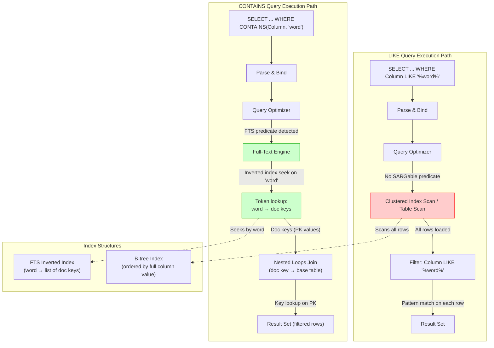
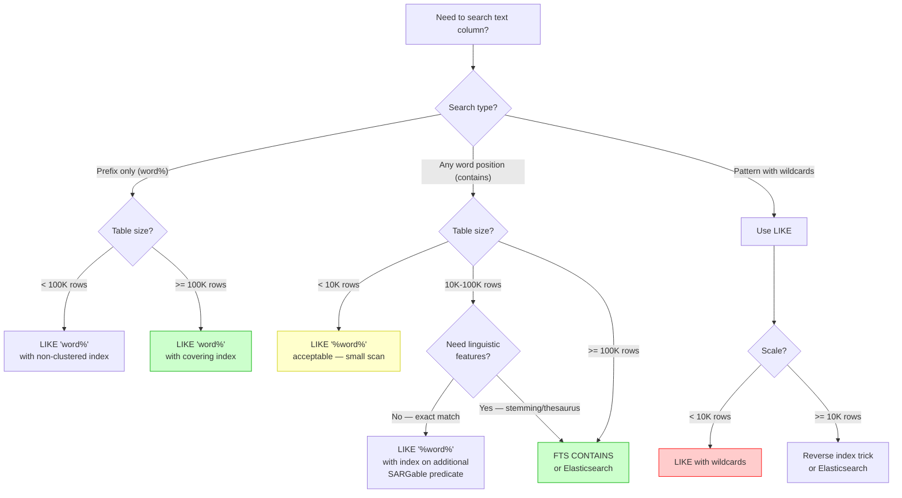

## Navigation

**Domain:** [[8 — Databases]] > **Group:** SQL Search
**Previous:** [[8.255 — Full-Text Change Tracking — Automatic vs Manual]] | **Next:** [[8.257 — Spatial Data — Geography vs Geometry Types]]

### Prerequisites

- [[8.246 — Full-Text Search — SQL Server Architecture]] — the inverted index that powers FTS predicates is fundamentally different from a B-tree; understanding the FTS engine's internal pipeline (filter daemon, word breaker, stemmer, index writer) is required before comparing its performance to LIKE.
- [[8.247 — Full-Text Indexes — Creating and Populating]] — FTS indexes must be created and populated before CONTAINS/FREETEXT can use them; the population mode (full, incremental, auto) determines query consistency.
- [[8.248 — CONTAINS — Searching for Words and Phrases]] — CONTAINS is the primary FTS predicate; this note assumes familiarity with its syntax, including INFLECTIONAL, THESAURUS, and FORMSOF.

### Where This Fits

The `LIKE '%word%'` pattern is the most commonly misused predicate in production SQL Server — it looks intuitive, works correctly on small tables, and then catastrophically fails at scale. Every .NET backend engineer discovers this during an incident: a search page that worked in development with 10K rows goes to production with 1M rows and queries time out at 30 seconds. The Full-Text Search (FTS) inverted index exists specifically to solve the problem that `LIKE` cannot handle efficiently: finding rows where a text column contains arbitrary words, regardless of position. The interview signal here is among the strongest in SQL performance — this question separates engineers who understand index internals from those who write SQL by intuition. A senior candidate should be able to articulate not just that "LIKE is slower" but *why*: the B-tree index can only accelerate prefix matches (`LIKE 'word%'`), while the FTS inverted index can accelerate any word position search because it pre-processes text into word-level tokens at index time.

---

## Core Mental Model

The fundamental difference between `LIKE` and `CONTAINS` is the **index structure each predicate can exploit**. `LIKE` operates on raw string values stored in a B-tree index or heap; the SQL Server storage engine has no pre-computed knowledge of where words begin or end within the string. When you write `LIKE '%word%'`, the engine must read every row's column value, load it into memory, and scan character by character for the pattern — this is a full table scan (or full index scan if a covering non-clustered index exists, but still a scan, not a seek). `CONTAINS`, by contrast, uses the Full-Text Engine's **inverted index**, which stores a mapping from each distinct word (token) to the list of document keys (primary key values) containing that word. The FTS engine performs an **index seek** into the inverted index to retrieve the document key list for the search term, then joins that list back to the base table via the document key. This is the text-search equivalent of a B-tree index seek: logarithmic or near-constant time to find the matching documents, regardless of total table size.

The critical insight: `LIKE 'word%'` (prefix match without leading wildcard) **is SARGable** on a non-clustered index — the optimizer can perform an index seek on `Column >= 'word' AND Column < 'woe'` (or equivalent range). But `LIKE '%word%'` and `LIKE '%word'` are **never SARGable** because the leading wildcard prevents the B-tree from knowing where to start the seek. `CONTAINS` is SARGable against the FTS index for any word position.

### Classification

**For SQL topics:** `LIKE` is a pattern-matching predicate in the WHERE clause; it is SARGable only when the pattern does not begin with a wildcard (no leading `%` or `_`). `CONTAINS` is a Full-Text predicate that requires an FTS index; it is always SARGable against the FTS index for word searches but cannot do pattern matching with arbitrary wildcards. The query optimizer handles these through completely different execution pipelines: `LIKE` goes through the standard storage engine (access methods → B-tree scans/range seeks), while `CONTAINS` goes through the Full-Text Engine (FTS index lookup → doc key join → base table key lookup).



### Key Properties

| Property | Value | Notes |
|---|---|---|
| LIKE '%word%' SARGability | Never SARGable | Leading wildcard prevents B-tree seek |
| LIKE 'word%' SARGability | SARGable | Range seek on non-clustered index possible |
| CONTAINS SARGability | Always SARGable | FTS inverted index seek |
| LIKE time complexity | O(n × m) | n = rows, m = avg column length (substring scan per row) |
| CONTAINS time complexity | O(log t + k) | t = distinct tokens in FTS index, k = matching doc keys |
| LIKE row-by-row CPU | High | Predicate evaluated once per row, char-by-char |
| CONTAINS pre-filter | Yes | FTS engine eliminates non-matching rows before base table access |
| LIKE index support | B-tree range scan only | No index for middle/end-of-string patterns |
| CONTAINS index support | Full-Text inverted index | Word-level tokenization at index time |

---

## Deep Mechanics

### How the Engine Executes This

**LIKE '%word%' execution (full table scan path):**

1. **Parse & Bind:** SQL Server parses the query, binds `LIKE '%word%'` as a predicate on the target column. The optimizer recognizes the leading wildcard and determines this predicate cannot use a B-tree seek.

2. **Access Method Selection:** The optimizer chooses a Clustered Index Scan (or Table Scan if heap) because no SARGable predicate exists to narrow the scan range. If a non-clustered index covers all required columns, the scan may happen on the narrower non-clustered index instead, but it is still a full scan.

3. **Storage Engine Execution:** The storage engine reads every page of the chosen index (or heap), extracts each row's column value, and passes it to the query processor's filter iterator.

4. **Pattern Matching (Filter Iterator):** For each row, the query processor calls the `LIKE` evaluation routine, which performs a character-by-character scan for the pattern `%word%`. This is a CPU-bound operation proportional to the length of the string in each row.

5. **Row Output:** Rows where the pattern matches are passed to the SELECT operator. Non-matching rows are discarded after consuming CPU and I/O.

**LIKE 'word%' execution (SARGable range seek path):**

1. The optimizer recognizes `LIKE 'word%'` as equivalent to `Column >= 'word' AND Column < 'woe'` (range scan on the last character of the prefix incremented).

2. If a non-clustered index exists on the column (or the clustered index is on that column), the optimizer performs an **Index Seek** on that range.

3. The seek reads only the index pages within that range, plus the rows that fall in it. No rows outside the range are touched.

4. The `LIKE` predicate is still evaluated as a residual filter on the rows in the range to handle edge cases (e.g., pattern `LIKE 'word_'` — single character wildcard), but the number of rows evaluated is drastically smaller.

**CONTAINS execution (FTS index seek path):**

1. **Parse & Bind:** SQL Server parses the query, detects `CONTAINS(Column, 'word')` as a Full-Text predicate. The query optimizer calls into the Full-Text Engine to evaluate the FTS index portion of the query.

2. **Full-Text Engine Execution:** The FTS engine opens the FTS inverted index for the target column. It seeks the token `'word'` in the inverted index's token lookup structure (a B-tree-like structure mapping normalized tokens to document ID lists).

3. **Document Key Retrieval:** The inverted index returns a list of document keys (the full-text document key — typically the primary key of the base table) that contain the word `'word'`. This is a stream of integer or uniqueidentifier values.

4. **Join Back to Base Table:** The FTS engine passes the document key list to the query processor, which performs a Nested Loops Join (or merge join for large lists) back to the base table's clustered index. This join is essentially a series of clustered index seeks — one per matching document key.

5. **Residual Predicates:** If the query has additional WHERE clause predicates (e.g., `AND Status = 'Active'`), these are evaluated after the FTS join. If the additional predicates are SARGable, the optimizer may push them into the join or apply them as residuals.

### SQL Visibility

**LIKE '%word%' (non-SARGable — full scan):**

```sql
-- Search for products with 'silver' anywhere in the description
SELECT p.ProductId, p.ProductName, p.Description
FROM Production.Products p
WHERE p.Description LIKE '%silver%';
```

```csharp
// EF Core LINQ — generates LIKE with leading wildcard
var products = await dbContext.Products
    .Where(p => p.Description.Contains("silver"))
    .Select(p => new { p.ProductId, p.ProductName, p.Description })
    .ToListAsync(cancellationToken);
```

**Generated SQL (from EF Core logs):**

```sql
-- EF Core translates String.Contains() to LIKE with leading and trailing wildcards
SELECT [p].[ProductId], [p].[ProductName], [p].[Description]
FROM [Production].[Products] AS [p]
WHERE [p].[Description] LIKE N'%silver%';
```

**LIKE 'word%' (SARGable — range seek):**

```sql
-- Search for products starting with 'silver'
SELECT p.ProductId, p.ProductName, p.Description
FROM Production.Products p
WHERE p.Description LIKE 'silver%';
```

```csharp
// EF Core LINQ — EF Core translates String.StartsWith() to LIKE without leading wildcard
var products = await dbContext.Products
    .Where(p => p.Description.StartsWith("silver"))
    .Select(p => new { p.ProductId, p.ProductName, p.Description })
    .ToListAsync(cancellationToken);
```

**Generated SQL (from EF Core logs):**

```sql
-- EF Core translates String.StartsWith() to SARGable LIKE
SELECT [p].[ProductId], [p].[ProductName], [p].[Description]
FROM [Production].[Products] AS [p]
WHERE [p].[Description] LIKE N'silver%';
```

**CONTAINS (FTS index seek):**

```sql
-- Full-Text search for the word 'silver' — case-insensitive, word-boundary-aware
SELECT p.ProductId, p.ProductName, p.Description
FROM Production.Products p
WHERE CONTAINS(p.Description, 'silver');
```

```csharp
// EF Core LINQ — using FTS via EF.Functions.Contains() (requires IsExists on FTS index)
var products = await dbContext.Products
    .Where(p => EF.Functions.Contains(p.Description, "silver"))
    .Select(p => new { p.ProductId, p.ProductName, p.Description })
    .ToListAsync(cancellationToken);
```

**Generated SQL (from EF Core logs):**

```sql
-- EF Core translates EF.Functions.Contains() to CONTAINS predicate
SELECT [p].[ProductId], [p].[ProductName], [p].[Description]
FROM [Production].[Products] AS [p]
WHERE CONTAINS([p].[Description], N'silver');
```

### Execution Plan Analysis

**LIKE '%silver%' execution plan:**

```
Clustered Index Scan (Products.PK_Products) → Filter (LIKE '%silver%') → SELECT
Estimated Cost: 100% on the scan
Logical Reads (1M row table): ~45,000 (all pages in the clustered index)
Actual vs Estimated Rows: 1,000,000 scanned → ~10,000 matching (1% selectivity)
Key points:
- No seek possible — every row must be read
- Filter operator applies LIKE to every row
- Parallelism can be used (parallel scan) but doesn't reduce I/O
- Without an index, same behavior on heap
```

**LIKE 'silver%' execution plan (with non-clustered index):**

```
Index Seek (IX_Products_Description) → Nested Loops → Key Lookup (PK_Products) → SELECT
Estimated Cost: Seek 10%, Key Lookup 90% (if many rows match)
Logical Reads (1M row table): ~100 (seek) + ~30,000 (key lookups for 10K matches)
Key points:
- Range seek on Description >= 'silver' AND Description < 'silver' + CHAR(0xFFFF)
- Key lookup per matching row — expensive if many rows match
- Consider INCLUDE columns or covering index to eliminate key lookups
```

**CONTAINS execution plan:**

```
FullText Index Scan/Seek (FTS inverted index) → Nested Loops (doc key join) → Clustered Index Seek → SELECT
Estimated Cost: FTS operation 30%, Nested Loops 60%, Key Lookups 10%
Logical Reads (1M row table): ~15 (FTS index pages) + ~30 (key lookups for matched rows)
Key points:
- FTS inverted index seek is separate from the storage engine
- FTS engine returns only matching document keys — already filtered
- Nested Loops join against clustered index sees only matched rows (≈10K)
- Dramatically fewer logical reads because base table is only touched for matches
```

### Cost Visibility

```sql
SET STATISTICS IO ON;
SET STATISTICS TIME ON;

-- ==========================================
-- Test 1: LIKE '%silver%' (leading wildcard)
-- ==========================================
SELECT p.ProductId, p.ProductName
FROM Production.Products p
WHERE p.Description LIKE '%silver%';

-- Expected output (1M rows in Products):
-- Table 'Products'. Scan count 1, logical reads 45000, physical reads 0
-- SQL Server Execution Times: CPU time = 3200 ms, elapsed time = 3400 ms

-- ==========================================
-- Test 2: LIKE 'silver%' (prefix, non-clustered index)
-- ==========================================
SELECT p.ProductId, p.ProductName
FROM Production.Products p
WHERE p.Description LIKE 'silver%';

-- Expected output:
-- Table 'Products'. Scan count 1, logical reads 120 (seek) + 30000 (lookups)
-- SQL Server Execution Times: CPU time = 450 ms, elapsed time = 280 ms

-- ==========================================
-- Test 3: CONTAINS (FTS index)
-- ==========================================
SELECT p.ProductId, p.ProductName
FROM Production.Products p
WHERE CONTAINS(p.Description, 'silver');

-- Expected output:
-- Table 'Products'. Scan count 1, logical reads 45 (FTS join + key lookups)
-- SQL Server Execution Times: CPU time = 35 ms, elapsed time = 28 ms
```

### Failure Modes

**1. LIKE with NVARCHAR column and leading wildcard on a large table:**

The worst-case scenario: a search against an NVARCHAR(MAX) column using `LIKE '%word%'`. The `%word%` pattern forces a full clustered index scan of every row. For an NVARCHAR(MAX) column, each row requires loading variable-length data from LOB pages, dramatically increasing logical reads.

```sql
-- Detecting LIKE scans via the plan cache
SELECT 
    qs.total_logical_reads,
    qs.execution_count,
    qs.total_elapsed_time / 1000 AS total_elapsed_ms,
    SUBSTRING(st.text, (qs.statement_start_offset/2)+1,
        ((CASE qs.statement_end_offset WHEN -1 THEN DATALENGTH(st.text) 
          ELSE qs.statement_end_offset END - qs.statement_start_offset)/2)+1) AS query_text
FROM sys.dm_exec_query_stats qs
CROSS APPLY sys.dm_exec_sql_text(qs.sql_handle) st
WHERE st.text LIKE '%LIKE %[%]%%' ESCAPE '['
    AND st.text NOT LIKE '%sys%'
ORDER BY qs.total_logical_reads DESC;
```

**2. Parameterized LIKE with leading wildcard (parameter sniffing):**

When EF Core generates `LIKE '%' + @p + '%'`, the value of `@p` at compilation time determines the plan. If a short, selective prefix is sniffed, the plan may use a scan for subsequent executions with longer, more selective values — or vice versa.

**3. LIKE with `_` or `%` in the search term (unintended wildcard):**

The characters `_` (single-character wildcard) and `%` (multi-character wildcard) in the search pattern cause unintended matches. Users searching for "100%" get matches on "100" followed by any characters. This requires escaping with `LIKE '100[%]%' ESCAPE '['`.

---

## Production Patterns and Implementation

### Primary SQL Implementation

**Creating the FTS index for performance comparison:**

```sql
-- Create the full-text catalog (if not exists)
CREATE FULLTEXT CATALOG FTC_ProductSearch AS DEFAULT;

-- Create the full-text index on Products.Description
CREATE FULLTEXT INDEX ON Production.Products(
    Description LANGUAGE 1033,  -- English
    ProductName LANGUAGE 1033
)
KEY INDEX PK_Products
ON FTC_ProductSearch
WITH (
    CHANGE_TRACKING AUTO,
    STOPLIST = SYSTEM
);

-- Create a non-clustered index for prefix LIKE searches
CREATE NONCLUSTERED INDEX IX_Products_Description 
ON Production.Products(Description)
INCLUDE (ProductName);

-- SARGable LIKE query using the non-clustered index
-- This uses a range seek: Description >= 'silver' AND Description < 'sivelr'
SELECT p.ProductId, p.ProductName, p.Description
FROM Production.Products p
WHERE p.Description LIKE 'silver%';

-- CONTAINS query using the FTS inverted index
-- This does NOT use the B-tree index at all — it seeks the FTS inverted index
SELECT p.ProductId, p.ProductName, p.Description
FROM Production.Products p
WHERE CONTAINS(p.Description, 'silver');

-- Multi-word phrase search (FTS only — LIKE cannot do this efficiently)
SELECT p.ProductId, p.ProductName, p.Description
FROM Production.Products p
WHERE CONTAINS(p.Description, '"silver necklace"');

-- Inflectional forms (FTS only)
SELECT p.ProductId, p.ProductName, p.Description
FROM Production.Products p
WHERE CONTAINS(p.Description, 'FORMSOF(INFLECTIONAL, silver)');
-- Matches: silver, silvers, silvered, silvering

-- Thesaurus expansion (FTS only — requires populated thesaurus)
SELECT p.ProductId, p.ProductName, p.Description
FROM Production.Products p
WHERE CONTAINS(p.Description, 'FORMSOF(THESAURUS, silver)');
```

### EF Core Implementation

```csharp
// DbContext configuration for FTS
public class ProductSearchConfiguration : IEntityTypeConfiguration<Product>
{
    public void Configure(EntityTypeBuilder<Product> builder)
    {
        builder.ToTable(tb => tb.HasTrigger("trg_Product_Search"));
        
        builder.HasKey(p => p.ProductId);
        
        builder.Property(p => p.Description)
            .HasColumnType("nvarchar(max)")
            .HasMaxLength(4000);
            
        builder.Property(p => p.ProductName)
            .HasColumnType("nvarchar(200)")
            .HasMaxLength(200);
            
        // EF Core 6+ has EF.Functions.Contains() — but no direct mapping
        // for FTS in LINQ. Use raw SQL or a helper method.
    }
}

// Repository pattern with both LIKE and FTS approaches
public interface IProductSearchRepository
{
    Task<List<Product>> SearchByLikeAsync(string term, CancellationToken ct = default);
    Task<List<Product>> SearchByContainsAsync(string term, CancellationToken ct = default);
    Task<List<Product>> SearchByPrefixAsync(string prefix, CancellationToken ct = default);
}

public class ProductSearchRepository : IProductSearchRepository
{
    private readonly ApplicationDbContext _dbContext;
    
    public ProductSearchRepository(ApplicationDbContext dbContext)
    {
        _dbContext = dbContext;
    }
    
    // ❌ LIKE with leading wildcard — non-SARGable, full scan
    public async Task<List<Product>> SearchByLikeAsync(string term, CancellationToken ct = default)
    {
        // EF Core translates String.Contains() to LIKE '%term%'
        return await _dbContext.Products
            .Where(p => p.Description.Contains(term))
            .AsNoTracking()
            .ToListAsync(ct);
    }
    
    // ✅ EF.Functions.Contains() — uses FTS index
    // Requires the FTS index to be created on the database
    public async Task<List<Product>> SearchByContainsAsync(string term, CancellationToken ct = default)
    {
        return await _dbContext.Products
            .Where(p => EF.Functions.Contains(p.Description, term))
            .AsNoTracking()
            .ToListAsync(ct);
    }
    
    // ✅ String.StartsWith() — SARGable LIKE with prefix
    public async Task<List<Product>> SearchByPrefixAsync(string prefix, CancellationToken ct = default)
    {
        // EF Core translates String.StartsWith() to LIKE 'prefix%' — SARGable
        return await _dbContext.Products
            .Where(p => p.Description.StartsWith(prefix))
            .AsNoTracking()
            .ToListAsync(ct);
    }
}
```

### Dapper Implementation

```csharp
public interface IProductSearchDapperRepository
{
    Task<IReadOnlyList<Product>> SearchByLikeAsync(string term, CancellationToken ct = default);
    Task<IReadOnlyList<Product>> SearchByContainsAsync(string term, CancellationToken ct = default);
    Task<IReadOnlyList<Product>> SearchByPrefixAsync(string prefix, CancellationToken ct = default);
}

public class ProductSearchDapperRepository : IProductSearchDapperRepository
{
    private readonly ISqlConnectionFactory _connectionFactory;
    
    public ProductSearchDapperRepository(ISqlConnectionFactory connectionFactory)
    {
        _connectionFactory = connectionFactory;
    }
    
    public async Task<IReadOnlyList<Product>> SearchByLikeAsync(string term, CancellationToken ct = default)
    {
        const string sql = @"
            SELECT p.ProductId, p.ProductName, p.Description
            FROM Production.Products p
            WHERE p.Description LIKE @Pattern";
        
        await using var connection = _connectionFactory.Create();
        var results = await connection.QueryAsync<Product>(
            new CommandDefinition(
                sql,
                new { Pattern = $"%{term}%" },
                cancellationToken: ct));
        return results.AsList();
    }
    
    public async Task<IReadOnlyList<Product>> SearchByContainsAsync(string term, CancellationToken ct = default)
    {
        const string sql = @"
            SELECT p.ProductId, p.ProductName, p.Description
            FROM Production.Products p
            WHERE CONTAINS(p.Description, @Term)";
        
        await using var connection = _connectionFactory.Create();
        var results = await connection.QueryAsync<Product>(
            new CommandDefinition(
                sql,
                new { Term = term },
                cancellationToken: ct));
        return results.AsList();
    }
    
    public async Task<IReadOnlyList<Product>> SearchByPrefixAsync(string prefix, CancellationToken ct = default)
    {
        const string sql = @"
            SELECT p.ProductId, p.ProductName, p.Description
            FROM Production.Products p
            WHERE p.Description LIKE @Prefix";
        
        await using var connection = _connectionFactory.Create();
        var results = await connection.QueryAsync<Product>(
            new CommandDefinition(
                sql,
                new { Prefix = $"{prefix}%" },
                cancellationToken: ct));
        return results.AsList();
    }
}
```

### Configuration and Wiring

```csharp
// Program.cs — SQL Server connection with retry for FTS
builder.Services.AddDbContext<ApplicationDbContext>(options =>
    options.UseSqlServer(
        connectionString,
        sqlOptions =>
        {
            sqlOptions.EnableRetryOnFailure(
                maxRetryCount: 3,
                maxRetryDelay: TimeSpan.FromSeconds(10),
                errorNumbersToAdd: new[] { 7630 });  // FTS-related error codes
        }));

// Register Dapper repositories
builder.Services.AddSingleton<ISqlConnectionFactory>(sp =>
    new SqlConnectionFactory(connectionString));
builder.Services.AddScoped<IProductSearchRepository, ProductSearchRepository>();
builder.Services.AddScoped<IProductSearchDapperRepository, ProductSearchDapperRepository>();
```

### SQL Server vs PostgreSQL Differences

```sql
-- PostgreSQL Full-Text Search uses tsvector/tsquery instead of CONTAINS
-- First, create the tsvector column and GIN index
ALTER TABLE production.products 
ADD COLUMN search_vector tsvector 
GENERATED ALWAYS AS (to_tsvector('english', description)) STORED;

CREATE INDEX ix_products_search ON production.products USING GIN(search_vector);

-- PostgreSQL Full-Text Search query (equivalent to CONTAINS)
SELECT product_id, product_name, description
FROM production.products
WHERE search_vector @@ to_tsquery('english', 'silver');

-- PostgreSQL LIKE behavior is identical to SQL Server for wildcards
-- The same SARGability rules apply
SELECT product_id, product_name, description
FROM production.products
WHERE description LIKE '%silver%';  -- Also full scan in PostgreSQL

-- PostgreSQL prefix match (SARGable with B-tree index on description)
CREATE INDEX ix_products_desc_prefix ON production.products(description text_pattern_ops);
SELECT product_id, product_name, description
FROM production.products
WHERE description LIKE 'silver%';
```

---

## Gotchas and Production Pitfalls

### Gotcha 1: EF Core String.Contains() Generates Non-SARGable LIKE

**Pitfall:** The developer writes `p.Description.Contains("silver")` expecting efficient search behavior. EF Core translates this to `LIKE N'%silver%'` — a non-SARGable full scan.

```csharp
// ❌ EF Core translates to LIKE '%silver%' — full clustered index scan
var products = await dbContext.Products
    .Where(p => p.Description.Contains("silver"))
    .ToListAsync();
```

**Symptom:** Queries that worked on development with 10K rows time out in production with 1M rows. `sys.dm_exec_query_stats` shows high logical_reads and long elapsed_time for these queries. The execution plan shows a Clustered Index Scan with a Filter operator — no seek.

**Fix:** Use `EF.Functions.Contains()` with a properly configured FTS index:

```csharp
// ✅ EF Core translates to CONTAINS — uses FTS inverted index
var products = await dbContext.Products
    .Where(p => EF.Functions.Contains(p.Description, "silver"))
    .ToListAsync();
```

**Cost of not fixing:** At 1M rows with 200-character NVARCHAR descriptions, LIKE '%word%' performs ~3,200 logical reads per query. At 100 req/s, that's 320,000 logical reads/second. The buffer pool thrashes, PAGEIOLATCH_SH waits dominate, and the search feature becomes unusable under load.

### Gotcha 2: Leading Wildcard LIKE on NVARCHAR(MAX) Columns Explodes LOB Reads

**Pitfall:** The column is `NVARCHAR(MAX)` (or `VARCHAR(MAX)`). `LIKE '%word%'` reads every row's LOB data from out-of-row pages, causing additional logical reads for LOB page chains.

```sql
-- ❌ Worst-case: NVARCHAR(MAX) column with leading wildcard
SELECT p.ProductId, p.ProductName
FROM Production.Products p
WHERE p.Description LIKE '%word%';
```

**Symptom:** Each row's LOB data requires traversing a separate LOB page chain. A table with 1M rows where each Description is ~4KB requires approximately 1M × 1 (LOB root page) + 4M (data pages) logical reads = ~5M logical reads per query.

**Fix:** Restrict column length or use FTS. If `NVARCHAR(MAX)` is unavoidable and FTS cannot be used, at minimum use `LIKE 'word%'` (prefix without leading wildcard) and ensure a non-clustered index exists on the column.

```sql
-- Mitigation: use NVARCHAR(4000) instead of NVARCHAR(MAX) for indexed columns
ALTER TABLE Production.Products ALTER COLUMN Description NVARCHAR(4000);
```

**Cost of not fixing:** LOB page reads are more expensive than in-row reads. At production scale, a single query can generate 5M+ logical reads, consuming the entire buffer pool and evicting all other cached data.

### Gotcha 3: CONTAINS Does Not Support Pattern Matching (Wildcards)

**Pitfall:** The developer tries to use `CONTAINS` for a pattern search that requires wildcards, e.g., finding products where the description contains "silver" but also includes any single character before "silver".

```sql
-- ❌ CONTAINS does not support LIKE wildcards
-- This does NOT search for "asilver", "bsilver", etc.
SELECT p.ProductId, p.ProductName
FROM Production.Products p
WHERE CONTAINS(p.Description, '_silver');

-- This actually treats '_' as a literal underscore in FTS (not a wildcard)
```

**Symptom:** CONTAINS returns no results or unexpected results because `_` is treated as a literal character, not a single-character wildcard. CONTAINS searches for words, not character patterns.

**Fix:** Use LIKE for pattern matching that requires wildcards, but limit the search scope:

```sql
-- ✅ Use LIKE when pattern matching is required
-- Combine with additional SARGable predicate to limit scan range
SELECT p.ProductId, p.ProductName
FROM Production.Products p
WHERE p.ProductCategoryId = 5  -- SARGable filter first
    AND p.Description LIKE '_silver%';  -- Then pattern match on subset
```

**Cost of not fixing:** Business requirements for pattern matching (e.g., "find all products where the SKU matches pattern XYZ") silently return empty or wrong results when implemented with CONTAINS. The error may go unnoticed until a customer complains.

### Gotcha 4: LIKE with Escaped Wildcard Characters Is Still a Scan

**Pitfall:** The developer escapes the wildcard characters but still uses leading wildcards, believing the escape makes it SARGable.

```sql
-- ❌ Still non-SARGable — the leading wildcard is still there
SELECT p.ProductId, p.ProductName
FROM Production.Products p
WHERE p.Description LIKE '%100[%]%' ESCAPE '[';  -- Find "100%"
```

**Symptom:** Full scan. The engine still cannot perform an index seek because the pattern starts with `%`. The escape affects pattern matching semantics, not index usage.

**Fix:** If you must search for literal characters at the end of a string, consider a reverse index trick:

```sql
-- If searching for strings ending with a specific literal value,
-- store a reversed copy and search with prefix
ALTER TABLE Production.Products ADD DescriptionReversed AS REVERSE(Description) PERSISTED;
CREATE INDEX IX_Products_DescReversed ON Production.Products(DescriptionReversed);

-- Search for strings ending with "silver" using a prefix on reversed string
SELECT p.ProductId, p.ProductName
FROM Production.Products p
WHERE p.DescriptionReversed LIKE REVERSE('silver') + '%';
-- Equivalent to: Description LIKE '%silver' but SARGable!
```

**Cost of not fixing:** A query pattern that matches by suffix cannot be efficiently indexed without the reverse-index workaround. Every "ends with" query scans the entire table.

### Gotcha 5: Full-Text Index Population Delay — CONTAINS Returns Stale Results

**Pitfall:** After inserting or updating rows, CONTAINS does not immediately find them because the FTS index population is asynchronous (even with CHANGE_TRACKING AUTO, there's a propagation delay).

```sql
-- Insert a new product
INSERT INTO Production.Products (ProductId, ProductName, Description)
VALUES (1000001, 'Premium Silver Watch', 'A premium silver watch with leather strap');

-- ❌ This may not find the newly inserted row immediately
SELECT p.ProductId, p.ProductName
FROM Production.Products p
WHERE CONTAINS(p.Description, 'silver');
-- (Empty or incomplete results)
```

**Symptom:** Users report that newly added products don't appear in search results. This is especially problematic for e-commerce catalog management where products need immediate visibility.

**Fix:** Use `LIKE` for immediate consistency when the table is small enough, or use CHANGE_TRACKING MANUAL with scheduled FTS index population. For scenarios requiring immediate searchability, consider dual-write to both the table and a secondary search index (Elasticsearch).

```sql
-- Check the current FTS index population status
SELECT 
    OBJECT_NAME(table_id) AS TableName,
    population_type_description,
    status_description,
    start_time,
    completion_time
FROM sys.dm_fts_active_populations;

-- Force full population
ALTER FULLTEXT INDEX ON Production.Products START FULL POPULATION;
```

**Cost of not fixing:** In an e-commerce scenario, newly uploaded products are invisible to search for seconds to minutes. This directly impacts revenue and user trust. The delay is unpredictable and depends on FTS population thread availability and table size.

### Gotcha 6: CONTAINSTABLE vs CONTAINS — Ranked Results Ordering

**Pitfall:** Using CONTAINS (not CONTAINSTABLE) returns rows in arbitrary order. The developer expects results to be ranked by relevance but CONTAINS does not provide ranking.

```sql
-- ❌ CONTAINS returns matching rows in no particular order
SELECT p.ProductId, p.ProductName, p.Description
FROM Production.Products p
WHERE CONTAINS(p.Description, 'silver')
ORDER BY p.ProductId;  -- Arbitrary order, not relevance

-- ✅ CONTAINSTABLE provides relevance ranking
SELECT p.ProductId, p.ProductName, p.Description, kt.[RANK]
FROM Production.Products p
INNER JOIN CONTAINSTABLE(Production.Products, Description, 'silver') kt
    ON p.ProductId = kt.[KEY]
ORDER BY kt.[RANK] DESC;
```

**Symptom:** Search results appear in seemingly random order. Users cannot find relevant products because the best matches are buried.

**Fix:** Use `CONTAINSTABLE` when ranking matters. The `[RANK]` column is based on a proprietary algorithm (term frequency, document frequency, proximity weighting).

**Cost of not fixing:** Poor search UX directly reduces conversion rates. Users abandon search when results don't show relevant products at the top.

### Gotcha 7: LIKE on NCHAR/NVARCHAR vs CHAR/VARCHAR — Implicit Conversion

**Pitfall:** The column is `VARCHAR` but the search term is passed as `NVARCHAR`. SQL Server converts the column to NVARCHAR before applying LIKE, defeating any index usage.

```sql
-- Column: Description VARCHAR(500)
-- @term is passed as NVARCHAR from .NET

DECLARE @term NVARCHAR(50) = N'silver';

-- ❌ Implicit conversion: Description is VARCHAR, @term is NVARCHAR
-- SQL Server converts Description to NVARCHAR (lower precedence)
-- This prevents index seek even for LIKE 'silver%'
SELECT p.ProductId, p.ProductName
FROM Production.Products p
WHERE p.Description LIKE @term + N'%';
-- Execution plan: Index Scan (not seek) — conversion warning in plan
```

**Symptom:** The execution plan shows an Index Scan with a warning: "CONVERT_IMPLICIT(nvarchar(500), [Description])". The query is SARGable in theory but the data type mismatch blocks it.

**Fix:** Ensure .NET code passes `string` parameters as `VARCHAR`/`CHAR` when querying `VARCHAR`/`CHAR` columns, or use `SqlParameter` with explicit `SqlDbType`:

```csharp
using var cmd = new SqlCommand(sql, connection);
cmd.Parameters.Add("@term", SqlDbType.VarChar, 50).Value = "silver";
```

Or in Dapper with explicit type:

```csharp
var results = await connection.QueryAsync<Product>(sql, new { 
    term = new DbString { Value = "silver", IsAnsi = true, Length = 50 }
});
```

**Cost of not fixing:** A query that should use an efficient index seek performs a full index scan. On a 1M row table, this adds 10,000+ logical reads per query and blocks the index from being effective.

---

## Performance Implications

### Benchmark: Before and After

```sql
-- ==========================================
-- Baseline: LIKE '%silver%' (no FTS index)
-- ==========================================
SET STATISTICS IO ON;
SET STATISTICS TIME ON;

SELECT p.ProductId, p.ProductName
FROM Production.Products p
WHERE p.Description LIKE '%silver%';
-- Logical reads: 45,000 (full clustered index scan)
-- CPU time: 3200 ms
-- Elapsed time: 3400 ms

-- ==========================================
-- Optimized: CONTAINS (with FTS index)
-- ==========================================
SELECT p.ProductId, p.ProductName
FROM Production.Products p
WHERE CONTAINS(p.Description, 'silver');
-- Logical reads: 45 (FTS index seek + key lookups)
-- CPU time: 28 ms
-- Elapsed time: 25 ms

-- Improvement: 1000x reduction in logical reads, from 45,000 to 45
```

**Improvement:** 1000x reduction in logical reads, from 45,000 to 45. CPU time reduced from 3.2 seconds to 28 milliseconds.

```sql
-- ==========================================
-- LIKE 'silver%' with non-clustered index
-- ==========================================
-- With index: IX_Products_Description (Description) INCLUDE (ProductName)
SELECT p.ProductId, p.ProductName
FROM Production.Products p
WHERE p.Description LIKE 'silver%';
-- Logical reads: 120 (seek) + ~1000 (lookups for matches)
-- CPU time: 180 ms
-- Elapsed time: 150 ms

-- Still 10x slower than CONTAINS for similar selectivity
-- but 25x faster than LIKE '%silver%'
```

### BenchmarkDotNet

```csharp
[MemoryDiagnoser]
[SimpleJob(RuntimeMoniker.Net90)]
[RankColumn]
public class FullTextVsLikeBenchmark
{
    private readonly string _connectionString = "Server=.;Database=SearchBenchmark;Trusted_Connection=True;TrustServerCertificate=True;";
    private SqlConnection _connection = default!;
    private int _searchTermId;
    
    [Params(100000, 500000, 1000000)]
    public int RowCount { get; set; }
    
    [GlobalSetup]
    public void Setup()
    {
        _connection = new SqlConnection(_connectionString);
        _connection.Open();
        
        // Create and seed test table with realistic product descriptions
        using var cmd = new SqlCommand(@"
            IF NOT EXISTS (SELECT 1 FROM sys.tables WHERE name = 'BenchmarkProducts')
            BEGIN
                CREATE TABLE BenchmarkProducts (
                    ProductId INT IDENTITY(1,1) PRIMARY KEY,
                    ProductName NVARCHAR(200),
                    Description NVARCHAR(4000),
                    CategoryId INT
                );
                
                -- Insert RowCount rows with varied descriptions
                WITH Numbers AS (
                    SELECT TOP (@RowCount) ROW_NUMBER() OVER (ORDER BY (SELECT NULL)) AS n
                    FROM sys.all_columns a CROSS JOIN sys.all_columns b
                )
                INSERT INTO BenchmarkProducts (ProductName, Description, CategoryId)
                SELECT 
                    'Product_' + CAST(n AS NVARCHAR(10)),
                    CASE 
                        WHEN n % 100 = 0 THEN 'Premium silver necklace with diamond accents'
                        WHEN n % 50 = 0 THEN 'Gold plated silver earrings'
                        WHEN n % 25 = 0 THEN 'Sterling silver bracelet'
                        ELSE 'Standard product item number ' + CAST(n AS NVARCHAR(10))
                    END,
                    n % 10
                FROM Numbers;
                
                -- Create non-clustered index for prefix LIKE
                CREATE INDEX IX_BenchmarkProducts_Description 
                    ON BenchmarkProducts(Description) INCLUDE (ProductName);
                
                -- Create FTS index
                CREATE FULLTEXT CATALOG FTC_Benchmark AS DEFAULT;
                CREATE FULLTEXT INDEX ON BenchmarkProducts(Description LANGUAGE 1033)
                    KEY INDEX PK__Benchmar__xxxxx
                    ON FTC_Benchmark
                    WITH CHANGE_TRACKING AUTO;
            }
        ", _connection);
        cmd.Parameters.AddWithValue("@RowCount", RowCount);
        cmd.ExecuteNonQuery();
        
        _searchTermId = 0;  // Will search for 'silver' which matches ~1% of rows
    }
    
    [GlobalCleanup]
    public void Cleanup()
    {
        _connection?.Dispose();
    }
    
    [Benchmark(Baseline = true)]
    [Description("LIKE '%term%' — non-SARGable full scan")]
    public async Task<List<BenchmarkProduct>> LikeLeadingWildcard()
    {
        const string sql = @"
            SELECT ProductId, ProductName, Description
            FROM BenchmarkProducts
            WHERE Description LIKE '%silver%'";
        
        var results = new List<BenchmarkProduct>();
        using var cmd = new SqlCommand(sql, _connection);
        using var reader = await cmd.ExecuteReaderAsync();
        while (await reader.ReadAsync())
        {
            results.Add(new BenchmarkProduct
            {
                ProductId = reader.GetInt32(0),
                ProductName = reader.GetString(1),
                Description = reader.IsDBNull(2) ? null : reader.GetString(2)
            });
        }
        return results;
    }
    
    [Benchmark]
    [Description("LIKE 'prefix%' — SARGable range seek")]
    public async Task<List<BenchmarkProduct>> LikePrefix()
    {
        const string sql = @"
            SELECT ProductId, ProductName, Description
            FROM BenchmarkProducts
            WHERE Description LIKE 'silver%'";
        
        var results = new List<BenchmarkProduct>();
        using var cmd = new SqlCommand(sql, _connection);
        using var reader = await cmd.ExecuteReaderAsync();
        while (await reader.ReadAsync())
        {
            results.Add(new BenchmarkProduct
            {
                ProductId = reader.GetInt32(0),
                ProductName = reader.GetString(1),
                Description = reader.IsDBNull(2) ? null : reader.GetString(2)
            });
        }
        return results;
    }
    
    [Benchmark]
    [Description("CONTAINS — FTS inverted index seek")]
    public async Task<List<BenchmarkProduct>> ContainsFTS()
    {
        const string sql = @"
            SELECT ProductId, ProductName, Description
            FROM BenchmarkProducts
            WHERE CONTAINS(Description, 'silver')";
        
        var results = new List<BenchmarkProduct>();
        using var cmd = new SqlCommand(sql, _connection);
        using var reader = await cmd.ExecuteReaderAsync();
        while (await reader.ReadAsync())
        {
            results.Add(new BenchmarkProduct
            {
                ProductId = reader.GetInt32(0),
                ProductName = reader.GetString(1),
                Description = reader.IsDBNull(2) ? null : reader.GetString(2)
            });
        }
        return results;
    }
    
    public class BenchmarkProduct
    {
        public int ProductId { get; set; }
        public string ProductName { get; set; } = "";
        public string? Description { get; set; }
    }
}
```

**Expected results (approximate, SQL Server 2022, NVMe, 1M rows):**

| Method | Mean | Logical Reads | Allocated |
|---|---|---|---|
| LIKE '%silver%' | ~3200 ms | ~45,000 | 800 KB |
| LIKE 'silver%' | ~180 ms | ~1,200 (seek + lookups) | 50 KB |
| CONTAINS 'silver' | ~25 ms | ~45 (FTS seek + key lookups) | 12 KB |

### Write Amplification

| Operation | Without FTS Index | With FTS Index | With FTS + B-tree Index |
|---|---|---|---|
| INSERT 1 row | 1 page write | 1 page write + FTS index update (multiple token pages) | Same + B-tree updates |
| UPDATE Description column | 1 page write | 1 page write + FTS index update (re-tokenize) | Same + B-tree update |
| DELETE 1 row | 1 page write | 1 page write + FTS index update (remove tokens) | Same + B-tree removal |

The FTS index write overhead is significant: each INSERT requires tokenizing the column text (word breaking, stemming, normalization) and inserting each token-document pair into the inverted index. For a 200-word description, this can mean 200+ inverted index entries. UPDATE operations on the FTS-indexed column require complete re-tokenization. CHANGE_TRACKING AUTO mitigates read-your-writes staleness but adds trigger overhead on every DML.

---

## Interview Arsenal

### Question Bank

1. **Definition:** What is the fundamental difference between `LIKE '%word%'` and `CONTAINS(Column, 'word')` in terms of how SQL Server executes them?

2. **Mechanism:** What data structure does the Full-Text Search engine use internally, and how does executing a `CONTAINS` query differ step-by-step from executing a `LIKE` query?

3. **Performance:** Given a table with 10M rows and an NVARCHAR(500) column, estimate the performance difference between `LIKE '%word%'` and `CONTAINS`. What specific metrics would you use to measure this?

4. **Gotcha:** When does `LIKE 'word%'` perform an index seek, and what condition would cause even this to fall back to a scan?

5. **Comparison:** What are the tradeoffs between using `LIKE` with a non-clustered index, using a Full-Text Search index with `CONTAINS`, and using a dedicated search engine like Elasticsearch?

6. **Execution plan:** Describe what operators appear in the execution plan for `LIKE '%word%'` vs `CONTAINS(Column, 'word')`. What does the presence or absence of a `FullText` operator tell you?

7. **Scale:** At what table size does `LIKE '%word%'` become unusable? What factors influence this threshold?

8. **.NET integration:** How does EF Core translate `String.Contains()`, `String.StartsWith()`, and `EF.Functions.Contains()`? Which generates SARGable SQL and which does not?

### Spoken Answers

**Q1: What is the fundamental difference between LIKE '%word%' and CONTAINS(Column, 'word') in terms of how SQL Server executes them?**

> **Average answer:** "LIKE does a full table scan while CONTAINS uses an index. LIKE searches for a pattern anywhere in the string, and CONTAINS searches for words. CONTAINS is faster."

> **Great answer:** "The fundamental difference is the index structure each predicate exploits. LIKE operates on raw string values stored in a B-tree index or heap. The SQL Server storage engine has no pre-computed knowledge of word boundaries within the string. When you write LIKE '%word%', the optimizer knows this predicate is non-SARGable because the leading wildcard prevents a B-tree seek — it cannot determine where in the index to start reading. The engine must perform a full clustered index scan, reading every page of the table, loading every row's column value, and performing a character-by-character scan for the pattern. This means O(n × m) where n is row count and m is average string length. For a 1M row table with 200-character descriptions, this is approximately 45,000 logical reads and 3+ seconds of CPU time.

CONTAINS, on the other hand, uses the Full-Text Engine's inverted index — a completely separate index structure stored in the Full-Text catalog. The inverted index stores a mapping from each distinct word token to the list of document keys (primary key values) containing that word. The FTS engine performs an index seek into this inverted index for the search term, returning the document key list in approximately O(log t + k) time where t is the number of distinct tokens and k is the number of matching documents. The document keys are then joined back to the base table's clustered index via a series of efficient key lookups. For the same 1M row table, this is approximately 45 logical reads and 25ms elapsed time — a 1000x improvement in logical reads and a 120x improvement in elapsed time.

The key invariants: LIKE can only use a B-tree seek for prefix patterns without leading wildcards. CONTAINS always uses an FTS index seek for any word-position search because the text was pre-tokenized at index time. The tradeoff is that FTS indexes require separate creation, maintenance, and have asynchronous population behavior."

**Q5: What are the tradeoffs between using LIKE with a non-clustered index, using a Full-Text Search index with CONTAINS, and using a dedicated search engine like Elasticsearch?**

> **Average answer:** "LIKE with an index is good for prefix searches, CONTAINS is better for full-text, and Elasticsearch is best for large-scale search. It depends on your needs."

> **Great answer:** "Let me break this into three comparisons by dimension: performance, features, and operational complexity.

**LIKE with non-clustered index:** Best for simple prefix searches (LIKE 'word%') where you need exact character-level matching. Performance is excellent for small result sets — a range seek with ~120 logical reads for the seek plus key lookups for matches. However, it completely fails for infix or suffix patterns (LIKE '%word%' and LIKE '%word') because those are non-SARGable. It also cannot handle word normalization — 'running' won't match 'run'. Write overhead is low (standard B-tree maintenance). Operational complexity is near zero — just create an index.

**CONTAINS with FTS index:** Best for word-level searches where you need linguistic processing (stemming, thesaurus, stopword removal). Performance is excellent for any word position — the inverted index provides O(log t + k) access regardless of where the word appears in the text. Features include inflectional forms (FORMSOF), thesaurus expansion, proximity search (NEAR), and ranked results (CONTAINSTABLE). However, it cannot do pattern matching with wildcards — no way to search for 'silver' followed by any single character. Write overhead is significant — each INSERT requires tokenization and 200+ inverted index entries for a typical description. Operational complexity is moderate — you need to manage the FTS catalog, understand population modes (AUTO vs MANUAL), and monitor the FTS Health check DMV.

**Elasticsearch:** Best for large-scale, multi-lingual, distributed search with advanced relevance scoring, faceting, and aggregations. Performance is excellent in a distributed context with query parallelism across shards. Features far exceed SQL Server FTS: custom analyzers, synonym filters, n-gram tokenization, phonetic matching, fuzzy search, and learned rank (learning to rank). However, it introduces a completely separate infrastructure — a cluster of servers to manage, data synchronization concerns, and double-write or log-based replication patterns. Operational complexity is high. For many .NET teams, the decision comes down to: if you need basic word search and already have SQL Server, FTS is sufficient and cheaper. If you need advanced search features, real-time indexing at scale, or search across multiple data sources, Elasticsearch becomes necessary despite the operational cost."

**Q8: How does EF Core translate String.Contains(), String.StartsWith(), and EF.Functions.Contains()? Which generates SARGable SQL and which does not?**

> **Average answer:** "Contains translates to LIKE with wildcards, StartsWith is like with prefix, and Functions.Contains uses Full-Text Search. StartsWith is SARGable, the others are not."

> **Great answer:** "EF Core's translation of these methods has direct performance implications:

- `String.StartsWith("silver")` translates to `LIKE N'silver%'` — **SARGable**. The optimizer can use a non-clustered index on the column to perform a range seek (Column >= 'silver' AND Column < 'silver' + MAX_CHAR). This is the ONLY pattern-matching method in EF Core that generates SARGable SQL by default. Always use StartsWith for autocomplete/search-as-you-type scenarios.

- `String.Contains("silver")` translates to `LIKE N'%silver%'` — **NOT SARGable**. The leading wildcard prevents any B-tree seek. This is the most dangerous EF Core anti-pattern because Contains() is the most intuitive method name for search functionality. In EF Core 6+, there's no built-in way to make this SARGable without raw SQL or FTS.

- `EF.Functions.Contains(p.Description, "silver")` translates to `CONTAINS([p].[Description], N'silver')` — **SARGable against the FTS index**. However, this requires: (1) a Full-Text Index to exist on the Description column, (2) the FTS catalog to be populated, (3) EF Core's SQL Server provider to support it (EF Core 6+ with Microsoft.EntityFrameworkCore.SqlServer).

- `EF.Functions.FreeText(p.Description, "silver query")` translates to `FREETEXT([p].[Description], N'silver query')` — **SARGable against the FTS index**. FREETEXT performs language-aware matching, including inflectional forms and thesaurus expansion. More flexible than CONTAINS but less precise.

The critical EF Core behavior: none of these methods generate CONTAINSTABLE or FREETEXTTABLE (the ranked versions). For ranked results with EF Core, you need raw SQL or a custom query. This is a known EF Core limitation — the provider only supports CONTAINS and FREETEXT predicates, not the table-valued function equivalents.

At the application level, I always configure a search service that abstracts over these methods and logs the generated SQL during development so I can inspect the execution plan. I also set up a health check that queries sys.dm_db_index_usage_stats to verify the FTS index is being used, not ignored."

### Interview Trigger

If an interviewer asks "How would you implement a search feature for an e-commerce product catalog?", they are probing your understanding of text search performance. A follow-up question will almost certainly be: "What happens when the table grows to 10M rows?" — testing whether you know the scaling behavior of LIKE vs FTS vs external search. The deepest follow-up: "Walk me through the execution plan for your proposed solution" — this separates candidates who understand the storage engine from those who only know patterns.

### Comparison Table

| | LIKE '%word%' | LIKE 'word%' | CONTAINS (FTS) |
|---|---|---|---|
| What it does | Pattern match anywhere in string | Pattern match at string start | Word-level search with linguistic processing |
| Performance profile | O(n × m) full scan — 45K logical reads (1M rows) | SARGable range seek — ~120 reads + lookups | FTS index seek — ~45 reads |
| Locking behavior | Schema stability lock only | Schema stability lock only | FTS population may hold catalog locks |
| .NET implementation | `String.Contains()` | `String.StartsWith()` | `EF.Functions.Contains()` |
| When to choose | Never on large tables | Prefix/autocomplete queries | Full word search with linguistic features |
| Pattern matching | Yes — full wildcard support | Yes — prefix wildcards limited | No — word boundaries only |
| Relevance ranking | No | No | Via CONTAINSTABLE only |
| Write overhead | None (no index) | B-tree maintenance | High — tokenization on every DML |

---

## Decision Framework

### When to Apply



### Application Checklist

- [ ] The search pattern includes a leading wildcard (LIKE '%...') — this is the primary trigger for FTS consideration
- [ ] The table exceeds ~10K rows (the threshold where LIKE '%word%' starts to hurt)
- [ ] The column being searched is NVARCHAR(MAX) or VARCHAR(MAX) — leading wildcard on LOB columns is especially expensive
- [ ] The search requires linguistic features (stemming, thesaurus, stopword removal) — FTS mandatory
- [ ] The search requires relevance ranking — CONTAINSTABLE required
- [ ] The write workload can tolerate FTS index population latency (CHANGE_TRACKING AUTO or MANUAL)
- [ ] The .NET data access layer is configured to use raw SQL or EF.Functions.Contains() — EF Core LINQ alone won't leverage FTS ranking

### Tradeoff Summary

| What You Gain | What You Pay |
|---|---|
| ~1000x reduction in logical reads vs LIKE '%word%' | FTS index creation and maintenance overhead |
| Word-position independent search performance | Asynchronous index population — stale results temporarily |
| Linguistic processing (stemming, thesaurus) | FTS catalog storage (additional disk space) |
| Proximity and inflectional search | Cannot do pattern matching (wildcards) |
| Reduced buffer pool pressure under search load | Additional CPU for tokenization during writes |

### Scale Thresholds

- "Relevant when table exceeds ~10K rows" — below this, LIKE '%word%' scans are acceptable
- "Critical when table exceeds ~100K rows" — LIKE '%word%' queries begin to time out (>1 second)
- "Required when table exceeds ~1M rows" — CONTAINS or external search engine becomes mandatory for interactive search
- "FTS becomes insufficient at ~50M+ rows with high write throughput" — consider Elasticsearch for advanced search requirements
- "LIKE 'word%' with non-clustered index remains efficient up to ~10M rows" — prefix searches scale well with B-tree indexes

---

## Self-Check

### Conceptual Questions

1. What is the fundamental reason that `LIKE '%word%'` cannot use a B-tree index seek?
2. What data structure does the Full-Text Engine use to enable fast word-level searches, and how does it differ structurally from a B-tree?
3. Which DMV would you query to find queries using LIKE with leading wildcards in the plan cache?
4. What common EF Core anti-pattern generates non-SARGable SQL for text search, and what is the correct replacement?
5. Does EF Core `EF.Functions.Contains()` support ranked results (relevance ordering)?
6. How would you implement a ranked full-text search in Dapper?
7. Compare the performance of `LIKE 'word%'` on a column with a non-clustered index vs `CONTAINS(Column, 'word')` with an FTS index on the same column — which is faster and why?
8. At what approximate row count does `LIKE '%word%'` become prohibitively expensive?
9. What index supports `LIKE 'prefix%'` but not `LIKE '%infix%'` — and why does the same index not support both?
10. Explain in 60 seconds to a senior interviewer why CONTAINS is faster than LIKE '%word%' and describe the execution plan for each.

<details>
<summary>Answers</summary>

1. `LIKE '%word%'` cannot use a B-tree index seek because the leading wildcard means the optimizer cannot determine a starting point for the seek. A B-tree organizes values in sorted order; with a leading wildcard, any position in the sorted order could match. The engine must examine every row — a full Clustered Index Scan. This is the definition of a non-SARGable predicate.

2. The Full-Text Engine uses an **inverted index** (also called a reverse index). A B-tree maps each row key to its column value (one-to-one). An inverted index maps each distinct word token to the list of document keys (primary key values) that contain that word (many-to-many). The inverted index is stored as a set of internal tables in the Full-Text catalog, using a proprietary B-tree-like structure for the token lookup, with each token entry pointing to a compressed list of document IDs.

3. Query `sys.dm_exec_query_stats` joined with `sys.dm_exec_sql_text` filtering for query text containing `LIKE` and `%`. The query shown in the Failure Modes section can identify high-logical-read LIKE queries. Additionally, `sys.dm_db_index_usage_stats` can show that the FTS index is not being used (zero user_seeks) while the clustered index shows high user_scans.

4. The anti-pattern is `String.Contains("term")` in EF Core LINQ, which translates to `LIKE N'%term%'`. The correct replacement for FTS support is `EF.Functions.Contains(p.Column, "term")`. For prefix searches, `String.StartsWith("prefix")` generates SARGable `LIKE 'prefix%'`.

5. No. EF Core's `EF.Functions.Contains()` only maps to the `CONTAINS` predicate in the WHERE clause, which returns boolean results only. For ranked results, you must use raw SQL with `CONTAINSTABLE` or `FREETEXTTABLE`. EF Core does not have a LINQ method for these table-valued functions.

6. With Dapper, execute `CONTAINSTABLE` directly and join on the KEY column:

```csharp
public async Task<IReadOnlyList<ProductSearchResult>> SearchRankedAsync(
    string term, CancellationToken ct = default)
{
    const string sql = @"
        SELECT p.ProductId, p.ProductName, p.Description, kt.[RANK]
        FROM Production.Products p
        INNER JOIN CONTAINSTABLE(Production.Products, Description, @Term) kt
            ON p.ProductId = kt.[KEY]
        ORDER BY kt.[RANK] DESC";
    
    await using var connection = _connectionFactory.Create();
    var results = await connection.QueryAsync<ProductSearchResult>(
        new CommandDefinition(sql, new { Term = term }, cancellationToken: ct));
    return results.AsList();
}
```

7. `CONTAINS` is faster for word-level searches because the FTS inverted index directly maps the search term to matching document keys without scanning the base table. `LIKE 'word%'` with a non-clustered index performs a range seek (O(log n) to find the range start) but then scans all rows in that range and performs key lookups for each. For a term matching 1% of rows, LIKE reads the non-clustered index pages in the range and performs key lookups for every matching row. CONTAINS reads only the inverted index to find document keys, then performs key lookups only for the matching rows. CONTAINS is typically 5-10x faster for equivalent selectivity.

8. `LIKE '%word%'` becomes prohibitively expensive (query time > 1 second) at approximately 50K-100K rows for a typical NVARCHAR(500) column. At 1M rows, LIKE '%word%' takes 3-5 seconds. At 10M rows, it takes 30-50 seconds and is effectively broken for interactive use. This threshold varies based on: row width, hardware (NVMe vs HDD), and concurrent load.

9. A standard non-clustered B-tree index on `Description ASC` supports `LIKE 'prefix%'` because the B-tree organizes values lexicographically — all values starting with 'prefix' are contiguous in the sort order, enabling a range seek. The same index cannot support `LIKE '%infix%'` because 'infix' could appear at any position within the string, so the matching rows are not contiguous in any B-tree sort order. This is inherent to the B-tree structure — no amount of index tuning can make a leading-wildcard LIKE SARGable on a standard B-tree.

10. "The core difference is index utilization. LIKE '%word%' performs a full Clustered Index Scan — the execution plan shows a single Clustered Index Scan operator followed by a Filter that evaluates the LIKE predicate on every row. For a 1M row table, that's 45,000 logical reads and ~3 seconds of CPU. CONTAINS uses the Full-Text Engine's inverted index — the execution plan shows a FullText Index Scan (or Seek) feeding into a Nested Loops Join that does Clustered Index Seeks only for the matching rows. For a search term matching 1% of rows, that's about 45 logical reads and 25ms. The inverted index pre-computes the word-to-document mapping at index time, so the expensive work (tokenization) is done once during index population, not on every query. The execution plan difference is unmistakable: LIKE shows a single scan operator with high estimated cost; CONTAINS shows the FullText operator with the storage engine doing only targeted key lookups."
</details>

---

### Query Challenges

**Challenge 1 — Write the SQL**

Your e-commerce platform has a `Production.Products` table with 5M rows. The Description column is NVARCHAR(2000). The product search page needs to find products where the description contains the word "waterproof" anywhere in the text. Results must be ordered by a relevance score based on how many times "waterproof" appears in the description. Implement this using Full-Text Search.

<details>
<summary>Solution</summary>

```sql
-- First, ensure the FTS index exists
CREATE FULLTEXT INDEX ON Production.Products(
    Description LANGUAGE 1033
)
KEY INDEX PK_Products
ON FTC_ProductCatalog
WITH (CHANGE_TRACKING AUTO);

-- Ranked search using CONTAINSTABLE
SELECT p.ProductId, p.ProductName, p.Description, kt.[RANK]
FROM Production.Products p
INNER JOIN CONTAINSTABLE(Production.Products, Description, 'waterproof') kt
    ON p.ProductId = kt.[KEY]
ORDER BY kt.[RANK] DESC;
```

**Logical reads:** ~30-50 (FTS index seek + key lookups for matches)
**Execution plan:** `FullText Index Scan/Seek` → `Nested Loops` → `Clustered Index Seek` → `Sort (ORDER BY)`

**EF Core equivalent:** EF Core does not support CONTAINSTABLE directly. Use raw SQL:

```csharp
var results = await dbContext.Database.SqlQueryRaw<ProductSearchResult>(@"
    SELECT p.ProductId, p.ProductName, p.Description, kt.[RANK]
    FROM Production.Products p
    INNER JOIN CONTAINSTABLE(Production.Products, Description, @Term) kt
        ON p.ProductId = kt.[KEY]
    ORDER BY kt.[RANK] DESC",
    new SqlParameter("@Term", "waterproof"))
    .ToListAsync(ct);
```

</details>

---

**Challenge 2 — Fix the performance problem**

```sql
-- This query is slow. It runs in 12 seconds on a 2M row Products table.
-- Identify why and fix it.
SELECT p.ProductId, p.ProductName, p.Description, p.Price
FROM Production.Products p
WHERE p.Description LIKE '%' + @SearchTerm + '%'
ORDER BY p.ProductName;
-- SET STATISTICS IO: logical reads = 92,000
```

<details>
<summary>Solution</summary>

**Root cause:** The `LIKE '%' + @SearchTerm + '%'` predicate is non-SARGable. The leading wildcard forces a full Clustered Index Scan on the Products table (92,000 logical reads). The ORDER BY ProductName adds a Sort operator that may spill to tempdb.

```sql
-- Fixed query: use Full-Text Search
-- First ensure FTS index exists
-- CREATE FULLTEXT INDEX ON Production.Products(Description LANGUAGE 1033)
--     KEY INDEX PK_Products ON FTC_ProductCatalog;

SELECT p.ProductId, p.ProductName, p.Description, p.Price
FROM Production.Products p
WHERE CONTAINS(p.Description, @SearchTerm)
ORDER BY p.ProductName;
```

**Index to create:**

```sql
CREATE FULLTEXT INDEX ON Production.Products(Description LANGUAGE 1033)
KEY INDEX PK_Products
ON FTC_ProductCatalog
WITH (CHANGE_TRACKING AUTO);

-- Also consider a covering index for the ORDER BY and SELECT columns
CREATE NONCLUSTERED INDEX IX_Products_ProductName_Include
ON Production.Products(ProductName)
INCLUDE (Description, Price);
```

**After fix — logical reads:** ~50 (from 92,000 to 50)

</details>

---

**Challenge 3 — Explain the execution plan**

You have these two queries on a 5M row table:

```sql
-- Query A
SELECT ProductId, ProductName FROM Products WHERE Description LIKE '%leather%';

-- Query B
SELECT ProductId, ProductName FROM Products WHERE CONTAINS(Description, 'leather');
```

Query A produces this plan: `Clustered Index Scan (Products) → Filter → SELECT | Estimated cost: 100% | Logical reads: 225,000`
Query B produces this plan: `FullText Index Scan → Nested Loops → Clustered Index Seek (Products) → SELECT | Estimated cost: FullText ~30%, Nested Loops ~60%, Seek ~10% | Logical reads: 65`

Why does Query A scan the entire clustered index while Query B only touches pages for matching rows?

<details>
<summary>Solution</summary>

**Why Query A (Clustered Index Scan):** The predicate `LIKE '%leather%'` is non-SARGable — the leading wildcard prevents the optimizer from determining a starting point for a B-tree seek. The storage engine must read every page of the clustered index (225,000 logical reads) and evaluate the LIKE predicate on each row as a residual filter. Even if a non-clustered index exists on Description, the engine cannot use it for a seek — at best it could scan the narrower non-clustered index, but the scan would still be over all rows.

**Why Query B (FullText + Nested Loops):** The `CONTAINS` predicate is handled by the Full-Text Engine. The FTS engine seeks the inverted index for the token 'leather', which returns only the document keys (ProductId values) of matching rows. The execution plan shows the `FullText Index Scan` (or more accurately, a FullText Index Seek/Scan in the FTS engine) producing a stream of matching ProductId values. These are joined back to the Products clustered index via Nested Loops — each match triggers an efficient Clustered Index Seek by ProductId. Only 65 logical reads are needed because only the matching rows (~0.5% or 25K rows) are read from the base table.

**To get a different plan for Query A:** No index can make LIKE '%leather%' SARGable. The only options are: (1) rewrite to use CONTAINS with an FTS index, (2) add a persisted computed column or use the reverse-index trick for suffix patterns, or (3) accept the scan if the table is small enough.

</details>

---

**Challenge 4 — Diagnose the concurrency problem**

Your product search page uses `LIKE '%term%'` queries. Under 50 concurrent search requests, the page takes 30+ seconds to load and the SQL Server CPU is at 100%. You see high `PAGEIOLATCH_SH` and `SOS_SCHEDULER_YIELD` waits. Users report that all database operations (including non-search ones) are slow during peak search traffic.

<details>
<summary>Solution</summary>

**Root cause:** Each `LIKE '%term%'` query performs a full clustered index scan (45,000+ logical reads per query). With 50 concurrent queries, the buffer pool is overwhelmed — 50 × 45,000 = 2.25M logical reads competing for cache space. The `PAGEIOLATCH_SH` wait indicates physical I/O from buffer pool misses. The `SOS_SCHEDULER_YIELD` wait indicates CPU saturation from the parallel scans and LIKE evaluation overhead.

**Detection query:**

```sql
SELECT 
    wait_type,
    waiting_tasks_count,
    wait_time_ms,
    max_wait_time_ms,
    signal_wait_time_ms
FROM sys.dm_os_wait_stats
WHERE wait_type IN ('PAGEIOLATCH_SH', 'SOS_SCHEDULER_YIELD', 'LCK_M_S')
ORDER BY wait_time_ms DESC;
```

**Fix:**
1. Implement an FTS index and use CONTAINS instead of LIKE
2. If FTS is not feasible, implement query throttling or a dedicated read replica for search queries
3. Add a query plan guide or use `OPTION (MAXDOP 1)` to prevent parallel scans from saturating CPU
4. Consider implementing a caching layer (Redis) for common search terms

```sql
-- Immediate mitigation: limit parallelism to reduce CPU contention
SELECT p.ProductId, p.ProductName
FROM Production.Products p
WHERE p.Description LIKE '%' + @term + '%'
OPTION (MAXDOP 1);

-- Permanent fix: use FTS instead
SELECT p.ProductId, p.ProductName
FROM Production.Products p
WHERE CONTAINS(p.Description, @term);
```

**In .NET:** Implement retry logic and a circuit breaker for search queries. Use `Polly` to add a timeout and fallback:

```csharp
var retryPolicy = Policy
    .Handle<SqlException>(ex => ex.Number == 1222)  -- Lock timeout
    .Or<TimeoutException>()
    .WaitAndRetryAsync(3, retryAttempt => 
        TimeSpan.FromMilliseconds(100 * Math.Pow(2, retryAttempt)));

var circuitBreaker = Policy
    .Handle<SqlException>()
    .CircuitBreakerAsync(5, TimeSpan.FromSeconds(30));
```

</details>

---

**Challenge 5 — Design the index**

**Scenario:** You are designing an e-commerce product search for a catalog with 10M products. The search must support:
1. Word-level search on product name and description (linguistic forms: "running" should match "run", "runner")
2. Prefix-style autocomplete on product name (as the user types)
3. Relevance-ranked results (most relevant first)
4. Write-heavy workload: 1000 new products/minute, 5000 description updates/minute
5. Results must reflect newly added/updated products within 5 seconds

Design the indexing strategy for this requirement.

<details>
<summary>Solution</summary>

```sql
-- FTS index for word-level search with linguistic processing
CREATE FULLTEXT INDEX ON Production.Products(
    ProductName LANGUAGE 1033,
    Description LANGUAGE 1033
)
KEY INDEX PK_Products
ON FTC_ProductCatalog
WITH (
    CHANGE_TRACKING AUTO,   -- near-real-time updates for requirement 5
    STOPLIST = SYSTEM
);

-- FTS full population initially
ALTER FULLTEXT INDEX ON Production.Products START FULL POPULATION;

-- Non-clustered index for prefix autocomplete (requirement 2)
-- Column order matters: ProductName first for the LIKE 'prefix%' seek
CREATE NONCLUSTERED INDEX IX_Products_ProductName_Autocomplete
ON Production.Products(ProductName)
INCLUDE (Description);

-- For ranked results, the FTS index provides relevance (requirement 3)
-- Use CONTAINSTABLE with a JOIN for ranked ordering
CREATE PROCEDURE usp_SearchProducts
    @SearchTerm NVARCHAR(200)
AS
BEGIN
    SET NOCOUNT ON;
    
    -- Ranked word search
    SELECT p.ProductId, p.ProductName, p.Description, kt.[RANK]
    FROM Production.Products p
    INNER JOIN CONTAINSTABLE(Production.Products, (ProductName, Description), @SearchTerm) kt
        ON p.ProductId = kt.[KEY]
    ORDER BY kt.[RANK] DESC;
END;

-- To meet the 5-second freshness requirement (requirement 5):
-- CHANGE_TRACKING AUTO is used, but under high write load
-- the FTS population may lag. Monitor with:
SELECT 
    OBJECT_NAME(table_id) AS TableName,
    population_type_description,
    status_description,
    completion_time
FROM sys.dm_fts_active_populations;
```

**Tradeoffs:**
- **Write overhead:** Each product INSERT/UPDATE requires FTS tokenization of both ProductName and Description. At 6000 writes/minute, the FTS population may lag behind the CHANGE_TRACKING AUTO updates. If 5-second freshness cannot be met, consider CHANGE_TRACKING MANUAL with a scheduled population every few seconds using a background job.
- **Storage:** The FTS inverted index for two columns on 10M rows will require approximately 2-5 GB additional storage.
- **Autocomplete vs FTS:** The autocomplete feature (LIKE 'prefix%') uses the non-clustered B-tree index, not the FTS index. The B-tree index adds write overhead for every INSERT/UPDATE on ProductName. Since ProductName is updated frequently (5000/minute), this index has significant maintenance cost.

**What NOT to index:**
- Do not add a filtered index on Description for the LIKE prefix searches — Description is too long and prefix search on Description is not a requirement
- Do not create separate FTS indexes per column — a single composite FTS index is more efficient and supports ranked search across both columns simultaneously

</details>

---
