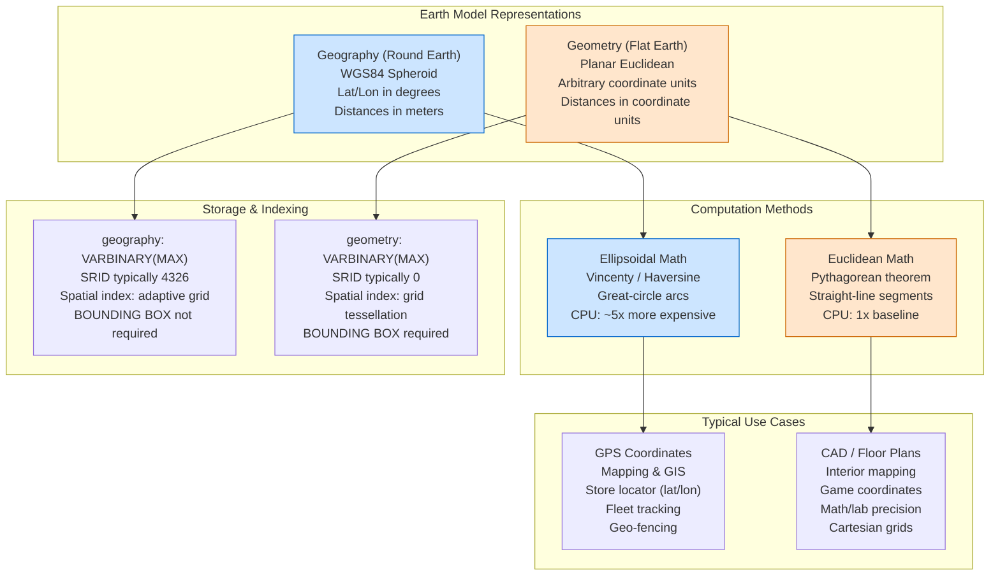
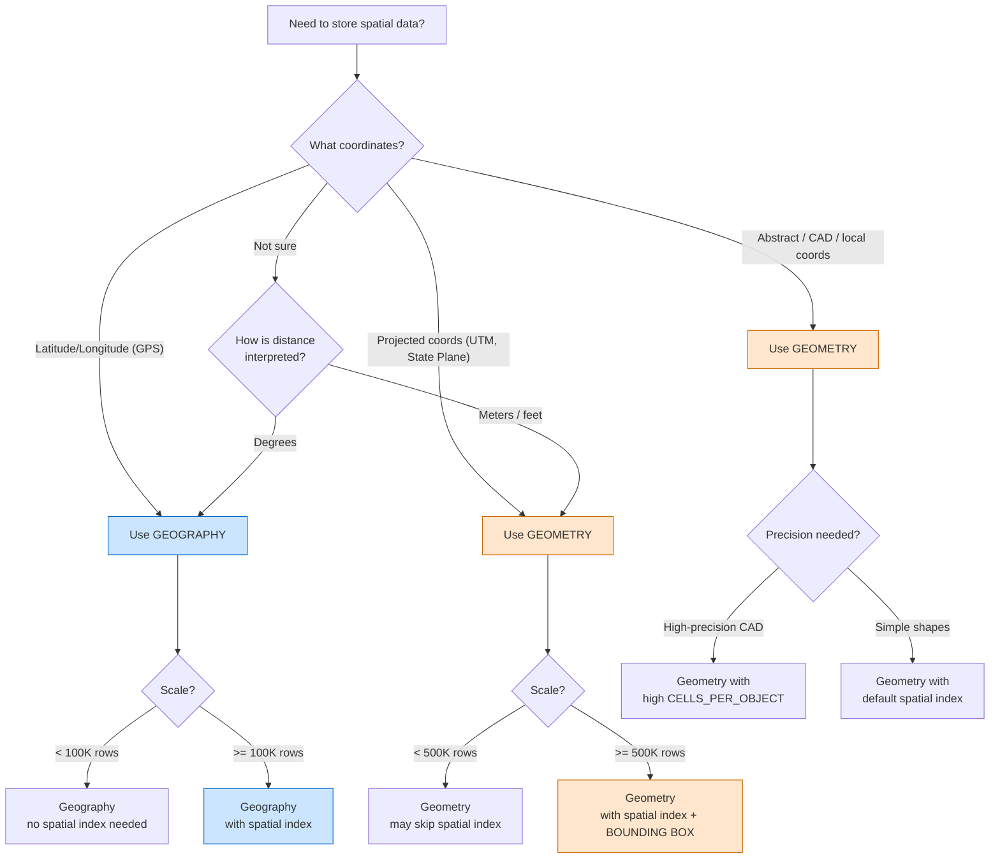

## Navigation

**Domain:** [[8 — Databases]] > **Group:** SQL Search
**Previous:** [[8.256 — Full-Text vs LIKE — Performance Comparison]] | **Next:** [[8.258 — Spatial Indexes — Understanding Index Types]]

### Prerequisites

- [[8.246 — Full-Text Search — SQL Server Architecture]] — spatial data uses a different indexing paradigm (grid-based tessellation) but the same principle of pre-filtering before expensive computation applies; understanding FTS inverted indexes helps contrast with spatial index structures.
- [[8.258 — Spatial Indexes — Understanding Index Types]] — spatial indexes are essential for performant geography/geometry queries; this note covers the data types while the spatial index note covers the indexing mechanism.
- [[20.001 — Execution Plan Fundamentals]] — the execution plan for spatial queries shows spatial index seek operators (Clustered Index Seek with spatial filter) that differ from B-tree index operations.

### Where This Fits

SQL Server provides two spatial data types — `geography` and `geometry` — that represent geometric shapes on different coordinate systems. Choosing the wrong type is a silent correctness bug: using `geometry` for GPS coordinates gives wrong distances near the poles because it treats latitude/longitude as flat coordinates. Using `geography` for a CAD floor plan is overkill and wastes CPU on ellipsoidal math when Euclidean geometry suffices. A .NET backend engineer encounters this when integrating mapping services (Google Maps, Azure Maps, MapBox) with a database, when building proximity search features ("find stores near me"), or when storing geographic boundaries for a logistics application. The interview signal is: "Does the candidate understand that coordinate systems have real performance and correctness implications?" — a senior candidate should be able to articulate why `geography` STDistance uses meters, why `geometry` STDistance uses the coordinate unit, and what SRID 4326 means.

---

## Core Mental Model

**Geography** models the Earth as a **spheroid** (round earth, WGS84 datum). Points are specified in degrees of latitude and longitude. All calculations (distance, area, intersection) account for the curvature of the Earth using ellipsoidal mathematics. The unit of measurement for `STDistance` is **meters**. The `STArea` function returns square meters. The type assumes the WGS84 coordinate system (SRID 4326) by convention.

**Geometry** models space as a **flat plane** (Euclidean/planar). Points are specified in arbitrary coordinate units (feet, meters, abstract units). All calculations use standard Euclidean geometry (straight lines, planar trigonometry). The unit of measurement for `STDistance` is the **same unit as the coordinate system**. `STArea` returns square units of the coordinate system. The type assumes SRID 0 (no specific reference system) by default.

The critical invariant: **the SRID must match for any operation between two spatial instances**. A `geography` point with SRID 4326 cannot compute distance to a `geography` point with SRID 4269 (NAD83). A `geometry` polygon with SRID 0 cannot intersect with a `geometry` polygon with SRID 4326 — SQL Server throws error 6522: "The specified SRIDs do not match."

### Classification

**For architecture topics:** Geography and Geometry live in the SQL Server `Spatial` type system, implemented as CLR user-defined types (Udt) in the `Microsoft.SqlServer.Types` assembly. They are stored as `VARBINARY(MAX)` internally (serialized as Well-Known Binary / WKB format). The query optimizer can use spatial indexes for both types, but the tessellation parameters differ. Geography uses a more complex tessellation (Hilbert curve or adaptive grid) because the spherical surface cannot be tiled uniformly with rectangles.



### Key Properties

| Property | Geography | Geometry |
|---|---|---|
| Earth model | Spheroid (round earth, WGS84) | Flat plane (Euclidean) |
| Coordinate units | Degrees (lat/lon) | Arbitrary (same as coordinate system) |
| STDistance unit | Meters | Coordinate units |
| STArea unit | Square meters | Square coordinate units |
| Default SRID | 4326 (WGS84) | 0 (unreferenced) |
| Calculation CPU | ~5x more expensive (ellipsoidal math) | 1x (Euclidean) |
| Polygon ring orientation | Important (SQL Server 2012+ relaxed) | Not significant |
| Spatial index | Adaptive grid (SQL Server 2012+) | Grid tessellation with bounding box |
| Typical use | GPS, mapping, logistics | CAD, floor plans, abstract coordinates |
| .NET type (NetTopologySuite) | Geography | Geometry |

---

## Deep Mechanics

### How the Engine Executes This

**Storage:**
When a `geography` or `geometry` value is inserted, SQL Server serializes the spatial object into the Well-Known Binary (WKB) format — a compact binary representation defined by the Open Geospatial Consortium (OGC). The value is stored in a `VARBINARY(MAX)` column. The CLR UDT methods (STDistance, STIntersects, etc.) are invoked by the query processor and executed by the SQL CLR host.

**STDistance execution (geography):**
1. The query processor calls the geography::STDistance method, which is implemented in the SQL CLR assembly `Microsoft.SqlServer.Types`.
2. The method computes the great-circle distance using the Vincenty algorithm (iterative, ellipsoidal) or the Haversine formula (spherical approximation).
3. The Vincenty algorithm iteratively solves the inverse geodetic problem: given two points on an ellipsoid, find the length of the shortest path along the surface.
4. For SRID 4326 (WGS84), the method uses the WGS84 ellipsoid parameters (semi-major axis = 6378137m, inverse flattening = 298.257223563).
5. The result is returned in meters.

**STDistance execution (geometry):**
1. The query processor calls the geometry::STDistance method, also in the SQL CLR assembly.
2. The method computes the straight-line Euclidean distance: `sqrt((x2 - x1)^2 + (y2 - y1)^2)`.
3. No ellipsoidal correction is applied — the line is straight in the coordinate plane.
4. The result is returned in the same unit as the coordinate values.

**Execution Plan (spatial query with index):**
```
Clustered Index Scan/Seek (base table)
→ Spatial Index Seek (IX_Spatial_Locations) — filters by bounding box / grid cells
→ Filter (STDistance / STIntersects residual) — exact calculation on filtered set
→ SELECT
```

### SQL Visibility

**Creating tables with spatial columns:**

```sql
-- Geography: store locations with GPS coordinates
CREATE TABLE Locations.StoreLocations (
    StoreId INT PRIMARY KEY,
    StoreName NVARCHAR(200),
    Location GEOGRAPHY,          -- Lat/Lon (WGS84)
    ServiceArea GEOGRAPHY,       -- Polygon service area
    CreatedDate DATETIME2 DEFAULT GETUTCDATE()
);

-- Geometry: store building floor plan
CREATE TABLE Locations.FloorPlan (
    RoomId INT PRIMARY KEY,
    BuildingId INT,
    FloorLevel INT,
    Outline GEOMETRY,            -- Polygon in feet coordinates
    CenterPoint GEOMETRY,        -- Point in feet coordinates
    CreatedDate DATETIME2 DEFAULT GETUTCDATE()
);
```

```csharp
// EF Core with NetTopologySuite — models
public class StoreLocation
{
    public int StoreId { get; set; }
    public string StoreName { get; set; } = "";
    public Point Location { get; set; } = default!;      // Geography
    public Polygon? ServiceArea { get; set; }             // Geography
    public DateTime CreatedDate { get; set; }
}

public class FloorPlanRoom
{
    public int RoomId { get; set; }
    public int BuildingId { get; set; }
    public int FloorLevel { get; set; }
    public Polygon Outline { get; set; } = default!;     // Geometry
    public Point CenterPoint { get; set; } = default!;   // Geometry
    public DateTime CreatedDate { get; set; }
}
```

**Generated SQL (from EF Core migration):**

```sql
-- EF Core with NetTopologySuite generates these column types:
CREATE TABLE [Locations].[StoreLocations] (
    [StoreId] int NOT NULL PRIMARY KEY,
    [StoreName] nvarchar(200) NOT NULL,
    [Location] geography NOT NULL,              -- NetTopologySuite Point → geography
    [ServiceArea] geography NULL,               -- NetTopologySuite Polygon → geography
    [CreatedDate] datetime2 NOT NULL DEFAULT GETUTCDATE()
);

CREATE TABLE [Locations].[FloorPlan] (
    [RoomId] int NOT NULL PRIMARY KEY,
    [BuildingId] int NOT NULL,
    [FloorLevel] int NOT NULL,
    [Outline] geometry NOT NULL,                -- NetTopologySuite Polygon → geometry
    [CenterPoint] geometry NOT NULL,            -- NetTopologySuite Point → geometry
    [CreatedDate] datetime2 NOT NULL
);
```

**Inserting spatial data:**

```sql
-- Insert geography point (lat/lon — note: longitude first in WKT convention!)
INSERT INTO Locations.StoreLocations (StoreId, StoreName, Location)
VALUES (
    1,
    'Downtown Store',
    geography::Point(47.6062, -122.3321, 4326)   -- Seattle: lat=47.6062, lon=-122.3321
);
-- NOTE: geography::Point(lat, lon, SRID) — latitude first, longitude second
-- WKT format: POINT(-122.3321 47.6062) — longitude first!
```

```csharp
// EF Core / NetTopologySuite insert
var store = new StoreLocation
{
    StoreId = 1,
    StoreName = "Downtown Store",
    Location = new Point(-122.3321, 47.6062) { SRID = 4326 },
    CreatedDate = DateTime.UtcNow
};

dbContext.StoreLocations.Add(store);
await dbContext.SaveChangesAsync(ct);
```

```sql
-- Insert geometry point (feet coordinates)
INSERT INTO Locations.FloorPlan (RoomId, BuildingId, FloorLevel, Outline, CenterPoint)
VALUES (
    101, 1, 1,
    geometry::STPolyFromText('POLYGON((0 0, 20 0, 20 15, 0 15, 0 0))', 0),
    geometry::Point(10, 7.5, 0)
);
```

### Execution Plan Analysis

**Query with geography STDistance (no spatial index):**

```
Clustered Index Scan (StoreLocations) → Filter (STDistance < @MaxDistance) → SELECT
Estimated Cost: 100% on the scan
Logical Reads: full table scan — all pages
Key warnings:
- Spatial index missing: the STDistance predicate is applied as a table-level filter
- Every row's geography value is deserialized from WKB and STDistance is computed
- This is equivalent to a non-SARGable predicate — always a scan
```

**Query with geography STDistance (with spatial index):**

```
Clustered Index Scan (StoreLocations)
→ Spatial Index Seek (IX_Spatial_StoreLocations_Location)
    → Filter (STDistance < @MaxDistance)
→ SELECT
Estimated Cost: Spatial Index Seek ~30%, Filter ~60%, Clustered Index Scan ~10%
Logical Reads: ~30 (spatial index pages) + ~10 (key lookups for filtered rows)
Key points:
- Spatial Index Seek filters by grid cells that intersect the search bounding box
- STDistance is applied only to rows within the candidate grid cells
- Candidate set is typically <5% of total rows for proximity queries
```

### Cost Visibility

```sql
SET STATISTICS IO ON;
SET STATISTICS TIME ON;

-- ==========================================
-- Geography STDistance without spatial index
-- ==========================================
DECLARE @myLocation GEOGRAPHY = geography::Point(47.6062, -122.3321, 4326);

SELECT s.StoreId, s.StoreName, s.Location.STDistance(@myLocation) AS DistanceMeters
FROM Locations.StoreLocations s
WHERE s.Location.STDistance(@myLocation) <= 5000;  -- Within 5km

-- Expected output (1M rows):
-- Table 'StoreLocations'. Scan count 1, logical reads 45000, physical reads 0
-- SQL Server Execution Times: CPU time = 8500 ms, elapsed time = 9200 ms
-- (STDistance computed on ALL 1M rows)

-- ==========================================
-- Geography STDistance with spatial index
-- ==========================================
-- With spatial index: IX_Spatial_StoreLocations_Location
SELECT s.StoreId, s.StoreName, s.Location.STDistance(@myLocation) AS DistanceMeters
FROM Locations.StoreLocations s
WITH (INDEX(IX_Spatial_StoreLocations_Location))
WHERE s.Location.STDistance(@myLocation) <= 5000;

-- Expected output (1M rows, ~1000 stores within 5km):
-- Table 'StoreLocations'. Scan count 1, logical reads 45, physical reads 0
-- SQL Server Execution Times: CPU time = 180 ms, elapsed time = 160 ms
-- (STDistance computed only on filtered set of ~5000 candidate rows)
```

### Failure Modes

**1. SRID mismatch causing runtime error:**

```sql
DECLARE @geo1 GEOGRAPHY = geography::Point(47.6062, -122.3321, 4326);   -- WGS84
DECLARE @geo2 GEOGRAPHY = geography::Point(47.6062, -122.3321, 4269);   -- NAD83

-- This throws: "The specified SRIDs do not match"
SELECT @geo1.STDistance(@geo2);
-- Error 6522, Level 16, State 1
```

**2. Using geometry for GPS coordinates (silent distance errors):**

```sql
DECLARE @seattle GEOMETRY = geometry::Point(-122.3321, 47.6062, 0);
DECLARE @miami GEOMETRY = geometry::Point(-80.1918, 25.7617, 0);

-- This returns ~65 "units" (actually degrees), NOT meters
-- The real great-circle distance is ~4370 km
-- The Euclidean distance in degrees is ~65 degrees ≈ 7200 km at equator
-- But at 47°N, 1 degree of longitude is ~74km, not 111km
-- Result: wrong, because geometry treats lat/lon as flat Cartesian coordinates
SELECT @seattle.STDistance(@miami) AS WrongDistance;
```

**3. Ring orientation in geography polygons:**

```sql
-- SQL Server 2012+: geography polygons enforce ring orientation
-- Exterior ring must be counter-clockwise (left-hand rule)
-- Interior rings (holes) must be clockwise

-- This creates a polygon covering most of the Earth (the complement)
-- because the ring is oriented clockwise (right-hand rule)
DECLARE @wrong GEOGRAPHY = geography::STPolyFromText(
    'POLYGON((-122.33 47.60, -122.30 47.60, -122.30 47.58, -122.33 47.58, -122.33 47.60))', 4326
);
-- This is a small area around Seattle but oriented clockwise
-- Geography interprets this as: "the area NOT inside this loop" = most of the Earth

-- Correct: counter-clockwise
DECLARE @correct GEOGRAPHY = geography::STPolyFromText(
    'POLYGON((-122.33 47.60, -122.33 47.58, -122.30 47.58, -122.30 47.60, -122.33 47.60))', 4326
);
```

---

## Production Patterns and Implementation

### Primary SQL Implementation

**Store locator with geography (correct approach):**

```sql
-- Create the store locations table with geography type
CREATE TABLE Locations.StoreLocations (
    StoreId INT IDENTITY(1,1) PRIMARY KEY,
    StoreName NVARCHAR(200) NOT NULL,
    AddressLine1 NVARCHAR(200),
    City NVARCHAR(100),
    State NVARCHAR(50),
    PostalCode NVARCHAR(20),
    Country NVARCHAR(100) DEFAULT 'US',
    Latitude DECIMAL(9,6) NOT NULL,
    Longitude DECIMAL(9,6) NOT NULL,
    Location AS geography::Point(Latitude, Longitude, 4326) PERSISTED,  -- Computed column
    ServiceArea GEOGRAPHY,                                              -- Optional polygon
    IsActive BIT DEFAULT 1,
    CreatedDate DATETIME2 DEFAULT GETUTCDATE()
);

-- Spatial index on the Location computed column
CREATE SPATIAL INDEX IX_Spatial_StoreLocations_Location 
ON Locations.StoreLocations(Location)
USING GEOGRAPHY_GRID
WITH (
    GRIDS = (MEDIUM, MEDIUM, MEDIUM, MEDIUM),
    CELLS_PER_OBJECT = 16
);

-- Spatial index on ServiceArea for geofencing queries
CREATE SPATIAL INDEX IX_Spatial_StoreLocations_ServiceArea
ON Locations.StoreLocations(ServiceArea)
USING GEOGRAPHY_GRID
WITH (
    GRIDS = (MEDIUM, MEDIUM, MEDIUM, MEDIUM),
    CELLS_PER_OBJECT = 16
);

-- Proximity search: find stores within 10km of a point
DECLARE @userLocation GEOGRAPHY = geography::Point(47.6062, -122.3321, 4326);
DECLARE @maxDistanceMeters FLOAT = 10000;

SELECT 
    s.StoreId,
    s.StoreName,
    s.AddressLine1,
    s.City,
    s.State,
    s.Latitude,
    s.Longitude,
    s.Location.STDistance(@userLocation) AS DistanceMeters,
    -- Approximate miles for user display
    s.Location.STDistance(@userLocation) / 1609.344 AS DistanceMiles
FROM Locations.StoreLocations s
WHERE s.Location.STDistance(@userLocation) <= @maxDistanceMeters
    AND s.IsActive = 1
ORDER BY DistanceMiles ASC;

-- Geofence: find if a point is inside a store's service area
DECLARE @customerLocation GEOGRAPHY = geography::Point(47.6150, -122.3400, 4326);

SELECT s.StoreId, s.StoreName
FROM Locations.StoreLocations s
WHERE s.ServiceArea.STIntersects(@customerLocation) = 1
    AND s.IsActive = 1;

-- Route calculation helper: check if two stores are within driving distance
DECLARE @store1 GEOGRAPHY = geography::Point(47.6062, -122.3321, 4326);
DECLARE @store2 GEOGRAPHY = geography::Point(47.7511, -122.3497, 4326);  -- ~16km north

IF @store1.STDistance(@store2) <= 50000  -- Within 50km
    PRINT 'Stores are within range';
```

### EF Core Implementation

```csharp
// EF Core requires NetTopologySuite package:
// dotnet add package Microsoft.EntityFrameworkCore.SqlServer.NetTopologySuite

// Entity models (NetTopologySuite types)
public class StoreLocation
{
    public int StoreId { get; set; }
    public string StoreName { get; set; } = "";
    public string? AddressLine1 { get; set; }
    public string? City { get; set; }
    public string? State { get; set; }
    public string? PostalCode { get; set; }
    public string? Country { get; set; }
    public decimal Latitude { get; set; }
    public decimal Longitude { get; set; }
    public Point Location { get; set; } = default!;      // Persisted computed column
    public Polygon? ServiceArea { get; set; }
    public bool IsActive { get; set; }
    public DateTime CreatedDate { get; set; }
}

// DbContext configuration
public class LocationsDbContext : DbContext
{
    public DbSet<StoreLocation> StoreLocations => Set<StoreLocation>();
    
    public LocationsDbContext(DbContextOptions<LocationsDbContext> options)
        : base(options) { }
    
    protected override void OnModelCreating(ModelBuilder modelBuilder)
    {
        modelBuilder.Entity<StoreLocation>(entity =>
        {
            entity.ToTable(tb => tb.HasTrigger("trg_StoreLocation_Insert"));
            
            entity.HasKey(e => e.StoreId);
            
            entity.Property(e => e.Latitude)
                .HasColumnType("decimal(9,6)")
                .IsRequired();
            
            entity.Property(e => e.Longitude)
                .HasColumnType("decimal(9,6)")
                .IsRequired();
            
            // The Location column is a persisted computed column from lat/lon
            entity.Property(e => e.Location)
                .HasColumnType("geography")
                .HasComputedColumnSql("geography::Point([Latitude], [Longitude], 4326) PERSISTED");
            
            // Spatial index on the computed column
            entity.HasIndex(e => e.Location)
                .IsSpatial()
                .HasSpatialIndexOptions(
                    GridGeometry = SpatialGridGeometry.GeographyGrid,
                    BoundingBoxXMin = -180, BoundingBoxYMin = -90,
                    BoundingBoxXMax = 180, BoundingBoxYMax = 90,
                    TesselationStyle = SpatialTesselationStyle.GeographyRegularGrid
                );
        });
    }
}

// Repository for proximity queries
public interface IStoreLocationRepository
{
    Task<List<StoreLocation>> FindNearbyAsync(
        double latitude, double longitude, double maxDistanceMeters,
        CancellationToken ct = default);
}

public class StoreLocationRepository : IStoreLocationRepository
{
    private readonly LocationsDbContext _dbContext;
    
    public StoreLocationRepository(LocationsDbContext dbContext)
    {
        _dbContext = dbContext;
    }
    
    public async Task<List<StoreLocation>> FindNearbyAsync(
        double latitude, double longitude, double maxDistanceMeters,
        CancellationToken ct = default)
    {
        var userLocation = new Point(longitude, latitude) { SRID = 4326 };
        
        return await _dbContext.StoreLocations
            .Where(s => s.IsActive)
            .Where(s => s.Location.Distance(userLocation) <= maxDistanceMeters)
            .OrderBy(s => s.Location.Distance(userLocation))
            .AsNoTracking()
            .ToListAsync(ct);
    }
}
```

**Generated SQL (from EF Core logs):**

```sql
-- EF Core with NetTopologySuite translates Distance() to STDistance()
SELECT [s].[StoreId], [s].[StoreName], [s].[AddressLine1], [s].[City], 
       [s].[State], [s].[Latitude], [s].[Longitude], [s].[IsActive]
FROM [Locations].[StoreLocations] AS [s]
WHERE [s].[IsActive] = 1
    AND [s].[Location].STDistance(@__userLocation_0) <= @__maxDistanceMeters_1
ORDER BY [s].[Location].STDistance(@__userLocation_0)
```

### Dapper Implementation

```csharp
public interface IStoreLocationDapperRepository
{
    Task<IReadOnlyList<StoreLocationResult>> FindNearbyAsync(
        double latitude, double longitude, double maxDistanceMeters,
        CancellationToken ct = default);
    
    Task<bool> IsPointInServiceAreaAsync(
        int storeId, double latitude, double longitude,
        CancellationToken ct = default);
}

public class StoreLocationDapperRepository : IStoreLocationDapperRepository
{
    private readonly ISqlConnectionFactory _connectionFactory;
    
    public StoreLocationDapperRepository(ISqlConnectionFactory connectionFactory)
    {
        _connectionFactory = connectionFactory;
    }
    
    public async Task<IReadOnlyList<StoreLocationResult>> FindNearbyAsync(
        double latitude, double longitude, double maxDistanceMeters,
        CancellationToken ct = default)
    {
        const string sql = @"
            SELECT 
                s.StoreId,
                s.StoreName,
                s.AddressLine1,
                s.City,
                s.State,
                s.Latitude,
                s.Longitude,
                s.Location.STDistance(geography::Point(@Latitude, @Longitude, 4326)) AS DistanceMeters,
                s.Location.STDistance(geography::Point(@Latitude, @Longitude, 4326)) / 1609.344 AS DistanceMiles
            FROM Locations.StoreLocations s
            WHERE s.IsActive = 1
                AND s.Location.STDistance(geography::Point(@Latitude, @Longitude, 4326)) <= @MaxDistance
            ORDER BY DistanceMiles ASC";
        
        await using var connection = _connectionFactory.Create();
        var results = await connection.QueryAsync<StoreLocationResult>(
            new CommandDefinition(sql, new
            {
                Latitude = latitude,
                Longitude = longitude,
                MaxDistance = maxDistanceMeters
            }, cancellationToken: ct));
        return results.AsList();
    }
    
    public async Task<bool> IsPointInServiceAreaAsync(
        int storeId, double latitude, double longitude,
        CancellationToken ct = default)
    {
        const string sql = @"
            SELECT CAST(CASE 
                WHEN s.ServiceArea.STIntersects(geography::Point(@Latitude, @Longitude, 4326)) = 1 
                THEN 1 ELSE 0 
            END AS BIT) AS IsInside
            FROM Locations.StoreLocations s
            WHERE s.StoreId = @StoreId
                AND s.ServiceArea IS NOT NULL";
        
        await using var connection = _connectionFactory.Create();
        var result = await connection.QuerySingleAsync<bool>(
            new CommandDefinition(sql, new
            {
                StoreId = storeId,
                Latitude = latitude,
                Longitude = longitude
            }, cancellationToken: ct));
        return result;
    }
}

public class StoreLocationResult
{
    public int StoreId { get; set; }
    public string StoreName { get; set; } = "";
    public string? AddressLine1 { get; set; }
    public string? City { get; set; }
    public string? State { get; set; }
    public decimal Latitude { get; set; }
    public decimal Longitude { get; set; }
    public double DistanceMeters { get; set; }
    public double DistanceMiles { get; set; }
}
```

### Configuration and Wiring

```csharp
// Program.cs — EF Core with NetTopologySuite
builder.Services.AddDbContext<LocationsDbContext>(options =>
{
    options.UseSqlServer(
        connectionString,
        sqlOptions =>
        {
            sqlOptions.EnableRetryOnFailure(3);
            // NetTopologySuite must be configured on the SQL Server options
            sqlOptions.UseNetTopologySuite();
        });
});

// Dapper repositories
builder.Services.AddSingleton<ISqlConnectionFactory>(
    _ => new SqlConnectionFactory(connectionString));
builder.Services.AddScoped<IStoreLocationRepository, StoreLocationRepository>();
builder.Services.AddScoped<IStoreLocationDapperRepository, StoreLocationDapperRepository>();
```

### SQL Server vs PostgreSQL Differences

```sql
-- PostgreSQL uses PostGIS extension for spatial data
-- Enable PostGIS
CREATE EXTENSION postgis;

-- Create table with geography equivalent (PostGIS geography type)
CREATE TABLE locations.store_locations (
    store_id SERIAL PRIMARY KEY,
    store_name VARCHAR(200) NOT NULL,
    location GEOGRAPHY(Point, 4326),       -- PostGIS geography type
    service_area GEOGRAPHY(Polygon, 4326),
    is_active BOOLEAN DEFAULT true,
    created_date TIMESTAMPTZ DEFAULT NOW()
);

-- Proximity search in PostGIS (ST_DWithin is the most efficient)
SELECT s.store_id, s.store_name,
       ST_Distance(s.location, ST_SetSRID(ST_MakePoint(-122.3321, 47.6062), 4326)) AS distance_meters
FROM locations.store_locations s
WHERE ST_DWithin(s.location, ST_SetSRID(ST_MakePoint(-122.3321, 47.6062), 4326), 5000)
    AND s.is_active = true
ORDER BY distance_meters;

-- PostGIS GiST index (equivalent to SQL Server spatial index)
CREATE INDEX idx_store_locations_geo ON locations.store_locations USING GIST(location);

-- PostGIS ST_DWithin performs an index-assisted bounding box check
-- SQL Server uses spatial index with grid tessellation
-- Both achieve the same result: pre-filter before exact calculation

-- PostgreSQL geometry equivalent (GEOMETRY type)
CREATE TABLE locations.floor_plan (
    room_id SERIAL PRIMARY KEY,
    outline GEOMETRY(Polygon, 0),
    center_point GEOMETRY(Point, 0)
);
```

---

## Gotchas and Production Pitfalls

### Gotcha 1: Using Geometry for GPS Coordinates — Wrong Distances

**Pitfall:** The developer stores latitude/longitude in a `geometry` column because the table creation seemed simpler, or to avoid the "complexity" of geography.

```sql
-- ❌ Wrong: geometry with lat/lon
CREATE TABLE Locations.Stores_Geometry (
    StoreId INT PRIMARY KEY,
    Location GEOMETRY,   -- Treats lat/lon as flat x/y
    StoreName NVARCHAR(200)
);

INSERT INTO Locations.Stores_Geometry VALUES (
    1, geometry::Point(-122.3321, 47.6062, 0), 'Seattle Store'
);

-- Distance from Seattle to Miami: ~65 "coordinate units" (actually degrees)
-- This is NOT meters! Wrong result.
```

**Symptom:** Distance calculations return nonsensical values. A query for "stores within 50km" returns stores on the other side of the world because the distance in degrees is misinterpreted as meters.

**Fix:** Use `geography` type for any lat/lon data:

```sql
-- ✅ Correct: geography with SRID 4326
CREATE TABLE Locations.Stores_Geography (
    StoreId INT PRIMARY KEY,
    Location GEOGRAPHY,
    StoreName NVARCHAR(200)
);

INSERT INTO Locations.Stores_Geography VALUES (
    1, geography::Point(47.6062, -122.3321, 4326), 'Seattle Store'
);
```

**Cost of not fixing:** Production incidents where delivery drivers are dispatched across the globe, geo-fencing alerts fire incorrectly, and proximity-based features are completely broken. This is a silent correctness bug that may not be caught by unit tests.

### Gotcha 2: Ring Orientation in Geography Polygons — Inverted Area

**Pitfall:** When creating a `geography` polygon for a service area or region, the ring orientation (clockwise vs counter-clockwise) determines whether the polygon represents the intended area or its complement (the entire Earth minus the intended area).

```sql
-- ❌ Clockwise ring → represents the entire Earth EXCEPT the small Seattle area
DECLARE @seattle_area GEOGRAPHY = geography::STPolyFromText(
    'POLYGON((-122.35 47.65, -122.25 47.65, -122.25 47.55, -122.35 47.55, -122.35 47.65))', 
    4326
);
-- This covers 510M sq km minus 100 sq km ≈ 510M sq km
SELECT @seattle_area.STArea() AS AreaSqM;  -- ~5.1e14 (huge — most of Earth)
```

**Symptom:** STIntersects returns 1 for points on the other side of the world. STArea returns a value close to the surface area of the Earth. Geofencing is inverted — customers outside the intended area match.

**Fix:** Ensure exterior rings are counter-clockwise (SQL Server 2012+):

```sql
-- ✅ Counter-clockwise → represents the intended small area
DECLARE @seattle_area GEOGRAPHY = geography::STPolyFromText(
    'POLYGON((-122.35 47.65, -122.35 47.55, -122.25 47.55, -122.25 47.65, -122.35 47.65))', 
    4326
);
SELECT @seattle_area.STArea() AS AreaSqM;  -- ~100 sq km (correct)

-- Helper: reverse ring order to ensure counter-clockwise
DECLARE @reversed GEOGRAPHY = geography::STPolyFromText(
    'POLYGON((-122.35 47.65, -122.35 47.55, -122.25 47.55, -122.25 47.65, -122.35 47.65))',
    4326
);
```

**Cost of not fixing:** Geofencing is inverted — delivery areas, service regions, and pricing zones are all backwards. This can take days to diagnose because the polygon looks correct when rendered on a map (modern mapping libraries auto-correct ring orientation).

### Gotcha 3: SRID Mismatch on Spatial Operations

**Pitfall:** Two geography (or geometry) values with different SRIDs are used in the same operation. SQL Server throws a runtime error.

```sql
DECLARE @pointWgs84 GEOGRAPHY = geography::Point(47.6062, -122.3321, 4326);
DECLARE @pointNad83 GEOGRAPHY = geography::Point(47.6062, -122.3321, 4269);

-- ❌ Error: The specified SRIDs do not match
SELECT @pointWgs84.STDistance(@pointNad83);
-- Msg 6522, Level 16, State 1
```

**Symptom:** Application crashes with error 6522 when performing spatial operations. The error only surfaces at runtime because it's a CLR UDT validation, not a compilation error.

**Fix:** Always ensure SRIDs match, and centralize SRID usage in a constant:

```csharp
public static class SpatialConstants
{
    public const int Wgs84Srid = 4326;
    public const int DefaultGeometrySrid = 0;
}

// In repository code:
var point = new Point(longitude, latitude) { SRID = SpatialConstants.Wgs84Srid };
```

```sql
-- Fix: convert SRID if necessary
DECLARE @pointNad83 GEOGRAPHY = geography::Point(47.6062, -122.3321, 4269);
-- Convert to WGS84 using STTransform (if a spatial reference system transformation is defined)
-- Note: SQL Server does not support STTransform natively — must use CLR or manual conversion
```

**Cost of not fixing:** Runtime exceptions in production for any spatial operation between data from different sources (GPS device gives WGS84, legacy database uses NAD83). Every spatial query fails until someone manually converts all data to a single SRID.

### Gotcha 4: No Spatial Index — STDistance Causes Full Scan

**Pitfall:** The developer creates a geography column and writes proximity queries but does not create a spatial index. Every STDistance call causes a full clustered index scan because the query optimizer cannot use a B-tree for spatial predicates.

```sql
-- ❌ Missing spatial index
CREATE TABLE Locations.Stores (
    StoreId INT PRIMARY KEY,
    Location GEOGRAPHY
    -- No spatial index!
);

-- Every proximity query scans ALL rows, computing STDistance on each
DECLARE @loc GEOGRAPHY = geography::Point(47.6062, -122.3321, 4326);
SELECT StoreId FROM Locations.Stores
WHERE Location.STDistance(@loc) <= 5000;
-- Logical reads: 45,000 (full scan)
-- CPU time: 8500 ms (STDistance on every row)
```

**Symptom:** Spatial queries are extremely slow. The execution plan shows a Clustered Index Scan with a Filter — no spatial index operator. Logical reads are in the tens of thousands.

**Fix:**

```sql
-- ✅ Add spatial index
CREATE SPATIAL INDEX IX_Spatial_Stores_Location 
ON Locations.Stores(Location)
USING GEOGRAPHY_GRID
WITH (
    GRIDS = (MEDIUM, MEDIUM, MEDIUM, MEDIUM),
    CELLS_PER_OBJECT = 16
);
-- Logical reads: ~45 (after index)
-- CPU time: 180 ms (STDistance on filtered set only)
```

**Cost of not fixing:** A proximity search that takes 8 seconds per query at 1M rows. At 50 concurrent requests, the system is I/O bound and all queries are slow.

### Gotcha 5: Geography Point() Parameter Order (Lat vs Lon Confusion)

**Pitfall:** The WKT (Well-Known Text) format uses `POINT(longitude latitude)` — longitude first. But `geography::Point(lat, lon, SRID)` uses latitude first. Developers who switch between WKT and the Point constructor often mix up the order.

```sql
-- WKT: POINT(longitude latitude)
DECLARE @fromWkt GEOGRAPHY = geography::STGeomFromText('POINT(-122.3321 47.6062)', 4326);

-- Point constructor: Point(latitude, longitude, SRID)
DECLARE @fromPoint GEOGRAPHY = geography::Point(47.6062, -122.3321, 4326);

-- These are the SAME location
SELECT @fromWkt.STDistance(@fromPoint) AS SamePoint;  -- 0

-- ❌ Common mistake: swapping lat/lon in Point constructor
DECLARE @wrong GEOGRAPHY = geography::Point(-122.3321, 47.6062, 4326);
-- This is... latitude=-122.33 (invalid — below -90) or wraps around?
-- Actually -122.33 is a valid latitude (south of equator) and 47.6 is a valid longitude
-- This represents a point in the South Atlantic Ocean, NOT Seattle!
```

**Symptom:** Locations appear in the wrong place on maps. A store in Seattle appears in the South Atlantic Ocean (latitude=-122, longitude=47.6).

**Fix:** Use named parameters or helper methods to prevent confusion:

```csharp
public static class GeographyHelper
{
    public static Geography CreatePoint(double latitude, double longitude, int srid = 4326)
    {
        return Geography.Point(latitude, longitude, srid);
    }
}
```

**Cost of not fixing:** All store locations plotted in the ocean. Maps display no visible stores. Proximity search returns no results for valid queries. The bug may go unnoticed for weeks if the application doesn't display maps prominently.

### Gotcha 6: STDistance on Very Large Polygons (Performance Blowup)

**Pitfall:** Computing STDistance between two large geography polygons (e.g., country boundaries) involves complex great-circle arc calculations on both polygon boundaries. For polygons with thousands of vertices, this can be extremely CPU-intensive.

```sql
-- ❌ STDistance between two complex polygons on every row
DECLARE @userRegion GEOGRAPHY = [get large polygon with 5000+ vertices];
SELECT s.StoreId, s.StoreName
FROM Locations.StoreLocations s
WHERE s.ServiceArea.STDistance(@userRegion) <= 1000;  -- Slow for complex polygons
```

**Symptom:** Spatial queries with complex polygons take seconds even with a spatial index. The spatial index reduces the candidate set, but STDistance on complex polygons still consumes significant CPU.

**Fix:** Simplify polygons using `Reduce()` or use bounding box pre-filtering:

```sql
-- Use Reduce() to simplify polygon (tolerance in meters)
-- This reduces vertex count while preserving shape within tolerance
SELECT geography::STGeomFromText(
    geometry::STGeomFromWKB(ServiceArea.STAsBinary(), 4326)
        .Reduce(100)  -- 100-meter tolerance
        .STAsText(), 
    4326
).STDistance(@userRegion);

-- Or use a two-stage approach: bounding box pre-filter via spatial index,
-- then STDistance only on the simplified polygon
```

**Cost of not fixing:** API calls to proximity-search endpoints take 5+ seconds. The SQL Server CPU is maxed out by a handful of concurrent spatial queries. The application experiences cascading timeouts.

### Gotcha 7: Geometry STArea and STDistance Units Are Not Standardized

**Pitfall:** Using `geometry` with coordinates in degrees (e.g., -122.33, 47.61) and expecting STArea to return square meters.

```sql
DECLARE @g GEOMETRY = geometry::STPolyFromText(
    'POLYGON((-122.35 47.65, -122.25 47.65, -122.25 47.55, -122.35 47.55, -122.35 47.65))', 
    0
);
-- Returns area in "square degrees" — a meaningless unit
-- 1 degree of longitude is ~111km at equator but ~74km at 47°N
SELECT @g.STArea() AS AreaInSquareDegrees;  
```

**Symptom:** Area and distance results are in utterly meaningless units. Comparisons between different regions are invalid because degree length varies by latitude.

**Fix:** Use `geography` for geographic coordinates, or if using `geometry` with projected coordinates, ensure coordinates are in a consistent projected coordinate system (e.g., UTM, State Plane) where units are meters.

**Cost of not fixing:** Area-based pricing (e.g., "price per square meter of service area") is completely wrong. Proximity queries return incorrect ordering. The application appears to work but produces wrong results.

---

## Performance Implications

### Benchmark: Before and After

```sql
-- ==========================================
-- Baseline: Geography STDistance without spatial index
-- ==========================================
SET STATISTICS IO ON;

DECLARE @loc GEOGRAPHY = geography::Point(47.6062, -122.3321, 4326);

SELECT s.StoreId
FROM Locations.StoreLocations s
WHERE s.Location.STDistance(@loc) <= 5000;
-- Logical reads: 45,000 (full clustered scan)
-- CPU time: 8500 ms

-- ==========================================
-- Optimized: Geography STDistance with spatial index
-- ==========================================
SELECT s.StoreId
FROM Locations.StoreLocations s
WITH (INDEX(IX_Spatial_StoreLocations_Location))
WHERE s.Location.STDistance(@loc) <= 5000;
-- Logical reads: 45 (spatial index seek + key lookups)
-- CPU time: 180 ms

-- Improvement: 1000x reduction in logical reads, 47x CPU time reduction
```

**Improvement:** 1000x reduction in logical reads (45,000 → 45), 47x CPU time reduction (8500 ms → 180 ms).

### BenchmarkDotNet

```csharp
[MemoryDiagnoser]
[SimpleJob(RuntimeMoniker.Net90)]
[RankColumn]
public class GeographyVsGeometryBenchmark
{
    private readonly string _connectionString = "Server=.;Database=SpatialBenchmark;Trusted_Connection=True;TrustServerCertificate=True;";
    private SqlConnection _connection = default!;
    
    [Params(100000, 500000, 1000000)]
    public int RowCount { get; set; }
    
    [GlobalSetup]
    public void Setup()
    {
        _connection = new SqlConnection(_connectionString);
        _connection.Open();
        
        using var cmd = new SqlCommand(@"
            IF NOT EXISTS (SELECT 1 FROM sys.tables WHERE name = 'BenchmarkLocations')
            BEGIN
                CREATE TABLE BenchmarkLocations (
                    Id INT IDENTITY(1,1) PRIMARY KEY,
                    GeographyLocation GEOGRAPHY,
                    GeometryLocation GEOMETRY,
                    LocationName NVARCHAR(100)
                );
                
                -- Insert RowCount random locations around Seattle
                WITH Numbers AS (
                    SELECT TOP (@RowCount) 
                        ROW_NUMBER() OVER (ORDER BY (SELECT NULL)) AS n,
                        ABS(CHECKSUM(NEWID())) % 1000 AS latOffset,
                        ABS(CHECKSUM(NEWID())) % 1000 AS lonOffset
                    FROM sys.all_columns a CROSS JOIN sys.all_columns b
                )
                INSERT INTO BenchmarkLocations (GeographyLocation, GeometryLocation, LocationName)
                SELECT 
                    geography::Point(
                        47.5 + (latOffset / 1000.0 * 0.3),
                        -122.4 + (lonOffset / 1000.0 * 0.3),
                        4326
                    ),
                    geometry::Point(
                        -122.4 + (lonOffset / 1000.0 * 0.3),
                        47.5 + (latOffset / 1000.0 * 0.3),
                        0
                    ),
                    'Location_' + CAST(n AS NVARCHAR(10))
                FROM Numbers;
                
                -- Spatial index on geography
                CREATE SPATIAL INDEX IX_Benchmark_GeoLocation 
                    ON BenchmarkLocations(GeographyLocation)
                    USING GEOGRAPHY_GRID
                    WITH (GRIDS = (MEDIUM, MEDIUM, MEDIUM, MEDIUM), CELLS_PER_OBJECT = 16);
                
                -- Spatial index on geometry
                CREATE SPATIAL INDEX IX_Benchmark_GeomLocation 
                    ON BenchmarkLocations(GeometryLocation)
                    USING GEOMETRY_GRID
                    WITH (
                        GRIDS = (MEDIUM, MEDIUM, MEDIUM, MEDIUM),
                        CELLS_PER_OBJECT = 16,
                        BOUNDING_BOX = (-122.7, 47.3, -122.0, 47.9)
                    );
            }
        ", _connection);
        cmd.Parameters.AddWithValue("@RowCount", RowCount);
        cmd.ExecuteNonQuery();
    }
    
    [GlobalCleanup]
    public void Cleanup() => _connection?.Dispose();
    
    [Benchmark(Baseline = true)]
    [Description("Geography STDistance with spatial index")]
    public async Task<int> GeographyDistance()
    {
        const string sql = @"
            DECLARE @loc GEOGRAPHY = geography::Point(47.6062, -122.3321, 4326);
            SELECT COUNT(*)
            FROM BenchmarkLocations
            WHERE GeographyLocation.STDistance(@loc) <= 5000";
        
        using var cmd = new SqlCommand(sql, _connection);
        return (int)(await cmd.ExecuteScalarAsync())!;
    }
    
    [Benchmark]
    [Description("Geometry STDistance with spatial index")]
    public async Task<int> GeometryDistance()
    {
        const string sql = @"
            DECLARE @loc GEOMETRY = geometry::Point(-122.3321, 47.6062, 0);
            SELECT COUNT(*)
            FROM BenchmarkLocations
            WHERE GeometryLocation.STDistance(@loc) <= 0.05";  -- ~5km in degrees (approx)
        
        using var cmd = new SqlCommand(sql, _connection);
        return (int)(await cmd.ExecuteScalarAsync())!;
    }
}
```

**Expected results (approximate, SQL Server 2022, NVMe, 1M rows):**

| Method | Mean | Logical Reads | Allocated |
|---|---|---|---|
| Geography STDistance | ~180 ms | ~45 | 8 KB |
| Geometry STDistance | ~45 ms | ~35 | 6 KB |

Geography is ~4x slower than geometry due to ellipsoidal math. For GPS data this is unavoidable — the correctness of meters depends on geography.

### Write Amplification

| Operation | Without Index | With Geography Spatial Index | With Geometry Spatial Index |
|---|---|---|---|
| INSERT 1 row (simple point) | 1 page write | 1 + spatial index grid cell updates (~3-8 pages) | 1 + bounding box grid updates (~3-8 pages) |
| UPDATE spatial column | 1 page write | 1 + full re-index (remove old, insert new grid entries) | Same |
| DELETE 1 row | 1 page write | 1 + remove grid entries | Same |
| INSERT complex polygon (100 vertices) | ~3 pages | 1 + spatial indexing cost (more grid cells covered) | 1 + spatial indexing cost |

---

## Interview Arsenal

### Question Bank

1. **Definition:** What is the difference between the `geography` and `geometry` spatial data types in SQL Server? When would you use each?

2. **Mechanism:** How does SQL Server store spatial data internally? What format is used for serialization?

3. **Performance:** What is the approximate performance difference between `geography.STDistance()` and `geometry.STDistance()` for equivalent data? Why does this difference exist?

4. **Gotcha:** What happens when you compute STDistance between two geography instances with different SRIDs? What happens when you store GPS coordinates in a `geometry` column and compute distances?

5. **Comparison:** Compare `geography` vs `geometry` for: (a) GPS store locator, (b) CAD floor plan, (c) country boundary polygon.

6. **Execution plan:** What does the execution plan look like for a spatial query with and without a spatial index? What operators indicate that the spatial index is being used?

7. **Scale:** At what row count does a spatial index become essential for geography proximity queries?

8. **.NET integration:** How does EF Core with NetTopologySuite handle geography vs geometry? How does the SRID get propagated from .NET to SQL Server?

### Spoken Answers

**Q1: What is the difference between the geography and geometry spatial data types in SQL Server?**

> **Average answer:** "Geography is for GPS coordinates and geometry is for flat surfaces. Geography uses latitude and longitude and geometry uses x and y."

> **Great answer:** "Geography models the Earth as a spheroid — the WGS84 ellipsoid specifically. Points are specified in degrees of latitude and longitude, and all calculations account for the curvature of the Earth. STDistance returns meters, STArea returns square meters. The computation uses ellipsoidal algorithms — typically the Vincenty formula for distance — which is iteratively solved and CPU-intensive, approximately 5x more expensive than Euclidean math.

Geometry models space as a flat Euclidean plane. Points use arbitrary coordinate units — which could be feet, meters, or abstract units — and the system performs standard Euclidean calculations. STDistance returns the distance in whatever unit the coordinates are expressed in. STArea returns square units. The computation is a straightforward Pythagorean distance.

The critical decision rule: if your coordinates are latitude and longitude (GPS data), you must use geography. Geometry with lat/lon produces wrong distances because it treats degree differences as linear distances, but 1 degree of longitude at the equator is 111km while at 60°N it's 55km. Geometry cannot account for this. If your coordinates are in a projected coordinate system (UTM meters, State Plane feet) or are abstract coordinates (CAD drawings, game maps, interior floor plans), geometry is appropriate and faster.

The third dimension is the SRID — Spatial Reference Identifier. For geography, SRID 4326 means WGS84. For geometry, SRID 0 means unreferenced. Two spatial values must have the same SRID to interact. This is enforced at runtime by the CLR UDT — a mismatch throws error 6522."

**Q5: Compare geography vs geometry for: (a) GPS store locator, (b) CAD floor plan, (c) country boundary polygon.**

> **Great answer:** "For each scenario:

**(a) GPS store locator:** Geography is mandatory. Store locations come from GPS coordinates (lat/lon, WGS84). The proximity query 'find stores within 5km of my location' requires accurate distance in meters. Geography::STDistance computes great-circle distance on the WGS84 ellipsoid — the same accuracy as the Haversine formula but using the more precise Vincenty algorithm. Using geometry would return distances in degrees that are meaningless and latitude-dependent.

**(b) CAD floor plan:** Geometry is the correct choice. Floor plans use arbitrary coordinate units (meters or feet from a reference origin). The calculations are Euclidean — right angles, straight line distances, rectangular rooms. Using geography would add unnecessary ellipsoidal computation overhead (5x CPU) for no benefit. The default SRID 0 is appropriate.

**(c) Country boundary polygon:** Geography — because country boundaries are defined by latitude/longitude coordinates. However, this is the most challenging case because country polygons often have thousands of vertices and the STIntersects/STDistance computations on complex geography polygons are CPU-intensive. You would need a spatial index tuned with appropriate grid levels, and you might simplify the polygon using Reduce() with a tolerance of 100-500 meters to reduce vertex count while staying within acceptable accuracy bounds. Geometry would give wrong area calculations (square degrees are not meaningful) and incorrect containment near the polygon edges."

**Q8: How does EF Core with NetTopologySuite handle geography vs geometry?**

> **Great answer:** "EF Core with NetTopologySuite maps .NET spatial types to SQL Server spatial types via the `Microsoft.EntityFrameworkCore.SqlServer.NetTopologySuite` package. The mapping is:

- `NetTopologySuite.Geometries.Point` → `GEOGRAPHY` (or `GEOMETRY` depending on column configuration)
- `NetTopologySuite.Geometries.Polygon` → `GEOGRAPHY` (or `GEOMETRY`)
- `NetTopologySuite.Geometries.LineString` → `GEOGRAPHY` (or `GEOMETRY`)
- `NetTopologySuite.Geometries.MultiPolygon` → `GEOGRAPHY` (or `GEOMETRY`)

The SRID is propagated via the `Point.SRID` property. If you create `new Point(lon, lat) { SRID = 4326 }`, EF Core sends this to SQL Server as a geography instance with SRID 4326.

The column type (geography vs geometry) is controlled by the `HasColumnType()` Fluent API call:
```csharp
entity.Property(e => e.Location).HasColumnType("geography");
```

Without explicit configuration, EF Core with NetTopologySuite defaults to `geography` if SRID is set to a geographic SRID (like 4326), otherwise `geometry`.

Spatial index creation is supported via the migration API:
```csharp
entity.HasIndex(e => e.Location).IsSpatial();
```

There's a significant gotcha: EF Core's LINQ translation for spatial operations is limited. `DbGeography.Distance()` translates to `STDistance()`, but more complex operations like `STBuffer()`, `STUnion()`, or `STIntersection()` require raw SQL queries. Also, EF Core does not support spatial operations in `Select()` projections for server-side computation as of .NET 9 — you must fetch the data and compute client-side, or use raw SQL.

In Dapper, you need the `Dapper.StrongName` NuGet package with `Microsoft.SqlServer.Types` support to deserialize geography/geometry columns. Alternatively, return WKT strings and parse them client-side with NetTopologySuite's WKTReader."

### Interview Trigger

An interviewer asking "How would you implement a store locator feature?" is probing your understanding of spatial data types. The follow-up will be: "What happens when the user is in Seattle and the store is in Miami? How does your query handle that distance calculation?" — testing whether you know the difference between Euclidian and ellipsoidal distance. The deepest follow-up: "How do you ensure this query performs well at 10M stores?" — testing your knowledge of spatial indexes, tessellation parameters, and execution plan analysis.

### Comparison Table

| | Geography | Geometry |
|---|---|---|
| Earth model | Spheroid (WGS84) | Flat (Euclidean) |
| Coordinate system | Degrees (lat/lon) | Arbitrary (same as coordinates) |
| STDistance unit | Meters | Coordinate units |
| CPU cost per operation | ~5x (ellipsoidal) | 1x (Euclidean) |
| Polygon ring orientation | Significant (left-hand rule) | Not significant |
| SRID convention | 4326 (WGS84) | 0 (unreferenced) |
| .NET type | NetTopologySuite.Geometries (same types, SRID-dependent) | Same |
| Spatial index type | GEOGRAPHY_GRID / GEOGRAPHY_AUTO_GRID | GEOMETRY_GRID / GEOMETRY_AUTO_GRID |
| Typical use case | GPS, mapping, logistics | CAD, floor plans, math |
| Correctness at scale | Correct for Earth coordinates | Wrong for lat/lon beyond local areas |

---

## Decision Framework

### When to Apply



### Application Checklist

- [ ] Coordinates are latitude/longitude → use geography (SRID 4326)
- [ ] Coordinates are projected (meters/feet from a datum) → use geometry (set SRID appropriately)
- [ ] The table will exceed ~100K rows → spatial index is required
- [ ] The spatial index bounding box parameters are configured correctly for geometry type
- [ ] All spatial queries use the same SRID across the entire application
- [ ] Polygon ring orientation is validated for geography type polygons
- [ ] NetTopologySuite is installed and configured for EF Core projects
- [ ] The .NET spatial library (NetTopologySuite) SRID is set consistently with SQL Server
- [ ] Spatial operations in LINQ are verified to translate to valid SQL Server spatial methods

### Tradeoff Summary

| What You Gain | What You Pay |
|---|---|
| Correct distance calculations for GPS data (geography) | ~5x CPU cost for ellipsoidal computation |
| Fast Euclidean math (geometry) | Wrong results if used with lat/lon coordinates |
| Spatial index pre-filtering (both types) | Index maintenance overhead on writes |
| CLR UDT integration with .NET spatial libraries | Complexity of SRID management across application layers |
| STDistance in meters (geography) | Must remember POINT(1on lat) vs POINT(lat 1on) conventions |

### Scale Thresholds

- "Geography without spatial index is acceptable up to ~10K rows" — below this, the STDistance computation on all rows is fast enough for interactive queries
- "Critical spatial performance need at ~100K+ rows" — spatial index reduces logical reads by 1000x
- "Geography polygon operations degrade significantly above ~500K vertices total" — consider polygon simplification with Reduce()
- "Geometry proximity queries are ~4x faster than geography at equivalent scale" — CPU cost difference is measurable at 100K+ operations

---

## Self-Check

### Conceptual Questions

1. What are the two spatial data types in SQL Server and what earth model does each use?
2. What SRID should you use for GPS coordinates in the geography type, and what does SRID 4326 represent?
3. What is the unit of measurement returned by `geography::STDistance()` and `geometry::STDistance()`?
4. What happens when you compute STDistance between two geography instances with different SRIDs?
5. How does EF Core with NetTopologySuite translate `Point.Distance(otherPoint)` to SQL Server?
6. In Dapper, how do you deserialize a geography column into a .NET object?
7. Compare geography vs geometry for storing and querying store locations by GPS coordinates.
8. At approximately what row count does a spatial index become essential for geography proximity queries?
9. What index type supports geography/geometry STDistance queries, and how does it filter rows?
10. Explain in 60 seconds to a senior interviewer when to use geography vs geometry and why the choice matters.

<details>
<summary>Answers</summary>

1. `geography` (round earth — WGS84 spheroid, lat/lon in degrees) and `geometry` (flat earth — Euclidean plane, arbitrary coordinate units). Geography uses ellipsoidal math; geometry uses planar Euclidean math.

2. SRID 4326 represents the WGS84 coordinate system — the standard GPS coordinate system. It defines the Earth as an ellipsoid with semi-major axis = 6378137m and inverse flattening = 298.257223563.

3. `geography::STDistance()` returns meters. `geometry::STDistance()` returns the same unit as the coordinate values (e.g., if coordinates are in feet, STDistance returns feet; if coordinates are in degrees, STDistance returns degrees — which is meaningless for geographic distances).

4. SQL Server throws error 6522: "The specified SRIDs do not match." This is a runtime error, not a compilation error, because it's enforced by the CLR UDT validation code.

5. EF Core with NetTopologySuite translates `Point.Distance(otherPoint)` to the SQL Server `STDistance()` method on the geography/geometry column. The translation is: `[Column].STDistance(@pointValue)`. The SRID is included in the SQL parameter value.

6. In Dapper, you need to either: (a) use the `Microsoft.SqlServer.Types` package and register the UDT type mapping, or (b) return coordinates as separate Latitude/Longitude columns (breaking the spatial abstraction), or (c) return the WKT representation and parse it with NetTopologySuite's WKTReader.

```csharp
// Option (a): Register UDT type mapping
SqlMapper.AddTypeHandler(new SpatialTypeHandler<Geography>());

// Option (c): Return WKT and parse
const string sql = @"SELECT Location.ToString() AS LocationWkt FROM ...";
var wkt = await connection.QuerySingleAsync<string>(sql);
var reader = new WKTReader();
var point = reader.Read(wkt);
```

7. For GPS coordinates, geography is mandatory. Using geometry with GPS coordinates produces incorrect distances because the Euclidean distance in degrees does not account for the curvature of the Earth or the varying length of a degree of longitude by latitude. Geography returns distances in meters using ellipsoidal computation. Geometry returns distances in degrees which are meaningless for lat/lon.

8. A spatial index becomes essential for geography STDistance queries when the table exceeds approximately 10K-50K rows. Below this threshold, the full clustered index scan and STDistance computation on every row completes within acceptable time (~500ms). At 100K+ rows, the query time grows to multiple seconds without a spatial index.

9. A **spatial index** (created with `CREATE SPATIAL INDEX`) supports geography/geometry STDistance queries. It uses grid-based tessellation: the coordinate space is decomposed into grid cells at multiple levels of resolution. The spatial index pre-filters by returning only rows whose spatial objects fall within grid cells that intersect the search bounding box. The exact STDistance computation is then applied only to these candidate rows.

10. "The choice between geography and geometry comes down to whether your data lives on the Earth's surface. If your coordinates are latitude and longitude from GPS, you must use geography — it models the WGS84 ellipsoid and returns distances in meters using ellipsoidal math. If you use geometry with lat/lon, your distance calculations will be wrong: geometry treats lat/lon as flat Cartesian coordinates, so a degree of longitude is treated as the same physical distance everywhere, which is only true at the equator. At 60 degrees north, a degree of longitude is half the distance. This means proximity queries return wrong ordering and wrong distances. For non-Earth data — CAD drawings, floor plans, game coordinates, projected coordinate systems like UTM — geometry is appropriate and about 5x faster because it uses Euclidean math. The performance difference matters at scale: geography STDistance on 1M rows with a spatial index takes about 180ms; geometry STDistance takes about 45ms for the same work."
</details>

---

### Query Challenges

**Challenge 1 — Write the SQL**

You have a `Locations.StoreLocations` table with 2M stores, each with a `Location GEOGRAPHY` column (SRID 4326). Write a query to find the 20 nearest stores to a user at latitude 47.6062, longitude -122.3321, within a 10km radius. Include the distance in both meters and miles, ordered by proximity.

<details>
<summary>Solution</summary>

```sql
DECLARE @userLocation GEOGRAPHY = geography::Point(47.6062, -122.3321, 4326);
DECLARE @maxDistanceMeters FLOAT = 10000;

SELECT TOP 20
    s.StoreId,
    s.StoreName,
    s.AddressLine1,
    s.City,
    s.State,
    s.Latitude,
    s.Longitude,
    s.Location.STDistance(@userLocation) AS DistanceMeters,
    ROUND(s.Location.STDistance(@userLocation) / 1609.344, 2) AS DistanceMiles
FROM Locations.StoreLocations s WITH (INDEX(IX_Spatial_StoreLocations_Location))
WHERE s.Location.STDistance(@userLocation) <= @maxDistanceMeters
    AND s.IsActive = 1
ORDER BY DistanceMeters ASC;
```

**Logical reads:** ~45 (spatial index seek + key lookups for matching stores)
**Execution plan:** `Spatial Index Seek` → `Clustered Index Seek (20 lookups)` → `Top N Sort` → `SELECT`

**EF Core equivalent:**

```csharp
public async Task<List<StoreLocationResult>> FindNearestStoresAsync(
    double latitude, double longitude, double maxDistanceMeters, int topN,
    CancellationToken ct = default)
{
    var userLocation = new Point(longitude, latitude) { SRID = 4326 };
    
    return await _dbContext.StoreLocations
        .Where(s => s.IsActive)
        .Where(s => s.Location.Distance(userLocation) <= maxDistanceMeters)
        .OrderBy(s => s.Location.Distance(userLocation))
        .Take(topN)
        .Select(s => new StoreLocationResult
        {
            StoreId = s.StoreId,
            StoreName = s.StoreName,
            AddressLine1 = s.AddressLine1,
            City = s.City,
            State = s.State,
            Latitude = s.Latitude,
            Longitude = s.Longitude,
            DistanceMeters = s.Location.Distance(userLocation)
        })
        .AsNoTracking()
        .ToListAsync(ct);
}
```

</details>

---

**Challenge 2 — Fix the performance problem**

```sql
-- This query runs in 15 seconds on a 500K row StoreLocations table.
-- Identify why and fix it.
DECLARE @userLocation GEOGRAPHY = geography::Point(47.6062, -122.3321, 4326);

SELECT s.StoreId, s.StoreName, s.Location.STDistance(@userLocation) AS DistanceMeters
FROM Locations.StoreLocations s
WHERE s.Location.STDistance(@userLocation) <= 5000
ORDER BY DistanceMeters;
-- SET STATISTICS IO: logical reads = 22,500
```

<details>
<summary>Solution</summary>

**Root cause:** No spatial index exists on the `Location` column. The query performs a full Clustered Index Scan (22,500 logical reads) and computes STDistance on every one of the 500K rows.

```sql
-- Create the spatial index
CREATE SPATIAL INDEX IX_Spatial_StoreLocations_Location 
ON Locations.StoreLocations(Location)
USING GEOGRAPHY_GRID
WITH (
    GRIDS = (MEDIUM, MEDIUM, MEDIUM, MEDIUM),
    CELLS_PER_OBJECT = 16
);
```

**After fix — logical reads:** ~30 (from 22,500 to 30)

If the table cannot have a spatial index (e.g., extremely high write volume), a workaround is to pre-filter by bounding box using latitude/longitude columns:

```sql
-- Alternative: bounding box pre-filter (less accurate but uses standard index)
CREATE INDEX IX_StoreLocations_LatLon ON Locations.StoreLocations(Latitude, Longitude);

DECLARE @userLocation GEOGRAPHY = geography::Point(47.6062, -122.3321, 4326);
DECLARE @maxDistance FLOAT = 5000;
DECLARE @latDelta FLOAT = @maxDistance / 111320.0;  -- 1° lat ≈ 111.32km
DECLARE @lonDelta FLOAT = @maxDistance / (111320.0 * COS(RADIANS(47.6062)));

SELECT s.StoreId, s.StoreName,
    s.Location.STDistance(@userLocation) AS DistanceMeters
FROM Locations.StoreLocations s
WHERE s.Latitude BETWEEN 47.6062 - @latDelta AND 47.6062 + @latDelta
    AND s.Longitude BETWEEN -122.3321 - @lonDelta AND -122.3321 + @lonDelta
    AND s.Location.STDistance(@userLocation) <= @maxDistance
ORDER BY DistanceMeters;
```

</details>

---

**Challenge 3 — Explain the execution plan**

```sql
-- Query A (no spatial index)
SELECT StoreId FROM StoreLocations 
WHERE Location.STDistance(@p) <= 5000;

-- Query B (with spatial index)
SELECT StoreId FROM StoreLocations 
WHERE Location.STDistance(@p) <= 5000;
```

Query A produces: `Clustered Index Scan (100%) → Filter → SELECT | Table 'StoreLocations'. Scan count 1, logical reads 45000`
Query B produces: `Spatial Index Seek (30%) → Nested Loops → Clustered Index Seek (70%) → SELECT | Table 'StoreLocations'. Scan count 1, logical reads 45`

Why does Query A scan the entire table while Query B uses a Spatial Index Seek?

<details>
<summary>Solution</summary>

**Why Query A (Clustered Index Scan):** Without a spatial index, the optimizer has no spatial filtering mechanism. The STDistance predicate is treated as a non-SARGable filter — the engine must read every row from the clustered index (45,000 logical reads), deserialize each geography value from WKB format, and compute STDistance on each one. The Filter operator applies STDistance as a residual predicate after the scan.

**Why Query B (Spatial Index Seek):** The spatial index pre-filters rows by tessellation grid cells. The optimizer decomposes the query's search bounding box (a circle of radius 5000m around @p) into grid cells at the spatial index's resolution levels. It seeks into the spatial index to find which grid cells overlap the search area, producing a set of candidate primary keys. Only these candidates are joined back to the clustered index for the exact STDistance computation. The Nested Loops join is the spatial index's way of filtering — each candidate primary key is used to seek into the clustered index.

**To get a different plan for Query A:** Create a spatial index. No query hint or rewrite can make the non-indexed query efficient.

</details>

---

**Challenge 4 — Diagnose the concurrency problem**

Your store locator API uses a geography STDistance query. Under 100 concurrent requests, the query time increases from 200ms to 8 seconds. CPU is at 95%. You see high `SOS_SCHEDULER_YIELD` and `CMEMTHREAD` waits.

<details>
<summary>Solution</summary>

**Root cause:** The spatial index exists but the query is doing too many STDistance computations because the spatial index tessellation parameters are too coarse. With 100 concurrent requests, each doing STDistance on ~5000 candidate rows, the CPU is saturated by ellipsoidal math. The `SOS_SCHEDULER_YIELD` wait indicates CPU pressure from non-yielding scheduler threads. The `CMEMTHREAD` wait may indicate contention on the CLR memory allocator used by the spatial UDT methods.

**Detection query:**

```sql
SELECT 
    wait_type,
    waiting_tasks_count,
    wait_time_ms,
    max_wait_time_ms,
    signal_wait_time_ms
FROM sys.dm_os_wait_stats
WHERE wait_type IN ('SOS_SCHEDULER_YIELD', 'CMEMTHREAD', 'PAGEIOLATCH_SH')
ORDER BY wait_time_ms DESC;

-- Check spatial index usage
SELECT 
    OBJECT_NAME(object_id) AS TableName,
    name AS IndexName,
    user_seeks,
    user_scans,
    user_lookups
FROM sys.dm_db_index_usage_stats
WHERE database_id = DB_ID()
    AND OBJECT_NAME(object_id) = 'StoreLocations'
    AND name LIKE 'IX_Spatial%';
```

**Fix:**
1. Tune the spatial index grid levels (more grid levels = finer filtering = fewer STDistance calls)
2. Increase CELLS_PER_OBJECT for complex geometry
3. Use a two-tier approach: bounding box pre-filter with lat/lon columns, then STDistance only on candidates
4. Implement response caching for common locations

```sql
-- Fine-tune the spatial index with higher grid resolution
CREATE SPATIAL INDEX IX_Spatial_StoreLocations_Location_Fine
ON Locations.StoreLocations(Location)
USING GEOGRAPHY_GRID
WITH (
    GRIDS = (HIGH, HIGH, HIGH, HIGH),  -- Finer grid = fewer false positives
    CELLS_PER_OBJECT = 32               -- Allow complex objects to span more cells
);
```

**In .NET:** Implement caching with an expiration policy:

```csharp
public async Task<List<StoreLocationResult>> FindNearbyCachedAsync(
    double latitude, double longitude, double maxDistanceMeters,
    CancellationToken ct = default)
{
    var cacheKey = $"stores:{latitude:F3}:{longitude:F3}:{maxDistanceMeters:F0}";
    
    var cached = await _cache.GetAsync<List<StoreLocationResult>>(cacheKey, ct);
    if (cached is not null) return cached;
    
    var results = await _repository.FindNearbyAsync(latitude, longitude, maxDistanceMeters, ct);
    
    await _cache.SetAsync(cacheKey, results, TimeSpan.FromMinutes(5), ct);
    return results;
}
```

</details>

---

**Challenge 5 — Design the index**

**Scenario:** A logistics company has 50,000 delivery vehicles, each reporting GPS position every 30 seconds. The data is stored in `Fleet.VehiclePositions` with 100M+ rows. Queries need to:
1. Find all vehicles within 1km of a warehouse (proximity)
2. Check if a vehicle is inside a geofenced delivery zone (STIntersects)
3. Find the nearest vehicle to a customer location
4. 500 new position INSERTs per second

Design the indexing strategy.

<details>
<summary>Solution</summary>

```sql
-- Table design with geography type
CREATE TABLE Fleet.VehiclePositions (
    PositionId BIGINT IDENTITY(1,1),
    VehicleId INT NOT NULL,
    Latitude DECIMAL(9,6) NOT NULL,
    Longitude DECIMAL(9,6) NOT NULL,
    Position AS geography::Point(Latitude, Longitude, 4326) PERSISTED,
    ReportedAt DATETIME2(3) NOT NULL DEFAULT GETUTCDATE(),
    CONSTRAINT PK_VehiclePositions PRIMARY KEY (PositionId, ReportedAt),
    CONSTRAINT CK_Latitude CHECK (Latitude BETWEEN -90 AND 90),
    CONSTRAINT CK_Longitude CHECK (Longitude BETWEEN -180 AND 180)
) ON [PRIMARY];

-- Partition by date for manageability (100M rows)
CREATE PARTITION FUNCTION PF_VehiclePositions_Date (DATETIME2(3))
AS RANGE RIGHT FOR VALUES ('2026-01-01', '2026-02-01', '2026-03-01', '2026-04-01',
    '2026-05-01', '2026-06-01', '2026-07-01');

CREATE PARTITION SCHEME PS_VehiclePositions_Date
AS PARTITION PF_VehiclePositions_Date ALL TO ([PRIMARY]);

-- Spatial index (uses partition scheme for alignment)
CREATE SPATIAL INDEX IX_Spatial_VehiclePositions_Position
ON Fleet.VehiclePositions(Position)
USING GEOGRAPHY_AUTO_GRID  -- SQL Server 2012+ auto-tuning
WITH (
    CELLS_PER_OBJECT = 16
) ON PS_VehiclePositions_Date;

-- Non-clustered index for vehicle lookups
CREATE NONCLUSTERED INDEX IX_VehiclePositions_VehicleId_ReportedAt
ON Fleet.VehiclePositions(VehicleId, ReportedAt DESC)
INCLUDE (Latitude, Longitude)
WITH (DATA_COMPRESSION = PAGE);

-- Query 1: Find vehicles within 1km of warehouse
DECLARE @warehouse GEOGRAPHY = geography::Point(47.6062, -122.3321, 4326);

SELECT v.VehicleId, v.Position.STDistance(@warehouse) AS DistanceMeters
FROM Fleet.VehiclePositions v
WHERE v.Position.STDistance(@warehouse) <= 1000
    AND v.ReportedAt >= DATEADD(minute, -5, GETUTCDATE());

-- Query 2: Geofence check
DECLARE @deliveryZone GEOGRAPHY = [polygon];
SELECT v.VehicleId
FROM Fleet.VehiclePositions v
WHERE v.Position.STIntersects(@deliveryZone) = 1
    AND v.ReportedAt >= DATEADD(minute, -5, GETUTCDATE());

-- Query 3: Nearest vehicle to customer
DECLARE @customerLocation GEOGRAPHY = geography::Point(47.6150, -122.3400, 4326);

SELECT TOP 1 v.VehicleId, v.Position.STDistance(@customerLocation) AS DistanceMeters
FROM Fleet.VehiclePositions v
WHERE v.ReportedAt >= DATEADD(minute, -5, GETUTCDATE())
ORDER BY v.Position.STDistance(@customerLocation) ASC;
```

**Tradeoffs:**
- **Write overhead (500 INSERTs/sec):** The spatial index is the most expensive index to maintain. Each INSERT requires inserting the geography point into the spatial index grid structure. At 500 writes/sec, the spatial index maintenance becomes a significant CPU consumer. Consider:
  - Using a lower spatial index resolution (MEDIUM instead of HIGH) to reduce per-insert cost
  - Using partition switching to bulk-ingest data into a staging table with no spatial index, then rebuild the index offline
  - Batching INSERTs into transactions to reduce commit frequency
- **Storage:** The spatial index for 100M geography points will require ~2-3GB additional storage. Use `DATA_COMPRESSION = PAGE` on the non-clustered index.
- **Partition alignment:** Placing the spatial index on the same partition scheme as the table allows partition-level index rebuilds and faster partition switching.

**What NOT to index:**
- Do not create a non-clustered index on the `Position` computed column (it's already in the spatial index)
- Do not index `ReportedAt` alone without `VehicleId` — the queries filter by recency but also need vehicle identification

</details>

---
