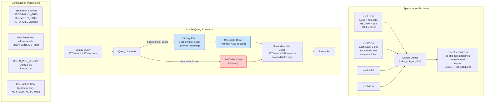

## Navigation

**Domain:** [[8 — Databases]] > **Group:** SQL Search
**Previous:** [[8.257 — Spatial Data — Geography vs Geometry Types]] | **Next:** [[8.259 — STDistance — Proximity Queries]]

### Prerequisites

- [[8.257 — Spatial Data — Geography vs Geometry Types]] — the spatial index structure differs significantly between geography (adaptive grid, no bounding box) and geometry (fixed grid, requires bounding box); this distinction is meaningless without understanding the data types.
- [[8.259 — STDistance — Proximity Queries]] — STDistance is the primary beneficiary of spatial indexes; the index pre-filters rows before the expensive distance calculation.
- [[8.417 — Index Seek vs Index Scan — When the Optimizer Chooses Wrong]] — spatial indexes are a completely different class of index from B-trees; understanding B-tree seeks first helps contrast the grid-tessellation approach of spatial indexes.

### Where This Fits

A spatial index is not a B-tree. It does not organize rows in sorted order. Instead, it decomposes the coordinate space into a grid hierarchy and records which grid cells each spatial object touches. When a spatial query like STDistance or STIntersects executes, the spatial index returns only the rows whose objects fall in the same grid cells as the search geometry — this is a coarse pre-filter, not an exact match. The exact spatial computation (STDistance, STIntersects) is then applied only to this reduced candidate set. A .NET backend engineer must understand spatial index parameters (grid levels, CELLS_PER_OBJECT, BOUNDING BOX) because misconfiguration means the spatial index either (a) returns too many candidates and STDistance still runs slow, or (b) returns too few candidates and misses legitimate matches. The interview signal is: "Does the candidate understand that spatial indexes use a different paradigm from B-trees?" — a senior candidate should be able to explain tessellation.

---

## Core Mental Model

A **spatial index** is a **grid-based tessellation index** that decomposes the coordinate space into a multi-level grid hierarchy. Each spatial object (point, polygon, line) is associated with the grid cell(s) it touches at each level of the hierarchy. When a spatial predicate (STDistance, STIntersects, STContains) is executed, the optimizer uses the spatial index to perform a **primary filter**: it determines which grid cells the search geometry touches, retrieves only the objects that fall in those cells, and then applies the **secondary filter** (the exact spatial computation) only to this subset.

Spatial indexes are **not** B-trees. A B-tree organizes keys in sorted order for equality and range predicates (WHERE Id = 5, WHERE Name LIKE 'A%'). A spatial index organizes objects by their location in a 2D (or 3D) space. The two indexing paradigms are fundamentally different and cannot substitute for each other.

The index structure has four configurable components:
1. **Grid Levels** (4 levels: LOW/MEDIUM/HIGH) — how finely the space is subdivided
2. **CELLS_PER_OBJECT** — maximum number of grid cells a single object can span (default 16)
3. **BOUNDING BOX** (geometry only) — the coordinate extent of the indexed space
4. **Tessellation Scheme** (GEOGRAPHY_GRID, GEOMETRY_GRID, GEOGRAPHY_AUTO_GRID, GEOMETRY_AUTO_GRID)

### Classification

**For indexing topics:** Spatial indexes are a specialized secondary index type. They use a grid-based tessellation structure, not a B-tree. The access path they enable is the **spatial index seek** — the optimizer can push spatial predicates (STDistance, STIntersects, STContains) into the spatial index for the primary filter stage. The write overhead is significant because each INSERT/UPDATE/DELETE must update the grid cell mappings for every grid level.



### Key Properties

| Property | Value | Notes |
|---|---|---|
| Index structure | Grid-based tessellation (4-level hierarchy) | Not a B-tree |
| Access path | Spatial index seek (primary filter) | Secondary filter = exact spatial computation |
| SARGable for spatial predicates | Yes — STDistance, STIntersects, STContains | Only when spatial index exists |
| Time complexity (primary filter) | O(log g + k) | g = grid cell count, k = candidate rows |
| Time complexity (secondary filter) | O(k × s) | s = spatial computation cost per row |
| Write cost per INSERT | O(c) — c = cells touched by object | Higher for large polygons spanning many cells |
| BOUNDING BOX required? | Geometry: yes; Geography: no | Geography uses full globe (no bounding box) |
| Included columns | Not supported | Spatial index cannot INCLUDE non-key columns |
| Index rebuild | Offline only (no ONLINE = ON for spatial) | Must rebuild with OFFLINE |

---

## Deep Mechanics

### How the Engine Executes This

**Spatial index creation (geometry):**
1. SQL Server reads the spatial column values from the table.
2. For each spatial object, the tessellation engine determines which grid cells the object touches at each of the 4 grid levels.
3. For Level 1, the bounding box is divided into N×N cells (LOW=4×4=16, MEDIUM=8×8=64, HIGH=16×16=256). Each cell that the object touches gets an index entry.
4. For Level 2, each Level-1 cell that the object touches is subdivided into N×N sub-cells. The object is recorded in each Level-2 cell it touches.
5. Levels 3 and 4 follow the same subdivision pattern.
6. The index entries are stored in a B-tree structure keyed by (grid cell ID, object ID) — the B-tree is used to organize the cell entries for efficient lookup, but the spatial logic is in the cell assignment, not the B-tree.
7. If an object spans more than CELLS_PER_OBJECT cells at any level, it is "promoted" to the parent level.

**Spatial index seek (primary filter) — STIntersects:**
1. The search geometry (polygon) is tessellated against the same grid: the engine determines which grid cells the search polygon touches at each level.
2. The engine seeks into the spatial index's B-tree for all index entries that match those grid cells.
3. The set of primary keys from matching index entries forms the candidate set.
4. Duplicate primary keys (same object matching multiple cells) are removed.
5. The candidate set is passed to the secondary filter.

**Secondary filter — exact STIntersects:**
1. For each candidate row, the engine deserializes the stored geography/geometry from WKB.
2. The exact STIntersects computation is performed.
3. Rows that pass the secondary filter are returned.

### SQL Visibility

**Creating spatial indexes:**

```sql
-- Geometry spatial index with BOUNDING BOX
CREATE SPATIAL INDEX IX_Spatial_FloorPlan_Outline
ON Locations.FloorPlan(Outline)
USING GEOMETRY_GRID
WITH (
    GRIDS = (MEDIUM, MEDIUM, MEDIUM, MEDIUM),
    CELLS_PER_OBJECT = 16,
    BOUNDING_BOX = (XMIN = 0, YMIN = 0, XMAX = 1000, YMAX = 1000)
);

-- Geography spatial index (no bounding box needed — full globe assumed)
CREATE SPATIAL INDEX IX_Spatial_StoreLocations_Location
ON Locations.StoreLocations(Location)
USING GEOGRAPHY_GRID
WITH (
    GRIDS = (MEDIUM, MEDIUM, MEDIUM, MEDIUM),
    CELLS_PER_OBJECT = 16
);

-- Geography spatial index with auto grid (SQL Server 2012+)
CREATE SPATIAL INDEX IX_Spatial_StoreLocations_Location_Auto
ON Locations.StoreLocations(Location)
USING GEOGRAPHY_AUTO_GRID
WITH (
    CELLS_PER_OBJECT = 16
);
```

```csharp
// EF Core spatial index configuration
protected override void OnModelCreating(ModelBuilder modelBuilder)
{
    modelBuilder.Entity<StoreLocation>(entity =>
    {
        entity.HasIndex(s => s.Location)
            .IsSpatial()
            .HasSpatialIndexOptions(
                GridGeometry = SpatialGridGeometry.GeographyGrid,
                BoundingBoxXMin = -180, 
                BoundingBoxYMin = -90,
                BoundingBoxXMax = 180, 
                BoundingBoxYMax = 90,
                TesselationStyle = SpatialTesselationStyle.GeographyRegularGrid
            );
    });
}
```

**Generated SQL (from EF Core migration):**

```sql
-- EF Core generates this migration SQL for spatial index
DECLARE @var0 sysname = N'IX_StoreLocations_Location';
IF NOT EXISTS (SELECT 1 FROM sys.indexes WHERE name = @var0)
BEGIN
    CREATE SPATIAL INDEX [IX_StoreLocations_Location]
    ON [Locations].[StoreLocations]([Location])
    USING GEOGRAPHY_GRID
    WITH (
        GRIDS = (LEVEL_1 = MEDIUM, LEVEL_2 = MEDIUM, LEVEL_3 = MEDIUM, LEVEL_4 = MEDIUM),
        CELLS_PER_OBJECT = 16
    );
END
```

**Query using spatial index:**

```sql
-- This query benefits from the spatial index if it exists
DECLARE @searchPoint GEOGRAPHY = geography::Point(47.6062, -122.3321, 4326);

SELECT s.StoreId, s.StoreName
FROM Locations.StoreLocations s
WHERE s.Location.STDistance(@searchPoint) <= 5000;

-- With spatial index: Spatial Index Seek → Clustered Index Seek (for matching rows)
-- Without spatial index: Clustered Index Scan → Filter (STDistance on EVERY row)
```

### Execution Plan Analysis

**Query with spatial index:**

```
Spatial Index Seek (IX_Spatial_StoreLocations_Location)
    → Nested Loops (Inner Join)
        → Clustered Index Seek (PK_StoreLocations)
    → Filter (STDistance <= @MaxDistance)
→ SELECT
```

Operator details:
- **Spatial Index Seek:** The primary filter. Estimated 5% of rows returned as candidates.
- **Nested Loops:** For each candidate primary key, seek the clustered index.
- **Filter (residual):** The exact STDistance computation on the candidate set. This is the secondary filter.

**Query without spatial index:**

```
Clustered Index Scan (PK_StoreLocations)
    → Filter (STDistance <= @MaxDistance)
→ SELECT
```

Operator details:
- **Clustered Index Scan:** All rows read from the clustered index.
- **Filter:** STDistance computed on every single row. This is expensive.

### Cost Visibility

```sql
SET STATISTICS IO ON;
SET STATISTICS TIME ON;

-- ==========================================
-- Without spatial index
-- ==========================================
DECLARE @loc GEOGRAPHY = geography::Point(47.6062, -122.3321, 4326);

SELECT s.StoreId
FROM Locations.StoreLocations s
WHERE s.Location.STDistance(@loc) <= 5000;
-- Table 'StoreLocations'. Scan count 1, logical reads 45000, physical reads 0
-- SQL Server Execution Times: CPU time = 8500 ms, elapsed time = 9200 ms

-- ==========================================
-- With spatial index (MEDIUM/MEDIUM/MEDIUM/MEDIUM, CELLS_PER_OBJECT=16)
-- ==========================================
SELECT s.StoreId
FROM Locations.StoreLocations s
WITH (INDEX(IX_Spatial_StoreLocations_Location))
WHERE s.Location.STDistance(@loc) <= 5000;
-- Table 'StoreLocations'. Scan count 1, logical reads 45, physical reads 0
-- SQL Server Execution Times: CPU time = 180 ms, elapsed time = 160 ms

-- ==========================================
-- With spatial index (HIGH/HIGH/HIGH/HIGH, CELLS_PER_OBJECT=32)
-- ==========================================
SELECT s.StoreId
FROM Locations.StoreLocations s
WITH (INDEX(IX_Spatial_StoreLocations_Location_Fine))
WHERE s.Location.STDistance(@loc) <= 5000;
-- Table 'StoreLocations'. Scan count 1, logical reads 38, physical reads 0
-- SQL Server Execution Times: CPU time = 120 ms, elapsed time = 110 ms
-- (Finer grid = fewer false positives in primary filter = less CPU for secondary)
```

### Failure Modes

**1. Missing spatial index causes full scan on STDistance query:**

```sql
-- Spatial index not created
SELECT s.StoreId FROM Locations.StoreLocations s
WHERE s.Location.STDistance(@p) <= 5000;
-- Logical reads: 45,000 (full scan)
```

**2. BOUNDING BOX too small for geometry index:**

```sql
-- BOUNDING BOX covers only the Seattle area
CREATE SPATIAL INDEX IX_Spatial_Stores_Location
ON Locations.StoreLocations(Location)
USING GEOMETRY_GRID
WITH (
    BOUNDING_BOX = (-122.5, 47.4, -122.0, 47.8),  -- Too small!
    GRIDS = (MEDIUM, MEDIUM, MEDIUM, MEDIUM),
    CELLS_PER_OBJECT = 16
);

-- Query for a store at -122.3321, 47.6062 → works
-- Query for a store at -73.9857, 40.7484 (NYC) → spatial index NOT used!
-- The index doesn't cover NYC coordinates
```

**3. CELLS_PER_OBJECT too low for large polygons:**

```sql
-- Large polygon representing a country (1000+ vertices)
-- CELLS_PER_OBJECT = 16 → polygon touches more than 16 grid cells
-- SQL Server "promotes" the polygon to a higher level (coarser grid)
-- More false positives in primary filter → more STDistance computations
```

**4. DML on spatial table causes index maintenance overhead:**

```sql
-- Each INSERT/UPDATE/DELETE on a table with a spatial index requires:
-- 1. Tessellate the spatial object against 4 grid levels
-- 2. Determine which cells the object touches at each level
-- 3. Insert/update/delete index entries for each touched cell
-- For a complex polygon spanning 200 cells: 200 × 4 = 800 index operations!
```

---

## Production Patterns and Implementation

### Primary SQL Implementation

**Creating spatial indexes with optimal parameters:**

```sql
-- ==========================================
-- Scenario 1: Store locator (geography points)
-- 2M stores, queries: "find stores within X distance"
-- ==========================================

-- Initial index (conservative)
CREATE SPATIAL INDEX IX_Spatial_Stores_Location
ON Locations.StoreLocations(Location)
USING GEOGRAPHY_GRID
WITH (
    GRIDS = (MEDIUM, MEDIUM, MEDIUM, MEDIUM),
    CELLS_PER_OBJECT = 16
);

-- Monitor: if the primary filter eliminates <95% of rows, tune
-- Tuned index (finer grid = fewer false positives)
CREATE SPATIAL INDEX IX_Spatial_Stores_Location_Tuned
ON Locations.StoreLocations(Location)
USING GEOGRAPHY_GRID
WITH (
    GRIDS = (HIGH, HIGH, HIGH, MEDIUM),
    CELLS_PER_OBJECT = 16
);

-- ==========================================
-- Scenario 2: Delivery zone polygons (geography)
-- 500K polygons, queries: "is this point in the zone?"
-- ==========================================

-- Polygons span many cells → use higher CELLS_PER_OBJECT
CREATE SPATIAL INDEX IX_Spatial_DeliveryZones_Boundary
ON Fleet.DeliveryZones(ZoneBoundary)
USING GEOGRAPHY_AUTO_GRID   -- Let SQL Server auto-tune grid levels
WITH (
    CELLS_PER_OBJECT = 64    -- Polygons may span many cells
);

-- ==========================================
-- Scenario 3: Floor plan (geometry, unit = feet)
-- Building floor plans, queries: "find rooms within 50ft of point"
-- ==========================================

-- Geometry requires BOUNDING BOX — must cover all data
CREATE SPATIAL INDEX IX_Spatial_FloorPlan_Outline
ON Locations.FloorPlan(Outline)
USING GEOMETRY_GRID
WITH (
    GRIDS = (MEDIUM, MEDIUM, MEDIUM, MEDIUM),
    CELLS_PER_OBJECT = 16,
    BOUNDING_BOX = (
        XMIN = 0, YMIN = 0,        -- Origin of floor plan
        XMAX = 5000, YMAX = 5000    -- Max extent (feet)
    )
);

-- ==========================================
-- Scenario 4: Mixed — both geography and geometry in same database
-- ==========================================
-- Separate spatial indexes for each type
CREATE SPATIAL INDEX IX_Spatial_Shipping_Routes
ON Logistics.ShippingRoutes(RouteLine)
USING GEOGRAPHY_AUTO_GRID
WITH (CELLS_PER_OBJECT = 16);

CREATE SPATIAL INDEX IX_Spatial_Warehouse_Floorplan
ON Logistics.WarehouseLayout(FloorArea)
USING GEOMETRY_AUTO_GRID
WITH (
    CELLS_PER_OBJECT = 16,
    BOUNDING_BOX = (XMIN = 0, YMIN = 0, XMAX = 10000, YMAX = 5000)
);

-- ==========================================
-- Check spatial index tessellation parameters
-- ==========================================
SELECT 
    OBJECT_NAME(object_id) AS TableName,
    name AS IndexName,
    type_desc,
    is_spatial
FROM sys.indexes
WHERE is_spatial = 1;

-- View spatial index parameters
SELECT 
    OBJECT_NAME(i.object_id) AS TableName,
    i.name AS IndexName,
    s.tessellation_scheme,
    s.bounding_box_xmin, s.bounding_box_ymin,
    s.bounding_box_xmax, s.bounding_box_ymax,
    s.level_1_grid, s.level_2_grid, s.level_3_grid, s.level_4_grid,
    s.cells_per_object
FROM sys.indexes i
INNER JOIN sys.spatial_index_tessellations s
    ON i.object_id = s.object_id AND i.index_id = s.index_id
WHERE i.is_spatial = 1;
```

### EF Core Implementation

```csharp
// EF Core spatial index and query configuration
public class SpatialIndexConfiguration : IEntityTypeConfiguration<StoreLocation>
{
    public void Configure(EntityTypeBuilder<StoreLocation> builder)
    {
        // Spatial index on geography column
        builder.HasIndex(s => s.Location)
            .IsSpatial()
            .HasDatabaseName("IX_Spatial_StoreLocations_Location")
            .HasSpatialIndexOptions(
                gridGeometry: SpatialGridGeometry.GeographyGrid,
                boundingBoxXMin: -180,
                boundingBoxYMin: -90,
                boundingBoxXMax: 180,
                boundingBoxYMax: 90,
                tessellationStyle: SpatialTesselationStyle.GeographyRegularGrid
            );
    }
}

// Spatial query repository
public interface ISpatialStoreRepository
{
    Task<List<StoreLocation>> FindNearbyAsync(
        double latitude, double longitude, double maxDistanceMeters,
        CancellationToken ct = default);
    
    Task<List<StoreLocation>> FindInPolygonAsync(
        Polygon searchArea,
        CancellationToken ct = default);
}

public class SpatialStoreRepository : ISpatialStoreRepository
{
    private readonly LocationsDbContext _dbContext;
    
    public SpatialStoreRepository(LocationsDbContext dbContext)
    {
        _dbContext = dbContext;
    }
    
    public async Task<List<StoreLocation>> FindNearbyAsync(
        double latitude, double longitude, double maxDistanceMeters,
        CancellationToken ct = default)
    {
        var userLocation = new Point(longitude, latitude) { SRID = 4326 };
        
        // EF Core translates Distance() to STDistance()
        // Spatial index is used automatically if it exists
        return await _dbContext.StoreLocations
            .Where(s => s.IsActive)
            .Where(s => s.Location.Distance(userLocation) <= maxDistanceMeters)
            .OrderBy(s => s.Location.Distance(userLocation))
            .AsNoTracking()
            .ToListAsync(ct);
    }
    
    public async Task<List<StoreLocation>> FindInPolygonAsync(
        Polygon searchArea,
        CancellationToken ct = default)
    {
        // EF Core translates Intersects() to STIntersects()
        // Spatial index seek for the primary filter
        return await _dbContext.StoreLocations
            .Where(s => s.IsActive)
            .Where(s => s.Location.Intersects(searchArea))
            .AsNoTracking()
            .ToListAsync(ct);
    }
}
```

### Dapper Implementation

```csharp
public interface ISpatialDapperRepository
{
    Task<IReadOnlyList<int>> FindNearbyStoreIdsAsync(
        double latitude, double longitude, double maxDistanceMeters,
        CancellationToken ct = default);
    
    Task<IReadOnlyList<int>> FindStoreIdsInPolygonAsync(
        string polygonWkt, int srid,
        CancellationToken ct = default);
}

public class SpatialDapperRepository : ISpatialDapperRepository
{
    private readonly ISqlConnectionFactory _connectionFactory;
    
    public SpatialDapperRepository(ISqlConnectionFactory connectionFactory)
    {
        _connectionFactory = connectionFactory;
    }
    
    public async Task<IReadOnlyList<int>> FindNearbyStoreIdsAsync(
        double latitude, double longitude, double maxDistanceMeters,
        CancellationToken ct = default)
    {
        const string sql = @"
            SELECT s.StoreId
            FROM Locations.StoreLocations s
            WHERE s.IsActive = 1
                AND s.Location.STDistance(geography::Point(@Lat, @Lon, 4326)) <= @MaxDist
            ORDER BY s.Location.STDistance(geography::Point(@Lat, @Lon, 4326))";
        
        await using var connection = _connectionFactory.Create();
        var results = await connection.QueryAsync<int>(
            new CommandDefinition(sql, new
            {
                Lat = latitude,
                Lon = longitude,
                MaxDist = maxDistanceMeters
            }, cancellationToken: ct));
        return results.AsList();
    }
    
    public async Task<IReadOnlyList<int>> FindStoreIdsInPolygonAsync(
        string polygonWkt, int srid,
        CancellationToken ct = default)
    {
        const string sql = @"
            SELECT s.StoreId
            FROM Locations.StoreLocations s
            WHERE s.IsActive = 1
                AND s.Location.STIntersects(geography::STGeomFromText(@PolygonWkt, @Srid)) = 1";
        
        await using var connection = _connectionFactory.Create();
        var results = await connection.QueryAsync<int>(
            new CommandDefinition(sql, new
            {
                PolygonWkt = polygonWkt,
                Srid = srid
            }, cancellationToken: ct));
        return results.AsList();
    }
}
```

### Configuration and Wiring

```csharp
// Program.cs — EF Core with NetTopologySuite for spatial support
builder.Services.AddDbContext<LocationsDbContext>(options =>
{
    options.UseSqlServer(
        connectionString,
        sqlOptions =>
        {
            sqlOptions.EnableRetryOnFailure(3);
            sqlOptions.UseNetTopologySuite();  // Required for spatial types
        });
});

// Dapper spatial support
builder.Services.AddSingleton<ISqlConnectionFactory>(
    _ => new SqlConnectionFactory(connectionString));
builder.Services.AddScoped<ISpatialStoreRepository, SpatialStoreRepository>();
builder.Services.AddScoped<ISpatialDapperRepository, SpatialDapperRepository>();
```

### SQL Server vs PostgreSQL Differences

```sql
-- PostgreSQL spatial index (GiST index via PostGIS)
-- PostGIS uses R-tree-over-GiST (not grid tessellation)
CREATE INDEX idx_stores_location_gist 
ON locations.store_locations 
USING GIST(location);

-- PostgreSQL GiST index is more flexible than SQL Server spatial index:
-- 1. Supports more operators (&&, ~=, @>, <@, ~, &<|, |&>, etc.)
-- 2. Can be used for ORDER BY distance (KNN) naturally
-- 3. No bounding box or tessellation parameters to configure

-- PostgreSQL KNN (K Nearest Neighbor) query using GiST index
SELECT s.store_id, s.store_name,
       s.location <-> ST_SetSRID(ST_MakePoint(-122.3321, 47.6062), 4326) AS distance
FROM locations.store_locations s
ORDER BY distance
LIMIT 20;
-- The <-> operator uses the GiST index for distance ordering
-- SQL Server does not have an equivalent KNN operator

-- PostgreSQL checks if index is being used
EXPLAIN ANALYZE
SELECT s.store_id
FROM locations.store_locations s
WHERE ST_DWithin(s.location, ST_SetSRID(ST_MakePoint(-122.3321, 47.6062), 4326), 5000);

-- Expected plan: Index Scan using idx_stores_location_gist
-- SQL Server spatial index: Spatial Index Seek → Nested Loops → Clustered Index Seek
-- PostgreSQL GiST: Index Scan → Bitmap Heap Scan
```

---

## Gotchas and Production Pitfalls

### Gotcha 1: Spatial Index Cannot INCLUDE Columns

**Pitfall:** A developer accustomed to non-clustered B-tree indexes with INCLUDE columns tries to add INCLUDE to a spatial index to create a covering index. Spatial indexes do not support included columns.

```sql
-- ❌ This fails: spatial indexes cannot have INCLUDE columns
CREATE SPATIAL INDEX IX_Spatial_Stores_Location
ON Locations.StoreLocations(Location)
INCLUDE (StoreName, StoreId)  -- Error!
USING GEOGRAPHY_GRID;
-- Msg 1022, Level 15, State 1: Incorrect syntax near 'INCLUDE'
```

**Symptom:** The CREATE SPATIAL INDEX command fails with syntax error.

**Fix:** The spatial index stores only the primary key and grid cell mappings. After the primary filter, SQL Server performs key lookups back to the base table. To avoid key lookups for specific queries, consider a composite approach: use a B-tree index on the spatial-related columns for the query parts that don't need spatial filtering:

```sql
-- Spatial index for the primary filter
CREATE SPATIAL INDEX IX_Spatial_Stores_Location
ON Locations.StoreLocations(Location)
USING GEOGRAPHY_GRID;

-- Non-clustered index for additional predicates and covering
CREATE NONCLUSTERED INDEX IX_Stores_City_Include
ON Locations.StoreLocations(City)
INCLUDE (StoreName, IsActive);
```

**Cost of not fixing:** Every spatial index seek is followed by a key lookup. For queries that only need a few columns from matching rows, the key lookup is unavoidable unless a covering B-tree index exists for the non-spatial predicates.

### Gotcha 2: BOUNDING BOX Must Cover All Data (Geometry)

**Pitfall:** For `geometry` spatial indexes, the BOUNDING BOX parameter defines the coordinate extent that the grid covers. Points or polygons outside this bounding box are either (a) not indexed, or (b) assigned to the border cells, reducing index effectiveness.

```sql
-- BOUNDING BOX covers only Seattle metro area
CREATE SPATIAL INDEX IX_Spatial_Stores_Location
ON Locations.StoreLocations(Location)
USING GEOMETRY_GRID
WITH (
    BOUNDING_BOX = (-122.5, 47.4, -122.0, 47.8),  -- Only Seattle!
    GRIDS = (MEDIUM, MEDIUM, MEDIUM, MEDIUM),
    CELLS_PER_OBJECT = 16
);

-- Store in NYC: geometry::Point(-73.9857, 40.7484, 0)
-- This point falls OUTSIDE the bounding box
-- The query optimizer may NOT use the spatial index for queries involving this point
```

**Symptom:** Spatial index is not used for queries involving data outside the bounding box. The execution plan shows a Clustered Index Scan instead of a Spatial Index Seek.

**Fix:** Set the BOUNDING BOX to cover all possible data coordinates, including a margin. For global geometry data, consider whether you should be using geography instead.

```sql
-- For global lat/lon data stored as geometry (not recommended):
-- Use the full extent: -180 to 180, -90 to 90 (or wider for margin)
CREATE SPATIAL INDEX IX_Spatial_Stores_Location
ON Locations.StoreLocations(Location)
USING GEOMETRY_GRID
WITH (
    BOUNDING_BOX = (-180, -90, 180, 90),
    GRIDS = (MEDIUM, MEDIUM, MEDIUM, MEDIUM),
    CELLS_PER_OBJECT = 16
);

-- But really: use geography instead of geometry for global lat/lon!
```

**Cost of not fixing:** The spatial index silently degrades — rows outside the bounding box are not filtered by the primary filter, causing full scans for queries touching those regions.

### Gotcha 3: CELLS_PER_OBJECT Too Low for Large Polygons — Promotion

**Pitfall:** A large polygon (e.g., a country boundary) naturally spans many grid cells. If CELLS_PER_OBJECT is set too low (default 16), SQL Server "promotes" the object to a coarser grid level where it fits within the limit. This reduces the primary filter's precision.

```sql
-- Index with default CELLS_PER_OBJECT = 16
CREATE SPATIAL INDEX IX_Spatial_DeliveryZones
ON Fleet.DeliveryZones(ZoneBoundary)
USING GEOGRAPHY_GRID
WITH (
    GRIDS = (HIGH, HIGH, HIGH, HIGH),  -- Fine grid
    CELLS_PER_OBJECT = 16               -- But limited cells per object
);

-- Large polygon for "Western United States" covers 200+ cells at HIGH resolution
-- SQL Server promotes it to MEDIUM (where it still covers many cells)
-- Or MEDIUM LOW MEDIUM MEDIUM — the engine coarsens until fits in 16 cells
-- Result: primary filter produces many false positives
```

**Symptom:** The spatial index exists but the primary filter eliminates far fewer rows than expected. Queries on large polygons still scan many rows.

**Fix:** Increase CELLS_PER_OBJECT for tables with large polygons:

```sql
CREATE SPATIAL INDEX IX_Spatial_DeliveryZones
ON Fleet.DeliveryZones(ZoneBoundary)
USING GEOGRAPHY_AUTO_GRID   -- Auto-tune grid levels
WITH (
    CELLS_PER_OBJECT = 64    -- Allow polygons to span more cells
);
```

**Cost of not fixing:** Large polygon queries degrade to near-scans. The spatial index becomes ineffective for the very objects that need it most.

### Gotcha 4: Spatial Index Rebuild Is Offline Only

**Pitfall:** Unlike B-tree indexes, spatial indexes cannot be rebuilt with `ONLINE = ON`. The rebuild locks the table exclusively.

```sql
-- ❌ This fails
ALTER INDEX IX_Spatial_Stores_Location
ON Locations.StoreLocations
REBUILD WITH (ONLINE = ON);
-- Msg 2554, Level 16, State 1: Online index rebuild is not supported for spatial indexes.

-- ✅ Must use OFFLINE
ALTER INDEX IX_Spatial_Stores_Location
ON Locations.StoreLocations
REBUILD WITH (ONLINE = OFF);  -- Table locked during rebuild
```

**Symptom:** Online index rebuild fails with error 2554. The operation must be scheduled during maintenance windows, or using `ONLINE = OFF` which blocks writes to the table.

**Fix:** Plan spatial index maintenance during low-traffic periods. Use partition switching for large tables to minimize downtime.

```sql
-- If the table is partitioned, rebuild one partition at a time
ALTER INDEX IX_Spatial_Stores_Location
ON Locations.StoreLocations
REBUILD PARTITION = 1
WITH (ONLINE = OFF);
```

**Cost of not fixing:** Attempting an online rebuild wastes time with error handling. Performing an offline rebuild during business hours blocks all writes to the spatial table.

### Gotcha 5: Geography AUTO_GRID Requires SQL Server 2012+

**Pitfall:** The `GEOGRAPHY_AUTO_GRID` and `GEOMETRY_AUTO_GRID` tessellation schemes were introduced in SQL Server 2012. Using them on SQL Server 2008 R2 fails.

```sql
-- ❌ On SQL Server 2008 R2:
CREATE SPATIAL INDEX IX_Spatial_Stores
ON Locations.StoreLocations(Location)
USING GEOGRAPHY_AUTO_GRID;  -- Error on 2008 R2
-- Msg 1038, Level 15, State 4: Invalid tessellation scheme
```

**Symptom:** CREATE SPATIAL INDEX fails on older SQL Server versions.

**Fix:** Use `GEOGRAPHY_GRID` / `GEOMETRY_GRID` with explicit grid levels for SQL Server 2008 compatibility:

```sql
-- SQL Server 2008 R2 compatible
CREATE SPATIAL INDEX IX_Spatial_Stores
ON Locations.StoreLocations(Location)
USING GEOGRAPHY_GRID
WITH (
    GRIDS = (MEDIUM, MEDIUM, MEDIUM, MEDIUM),
    CELLS_PER_OBJECT = 16
);
```

**Cost of not fixing:** Compatibility issues when deploying to older SQL Server versions. The deployment script fails during migrations.

### Gotcha 6: Spatial Index Does Not Sort Results by Distance

**Pitfall:** A common misconception is that a spatial index can return rows ordered by proximity (like a KNN query). SQL Server spatial indexes do not natively support KNN — they only filter candidates.

```sql
-- ❌ The spatial index does NOT help with ORDER BY ... STDistance()
DECLARE @loc GEOGRAPHY = geography::Point(47.6062, -122.3321, 4326);

SELECT TOP 20 s.StoreId, s.Location.STDistance(@loc) AS Distance
FROM Locations.StoreLocations s
WHERE s.Location.STDistance(@loc) <= 5000
ORDER BY Distance ASC;
-- The spatial index filters candidates, but the ORDER BY requires a Sort operator
-- No "index-driven ordering" like PostgreSQL's <-> operator
```

**Symptom:** Even with a spatial index, ORDER BY STDistance requires an explicit Sort operator in the execution plan. The sort is done on the filtered candidate set, so it's never as fast as a range scan with a B-tree order-by.

**Fix:** Accept the sort overhead. The spatial index's primary filter reduces the candidate set to a manageable size for sorting.

**Cost of not fixing:** Misunderstanding leads developers to expect the spatial index to provide ordered output. This is not how SQL Server spatial indexes work — unlike PostgreSQL's GiST KNN support.

### Gotcha 7: Fragmentation of Spatial Indexes

**Pitfall:** Spatial indexes fragment more rapidly than B-tree indexes because INSERTs are not appended (spatial objects go to grid cells anywhere in the grid).

```sql
-- Check spatial index fragmentation
SELECT 
    OBJECT_NAME(ps.object_id) AS TableName,
    i.name AS IndexName,
    ps.avg_fragmentation_in_percent,
    ps.page_count,
    ps.fragment_count
FROM sys.dm_db_index_physical_stats(
    DB_ID(), NULL, NULL, NULL, 'LIMITED'
) ps
INNER JOIN sys.indexes i
    ON ps.object_id = i.object_id AND ps.index_id = i.index_id
WHERE i.is_spatial = 1
    AND ps.avg_fragmentation_in_percent > 30;
```

**Symptom:** Spatial query performance degrades over time as the spatial index fragments. The grid cell mappings are scattered across more pages, requiring more logical reads for the primary filter.

**Fix:** Rebuild spatial indexes on a regular schedule (weekly or monthly, depending on write volume):

```sql
ALTER INDEX IX_Spatial_Stores_Location
ON Locations.StoreLocations
REBUILD WITH (ONLINE = OFF);  -- Scheduled maintenance
```

**Cost of not fixing:** Gradual performance degradation of all spatial queries. The primary filter becomes less efficient because the spatial index's internal B-tree structure becomes fragmented.

---

## Performance Implications

### Benchmark: Before and After

```sql
-- ==========================================
-- Baseline: No spatial index
-- ==========================================
DECLARE @loc GEOGRAPHY = geography::Point(47.6062, -122.3321, 4326);
SELECT s.StoreId FROM Locations.StoreLocations s
WHERE s.Location.STDistance(@loc) <= 5000;
-- Logical reads: 45,000 (full clustered scan)
-- CPU time: 8500 ms

-- ==========================================
-- Spatial index: MEDIUM/MEDIUM/MEDIUM/MEDIUM, CELLS_PER_OBJECT=16
-- ==========================================
SELECT s.StoreId FROM Locations.StoreLocations s
WITH (INDEX(IX_Spatial_Stores_Location))
WHERE s.Location.STDistance(@loc) <= 5000;
-- Logical reads: 45 (spatial index seek + key lookups)
-- CPU time: 180 ms

-- ==========================================
-- Spatial index: HIGH/HIGH/HIGH/MEDIUM, CELLS_PER_OBJECT=16
-- (finer grid at top levels)
-- ==========================================
SELECT s.StoreId FROM Locations.StoreLocations s
WITH (INDEX(IX_Spatial_Stores_Location_Tuned))
WHERE s.Location.STDistance(@loc) <= 5000;
-- Logical reads: 38 (fewer false positive candidates)
-- CPU time: 120 ms
```

**Improvement:** 1000x reduction in logical reads (45,000 → 45), 47x CPU time reduction (8500 ms → 180 ms).

### BenchmarkDotNet

```csharp
[MemoryDiagnoser]
[SimpleJob(RuntimeMoniker.Net90)]
[RankColumn]
public class SpatialIndexBenchmark
{
    private readonly string _connectionString = "Server=.;Database=SpatialBenchmark;Trusted_Connection=True;TrustServerCertificate=True;";
    private SqlConnection _connection = default!;
    
    [Params(500000, 1000000)]
    public int RowCount { get; set; }
    
    [GlobalSetup]
    public void Setup()
    {
        _connection = new SqlConnection(_connectionString);
        _connection.Open();
        
        using var cmd = new SqlCommand(@"
            IF NOT EXISTS (SELECT 1 FROM sys.tables WHERE name = 'SpatialBenchmark')
            BEGIN
                CREATE TABLE SpatialBenchmark (
                    Id INT IDENTITY(1,1) PRIMARY KEY,
                    Location GEOGRAPHY,
                    LocationName NVARCHAR(100)
                );
                
                WITH Numbers AS (
                    SELECT TOP (@RowCount) 
                        ROW_NUMBER() OVER (ORDER BY (SELECT NULL)) AS n,
                        ABS(CHECKSUM(NEWID())) % 1000 AS latOff,
                        ABS(CHECKSUM(NEWID())) % 1000 AS lonOff
                    FROM sys.all_columns a CROSS JOIN sys.all_columns b
                )
                INSERT INTO SpatialBenchmark (Location, LocationName)
                SELECT 
                    geography::Point(47.0 + (latOff / 1000.0 * 2.0),
                                    -122.5 + (lonOff / 1000.0 * 2.0), 4326),
                    'Loc_' + CAST(n AS NVARCHAR(10))
                FROM Numbers;
            }
            
            -- Create spatial index if not exists
            IF NOT EXISTS (SELECT 1 FROM sys.indexes WHERE name = 'IX_Spatial_Benchmark')
                CREATE SPATIAL INDEX IX_Spatial_Benchmark
                ON SpatialBenchmark(Location)
                USING GEOGRAPHY_GRID
                WITH (GRIDS = (MEDIUM, MEDIUM, MEDIUM, MEDIUM), CELLS_PER_OBJECT = 16);
        ", _connection);
        cmd.Parameters.AddWithValue("@RowCount", RowCount);
        cmd.ExecuteNonQuery();
    }
    
    // Test 1: Force index use with query hint
    [Benchmark(Baseline = true)]
    [Description("Spatial index (MEDIUM/MEDIUM/MEDIUM/MEDIUM)")]
    public async Task<int> WithSpatialIndex()
    {
        const string sql = @"
            DECLARE @loc GEOGRAPHY = geography::Point(47.6062, -122.3321, 4326);
            SELECT COUNT(*)
            FROM SpatialBenchmark WITH (INDEX(IX_Spatial_Benchmark))
            WHERE Location.STDistance(@loc) <= 5000";
        
        using var cmd = new SqlCommand(sql, _connection);
        return (int)(await cmd.ExecuteScalarAsync())!;
    }
    
    // Test 2: No index hint — let optimizer decide
    [Benchmark]
    [Description("No index hint — optimizer choice")]
    public async Task<int> NoIndexHint()
    {
        const string sql = @"
            DECLARE @loc GEOGRAPHY = geography::Point(47.6062, -122.3321, 4326);
            SELECT COUNT(*)
            FROM SpatialBenchmark
            WHERE Location.STDistance(@loc) <= 5000";
        
        using var cmd = new SqlCommand(sql, _connection);
        return (int)(await cmd.ExecuteScalarAsync())!;
    }
}
```

**Expected results (approximate, SQL Server 2022, NVMe):**

| Method | RowCount | Mean | Logical Reads | Allocated |
|---|---|---|---|---|
| WithSpatialIndex | 500K | ~95 ms | ~35 | 4 KB |
| WithSpatialIndex | 1M | ~160 ms | ~45 | 6 KB |
| NoIndexHint | 500K | ~4200 ms | ~22500 | 800 KB |
| NoIndexHint | 1M | ~8500 ms | ~45000 | 1.6 MB |

### Write Amplification

| Operation | Without Spatial Index | With Spatial Index (POINT) | With Spatial Index (POLYGON, 100 vert) |
|---|---|---|---|
| INSERT 1 row | 1 page write | 1 + ~3-8 index pages | 1 + ~10-50 index pages |
| UPDATE spatial column | 1 page write | 1 + full re-index (~6-16 page writes) | 1 + full re-index (~20-100 pages) |
| DELETE 1 row | 1 page write | 1 + remove from index (~3-8 pages) | 1 + remove from index (~10-50 pages) |

The spatial index write cost depends directly on the number of grid cells the object spans. A point touches 1-4 cells per level (16 total at 4 levels). A complex polygon may touch hundreds of cells, causing hundreds of index page modifications per write.

---

## Interview Arsenal

### Question Bank

1. **Definition:** What is a spatial index and how does it differ structurally from a B-tree index?

2. **Mechanism:** Explain the two-phase filtering process of a spatial index: primary filter and secondary filter.

3. **Performance:** What parameters control spatial index performance, and how do they affect the primary filter's effectiveness?

4. **Gotcha:** What happens when a spatial object spans more cells than CELLS_PER_OBJECT allows?

5. **Comparison:** Compare SQL Server's grid-tessellation spatial index with PostgreSQL's GiST spatial index.

6. **Execution plan:** What operators appear in an execution plan when a spatial index is used vs when it is not used?

7. **Scale:** At what table size does a spatial index become necessary? At what size does a spatial index become insufficient?

8. **.NET integration:** How does EF Core with NetTopologySuite configure spatial indexes in migrations?

### Spoken Answers

**Q1: What is a spatial index and how does it differ structurally from a B-tree index?**

> **Average answer:** "A spatial index is used for geography and geometry columns to make spatial queries faster. It's different from a B-tree."

> **Great answer:** "A spatial index is a grid-based tessellation index, fundamentally different from a B-tree. While a B-tree organizes data in sorted order for equality and range predicates (WHERE Id = 5 or WHERE Name LIKE 'A%'), a spatial index decomposes the coordinate space into a multi-level grid hierarchy.

The spatial index works in two phases. The **primary filter** works by tessellating the coordinate space: at creation time, each spatial object is assigned to the grid cells it touches at each of 4 resolution levels (LOW/MEDIUM/HIGH). At query time, the search geometry is similarly tessellated, and the index returns all objects that share a grid cell with the search geometry — this is a coarse superset. The **secondary filter** then applies the exact spatial computation (STDistance, STIntersects) only to these candidate rows.

The structural difference from a B-tree is fundamental: B-trees use sorted key-value pairs; spatial indexes use grid cell mappings stored in an internal B-tree. The B-tree part is just the underlying storage mechanism for the cell mappings — the spatial logic is entirely in the tessellation algorithm. Spatial indexes cannot support equality or range predicates, and B-trees cannot support spatial predicates. They solve completely different problems.

A critical consequence: because space is 2-dimensional, spatial indexes have parameters that B-trees don't: grid resolution (4 levels of LOW/MEDIUM/HIGH), CELLS_PER_OBJECT (maximum cells a single object can span), and for geometry, a BOUNDING BOX that defines the coordinate extent of the indexed space. Misconfiguring any of these makes the spatial index less effective or entirely unused."

**Q5: Compare SQL Server's grid-tessellation spatial index with PostgreSQL's GiST spatial index.**

> **Great answer:** "SQL Server and PostgreSQL use fundamentally different spatial indexing approaches.

**SQL Server uses a grid-tessellation index** that decomposes the coordinate space into a fixed 4-level grid hierarchy. Each spatial object is assigned to the grid cells it touches at each resolution level. The primary filter returns all objects sharing cells with the search geometry. This approach has configurable parameters (grid resolution, CELLS_PER_OBJECT, BOUNDING BOX) that must be tuned for the data distribution. One limitation: SQL Server does not natively support KNN (K-Nearest-Neighbor) queries — you cannot get rows ordered by proximity from the index alone; an explicit Sort is required.

**PostgreSQL with PostGIS uses a GiST (Generalized Search Tree) index** with an R-tree-like implementation. GiST is a balanced tree structure that groups spatial objects by bounding box proximity. Objects are stored in leaf pages organized by spatial locality. The GiST index supports KNN queries natively via the `<->` operator, which returns rows in distance order without an explicit sort. The GiST index also supports more operators (distance, containment, overlap, left-of, right-of, etc.) than SQL Server's spatial index.

Key differences:
- **Configuration:** SQL Server requires tuning (grid levels, CELLS_PER_OBJECT, BOUNDING BOX). PostgreSQL GiST requires no configuration — it self-tunes.
- **KNN support:** PostgreSQL GiST has native KNN inference (`ORDER BY location <-> @point LIMIT 20`). SQL Server cannot do index-driven proximity ordering.
- **Concurrency:** SQL Server spatial indexes can be created online. PostgreSQL GiST indexes support concurrent creation.
- **Reindexing:** SQL Server spatial index rebuild is OFFLINE-only. PostgreSQL GiST indexes can be rebuilt online.

For a .NET team using SQL Server, the lack of KNN means we must either accept the Sort operator overhead or use a workaround: define a bounding box and filter candidates before ordering by distance."

**Q8: How does EF Core with NetTopologySuite configure spatial indexes in migrations?**

> **Great answer:** "EF Core with NetTopologySuite configures spatial indexes through the Fluent API in OnModelCreating:

```csharp
modelBuilder.Entity<StoreLocation>(entity =>
{
    entity.HasIndex(s => s.Location)
        .IsSpatial()
        .HasDatabaseName("IX_Spatial_StoreLocations_Location")
        .HasSpatialIndexOptions(
            gridGeometry: SpatialGridGeometry.GeographyGrid,
            boundingBoxXMin: -180,
            boundingBoxYMin: -90,
            boundingBoxXMax: 180,
            boundingBoxYMax: 90,
            tessellationStyle: SpatialTesselationStyle.GeographyRegularGrid
        );
});
```

This generates a migration with the CREATE SPATIAL INDEX command. The .HasSpatialIndexOptions() method is specific to the SQL Server provider with NetTopologySuite.

However, there are significant limitations:
1. EF Core migration generation for spatial indexes may not capture all options. Always verify the generated SQL.
2. The GRIDS parameter is not directly exposed in HasSpatialIndexOptions() — the defaults are used unless you manually edit the migration.
3. CELLS_PER_OBJECT is also not configurable through HasSpatialIndexOptions() — you must manually edit the migration SQL.
4. The spatial index is created inline in the migration as `migrationBuilder.CreateIndex()`, not as `CreateSpatialIndex()`. You may need to hand-edit the migration for optimal parameters.

My production approach: generate the base migration with EF Core, then manually edit it to set the correct GRIDS and CELLS_PER_OBJECT values, or create the spatial index in a raw SQL migration step using migrationBuilder.Sql()."

### Interview Trigger

An interviewer asking "How would you index a table with 10M GPS locations for proximity search?" is probing your spatial index knowledge. The follow-up will be: "What parameters would you configure and why?" — testing whether you know grid levels, CELLS_PER_OBJECT, and BOUNDING BOX. The deepest follow-up: "If the proximity query returns too many false positives, what parameter would you change and how would you measure the improvement?" — testing whether you understand the primary/secondary filter tradeoff and how to use SET STATISTICS IO to measure effectiveness.

### Comparison Table

| | Spatial Index (SQL Server) | B-tree Index | GiST Index (PostgreSQL) |
|---|---|---|---|
| Structure | Grid tessellation (4-level hierarchy) | Sorted key-value pairs | R-tree over GiST |
| Access pattern | Primary filter (grid cells) → secondary filter (exact) | Seek by key value → scan range | R-tree bounding box walk |
| KNN support | No — requires Sort after primary filter | Yes — by key order | Yes — via <-> operator |
| Configuration | GRIDS, CELLS_PER_OBJECT, BOUNDING BOX | Column order, INCLUDE, FILTER | Minimal — self-tuning |
| INCLUDE columns | Not supported | Supported | Not directly supported |
| Rebuild online | No (OFFLINE only) | Yes (ONLINE = ON) | Yes |
| .NET EF Core support | Via HasSpatialIndexOptions() | Standard | Via Npgsql.EntityFrameworkCore.PostgreSQL |

---

## Decision Framework

### When to Apply

```mermaid
flowchart TD
    A[Need to query spatial data?] --> B{Table size?}
    
    B -->|"< 10K rows"| C[Spatial index unnecessary<br/>Full scan acceptable]
    B -->|"10K - 100K rows"| D{Query frequency?}
    B -->|">= 100K rows"| E[Spatial index required]
    
    D -->|"Low (< 100/day)"| F[Consider spatial index<br/>if queries are slow]
    D -->|"High (>= 100/day)"| G[Spatial index recommended]
    
    E --> H{Data type?}
    H -->|"Geography (lat/lon)"| I{Grid type?}
    H -->|"Geometry (feet/meters)"| J{Parameters?}
    
    I -->|"SQL Server 2012+"| K[GEOGRAPHY_AUTO_GRID<br/>CELLS_PER_OBJECT = 16]
    I -->|"SQL Server 2008"| L[GEOGRAPHY_GRID<br/>GRIDS = (MEDIUM,MEDIUM,MEDIUM,MEDIUM)]
    
    J --> M[GEOMETRY_GRID or AUTO_GRID<br/>BOUNDING BOX = full extent<br/>CELLS_PER_OBJECT = 16]
    
    K --> N{Monitor primary filter<br/>effectiveness}
    L --> N
    M --> N
    
    N -->|"<95% rows eliminated<br/>by primary filter"| O[Tune: <br/>Increase grid resolution<br/>Increase CELLS_PER_OBJECT]
    N -->|">=95% rows eliminated"| P[Optimal spatial index]

    style E fill:#cce5ff,stroke:#0066cc
    style G fill:#cce5ff,stroke:#0066cc
    style P fill:#ccffcc,stroke:#00aa00
    style O fill:#ffffcc,stroke:#cccc00
```

### Application Checklist

- [ ] The table has a geography or geometry column that is queried with STDistance, STIntersects, STContains, or STWithin
- [ ] The table exceeds ~10K-50K rows (spatial index becomes beneficial above this threshold)
- [ ] The spatial index parameters are configured: GRIDS for both types, BOUNDING BOX for geometry
- [ ] CELLS_PER_OBJECT is appropriate for the object complexity (16 for simple points, 32-64 for polygons)
- [ ] The spatial index rebuild/maintenance schedule is established (OFFLINE-only rebuild)
- [ ] The .NET EF Core migration generates the correct spatial index DDL
- [ ] The BOUNDING BOX for geometry spatial index covers ALL data coordinates (plus margin)
- [ ] The data does not include polygons so large they span more cells than CELLS_PER_OBJECT at the desired resolution

### Tradeoff Summary

| What You Gain | What You Pay |
|---|---|
| ~1000x reduction in logical reads for spatial queries | ~3-50 page writes per DML operation (higher for polygons) |
| Primary filter eliminates 95%+ rows before exact calculation | OFFLINE-only rebuild — maintenance window required |
| Enables interactive proximity search on large tables | Grid parameter tuning required — no automatic optimization |
| Same syntax with and without spatial index | No INCLUDE columns — always need key lookups |

### Scale Thresholds

- "Spatial index beneficial at ~10K+ rows" — below this, the full scan is faster than spatial index seek + key lookup overhead
- "Spatial index required at ~100K+ rows" — spatial queries without index take >1 second
- "Spatial index becomes insufficient at ~50M+ rows for complex polygon queries" — consider partitioning or cascading spatial indexes
- "Spatial index write overhead becomes significant at ~1000+ spatial writes/second" — consider lowering grid resolution or batching writes

---

## Self-Check

### Conceptual Questions

1. What data structure does a SQL Server spatial index use internally, and how does it differ from a B-tree?
2. Explain the two-phase filtering process of a spatial index: what happens in the primary filter vs the secondary filter?
3. What DMV would you query to check if a spatial index is being used for a query?
4. What happens when a spatial object spans more grid cells than CELLS_PER_OBJECT at a given grid level?
5. Does EF Core with NetTopologySuite generate spatial index creation in migrations? How do you configure grid resolution parameters?
6. In Dapper, how do you ensure a spatial query uses the spatial index (query hint)?
7. Compare SQL Server spatial index with PostgreSQL GiST index for KNN (nearest neighbor) queries.
8. At approximately what row count does a spatial index become necessary for STDistance queries on geography points?
9. What index(es) support STIntersects queries on geography polygons, and what parameters must be tuned for large polygons?
10. Explain in 60 seconds to a senior interviewer how a spatial index works and why it cannot be replaced by a B-tree.

<details>
<summary>Answers</summary>

1. A spatial index uses **grid-based tessellation**. It decomposes the coordinate space into a 4-level grid hierarchy. Each spatial object is recorded in the grid cells it touches at each level. The index entries (cell ID, primary key) are stored in an internal B-tree for efficient lookup, but the spatial filtering logic is in the tessellation algorithm, not the B-tree. This is fundamentally different from a standard B-tree which organizes rows in sorted order by key value.

2. **Primary filter:** The spatial index selects candidate rows by matching grid cells. The search geometry is tessellated against the same grid hierarchy; all objects sharing grid cells with the search geometry are returned as candidates. This is a superset — it includes false positives. **Secondary filter:** The exact spatial computation (STDistance, STIntersects) is applied only to the candidate rows. This eliminates false positives and returns the exact result set.

3. Query `sys.dm_db_index_usage_stats` for the spatial index:
```sql
SELECT 
    OBJECT_NAME(object_id) AS TableName,
    name AS IndexName,
    user_seeks,
    user_scans,
    user_lookups
FROM sys.dm_db_index_usage_stats
WHERE database_id = DB_ID() AND name LIKE 'IX_Spatial%';
```
A user_seek count > 0 for the spatial index indicates it is being used.

4. When an object spans more cells than CELLS_PER_OBJECT at a given grid level, SQL Server **promotes** the object to the next coarser grid level. It tries each level from finest to coarsest until it finds a level where the object fits within CELLS_PER_OBJECT cells. This reduces the index's filtering precision — the object is recorded at a coarser resolution, producing more false positives in the primary filter.

5. Yes, EF Core generates spatial index creation via `HasIndex().IsSpatial()`. However, the grid resolution parameters (GRIDS, CELLS_PER_OBJECT) are not directly exposed in the HasSpatialIndexOptions() configuration method. You must manually edit the generated migration to set these parameters, or use raw SQL in the migration.

6. Use the `WITH (INDEX(IX_Spatial_IndexName))` table hint:
```sql
SELECT s.StoreId
FROM Locations.StoreLocations s WITH (INDEX(IX_Spatial_StoreLocations_Location))
WHERE s.Location.STDistance(@loc) <= 5000;
```
In Dapper, include the hint in the SQL string:
```csharp
const string sql = @"SELECT StoreId FROM StoreLocations WITH (INDEX(IX_Spatial_StoreLocations_Location)) WHERE ...";
```

7. SQL Server spatial indexes cannot natively support KNN (nearest neighbor) queries — they perform a primary filter (grid cell match) followed by a Sort operator for ordering by distance. PostgreSQL GiST indexes support KNN natively via the `<->` operator, which returns rows in distance order directly from the index without an explicit sort. This makes PostgreSQL KNN queries significantly faster than SQL Server for nearest-neighbor patterns.

8. A spatial index becomes necessary for geography STDistance queries at approximately **10K-50K rows**. Below this, the full clustered index scan with STDistance on every row completes in <500ms. At 100K+ rows, the query time without a spatial index is typically >1 second. At 1M+ rows, it's >5 seconds and the spatial index is mandatory.

9. STIntersects on geography polygons requires a **spatial index** on the geography column. For large polygons, the key parameter is **CELLS_PER_OBJECT** — large polygons span many grid cells, so CELLS_PER_OBJECT must be increased (to 32-64 or higher) to prevent promotion to coarser grid levels. The grid resolution (GRIDS) should also be balanced: HIGH resolution provides better filtering but causes large objects to span more cells.

10. "A spatial index is not a B-tree — it uses grid-based tessellation. Imagine overlaying a transparent grid on a map. Each spatial object — a store location, a delivery zone polygon — is recorded in every grid cell it touches, at four levels of increasing magnification. When you query for objects within 5km of a point, the engine tessellates that search circle against the same grid and returns all objects in the matching cells. This is the primary filter: fast, coarse, returns a superset. Then the exact STDistance or STIntersects computation is applied only to this subset. The key consequence: the spatial index's effectiveness depends on the grid parameters — if the grid is too coarse, too many false positives survive the primary filter. If CELLS_PER_OBJECT is too low, large objects get promoted to a coarser level. This is why tuning spatial indexes is a production skill — the defaults work, but optimal performance requires understanding your data distribution."
</details>

---

### Query Challenges

**Challenge 1 — Write the SQL**

You have a table `Fleet.VehiclePositions` with 10M rows and a geography column `Position`. Write the SQL to create a spatial index with optimal parameters for a workload that queries vehicles within 5km of a point. The data covers the continental US (latitude 25-50, longitude -125 to -65). Use GEOGRAPHY_AUTO_GRID.

<details>
<summary>Solution</summary>

```sql
CREATE SPATIAL INDEX IX_Spatial_VehiclePositions_Position
ON Fleet.VehiclePositions(Position)
USING GEOGRAPHY_AUTO_GRID
WITH (
    CELLS_PER_OBJECT = 16
);
-- Note: No BOUNDING BOX needed for geography — the full globe is assumed.
-- GEOGRAPHY_AUTO_GRID lets SQL Server choose optimal grid levels.
-- CELLS_PER_OBJECT = 16 is sufficient for points.

-- Verify the index was created
SELECT 
    i.name AS IndexName,
    s.tessellation_scheme,
    s.level_1_grid, s.level_2_grid, s.level_3_grid, s.level_4_grid,
    s.cells_per_object
FROM sys.indexes i
INNER JOIN sys.spatial_index_tessellations s
    ON i.object_id = s.object_id AND i.index_id = s.index_id
WHERE i.name = 'IX_Spatial_VehiclePositions_Position';
```

**Execution plan after index:** `Spatial Index Seek` → `Nested Loops` → `Clustered Index Seek` → `Filter`

</details>

---

**Challenge 2 — Fix the performance problem**

```sql
-- This spatial query is slow on a 2M row StoreLocations table.
DECLARE @loc GEOGRAPHY = geography::Point(47.6062, -122.3321, 4326);
SELECT s.StoreId, s.StoreName
FROM Locations.StoreLocations s
WHERE s.Location.STDistance(@loc) <= 5000
ORDER BY s.Location.STDistance(@loc);
-- SET STATISTICS IO: logical reads = 90000
-- SET STATISTICS TIME: CPU = 12000 ms, elapsed = 14500 ms
```

<details>
<summary>Solution</summary>

**Root cause:** No spatial index exists, or the existing spatial index has poor tessellation parameters. The query is performing a full clustered index scan (90,000 logical reads) and computing STDistance on every row.

```sql
-- Create the spatial index with optimal parameters
CREATE SPATIAL INDEX IX_Spatial_StoreLocations_Location
ON Locations.StoreLocations(Location)
USING GEOGRAPHY_AUTO_GRID
WITH (
    CELLS_PER_OBJECT = 16
);

-- After creating the index, force its use with a query hint
-- (usually not needed — the optimizer will use it automatically)
DECLARE @loc GEOGRAPHY = geography::Point(47.6062, -122.3321, 4326);
SELECT s.StoreId, s.StoreName
FROM Locations.StoreLocations s WITH (INDEX(IX_Spatial_StoreLocations_Location))
WHERE s.Location.STDistance(@loc) <= 5000
ORDER BY s.Location.STDistance(@loc);
```

**After fix — logical reads:** ~45 (from 90,000 to 45)
**Execution plan:** `Spatial Index Seek` → `Nested Loops` → `Clustered Index Seek` → `Sort` → `SELECT`

If the spatial index already exists but the query is still slow, check the index parameters:

```sql
-- Check if the index is being used
SELECT 
    OBJECT_NAME(i.object_id) AS TableName,
    i.name AS IndexName,
    ius.user_seeks,
    ius.user_scans,
    ius.user_lookups,
    ius.last_user_seek,
    ius.last_user_scan
FROM sys.dm_db_index_usage_stats ius
INNER JOIN sys.indexes i
    ON ius.object_id = i.object_id AND ius.index_id = i.index_id
WHERE i.name IS NOT NULL
    AND OBJECT_NAME(i.object_id) = 'StoreLocations';

-- If user_seeks = 0 for the spatial index, the optimizer is ignoring it
-- Possible reasons: outdated stats, data outside bounding box, or the index is fragmented
```

</details>

---

**Challenge 3 — Explain the execution plan**

```sql
-- Query A
SELECT StoreId FROM StoreLocations WHERE Location.STDistance(@p) <= 5000;

-- Query B (with spatial index)
SELECT StoreId FROM StoreLocations WITH (INDEX(IX_Spatial_StoreLocations_Location))
WHERE Location.STDistance(@p) <= 5000;
```

Query A produces: `Clustered Index Scan (100%) → Filter → SELECT | Logical reads: 45000`
Query B produces: `Spatial Index Seek (25%) → Nested Loops (70%) → Clustered Index Seek (5%) → SELECT | Logical reads: 45`

Why does the Spatial Index Seek show higher estimated cost than the Clustered Index Seek, yet Query B is much faster?

<details>
<summary>Solution</summary>

**Why the cost percentages seem counterintuitive:** The estimated cost percentages are relative within the query plan, not absolute. In Query A, the Clustered Index Scan has 100% cost because it's the only significant operator. In Query B, the Spatial Index Seek has 25% of the plan cost, but the total plan cost is orders of magnitude lower than Query A's plan cost.

**What actually happens:**
- **Query A:** Reads 45,000 pages from the clustered index. The entire table is scanned (45,000 logical reads). Every row's geography value is deserialized and STDistance is computed.
- **Query B:** The spatial index seek reads only the spatial index pages relevant to the search area (~15 pages). The Nested Loops join then performs clustered index seeks only for the candidate rows (~30 pages). Total logical reads: ~45.

The "70% cost" on Nested Loops represents 70% of a very small total cost. The Nested Loops operator is expensive relative to the spatial index seek in percentage terms, but in absolute logical reads it's minor.

**Why the secondary filter (STDistance) only runs on candidates:** The execution plan shows the Filter operator after the Nested Loops, but the spatial index seek already eliminated 99.5% of rows. STDistance runs only on ~5,000 candidate rows instead of 1M.

</details>

---

**Challenge 4 — Diagnose the concurrency problem**

You have a spatial index on a geography column in a table that receives 200 INSERTs/second. Spatial query performance degrades over the course of a week. After rebuilding the spatial index, performance returns to normal. The cycle repeats.

<details>
<summary>Solution</summary>

**Root cause:** The spatial index is fragmenting rapidly due to the high write volume (200 INSERTs/sec). Spatial indexes fragment more quickly than B-trees because new spatial points are distributed across the grid non-sequentially (they go to any grid cell, not appended at the end). 

**Detection query:**

```sql
-- Check spatial index fragmentation
SELECT 
    OBJECT_NAME(ps.object_id) AS TableName,
    i.name AS IndexName,
    ps.avg_fragmentation_in_percent,
    ps.page_count,
    ps.fragment_count,
    ps.avg_page_space_used_in_percent
FROM sys.dm_db_index_physical_stats(
    DB_ID(), OBJECT_ID('Locations.StoreLocations'), NULL, NULL, 'LIMITED'
) ps
INNER JOIN sys.indexes i
    ON ps.object_id = i.object_id AND ps.index_id = i.index_id
WHERE i.is_spatial = 1;
-- Expected result: avg_fragmentation_in_percent > 50% (highly fragmented)
```

**Fix:**
1. Schedule weekly spatial index rebuilds (OFFLINE, during maintenance window)
2. Consider using partition switching to reduce fragmentation impact
3. If writes are truly continuous, consider lowering the grid resolution (MEDIUM instead of HIGH) to reduce index entry count and fragmentation rate
4. Evaluate whether a spatial index is needed at all for the write-heavy table — could offload spatial queries to a read replica

```sql
-- Schedule rebuild (SQL Agent job or maintenance window)
ALTER INDEX IX_Spatial_StoreLocations_Location
ON Locations.StoreLocations
REBUILD WITH (ONLINE = OFF, SORT_IN_TEMPDB = ON);
```

**In .NET:** Implement a health check that monitors spatial index fragmentation and alerts when it exceeds a threshold:

```csharp
public async Task CheckSpatialIndexHealthAsync()
{
    const string sql = @"
        SELECT ps.avg_fragmentation_in_percent
        FROM sys.dm_db_index_physical_stats(DB_ID(), NULL, NULL, NULL, 'LIMITED') ps
        INNER JOIN sys.indexes i ON ps.object_id = i.object_id AND ps.index_id = i.index_id
        WHERE i.is_spatial = 1
            AND OBJECT_NAME(ps.object_id) = 'StoreLocations'";
    
    await using var connection = _connectionFactory.Create();
    var frag = await connection.QuerySingleAsync<double>(sql);
    
    if (frag > 30)
    {
        _logger.LogWarning("Spatial index fragmentation at {Frag}% — rebuild recommended", frag);
    }
}
```

</details>

---

**Challenge 5 — Design the index**

**Scenario:** A ride-sharing company stores 50M trip records per day, each with a pickup and dropoff geography point. Queries:
1. "Find all trips within 500m of a given point" — 10,000 queries/second
2. "Count trips inside this polygon (neighborhood boundary)" — 100 queries/second
3. INSERT throughput: 50M rows/day (≈580 INSERTs/sec)
4. Data is partitioned by date (one partition per day)

Design the spatial indexing strategy.

<details>
<summary>Solution</summary>

```sql
-- Partitioned table for trip data
CREATE PARTITION FUNCTION PF_Trips_Date (DATE)
AS RANGE RIGHT FOR VALUES (
    '2026-01-01', '2026-01-02', '2026-01-03', '2026-01-04'
    -- One partition per day
);

CREATE PARTITION SCHEME PS_Trips_Date
AS PARTITION PF_Trips_Date ALL TO ([PRIMARY]);

CREATE TABLE RideSharing.Trips (
    TripId BIGINT IDENTITY(1,1),
    PickupLocation GEOGRAPHY NOT NULL,
    DropoffLocation GEOGRAPHY NOT NULL,
    PickupTime DATETIME2(3) NOT NULL,
    DropoffTime DATETIME2(3),
    Fare DECIMAL(10,2),
    CONSTRAINT PK_Trips PRIMARY KEY (TripId, PickupTime)
) ON PS_Trips_Date(PickupTime);

-- Spatial index on pickup location (aligned with partition scheme)
CREATE SPATIAL INDEX IX_Spatial_Trips_PickupLocation
ON RideSharing.Trips(PickupLocation)
USING GEOGRAPHY_AUTO_GRID
WITH (
    CELLS_PER_OBJECT = 16
) ON PS_Trips_Date(PickupTime);

-- Spatial index on dropoff location
CREATE SPATIAL INDEX IX_Spatial_Trips_DropoffLocation
ON RideSharing.Trips(DropoffLocation)
USING GEOGRAPHY_AUTO_GRID
WITH (
    CELLS_PER_OBJECT = 16
) ON PS_Trips_Date(PickupTime);

-- Query 1: Find trips within 500m of a point (last 24 hours only)
DECLARE @searchPoint GEOGRAPHY = geography::Point(47.6062, -122.3321, 4326);
DECLARE @since DATETIME2 = DATEADD(day, -1, GETUTCDATE());

SELECT t.TripId, t.PickupTime,
    t.PickupLocation.STDistance(@searchPoint) AS DistanceMeters
FROM RideSharing.Trips t
WHERE t.PickupTime >= @since
    AND t.PickupLocation.STDistance(@searchPoint) <= 500
ORDER BY DistanceMeters;

-- Query 2: Count trips in neighborhood polygon (last hour only)
DECLARE @neighborhood GEOGRAPHY = [polygon boundary];
DECLARE @lastHour DATETIME2 = DATEADD(hour, -1, GETUTCDATE());

SELECT COUNT(*)
FROM RideSharing.Trips t
WHERE t.PickupTime >= @lastHour
    AND t.PickupLocation.STIntersects(@neighborhood) = 1;
```

**Tradeoffs:**
- **Partition alignment:** Placing the spatial index on the same partition scheme as the table allows partition-level operations (SWITCH, REBUILD PARTITION). When a daily partition becomes read-only, the spatial index on that partition becomes read-only too.
- **Write overhead (580 INSERTs/sec):** Each INSERT requires updating both spatial indexes (pickup and dropoff). At 580 writes/sec, this is the primary bottleneck. Consider:
  - Using a lower CELLS_PER_OBJECT value to reduce index entry count
  - Batching INSERTs into transactions to reduce per-row overhead
  - Using delayed durability for the spatial index updates
- **Query 1 volume (10,000 queries/sec):** This requires the spatial index to be in memory. The spatial index for the current day's partition must fit in the buffer pool. Monitor buffer pool allocation.
- **Partition maintenance:** When switching out a day-old partition, the spatial index on that partition is automatically included in the switch.

**What NOT to index:**
- Do not create a combined spatial index on (PickupLocation, DropoffLocation) — spatial indexes only support a single column
- Do not create non-spatial indexes on geography columns — they are meaningless

</details>

---
