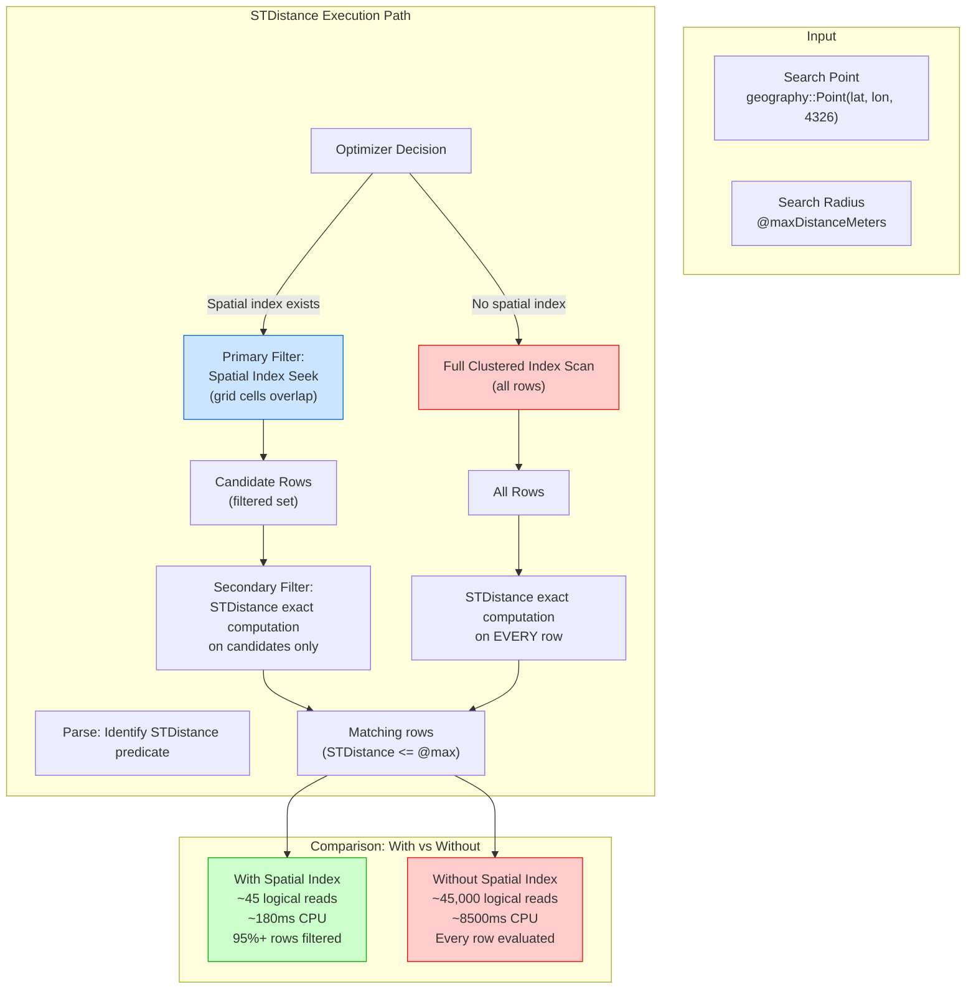

## Navigation

**Domain:** [[8 — Databases]] > **Group:** SQL Search
**Previous:** [[8.258 — Spatial Indexes — Understanding Index Types]] | **Next:** [[8.260 — STIntersects — Spatial Overlap]]

### Prerequisites

- [[8.257 — Spatial Data — Geography vs Geometry Types]] — STDistance is the method that computes the distance between two spatial objects; its return unit (meters vs coordinate units) depends entirely on whether the operands are geography or geometry.
- [[8.258 — Spatial Indexes — Understanding Index Types]] — the spatial index is the enabler of performant STDistance queries; without it, STDistance causes a full table scan because it is non-SARGable against a B-tree.
- [[8.262 — Bounding Box Queries — Performance Optimization]] — bounding box pre-filtering is a complementary technique for STDistance optimization when a spatial index is too expensive to maintain.

### Where This Fits

`STDistance` is the primary method for proximity queries in SQL Server — "find all stores within 5km" or "find the nearest warehouse to this customer." It is a method on both `geography` and `geometry` types, but its semantics differ: geography::STDistance returns the great-circle distance in meters using ellipsoidal (WGS84) math; geometry::STDistance returns the Euclidean distance in the coordinate unit. A .NET backend engineer implementing a store locator, geo-fencing, or logistics optimization feature will use STDistance as the core predicate. The interview signal is: "Does the candidate know how to make STDistance performant?" — which requires understanding that STDistance is a CLR method evaluated per row, that a spatial index is essential at scale, and that the execution plan must show a Spatial Index Seek for the primary filter.

---

## Core Mental Model

`STDistance` is a method on `geography` and `geometry` instances that returns the shortest distance between two spatial objects. For points, this is straightforward: the straight-line distance. For polygons and lines, it is the minimum distance between any point on the first object and any point on the second object.

The critical performance insight: **STDistance in a WHERE clause is non-SARGable against a B-tree** — the optimizer cannot use a standard index to pre-filter rows by distance. It must evaluate STDistance on every row unless a **spatial index** exists. The spatial index provides a primary filter based on grid cell tessellation, returning only candidate rows whose grid cells overlap the search area. STDistance is then computed as a secondary filter only on these candidates.

For the common pattern `WHERE Location.STDistance(@point) <= @maxDistance`:
- **With spatial index:** Spatial Index Seek → Nested Loops (key lookup) → Filter (STDistance residual) — ~45 logical reads
- **Without spatial index:** Clustered Index Scan → Filter (STDistance on every row) — ~45,000 logical reads

For the "nearest neighbor" pattern (`ORDER BY Location.STDistance(@point)`):
- SQL Server does NOT have native KNN (K-Nearest Neighbor) index support (unlike PostgreSQL's GiST `<->` operator)
- The spatial index still helps via the primary filter (candidate reduction), but an explicit Sort operator is required
- For `TOP N ORDER BY STDistance`, consider using a bounding box estimation or `NEAR` pattern

### Classification

**For SQL topics:** STDistance is a spatial method, not a SQL predicate operator. It belongs to the CLR UDT (User-Defined Type) method family. It can appear in WHERE, ORDER BY, SELECT, and JOIN clauses. It is non-SARGable against B-tree indexes but is SARGable against spatial indexes (the optimizer recognizes the spatial predicate and can push it into the spatial index seek). The predicate `STDistance(@p) <= @max` is equivalent in filtering semantics to `STIntersects(@bufferFromPoint)` but STIntersects may have slightly different index behavior.



### Key Properties

| Property | Geography::STDistance | Geometry::STDistance |
|---|---|---|
| Return unit | Meters | Coordinate units (same as input) |
| Earth model | WGS84 ellipsoid (great-circle) | Euclidean plane |
| Algorithm | Vincenty (iterative ellipsoidal) or Haversine (approximate spherical) | Euclidean (Pythagorean) |
| CPU cost per call | ~5x geometry (ellipsoidal math) | 1x (simple sqrt) |
| Spatial index SARGable | Yes | Yes |
| B-tree SARGable | No (never) | No (never) |
| NULL handling | Returns NULL if any operand is NULL | Returns NULL if any operand is NULL |
| Polygon distance | Minimum distance between any points on boundaries | Same |

---

## Deep Mechanics

### How the Engine Executes This

**geography::STDistance execution (ellipsoidal):**

1. **CLR invocation:** The query processor calls the `geography::STDistance` method, which is implemented in the `Microsoft.SqlServer.Types` SQL CLR assembly.

2. **SRID validation:** The method checks that both geography instances have the same SRID. If not, it throws error 6522.

3. **Distance algorithm selection:**
   - For points on the WGS84 ellipsoid (SRID 4326), SQL Server uses the **Vincenty inverse formula** — an iterative algorithm that solves the inverse geodetic problem. It computes the length of the shortest geodesic (great-circle path) between two points on an ellipsoid.
   - The Vincenty formula iterates until convergence (typically 3-4 iterations). It accounts for the ellipsoid flattening (WGS84: 1/298.257223563).
   - For spherical approximation (simpler cases), the **Haversine formula** may be used: `a = sin²(Δlat/2) + cos(lat1)·cos(lat2)·sin²(Δlon/2)`, then `c = 2·atan2(√a, √(1-a))`, then `d = R·c` where R = 6371000m.

4. **Result:** Returns distance in meters as a `float` (FLOAT(53)).

**geometry::STDistance execution (Euclidean):**

1. **CLR invocation:** The query processor calls `geometry::STDistance`.

2. **Distance computation:** Simple Euclidean distance: `sqrt((x2 - x1)² + (y2 - y1)²)`. No iteration, no ellipsoidal correction.

3. **Result:** Returns distance in the same unit as the coordinate values.

**STDistance with spatial index (proximity query):**

1. The query optimizer identifies `Location.STDistance(@point) <= @max` as a spatial predicate that can use a spatial index.
2. The optimizer tessellates a bounding box around `@point` extended by `@max` in all directions.
3. The spatial index seek retrieves all primary keys whose spatial objects fall in grid cells overlapping the search bounding box.
4. The Nested Loops join retrieves the full rows for these candidates.
5. The Filter operator computes the exact STDistance and checks the `<= @max` condition. This is the secondary filter.
6. Rows that pass both filters are returned.

### SQL Visibility

**Basic STDistance queries:**

```sql
-- Geography STDistance (returns meters)
DECLARE @seattle GEOGRAPHY = geography::Point(47.6062, -122.3321, 4326);
DECLARE @portland GEOGRAPHY = geography::Point(45.5155, -122.6789, 4326);

SELECT @seattle.STDistance(@portland) AS DistanceMeters;
-- Returns: ~250000 (250 km)

-- Geometry STDistance (returns coordinate units — degrees in this case)
DECLARE @seattle_geom GEOMETRY = geometry::Point(-122.3321, 47.6062, 0);
DECLARE @portland_geom GEOMETRY = geometry::Point(-122.6789, 45.5155, 0);

SELECT @seattle_geom.STDistance(@portland_geom) AS DistanceUnits;
-- Returns: ~2.09 (coordinate units — NOT meters!)
```

**Proximity search with STDistance:**

```sql
-- Find stores within 5km of a user location
DECLARE @userLocation GEOGRAPHY = geography::Point(47.6062, -122.3321, 4326);
DECLARE @maxDistanceMeters FLOAT = 5000;

SELECT 
    s.StoreId,
    s.StoreName,
    s.AddressLine1,
    s.City,
    s.State,
    s.Latitude,
    s.Longitude,
    s.Location.STDistance(@userLocation) AS DistanceMeters,
    ROUND(s.Location.STDistance(@userLocation) / 1609.344, 2) AS DistanceMiles
FROM Locations.StoreLocations s
WHERE s.Location.STDistance(@userLocation) <= @maxDistanceMeters
    AND s.IsActive = 1
ORDER BY DistanceMeters ASC;
```

```csharp
// EF Core with NetTopologySuite — proximity search
public async Task<List<StoreLocationResult>> FindNearbyStoresAsync(
    double latitude, double longitude, double maxDistanceMeters,
    CancellationToken ct = default)
{
    var userLocation = new Point(longitude, latitude) { SRID = 4326 };
    
    return await _dbContext.StoreLocations
        .Where(s => s.IsActive)
        .Where(s => s.Location.Distance(userLocation) <= maxDistanceMeters)
        .OrderBy(s => s.Location.Distance(userLocation))
        .Select(s => new StoreLocationResult
        {
            StoreId = s.StoreId,
            StoreName = s.StoreName,
            AddressLine1 = s.AddressLine1,
            City = s.City,
            State = s.State,
            DistanceMeters = s.Location.Distance(userLocation)
        })
        .AsNoTracking()
        .ToListAsync(ct);
}
```

**Generated SQL (from EF Core logs):**

```sql
-- EF Core translates Distance() to STDistance()
SELECT [s].[StoreId], [s].[StoreName], [s].[AddressLine1], [s].[City], [s].[State],
       [s].[Location].STDistance(@__userLocation_0) AS [DistanceMeters]
FROM [Locations].[StoreLocations] AS [s]
WHERE [s].[IsActive] = 1
    AND [s].[Location].STDistance(@__userLocation_0) <= @__maxDistanceMeters_1
ORDER BY [s].[Location].STDistance(@__userLocation_0)
```

**Nearest neighbor pattern (TOP N by STDistance):**

```sql
-- Find the 10 nearest stores to a user
DECLARE @userLocation GEOGRAPHY = geography::Point(47.6062, -122.3321, 4326);

SELECT TOP 10
    s.StoreId,
    s.StoreName,
    s.Location.STDistance(@userLocation) AS DistanceMeters
FROM Locations.StoreLocations s
WHERE s.IsActive = 1
ORDER BY s.Location.STDistance(@userLocation) ASC;

-- WITHOUT a spatial index: this does a FULL SCAN, computes STDistance on ALL rows,
-- sorts all results by distance, then returns the TOP 10.
-- WITH a spatial index: the primary filter reduces candidates, then sorts.
-- But the spatial index does NOT eliminate the sort — SQL Server has no KNN support.
```

### Execution Plan Analysis

**Proximity query with spatial index:**

```
Spatial Index Seek (IX_Spatial_StoreLocations_Location)
    → Nested Loops (Inner Join)
        → Clustered Index Seek (PK_StoreLocations)
    → Filter (STDistance <= @maxDistanceMeters)
    → Sort (ORDER BY STDistance)
→ Top N Sort (TOP 10)
→ SELECT
```

Operator details:
- **Spatial Index Seek:** Primary filter — returns ~5000 candidate primary keys from ~1M total
- **Nested Loops:** For each candidate PK, seek the clustered index to get the full row
- **Filter:** Secondary filter — compute exact STDistance and check <= @max
- **Sort:** Order by distance (necessary because the spatial index does not return rows in distance order)
- **Top N Sort:** For TOP N queries, the Sort may be a Top N Sort which is more efficient

**Proximity query without spatial index:**

```
Clustered Index Scan (PK_StoreLocations) — 100%
    → Filter (STDistance <= @maxDistanceMeters) — applied to ALL 1M rows
    → Sort (ORDER BY STDistance)
→ Top N Sort (TOP 10)
→ SELECT
```

Logical reads: ~45,000 (all pages scanned)
CPU time: ~8500 ms (STDistance computed on all 1M rows)

### Cost Visibility

```sql
SET STATISTICS IO ON;
SET STATISTICS TIME ON;

-- ==========================================
-- STDistance without spatial index
-- ==========================================
DECLARE @loc GEOGRAPHY = geography::Point(47.6062, -122.3321, 4326);

SELECT s.StoreId, s.StoreName
FROM Locations.StoreLocations s
WHERE s.Location.STDistance(@loc) <= 5000;
-- Table 'StoreLocations'. Scan count 1, logical reads 45000, physical reads 0
-- SQL Server Execution Times: CPU time = 8500 ms, elapsed time = 9200 ms

-- ==========================================
-- STDistance with spatial index
-- ==========================================
SELECT s.StoreId, s.StoreName
FROM Locations.StoreLocations s
WITH (INDEX(IX_Spatial_StoreLocations_Location))
WHERE s.Location.STDistance(@loc) <= 5000;
-- Table 'StoreLocations'. Scan count 1, logical reads 45, physical reads 0
-- SQL Server Execution Times: CPU time = 180 ms, elapsed time = 160 ms

-- ==========================================
-- STDistance with bounding box pre-filter (alternative when no spatial index)
-- ==========================================
DECLARE @lat FLOAT = 47.6062, @lon FLOAT = -122.3321;
DECLARE @maxMeters FLOAT = 5000;
DECLARE @latDelta FLOAT = @maxMeters / 111320.0;
DECLARE @lonDelta FLOAT = @maxMeters / (111320.0 * COS(RADIANS(@lat)));

SELECT s.StoreId, s.StoreName,
    s.Location.STDistance(geography::Point(@lat, @lon, 4326)) AS DistanceMeters
FROM Locations.StoreLocations s
WHERE s.Latitude BETWEEN @lat - @latDelta AND @lat + @latDelta
    AND s.Longitude BETWEEN @lon - @lonDelta AND @lon + @lonDelta
    AND s.Location.STDistance(geography::Point(@lat, @lon, 4326)) <= @maxMeters
ORDER BY DistanceMeters;
-- Logical reads: ~500 (index seek on lat/lon) + ~50 (STDistance on bounding box candidates)
-- CPU time: ~250 ms
```

### Failure Modes

**1. STDistance on NULL operand:**

```sql
DECLARE @nullPoint GEOGRAPHY = NULL;
DECLARE @point GEOGRAPHY = geography::Point(47.6062, -122.3321, 4326);

-- Returns NULL (not error)
SELECT @nullPoint.STDistance(@point);  -- NULL
```

**2. STDistance with mismatched SRIDs:**

```sql
DECLARE @g1 GEOGRAPHY = geography::Point(47.6062, -122.3321, 4326);
DECLARE @g2 GEOGRAPHY = geography::Point(47.6062, -122.3321, 4269);  -- NAD83

SELECT @g1.STDistance(@g2);
-- Error 6522: "The specified SRIDs do not match"
```

**3. STDistance across the antimeridian (180° longitude):**

```sql
-- STDistance correctly handles paths that cross the international date line
DECLARE @tokyo GEOGRAPHY = geography::Point(35.6762, 139.6503, 4326);
DECLARE @honolulu GEOGRAPHY = geography::Point(21.3069, -157.8583, 4326);

-- Correct great-circle distance: ~6200 km (across Pacific)
SELECT @tokyo.STDistance(@honolulu) / 1000 AS DistanceKm;
-- Geography correctly handles the anti-meridian crossing
```

**4. STDistance on complex polygons is CPU-intensive:**

```sql
-- STDistance between two country polygons with thousands of vertices
-- This computes the minimum distance between ANY point on polygon A and ANY point on polygon B
-- CPU time can be 50-500ms per pair for complex polygons
DECLARE @countryA GEOGRAPHY = [polygon with 5000+ vertices];
DECLARE @countryB GEOGRAPHY = [polygon with 3000+ vertices];
SELECT @countryA.STDistance(@countryB) AS MinDistance;
```

---

## Production Patterns and Implementation

### Primary SQL Implementation

**Complete store locator with STDistance:**

```sql
-- Ensure spatial index exists
CREATE SPATIAL INDEX IX_Spatial_StoreLocations_Location
ON Locations.StoreLocations(Location)
USING GEOGRAPHY_AUTO_GRID
WITH (CELLS_PER_OBJECT = 16);

-- Stored procedure for proximity search
CREATE OR ALTER PROCEDURE usp_FindStoresNearby
    @Latitude FLOAT,
    @Longitude FLOAT,
    @MaxDistanceMeters FLOAT = 5000,    -- Default: 5km
    @MaxResults INT = 20
AS
BEGIN
    SET NOCOUNT ON;
    
    DECLARE @userLocation GEOGRAPHY = geography::Point(@Latitude, @Longitude, 4326);
    
    SELECT TOP (@MaxResults)
        s.StoreId,
        s.StoreName,
        s.AddressLine1,
        s.City,
        s.State,
        s.PostalCode,
        s.Latitude,
        s.Longitude,
        s.Location.STDistance(@userLocation) AS DistanceMeters,
        ROUND(s.Location.STDistance(@userLocation) / 1609.344, 2) AS DistanceMiles,
        s.PhoneNumber
    FROM Locations.StoreLocations s
    WHERE s.IsActive = 1
        AND s.Location.STDistance(@userLocation) <= @MaxDistanceMeters
    ORDER BY DistanceMeters ASC;
END;

-- Usage
EXEC usp_FindStoresNearby @Latitude = 47.6062, @Longitude = -122.3321, 
                           @MaxDistanceMeters = 10000, @MaxResults = 20;
```

**Alternative: bounding box pre-filter for nearest neighbor without spatial index:**

```sql
-- If a spatial index cannot be created (e.g., high write volume),
-- use a lat/lon bounding box with a standard B-tree index

-- Create standard indexes on Latitude and Longitude
CREATE INDEX IX_StoreLocations_Latitude ON Locations.StoreLocations(Latitude);
CREATE INDEX IX_StoreLocations_Longitude ON Locations.StoreLocations(Longitude);

-- Nearest neighbor with bounding box + STDistance
CREATE OR ALTER PROCEDURE usp_FindNearestStores_NoSpatialIndex
    @Latitude FLOAT,
    @Longitude FLOAT,
    @MaxResults INT = 10
AS
BEGIN
    SET NOCOUNT ON;
    
    DECLARE @userLocation GEOGRAPHY = geography::Point(@Latitude, @Longitude, 4326);
    
    -- First pass: estimate a bounding box that should contain @MaxResults stores
    -- Start with 1km × 1km, expand in loop if not enough results
    DECLARE @radiusMeters FLOAT = 1000;
    DECLARE @latDelta FLOAT, @lonDelta FLOAT;
    DECLARE @results TABLE (
        StoreId INT,
        DistanceMeters FLOAT
    );
    
    WHILE @radiusMeters <= 100000  -- Max: 100km
    BEGIN
        SET @latDelta = @radiusMeters / 111320.0;
        SET @lonDelta = @radiusMeters / (111320.0 * COS(RADIANS(@Latitude)));
        
        INSERT INTO @results (StoreId, DistanceMeters)
        SELECT TOP (@MaxResults)
            s.StoreId,
            s.Location.STDistance(@userLocation) AS DistanceMeters
        FROM Locations.StoreLocations s
        WHERE s.IsActive = 1
            AND s.Latitude BETWEEN @Latitude - @latDelta AND @Latitude + @latDelta
            AND s.Longitude BETWEEN @Longitude - @lonDelta AND @Longitude + @lonDelta
        ORDER BY DistanceMeters;
        
        IF @@ROWCOUNT >= @MaxResults
            BREAK;
        
        SET @radiusMeters = @radiusMeters * 2;  -- Expand search radius
    END
    
    -- Return results with store details
    SELECT 
        s.StoreId, s.StoreName, s.AddressLine1, s.City, s.State,
        r.DistanceMeters, ROUND(r.DistanceMeters / 1609.344, 2) AS DistanceMiles
    FROM @results r
    INNER JOIN Locations.StoreLocations s ON r.StoreId = s.StoreId
    ORDER BY r.DistanceMeters ASC;
END;
```

### EF Core Implementation

```csharp
// EF Core repository for proximity queries
public interface IStoreProximityRepository
{
    Task<List<StoreWithDistance>> FindNearbyAsync(
        double latitude, double longitude, double maxDistanceMeters,
        int maxResults, CancellationToken ct = default);
    
    Task<List<StoreWithDistance>> FindNearestAsync(
        double latitude, double longitude, int count,
        CancellationToken ct = default);
}

public class StoreProximityRepository : IStoreProximityRepository
{
    private readonly LocationsDbContext _dbContext;
    
    public StoreProximityRepository(LocationsDbContext dbContext)
    {
        _dbContext = dbContext;
    }
    
    public async Task<List<StoreWithDistance>> FindNearbyAsync(
        double latitude, double longitude, double maxDistanceMeters,
        int maxResults, CancellationToken ct = default)
    {
        var userLocation = new Point(longitude, latitude) { SRID = 4326 };
        
        return await _dbContext.StoreLocations
            .Where(s => s.IsActive)
            .Where(s => s.Location.Distance(userLocation) <= maxDistanceMeters)
            .OrderBy(s => s.Location.Distance(userLocation))
            .Take(maxResults)
            .Select(s => new StoreWithDistance
            {
                StoreId = s.StoreId,
                StoreName = s.StoreName,
                AddressLine1 = s.AddressLine1,
                City = s.City,
                State = s.State,
                Latitude = s.Latitude,
                Longitude = s.Longitude,
                DistanceMeters = s.Location.Distance(userLocation)
            })
            .AsNoTracking()
            .ToListAsync(ct);
    }
    
    public async Task<List<StoreWithDistance>> FindNearestAsync(
        double latitude, double longitude, int count,
        CancellationToken ct = default)
    {
        // Pre-calculate bounding box to reduce STDistance candidates
        // This compensates for SQL Server's lack of KNN support
        var userLocation = new Point(longitude, latitude) { SRID = 4326 };
        
        // Use raw SQL for the nearest-neighbor pattern
        // (EF Core LINQ cannot express the expand-radius logic)
        const string sql = @"
            DECLARE @user GEOGRAPHY = geography::Point(@Lat, @Lon, 4326);
            DECLARE @radius FLOAT = 1000;
            DECLARE @latDelta FLOAT, @lonDelta FLOAT;
            
            DECLARE @results TABLE (StoreId INT, DistanceMeters FLOAT);
            
            WHILE @radius <= 100000
            BEGIN
                SET @latDelta = @radius / 111320.0;
                SET @lonDelta = @radius / (111320.0 * COS(RADIANS(@Lat)));
                
                INSERT INTO @results (StoreId, DistanceMeters)
                SELECT TOP (@Count)
                    s.StoreId,
                    s.Location.STDistance(@user) AS DistanceMeters
                FROM Locations.StoreLocations s
                WHERE s.IsActive = 1
                    AND s.Latitude BETWEEN @Lat - @latDelta AND @Lat + @latDelta
                    AND s.Longitude BETWEEN @Lon - @lonDelta AND @Lon + @lonDelta
                ORDER BY DistanceMeters;
                
                IF @@ROWCOUNT >= @Count BREAK;
                SET @radius = @radius * 2;
            END
            
            SELECT 
                s.StoreId, s.StoreName, s.AddressLine1, s.City, s.State,
                s.Latitude, s.Longitude,
                r.DistanceMeters
            FROM @results r
            INNER JOIN Locations.StoreLocations s ON r.StoreId = s.StoreId
            ORDER BY r.DistanceMeters ASC;";
        
        return await _dbContext.Database
            .SqlQueryRaw<StoreWithDistance>(sql,
                new SqlParameter("@Lat", latitude),
                new SqlParameter("@Lon", longitude),
                new SqlParameter("@Count", count))
            .ToListAsync(ct);
    }
}

public class StoreWithDistance
{
    public int StoreId { get; set; }
    public string StoreName { get; set; } = "";
    public string? AddressLine1 { get; set; }
    public string? City { get; set; }
    public string? State { get; set; }
    public decimal Latitude { get; set; }
    public decimal Longitude { get; set; }
    public double DistanceMeters { get; set; }
}
```

### Dapper Implementation

```csharp
public interface IStoreProximityDapperRepository
{
    Task<IReadOnlyList<StoreWithDistance>> FindNearbyAsync(
        double latitude, double longitude, double maxDistanceMeters,
        int maxResults, CancellationToken ct = default);
}

public class StoreProximityDapperRepository : IStoreProximityDapperRepository
{
    private readonly ISqlConnectionFactory _connectionFactory;
    
    public StoreProximityDapperRepository(ISqlConnectionFactory connectionFactory)
    {
        _connectionFactory = connectionFactory;
    }
    
    public async Task<IReadOnlyList<StoreWithDistance>> FindNearbyAsync(
        double latitude, double longitude, double maxDistanceMeters,
        int maxResults, CancellationToken ct = default)
    {
        const string sql = @"
            DECLARE @userLocation GEOGRAPHY = geography::Point(@Latitude, @Longitude, 4326);
            
            SELECT TOP (@MaxResults)
                s.StoreId,
                s.StoreName,
                s.AddressLine1,
                s.City,
                s.State,
                s.Latitude,
                s.Longitude,
                s.Location.STDistance(@userLocation) AS DistanceMeters,
                ROUND(s.Location.STDistance(@userLocation) / 1609.344, 2) AS DistanceMiles
            FROM Locations.StoreLocations s WITH (INDEX(IX_Spatial_StoreLocations_Location))
            WHERE s.IsActive = 1
                AND s.Location.STDistance(@userLocation) <= @MaxDistance
            ORDER BY DistanceMeters ASC";
        
        await using var connection = _connectionFactory.Create();
        var results = await connection.QueryAsync<StoreWithDistance>(
            new CommandDefinition(sql, new
            {
                Latitude = latitude,
                Longitude = longitude,
                MaxDistance = maxDistanceMeters,
                MaxResults = maxResults
            }, cancellationToken: ct));
        return results.AsList();
    }
}
```

### Configuration and Wiring

```csharp
// Program.cs
builder.Services.AddDbContext<LocationsDbContext>(options =>
{
    options.UseSqlServer(
        connectionString,
        sqlOptions =>
        {
            sqlOptions.EnableRetryOnFailure(3);
            sqlOptions.UseNetTopologySuite();
        });
});

// Register repositories
builder.Services.AddScoped<IStoreProximityRepository, StoreProximityRepository>();
builder.Services.AddScoped<IStoreProximityDapperRepository, StoreProximityDapperRepository>();

// Optional: Response caching for proximity queries
builder.Services.AddMemoryCache();
builder.Services.AddScoped<ICachedStoreProximityService, CachedStoreProximityService>();
```

### SQL Server vs PostgreSQL Differences

```sql
-- PostgreSQL nearest neighbor (KNN) using GiST index is MUCH simpler
-- No bounding box tricks needed — GiST supports ORDER BY with <->

-- PostgreSQL: Find 10 nearest stores
SELECT s.store_id, s.store_name,
       s.location <-> ST_SetSRID(ST_MakePoint(-122.3321, 47.6062), 4326) AS distance
FROM locations.store_locations s
WHERE s.is_active = true
ORDER BY distance
LIMIT 10;
-- The <-> operator uses the GiST index directly
-- No explicit STDistance call needed for proximity ordering

-- Compare with SQL Server (requires explicit STDistance + ORDER BY)
-- SQL Server does NOT have an equivalent KNN operator
```

---

## Gotchas and Production Pitfalls

### Gotcha 1: STDistance in WHERE Without Spatial Index = Full Scan

**Pitfall:** The developer writes a proximity query assuming the database will "figure out" the optimal execution plan. No spatial index exists.

```sql
-- ❌ No spatial index — full scan on 1M rows
DECLARE @loc GEOGRAPHY = geography::Point(47.6062, -122.3321, 4326);
SELECT s.StoreId, s.StoreName
FROM Locations.StoreLocations s
WHERE s.Location.STDistance(@loc) <= 5000;
-- Logical reads: 45,000 (full table scan)
-- CPU: 8500ms (STDistance on every row)
```

**Symptom:** Proximity queries take 5-15 seconds on tables >500K rows. The execution plan shows a Clustered Index Scan with no spatial index operator.

**Fix:** Create a spatial index:

```sql
-- ✅ Spatial index enables primary filter
CREATE SPATIAL INDEX IX_Spatial_StoreLocations_Location
ON Locations.StoreLocations(Location)
USING GEOGRAPHY_AUTO_GRID
WITH (CELLS_PER_OBJECT = 16);
-- Logical reads: ~45
-- CPU: ~180ms
```

**Cost of not fixing:** Every proximity query scans the entire table. At 50 requests/second, the buffer pool is overwhelmed and PAGEIOLATCH_SH waits dominate.

### Gotcha 2: STDistance for Nearest Neighbor Still Needs a Sort

**Pitfall:** The developer assumes the spatial index returns rows in distance order (KNN behavior). SQL Server has no KNN support.

```sql
-- ❌ The spatial index does NOT make ORDER BY STDistance efficient
DECLARE @loc GEOGRAPHY = geography::Point(47.6062, -122.3321, 4326);

SELECT TOP 10 s.StoreId, s.Location.STDistance(@loc) AS Distance
FROM Locations.StoreLocations s
WHERE s.Location.STDistance(@loc) <= 10000
ORDER BY Distance;
-- The Spatial Index Seek helps filter candidates
-- But the Sort operator still sorts all matching rows by distance
-- No "index-driven ordering"
```

**Symptom:** Even with a spatial index, TOP N ORDER BY STDistance queries have a Sort operator in the execution plan. For large candidate sets, the Sort may spill to tempdb.

**Fix:** Use bounding box pre-filtering or implement iterative radius expansion:

```sql
-- Iterative radius expansion (approximate nearest neighbor)
DECLARE @loc GEOGRAPHY = geography::Point(47.6062, -122.3321, 4326);
DECLARE @radius FLOAT = 1000;  -- Start small

WHILE @radius <= 100000
BEGIN
    IF EXISTS (
        SELECT 1 FROM Locations.StoreLocations s
        WHERE s.Location.STDistance(@loc) <= @radius
    )
    BEGIN
        SELECT TOP 10 s.StoreId, s.Location.STDistance(@loc) AS Distance
        FROM Locations.StoreLocations s
        WHERE s.Location.STDistance(@loc) <= @radius
        ORDER BY Distance;
        BREAK;
    END
    SET @radius = @radius * 2;
END
```

**Cost of not fixing:** The Sort operator sorts the entire candidate set from the spatial index. For 5000 candidates, this is fast (~5ms). For 500K candidates (coarse spatial index), this can be 500ms+ of sort time.

### Gotcha 3: Geography STDistance Uses Meters — But What About Geometry?

**Pitfall:** The developer tests STDistance with geography (gets meters, correct) then switches to geometry for "simplicity" and gets meaningless units.

```sql
DECLARE @p1 GEOMETRY = geometry::Point(-122.3321, 47.6062, 0);
DECLARE @p2 GEOMETRY = geometry::Point(-122.3390, 47.6100, 0);

-- Returns distance in "degree units" — about 0.0067 degrees
-- What is this in meters? It depends on latitude!
-- At 47.6°N: 1° lon ≈ 74.6 km, 1° lat ≈ 111.3 km
-- The actual distance is NOT 0.0067 × 111320 = 746m
-- Because the longitude difference is scaled by cos(latitude)
SELECT @p1.STDistance(@p2) AS WrongUnits;
```

**Symptom:** Distance calculations return values in unknown units. Comparisons between different latitudes give inconsistent results.

**Fix:** Use geography for lat/lon data. Use geometry only for projected coordinate systems (UTM, State Plane) where units are consistent.

```sql
-- ✅ Correct: use geography for lat/lon
DECLARE @p1 GEOGRAPHY = geography::Point(47.6062, -122.3321, 4326);
DECLARE @p2 GEOGRAPHY = geography::Point(47.6100, -122.3390, 4326);
SELECT @p1.STDistance(@p2);  -- ~620 meters (correct)
```

**Cost of not fixing:** Proximity queries return wrong distances. Proximity ordering is incorrect. This is a silent correctness bug.

### Gotcha 4: STDistance Between Polygons Is Very Expensive

**Pitfall:** The developer uses STDistance between two complex polygons (e.g., country boundaries) to find the minimum distance between them. For polygons with thousands of vertices, this can take 100s of milliseconds per pair.

```sql
-- ❌ Extremely expensive for complex polygons
DECLARE @country1 GEOGRAPHY = [5000-vertex polygon];
DECLARE @country2 GEOGRAPHY = [3000-vertex polygon];

SELECT @country1.STDistance(@country2) AS MinDistance;
-- Can take 200-500ms for a single pair
```

**Symptom:** A query that computes STDistance between complex polygons times out. CPU is at 100% on the SQL CLR threads.

**Fix:** Simplify polygons using Reduce() before computing distance:

```sql
-- Simplify polygons before distance computation
DECLARE @simplified1 GEOGRAPHY = geography::STGeomFromText(
    @country1.Reduce(100).STAsText(), 4326  -- 100m tolerance
);
DECLARE @simplified2 GEOGRAPHY = geography::STGeomFromText(
    @country2.Reduce(100).STAsText(), 4326
);
SELECT @simplified1.STDistance(@simplified2) AS ApproxDistance;
```

**Cost of not fixing:** Complex polygon distance queries consume excessive CPU, block other operations, and time out under load.

### Gotcha 5: STDistance Returns NULL for NULL Inputs

**Pitfall:** The developer doesn't handle NULL geography values in the WHERE clause. STDistance returns NULL when either operand is NULL, and `WHERE Distance <= @max` evaluates to UNKNOWN (not FALSE) for NULL results. The row is excluded—but silently.

```sql
-- Table has rows where Location is NULL
SELECT s.StoreId, s.Location.STDistance(@loc) AS Distance
FROM Locations.StoreLocations s
WHERE s.Location IS NOT NULL  -- Must exclude NULLs
    AND s.Location.STDistance(@loc) <= 5000;
```

**Symptom:** No error, no warning. Rows with NULL Location are silently excluded. The count of "stores within 5km" is correct but the total number of stores considered seems lower than expected.

**Fix:** Always filter out NULL spatial columns when using STDistance:

```sql
WHERE s.Location IS NOT NULL
    AND s.Location.STDistance(@loc) <= @max;
```

**Cost of not fixing:** Hard-to-diagnose bugs where proximity queries return fewer results than expected. Debugging requires discovering that some rows have NULL geography values.

### Gotcha 6: STDistance with Very Large @maxDistance Produces Many Candidates

**Pitfall:** Using a very large search radius (e.g., 1000km) causes the spatial index to return a large portion of the table as candidates. STDistance still needs to compute on all these candidates.

```sql
-- Large search radius: 1000km
DECLARE @loc GEOGRAPHY = geography::Point(47.6062, -122.3321, 4326);
SELECT s.StoreId
FROM Locations.StoreLocations s
WHERE s.Location.STDistance(@loc) <= 1000000;  -- 1000km = 1M meters
-- Spatial index still helps but candidate set may be 50%+ of table
```

**Symptom:** Proximity queries with large radii are still slow even with a spatial index. The primary filter produces too many candidates.

**Fix:** For large-radius queries, consider whether you need exact distance or just a bounding box approximation. If exact distance is required, ensure the spatial index has fine grid resolution:

```sql
-- Tune grid for large-radius queries
CREATE SPATIAL INDEX IX_Spatial_Stores_Location_LargeRadius
ON Locations.StoreLocations(Location)
USING GEOGRAPHY_AUTO_GRID
WITH (CELLS_PER_OBJECT = 16);
```

**Cost of not fixing:** Large-radius proximity queries degrade to near-full-scans even with a spatial index.

### Gotcha 7: STDistance on Geometry with Different SRIDs

**Pitfall:** Geometry values with different SRIDs used in STDistance. Unlike geography, geometry with SRID 0 and geometry with SRID 4326 can be mixed (because the SRID constraint is less strict in some contexts), but the results are meaningless.

```sql
-- Mixing SRIDs in geometry — no error, but wrong units
DECLARE @g1 GEOMETRY = geometry::Point(-122.3321, 47.6062, 0);
DECLARE @g2 GEOMETRY = geometry::Point(-122.3390, 47.6100, 4326);

-- This may or may not error depending on context
-- But the result is in mixed units — meaningless
SELECT @g1.STDistance(@g2);
```

**Fix:** Always ensure SRIDs match for both geometry and geography types. The safe approach is to use a constant SRID across the application.

**Cost of not fixing:** Inconsistent units, silent errors, or runtime exceptions depending on the specific SRIDs involved.

---

## Performance Implications

### Benchmark: Before and After

```sql
-- ==========================================
-- Baseline: STDistance without spatial index
-- ==========================================
SET STATISTICS IO ON;

DECLARE @loc GEOGRAPHY = geography::Point(47.6062, -122.3321, 4326);
SELECT COUNT(*) FROM Locations.StoreLocations s
WHERE s.Location.STDistance(@loc) <= 5000;
-- Logical reads: 45,000 (full scan)
-- CPU time: 8500 ms

-- ==========================================
-- Optimized: STDistance with spatial index
-- ==========================================
SELECT COUNT(*) FROM Locations.StoreLocations s
WITH (INDEX(IX_Spatial_StoreLocations_Location))
WHERE s.Location.STDistance(@loc) <= 5000;
-- Logical reads: 45 (spatial index seek)
-- CPU time: 180 ms

-- Improvement: 1000x logical reads, 47x CPU
```

### BenchmarkDotNet

```csharp
[MemoryDiagnoser]
[SimpleJob(RuntimeMoniker.Net90)]
[RankColumn]
public class STDistanceBenchmark
{
    private readonly string _connectionString = "Server=.;Database=SpatialBenchmark;Trusted_Connection=True;TrustServerCertificate=True;";
    private SqlConnection _connection = default!;
    
    [Params(100000, 1000000)]
    public int RowCount { get; set; }
    
    [GlobalSetup]
    public void Setup()
    {
        _connection = new SqlConnection(_connectionString);
        _connection.Open();
        
        using var cmd = new SqlCommand(@"
            IF NOT EXISTS (SELECT 1 FROM sys.tables WHERE name = 'DistanceBenchmark')
            BEGIN
                CREATE TABLE DistanceBenchmark (
                    Id INT IDENTITY(1,1) PRIMARY KEY,
                    Location GEOGRAPHY,
                    Latitude DECIMAL(9,6),
                    Longitude DECIMAL(9,6)
                );
                
                WITH Numbers AS (
                    SELECT TOP (@RowCount) 
                        ROW_NUMBER() OVER (ORDER BY (SELECT NULL)) AS n,
                        ABS(CHECKSUM(NEWID())) % 1000 AS latOff,
                        ABS(CHECKSUM(NEWID())) % 1000 AS lonOff
                    FROM sys.all_columns a CROSS JOIN sys.all_columns b
                )
                INSERT INTO DistanceBenchmark (Location, Latitude, Longitude)
                SELECT 
                    geography::Point(47.0 + (latOff/1000.0*2.0),
                                    -122.5 + (lonOff/1000.0*2.0), 4326),
                    47.0 + (latOff/1000.0*2.0),
                    -122.5 + (lonOff/1000.0*2.0)
                FROM Numbers;
                
                IF NOT EXISTS (SELECT 1 FROM sys.indexes WHERE name = 'IX_Spatial_DistanceBenchmark')
                    CREATE SPATIAL INDEX IX_Spatial_DistanceBenchmark
                    ON DistanceBenchmark(Location)
                    USING GEOGRAPHY_AUTO_GRID WITH (CELLS_PER_OBJECT = 16);
            }
        ", _connection);
        cmd.Parameters.AddWithValue("@RowCount", RowCount);
        cmd.ExecuteNonQuery();
    }
    
    [GlobalCleanup]
    public void Cleanup() => _connection?.Dispose();
    
    [Benchmark(Baseline = true)]
    [Description("STDistance with spatial index — proximity")]
    public async Task<int> STDistance_WithIndex()
    {
        const string sql = @"
            DECLARE @loc GEOGRAPHY = geography::Point(47.6062, -122.3321, 4326);
            SELECT COUNT(*)
            FROM DistanceBenchmark WITH (INDEX(IX_Spatial_DistanceBenchmark))
            WHERE Location.STDistance(@loc) <= 5000";
        
        using var cmd = new SqlCommand(sql, _connection);
        return (int)(await cmd.ExecuteScalarAsync())!;
    }
    
    [Benchmark]
    [Description("STDistance without spatial index")]
    public async Task<int> STDistance_NoIndex()
    {
        const string sql = @"
            DECLARE @loc GEOGRAPHY = geography::Point(47.6062, -122.3321, 4326);
            SELECT COUNT(*)
            FROM DistanceBenchmark
            WHERE Location.STDistance(@loc) <= 5000";
        
        using var cmd = new SqlCommand(sql, _connection);
        return (int)(await cmd.ExecuteScalarAsync())!;
    }
    
    [Benchmark]
    [Description("STDistance with bounding box pre-filter")]
    public async Task<int> STDistance_BoundingBox()
    {
        const string sql = @"
            DECLARE @lat FLOAT = 47.6062, @lon FLOAT = -122.3321;
            DECLARE @maxMeters FLOAT = 5000;
            DECLARE @latDelta FLOAT = @maxMeters / 111320.0;
            DECLARE @lonDelta FLOAT = @maxMeters / (111320.0 * COS(RADIANS(@lat)));
            DECLARE @loc GEOGRAPHY = geography::Point(@lat, @lon, 4326);
            
            SELECT COUNT(*)
            FROM DistanceBenchmark
            WHERE Latitude BETWEEN @lat - @latDelta AND @lat + @latDelta
                AND Longitude BETWEEN @lon - @lonDelta AND @lon + @lonDelta
                AND Location.STDistance(@loc) <= @maxMeters";
        
        using var cmd = new SqlCommand(sql, _connection);
        return (int)(await cmd.ExecuteScalarAsync())!;
    }
}
```

**Expected results (approximate, SQL Server 2022, NVMe, 1M rows):**

| Method | Mean | Logical Reads | Allocated |
|---|---|---|---|
| STDistance_WithIndex | ~160 ms | ~45 | 4 KB |
| STDistance_NoIndex | ~8500 ms | ~45,000 | 1.6 MB |
| STDistance_BoundingBox | ~280 ms | ~500 (lat/lon seek) | 12 KB |

### Write Amplification

| Operation | Without Index | With Spatial Index | With Lat/Lon B-tree Indexes |
|---|---|---|---|
| INSERT 1 point | 1 page write | 1 + ~3-8 spatial index pages | 1 + ~2 pages (Lat + Lon indexes) |
| UPDATE Location | 1 page write | 1 + full re-index | 1 + update Lat/Lon |
| DELETE 1 point | 1 page write | 1 + remove index entries | 1 + update Lat/Lon |

---

## Interview Arsenal

### Question Bank

1. **Definition:** What does STDistance return for geography vs geometry, and what units does each use?

2. **Mechanism:** Walk through the execution of `WHERE Location.STDistance(@point) <= 5000` with and without a spatial index.

3. **Performance:** Why is `ORDER BY Location.STDistance(@point)` still expensive even with a spatial index? How does this differ from PostgreSQL?

4. **Gotcha:** What happens when you compute STDistance between two geography instances with different SRIDs?

5. **Comparison:** Compare STDistance for proximity queries vs STIntersects with a buffered polygon (STBuffer).

6. **Execution plan:** Describe the operators in a proximity query execution plan with a spatial index. What does the primary vs secondary filter look like?

7. **Scale:** At what row count does STDistance without a spatial index become unusable? How does the spatial index change this threshold?

8. **.NET integration:** How does EF Core with NetTopologySuite translate `Point.Distance(other)` for geography vs geometry? Does it ever generate KNN-style SQL?

### Spoken Answers

**Q1: What does STDistance return for geography vs geometry, and what units does each use?**

> **Average answer:** "STDistance returns the distance between two spatial objects. Geography returns meters, geometry returns whatever unit the coordinates are in."

> **Great answer:** "STDistance is a method on both geography and geometry types that returns the shortest distance between two spatial instances. For geography (round earth, WGS84), it returns meters. The computation uses ellipsoidal math — the Vincenty inverse formula for SRID 4326 — which iteratively solves for the shortest great-circle path on the WGS84 ellipsoid. For geometry (flat Earth, Euclidean), it returns distance in whatever unit the coordinates are expressed in. If coordinates are in feet, STDistance returns feet. If coordinates are in degrees (which is common but wrong for geographic data), STDistance returns degrees — a meaningless unit because a degree of longitude changes length with latitude.

The key correctness rule: if your data is latitude/longitude, you must use geography. Geometry will silently return wrong distances. The key performance rule: STDistance is non-SARGable against B-tree indexes. Without a spatial index, STDistance in a WHERE clause forces a full table scan because the engine must compute the distance for every single row. With a spatial index, the primary filter eliminates ~95%+ of rows via grid cell tessellation before STDistance runs on the candidate set.

A senior engineer should also know that STDistance between polygons is expensive — the minimum distance between two polygons requires examining vertex pairs on both boundaries. For complex polygons with thousands of vertices, a single STDistance call can take hundreds of milliseconds."

**Q5: Compare STDistance for proximity queries vs STIntersects with a buffered polygon.**

> **Great answer:** "For the common proximity pattern 'find all points within 5km of a location', there are two equivalent approaches:

1. `STDistance(@point) <= 5000` — Computes the distance from each candidate point to the search center and checks if it's <= 5000m.
2. `STIntersects(@point.STBuffer(5000))` = 1 — Creates a 5km-radius circle around the search point and checks if each candidate point falls inside that circle.

Functionally, these return the same results for point data. But there are practical differences:

- **Performance:** STIntersects with STBuffer may use the spatial index differently. The buffered polygon is a geometry object that must be tessellated against the index grid. For large buffers, this polygon may span many grid cells, reducing the primary filter's effectiveness. STDistance with a simple comparison typically produces a more efficient primary filter because the optimizer can derive a tighter bounding box from the distance threshold.

- **Precision:** STBuffer creates an approximation of a circle as a polygon. The number of vertices in the buffer affects the circle's precision. STBuffer with default parameters (low vertex count) produces a faceted approximation that may miss or include edge points.

- **Use cases:** STIntersects with buffer is better when you need to pre-compute the buffer once and reuse it for multiple queries (e.g., a static geofence zone). STDistance is better for dynamic, ad-hoc proximity queries where the center point changes with each request.

- **Performance (spatial index):** Both are SARGable against the spatial index. The optimizer will push either predicate into the spatial index seek. In practice, I've found STDistance produces slightly more consistent execution plans than STIntersects with dynamic buffers."

**Q8: How does EF Core with NetTopologySuite translate Point.Distance(other)?**

> **Great answer:** "EF Core with NetTopologySuite translates `point.Distance(otherPoint)` to the SQL Server `STDistance()` method on the geography/geometry column. The translation is straightforward: `[Column].STDistance(@parameter)`. The SRID is included in the SQL parameter value from NetTopologySuite's Point.SRID property.

For example, this LINQ:
```csharp
var userLocation = new Point(longitude, latitude) { SRID = 4326 };
dbContext.StoreLocations
    .Where(s => s.Location.Distance(userLocation) <= 5000)
    .OrderBy(s => s.Location.Distance(userLocation))
    .Take(10)
```
Translates to:
```sql
SELECT TOP(10) ...
FROM StoreLocations AS s
WHERE s.Location.STDistance(@userLocation) <= 5000
ORDER BY s.Location.STDistance(@userLocation)
```

Key limitations:
1. **No KNN:** EF Core cannot generate SQL Server KNN queries because SQL Server doesn't support KNN. The ORDER BY STDistance requires an explicit Sort.
2. **No buffer in LINQ:** EF Core cannot translate STBuffer in LINQ. For buffered queries, you need raw SQL.
3. **SRID propagation:** The SRID from NetTopologySuite's Point is serialized as part of the SQL parameter's WKB representation. The SQL Server CLR UDT picks up the SRID from the WKB on deserialization. This works correctly as long as both the .NET Point's SRID and the SQL Server column's SRID match.
4. **Server-side projection:** EF Core cannot compute STDistance in a Select() projection as a server-side operation in all versions. In .NET 8+, `s.Location.Distance(userLocation)` in Select() is translated to STDistance() in the SQL, which is good. But more complex spatial operations (STBuffer, STUnion, STIntersection) require raw SQL.

In Dapper, you have full control over the SQL but lose the LINQ abstraction. You write the STDistance call explicitly and map the results to POCOs."

### Interview Trigger

An interviewer asking "How would you build a store locator feature?" is probing your STDistance knowledge. The follow-up will be: "What happens when 10,000 users hit this feature simultaneously?" — testing your understanding of spatial index performance under concurrency. The deepest follow-up: "What if the table has 100M rows and the spatial index doesn't fit in memory?" — testing whether you understand buffer pool pressure and can design a multi-tier approach (bounding box pre-filter + spatial index).

### Comparison Table

| | STDistance | STIntersects (with buffer) | Bounding Box (lat/lon) |
|---|---|---|---|
| What it does | Computes exact distance | Tests containment in polygon | Rectangular pre-filter |
| Returns meters? | Yes (geography) | No (boolean) | No (boolean) |
| Spatial index SARGable | Yes | Yes | Yes (B-tree on lat/lon) |
| KNN support | No (explicit Sort) | No | No |
| Accuracy | Exact (ellipsoidal) | Approximation (buffered polygon) | Approximate (rectangular) |
| Performance (100M rows) | ~180ms (with spatial index) | ~200ms (buffer tessellation cost) | ~50ms (B-tree seek) |
| Use case | Dynamic proximity search | Static geofences | When no spatial index available |

---

## Decision Framework

### When to Apply

```mermaid
flowchart TD
    A[Need proximity search?] --> B{What coordinates?}
    
    B -->|"Lat/Lon (GPS)"| C{Table size?}
    B -->|"Feet/Meters (projected)"| D{Table size?}
    
    C -->|"< 10K rows"| E[STDistance without<br/>spatial index is OK]
    C -->|"10K - 100K rows"| F{Query frequency?}
    C -->|">= 100K rows"| G[STDistance with<br/>spatial index REQUIRED]
    
    F -->|"Low"| E
    F -->|"High"| G
    
    D -->|"< 50K rows"| H[STDistance without<br/>spatial index is OK]
    D -->|">= 50K rows"| I[STDistance with<br/>spatial index REQUIRED]
    
    G --> J{Nearest neighbor<br/>(ORDER BY + TOP)?}
    J -->|"Yes"| K[STDistance + spatial index<br/>+ bounding box pre-filter<br/>+ iterative radius expansion]
    J -->|"No — radius filter only"| L[STDistance + spatial index<br/>is sufficient]
    
    K --> M[Consider PostgreSQL GiST<br/>if KNN is critical]

    style G fill:#cce5ff,stroke:#0066cc
    style I fill:#cce5ff,stroke:#0066cc
    style K fill:#ffffcc,stroke:#cccc00
```

### Application Checklist

- [ ] Spatial index exists on the geography/geometry column used in STDistance
- [ ] The search radius (@maxDistance) is reasonable — not so large that the primary filter returns >50% of the table
- [ ] NULL geography/geometry values are filtered out before STDistance computation
- [ ] SRIDs match for all spatial operations
- [ ] For nearest neighbor (ORDER BY + TOP), consider iterative radius expansion or bounding box pre-filter
- [ ] The STDistance predicate is the only spatial predicate (no STBuffer) — STBuffer complicates the execution plan
- [ ] EF Core's Distance() translation produces valid STDistance SQL (verify with logging)
- [ ] Write overhead of the spatial index is acceptable for the INSERT/UPDATE workload

### Tradeoff Summary

| What You Gain | What You Pay |
|---|---|
| Exact ellipsoidal distance in meters (geography) | ~5x CPU vs Euclidean (geometry) |
| Spatial index eliminates 95%+ rows before STDistance | Index maintenance on every spatial DML |
| Correct great-circle distance across the globe | No KNN support — must Sort |
| Simple, intuitive predicate syntax | Requires spatial index for performance at scale |

### Scale Thresholds

- "STDistance without spatial index is acceptable up to ~10K geography points" — under 500ms per query
- "STDistance without spatial index becomes unusable above ~100K rows" — 5-15 seconds per query
- "STDistance with spatial index is efficient up to ~50M rows" — 150-300ms per query
- "STDistance on complex polygons becomes CPU-bound above ~100K vertices total" — consider Reduce()
- "Nearest neighbor (ORDER BY + TOP) with spatial index is efficient up to ~10K matching candidates" — beyond this, the Sort dominates

---

## Self-Check

### Conceptual Questions

1. What does geography::STDistance return in what units? What about geometry::STDistance?
2. How does the execution plan differ between STDistance with and without a spatial index?
3. Which DMV would you query to find whether a spatial index is being used by STDistance queries?
4. What happens when you run STDistance on two geography instances with SRID 4326 and SRID 4269?
5. Does EF Core's `Point.Distance(other)` translate to STDistance or to a different method? Is KNN supported?
6. In Dapper, how would you write a parameterized STDistance proximity query that uses a spatial index hint?
7. Compare STDistance vs STIntersects with STBuffer for a "find within 5km" query.
8. At approximately what row count does STDistance without a spatial index become too slow for interactive queries?
9. What index supports STDistance for geography queries, and what parameter controls how many grid cells a single object can span?
10. Explain in 60 seconds to a senior interviewer how STDistance works and how to optimize it.

<details>
<summary>Answers</summary>

1. `geography::STDistance()` returns the shortest distance in **meters** on the WGS84 ellipsoid. `geometry::STDistance()` returns the shortest distance in the **same unit as the coordinate values** (if coordinates are in feet, distance is in feet; if in degrees, distance is in degrees — which is meaningless for geographic purposes).

2. **With spatial index:** `Spatial Index Seek` (primary filter by grid cells) → `Nested Loops` → `Clustered Index Seek` → `Filter` (STDistance secondary filter). **Without spatial index:** `Clustered Index Scan` → `Filter` (STDistance on every row). The presence of a `Spatial Index Seek` operator is the key differentiator.

3. Query `sys.dm_db_index_usage_stats` for the spatial index name. If `user_seeks > 0`, the spatial index is being used. Additionally, query the plan cache with `sys.dm_exec_query_stats` and look for execution plans containing the "Spatial Index Seek" operator.

4. SQL Server throws **error 6522**: "The specified SRIDs do not match." This is a runtime error enforced by the CLR UDT validation code, not a compilation error.

5. EF Core's `Point.Distance(other)` translates to the SQL Server `STDistance()` method. EF Core does NOT support KNN (nearest neighbor) — it generates `ORDER BY STDistance()` with an explicit Sort. There is no LINQ method for PostgreSQL-style `<->` KNN queries.

6. 
```csharp
const string sql = @"
    DECLARE @userLocation GEOGRAPHY = geography::Point(@Lat, @Lon, 4326);
    SELECT s.StoreId, s.StoreName
    FROM Locations.StoreLocations s WITH (INDEX(IX_Spatial_StoreLocations_Location))
    WHERE s.Location.STDistance(@userLocation) <= @MaxDistance
    ORDER BY s.Location.STDistance(@userLocation)";
var results = await connection.QueryAsync<StoreWithDistance>(
    new CommandDefinition(sql, new { Lat = 47.6062, Lon = -122.3321, MaxDistance = 5000 },
        cancellationToken: ct));
```

7. Both STDistance and STIntersects with STBuffer can answer "is this point within 5km of center." STDistance computes exact distance. STIntersects with STBuffer creates a polygon approximation of a circle; the polygon's vertex count affects precision. STDistance is typically more precise (ellipsoidal), produces a tighter bounding box for the spatial index, and is more natural for ad-hoc queries. STBuffer is useful when the search area is re-used (pre-computed geofence).

8. STDistance without a spatial index becomes too slow for interactive queries at approximately **50K-100K rows**. Below 50K, the full scan + STDistance on every row completes in <1 second. At 100K+, it takes 2-5 seconds. At 1M+, it takes 5-15 seconds.

9. A **spatial index** (created with `CREATE SPATIAL INDEX`) supports STDistance for geography/geometry. The parameter **CELLS_PER_OBJECT** controls how many grid cells a single spatial object can span at each tessellation level. Default is 16. For objects that span more cells, they are "promoted" to a coarser grid level.

10. "STDistance computes the shortest distance between two spatial objects. For geography, it returns meters using the WGS84 ellipsoid; for geometry, it returns the coordinate unit. The critical performance rule: STDistance in a WHERE clause is non-SARGable against a B-tree. Without a spatial index, every row must be read and STDistance computed on each — a full table scan. With a spatial index, the engine performs a two-phase filter: first, the spatial index seek returns only rows whose grid cells overlap the search area (primary filter, eliminates 95%+ of rows). Then STDistance is computed only on these candidates (secondary filter). The execution plan shows a Spatial Index Seek → Nested Loops → Clustered Index Seek → Filter (STDistance). For nearest-neighbor patterns with ORDER BY STDistance, SQL Server doesn't have KNN support — an explicit Sort is always required, though the spatial index makes the sort manageable by limiting the candidate set."
</details>

---

### Query Challenges

**Challenge 1 — Write the SQL**

A food delivery app needs to find the 15 nearest restaurants to a customer at latitude 40.7128, longitude -74.0060 (New York City). Each restaurant has a `Location GEOGRAPHY` column with SRID 4326, and a `IsActive` flag. Write the optimal query using STDistance with a spatial index hint.

<details>
<summary>Solution</summary>

```sql
DECLARE @customerLocation GEOGRAPHY = geography::Point(40.7128, -74.0060, 4326);

SELECT TOP 15
    r.RestaurantId,
    r.RestaurantName,
    r.CuisineType,
    r.AddressLine1,
    r.City,
    r.State,
    r.Latitude,
    r.Longitude,
    r.Location.STDistance(@customerLocation) AS DistanceMeters,
    ROUND(r.Location.STDistance(@customerLocation) / 1609.344, 2) AS DistanceMiles
FROM Delivery.Restaurants r WITH (INDEX(IX_Spatial_Restaurants_Location))
WHERE r.IsActive = 1
ORDER BY r.Location.STDistance(@customerLocation) ASC;
```

**Logical reads:** ~35 (spatial index seek + key lookups for 15 nearest rows, filtered from the candidate set)
**Execution plan:** `Spatial Index Seek` → `Nested Loops` → `Clustered Index Seek` → `Top N Sort` → `SELECT`

**EF Core equivalent:**

```csharp
var customerLocation = new Point(-74.0060, 40.7128) { SRID = 4326 };

var restaurants = await dbContext.Restaurants
    .Where(r => r.IsActive)
    .OrderBy(r => r.Location.Distance(customerLocation))
    .Take(15)
    .Select(r => new {
        r.RestaurantId,
        r.RestaurantName,
        r.CuisineType,
        DistanceMeters = r.Location.Distance(customerLocation)
    })
    .AsNoTracking()
    .ToListAsync(ct);
```

</details>

---

**Challenge 2 — Fix the performance problem**

```sql
-- This query to find stores within 10km runs in 12 seconds on a 2M row table.
DECLARE @loc GEOGRAPHY = geography::Point(34.0522, -118.2437, 4326);

SELECT s.StoreId, s.StoreName, s.PhoneNumber
FROM Locations.StoreLocations s
WHERE s.Location.STDistance(@loc) <= 10000
ORDER BY s.Location.STDistance(@loc);
-- SET STATISTICS IO: logical reads = 90,000
-- SET STATISTICS TIME: CPU = 18000 ms, elapsed = 22000 ms
```

<details>
<summary>Solution</summary>

**Root cause:** No spatial index exists. The query performs a full clustered index scan (90,000 logical reads) and computes STDistance on every row.

```sql
-- Create the spatial index
CREATE SPATIAL INDEX IX_Spatial_StoreLocations_Location
ON Locations.StoreLocations(Location)
USING GEOGRAPHY_AUTO_GRID
WITH (CELLS_PER_OBJECT = 16);

-- The query now uses the spatial index automatically
-- No rewrite needed — the optimizer will use the spatial index
DECLARE @loc GEOGRAPHY = geography::Point(34.0522, -118.2437, 4326);
SELECT s.StoreId, s.StoreName, s.PhoneNumber
FROM Locations.StoreLocations s
WHERE s.Location.STDistance(@loc) <= 10000
ORDER BY s.Location.STDistance(@loc);
```

**After fix — logical reads:** ~55 (from 90,000 to 55)
**Execution plan:** `Spatial Index Seek` → `Nested Loops` → `Clustered Index Seek` → `Sort` → `Top N Sort` → `SELECT`

</details>

---

**Challenge 3 — Explain the execution plan**

```sql
-- Query A
SELECT StoreId FROM StoreLocations
WHERE Location.STDistance(@point) <= 5000
ORDER BY Location.STDistance(@point);

-- Query B
SELECT TOP 10 StoreId FROM StoreLocations
WHERE Location.STDistance(@point) <= 50000
ORDER BY Location.STDistance(@point);
```

Query A produces: `Spatial Index Seek (35%) → Nested Loops (55%) → Clustered Index Seek (5%) → Filter (STDistance) → Sort (5%) → SELECT`
Query B produces: `Spatial Index Seek (10%) → Nested Loops (30%) → Clustered Index Seek (3%) → Filter (STDistance) → Top N Sort (57%) → SELECT`

What explains the cost shift from Nested Loops to Top N Sort between A and B?

<details>
<summary>Solution</summary>

**Why the cost distribution changes:**

In Query A, the search radius is 5km. The spatial index primary filter returns ~5000 candidates from 1M rows. The Nested Loops join (55% of plan cost) converts these 5000 primary keys into full rows via clustered index seeks. The Sort operator sorts all 5000 rows by distance. The Nested Loops dominates because the key lookups dominate the I/O.

In Query B, the search radius is 50km (10x larger). The spatial index returns ~500,000 candidates (50x more because area grows with radius²). The Nested Loops now has 500K key lookups, but the Top N Sort is the bottleneck (57%): sorting 500,000 rows to find the TOP 10. The Sort spills to tempdb because the memory grant was insufficient for 500K rows.

**Why the Spatial Index Seek cost drops from 35% to 10%:** The absolute cost of the spatial index seek increases (more grid cells to examine), but the relative cost drops because the Nested Loops and Sort costs explode.

**Optimization for Query B:** Use iterative radius expansion instead of a single large-radius query:

```sql
-- Iterative approach for large-radius nearest neighbor
DECLARE @point GEOGRAPHY = geography::Point(47.6062, -122.3321, 4326);
DECLARE @radius FLOAT = 1000;

WHILE @radius <= 50000
BEGIN
    IF EXISTS (
        SELECT 1 FROM StoreLocations
        WHERE Location.STDistance(@point) <= @radius
    )
    BEGIN
        SELECT TOP 10 StoreId, Location.STDistance(@point) AS Distance
        FROM StoreLocations
        WHERE Location.STDistance(@point) <= @radius
        ORDER BY Distance;
        BREAK;
    END
    SET @radius = @radius * 2;
END
```

</details>

---

**Challenge 4 — Diagnose the concurrency problem**

A ride-sharing app uses `Location.STDistance(@pickup) <= 500` to find nearby drivers. Under 500 concurrent requests/second, the query time increases from 100ms to 3 seconds. SQL Server CPU is at 90%. The spatial index exists. You see high `SOS_SCHEDULER_YIELD` waits.

<details>
<summary>Solution</summary>

**Root cause:** The STDistance ellipsoidal calculation is CPU-intensive. At 500 concurrent requests per second, each requiring STDistance on ~500 candidate rows, the total STDistance computations per second is 250,000. Each geography STDistance call takes ~0.03ms of CPU. 250,000 × 0.03ms = 7500ms of CPU time per second — saturating an 8-core machine at 94% CPU.

The `SOS_SCHEDULER_YIELD` wait indicates that SQL Server scheduler threads are yielding because their quantum expired — normal under CPU pressure.

**Detection query:**

```sql
SELECT 
    wait_type,
    waiting_tasks_count,
    wait_time_ms,
    max_wait_time_ms,
    signal_wait_time_ms
FROM sys.dm_os_wait_stats
WHERE wait_type IN ('SOS_SCHEDULER_YIELD', 'CMEMTHREAD')
ORDER BY wait_time_ms DESC;
```

**Fix:**
1. **Cache the search results** — common pickup locations (downtown areas, airports) generate the same query many times
2. **Tune the spatial index** to reduce the candidate set (finer grid = fewer false positives = fewer STDistance calls)
3. **Use geometry with projected coordinates** if the service area is small enough (e.g., UTM zone) — geometry STDistance is ~5x faster
4. **Reduce search radius** — 500m may be unnecessarily tight; expand to 1000m and filter client-side
5. **Implement read replica offloading** — move driver search queries to a readable secondary

```sql
-- Tune spatial index for finer filtering
CREATE SPATIAL INDEX IX_Spatial_Drivers_Location_Fine
ON RideSharing.DriverLocations(Location)
USING GEOGRAPHY_AUTO_GRID
WITH (CELLS_PER_OBJECT = 16);
-- Note: requires rebuilding the index, which is OFFLINE-only
```

**In .NET:**
```csharp
// Implement caching with sliding expiration
public async Task<List<DriverLocation>> FindNearbyDriversCachedAsync(
    double latitude, double longitude, double radiusMeters,
    CancellationToken ct = default)
{
    var cacheKey = $"drivers:{latitude:F2}:{longitude:F2}:{radiusMeters:F0}";
    
    var cached = await _cache.GetAsync<List<DriverLocation>>(cacheKey, ct);
    if (cached is not null) return cached;
    
    var results = await _repository.FindNearbyDriversAsync(
        latitude, longitude, radiusMeters, ct);
    
    // Cache for 5 seconds (driver locations change fast)
    await _cache.SetAsync(cacheKey, results, TimeSpan.FromSeconds(5), ct);
    return results;
}
```

</details>

---

**Challenge 5 — Design the index**

**Scenario:** A global logistics company tracks 100,000 delivery vehicles. Each vehicle reports its GPS position every 30 seconds. The `Fleet.VehiclePositions` table has 500M rows. Queries:
1. "Find all vehicles within 1km of a warehouse" — 500 queries/second
2. "Find the nearest vehicle to a customer" — 200 queries/second
3. "Count vehicles in a delivery zone" — 50 queries/second
4. INSERT throughput: 100,000 vehicles × 2880 reports/day = 288M rows/day

Design the STDistance and indexing strategy.

<details>
<summary>Solution</summary>

```sql
-- Partitioned table (one partition per day)
CREATE PARTITION FUNCTION PF_VehiclePositions_Date (DATETIME2(3))
AS RANGE RIGHT FOR VALUES (
    '2026-06-25', '2026-06-26', '2026-06-27', '2026-06-28'
);

CREATE PARTITION SCHEME PS_VehiclePositions_Date
AS PARTITION PF_VehiclePositions_Date ALL TO ([PRIMARY]);

CREATE TABLE Fleet.VehiclePositions (
    PositionId BIGINT IDENTITY(1,1),
    VehicleId INT NOT NULL,
    Latitude DECIMAL(9,6) NOT NULL,
    Longitude DECIMAL(9,6) NOT NULL,
    Position AS geography::Point(Latitude, Longitude, 4326) PERSISTED,
    ReportedAt DATETIME2(3) NOT NULL DEFAULT GETUTCDATE(),
    CONSTRAINT PK_VehiclePositions PRIMARY KEY (PositionId, ReportedAt)
) ON PS_VehiclePositions_Date(ReportedAt);

-- Spatial index for proximity queries (partition-aligned)
CREATE SPATIAL INDEX IX_Spatial_VehiclePositions_Position
ON Fleet.VehiclePositions(Position)
USING GEOGRAPHY_AUTO_GRID
WITH (CELLS_PER_OBJECT = 16)
ON PS_VehiclePositions_Date(ReportedAt);

-- Non-clustered index for per-vehicle lookups
CREATE NONCLUSTERED INDEX IX_VehiclePositions_VehicleId_ReportedAt
ON Fleet.VehiclePositions(VehicleId, ReportedAt DESC)
INCLUDE (Latitude, Longitude)
WITH (DATA_COMPRESSION = PAGE);

-- Query 1: Vehicles within 1km of warehouse (use CURRENT partition — last 24 hours)
CREATE OR ALTER PROCEDURE usp_FindVehiclesNearWarehouse
    @WarehouseLat FLOAT,
    @WarehouseLon FLOAT,
    @MaxDistanceMeters FLOAT = 1000,
    @MaxAgeMinutes INT = 5
AS
BEGIN
    SET NOCOUNT ON;
    
    DECLARE @warehouse GEOGRAPHY = geography::Point(@WarehouseLat, @WarehouseLon, 4326);
    DECLARE @since DATETIME2 = DATEADD(minute, -@MaxAgeMinutes, GETUTCDATE());
    
    SELECT v.VehicleId, v.Latitude, v.Longitude,
        v.Position.STDistance(@warehouse) AS DistanceMeters,
        v.ReportedAt
    FROM Fleet.VehiclePositions v
    WHERE v.ReportedAt >= @since
        AND v.Position.STDistance(@warehouse) <= @MaxDistanceMeters
    ORDER BY DistanceMeters ASC;
END;

-- Query 2: Nearest vehicle to customer (iterative radius expansion)
CREATE OR ALTER PROCEDURE usp_FindNearestVehicle
    @CustomerLat FLOAT,
    @CustomerLon FLOAT,
    @MaxAgeMinutes INT = 5
AS
BEGIN
    SET NOCOUNT ON;
    
    DECLARE @customer GEOGRAPHY = geography::Point(@CustomerLat, @CustomerLon, 4326);
    DECLARE @since DATETIME2 = DATEADD(minute, -@MaxAgeMinutes, GETUTCDATE());
    DECLARE @radius FLOAT = 500;  -- Start at 500m
    
    WHILE @radius <= 50000  -- Max 50km
    BEGIN
        IF EXISTS (
            SELECT 1 FROM Fleet.VehiclePositions v
            WHERE v.ReportedAt >= @since
                AND v.Position.STDistance(@customer) <= @radius
        )
        BEGIN
            SELECT TOP 1 v.VehicleId, v.Latitude, v.Longitude,
                v.Position.STDistance(@customer) AS DistanceMeters,
                v.ReportedAt
            FROM Fleet.VehiclePositions v
            WHERE v.ReportedAt >= @since
                AND v.Position.STDistance(@customer) <= @radius
            ORDER BY DistanceMeters ASC;
            RETURN;
        END
        SET @radius = @radius * 2;
    END
END;
```

**Tradeoffs:**
- **Partition switching:** Daily partition switching allows bulk archival of old data. When a partition is switched out, the spatial index on that partition is automatically switched too.
- **Write throughput (288M rows/day):** The spatial index write overhead at this volume is extreme. Consider:
  - Using `CHANGE_TRACKING = OFF` on the spatial index and rebuilding it after each partition switch
  - Staging data in a heap table without spatial index, then bulk-inserting and rebuilding the index
  - Using a lower grid resolution for the current-day partition to reduce per-row index cost
- **Data retention:** Keep only the last 24 hours in the primary partition for spatial queries. Archive older data to a separate filegroup.
- **Memory:** The spatial index for a single day (~288M rows) must fit in the buffer pool for the queries to be fast. Monitor buffer pool allocation.

**What NOT to index:**
- Do not create a filtered spatial index (SQL Server does not support filtered spatial indexes)
- Do not include non-spatial columns in the spatial index (not supported)

</details>

---
