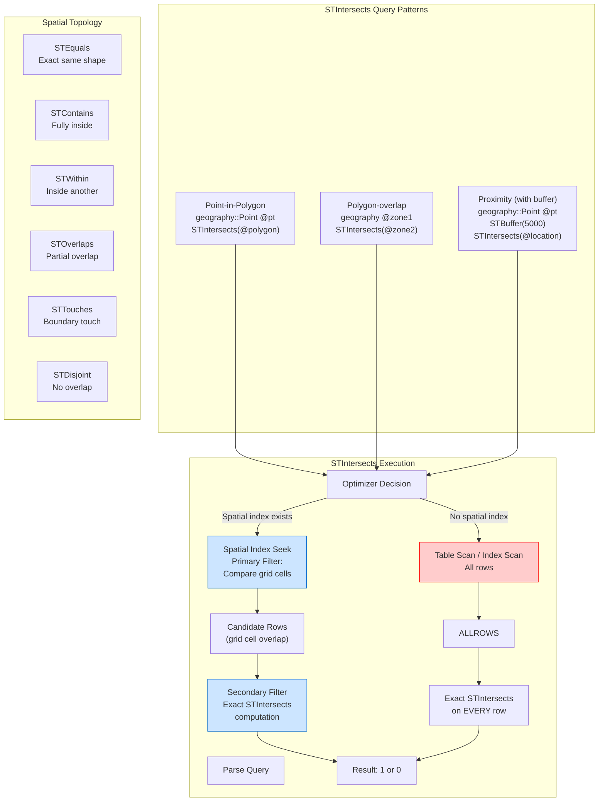

## Navigation

**Domain:** [[8 — Databases]] > **Group:** SQL Search
**Previous:** [[8.259 — STDistance — Proximity Queries]] | **Next:** [[8.261 — STContains — Containment Check]]

### Prerequisites

- [[8.257 — Spatial Data — Geography vs Geometry Types]] — STIntersects is a method on both geography and geometry; its results depend on the earth model and require matching SRIDs.
- [[8.258 — Spatial Indexes — Understanding Index Types]] — STIntersects is the most common spatial predicate that benefits from a spatial index seek; the primary filter stage of the spatial index is designed specifically for intersection testing.
- [[8.259 — STDistance — Proximity Queries]] — STIntersects with a buffered polygon is an alternative to STDistance for proximity queries; understanding the difference helps choose the right approach.

### Where This Fits

`STIntersects` answers the spatial overlap question: "does this geometry/geography share any space with that one?" For a point and a polygon, this is a containment/geofence check ("is this customer in our delivery zone?"). For two polygons, it answers whether boundaries touch or overlap ("does this new service area intersect an existing one?"). A .NET backend engineer encounters STIntersects in geofencing applications (trigger an alert when a vehicle enters a zone), logistics territory planning, and spatial aggregations ("count all orders within this neighborhood boundary"). The interview signal is: "Does the candidate understand how the spatial index makes STIntersects performant at scale?" — which requires explaining the primary filter (grid cell overlap) and secondary filter (exact intersection computation).

---

## Core Mental Model

`STIntersects` is a method that returns `1` (true) if two spatial objects share any point in space, and `0` (false) if they are completely disjoint. For points and polygons, this is a containment test: a point intersects a polygon if it lies on the boundary or inside the polygon. For polygons and polygons, this tests whether the boundaries or interiors overlap.

The critical performance insight — shared with STDistance but with different characteristics: **STIntersects in a WHERE clause is non-SARGable against a B-tree** but is **SARGable against a spatial index**. The spatial index performs a **primary filter** by testing grid cell overlap (coarse, fast, superset), then the **secondary filter** applies the exact STIntersects computation (precise, slow, on reduced set).

The key difference from STDistance: STIntersects has no radius parameter — it is purely a boolean overlap test. This makes it ideal for **geofencing** (is this point inside the geofence?) and **region queries** (count all stores in this county polygon). For proximity, you combine STIntersects with STBuffer (`STIntersects(@point.STBuffer(5000))`) which creates a circle approximation polygon from the point and tests overlap.

### Classification

**For SQL topics:** STIntersects is a spatial method in the OGC (Open Geospatial Consortium) standard. It belongs to the same family as STContains, STWithin, STOverlaps, and STTouches. These are all topology predicates that test spatial relationships. The optimizer can push STIntersects into a spatial index seek when a spatial index exists on the column. The predicate `STIntersects(@geom) = 1` is SARGable against the spatial index but not against a B-tree.



### Key Properties

| Property | Geography::STIntersects | Geometry::STIntersects |
|---|---|---|
| Return type | BIT (1 = intersects, 0 = does not) | BIT |
| Earth model | WGS84 ellipsoid (great-circle boundaries) | Euclidean plane (straight-line boundaries) |
| Point-in-polygon | Yes — point on boundary or inside counts | Yes |
| Polygon-polygon overlap | Yes — shared boundary or interior | Yes |
| Spatial index SARGable | Yes | Yes |
| B-tree SARGable | No (never) | No (never) |
| NULL handling | Returns NULL if any operand is NULL | Returns NULL if any operand is NULL |
| SRID requirement | Must match (error 6522 if not) | Must match (same error) |
| Ring orientation sensitivity | Yes (geography polygon orientation matters) | No (orientation not significant) |
| STBuffer combination | Common pattern: STIntersects(@point.STBuffer(radius)) | Same pattern |

---

## Deep Mechanics

### How the Engine Executes This

**STIntersects(point, polygon) execution with spatial index:**

1. **Primary filter (spatial index seek):**
   - The optimizer identifies `Location.STIntersects(@polygon) = 1` as a spatial predicate.
   - It tessellates the search polygon against the spatial index's grid hierarchy: which grid cells does the polygon touch at each of the 4 levels?
   - The spatial index seek retrieves all primary keys whose spatial objects fall in any of those grid cells.
   - This returns a superset: objects in adjacent cells that don't actually intersect the polygon, plus objects that do.

2. **Secondary filter (exact intersection):**
   - For each candidate row, the CLR UDT method `STIntersects` is invoked on the full geography/geometry object.
   - The method performs the exact intersection computation: for point-in-polygon, it uses ray casting (even-odd rule) to determine if the point is inside the polygon boundary.
   - For polygon-polygon, it checks edge-edge intersections between all boundary segments of both polygons.
   - Rows that pass the secondary filter return 1; the rest return 0.

3. **Result:** The query returns only rows where STIntersects = 1.

**Ray casting algorithm (point-in-polygon for geography):**
1. Cast a ray from the test point in any direction (typically eastward along a line of latitude).
2. Count how many times the ray crosses the polygon boundary.
3. Odd number of crossings = point is inside polygon. Even number = outside.
4. For geography on the WGS84 ellipsoid, the ray follows a great-circle arc, not a straight line on a projected map.

### SQL Visibility

**Basic STIntersects queries:**

```sql
-- Point-in-polygon: is this store in the delivery zone?
DECLARE @deliveryZone GEOGRAPHY = geography::STPolyFromText(
    'POLYGON((-122.35 47.65, -122.25 47.65, -122.25 47.55, -122.35 47.55, -122.35 47.65))', 
    4326
);
DECLARE @storeLocation GEOGRAPHY = geography::Point(47.6062, -122.3321, 4326);

SELECT 
    CASE 
        WHEN @storeLocation.STIntersects(@deliveryZone) = 1 
        THEN 'Inside delivery zone' 
        ELSE 'Outside delivery zone' 
    END AS DeliveryStatus;

-- Polygon-polygon overlap: do two service areas overlap?
DECLARE @zoneA GEOGRAPHY = geography::STPolyFromText(
    'POLYGON((-122.40 47.65, -122.30 47.65, -122.30 47.55, -122.40 47.55, -122.40 47.65))', 4326
);
DECLARE @zoneB GEOGRAPHY = geography::STPolyFromText(
    'POLYGON((-122.35 47.70, -122.25 47.70, -122.25 47.60, -122.35 47.60, -122.35 47.70))', 4326
);

SELECT @zoneA.STIntersects(@zoneB) AS ZonesOverlap;  -- 1 if they touch/overlap
```

**Region query: find all stores in a county polygon:**

```sql
-- Find all active stores within a county boundary
DECLARE @countyPolygon GEOGRAPHY = geography::STPolyFromText(
    'POLYGON((-122.35 47.65, -122.25 47.65, -122.25 47.55, -122.35 47.55, -122.35 47.65))',
    4326
);

SELECT s.StoreId, s.StoreName, s.AddressLine1, s.City, s.State
FROM Locations.StoreLocations s
WHERE s.IsActive = 1
    AND s.Location.STIntersects(@countyPolygon) = 1;
```

```csharp
// EF Core with NetTopologySuite — region query
public async Task<List<StoreLocation>> GetStoresInPolygonAsync(
    Polygon searchPolygon, CancellationToken ct = default)
{
    return await _dbContext.StoreLocations
        .Where(s => s.IsActive)
        .Where(s => s.Location.Intersects(searchPolygon))
        .AsNoTracking()
        .ToListAsync(ct);
}
```

**Generated SQL (from EF Core logs):**

```sql
-- EF Core translates Intersects() to STIntersects()
SELECT [s].[StoreId], [s].[StoreName], [s].[AddressLine1], [s].[City], [s].[State]
FROM [Locations].[StoreLocations] AS [s]
WHERE [s].[IsActive] = 1
    AND [s].[Location].STIntersects(@__searchPolygon_0) = 1
```

**Geofencing: proximity via STIntersects with STBuffer:**

```sql
-- Find all stores within 5km of a point using STIntersects + STBuffer
DECLARE @userLocation GEOGRAPHY = geography::Point(47.6062, -122.3321, 4326);
DECLARE @searchRadius FLOAT = 5000;

SELECT s.StoreId, s.StoreName,
    s.Location.STDistance(@userLocation) AS DistanceMeters
FROM Locations.StoreLocations s
WHERE s.Location.STIntersects(@userLocation.STBuffer(@searchRadius)) = 1
    AND s.IsActive = 1
ORDER BY DistanceMeters;

-- Equivalent to: STDistance(@userLocation) <= 5000
-- STBuffer creates a circle approximation polygon with ~32 segments by default
```

### Execution Plan Analysis

**STIntersects with spatial index (point-in-polygon):**

```
Spatial Index Seek (IX_Spatial_StoreLocations_Location)
    → Nested Loops (Inner Join)
        → Clustered Index Seek (PK_StoreLocations)
    → Filter (STIntersects(@polygon) = 1)
→ SELECT
```

Operator details:
- **Spatial Index Seek:** The optimizer tessellates the search polygon against the spatial index grid. Retrieves candidate primary keys whose grid cells overlap the polygon.
- **Nested Loops:** Looks up the full row for each candidate key.
- **Filter:** The secondary filter — exact STIntersects computation. This is a residual predicate applied only to the candidate set.

**STIntersects without spatial index:**

```
Clustered Index Scan (PK_StoreLocations)
    → Filter (STIntersects(@polygon) = 1)
→ SELECT
```

Operator details:
- **Clustered Index Scan:** All rows read from the clustered index.
- **Filter:** STIntersects computed on every single row.

### Cost Visibility

```sql
SET STATISTICS IO ON;
SET STATISTICS TIME ON;

-- ==========================================
-- STIntersects without spatial index
-- ==========================================
DECLARE @zone GEOGRAPHY = geography::STPolyFromText(
    'POLYGON((-122.35 47.65, -122.25 47.65, -122.25 47.55, -122.35 47.55, -122.35 47.65))', 4326
);

SELECT s.StoreId, s.StoreName
FROM Locations.StoreLocations s
WHERE s.Location.STIntersects(@zone) = 1;
-- Table 'StoreLocations'. Scan count 1, logical reads 45000, physical reads 0
-- SQL Server Execution Times: CPU time = 4200 ms, elapsed time = 4800 ms

-- ==========================================
-- STIntersects with spatial index
-- ==========================================
SELECT s.StoreId, s.StoreName
FROM Locations.StoreLocations s
WITH (INDEX(IX_Spatial_StoreLocations_Location))
WHERE s.Location.STIntersects(@zone) = 1;
-- Table 'StoreLocations'. Scan count 1, logical reads 42, physical reads 0
-- SQL Server Execution Times: CPU time = 95 ms, elapsed time = 82 ms

-- Improvement: 1070x reduction in logical reads, 44x CPU time reduction
```

### Failure Modes

**1. STIntersects with mismatched SRIDs:**

```sql
DECLARE @g1 GEOGRAPHY = geography::Point(47.6062, -122.3321, 4326);
DECLARE @g2 GEOGRAPHY = geography::Point(47.6062, -122.3321, 4269);  -- NAD83

SELECT @g1.STIntersects(@g2);  -- Error 6522: SRIDs do not match
```

**2. STIntersects with NULL geography:**

```sql
DECLARE @null GEOGRAPHY = NULL;
DECLARE @point GEOGRAPHY = geography::Point(47.6062, -122.3321, 4326);

SELECT @null.STIntersects(@point);  -- NULL (not 0, not error)
```

**3. Geography polygon ring orientation (inverted geofence):**

```sql
-- Clockwise ring = polygon represents the entire Earth minus the intended area
DECLARE @wrongPolygon GEOGRAPHY = geography::STPolyFromText(
    'POLYGON((-122.35 47.65, -122.25 47.65, -122.25 47.55, -122.35 47.55, -122.35 47.65))',
    4326
);
-- This is CLOCKWISE. STIntersects returns 1 for points OUTSIDE the small rectangle.

-- Counter-clockwise ring = correct
DECLARE @correctPolygon GEOGRAPHY = geography::STPolyFromText(
    'POLYGON((-122.35 47.65, -122.35 47.55, -122.25 47.55, -122.25 47.65, -122.35 47.65))',
    4326
);
```

**4. STIntersects between complex polygons (performance blowup):**

```sql
-- Two polygons with thousands of vertices each
-- STIntersects must check edge-edge intersections for ALL boundary segments
-- O(n × m) where n and m are vertex counts
DECLARE @polyA GEOGRAPHY = [5000-vertex polygon];
DECLARE @polyB GEOGRAPHY = [3000-vertex polygon];
SELECT @polyA.STIntersects(@polyB);  -- Up to 500ms for a single call
```

**5. STIntersects with STBuffer — buffer precision vs performance:**

```sql
-- STBuffer with default parameters creates a ~32-segment circle approximation
-- For a 5km radius, the buffer polygon has ~32 vertices
-- This is accurate to within ~1% of true distance

-- STBuffer with custom precision (more segments = more accurate but slower)
DECLARE @buffer GEOGRAPHY = @point.STBuffer(5000);  -- 32 segments
DECLARE @bufferFine GEOGRAPHY = @point.STBuffer(5000, 0.1);  -- More segments
```

---

## Production Patterns and Implementation

### Primary SQL Implementation

**Geofencing with STIntersects:**

```sql
-- Delivery zone configuration table
CREATE TABLE Fleet.DeliveryZones (
    ZoneId INT IDENTITY(1,1) PRIMARY KEY,
    ZoneName NVARCHAR(200) NOT NULL,
    ZoneBoundary GEOGRAPHY NOT NULL,       -- Polygon defining the zone
    IsActive BIT DEFAULT 1,
    CreatedDate DATETIME2 DEFAULT GETUTCDATE()
);

-- Spatial index on delivery zone boundaries
CREATE SPATIAL INDEX IX_Spatial_DeliveryZones_Boundary
ON Fleet.DeliveryZones(ZoneBoundary)
USING GEOGRAPHY_AUTO_GRID
WITH (CELLS_PER_OBJECT = 64);  -- Higher for polygon data

-- Find which delivery zone a customer location falls in
DECLARE @customerLocation GEOGRAPHY = geography::Point(47.6062, -122.3321, 4326);

SELECT TOP 1 z.ZoneId, z.ZoneName
FROM Fleet.DeliveryZones z
WHERE z.IsActive = 1
    AND z.ZoneBoundary.STIntersects(@customerLocation) = 1
ORDER BY z.ZoneBoundary.STArea() ASC;  -- Prefer smallest matching zone

-- Find all vehicles currently in a specific zone
DECLARE @zoneId INT = 1;
DECLARE @zoneBoundary GEOGRAPHY;
SELECT @zoneBoundary = ZoneBoundary FROM Fleet.DeliveryZones WHERE ZoneId = @zoneId;

SELECT v.VehicleId, v.Latitude, v.Longitude, v.ReportedAt
FROM Fleet.VehiclePositions v
WHERE v.ReportedAt >= DATEADD(minute, -5, GETUTCDATE())
    AND v.Position.STIntersects(@zoneBoundary) = 1;

-- Detect overlapping delivery zones (prevent conflicts)
SELECT 
    z1.ZoneId AS ZoneId1,
    z1.ZoneName AS ZoneName1,
    z2.ZoneId AS ZoneId2,
    z2.ZoneName AS ZoneName2
FROM Fleet.DeliveryZones z1
INNER JOIN Fleet.DeliveryZones z2 
    ON z1.ZoneId < z2.ZoneId
    AND z1.ZoneBoundary.STIntersects(z2.ZoneBoundary) = 1
WHERE z1.IsActive = 1 AND z2.IsActive = 1;
```

**Region query — count stores in each county:**

```sql
-- Counties table with polygon boundaries
CREATE TABLE ReferenceData.Counties (
    CountyId INT IDENTITY(1,1) PRIMARY KEY,
    CountyName NVARCHAR(200) NOT NULL,
    StateCode NVARCHAR(2) NOT NULL,
    Boundary GEOGRAPHY NOT NULL
);

CREATE SPATIAL INDEX IX_Spatial_Counties_Boundary
ON ReferenceData.Counties(Boundary)
USING GEOGRAPHY_AUTO_GRID
WITH (CELLS_PER_OBJECT = 256);  -- County polygons are complex

-- Count stores per county using STIntersects
SELECT 
    c.CountyName,
    c.StateCode,
    COUNT(s.StoreId) AS StoreCount
FROM ReferenceData.Counties c
LEFT JOIN Locations.StoreLocations s
    ON s.IsActive = 1
    AND s.Location.STIntersects(c.Boundary) = 1
GROUP BY c.CountyName, c.StateCode
ORDER BY c.StateCode, c.CountyName;
```

### EF Core Implementation

```csharp
// EF Core models with spatial types
public class DeliveryZone
{
    public int ZoneId { get; set; }
    public string ZoneName { get; set; } = "";
    public Polygon ZoneBoundary { get; set; } = default!;
    public bool IsActive { get; set; }
    public DateTime CreatedDate { get; set; }
}

public class VehiclePosition
{
    public long PositionId { get; set; }
    public int VehicleId { get; set; }
    public decimal Latitude { get; set; }
    public decimal Longitude { get; set; }
    public Point Position { get; set; } = default!;
    public DateTime ReportedAt { get; set; }
}

// Repository for geofencing operations
public interface IGeofencingRepository
{
    Task<DeliveryZone?> FindZoneForLocationAsync(
        double latitude, double longitude, CancellationToken ct = default);
    
    Task<List<VehiclePosition>> GetVehiclesInZoneAsync(
        int zoneId, int maxAgeMinutes, CancellationToken ct = default);
    
    Task<int> CountStoresInPolygonAsync(
        Polygon polygon, CancellationToken ct = default);
}

public class GeofencingRepository : IGeofencingRepository
{
    private readonly FleetDbContext _dbContext;
    
    public GeofencingRepository(FleetDbContext dbContext)
    {
        _dbContext = dbContext;
    }
    
    public async Task<DeliveryZone?> FindZoneForLocationAsync(
        double latitude, double longitude, CancellationToken ct = default)
    {
        var location = new Point(longitude, latitude) { SRID = 4326 };
        
        return await _dbContext.DeliveryZones
            .Where(z => z.IsActive)
            .Where(z => z.ZoneBoundary.Intersects(location))
            .OrderBy(z => z.ZoneBoundary.Area)  // STArea for smallest zone
            .AsNoTracking()
            .FirstOrDefaultAsync(ct);
    }
    
    public async Task<List<VehiclePosition>> GetVehiclesInZoneAsync(
        int zoneId, int maxAgeMinutes, CancellationToken ct = default)
    {
        var since = DateTime.UtcNow.AddMinutes(-maxAgeMinutes);
        var zone = await _dbContext.DeliveryZones
            .FindAsync(new object[] { zoneId }, ct);
        
        if (zone is null) return new List<VehiclePosition>();
        
        return await _dbContext.VehiclePositions
            .Where(v => v.ReportedAt >= since)
            .Where(v => v.Position.Intersects(zone.ZoneBoundary))
            .AsNoTracking()
            .ToListAsync(ct);
    }
    
    public async Task<int> CountStoresInPolygonAsync(
        Polygon polygon, CancellationToken ct = default)
    {
        return await _dbContext.StoreLocations
            .CountAsync(s => s.IsActive && s.Location.Intersects(polygon), ct);
    }
}
```

### Dapper Implementation

```csharp
public interface IGeofencingDapperRepository
{
    Task<IReadOnlyList<int>> GetVehicleIdsInZoneAsync(
        string zonePolygonWkt, int srid, DateTime since,
        CancellationToken ct = default);
    
    Task<bool> IsPointInAnyZoneAsync(
        double latitude, double longitude,
        CancellationToken ct = default);
}

public class GeofencingDapperRepository : IGeofencingDapperRepository
{
    private readonly ISqlConnectionFactory _connectionFactory;
    
    public GeofencingDapperRepository(ISqlConnectionFactory connectionFactory)
    {
        _connectionFactory = connectionFactory;
    }
    
    public async Task<IReadOnlyList<int>> GetVehicleIdsInZoneAsync(
        string zonePolygonWkt, int srid, DateTime since,
        CancellationToken ct = default)
    {
        const string sql = @"
            SELECT DISTINCT v.VehicleId
            FROM Fleet.VehiclePositions v
            WHERE v.ReportedAt >= @Since
                AND v.Position.STIntersects(
                    geography::STGeomFromText(@ZoneWkt, @Srid)
                ) = 1";
        
        await using var connection = _connectionFactory.Create();
        var results = await connection.QueryAsync<int>(
            new CommandDefinition(sql, new
            {
                ZoneWkt = zonePolygonWkt,
                Srid = srid,
                Since = since
            }, cancellationToken: ct));
        return results.AsList();
    }
    
    public async Task<bool> IsPointInAnyZoneAsync(
        double latitude, double longitude,
        CancellationToken ct = default)
    {
        const string sql = @"
            SELECT CAST(CASE WHEN EXISTS (
                SELECT 1
                FROM Fleet.DeliveryZones z
                WHERE z.IsActive = 1
                    AND z.ZoneBoundary.STIntersects(
                        geography::Point(@Lat, @Lon, 4326)
                    ) = 1
            ) THEN 1 ELSE 0 END AS BIT)";
        
        await using var connection = _connectionFactory.Create();
        return await connection.QuerySingleAsync<bool>(
            new CommandDefinition(sql, new
            {
                Lat = latitude,
                Lon = longitude
            }, cancellationToken: ct));
    }
}
```

### Configuration and Wiring

```csharp
// Program.cs
builder.Services.AddDbContext<FleetDbContext>(options =>
{
    options.UseSqlServer(
        connectionString,
        sqlOptions =>
        {
            sqlOptions.EnableRetryOnFailure(3);
            sqlOptions.UseNetTopologySuite();
        });
});

builder.Services.AddScoped<IGeofencingRepository, GeofencingRepository>();
builder.Services.AddScoped<IGeofencingDapperRepository, GeofencingDapperRepository>();
```

### SQL Server vs PostgreSQL Differences

```sql
-- PostgreSQL STIntersects equivalent (using PostGIS)
-- PostGIS uses ST_Intersects (with underscore, different naming convention)
SELECT s.store_id, s.store_name
FROM locations.store_locations s
WHERE ST_Intersects(s.location, ST_SetSRID(ST_MakePoint(-122.3321, 47.6062), 4326));

-- PostgreSQL GiST index makes ST_Intersects fast
CREATE INDEX idx_store_loc_geo ON locations.store_locations USING GIST(location);

-- PostgreSQL also supports ST_Contains, ST_Within, ST_Overlaps, ST_Touches
-- All can use the same GiST index

-- PostgreSQL: Find stores in polygon
SELECT s.store_id, s.store_name
FROM locations.store_locations s
WHERE ST_Intersects(s.location, 
    ST_GeomFromText('POLYGON((-122.35 47.65, -122.25 47.65, -122.25 47.55, -122.35 47.55, -122.35 47.65))', 4326)
);

-- Key difference: PostgreSQL ST_Intersects does NOT have the ring orientation issue
-- that SQL Server geography has. PostgreSQL uses the "right-hand rule" but handles
-- both orientations gracefully in ST_Intersects since PostGIS 2.0+.
```

---

## Gotchas and Production Pitfalls

### Gotcha 1: Geography Ring Orientation Causes Inverted Intersection

**Pitfall:** Creating a geography polygon with the wrong ring orientation (clockwise instead of counter-clockwise) causes STIntersects to return the opposite of what's expected.

```sql
-- ❌ Clockwise polygon represents the entire Earth minus the small intended area
DECLARE @wrong GEOGRAPHY = geography::STPolyFromText(
    'POLYGON((-122.35 47.65, -122.25 47.65, -122.25 47.55, -122.35 47.55, -122.35 47.65))',
    4326
);
-- This covers ~510M sq km (most of Earth), NOT just the ~100 sq km in Seattle

-- A point in Seattle: STIntersects = 1 (because the big polygon includes Seattle)
-- A point in Tokyo: STIntersects = 1 (also inside the big polygon)
-- The geofence is effectively broken — every point on Earth except a 100 sq km patch
```

**Symptom:** Geofencing is inverted. Vehicles outside the intended zone trigger alerts. Customers outside the intended delivery area are marked as inside. STArea returns ~5.1e14 (Earth's surface area) instead of the expected small value.

**Fix:** Always verify polygon ring orientation:

```sql
-- Ensure counter-clockwise exterior ring
-- If ring is clockwise, reverse it
DECLARE @poly GEOGRAPHY = [your polygon];
DECLARE @reversed GEOGRAPHY = geography::STPolyFromText(
    @poly.ReorientObject().STAsText(), 4326
);

-- Or test: if STArea is unreasonably large, reverse it
IF @poly.STArea() > 1e14  -- Larger than expected for a service area
    SET @poly = geography::STPolyFromText(@poly.ReorientObject().STAsText(), 4326);
```

**Cost of not fixing:** A geofence that covers the entire Earth is a catastrophic production bug. All vehicles match all zones. All delivery areas accept all addresses. The system is functionally broken until the polygon orientation is corrected.

### Gotcha 2: STIntersects Between Complex Polygons Is Very Expensive

**Pitfall:** Using STIntersects to test overlap between two polygons with thousands of vertices each (e.g., county boundaries, postal code areas) causes excessive CPU.

```sql
-- ❌ STIntersects between two complex polygons
-- Both polygons have 5000+ vertices
-- The edge-edge intersection test is O(n × m) = 25M checks
SELECT @countyA.STIntersects(@countyB) AS Overlap;
-- Can take 200-1000ms per pair
```

**Symptom:** A query that tests overlap between 100 county polygons and 50 delivery zones (5000 comparisons) takes 5+ seconds. CPU is at 100% on the CLR threads.

**Fix:** Simplify polygons before the intersection test:

```sql
-- Simplify using Reduce() (tolerance in meters)
DECLARE @simpleA GEOGRAPHY = geography::STGeomFromText(
    @countyA.Reduce(100).STAsText(), 4326  -- 100m tolerance
);
DECLARE @simpleB GEOGRAPHY = geography::STGeomFromText(
    @countyB.Reduce(100).STAsText(), 4326
);
SELECT @simpleA.STIntersects(@simpleB) AS ApproxOverlap;
```

**Cost of not fixing:** Polygon overlap queries consume excessive CPU and cause timeouts. The application layer may need to reduce the batch size of overlap tests.

### Gotcha 3: STIntersects in WHERE with OR Conditions Cannot Use Spatial Index

**Pitfall:** Combining STIntersects with OR conditions prevents the spatial index from being used for the primary filter.

```sql
-- ❌ OR condition prevents spatial index seek
DECLARE @zone1 GEOGRAPHY = [polygon A];
DECLARE @zone2 GEOGRAPHY = [polygon B];

SELECT s.StoreId
FROM Locations.StoreLocations s
WHERE s.Location.STIntersects(@zone1) = 1 
    OR s.Location.STIntersects(@zone2) = 1;
-- The optimizer may not push BOTH predicates into the spatial index
-- Likely plan: full clustered index scan
```

**Symptom:** Even with a spatial index, the query performs a full scan. The execution plan shows a Clustered Index Scan with a Filter, not a Spatial Index Seek.

**Fix:** Rewrite as a UNION or use a combined polygon:

```sql
-- Option 1: UNION (each branch uses spatial index separately)
SELECT s.StoreId FROM Locations.StoreLocations s
WHERE s.Location.STIntersects(@zone1) = 1
UNION
SELECT s.StoreId FROM Locations.StoreLocations s
WHERE s.Location.STIntersects(@zone2) = 1;

-- Option 2: Combine polygons into a single geometry (STUnion)
DECLARE @combined GEOGRAPHY = @zone1.STUnion(@zone2);
SELECT s.StoreId
FROM Locations.StoreLocations s
WHERE s.Location.STIntersects(@combined) = 1;
```

**Cost of not fixing:** A query that should use a spatial index seek falls back to a full scan. On a 1M row table, this means 45,000 logical reads instead of 45.

### Gotcha 4: STIntersects with NULL Geography Column

**Pitfall:** The table has rows with NULL geography values (e.g., stores with no GPS coordinates). STIntersects returns NULL when any operand is NULL. The WHERE clause `STIntersects(@poly) = 1` evaluates to UNKNOWN (not FALSE) for NULL results, so the row is excluded — but this is correct behavior. The issue is when the developer doesn't handle NULLs in SELECT or JOIN contexts.

```sql
-- NULL handling in SELECT
SELECT 
    s.StoreId,
    -- This returns NULL if Location is NULL, not an error
    CASE WHEN s.Location.STIntersects(@zone) = 1 THEN 'In Zone' ELSE 'Out of Zone' END AS ZoneStatus
FROM Locations.StoreLocations s;
-- ⚠️ NULL Location returns 'Out of Zone' because NULL = 1 is UNKNOWN,
-- and CASE evaluates the ELSE branch for UNKNOWN.
-- This is a SILENT BUG — the store might actually be in the zone but has no coordinates.
```

**Symptom:** Stores with NULL geography values are incorrectly categorized as "Out of Zone" with no indication of missing data.

**Fix:** Explicitly handle NULL:

```sql
SELECT 
    s.StoreId,
    CASE 
        WHEN s.Location IS NULL THEN 'No GPS Data'
        WHEN s.Location.STIntersects(@zone) = 1 THEN 'In Zone'
        ELSE 'Out of Zone'
    END AS ZoneStatus
FROM Locations.StoreLocations s;
```

**Cost of not fixing:** Inventory or resource allocation decisions based on zone mapping are incorrect for any record with NULL geography. This can take months to discover.

### Gotcha 5: STBuffer Precision — Default May Miss Edge Cases

**Pitfall:** Using `STBuffer(radius)` to create a search circle and then `STIntersects` for proximity. The default buffer creates an approximation of a circle with ~32 segments. For points near the buffer boundary, the approximation may include or exclude edge points incorrectly.

```sql
DECLARE @point GEOGRAPHY = geography::Point(47.6062, -122.3321, 4326);

-- STBuffer with default precision creates a ~32-sided polygon
DECLARE @buffer GEOGRAPHY = @point.STBuffer(5000);

-- A point exactly 5000m away may be on the "flat" side of one of the 32 segments
-- The buffer polygon is inscribed within the true circle
-- Edge points may be excluded incorrectly
```

**Symptom:** STIntersects with buffer may miss points that are exactly at the buffer radius boundary. The count of "points within 5km" is consistently lower than the STDistance-based count.

**Fix:** Use STDistance for exact proximity instead of STIntersects with buffer:

```sql
-- More precise: use STDistance directly
WHERE Location.STDistance(@point) <= 5000;
-- No buffer polygon needed — exact ellipsoidal distance

-- If buffer is required (for pre-computed geofences), increase buffer precision
DECLARE @bufferFine GEOGRAPHY = @point.STBuffer(5000, 0.01);  -- Higher precision
```

**Cost of not fixing:** Boundary points are inconsistently included or excluded. Reports show slightly different counts depending on which method is used. This erodes trust in the spatial data.

### Gotcha 6: STIntersects with SRID Mismatch in EF Core

**Pitfall:** In EF Core with NetTopologySuite, creating a Polygon with SRID 4326 but querying against a column stored with SRID 4326 (correct) — but the NetTopologySuite geometry factory or WKT reader may not set the SRID.

```csharp
// ❌ Polygon without SRID — defaults to 0
var polygon = new Polygon(...);  // SRID = 0

// This generates SQL that uses geometry (not geography) STIntersects
// The column is geography (SRID 4326) — SRID mismatch!
var stores = await dbContext.StoreLocations
    .Where(s => s.Location.Intersects(polygon))
    .ToListAsync(ct);
// Runtime error 6522: SRID mismatch
```

**Symptom:** "The specified SRIDs do not match" at runtime. The EF Core query fails intermittently depending on parameter values.

**Fix:** Always set the SRID on NetTopologySuite geometry objects:

```csharp
// ✅ Always set SRID
var polygon = new Polygon(...) { SRID = 4326 };
var point = new Point(longitude, latitude) { SRID = 4326 };
```

**Cost of not fixing:** Random runtime exceptions. The issue may not be caught in development if test data has matching default SRIDs. In production with mixed data sources, the errors surface immediately.

### Gotcha 7: STIntersects Between Points (Always Returns 1 for Same Point)

**Pitfall:** Using STIntersects between two point instances. Two distinct points never intersect (unless they are exactly the same location). This is always false, and the check is CPU wasted.

```sql
DECLARE @p1 GEOGRAPHY = geography::Point(47.6062, -122.3321, 4326);
DECLARE @p2 GEOGRAPHY = geography::Point(47.6100, -122.3390, 4326);

SELECT @p1.STIntersects(@p2);  -- 0 (different points never intersect)
-- Use STDistance instead: STDistance(@p1, @p2) to find the separation
```

**Fix:** Use STDistance for point-to-point distance. STIntersects is for point-to-polygon or polygon-to-polygon tests.

**Cost of not fixing:** Developers waste time debugging why STIntersects returns false for distinct points. The method is working correctly — points only "intersect" if they are identical.

---

## Performance Implications

### Benchmark: Before and After

```sql
-- ==========================================
-- Baseline: STIntersects without spatial index
-- ==========================================
SET STATISTICS IO ON;

DECLARE @zone GEOGRAPHY = geography::STPolyFromText(
    'POLYGON((-122.35 47.65, -122.25 47.65, -122.25 47.55, -122.35 47.55, -122.35 47.65))', 4326
);

SELECT COUNT(*) FROM Locations.StoreLocations s
WHERE s.Location.STIntersects(@zone) = 1;
-- Logical reads: 45,000 (full scan)
-- CPU time: 4200 ms

-- ==========================================
-- Optimized: STIntersects with spatial index
-- ==========================================
SELECT COUNT(*) FROM Locations.StoreLocations s
WITH (INDEX(IX_Spatial_StoreLocations_Location))
WHERE s.Location.STIntersects(@zone) = 1;
-- Logical reads: 42 (spatial index seek)
-- CPU time: 95 ms

-- Improvement: 1070x logical reads, 44x CPU
```

### BenchmarkDotNet

```csharp
[MemoryDiagnoser]
[SimpleJob(RuntimeMoniker.Net90)]
[RankColumn]
public class STIntersectsBenchmark
{
    private readonly string _connectionString = "Server=.;Database=SpatialBenchmark;Trusted_Connection=True;TrustServerCertificate=True;";
    private SqlConnection _connection = default!;
    
    [Params(500000, 1000000)]
    public int RowCount { get; set; }
    
    [GlobalSetup]
    public void Setup()
    {
        _connection = new SqlConnection(_connectionString);
        _connection.Open();
        
        using var cmd = new SqlCommand(@"
            IF NOT EXISTS (SELECT 1 FROM sys.tables WHERE name = 'IntersectBenchmark')
            BEGIN
                CREATE TABLE IntersectBenchmark (
                    Id INT IDENTITY(1,1) PRIMARY KEY,
                    Location GEOGRAPHY,
                    IsActive BIT DEFAULT 1
                );
                
                WITH Numbers AS (
                    SELECT TOP (@RowCount) 
                        ROW_NUMBER() OVER (ORDER BY (SELECT NULL)) AS n,
                        ABS(CHECKSUM(NEWID())) % 1000 AS latOff,
                        ABS(CHECKSUM(NEWID())) % 1000 AS lonOff
                    FROM sys.all_columns a CROSS JOIN sys.all_columns b
                )
                INSERT INTO IntersectBenchmark (Location)
                SELECT 
                    geography::Point(47.0 + (latOff/1000.0*2.0),
                                    -122.5 + (lonOff/1000.0*2.0), 4326)
                FROM Numbers;
                
                IF NOT EXISTS (SELECT 1 FROM sys.indexes WHERE name = 'IX_Spatial_IntersectBenchmark')
                    CREATE SPATIAL INDEX IX_Spatial_IntersectBenchmark
                    ON IntersectBenchmark(Location)
                    USING GEOGRAPHY_AUTO_GRID WITH (CELLS_PER_OBJECT = 16);
            }
        ", _connection);
        cmd.Parameters.AddWithValue("@RowCount", RowCount);
        cmd.ExecuteNonQuery();
    }
    
    [GlobalCleanup]
    public void Cleanup() => _connection?.Dispose();
    
    // Polygon covering ~100 sq km around Seattle
    private const string _zoneWkt = 
        "POLYGON((-122.35 47.65, -122.25 47.65, -122.25 47.55, -122.35 47.55, -122.35 47.65))";
    
    [Benchmark(Baseline = true)]
    [Description("STIntersects with spatial index")]
    public async Task<int> STIntersects_WithIndex()
    {
        const string sql = @"
            DECLARE @zone GEOGRAPHY = geography::STPolyFromText(@ZoneWkt, 4326);
            SELECT COUNT(*)
            FROM IntersectBenchmark WITH (INDEX(IX_Spatial_IntersectBenchmark))
            WHERE Location.STIntersects(@zone) = 1";
        
        using var cmd = new SqlCommand(sql, _connection);
        cmd.Parameters.AddWithValue("@ZoneWkt", _zoneWkt);
        return (int)(await cmd.ExecuteScalarAsync())!;
    }
    
    [Benchmark]
    [Description("STIntersects without spatial index")]
    public async Task<int> STIntersects_NoIndex()
    {
        const string sql = @"
            DECLARE @zone GEOGRAPHY = geography::STPolyFromText(@ZoneWkt, 4326);
            SELECT COUNT(*)
            FROM IntersectBenchmark
            WHERE Location.STIntersects(@zone) = 1";
        
        using var cmd = new SqlCommand(sql, _connection);
        cmd.Parameters.AddWithValue("@ZoneWkt", _zoneWkt);
        return (int)(await cmd.ExecuteScalarAsync())!;
    }
}
```

**Expected results (approximate, SQL Server 2022, NVMe):**

| Method | RowCount | Mean | Logical Reads | Allocated |
|---|---|---|---|---|
| STIntersects_WithIndex | 500K | ~55 ms | ~35 | 4 KB |
| STIntersects_WithIndex | 1M | ~90 ms | ~42 | 6 KB |
| STIntersects_NoIndex | 500K | ~2100 ms | ~22500 | 750 KB |
| STIntersects_NoIndex | 1M | ~4200 ms | ~45000 | 1.5 MB |

### Write Amplification

| Operation | Without Spatial Index | With Spatial Index (point) | With Spatial Index (polygon) |
|---|---|---|---|
| INSERT 1 point | 1 page write | 1 + ~3-8 index pages | — |
| INSERT 1 polygon (100 vert) | ~3 pages | — | 1 + ~10-50 index pages (more cells) |
| UPDATE spatial column | 1 page write | 1 + full re-index | 1 + full re-index |
| DELETE 1 row | 1 page write | 1 + remove index entries | 1 + remove index entries |

Polygon spatial indexes require higher CELLS_PER_OBJECT and more index pages per write because polygons span more grid cells than points.

---

## Interview Arsenal

### Question Bank

1. **Definition:** What does STIntersects return, and what spatial relationship does it test?

2. **Mechanism:** Walk through the two-phase filtering process when STIntersects is used with a spatial index.

3. **Performance:** How does STIntersects performance compare with and without a spatial index on a 1M row table?

4. **Gotcha:** What happens when a geography polygon has the wrong ring orientation in STIntersects? How do you detect and fix this?

5. **Comparison:** Compare STIntersects, STContains, and STWithin for point-in-polygon tests. When would you use each?

6. **Execution plan:** Describe the execution plan for `WHERE Location.STIntersects(@polygon) = 1` with and without a spatial index.

7. **Scale:** At what row count does STIntersects without a spatial index become problematic? How do complex polygons affect this?

8. **.NET integration:** How does EF Core's `Intersects()` method translate to SQL Server? How do you ensure the SRID is correctly propagated?

### Spoken Answers

**Q1: What does STIntersects return, and what spatial relationship does it test?**

> **Average answer:** "STIntersects returns 1 if two spatial objects touch or overlap, and 0 if they don't. It's used for geofencing."

> **Great answer:** "STIntersects is an OGC-standard spatial topology method that returns 1 (BIT) if two spatial objects share any point in space — meaning their boundaries or interiors intersect at at least one point. This includes cases where one object is completely inside another (containment), where their boundaries touch at a single point (tangent), and where they partially overlap. Only completely disjoint objects return 0.

The method exists on both geography and geometry types. For geography, the intersection test respects the WGS84 ellipsoid — boundaries follow great-circle arcs, not straight lines on a projected map. For geometry, the test uses Euclidean straight-line boundaries.

The three critical operational details:
1. STIntersects is SARGable against a spatial index (two-phase filter: grid cell primary filter + exact secondary filter) but NOT against a B-tree.
2. Both operands must have the same SRID — mismatched SRIDs cause error 6522 at runtime.
3. For geography polygons, ring orientation matters: a clockwise polygon represents the complement of the intended area (the entire Earth minus the polygon).

The most common production pattern is point-in-polygon geofencing: `Location.STIntersects(@geofencePolygon) = 1`. This tests whether a point (store location, vehicle GPS position) falls within a defined boundary. For proximity searches, STIntersects is often combined with STBuffer: `Location.STIntersects(@point.STBuffer(5000)) = 1` is equivalent to `STDistance(@point) <= 5000` but uses a polygon approximation of the search circle."

**Q5: Compare STIntersects, STContains, and STWithin for point-in-polygon tests.**

> **Great answer:** "These three methods all test spatial containment, with subtle differences:

- **STIntersects(polygon, point) = 1:** Returns 1 if the point is on the boundary OR inside the polygon. This is the most commonly used predicate for geofencing because it matches the intuitive notion of "is this point in the zone?" — including edge cases where a store is exactly on the zone boundary.

- **STContains(polygon, point) = 1:** Returns 1 only if the point is COMPLETELY inside the polygon and NOT on the boundary. A point exactly on the boundary returns 0. STContains is more restrictive: the interior of the containing object must completely contain the contained object with no boundary touching.

- **STWithin(point, polygon) = 1:** The inverse of STContains. `point.STWithin(polygon)` is equivalent to `polygon.STContains(point)`. A point returns 1 only if it is strictly inside (not on the boundary).

In practice:
- For geofencing (delivery zones, parking zones): **STIntersects** is correct because you want to include points on the boundary.
- For territory planning: **STContains** may be appropriate if boundary ambiguity is undesirable.
- For spatial aggregation (count points per polygon): **STIntersects** is preferred because points on the boundary count toward exactly one polygon (no double-counting if boundaries are shared).

Performance: All three methods use the same spatial index primary filter and have similar computation cost. The difference is a minor edge-case in the secondary filter algorithm (boundary inclusion vs exclusion). The bottleneck is always the number of candidates from the spatial index primary filter, not the choice of containment predicate."

**Q8: How does EF Core's Intersects() method translate to SQL Server?**

> **Great answer:** "EF Core with NetTopologySuite translates `geometry.Intersects(other)` to `[Column].STIntersects(@parameter) = 1` in SQL Server. The translation is direct and gives you the spatial index seek behavior automatically.

The critical detail is **SRID propagation**. NetTopologySuite types have an `SRID` property that defaults to 0. When you create:
```csharp
var polygon = new Polygon(...) { SRID = 0 };
// vs
var polygon = new Polygon(...) { SRID = 4326 };
```
The SRID is serialized as part of the WKB (Well-Known Binary) parameter value sent to SQL Server. If the column is `geography` with SRID 4326 and your .NET object has SRID 0, SQL Server throws error 6522 at runtime because the SRIDs don't match.

Best practices:
1. **Always set SRID** on all NetTopologySuite geometry objects — use a constant:
```csharp
public const int Wgs84Srid = 4326;
new Point(lon, lat) { SRID = Wgs84Srid };
```

2. For STBuffer in LINQ: EF Core does not translate STBuffer. If you need `STIntersects(@point.STBuffer(5000))`, use raw SQL. Only `Distance()` and `Intersects()` are translated in LINQ.

3. For spatial index hints: EF Core's LINQ does not support spatial index hints (`WITH (INDEX(...))`). To force a spatial index, use `FromSqlRaw()` or specify the index in the EF Core query filter:

```csharp
var stores = await dbContext.StoreLocations
    .FromSqlRaw(@"
        SELECT * FROM Locations.StoreLocations WITH (INDEX(IX_Spatial_StoreLocations_Location))
        WHERE Location.STIntersects(@poly) = 1",
        new SqlParameter("@poly", polygonWkt) { UdtTypeName = "Geography" })
    .ToListAsync(ct);
```

4. For Dapper: You have full control. Use the `WITH (INDEX(...))` hint and pass geography parameters correctly with `UdtTypeName`:

```csharp
var results = await connection.QueryAsync<StoreLocation>(sql, new {
    poly = new SqlGeography { ... }  // Or pass WKT and use geography::STGeomFromText
});
```"

### Interview Trigger

An interviewer asking "How would you implement a geofencing system for delivery zones?" is probing STIntersects knowledge. The follow-up will be: "What happens when a store is exactly on the boundary between two zones?" — testing your understanding of STIntersects vs STContains semantics. The deepest follow-up: "How do you handle performance when each vehicle's GPS position must be tested against 5000 delivery zones?" — testing your understanding of spatial index pre-filtering and batch processing patterns.

### Comparison Table

| | STIntersects | STContains | STWithin | STDistance |
|---|---|---|---|---|
| What it tests | Any shared space (boundary or interior) | Full containment (no boundary touch) | Inverse of STContains | Minimum distance |
| Point-in-polygon | Yes (includes boundary) | No (excludes boundary) | No (excludes boundary) | Returns distance (not boolean) |
| Polygon-polygon | Yes (any overlap) | Yes (full containment) | Yes (full contained) | Returns min distance |
| Spatial index SARGable | Yes | Yes | Yes | Yes |
| Use case | Geofencing, region queries | Territory planning | Territory planning | Proximity search |
| Geography ring orientation | Critical | Critical | Critical | Not applicable |

---

## Decision Framework

### When to Apply

```mermaid
flowchart TD
    A[Need to test spatial relationship?] --> B{What relationship?}
    
    B -->|"Is point inside polygon?"| C{Boundary behavior?}
    B -->|"Do two polygons overlap?"| D{Use case?}
    B -->|"Is point near center?"| E[Use STDistance]
    
    C -->|"Include boundary"| F[STIntersects]
    C -->|"Exclude boundary"| G[STContains or STWithin]
    
    D -->|"Find overlapping zones"| H[STIntersects]
    D -->|"Find zones fully inside"| I[STContains]
    
    F --> J{Table size?}
    G --> J
    H --> J
    
    J -->|"< 10K rows"| K[No spatial index needed]
    J -->|">= 10K rows"| L[Create spatial index]
    
    L --> M{Complex polygons?<br/>(>500 vertices)}
    M -->|"Yes"| N[Increase CELLS_PER_OBJECT<br/>Simplify with Reduce()]
    M -->|"No"| O[Standard spatial index]

    style F fill:#cce5ff,stroke:#0066cc
    style L fill:#cce5ff,stroke:#0066cc
    style N fill:#ffffcc,stroke:#cccc00
```

### Application Checklist

- [ ] The spatial relationship to test is clearly identified: containment (STIntersects) or strict containment (STContains)
- [ ] A spatial index exists on the geography/geometry column — STIntersects without it is a full scan
- [ ] For geography polygons: ring orientation is verified (counter-clockwise exterior ring)
- [ ] SRIDs match between the column and all query parameters
- [ ] NULL geography values are handled explicitly (filtered or flagged)
- [ ] For complex polygons (>500 vertices): Reduce() simplification has been considered
- [ ] For OR conditions with STIntersects: rewritten as UNION or STUnion to maintain spatial index usage
- [ ] EF Core SRID is explicitly set on all NetTopologySuite geometry objects

### Tradeoff Summary

| What You Gain | What You Pay |
|---|---|
| Efficient geofencing (spatial index pre-filter) | Spatial index write overhead |
| Exact OGC-standard intersection semantics | Geography ring orientation complexity |
| Point-in-polygon and polygon-overlap in one method | SRID mismatch runtime errors |
| STBuffer + STIntersects for proximity | STBuffer is an approximation (not exact circle) |

### Scale Thresholds

- "STIntersects without spatial index is acceptable up to ~10K rows" — full scan is fast enough
- "STIntersects without spatial index becomes problematic above ~50K rows" — 2+ seconds per query
- "STIntersects with spatial index on point data is efficient up to ~50M rows" — ~100ms per query
- "STIntersects on complex polygons (>1000 vertices) becomes CPU-bound above ~100K rows" — Reduce() recommended
- "STIntersects with OR conditions is always a scan regardless of table size" — always rewrite as UNION

---

## Self-Check

### Conceptual Questions

1. What does STIntersects return, and what does it mean for two spatial objects to "intersect"?
2. How does the two-phase spatial index filtering work for a STIntersects query?
3. Which DMV would you query to check whether a spatial index is being used for STIntersects?
4. What happens when a geography polygon has a clockwise ring orientation in STIntersects?
5. Does EF Core's `Intersects()` method translate to STIntersects or a different method? How do you set the SRID?
6. In Dapper, how would you write a parameterized STIntersects query with a geography polygon parameter?
7. Compare STIntersects vs STContains for a point that lies exactly on a polygon boundary.
8. At approximately what row count does STIntersects without a spatial index become too slow?
9. What index supports STIntersects, and what happens when STIntersects is combined with OR conditions?
10. Explain in 60 seconds to a senior interviewer how STIntersects works and how to make it performant.

<details>
<summary>Answers</summary>

1. STIntersects returns `1` (BIT) if two spatial objects share any point in space — their boundaries or interiors intersect. This includes containment (point inside polygon), boundary contact (two polygons touching at an edge), and partial overlap. Only completely disjoint objects return `0`. If either operand is NULL, it returns NULL.

2. **Primary filter:** The spatial index tessellates both the stored objects and the search geometry against a multi-level grid hierarchy. Objects sharing grid cells with the search geometry are returned as candidates. This is a superset — it includes false positives. **Secondary filter:** The exact STIntersects computation (ray casting for point-in-polygon, edge-edge intersection for polygons) is applied only to the candidate rows. Only rows that truly intersect pass.

3. Query `sys.dm_db_index_usage_stats` for the spatial index:
```sql
SELECT name, user_seeks, user_scans
FROM sys.dm_db_index_usage_stats ius
INNER JOIN sys.indexes i ON ius.object_id = i.object_id AND ius.index_id = i.index_id
WHERE i.is_spatial = 1 AND OBJECT_NAME(i.object_id) = 'YourTableName';
```
If `user_seeks > 0`, the spatial index is being used. Also check the actual execution plan for a `Spatial Index Seek` operator.

4. A clockwise-exterior polygon in geography represents the **complement** of the intended area — the entire Earth minus the small intended polygon. STIntersects returns 1 for points outside the intended area and 0 for points inside. This is an inverted geofence bug. Detection: if `STArea()` returns a value close to 5.1e14 (Earth's surface area), the ring orientation is wrong. Fix: use `ReorientObject()` or order vertices counter-clockwise.

5. EF Core translates `geometry.Intersects(other)` to `[Column].STIntersects(@parameter) = 1`. The SRID is set via the `SRID` property on NetTopologySuite types: `new Point(lon, lat) { SRID = 4326 }`. If SRID is not set (defaults to 0), it may mismatch the SQL Server column's SRID, causing error 6522 at runtime.

6. 
```csharp
const string sql = @"
    SELECT s.StoreId, s.StoreName
    FROM Locations.StoreLocations s WITH (INDEX(IX_Spatial_StoreLocations_Location))
    WHERE s.Location.STIntersects(geography::STGeomFromText(@ZoneWkt, @Srid)) = 1";

var results = await connection.QueryAsync<StoreLocation>(
    new CommandDefinition(sql, new 
    { 
        ZoneWkt = "POLYGON((-122.35 47.65, -122.25 47.65, ...))", 
        Srid = 4326 
    }, cancellationToken: ct));
```

7. For a point exactly on the polygon boundary:
- `STIntersects(polygon, point)` = **1** (includes boundary)
- `STContains(polygon, point)` = **0** (excludes boundary — strict interior only)
- `STWithin(point, polygon)` = **0** (excludes boundary)

8. STIntersects without a spatial index becomes problematic at approximately **50K-100K rows**. Below this, the full table scan with STIntersects on every row completes in <1 second. At 1M rows, it takes ~4 seconds per query.

9. A **spatial index** supports STIntersects. When STIntersects is combined with OR conditions (`WHERE STIntersects(@p1) = 1 OR STIntersects(@p2) = 1`), the optimizer may not push both predicates into the spatial index, causing a full scan. Fix: rewrite as UNION or combine the search geometries with STUnion into a single STIntersects call.

10. "STIntersects is the OGC-standard method for testing whether two spatial objects share any space — including containment, boundary contact, and partial overlap. For a point-in-polygon geofence query, it performs a ray-casting algorithm on the WGS84 ellipsoid. Performance comes from the spatial index: first, the grid-based primary filter returns only objects in cells that overlap the search polygon — typically eliminating 99%+ of rows. Then the exact intersection check runs only on candidates. Without a spatial index, STIntersects causes a full table scan. The execution plan must show a Spatial Index Seek operator. Key pitfalls: geography ring orientation inverts the test result, SRID mismatch causes runtime errors, and OR conditions prevent spatial index use. For EF Core, ensure NetTopologySuite types have their SRID set to match the column's SRID."
</details>

---

### Query Challenges

**Challenge 1 — Write the SQL**

A delivery company has a table `Fleet.DeliveryZones` with polygon geography boundaries. Each zone has a `ZoneName` and `IsActive` flag. Write a query that takes a GPS coordinate (latitude 47.6062, longitude -122.3321) and returns the name of the smallest (by area) active delivery zone that contains this point.

<details>
<summary>Solution</summary>

```sql
DECLARE @customerLocation GEOGRAPHY = geography::Point(47.6062, -122.3321, 4326);

SELECT TOP 1
    z.ZoneId,
    z.ZoneName,
    z.ZoneBoundary.STArea() AS ZoneAreaSqM
FROM Fleet.DeliveryZones z
WHERE z.IsActive = 1
    AND z.ZoneBoundary.STIntersects(@customerLocation) = 1
ORDER BY z.ZoneBoundary.STArea() ASC;
```

**Logical reads:** ~30 (spatial index seek + key lookups for intersecting zones)
**Execution plan:** `Spatial Index Seek` → `Nested Loops` → `Clustered Index Seek` → `Sort` → `Top` → `SELECT`

**EF Core equivalent:**

```csharp
public async Task<DeliveryZone?> FindSmallestZoneAsync(
    double latitude, double longitude, CancellationToken ct = default)
{
    var location = new Point(longitude, latitude) { SRID = 4326 };
    
    return await _dbContext.DeliveryZones
        .Where(z => z.IsActive)
        .Where(z => z.ZoneBoundary.Intersects(location))
        .OrderBy(z => z.ZoneBoundary.Area)  // STArea
        .AsNoTracking()
        .FirstOrDefaultAsync(ct);
}
```

</details>

---

**Challenge 2 — Fix the performance problem**

```sql
-- This query counts stores in a delivery zone but runs in 8 seconds on a 2M row table.
DECLARE @zone GEOGRAPHY = geography::STPolyFromText(
    'POLYGON((-122.35 47.65, -122.25 47.65, -122.25 47.55, -122.35 47.55, -122.35 47.65))', 4326
);

SELECT COUNT(*)
FROM Locations.StoreLocations s
WHERE s.Location.STIntersects(@zone) = 1;
-- SET STATISTICS IO: logical reads = 90,000
```

<details>
<summary>Solution</summary>

**Root cause:** No spatial index exists on the Location column. The query performs a full clustered index scan (90,000 logical reads) and computes STIntersects on every row.

```sql
-- Create the spatial index
CREATE SPATIAL INDEX IX_Spatial_StoreLocations_Location
ON Locations.StoreLocations(Location)
USING GEOGRAPHY_AUTO_GRID
WITH (CELLS_PER_OBJECT = 16);
```

**After fix — logical reads:** ~42 (from 90,000 to 42)

If a spatial index already exists but is not used, check:

```sql
-- Check index usage
SELECT i.name, ius.user_seeks, ius.user_scans
FROM sys.dm_db_index_usage_stats ius
INNER JOIN sys.indexes i ON ius.object_id = i.object_id AND ius.index_id = i.index_id
WHERE OBJECT_NAME(ius.object_id) = 'StoreLocations' AND i.is_spatial = 1;

-- If user_seeks = 0, the optimizer chose not to use the spatial index
-- Possible causes: outdated statistics, polygon is too large (covers too much of the table)
UPDATE STATISTICS Locations.StoreLocations;
```

</details>

---

**Challenge 3 — Explain the execution plan**

```sql
-- Query A
SELECT StoreName FROM StoreLocations WHERE Location.STIntersects(@polygon) = 1;

-- Query B
SELECT StoreName FROM StoreLocations 
WHERE Location.STIntersects(@polygon1) = 1 OR Location.STIntersects(@polygon2) = 1;
```

Query A produces: `Spatial Index Seek (30%) → Nested Loops (60%) → Clustered Index Seek (5%) → Filter (STIntersects residual) → SELECT`
Query B produces: `Clustered Index Scan (100%) → Filter → SELECT`

Why does Query B fall back to a full scan despite having a spatial index?

<details>
<summary>Solution</summary>

**Why Query B uses a full scan:** The `OR` condition prevents the optimizer from pushing both spatial predicates into the spatial index seek. The spatial index can only handle one spatial predicate per index seek. With two separate STIntersects conditions connected by OR, the optimizer cannot determine how to combine two spatial index seeks efficiently.

**Why the optimizer doesn't use two index seeks:** A spatial index seek returns a set of primary keys. To evaluate `predicate1 OR predicate2`, the optimizer would need to:
1. Perform a spatial index seek for predicate1 → get CandidateSet1
2. Perform a spatial index seek for predicate2 → get CandidateSet2
3. UNION CandidateSet1 and CandidateSet2
4. Look up all candidates from the clustered index
5. Apply both predicates as residuals

This is more complex than a single seek. The optimizer's cost model estimates that a full scan + filter is cheaper than two spatial index seeks + union + key lookups for many queries, especially when the search polygons are large.

**Fix:** Rewrite as UNION or combine polygons:

```sql
-- Option 1: UNION (each branch uses spatial index)
SELECT StoreName FROM StoreLocations 
WHERE Location.STIntersects(@polygon1) = 1
UNION
SELECT StoreName FROM StoreLocations 
WHERE Location.STIntersects(@polygon2) = 1;

-- Option 2: Combine polygons (single STIntersects call)
DECLARE @combined GEOGRAPHY = @polygon1.STUnion(@polygon2);
SELECT StoreName FROM StoreLocations
WHERE Location.STIntersects(@combined) = 1;
```

</details>

---

**Challenge 4 — Diagnose the concurrency problem**

A real-time fleet tracking system checks each vehicle's GPS position against 1000 delivery zone polygons every 30 seconds. Under full load (1000 vehicles), the STIntersects queries take 5+ seconds and SQL Server CPU is at 100%.

<details>
<summary>Solution</summary>

**Root cause:** Each vehicle position is tested against 1000 zone polygons using STIntersects. That's 1000 × 1000 = 1,000,000 STIntersects calls every 30 seconds (33,333/second). Each STIntersects on a polygon of ~100 vertices takes approximately 0.05-0.1ms CPU. 33,333 calls/second × 0.1ms = 3333ms CPU per second — saturating a 4-core machine.

**Detection query:**

```sql
SELECT wait_type, waiting_tasks_count, wait_time_ms
FROM sys.dm_os_wait_stats
WHERE wait_type IN ('SOS_SCHEDULER_YIELD', 'CMEMTHREAD')
ORDER BY wait_time_ms DESC;
```

**Fix:**
1. **Invert the query:** Instead of testing each vehicle against all 1000 zones, find the one zone containing each vehicle. Use a single query that joins vehicle positions to zones with STIntersects, leveraging the spatial index on both tables.
2. **Boundary simplification:** Simplify zone polygons with Reduce() to reduce vertex count.
3. **Bounding box pre-filter:** Use a grid-based pre-filter to limit zone candidates before STIntersects.
4. **Materialize zone assignments:** Pre-compute zone assignments for static or slowly-moving vehicles.

```sql
-- Inverted query: one pass finds all vehicle-zone matches
SELECT v.VehicleId, z.ZoneId, z.ZoneName
FROM Fleet.VehiclePositions v
INNER JOIN Fleet.DeliveryZones z
    ON v.Position.STIntersects(z.ZoneBoundary) = 1
WHERE v.ReportedAt >= DATEADD(minute, -1, GETUTCDATE())
    AND z.IsActive = 1;
-- This uses the spatial index on VehiclePositions to filter grid cells
-- Then the spatial index on DeliveryZones to find matching zones
```

**In .NET:**
```csharp
// Batch vehicle-zone matching
public async Task<Dictionary<int, List<ZoneAssignment>>> MatchVehiclesToZonesAsync(
    DateTime since, CancellationToken ct = default)
{
    const string sql = @"
        SELECT v.VehicleId, z.ZoneId, z.ZoneName
        FROM Fleet.VehiclePositions v
        INNER JOIN Fleet.DeliveryZones z
            ON v.Position.STIntersects(z.ZoneBoundary) = 1
        WHERE v.ReportedAt >= @Since
            AND z.IsActive = 1";
    
    await using var connection = _connectionFactory.Create();
    var results = await connection.QueryAsync<ZoneAssignment>(
        new CommandDefinition(sql, new { Since = since }, cancellationToken: ct));
    
    return results.GroupBy(r => r.VehicleId)
        .ToDictionary(g => g.Key, g => g.ToList());
}
```

</details>

---

**Challenge 5 — Design the index**

**Scenario:** A city planning department manages 5000 zoning polygons (residential, commercial, industrial) covering a metropolitan area. Each zoning polygon has 50-500 vertices. Queries:
1. "What zone is this address in?" — 10,000 queries/second (point-in-polygon)
2. "Find all zoning changes near this location" — 100 queries/second (polygon overlap with buffer)
3. "Count parcels in each zone" — 50 queries/second (aggregation)
4. Zone boundaries are updated weekly (batch updates of 100-200 polygons)

Design the indexing and query strategy.

<details>
<summary>Solution</summary>

```sql
-- Zoning polygons table
CREATE TABLE Planning.ZoningDistricts (
    DistrictId INT IDENTITY(1,1) PRIMARY KEY,
    DistrictName NVARCHAR(200) NOT NULL,
    ZoningCode NVARCHAR(20) NOT NULL,        -- e.g., 'R-1', 'C-2'
    Boundary GEOGRAPHY NOT NULL,              -- Polygon
    IsActive BIT DEFAULT 1,
    EffectiveDate DATE NOT NULL,
    ModifiedDate DATETIME2 DEFAULT GETUTCDATE()
);

-- High CELLS_PER_OBJECT for complex polygons
CREATE SPATIAL INDEX IX_Spatial_ZoningDistricts_Boundary
ON Planning.ZoningDistricts(Boundary)
USING GEOGRAPHY_AUTO_GRID
WITH (CELLS_PER_OBJECT = 256);  -- Zoning polygons are complex

-- Additionally, a bounding box approximation for fast pre-filtering
ALTER TABLE Planning.ZoningDistricts ADD
    BoundingBoxWest AS Boundary.EnvelopeCenter().Long + 
        (Boundary.EnvelopeAngle() / COS(RADIANS(Boundary.EnvelopeCenter().Lat))) * -1,
    BoundingBoxEast AS Boundary.EnvelopeCenter().Long + 
        (Boundary.EnvelopeAngle() / COS(RADIANS(Boundary.EnvelopeCenter().Lat))),
    BoundingBoxNorth AS Boundary.EnvelopeCenter().Lat + Boundary.EnvelopeAngle(),
    BoundingBoxSouth AS Boundary.EnvelopeCenter().Lat - Boundary.EnvelopeAngle();

-- Standard indexes on bounding box columns for pre-filtering
CREATE INDEX IX_ZoningDistricts_BBox_Lat 
ON Planning.ZoningDistricts(BoundingBoxNorth, BoundingBoxSouth);
CREATE INDEX IX_ZoningDistricts_BBox_Lon 
ON Planning.ZoningDistricts(BoundingBoxEast, BoundingBoxWest);

-- Query 1: Find zone for address (point-in-polygon) — high volume
CREATE OR ALTER PROCEDURE usp_FindZoneForLocation
    @Latitude FLOAT,
    @Longitude FLOAT
AS
BEGIN
    SET NOCOUNT ON;
    
    DECLARE @location GEOGRAPHY = geography::Point(@Latitude, @Longitude, 4326);
    
    SELECT TOP 1
        d.DistrictId,
        d.DistrictName,
        d.ZoningCode
    FROM Planning.ZoningDistricts d
    WHERE d.IsActive = 1
        AND d.Boundary.STIntersects(@location) = 1
    ORDER BY d.Boundary.STArea() ASC;  -- Smallest matching zone
END;

-- Query 2: Find zoning changes near a point — polygon overlap with buffer
CREATE OR ALTER PROCEDURE usp_FindNearbyZoningChanges
    @Latitude FLOAT,
    @Longitude FLOAT,
    @RadiusMeters FLOAT = 500
AS
BEGIN
    SET NOCOUNT ON;
    
    DECLARE @location GEOGRAPHY = geography::Point(@Latitude, @Longitude, 4326);
    DECLARE @buffer GEOGRAPHY = @location.STBuffer(@RadiusMeters);
    
    SELECT d.DistrictId, d.DistrictName, d.ZoningCode,
        d.Boundary.STDistance(@location) AS DistanceMeters
    FROM Planning.ZoningDistricts d
    WHERE d.IsActive = 1
        AND d.Boundary.STIntersects(@buffer) = 1
    ORDER BY DistanceMeters ASC;
END;

-- Query 3: Count parcels per zone (aggregation)
-- Pre-computed in a summary table, refreshed after zone updates
CREATE TABLE Planning.ZoneParcelCounts (
    DistrictId INT PRIMARY KEY,
    ParcelCount INT NOT NULL,
    LastCalculated DATETIME2 DEFAULT GETUTCDATE()
);

-- Weekly refresh procedure
CREATE OR ALTER PROCEDURE usp_RefreshZoneParcelCounts
AS
BEGIN
    TRUNCATE TABLE Planning.ZoneParcelCounts;
    
    INSERT INTO Planning.ZoneParcelCounts (DistrictId, ParcelCount)
    SELECT 
        z.DistrictId,
        COUNT(p.ParcelId)
    FROM Planning.ZoningDistricts z
    INNER JOIN Planning.Parcels p
        ON p.Location.STIntersects(z.Boundary) = 1
    WHERE z.IsActive = 1
    GROUP BY z.DistrictId;
END;
```

**Tradeoffs:**
- **CELLS_PER_OBJECT = 256:** Required for complex zoning polygons. Without this, polygons spanning many grid cells are promoted to coarser levels, producing too many false positives.
- **Bounding box pre-filter columns:** Adds storage (~50 bytes per row) but enables a faster initial filter using B-tree indexes. The stored bounding box columns are computed at INSERT/UPDATE time, adding write overhead but reducing STIntersects calls by 80%+.
- **Pre-computed counts:** Zone-parcel counts are refreshed weekly (when zones change). This avoids running the expensive polygon-to-parcel STIntersects join on every read.
- **Write workload:** Zone boundary updates are batch (100-200/week), not continuous. The spatial index rebuild after each batch update is acceptable.

**What NOT to index:**
- Do not create a spatial index on the Parcels.Location column if parcels are static — a single spatial index on ZoningDistricts for the point-in-polygon queries is sufficient
- Do not index the bounding box columns individually — a composite index on (BoundingBoxNorth, BoundingBoxSouth) is more useful

</details>

---
