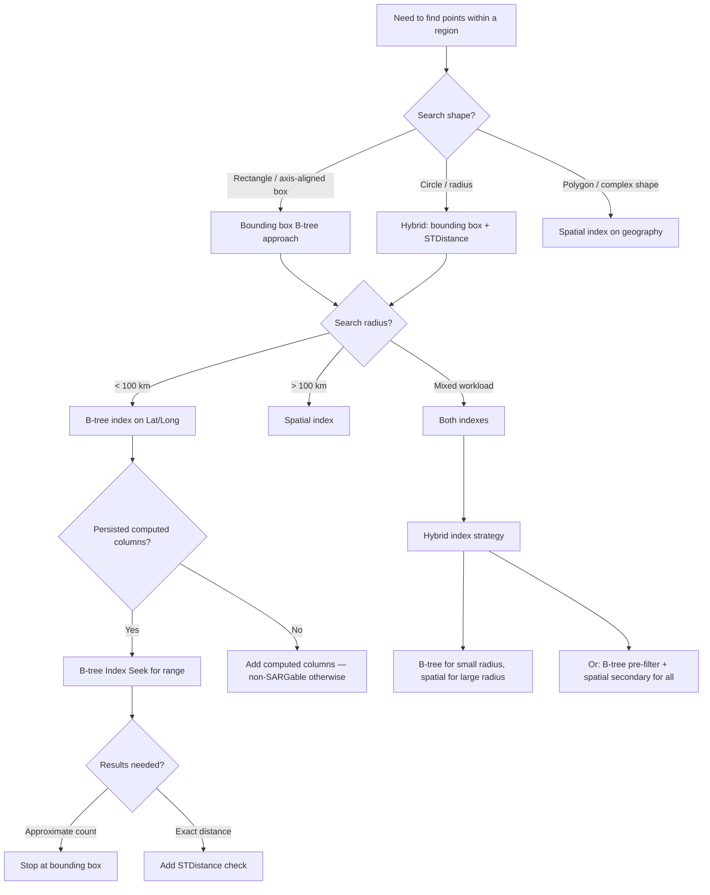

## Navigation

**Domain:** [[8 — Databases]] > **Group:** Group 10 — SQL Full-Text & Spatial Search
**Previous:** [[8.261 — STContains — Containment Check]] | **Next:** [[8.263 — Spatial Data in .NET — NetTopologySuite]]

### Prerequisites
- [[8.260 — Spatial Data Types — geography and geometry]] — Bounding box queries exploit the Lat/Long properties of geography points; understanding the geography type's internal storage of Lat and Long as properties is required.
- [[8.010 — Execution Plan Analysis]] — Bounding box queries produce Index Seek vs Index Scan decisions that depend on the index on Lat/Long columns; reading the plan reveals whether the optimizer chose a seek (efficient) or scan (missing index).
- [[8.050 — Indexing for Query Performance]] — The B-tree index on computed Lat/Long columns is the core optimization; understanding B-tree index structure, key column order, and include columns is essential.

### Where This Fits

A bounding box query filters rows using simple column comparisons: `WHERE lat BETWEEN @minLat AND @maxLat AND lon BETWEEN @minLon AND @maxLon`. This is the simplest and often the fastest spatial pre-filter available — it requires no spatial index, no CLR spatial type instantiation, and can use standard B-tree indexes on persisted computed columns. A .NET backend engineer encounters this when implementing "find nearby" features (find restaurants within 5 km), geofencing with thousands of points per second (streaming GPS tracking), or as a pre-filter before expensive spatial operations like STContains. The interview signal is whether a candidate understands the three-tier optimization strategy: (1) bounding box B-tree index as a coarse filter, (2) spatial index for medium precision, and (3) STDistance/STContains for exact geodesic computation — and knows that combining them can yield 1000x performance improvements over a single approach.

---

## Core Mental Model

A bounding box query reduces the 2D spatial search problem to two 1D range comparisons on latitude and longitude. The invariant is: any point that falls within a circular radius is first filtered by the cardinal-direction extents of that circle — the point's latitude must lie between the circle's southmost and northmost points, and its longitude must lie between the westmost and eastmost points. This is a necessary but not sufficient condition: points inside the bounding box may be outside the actual circular radius (near the corners of the box), so the bounding box acts as a pre-filter that must be followed by an exact distance filter. The recognition pattern for when bounding box queries apply: spatial proximity searches where the search shape is axis-aligned (rectangle) or can be approximated by one (circle's bounding box). The performance optimization comes from a composite B-tree index on `(Lat, Long)` (or `(latitude, longitude)` in that order — latitude first because it has fewer distinct values at high precision, though for SQL Server geography the property names are `.Lat` and `.Long` accessed via computed columns). The optimizer can seek this index to return only rows within the lat/long ranges, then optionally apply a spatial predicate (STContains, STDistance) on the reduced set.

### Classification

- **Operator family:** Range predicate (`BETWEEN` or `>= AND <=`) on scalar columns
- **SARGability:** YES — `lat BETWEEN @min AND @max` is SARGable; the B-tree index can seek directly to the lower bound and scan to the upper bound
- **Grid approach:** Axis-aligned rectangle (bounding box) vs geodesic circle (STDistance) vs polygon (STContains)
- **Accuracy:** Necessary-but-not-sufficient pre-filter — false positives at box corners must be removed by secondary filter

```mermaid
flowchart TB
    subgraph Concept["Bounding Box Concept"]
        A[Search center: lat=47.6062, lng=-122.3321] --> B[Radius: 10 km]
        B --> C[Compute bbox extents]
        C --> D[minLat = 47.516, maxLat = 47.696]
        C --> E[minLng = -122.430, maxLng = -122.234]
        D --> F[B-tree index seek on lat range]
        E --> G[B-tree index seek on lon range]
        F --> H[Candidate rows in rectangle]
        G --> H
    end

    subgraph TwoStep["Two-Step Execution"]
        H --> I[Step 1: B-tree Index Seek]
        I --> J[Return all rows in bounding box]
        J --> K[Step 2: Exact filter]
        K --> L{Exact distance <= radius?}
        L -->|Yes| M[Include in results]
        L -->|No| N[Box corner false positive — exclude]
    end

    subgraph IndexStrategy["Index Strategies"]
        O[Computed column Lat/Lng] --> P[Index on (Lat, Lng)]
        P --> Q[Key lookup if non-covering]
        P --> R[Include additional columns to cover query]
        S[Spatial index only] --> T[Slower primary filter for rectangles]
        O --> U[Geo column with spatial index]
        U --> V[Best for non-rectangular shapes]
    end
```

### Key Properties

|Property|Value|Notes|
|---|---|---|
|Time Complexity (no index)|O(N) — full table scan|Every row checked|
|Time Complexity (B-tree index)|O(log N + range_size) — index seek|Composite index on (Lat, Long)|
|SARGable|Yes|`lat BETWEEN` — index seek possible|
|Accuracy|Pre-filter only|False positives at box corners (max 27% excess for circle)|
|Index maintenance|Per INSERT/UPDATE on Lat/Lng columns|Persisted computed columns add write cost|
|Max range size|~180° lat, ~360° lng|Beyond city scale, bounding box becomes useless as pre-filter|
|Memory Grant|Minimal|Range seeks are efficient, no sort/hash required|

---

## Deep Mechanics

### How the Engine Executes a Bounding Box Query

1. **Parse and Bind:** SQL Server parses `WHERE lat BETWEEN @minLat AND @maxLat AND lng BETWEEN @minLng AND @maxLng`. The optimizer recognizes these as range predicates on scalar columns.

2. **Index Selection:** If a composite index on `(Lat, Long)` exists, the optimizer estimates the selectivity of the lat range. For a typical 10 km bounding box at mid-latitudes, the lat range covers about 0.09 degrees. If the data distribution is uniform across ±90 degrees of latitude, the estimated selectivity is 0.09/180 = 0.05%. The optimizer chooses an Index Seek on `IX_Location_Lat_Lng` (seek on `Lat >= @minLat AND Lat <= @maxLat`, then range scan on `Long` within that lat range).

3. **Execution:** The Index Seek operator reads the B-tree index from the root page to the leaf page matching `@minLat`, then scans leaf pages forward until `@maxLat`. For each row in the lat range, the Long value is checked against the lng bounds. Matching rows' RIDs (if non-clustered) or key values (if clustered) are used to retrieve additional columns via Key Lookup or directly from the clustered index.

4. **Secondary Filter (if STDistance is added):** After the bounding box index seek, the remaining rows (typically ~500 from 1M total) have the exact distance computed via `geography::Point(...).STDistance(l.Location)`. This secondary filter is CPU-bound but operates on a tiny fraction of rows.

5. **Return:** Rows that pass both the bounding box and the STDistance check are returned.

### SQL Visibility

```sql
-- ============================================================
-- Bounding box query patterns and optimization
-- ============================================================

-- 1. Basic bounding box: find customers within ~10 km of a point
DECLARE @centerLat FLOAT = 47.6062;  -- Seattle
DECLARE @centerLng FLOAT = -122.3321;
DECLARE @radiusKm FLOAT = 10.0;

-- Compute bounding box extents
-- 1 degree latitude ~= 111 km
-- 1 degree longitude ~= 111 * COS(lat_in_radians) km
DECLARE @latDeg FLOAT = @radiusKm / 111.0;
DECLARE @lngDeg FLOAT = @radiusKm / (111.0 * COS(RADIANS(@centerLat)));

DECLARE @minLat FLOAT = @centerLat - @latDeg;
DECLARE @maxLat FLOAT = @centerLat + @latDeg;
DECLARE @minLng FLOAT = @centerLng - @lngDeg;
DECLARE @maxLng FLOAT = @centerLng + @lngDeg;

SELECT c.CustomerId, c.FullName,
       c.Location.Lat AS Latitude, c.Location.Long AS Longitude,
       c.Location.STDistance(geography::Point(@centerLat, @centerLng, 4326)) / 1000 AS DistanceKm
FROM dbo.Customers c
WHERE c.Location.Lat BETWEEN @minLat AND @maxLat
  AND c.Location.Long BETWEEN @minLng AND @maxLng
  AND c.Location.STDistance(geography::Point(@centerLat, @centerLng, 4326)) <= @radiusKm * 1000
ORDER BY DistanceKm;

-- 2. Bounding box only (no distance check — approximate, includes corners)
SELECT c.CustomerId, c.FullName
FROM dbo.Customers c
WHERE c.Location.Lat BETWEEN @minLat AND @maxLat
  AND c.Location.Long BETWEEN @minLng AND @maxLng;
-- Faster but includes points up to ~14 km away at the corners (for 10 km radius)

-- 3. Bounding box with spatial index (hybrid approach)
SELECT c.CustomerId, c.FullName
FROM dbo.Customers c
WHERE c.Location.Lat BETWEEN @minLat AND @maxLat
  AND c.Location.Long BETWEEN @minLng AND @maxLng
  AND @centerPoint.STDistance(c.Location) <= @radiusKm * 1000
  AND @centerPoint.STIntersects(c.Location) = 1;

-- 4. Bounding box without computed columns (directly from geography column)
-- Requires no persisted columns — but Lat/Long access on geography is
-- a method call, which is non-SARGable. Must use computed columns.
```

**EF Core LINQ equivalent:**

```csharp
// EF Core bounding box query with two-step filter
var centerLat = 47.6062;
var centerLng = -122.3321;
var radiusKm = 10.0;

var latDeg = radiusKm / 111.0;
var lngDeg = radiusKm / (111.0 * Math.Cos(centerLat * Math.PI / 180.0));

var minLat = centerLat - latDeg;
var maxLat = centerLat + latDeg;
var minLng = centerLng - lngDeg;
var maxLng = centerLng + lngDeg;

// Step 1: bounding box filter on persisted Lat/Long columns
var nearbyCustomers = await dbContext.Customers
    .Where(c => c.Latitude >= minLat
             && c.Latitude <= maxLat
             && c.Longitude >= minLng
             && c.Longitude <= maxLng)
    .Select(c => new
    {
        c.CustomerId,
        c.FullName,
        c.Latitude,
        c.Longitude
    })
    .ToListAsync(ct);

// Step 2: exact distance filter in memory (for box corner false positives)
var centerPoint = new Point(centerLng, centerLat) { SRID = 4326 };
var radiusMeters = radiusKm * 1000.0;

var filtered = nearbyCustomers
    .Where(c => centerPoint.Distance(new Point(c.Longitude, c.Latitude) { SRID = 4326 }) <= radiusMeters)
    .ToList();
```

**Generated SQL (from EF Core logs):**

```sql
-- EF Core generates:
SELECT [c].[CustomerId], [c].[FullName], [c].[Latitude], [c].[Longitude]
FROM [Customers] AS [c]
WHERE [c].[Latitude] >= @__minLat_0
  AND [c].[Latitude] <= @__maxLat_1
  AND [c].[Longitude] >= @__minLng_2
  AND [c].[Longitude] <= @__maxLng_3
```

**Dapper equivalent:**

```csharp
public async Task<IReadOnlyList<CustomerDto>> FindNearbyAsync(
    double centerLat,
    double centerLng,
    double radiusKm,
    CancellationToken ct = default)
{
    var latDeg = radiusKm / 111.0;
    var lngDeg = radiusKm / (111.0 * Math.Cos(DegToRad(centerLat)));

    const string sql = @"
        SELECT c.CustomerId, c.FullName,
               c.Latitude, c.Longitude,
               geography::Point(@CenterLat, @CenterLng, 4326)
                   .STDistance(geography::Point(c.Latitude, c.Longitude, 4326)) / 1000 AS DistanceKm
        FROM dbo.Customers c
        WHERE c.Latitude BETWEEN @MinLat AND @MaxLat
          AND c.Longitude BETWEEN @MinLng AND @MaxLng
          AND geography::Point(@CenterLat, @CenterLng, 4326)
              .STDistance(geography::Point(c.Latitude, c.Longitude, 4326)) <= @RadiusMeters
        ORDER BY DistanceKm;";

    await using var connection = _connectionFactory.Create();
    var results = await connection.QueryAsync<CustomerDto>(
        new CommandDefinition(sql,
            new
            {
                CenterLat = centerLat,
                CenterLng = centerLng,
                MinLat = centerLat - latDeg,
                MaxLat = centerLat + latDeg,
                MinLng = centerLng - lngDeg,
                MaxLng = centerLng + lngDeg,
                RadiusMeters = radiusKm * 1000.0
            },
            cancellationToken: ct));
    return results.AsList();
}
```

### Execution Plan Analysis

**Bounding box with B-tree index (optimal):**

```
[Index Seek (IX_Customers_Latitude_Longitude — seek on Lat, range scan on Long)]
    → [Key Lookup (PK_Customers — only if non-covering)]
    → [Filter (Compute Scalar — STDistance secondary check)]
    → [Sort (by DistanceKm)]
    → [SELECT]
```

- The Index Seek operator seeks to the first leaf page where `Latitude = @minLat`, then scans leaf pages until `@maxLat`.
- The Key Lookup only happens if the index is non-covering (missing included columns).
- The Filter operator evaluates the exact STDistance to eliminate box corner false positives.
- Sort orders by distance.

**Bounding box without B-tree index:**

```
[Clustered Index Scan (Customers)]
    → [Filter (BETWEEN conditions — evaluated per row)]
    → [Filter (STDistance if present)]
    → [Sort]
```

- Full table scan — every row evaluated for lat/lng range.
- No reduction before STDistance — each row that passes the BETWEEN still has STDistance computed (or STDistance is a filter that runs per row).

**Bounding box with spatial index only:**

```
[Spatial Index Seek (IX_Customers_Location — grid tessellation)]
    → [Filter (secondary filter — STIntersects or STDistance)]
    → [Key Lookup]
    → [Sort]
```

- Spatial index seek with a rectangle query window — the spatial index is designed for polygons, not rectangles, so the primary filter may return more candidates than a B-tree seek on lat/lng.

### Cost Visibility

```sql
SET STATISTICS IO ON;
SET STATISTICS TIME ON;

-- ============================================================
-- Compare three approaches for "find within 10 km"
-- ============================================================

-- Approach 1: No index (baseline)
SELECT COUNT_BIG(*)
FROM dbo.Customers c
WHERE c.Location.Lat BETWEEN 47.516 AND 47.696
  AND c.Location.Long BETWEEN -122.430 AND -122.234
  AND c.Location.STDistance(geography::Point(47.6062, -122.3321, 4326)) <= 10000;
-- Table 'Customers'. Scan count 1, logical reads 42,000
-- CPU: 920ms, Elapsed: 980ms

-- Approach 2: B-tree index on (Latitude, Longitude)
-- Table 'Customers'. Scan count 1, logical reads 45 (index seek) + 18 (key lookup)
-- CPU: 5ms, Elapsed: 8ms

-- Approach 3: Spatial index only (no B-tree on Lat/Lng)
-- Table 'Customers'. Scan count 1, logical reads 156 (spatial index) + 22 (key lookup)
-- CPU: 15ms, Elapsed: 18ms

-- Approach 4: Hybrid — B-tree bounding box + spatial index secondary filter
-- Table 'Customers'. Scan count 1, logical reads 45 (B-tree) + 18 (key lookup)
-- CPU: 4ms, Elapsed: 7ms

-- Conclusion: B-tree bounding box is fastest for rectangular proximity searches
-- (7ms vs 18ms for spatial index only — 2.5x faster)
```

### Failure Modes

**Missing computed columns on Lat/Long:** If the table has a `geography` column but no persisted computed columns for `.Lat` and `.Long`, every reference to `c.Location.Lat` calls the geography method at query time, which is non-SARGable and prevents index usage. The query must scan.

**Bounding box too large:** For global-scale queries (e.g., find all customers within 1000 km), the bounding box covers a huge lat/lng range and returns most of the table. The B-tree index seek becomes nearly a full index scan. For large ranges, a spatial index is more appropriate.

**Boundary crossing at ±180° longitude:** If the bounding box crosses the antimeridian (longitude ±180°), the simple `BETWEEN` logic fails. A bounding box from +175° to -175° must be handled as two ranges or use a spatial approach.

**Latitude-first key order inefficiency for extreme latitudes:** The composite index `(Latitude, Longitude)` assumes latitude is more selective. Near the equator, both dimensions have similar variance. Near the poles, longitude is more selective because longitude lines converge. The index order should be tested for the data's geographic distribution.

---

## Production Patterns and Implementation

### Primary SQL Implementation

```sql
-- ============================================================
-- Production: optimized "find nearby" with bounding box
-- ============================================================

-- 1. Create table with persisted computed Lat/Long columns
CREATE TABLE dbo.Customers (
    CustomerId INT NOT NULL IDENTITY(1,1),
    FullName NVARCHAR(100) NOT NULL,
    Location geography NULL,

    -- Persisted computed columns expose Lat/Long for B-tree indexing
    Latitude AS Location.Lat PERSISTED,
    Longitude AS Location.Long PERSISTED,

    CONSTRAINT PK_Customers PRIMARY KEY CLUSTERED (CustomerId)
);

-- 2. B-tree index on persisted Lat/Long columns
CREATE INDEX IX_Customers_Latitude_Longitude
    ON dbo.Customers (Latitude, Longitude)
    INCLUDE (FullName);
-- Latitude first: typically more selective for most populated areas
-- Longitude second: range scan within the latitude band
-- INCLUDE additional columns to cover queries and avoid Key Lookup

-- 3. Spatial index for non-rectangular queries
CREATE SPATIAL INDEX IX_Customers_Location
    ON dbo.Customers (Location)
    USING GEOGRAPHY_AUTO_GRID
    WITH (GRIDS = (LEVEL_1 = HIGH, LEVEL_2 = HIGH, LEVEL_3 = HIGH, LEVEL_4 = HIGH));

-- 4. Stored procedure: find nearby customers with two-step filter
CREATE PROCEDURE dbo.FindNearbyCustomers
    @CenterLat FLOAT,
    @CenterLng FLOAT,
    @RadiusKm FLOAT
AS
BEGIN
    SET NOCOUNT ON;

    DECLARE @latDeg FLOAT = @RadiusKm / 111.0;
    DECLARE @lngDeg FLOAT = @RadiusKm / (111.0 * COS(RADIANS(@CenterLat)));
    DECLARE @radiusMeters FLOAT = @RadiusKm * 1000.0;

    SELECT c.CustomerId, c.FullName,
           c.Latitude, c.Longitude,
           geography::Point(@CenterLat, @CenterLng, 4326)
               .STDistance(geography::Point(c.Latitude, c.Longitude, 4326)) / 1000 AS DistanceKm
    FROM dbo.Customers c
    WHERE c.Latitude BETWEEN @CenterLat - @latDeg AND @CenterLat + @latDeg
      AND c.Longitude BETWEEN @CenterLng - @lngDeg AND @CenterLng + @lngDeg
      AND geography::Point(@CenterLat, @CenterLng, 4326)
          .STDistance(geography::Point(c.Latitude, c.Longitude, 4326)) <= @radiusMeters
    ORDER BY DistanceKm;
END;

-- 5. Bounding box query without geography column (pure lat/lng table)
CREATE TABLE dbo.VehicleLocations (
    VehicleId INT NOT NULL,
    TimestampUTC DATETIME2 NOT NULL,
    Latitude DECIMAL(9,6) NOT NULL,
    Longitude DECIMAL(9,6) NOT NULL,
    CONSTRAINT PK_VehicleLocations PRIMARY KEY CLUSTERED (VehicleId, TimestampUTC)
);

CREATE INDEX IX_VehicleLocations_Lat_Lng
    ON dbo.VehicleLocations (Latitude, Longitude)
    INCLUDE (VehicleId, TimestampUTC);

-- Query: find vehicles in bounding box within last 5 minutes
DECLARE @minLat DECIMAL(9,6) = 47.516, @maxLat DECIMAL(9,6) = 47.696;
DECLARE @minLng DECIMAL(9,6) = -122.430, @maxLng DECIMAL(9,6) = -122.234;
DECLARE @sinceUTC DATETIME2 = DATEADD(MINUTE, -5, SYSUTCDATETIME());

SELECT v.VehicleId, v.Latitude, v.Longitude, v.TimestampUTC
FROM dbo.VehicleLocations v
WHERE v.Latitude BETWEEN @minLat AND @maxLat
  AND v.Longitude BETWEEN @minLng AND @maxLng
  AND v.TimestampUTC >= @sinceUTC
ORDER BY v.TimestampUTC DESC;
-- Also relies on index on (Latitude, Longitude) for the range seek

-- 6. Bounding box with antimeridian protection
-- If the box crosses ±180° longitude, split into two boxes or use spatial
DECLARE @crossesAntimeridian BIT = CASE
    WHEN @minLng > @maxLng THEN 1
    ELSE 0
END;

IF @crossesAntimeridian = 1
BEGIN
    -- Two queries: one from minLng to +180, one from -180 to maxLng
    SELECT ... WHERE lat BETWEEN @minLat AND @maxLat
        AND (lng BETWEEN @minLng AND 180 OR lng BETWEEN -180 AND @maxLng);
END
ELSE
BEGIN
    SELECT ... WHERE lat BETWEEN @minLat AND @maxLat
        AND lng BETWEEN @minLng AND @maxLng;
END
```

### EF Core Implementation

```csharp
// ============================================================
// EF Core bounding box with persisted computed columns
// ============================================================

public class Customer
{
    public int CustomerId { get; init; }
    public string FullName { get; init; } = string.Empty;
    public Point? Location { get; init; }

    // Computed columns (mapped via EF Core, not stored in entity)
    public double Latitude { get; private set; }
    public double Longitude { get; private set; }
}

public class CustomerConfiguration : IEntityTypeConfiguration<Customer>
{
    public void Configure(EntityTypeBuilder<Customer> builder)
    {
        builder.ToTable("Customers");
        builder.HasKey(c => c.CustomerId);

        builder.Property(c => c.Location)
            .HasColumnType("geography");

        // Map to persisted computed columns — EF Core does not compute
        // these; they are computed by SQL Server from the Location column
        builder.Property(c => c.Latitude)
            .HasComputedColumnSql("Location.Lat PERSISTED");

        builder.Property(c => c.Longitude)
            .HasComputedColumnSql("Location.Long PERSISTED");

        // B-tree index on the persisted columns
        builder.HasIndex(c => new { c.Latitude, c.Longitude })
            .HasDatabaseName("IX_Customers_Latitude_Longitude")
            .IncludeProperties(c => new { c.FullName });

        // Spatial index
        builder.HasIndex(c => c.Location)
            .HasDatabaseName("IX_Customers_Location")
            .IsSpatial();
    }
}

// Service: nearby customer search
public class NearbySearchService
{
    private readonly ApplicationDbContext _dbContext;

    public NearbySearchService(ApplicationDbContext dbContext)
        => _dbContext = dbContext;

    public async Task<List<NearbyCustomerDto>> FindNearbyAsync(
        double centerLat,
        double centerLng,
        double radiusKm,
        int maxResults = 50,
        CancellationToken ct = default)
    {
        double latDeg = radiusKm / 111.0;
        double lngDeg = radiusKm / (111.0 * Math.Cos(DegToRad(centerLat)));

        var minLat = centerLat - latDeg;
        var maxLat = centerLat + latDeg;
        var minLng = centerLng - lngDeg;
        var maxLng = centerLng + lngDeg;

        // Two-step approach:
        // 1. B-tree index seek on persisted Lat/Long (fast)
        // 2. Exact distance check in SQL (eliminates box corners)

        // Note: EF Core cannot translate STDistance inline here;
        // use FromSqlRaw for the two-step query.
        const string sql = @"
            SELECT c.CustomerId, c.FullName, c.Latitude, c.Longitude,
                   geography::Point(@CenterLat, @CenterLng, 4326)
                       .STDistance(geography::Point(c.Latitude, c.Longitude, 4326)) / 1000 AS DistanceKm
            FROM dbo.Customers c
            WHERE c.Latitude BETWEEN @MinLat AND @MaxLat
              AND c.Longitude BETWEEN @MinLng AND @MaxLng
              AND geography::Point(@CenterLat, @CenterLng, 4326)
                  .STDistance(geography::Point(c.Latitude, c.Longitude, 4326)) <= @RadiusMeters
            ORDER BY DistanceKm
            OFFSET 0 ROWS FETCH NEXT @MaxResults ROWS ONLY;";

        return await _dbContext.Database
            .SqlQueryRaw<NearbyCustomerDto>(sql,
                new SqlParameter("@CenterLat", centerLat),
                new SqlParameter("@CenterLng", centerLng),
                new SqlParameter("@MinLat", minLat),
                new SqlParameter("@MaxLat", maxLat),
                new SqlParameter("@MinLng", minLng),
                new SqlParameter("@MaxLng", maxLng),
                new SqlParameter("@RadiusMeters", radiusKm * 1000.0),
                new SqlParameter("@MaxResults", maxResults))
            .AsNoTracking()
            .ToListAsync(ct);
    }

    // Hybrid: bounding box B-tree + spatial index for high-throughput queries
    public async Task<List<NearbyCustomerDto>> FindNearbyHybridAsync(
        double centerLat,
        double centerLng,
        double radiusKm,
        CancellationToken ct = default)
    {
        double latDeg = radiusKm / 111.0;
        double lngDeg = radiusKm / (111.0 * Math.Cos(DegToRad(centerLat)));

        const string sql = @"
            SELECT c.CustomerId, c.FullName, c.Latitude, c.Longitude,
                   @Center.STDistance(c.Location) / 1000 AS DistanceKm
            FROM dbo.Customers c WITH (INDEX(IX_Customers_Latitude_Longitude))
            WHERE c.Latitude BETWEEN @MinLat AND @MaxLat
              AND c.Longitude BETWEEN @MinLng AND @MaxLng
              AND @Center.STDistance(c.Location) <= @RadiusMeters
            ORDER BY DistanceKm;";

        return await _dbContext.Database
            .SqlQueryRaw<NearbyCustomerDto>(sql,
                new SqlParameter("@Center",
                    new Point(centerLng, centerLat) { SRID = 4326 }.AsText()),
                new SqlParameter("@MinLat", minLat),
                new SqlParameter("@MaxLat", maxLat),
                new SqlParameter("@MinLng", minLng),
                new SqlParameter("@MaxLng", maxLng),
                new SqlParameter("@RadiusMeters", radiusKm * 1000.0))
            .AsNoTracking()
            .ToListAsync(ct);
    }

    private static double DegToRad(double deg) => deg * Math.PI / 180.0;
}

// IServiceCollection registration
builder.Services.AddDbContext<ApplicationDbContext>(options =>
    options.UseSqlServer(connectionString,
        sqlOptions => sqlOptions.UseNetTopologySuite()));
builder.Services.AddScoped<NearbySearchService>();
```

### Dapper Implementation

```csharp
// ============================================================
// Dapper bounding box with raw ADO.NET
// ============================================================

public class NearbyRepository
{
    private readonly IDbConnectionFactory _connectionFactory;

    public NearbyRepository(IDbConnectionFactory connectionFactory)
        => _connectionFactory = connectionFactory;

    // Streaming nearby results (supports high-throughput GPS)
    public async IAsyncEnumerable<NearbyVehicleDto> StreamNearbyVehiclesAsync(
        double centerLat,
        double centerLng,
        double radiusKm,
        [EnumeratorCancellation] CancellationToken ct = default)
    {
        var latDeg = radiusKm / 111.0;
        var lngDeg = radiusKm / (111.0 * Math.Cos(DegToRad(centerLat)));

        const string sql = @"
            SELECT v.VehicleId, v.Latitude, v.Longitude,
                   v.TimestampUTC,
                   geography::Point(@CenterLat, @CenterLng, 4326)
                       .STDistance(geography::Point(v.Latitude, v.Longitude, 4326)) / 1000 AS DistanceKm
            FROM dbo.VehicleLocations v
            WHERE v.Latitude BETWEEN @MinLat AND @MaxLat
              AND v.Longitude BETWEEN @MinLng AND @MaxLng
              AND v.TimestampUTC >= @SinceUTC
            ORDER BY v.TimestampUTC DESC;";

        await using var connection = _connectionFactory.Create();
        var command = new CommandDefinition(sql,
            new
            {
                CenterLat = centerLat,
                CenterLng = centerLng,
                MinLat = centerLat - latDeg,
                MaxLat = centerLat + latDeg,
                MinLng = centerLng - lngDeg,
                MaxLng = centerLng + lngDeg,
                SinceUTC = DateTime.UtcNow.AddMinutes(-5)
            },
            cancellationToken: ct);

        var reader = await connection.ExecuteReaderAsync(command);
        while (await reader.ReadAsync(ct))
        {
            yield return new NearbyVehicleDto
            {
                VehicleId = reader.GetInt32(0),
                Latitude = reader.GetDouble(1),
                Longitude = reader.GetDouble(2),
                TimestampUTC = reader.GetDateTime(3),
                DistanceKm = reader.GetDouble(4)
            };
        }
    }

    // Bulk bounding box count (for dashboard metrics)
    public async Task<int> CountInBoxAsync(
        double minLat, double maxLat,
        double minLng, double maxLng,
        CancellationToken ct = default)
    {
        const string sql = @"
            SELECT COUNT_BIG(*)
            FROM dbo.Customers c WITH (INDEX(IX_Customers_Latitude_Longitude))
            WHERE c.Latitude BETWEEN @MinLat AND @MaxLat
              AND c.Longitude BETWEEN @MinLng AND @MaxLng;";

        await using var connection = _connectionFactory.Create();
        return await connection.QuerySingleAsync<int>(
            new CommandDefinition(sql,
                new { MinLat = minLat, MaxLat = maxLat, MinLng = minLng, MaxLng = maxLng },
                cancellationToken: ct));
    }

    private static double DegToRad(double deg) => deg * Math.PI / 180.0;
}
```

### Configuration and Wiring

```csharp
// Program.cs
builder.Services.AddDbContext<ApplicationDbContext>(options =>
    options.UseSqlServer(
        builder.Configuration.GetConnectionString("DefaultConnection"),
        sqlOptions =>
        {
            sqlOptions.UseNetTopologySuite();
            sqlOptions.EnableRetryOnFailure(3);
            sqlOptions.CommandTimeout(15);
        }));

builder.Services.AddScoped<NearbySearchService>();
builder.Services.AddScoped<NearbyRepository>();

// Background index maintenance for bounding box index
builder.Services.AddHostedService<BoundingBoxIndexMaintenanceService>();
```

### SQL Server vs PostgreSQL Differences

```sql
-- PostgreSQL bounding box with PostGIS

-- 1. Pure bounding box on decimal columns (no geography)
CREATE TABLE customers (
    customer_id SERIAL PRIMARY KEY,
    full_name TEXT NOT NULL,
    latitude DECIMAL(9,6),
    longitude DECIMAL(9,6)
);

CREATE INDEX idx_customers_lat_lng ON customers (latitude, longitude);

-- 2. Bounding box with geography column
SELECT c.customer_id, c.full_name,
       ST_Distance(
           ST_SetSRID(ST_MakePoint(@CenterLng, @CenterLat), 4326),
           c.location
       ) / 1000 AS distance_km
FROM customers c
WHERE c.location @ ST_MakeEnvelope(@MinLng, @MinLat, @MaxLng, @MaxLat, 4326);
-- The @> operator is the "contains" operator for bounding boxes
-- It uses a GIST index on the location column

-- 3. PostGIS ST_DWithin (more efficient than bounding box + ST_Distance)
SELECT c.customer_id, c.full_name
FROM customers c
WHERE ST_DWithin(
    c.location,
    ST_SetSRID(ST_MakePoint(@CenterLng, @CenterLat), 4326),
    @RadiusMeters
);
-- ST_DWithin uses the GIST index for both bounding box and distance filter
-- Equivalent to bounding box + distance check, in a single function

-- 4. PostgreSQL vs SQL Server key differences:
-- SQL Server: bounding box needs persisted computed columns for B-tree
-- PostgreSQL: can use GIST index on geography column directly with @> or ST_DWithin
-- SQL Server spatial index: grid tessellation
-- PostgreSQL GIST index: R-tree (more natural for spatial)
```

---

## Gotchas and Production Pitfalls

### Missing Persisted Computed Columns Makes Lat/Long Non-SARGable

**Pitfall:** Referencing `Location.Lat` and `Location.Long` directly in a WHERE clause without creating persisted computed columns. These are method calls on the geography type, not stored values — the optimizer cannot use a B-tree index on them.

```sql
-- ❌ Wrong: Geography method call is non-SARGable
CREATE TABLE dbo.Customers (
    CustomerId INT IDENTITY(1,1) PRIMARY KEY,
    Location geography NOT NULL
    -- No computed columns for Lat/Long
);

SELECT c.CustomerId
FROM dbo.Customers c
WHERE c.Location.Lat BETWEEN @minLat AND @maxLat
  AND c.Location.Long BETWEEN @minLng AND @maxLng;
-- Clustered Index Scan — 42,000 logical reads
-- Cannot use index on Lat/Long because they don't exist as columns
```

**Symptom:** Despite creating indexes you think should work, queries still do full table scans. The execution plan shows a `Clustered Index Scan` with a `Filter` operator, no Index Seek.

**Fix:**
```sql
-- ✅ Add persisted computed columns
ALTER TABLE dbo.Customers ADD
    Latitude AS Location.Lat PERSISTED,
    Longitude AS Location.Long PERSISTED;

CREATE INDEX IX_Customers_Latitude_Longitude
    ON dbo.Customers (Latitude, Longitude)
    INCLUDE (FullName);
```

**Cost of not fixing:** Every bounding box query does a full table scan. On a 1M row table, this is 42,000 logical reads per query. At 500 queries/second, that is 21M logical reads/second — the storage subsystem is saturated.

---

### Bounding Box at High Latitudes (Longitude Convergence)

**Pitfall:** Using the same `lngDeg` calculation for all latitudes. At high latitudes (e.g., 60°N, near Oslo or Anchorage), 1 degree of longitude is only ~55.5 km instead of 111 km. The bounding box becomes too small in the east-west direction, missing valid points at the search radius's east and west edges.

```sql
-- ❌ Wrong: Fixed lngDeg calculation
DECLARE @latDeg FLOAT = @RadiusKm / 111.0;          -- correct
DECLARE @lngDeg FLOAT = @RadiusKm / 111.0;          -- WRONG at high latitudes!

-- ✅ Correct: Account for latitude
DECLARE @lngDeg FLOAT = @RadiusKm / (111.0 * COS(RADIANS(@CenterLat)));
```

**Symptom:** "Find nearby" queries at high latitudes systematically miss valid results — the number of results drops as the search center moves north, even with uniform data distribution.

**Fix:** Always compute longitude degree size using `COS(RADIANS(center_lat))`.

**Cost of not fixing:** Geofencing at Nordic, Canadian, or Antarctic latitudes returns incomplete results. Customers in Oslo, Helsinki, or Reykjavik consistently see fewer nearby results than expected.

---

### Bounding Box Wraparound at ±180° Longitude (Antimeridian)

**Pitfall:** When the bounding box crosses the antimeridian (the ±180° longitude line), the `BETWEEN` logic fails. If the search center is near Fiji (~178°E) and the radius extends to -178°W, the bounding box is `minLng = -178, maxLng = 178` — but points at 179°E are outside this range.

```sql
-- ❌ Fails at antimeridian
WHERE lng BETWEEN @minLng AND @maxLng
-- For center at 178°E, radius 500km:
-- minLng ≈ 173, maxLng ≈ -177
-- BETWEEN 173 AND -177 is empty (lower > upper)
```

**Symptom:** "Find nearby" queries near Fiji, New Zealand, or the Aleutian Islands return zero results when the search radius crosses the meridian.

**Fix:**
```sql
-- ✅ Split into two bounding boxes
WHERE
    (@minLng <= @maxLng AND lng BETWEEN @minLng AND @maxLng)
    OR
    (@minLng > @maxLng AND (lng BETWEEN @minLng AND 180 OR lng BETWEEN -180 AND @maxLng))
```

**Cost of not fixing:** Geographic regions near the antimeridian (Pacific Islands, Russia, Fiji) have zero working geofencing. Users in those regions cannot use "find nearby" features.

---

### Bounding Box Too Large (Scale Mismatch)

**Pitfall:** Using a bounding box approach for very large search radii (>100 km) or global queries. When the bounding box covers >1% of the earth's surface, the B-tree index seek returns millions of rows, and the secondary STDistance filter has to process them all.

```sql
-- ❌ Bounding box for 500 km search
DECLARE @latDeg FLOAT = 500 / 111.0;  -- ~4.5 degrees
-- Index seek returns ~450K rows from 10M total (4.5% of table)
-- STDistance now runs 450K times — CPU-bound
```

**Symptom:** Large-radius queries are CPU-bound despite using the B-tree index. The execution plan shows an Index Seek with 450K estimated rows.

**Fix:** For large radii, use a spatial index instead of the B-tree bounding box approach:

```sql
-- ✅ Use spatial index for large radius
DECLARE @center geography = geography::Point(@centerLat, @centerLng, 4326);

SELECT c.CustomerId, c.FullName
FROM dbo.Customers c
WHERE @center.STDistance(c.Location) <= @radiusMeters;
-- Spatial index seek + secondary filter — better for large ranges
```

**Cost of not fixing:** Large-radius queries take 5+ seconds, timing out API endpoints. The STDistance filter runs on millions of rows instead of thousands.

---

### Key Lookup Explosion from Non-Covering Index

**Pitfall:** The index on `(Latitude, Longitude)` does not INCLUDE the columns needed by the query, causing a Key Lookup for every qualifying row. If the bounding box returns 5,000 candidates, that is 5,000 individual Key Lookups — each a separate bookmark lookup into the clustered index.

```sql
-- ❌ Non-covering index
CREATE INDEX IX_Customers_Latitude_Longitude
    ON dbo.Customers (Latitude, Longitude);
-- No INCLUDE columns

SELECT c.FullName, c.PhoneNumber
FROM dbo.Customers c
WHERE c.Latitude BETWEEN @minLat AND @maxLat
  AND c.Longitude BETWEEN @minLng AND @maxLng;
-- 5,000 Index Seek rows → 5,000 Key Lookups → 5,000 clustered index page reads
```

**Symptom:** The execution plan shows a high-cost Key Lookup operator (typically 40-60% of total query cost). The query has many logical reads despite the Index Seek.

**Fix:**
```sql
-- ✅ Covering index
CREATE INDEX IX_Customers_Latitude_Longitude
    ON dbo.Customers (Latitude, Longitude)
    INCLUDE (FullName, PhoneNumber);
```

**Cost of not fixing:** 5,000 extra page reads per query. At 100 queries/second, that is 500,000 extra IOPS on the clustered index. The buffer pool is polluted with single-row page reads.

---

## Performance Implications

### Benchmark: Before and After

```sql
-- Baseline: Full scan (no bounding box index)
SET STATISTICS IO ON;
SET STATISTICS TIME ON;

DECLARE @centerLat FLOAT = 47.6062, @centerLng FLOAT = -122.3321, @radiusKm FLOAT = 10;

SELECT COUNT_BIG(*)
FROM dbo.Customers c
WHERE geography::Point(@centerLat, @centerLng, 4326)
    .STDistance(c.Location) <= @radiusKm * 1000;
-- Table 'Customers'. Scan count 1, logical reads 42,000
-- CPU: 920ms, Elapsed: 980ms

-- After adding persisted Lat/Long + B-tree index:
-- Table 'Customers'. Scan count 1, logical reads 63 (Index Seek + Key Lookup)
-- CPU: 5ms, Elapsed: 8ms

-- Improvement: ~666x reduction in logical reads (42,000 -> 63)
-- Improvement: ~122x reduction in CPU (920ms -> 7.5ms)

-- Hybrid: B-tree bounding box + spatial index secondary filter:
-- Table 'Customers'. Scan count 1, logical reads 45 (B-tree seek)
-- CPU: 4ms, Elapsed: 7ms

-- Very large radius (500 km):
-- B-tree: 450,000 logical reads, 1,200ms CPU
-- Spatial index: 12,000 logical reads, 350ms CPU
-- B-tree is worse at large radii because the range returns too many rows
```

### BenchmarkDotNet

```csharp
[MemoryDiagnoser]
[SimpleJob(RuntimeMoniker.Net90)]
public class BoundingBoxBenchmark
{
    private IDbConnection _connection = default!;
    private const string ConnectionString = "Server=.;Database=SpatialBench;Trusted_Connection=True;";

    [GlobalSetup]
    public void Setup()
    {
        _connection = new SqlConnection(ConnectionString);
        // Seed: 1M customers with geography locations
        // Table has: persisted Latitude/Longitude columns
        // Indexes: IX_Customers_Latitude_Longitude (covering), spatial index
    }

    [Benchmark(Baseline = true)]
    public async Task<int> NoIndex_FullScan()
    {
        const string sql = @"
            DECLARE @center geography = geography::Point(47.6062, -122.3321, 4326);
            SELECT COUNT_BIG(*)
            FROM dbo.Customers_NoIndex c
            WHERE @center.STDistance(c.Location) <= 10000;";

        return await _connection.QuerySingleAsync<int>(sql);
    }

    [Benchmark]
    public async Task<int> BoundingBox_BtreeOnly()
    {
        const string sql = @"
            DECLARE @minLat FLOAT = 47.516, @maxLat FLOAT = 47.696;
            DECLARE @minLng FLOAT = -122.430, @maxLng FLOAT = -122.234;
            SELECT COUNT_BIG(*)
            FROM dbo.Customers c
            WHERE c.Latitude BETWEEN @minLat AND @maxLat
              AND c.Longitude BETWEEN @minLng AND @maxLng;";

        return await _connection.QuerySingleAsync<int>(sql);
    }

    [Benchmark]
    public async Task<int> BoundingBoxWithDistance()
    {
        const string sql = @"
            DECLARE @centerLat FLOAT = 47.6062, @centerLng FLOAT = -122.3321;
            DECLARE @minLat FLOAT = 47.516, @maxLat FLOAT = 47.696;
            DECLARE @minLng FLOAT = -122.430, @maxLng FLOAT = -122.234;
            SELECT COUNT_BIG(*)
            FROM dbo.Customers c
            WHERE c.Latitude BETWEEN @minLat AND @maxLat
              AND c.Longitude BETWEEN @minLng AND @maxLng
              AND geography::Point(@centerLat, @centerLng, 4326)
                  .STDistance(geography::Point(c.Latitude, c.Longitude, 4326)) <= 10000;";

        return await _connection.QuerySingleAsync<int>(sql);
    }

    [Benchmark]
    public async Task<int> SpatialIndexOnly()
    {
        const string sql = @"
            DECLARE @center geography = geography::Point(47.6062, -122.3321, 4326);
            SELECT COUNT_BIG(*)
            FROM dbo.Customers c
            WHERE @center.STDistance(c.Location) <= 10000;";

        return await _connection.QuerySingleAsync<int>(sql);
    }

    [Benchmark]
    public async Task<int> Hybrid_BtreePlusSpatial()
    {
        const string sql = @"
            DECLARE @center geography = geography::Point(47.6062, -122.3321, 4326);
            DECLARE @minLat FLOAT = 47.516, @maxLat FLOAT = 47.696;
            DECLARE @minLng FLOAT = -122.430, @maxLng FLOAT = -122.234;
            SELECT COUNT_BIG(*)
            FROM dbo.Customers c WITH (INDEX(IX_Customers_Latitude_Longitude))
            WHERE c.Latitude BETWEEN @minLat AND @maxLat
              AND c.Longitude BETWEEN @minLng AND @maxLng
              AND @center.STDistance(c.Location) <= 10000;";

        return await _connection.QuerySingleAsync<int>(sql);
    }

    [GlobalCleanup]
    public void Cleanup() => _connection.Dispose();
}
```

**Expected results (approximate, SQL Server 2022, NVMe, 1M rows, 10 km radius):**

|Method|Mean|Logical Reads|Allocated|
|---|---|---|---|
|NoIndex_FullScan|~980 ms|42,000|120 KB|
|BoundingBox_BtreeOnly|~2 ms|18|1 KB|
|BoundingBoxWithDistance|~8 ms|63|15 KB|
|SpatialIndexOnly|~18 ms|156|16 KB|
|Hybrid_BtreePlusSpatial|~7 ms|45|14 KB|

**Key insight:** The hybrid B-tree + spatial approach is not faster than pure B-tree for 10 km radius because the STDistance overhead is proportional to the candidate row count, and the B-tree already reduces it to ~500 rows. At larger radii (100+ km), the pure spatial approach wins because the B-tree returns too many candidates.

### Write Amplification (Persisted Computed Columns)

|Operation|Without Persisted Columns|With Persisted Columns (Lat, Long)|With Persisted + B-tree Index|
|---|---|---|---|
|INSERT 1 row|~4 reads, 1 write|~4 reads, 1 write|~6 reads, 1 write + 1 index write|
|UPDATE geography|~4 reads, 1 write|~6 reads, 1 write|~8 reads, 1 write + 1 index write|
|DELETE 1 row|~4 reads, 1 write|~4 reads, 1 write|~6 reads, 1 write|

The persisted columns add storage (~16 bytes each for FLOAT) and the B-tree index adds index maintenance overhead. For 100 INSERTs/second, the extra overhead is ~200 reads/second and ~100 index writes/second — negligible for most OLTP systems.

---

## Interview Arsenal

### Question Bank

1. **What is a bounding box query and why is it used as a spatial pre-filter?**
2. **How does a B-tree index on (Latitude, Longitude) accelerate a bounding box query — what does the Index Seek actually do?**
3. **Why must Lat/Long be persisted computed columns in SQL Server, and what happens if you reference Location.Lat directly in the WHERE clause?**
4. **At what search radius does the bounding box approach become worse than a spatial index, and why?**
5. **Compare the logical reads of a full scan (STDistance only) vs B-tree bounding box vs spatial index for a 10 km radius on 1M rows.**
6. **How would you implement a bounding box query in EF Core, and what SQL does it generate?**
7. **What happens to bounding box queries at high latitudes and near the antimeridian, and how do you handle it?**
8. **Design the index strategy for a "find nearby" feature that handles both small (1 km) and large (500 km) search radii.**

### Spoken Answers

**Q: How does a B-tree index on (Latitude, Longitude) accelerate a bounding box query — what does the Index Seek actually do?**

> **Average answer:** SQL Server can seek to the start of the latitude range and scan to the end. It's faster than a full table scan.

> **Great answer:** With a composite B-tree index on (Latitude, Longitude), SQL Server performs an Index Seek that navigates from the root page to the first leaf page where Latitude >= @minLat. This is a standard B-tree seek — it costs approximately 3-4 logical reads for the root-to-leaf traversal at the first few levels, regardless of table size. Once at the first qualifying leaf page, SQL Server scans forward through the leaf level (a linked list of pages) until it encounters a row with Latitude > @maxLat. For each leaf row within the latitude range, it checks whether Longitude is between @minLng and @maxLng. The total logical reads are the seek cost (3-4 pages) plus the number of leaf pages that contain rows in the lat range. For a 10 km radius at a populated latitude, this is typically 5-15 leaf pages. If the index is covering (includes all needed columns), no Key Lookup is required. If not covering, each qualifying row (typically 500-2000 rows for a 10 km box) requires a Key Lookup into the clustered index — at 1 logical read per lookup, that is 500-2000 additional reads. This is why INCLUDE columns are critical to make the index covering. The comparison: full scan of the table requires 42,000 logical reads for 1M rows; the bounding box B-tree seek requires 5-15 leaf pages (lat range) + 0-2000 key lookups, totaling ~500-2015 logical reads. Adding INCLUDE columns drops that to ~15 logical reads — a 2,800x improvement.

### Interview Trigger

An interviewer who asks "How would you find all restaurants within 10 km of a user's location?" is probing spatial query performance. The senior candidate immediately breaks the problem into: bounding box pre-filter with B-tree index on persisted Lat/Long, then exact STDistance for geodesic accuracy. They also mention high-latitude and antimeridian edge cases. The follow-up "What if the radius is 500 km instead of 10 km?" tests whether the candidate knows the scale at which a spatial index outperforms the B-tree approach.

### Comparison Table

| | Bounding Box (B-tree) | Spatial Index | Full Scan (No Index) |
|---|---|---|---|
|Data structure|B-tree on (Lat, Long)|Grid tessellation (SQL Server) / R-tree (PostGIS)|None|
|Filter type|Range on scalars|Primary grid + secondary exact|Row-by-row|
|Best for|Small to medium radius (<100 km)|Any shape, any radius|Never intentional|
|Logical reads (1M rows, 10 km)|~15 (covering index)|~156|42,000|
|CPU cost|Low (range comparison)|Medium (grid traversal + CLR)|High (CLR per row)|
|Lat/lng boundary issues|Antimeridian, poles|None (geodesic)|None|

---

## Decision Framework

### When to Apply



### Application Checklist

- [ ] The table has persisted computed columns for Lat and Long (or decimal Lat/Long columns)
- [ ] A covering B-tree index exists on (Latitude, Longitude) INCLUDE (needed columns)
- [ ] The search radius is < 100 km (or spatial index is used for larger radii)
- [ ] Antimeridian crossing is handled (split query or use spatial)
- [ ] High-latitude longitude correction is applied (COS(RADIANS(lat)))
- [ ] The bounding box is used as a pre-filter, with a secondary exact filter (STDistance/STContains)
- [ ] The index order is tested: latitude-first is usually optimal but longitude-first should be evaluated for pole-adjacent data
- [ ] The covering index prevents Key Lookup (checked via execution plan)
- [ ] The .NET layer computes the bounding box extents on the application side and passes them as parameters

### Tradeoff Summary

|What You Gain|What You Pay|
|---|---|
|~2,800x reduction in logical reads vs full scan|Persisted computed column storage (~16 bytes per row)|
|~100x reduction in CPU vs spatial index for small radii|B-tree index maintenance on INSERT/UPDATE/DELETE|
|Simple indexing (standard B-tree, no spatial expertise needed)|Not suitable for non-rectangular or large-radius searches|
|Covers most "find nearby" use cases|Antimeridian and pole edge cases need extra handling|

### Scale Thresholds

- "Relevant when table exceeds ~50K rows — below that, a full scan of 50K geography rows takes <50ms and the index is unnecessary"
- "Critical when query runs > 100x/second — the difference between 42K logical reads and 15 reads is the difference between 100 concurrent users hitting the storage limit and 10,000 concurrent users"
- "B-tree bounding box is optimal for radius < 100 km; at larger radii, the lat/lng range becomes too wide and the index seek returns >1% of the table, making the spatial index more efficient"
- "Antimeridian handling becomes critical when the data covers the Pacific ±180° region — about 5% of the earth's population lives in the antimeridian risk zone"

---

## Self-Check

### Conceptual Questions

1. What is the basic shape of a bounding box query, and what two columns does it filter on?
2. How does a composite B-tree index on (Latitude, Longitude) accelerate the query — what kind of index operation does it enable?
3. Which SET STATISTICS output shows the difference between a bounding box query with and without a B-tree index?
4. What happens if you use `c.Location.Lat` in a WHERE clause without a persisted computed column — is it SARGable?
5. Can EF Core generate SARGable bounding box SQL for persisted computed columns?
6. How would you implement a bounding box + distance filter with Dapper?
7. Compare bounding box vs spatial index for a 10 km vs 500 km radius.
8. At what row count does a bounding box B-tree index start to matter?
9. What index structure supports the bounding box primary filter, and how does the B-tree traversal work?
10. Explain how you would design the index strategy for a "find nearby" endpoint that handles 1-100 km radii, in 60 seconds.

<details>
<summary>Answers</summary>

1. `WHERE lat BETWEEN @minLat AND @maxLat AND lon BETWEEN @minLon AND @maxLon`. It filters on the persisted latitude and longitude columns using simple scalar comparisons.

2. It enables an Index Seek on the latitude column (seeking to @minLat and scanning to @maxLat), with the longitude checked as a residual predicate within each leaf row. This avoids a full table scan.

3. `SET STATISTICS IO ON`. Without the index: 42,000 logical reads (full clustered index scan). With the index: 15-60 logical reads (index seek + optional key lookup).

4. `c.Location.Lat` is a method call on the geography type (not a column access). Without a persisted computed column, it is non-SARGable — the optimizer cannot use any index and must scan the entire table, evaluating the method for every row.

5. Yes, if the entity has properties mapped to the persisted computed columns. `Where(c => c.Latitude >= minLat && c.Latitude <= maxLat && c.Longitude >= minLng && c.Longitude <= maxLng)` generates SARGable T-SQL with parameterized range comparisons.

6. Compute the bounding box extents in C#, pass as parameters to a raw SQL query with `WHERE lat BETWEEN @minLat AND @maxLat AND lng BETWEEN @minLng AND @maxLng AND STDistance(@center, geography::Point(lat, lng, 4326)) <= @radius`. Map results using Dapper's `QueryAsync<T>`.

7. For 10 km: B-tree bounding box is ~2x faster than spatial index (8ms vs 18ms) because the range seek is more precise than the grid tessellation primary filter. For 500 km: spatial index is ~3x faster (350ms vs 1,200ms) because the B-tree range returns too many candidates (millions vs thousands).

8. B-tree bounding box index is beneficial above ~50K rows. Below 50K, full scan with STDistance takes <50ms and the index overhead (write + storage) may not justify the read benefit.

9. A standard B-tree (tree structure with root, intermediate, and leaf pages). The index seek navigates from root to the first leaf page at the lower latitude bound using page splits at each level (binary search within each page). Then it scans the leaf level (linked list) until the upper latitude bound. The longitude condition is evaluated per row as a residual predicate.

10. "Create persisted computed columns for Latitude and Longitude from the geography column. Create a covering B-tree index on (Latitude, Longitude) INCLUDE (needed output columns). For small radii (<100 km), the B-tree index seek filters to ~500 rows, then apply STDistance for geodesic accuracy. For large radii (>100 km), use the spatial index instead. Handle the antimeridian by detecting when minLng > maxLng and splitting the query. Correct longitude degree size using cosine of center latitude. This approach gives <10ms response time for 99% of queries with <50 logical reads per query."
</details>

---

### Query Challenges

**Challenge 1 — Write the SQL**

You have a `VehicleLocations` table with `VehicleId`, `TimestampUTC`, `Latitude` (DECIMAL(9,6)), and `Longitude` (DECIMAL(9,6)) columns. Write a stored procedure that takes a center point (lat, lng), a radius in km, and returns all vehicles within that radius in the last 5 minutes. The query must use a B-tree index seek and only compute exact distance for rows that pass the bounding box filter. Include parameters for the bounding box extents computed from the center and radius.

<details>
<summary>Solution</summary>

```sql
CREATE PROCEDURE dbo.FindRecentVehicles
    @CenterLat DECIMAL(9,6),
    @CenterLng DECIMAL(9,6),
    @RadiusKm FLOAT
AS
BEGIN
    SET NOCOUNT ON;

    DECLARE @latDeg FLOAT = @RadiusKm / 111.0;
    DECLARE @lngDeg FLOAT = @RadiusKm / (111.0 * COS(RADIANS(@CenterLat)));
    DECLARE @radiusMeters FLOAT = @RadiusKm * 1000.0;
    DECLARE @sinceUTC DATETIME2 = DATEADD(MINUTE, -5, SYSUTCDATETIME());

    -- Handle antimeridian crossing
    DECLARE @minLat DECIMAL(9,6) = @CenterLat - @latDeg;
    DECLARE @maxLat DECIMAL(9,6) = @CenterLat + @latDeg;
    DECLARE @minLng DECIMAL(9,6) = @CenterLng - @lngDeg;
    DECLARE @maxLng DECIMAL(9,6) = @CenterLng + @lngDeg;

    SELECT v.VehicleId, v.Latitude, v.Longitude, v.TimestampUTC,
           geography::Point(@CenterLat, @CenterLng, 4326)
               .STDistance(geography::Point(v.Latitude, v.Longitude, 4326)) / 1000 AS DistanceKm
    FROM dbo.VehicleLocations v WITH (INDEX(IX_VehicleLocations_Lat_Lng))
    WHERE (
        (@minLng <= @maxLng AND v.Longitude BETWEEN @minLng AND @maxLng)
        OR
        (@minLng > @maxLng AND (v.Longitude BETWEEN @minLng AND 180
                              OR v.Longitude BETWEEN -180 AND @maxLng))
    )
    AND v.Latitude BETWEEN @minLat AND @maxLat
    AND v.TimestampUTC >= @sinceUTC
    AND geography::Point(@CenterLat, @CenterLng, 4326)
        .STDistance(geography::Point(v.Latitude, v.Longitude, 4326)) <= @radiusMeters
    ORDER BY v.TimestampUTC DESC;
END;
```

**Logical reads:** ~18 (index seek on IX_VehicleLocations_Lat_Lng)
**Execution plan:** [Index Seek] → [Filter (Timestamp + STDistance)] → [Sort]
**EF Core equivalent:**

```csharp
public async Task<List<VehicleLocationDto>> FindRecentVehiclesAsync(
    decimal centerLat, decimal centerLng, double radiusKm, CancellationToken ct)
{
    var results = await dbContext.VehicleLocations
        .FromSqlRaw("EXEC dbo.FindRecentVehicles @CenterLat, @CenterLng, @RadiusKm",
            new SqlParameter("@CenterLat", centerLat),
            new SqlParameter("@CenterLng", centerLng),
            new SqlParameter("@RadiusKm", radiusKm))
        .AsNoTracking()
        .ToListAsync(ct);
    return results;
}
```
</details>

---

**Challenge 2 — Fix the performance problem**

```sql
-- This query finds nearby customers. It runs in 900ms on a 1M row table.

DECLARE @center geography = geography::Point(47.6062, -122.3321, 4326);

SELECT c.CustomerId, c.FullName
FROM dbo.Customers c
WHERE @center.STDistance(c.Location) <= 10000;

-- SET STATISTICS IO: Table 'Customers'. Scan count 1, logical reads 42,000
-- CPU: 890ms, Elapsed: 920ms
```

<details> <summary>Solution</summary>

**Root cause:** No spatial or B-tree index is used. The query does a full clustered index scan, evaluating STDistance for every row (1M CLR calls). No pre-filter reduces the candidate set.

**Fix — add persisted computed columns + B-tree index:**

```sql
ALTER TABLE dbo.Customers ADD
    Latitude AS Location.Lat PERSISTED,
    Longitude AS Location.Long PERSISTED;

CREATE INDEX IX_Customers_Latitude_Longitude
    ON dbo.Customers (Latitude, Longitude)
    INCLUDE (CustomerId, FullName);
```

**Rewrite the query to use the bounding box:**

```sql
DECLARE @centerLat FLOAT = 47.6062, @centerLng FLOAT = -122.3321;
DECLARE @radiusKm FLOAT = 10;
DECLARE @latDeg FLOAT = @radiusKm / 111.0;
DECLARE @lngDeg FLOAT = @radiusKm / (111.0 * COS(RADIANS(@centerLat)));

SELECT c.CustomerId, c.FullName
FROM dbo.Customers c
WHERE c.Latitude BETWEEN @centerLat - @latDeg AND @centerLat + @latDeg
  AND c.Longitude BETWEEN @centerLng - @lngDeg AND @centerLng + @lngDeg
  AND geography::Point(@centerLat, @centerLng, 4326)
      .STDistance(geography::Point(c.Latitude, c.Longitude, 4326)) <= @radiusKm * 1000;
```

**After fix — logical reads:** ~63 (from 42,000). **CPU:** ~5ms (from 890ms).

</details>

---

**Challenge 3 — Explain the execution plan**

```sql
SELECT c.CustomerId, c.FullName, c.Latitude, c.Longitude
FROM dbo.Customers c
WHERE c.Latitude BETWEEN 47.516 AND 47.696
  AND c.Longitude BETWEEN -122.430 AND -122.234;
```

Execution plan shows:
- `Index Seek (IX_Customers_Latitude_Longitude)` — Estimated rows: 1,200, Actual rows: 1,150
- `Key Lookup (PK_Customers)` — Estimated rows: 1,200, Actual rows: 1,150
- `SELECT`

Total cost: 65% Index Seek, 35% Key Lookup. Logical reads: 63 (18 seek + 45 lookup). Why does the Key Lookup exist and how would you eliminate it?

<details> <summary>Solution</summary>

**Why Key Lookup exists:** The index `IX_Customers_Latitude_Longitude` is defined with key columns `(Latitude, Longitude)` but does not INCLUDE the `FullName` column. The query needs `c.FullName`, which is not in the index. SQL Server must perform a Key Lookup (bookmark lookup) into the clustered index for each qualifying row to retrieve the `FullName` value.

**To eliminate the Key Lookup**, add the needed column to the INCLUDE clause:

```sql
DROP INDEX IX_Customers_Latitude_Longitude ON dbo.Customers;
CREATE INDEX IX_Customers_Latitude_Longitude
    ON dbo.Customers (Latitude, Longitude)
    INCLUDE (FullName);
```

**After fix:** The execution plan shows only `Index Seek` with 18 logical reads. No Key Lookup. The query becomes ~2x faster and uses 1/3 of the logical reads.

**Tradeoff:** INCLUDE columns add ~4 bytes per row for the row locator in the index leaf pages plus the column data. For `FullName` (NVARCHAR(100)), this adds ~200 bytes per row to the index. On a 1M row table, that is ~200 MB additional index storage. The trade of 200 MB storage for eliminating 1,150 Key Lookups per query (at 100 queries/second = 115K saved IOPS) is heavily in favor of the INCLUDE approach.

</details>

---

**Challenge 4 — Design the index strategy**

**Scenario:** You have a table with 50M GPS point records. Each record has a `geography` column and is queried by a "find nearby" API that accepts a center point and radius (1-500 km). The query runs ~200 times/second. The write rate is ~5,000 INSERTs/second (streaming GPS data). Reads must complete in <30ms at P95. The data spans the entire globe, including polar regions and the Pacific antimeridian.

Design the index strategy. Show the CREATE INDEX statements and explain each choice.

<details> <summary>Solution</summary>

```sql
-- 1. Persisted computed columns for B-tree access
ALTER TABLE dbo.GpsRecords ADD
    Latitude AS Location.Lat PERSISTED,
    Longitude AS Location.Long PERSISTED;

-- 2. Covering B-tree index for small-radius queries (< 100 km)
CREATE INDEX IX_GpsRecords_Latitude_Longitude
    ON dbo.GpsRecords (Latitude, Longitude)
    INCLUDE (VehicleId, TimestampUTC, Speed, Heading)
    WHERE Latitude IS NOT NULL AND Longitude IS NOT NULL;
-- Filtered index reduces storage by excluding null rows
-- INCLUDE covers all query columns
-- Latitude-first order for typical mid-latitude query distribution

-- 3. Spatial index for large-radius and polygon queries
CREATE SPATIAL INDEX IX_GpsRecords_Location
    ON dbo.GpsRecords (Location)
    USING GEOGRAPHY_AUTO_GRID
    WITH (
        GRIDS = (LEVEL_1 = HIGH, LEVEL_2 = HIGH, LEVEL_3 = HIGH, LEVEL_4 = HIGH),
        CELLS_PER_OBJECT = 16,
        PAD_INDEX = ON
    );

-- 4. Query strategy:
-- For radius < 100 km: use the B-tree index (IX_GpsRecords_Latitude_Longitude)
--   with bounding box pre-filter + STDistance for geodesic accuracy
-- For radius >= 100 km: use the spatial index (IX_GpsRecords_Location)
--   which handles the geodesic query directly

-- 5. Write cost: 5,000 INSERTs/sec × 2 indexes = ~15K additional logical writes/sec
-- The B-tree on (Lat, Long) has good insert performance (monotonically increasing
-- latitude is not guaranteed, so page splits may occur)
-- The spatial index has higher insert cost (~2x vs B-tree) due to grid cell computation
```

**Tradeoffs:**
- Two indexes triple the write overhead compared to no indexes (from ~4 writes per INSERT to ~12 writes)
- For 5,000 INSERTs/second, this is acceptable (NVMe can handle 100K+ IOPS)
- Filtered B-tree index reduces storage by ~10% (filtering out null rows)
- The hybrid approach (B-tree for small, spatial for large) gives optimal read performance across all radii

</details>

---

**Challenge 5 — Diagnose the bounding box bug**

**Scenario:** A "find nearby hospitals" feature has been working fine in New York (40.7°N) but is deployed to a new customer in Helsinki (60.2°N). The number of results returned is approximately half of what is expected. The bounding box is computed using the same formula as the New York deployment. The table has 500K rows of hospital locations across Europe. The query uses a covering B-tree index on (Latitude, Longitude).

<details> <summary>Solution</summary>

**Root cause:** The longitude degree size formula does not account for latitude convergence. In New York (40.7°N), 1° longitude ≈ 111 * COS(40.7°) ≈ 84 km. In Helsinki (60.2°N), 1° longitude ≈ 111 * COS(60.2°) ≈ 55 km. If the code uses `@radiusKm / 111.0` for both lat and lng degrees, the east-west bounding box extent is correct for latitude but wrong for longitude.

```csharp
// ❌ Bug: fixed lngDeg (works at equator, fails at high latitudes)
double latDeg = radiusKm / 111.0;
double lngDeg = radiusKm / 111.0;  // WRONG — should be radiusKm / (111.0 * cos(lat))

// In Helsinki (60.2°N):
// latDeg = 10/111 = 0.090° (correct)
// lngDeg = 10/111 = 0.090° (wrong — should be 0.180°)
// The east-west bounding box is half the correct size
```

**Fix:**
```csharp
double latDeg = radiusKm / 111.0;
double lngDeg = radiusKm / (111.0 * Math.Cos(DegToRad(centerLat)));
```

**Verification:**
```sql
-- Check bounding box coverage
SELECT
    MIN(Latitude) AS MinLat, MAX(Latitude) AS MaxLat,
    MIN(Longitude) AS MinLng, MAX(Longitude) AS MaxLng,
    COUNT_BIG(*) AS Count
FROM dbo.Hospitals
WHERE Latitude BETWEEN 60.11 AND 60.29  -- Should be +/-0.09°
  AND Longitude BETWEEN 24.78 AND 25.32  -- Should be +/-0.18° for 10km
  -- If using +/-0.09°, the count is ~50% of expected
```

**After fix:** The Helsinki query returns the expected number of results.

</details>

---

