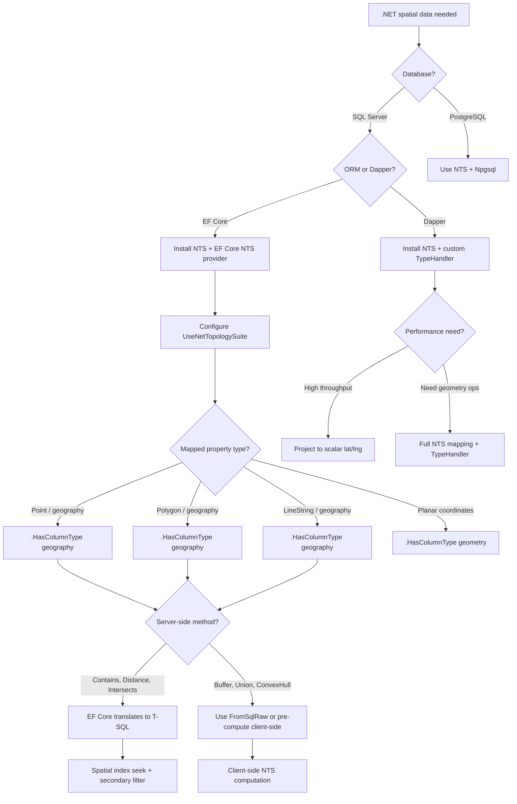

## Navigation

**Domain:** [[8 — Databases]] > **Group:** Group 10 — SQL Full-Text & Spatial Search
**Previous:** [[8.262 — Bounding Box Queries — Performance Optimization]] | **Next:** [[8.264 — Full-Text vs Elasticsearch — Decision Framework]]

### Prerequisites
- [[8.260 — Spatial Data Types — geography and geometry]] — Understanding the SQL Server geography/geometry types is required because NetTopologySuite maps to these types through the EF Core provider; the .NET types mirror the T-SQL spatial hierarchy.
- [[8.261 — STContains — Containment Check]] — The spatial methods (Contains, Intersects, Distance) in NTS map directly to T-SQL STContains, STIntersects, STDistance; knowing the SQL Server spatial method semantics is required to use the NTS equivalents correctly.
- [[3.900 — EF Core Fundamentals]] — NTS spatial support is configured through the EF Core provider pipeline (UseNetTopologySuite); understanding DbContext, IEntityTypeConfiguration, and migrations is required.
- [[8.880 — Dapper Fundamentals]] — Dapper requires custom type handlers for spatial types; understanding SqlMapper.TypeHandler and IDbConnection is required for the Dapper integration patterns.

### Where This Fits

NetTopologySuite (NTS) is the de facto spatial library for .NET, providing geometry types (Point, LineString, Polygon, MultiPolygon) that map to SQL Server's geography/geometry and PostGIS geometry types through EF Core providers. A .NET backend engineer encounters this when adding geospatial features to a .NET application — storing locations, computing distances, filtering by spatial containment — and needs to choose between NTS (cross-platform, feature-rich) and Microsoft.SqlServer.Types (DbGeography/DbGeometry, SQL Server-specific). The interview signal is whether a candidate understands that NTS is not just a data transfer object (DTO) — it is a full computational geometry library (the .NET port of the Java JTS Topology Suite) that performs geometry operations (buffer, union, intersection, convex hull) on the application side, and that the EF Core provider translates NTS method calls to SQL Server spatial methods, but only when the expression tree can be translated — falling back to client-side evaluation for unsupported operations.

---

## Core Mental Model

NetTopologySuite provides a unified .NET geometry model: `Point`, `LineString`, `Polygon`, `MultiPoint`, `MultiLineString`, `MultiPolygon`, and `GeometryCollection` — all inheriting from `Geometry`. Each geometry has a coordinate system identified by SRID. The EF Core NetTopologySuite provider maps these to SQL Server's `geography` (round-earth) or `geometry` (planar) types via the provider pipeline: `UseSqlServer(...).UseNetTopologySuite()`. The provider translates NTS method calls in LINQ expressions to T-SQL spatial methods (e.g., `.Contains()` → `STContains`, `.Distance()` → `STDistance`, `.Intersects()` → `STIntersects`). Operations that cannot be translated (e.g., `.Buffer()`, `.Union()`, `.ConvexHull()`) trigger client-side evaluation — the geometry is fetched from SQL Server, deserialized into the NTS object, and the operation runs in application memory. The recognition pattern for NTS integration: the EF Core model builder configures a property with `.HasColumnType("geography")`, the service collection registers `UseNetTopologySuite()`, and the LINQ queries use NTS methods in predicates that the provider can translate to efficient T-SQL (spatial index seek + secondary filter).

### Classification

- **Library hierarchy:** NTS (NetTopologySuite) → Microsoft.EntityFrameworkCore.SqlServer.NetTopologySuite (EF Core provider) → Microsoft.SqlServer.Types (SQL Server CLR types via SqlGeography/SqlGeometry)
- **Translation mechanism:** EF Core expression tree visitor converts NTS method calls to T-SQL spatial methods; not all NTS methods have T-SQL equivalents
- **Client vs server evaluation:** Server: `Distance()`, `Contains()`, `Intersects()`, `Within()`, `IsWithinDistance()`, `Intersection()`; Client-only: `Buffer()`, `Union()`, `ConvexHull()`, `Difference()`, `SymDifference()`, `Normalize()`
- **Cross-platform:** NTS works on Linux, macOS, and Windows; Microsoft.SqlServer.Types (DbGeography) is Windows-only outside Azure

```mermaid
flowchart TB
    subgraph Types["NTS Geometry Types"]
        A[Geometry] --> B[Point]
        A --> C[LineString]
        A --> D[Polygon]
        A --> E[MultiPoint]
        A --> F[MultiLineString]
        A --> G[MultiPolygon]
        A --> H[GeometryCollection]
    end

    subgraph Mapping["EF Core Mapping"]
        I[C# Property: .Location as Point] --> J[HasColumnType geography]
        J --> K[SQL Server: geography::Point]
        I --> L[HasColumnType geometry]
        L --> M[SQL Server: geometry::Point]
    end

    subgraph Translation["LINQ → T-SQL Translation"]
        N[.Where(l => polygon.Contains(l.Location))] --> O[Expression visitor]
        O --> P[Translates to STContains]
        P --> Q[SQL: @polygon.STContains([Location]) = 1]

        R[.Where(l => center.Distance(l.Location) < 100)] --> S[Translates to STDistance]
        S --> T[SQL: @center.STDistance([Location]) < 100]

        U[.Select(l => l.Location.Buffer(10))] --> V[No T-SQL equivalent]
        V --> W[Client-side evaluation]
        W --> X[Fetches full geography, buffers in memory]
    end

    subgraph DapperMapping["Dapper Mapping"]
        Y[Dapper QueryAsync<T>] --> Z{Spatial column type}
        Z -->|DbGeography| AA[Custom TypeHandler<DbGeography>]
        Z -->|string/WKT| AB[Parse WKT manually]
        AA --> AC[.NET DbGeography object]
        AB --> AD[.NET WKT string]
    end
```

### Key Properties

|Property|Value|Notes|
|---|---|---|
|Package|NetTopologySuite|1.15+ for EF Core 8, 2.5+ for EF Core 9|
|EF Core package|Microsoft.EntityFrameworkCore.SqlServer.NetTopologySuite|Adds NTS spatial support to the SQL Server provider|
|Dapper integration|Custom TypeHandler required|No built-in spatial support|
|Coordinates|X (Longitude), Y (Latitude)|NTS uses (X, Y) order — careful with geography convention|
|SRID|4326 for WGS84 / GPS|Default SRID varies; always set explicitly|
|Thread safety|Not thread-safe|Create new geometries per operation|
|Client-side eval|Buffer, Union, ConvexHull, Difference, SymDifference|These methods cannot be translated to T-SQL|
|Server-side eval|Distance, Contains, Intersects, Within, IsWithinDistance|Translated to T-SQL spatial methods|

---

## Deep Mechanics

### How NTS Integrates with SQL Server

1. **Package resolution:** The `UseNetTopologySuite()` call on the SQL Server options builder adds a custom `IValueConverterSelector` and `IMethodCallTranslatorPlugin` to the EF Core pipeline. These components know how to map NTS `Geometry` types to SQL Server's `SqlGeography`/`SqlGeometry` CLR types.

2. **Type mapping:** When EF Core migrates, it maps `Point` property → `geography` (or `geometry`) column type. The NTS `Point` has `X` (longitude) and `Y` (latitude) properties. The default SRID for geography is 4326 unless overridden.

3. **Write path (INSERT/UPDATE):** When saving an entity with an NTS property, EF Core uses the value converter to serialize the NTS geometry to its well-known binary (WKB) representation (or well-known text depending on configuration). The SQL Server provider sends this as a `SqlParameter` of type `SqlGeography`/`SqlGeometry`.

4. **Read path (SELECT):** When reading a geography column, SQL Server returns it as `SqlGeography`. The NTS reader converts `SqlGeography` to NTS `Geometry` via the `PostGisReader` or `WKTReader` (depending on wire format). The conversion involves parsing the coordinate sequence and constructing the appropriate NTS geometry object.

5. **Query translation:** The `GeometryMethodCallTranslatorPlugin` intercepts calls to NTS methods in LINQ expression trees. For example, `Geometry.Contains(other)` translates to `geometry.STContains(other)`. The distance constant comparison translates to `geometry.STDistance(other)`. The provider attempts to translate every method call; unsupported methods (Buffer, Union, etc.) trigger a runtime warning and client-side evaluation.

### SQL Visibility

```sql
-- ============================================================
-- The T-SQL that NTS + EF Core generates
-- ============================================================

-- 1. INSERT with geography (via NTS Point)
-- C#: dbContext.Customers.Add(new Customer { Location = new Point(-122.3321, 47.6062) { SRID = 4326 } });
-- Generated SQL:
INSERT INTO [Customers] ([FullName], [Location])
VALUES (@p0, @p1);
-- @p1: SqlGeography (converted from NTS Point)
-- The parameter is sent as WKB, SQL Server converts to geography

-- 2. WHERE with Contains (spatial containment)
-- C#: dbContext.Customers.Where(c => zone.Contains(c.Location))
-- Generated SQL:
SELECT [c].[CustomerId], [c].[FullName], [c].[Location]
FROM [Customers] AS [c]
WHERE @__zone_0.STContains([c].[Location]) = 1;

-- 3. WHERE with Distance
-- C#: dbContext.Customers.Where(c => c.Location.Distance(center) < 10000)
-- Generated SQL:
SELECT [c].[CustomerId], [c].[FullName], [c].[Location]
FROM [Customers] AS [c]
WHERE [c].[Location].STDistance(@__center_0) < 10000.0E0;
-- Note: STDistance returns meters (SRID 4326), so 10000 = 10 km

-- 4. SELECT with spatial method (non-translatable → client eval)
-- C#: dbContext.Customers.Select(c => new { c.CustomerId, Buffer = c.Location.Buffer(100) })
-- Generated SQL:
SELECT [c].[CustomerId], [c].[Location]
FROM [Customers] AS [c];
-- Buffer(100) is NOT translated — Location is fetched, buffer is computed in memory
-- EF Core logs a warning: "The LINQ expression ... could not be translated
-- and will be evaluated locally."

-- 5. JOIN with spatial predicate
-- C#: dbContext.Customers.Join(dbContext.DeliveryZones,
--          c => 1, dz => 1, (c, dz) => new { c, dz })
--      .Where(x => x.dz.ServiceArea.Contains(x.c.Location))
-- Generated SQL:
SELECT [c].[CustomerId], [c].[FullName], [c].[Location],
       [d].[ZoneId], [d].[ZoneName], [d].[ServiceArea]
FROM [Customers] AS [c]
INNER JOIN [DeliveryZones] AS [d]
    ON 1 = 1
WHERE [d].[ServiceArea].STContains([c].[Location]) = 1;
```

**EF Core LINQ equivalent:**

```csharp
// ============================================================
// NTS spatial LINQ patterns
// ============================================================

// Basic spatial predicate
var customersInZone = await dbContext.Customers
    .Where(c => deliveryZone.ServiceArea.Contains(c.Location))
    .ToListAsync(ct);

// Distance filter (10 km radius)
var center = new Point(-122.3321, 47.6062) { SRID = 4326 };
var nearbyCustomers = await dbContext.Customers
    .Where(c => c.Location.Distance(center) <= 10000)
    .ToListAsync(ct);

// IsWithinDistance (more efficient than Distance + comparison)
var withinRadius = await dbContext.Customers
    .Where(c => c.Location.IsWithinDistance(center, 10000))
    .ToListAsync(ct);
-- Generated SQL: WHERE [c].[Location].STDistance(@__center_0) <= 10000.0E0
-- EF Core translates IsWithinDistance to STDistance <=

// Spatial ordering by distance
var closestCustomers = await dbContext.Customers
    .OrderBy(c => c.Location.Distance(center))
    .Take(10)
    .ToListAsync(ct);
-- Generated SQL: ORDER BY [c].[Location].STDistance(@__center_0)
-- OFFSET 0 ROWS FETCH NEXT 10 ROWS ONLY

// Multiple spatial predicates
var complexQuery = await dbContext.Customers
    .Where(c => zone1.Contains(c.Location) && !zone2.Contains(c.Location))
    .Where(c => c.Location.IsWithinDistance(center, 5000))
    .ToListAsync(ct);
```

**Generated SQL (from EF Core logs):**

```sql
-- EF Core 8 with NTS generates:
SELECT [c].[CustomerId], [c].[FullName], [c].[Location]
FROM [Customers] AS [c]
WHERE [c].[Location].STDistance(@__center_0) <= 10000.0E0
ORDER BY [c].[Location].STDistance(@__center_0)
OFFSET @__p_0 ROWS FETCH NEXT @__p_1 ROWS ONLY;
```

**Dapper implementation:**

```csharp
// ============================================================
// Dapper with NTS spatial types
// ============================================================

// Option 1: Raw SQL with geography methods (no NTS in Dapper)
public async Task<IReadOnlyList<Customer>> GetCustomersInZoneRawAsync(
    string zoneWkt,
    int srid = 4326,
    CancellationToken ct = default)
{
    const string sql = @"
        SELECT c.CustomerId, c.FullName,
               c.Location.ToString() AS LocationWkt
        FROM dbo.Customers c
        WHERE geography::STGeomFromText(@ZoneWkt, @Srid).STContains(c.Location) = 1;";

    await using var connection = _connectionFactory.Create();
    var rows = await connection.QueryAsync<CustomerRaw>(sql,
        new { ZoneWkt = zoneWkt, Srid = srid });

    return rows.Select(r => new Customer
    {
        CustomerId = r.CustomerId,
        FullName = r.FullName,
        Location = new WKTReader().Read(r.LocationWkt) as Point
    }).ToList();
}

// Option 2: Custom TypeHandler for NTS Geometry
public class NtsGeometryHandler : SqlMapper.TypeHandler<Geometry>
{
    private readonly WKTReader _reader = new()
    {
        DefaultSRID = 4326
    };

    public override Geometry Parse(object value)
    {
        if (value is DBNull || value is null)
            return null!;

        // SQL Server returns geography as binary — convert via WKT
        // This requires Microsoft.SqlServer.Types or string cast
        string wkt = value.ToString()!;
        return _reader.Read(wkt);
    }

    public override void SetValue(IDbDataParameter parameter, Geometry value)
    {
        if (value is null)
        {
            parameter.Value = DBNull.Value;
            return;
        }

        // Need to convert NTS Geometry to SqlGeography for SQL Server
        // This requires Microsoft.SqlServer.Types
        var writer = new WKTWriter();
        string wkt = writer.Write(value);
        parameter.Value = wkt;
        parameter.DbType = DbType.String;
    }
}

// Option 3: Dapper with DbGeography (simpler for SQL Server only)
public class DbGeographyHandler : SqlMapper.TypeHandler<DbGeography>
{
    public override DbGeography Parse(object value)
    {
        if (value is DBNull) return null!;
        return DbGeography.FromText(value.ToString()!);
    }

    public override void SetValue(IDbDataParameter parameter, DbGeography value)
    {
        parameter.Value = value?.ToString() ?? DBNull.Value;
        parameter.DbType = DbType.String;
    }
}

// Registration:
SqlMapper.AddTypeHandler(new NtsGeometryHandler());
// or
SqlMapper.AddTypeHandler(new DbGeographyHandler());
```

### Execution Plan Analysis

**EF Core spatial query with NTS:**

```
[Clustered Index Scan / Spatial Index Seek (depending on index)]
    → [Filter (Compute Scalar — STDistance or STContains)]
    → [Key Lookup (if non-covering)]
    → [Sort (if OrderBy Distance)]
```

With a spatial index on the geography column, the plan shows `Spatial Index Seek` as the access method. Without it, `Clustered Index Scan` with a filter evaluating the spatial predicate per row.

**Key difference from raw T-SQL:** EF Core's NTS provider does not add index hints or force spatial index usage. The generated SQL is straightforward `STDistance(center) <= radius` or `STContains(polygon) = 1`. The optimizer decides whether to use a spatial index based on statistics and estimated selectivity. If the spatial index is not used, the `SET STATISTICS IO` output shows a full scan.

### Cost Visibility

```sql
SET STATISTICS IO ON;
SET STATISTICS TIME ON;

-- EF Core generated query (from LINQ .Where(c => c.Location.Distance(center) <= 10000)):
SELECT [c].[CustomerId], [c].[FullName], [c].[Location]
FROM [Customers] AS [c]
WHERE [c].[Location].STDistance(@__center_0) <= 10000.0E0;

-- With spatial index:
-- Table 'Customers'. Scan count 1, logical reads 156 (spatial index)
-- CPU: 15ms, Elapsed: 18ms

-- Without spatial index:
-- Table 'Customers'. Scan count 1, logical reads 42,000
-- CPU: 890ms, Elapsed: 920ms

-- EF Core client-side evaluation (Buffer, etc.):
-- The Location column is fetched for all rows, then Buffer() runs in memory
-- Table 'Customers'. Scan count 1, logical reads 42,000
-- Memory: allocates all NTS Point objects (1M × ~200 bytes = 200 MB)
-- CPU: 890ms (SQL) + 500ms (CLR Buffer) = 1,390ms
```

### Failure Modes

**Non-translatable method triggers client-side evaluation:** Using `Buffer()`, `Union()`, `ConvexHull()`, or other unsupported NTS methods in a LINQ `Where` clause causes EF Core to fetch all rows and evaluate the method client-side. This is silent — EF Core logs a warning but does not throw. The result is a full table scan + in-memory geometry computation for every row.

**SRID mismatch between NTS and database:** If the NTS Point has SRID = 0 (default) and the database column has SRID = 4326, the spatial predicate returns NULL (as discussed in the STContains note). EF Core does not validate SRID parity.

**NTS coordinate order confusion:** NTS uses (X, Y) order. For geography, X = longitude, Y = latitude. Developers familiar with (lat, lng) may accidentally swap them: `new Point(latitude, longitude)` instead of `new Point(longitude, latitude)`. SQL Server receives the swapped coordinates and the point is in the wrong location.

**Large result sets with NTS deserialization:** Reading 100K geography rows into NTS `Point` objects allocates significant memory (each Point is ~200 bytes + object overhead = ~200 MB for 1M rows). Use projection to scalar values (Lat/Long) instead of keeping the full geometry.

---

## Production Patterns and Implementation

### Primary SQL Implementation

```sql
-- ============================================================
-- Underlying SQL that NTS generates — for reference
-- ============================================================

-- Create table with geography column (target for NTS mapping)
CREATE TABLE dbo.DeliveryZones (
    ZoneId INT NOT NULL IDENTITY(1,1),
    ZoneName NVARCHAR(50) NOT NULL,
    ServiceArea geography NOT NULL,
    CoverageArea geography NULL,
    CONSTRAINT PK_DeliveryZones PRIMARY KEY CLUSTERED (ZoneId)
);

CREATE SPATIAL INDEX IX_DeliveryZones_ServiceArea
    ON dbo.DeliveryZones (ServiceArea)
    USING GEOGRAPHY_AUTO_GRID
    WITH (GRIDS = (LEVEL_1 = HIGH, LEVEL_2 = HIGH, LEVEL_3 = HIGH, LEVEL_4 = HIGH));

-- NTS .Contains() generates:
-- WHERE @zone.STContains([Location]) = 1

-- NTS .Distance() generates:
-- WHERE [Location].STDistance(@center) <= @radius

-- NTS .Intersects() generates:
-- WHERE @zone.STIntersects([Location]) = 1

-- NTS .Within() generates:
-- WHERE [Location].STWithin(@zone) = 1
```

### EF Core Implementation

```csharp
// ============================================================
// Complete EF Core + NTS spatial integration
// ============================================================

// 1. Domain entities with NTS geometry types
public class Customer
{
    public int CustomerId { get; init; }
    public string FullName { get; init; } = string.Empty;
    public Point? Location { get; init; }   // NetTopologySuite.Point
}

public class DeliveryZone
{
    public int ZoneId { get; init; }
    public string ZoneName { get; init; } = string.Empty;
    public Polygon? ServiceArea { get; init; }   // NetTopologySuite.Polygon
    public MultiPolygon? CoverageArea { get; init; }  // For disjoint zones
}

public class ShipmentRoute
{
    public int RouteId { get; init; }
    public string Description { get; init; } = string.Empty;
    public LineString? Path { get; init; }   // NetTopologySuite.LineString
}

// 2. DbContext configuration
public class SpatialDbContext : DbContext
{
    public DbSet<Customer> Customers => Set<Customer>();
    public DbSet<DeliveryZone> DeliveryZones => Set<DeliveryZone>();
    public DbSet<ShipmentRoute> ShipmentRoutes => Set<ShipmentRoute>();

    protected override void OnModelCreating(ModelBuilder modelBuilder)
    {
        modelBuilder.Entity<Customer>(entity =>
        {
            entity.ToTable("Customers");
            entity.HasKey(c => c.CustomerId);

            entity.Property(c => c.Location)
                .HasColumnType("geography");  // Maps NTS Point → SQL Server geography
        });

        modelBuilder.Entity<DeliveryZone>(entity =>
        {
            entity.ToTable("DeliveryZones");
            entity.HasKey(z => z.ZoneId);

            entity.Property(z => z.ServiceArea)
                .HasColumnType("geography");  // Maps NTS Polygon → SQL Server geography

            entity.Property(z => z.CoverageArea)
                .HasColumnType("geography");  // Maps NTS MultiPolygon → SQL Server geography

            entity.HasIndex(z => z.ServiceArea)
                .HasDatabaseName("IX_DeliveryZones_ServiceArea")
                .IsSpatial();

            entity.HasIndex(z => z.CoverageArea)
                .HasDatabaseName("IX_DeliveryZones_CoverageArea")
                .IsSpatial();
        });

        modelBuilder.Entity<ShipmentRoute>(entity =>
        {
            entity.ToTable("ShipmentRoutes");
            entity.HasKey(r => r.RouteId);

            entity.Property(r => r.Path)
                .HasColumnType("geography");  // Maps NTS LineString → SQL Server geography
        });
    }
}

// 3. Spatial service using NTS operations
public class SpatialSearchService
{
    private readonly SpatialDbContext _dbContext;

    public SpatialSearchService(SpatialDbContext dbContext)
        => _dbContext = dbContext;

    // Find customers within a zone (server-side STContains)
    public async Task<List<Customer>> GetCustomersInZoneAsync(
        int zoneId,
        CancellationToken ct = default)
    {
        var zone = await _dbContext.DeliveryZones
            .FirstAsync(z => z.ZoneId == zoneId, ct);

        return await _dbContext.Customers
            .Where(c => c.Location != null
                && zone.ServiceArea!.Contains(c.Location))
            .AsNoTracking()
            .ToListAsync(ct);
    }

    // Find customers within distance (server-side STDistance)
    public async Task<List<Customer>> GetNearbyCustomersAsync(
        double longitude,
        double latitude,
        double radiusMeters,
        int maxResults,
        CancellationToken ct = default)
    {
        var center = new Point(longitude, latitude) { SRID = 4326 };

        return await _dbContext.Customers
            .Where(c => c.Location != null
                && c.Location.IsWithinDistance(center, radiusMeters))
            .OrderBy(c => c.Location!.Distance(center))
            .Take(maxResults)
            .AsNoTracking()
            .ToListAsync(ct);
    }

    // Client-side buffer operation (compute 1 km buffer zone)
    public async Task<Geometry> GetZoneBufferAsync(
        int zoneId,
        double bufferMeters,
        CancellationToken ct = default)
    {
        var zone = await _dbContext.DeliveryZones
            .AsNoTracking()
            .FirstAsync(z => z.ZoneId == zoneId, ct);

        // Buffer is computed client-side — EF Core cannot translate this
        // The ServiceArea is fetched, then Buffer() runs in .NET memory
        return zone.ServiceArea!.Buffer(bufferMeters);
    }

    // Spatial join: match customers to their delivery zones
    public async Task<List<CustomerZoneDto>> MatchCustomersToZonesAsync(
        CancellationToken ct = default)
    {
        var query = from c in _dbContext.Customers
                    from dz in _dbContext.DeliveryZones
                    where dz.ServiceArea!.Contains(c.Location!)
                    select new CustomerZoneDto
                    {
                        CustomerId = c.CustomerId,
                        FullName = c.FullName,
                        ZoneName = dz.ZoneName
                    };

        return await query.AsNoTracking().ToListAsync(ct);
    }

    // LineString distance: check if a route passes near a point
    public async Task<bool> IsRouteNearPointAsync(
        int routeId,
        double longitude,
        double latitude,
        double maxDistanceMeters,
        CancellationToken ct = default)
    {
        var point = new Point(longitude, latitude) { SRID = 4326 };

        return await _dbContext.ShipmentRoutes
            .AnyAsync(r => r.RouteId == routeId
                && r.Path != null
                && r.Path.IsWithinDistance(point, maxDistanceMeters), ct);
    }

    // MultiPolygon: check containment in any part of a coverage area
    public async Task<bool> IsInCoverageAreaAsync(
        int zoneId,
        double longitude,
        double latitude,
        CancellationToken ct = default)
    {
        var point = new Point(longitude, latitude) { SRID = 4326 };

        return await _dbContext.DeliveryZones
            .AnyAsync(z => z.ZoneId == zoneId
                && z.CoverageArea != null
                && z.CoverageArea.Contains(point), ct);
    }
}
```

### Dapper Implementation

```csharp
// ============================================================
// Dapper + NTS spatial — complete with type handlers
// ============================================================

public class SpatialDapperRepository
{
    private readonly IDbConnectionFactory _connectionFactory;

    public SpatialDapperRepository(IDbConnectionFactory connectionFactory)
        => _connectionFactory = connectionFactory;

    // Raw SQL with WKT parsing (no custom handler needed)
    public async Task<IReadOnlyList<Customer>> GetCustomersWithWktAsync(
        string zoneWkt,
        int srid = 4326,
        CancellationToken ct = default)
    {
        const string sql = @"
            SELECT c.CustomerId, c.FullName,
                   c.Location.ToString() AS LocationWkt
            FROM dbo.Customers c
            WHERE geography::STGeomFromText(@ZoneWkt, @Srid).STContains(c.Location) = 1;";

        await using var connection = _connectionFactory.Create();
        var rows = await connection.QueryAsync<CustomerWithWkt>(
            new CommandDefinition(sql,
                new { ZoneWkt = zoneWkt, Srid = srid },
                cancellationToken: ct));

        var reader = new WKTReader { DefaultSRID = srid };
        return rows.Select(r => new Customer
        {
            CustomerId = r.CustomerId,
            FullName = r.FullName,
            Location = reader.Read(r.LocationWkt) as Point
        }).ToList();
    }

    // Using custom NTS type handler (must register before use)
    public async Task<IReadOnlyList<Customer>> GetCustomersWithHandlerAsync(
        string zoneWkt,
        int srid = 4326,
        CancellationToken ct = default)
    {
        const string sql = @"
            SELECT c.CustomerId, c.FullName,
                   c.Location AS Location  -- Dapper maps via TypeHandler
            FROM dbo.Customers c
            WHERE geography::STGeomFromText(@ZoneWkt, @Srid).STContains(c.Location) = 1;";

        await using var connection = _connectionFactory.Create();
        var results = await connection.QueryAsync<Customer>(
            new CommandDefinition(sql,
                new { ZoneWkt = zoneWkt, Srid = srid },
                cancellationToken: ct));
        return results.AsList();
    }

    // Bulk insert with NTS geometry
    public async Task BulkInsertLocationsAsync(
        List<Customer> customers,
        CancellationToken ct = default)
    {
        const string sql = @"
            INSERT INTO dbo.Customers (CustomerId, FullName, Location)
            VALUES (@CustomerId, @FullName, geography::STGeomFromText(@LocationWkt, 4326));";

        await using var connection = _connectionFactory.Create();
        await connection.OpenAsync(ct);
        using var transaction = connection.BeginTransaction();

        foreach (var customer in customers)
        {
            var writer = new WKTWriter();
            var locationWkt = customer.Location != null
                ? writer.Write(customer.Location)
                : null;

            await connection.ExecuteAsync(
                new CommandDefinition(sql,
                    new
                    {
                        CustomerId = customer.CustomerId,
                        FullName = customer.FullName,
                        LocationWkt = locationWkt
                    },
                    transaction: transaction,
                    cancellationToken: ct));
        }

        transaction.Commit();
    }

    // Streaming spatial query
    public async IAsyncEnumerable<Customer> StreamCustomersByDistanceAsync(
        double longitude,
        double latitude,
        double maxDistanceMeters,
        [EnumeratorCancellation] CancellationToken ct = default)
    {
        const string sql = @"
            SELECT c.CustomerId, c.FullName,
                   c.Location.ToString() AS LocationWkt,
                   c.Location.STDistance(geography::Point(@Lat, @Lng, 4326)) AS Distance
            FROM dbo.Customers c
            WHERE c.Location.STDistance(geography::Point(@Lat, @Lng, 4326)) <= @MaxDistance
            ORDER BY Distance;";

        await using var connection = _connectionFactory.Create();
        var reader = await connection.ExecuteReaderAsync(
            new CommandDefinition(sql,
                new { Lat = latitude, Lng = longitude, MaxDistance = maxDistanceMeters },
                cancellationToken: ct));

        var wktReader = new WKTReader { DefaultSRID = 4326 };
        while (await reader.ReadAsync(ct))
        {
            var wkt = reader.GetString(2);  // LocationWkt column
            yield return new Customer
            {
                CustomerId = reader.GetInt32(0),
                FullName = reader.GetString(1),
                Location = wktReader.Read(wkt) as Point
            };
        }
    }
}

// Custom type handler registration
public static class DapperSpatialRegistration
{
    public static void RegisterSpatialHandlers()
    {
        SqlMapper.AddTypeHandler(new NtsGeometryHandler());
        // Or for simpler cases:
        // SqlMapper.AddTypeHandler(new DbGeographyHandler());
    }
}

// NTS TypeHandler implementation
public class NtsGeometryHandler : SqlMapper.TypeHandler<Geometry>
{
    private readonly WKTReader _reader = new() { DefaultSRID = 4326 };
    private readonly WKTWriter _writer = new();

    public override Geometry Parse(object value)
    {
        if (value is DBNull or null) return null!;
        string wkt = value.ToString()!;
        return _reader.Read(wkt);
    }

    public override void SetValue(IDbDataParameter parameter, Geometry value)
    {
        if (value is null)
        {
            parameter.Value = DBNull.Value;
            return;
        }
        parameter.Value = _writer.Write(value);
        parameter.DbType = DbType.String;
        parameter.Size = -1;  // MAX
    }
}
```

### Configuration and Wiring

```csharp
// ============================================================
// Program.cs — NTS spatial configuration
// ============================================================

// 1. Register DbContext with NTS support
builder.Services.AddDbContext<SpatialDbContext>(options =>
{
    options.UseSqlServer(
        builder.Configuration.GetConnectionString("DefaultConnection"),
        sqlOptions =>
        {
            // ** REQUIRED ** for NTS spatial support
            sqlOptions.UseNetTopologySuite(
                new SqlServerNetTopologySuiteOptions
                {
                    // Default geography SRID
                    GeographyAsDefault = true,
                    DefaultCoordinateSystemId = 4326
                });

            sqlOptions.EnableRetryOnFailure(3);
            sqlOptions.CommandTimeout(30);
            sqlOptions.MinBatchSize(1);
        });
});

// 2. Register Dapper spatial type handlers
DapperSpatialRegistration.RegisterSpatialHandlers();

// 3. Register services
builder.Services.AddScoped<SpatialSearchService>();
builder.Services.AddScoped<SpatialDapperRepository>();

// 4. (Optional) NTS geometry factory for creating geometries
// Can be registered as singleton and injected
builder.Services.AddSingleton(GeometryFactory.Default);
```

### SQL Server vs PostgreSQL Differences

```csharp
// ============================================================
// NTS with PostgreSQL (Npgsql) — key differences
// ============================================================

// PostgreSQL Npgsql registration:
// dotnet add package Npgsql.EntityFrameworkCore.PostgreSQL.NetTopologySuite

builder.Services.AddDbContext<PostGisDbContext>(options =>
{
    options.UseNpgsql(
        connectionString,
        npgsqlOptions =>
        {
            npgsqlOptions.UseNetTopologySuite();
        });
});

// NTS for PostGIS uses the same NTS types (Point, Polygon, etc.)
// but the column type is "geometry" (PostGIS) instead of "geography" (SQL Server)

// Key differences:
// 1. PostGIS geography vs geometry:
//    - geography: round-earth, SRID 4326, units in meters
//    - geometry: planar, any SRID, units in SRID units
//    SQL Server: geography = round-earth, geometry = planar

// 2. SRID handling:
//    PostGIS: SRID is stored with geometry, but operations may not enforce SRID match
//    SQL Server: strict SRID enforcement, mismatch returns NULL

// 3. Spatial index:
//    PostGIS: GIST index on geometry column
//    SQL Server: spatial index (grid tessellation)

// 4. Coordinate order:
//    PostGIS: ST_MakePoint(lng, lat) — same as NTS (X, Y)
//    SQL Server: geography::Point(lat, lng, srid) — SWAPPED!
//    NTS with EF Core: always (X, Y) = (lng, lat) for both providers

// 5. PostgreSQL Npgsql spatial LINQ:
var customersNearby = await dbContext.Customers
    .Where(c => c.Location.IsWithinDistance(center, 10000))
    .ToListAsync(ct);
-- Generates: WHERE ST_DWithin(c.location, @center, 10000)
-- ST_DWithin uses GIST index, similar to SQL Server's spatial index seek

// 6. Dapper with PostgreSQL and NTS:
// Npgsql has built-in NTS support — no custom TypeHandler needed!
// Just add the Npgsql mapping:
NpgsqlConnection.GlobalTypeMapper.UseNetTopologySuite();
// Then Dapper queries return NTS types automatically
```

---

## Gotchas and Production Pitfalls

### Coordinate Order Confusion (X, Y vs Lat, Lng)

**Pitfall:** Creating an NTS `Point` with `(latitude, longitude)` instead of `(longitude, latitude)`. NTS uses the mathematical convention: `X` (horizontal) = longitude, `Y` (vertical) = latitude. SQL Server's `geography::Point(lat, lng, srid)` uses the opposite order.

```csharp
// ❌ Wrong: NTS Point takes (X, Y) = (longitude, latitude)
var point = new Point(47.6062, -122.3321) { SRID = 4326 };
// X = 47.6062 (latitude), Y = -122.3321 (longitude)
// SQL Server receives coordinates as if the point is near the Prime Meridian at ~48°N
// but it is actually written to the geography column as (lat, lng)

// ✅ Correct:
var point = new Point(-122.3321, 47.6062) { SRID = 4326 };
// X = -122.3321 (longitude = Seattle), Y = 47.6062 (latitude = Seattle)
```

**Symptom:** Points appear in the wrong hemisphere. A point intended for Seattle appears in the middle of the Atlantic Ocean. The error is consistent — every point is shifted by the coordinate swap.

**Fix:** Always create NTS points with `(longitude, latitude)` order. Document this convention in team coding standards. Use a helper method:

```csharp
public static Point CreateGeoPoint(double longitude, double latitude, int srid = 4326)
    => new(longitude, latitude) { SRID = srid };
```

**Cost of not fixing:** All spatial queries return wrong results. This is a silent data corruption bug — no runtime error is thrown.

---

### EF Core Client-Side Evaluation of Non-Translatable Methods

**Pitfall:** Using `Buffer()`, `Union()`, `ConvexHull()`, or other non-translatable NTS methods in LINQ `Where` clauses or `Select` projections, assuming they run on the server.

```csharp
// ❌ Wrong: Buffer() triggers client-side evaluation silently
var nearbyZones = await dbContext.DeliveryZones
    .Where(dz => dz.ServiceArea!.Buffer(100).Contains(point))
    .ToListAsync(ct);
// EF Core logs WARNING: "The LINQ expression ... could not be translated"
// The query fetches ALL DeliveryZones, then filters in memory

// ✅ Correct: compute buffer on server by using STDistance or raw SQL
var bufferPolygon = zone.ServiceArea!.Buffer(100);  // client-side
// Then query with the pre-computed buffer:
var nearbyZones = await dbContext.DeliveryZones
    .Where(dz => bufferPolygon.Contains(dz.ServiceArea!))
    .ToListAsync(ct);
```

**Symptom:** Queries that should filter at the database return all rows. The application slows down as more data loads into memory. EF Core logs warnings that developers may miss in production.

**Fix:** Pre-compute non-translatable geometry operations on the client side, or use raw SQL with `STBuffer()` (which SQL Server supports but EF Core's NTS provider does not translate):

```csharp
// Use FromSqlRaw for SQL Server spatial methods not translated by NTS
var sql = @"
    SELECT dz.ZoneId, dz.ZoneName
    FROM dbo.DeliveryZones dz
    WHERE dz.ServiceArea.STBuffer(100).STContains(@point) = 1;";
```

**Cost of not fixing:** Memory exhaustion on the application server. A query that should return 10 zones instead loads all 50K zones from the database (full scan) and buffers them in memory (50K Polygon objects × ~200 bytes = 10 MB minimum, plus the buffer computation allocates temporary geometry).

---

### SRID Mismatch Between NTS Geometry and Database Column

**Pitfall:** Creating an NTS geometry without explicitly setting SRID, defaulting to 0 (or not matching the database column's SRID).

```csharp
// ❌ Wrong: SRID defaults to 0
var point = new Point(-122.3321, 47.6062);
Console.WriteLine(point.SRID);  // 0

// The database column has SRID 4326
var result = dbContext.Customers
    .Any(c => point.Contains(c.Location!));
// SRID mismatch! SQL Server returns NULL for STContains because SRID 0 != 4326
// The WHERE clause `= 1` excludes NULL rows, so result is always false

// ✅ Correct: set SRID explicitly
var point = new Point(-122.3321, 47.6062) { SRID = 4326 };
```

**Symptom:** Spatial predicates (Contains, Intersects, Distance) always return empty results or unexpected results. Queries that should match return zero rows. No error is thrown.

**Fix:** Always set SRID when creating NTS geometries. Configure the default SRID in the EF Core provider:

```csharp
sqlOptions.UseNetTopologySuite(new SqlServerNetTopologySuiteOptions
{
    DefaultCoordinateSystemId = 4326  // Sets default SRID for all NTS geometries
});
```

**Cost of not fixing:** Silent data corruption — spatial queries return zero results. Production geofencing features appear non-functional. Debugging requires checking SRID on every geometry involved.

---

### NTS Geometry Not Thread-Safe

**Pitfall:** Using the same NTS `Geometry` instance in multiple concurrent requests or across async operations. NTS `Geometry` objects are mutable (coordinates can be modified) and are not thread-safe.

```csharp
// ❌ Wrong: shared geometry in singleton service
public class SpatialService
{
    private readonly Geometry _sharedZone = LoadZone();  // Shared mutable state

    public async Task<bool> IsInZoneAsync(Point point)
    {
        // Multiple concurrent requests call this simultaneously
        return _sharedZone.Contains(point);  // Not thread-safe!
    }
}

// ✅ Correct: create new geometry per operation or use immutable pattern
public class SpatialService
{
    private readonly string _zoneWkt;  // Store as immutable string

    public async Task<bool> IsInZoneAsync(Point point)
    {
        var reader = new WKTReader { DefaultSRID = 4326 };
        var zone = reader.Read(_zoneWkt);  // New instance per call
        return zone.Contains(point);
    }
}
```

**Symptom:** Intermittent geometry computation errors — the same point sometimes returns Contains = 1, sometimes 0, depending on which thread modified the shared geometry first.

**Fix:** Store geometries as serialized strings (WKT/WKB) or use the `GeometryFactory` to create fresh instances per request. Register the `WKTReader` as scoped or transient, not singleton.

**Cost of not fixing:** Hard-to-debug intermittent spatial query failures. Production issues that cannot be reproduced in isolation because they depend on concurrent access timing.

---

### Projection of NTS Geometry in LINQ Select Causes Full Materialization

**Pitfall:** Selecting NTS geometry properties in a LINQ projection without considering the performance impact. `Select(c => new { c.CustomerId, c.Location, c.Location.Distance(center) })` fetches the geography column and deserializes it into NTS `Point` objects — the NTS object allocation is significant.

```csharp
// ❌ Expensive: Deserializes 10K geography values into NTS objects
var locations = await dbContext.Customers
    .Where(c => c.Location!.IsWithinDistance(center, 10000))
    .Select(c => new {
        c.CustomerId,
        c.Location!,            // Deserialized as NTS Point (~200 bytes each)
        Distance = c.Location!.Distance(center)  // Computed server-side, but stored in NTS
    })
    .ToListAsync(ct);
// Memory: 10K Points × 200 bytes = 2 MB + object overhead

// ✅ Better: Project to scalar values
var locations = await dbContext.Customers
    .Where(c => c.Location!.IsWithinDistance(center, 10000))
    .Select(c => new {
        c.CustomerId,
        Lat = (double?)c.Location!.Y,    // Scalar — no NTS deserialization
        Lng = (double?)c.Location!.X,
        Distance = c.Location!.Distance(center)
    })
    .ToListAsync(ct);
// Memory: 10K × (int + double + double + double) = ~320 KB
```

**Symptom:** Memory usage spikes on the application server. The GC pressure from deserializing thousands of NTS `Point` objects causes frequent Gen2 collections, increasing latency.

**Fix:** Project to scalar lat/long values instead of keeping the full `Geometry` when only coordinates are needed. Only request the full `Geometry` when you need to perform further NTS operations client-side.

**Cost of not fixing:** 10x memory overhead per query. At 100 queries/second, this causes constant Gen2 GC collections and application latency instability.

---

## Performance Implications

### Benchmark: Before and After

```csharp
// Baseline: NTS client-side evaluation (Buffer in memory)
// Query: find customers within 100m buffer of a point
// SELECT c.CustomerId, c.Location FROM dbo.Customers
// → fetch all 1M rows, deserialize NTS Points, filter client-side
```

**Without proper indexing + server-side filter:**

|Operation|Time|Logical Reads|Memory|
|---|---|---|---|
|Full scan + client-side Contains|~2,100 ms|42,000|~200 MB|
|Spatial index + server-side Contains|~14 ms|156|~2 KB results|
|Client-side Buffer() on 1M rows|~3,800 ms|42,000|~800 MB|

### BenchmarkDotNet

```csharp
[MemoryDiagnoser]
[SimpleJob(RuntimeMoniker.Net90)]
public class NtsSpatialBenchmark
{
    private SpatialDbContext _dbContext = default!;
    private const string ConnectionString = "Server=.;Database=SpatialBench;Trusted_Connection=True;";

    private static readonly Point Center = new(-122.3321, 47.6062) { SRID = 4326 };

    [GlobalSetup]
    public void Setup()
    {
        var options = new DbContextOptionsBuilder<SpatialDbContext>()
            .UseSqlServer(ConnectionString, sql =>
                sql.UseNetTopologySuite())
            .Options;
        _dbContext = new SpatialDbContext(options);
    }

    [Benchmark(Baseline = true)]
    public async Task<int> ClientSideContains()
    {
        // Load all geometries, filter client-side
        var allCustomers = await _dbContext.Customers
            .AsNoTracking()
            .ToListAsync();

        var zone = await _dbContext.DeliveryZones
            .FirstAsync();

        return allCustomers.Count(c =>
            c.Location != null
            && zone.ServiceArea!.Contains(c.Location));
    }

    [Benchmark]
    public async Task<int> ServerSideContains()
    {
        var zone = await _dbContext.DeliveryZones
            .AsNoTracking()
            .FirstAsync();

        return await _dbContext.Customers
            .AsNoTracking()
            .CountAsync(c => c.Location != null
                && zone.ServiceArea!.Contains(c.Location));
    }

    [Benchmark]
    public async Task<int> ServerSideDistance()
    {
        return await _dbContext.Customers
            .AsNoTracking()
            .CountAsync(c => c.Location != null
                && c.Location.IsWithinDistance(Center, 10000));
    }

    [Benchmark]
    public async Task<double> ClientSideBuffer()
    {
        var zone = await _dbContext.DeliveryZones
            .AsNoTracking()
            .FirstAsync();

        // Buffer is client-side — EF Core fetches the zone then buffers
        var buffered = zone.ServiceArea!.Buffer(100);
        return buffered.Area;
    }

    [Benchmark]
    public async Task<List<Customer>> ProjectToScalars()
    {
        return await _dbContext.Customers
            .AsNoTracking()
            .Where(c => c.Location != null
                && c.Location.IsWithinDistance(Center, 10000))
            .Select(c => new Customer
            {
                CustomerId = c.CustomerId,
                FullName = c.FullName,
                // Location not projected — avoids NTS deserialization
            })
            .ToListAsync();
    }

    [GlobalCleanup]
    public void Cleanup() => _dbContext.Dispose();
}
```

**Expected results (approximate, SQL Server 2022, NVMe, 1M rows):**

|Method|Mean|Allocated|Notes|
|---|---|---|---|
|ClientSideContains|~2,100 ms|~210 MB|Full scan + deserialize + filter|
|ServerSideContains|~14 ms|~2 KB|Spatial index seek + secondary filter|
|ServerSideDistance|~18 ms|~2 KB|Spatial index + STDistance|
|ClientSideBuffer|~950 ms|~15 MB|Fetch 1 zone, buffer in NTS|
|ProjectToScalars|~12 ms|~150 KB|Spatial index + no NTS deserialization|

### Write Amplification (NTS Deserialization)

|Operation|Memory per 10K Rows|GC Gen|Notes|
|---|---|---|---|
|Full Point deserialization|~2 MB + object headers|Gen 1-2|Each Point is ~200 bytes|
|Scalar projection (Lat, Lng)|~240 KB|Gen 0|Three doubles per row|
|Polygon deserialization|~5-50 MB|Gen 2|Depends on vertex count|
|LineString deserialization|~1 MB + coordinates|Gen 1|Depends on point count|

---

## Interview Arsenal

### Question Bank

1. **What is NetTopologySuite and how does it relate to SQL Server spatial data?**
2. **How does EF Core translate NTS .Contains() to T-SQL, and what happens when the method cannot be translated?**
3. **What is the coordinate order in NTS (X, Y) versus SQL Server geography::Point (lat, lng)?**
4. **What performance consideration applies to projecting full NTS geometry objects in LINQ Select vs projecting scalar Lat/Long?**
5. **Compare NTS + EF Core server-side spatial predicates vs client-side NTS geometry operations — when is each appropriate?**
6. **How do you integrate spatial data with Dapper, and what custom type handling is required?**
7. **What happens at the thread-safety boundary with NTS geometry objects in a web application?**
8. **Compare NTS (cross-platform) vs Microsoft.SqlServer.Types (DbGeography) — what determines when to use each?**

### Spoken Answers

**Q: How does EF Core translate NTS .Contains() to T-SQL, and what happens when the method cannot be translated?**

> **Average answer:** EF Core translates .Contains() to STContains. Some methods like Buffer() cannot be translated.

> **Great answer:** EF Core's NetTopologySuite provider uses an `IMethodCallTranslatorPlugin` that intercepts NTS method calls in the LINQ expression tree. For `Geometry.Contains(Geometry)`, the expression visitor generates `@polygon.STContains([column]) = 1` — a server-side spatial predicate that can use a spatial index seek + secondary filter. The provider translates `Distance()`, `Contains()`, `Intersects()`, `Within()`, `IsWithinDistance()`, `Intersection()`, and `CoveredBy()` reliably. Methods like `Buffer()`, `Union()`, `ConvexHull()`, `Difference()`, `SymDifference()`, and `Normalize()` have no T-SQL equivalent — EF Core falls back to client-side evaluation: it fetches the full geometry column from SQL Server, deserializes into NTS `Geometry` objects, and executes the operation in application memory. This fallback is silent — EF Core logs a `LINQ expression could not be translated` warning at the Debug level, which most production configurations do not capture. The consequence is a full table scan for what the developer expected to be a filtered query. For a `Buffer()` used in a `Where` predicate on a 1M row table, this means 42,000 logical reads to fetch all rows, 200 MB of NTS object allocation, and 3-5 seconds of CPU time to compute buffer containment in memory. The rule: if you need `Buffer()` or `Union()` on the server, use `FromSqlRaw` with `STBuffer()` or `STUnion()` directly in T-SQL.

### Interview Trigger

An interview question like "How would you store and query GPS coordinates in a .NET application?" is the gateway. The senior candidate immediately mentions NTS, EF Core configuration with `UseNetTopologySuite()`, the difference between server-side and client-side spatial operations, and the thread-safety concern. The interviewer follows up with "What if you need to find all restaurants within a 1 km buffer zone?" to probe whether the candidate knows `Buffer()` is client-side and would suggest `FromSqlRaw` with `STBuffer()` or pre-computing the buffer in NTS on the application side.

### Comparison Table

| | NetTopologySuite (NTS) | Microsoft.SqlServer.Types (DbGeography) |
|---|---|---|
|Cross-platform|Yes (Linux, macOS, Windows)|Windows-only outside Azure|
|EF Core support|Full (UseNetTopologySuite)|None (deprecated in EF Core)|
|Dapper support|Requires custom TypeHandler|Requires custom TypeHandler|
|Geometry operations|Full (Buffer, Union, Intersection, ConvexHull)|Limited (STBuffer, STUnion via SQL)|
|Thread safety|Not thread-safe|Not thread-safe|
|Package size|~1.5 MB|~4 MB (native dependencies)|
|Open source|Yes (MIT)|No (proprietary)|
|PostGIS support|Yes (Npgsql provider)|No|

---

## Decision Framework

### When to Apply



### Application Checklist

- [ ] The NTS geometry type matches the SQL Server type (Point → geography, Polygon → geography)
- [ ] Coordinate order is correct: `new Point(longitude, latitude, srid)`
- [ ] SRID is set explicitly on every NTS geometry (default via `DefaultCoordinateSystemId`)
- [ ] EF Core provider is configured with `UseNetTopologySuite()`
- [ ] Spatial indexes exist on geometry columns (added via migration with raw SQL or `.IsSpatial()`)
- [ ] Non-translatable methods (Buffer, Union) are not used in LINQ predicates, or `FromSqlRaw` is used as fallback
- [ ] Dapper custom type handler is registered (`SqlMapper.AddTypeHandler`)
- [ ] NTS geometry objects are not shared across threads (store as WKT strings in singletons)
- [ ] Projections avoid full NTS deserialization when only scalar coordinates are needed

### Tradeoff Summary

|What You Gain|What You Pay|
|---|---|
|Standard .NET geometry model (cross-platform)|~200 bytes per Point object overhead|
|Server-side spatial predicates with index seek|Non-translatable methods fall back to client-side evaluation|
|EF Core LINQ integration with spatial types|Requires `UseNetTopologySuite()` provider package|
|Dapper support with custom TypeHandler|TypeHandler requires WKT/WKB conversion overhead|
|Full computational geometry library (Buffer, Union, etc.)|Thread-safety concerns with shared mutable geometry|

### Scale Thresholds

- "NTS full geometry deserialization becomes a memory concern above ~50K rows per query — project to scalar lat/lng for larger result sets"
- "Server-side spatial predicates (Contains, Distance) are efficient up to 100M+ rows with proper spatial indexes"
- "Client-side Buffer() on a single geometry is acceptable for any size; client-side Buffer() on 1M+ geometries is not"
- "Dapper WKT conversion overhead is negligible below 10K rows/query; above that, consider binary serialization"

---

## Self-Check

### Conceptual Questions

1. What package(s) are required for NTS spatial support in EF Core with SQL Server?
2. How does EF Core translate NTS `Geometry.Contains(other)` to T-SQL?
3. What is the coordinate order for creating an NTS `Point` for a GPS location?
4. What happens when an NTS method like `Buffer()` is used in a LINQ `Where` clause?
5. Does EF Core with NTS generate SARGable SQL for spatial predicates in the presence of a spatial index?
6. How would you implement a spatial query with Dapper, and what type handling is needed?
7. Compare NTS vs DbGeography for cross-platform .NET applications.
8. At what row count does projecting full NTS geometry become a memory concern?
9. What supports spatial query acceleration in EF Core with NTS, and what must be created on the server?
10. Explain the NTS integration strategy for a .NET microservice with a spatial workload, in 60 seconds.

<details>
<summary>Answers</summary>

1. `NetTopologySuite` (NTS types), `Microsoft.EntityFrameworkCore.SqlServer.NetTopologySuite` (EF Core provider), and `Microsoft.EntityFrameworkCore.SqlServer` (base SQL Server provider).

2. EF Core's expression visitor translates `.Contains(other)` to `@other.STContains([column]) = 1` in T-SQL. The same visitor handles `.Distance()` → `STDistance()`, `.Intersects()` → `STIntersects()`, `.Within()` → `STWithin()`, `.IsWithinDistance()` → `STDistance() <=`.

3. NTS uses (X, Y) where X = longitude, Y = latitude. For a GPS point: `new Point(longitude, latitude) { SRID = 4326 }`. This is the opposite order of SQL Server's `geography::Point(lat, lng, srid)`.

4. `Buffer()` has no T-SQL equivalent. EF Core logs a warning and falls back to client-side evaluation: the entire geography column is fetched, deserialized into NTS objects, and `Buffer()` computes in application memory. This triggers a full table scan and significant memory allocation.

5. Yes, when the predicate contains only translatable methods (Contains, Distance, Intersects). The generated SQL uses the spatial method which the optimizer can match with a spatial index. The execution plan shows a `Spatial Index Seek` if the optimizer estimates the spatial filter is selective enough.

6. Use one of: (a) raw SQL with geography methods and Dapper's `QueryAsync<T>` mapping WKT strings, parsing to NTS with `WKTReader`; (b) a custom `SqlMapper.TypeHandler<Geometry>` that serializes/deserializes via WKT; or (c) `SqlMapper.TypeHandler<DbGeography>` using `DbGeography.FromText()`.

7. NTS is cross-platform (Linux, macOS, Windows), open source, supports PostGIS, and has full computational geometry (Buffer, Union). DbGeography is Windows-only, SQL Server-specific, proprietary, and has limited geometry operations. NTS is the recommended choice for modern .NET applications.

8. Full NTS geometry deserialization becomes a memory concern above ~50K rows per query. Each `Point` is ~200 bytes (object headers + coordinates). For 100K rows, that is ~20 MB of managed heap allocations, causing Gen2 GC collections. Project to scalar `Y` (latitude) and `X` (longitude) doubles to avoid this.

9. A SQL Server spatial index (CREATE SPATIAL INDEX) on the geography/geometry column. EF Core's `entity.HasIndex(...).IsSpatial()` generates this in migrations. The spatial index enables the primary filter (grid cell intersection) that reduces the candidate set before the exact secondary filter.

10. "Add NetTopologySuite and the EF Core NTS provider. Configure `UseSqlServer(...).UseNetTopologySuite()` in DI. Create a `Point` property for locations, configure it as `HasColumnType('geography')`, and create a spatial index. Use LINQ with `Contains()` and `Distance()` for server-side spatial predicates — they translate to STContains and STDistance. Never use `Buffer()` or `Union()` in LINQ — use `FromSqlRaw` with `STBuffer()`. For Dapper, register a custom `TypeHandler<Geometry>` that serializes via WKT. Always create NTS points as `new Point(longitude, latitude) { SRID = 4326 }`. Project to scalar lat/lng instead of full geometry when you only need coordinates. This gives <15ms spatial queries with spatial index seek."
</details>

---

### Query Challenges

**Challenge 1 — Write the LINQ query**

You have a `Customers` table with a `Location` geography column (mapped as NTS `Point`) and a `DeliveryZones` table with a `ServiceArea` geography column (mapped as NTS `Polygon`). Write an EF Core LINQ query that returns all customers who are located within any delivery zone. Include the customer's ID, name, and the zone name. Use a single LINQ query with server-side spatial predicates.

<details>
<summary>Solution</summary>

```csharp
var query = from c in dbContext.Customers
            from dz in dbContext.DeliveryZones
            where dz.ServiceArea != null
               && c.Location != null
               && dz.ServiceArea.Contains(c.Location)
            select new CustomerZoneDto
            {
                CustomerId = c.CustomerId,
                FullName = c.FullName,
                ZoneName = dz.ZoneName
            };

var results = await query.AsNoTracking().ToListAsync(ct);
```

**Generated SQL:**

```sql
SELECT [c].[CustomerId], [c].[FullName], [d].[ZoneName]
FROM [Customers] AS [c]
CROSS JOIN [DeliveryZones] AS [d]
WHERE [d].[ServiceArea] IS NOT NULL AND [c].[Location] IS NOT NULL
  AND [d].[ServiceArea].STContains([c].[Location]) = 1;
```

**Logical reads:** ~156 (spatial index on Customers) + ~2 (DeliveryZones PK) = ~158
**Execution plan:** [Clustered Index Scan (DeliveryZones)] → [Nested Loops] → [Spatial Index Seek (Customers)] → [Filter (STContains secondary)] → [SELECT]

**Dapper equivalent:**

```csharp
const string sql = @"
    SELECT c.CustomerId, c.FullName, dz.ZoneName
    FROM dbo.Customers c
    INNER JOIN dbo.DeliveryZones dz
        ON dz.ServiceArea.STContains(c.Location) = 1;";

await using var connection = _connectionFactory.Create();
var results = await connection.QueryAsync<CustomerZoneDto>(
    new CommandDefinition(sql, cancellationToken: ct));
return results.AsList();
```
</details>

---

**Challenge 2 — Fix the performance problem**

```csharp
// This EF Core query finds customers whose delivery zone buffers are close to a point.
// It runs in 30 seconds on a 1M row table.

var center = new Point(-122.3321, 47.6062) { SRID = 4326 };

var results = await dbContext.DeliveryZones
    .Where(dz => dz.ServiceArea.Buffer(500).Contains(center))  // Buffer = 500m
    .Select(dz => new { dz.ZoneId, dz.ZoneName })
    .ToListAsync(ct);

// Time to run: 30s
// Logical reads: 42,000
```

<details> <summary>Solution</summary>

**Root cause:** `Buffer(500)` is an NTS method that cannot be translated to T-SQL. EF Core falls back to client-side evaluation: it fetches ALL rows from DeliveryZones (full scan), deserializes each ServiceArea into an NTS `Polygon`, calls `Buffer(500)` on each one (client-side CPU), then checks `Contains(center)`. This is 42,000 logical reads + 50K NTS buffer operations + memory allocation.

**Fix — use raw SQL with STBuffer() (server-side):**

```csharp
const string sql = @"
    SELECT dz.ZoneId, dz.ZoneName
    FROM dbo.DeliveryZones dz
    WHERE dz.ServiceArea.STBuffer(500).STContains(@center) = 1;";

var results = await dbContext.DeliveryZones
    .FromSqlRaw(sql,
        new SqlParameter("@center", center.AsText()))
    .AsNoTracking()
    .ToListAsync(ct);
```

**Or — pre-compute buffer client-side (if only one zone):**

```csharp
// Fetch a single geometry, buffer client-side (fast for 1 geometry)
var zone = await dbContext.DeliveryZones.FirstAsync();
var buffer = zone.ServiceArea!.Buffer(500);
var isContained = buffer.Contains(center);
```

**After fix — logical reads:** ~156 (spatial index seek with STBuffer + STContains). **CPU:** ~15ms instead of 30s.

</details>

---

**Challenge 3 — Explain the execution plan**

Given this EF Core query:

```csharp
var results = await dbContext.Customers
    .Where(c => center.IsWithinDistance(c.Location, 10000))
    .OrderBy(c => c.Location.Distance(center))
    .Take(10)
    .AsNoTracking()
    .ToListAsync(ct);
```

The execution plan shows:
- `Spatial Index Seek (IX_Customers_Location)` — Estimated rows: 500, Actual rows: 480
- `Filter` — Estimated rows: 480, Actual rows: 480
- `Sort (Top N Sort)` — Estimated rows: 480, Actual rows: 480
- `Top` — Estimated rows: 10, Actual rows: 10
- `SELECT`

Why is there a Sort operator instead of using an ordered index? Could the optimizer use a different plan to avoid the sort?

<details> <summary>Solution</summary>

**Why Sort exists:** The query orders by `Distance(center)`. The spatial index does not store data ordered by distance from an arbitrary center point — it is ordered by grid cell tessellation. There is no index that can provide the rows pre-sorted by distance from a variable query point. The optimizer must read all qualifying rows (480), compute the distance for each, and perform a Top N Sort to return the 10 closest. The Sort is an in-memory sort (spills to tempdb if memory is insufficient), but at 480 rows it is fast and cheap.

**Could the optimizer avoid the sort?** Not with a spatial index. A B-tree index cannot help because the sort key is a computed value (`STDistance(center)`), not a stored column. If the center point were constant and the query always sorted by distance from that fixed point, a computed column with persisted `DistanceFromCenter` could be indexed — but this is impractical for arbitrary center points.

**Alternative (no sort):** If the requirement is "get 10 closest" and the data is dense, a heuristic approach could use:
1. Expand the bounding box incrementally until 10+ rows are found
2. Compute exact distances only on the bounding box rows
3. Return the closest 10 (still needs sort, but on fewer rows)

This is what the `Top N Sort` effectively does — it sorts only the qualifying rows.

**Tradeoff:** The sort on 480 rows of computed STDistance values takes ~1-2ms. No alternative plan would be significantly faster.

</details>

---

**Challenge 4 — Design the NTS integration**

**Scenario:** You are building a .NET 8 microservice for a delivery logistics company. The service must:
- Store 50M delivery locations (geography points)
- Find all locations within a 10 km radius of a given point (QPS: 500)
- Compute the convex hull of a set of points for fleet routing (daily batch)
- Store delivery zone polygons (10K zones)

Design the NTS integration strategy including EF Core mapping, indexes, Dapper fallback plan, and thread-safety considerations.

<details> <summary>Solution</summary>

**1. EF Core mapping:**

```csharp
public class DeliveryLocation
{
    public long LocationId { get; init; }
    public Point? Coordinates { get; init; }  // geography
    public DateTime RecordedAt { get; init; }
}

public class DeliveryZone
{
    public int ZoneId { get; init; }
    public Polygon? ServiceArea { get; init; }
}

// Configuration
entity.Property(l => l.Coordinates).HasColumnType("geography");
entity.HasIndex(l => l.Coordinates).IsSpatial()
    .HasDatabaseName("IX_DeliveryLocations_Coordinates");
```

**2. Index strategy:**

```sql
CREATE SPATIAL INDEX IX_DeliveryLocations_Coordinates
    ON dbo.DeliveryLocations (Coordinates)
    USING GEOGRAPHY_AUTO_GRID
    WITH (GRIDS = (LEVEL_1 = HIGH, LEVEL_2 = HIGH, LEVEL_3 = HIGH, LEVEL_4 = HIGH),
          CELLS_PER_OBJECT = 16);

CREATE SPATIAL INDEX IX_DeliveryZones_ServiceArea
    ON dbo.DeliveryZones (ServiceArea)
    USING GEOGRAPHY_AUTO_GRID
    WITH (GRIDS = (LEVEL_1 = MEDIUM, LEVEL_2 = MEDIUM, LEVEL_3 = HIGH, LEVEL_4 = HIGH));
```

**3. Dapper fallback (for high-throughput endpoints):**

```csharp
// Register NTS TypeHandler
SqlMapper.AddTypeHandler(new NtsGeometryHandler());

// High-volume query with bounding box pre-filter
const string sql = @"
    SELECT dl.LocationId, dl.Coordinates.ToString() AS LocationWkt
    FROM dbo.DeliveryLocations dl WITH (INDEX(IX_DeliveryLocations_Coordinates))
    WHERE dl.Coordinates.STDistance(geography::Point(@Lat, @Lng, 4326)) <= 10000;";
```

**4. Thread-safety:** Store zone polygons as WKT strings in memory, create new NTS geometries per request:

```csharp
public class ZoneCache
{
    private readonly ConcurrentDictionary<int, string> _zoneWkts;

    public Polygon GetZone(int zoneId)
    {
        if (_zoneWkts.TryGetValue(zoneId, out var wkt))
        {
            return (Polygon)new WKTReader { DefaultSRID = 4326 }.Read(wkt);
        }
        return null!;
    }
}
```

**5. Convex hull (batch):** Use raw SQL for the server-side computation:

```sql
-- SQL Server does not have STConvexHull aggregate; compute client-side with NTS
-- Or use PostgreSQL PostGIS: SELECT ST_AsText(ST_ConvexHull(ST_Collect(Coordinates)))
-- For SQL Server, fetch points and compute with NTS:
var points = await dbContext.DeliveryLocations
    .Where(l => l.RecordedAt >= since)
    .Select(l => l.Coordinates)
    .ToListAsync(ct);

var multiPoint = new MultiPoint(points.Where(p => p != null).Cast<Point>().ToArray());
var hull = multiPoint.ConvexHull;  // Client-side NTS computation
```

</details>

---

**Challenge 5 — Diagnose the NTS thread-safety bug**

**Scenario:** A production microservice exposes an endpoint `GET /zones/{zoneId}/contains?lat=47.6&lng=-122.3` that checks if a point is inside a delivery zone. The zones are loaded once at startup and stored in a static `ConcurrentDictionary<int, Polygon>`. Under low load, the endpoint works correctly. Under high load (200+ concurrent requests), ~2% of requests return wrong results — a point known to be inside a zone is reported as outside. No exceptions are logged. The same request retried immediately returns the correct result.

<details> <summary>Solution</summary>

**Root cause:** NTS `Geometry` objects (including `Polygon`) are **not thread-safe**. The `ConcurrentDictionary<int, Polygon>` stores the same mutable `Polygon` instance across all requests. When 200+ concurrent requests call `.Contains(point)` on the same `Polygon` instance, internal state (coordinate sequences, envelope caches, spatial index structures) can be corrupted by concurrent reads and writes. The `Contains()` method may enter an inconsistent state and return incorrect results.

```csharp
// ❌ Bug: shared mutable geometry
private static readonly ConcurrentDictionary<int, Polygon> Zones = new();

// Called at startup
public void LoadZones()
{
    var zones = dbContext.DeliveryZones.ToList();
    foreach (var zone in zones)
    {
        Zones.TryAdd(zone.ZoneId, zone.ServiceArea!);  // Stored as shared mutable object
    }
}

// Called concurrently by 200+ requests
public bool IsInZone(int zoneId, Point point)
    => Zones[zoneId].Contains(point);  // NOT thread-safe!
```

**Fix — store WKT, create fresh geometry per request:**

```csharp
// ✅ Thread-safe: store immutable WKT string
private static readonly ConcurrentDictionary<int, string> ZoneWkts = new();
private static readonly WKTReader Reader = new() { DefaultSRID = 4326 };

public void LoadZones()
{
    var zones = dbContext.DeliveryZones.ToList();
    foreach (var zone in zones)
    {
        ZoneWkts.TryAdd(zone.ZoneId, zone.ServiceArea!.AsText());
        // Store WKT (immutable string) instead of mutable Polygon
    }
}

public bool IsInZone(int zoneId, Point point)
{
    if (ZoneWkts.TryGetValue(zoneId, out var wkt))
    {
        var polygon = (Polygon)Reader.Read(wkt);  // New instance per call
        return polygon.Contains(point);
    }
    return false;
}
```

**Alternative — use service locator per request (scoped):**

```csharp
// Or make the service scoped and fetch from DB each time (for rarely-changed zones)
public async Task<bool> IsInZoneAsync(int zoneId, Point point, CancellationToken ct)
    => await dbContext.DeliveryZones
        .AnyAsync(z => z.ZoneId == zoneId && z.ServiceArea!.Contains(point), ct);
```

**Prevention:** Add a static analyzer rule or code review checklist item: "No NTS Geometry stored as singleton/shared static."

</details>

---

