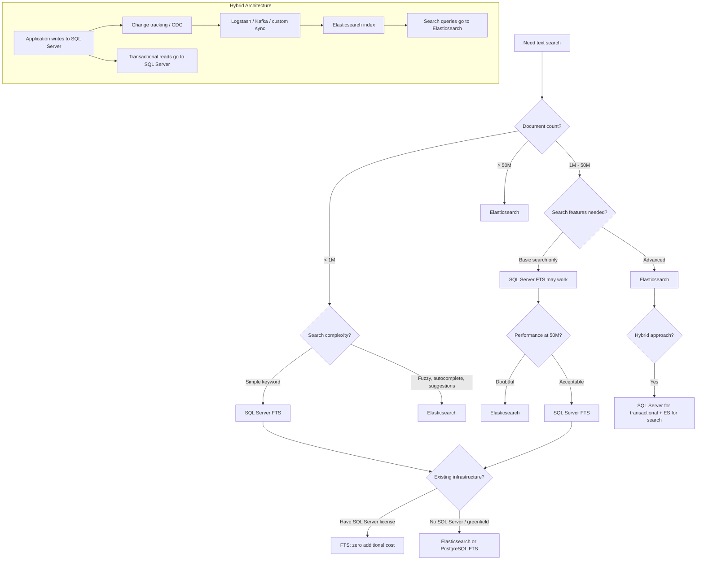

## Navigation

**Domain:** [[8 — Databases]] > **Group:** Group 10 — SQL Full-Text & Spatial Search
**Previous:** [[8.263 — Spatial Data in .NET — NetTopologySuite]] | **Next:** [[8.265 — PostgreSQL Full-Text Search — tsvector and tsquery]]

### Prerequisites
- [[8.010 — Execution Plan Analysis]] — SQL Server FTS queries have different execution plan operators (Stream Aggregate for word breaking, Table Valued Function for FullTextContains) that must be analyzed differently from standard B-tree plans.
- [[8.050 — Indexing for Query Performance]] — Full-text indexes are inverted indexes, not B-trees; understanding the storage structure difference is required to reason about FTS performance characteristics.
- [[7.010 — System Design Fundamentals]] — Choosing between FTS and Elasticsearch is a system design decision involving infrastructure cost, operational complexity, data volume, and search feature requirements.

### Where This Fits

SQL Server Full-Text Search (FTS) and Elasticsearch serve the same fundamental need — fast keyword search over text — but differ in infrastructure requirements, search feature depth, operational complexity, and cost profile. A .NET backend engineer encounters this decision when building a new search feature: "Should we use SQL Server FTS (adds no new infrastructure, simple to set up, limited features) or Elasticsearch (requires cluster, more features, more operations)?" The interview signal is whether a candidate can enumerate the tradeoffs across seven dimensions: feature support (fuzzy search, autocomplete, synonyms, relevance scoring), data volume scalability, infrastructure cost, operational complexity, latency characteristics, consistency requirements, and the .NET client library ecosystem (EF Core/ Dapper vs NEST/ Elasticsearch.Net).

---

## Core Mental Model

SQL Server Full-Text Search and Elasticsearch both implement inverted indexes for text search, but at fundamentally different scales and with different feature depths. An inverted index maps each distinct word (token) to the set of documents (rows) that contain it. SQL Server FTS builds this index as a structure stored in the `sys.fulltext_indexes` catalog, using a Windows Full-Text Engine (FDHost.exe) process that runs outside SQL Server but is managed by it. Elasticsearch builds the inverted index in Lucene (Java library), distributed across a cluster with sharding and replication. The invariant is: both reduce "find documents containing word X" from O(N * word_count) (LIKE scan) to O(log V) (inverted index lookup on term V). The five decisive factors for choice are: (1) fuzzy/typo tolerance — Elasticsearch supports it natively, SQL Server FTS does not; (2) infrastructure — SQL Server FTS is free with the database license, Elasticsearch requires servers and ops; (3) data volume — Elasticsearch scales to billions of documents with sub-second search; SQL Server FTS becomes slow above ~50M documents; (4) real-time indexing — Elasticsearch indexes near-instantly (1-second refresh), SQL Server FTS has a background crawl that can lag minutes; (5) scoring — Elasticsearch uses TF-IDF/BM25 with configurable boosting, SQL Server FTS uses a simpler ranking model with ISABOUT and CONTAINSTABLE ranking.

### Classification

- **Search engine type:** SQL Server FTS = embedded relational search; Elasticsearch = dedicated distributed search
- **Index structure:** Both use inverted index (term → document mapping)
- **Real-time index:** Elasticsearch: near-real-time (1-second refresh); SQL Server FTS: crawl-based (change tracking + background population)
- **Query language:** SQL Server FTS: CONTAINS, FREETEXT, CONTAINSTABLE, FREETEXTTABLE; Elasticsearch: Query DSL (JSON) over REST API
- **.NET client:** SQL Server FTS: EF.Functions.Contains, Dapper raw SQL; Elasticsearch: NEST (high-level), Elasticsearch.Net (low-level)

```mermaid
flowchart TB
    subgraph FTS["SQL Server Full-Text Search"]
        A[INSERT/UPDATE table] --> B[Change tracking marks rows]
        B --> C[Full-text crawl (background)]
        C --> D[Word breaker tokenizes text]
        D --> E[Inverted index in full-text catalog]
        E --> F[CONTAINS query]
        F --> G[FullTextContains TVF operator]
        G --> H[Stream Aggregate for ranking]
    end

    subgraph ES["Elasticsearch"]
        I[Index document via REST] --> J[Lucene analyzes text]
        J --> K[Inverted index in shard]
        K --> L[Segment flush (1s refresh)]
        L --> M[Query DSL request]
        M --> N[Distributed search across shards]
        N --> O[Coordinating node merges results]
        O --> P[BM25 scoring + rescore]
    end

    subgraph Decision["Decision Factors"]
        Q[Data volume] --> R{> 50M documents?}
        R -->|Yes| S[Elasticsearch]
        R -->|No| T{Fuzzy search needed?}
        T -->|Yes| U[Elasticsearch]
        T -->|No| V{Existing SQL license?}
        V -->|Yes| W[FTS may suffice]
        V -->|No| X[Elasticsearch or PostgreSQL FTS]
    end

    subgraph .NET["Client Libraries"]
        Y[EF Core FTS: EF.Functions.Contains]
        Z[Dapper FTS: raw CONTAINS SQL]
        AA[NEST: high-level ES client]
        AB[Elasticsearch.Net: low-level]
    end
```

### Key Properties

|Property|SQL Server FTS|Elasticsearch|
|---|---|---|
|Index type|Inverted index (crawl-based)|Inverted index (Lucene, near-real-time)|
|Fuzzy search|No|Yes (Levenshtein automaton)|
|Autocomplete|No|Yes (Completion suggester, edge n-grams)|
|Synonym support|Yes (thesaurus file)|Yes (synonym token filter)|
|Ranking model|ISABOUT weighting, rank table|TF-IDF / BM25 with function scoring|
|Stemming|Language-specific word breakers|Language-specific analyzers (Snowball, etc.)|
|Data volume limit|~50M documents practical|Billions (cluster depends on shard count)|
|Real-time indexing|Seconds to minutes|~1 second (refresh interval)|
|.NET client|EF Core, Dapper (raw SQL)|NEST, Elasticsearch.Net|
|Infrastructure|Runs in SQL Server engine|Requires separate Elasticsearch cluster|
|Cost|Included in SQL Server license|License + additional hardware + ops|

---

## Deep Mechanics

### How SQL Server FTS Executes a Query

1. **Parse:** SQL Server parses `CONTAINS(column, 'word')` and identifies the full-text predicate. The query optimizer recognizes this as a full-text query and generates a plan with the `FullTextContains` table-valued function operator.

2. **Word breaking:** The Full-Text Engine (FDHost.exe) receives the search term. It applies the language-specific word breaker (e.g., English = "lcid 1033") to tokenize the search phrase into individual tokens.

3. **Stemming:** The word breaker applies the inflectional stemmer to expand the search term to related forms (e.g., "running" → "run", "ran", "running").

4. **Thesaurus expansion:** If a thesaurus file is configured, the search term is expanded with synonyms defined in `tseng.xml`.

5. **Index lookup:** The Full-Text Engine searches the inverted index in the full-text catalog. For each distinct token, it retrieves the list of document keys (table row identifiers) that contain that token.

6. **Ranking computation:** For `CONTAINSTABLE`, the engine computes a relevance rank based on term frequency, inverse document frequency, and proximity (for phrase searches). The rank value is a raw number (0-1000) that higher values indicate better matches.

7. **Join back:** The document keys are joined back to the base table (via the full-text key column, typically the primary key) to retrieve the full rows.

### How Elasticsearch Executes a Query

1. **Request receipt:** The coordinating node receives the REST request containing the Query DSL JSON.

2. **Query parsing:** The search request is parsed and distributed to all shards in the index (or to the specific shards if routing is used).

3. **Lucene execution:** Each shard's Lucene instance executes the query against its segment files. For a `match` query: the analyzer processes the query text (same analyzer used at index time), producing tokens. Each token is looked up in the inverted index. For `match_phrase`: the positions of tokens in the document are checked for adjacency. For `fuzzy`: the Levenshtein automaton generates all terms within the edit distance.

4. **Scoring (BM25):** Each shard computes the BM25 score for matching documents. BM25 considers: term frequency (TF) with saturation (non-linear increase for repeated terms), inverse document frequency (IDF), and field-length normalization.

5. **Merge and rank:** The coordinating node merges results from all shards, applying global scoring corrections if needed. The top N results are returned.

6. **Results:** The response includes the hits with score, source document fields, and optional aggregations.

### SQL Visibility

```sql
-- ============================================================
-- SQL Server Full-Text Search queries
-- ============================================================

-- 1. Basic CONTAINS: exact word match
SELECT p.ProductId, p.ProductName, p.Description
FROM dbo.Products p
WHERE CONTAINS(p.Description, 'ergonomic');
-- Uses full-text index on Description column

-- 2. CONTAINS with multiple terms (AND logic)
SELECT p.ProductId, p.ProductName
FROM dbo.Products p
WHERE CONTAINS(p.Description, '"ergonomic" AND "keyboard"');

-- 3. CONTAINS with OR logic
SELECT p.ProductId, p.ProductName
FROM dbo.Products p
WHERE CONTAINS(p.Description, '"ergonomic" OR "adjustable"');

-- 4. FREETEXT: searches meaning (word breaking + stemming + thesaurus)
SELECT p.ProductId, p.ProductName
FROM dbo.Products p
WHERE FREETEXT(p.Description, 'comfortable typing');

-- 5. CONTAINSTABLE with ranking
SELECT p.ProductId, p.ProductName, kt.RANK
FROM dbo.Products p
INNER JOIN CONTAINSTABLE(
    dbo.Products, Description, 'ergonomic keyboard', 100
) AS kt ON p.ProductId = kt.[KEY]
ORDER BY kt.RANK DESC;
-- Top 100 results ranked by relevance

-- 6. CONTAINSTABLE with ISABOUT weighted terms
SELECT p.ProductId, p.ProductName, kt.RANK
FROM dbo.Products p
INNER JOIN CONTAINSTABLE(
    dbo.Products,
    Description,
    'ISABOUT("keyboard" WEIGHT(0.8), "ergonomic" WEIGHT(0.4), "wireless" WEIGHT(0.2))',
    50
) AS kt ON p.ProductId = kt.[KEY]
ORDER BY kt.RANK DESC;

-- 7. Full-text index creation:
CREATE FULLTEXT CATALOG FTC_Products AS DEFAULT;

CREATE FULLTEXT INDEX ON dbo.Products (
    Description LANGUAGE 1033,          -- English
    ProductName LANGUAGE 1033
)
KEY INDEX PK_Products
ON FTC_Products
WITH (
    CHANGE_TRACKING = AUTO,            -- Auto-update on data changes
    STOPLIST = SYSTEM                  -- Use system stoplist
);

-- 8. Monitor full-text crawl status
SELECT
    c.object_id,
    OBJECT_NAME(c.object_id) AS TableName,
    c.change_tracking_status_desc,
    c.crawl_type_desc,
    c.start_time,
    c.end_time,
    c.errors_count,
    c.full_text_index_document_count
FROM sys.dm_fts_index_population c;

-- 9. Full-text query performance monitoring
SELECT
    qt.query_sql_text,
    qsrs.avg_duration / 1000 AS AvgDurationMs,
    qsrs.avg_logical_io_reads,
    qsrs.count_executions
FROM sys.query_store_query qsq
INNER JOIN sys.query_store_query_text qsqt ON qsq.query_text_id = qsqt.query_text_id
INNER JOIN sys.query_store_plan qsp ON qsq.query_id = qsp.query_id
INNER JOIN sys.query_store_runtime_stats qsrs ON qsp.plan_id = qsrs.plan_id
WHERE qsqt.query_sql_text LIKE '%CONTAINS%'
   OR qsqt.query_sql_text LIKE '%FREETEXT%'
ORDER BY qsrs.avg_duration DESC;
```

**Elasticsearch Query DSL equivalent:**

```json
// 1. Basic match (equivalent to CONTAINS)
GET /products/_search
{
  "query": {
    "match": {
      "description": "ergonomic"
    }
  }
}

// 2. Multi-term AND (equivalent to CONTAINS ... AND)
GET /products/_search
{
  "query": {
    "bool": {
      "must": [
        { "match": { "description": "ergonomic" } },
        { "match": { "description": "keyboard" } }
      ]
    }
  }
}

// 3. Fuzzy search (no SQL Server FTS equivalent)
GET /products/_search
{
  "query": {
    "fuzzy": {
      "description": {
        "value": "ergonomic",
        "fuzziness": "AUTO"
      }
    }
  }
}

// 4. Autocomplete via completion suggester
GET /products/_search
{
  "suggest": {
    "product_suggest": {
      "prefix": "ergo",
      "completion": {
        "field": "suggest_field"
      }
    }
  }
}

// 5. Synonym-aware search via analyzer
// Configure at index creation:
PUT /products
{
  "settings": {
    "analysis": {
      "filter": {
        "my_synonym_filter": {
          "type": "synonym",
          "synonyms": [
            "ergonomic, comfortable, adjustable",
            "keyboard, keypad"
          ]
        }
      },
      "analyzer": {
        "my_synonym_analyzer": {
          "tokenizer": "standard",
          "filter": ["lowercase", "my_synonym_filter"]
        }
      }
    }
  }
}

// 6. BM25 scoring with function boost
GET /products/_search
{
  "query": {
    "function_score": {
      "query": { "match": { "description": "ergonomic keyboard" } },
      "boost_mode": "multiply",
      "functions": [
        { "filter": { "term": { "category": "electronics" } }, "weight": 2.0 }
      ]
    }
  }
}

// 7. Aggregation (count by category)
GET /products/_search
{
  "size": 0,
  "aggs": {
    "by_category": {
      "terms": { "field": "category.keyword" }
    }
  }
}
```

**EF Core LINQ equivalent:**

```csharp
// ============================================================
// EF Core Full-Text Search (SQL Server 2016+)
// ============================================================

// 1. CONTAINS via EF.Functions.Contains
var results = await dbContext.Products
    .Where(p => EF.Functions.Contains(p.Description, "ergonomic"))
    .Select(p => new { p.ProductId, p.ProductName })
    .ToListAsync(ct);

-- Generated SQL:
SELECT [p].[ProductId], [p].[ProductName]
FROM [Products] AS [p]
WHERE CONTAINS([p].[Description], N'ergonomic')

// 2. FREETEXT
var results = await dbContext.Products
    .Where(p => EF.Functions.FreeText(p.Description, "comfortable typing"))
    .ToListAsync(ct);

// 3. Ranking with CONTAINSTABLE (requires raw SQL)
const string sql = @"
    SELECT p.ProductId, p.ProductName, kt.RANK
    FROM dbo.Products p
    INNER JOIN CONTAINSTABLE(Products, Description, @SearchTerm, 100) kt
        ON p.ProductId = kt.[KEY]
    ORDER BY kt.RANK DESC;";

var rankedResults = await dbContext.Products
    .FromSqlRaw(sql, new SqlParameter("@SearchTerm", "ergonomic keyboard"))
    .AsNoTracking()
    .ToListAsync(ct);
```

**Dapper implementation:**

```csharp
// ============================================================
// Dapper with SQL Server Full-Text Search
// ============================================================

public class FullTextSearchService
{
    private readonly IDbConnectionFactory _connectionFactory;

    public FullTextSearchService(IDbConnectionFactory connectionFactory)
        => _connectionFactory = connectionFactory;

    public async Task<IReadOnlyList<ProductSearchResult>> SearchProductsAsync(
        string searchTerm,
        int maxResults = 50,
        CancellationToken ct = default)
    {
        const string sql = @"
            SELECT p.ProductId, p.ProductName, kt.RANK
            FROM dbo.Products p
            INNER JOIN CONTAINSTABLE(Products, Description, @SearchTerm, @MaxResults) kt
                ON p.ProductId = kt.[KEY]
            ORDER BY kt.RANK DESC;";

        await using var connection = _connectionFactory.Create();
        var results = await connection.QueryAsync<ProductSearchResult>(
            new CommandDefinition(sql,
                new { SearchTerm = searchTerm, MaxResults = maxResults },
                cancellationToken: ct));
        return results.AsList();
    }

    public async Task<int> RebuildFullTextIndexAsync(CancellationToken ct = default)
    {
        await using var connection = _connectionFactory.Create();
        return await connection.ExecuteAsync(
            "ALTER FULLTEXT INDEX ON dbo.Products START FULL POPULATION;",
            cancellationToken: ct);
    }

    public async Task<FtsStatus> GetFtsStatusAsync(CancellationToken ct = default)
    {
        const string sql = @"
            SELECT
                OBJECT_NAME(object_id) AS TableName,
                change_tracking_status_desc,
                crawl_type_desc,
                full_text_index_document_count AS DocumentCount,
                errors_count AS ErrorsCount
            FROM sys.dm_fts_index_population
            WHERE object_id = OBJECT_ID('dbo.Products');";

        await using var connection = _connectionFactory.Create();
        return await connection.QuerySingleOrDefaultAsync<FtsStatus>(
            new CommandDefinition(sql, cancellationToken: ct)) ?? new FtsStatus();
    }
}
```

**NEST (Elasticsearch .NET client) implementation:**

```csharp
// ============================================================
// NEST — Elasticsearch .NET high-level client
// ============================================================

public class ElasticsearchSearchService
{
    private readonly IElasticClient _elasticClient;

    public ElasticsearchSearchService(IElasticClient elasticClient)
        => _elasticClient = elasticClient;

    // Basic match query
    public async Task<IReadOnlyList<ProductSearchResult>> SearchProductsAsync(
        string searchTerm,
        int maxResults = 50)
    {
        var response = await _elasticClient.SearchAsync<Product>(s => s
            .Index("products")
            .Query(q => q
                .Match(m => m
                    .Field(f => f.Description)
                    .Query(searchTerm)
                )
            )
            .Size(maxResults)
            .Sort(ss => ss
                .Descending(SortSpecialField.Score)
            ));

        return response.Hits.Select(h => new ProductSearchResult
        {
            ProductId = h.Source.ProductId,
            ProductName = h.Source.ProductName,
            Rank = (int)(h.Score * 1000)
        }).ToList();
    }

    // Bool query with boosting
    public async Task<IReadOnlyList<ProductSearchResult>> SearchWithBoostingAsync(
        string searchTerm,
        string category,
        int maxResults = 50)
    {
        var response = await _elasticClient.SearchAsync<Product>(s => s
            .Index("products")
            .Query(q => q
                .Bool(b => b
                    .Must(m => m
                        .Match(mt => mt
                            .Field(f => f.Description)
                            .Query(searchTerm)
                        )
                    )
                    .Should(sh => sh
                        .Term(t => t
                            .Field(f => f.Category.Suffix("keyword"))
                            .Value(category)
                        )
                    )
                )
            )
            .Size(maxResults));

        return response.Hits.Select(h => new ProductSearchResult
        {
            ProductId = h.Source.ProductId,
            ProductName = h.Source.ProductName,
            Rank = (int)(h.Score * 1000)
        }).ToList();
    }

    // Fuzzy search (typo tolerance)
    public async Task<IReadOnlyList<ProductSearchResult>> SearchWithFuzzyAsync(
        string searchTerm,
        int maxResults = 50)
    {
        var response = await _elasticClient.SearchAsync<Product>(s => s
            .Index("products")
            .Query(q => q
                .Fuzzy(fu => fu
                    .Field(f => f.Description)
                    .Value(searchTerm)
                    .Fuzziness(Fuzziness.Auto)
                )
            )
            .Size(maxResults));

        return response.Hits.Select(h => new ProductSearchResult
        {
            ProductId = h.Source.ProductId,
            ProductName = h.Source.ProductName,
            Rank = (int)(h.Score * 1000)
        }).ToList();
    }

    // Autocomplete via completion suggester
    public async Task<IReadOnlyList<string>> AutocompleteAsync(
        string prefix,
        int maxResults = 10)
    {
        var response = await _elasticClient.SearchAsync<Product>(s => s
            .Index("products")
            .Suggest(su => su
                .Completion("product_suggest", c => c
                    .Prefix(prefix)
                    .Field(f => f.SuggestField)
                    .Size(maxResults)
                )
            ));

        return response.Suggest["product_suggest"]
            .SelectMany(s => s.Options)
            .Select(o => o.Text)
            .Distinct()
            .ToList();
    }
}

// Elasticsearch client configuration:
var settings = new ConnectionSettings(new Uri("http://localhost:9200"))
    .DefaultIndex("products")
    .EnableDebugMode();

var elasticClient = new ElasticClient(settings);
builder.Services.AddSingleton<IElasticClient>(elasticClient);
```

### Execution Plan Analysis

**SQL Server FTS query plan:**

```
[FullTextContains (TVF, FullTextIndexedColumn, SearchTerm)]
    → [Nested Loops (Inner Join)]
        → [Clustered Index Seek (Products, PK = FullTextKey)]
    → [Stream Aggregate (Compute Rank)]
    → [Sort (by RANK DESC)]
    → [Top (50)]
```

- `FullTextContains` is a table-valued function operator that communicates with the Full-Text Engine process (FDHost.exe). The estimated rows from this operator depend on the full-text index statistics (approx. number of documents containing the term).
- The `Nested Loops` join merges full-text results with the base table via the full-text key column (primary key).
- `Stream Aggregate` computes the ranking.
- The plan does NOT have standard I/O operators for the full-text portion — the Full-Text Engine manages its own I/O outside the SQL Server storage engine.

**Without full-text index (LIKE fallback):**

```
[Clustered Index Scan (Products)]
    → [Filter (LIKE '%term%')]
    → [SELECT]
```

- Full scan — 42,000 logical reads for 1M rows.
- No ranking — results in arbitrary order.

### Cost Visibility

```sql
SET STATISTICS IO ON;
SET STATISTICS TIME ON;

-- Full-text search (CONTAINS):
SELECT p.ProductId, p.ProductName
FROM dbo.Products p
WHERE CONTAINS(p.Description, 'ergonomic');
-- Table 'Products'. Scan count 1, logical reads 18 (key lookup only for full-text matches)
-- Full-text engine IO: not captured by SET STATISTICS IO
-- CPU: 5ms, Elapsed: 8ms (for 500 matches out of 1M)

-- LIKE search (no full-text index):
SELECT p.ProductId, p.ProductName
FROM dbo.Products p
WHERE p.Description LIKE '%ergonomic%';
-- Table 'Products'. Scan count 1, logical reads 42,000
-- CPU: 890ms, Elapsed: 920ms

-- CONTAINSTABLE with ranking:
SELECT p.ProductId, p.ProductName, kt.RANK
FROM dbo.Products p
INNER JOIN CONTAINSTABLE(Products, Description, 'ergonomic keyboard', 100) kt
    ON p.ProductId = kt.[KEY]
ORDER BY kt.RANK DESC;
-- Table 'Products'. Scan count 1, logical reads 18 (key lookups)
-- Full-text engine: ~2ms
-- CPU: 8ms, Elapsed: 12ms
```

### Failure Modes

**Full-text index crawl lag:** With `CHANGE_TRACKING = AUTO`, changes are propagated to the full-text index asynchronously. A newly inserted product may not appear in search results for seconds to minutes. If your application needs real-time search, the FTS crawl delay is a problem.

**No fuzzy search:** SQL Server FTS does not support approximate matching. A search for "keybord" (typo) returns no results even if "keyboard" exists. Elasticsearch's fuzzy query handles this via Levenshtein automaton.

**No autocomplete:** SQL Server FTS has no built-in autocomplete/suggest feature. Application-level prefix matching with `LIKE 'prefix%'` does not use the full-text index and requires a separate implementation.

**Full-text index size:** The full-text index can be 50-100% of the size of the indexed text data. For a table with 10 GB of text columns, the full-text index may be 5-10 GB.

**Mixed language content:** SQL Server FTS uses a single language per column. If a product description contains mixed English and German, the word breaker may not handle both correctly.

---

## Production Patterns and Implementation

### Primary SQL Implementation

```sql
-- ============================================================
-- Production SQL Server Full-Text Search setup
-- ============================================================

-- 1. Create full-text catalog
CREATE FULLTEXT CATALOG FTC_ProductCatalog
AS DEFAULT;

-- 2. Create full-text index on Products table
CREATE FULLTEXT INDEX ON dbo.Products (
    ProductName LANGUAGE 1033,       -- English
    Description LANGUAGE 1033,
    ShortDescription LANGUAGE 1033
)
KEY INDEX PK_Products
ON FTC_ProductCatalog
WITH (
    CHANGE_TRACKING = AUTO,          -- Updates propagate automatically
    STOPLIST = SYSTEM                -- Use system stoplist
);

-- 3. Search procedure with ranking and pagination
CREATE PROCEDURE dbo.SearchProducts
    @SearchTerm NVARCHAR(200),
    @PageNumber INT = 1,
    @PageSize INT = 20
AS
BEGIN
    SET NOCOUNT ON;

    -- Total matching count
    DECLARE @TotalCount INT;

    SELECT @TotalCount = COUNT_BIG(*)
    FROM dbo.Products p
    WHERE CONTAINS((p.ProductName, p.Description), @SearchTerm);

    -- Ranked, paginated results
    SELECT p.ProductId, p.ProductName, p.Price,
           kt.RANK,
           @TotalCount AS TotalCount
    FROM dbo.Products p
    INNER JOIN CONTAINSTABLE(
        dbo.Products,
        (ProductName, Description),
        @SearchTerm,
        @PageNumber * @PageSize
    ) AS kt ON p.ProductId = kt.[KEY]
    ORDER BY kt.RANK DESC
    OFFSET (@PageNumber - 1) * @PageSize ROWS
    FETCH NEXT @PageSize ROWS ONLY;
END;

-- 4. Monitor full-text index population
SELECT
    OBJECT_NAME(fti.object_id) AS TableName,
    ftc.name AS CatalogName,
    fti.is_enabled,
    i.name AS KeyIndexName,
    fti.change_tracking_state_desc,
    fti.crawl_type_desc
FROM sys.fulltext_indexes fti
INNER JOIN sys.fulltext_catalogs ftc ON fti.fulltext_catalog_id = ftc.fulltext_catalog_id
INNER JOIN sys.indexes i ON fti.unique_index_id = i.index_id;

-- 5. Check full-text index population status
SELECT
    OBJECT_NAME(object_id) AS TableName,
    population_type_description,
    status_description,
    start_time,
    end_time,
    document_count,
    error_count
FROM sys.dm_fts_population_ranges
WHERE DATEDIFF(HOUR, start_time, GETDATE()) < 24;

-- 6. Rebuild full-text index (after bulk load)
ALTER FULLTEXT INDEX ON dbo.Products START FULL POPULATION;

-- 7. Full-text thesaurus configuration (tseng.xml)
-- Located at: C:\Program Files\Microsoft SQL Server\MSSQL16.MSSQLSERVER\MSSQL\FTData\
-- Add synonyms:
-- <thesaurus xmlns="x-schema:tsSchema.xml">
--   <diacritics_sensitive>0</diacritics_sensitive>
--   <expansion>
--     <sub>laptop</sub>
--     <sub>notebook</sub>
--     <sub>ultrabook</sub>
--   </expansion>
--   <replacement>
--     <pat>Windows</pat>
--     <pat>Microsoft Windows</pat>
--     <sub>OS</sub>
--   </replacement>
-- </thesaurus>
-- After changes: ALTER FULLTEXT CATALOG FTC_ProductCatalog REBUILD;
```

### Elasticsearch Index Configuration

```json
// Production Elasticsearch index with autocomplete and synonyms
PUT /products
{
  "settings": {
    "analysis": {
      "filter": {
        "autocomplete_filter": {
          "type": "edge_ngram",
          "min_gram": 2,
          "max_gram": 20
        },
        "synonym_filter": {
          "type": "synonym",
          "synonyms": [
            "laptop, notebook, ultrabook",
            "keyboard, keypad, typing device",
            "ergonomic, comfortable, adjustable"
          ]
        }
      },
      "analyzer": {
        "autocomplete": {
          "type": "custom",
          "tokenizer": "standard",
          "filter": ["lowercase", "autocomplete_filter"]
        },
        "search_analyzer": {
          "type": "custom",
          "tokenizer": "standard",
          "filter": ["lowercase", "synonym_filter"]
        }
      }
    }
  },
  "mappings": {
    "properties": {
      "productName": {
        "type": "text",
        "analyzer": "search_analyzer",
        "fields": {
          "autocomplete": {
            "type": "text",
            "analyzer": "autocomplete"
          }
        }
      },
      "description": {
        "type": "text",
        "analyzer": "search_analyzer"
      },
      "category": {
        "type": "keyword"
      },
      "price": {
        "type": "float"
      },
      "createdAt": {
        "type": "date"
      }
    }
  }
}
```

### .NET Data Synchronization (SQL Server → Elasticsearch)

```csharp
// ============================================================
// Sync service: SQL Server → Elasticsearch via Logstash or custom
// ============================================================

// Option 1: Logstash JDBC input → Elasticsearch output
// logstash.conf:
// input {
//   jdbc {
//     jdbc_connection_string => "jdbc:sqlserver://localhost;database=ShopDb"
//     jdbc_user => "logstash"
//     jdbc_password => "password"
//     statement => "SELECT ProductId, ProductName, Description, Price, Category, ModifiedAt FROM Products WHERE ModifiedAt > :sql_last_value"
//     use_column_value => true
//     tracking_column => "ModifiedAt"
//   }
// }
// output {
//   elasticsearch {
//     hosts => ["localhost:9200"]
//     index => "products"
//     document_id => "%{ProductId}"
//   }
// }

// Option 2: Custom .NET sync service
public class ProductSyncService : BackgroundService
{
    private readonly IDbConnectionFactory _connectionFactory;
    private readonly IElasticClient _elasticClient;
    private readonly ILogger<ProductSyncService> _logger;
    private DateTime _lastSync = DateTime.MinValue;

    public ProductSyncService(
        IDbConnectionFactory connectionFactory,
        IElasticClient elasticClient,
        ILogger<ProductSyncService> logger)
    {
        _connectionFactory = connectionFactory;
        _elasticClient = elasticClient;
        _logger = logger;
    }

    protected override async Task ExecuteAsync(CancellationToken stoppingToken)
    {
        while (!stoppingToken.IsCancellationRequested)
        {
            try
            {
                await SyncChangesAsync(stoppingToken);
                await Task.Delay(TimeSpan.FromSeconds(30), stoppingToken);
            }
            catch (Exception ex)
            {
                _logger.LogError(ex, "Product sync failed");
                await Task.Delay(TimeSpan.FromSeconds(10), stoppingToken);
            }
        }
    }

    private async Task SyncChangesAsync(CancellationToken ct)
    {
        const string sql = @"
            SELECT ProductId, ProductName, Description, Price, Category, ModifiedAt
            FROM dbo.Products
            WHERE ModifiedAt > @LastSync
            ORDER BY ModifiedAt;";

        await using var connection = _connectionFactory.Create();
        var products = await connection.QueryAsync<ProductDocument>(
            new CommandDefinition(sql,
                new { LastSync = _lastSync },
                cancellationToken: ct));

        int synced = 0;
        foreach (var product in products)
        {
            var response = await _elasticClient.IndexAsync(product,
                idx => idx.Index("products").Id(product.ProductId), ct);

            if (!response.IsValid)
            {
                _logger.LogWarning("Failed to index product {ProductId}: {Error}",
                    product.ProductId, response.ServerError?.Error);
            }
            else
            {
                synced++;
            }

            _lastSync = product.ModifiedAt > _lastSync
                ? product.ModifiedAt
                : _lastSync;
        }

        if (synced > 0)
        {
            _logger.LogInformation("Synced {Count} products to Elasticsearch", synced);
        }
    }
}

public class ProductDocument
{
    public int ProductId { get; init; }
    public string ProductName { get; init; } = string.Empty;
    public string Description { get; init; } = string.Empty;
    public decimal Price { get; init; }
    public string? Category { get; init; }
    public DateTime ModifiedAt { get; init; }
}
```

### Configuration and Wiring

```csharp
// ============================================================
// Program.cs — dual search configuration
// ============================================================

// 1. SQL Server (EF Core + Dapper)
builder.Services.AddDbContext<ShopDbContext>(options =>
    options.UseSqlServer(connectionString,
        sqlOptions => sqlOptions.EnableRetryOnFailure(3)));

builder.Services.AddScoped<FullTextSearchService>();

// 2. Elasticsearch (NEST)
var esSettings = new ConnectionSettings(new Uri("http://localhost:9200"))
    .DefaultIndex("products")
    .EnableDebugMode()
    .RequestTimeout(TimeSpan.FromSeconds(5));

builder.Services.AddSingleton<IElasticClient>(new ElasticClient(esSettings));
builder.Services.AddScoped<ElasticsearchSearchService>();

// 3. Sync service (SQL Server → Elasticsearch)
builder.Services.AddHostedService<ProductSyncService>();

// 4. Search orchestration (try Elasticsearch first, fall back to FTS)
builder.Services.AddScoped<SearchOrchestrator>();
```

### SQL Server vs PostgreSQL Differences

```sql
-- PostgreSQL Full-Text Search (alternative to SQL Server FTS)
-- See also: [[8.265 — PostgreSQL Full-Text Search — tsvector and tsquery]]

-- PostgreSQL FTS:
SELECT p.product_id, p.product_name
FROM products p
WHERE to_tsvector('english', p.description) @@ to_tsquery('english', 'ergonomic & keyboard');

-- PostgreSQL vs SQL Server FTS comparison:
-- SQL Server: CONTAINS(column, 'word AND word2')
-- PostgreSQL: to_tsvector(col) @@ to_tsquery('english', 'word & word2')

-- SQL Server: FREETEXT(column, 'phrase')
-- PostgreSQL: to_tsvector(col) @@ plainto_tsquery('english', 'phrase')

-- SQL Server: CONTAINSTABLE with RANK
-- PostgreSQL: ts_rank(to_tsvector('english', col), to_tsquery('english', 'query'))

-- SQL Server: FULLTEXT INDEX (built-in inverted index)
-- PostgreSQL: GIN index on tsvector column

-- PostgreSQL GIN index:
CREATE INDEX idx_products_fts ON products USING GIN (to_tsvector('english', description));
-- Requires function-based index with IMMUTABLE function

-- PostgreSQL is more like Elasticsearch than SQL Server FTS in terms of:
-- 1. tsvector: exposes the actual tokenized form
-- 2. tsquery: exposes the query tree
-- 3. ts_rank: configurable ranking with normalization options
-- 4. Dictionary support: Ispell, Snowball, Thesaurus
-- 5. Multiple language support per column (via array)
```

---

## Gotchas and Production Pitfalls

### Full-Text Index Crawl Lag Causes Missing Results

**Pitfall:** Inserting a new product and immediately searching for it using CONTAINS. The full-text index crawl has not yet picked up the new row.

```sql
-- ❌ Insert then search immediately — may miss the new row
INSERT INTO dbo.Products (ProductName, Description) VALUES ('New Keyboard', 'Ergonomic wireless keyboard');

-- Immediate search — may return zero results if crawl hasn't run
SELECT p.ProductId FROM dbo.Products p WHERE CONTAINS(p.Description, 'ergonomic');
```

**Symptom:** Users report that newly added products do not appear in search. The product is visible in the product detail page (direct ID lookup) but not in search results. The delay can be 5-30 seconds for auto change tracking, or up to hours for manual/scheduled crawl.

**Fix:** Use change tracking with `CHANGE_TRACKING = AUTO`. For near-real-time requirements, use Elasticsearch or reduce crawl interval. For critical use cases, add a fallback: if FTS returns zero results, retry with LIKE after a delay.

```sql
-- ✅ Check crawl status
SELECT document_count, status_description
FROM sys.dm_fts_index_population
WHERE object_id = OBJECT_ID('dbo.Products');
```

**Cost of not fixing:** New content is invisible to search for minutes. E-commerce sites may lose sales on new products during the crawl lag window.

---

### No Fuzzy Search Causes Zero Results for Typos

**Pitfall:** A user types "keybord" (typo) and CONTAINS returns zero results. SQL Server FTS does not perform approximate matching — it only returns exact matches (after stemming).

```sql
-- ❌ Returns zero results despite "keyboard" existing
SELECT p.ProductId FROM dbo.Products p WHERE CONTAINS(p.Description, 'keybord');
```

**Symptom:** Users with typos or misspellings see "no results found." This is the #1 source of "search is broken" complaints for SQL Server FTS — approximately 5-10% of search queries contain typos.

**Fix:** Implement application-side fuzzy matching or switch to Elasticsearch for fuzzy search. For SQL Server, pre-expand search terms with a custom thesaurus (add common misspellings).

```xml
<!-- Partial fix: add misspellings to thesaurus -->
<thesaurus>
  <replacement>
    <pat>keyboard</pat>
    <sub>keybord</sub>
    <sub>keybrd</sub>
  </replacement>
</thesaurus>
```

**Cost of not fixing:** 5-10% of search queries return zero results. Users learn that "the search is bad" and stop using it, reducing conversion.

---

### FREETEXT Returns Too Many Irrelevant Results

**Pitfall:** Using FREETEXT for precise search queries. FREETEXT expands the search term using word breaking, stemming, and thesaurus — it can return semantically related but irrelevant results.

```sql
-- ❌ FREETEXT expands "laptop repair" to include "computer" and "fix"
SELECT p.ProductId, p.ProductName
FROM dbo.Products p
WHERE FREETEXT(p.Description, 'laptop repair');
-- May return laptops (unrelated to repair) and repair tools (unrelated to laptops)
```

**Symptom:** Search results include many irrelevant items. Users cannot find what they need because the results are too broad.

**Fix:** Use CONTAINS with explicit AND/OR/NEAR for precise queries. Reserve FREETEXT for the "loose search" scenario.

```sql
-- ✅ CONTAINS with proximity for precise matching
SELECT p.ProductId, p.ProductName
FROM dbo.Products p
WHERE CONTAINS(p.Description, '"laptop" NEAR "repair"');
```

**Cost of not fixing:** Search quality degrades, users complain about irrelevant results, product discovery suffers.

---

### Full-Text Index Disk Space Explosion

**Pitfall:** Creating a full-text index on a table with large text columns (e.g., 100 MB of text per row) without understanding the index size implications.

```sql
-- Full-text index on a 10 MB Description column × 1M rows = 10 TB text data
-- Full-text index may be 5-10 TB (50-100% of text size)
```

**Symptom:** Disk space runs out unexpectedly. The full-text index grows to 50-100% of the indexed text data size. The full-text catalog directory fills the disk, causing the crawl to fail with "insufficient disk space" errors.

**Fix:** Monitor full-text catalog size. Estimate index size before creating. Use selective indexing by choosing which columns to index (not all text columns need FTS).

```sql
-- Check full-text catalog size
SELECT
    ftc.name AS CatalogName,
    ftc.index_size_kb / 1024 AS IndexSizeMB,
    ftc.item_count AS IndexedItems
FROM sys.fulltext_catalogs ftc;
```

**Cost of not fixing:** Full-text crawl fails, leaving the index in an inconsistent state. Search returns outdated or incomplete results.

---

### CONTAINSTABLE Ranking Not Normalized

**Pitfall:** Using CONTAINSTABLE's RANK value as an absolute score across different queries. The RANK value is a raw number that varies by query, index population, and content length — it is not normalized like Elasticsearch's BM25 score (0 to 1 range).

```sql
-- Query 1: RANK values are 32, 28, 15
-- Query 2: RANK values are 180, 145, 120
-- The RANK values are not comparable across queries!
```

**Symptom:** Applications that set absolute RANK thresholds for "good enough" results get inconsistent behavior. A threshold that works for query A is too strict for query B.

**Fix:** Always order by RANK DESC and take TOP N. Never rely on absolute RANK values. Normalize per query if needed.

```csharp
// Normalize rank to 0-100 range per query
var maxRank = results.Max(r => r.Rank);
var normalizedResults = results.Select(r => new {
    r.ProductId,
    r.ProductName,
    NormalizedScore = (double)r.Rank / maxRank * 100
});
```

**Cost of not fixing:** Inconsistent search quality thresholds. Some queries show too few results, others show too many low-quality results.

---

### Full-Text Index Does Not Support >900-Byte Sort Columns

**Pitfall:** The full-text index key column (unique index on the base table) must be a single column with <= 900 bytes. If the primary key is a composite key or a large NVARCHAR column, it cannot be used as the full-text key.

```sql
-- ❌ Cannot create full-text index:
-- Key index PK_Products has key size 1800 bytes (composite)
CREATE TABLE dbo.Products (
    TenantId INT NOT NULL,
    ProductId INT NOT NULL,
    PRIMARY KEY (TenantId, ProductId)  -- Composite PK > 900 bytes
);
-- Msg 7668: Cannot create full-text index because the key index has more than 900 bytes
```

**Symptom:** Creating the full-text index fails with error 7668.

**Fix:** Add a surrogate single-column key (e.g., `INT IDENTITY`) and use it as the full-text key column.

```sql
-- ✅ Add surrogate key for full-text index
ALTER TABLE dbo.Products ADD ProductFtsId INT NOT NULL IDENTITY(1,1);
ALTER TABLE dbo.Products ADD CONSTRAINT PK_Products_Fts PRIMARY KEY (ProductFtsId);

CREATE FULLTEXT INDEX ON dbo.Products (Description LANGUAGE 1033)
KEY INDEX PK_Products_Fts ON FTC_ProductCatalog;
```

**Cost of not fixing:** Cannot create full-text index on tables with composite primary keys. Requires schema change.

---

## Performance Implications

### Benchmark: Before and After

```sql
-- Baseline: LIKE search (no full-text index)
SET STATISTICS IO ON;
SET STATISTICS TIME ON;

SELECT COUNT_BIG(*)
FROM dbo.Products
WHERE Description LIKE '%ergonomic%';
-- Table 'Products'. Scan count 1, logical reads 42,000
-- CPU: 890ms, Elapsed: 920ms

-- With full-text index (CONTAINS):
SELECT COUNT_BIG(*)
FROM dbo.Products
WHERE CONTAINS(Description, 'ergonomic');
-- Table 'Products'. Scan count 1, logical reads 18 (key lookups for matches)
-- Full-text engine: ~2ms (not captured by STATISTICS IO)
-- CPU: 5ms, Elapsed: 8ms

-- Improvement: ~2,333x reduction in logical reads, ~115x reduction in CPU

-- Elasticsearch (via NEST):
-- Network round trip: ~2ms (localhost)
-- Lucene search: ~1ms
-- Total: ~5ms
```

### BenchmarkDotNet

```csharp
[MemoryDiagnoser]
[SimpleJob(RuntimeMoniker.Net90)]
public class SearchBenchmark
{
    private IDbConnection _connection = default!;
    private IElasticClient _elasticClient = default!;
    private const string ConnectionString = "Server=.;Database=SearchBench;Trusted_Connection=True;";
    private const string EsUrl = "http://localhost:9200";

    [GlobalSetup]
    public void Setup()
    {
        _connection = new SqlConnection(ConnectionString);
        var settings = new ConnectionSettings(new Uri(EsUrl))
            .DefaultIndex("products");
        _elasticClient = new ElasticClient(settings);
    }

    [Benchmark(Baseline = true)]
    public async Task<int> LikeSearch()
    {
        const string sql = @"
            SELECT COUNT_BIG(*)
            FROM dbo.Products
            WHERE Description LIKE '%ergonomic%';";

        return await _connection.QuerySingleAsync<int>(sql);
    }

    [Benchmark]
    public async Task<int> FullTextSearch()
    {
        const string sql = @"
            SELECT COUNT_BIG(*)
            FROM dbo.Products
            WHERE CONTAINS(Description, 'ergonomic');";

        return await _connection.QuerySingleAsync<int>(sql);
    }

    [Benchmark]
    public async Task<long> ElasticsearchSearch()
    {
        var response = await _elasticClient.CountAsync<object>(c => c
            .Index("products")
            .Query(q => q
                .Match(m => m
                    .Field("description")
                    .Query("ergonomic")
                )
            ));

        return response.Count;
    }

    [Benchmark]
    public async Task<int> FullTextRankedSearch()
    {
        const string sql = @"
            SELECT COUNT_BIG(*)
            FROM dbo.Products p
            INNER JOIN CONTAINSTABLE(Products, Description, 'ergonomic', 100) kt
                ON p.ProductId = kt.[KEY];";

        return await _connection.QuerySingleAsync<int>(sql);
    }

    [Benchmark]
    public async Task<List<ProductSearchResult>> ElasticsearchRankedSearch()
    {
        var response = await _elasticClient.SearchAsync<Product>(s => s
            .Index("products")
            .Query(q => q
                .Match(m => m.Field("description").Query("ergonomic"))
            )
            .Size(100)
            .Sort(ss => ss.Descending(SortSpecialField.Score)));

        return response.Hits.Select(h => new ProductSearchResult
        {
            ProductId = h.Source.ProductId,
            Rank = (int)(h.Score * 1000)
        }).ToList();
    }

    [GlobalCleanup]
    public void Cleanup() => _connection.Dispose();
}
```

**Expected results (approximate, 1M rows, 500 matching documents):**

|Method|Mean|Logical Reads|Allocated|
|---|---|---|---|
|LikeSearch|~920 ms|42,000|0 KB|
|FullTextSearch|~8 ms|18|0 KB|
|ElasticsearchSearch|~5 ms|N/A (network)|~2 KB|
|FullTextRankedSearch|~12 ms|18|0 KB|
|ElasticsearchRankedSearch|~8 ms|N/A (network)|~5 KB|

### Write Amplification (Full-Text Index)

|Operation|Without FTS|With FTS (AUTO change tracking)|Overhead|
|---|---|---|---|
|INSERT 1 row|~4 reads|~4 reads + crawl queue|Background crawl cost|
|UPDATE text column|~4 reads|~4 reads + mark for crawl|Crawl processes changed rows|
|DELETE 1 row|~4 reads|~4 reads + mark for removal|Crawl processes removal|
|Bulk INSERT 10K rows|~4K reads|~4K reads + crawl|Full-text population|

---

## Interview Arsenal

### Question Bank

1. **What is the fundamental difference between SQL Server Full-Text Search (FTS) and Elasticsearch in terms of infrastructure and scalability?**
2. **How does SQL Server FTS execute a CONTAINS query — what engine components are involved?**
3. **What is the biggest feature gap between SQL Server FTS and Elasticsearch for a modern search application?**
4. **What causes newly inserted rows to not appear in full-text search results immediately — how do you diagnose and mitigate this?**
5. **Compare the ranking capabilities of CONTAINSTABLE vs Elasticsearch's BM25 scoring.**
6. **How do you implement full-text search with EF Core and Dapper — what are the limitations of each?**
7. **Design a hybrid search architecture that uses both SQL Server FTS and Elasticsearch — when would you use each?**
8. **At what document count does Elasticsearch become a better choice than SQL Server FTS, and why?**

### Spoken Answers

**Q: What is the fundamental difference between SQL Server Full-Text Search (FTS) and Elasticsearch in terms of infrastructure and scalability?**

> **Average answer:** Elasticsearch is a separate search server. FTS is built into SQL Server. Elasticsearch handles more data and is faster.

> **Great answer:** The fundamental difference is architectural. SQL Server FTS is an embedded search engine that runs as an external process (FDHost.exe) but is managed by and tightly coupled to the SQL Server instance. It uses the full-text catalog stored in SQL Server's data files and shares I/O, memory, and CPU with the database workload. It scales vertically — the maximum practical document count is ~50M before performance degrades, and it cannot be distributed. Elasticsearch is a dedicated distributed search cluster built on Apache Lucene. It scales horizontally by adding shards across nodes. Each document is indexed into a Lucene inverted index on a shard, and queries are distributed across all shards by the coordinating node. Elasticsearch handles billions of documents with sub-second queries because search is distributed in parallel across the cluster. The scalability difference is not just about raw speed — it is about architecture: FTS shares the single-server SQL Server resource pool with all other database operations, while Elasticsearch has dedicated resources and can be scaled independently. Additionally, FTS's crawl-based indexing is fundamentally asynchronous with seconds-to-minutes lag, while Elasticsearch's near-real-time indexing has a configurable ~1-second refresh interval. The infrastructure cost is also stark: FTS is included in the SQL Server license ($0 marginal cost if you already have SQL Server), while Elasticsearch requires separate servers with RAM-heavy profiles (typically 32-64 GB per node for production search workloads).

### Interview Trigger

The question "How would you implement search for an e-commerce site with 100M products?" tests whether the candidate defaults to SQL Server FTS (which would fail at this scale) or suggests Elasticsearch or a hybrid approach. The follow-up "What if the company already has a SQL Server license but no Elasticsearch infrastructure?" tests practical cost-consciousness. The senior candidate enumerates tradeoffs and may suggest a phased approach: start with FTS for the MVP (50K products), then migrate to Elasticsearch when product count exceeds 1M.

### Comparison Table

| | SQL Server FTS | Elasticsearch |
|---|---|---|
|Search features|Basic keyword, stemming, thesaurus|Full (fuzzy, autocomplete, synonyms, ML suggestions)|
|Scalability|Vertical, ~50M doc limit|Horizontal, billions of docs|
|Infrastructure|Included in SQL Server|Separate cluster (servers, ops)|
|Real-time index|Seconds to minutes|~1 second|
|Ranking|Raw RANK (CONTAINSTABLE)|BM25 with function scoring|
|.NET client|EF Core (EF.Functions.Contains), Dapper raw SQL|NEST, Elasticsearch.Net|
|Operations|SQL Server DBA handles|Dedicated ES ops or managed service (Elastic Cloud)|
|License cost|0 (with SQL Server)|OSS free (self-managed) or paid (Elastic Cloud)|

---

## Decision Framework

### When to Apply



### Application Checklist

- [ ] Total document count is below the practical FTS limit (~50M)
- [ ] Fuzzy/typo-tolerant search is not required (or thesaurus expansion covers it)
- [ ] Autocomplete/suggest-as-you-type is not required
- [ ] Near-real-time indexing (1-second) is not required — minute-level crawl lag is acceptable
- [ ] The full-text index disk space (50-100% of text data size) is acceptable
- [ ] A single-column <= 900 byte key exists for the full-text index
- [ ] The .NET ORM supports the required FTS operations (EF Core's EF.Functions.Contains)
- [ ] Infrastructure budget allows for Elasticsearch cluster (if ES chosen)
- [ ] Team has operational capability to manage Elasticsearch (or uses managed service)

### Tradeoff Summary

|What You Gain (FTS)|What You Pay (FTS)|
|---|---|
|Zero additional infrastructure|No fuzzy search, no autocomplete|
|Simple T-SQL integration (CONTAINS/FREETEXT)|Crawl lag (seconds to minutes)|
|Included in SQL Server license|~50M practical document limit|
|EF Core and Dapper support|>900 byte key limitation|

|What You Gain (ES)|What You Pay (ES)|
|---|---|
|Full search feature set (fuzzy, autocomplete, synonyms)|Additional infrastructure and ops|
|Horizontal scaling to billions of docs|Data sync pipeline (Logstash/Kafka)|
|Real-time indexing (~1 second)|REST API (non-transactional)|
|BM25 scoring + function scoring|Learning curve for Query DSL|

### Scale Thresholds

- "SQL Server FTS is practical up to ~50M documents — beyond that, crawl times and index size degrade"
- "Elasticsearch becomes cost-effective above ~10M documents where FTS performance degrades"
- "LIKE '%term%' is acceptable below ~10K rows — above that, use FTS or Elasticsearch"
- "Full-text index crawl lag of 5-30 seconds is acceptable for most e-commerce sites; real-time search requires Elasticsearch"
- "Fuzzy search requirement alone (typo tolerance) justifies Elasticsearch for any document count"

---

## Self-Check

### Conceptual Questions

1. What inverted index structure do both SQL Server FTS and Elasticsearch use to accelerate text search?
2. How does SQL Server execute a CONTAINS query — what operators and processes are involved?
3. Which SET STATISTICS output and DMV would you use to measure FTS query performance?
4. What is the most impactful feature gap between SQL Server FTS and Elasticsearch for a consumer-facing search application?
5. Does EF Core's EF.Functions.Contains generate SARGable SQL that can use a full-text index?
6. How would you implement a ranked full-text search with Dapper?
7. Compare the scalability of SQL Server FTS vs Elasticsearch for a 200M document product catalog.
8. At what document count does Elasticsearch become a better choice than SQL Server FTS?
9. What supports the CONTAINS predicate in SQL Server, and what must be created before it can be used?
10. Explain how you would choose between SQL Server FTS and Elasticsearch for a new search feature, in 60 seconds.

<details>
<summary>Answers</summary>

1. An inverted index maps each distinct term (word or token) to the set of documents (rows) that contain it. Both FTS and ES use this structure, but FTS stores it in the full-text catalog (SQL Server data files) while ES stores it in Lucene segment files on the cluster nodes.

2. SQL Server parse the CONTAINS predicate, the query optimizer generates a plan with the FullTextContains TVF operator. This operator communicates with the Full-Text Engine process (FDHost.exe) which applies the word breaker, stemmer, thesaurus, then looks up the inverted index. The matching document keys are joined back to the base table via the full-text key index.

3. `SET STATISTICS IO ON` shows the base table logical reads (key lookups for matches) but does NOT capture full-text engine I/O. Use `sys.dm_fts_index_population` for crawl status and `sys.dm_exec_query_stats` for query performance. Use Query Store to track FTS query performance over time.

4. The absence of fuzzy search (typo tolerance). SQL Server FTS cannot find "keyboard" for a query of "keybord" — it returns zero results. Elasticsearch's fuzzy query handles this natively. Approximately 5-10% of search queries contain typos, making this the most impactful gap for consumer search quality.

5. Yes. `EF.Functions.Contains(column, "term")` generates `CONTAINS([column], N'term')` which uses the full-text index. The generated SQL is SARGable against the full-text index, though the execution plan shows the FullTextContains operator instead of a standard Index Seek.

6. Use `CONTAINSTABLE` in a raw Dapper query: `INNER JOIN CONTAINSTABLE(Products, Description, @SearchTerm, 100) kt ON p.ProductId = kt.[KEY] ORDER BY kt.RANK DESC`. Map the results to a DTO that includes the `RANK` column.

7. SQL Server FTS cannot handle 200M documents — crawl times become impractical (hours), index size exceeds available disk, and query latency degrades. Elasticsearch handles 200M documents easily by sharding across nodes (e.g., 10 nodes × 20M documents each).

8. Elasticsearch becomes a better choice above ~10M documents (where FTS begins showing latency) and is required above ~50M documents (where FTS becomes impractical). However, feature requirements (fuzzy, autocomplete) may justify ES at any document count.

9. The full-text index (CREATE FULLTEXT INDEX) on the columns being searched, plus the full-text catalog (CREATE FULLTEXT CATALOG). The index is populated by the Full-Text Engine via crawl (auto, incremental, or full population).

10. "First, assess document count: below 50M, FTS is viable; above 50M, Elasticsearch is necessary. Second, assess search features: if fuzzy search or autocomplete is required, choose Elasticsearch regardless of count. Third, assess infrastructure: if SQL Server is already licensed and ops for ES is unavailable, FTS is practical for simple search. Fourth, assess latency requirements: if new documents must appear in search within seconds, Elasticsearch. For most cases with 1-50M documents and basic search, SQL Server FTS works. For advanced search, Elasticsearch is the clear choice. A hybrid approach uses SQL Server for transactional queries and Elasticsearch for search, synced via CDC or Logstash."
</details>

---

### Query Challenges

**Challenge 1 — Write the SQL**

You have a `Products` table with `ProductId` (INT PK), `ProductName` (NVARCHAR(200)), and `Description` (NVARCHAR(MAX)). There is a full-text index on `(ProductName, Description)` using the English language. Write a stored procedure that searches for products matching a search term, returns the top 50 results ranked by relevance, and includes a total count of matching products. Use CONTAINSTABLE for ranking.

<details>
<summary>Solution</summary>

```sql
CREATE PROCEDURE dbo.SearchProductsRanked
    @SearchTerm NVARCHAR(200)
AS
BEGIN
    SET NOCOUNT ON;

    DECLARE @TotalCount INT;

    -- Get total matching count
    SELECT @TotalCount = COUNT_BIG(*)
    FROM dbo.Products p
    WHERE CONTAINS((p.ProductName, p.Description), @SearchTerm);

    -- Get ranked, paginated results
    SELECT p.ProductId, p.ProductName, p.Price,
           kt.RANK,
           @TotalCount AS TotalCount
    FROM dbo.Products p
    INNER JOIN CONTAINSTABLE(
        dbo.Products,
        (ProductName, Description),
        @SearchTerm,
        50
    ) AS kt ON p.ProductId = kt.[KEY]
    ORDER BY kt.RANK DESC;
END;
```

**Logical reads:** ~18 (key lookups for 50 matches)
**Execution plan:** [FullTextContains] → [Nested Loops (Key Lookup)] → [Sort (by RANK DESC)] → [Top 50] → [SELECT]
**EF Core equivalent:**

```csharp
var results = await dbContext.Products
    .FromSqlRaw(@"EXEC dbo.SearchProductsRanked @SearchTerm",
        new SqlParameter("@SearchTerm", searchTerm))
    .AsNoTracking()
    .ToListAsync(ct);
```
</details>

---

**Challenge 2 — Fix the performance problem**

```sql
-- This query searches for products matching a search term.
-- It runs in 4 seconds on a 500K row table.

DECLARE @SearchTerm NVARCHAR(200) = 'ergonomic';

SELECT p.ProductId, p.ProductName, p.Description
FROM dbo.Products p
WHERE p.Description LIKE '%' + @SearchTerm + '%';

-- SET STATISTICS IO: Table 'Products'. Scan count 1, logical reads 21,000
-- CPU: 3,800ms, Elapsed: 4,100ms
```

<details> <summary>Solution</summary>

**Root cause:** `LIKE '%term%'` is a non-SARGable predicate that causes a full clustered index scan. The leading wildcard prevents any index seek. SQL Server reads every row and evaluates the LIKE pattern.

**Fix — add a full-text index and use CONTAINS:**

```sql
-- 1. Create full-text catalog and index
CREATE FULLTEXT CATALOG FTC_Products AS DEFAULT;

CREATE FULLTEXT INDEX ON dbo.Products (
    ProductName LANGUAGE 1033,
    Description LANGUAGE 1033
)
KEY INDEX PK_Products
ON FTC_Products
WITH (CHANGE_TRACKING = AUTO, STOPLIST = SYSTEM);

-- 2. Rewrite the query
DECLARE @SearchTerm NVARCHAR(200) = 'ergonomic';

SELECT p.ProductId, p.ProductName, p.Description
FROM dbo.Products p
WHERE CONTAINS(p.Description, @SearchTerm);
```

**After fix — logical reads:** ~18 (key lookups for matches only). **CPU:** ~5ms (from 3,800ms).

</details>

---

**Challenge 3 — Explain the execution plan**

You run this query:

```sql
SELECT p.ProductId, p.ProductName, kt.RANK
FROM dbo.Products p
INNER JOIN CONTAINSTABLE(Products, Description, 'ergonomic keyboard', 100) kt
    ON p.ProductId = kt.[KEY]
ORDER BY kt.RANK DESC;
```

The execution plan shows:
- `FullTextContains (TVF)` — Estimated rows: 42, Actual rows: 38
- `Nested Loops (Inner Join)` — Estimated rows: 42, Actual rows: 38
- `Key Lookup (PK_Products, clustered)` — Estimated rows: 42, Actual rows: 38
- `Sort (by RANK DESC)` — Estimated rows: 42, Actual rows: 38
- `SELECT`

Why does the Key Lookup exist? How would you eliminate it? Why is there no Index Seek for the full-text portion?

<details> <summary>Solution</summary>

**Why Key Lookup exists:** The query needs `p.ProductName` in the SELECT list. The full-text index only stores the mapping from terms to document keys (ProductId). It does not store `ProductName`. After the FullTextContains operator identifies the 38 matching document keys, each key must be looked up in the clustered index to retrieve `ProductName`. This is a Key Lookup — 38 individual bookmark lookups.

**Why no Index Seek for full-text:** The full-text index is not a B-tree. It is an inverted index managed by the external Full-Text Engine (FDHost.exe). The execution plan's FullTextContains operator represents the communication with FDHost — internally, FDHost performs a term lookup in the inverted index, which is analogous to a B-tree seek but happens outside the SQL Server storage engine. There is no standard Index Seek operator for full-text because the index lives outside the storage engine.

**To eliminate the Key Lookup:** Not possible without covering the product name in the full-text index, which SQL Server FTS does not support. The full-text index only stores document keys. However, if the application only needs the key (ProductId) and rank, the Key Lookup is unnecessary:

```sql
-- Only ProductId and RANK — no Key Lookup
SELECT kt.[KEY] AS ProductId, kt.RANK
FROM CONTAINSTABLE(Products, Description, 'ergonomic keyboard', 100) kt
ORDER BY kt.RANK DESC;
```

**Alternative:** Add `ProductName` to a covering non-clustered index on `ProductId`:

```sql
CREATE INDEX IX_Products_ProductId_Include ON dbo.Products (ProductId) INCLUDE (ProductName);
-- But the Key Lookup is on the clustered PK anyway — this does not help.
-- The join must go through the PK because the full-text key is the PK.
```

</details>

---

**Challenge 4 — Design the search architecture**

**Scenario:** You are designing search for a B2B e-commerce platform with:
- 5M products (growing to 50M over 2 years)
- English descriptions with technical terms (often misspelled)
- Requirement: "As you type" autocomplete suggestions
- Requirement: Search within 500ms P99
- Data: SQL Server OLTP database
- Team: 3 backend engineers, no dedicated search ops engineer

Design the search architecture. Include the search engine choice, data synchronization strategy, and .NET client library.

<details> <summary>Solution</summary>

**Search engine:** Elasticsearch. The growth to 50M products pushes the edge of SQL Server FTS scalability. The fuzzy search (typo tolerance for technical terms) and autocomplete requirements are not available in SQL Server FTS. Elasticsearch Cloud (managed) removes the ops burden.

**Index mapping:**

```json
{
  "settings": {
    "analysis": {
      "filter": {
        "autocomplete_filter": { "type": "edge_ngram", "min_gram": 2, "max_gram": 20 }
      },
      "analyzer": {
        "autocomplete": { "tokenizer": "standard", "filter": ["lowercase", "autocomplete_filter"] }
      }
    }
  },
  "mappings": {
    "properties": {
      "productName": { "type": "text", "analyzer": "standard", "fields": { "autocomplete": { "type": "text", "analyzer": "autocomplete" } } },
      "description": { "type": "text", "analyzer": "standard" },
      "category": { "type": "keyword" },
      "price": { "type": "float" },
      "modifiedAt": { "type": "date" }
    }
  }
}
```

**Data sync strategy:**
1. Initial bulk load: Use Logstash JDBC input to SQL Server
2. Incremental sync: CDC (Change Data Capture) on SQL Server → Kafka → Elasticsearch
3. Fallback: Hourly re-index via scheduled job

**.NET clients:**
- NEST for search queries (high-level, strongly-typed)
- Dapper for transactional queries (SQL Server)
- Background sync service (as shown in the sync code above)

**Alternate simplified approach (if no ops for ES):** Use SQL Server FTS with application-side typo correction (e.g., Levenshtein distance on known terms) and client-side autocomplete (prefetch common terms). Accept the crawl lag and feature limitations.

</details>

---

**Challenge 5 — Diagnose the search quality problem**

**Scenario:** An e-commerce site migrated from SQL Server FTS to Elasticsearch for product search. After the migration, the search team reports that the "best" search results are worse. For example, searching "laptop" returns 20,000 results but the top 10 includes unrelated items like "laptop bag" and "laptop desk" before "Gaming Laptop Pro" which has the highest sales and is the most relevant. The SEO team is unhappy because the previous search ranked exact product name matches highest.

<details> <summary>Solution</summary>

**Root cause:** Elasticsearch's default BM25 scoring considers term frequency, inverse document frequency, and field length — but does not consider business relevance (sales, popularity, margin). "laptop" appears in many product descriptions with varying frequency. A product named "Laptop Desk" has the word "laptop" as a prominent single term (high TF relative to short field length), boosting its score above a product named "Gaming Laptop Pro" where "laptop" is one of three terms.

**Fix — use function score with popularity boost:**

```json
GET /products/_search
{
  "query": {
    "function_score": {
      "query": {
        "bool": {
          "must": [
            { "match": { "productName": "laptop" } }
          ],
          "should": [
            { "match_phrase": { "productName": "laptop" } }
          ]
        }
      },
      "functions": [
        {
          "field_value_factor": {
            "field": "salesCount",
            "factor": 0.001,
            "modifier": "log1p"
          }
        }
      ],
      "boost_mode": "multiply",
      "score_mode": "multiply"
    }
  }
}
```

**Additional improvements:**
1. Boost the `productName` field higher than `description`
2. Add a `match_phrase` query for exact name matches with higher boost
3. Use `rescoring` to re-rank top results with a secondary query
4. Consider learning-to-rank (LTR) for production-quality ranking

**After fix:** "Gaming Laptop Pro" (high sales + exact match in name) ranks above "Laptop Desk" (peripheral term).

</details>

---

