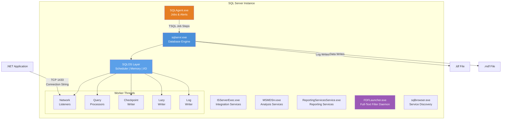
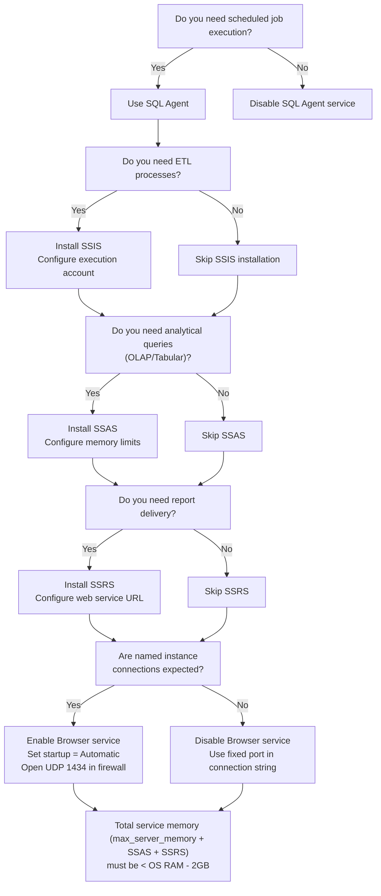

# SQL Server Architecture — Services and Components

## Section 1 — Navigation

**Domain:** [[8 — Databases]] > **Group:** SQL Server Architecture & Storage Engine

**Previous:** [[8.265 — PostgreSQL Full-Text Search tsvector and tsquery]]  
**Next:** [[8.267 — Database Engine SQL OS Layer]]

**Prerequisites:**
- [[8.024 — Database Engine Architecture]]
- [[8.282 — Database Files MDF NDF LDF]]
- [[8.314 — DMV Catalog Overview]]

**Where This Fits:** A .NET backend engineer deploying to production must understand which SQL Server services are essential, how they communicate, and what each component contributes to query processing. When diagnosing "SQL Server is not responding" or investigating a mysterious crash, knowing the service architecture determines whether you restart the Database Engine, SQL Agent, or Full-Text Filter Daemon. This topic directly impacts connection string design, maintenance window planning, and disaster recovery strategy.

---

## Section 2 — Core Mental Model

SQL Server is not a single monolithic process. It is a collection of cooperating Windows/NT services and supporting processes. The heart is `sqlservr.exe` (the Database Engine), which owns memory, scheduling, storage, and query execution. Around it orbit `SQLAgent` (scheduled jobs), `SSIS` (ETL), `SSAS` (analysis), `SSRS` (reporting), `FDFLauncher` (full-text), and `Browser` (instance discovery). The SQL Operating System (SQLOS) layer inside `sqlservr.exe` abstracts CPU scheduling, I/O completion, and memory management from the underlying Windows kernel.

### Classification

- **Layer:** Service/Process Architecture
- **Trade:** Rich ecosystem vs. resource consumption — every service consumes memory, CPU, and licensing
- **Scope:** Instance-wide
- **Monitoring surface:** Windows Service Control Manager, SQL Server Configuration Manager, `sys.dm_server_services`



### Key Properties

| Property | Detail |
|----------|--------|
| Primary executable | `sqlservr.exe` — the sole Database Engine process |
| SQL Agent | `SQLAgent.exe` — job scheduling, alerting, operator notification |
| Full-Text daemon | `FDFLauncher.exe` (msftefd.exe on older versions) — word-breaker and filter host |
| Browser service | `sqlbrowser.exe` — resolves instance names to TCP ports (UDP 1434) |
| SSIS | `ISServerExec.exe` — executes Integration Services packages |
| SSAS | `MSMDSrv.exe` — tabular/multidimensional analysis engine |
| SSRS | `ReportingServicesService.exe` — report rendering and delivery |
| Default port | 1433 (default instance); dynamic for named instances |
| Shared memory | Local connections via `lpc:` protocol — no network stack |
| Memory per service | Each service allocates its own memory; only `sqlservr.exe` is governed by `max server memory` |

---

## Section 3 — Deep Mechanics

### Step-by-Step Query Flow Through Services

1. **Client connects:** .NET application opens `SqlConnection` with connection string specifying server, port, database.
2. **Browser resolution (optional):** If using named instance, `sqlbrowser.exe` responds to UDP 1434 probe with TCP port.
3. **Listener accept:** `sqlservr.exe` network listener (SNI — SQL Server Network Interface) accepts the connection on the endpoint. Three protocols supported: TCP/IP, Named Pipes, Shared Memory.
4. **Authentication:** The connection is authenticated against the login store. SQL Server supports Windows Authentication (Kerberos/NTLM via SSPI) and SQL Server Authentication.
5. **Session creation:** A new session is created inside `sys.dm_exec_sessions`. The session is assigned a scheduler and worker thread by SQLOS.
6. **Command execution:** T-SQL batch arrives. The relational engine (parser, algebrizer, optimizer) produces an execution plan.
7. **Storage engine access:** The plan is executed. Storage engine reads/writes pages. Log writer flushes to LDF. Checkpoint writes dirty pages to MDF/NDF.
8. **Result return:** Rows are sent back over the protocol to the client.

### DMV Queries to Observe Components

```sql
-- List all services running under this SQL Server instance
SELECT servicename, service_account, status_desc, startup_type_desc
FROM sys.dm_server_services;

-- Active sessions showing network protocol
SELECT session_id, net_transport, protocol_type, auth_scheme, client_net_address
FROM sys.dm_exec_connections
WHERE session_id > 50;

-- Current requests being processed
SELECT r.session_id, r.command, r.status, r.blocking_session_id,
       t.text AS batch_text
FROM sys.dm_exec_requests r
CROSS APPLY sys.dm_exec_sql_text(r.sql_handle) t
WHERE r.session_id > 50;

-- Memory usage by service (OS level)
SELECT service_name, pid, memory_usage_kb, virtual_memory_kb
FROM sys.dm_os_process_memory;

-- Check if SQL Agent is running and its last activity
SELECT job_id, name, enabled, date_created, date_modified
FROM msdb.dbo.sysjobs
WHERE enabled = 1;

-- Full-text catalogs and their population status
SELECT ftc.name AS catalog_name, ftc.is_importing, ftc.population_status
FROM sys.fulltext_catalogs ftc;
```

### Step-by-Step Port Resolution for Named Instance

1. Application specifies server name (e.g., `PROD-FINANCE\OLTP2022`).
2. Client SNI sends UDP broadcast to port 1434 on the server.
3. `sqlbrowser.exe` receives the probe. It looks up the instance name in its registry mapping (`HKLM\Software\Microsoft\Microsoft SQL Server\Instance Names\SQL`).
4. Browser responds with the TCP port number (e.g., 51433) and pipe name (if Named Pipes enabled).
5. Client SNI opens a TCP connection to `PROD-FINANCE:51433`.
6. An error at any step causes the connection to fail.

If Browser is unavailable, the client can bypass this by specifying the port directly: `Server=PROD-FINANCE,51433`.

### Full-Text Search Service Architecture

The Full-Text Filter Daemon Launcher (`FDFLauncher.exe`) is a separate process that hosts word-breakers and filters for document types (.docx, .pdf, etc.). When a full-text query or population occurs:

1. SQL Server sends a request to FDFLauncher via shared memory.
2. FDFLauncher invokes the appropriate filter (e.g., IFilter for PDF) and word-breaker for the language.
3. The filtered text is returned to SQL Server's full-text engine, which populates the full-text index.
4. FDFLauncher can process multiple documents concurrently using a thread pool.

If FDFLauncher crashes, the full-text population stops. SQL Server attempts to restart it automatically, but frequent crashes indicate a problematic filter or document.

### Failure Modes with Detection DMVs

| Failure Mode | Detection | Resolution |
|---|---|---|
| SQL Server service not running | `sys.dm_server_services WHERE status_desc != 'Running'` | Start via SCM or `NET START MSSQLSERVER` |
| SQL Agent stuck | Jobs not executing; `msdb.dbo.sysjobactivity` showing no recent run | Restart SQLAgent service |
| Full-text filter daemon crash | Full-text queries fail with 7630; `sys.fulltext_catalogs` shows `population_status = 0` (idle) but population never finishes | Restart FDFLauncher; rebuild catalog |
| Browser service down | Named instance connections fail; error 2 (SQL Server Browser not available) | Start `sqlbrowser.exe` |
| Port conflict | Error 10048 (address already in use) at startup | Check port with `netstat -ano | findstr 1433` |

```sql
-- Detection: services not running
SELECT servicename, status_desc, last_startup_time
FROM sys.dm_server_services
WHERE status_desc != 'Running';

-- Detection: query timeout caused by resource contention
SELECT session_id, wait_type, wait_time, wait_resource, blocking_session_id
FROM sys.dm_exec_requests
WHERE wait_type IS NOT NULL AND session_id > 50;

-- Detection: memory pressure across all services
SELECT total_physical_memory_kb, available_physical_memory_kb,
       total_page_file_kb, available_page_file_kb,
       system_memory_state_desc
FROM sys.dm_os_sys_memory;
```

---

## Section 4 — Production Patterns and Implementation

### DMV-Based Monitoring Queries

```sql
-- Monitor: service health dashboard
SELECT 
    servicename,
    CASE status_desc 
        WHEN 'Running' THEN 'Healthy' 
        ELSE 'Critical' 
    END AS health_status,
    last_startup_time,
    service_account
FROM sys.dm_server_services;

-- Monitor: current connections per protocol
SELECT 
    net_transport AS protocol,
    COUNT(*) AS connection_count,
    COUNT(DISTINCT client_net_address) AS unique_clients
FROM sys.dm_exec_connections
GROUP BY net_transport
ORDER BY connection_count DESC;

-- Monitor: longest-running requests
SELECT TOP 10
    r.session_id,
    r.start_time,
    DATEDIFF(SECOND, r.start_time, GETDATE()) AS elapsed_seconds,
    r.command,
    r.status,
    DB_NAME(r.database_id) AS database_name,
    SUBSTRING(t.text, (r.statement_start_offset/2)+1,
        ((CASE r.statement_end_offset WHEN -1 THEN DATALENGTH(t.text)
          ELSE r.statement_end_offset END) - r.statement_start_offset)/2 + 1) AS statement
FROM sys.dm_exec_requests r
CROSS APPLY sys.dm_exec_sql_text(r.sql_handle) t
WHERE r.session_id > 50 AND r.status = 'running'
ORDER BY elapsed_seconds DESC;

-- Monitor: service memory consumption trend
SELECT 
    creation_time,
    physical_memory_in_use_kb,
    large_page_allocations_kb,
    locked_page_allocations_kb,
    total_virtual_address_space_kb,
    virtual_address_space_committed_kb
FROM sys.dm_os_process_memory;
```

### EF Core Logging Approach

```csharp
// Program.cs or DbContext configuration
protected override void OnConfiguring(DbContextOptionsBuilder optionsBuilder)
{
    optionsBuilder
        .UseSqlServer(@"Server=.;Database=OrdersDb;Integrated Security=true;")
        .LogTo(
            LogOutput,                           // Action<string>
            LogLevel.Information,                // Minimum log level
            DbContextLoggerOptions.UtcTime
                | DbContextLoggerOptions.SingleLine
                | DbContextLoggerOptions.LocalTime
        );
}

// LogOutput method — writes to a file with correlation context
private static readonly string _logPath = @"C:\Logs\efcore_queries.log";

private static void LogOutput(string message)
{
    var entry = $"[{DateTime.UtcNow:O}] {message}{Environment.NewLine}";
    File.AppendAllText(_logPath, entry);
    
    // Also capture when EF Core opens/closes connections
    if (message.Contains("SqlConnection") || message.Contains("DbCommand"))
    {
        EventLog.WriteEntry("Application", message, EventLogEntryType.Information);
    }
}
```

To observe service-level behavior like connection pool management:

```csharp
// Log connection pool activity via IDbConnectionInterceptor
public class ConnectionPoolInterceptor : DbConnectionInterceptor
{
    public override void ConnectionOpened(DbConnection connection, 
        ConnectionEndEventData data)
    {
        Debug.WriteLine($"[POOL] Connection opened. " +
            $"DataSource={connection.DataSource}, " +
            $"Database={connection.Database}, " +
            $"State={connection.State}");
        // Track against sys.dm_exec_connections to correlate
    }

    public override void ConnectionClosed(DbConnection connection, 
        ConnectionEndEventData data)
    {
        Debug.WriteLine($"[POOL] Connection closed.");
    }
}

// Register in DbContext
protected override void OnConfiguring(DbContextOptionsBuilder optionsBuilder)
{
    optionsBuilder.AddInterceptors(new ConnectionPoolInterceptor());
}
```

### Configuration Patterns

```sql
-- View current service-related configuration
EXEC sp_configure 'show advanced options', 1;
RECONFIGURE;

-- Check port and protocol settings via registry-level view
SELECT *
FROM sys.dm_server_registry
WHERE registry_key LIKE '%SuperSocketNetLib%';

-- Configure SQL Server to listen on specific port
EXEC xp_instance_regwrite
    N'HKEY_LOCAL_MACHINE',
    N'Software\Microsoft\Microsoft SQL Server\MSSQLServer\SuperSocketNetLib\Tcp\IPAll',
    N'TcpPort',
    REG_SZ,
    N'1433';
GO
-- After change: restart SQL Server service

-- Configure SQL Server Browser auto-start
EXEC sp_configure 'show advanced options', 1;
RECONFIGURE;
EXEC sp_configure 'Agent XPs', 1;   -- Enable SQL Agent extended procs
RECONFIGURE;
```

### SQL Server vs PostgreSQL Differences

| Aspect | SQL Server | PostgreSQL |
|--------|------------|------------|
| Process model | Single process (`sqlservr.exe`) with thread pool | Multi-process (postmaster + backend processes per connection) |
| Service manager | Windows Service Control Manager | `pg_ctl`, systemd, or init script |
| Full-text search | Separate filter daemon process | Built-in text search via GIN indexes |
| Job scheduler | SQL Agent (separate service) | `pg_cron` extension or OS cron |
| Connection discovery | Browser service (UDP 1434) | `pg_isready`, direct port connection |
| Instance upgrade | Side-by-side possible, in-place upgrade | `pg_upgrade` or dump/restore |

### Realistic Component Names

| Component | Production Name |
|-----------|----------------|
| Finance OLTP instance | `SQLPROD-FIN-01` (16 cores, 64GB RAM) |
| Reporting instance | `SQLPROD-REP-01` (8 cores, 32GB RAM) |
| SQL Agent job | `DailyOrderBatch` (runs every night at 2:00 AM) |
| SSIS package | `ETL_Warehouse_Load.dtsx` (incremental load, ~10M rows) |
| Full-text catalog | `ProductSearch_Catalog` (4 languages: EN, FR, DE, ES) |
| SSRS data source | `OrdersDb_Reports` (read-only account) |
| SSRS report | `MonthlyRevenueForecast.rdl` (30 parameters) |
| Named instance | `DEV\SQL2022` (port 51433, Browser-dependent) |
| SQL Agent operator | `DBA_OnCall` (email/pager group) |
| Extended Events session | `xe_deadlock_monitor` (system_health++ extended) |

### Service Startup Order Dependencies

The correct startup order for SQL Server services matters for availability:

1. **First:** SQL Server (MSSQLSERVER) — must be running before any dependent service.
2. **Second:** SQL Server Agent (SQLSERVERAGENT) — depends on SQL Server being available.
3. **Parallel:** SQL Server Browser (SQLBROWSER) — independent of SQL Server; can start anytime.
4. **Parallel:** Full-Text Filter Daemon (MSSQLFDLauncher) — independent but used by SQL Server.
5. **Last:** SSIS (MsDtsServer), SSAS (MSSQLServerOLAPService), SSRS (ReportServer) — depend on SQL Server for configuration database access.

If dependent services start before SQL Server, they may log connection errors in the Windows Event Log and retry. Set services to Automatic (Delayed Start) for SSIS/SSAS/SSRS to ensure SQL Server is fully initialized.

### .NET Application Connection Flow

A .NET application using `Microsoft.Data.SqlClient` follows this service path:

```csharp
// Connection string example
"Server=PROD-FINANCE\OLTP2022;Database=OrdersDb;Integrated Security=true;Connection Timeout=15;"

// Resolution flow:
// 1. SqlConnection.OpenAsync() called
// 2. SqlClient parses server name: PROD-FINANCE\OLTP2022
// 3. Named instance detected (backslash in server name)
// 4. SqlClient sends UDP probe to PROD-FINANCE:1434
// 5. sqlbrowser.exe responds with TCP port (e.g., 51433)
// 6. TCP connection established to PROD-FINANCE:51433
// 7. TLS handshake (if Encrypt=True in connection string)
// 8. SQL Server pre-login handshake (protocol version, encryption)
// 9. Login authentication
// 10. Database context switch
// 11. Connection established — available for queries
```

If step 4 or 5 fails (Browser down, UDP 1434 blocked), the client times out after `Connection Timeout` seconds. The fix is to use direct port: `Server=PROD-FINANCE,51433`. This bypasses Browser entirely.

---

## Section 5 — Gotchas

**Pitfall 1: Browser service not installed or disabled**  
→ **Symptom:** Named instance connections fail with "SQL Server Browser is not available" (error 2). .NET apps using `Server=DEV\SQL2022` cannot connect.  
→ **Fix:** Enable and start Browser: `SC CONFIG SQLBROWSER START= AUTO && NET START SQLBROWSER`.  
→ **Cost:** Named instance users are blocked until the service starts. Workaround: connect by port (`Server=dev-sql-01,14330`).

**Pitfall 2: Multiple SQL Server services fighting for memory**  
→ **Symptom:** OS shows high memory pressure; `sqlservr.exe` consumes less than configured `max server memory` because SSAS or SSRS competitors consume RAM.  
→ **Fix:** Set `max server memory` conservatively, and configure SSAS `Memory\HardMemoryLimit` and SSRS `MemorySafetyMargin`.  
→ **Detection:**
```sql
SELECT total_physical_memory_kb, available_physical_memory_kb,
       system_memory_state_desc
FROM sys.dm_os_sys_memory;
```
→ **Cost:** If memory pressure goes unnoticed, the OS may page the SQL process, killing performance. Logical reads per query double or triple.

**Pitfall 3: Full-Text Filter Daemon crash during population**  
→ **Symptom:** Full-text population hangs at "Incremental Population in Progress" but never completes. Querying the catalog returns zero results after the crash.  
→ **Fix:** Restart FDFLauncher. Rebuild the catalog with `ALTER FULLTEXT CATALOG ProductSearch_Catalog REBUILD`.  
→ **Cost:** During rebuild, full-text queries are still possible but the catalog is stale. Large catalogs (>50GB) may take hours to rebuild.

**Pitfall 4: SQL Agent service account loses permissions**  
→ **Symptom:** Jobs fail with "Cannot delete file" or "Login failed for user NT Service\SQLAgent". Backup jobs, maintenance plans all fail.  
→ **Fix:** Grant the SQL Agent service account `sysadmin` role (or specific permissions: `db_backupoperator`, `db_owner` on relevant databases). Verify with `sys.dm_server_services`.  
→ **Cost:** Missed backups accumulate. If the log chain breaks, point-in-time restore is impossible until a full backup succeeds.

**Pitfall 5: Named pipes protocol left enabled**  
→ **Symptom:** Local admin connects via shared memory but remote apps fail to connect. Security audit flags named pipes as vulnerability (named pipes enables remote Windows authentication without encryption).  
→ **Fix:** Disable Named Pipes via SQL Server Configuration Manager > Network Configuration > Protocols for MSSQLSERVER. Restart service.  
→ **Cost:** If remote apps were using named pipes, they silently fail. Always test after protocol change.

---

## Section 6 — Performance Implications

The service architecture affects performance primarily through resource competition and connection overhead.

### Benchmark: Named Instance Resolution vs Direct Port

```csharp
using BenchmarkDotNet.Attributes;
using BenchmarkDotNet.Running;
using Microsoft.Data.SqlClient;

[MemoryDiagnoser]
public class ServiceConnectionBenchmark
{
    private const string NamedInstanceConnectionString = 
        "Server=PROD-SQL-01\\Finance;Database=OrdersDb;Integrated Security=true;Connection Timeout=5;";
    private const string DirectPortConnectionString = 
        "Server=PROD-SQL-01,1433;Database=OrdersDb;Integrated Security=true;Connection Timeout=5;";

    [Benchmark(Baseline = true)]
    public async Task<int> ConnectViaNamedInstance()
    {
        await using var conn = new SqlConnection(NamedInstanceConnectionString);
        await conn.OpenAsync();
        await using var cmd = conn.CreateCommand();
        cmd.CommandText = "SELECT 1";
        return (int)(await cmd.ExecuteScalarAsync()!);
    }

    [Benchmark]
    public async Task<int> ConnectViaDirectPort()
    {
        await using var conn = new SqlConnection(DirectPortConnectionString);
        await conn.OpenAsync();
        await using var cmd = conn.CreateCommand();
        cmd.CommandText = "SELECT 1";
        return (int)(await cmd.ExecuteScalarAsync()!);
    }
}
```

**Expected Results:** Direct port connection has ~30-50ms lower latency (no Browser service round-trip). Over 10,000 connections, named instance adds ~500 seconds of cumulative overhead.

### Wait Stats Before/After Service Optimization

```sql
-- Before: high BROKER_TRANSMISSION wait due to Service Broker enabled but unused
SELECT wait_type, waiting_tasks_count, wait_time_ms, 
       (wait_time_ms / 1000.0) AS wait_time_seconds,
       signal_wait_time_ms
FROM sys.dm_os_wait_stats
WHERE wait_type LIKE '%BROKER%'
ORDER BY wait_time_ms DESC;

-- Fix: Disable Service Broker if not used
ALTER DATABASE OrdersDb SET SINGLE_USER WITH ROLLBACK IMMEDIATE;
ALTER DATABASE OrdersDb SET ENABLE_BROKER WITH ROLLBACK IMMEDIATE;  -- or use NEW_BROKER
ALTER DATABASE OrdersDb SET MULTI_USER;

-- After: wait type disappears from top waits
-- Recheck after workload runs
SELECT wait_type, waiting_tasks_count, wait_time_ms
FROM sys.dm_os_wait_stats
WHERE wait_type = 'BROKER_TRANSMISSION';
```

### Logical Reads Impact

Service architecture does not directly affect logical reads per query, but a misconfigured service (e.g., insufficient memory due to SSAS competition) causes page pressure, which increases lazy writer activity and re-reads:

```sql
-- Check lazy writer pressure — indicator of memory competition
SELECT cntr_value AS lazy_writes_per_sec
FROM sys.dm_os_performance_counters
WHERE counter_name = 'Lazy writes/sec'
      AND object_name LIKE '%Buffer Manager%';

-- If lazy writes/sec > 20 consistently, the buffer pool is starved
-- due to external service memory consumption
```

---

## Section 7 — Interview Arsenal

### Questions

**Foundational:**
1. What are the primary services that make up a SQL Server instance, and what does each do?
2. What is the SQL Browser service and when is it needed?
3. What protocols can SQL Server use for client communication, and how do you configure them?
4. How does the SQLOS layer inside `sqlservr.exe` differ from user-mode Windows scheduling?

**Intermediate:**
5. A .NET application connecting to a named instance gets error 2. Walk through the troubleshooting steps.
6. How does memory competition between SQL Server and SSAS/SSRS affect query performance?
7. What is the difference between a default instance and a named instance, and how does each affect connection strings?

**Advanced:**
8. Describe the startup sequence of SQL Server services. What happens if the Full-Text Filter Daemon fails to start?
9. In a multi-instance deployment, how would you isolate service-level resource consumption to prevent one instance from starving others?
10. Design a high-availability service architecture for SQL Server that minimizes dependency on the Browser service while maintaining named instance support for .NET applications.

### Spoken Answers

**Q1: What are the primary services?**

**Average:** SQL Server has the main database engine service and some others like SQL Agent for jobs and SSRS for reporting.

**Great:** SQL Server comprises several cooperating Windows services. The Database Engine (`sqlservr.exe`) is the core — it handles storage, security, query processing, and connectivity. SQL Agent (`SQLAgent.exe`) provides scheduling for jobs and alerting. SSIS (`ISServerExec.exe` or `DTSExec.exe`) runs ETL packages. SSAS (`MSMDSrv.exe`) serves analytical data. SSRS (`ReportingServicesService.exe`) handles report rendering. The Full-Text Filter Daemon (`FDFLauncher.exe`) hosts word-breakers for full-text search. The Browser service (`sqlbrowser.exe`) resolves named instances to TCP ports via UDP 1434. Each service runs under its own identity and has independent memory allocation.

**Q5: Named instance error 2 troubleshooting.**

**Average:** Check if the SQL Browser service is running. If not, start it. Or use the port number directly.

**Great:** Error 2 is "The system cannot find the file specified" — it means the client cannot resolve the named instance to a TCP port. I would verify: (1) that `sqlbrowser.exe` is running on the server via `sys.dm_server_services`, (2) that UDP 1434 is not blocked by Windows Firewall, (3) that the SQL Server service is configured to listen on TCP/IP and the Browser is able to register the instance port. If Browser is unavailable, the immediate workaround is to connect via direct port: `Server=hostname,1433;`. For a permanent fix, I would reference the instance port in the connection string or ensure Browser is set to auto-start.

**Q8: Multi-instance resource isolation.**

**Average:** Set max server memory on each instance and maybe put them on different machines.

**Great:** I would use a three-layer approach. First, use Windows Job Objects to cap the working set of each `sqlservr.exe` process — this prevents runaway memory. Second, configure `max server memory` per instance to ensure the sum of all instances does not exceed OS memory minus a 2GB reserve. Third, use SQL Server Resource Governor to cap CPU for specific workloads within each instance. For I/O isolation, place each instance's data and log files on separate physical drives or use Storage Spaces with Quality of Service (QoS) policies. I would monitor with `sys.dm_os_process_memory` per instance and set up alerts when committed memory exceeds 90% of the configured maximum.

**Q7: Compare default vs named instance troubleshooting.**

**Average:** Default instance uses port 1433. Named instances need Browser service or you specify the port.

**Great:** A default instance listens on TCP port 1433 by default, making connection strings simple — `Server=PROD-SQL-01`. A named instance, such as `PROD-SQL-01\FINANCE`, requires resolution to a dynamic port via the SQL Browser service (UDP 1434). The Browser maps the instance name to its port by reading the registry key `HKLM\Software\Microsoft\Microsoft SQL Server\MSSQLxx.INSTANCENAME\SuperSocketNetLib\Tcp\IPAll`. If Browser is unavailable, the client must specify the port directly: `Server=PROD-SQL-01,51433`. Default instances avoid the Browser dependency but conflict if multiple instances run on the same host. Named instances provide isolation — each instance has its own port, ERRORLOG, TempDB, and Buffer Pool. For .NET applications, the recommended practice is to reference the port in the connection string so that Browser is not a single point of failure.

### Comparison Table

| Aspect | Single Instance | Multi-Instance |
|--------|-----------------|----------------|
| Memory control | Single `max server memory` | Per-instance setting + Windows Job Objects |
| CPU isolation | Resource Governor | Process affinity masks, Resource Governor per instance |
| Port management | Single port 1433 | Unique port per instance + Browser dependency |
| Maintenance | Single service restart | Rolling restarts possible |
| Licensing | One license | Per-instance licensing cost |
| Collision risk | None | Memory/CPU/I/O competition |
| Connection strings | Simple `Server=hostname` | `Server=hostname\InstanceName` or `Server=hostname,port` |
| Service isolation | Single ERRORLOG | Per-instance ERRORLOG (separate directories) |
| TempDB sharing | One TempDB per instance | One TempDB per instance (no cross-instance sharing) |
| Performance isolation | Single buffer pool | Separate buffer pools; OS-level memory competition |

### Service Account Best Practices

| Service | Recommended Account | Permissions |
|---------|-------------------|-------------|
| Database Engine | `NT SERVICE\MSSQLSERVER` (virtual account) | `sysadmin` fixed server role; `Lock pages in memory` |
| SQL Agent | `NT SERVICE\SQLSERVERAGENT` (virtual account) | `sysadmin` for most jobs; specific roles for ETL jobs |
| SSIS | `NT SERVICE\MsDtsServer` (virtual account) | `db_owner` on SSISDB database |
| SSAS | Domain service account (requires network access) | Local admin on SSAS server; service principal name (SPN) for Kerberos |
| SSRS | `NT SERVICE\ReportServer` (virtual account) | `rsexecutionaccount` for unattended report execution |
| Browser | `NT AUTHORITY\LOCAL SERVICE` | Minimal permissions; no database access needed |
| Full-Text | `NT SERVICE\MSSQLFDLauncher` (virtual account) | Local service; no SQL Server login required |

Virtual accounts are preferred (SQL Server 2012+) because they are managed by Windows, have no password expiry, and are specific to the service. Domain accounts are necessary when services need network access (SSRS, SSAS with Kerberos, or SQL Server with linked servers across domains).

### Security Considerations Per Service

- **SQL Browser:** Listens on UDP 1434. In a secure environment, disable Browser and use direct port connections. If Browser must be enabled, restrict UDP 1434 at the firewall to known application servers only.
- **SQL Agent:** Jobs run in the context of the SQL Agent service account or a proxy account. Ensure job steps use proxy accounts with least privilege rather than the service account.
- **SSIS:** Package execution can use `Package Protection Level = EncryptSensitiveWithUserKey` or `EncryptSensitiveWithPassword`. For production, use `ServerStorage` (encrypts to SSISDB) or `EncryptAllWithPassword`.
- **SSRS:** Reports execute data source queries using configured credentials. Store credentials in the report server database (encrypted) or use integrated security with constrained delegation.
- **Full-Text:** The FDFLauncher service runs filters for document types. Malicious documents could exploit filter vulnerabilities. Use anti-malware scanning on uploaded documents before they reach indexed storage.

---

## Section 8 — Decision Framework



### Application Checklist

- [ ] Connection strings use direct port when possible (avoid Browser dependency)
- [ ] Named instance connections have fallback to direct port
- [ ] SQL Agent is disabled on read-only replicas (no job execution needed)
- [ ] Full-text catalog population scheduled off-peak
- [ ] SSAS `HardMemoryLimit` capped to prevent memory stealing
- [ ] Only needed protocols enabled (disable Named Pipes if not used)
- [ ] Firewall rules specific to each service's port
- [ ] Service accounts follow principle of least privilege
- [ ] Monitoring alerts for service status (Windows Service + DMV)
- [ ] Service startup order configured (Browser before Engine if using named instances)
- [ ] VSS Writer service is running if using VSS-based backups
- [ ] SQL Agent proxies are configured for job steps that need network access
- [ ] SSIS package protection level uses `ServerStorage` for production
- [ ] Full-text filter daemon anti-malware exclusions configured
- [ ] Service accounts do not have interactive logon rights
- [ ] ERRORLOG size managed via log file recycling

### Tradeoff Summary

| Decision | Upside | Downside |
|----------|--------|----------|
| Install all services | Full feature set; integrated admin | Resource consumption; attack surface; licensing cost |
| Minimum services | Reduced resource usage; simpler attack surface | Manual workarounds for jobs/ETL/reports |
| Named instance | Multiple apps isolated on one server | Browser dependency; connection complexity |
| Default instance | Simple connection strings; no Browser needed | Single instance only; port 1433 collision risk |

### Scale Thresholds

| Scale Level | RAM | Service Configuration | Cores | Workers |
|-------------|-----|----------------------|-------|---------|
| Developer laptop | 8-16 GB | Default instance only; disable Agent, SSIS, SSAS, SSRS, Browser | 4-8 | 288-320 |
| Small production | 32 GB | Engine + Agent + Browser; optional SSIS on same host | 8-16 | 320-384 |
| Mid-tier | 64 GB | Engine + Agent + Browser; SSIS on separate job server; SSRS on web tier | 16-32 | 384-512 |
| Large enterprise | 128-256 GB | Instance isolation: Finance OLTP on one, Reporting on replica; SSAS dedicated | 32-64 | 512-768 |
| Data warehouse | 256-512 GB | Columnstore-focused; multiple instances for workload isolation | 64-128+ | 768-1,280 |

### Service Dependency Graph for High Availability

When planning HA for SQL Server services, understand which services depend on which:

```
SQL Browser ──> (no dependencies) ──> Can run on separate node
SQL Engine  ──> (no dependencies) ──> Can fail over independently
SQL Agent   ──> SQL Engine ──> Fails over with Engine (same node)
SSIS        ──> SQL Engine (SSISDB) ──> Can run on separate nodes
SSAS        ──> (no dependencies) ──> Can fail over independently
SSRS        ──> SQL Engine (ReportServer DB) ──> Can run on separate nodes
FDFLauncher ──> SQL Engine (on-demand) ──> Runs on Engine node
SQL Writer  ──> SQL Engine ──> Runs on Engine node
```

In an Always On Availability Group setup, secondary replicas can have SQL Agent disabled (no jobs run on read-only secondary). SSIS and SSRS typically connect to the listener, not individual replicas.

---

## Section 9 — Self-Check

### Conceptual Questions

1. What is the primary role of the `sqlservr.exe` process?
2. Under what circumstances does the SQL Browser service become a single point of failure?
3. Why might you choose to disable Named Pipes protocol?
4. What are the differences between SQL Server Authentication and Windows Authentication in the context of service connectivity?
5. How does the Full-Text Filter Daemon process relate to the main SQL Server process?
6. What happens during SQL Server service startup if the configured data file path is invalid?
7. How does the SQLOS layer inside `sqlservr.exe` differ from standard Windows thread scheduling?
8. What is the impact of leaving Service Broker enabled on an unused database?
9. How do you determine which TCP port a named instance is listening on?
10. What information does `sys.dm_server_services` provide that cannot be obtained from Windows Service Control Manager?
11. Why should SSAS `HardMemoryLimit` be configured when it runs on the same server as the Database Engine?
12. What is the purpose of the SQL Server VSS Writer service?
13. How does a .NET application's connection pool interact with SQL Server's worker thread pool at the service level?
14. What happens to existing named instance connections if the SQL Browser service is restarted?
15. Why might you choose to install SSIS on a separate server from the Database Engine?

### Challenges

1. **DMV query:** Write a query that shows all SQL Server services, their status, account, and how long they have been running (uptime). Include a health classification column.
2. **Diagnosis:** A .NET application using `Server=PROD\SQL2022` suddenly cannot connect. You can RDP to the server and SQL Server Configuration Manager shows TCP/IP is enabled. Walk through the diagnostic steps using DMVs and system tools.
3. **Design:** You have 4 named instances on a 128GB server: Finance (OLTP), Warehouse (ETL staging), Analytics (SSAS), and Reports (SSRS). Design a memory allocation plan. Each instance must have at least 8GB. Show your total memory calculation.
4. **Concurrency:** Multi-instance CPU contention. Two instances each try to use 16 cores simultaneously. Write a T-SQL script using Resource Governor to cap the second instance to 50% CPU during business hours.
5. **Integration:** A background job in a .NET 8 microservice needs to run a weekly report (SSRS subscription) after an SSIS ETL completes. The ETL is triggered by SQL Agent. Design the service orchestration using T-SQL and .NET.
6. **Security audit:** Your security team requires that all SQL Server service accounts use Managed Service Accounts (gMSA) and that no service has interactive logon rights. Write a T-SQL script using `sys.dm_server_services` and `sys.dm_exec_connections` to audit current service accounts and identify any service running with local Administrator privileges.
7. **Capacity planning:** A new microservice is being deployed that connects to a named instance and runs 24/7 queries. The instance currently has 128 workers auto-configured with 512 max. The new workload adds 300 concurrent connections. Determine whether the existing worker pool can handle this load, and if not, calculate the required `max worker threads` setting and the memory impact of the additional workers.

<details>
<summary>Answers</summary>

**Q1:** `sqlservr.exe` is the Database Engine process that hosts the relational engine, storage engine, SQLOS, network listeners, and all worker threads. It is the only process that accesses data files (.mdf, .ndf, .ldf).

**Q2:** When named instance connections are used, Browser resolves the instance name to a TCP port. If Browser goes down, all new named instance connections fail. Existing connections continue (they already have the port). To avoid this, use direct port in connection strings.

**Q3:** Named Pipes is an older protocol that requires Windows authentication and can introduce security vulnerabilities (e.g., unencrypted authentication over the network). It also has higher overhead than TCP/IP. Disable it unless specifically required by a legacy application.

**Q4:** Windows Authentication uses Kerberos or NTLM via the Windows security context — no password in connection string. SQL Authentication sends username/password and can be audited independently. For production, Windows Authentication (or Azure AD) is recommended. SQL Authentication requires `sa` password management and satisfies some compliance requirements.

**Q5:** The FDFLauncher is a separate process launched by `sqlservr.exe` on demand. It hosts word-breakers, stemmers, and filters for documents stored in full-text indexed columns. If it crashes, full-text operations fail but the main engine continues. It runs under a separate, low-privilege account to isolate potential security issues.

**Q6:** SQL Server will fail to start and log error 17207 in the ERRORLOG. The database will be marked as SUSPECT if it cannot access the data file. Recovery requires restoring from backup after fixing the file path.

**Q7:** SQLOS implements cooperative (non-preemptive) scheduling within the SQL Server process. It uses its own scheduler (SOS scheduler) that yields voluntarily at preemption points (e.g., page latch waits, I/O completion). This avoids expensive Windows context switches and gives SQL Server full control over CPU quantum distribution.

**Q8:** Service Broker adds background overhead even when unused. The `BROKER_TRANSMISSION` wait type appears in `sys.dm_os_wait_stats`, consuming CPU and memory for message queues. On a busy OLTP server, this can account for 5-10% of waits. Disable with `ALTER DATABASE SET DISABLE_BROKER` if not used.

**Q9:** Use `sys.dm_server_registry` to view the TCP port registry key, or query `sys.tcp_endpoints` for the port number. Alternatively, check ERRORLOG for "Server is listening on" lines. At the OS level, `netstat -ano | findstr sqlservr` shows listening ports.

**Q10:** `sys.dm_server_services` provides the service account name, last startup time, and current status in a queryable format that can be joined with other DMVs for monitoring dashboards. It also shows the process ID (PID) which can be correlated with OS-level performance counters.

**Q11:** Without `HardMemoryLimit`, SSAS can consume all available RAM when processing cubes or serving queries. This forces the OS to page, which starves the SQL Server buffer pool. Setting `HardMemoryLimit` to a percentage (e.g., 70%) prevents SSAS from exceeding its allocation.

**Q12:** The SQL Server VSS Writer service (`SqlWriter`) enables Volume Shadow Copy Service-based backups. Third-party backup tools use VSS to coordinate SQL Server with the OS for consistent snapshots. If this service is not running, VSS-based backups fail.

**Q13:** Each .NET `SqlConnection.OpenAsync()` creates a session on the server, which requires a worker thread when a query is executed. If the .NET connection pool size exceeds the SQL Server `max worker threads`, connections queue on `THREADPOOL` waits. Pool size must be coordinated with server capacity.

**Q14:** Existing connections continue without interruption because the TCP port is already established. Only new connections that require name resolution fail. This is why using direct port in connection strings improves resilience.

**Q15:** SSIS packages can be memory-intensive and long-running. Running SSIS on the same server as the Database Engine risks memory competition (SSIS consumes buffer pool memory for data transformations) and CPU contention during ETL loads. Separating them provides resource isolation and allows independent scaling.

---

**Challenge 1:**
```sql
SELECT 
    servicename,
    service_account,
    status_desc,
    last_startup_time,
    DATEDIFF(MINUTE, last_startup_time, GETDATE()) AS uptime_minutes,
    CASE 
        WHEN status_desc = 'Running' AND DATEDIFF(MINUTE, last_startup_time, GETDATE()) > 60 THEN 'Healthy'
        WHEN status_desc = 'Running' AND DATEDIFF(MINUTE, last_startup_time, GETDATE()) <= 60 THEN 'Recently Restarted'
        WHEN status_desc = 'Stopped' THEN 'Critical'
        ELSE 'Unknown'
    END AS health_classification,
    process_id
FROM sys.dm_server_services
ORDER BY servicename;
```

**Challenge 2:** The most likely cause is the Browser service not running (stopped or crashed). Steps:
1. RDP to PROD, run `SELECT servicename, status_desc FROM sys.dm_server_services` to check Browser.
2. If Browser stopped, try `NET START SQLBROWSER`. If it fails, check the Windows Application Event Log for errors.
3. As immediate workaround, find the instance port from ERRORLOG or registry and change connection string to `Server=PROD,14330`.
4. If Browser starts but connections still fail, check Windows Firewall for UDP 1434 being blocked.
5. Permanent fix: set Browser to auto-start and monitor with a scheduled DMV query.

**Challenge 3:** Memory allocation plan for 128GB server:
- OS reserve: 4GB
- Buffer pool (Finance OLTP): 48GB (most critical, needs cache)
- Buffer pool (Warehouse ETL staging): 16GB (sequential scans, less cache benefit)
- SSAS (Analytics): 32GB (in-memory tabular model)
- SSRS (Reports): 8GB (rendering cache)
- Reserve/buffer: 20GB (16% headroom)
Total: 4 + 48 + 16 + 32 + 8 + 20 = 128GB ✓

**Challenge 4:**
```sql
-- Create a Resource Governor workload group for Instance2
CREATE RESOURCE POOL Pool_Instance2
WITH (MAX_CPU_PERCENT = 50, MIN_CPU_PERCENT = 0,
      CAP_CPU_PERCENT = 50);
GO
CREATE WORKLOAD GROUP WG_Instance2
USING Pool_Instance2;
GO
-- Classifier function (runs on Instance2 to route all requests to WG)
CREATE FUNCTION dbo.Classifier_Instance2()
RETURNS SYSNAME WITH SCHEMABINDING
AS
BEGIN
    RETURN 'WG_Instance2';
END;
GO
ALTER RESOURCE GOVERNOR RECONFIGURE;
```

**Challenge 5:**
```sql
-- SQL Agent job step 1: Run SSIS package
EXEC msdb.dbo.sp_start_job @job_name = 'ETL_Warehouse_Load';

-- Wait and poll for completion (use a loop with WAITFOR DELAY)
-- When ETL completes, trigger SSRS subscription
EXEC msdb.dbo.sp_start_job @job_name = 'Generate_Monthly_Report';

-- .NET side: Use IHostedService that polls msdb.dbo.sysjobactivity
-- WaitHandle pattern with SqlDependency for real-time notification
```

```csharp
// .NET 8 polling service
public class JobCompletionService : BackgroundService
{
    protected override async Task ExecuteAsync(CancellationToken ct)
    {
        while (!ct.IsCancellationRequested)
        {
            var isComplete = await CheckJobCompletionAsync("ETL_Warehouse_Load", ct);
            if (isComplete)
            {
                await TriggerReportGenerationAsync(ct);
                break;
            }
            await Task.Delay(TimeSpan.FromSeconds(30), ct);
        }
    }
}
```

**Challenge 6 Solution:**
```sql
-- Audit service accounts and permissions
SELECT 
    servicename,
    service_account,
    process_id,
    status_desc,
    CASE 
        WHEN service_account LIKE '%Administrator%' 
             OR service_account LIKE '%SYSTEM%' THEN 'CRITICAL — elevated privileges'
        WHEN service_account LIKE 'NT SERVICE\%' THEN 'OK — virtual account'
        WHEN service_account LIKE 'NT AUTHORITY\%' THEN 'OK — built-in account'
        ELSE 'REVIEW — custom account'
    END AS account_assessment
FROM sys.dm_server_services
ORDER BY 
    CASE 
        WHEN service_account LIKE '%Administrator%' THEN 0
        WHEN service_account LIKE '%SYSTEM%' THEN 1
        ELSE 2
    END;
```

**Challenge 7 Solution:** Current auto max = 512 on likely 32-core server (256 + 32*8 = 512). 300 additional concurrent connections at 80% active means ~240 more workers needed. 512 + 240 = 752, but auto max on 32-core is 512. Increase manually to 768 via `sp_configure 'max worker threads', 768; RECONFIGURE;`. Memory impact: 240 additional workers × 512KB stack = ~120MB additional reserved memory. Ensure `max server memory` accounts for this: reduce by 120MB from the previously calculated value.

</details>
