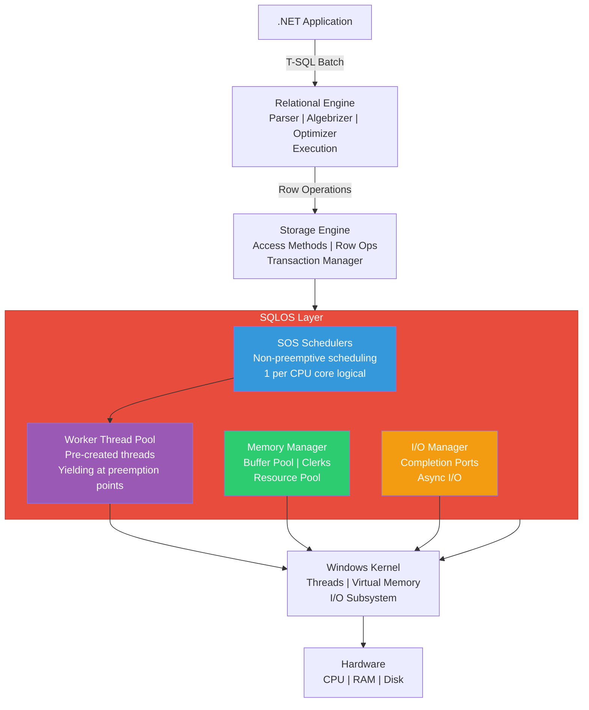
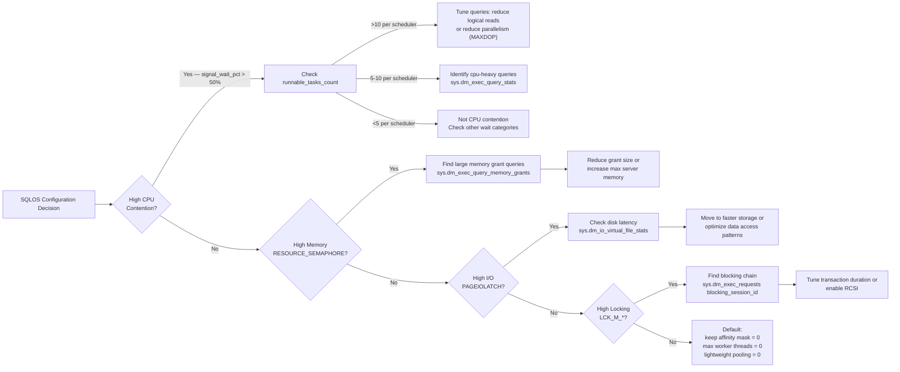

# Database Engine — SQL OS Layer

## Section 1 — Navigation

**Domain:** [[8 — Databases]] > **Group:** SQL Server Architecture & Storage Engine

**Previous:** [[8.266 — SQL Server Architecture Services and Components]]  
**Next:** [[8.268 — Memory Architecture Buffer Pool and Plan Cache]]

**Prerequisites:**
- [[8.266 — SQL Server Architecture Services and Components]]
- [[8.024 — Database Engine Architecture]]
- [[8.314 — DMV Catalog Overview]]

**Where This Fits:** The SQLOS is the abstraction layer between the SQL Server relational engine and Windows. A .NET backend engineer debugging escalating waits, scheduler contention, or memory pressure needs to understand SQLOS because its design determines how queries are scheduled, how I/O completes, and why certain wait types appear. SQLOS is the reason SQL Server can manage thousands of concurrent connections without creating thousands of Windows threads — it implements cooperative scheduling within a single process. Without SQLOS knowledge, production incidents like "PAGEIOLATCH_SH" storms or "SOS_SCHEDULER_YIELD" waits are opaque.

---

## Section 2 — Core Mental Model

The SQLOS (SQL Operating System) is a user-mode abstraction layer that sits between the SQL Server Relational Engine and the Windows kernel. It provides three critical services: **non-preemptive scheduling** (SQLOS Schedulers), **memory management** (buffer pool, memory clerks, resource governance), and **I/O completion** (completion ports for asynchronous I/O). SQLOS does not replace Windows — it runs on top of it. Each SQLOS scheduler maps to a Windows thread (or fiber), but within that thread, SQLOS manages its own cooperative yielding to avoid expensive context switches. Every wait type you see in `sys.dm_os_wait_stats` is tracked and accounted by SQLOS.

### Classification

- **Layer:** User-mode resource abstraction
- **Trade:** Complete control over CPU quantum vs. increased complexity and single-process dependency
- **Scope:** Instance-wide; single `sqlservr.exe` process
- **Monitoring surface:** `sys.dm_os_*` family of DMVs



### Key Properties

| Property | Detail |
|----------|--------|
| Schedulers | One SOS scheduler per logical CPU core; visible in `sys.dm_os_schedulers` |
| Workers | Thread pool workers that execute queries; 0-1024 per scheduler by default |
| Preemption points | Yield points in code where a worker voluntarily yields the scheduler (latch waits, I/O starts, quantum expires) |
| Quantum | 4ms default — a worker runs for 4ms before yielding |
| Memory clerks | Components register as memory clerks to track and govern allocations |
| I/O completion | Uses Windows I/O Completion Ports (IOCP); `sys.dm_io_virtual_file_stats` for file-level I/O |
| SQLCLR | Runs inside SQLOS but uses Windows threads (preemptive) for hosting .NET runtime |
| NUMA awareness | SQLOS discovers NUMA nodes and assigns schedulers proportionally |

---

## Section 3 — Deep Mechanics

### Step-by-Step SQLOS Execution

1. **Connection arrives** on TCP endpoint. SQLOS assigns a worker thread from the pool.
2. **Worker picks up batch** from network buffer. It runs on a scheduler (determined by `affinity mask` and NUMA node).
3. **Relational Engine parses, algebrizes, optimizes.** During optimization, the worker may yield (SQLOS preemption point) if the operation takes too long.
4. **Execution plan runs.** The worker executes plan operators. Each operator may:
   - Request a page from buffer pool (latch acquire — if contested, yields)
   - Initiate a read-ahead (async I/O — yields until completion)
   - Sort data (memory grant check — may yield if insufficient)
5. **Quantum expiration:** After ~4ms, the worker must yield. SQLOS checks `sys.dm_os_schedulers` runnable queue. If other workers are waiting, the current worker goes to the back of the queue.
6. **I/O completion:** When an async I/O completes, the I/O completion port posts a completion packet. A worker thread picks it up (not necessarily the original thread — SQLOS uses continuation passing).
7. **Result return:** Final rows are serialized back to the client via SNI (Server Network Interface).

### SQLOS Scheduler States

Each scheduler cycles through three states:

- **RUNNING:** The active worker is executing code.
- **RUNNABLE:** Workers that are ready to run but waiting for CPU quantum. Wait type: `SOS_SCHEDULER_YIELD`.
- **SUSPENDED:** Workers waiting for a resource (latch, lock, I/O, memory). Wait type varies (e.g., `LCK_M_S`, `PAGEIOLATCH_SH`, `RESOURCE_SEMAPHORE`).

### DMV Queries to Observe SQLOS

```sql
-- Scheduler overview: runnable tasks indicate CPU pressure
SELECT
    scheduler_id,
    cpu_id,
    status,
    current_tasks_count,
    runnable_tasks_count,
    work_queue_count,
    pending_disk_io_count,
    preemptive_switches_count,
    context_switches_count,
    is_online
FROM sys.dm_os_schedulers
WHERE scheduler_id < 255;  -- exclude hidden system schedulers

-- Worker thread usage — track against max worker threads
SELECT
    scheduler_id,
    worker_address,
    status,
    is_preemptive,
    is_sick,
    task_bound,
    quantum_expiration_time
FROM sys.dm_os_workers
WHERE is_sick = 1   -- workers that are stuck (potential problem)
ORDER BY scheduler_id;

-- Wait stats aggregated by SQLOS
SELECT
    wait_type,
    waiting_tasks_count,
    wait_time_ms,
    max_wait_time_ms,
    signal_wait_time_ms,
    (wait_time_ms - signal_wait_time_ms) AS resource_wait_ms,
    CASE
        WHEN wait_time_ms = 0 THEN 0
        ELSE CAST(signal_wait_time_ms AS DECIMAL(12,2)) / wait_time_ms * 100
    END AS signal_wait_pct
FROM sys.dm_os_wait_stats
WHERE waiting_tasks_count > 0
ORDER BY wait_time_ms DESC;

-- Memory clerks — show where SQLOS memory is going
SELECT
    type AS clerk_type,
    memory_node_id,
    pages_kb,
    virtual_memory_committed_kb,
    virtual_memory_reserved_kb,
    awe_allocated_kb,
    shared_memory_committed_kb
FROM sys.dm_os_memory_clerks
ORDER BY pages_kb DESC;

-- NUMA node configuration
SELECT
    memory_node_id,
    socket_count,
    core_count,
    cpu_count,
    scheduler_count,
    coalesced_type_desc,
    affinity_type_desc,
    node_state_desc
FROM sys.dm_os_nodes
ORDER BY memory_node_id;

-- I/O completion ports state
SELECT
    io_completion_port_address,
    max_workers,
    creation_time,
    is_initialized
FROM sys.dm_os_io_completion_ports;
```

### Execution Plan Analysis

When a query experiences SOS scheduler contention, look for:

- **High `runnable_tasks_count`** in `sys.dm_os_schedulers` (>10 sustained) — indicates CPU shortage.
- **Parallelism with `CX_PACKET` waits** — workers waiting to exchange rows between parallel threads.
- **Logical read heavy operators** causing long quantum bursts before yielding.

```sql
-- Find queries experiencing SOS_SCHEDULER_YIELD waits
SELECT
    r.session_id,
    r.blocking_session_id,
    r.wait_type,
    r.wait_time,
    r.last_wait_type,
    r.cpu_time,
    r.total_elapsed_time,
    SUBSTRING(t.text, (r.statement_start_offset/2)+1,
        ((CASE r.statement_end_offset WHEN -1 THEN DATALENGTH(t.text)
          ELSE r.statement_end_offset END) - r.statement_start_offset)/2 + 1) AS statement,
    qp.query_plan
FROM sys.dm_exec_requests r
CROSS APPLY sys.dm_exec_sql_text(r.sql_handle) t
CROSS APPLY sys.dm_exec_query_plan(r.plan_handle) qp
WHERE r.wait_type = 'SOS_SCHEDULER_YIELD'
ORDER BY r.cpu_time DESC;
```

### Failure Modes with Detection DMVs

| Failure Mode | Detection | Resolution |
|---|---|---|
| CPU pressure (runaway query) | `runnable_tasks_count > 10` sustained on any scheduler | Identify query with `sys.dm_exec_requests`; tune or kill |
| Deadlocked scheduler (worker stuck) | Workers with `is_sick = 1` in `sys.dm_os_workers` | Indicates a non-yielding worker; check `last_wait_type` |
| Memory pressure (clerk starvation) | `RESOURCE_SEMAPHORE` waits high; `available_physical_memory_kb` low | Reduce `max server memory` if overconfigured |
| I/O subsystem saturation | `PAGEIOLATCH_*` waits dominant; `avg_disk_ms` > 20ms in `sys.dm_io_virtual_file_stats` | Check disk queue length; move files to faster storage |
| Orphaned worker threads | Workers with no task bound for extended period | Usually transient; check `work_queue_count` |

```sql
-- Detection: non-yielding scheduler (critical condition)
SELECT scheduler_id, current_tasks_count, runnable_tasks_count,
       last_worker_address, is_online
FROM sys.dm_os_schedulers
WHERE runnable_tasks_count > 10;

-- Detection: workers stuck in preemptive mode
SELECT worker_address, scheduler_id, is_preemptive, is_sick,
       task_address, context_switches_count
FROM sys.dm_os_workers
WHERE is_preemptive = 1 AND is_sick = 1;

-- Detection: memory clerk over-commit
SELECT type, SUM(pages_kb) AS total_pages_kb,
       SUM(virtual_memory_committed_kb) AS total_committed_kb
FROM sys.dm_os_memory_clerks
GROUP BY type
ORDER BY total_pages_kb DESC;
```

---

## Section 4 — Production Patterns and Implementation

### DMV-Based Monitoring Queries

```sql
-- Daily SQLOS health check
SELECT 
    GETDATE() AS snapshot_time,
    (SELECT cntr_value FROM sys.dm_os_performance_counters
     WHERE object_name LIKE '%Scheduler%' 
       AND counter_name = 'Total Scheduler Yields/sec') AS yields_per_sec,
    (SELECT cntr_value FROM sys.dm_os_performance_counters
     WHERE object_name LIKE '%Scheduler%'
       AND counter_name = 'Total Scheduler Switches/sec') AS switches_per_sec,
    (SELECT cntr_value FROM sys.dm_os_performance_counters
     WHERE object_name LIKE '%Workload Group Stats%'
       AND counter_name = 'CPU usage %') AS cpu_usage_pct,
    (SELECT cntr_value FROM sys.dm_os_performance_counters
     WHERE object_name LIKE '%Buffer Manager%'
       AND counter_name = 'Page life expectancy') AS ple_seconds;

-- Top waits by signal_wait (CPU contention) vs resource waits
WITH WaitStats AS (
    SELECT 
        wait_type,
        waiting_tasks_count,
        wait_time_ms,
        signal_wait_time_ms,
        (wait_time_ms - signal_wait_time_ms) AS resource_wait_time_ms,
        CASE WHEN wait_time_ms = 0 THEN 0 
             ELSE CAST(signal_wait_time_ms AS DECIMAL(10,2)) / wait_time_ms * 100 
        END AS signal_wait_pct,
        ROW_NUMBER() OVER (ORDER BY wait_time_ms DESC) AS rn
    FROM sys.dm_os_wait_stats
    WHERE wait_type NOT IN (
        'BROKER_EVENTHANDLER', 'BROKER_RECEIVE_WAITFOR', 'BROKER_TASK_STOP',
        'BROKER_TO_FLUSH', 'BROKER_TRANSMITTER', 'CHECKPOINT_QUEUE',
        'CHKPT', 'CLR_AUTO_EVENT', 'CLR_MANUAL_EVENT', 'CLR_SEMAPHORE',
        'DBMIRROR_DBM_EVENT', 'DBMIRROR_EVENTS_QUEUE', 'DBMIRROR_WORKER_QUEUE',
        'DBMIRRORING_CMD', 'DIRTY_PAGE_POLL', 'DISPATCHER_QUEUE_SEMAPHORE',
        'EXECSYNC', 'FSAGENT', 'FT_IFTS_SCHEDULER_IDLE_WAIT',
        'FT_IFTSHC_MUTEX', 'HADR_CLUSAPI_CALL', 'HADR_FILESTREAM_IOMGR_IOCOMPLETION',
        'HADR_LOGCAPTURE_WAIT', 'HADR_NOTIFICATION_DEQUEUE', 'HADR_TIMER_TASK',
        'HADR_WORK_QUEUE', 'KSOURCE_WAKEUP', 'LAZYWRITER_SLEEP',
        'LOGMGR_QUEUE', 'ONDEMAND_TASK_QUEUE', 'PREEMPTIVE_OS_LIBRARYOPS',
        'PREEMPTIVE_OS_COMOPS', 'PREEMPTIVE_OS_CRYPTOPS',
        'PREEMPTIVE_OS_PIPEOPS', 'PREEMPTIVE_OS_AUTHENTICATIONOPS',
        'PREEMPTIVE_OS_GENERICOPS', 'PREEMPTIVE_OS_VERIFYTRUST',
        'PREEMPTIVE_OS_FILEOPS', 'PREEMPTIVE_OS_DEVICEOPS',
        'PREEMPTIVE_OS_QUERYREGISTRY', 'PREEMPTIVE_OS_WRITEFILE',
        'QDS_PERSIST_TASK_MAIN_LOOP_SLEEP', 'QDS_ASYNC_QUEUE',
        'QDS_CLEANUP_STALE_QUERIES_TASK_MAIN_LOOP_SLEEP',
        'REQUEST_FOR_DEADLOCK_SEARCH', 'RESOURCE_QUEUE', 'SERVER_IDLE_CHECK',
        'SLEEP_BPOOL_FLUSH', 'SLEEP_DBSTARTUP', 'SLEEP_DCOMSTARTUP',
        'SLEEP_MASTERDBREADY', 'SLEEP_MASTERMDREADY', 'SLEEP_MASTERUPGRADED',
        'SLEEP_MSDBSTARTUP', 'SLEEP_SYSTEMTASK', 'SLEEP_TASK',
        'SLEEP_TEMPDBSTARTUP', 'SNI_HTTP_ACCEPT', 'SP_SERVER_DIAGNOSTICS_SLEEP',
        'SQLTRACE_BUFFER_FLUSH', 'SQLTRACE_INCREMENTAL_FLUSH_SLEEP',
        'SQLTRACE_WAIT_ENTRIES', 'WAIT_FOR_RESULTS', 'WAITFOR',
        'WAITFOR_TASKSHUTDOWN', 'WAIT_XTP_HOST_WAIT', 'WAIT_XTP_OFFLINE_CKPT_NEW_LOG',
        'WAIT_XTP_CKPT_CLOSE', 'XE_DISPATCHER_JOIN', 'XE_DISPATCHER_WAIT',
        'XE_TIMER_EVENT')
)
SELECT
    wait_type,
    waiting_tasks_count,
    wait_time_ms,
    signal_wait_time_ms,
    signal_wait_pct,
    CASE 
        WHEN signal_wait_pct > 50 THEN 'CPU Contention'
        WHEN wait_type LIKE 'PAGEIOLATCH%' THEN 'I/O Subsystem'
        WHEN wait_type LIKE 'LCK%' THEN 'Locking'
        WHEN wait_type LIKE 'LATCH%' THEN 'Latch Contention'
        WHEN wait_type IN ('RESOURCE_SEMAPHORE', 'RESOURCE_SEMAPHORE_QUERY_COMPILE') 
            THEN 'Memory Pressure'
        ELSE 'Other'
    END AS wait_category
FROM WaitStats
WHERE rn <= 20
ORDER BY wait_time_ms DESC;

-- Session-level scheduler assignment
SELECT 
    session_id,
    scheduler_id,
    cpu_time,
    total_elapsed_time / 1000 AS elapsed_seconds,
    memory_usage,
    logical_reads,
    writes
FROM sys.dm_exec_sessions
WHERE is_user_process = 1
ORDER BY cpu_time DESC;
```

### EF Core Logging to Observe SQLOS Behavior

While EF Core cannot directly observe SQLOS internals, you can configure logging to detect scheduler-related patterns:

```csharp
// Configure EF Core to log command execution timing
protected override void OnConfiguring(DbContextOptionsBuilder optionsBuilder)
{
    optionsBuilder
        .UseSqlServer(connectionString)
        .LogTo(
            LogOutput,
            LogLevel.Information,
            DbContextLoggerOptions.None
        )
        .EnableDetailedErrors()
        .EnableSensitiveDataLogging();
}

private static void LogOutput(string message)
{
    // Parsing for commands that take > 1 second — potential SQLOS yield issue
    if (message.Contains("Executed DbCommand") && message.Contains("ms)"))
    {
        // Extract duration from log message
        var match = System.Text.RegularExpressions.Regex.Match(
            message, @"(\d+)\s*ms");
        if (match.Success && int.TryParse(match.Groups[1].Value, out var ms))
        {
            if (ms > 1000)
            {
                Debug.WriteLine($"[SQLOS WARNING] Long query ({ms}ms): {message}");
                
                // Optionally fire a DMV query to check scheduler health
                // using SqlConnection directly
            }
        }
    }
}

// To correlate with SQLOS waits, use a raw SQL query after slow commands:
public async Task MonitorSchedulerHealthAsync(string connectionString)
{
    await using var conn = new SqlConnection(connectionString);
    await conn.OpenAsync();
    
    var cmd = new SqlCommand(@"
        SELECT scheduler_id, runnable_tasks_count, current_tasks_count
        FROM sys.dm_os_schedulers
        WHERE scheduler_id < 255 AND runnable_tasks_count > 0", conn);
    
    using var reader = await cmd.ExecuteReaderAsync();
    while (await reader.ReadAsync())
    {
        var sid = reader.GetInt32(0);
        var runnable = reader.GetInt32(1);
        if (runnable > 5)
        {
            Console.WriteLine($"[ALERT] Scheduler {sid} has {runnable} runnable tasks");
        }
    }
}
```

### Configuration Patterns

```sql
-- View SQLOS-related configuration
EXEC sp_configure 'show advanced options', 1;
RECONFIGURE;

-- Configure max worker threads (0 = auto configured by SQLOS)
EXEC sp_configure 'max worker threads', 0;
RECONFIGURE;
-- SQLOS calculates: (256 + (max_cores * 8)) for 64-bit

-- Configure affinity mask (CPU binding)
EXEC sp_configure 'affinity mask', 0;   -- 0 = all CPUs
RECONFIGURE;

-- Configure NUMA node affinity
EXEC sp_configure 'affinity64 mask', 0;
RECONFIGURE;

-- Configure lightweight pooling (fibers)
EXEC sp_configure 'lightweight pooling', 0;  -- 0 = threads (default); 1 = fibers
RECONFIGURE;
-- Note: lightweight pooling is deprecated; do not enable

-- Configure priority boost (not recommended)
EXEC sp_configure 'priority boost', 0;
RECONFIGURE;

-- Resource Governor: cap CPU for specific workload
CREATE RESOURCE POOL ReportPool
WITH (
    MIN_CPU_PERCENT = 0,
    MAX_CPU_PERCENT = 25,
    CAP_CPU_PERCENT = 25,
    AFFINITY SCHEDULER = (0 TO 3),
    MIN_MEMORY_PERCENT = 0,
    MAX_MEMORY_PERCENT = 25
);
GO
CREATE WORKLOAD GROUP ReportGroup USING ReportPool;
GO
ALTER RESOURCE GOVERNOR RECONFIGURE;
```

### SQL Server vs PostgreSQL Differences

| Aspect | SQL Server | PostgreSQL |
|--------|------------|------------|
| Execution model | Single process, cooperative scheduling within `sqlservr.exe` | Multi-process (postmaster + backends); OS preemptive scheduling per connection |
| Wait detection | `sys.dm_os_wait_stats` — comprehensive wait types | `pg_stat_activity.wait_event`, `pg_stat_activity.wait_event_type` |
| Scheduler count | 1 SOS scheduler per logical CPU core | 1 process per connection; kernel schedules |
| Quantum control | 4ms cooperative yield | OS preemptive; `sched_yield()` configurable |
| Worker pool | Fixed-size, shared across connections | Each connection spawns a process; pool via PgBouncer |
| Context switch cost | Low (user-mode yields) | High (kernel context switches per query) |
| Memory management | Memory clerks, resource pools, buffer pool | Shared buffers, work_mem, maintenance_work_mem |

### Realistic Names

| Component | Production Name |
|-----------|----------------|
| SQLOS scheduler | `SOS_Scheduler_CPU0` ... `SOS_Scheduler_CPU15` |
| Resource pool | `Pool_BackupProcesses` |
| Workload group | `WG_ReportQueries` |
| Memory clerk | `MEMCLK_SQLQEReservations` |
| Wait type classification | `CPU Contention`, `I/O Stall`, `Lock Wait` |

---

## Section 5 — Gotchas

**Pitfall 1: High `SOS_SCHEDULER_YIELD` interpreted as CPU starvation**  
→ **Symptom:** `sys.dm_os_wait_stats` shows `SOS_SCHEDULER_YIELD` as the top wait type. The knee-jerk reaction is "need more CPU."  
→ **Fix:** Remember that `SOS_SCHEDULER_YIELD` is a *normal* wait type — it is the mechanism of cooperative scheduling. Only problematic when coupled with high `runnable_tasks_count` (>10 per scheduler). High signal wait percentage (>50%) combined with SOS_YIELD indicates CPU contention. Check `runnable_tasks_count` in `sys.dm_os_schedulers`.  
→ **Detection:**
```sql
SELECT scheduler_id, current_tasks_count, runnable_tasks_count
FROM sys.dm_os_schedulers
WHERE runnable_tasks_count > 5;
```
→ **Cost:** Misdiagnosing leads to unnecessary hardware upgrades. The real fix may be query tuning (reduce logical reads per yield) or parallelization.

**Pitfall 2: `max worker threads` set too low**  
→ **Symptom:** New connections get error 109 ("There are already too many workers..."). High `THREADPOOL` wait type appears.  
→ **Fix:** Let SQLOS auto-configure. Only override if you know the optimal value. Default formula: `256 + (max_cores * 8)`.  
→ **Detection:**
```sql
SELECT COUNT(*) AS active_workers
FROM sys.dm_os_workers
WHERE is_preemptive = 0 AND task_bound = 1;
```
→ **Cost:** Each blocked connection increases application latency. Connection pool exhausts, users see timeouts.

**Pitfall 3: Non-yielding worker (SOS bug or infinite loop)**  
→ **Symptom:** SQL Server appears hung. No new queries execute. ERRORLOG shows "Process non-yielding scheduler" message. SQL Server dumps a minidump.  
→ **Fix:** Identify the non-yielding worker by examining the dump. Usually requires a CU update or trace flag. As temporary fix, use Resource Governor to isolate workloads.  
→ **Detection:**
```sql
SELECT session_id, command, status, wait_type, cpu_time
FROM sys.dm_exec_requests
WHERE cpu_time > 30000   -- running >30 seconds CPU without a yield
AND wait_type IS NULL;
```
→ **Cost:** Instance downtime. Connections reset. Potential data loss for uncommitted transactions.

**Pitfall 4: `lightweight pooling` (fibers) enabled on modern hardware**  
→ **Symptom:** Performance degradation, increased deadlocks, SQLCLR incompatibility.  
→ **Fix:** Run `sp_configure 'lightweight pooling', 0; RECONFIGURE;` — it has been deprecated since SQL Server 2008 R2 and should never be enabled on modern systems.  
→ **Detection:**
```sql
SELECT value_in_use FROM sys.configurations
WHERE name = 'lightweight pooling';  -- should be 0
```
→ **Cost:** If enabled, each fiber runs in the context of the calling thread, bypassing Windows thread safety. This causes sporadic corruption in some feature interactions.

**Pitfall 5: Memory clerk over-consumption by a single component**  
→ **Symptom:** Buffer pool starved. Page life expectancy (PLE) drops below 300 seconds. Lazy writes/sec spikes.  
→ **Fix:** Identify the offending clerk with `sys.dm_os_memory_clerks`. Common culprits: `MEMCLK_SQLOPTIMIZER` (large memory grants for sort/hash), `MEMCLK_SQLQEReservations` (query execution reservations). Cap memory grants with `sp_configure 'query wait'` and optimize large queries.  
→ **Detection:**
```sql
SELECT type, SUM(pages_kb) AS total_kb,
       SUM(virtual_memory_committed_kb) AS commited_kb
FROM sys.dm_os_memory_clerks
WHERE type NOT LIKE '%BUFFERPOOL%'
GROUP BY type
ORDER BY total_kb DESC;
```
→ **Cost:** When PLE drops below 300, every query pays a 10-100ms logical read penalty because frequently accessed pages are flushed and must be re-read from disk. A query that ran in 50ms now takes 2 seconds.

---

## Section 6 — Performance Implications

SQLOS design directly affects query performance through scheduler contention, memory grants, and I/O completion.

### Benchmark: Default Scheduling vs Affinity Mask

```csharp
using BenchmarkDotNet.Attributes;
using BenchmarkDotNet.Running;
using Microsoft.Data.SqlClient;
using Dapper;

[MemoryDiagnoser]
public class SchedulerConfigBenchmark
{
    private const string ConnectionString = 
        "Server=PROD-SQL-01;Database=OrdersDb;Integrated Security=true;";

    [Benchmark]
    public async Task<int> HeavyCpuQuery()
    {
        await using var conn = new SqlConnection(ConnectionString);
        var result = await conn.QuerySingleAsync<int>(@"
            SELECT COUNT(*) FROM Sales.OrderLines o1
            CROSS JOIN Sales.OrderLines o2
            WHERE o1.Quantity > 5 AND o2.Quantity > 5
            OPTION (MAXDOP 4);");
        return result;
    }
    
    [Benchmark]
    public async Task<int> IOBoundQuery()
    {
        await using var conn = new SqlConnection(ConnectionString);
        var result = await conn.QuerySingleAsync<int>(@"
            SELECT COUNT(*) FROM Sales.OrderLines
            WHERE OrderDate >= '2024-01-01'
            OPTION (MAXDOP 1);");
        return result;
    }
}
```

**Impact Analysis:** On a misconfigured server (e.g., `max worker threads` capped at 512), the heavy CPU query spends 30% of its time in `SOS_SCHEDULER_YIELD` instead of doing work. Logical reads per query increase because memory clerks cannot allocate sufficient grants, causing spills to TempDB.

### Wait Stats Before/After SQLOS Tuning

```sql
-- Capture baseline
SELECT wait_type, wait_time_ms, waiting_tasks_count
INTO #BaselineWaits
FROM sys.dm_os_wait_stats
WHERE wait_type IN ('SOS_SCHEDULER_YIELD', 'RESOURCE_SEMAPHORE', 
                    'PAGEIOLATCH_SH', 'PAGEIOLATCH_EX', 'THREADPOOL');

-- Run workload...

-- Capture after
SELECT wait_type, wait_time_ms, waiting_tasks_count
INTO #AfterWaits
FROM sys.dm_os_wait_stats
WHERE wait_type IN ('SOS_SCHEDULER_YIELD', 'RESOURCE_SEMAPHORE', 
                    'PAGEIOLATCH_SH', 'PAGEIOLATCH_EX', 'THREADPOOL');

-- Compare
SELECT 
    b.wait_type,
    (a.wait_time_ms - b.wait_time_ms) AS delta_wait_time_ms,
    (a.waiting_tasks_count - b.waiting_tasks_count) AS delta_waits,
    CASE 
        WHEN (a.waiting_tasks_count - b.waiting_tasks_count) > 0
        THEN (a.wait_time_ms - b.wait_time_ms) / 
             (a.waiting_tasks_count - b.waiting_tasks_count) * 1.0
        ELSE 0
    END AS avg_wait_ms_per_wait
FROM #BaselineWaits b
JOIN #AfterWaits a ON b.wait_type = a.wait_type;
```

### PLE and Lazy Writer Impact

```sql
-- Page Life Expectancy — measure of buffer pool health under SQLOS memory mgmt
SELECT cntr_value AS ple_seconds
FROM sys.dm_os_performance_counters
WHERE object_name LIKE '%Buffer Manager%'
      AND counter_name = 'Page life expectancy';

-- If PLE < 300s (5 minutes), SQLOS is under memory pressure
-- SQLOS signals the Lazy Writer to free pages
SELECT cntr_value AS lazy_writes_per_sec
FROM sys.dm_os_performance_counters
WHERE object_name LIKE '%Buffer Manager%'
      AND counter_name = 'Lazy writes/sec';

-- Target: PLE > 300s, Lazy writes/sec < 20
```

---

## Section 7 — Interview Arsenal

### Questions

**Foundational:**
1. What is the SQLOS and why did Microsoft build it?
2. How does SQLOS scheduling differ from Windows thread scheduling?
3. What is a SOS scheduler and how many exist on a given server?

**Intermediate:**
4. What does `SOS_SCHEDULER_YIELD` mean in `sys.dm_os_wait_stats`? When is it a problem?
5. How would you identify a non-yielding worker using DMVs?
6. Explain the relationship between SQLOS memory clerks and `max server memory`.

**Advanced:**
7. Describe SQLOS I/O completion architecture. How does it use Windows I/O Completion Ports and what happens if the I/O subsystem is saturated?
8. You see `RESOURCE_SEMAPHORE` as a top wait type. Walk through your diagnostic process using only SQLOS DMVs to find the root cause and fix it.

### Spoken Answers

**Q1: What is SQLOS?**

**Average:** SQLOS is an operating system inside SQL Server. It manages tasks and memory.

**Great:** SQLOS (SQL Operating System) is a user-mode abstraction layer within `sqlservr.exe` that provides three essential services: non-preemptive cooperative scheduling via SOS schedulers, dynamic memory management through memory clerks and resource pools, and asynchronous I/O completion via Windows IOCP. Microsoft built it to give SQL Server deterministic control over CPU, memory, and I/O resources — bypassing Windows kernel scheduler overhead. Without SQLOS, each concurrent connection would require a Windows thread, which would be prohibitively expensive at scale. With SQLOS, thousands of connections share a fixed thread pool, and cooperative yielding prevents the ~8,000-cycle cost of a Windows context switch for every wait.

**Q4: What does SOS_SCHEDULER_YIELD mean?**

**Average:** It means queries are waiting for CPU. It appears when the server is busy.

**Great:** `SOS_SCHEDULER_YIELD` is a *normal* wait type in cooperative scheduling — it represents a worker voluntarily yielding the scheduler after its 4ms quantum expires or at a preemption point. It is the mechanism, not a problem per se. I evaluate it in context: if the signal wait percentage (the ratio of `signal_wait_time_ms` to `total_wait_time_ms`) exceeds 50% and `runnable_tasks_count` is consistently >5 per scheduler, then CPU is genuinely contended. In that case, I look at the queries with the highest CPU consumption using `sys.dm_exec_query_stats` and optimize them. If signal wait is low but `SOS_SCHEDULER_YIELD` dominates, it indicates well-behaved scheduling with no CPU shortage — a false alarm.

**Q8: Diagnosing RESOURCE_SEMAPHORE waits.**

**Average:** It means a query is waiting for memory. I would check if there is a query with a large memory grant.

**Great:** `RESOURCE_SEMAPHORE` is a query memory grant wait — a query cannot execute because the total memory reserved for query execution is exhausted. My diagnostic steps: (1) Query `sys.dm_exec_query_memory_grants` to see which queries are currently holding or waiting for grants — the `requested_memory_kb` column tells me the grant size. (2) Check `sys.dm_exec_requests` for sessions with `RESOURCE_SEMAPHORE` wait type — these are the blocked queries. (3) Look at `sys.dm_os_memory_clerks WHERE type = 'MEMCLK_SQLQEReservations'` to see total memory consumed. (4) Query `sys.dm_exec_query_stats` with `max_grant_kb` to find query plans with excessive memory requests. The fix is to optimize the offending query (e.g., reduce Hash Match to Nested Loops which requires no memory grant), reduce MAXDOP, or use `OPTION (MIN_GRANT_PERCENT = 25)` to limit the grant. Alternatively, increase `max server memory` or reduce concurrent load.

### Comparison Table

| Aspect | SOS Scheduler | Windows Thread |
|--------|---------------|----------------|
| Creation cost | Pre-allocated in pool | Kernel object creation + stack allocation (~200KB) |
| Context switch cost | ~100 cycles (user-mode yield) | ~8,000 cycles (kernel mode switch) |
| Quantum control | 4ms cooperative, code-defined yields | Variable (OS quantum ~20-120ms) |
| Wait detection | Full accounting via `sys.dm_os_wait_stats` | Generic `THREADPOOL` or OS-level `processor%` |
| Max per system | ~32,768 (auto-configured) | ~2,000 before performance degrades |
| Preemption | Voluntary (code-defined preemption points) | Involuntary (OS interrupt) |

---

## Section 8 — Decision Framework



### Application Checklist

- [ ] `max worker threads` left at 0 (auto-configured by SQLOS)
- [ ] `lightweight pooling` = 0 (fibers disabled)
- [ ] `affinity mask` = 0 (all CPUs available) unless specific isolation needed
- [ ] `priority boost` = 0 (not enabled — can cause OS instability)
- [ ] Signal wait percentage < 50% in `sys.dm_os_wait_stats`
- [ ] Runnable tasks < 5 per scheduler on average
- [ ] Page Life Expectancy > 300 seconds
- [ ] Lazy writes/sec < 20
- [ ] No `RESOURCE_SEMAPHORE` waits (or only transient)
- [ ] `query wait` configured appropriately (default 25x query cost)
- [ ] Resource Governor configured for mixed workloads (OLTP + reporting)
- [ ] EF Core connection pooling healthy (no `THREADPOOL` waits)

### Tradeoff Summary

| Decision | Upside | Downside |
|----------|--------|----------|
| `affinity mask = 0` | All cores available; SQLOS auto-balances | No workload isolation; other processes compete |
| `affinity mask = specific cores` | Dedicated CPU for SQL Server | Wasted cores if usage is bursty |
| Resource Governor | Isolate CPU for critical workloads | Configuration complexity; monitoring overhead |
| `max worker threads = auto` | SQLOS adjusts for hardware | May allow too many workers, causing oversubscription |
| `lightweight pooling = 0` | Stable, compatible, recommended | (none — the default is the correct choice) |

### Scale Thresholds

| Cores | Worker Threads (auto) | Schedulers | Notes |
|-------|----------------------|------------|-------|
| 4 | 288 | 4 | Standard OLTP; no RG needed |
| 8 | 320 | 8 | Consider Resource Governor for mixed workloads |
| 16 | 384 | 16 | Monitor runnable tasks; may need query tuning |
| 32 | 512 | 32 | Set MAXDOP to 8 to prevent single-query CPU hog |
| 64 | 768 | 64 | Consider NUMA node affinity; separate OLAP and OLTP |
| 128+ | 1,280 | 128+ | Need Resource Governor; consider instance isolation |

---

## Section 9 — Self-Check

### Conceptual Questions

1. What problem does the SQLOS solve that Windows cannot address for SQL Server?
2. How does SQLOS know when to yield a worker thread?
3. What is the difference between `is_preemptive = 0` and `is_preemptive = 1` in `sys.dm_os_workers`?
4. Why does Microsoft recommend leaving `lightweight pooling` disabled?
5. How does the SQLOS determine the number of schedulers to create at startup?
6. What information does `sys.dm_os_schedulers` provide that `sys.dm_os_workers` does not?
7. Explain the relationship between SQLOS memory clerks and the buffer pool.
8. How does SQLOS handle I/O completion — is the original thread that initiated the I/O guaranteed to handle the completion?
9. What causes `signal_wait_time_ms` to be high, and what does it indicate?
10. How does Resource Governor interact with SQLOS schedulers to enforce CPU caps?

### Challenges

1. **DMV query:** Write a query that shows each SQLOS scheduler, its runnable queue depth, current tasks, and whether any worker on that scheduler is stuck (is_sick = 1).
2. **Analysis:** Your production server shows `SOS_SCHEDULER_YIELD` as 40% of total wait time and `runnable_tasks_count` = 12 on all 16 schedulers. Walk through your analysis using DMVs and recommend at least three different solutions.
3. **Diagnosis:** A query that normally completes in 200ms now takes 12 seconds for the same data. The plan shows no change. Using only SQLOS DMVs (not query plan analysis), determine whether the root cause is CPU, memory grant, or I/O contention.
4. **Configuration:** Write a T-SQL script that sets up Resource Governor with two resource pools — one for critical OLTP (80% CPU cap) and one for reporting (25% CPU cap). Assign workloads to each pool using a classifier function.
5. **Reproduction:** Create a SQL script that simulates SOS_SCHEDULER_YIELD contention by running a CPU-heavy query in parallel across multiple sessions. Write a second query that monitors the contention in real-time using `sys.dm_os_schedulers`.

<details>
<summary>Answers</summary>

**Q1:** Windows kernel scheduling is designed for general-purpose workloads — it uses preemptive multitasking with ~20-120ms quantums and expensive context switches (~8,000 cycles). SQL Server needs to manage thousands of concurrent lightweight tasks without paying that overhead. SQLOS provides cooperative (non-preemptive) scheduling where workers voluntarily yield at well-defined preemption points, reducing context switches to ~100 cycles per yield. It also provides integrated wait tracking (`sys.dm_os_wait_stats`), which Windows does not offer per-thread.

**Q2:** SQLOS yields at explicit preemption points in the code. These are inserted wherever a thread may block or exceed the 4ms quantum: before acquiring a latch, before initiating I/O, after processing a fixed number of rows, and after the quantum timer fires. The yield is a voluntary `SwitchToThread()` call — the worker places itself on the wait list for whatever resource it needs, and the scheduler picks the next runnable worker.

**Q3:** `is_preemptive = 0` means the worker is running in SQLOS cooperative mode (non-preemptive). It will yield voluntarily at preemption points. `is_preemptive = 1` means the worker has temporarily stepped outside SQLOS control — typically when calling external code like extended stored procedures, CLR routines, or remote procedure calls. Preemptive mode uses Windows native scheduling. A worker stuck in preemptive mode (`is_sick = 1` + `is_preemptive = 1`) indicates an external call that did not return, potentially blocking the scheduler.

**Q4:** Lightweight pooling (fiber mode) maps each SQLOS scheduler to a Windows fiber instead of a thread. Fibers share the same thread, so there is no thread safety isolation. This causes incompatibilities with SQLCLR, some extended stored procedures, and modern Windows APIs. Since SQL Server 2008 R2, thread pooling (non-fiber) has been more efficient because the OS handles thread switching better and thread safety is guaranteed. Fiber mode is deprecated.

**Q5:** At startup, SQLOS detects the number of logical CPU cores available (considering affinity mask settings). It creates one SOS scheduler per logical core. On NUMA systems, it creates schedulers per NUMA node proportionally. Hidden system schedulers (scheduler_id >= 255) are also created for internal tasks like checkpoint, lazy writer, and lock monitoring.

**Q6:** `sys.dm_os_schedulers` gives scheduler-level aggregates: `runnable_tasks_count` (ready-to-run workers waiting for CPU), `current_tasks_count` (total tasks assigned), `work_queue_count` (pending work items), and `pending_disk_io_count`. `sys.dm_os_workers` gives per-worker details: status, preemptive mode, which task is bound, quantum expiration time, and is_sick flag. The scheduler DMV indicates CPU pressure; the worker DMV indicates individual thread health.

**Q7:** Memory clerks are SQLOS components that allocate memory from the OS on behalf of SQL Server features. The buffer pool is the largest memory clerk (`MEMCLK_BUFPOOL`), but there are many others (query optimizer, plan cache, lock manager). All clerks are subject to the `max server memory` cap — SQLOS enforces that total committed memory across all clerks does not exceed the configured maximum. When memory pressure occurs, SQLOS signals clerks to free memory, and the buffer pool is typically the first target.

**Q8:** No — SQLOS uses Windows I/O Completion Ports (IOCP) where the completion callback can be handled by any available worker thread. This is known as "continuation passing." The original thread yields and another thread picks up the result. This is why SQLOS tasks must be stateless regarding which thread handles the completion. This design is efficient but means you cannot rely on thread-local storage for query state.

**Q9:** `signal_wait_time_ms` is the time a waiting task spends in the runnable queue after its wait condition is satisfied but before it actually gets CPU time. High signal wait indicates CPU contention — the resource the task was waiting for became available, but there were no free schedulers to run it. If signal wait exceeds 25% of total wait time, CPU is the bottleneck.

**Q10:** Resource Governor works by assigning each incoming session to a workload group, which is mapped to a resource pool. The resource pool specifies `MAX_CPU_PERCENT`, `MIN_CPU_PERCENT`, and `CAP_CPU_PERCENT`. SQLOS enforces these limits at the scheduler level: when a worker from a capped pool exceeds its CPU budget, the scheduler deprioritizes it in the runnable queue. The enforcement granularity is per scheduling decision (every 4ms quantum).

---

**Challenge 1:**
```sql
SELECT 
    sch.scheduler_id,
    sch.cpu_id,
    sch.runnable_tasks_count,
    sch.current_tasks_count,
    sch.work_queue_count,
    sch.pending_disk_io_count,
    COUNT(w.worker_address) AS total_workers,
    SUM(CASE WHEN w.is_sick = 1 THEN 1 ELSE 0 END) AS sick_workers
FROM sys.dm_os_schedulers sch
LEFT JOIN sys.dm_os_workers w ON sch.scheduler_id = w.scheduler_id
WHERE sch.scheduler_id < 255
GROUP BY sch.scheduler_id, sch.cpu_id, sch.runnable_tasks_count,
         sch.current_tasks_count, sch.work_queue_count, sch.pending_disk_io_count
ORDER BY sch.scheduler_id;
```

**Challenge 2:** With runnable_tasks_count=12 on every scheduler and SOS_SCHEDULER_YIELD at 40%, CPU is saturated. Three solutions: (1) Tune the top CPU queries — use `sys.dm_exec_query_stats` ordered by `total_worker_time` to find them; (2) Reduce MAXDOP to limit parallelism (if current MAXDOP > 8, set it to 4 or 8); (3) Increase CPU cores or move reporting workloads to a dedicated replica.

**Challenge 3:** Check `sys.dm_exec_requests` for the session: if `wait_type = 'SOS_SCHEDULER_YIELD'` and `signal_wait_time_ms` is high for top waits → CPU contention. If `wait_type = 'RESOURCE_SEMAPHORE'` → memory grant wait. If `wait_type = 'PAGEIOLATCH_SH'` and `wait_resource` shows a file/page → I/O contention. Check `sys.dm_os_wait_stats` for top wait types during the query execution window.

**Challenge 4:**
```sql
CREATE RESOURCE POOL Pool_OLTP WITH (
    MIN_CPU_PERCENT = 0, MAX_CPU_PERCENT = 80, CAP_CPU_PERCENT = 80);
CREATE RESOURCE POOL Pool_Reporting WITH (
    MIN_CPU_PERCENT = 0, MAX_CPU_PERCENT = 25, CAP_CPU_PERCENT = 25);
CREATE WORKLOAD GROUP Group_OLTP USING Pool_OLTP;
CREATE WORKLOAD GROUP Group_Reporting USING Pool_Reporting;
GO
CREATE FUNCTION dbo.RG_Classifier() RETURNS SYSNAME WITH SCHEMABINDING
AS BEGIN
    DECLARE @group SYSNAME;
    IF APP_NAME() LIKE '%Reporting%' OR HOST_NAME() LIKE '%REPORT%'
        SET @group = 'Group_Reporting';
    ELSE
        SET @group = 'Group_OLTP';
    RETURN @group;
END;
GO
ALTER RESOURCE GOVERNOR WITH (CLASSIFIER_FUNCTION = dbo.RG_Classifier);
ALTER RESOURCE GOVERNOR RECONFIGURE;
```

**Challenge 5:**
```sql
-- Simulate CPU contention (run in 8 parallel sessions)
DECLARE @i INT = 0;
WHILE @i < 1000000
BEGIN
    SET @i = @i + 1;
    SET @i = @i + ABS(CHECKSUM(NEWID())) % 1000;
END;

-- Monitor contention in another session
SELECT 
    GETDATE() AS snapshot_time,
    scheduler_id,
    runnable_tasks_count,
    current_tasks_count,
    work_queue_count
FROM sys.dm_os_schedulers
WHERE runnable_tasks_count > 1;
```

</details>
