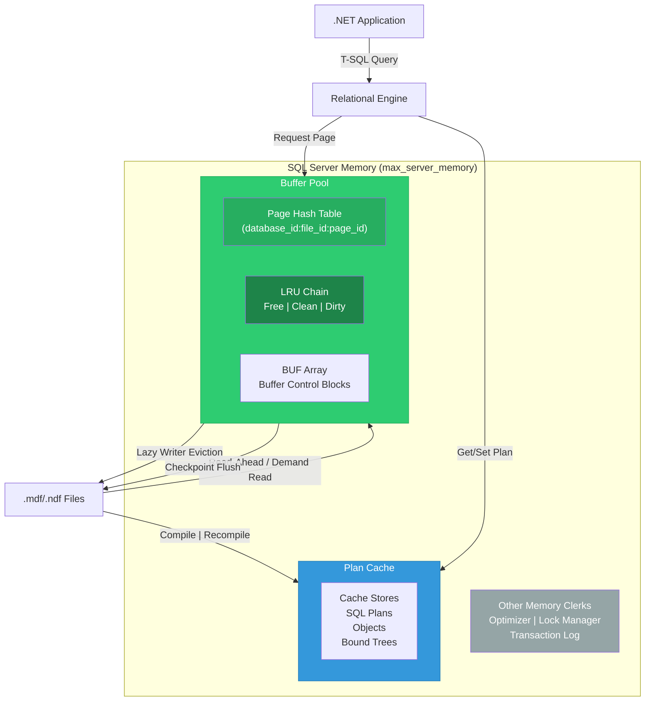
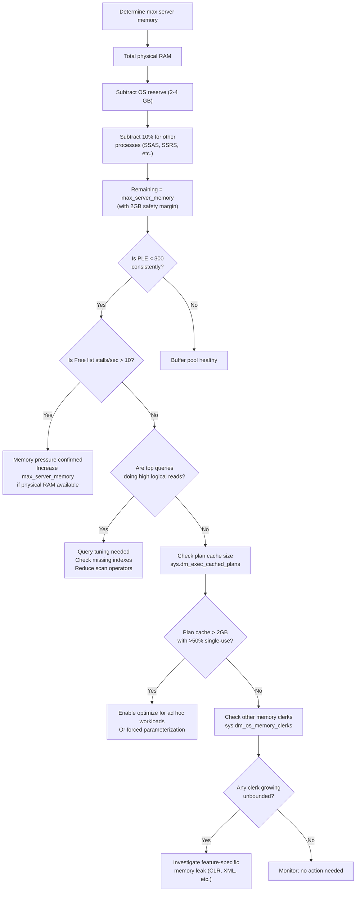

# Memory Architecture — Buffer Pool and Plan Cache

## Section 1 — Navigation

**Domain:** [[8 — Databases]] > **Group:** SQL Server Architecture & Storage Engine

**Previous:** [[8.267 — Database Engine SQL OS Layer]]  
**Next:** [[8.269 — SQLOS Scheduler Non-Preemptive Scheduling]]

**Prerequisites:**
- [[8.267 — Database Engine SQL OS Layer]]
- [[8.291 — SQL Server Memory Max Server Memory]]
- [[8.025 — Buffer Pool Page Management]]

**Where This Fits:** The buffer pool is the single most important memory structure in SQL Server — it determines whether a query reads from RAM (1µs) or disk (10ms). For a .NET backend engineer, buffer pool health directly translates to API response times: a "cold" buffer pool adds 10-100ms of I/O latency per page touched. The plan cache determines whether query compilation (typically 1-100ms) is skipped on re-execution. Misconfiguring `max server memory` causes either wasted RAM or catastrophic page pressure. Understanding this architecture is essential for diagnosing "the server was faster yesterday" scenarios.

---

## Section 2 — Core Mental Model

The buffer pool is SQL Server's primary data cache — a memory region within `sqlservr.exe` that holds 8KB data pages read from disk. It is organized as a BUF (buffer control block) array with a hash table for page lookups, a linked list for LRU aging, and a background Lazy Writer that flushes cold pages. The plan cache (`sys.dm_exec_cached_plans`) stores compiled execution plans as memory objects managed by the CACHESTORE clerk. Both live under the SQLOS memory manager and compete for the same `max server memory` budget. The Checkpoint process writes dirty pages to disk, the Lazy Writer evicts cold pages, and the Read-Ahead mechanism prefetches pages into the pool. Page Life Expectancy (PLE) is the primary health metric — it measures how long a page stays in the buffer pool before being evicted.

### Classification

- **Layer:** Memory Management (SQLOS-based)
- **Trade:** More cache = faster reads, but less memory for OS and other services
- **Scope:** Instance-wide, partitioned by NUMA node
- **Monitoring surface:** `sys.dm_os_buffer_descriptors`, `sys.dm_os_performance_counters`, `sys.dm_exec_cached_plans`, `sys.dm_os_memory_clerks`



### Key Properties

| Property | Detail |
|----------|--------|
| Buffer pool size | Controlled by `max server memory` minus non-BP clerks; typically 60-80% of configured max |
| Page size | 8KB — every data page is exactly 8KB |
| Page Life Expectancy | Seconds a page stays in BP before eviction; target >300 seconds |
| Dirty page threshold | Checkpoint flushes when dirty pages exceed recovery interval (default 60s) or when count exceeds `target_recovery_time` |
| Plan cache size | Dynamic; grows until it hits memory pressure or max server memory cap |
| Cache eviction | Lazy Writer triggers `CACHESTORE_FLUSH` or `CACHESTORE_CLOCK` when memory is needed |
| BP hash bucket | Number of hash buckets = (buffer pool pages / 4) or 64K, whichever is smaller |
| NUMA partitioning | Each NUMA node has its own buffer pool partition; cross-node access incurs remote memory access |

---

## Section 3 — Deep Mechanics

### Step-by-Step Buffer Pool Access

1. **Page request:** A query operator requests a page by (database_id, file_id, page_id).
2. **Hash lookup:** The buffer manager hashes the page coordinates to find the buffer descriptor in the hash table.
3. **Hit (cache):** The page is found, the latch is acquired (shared/exclusive), data is read, latch is released. This is a logical read — no I/O.
4. **Miss:** If the page is not in the hash table, a buffer is allocated from the free list (or a victim is selected from the LRU chain). An asynchronous I/O is issued to read the page from disk.
5. **I/O completion:** When the I/O completes (via IOCP), the page is placed in the buffer pool, hash table is updated, and the query proceeds. This is a physical read.
6. **Page modification:** If the query modifies data, the page is marked dirty. The modification is recorded in the transaction log. The page stays dirty in the buffer pool until checkpoint writes it to disk.
7. **Eviction:** The Lazy Writer periodically scans the LRU chain. Pages with no references and not recently used are moved to the free list, making room for new pages.

### Plan Cache Mechanics

1. **Compilation:** A query arrives. The relational engine checks the plan cache for an existing plan matching (query_hash + set_options + database_id).
2. **Cache hit:** Plan is found, execution starts immediately. No compilation overhead.
3. **Cache miss:** Optimizer compiles a new plan. Plan is stored in the plan cache.
4. **Eviction:** When memory pressure occurs, the Lazy Writer or dedicated clock algorithm removes least-used plans. Plans that are "single-use" are evicted first.

### DMV Queries to Observe Memory Architecture

```sql
-- Buffer pool size and allocation
SELECT 
    COUNT(*) AS total_buffers,
    COUNT(*) * 8 / 1024 AS total_bp_mb,
    SUM(CASE WHEN is_modified = 1 THEN 1 ELSE 0 END) AS dirty_buffers,
    SUM(CASE WHEN database_id = 32767 THEN 1 ELSE 0 END) AS tempdb_buffers,
    COUNT(DISTINCT database_id) AS databases_cached
FROM sys.dm_os_buffer_descriptors;

-- Buffer pool by database
SELECT 
    DB_NAME(database_id) AS database_name,
    COUNT(*) AS page_count,
    COUNT(*) * 8 / 1024 AS size_mb,
    SUM(CASE WHEN is_modified = 1 THEN 1 ELSE 0 END) AS dirty_pages
FROM sys.dm_os_buffer_descriptors
GROUP BY DB_NAME(database_id)
ORDER BY size_mb DESC;

-- Page Life Expectancy (PLE) — primary buffer pool health metric
SELECT cntr_value AS ple_seconds
FROM sys.dm_os_performance_counters
WHERE object_name LIKE '%Buffer Manager%'
      AND counter_name = 'Page life expectancy';

-- Buffer pool performance counters
SELECT counter_name, cntr_value
FROM sys.dm_os_performance_counters
WHERE object_name LIKE '%Buffer Manager%'
      AND counter_name IN (
          'Page life expectancy',
          'Lazy writes/sec',
          'Page reads/sec',
          'Page writes/sec',
          'Checkpoint pages/sec',
          'Database pages',
          'Free pages',
          'Reserved pages',
          'Stolen pages'
      );

-- Plan cache summary
SELECT 
    objtype AS plan_type,
    COUNT(*) AS plan_count,
    SUM(CAST(size_in_bytes AS BIGINT)) / 1024 / 1024 AS total_size_mb,
    SUM(usecounts) AS total_uses,
    AVG(usecounts) AS avg_use_count,
    SUM(CAST((
        SELECT SUM(s.refcounts) 
        FROM sys.dm_os_memory_objects mo 
        WHERE mo.parent_address = p.memory_object_address
    ) AS BIGINT)) AS memory_objects
FROM sys.dm_exec_cached_plans p
GROUP BY objtype
ORDER BY total_size_mb DESC;

-- Top plans by memory consumption
SELECT TOP 20
    objtype,
    size_in_bytes / 1024 AS size_kb,
    usecounts,
    refcounts,
    plan_handle,
    SUBSTRING(st.text, 1, 200) AS batch_text
FROM sys.dm_exec_cached_plans p
CROSS APPLY sys.dm_exec_sql_text(p.plan_handle) st
ORDER BY size_in_bytes DESC;

-- Memory clerks (where the memory goes)
SELECT 
    type AS clerk_type,
    SUM(pages_kb) AS total_kb,
    SUM(virtual_memory_committed_kb) AS vmem_committed_kb,
    SUM(shared_memory_committed_kb) AS smem_committed_kb,
    COUNT(*) AS clerk_count
FROM sys.dm_os_memory_clerks
GROUP BY type
ORDER BY total_kb DESC;

-- Free list stalls — indicates memory pressure
SELECT cntr_value AS free_list_stalls_per_sec
FROM sys.dm_os_performance_counters
WHERE object_name LIKE '%Buffer Manager%'
      AND counter_name = 'Free list stalls/sec';

-- Buffer pool by object (table/index) for a specific database
SELECT 
    OBJECT_NAME(p.object_id) AS table_name,
    i.name AS index_name,
    COUNT(*) AS page_count,
    COUNT(*) * 8 / 1024 AS size_mb,
    SUM(CASE WHEN bd.is_modified = 1 THEN 1 ELSE 0 END) AS dirty_pages
FROM sys.dm_os_buffer_descriptors bd
JOIN sys.allocation_units au ON bd.allocation_unit_id = au.allocation_unit_id
JOIN sys.partitions p ON au.container_id = p.hobt_id
JOIN sys.indexes i ON p.object_id = i.object_id AND p.index_id = i.index_id
WHERE bd.database_id = DB_ID('OrdersDb')
GROUP BY p.object_id, i.name
ORDER BY size_mb DESC;
```

### Failure Modes with Detection DMVs

| Failure Mode | Detection | Resolution |
|---|---|---|
| PLE too low (<300s) | `cntr_value < 300` in Buffer Manager PLE counter | Increase `max server memory`; optimize queries to reduce logical reads |
| Free list stalls | `Free list stalls/sec > 10` | Buffer pool is starved — SQL Server cannot find free buffers; add RAM or reduce memory consumption |
| Plan cache bloat | `single_use_plans_count` high; plan cache > 5GB for small workload | Enable "optimize for ad hoc workloads"; use forced parameterization |
| Dirty page flush bottleneck | `Checkpoint pages/sec` at max; `avg_write_stall_ms > 50ms` in `sys.dm_io_virtual_file_stats` | Disk I/O cannot keep up with checkpoint flushing; faster storage needed |
| Memory clerk leak | Clerk type shows unbounded growth over hours | Check for non-yielding memory; DBCC FREEPROCCACHE or restart as last resort |

```sql
-- Detection: low PLE investigation
SELECT 
    (SELECT cntr_value FROM sys.dm_os_performance_counters
     WHERE counter_name = 'Page life expectancy') AS ple,
    (SELECT cntr_value FROM sys.dm_os_performance_counters
     WHERE counter_name = 'Lazy writes/sec') AS lazy_writes,
    (SELECT cntr_value FROM sys.dm_os_performance_counters
     WHERE counter_name = 'Free list stalls/sec') AS free_list_stalls,
    (SELECT cntr_value FROM sys.dm_os_performance_counters
     WHERE counter_name = 'Page reads/sec') AS page_reads;

-- Detection: plan cache memory pressure
SELECT 
    objtype,
    COUNT(*) AS plans,
    SUM(usecounts) AS total_uses,
    AVG(usecounts) AS avg_uses,
    SUM(size_in_bytes) / 1024 / 1024 AS size_mb
FROM sys.dm_exec_cached_plans
GROUP BY objtype
ORDER BY size_mb DESC;

-- Detection: memory pressure from external (OS)
SELECT 
    total_physical_memory_kb / 1024 AS total_ram_mb,
    available_physical_memory_kb / 1024 AS available_ram_mb,
    system_memory_state_desc
FROM sys.dm_os_sys_memory;
```

---

## Section 4 — Production Patterns and Implementation

### DMV-Based Monitoring Queries

```sql
-- Daily buffer pool health snapshot
INSERT INTO dbo.BufferPoolHealth (snapshot_time, ple, lazy_writes, 
    free_list_stalls, page_reads, bp_size_mb, free_pages_pct,
    stolen_pages_pct)
SELECT 
    GETDATE(),
    (SELECT cntr_value FROM sys.dm_os_performance_counters
     WHERE counter_name = 'Page life expectancy'),
    (SELECT cntr_value FROM sys.dm_os_performance_counters
     WHERE counter_name = 'Lazy writes/sec'),
    (SELECT cntr_value FROM sys.dm_os_performance_counters
     WHERE counter_name = 'Free list stalls/sec'),
    (SELECT cntr_value FROM sys.dm_os_performance_counters
     WHERE counter_name = 'Page reads/sec'),
    (SELECT cntr_value FROM sys.dm_os_performance_counters
     WHERE counter_name = 'Database pages') * 8 / 1024 AS bp_mb,
    (SELECT cntr_value FROM sys.dm_os_performance_counters
     WHERE counter_name = 'Free pages') * 100.0 / 
        NULLIF((SELECT cntr_value FROM sys.dm_os_performance_counters
                WHERE counter_name = 'Target pages'), 0) AS free_pct,
    (SELECT cntr_value FROM sys.dm_os_performance_counters
     WHERE counter_name = 'Stolen pages') * 100.0 / 
        NULLIF((SELECT cntr_value FROM sys.dm_os_performance_counters
                WHERE counter_name = 'Target pages'), 0) AS stolen_pct;

-- Which objects consume the most buffer pool space in OrdersDb
SELECT TOP 20
    OBJECT_SCHEMA_NAME(p.object_id) + '.' + OBJECT_NAME(p.object_id) AS table_name,
    i.name AS index_name,
    i.type_desc AS index_type,
    COUNT(*) * 8 / 1024 AS size_mb,
    SUM(CASE WHEN bd.is_modified = 1 THEN 1 ELSE 0 END) * 8 / 1024 AS dirty_mb
FROM sys.dm_os_buffer_descriptors bd
JOIN sys.allocation_units au ON bd.allocation_unit_id = au.allocation_unit_id
JOIN sys.partitions p ON au.container_id = p.hobt_id
JOIN sys.indexes i ON p.object_id = i.object_id AND p.index_id = i.index_id
WHERE bd.database_id = DB_ID('OrdersDb')
GROUP BY p.object_id, i.name, i.type_desc
ORDER BY size_mb DESC;

-- Plan cache: Ad hoc vs prepared plans
SELECT 
    CASE 
        WHEN objtype = 'Adhoc' THEN 'Ad Hoc'
        WHEN objtype = 'Prepared' THEN 'Prepared'
        WHEN objtype = 'Proc' THEN 'Stored Procedure'
        ELSE objtype
    END AS plan_type,
    COUNT(*) AS plan_count,
    SUM(usecounts) AS total_executions,
    SUM(size_in_bytes) / 1024 / 1024 AS size_mb,
    AVG(usecounts) AS avg_executions
FROM sys.dm_exec_cached_plans
GROUP BY objtype
ORDER BY size_mb DESC;

-- Buffer pool NUMA distribution
SELECT 
    memory_node_id,
    COUNT(*) AS page_count,
    COUNT(*) * 8 / 1024 AS size_mb
FROM sys.dm_os_buffer_descriptors
GROUP BY memory_node_id
ORDER BY memory_node_id;
```

### EF Core Logging to Observe Buffer Pool Behavior

```csharp
// Configure EF Core to log logical reads indirectly
protected override void OnConfiguring(DbContextOptionsBuilder optionsBuilder)
{
    optionsBuilder
        .UseSqlServer(connectionString)
        .LogTo(
            message => {
                // Detect full table scans (indicates missing index, causing buffer pool pressure)
                if (message.Contains("Table Scan") || message.Contains("Clustered Index Scan"))
                {
                    Debug.WriteLine($"[BUFFER POOL WARNING] Table scan detected: {message}");
                    System.Diagnostics.Trace.TraceWarning(message);
                }
                
                // Monitor query timing — if a normally fast query slows, BP may be cold
                var match = System.Text.RegularExpressions.Regex.Match(
                    message, @"(\d+)\s*ms");
                if (match.Success && int.TryParse(match.Groups[1].Value, out var ms))
                {
                    if (ms > 5000)
                    {
                        // Log BP stats to correlate
                        LogBufferPoolStats();
                    }
                }
            },
            LogLevel.Information,
            DbContextLoggerOptions.None
        )
        .EnableDetailedErrors();
}

private static void LogBufferPoolStats()
{
    using var conn = new SqlConnection(connectionString);
    conn.Open();
    using var cmd = new SqlCommand(@"
        SELECT 'PLE' AS metric, cntr_value FROM sys.dm_os_performance_counters
        WHERE counter_name = 'Page life expectancy'
        UNION ALL
        SELECT 'Lazy_writes', cntr_value FROM sys.dm_os_performance_counters
        WHERE counter_name = 'Lazy writes/sec'", conn);
    
    using var reader = cmd.ExecuteReader();
    while (reader.Read())
    {
        Debug.WriteLine($"[BP STATS] {reader.GetString(0)} = {reader.GetInt64(1)}");
    }
}
```

### Configuration Patterns

```sql
-- Set max server memory (the primary buffer pool configuration)
EXEC sp_configure 'show advanced options', 1;
RECONFIGURE;
EXEC sp_configure 'max server memory (MB)', 4096;  -- 4GB
RECONFIGURE;

-- Set min server memory (guaranteed floor)
EXEC sp_configure 'min server memory (MB)', 1024;
RECONFIGURE;

-- Check memory configuration
SELECT name, value, value_in_use, minimum, maximum, is_dynamic
FROM sys.configurations
WHERE name IN (
    'max server memory (MB)',
    'min server memory (MB)',
    'index create memory (KB)',
    'min memory per query (KB)',
    'query wait (s)',
    'cost threshold for parallelism'
);

-- Enable optimize for ad hoc workloads (reduces plan cache bloat)
EXEC sp_configure 'optimize for ad hoc workloads', 1;
RECONFIGURE;

-- Configure recovery interval (influences checkpoint/dirty page behavior)
EXEC sp_configure 'recovery interval (min)', 0;  -- 0 = auto by SQL Server
RECONFIGURE;

-- Set target recovery time (ALTRE DATABASE)
ALTER DATABASE OrdersDb SET TARGET_RECOVERY_TIME = 60 SECONDS;

-- Force parameterization (converts ad hoc plans to parameterized)
ALTER DATABASE OrdersDb SET PARAMETERIZATION FORCED;

-- Clear plan cache for a specific database
ALTER DATABASE SCOPED CONFIGURATION CLEAR PROCEDURE_CACHE;

-- Clear entire plan cache (use with extreme caution in production)
DBCC FREEPROCCACHE;

-- Clear buffer pool (use with extreme caution — will hurt performance)
DBCC DROPCLEANBUFFERS;
```

### SQL Server vs PostgreSQL Differences

| Aspect | SQL Server | PostgreSQL |
|--------|------------|------------|
| Buffer pool name | Buffer Pool (BPOOL) | Shared Buffers |
| Default size | 0 MB (auto-grows based on `max server memory`) | 128MB (fixed at startup in `shared_buffers`) |
| Cache eviction | Lazy Writer scans LRU (clock algorithm variant) | Clock sweep (clock-sweep algorithm) |
| Plan cache | `sys.dm_exec_cached_plans` | Per-session (no shared plan cache in PG before 14; PG14+ has JIT shared cache) |
| Page size | 8KB fixed | 8KB default (configurable at compile time) |
| PLE tracking | Built-in `Page life expectancy` counter | No built-in PLE; use `pg_buffercache` extension |
| Dirty page threshold | Recovery interval / target recovery time | `bgwriter_delay` + `checkpoint_timeout` |
| Memory pressure detection | `Free list stalls/sec` performance counter | `pg_stat_bgwriter.buffers_alloc` vs `buffers_backend` |
| NUMA awareness | Automatic (partitioned per NUMA node) | Requires `shared_memory_type` and OS-level tuning |

### Realistic Names

| Component | Production Name |
|-----------|----------------|
| Buffer pool server | `SQLPROD-FIN-01` (max server memory 48GB) |
| PLE alert threshold | `< 300 seconds` for > 5 minutes |
| Plan cache bloat database | `OrdersDb` with 500k ad hoc plans |
| Memory pressure scenario | ETL job runs while OLTP is active; PLE drops from 5000 to 150 |
| Cold cache event | After SQL Server restart or `DBCC DROPCLEANBUFFERS` |

---

## Section 5 — Gotchas

**Pitfall 1: `max server memory` set too high, causing OS paging**  
→ **Symptom:** SQL Server configured for 60GB on a 64GB server. OS has only 4GB for itself + all other processes. Windows starts paging. PLE drops. Lazy writes/sec spikes to 100+. Queries that were 50ms now take 5 seconds.  
→ **Fix:** Reserve 2-4GB for OS (or 10% of RAM, whichever is larger). On a 64GB server, set `max server memory` to 55-58GB. If SSAS/SSRS run on same box, subtract their expected consumption.  
→ **Detection:**
```sql
SELECT total_physical_memory_kb / 1024 AS total_gb,
       available_physical_memory_kb / 1024 AS available_gb,
       system_memory_state_desc
FROM sys.dm_os_sys_memory;
```
→ **Cost:** OS paging adds 10-100ms latency per page fault. A query reading 10,000 pages — normally 50ms — now takes 50+ seconds.

**Pitfall 2: PLE misinterpreted across NUMA nodes**  
→ **Symptom:** PLE counter shows 5000 (healthy), but performance is terrible. The counter is averaged across all NUMA nodes; one node may have PLE=100 while another has PLE=9900.  
→ **Fix:** Query PLE per NUMA node:
```sql
SELECT memory_node_id, cntr_value AS ple_seconds
FROM sys.dm_os_performance_counters
CROSS JOIN sys.dm_os_nodes
WHERE counter_name = 'Node Page Life Expectancy';
```
→ **Cost:** A hot NUMA node with PLE=100 means that node's buffer pool is thrashing. Queries assigned to that node pay 10ms per I/O.

**Pitfall 3: Plan cache bloat from ad hoc queries**  
→ **Symptom:** Plan cache is 10GB+ even though the workload is small (<100 unique queries). Same query text with different whitespace or parameter values generates separate plans.  
→ **Fix:** Enable `optimize for ad hoc workloads` (stores a stub instead of full plan on first execution; stores real plan on second). Better: use forced parameterization or parameterized SQL in .NET.  
→ **Detection:**
```sql
SELECT COUNT(*) AS total_plans,
       SUM(CASE WHEN usecounts = 1 THEN 1 ELSE 0 END) AS single_use_plans,
       SUM(CASE WHEN usecounts = 1 THEN size_in_bytes ELSE 0 END) / 1024 / 1024 AS single_use_mb
FROM sys.dm_exec_cached_plans
WHERE objtype = 'Adhoc';
```
→ **Cost:** 10GB plan cache wastes memory that could be used for data pages. PLE drops because buffer pool is starved.

**Pitfall 4: `DBCC DROPCLEANBUFFERS` run in production**  
→ **Symptom:** After this command, every query pays full physical I/O. PLE drops to near 0. Response times spike 100x.  
→ **Fix:** Never run `DBCC DROPCLEANBUFFERS` in production unless testing cold cache performance. The buffer pool takes hours to warm up again.  
→ **Detection:**
```sql
SELECT cntr_value AS ple
FROM sys.dm_os_performance_counters
WHERE counter_name = 'Page life expectancy';
-- After DROPCLEANBUFFERS, PLE will be < 10 for extended period
```
→ **Cost:** Each query that previously hit cache now does physical I/O. On a busy OLTP system, this can cause a 30-60 minute performance degradation as the cache warms.

**Pitfall 5: Large index rebuilds flushing the buffer pool**  
→ **Symptom:** After an online index rebuild, all other queries slow down. The rebuild consumed significant memory and caused existing data pages to be evicted from the buffer pool.  
→ **Fix:** Schedule index maintenance during off-peak hours. Use `SORT_IN_TEMPDB = ON` to move sort memory pressure to TempDB (which has its own buffer pool). Consider `max_duration` for online index operations.  
→ **Detection:**
```sql
-- After index rebuild, check if PLE dropped significantly
SELECT cntr_value AS ple_before FROM sys.dm_os_performance_counters
WHERE counter_name = 'Page life expectancy';
-- Wait 1 minute, then:
SELECT cntr_value AS ple_after FROM sys.dm_os_performance_counters
WHERE counter_name = 'Page life expectancy';
```
→ **Cost:** PLE can drop by 50-80% during an index rebuild on a large table. All queries that were running in-memory now hit disk.

---

## Section 6 — Performance Implications

Buffer pool size and health directly determine query performance. Every logical read avoided saves 10ms of I/O.

### Benchmark: Cold Cache vs Warm Cache

```csharp
using BenchmarkDotNet.Attributes;
using BenchmarkDotNet.Running;
using Microsoft.Data.SqlClient;
using Dapper;

[MemoryDiagnoser]
public class BufferPoolCacheBenchmark
{
    private const string WarmConnectionString = 
        "Server=PROD-SQL-01;Database=OrdersDb;Integrated Security=true;Connection Timeout=30;";
    private const string ColdConnectionString = 
        "Server=PROD-SQL-01;Database=OrdersDb;Integrated Security=true;Connection Timeout=30;";

    private static readonly string Query = @"
        SELECT o.OrderId, o.OrderDate, o.CustomerId,
               SUM(ol.Quantity * ol.UnitPrice) AS OrderTotal
        FROM Sales.Orders o
        JOIN Sales.OrderLines ol ON o.OrderId = ol.OrderId
        WHERE o.OrderDate >= @startDate AND o.OrderDate < @endDate
        GROUP BY o.OrderId, o.OrderDate, o.CustomerId
        ORDER BY OrderTotal DESC;";

    [Benchmark(Baseline = true)]
    public async Task WarmCacheQuery()
    {
        await using var conn = new SqlConnection(WarmConnectionString);
        await conn.OpenAsync();
        // First execution warms cache; this measures warm performance
        var orders = await conn.QueryAsync(Query, new 
        { 
            startDate = new DateTime(2024, 1, 1), 
            endDate = new DateTime(2024, 1, 31) 
        });
    }

    [Benchmark]
    public async Task ColdCacheQuery()
    {
        // Clear buffer pool for this database only
        await using var clearConn = new SqlConnection(WarmConnectionString);
        await clearConn.OpenAsync();
        using var clearCmd = new SqlCommand("DBCC DROPCLEANBUFFERS", clearConn);
        await clearCmd.ExecuteNonQueryAsync();

        await using var conn = new SqlConnection(ColdConnectionString);
        await conn.OpenAsync();
        var orders = await conn.QueryAsync(Query, new 
        { 
            startDate = new DateTime(2024, 1, 1), 
            endDate = new DateTime(2024, 1, 31) 
        });
    }
}
```

**Expected Results:** Warm cache is 50-500x faster depending on the table size. Cold cache pays 10ms per 8KB page read. A query touching 10,000 pages takes 100 seconds on cold cache vs 200ms on warm cache (50x).

### Logical Reads and Wait Stats

```sql
SET STATISTICS IO ON;

-- Run query once (cold cache)
SELECT o.OrderId, SUM(ol.Quantity) AS TotalQty
FROM Sales.Orders o
JOIN Sales.OrderLines ol ON o.OrderId = ol.OrderId
WHERE o.OrderDate >= '2024-01-01'
GROUP BY o.OrderId;
-- Output: Table 'OrderLines'. Scan count 1, logical reads 15000, physical reads 15000
-- Output: Table 'Orders'. Scan count 1, logical reads 500, physical reads 500

-- Run again (warm cache)
SELECT o.OrderId, SUM(ol.Quantity) AS TotalQty
FROM Sales.Orders o
JOIN Sales.OrderLines ol ON o.OrderId = ol.OrderId
WHERE o.OrderDate >= '2024-01-01'
GROUP BY o.OrderId;
-- Output: Table 'OrderLines'. Scan count 1, logical reads 15000, physical reads 0
-- Output: Table 'Orders'. Scan count 1, logical reads 500, physical reads 0

-- Wait stats during cold cache query
SELECT wait_type, wait_time_ms, waiting_tasks_count
FROM sys.dm_os_wait_stats
WHERE wait_type LIKE 'PAGEIOLATCH%'
ORDER BY wait_time_ms DESC;
-- PAGEIOLATCH_SH will spike during cold cache execution
```

### Memory Grant Impact

```sql
-- Check memory grants for hash/sort operations — indicator of memory pressure
SELECT 
    session_id,
    requested_memory_kb,
    granted_memory_kb,
    required_memory_kb,
    used_memory_kb,
    max_used_memory_kb,
    ideal_memory_kb,
    CASE WHEN granted_memory_kb < requested_memory_kb 
         THEN 'Memory Pressure' ELSE 'Sufficient' END AS grant_status
FROM sys.dm_exec_query_memory_grants
WHERE session_id > 50;

-- If grants are smaller than requested, queries spill to TempDB
-- Spills add 100x more I/O
```

---

## Section 7 — Interview Arsenal

### Questions

**Foundational:**
1. What is the buffer pool and what is its primary purpose?
2. What is Page Life Expectancy (PLE) and what is a healthy value?
3. What is the difference between a logical read and a physical read?

**Intermediate:**
4. How does the Lazy Writer interact with the buffer pool? What does a high Lazy writes/sec indicate?
5. You notice PLE drops from 2000 to 100 after an ETL job runs. How do you investigate?
6. What is the relationship between `max server memory`, buffer pool, and plan cache?

**Advanced:**
7. A .NET application sends the same query 1000 times with different whitespace formatting. How does this affect the plan cache, and what three remediation strategies do you recommend?
8. Describe the buffer cache eviction policy. How does SQL Server decide which pages to keep and which to evict? How does NUMA affect this?

### Spoken Answers

**Q1: What is the buffer pool?**

**Average:** It's where SQL Server caches data pages in memory so queries don't have to read from disk every time.

**Great:** The buffer pool is SQL Server's primary data cache — a memory region managed by SQLOS that holds 8KB data pages read from database files. It is organized as an array of buffer control blocks (BUF) indexed by a hash table mapping (database_id, file_id, page_id) to the in-memory page. Access involves acquiring a latch on the buffer, reading/writing the page, and releasing the latch. The buffer pool reduces query I/O from 10ms per disk read to ~1µs per memory read. Its size is determined by `max server memory` minus allocations for other memory clerks (plan cache, locks, optimizer). The health metric is Page Life Expectancy (PLE) — seconds a page stays in the pool before eviction. Target PLE is >300 seconds; lower indicates memory pressure.

**Q4: How does the Lazy Writer interact with the buffer pool?**

**Average:** The Lazy Writer cleans old pages out of the buffer pool to make room for new pages.

**Great:** The Lazy Writer is a background SQLOS task that runs periodically (once per second nominally) to scan the buffer pool's LRU chain. It looks for pages that are cold (not recently referenced) and either flushes dirty pages to disk (if modified) or moves clean pages to the free list. A high `Lazy writes/sec` (sustained >20/sec) indicates memory pressure — the buffer pool is too small for the workload, forcing the Lazy Writer to constantly scavenge pages. This contrasts with Checkpoint, which proactively flushes dirty pages based on recovery interval. The Lazy Writer is reactive; Checkpoint is proactive.

**Q7: Ad hoc query plan cache bloat.**

**Average:** Use parameterized queries or sp_executesql. Also enable optimize for ad hoc workloads.

**Great:** When a .NET application sends SQL with different whitespace or inline values, the optimizer treats each batch as a distinct query hash, generating a separate plan for each. The plan cache fills with single-use plans (detectable via `sys.dm_exec_cached_plans WHERE usecounts = 1 AND objtype = 'Adhoc'`). Three strategies: (1) **Application-level parameterization** — use `SqlCommand.Parameters` with `@p0` placeholders; EF Core does this by default. (2) **`optimize for ad hoc workloads`** — stores a 48-byte stub instead of the full plan on first execution; only converts to full plan on second execution, reducing plan cache memory by 70-90%. (3) **Forced parameterization** — `ALTER DATABASE SET PARAMETERIZATION FORCED` — SQL Server auto-parameterizes qualifying queries. Each approach has tradeoffs: forced parameterization can cause parameter sniffing; app-level parameterization requires code changes.

### Comparison Table

| Aspect | Buffer Pool | Plan Cache | Other Clerks |
|--------|-------------|------------|--------------|
| Purpose | Cache data pages | Cache compiled plans | Locks, optimizer, CLR, etc. |
| Memory share | 60-80% of `max server memory` | 5-15% of `max server memory` | 5-15% of `max server memory` |
| Eviction policy | LRU (clock algorithm) | LRU + frequency (clock algorithm) | Clerk-specific |
| Primary DMV | `sys.dm_os_buffer_descriptors` | `sys.dm_exec_cached_plans` | `sys.dm_os_memory_clerks` |
| Primary metric | PLE | `usecounts`, `size_in_bytes` | `pages_kb` trend |
| Pressure signal | Free list stalls/sec | Single-use plan count | `RESOURCE_SEMAPHORE` waits |
| Clear command | `DBCC DROPCLEANBUFFERS` | `DBCC FREEPROCCACHE` | `DBCC FREESYSTEMCACHE` |

---

## Section 8 — Decision Framework



### Application Checklist

- [ ] `max server memory` set to safe value (OS reserve + other services accounted for)
- [ ] PLE > 300 seconds over 24-hour average
- [ ] Free list stalls/sec consistently < 10
- [ ] Lazy writes/sec < 20 sustained
- [ ] Plan cache single-use plans < 30% of total plans
- [ ] `optimize for ad hoc workloads` enabled
- [ ] .NET application uses parameterized queries (EF Core by default, Dapper by design)
- [ ] Index maintenance scheduled off-peak to avoid buffer pool flush
- [ ] Query performance monitoring in place (logical reads per query tracked)
- [ ] Memory alerts configured: PLE < 300 for > 5 minutes
- [ ] NUMA node PLE monitored separately (not just aggregate)
- [ ] `sys.dm_os_memory_clerks` checked weekly for unbounded growth

### Tradeoff Summary

| Decision | Upside | Downside |
|----------|--------|----------|
| High `max server memory` | More cache = faster queries | Risk OS paging if too high |
| Low `max server memory` | Safety margin for OS | More physical reads; slower queries |
| `optimize for ad hoc workloads` | 70-90% reduction in plan cache memory | Slight CPU overhead for converting stub to plan on 2nd execution |
| Forced parameterization | Eliminates ad hoc plan bloat | Parameter sniffing risk; may cause suboptimal plans |
| `DBCC DROPCLEANBUFFERS` for testing | Measures cold cache performance | Devastating to production performance |

### Scale Thresholds

| RAM Size | Max Server Memory | Expected PLE | Notes |
|----------|-------------------|--------------|-------|
| 8 GB | 5-6 GB | 500-1000 | Dev/test only |
| 32 GB | 26-28 GB | 1000-3000 | Small OLTP |
| 64 GB | 55-58 GB | 2000-6000 | Mid OLTP with monitoring |
| 128 GB | 115-120 GB | 5000-15000 | Enterprise OLTP |
| 256 GB | 230-240 GB | 10000-30000 | Data warehouse / heavy OLTP |
| 512 GB | 460-480 GB | 20000+ | Very large; need NUMA tuning |

---

## Section 9 — Self-Check

### Conceptual Questions

1. What is the difference between a logical read and a physical read in the buffer pool?
2. What does Page Life Expectancy measure and why is 300 seconds a common threshold?
3. How does the Lazy Writer differ from the Checkpoint process?
4. What is the relationship between `Free list stalls/sec` and buffer pool health?
5. Why does `optimize for ad hoc workloads` reduce plan cache memory usage?
6. What memory clerk does the plan cache belong to, and how can you see its size?
7. How does NUMA affect buffer pool monitoring?
8. What happens when a query needs a memory grant larger than what is available?
9. How does an index rebuild affect the buffer pool and PLE?
10. What information does `sys.dm_os_buffer_descriptors` provide for a given database?

### Challenges

1. **DMV query:** Write a query that returns the top 10 tables consuming buffer pool space in the current database, their index name, size in MB, and percentage of total buffer pool.
2. **Analysis:** Your production server has 64GB RAM, `max server memory` = 60GB, PLE = 150, Free list stalls/sec = 25, Lazy writes/sec = 40. OS available memory = 1.5GB. Diagnose the problem and recommend three changes.
3. **Diagnosis:** A stored procedure that normally runs in 200ms now takes 30 seconds. The query plan is the same. No schema changes occurred. Using only buffer pool and memory DMVs, determine whether the issue is memory pressure, plan cache eviction, or data volume growth.
4. **Configuration:** Write a T-SQL script that sets up a buffer pool monitoring job: capture PLE, Lazy writes/sec, free list stalls/sec, and buffer pool size every 5 minutes into a permanent table. Include a query that alerts if PLE falls below 300 for 3 consecutive readings.
5. **Reproduction:** Create a SQL script that simulates buffer pool pressure by repeatedly scanning a large table without caching, then show the PLE impact using performance counters.

<details>
<summary>Answers</summary>

**Q1:** A logical read occurs when the buffer manager finds the requested page in the buffer pool — no physical I/O is needed. A physical read occurs when the page is not in the buffer pool and must be fetched from disk. Logical reads cost ~1µs; physical reads cost ~10ms. `SET STATISTICS IO ON` shows both counts.

**Q2:** PLE measures the average number of seconds a page remains in the buffer pool before being evicted. The 300-second (5-minute) threshold is a heuristic: if pages stay less than 5 minutes, the cache is too small for the workload. PLE below 300 means pages are being evicted before they can be reused, causing excessive physical I/O.

**Q3:** The Checkpoint process proactively flushes dirty pages to disk to minimize recovery time. It runs based on the recovery interval configuration (default 60 seconds worth of log). The Lazy Writer reactively evicts cold (unreferenced) pages to maintain a pool of free buffers. Checkpoint reduces crash recovery time; Lazy Writer maintains free buffer availability. Checkpoint writes dirty pages; Lazy Writer evicts both clean and dirty pages.

**Q4:** `Free list stalls/sec` counts how many times per second a query had to wait for a free buffer page. A high value (>10) indicates the buffer pool has no free pages — SQL Server is thrashing. Each stall causes a query to pause while the Lazy Writer is signaled to free pages. This is a direct symptom of the buffer pool being too small.

**Q5:** Without this setting, the first execution of an ad hoc batch creates a full compiled plan (~40KB or more) that may never be reused. With the setting enabled, the first execution creates only a 48-byte "stub" — just enough to recognize the query next time. On the second execution, the full plan is compiled and cached. For workloads with many single-use queries, this reduces plan cache memory by 70-90%.

**Q6:** The plan cache is managed by the `CACHESTORE` memory clerk type. View its size with: `SELECT type, SUM(pages_kb) AS size_kb FROM sys.dm_os_memory_clerks WHERE type LIKE '%CACHESTORE%' GROUP BY type;`

**Q7:** On NUMA systems, each NUMA node has its own buffer pool partition. The aggregate PLE counter averages across all nodes, hiding per-node pressure. One node may have PLE=100 while another has PLE=5000. Use `Node Page Life Expectancy` performance counter to monitor per-node values. Cross-node memory accesses are more expensive.

**Q8:** The query waits on `RESOURCE_SEMAPHORE` until a memory grant is available. If the grant cannot be satisfied within `query wait` (default 25x estimated query cost), the query timed out with error 8645. Queries that get a partial grant may spill to TempDB, causing 100x slower execution due to disk I/O.

**Q9:** An index rebuild allocates significant memory for sorting, which comes from the general memory pool (not just the buffer pool). This can increase pressure on other memory clerks. Additionally, the rebuild reads index pages into the buffer pool and marks them dirty as it modifies them. The resulting flush activity can evict user data pages, reducing PLE. Post-rebuild, PLE may drop significantly, taking minutes to recover as hot pages are re-cached.

**Q10:** `sys.dm_os_buffer_descriptors` shows every 8KB page in the buffer pool, including which allocation unit owns it, whether it is dirty, which database it belongs to, and its NUMA node. By joining with `sys.allocation_units`, `sys.partitions`, and `sys.indexes`, you can determine how much buffer pool space each table and index consumes.

---

**Challenge 1:**
```sql
SELECT TOP 10
    OBJECT_SCHEMA_NAME(p.object_id) + '.' + OBJECT_NAME(p.object_id) AS table_name,
    i.name AS index_name,
    COUNT(*) * 8 / 1024 AS size_mb,
    CAST(COUNT(*) * 100.0 / NULLIF(SUM(COUNT(*)) OVER(), 0) AS DECIMAL(5,2)) AS pct_of_total
FROM sys.dm_os_buffer_descriptors bd
JOIN sys.allocation_units au ON bd.allocation_unit_id = au.allocation_unit_id
JOIN sys.partitions p ON au.container_id = p.hobt_id
JOIN sys.indexes i ON p.object_id = i.object_id AND p.index_id = i.index_id
WHERE bd.database_id = DB_ID()
GROUP BY p.object_id, i.name
ORDER BY size_mb DESC;
```

**Challenge 2:** The problem is over-allocation: 60GB for SQL Server on 64GB leaves only 4GB for OS and other processes. With only 1.5GB OS available, Windows is paging. Fixes: (1) Reduce `max server memory` to 55GB to give OS 9GB. (2) Move SSAS/SSRS to a separate server to eliminate competition. (3) Alternatively, add 32GB RAM to the server (total 96GB, set max to 88GB).

**Challenge 3:** Check these in order:
- `sys.dm_os_performance_counters` for PLE — if PLE is low (<300), memory pressure is causing the slowdown.
- `sys.dm_os_wait_stats` for `PAGEIOLATCH_SH` — high I/O waits suggest buffer pool misses.
- `sys.dm_exec_query_stats` for the procedure — if `total_logical_reads` per execution is the same but execution is slower, the reads are becoming physical (cold cache).
- `sys.dm_db_index_usage_stats` — if the last user seek/scan time is old, the index pages may have been evicted.

**Challenge 4:**
```sql
CREATE TABLE dbo.BufferPoolMonitor (
    snapshot_time DATETIME2 NOT NULL DEFAULT GETDATE(),
    ple INT,
    lazy_writes INT,
    free_list_stalls INT,
    bp_pages BIGINT,
    bp_size_mb AS (bp_pages * 8 / 1024),
    PRIMARY KEY (snapshot_time)
);

INSERT INTO dbo.BufferPoolMonitor (ple, lazy_writes, free_list_stalls, bp_pages)
SELECT 
    (SELECT cntr_value FROM sys.dm_os_performance_counters
     WHERE counter_name = 'Page life expectancy'),
    (SELECT cntr_value FROM sys.dm_os_performance_counters
     WHERE counter_name = 'Lazy writes/sec'),
    (SELECT cntr_value FROM sys.dm_os_performance_counters
     WHERE counter_name = 'Free list stalls/sec'),
    (SELECT cntr_value FROM sys.dm_os_performance_counters
     WHERE counter_name = 'Database pages');

-- Alert query
SELECT snapshot_time, ple
FROM dbo.BufferPoolMonitor
WHERE ple < 300
ORDER BY snapshot_time DESC;

-- Three consecutive < 300 check
WITH AlertCheck AS (
    SELECT snapshot_time, ple,
           LAG(ple, 1) OVER (ORDER BY snapshot_time) AS ple_1,
           LAG(ple, 2) OVER (ORDER BY snapshot_time) AS ple_2
    FROM dbo.BufferPoolMonitor
)
SELECT 'ALERT: PLE below 300 for 3 consecutive readings' AS message
FROM AlertCheck
WHERE ple < 300 AND ple_1 < 300 AND ple_2 < 300;
```

**Challenge 5:**
```sql
-- Simulate buffer pool pressure (run in multiple sessions)
DECLARE @i INT = 0;
WHILE @i < 100
BEGIN
    SELECT COUNT(*) FROM Sales.OrderLines WITH (NOLOCK);  -- Forces full scan
    SET @i = @i + 1;
END;

-- Monitor PLE impact during pressure
SELECT 
    GETDATE() AS snapshot_time,
    (SELECT cntr_value FROM sys.dm_os_performance_counters
     WHERE counter_name = 'Page life expectancy') AS ple,
    (SELECT cntr_value FROM sys.dm_os_performance_counters
     WHERE counter_name = 'Lazy writes/sec') AS lazy_writes,
    (SELECT cntr_value FROM sys.dm_os_performance_counters
     WHERE counter_name = 'Free list stalls/sec') AS free_stalls;
```

</details>
