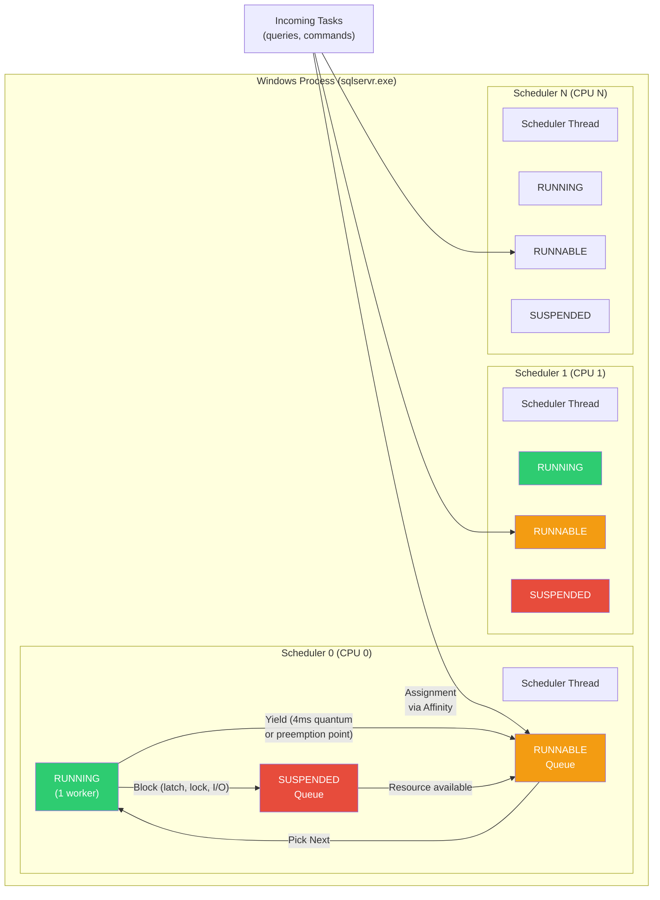
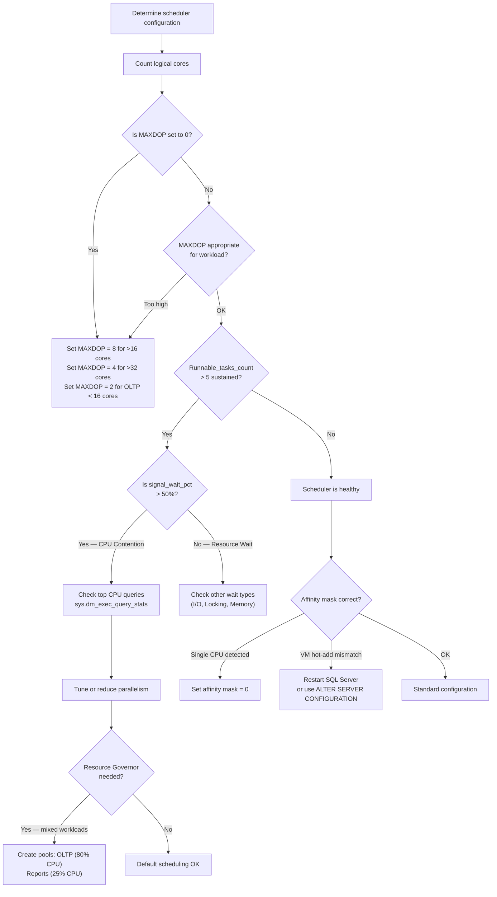

# SQLOS Scheduler — Non-Preemptive Scheduling

## Section 1 — Navigation

**Domain:** [[8 — Databases]] > **Group:** SQL Server Architecture & Storage Engine

**Previous:** [[8.268 — Memory Architecture Buffer Pool and Plan Cache]]  
**Next:** [[8.270 — Worker Threads Thread Pool Management]]

**Prerequisites:**
- [[8.267 — Database Engine SQL OS Layer]]
- [[8.270 — Worker Threads Thread Pool Management]]
- [[8.336 — Query Execution Pipeline Parse Bind Optimize Execute]]

**Where This Fits:** The SQLOS scheduler is the core of SQL Server's cooperative (non-preemptive) scheduling model — it determines how worker threads share CPU without relying on the Windows kernel. A .NET backend engineer debugging CPU contention, erratic query response times, or "SOS_SCHEDULER_YIELD" waits needs to understand how the scheduler allocates CPU quantums, how yielding works, and why a query that runs fine on a development laptop (4 cores) stalls on a 32-core production server. The scheduler is also the building block for parallelism — understanding how it distributes work across schedulers is essential for configuring MAXDOP, affinity mask, and Resource Governor.

---

## Section 2 — Core Mental Model

The SOS (SQL OS Scheduler) is the abstraction that enables SQL Server to manage thousands of concurrent tasks without creating thousands of Windows threads. Each SOS scheduler maps to exactly one Windows thread (the "scheduler thread"), which runs tasks cooperatively. A task runs for a quantum of ~4ms, then voluntarily yields. The scheduler maintains three queues: RUNNING (one worker), RUNNABLE (workers ready to run), and SUSPENDED (workers waiting for a resource). When a worker yields or blocks, the scheduler picks the next worker from the runnable queue (FIFO within priority). This cooperative model avoids Windows context switches (~8,000 cycles) and gives SQL Server deterministic control over CPU distribution.

### Classification

- **Layer:** SQLOS — CPU Scheduling
- **Trade:** Deterministic cooperative multitasking vs. inability to handle non-yielding code paths
- **Scope:** One scheduler per logical CPU core; all schedulers share the SQL Server process
- **Monitoring surface:** `sys.dm_os_schedulers`, `sys.dm_os_workers`, `sys.dm_os_tasks`



### Key Properties

| Property | Detail |
|----------|--------|
| Scheduler count | One per logical CPU core (visible in `sys.dm_os_schedulers WHERE scheduler_id < 255`) |
| Quantum duration | ~4ms of CPU time before a voluntary yield is required |
| Runnable queue | FIFO queue of workers ready to execute but waiting for CPU |
| Context switches | ~100 cycles (user-mode yield) vs ~8,000 cycles (Windows kernel switch) |
| Preemption points | Code locations where yield is safe: latch waits, I/O start, batch boundaries, every ~4ms |
| Non-yielding detection | SQLOS detects workers that do not yield within ~4ms; logs to ERRORLOG |
| Parallel tasks | A single query can split into multiple tasks across schedulers (MAXDOP) |
| NUMA awareness | Schedulers are grouped by NUMA node; cross-node scheduling is avoided |
| Hidden schedulers | `scheduler_id >= 255` — reserved for DAC, system tasks, resource monitor |

---

## Section 3 — Deep Mechanics

### Step-by-Step Scheduler Execution Cycle

1. **Task arrives:** A new request (query batch) arrives. SQLOS creates a task (`sys.dm_os_tasks`) and binds it to a worker (`sys.dm_os_workers`). The worker is placed on the runnable queue of the appropriate scheduler (based on NUMA node of the connection and affinity mask).

2. **Scheduler picks worker:** The scheduler thread picks the next worker from the runnable queue. The worker becomes RUNNING.

3. **Execution begins:** The worker executes T-SQL code — parsing, optimization, plan execution. The worker tracks its own CPU consumption.

4. **Yield at preemption point:** When the worker reaches a preemption point (latch acquire, I/O start, page boundary, or 4ms elapsed), it checks if other workers are in the runnable queue. If yes, it voluntarily yields: it saves its state, moves itself to the runnable queue (if still ready) or to the suspended queue (if waiting for resource), and the scheduler picks the next worker. This is `SOS_SCHEDULER_YIELD`.

5. **I/O completion:** When an async I/O completes, the IOCP posts a completion. Any available worker can pick it up. The task is moved from suspended to runnable.

6. **Quantum expired with no yield:** If a worker does not yield for ~4ms, the scheduler flags it as "non-yielding." SQLOS logs an informational message. If it exceeds ~15ms, a non-yielding scheduler dump is triggered.

7. **Task completes:** The final result set is returned to the client. The worker is returned to the thread pool (free list), ready for the next task.

### Scheduler State Transitions

```
                    ┌─────────────────┐
                    │   SUSPENDED     │
                    │ (waiting for    │
                    │  latch/lock/IO) │
                    └────────┬────────┘
                             │ Resource available
                             │ (IOCP completion, lock granted)
                             ▼
┌──────────┐         ┌─────────────────┐
│ RUNNABLE │◄───────│    RUNNING      │
│ (ready,  │         │ (executing T-SQL)│
│ no CPU)  │────────►│                 │
└──────────┘  Yield  └─────────────────┘
             (quantum 
              expired / 
           preemption pt)
```

### DMV Queries to Observe Scheduling

```sql
-- Scheduler health and runnable queue depth
SELECT 
    scheduler_id,
    cpu_id,
    status,
    is_online,
    current_tasks_count,
    runnable_tasks_count,
    work_queue_count,
    pending_disk_io_count,
    preemptive_switches_count,
    context_switches_count,
    last_timer_activity
FROM sys.dm_os_schedulers
WHERE scheduler_id < 255
ORDER BY scheduler_id;

-- Runnable queue depth > 5 indicates CPU pressure
SELECT scheduler_id, runnable_tasks_count, current_tasks_count
FROM sys.dm_os_schedulers
WHERE runnable_tasks_count > 5
ORDER BY runnable_tasks_count DESC;

-- Workers on each scheduler
SELECT 
    w.scheduler_id,
    w.worker_address,
    w.status,
    w.is_preemptive,
    w.is_sick,
    w.task_bound,
    w.quantum_expiration_time,
    t.task_state,
    t.session_id,
    r.command,
    r.wait_type,
    r.wait_time
FROM sys.dm_os_workers w
LEFT JOIN sys.dm_os_tasks t ON w.task_address = t.task_address
LEFT JOIN sys.dm_exec_requests r ON t.session_id = r.session_id
WHERE w.scheduler_id < 255
ORDER BY w.scheduler_id, w.status;

-- Tasks currently running with scheduler assignment
SELECT 
    t.task_address,
    t.task_state,
    t.scheduler_id,
    t.session_id,
    t.executing_worker_address,
    t.pending_io_count,
    t.pending_io_byte_count,
    t.pending_io_handle,
    r.command,
    r.wait_type,
    r.last_wait_type,
    r.cpu_time,
    r.total_elapsed_time
FROM sys.dm_os_tasks t
LEFT JOIN sys.dm_exec_requests r ON t.session_id = r.session_id
WHERE t.task_state = 'RUNNING'
ORDER BY t.scheduler_id;

-- Context switch rates — indicator of scheduler activity
SELECT 
    scheduler_id,
    context_switches_count,
    preemptive_switches_count,
    (context_switches_count - preemptive_switches_count) AS cooperative_switches,
    last_timer_activity,
    GETDATE() AS snapshot_time
FROM sys.dm_os_schedulers
WHERE scheduler_id < 255;

-- Detect non-yielding workers (potential freeze)
SELECT 
    worker_address,
    scheduler_id,
    is_sick,
    is_preemptive,
    task_bound,
    quantum_expiration_time,
    state
FROM sys.dm_os_workers
WHERE is_sick = 1;

-- Parallel query task distribution across schedulers
SELECT 
    scheduler_id,
    COUNT(*) AS task_count,
    SUM(1) AS running_tasks,
    SUM(CASE WHEN task_state = 'SUSPENDED' THEN 1 ELSE 0 END) AS suspended_tasks
FROM sys.dm_os_tasks t
WHERE t.session_id IN (
    SELECT session_id FROM sys.dm_exec_requests 
    WHERE command LIKE '%SELECT%' AND blocking_session_id = 0
)
GROUP BY scheduler_id
ORDER BY scheduler_id;
```

### Failure Modes with Detection DMVs

| Failure Mode | Detection | Resolution |
|---|---|---|
| CPU overload (runnable queue deep) | `runnable_tasks_count > 10` sustained on multiple schedulers | Identify CPU-heavy queries with `sys.dm_exec_query_stats`; tune or reduce parallelism |
| Non-yielding worker | `is_sick = 1` in `sys.dm_os_workers`; ERRORLOG messages | Check for infinite loop, extended stored procedure, or SQLCLR issue |
| Scheduler deadlock | Scheduler stuck on a single worker; no progress | Usually requires SQL Server restart; identify root cause from dump |
| Uneven load distribution | Some schedulers have 10x more tasks than others | Check NUMA affinity; verify `affinity mask` setting |
| Massive context switching | Context switches > 1M/sec per scheduler; low throughput | Indicates too many small tasks; batch work into larger units |

```sql
-- Detection: scheduler imbalance
SELECT 
    scheduler_id,
    current_tasks_count,
    runnable_tasks_count,
    context_switches_count,
    work_queue_count
FROM sys.dm_os_schedulers
WHERE scheduler_id < 255
ORDER BY current_tasks_count DESC;

-- Detection: workers spending excessive time in preemptive mode
SELECT 
    w.scheduler_id,
    w.worker_address,
    w.preemptive_switches_count,
    w.context_switches_count,
    (w.context_switches_count - w.preemptive_switches_count) AS cooperative_switches
FROM sys.dm_os_workers w
WHERE w.preemptive_switches_count > 0 AND w.scheduler_id < 255
ORDER BY w.preemptive_switches_count DESC;
```

---

## Section 4 — Production Patterns and Implementation

### DMV-Based Monitoring Queries

```sql
-- Scheduler health dashboard
SELECT 
    s.scheduler_id,
    s.cpu_id,
    s.status,
    s.is_online,
    s.current_tasks_count,
    s.runnable_tasks_count,
    s.work_queue_count,
    s.pending_disk_io_count,
    s.context_switches_count,
    s.preemptive_switches_count,
    (s.context_switches_count - s.preemptive_switches_count) AS cooperative_switches,
    CASE 
        WHEN s.runnable_tasks_count = 0 THEN 'Idle'
        WHEN s.runnable_tasks_count <= 3 THEN 'Normal'
        WHEN s.runnable_tasks_count <= 10 THEN 'Moderate Pressure'
        ELSE 'High Pressure'
    END AS cpu_pressure_level,
    (SELECT cntr_value FROM sys.dm_os_performance_counters
     WHERE counter_name = 'Page life expectancy') AS ple
FROM sys.dm_os_schedulers s
WHERE s.scheduler_id < 255
ORDER BY s.scheduler_id;

-- Top wait types with scheduler context
WITH Waits AS (
    SELECT 
        wait_type,
        waiting_tasks_count,
        wait_time_ms,
        signal_wait_time_ms,
        (wait_time_ms - signal_wait_time_ms) AS resource_wait_time_ms,
        CASE 
            WHEN wait_time_ms = 0 THEN 0 
            ELSE CAST(signal_wait_time_ms AS DECIMAL(10,2)) / wait_time_ms * 100 
        END AS signal_wait_pct
    FROM sys.dm_os_wait_stats
    WHERE wait_type NOT IN (-- exclude non-actionable waits
        'BROKER_EVENTHANDLER', 'BROKER_RECEIVE_WAITFOR', 'BROKER_TASK_STOP',
        'BROKER_TO_FLUSH', 'BROKER_TRANSMITTER', 'CHECKPOINT_QUEUE',
        'CHKPT', 'CLR_AUTO_EVENT', 'CLR_MANUAL_EVENT', 'CLR_SEMAPHORE',
        'DBMIRROR_DBM_EVENT', 'DBMIRROR_EVENTS_QUEUE', 'DBMIRROR_WORKER_QUEUE',
        'DBMIRRORING_CMD', 'DIRTY_PAGE_POLL', 'DISPATCHER_QUEUE_SEMAPHORE',
        'EXECSYNC', 'FSAGENT', 'FT_IFTS_SCHEDULER_IDLE_WAIT',
        'FT_IFTSHC_MUTEX', 'HADR_CLUSAPI_CALL', 'HADR_FILESTREAM_IOMGR_IOCOMPLETION',
        'HADR_LOGCAPTURE_WAIT', 'HADR_NOTIFICATION_DEQUEUE', 'HADR_TIMER_TASK',
        'HADR_WORK_QUEUE', 'KSOURCE_WAKEUP', 'LAZYWRITER_SLEEP',
        'LOGMGR_QUEUE', 'ONDEMAND_TASK_QUEUE', 'PREEMPTIVE_XE_*',
        'REQUEST_FOR_DEADLOCK_SEARCH', 'RESOURCE_QUEUE', 'SERVER_IDLE_CHECK',
        'SLEEP_BPOOL_FLUSH', 'SLEEP_DBSTARTUP', 'SLEEP_DCOMSTARTUP',
        'SLEEP_MASTERDBREADY', 'SLEEP_MASTERMDREADY', 'SLEEP_MASTERUPGRADED',
        'SLEEP_MSDBSTARTUP', 'SLEEP_SYSTEMTASK', 'SLEEP_TASK',
        'SLEEP_TEMPDBSTARTUP', 'SNI_HTTP_ACCEPT', 'SP_SERVER_DIAGNOSTICS_SLEEP',
        'SQLTRACE_BUFFER_FLUSH', 'SQLTRACE_INCREMENTAL_FLUSH_SLEEP',
        'SQLTRACE_WAIT_ENTRIES', 'WAIT_FOR_RESULTS', 'WAITFOR',
        'WAITFOR_TASKSHUTDOWN', 'XE_DISPATCHER_JOIN', 'XE_TIMER_EVENT')
)
SELECT TOP 20
    wait_type,
    waiting_tasks_count,
    wait_time_ms,
    signal_wait_time_ms,
    ROUND(signal_wait_pct, 1) AS signal_wait_pct,
    CASE 
        WHEN signal_wait_pct > 50 THEN 'CPU Contention'
        WHEN wait_type LIKE 'LCK%' THEN 'Locking'
        WHEN wait_type LIKE 'LATCH%' THEN 'Latch'
        WHEN wait_type LIKE 'PAGEIOLATCH%' THEN 'I/O'
        WHEN wait_type = 'SOS_SCHEDULER_YIELD' THEN 'Cooperative Yield'
        ELSE 'Other'
    END AS category
FROM Waits
ORDER BY wait_time_ms DESC;

-- Real-time scheduler monitoring (run every 5 seconds)
SELECT 
    GETDATE() AS snapshot,
    scheduler_id,
    runnable_tasks_count,
    current_tasks_count,
    work_queue_count
FROM sys.dm_os_schedulers
WHERE scheduler_id < 255 AND runnable_tasks_count > 0
ORDER BY runnable_tasks_count DESC;
```

### EF Core Logging to Observe Scheduling Effects

```csharp
// Use EF Core command interceptor to capture timing and correlate with scheduler
public class SchedulerTimingInterceptor : IDbCommandInterceptor
{
    private static long _totalCommandCount;
    private static long _slowCommandCount;
    
    public void CommandExecuting(DbCommand command, 
        DbCommandInterceptionContext context)
    {
        Interlocked.Increment(ref _totalCommandCount);
    }

    public void CommandExecuted(DbCommand command, 
        DbCommandInterceptionContext context)
    {
        var duration = context.Duration.TotalMilliseconds;
        
        if (duration > 1000) // > 1 second — potentially scheduler-related
        {
            Interlocked.Increment(ref _slowCommandCount);
            
            // Log scheduler snapshot
            LogSchedulerSnapshot(duration, command.CommandText);
        }
    }

    private static void LogSchedulerSnapshot(double durationMs, string commandText)
    {
        using var conn = new SqlConnection(_connectionString);
        conn.Open();
        
        var cmd = new SqlCommand(@"
            SELECT 
                scheduler_id, runnable_tasks_count, current_tasks_count
            FROM sys.dm_os_schedulers
            WHERE scheduler_id < 255 AND runnable_tasks_count > 0", conn);
        
        using var reader = cmd.ExecuteReader();
        var schedulerStats = new List<string>();
        while (reader.Read())
        {
            schedulerStats.Add(
                $"Sched:{reader.GetInt32(0)} " +
                $"Runnable:{reader.GetInt32(1)} " +
                $"Tasks:{reader.GetInt32(2)}");
        }
        
        Debug.WriteLine($"[SCHED] Slow query ({durationMs:F0}ms). " +
            $"Schedulers: {string.Join(", ", schedulerStats)}. " +
            $"Command: {commandText.Substring(0, Math.Min(100, commandText.Length))}");
    }
}

// Register in DbContext
protected override void OnConfiguring(DbContextOptionsBuilder optionsBuilder)
{
    optionsBuilder
        .UseSqlServer(_connectionString)
        .AddInterceptors(new SchedulerTimingInterceptor());
}
```

### Configuration Patterns

```sql
-- View current scheduling configuration
SELECT name, value_in_use, value, description
FROM sys.configurations
WHERE name IN (
    'affinity mask',
    'affinity64 mask',
    'affinity I/O mask',
    'max worker threads',
    'lightweight pooling',
    'priority boost',
    'cost threshold for parallelism',
    'max degree of parallelism'
);

-- Configure CPU affinity (which CPUs SQL Server uses)
EXEC sp_configure 'show advanced options', 1;
RECONFIGURE;

-- Affinity mask: bitmask of CPUs (e.g., CPUs 0-7 = 255)
EXEC sp_configure 'affinity mask', 0;  -- 0 = all CPUs
RECONFIGURE;

-- Configure NUMA node affinity (affinity64 for >32 cores)
EXEC sp_configure 'affinity64 mask', 0;
RECONFIGURE;

-- Set MAXDOP (max degree of parallelism)
EXEC sp_configure 'max degree of parallelism', 8;
RECONFIGURE;

-- Cost threshold for parallelism (default 5)
EXEC sp_configure 'cost threshold for parallelism', 50;
RECONFIGURE;

-- Resource Governor: cap per scheduler group
CREATE RESOURCE POOL Pool_Reporting
WITH (
    MIN_CPU_PERCENT = 0,
    MAX_CPU_PERCENT = 25,
    CAP_CPU_PERCENT = 25,
    AFFINITY SCHEDULER = (4 TO 7)  -- Use only schedulers 4-7
);
```

### SQL Server vs PostgreSQL Differences

| Aspect | SQL Server | PostgreSQL |
|--------|------------|------------|
| Scheduling model | Non-preemptive (cooperative) within single process | Preemptive (OS schedules each backend process) |
| Unit of execution | Task → Worker (lightweight) | OS process (heavyweight) |
| Quantum | 4ms cooperative yield | OS quantum (variable, ~20-120ms) |
| Context switch overhead | ~100 cycles (user-mode) | ~8,000 cycles (kernel mode) |
| Parallel workers | Managed by SQLOS across schedulers | Background worker processes managed by `parallel_workers_pool_size` |
| Control mechanism | Affinity mask, Resource Governor, MAXDOP | `sched_yield`, `max_parallel_workers`, OS cgroups |
| Monitoring | `sys.dm_os_schedulers`, `sys.dm_os_workers` | `pg_stat_activity`, system CPU counters |
| Max connections before degradation | Thousands (thread pool shares workers) | Hundreds (each connection = new process) |

### Realistic Names

| Component | Production Name |
|-----------|----------------|
| Production scheduler set | Schedulers 0-15 (16-core server `SQLPROD-FIN-01`) |
| Reporting affinity pool | Schedulers 12-15 on `SQLPROD-FIN-01` |
| MAXDOP setting | 8 on OLTP; 2 for critical reporting |
| CPU threshold alert | Runnable tasks > 10 on any scheduler for > 1 minute |
| Non-yielding event | `SQLPROD-FIN-01` Core count mismatch due to VM CPU hot-add |

---

## Section 5 — Gotchas

**Pitfall 1: `priority boost` set to 1**  
→ **Symptom:** SQL Server runs at high priority class on Windows. It starves OS processes. Windows may not respond to RDP or administrative tools. The server may become unmanageable during CPU spikes.  
→ **Fix:** Set `priority boost = 0` and restart SQL Server. SQL Server should run at normal priority (7 on Windows). Priority boost was meant for dedicated servers but causes OS instability on modern multi-role machines.  
→ **Detection:**
```sql
SELECT value_in_use FROM sys.configurations
WHERE name = 'priority boost';
```
→ **Cost:** If enabled during a CPU spike, RDP and monitoring connections time out, forcing a hard reboot. Data loss risk for uncommitted transactions.

**Pitfall 2: MAXDOP set to 0 (use all CPUs) on high-core systems**  
→ **Symptom:** A single query spawns tasks on all schedulers, consuming all CPUs. Other queries experience `SOS_SCHEDULER_YIELD` waits with runnable queue depths of 20+.  
→ **Fix:** Set MAXDOP to a reasonable value: 8 for OLTP, 2-4 for servers above 16 cores. Use Resource Governor for workload-specific MAXDOP.  
→ **Detection:**
```sql
SELECT session_id, command, MAXDOP = 
    (SELECT value_in_use FROM sys.configurations WHERE name = 'max degree of parallelism')
FROM sys.dm_exec_requests
WHERE session_id > 50;

-- Check if parallel queries are dominating schedulers
SELECT scheduler_id, COUNT(*) AS task_count
FROM sys.dm_os_tasks t
WHERE t.session_id IN (SELECT session_id FROM sys.dm_exec_requests WHERE command NOT LIKE '%WAIT%')
GROUP BY scheduler_id
ORDER BY task_count DESC;
```
→ **Cost:** On a 64-core server with MAXDOP = 0, a single query can consume all 64 cores for seconds. Other queries experience response times 50-100x normal.

**Pitfall 3: VM CPU hot-add without restarting SQL Server**  
→ **Symptom:** After adding vCPUs to a VM, SQL Server does not see the new CPUs. `sys.dm_os_schedulers` still shows the old core count. Affinity mask is still computed for the original count.  
→ **Fix:** SQL Server must be restarted to discover new CPUs. Alternatively, use `ALTER SERVER CONFIGURATION SET PROCESS AFFINITY` to re-configure without restart (SQL Server 2016+).  
→ **Detection:**
```sql
-- Compare OS core count with SQL Server schedulers
SELECT 
    (SELECT cpu_count FROM sys.dm_os_sys_info) AS os_cpus,
    (SELECT COUNT(*) FROM sys.dm_os_schedulers WHERE scheduler_id < 255 AND is_online = 1) AS sql_schedulers;
```
→ **Cost:** If mismatch exists, SQL Server is underutilizing hardware. Performance is capped at the old core count. Workloads that could benefit from parallelism are starved.

**Pitfall 4: `affinity mask` set improperly, disabling all CPUs**  
→ **Symptom:** SQL Server starts but shows "Affinity mask set to 0x00000000 — SQL Server will use only 1 CPU." Performance is terrible.  
→ **Fix:** Set `affinity mask = 0` (use all CPUs) or set the correct bitmask. `EXEC sp_configure 'affinity mask', 0; RECONFIGURE;`  
→ **Detection:**
```sql
SELECT scheduler_id, cpu_id, is_online, status
FROM sys.dm_os_schedulers
WHERE scheduler_id < 255;
-- If only one scheduler shows is_online = 1, affinity mask is wrong.
```
→ **Cost:** Single-CPU performance: all queries run sequentially. A query that normally runs in 1 second with parallel tasks now runs in 30 seconds.

**Pitfall 5: Non-yielding third-party extended stored procedure or SQLCLR**  
→ **Symptom:** Random scheduler freezes. `sys.dm_os_workers` shows a worker with `is_preemptive = 1` and `is_sick = 1`. ERRORLOG shows "Process non-yielding scheduler" for that scheduler.  
→ **Fix:** Identify the extended stored procedure or CLR assembly causing the issue. Remove or replace it. Use `sys.dm_clr_loaded_assemblies` to list loaded CLR assemblies.  
→ **Detection:**
```sql
SELECT 
    w.scheduler_id, w.worker_address, w.is_sick, w.is_preemptive,
    w.task_bound, t.session_id
FROM sys.dm_os_workers w
JOIN sys.dm_os_tasks t ON w.task_address = t.task_address
WHERE w.is_sick = 1;
```
→ **Cost:** When a scheduler freezes, all queries assigned to that scheduler stop making progress. On a 16-core server, this is a 6.25% capacity loss. If the DAC (Dedicated Admin Connection) also uses that scheduler, the instance becomes unreachable.

---

## Section 6 — Performance Implications

The scheduling model directly determines how well SQL Server utilizes CPU under load.

### Benchmark: Different MAXDOP Settings Under CPU Load

```csharp
using BenchmarkDotNet.Attributes;
using BenchmarkDotNet.Running;
using Microsoft.Data.SqlClient;
using Dapper;

[MemoryDiagnoser]
public class MaxDopBenchmark
{
    private const string BaseConnString = 
        "Server=PROD-SQL-01;Database=OrdersDb;Integrated Security=true;";

    [ParamsSource(nameof(GetMaxDopSettings))]
    public string ConnectionString { get; set; }

    public static IEnumerable<string> GetMaxDopSettings()
    {
        // MAXDOP 1 (serial) vs MAXDOP 4 vs MAXDOP 8 vs MAXDOP 0 (all CPUs)
        yield return BaseConnString + "Max Pool Size=100;";  // default MAXDOP
    }

    [Benchmark]
    public async Task<int> CpuBoundAggregation()
    {
        await using var conn = new SqlConnection(BaseConnString);
        // Heavy CPU-bound query that benefits from parallelism
        var result = await conn.QuerySingleAsync<int>(@"
            SELECT COUNT_BIG(*) 
            FROM Sales.OrderLines o1
            CROSS JOIN Sales.OrderLines o2
            WHERE o1.Quantity > 0 AND o2.Quantity > 0
            OPTION (MAXDOP 4);");
        return result;
    }

    [Benchmark]
    public async Task<int> ManyShortQueries()
    {
        await using var conn = new SqlConnection(BaseConnString);
        var sum = 0;
        for (int i = 0; i < 100; i++)
        {
            var result = await conn.QuerySingleAsync<int>(
                "SELECT COUNT(*) FROM Sales.Orders WHERE OrderId = @id", 
                new { id = i });
            sum += result;
        }
        return sum;
    }
}
```

**Expected Results:** For the CPU-bound aggregation, MAXDOP 8 on a 16-core server yields ~6x speedup over serial. For many short queries, lower MAXDOP (1-2) gives better throughput because parallel overhead outweighs parallelism benefit for trivial plans. The scheduler distributes parallel workers across available schedulers — if runnable queues are deep, parallelism adds contention.

### Wait Stats Analysis

```sql
-- Wait stats comparison: before and after MAXDOP tuning
-- Before (MAXDOP = 0 on 32-core server):
-- SOS_SCHEDULER_YIELD: 500,000 ms wait time
-- CX_PACKET: 200,000 ms (cross-scheduler parallelism)
-- After (MAXDOP = 8):
-- SOS_SCHEDULER_YIELD: 50,000 ms
-- CX_PACKET: 30,000 ms

-- Collect baseline
SELECT wait_type, wait_time_ms, waiting_tasks_count
INTO #Baseline
FROM sys.dm_os_wait_stats
WHERE wait_type IN ('SOS_SCHEDULER_YIELD', 'CX_PACKET', 'CXCONSUMER');

-- Apply fix...

-- Collect after
SELECT wait_type, wait_time_ms, waiting_tasks_count
INTO #After
FROM sys.dm_os_wait_stats
WHERE wait_type IN ('SOS_SCHEDULER_YIELD', 'CX_PACKET', 'CXCONSUMER');

-- Compare
SELECT 
    b.wait_type,
    (a.wait_time_ms - b.wait_time_ms) AS delta_ms,
    (a.waiting_tasks_count - b.waiting_tasks_count) AS delta_waits,
    CASE 
        WHEN (a.waiting_tasks_count - b.waiting_tasks_count) > 0
        THEN (a.wait_time_ms - b.wait_time_ms) / 
             (a.waiting_tasks_count - b.waiting_tasks_count)
        ELSE 0
    END AS avg_wait_ms
FROM #Baseline b
JOIN #After a ON b.wait_type = a.wait_type;
```

### Scheduler Context Switch Impact

```sql
-- High context switching = too many small concurrent tasks
-- Measure scheduler context switches delta
SELECT 
    scheduler_id,
    context_switches_count,
    preemptive_switches_count,
    (context_switches_count - preemptive_switches_count) AS cooperative_switches
FROM sys.dm_os_schedulers
WHERE scheduler_id < 255;

-- If cooperative_switches > 1,000,000/sec, consider batching
-- High switch count indicates tasks yielding very frequently
-- Each yield incurs ~100 cycles of overhead — at millions/sec, this adds up
```

---

## Section 7 — Interview Arsenal

### Questions

**Foundational:**
1. What does non-preemptive scheduling mean in the context of SQLOS?
2. How many SOS schedulers does a 16-core SQL Server have?
3. What are the three scheduler queues and what goes in each?

**Intermediate:**
4. What is the significance of `runnable_tasks_count` in `sys.dm_os_schedulers`?
5. Describe the 4ms quantum. What happens when a worker exceeds it without yielding?
6. How does SQLOS distribute parallel tasks across schedulers?

**Advanced:**
7. A production server with 64 cores runs an OLTP workload. MAXDOP is 0 (default). Runnable_tasks_count averages 15 on all schedulers during peak. Walk through the full diagnosis and remediation.
8. What is the relationship between SOS schedulers and I/O completion ports? Describe how a query that initiates a page read transitions through the scheduler states.

### Spoken Answers

**Q1: What does non-preemptive scheduling mean?**

**Average:** Workers voluntarily give up the CPU instead of the OS forcing them off. This reduces context switches.

**Great:** Non-preemptive (cooperative) scheduling means that workers voluntarily yield the CPU at explicit preemption points rather than being forcibly preempted by the Windows kernel timer interrupt. SQLOS controls when a yield happens — typically every ~4ms, at latch acquisition boundaries, at I/O initiation points, or at batch completion. This design eliminates expensive Windows context switches (~8,000 cycles per switch) and replaces them with user-mode yields (~100 cycles). The tradeoff is that a worker that does not yield for an extended period (~15ms) can stall an entire scheduler, which is why SQLOS monitors for non-yielding workers. This model is essential for SQL Server's ability to handle thousands of concurrent connections with a fixed-size thread pool.

**Q4: What is runnable_tasks_count?**

**Average:** It's the number of tasks waiting for CPU. High values mean the CPU is the bottleneck.

**Great:** `runnable_tasks_count` in `sys.dm_os_schedulers` shows the number of workers on that scheduler that are ready to execute but are waiting for CPU time. When a scheduler's quantum is 4ms, a worker yields after that period, and any workers in the runnable queue get their turn. A persistent `runnable_tasks_count` > 5 indicates CPU pressure — workers are spending time in the queue waiting for quantum instead of doing work. Values > 10 indicate significant CPU contention. This metric is more reliable for diagnosing CPU pressure than Windows `% Processor Time` because it directly reflects the SQLOS scheduler queue depth. However, transient spikes (1-2 seconds) are normal; sustained high values are the concern.

**Q7: Diagnosis of high runnable_tasks_count on 64-core server.**

**Average:** MAXDOP is too high for OLTP. Set MAXDOP to 8. Also check for CPU-heavy queries.

**Great:** With deep runnable queues on all schedulers, the CPU is saturated. First step: identify the top CPU consumers using `sys.dm_exec_query_stats` ordered by `total_worker_time`. Second: check if a single query is consuming many schedulers — use `sys.dm_os_tasks` grouped by `session_id` to find parallel queries. With MAXDOP = 0 on 64 cores, a single query can consume 64 workers, blocking other queries. Third: set MAXDOP to 8 (recommended for >16 cores) and `cost threshold for parallelism` to 50 (from default 5) to prevent small queries from going parallel. Fourth: if the workload is pure OLTP (many small queries), consider setting MAXDOP to 2 or 4 — parallel overhead negates the benefit for short transactions. Finally, if saturation persists, add CPU cores or offload reporting to a secondary replica. The remediation sequence is: tune queries → cap MAXDOP → raise cost threshold → add hardware.

### Comparison Table

| Aspect | Non-Preemptive (SQLOS) | Preemptive (OS) |
|--------|------------------------|-----------------|
| Yield control | Worker decides when to yield | OS timer interrupt forces yield |
| Quantum | 4ms fixed (voluntary) | ~20-120ms (variable, OS scheduling) |
| Context switch cost | ~100 cycles | ~8,000 cycles |
| Determinism | High — predictable yields | Low — preemption can interrupt anywhere |
| Risk | Non-yielding worker stalls scheduler | Priority inversion, convoy problems |
| Wait tracking | Full accounting per wait type | OS-level thread states only |
| Scalability | Thousands of tasks per process | Hundreds of threads before degradation |
| Implementation complexity | High (preemption points everywhere) | Low (rely on OS) |

---

## Section 8 — Decision Framework



### Application Checklist

- [ ] `affinity mask` = 0 (all CPUs available) unless specific isolation needed
- [ ] `lightweight pooling` = 0 (fibers disabled — deprecated)
- [ ] `priority boost` = 0 (normal priority)
- [ ] MAXDOP set appropriately: 8 for OLTP on >16 cores; 2-4 for OLTP on ≤16 cores
- [ ] `cost threshold for parallelism` set to 25-50 for OLTP (prevents trivial plans from going parallel)
- [ ] Runnable tasks count monitored (alert at >10 sustained)
- [ ] Signal wait percentage < 50% of total wait time
- [ ] Non-yielding worker monitoring via `sys.dm_os_workers WHERE is_sick = 1`
- [ ] VM CPU hot-add triggers SQL Server restart within maintenance window
- [ ] Resource Governor configured if mixed OLTP/reporting on same instance
- [ ] Parallelism costs evaluated: CX_PACKET, CXCONSUMER waits in check
- [ ] .NET connection pool size aligned with scheduler count (pool size ≤ scheduler count × 20)

### Tradeoff Summary

| Decision | Upside | Downside |
|----------|--------|----------|
| MAXDOP = 0 | All cores for single query | Starves other queries; high runnable queues |
| MAXDOP = 4 | Good balance for OLTP | Queries that could benefit from more cores are limited |
| MAXDOP = 8 | Standard for >16 cores | May underutilize resources on 64-core during complex queries |
| `cost threshold = 5` | More queries go parallel | Trivial plans parallelize needlessly |
| `cost threshold = 50` | Only expensive queries parallel | Some moderately expensive queries run serial |
| Affinity mask on specific cores | Dedicated CPUs for SQL Server | Wasted cores when SQL Server is idle |
| Resource Governor | Isolate workloads per scheduler group | Configuration complexity; monitoring overhead |

### Scale Thresholds

| Cores | Recommended MAXDOP | Cost Threshold | Workers (auto) | Notes |
|-------|---------------------|----------------|----------------|-------|
| 4 | 2 | 25 | 288 | Small OLTP; no parallelism needed |
| 8 | 4 | 25 | 320 | Standard OLTP |
| 16 | 8 | 50 | 384 | Heavy OLTP; monitor runnable queues |
| 32 | 8 | 50 | 512 | Consider Resource Governor |
| 64 | 8 | 50 | 768 | Need affinity groups for mixed workloads |
| 128+ | 8 | 50 | 1,280 | Instance isolation recommended |

---

## Section 9 — Self-Check

### Conceptual Questions

1. Why does SQL Server use non-preemptive scheduling instead of relying on Windows thread scheduling?
2. What is the 4ms quantum and what happens when a worker reaches it?
3. What is the difference between RUNNABLE and SUSPENDED in the scheduler queue?
4. What does it mean when a worker has `is_preemptive = 1`?
5. How does SQLOS detect a non-yielding worker?
6. What information does `sys.dm_os_schedulers.signal_wait_time_ms` provide?
7. How does Windows fiber mode (lightweight pooling) differ from thread mode scheduling?
8. Why might a query run fine on an 8-core server but struggle on a 64-core server with default settings?
9. How does Resource Governor enforce CPU caps at the scheduler level?
10. What is the relationship between MAXDOP and the number of schedulers a query uses?

### Challenges

1. **DMV query:** Write a query that shows each scheduler, its runnable queue depth, current tasks, the number of sick workers, and a health status column ("Healthy", "Moderate Pressure", "High Pressure").
2. **Diagnosis:** Your 32-core production server shows runnable_tasks_count = 20 on all schedulers. `sys.dm_exec_query_stats` reveals a single query using 32 parallel workers and consuming 80% of total CPU. The query joins 6 tables and aggregates 100M rows. Walk through the diagnosis and remediation plan.
3. **Configuration:** Write T-SQL to configure SQL Server for a 16-core machine running mixed OLTP (priority) and nightly reporting. Include MAXDOP, cost threshold, and Resource Governor settings.
4. **Real-time monitoring:** Write a loop script that polls `sys.dm_os_schedulers` every 2 seconds for 1 minute, stores results in a temp table, and then identifies the top 5 schedulers by average `runnable_tasks_count`.
5. **Reproduction:** Create a SQL script that spawns 10 concurrent sessions, each running a CPU-intensive query that uses MAXDOP 4. Show how `runnable_tasks_count` increases and how `SOS_SCHEDULER_YIELD` waits grow.

<details>
<summary>Answers</summary>

**Q1:** Windows preemptive scheduling incurs ~8,000 cycles per context switch and does not provide per-wait-type accounting. SQL Server needs to manage thousands of concurrent lightweight tasks without this overhead. Non-preemptive scheduling allows SQLOS to control CPU quantums (~4ms), switch tasks in ~100 cycles, and track every wait with sub-millisecond precision. Without it, each concurrent connection would require a Windows thread, limiting scalability to ~1,000 connections before OS scheduling overhead dominates.

**Q2:** The 4ms quantum is the maximum continuous CPU time a worker gets before it must voluntarily yield. When the quantum expires, the worker checks if other workers are in the runnable queue. If yes, it yields — saves its state, moves to the runnable queue, and the next worker runs. If the runnable queue is empty, the worker continues. The quantum timer is checked at preemption points, not by a hardware timer.

**Q3:** RUNNABLE means the worker is ready to execute and waiting only for CPU time (scheduler quantum). SUSPENDED means the worker is waiting for a resource that is not available — a lock, latch, I/O, or memory grant. RUNNABLE workers are in the runnable queue; SUSPENDED workers are outside the scheduler until the resource becomes available, at which point they move to RUNNABLE.

**Q4:** `is_preemptive = 1` means the worker is running outside SQLOS cooperative scheduling — typically in Windows code (extended stored procedure, SQLCLR, remote procedure call, or OS call). In preemptive mode, the worker is subject to Windows scheduling, not SQLOS. If such a worker hangs (`is_sick = 1`), it blocks the scheduler because SQLOS cannot yield it.

**Q5:** After each preemption point, SQLOS checks how long the worker has been running. If it has exceeded ~4ms without hitting a preemption point (meaning the worker has been computing continuously), SQLOS logs a warning. If 15ms passes with no yield, SQLOS considers it a non-yielding scheduler and triggers a dump (`SQLDUMPER`). The condition is visible in `sys.dm_os_workers WHERE is_sick = 1`.

**Q6:** `signal_wait_time_ms` in `sys.dm_os_wait_stats` is the time a waiting task spends in the RUNNABLE queue after its wait condition was satisfied but before it actually received CPU. High signal wait (especially >50% of total wait time) indicates CPU contention — the resource the task waited for became available, but all schedulers were busy, so the task had to wait for CPU anyway.

**Q7:** In fiber mode, each scheduler maps to a Windows fiber (lightweight thread within a thread) instead of a Windows thread. Fibers share the same thread context, eliminating kernel transitions entirely. However, fibers break thread safety assumptions in SQLCLR, extended stored procedures, and modern Windows APIs. Fiber mode is deprecated and should never be enabled on SQL Server 2008 R2 and later.

**Q8:** On a 64-core server with default settings (MAXDOP = 0), a query may spawn 64 parallel tasks. Each task runs on a scheduler. If the query is CPU-bound, it competes with all other queries for schedulers. Additionally, the parallel exchange operator (`CX_PACKET` waits) must coordinate across 64 workers, adding synchronization overhead. The query may actually complete faster on an 8-core server where it spawns only 8 tasks with less coordination overhead. The fix is to cap MAXDOP to 8 even on high-core servers.

**Q9:** Resource Governor caps CPU by controlling the scheduler quantum distribution. When a worker from a capped pool exceeds its CPU budget (measured over a rolling window), the scheduler deprioritizes it in the runnable queue — it still runs, but other workers from higher-priority pools are chosen first. `CAP_CPU_PERCENT` is a hard limit enforced at each scheduling decision point.

**Q10:** A query with MAXDOP = N can use up to N schedulers simultaneously. The query creates N parallel tasks, each assigned to a different scheduler (ideally, but some may share schedulers if the system is busy). The parallel coordinator thread distributes work through exchange iterators. Cross-scheduler coordination causes `CX_PACKET` and `CXCONSUMER` waits. The query's actual parallelism may be lower than MAXDOP if fewer schedulers are available.

---

**Challenge 1:**
```sql
SELECT 
    scheduler_id,
    cpu_id,
    runnable_tasks_count,
    current_tasks_count,
    work_queue_count,
    pending_disk_io_count,
    (SELECT COUNT(*) FROM sys.dm_os_workers w 
     WHERE w.scheduler_id = s.scheduler_id AND w.is_sick = 1) AS sick_workers,
    CASE 
        WHEN runnable_tasks_count = 0 THEN 'Healthy'
        WHEN runnable_tasks_count <= 5 THEN 'Normal'
        WHEN runnable_tasks_count <= 10 THEN 'Moderate Pressure'
        ELSE 'High Pressure'
    END AS health_status
FROM sys.dm_os_schedulers s
WHERE scheduler_id < 255
ORDER BY scheduler_id;
```

**Challenge 2:** Diagnosis: A single parallel query is consuming all 32 schedulers. Identify it with `sys.dm_os_tasks GROUP BY session_id ORDER BY COUNT(*) DESC`. Remediation: (1) Kill the runaway query if urgent. (2) Set MAXDOP to 8 to prevent any single query from using more than 8 cores. (3) Set `cost threshold for parallelism` to 50 to prevent moderately expensive queries from going parallel. (4) Tune the specific query — the 6-table join and 100M row aggregation likely needs a covering columnstore index or can be rewritten as a batch job. (5) Set up Resource Governor to cap CPU for reporting/analytical workloads during business hours.

**Challenge 3:**
```sql
EXEC sp_configure 'show advanced options', 1;
RECONFIGURE;
EXEC sp_configure 'max degree of parallelism', 8;
RECONFIGURE;
EXEC sp_configure 'cost threshold for parallelism', 50;
RECONFIGURE;
EXEC sp_configure 'max server memory (MB)', 28000;  -- 32GB - 4GB OS
RECONFIGURE;

CREATE RESOURCE POOL Pool_OLTP WITH (MIN_CPU_PERCENT=50, MAX_CPU_PERCENT=80, CAP_CPU_PERCENT=80);
CREATE RESOURCE POOL Pool_Reporting WITH (MIN_CPU_PERCENT=0, MAX_CPU_PERCENT=25, CAP_CPU_PERCENT=25);
CREATE WORKLOAD GROUP Group_OLTP USING Pool_OLTP;
CREATE WORKLOAD GROUP Group_Reporting USING Pool_Reporting;
GO
CREATE FUNCTION dbo.RG_Classifier() RETURNS SYSNAME WITH SCHEMABINDING
AS BEGIN
    IF APP_NAME() LIKE '%Reporting%' OR DATENAME(HOUR, GETDATE()) BETWEEN 1 AND 5
        RETURN 'Group_Reporting';
    RETURN 'Group_OLTP';
END;
GO
ALTER RESOURCE GOVERNOR WITH (CLASSIFIER_FUNCTION = dbo.RG_Classifier);
ALTER RESOURCE GOVERNOR RECONFIGURE;
```

**Challenge 4:**
```sql
IF OBJECT_ID('tempdb..#SchedulerMonitor') IS NOT NULL DROP TABLE #SchedulerMonitor;
CREATE TABLE #SchedulerMonitor (
    snapshot_time DATETIME2, scheduler_id INT, runnable_tasks_count INT,
    current_tasks_count INT, work_queue_count INT);

DECLARE @count INT = 0;
WHILE @count < 30  -- 30 iterations × 2 seconds = 1 minute
BEGIN
    INSERT INTO #SchedulerMonitor
    SELECT GETDATE(), scheduler_id, runnable_tasks_count, 
           current_tasks_count, work_queue_count
    FROM sys.dm_os_schedulers
    WHERE scheduler_id < 255;
    
    SET @count = @count + 1;
    WAITFOR DELAY '00:00:02';
END;

SELECT TOP 5
    scheduler_id,
    AVG(runnable_tasks_count) AS avg_runnable,
    MAX(runnable_tasks_count) AS max_runnable,
    AVG(current_tasks_count) AS avg_tasks,
    AVG(work_queue_count) AS avg_queue
FROM #SchedulerMonitor
GROUP BY scheduler_id
ORDER BY avg_runnable DESC;
```

**Challenge 5:**
```sql
-- Session 1-10: Run this in 10 concurrent query windows
DECLARE @i INT = 0;
WHILE @i < 1000000
BEGIN
    SET @i = @i + 1;
    SET @i = @i + ABS(CHECKSUM(NEWID())) % 1000;
END;
-- Or use a real CPU-heavy query:
SELECT COUNT_BIG(*) 
FROM Sales.OrderLines o1
CROSS JOIN Sales.OrderLines o2
WHERE o1.Quantity > 0 AND o2.Quantity > 0
OPTION (MAXDOP 4);

-- Monitor in separate session:
SELECT 
    GETDATE() AS snapshot_time,
    (SELECT SUM(runnable_tasks_count) FROM sys.dm_os_schedulers WHERE scheduler_id < 255) AS total_runnable,
    (SELECT SUM(wait_time_ms) FROM sys.dm_os_wait_stats WHERE wait_type = 'SOS_SCHEDULER_YIELD') AS sos_yield_ms,
    (SELECT COUNT(*) FROM sys.dm_os_workers WHERE task_bound = 1) AS active_workers;
```

</details>
