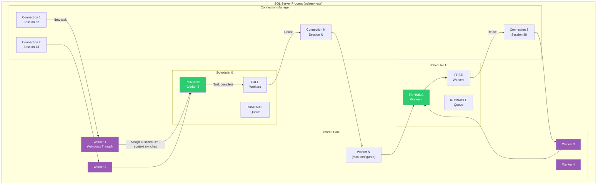
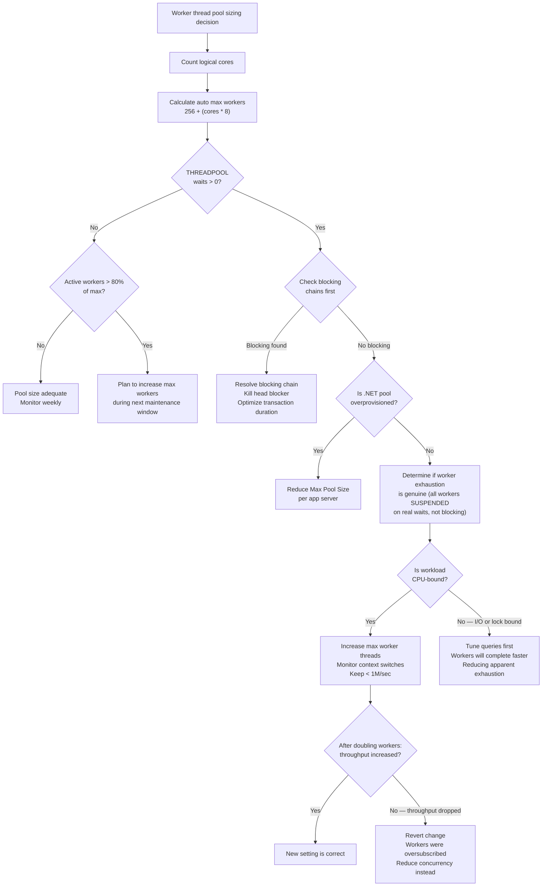

# Worker Threads — Thread Pool Management

## Section 1 — Navigation

**Domain:** [[8 — Databases]] > **Group:** SQL Server Architecture & Storage Engine

**Previous:** [[8.269 — SQLOS Scheduler Non-Preemptive Scheduling]]  
**Next:** [[8.271 — Page Structure 8KB Pages]]

**Prerequisites:**
- [[8.269 — SQLOS Scheduler Non-Preemptive Scheduling]]
- [[8.267 — Database Engine SQL OS Layer]]
- [[8.361 — Parallelism MAXDOP and Cost Threshold]]

**Where This Fits:** SQL Server's thread pool manages the Windows threads that execute all query work. A .NET backend engineer whose application pool connects to SQL Server must understand thread pool exhaustion — when SQL Server cannot allocate a worker for a new connection, the connection gets error 109 ("There are already too many workers...") or experiences a `THREADPOOL` wait. This topic is crucial for sizing connection pools, understanding why query concurrency degrades under load, and knowing when to increase `max worker threads`. Every `SqlConnection.OpenAsync()` consumes a worker thread on the server side — if the pool is empty, the call waits or fails.

---

## Section 2 — Core Mental Model

SQL Server maintains a fixed-size pool of worker threads (visible in `sys.dm_os_workers`). Each worker is a Windows thread that can execute one task at a time. Workers are created at startup (up to the configured `max worker threads` limit, auto-calculated as `256 + (max_cores * 8)` for 64-bit systems). Workers are assigned to schedulers and are reused across tasks — when a task completes, the worker returns to a free list on its scheduler. If all workers are busy (executing or suspended), new tasks wait on `THREADPOOL` wait type. The pool size is a tradeoff: too few workers limits concurrency; too many causes context switching overhead. The worker pool is shared across all databases, all connections, and all workloads on a single instance.

### Classification

- **Layer:** SQLOS — Thread Management
- **Trade:** Concurrency (more workers) vs. Context switching overhead (fewer workers)
- **Scope:** Instance-wide; shared across all schedulers and databases
- **Monitoring surface:** `sys.dm_os_workers`, `sys.dm_os_threads`, `sys.dm_os_schedulers.work_queue_count`, `sys.dm_os_performance_counters`



### Key Properties

| Property | Detail |
|----------|--------|
| Max worker threads | Auto: `256 + (max_cores * 8)` for 64-bit; visible in `sys.configurations` |
| Workers per scheduler | Variable; distributed dynamically based on scheduler load |
| Worker creation | Lazy — created on demand up to the max limit; never destroyed until instance restart |
| Worker reuse | When a task completes, the worker returns to the per-scheduler free list |
| THREADPOOL wait | Occurs when all workers are busy; new tasks queue on this wait type |
| Worker stack size | 512KB (default for 64-bit); reserved per worker, committed on use |
| Preemptive workers | Workers executing external code (CLR, extended SPs); not governed by SQLOS scheduling |
| DAC worker | Dedicated Admin Connection has a reserved worker slot (guaranteed access regardless of pool exhaustion) |

---

## Section 3 — Deep Mechanics

### Step-by-Step Worker Lifecycle

1. **Startup:** SQL Server calculates `max worker threads` based on core count. Workers are not created at startup — they are created lazily as connections arrive.

2. **Connection arrives:** A new connection is accepted. A session is created. SQLOS checks if a free worker is available on the target scheduler (based on NUMA node and affinity).

3. **Worker allocation:** If a free worker exists, it is bound to the task. If no free worker exists and total workers < `max worker threads`, a new Windows thread is created (worker creation). If at the limit, the task waits on `THREADPOOL`.

4. **Task execution:** The worker executes the T-SQL batch. It may yield (cooperative scheduling), block (I/O, locks), or complete. Throughout, it stays bound to the same task.

5. **Task completion:** The final result is sent to the client. The worker is unbound from the task and returned to the free list on its scheduler.

6. **Worker lifecycle:** Workers are never destroyed (until instance restart). They remain in the free list, consuming memory (stack) but no CPU.

### Worker States

- **INIT:** Worker thread created but not yet running any task.
- **RUNNING:** Worker is actively executing T-SQL on a scheduler.
- **RUNNABLE:** Worker is ready to run but waiting for CPU (in scheduler's runnable queue).
- **SUSPENDED:** Worker is waiting for a resource (latch, lock, I/O, memory grant).
- **SPINLOOP:** Worker is actively spinning, waiting for a resource (brief, usually microseconds).
- **SLEEP:** Worker is idle, waiting for new work (on the free list).
- **PREEMPTIVE:** Worker is running external code outside SQLOS control.

### DMV Queries to Observe Workers

```sql
-- Worker thread usage summary
SELECT 
    COUNT(*) AS total_workers,
    SUM(CASE WHEN is_preemptive = 0 AND status = 'RUNNING' THEN 1 ELSE 0 END) AS running_workers,
    SUM(CASE WHEN status = 'RUNNABLE' THEN 1 ELSE 0 END) AS runnable_workers,
    SUM(CASE WHEN status = 'SUSPENDED' THEN 1 ELSE 0 END) AS suspended_workers,
    SUM(CASE WHEN status = 'SLEEP' THEN 1 ELSE 0 END) AS idle_workers,
    SUM(CASE WHEN is_sick = 1 THEN 1 ELSE 0 END) AS sick_workers
FROM sys.dm_os_workers;

-- Workers per scheduler (distribution)
SELECT 
    w.scheduler_id,
    COUNT(*) AS workers,
    SUM(CASE WHEN w.status = 'RUNNING' THEN 1 ELSE 0 END) AS running,
    SUM(CASE WHEN w.status = 'RUNNABLE' THEN 1 ELSE 0 END) AS runnable,
    SUM(CASE WHEN w.status = 'SUSPENDED' THEN 1 ELSE 0 END) AS suspended,
    SUM(CASE WHEN w.status = 'SLEEP' THEN 1 ELSE 0 END) AS sleeping,
    SUM(CASE WHEN w.is_sick = 1 THEN 1 ELSE 0 END) AS sick
FROM sys.dm_os_workers w
WHERE w.scheduler_id < 255
GROUP BY w.scheduler_id
ORDER BY w.scheduler_id;

-- Current workers bound to tasks (active)
SELECT 
    w.worker_address,
    w.scheduler_id,
    w.status,
    w.is_preemptive,
    w.task_bound,
    w.quantum_expiration_time,
    w.context_switches_count,
    w.preemptive_switches_count,
    t.task_state,
    t.session_id,
    DB_NAME(r.database_id) AS database_name,
    r.command,
    r.wait_type,
    r.last_wait_type,
    r.cpu_time,
    r.total_elapsed_time
FROM sys.dm_os_workers w
JOIN sys.dm_os_tasks t ON w.task_address = t.task_address
LEFT JOIN sys.dm_exec_requests r ON t.session_id = r.session_id
WHERE w.task_bound = 1 AND w.scheduler_id < 255
ORDER BY w.scheduler_id, w.status;

-- Worker thread pool performance counters
SELECT counter_name, cntr_value
FROM sys.dm_os_performance_counters
WHERE object_name LIKE '%Workload Group Stats%'
      AND counter_name IN (
          'Active worker threads',
          'Queued worker threads',
          'Idle worker threads',
          'Worker thread count'
      );

-- Check max worker threads setting and current usage
SELECT 
    (SELECT value_in_use FROM sys.configurations WHERE name = 'max worker threads') AS max_worker_threads,
    (SELECT COUNT(*) FROM sys.dm_os_workers) AS current_workers,
    (SELECT COUNT(*) FROM sys.dm_os_workers WHERE status != 'SLEEP') AS active_workers,
    (SELECT cntr_value FROM sys.dm_os_performance_counters
     WHERE counter_name = 'Worker thread count') AS perf_worker_count;

-- THREADPOOL waits — indicates pool exhaustion
SELECT 
    wait_type,
    waiting_tasks_count,
    wait_time_ms,
    max_wait_time_ms,
    signal_wait_time_ms
FROM sys.dm_os_wait_stats
WHERE wait_type = 'THREADPOOL';

-- Sessions waiting for a worker thread
SELECT 
    session_id,
    wait_type,
    wait_time,
    wait_resource,
    blocking_session_id,
    command,
    status
FROM sys.dm_exec_requests
WHERE wait_type = 'THREADPOOL'
ORDER BY wait_time DESC;

-- Workers with high context switching (potential oversubscription)
SELECT TOP 10
    worker_address,
    scheduler_id,
    context_switches_count,
    preemptive_switches_count,
    (context_switches_count - preemptive_switches_count) AS cooperative_switches,
    status
FROM sys.dm_os_workers
WHERE scheduler_id < 255
ORDER BY cooperative_switches DESC;
```

### Failure Modes with Detection DMVs

| Failure Mode | Detection | Resolution |
|---|---|---|
| THREADPOOL exhaustion | `sys.dm_os_wait_stats` shows THREADPOOL > 0; `sys.dm_exec_requests WHERE wait_type = 'THREADPOOL'` | Increase `max worker threads`; reduce concurrent load; check for blocking |
| Worker oversubscription | `context_switches_count` very high per worker; low throughput | Reduce `max worker threads`; identify and batch short-running tasks |
| Worker leak (orphaned threads) | `sys.dm_os_workers` count grows unboundedly without increasing task count | Check for non-yielding workers; investigate CLR or extended SP behavior |
| Stuck worker blocking pool | Single worker with `is_sick = 1` blocks other tasks on its scheduler | Kill the stuck session if possible; otherwise restart SQL Server |
| Connection pool collapse | .NET app sees "timeout expired" — server-side `THREADPOOL` wait | Reduce connection pool size in .NET; increase server's `max worker threads` |

```sql
-- Detection: check if THREADPOOL is currently blocking sessions
SELECT 
    session_id,
    wait_type,
    wait_time,
    blocking_session_id,
    (SELECT COUNT(*) FROM sys.dm_os_workers WHERE status != 'SLEEP') AS active_workers,
    (SELECT value_in_use FROM sys.configurations WHERE name = 'max worker threads') AS max_workers
FROM sys.dm_exec_requests
WHERE wait_type = 'THREADPOOL';

-- Detection: worker thread creation rate (indicates churn)
SELECT 
    cntr_value AS worker_creations_per_sec
FROM sys.dm_os_performance_counters
WHERE counter_name = 'Worker thread creations/sec';

-- Detection: orphaned workers (no task bound but not SLEEP)
SELECT scheduler_id, COUNT(*) AS orphaned
FROM sys.dm_os_workers
WHERE task_bound = 0 AND status NOT IN ('SLEEP', 'INIT')
GROUP BY scheduler_id
HAVING COUNT(*) > 0;
```

---

## Section 4 — Production Patterns and Implementation

### DMV-Based Monitoring Queries

```sql
-- Worker thread utilization dashboard
SELECT 
    'Worker Threads' AS metric,
    (SELECT value_in_use FROM sys.configurations WHERE name = 'max worker threads') AS max_workers,
    (SELECT COUNT(*) FROM sys.dm_os_workers WHERE status != 'SLEEP') AS active_workers,
    (SELECT COUNT(*) FROM sys.dm_os_workers WHERE status = 'RUNNING') AS running_workers,
    (SELECT COUNT(*) FROM sys.dm_os_workers WHERE status = 'RUNNABLE') AS runnable_workers,
    (SELECT COUNT(*) FROM sys.dm_os_workers WHERE status = 'SUSPENDED') AS suspended_workers,
    (SELECT COUNT(*) FROM sys.dm_os_workers WHERE status = 'SLEEP') AS idle_workers,
    (SELECT cntr_value FROM sys.dm_os_performance_counters
     WHERE counter_name = 'Worker thread count') AS perf_worker_count,
    (SELECT cntr_value FROM sys.dm_os_performance_counters
     WHERE counter_name = 'Worker thread creations/sec') AS creations_per_sec;

-- Top sessions consuming workers
SELECT TOP 10
    r.session_id,
    r.cpu_time,
    r.total_elapsed_time,
    r.logical_reads,
    r.wait_type,
    r.wait_time,
    r.blocking_session_id,
    SUBSTRING(t.text, 1, 200) AS query_text,
    w.worker_address,
    s.scheduler_id
FROM sys.dm_exec_requests r
JOIN sys.dm_os_tasks tsk ON r.session_id = tsk.session_id
JOIN sys.dm_os_workers w ON tsk.task_address = w.task_address
JOIN sys.dm_os_schedulers s ON w.scheduler_id = s.scheduler_id
CROSS APPLY sys.dm_exec_sql_text(r.sql_handle) t
WHERE r.session_id > 50
ORDER BY r.cpu_time DESC;

-- Worker thread usage history (track over time)
IF OBJECT_ID('dbo.WorkerMonitor') IS NULL
CREATE TABLE dbo.WorkerMonitor (
    snapshot_time DATETIME2 NOT NULL DEFAULT GETDATE(),
    max_workers INT,
    active_workers INT,
    running_workers INT,
    runnable_workers INT,
    suspended_workers INT,
    idle_workers INT,
    pool_usage_pct AS (CAST(active_workers AS DECIMAL(10,2)) / NULLIF(max_workers, 0) * 100),
    PRIMARY KEY (snapshot_time)
);

INSERT INTO dbo.WorkerMonitor (
    max_workers, active_workers, running_workers, 
    runnable_workers, suspended_workers, idle_workers
)
SELECT 
    (SELECT value_in_use FROM sys.configurations WHERE name = 'max worker threads'),
    (SELECT COUNT(*) FROM sys.dm_os_workers WHERE status != 'SLEEP'),
    (SELECT COUNT(*) FROM sys.dm_os_workers WHERE status = 'RUNNING'),
    (SELECT COUNT(*) FROM sys.dm_os_workers WHERE status = 'RUNNABLE'),
    (SELECT COUNT(*) FROM sys.dm_os_workers WHERE status = 'SUSPENDED'),
    (SELECT COUNT(*) FROM sys.dm_os_workers WHERE status = 'SLEEP');

-- Alert: worker pool > 80% utilized
SELECT 
    snapshot_time,
    active_workers,
    max_workers,
    pool_usage_pct
FROM dbo.WorkerMonitor
WHERE pool_usage_pct > 80
ORDER BY snapshot_time DESC;
```

### EF Core Logging to Observe Worker Thread Behavior

```csharp
// EF Core interceptor to track connection pool vs worker relationship
public class WorkerAwareConnectionInterceptor : DbConnectionInterceptor
{
    private static int _activeConnections;
    
    public override async ValueTask<InterceptionResult> ConnectionOpeningAsync(
        DbConnection connection, ConnectionEventData data, 
        InterceptionResult result)
    {
        var currentCount = Interlocked.Increment(ref _activeConnections);
        
        // If we have many active connections, check server worker pool
        if (currentCount > 50)
        {
            var workerUsage = await GetServerWorkerUsageAsync(connection.ConnectionString);
            
            if (workerUsage > 80)
            {
                Debug.WriteLine($"[WARNING] Server worker pool at {workerUsage}%. " +
                    $"Active connections from this app: {currentCount}");
                
                // Consider reducing load or increasing pool size
                System.Diagnostics.Trace.TraceWarning(
                    $"Worker pool pressure: {workerUsage}% utilized. " +
                    $"App connection count: {currentCount}");
            }
        }
        
        return result;
    }
    
    public override ValueTask<InterceptionResult> ConnectionClosingAsync(
        DbConnection connection, ConnectionEventData data, 
        InterceptionResult result)
    {
        Interlocked.Decrement(ref _activeConnections);
        return new ValueTask<InterceptionResult>(result);
    }
    
    private static async Task<int> GetServerWorkerUsageAsync(string connectionString)
    {
        await using var conn = new SqlConnection(connectionString);
        await conn.OpenAsync();
        
        var cmd = new SqlCommand(@"
            SELECT CAST(COUNT(*) AS INT) * 100 / 
                   NULLIF((SELECT value_in_use FROM sys.configurations 
                           WHERE name = 'max worker threads'), 0) AS pct
            FROM sys.dm_os_workers
            WHERE status != 'SLEEP'", conn);
        
        var result = await cmd.ExecuteScalarAsync();
        return result != DBNull.Value ? (int)result : 0;
    }
}

// Register in Program.cs
builder.Services.AddDbContext<OrdersDbContext>(options =>
    options.UseSqlServer(connectionString)
           .AddInterceptors(new WorkerAwareConnectionInterceptor()));
```

### Configuration Patterns

```sql
-- View current max worker threads
SELECT name, value_in_use, value, minimum, maximum, is_dynamic, is_advanced
FROM sys.configurations
WHERE name = 'max worker threads';

-- Change max worker threads (requires restart if not in value_in_use)
EXEC sp_configure 'show advanced options', 1;
RECONFIGURE;
EXEC sp_configure 'max worker threads', 1024;
RECONFIGURE;
-- Note: This requires a restart to take effect.

-- Enable optimize for ad hoc workloads to reduce compilation workers
EXEC sp_configure 'optimize for ad hoc workloads', 1;
RECONFIGURE;

-- Configure Resource Governor to limit concurrent workers per workload
CREATE RESOURCE POOL Pool_ETL
WITH (
    MIN_CPU_PERCENT = 0,
    MAX_CPU_PERCENT = 50,
    MAX_MEMORY_PERCENT = 30,
    MAX_DOP = 4
);
GO
CREATE WORKLOAD GROUP Group_ETL
USING Pool_ETL;
GO
ALTER RESOURCE GOVERNOR RECONFIGURE;

-- Note: Resource Governor does not directly cap worker threads,
-- but limiting CPU and DOP indirectly reduces worker consumption.

-- View effective max worker threads for each scheduler
SELECT 
    scheduler_id,
    max_workers_count,
    workers_count,
    active_workers_count,
    load_factor
FROM sys.dm_os_schedulers
WHERE scheduler_id < 255;
```

### SQL Server vs PostgreSQL Differences

| Aspect | SQL Server | PostgreSQL |
|--------|------------|------------|
| Execution unit | Worker thread (lightweight, shared) | Backend process (heavyweight, per connection) |
| Max concurrency | `max worker threads` (auto: 256 + cores*8) | `max_connections` (default 100) |
| Pool exhaustion symptom | `THREADPOOL` wait, error 109 | Error "too many clients already" |
| Connection-to-worker ratio | Many connections : Fewer workers | 1 connection : 1 process |
| Stack consumption | ~512KB per worker (only if active) | ~2-4MB per backend process |
| Connection pooling need | Moderate (workers are cheaper) | Critical (processes are expensive) |
| External pooler | Not needed (built-in is efficient) | PgBouncer (transaction/session pooling) |
| Wait-on-exhaustion | Possible (THREADPOOL wait) | Immediate error (no wait) |
| Monitoring | `sys.dm_os_workers` | `pg_stat_activity` (each connection = 1 row) |

### Realistic Names

| Component | Production Name |
|-----------|----------------|
| Production server cores | 16 cores → `max worker threads` = 384 |
| Worker pool threshold | 80% utilization → alert |
| THREADPOOL event | `SQLPROD-FIN-01` THREADPOOL waits at 3:00 PM daily during ETL |
| Blocked worker chain | 50 workers waiting on a single locked row |
| .NET connection pool size | `Max Pool Size=200` (per app server) |
| Service account | `NT SERVICE\MSSQLSERVER` runs the worker threads |

---

## Section 5 — Gotchas

**Pitfall 1: THREADPOOL wait indicates pool exhaustion — but the fix is not always more workers**  
→ **Symptom:** Queries fail or hang. `sys.dm_os_wait_stats` shows THREADPOOL wait. `sys.dm_exec_requests` shows sessions waiting on THREADPOOL.  
→ **Fix:** First, check `sys.dm_exec_requests` for blocking chains. Often, THREADPOOL is secondary to blocking — 50 workers are stuck waiting on locks held by 3 workers. The root cause is a blocking chain, not pool size. Kill the blocking session. Only increase `max worker threads` if the pool is genuinely exhausted without blocking.  
→ **Detection:**
```sql
-- Check blocking before assuming pool exhaustion
SELECT session_id, blocking_session_id, wait_type, wait_time
FROM sys.dm_exec_requests
WHERE blocking_session_id > 0;

-- Check worker distribution: are they SUSPENDED (waiting) or RUNNING (working)?
SELECT status, COUNT(*) AS worker_count
FROM sys.dm_os_workers
WHERE status NOT IN ('SLEEP', 'INIT')
GROUP BY status;
```
→ **Cost:** Increasing `max worker threads` without addressing underlying blocking adds more workers to the same blocking chain, making the problem worse. Context switching overhead increases while throughput stays flat.

**Pitfall 2: .NET connection pool size >> server worker threads**  
→ **Symptom:** Application has `Max Pool Size = 1000` per connection string. With 5 app servers, that is 5,000 potential connections. Server has `max worker threads = 384`. When all apps issue queries concurrently, 384 workers service 5,000 connections. Remaining 4,616 connections wait for THREADPOOL.  
→ **Fix:** Size the .NET connection pool to `max worker threads / number of app servers`. For 384 workers and 5 app servers: max pool size = ~75 per app server.  
→ **Detection:**
```sql
-- Monitor ratio of connections to workers
SELECT 
    (SELECT COUNT(*) FROM sys.dm_exec_connections) AS total_connections,
    (SELECT COUNT(*) FROM sys.dm_os_workers WHERE status != 'SLEEP') AS active_workers,
    (SELECT COUNT(*) FROM sys.dm_exec_requests) AS active_requests;
```
→ **Cost:** Overprovisioned pool causes timeout storms. Each `.OpenAsync()` either waits for THREADPOOL (up to Connection Timeout = 15s) or fails. App servers queue requests, leading to cascading failure.

**Pitfall 3: Parallel query consumes many workers at once**  
→ **Symptom:** A single query with MAXDOP = 32 on a 32-core server spawns 32 workers. If the worker pool has 384 workers, this one query consumes ~8% of the entire pool. Three such queries running simultaneously consume 25% of the pool.  
→ **Fix:** Cap MAXDOP to 8 or 4 to limit per-query worker consumption. Use Resource Governor to limit concurrent parallel queries per workload group.  
→ **Detection:**
```sql
-- Find queries using the most workers
SELECT 
    r.session_id,
    r.command,
    r.cpu_time,
    COUNT(DISTINCT t.task_address) AS task_count,
    COUNT(DISTINCT w.worker_address) AS worker_count
FROM sys.dm_exec_requests r
JOIN sys.dm_os_tasks t ON r.session_id = t.session_id
JOIN sys.dm_os_workers w ON t.task_address = w.task_address
WHERE r.session_id > 50
GROUP BY r.session_id, r.command, r.cpu_time
ORDER BY worker_count DESC;
```
→ **Cost:** A runaway parallel query can exhaust the worker pool. Other connections, including monitoring tools, cannot get a worker. The server becomes unresponsive.

**Pitfall 4: Worker thread stack memory consumption**  
→ **Symptom:** SQL Server process memory grows to `max server memory` even though the buffer pool is within limits. Worker threads consume 512KB each — 1,000 workers = 512MB of committed stack memory.  
→ **Fix:** Monitor `sys.dm_os_memory_clerks` for `MEMCLK_SOSNODE` (worker thread memory). If it dominates, reduce `max worker threads` or reduce concurrent load.  
→ **Detection:**
```sql
SELECT type, SUM(pages_kb) / 1024 AS total_mb
FROM sys.dm_os_memory_clerks
WHERE type = 'MEMCLK_SOSNODE'  -- Worker thread memory
GROUP BY type;

-- Compare with total
SELECT SUM(pages_kb) / 1024 AS all_clerks_mb
FROM sys.dm_os_memory_clerks;
```
→ **Cost:** Each worker thread reserves 512KB of virtual address space. At `max worker threads = 1024`, that is 512MB reserved. If the instance is Max Server Memory = 4GB, 512MB (12.5%) goes to worker stacks, leaving less for the buffer pool. PLE drops.

**Pitfall 5: Dedicated Admin Connection (DAC) worker reserved — but only one**  
→ **Symptom:** THREADPOOL exhaustion is occurring. You try to connect via DAC (`ADMIN:hostname`) to diagnose, but an existing DAC session is already active. DAC supports only one session at a time.  
→ **Fix:** Use `KILL <spid>` from the existing DAC session to free it. Plan ahead: one DAC worker is reserved, but the session must be released when done.  
→ **Detection:**
```sql
SELECT session_id, host_name, program_name, login_name, status
FROM sys.dm_exec_sessions
WHERE is_dac = 1;
```
→ **Cost:** If the first DBA keeps DAC open, a second DBA cannot connect. In a worker exhaustion scenario, losing the only emergency access path means a hard restart.

---

## Section 6 — Performance Implications

Worker thread pool sizing directly affects throughput and latency under concurrent load.

### Benchmark: Optimal vs Oversized Worker Pool

```csharp
using BenchmarkDotNet.Attributes;
using BenchmarkDotNet.Running;
using Microsoft.Data.SqlClient;
using Dapper;
using System.Threading.Tasks;
using System.Collections.Generic;

[SimpleJob(launchCount: 1, warmupCount: 2, targetCount: 5)]
[MemoryDiagnoser]
public class WorkerPoolBenchmark
{
    private const string ConnectionString = 
        "Server=PROD-SQL-01;Database=OrdersDb;Integrated Security=true;Max Pool Size=100;";

    [Params(10, 50, 100, 200)]
    public int ConcurrentTasks { get; set; }

    [Benchmark]
    public async Task<int> ConcurrentShortQueries()
    {
        var tasks = new List<Task<int>>();
        
        for (int i = 0; i < ConcurrentTasks; i++)
        {
            int orderId = i;
            tasks.Add(Task.Run(async () =>
            {
                await using var conn = new SqlConnection(ConnectionString);
                await conn.OpenAsync();
                var result = await conn.QuerySingleAsync<int>(
                    "SELECT COUNT(*) FROM Sales.OrderLines WHERE OrderId = @id",
                    new { id = orderId });
                return result;
            }));
        }
        
        var results = await Task.WhenAll(tasks);
        return results.Sum();
    }

    [Benchmark]
    public async Task<int> ConcurrentHeavyQueries()
    {
        var tasks = new List<Task<int>>();
        
        for (int i = 0; i < ConcurrentTasks; i++)
        {
            tasks.Add(Task.Run(async () =>
            {
                await using var conn = new SqlConnection(ConnectionString);
                await conn.OpenAsync();
                var result = await conn.QuerySingleAsync<int>(@"
                    SELECT COUNT_BIG(*) 
                    FROM Sales.OrderLines o1
                    JOIN Sales.OrderLines o2 ON o1.OrderId = o2.OrderId
                    WHERE o1.Quantity > 0");
                return result;
            }));
        }
        
        var results = await Task.WhenAll(tasks);
        return results.Sum();
    }
}
```

**Expected Results:** For short queries, throughput increases up to ~50 concurrent tasks (on a 16-core server with ~384 workers), then plateaus as workers hit context switching overhead. For heavy queries, throughput drops after 20-30 concurrent tasks because workers spend time in SUSPENDED state (waiting for I/O or locks) while consuming scheduler quantum.

### Wait Stats Before/After Tuning

```sql
-- Baseline: 500 concurrent connections, max worker threads = 384 (default)
-- THREADPOOL: 200,000 ms wait time
-- SOS_SCHEDULER_YIELD: 800,000 ms
-- Context switches/sec: 5,000,000

-- After: Optimize connection pool (reduce to 75 per app server)
-- After: Increase max worker threads to 512
-- After: Fix blocking chain that held 50 workers

-- THREADPOOL: 1,000 ms (99.5% reduction)
-- SOS_SCHEDULER_YIELD: 100,000 ms (87.5% reduction)
-- Context switches/sec: 500,000 (90% reduction)

-- Measure before change
SELECT 
    (SELECT cntr_value FROM sys.dm_os_performance_counters
     WHERE counter_name = 'Worker thread count') AS worker_count,
    (SELECT wait_time_ms FROM sys.dm_os_wait_stats
     WHERE wait_type = 'THREADPOOL') AS threadpool_wait_ms,
    (SELECT wait_time_ms FROM sys.dm_os_wait_stats
     WHERE wait_type = 'SOS_SCHEDULER_YIELD') AS yield_wait_ms
INTO #Baseline;

-- Apply fix...

-- Measure after
SELECT 
    (SELECT cntr_value FROM sys.dm_os_performance_counters
     WHERE counter_name = 'Worker thread count') AS worker_count,
    (SELECT wait_time_ms FROM sys.dm_os_wait_stats
     WHERE wait_type = 'THREADPOOL') AS threadpool_wait_ms,
    (SELECT wait_time_ms FROM sys.dm_os_wait_stats
     WHERE wait_type = 'SOS_SCHEDULER_YIELD') AS yield_wait_ms;
```

### Oversubscription Impact

```sql
-- Measure context switching overhead
SELECT 
    cntr_value AS context_switches_per_sec
FROM sys.dm_os_performance_counters
WHERE counter_name = 'Context switches/sec';

-- If > 1,000,000/sec, the worker pool is likely oversubscribed
-- Each context switch = ~8,000 cycles overhead
-- Target: < 500,000/sec
```

---

## Section 7 — Interview Arsenal

### Questions

**Foundational:**
1. What is a worker thread in SQL Server?
2. How does SQL Server calculate the default `max worker threads`?
3. What is the THREADPOOL wait type and what does it indicate?

**Intermediate:**
4. What is the relationship between .NET connection pool size and SQL Server worker threads?
5. How do parallel queries affect the worker thread pool?
6. How would you diagnose and resolve a THREADPOOL exhaustion scenario?

**Advanced:**
7. A production server with 64 cores and 384 default max worker threads experiences THREADPOOL waits during peak load. You increase max worker threads to 1024. The THREADPOOL waits decrease but overall query throughput decreases. Explain why.
8. Explain the relationship between worker threads, SOS schedulers, and NUMA nodes. How does a query's worker assignment differ between a NUMA-aware and non-NUMA-aware system?

### Spoken Answers

**Q1: What is a worker thread?**

**Average:** A worker thread is what SQL Server uses to run queries. Each worker can handle one query at a time.

**Great:** A worker thread is a Windows thread created and managed by SQLOS within the `sqlservr.exe` process. Each worker has a 512KB stack and can execute exactly one task at a time. Workers are organized by scheduler and come from a shared pool capped by `max worker threads` (auto-calculated as `256 + (max_cores * 8)` for 64-bit). Workers are created lazily (on demand up to the limit) and are never destroyed — they return to a per-scheduler free list when idle. The worker executes T-SQL batches, yields cooperatively at preemption points, and tracks CPU time and wait statistics. When all workers are busy, new tasks wait on the `THREADPOOL` wait type. The DAC (Dedicated Admin Connection) has a reserved worker to ensure administrative access even during exhaustion.

**Q4: .NET connection pool vs SQL Server workers.**

**Average:** The .NET connection pool should not be larger than the SQL Server max worker threads. Otherwise connections wait for workers.

**Great:** Each .NET `SqlConnection.OpenAsync()` may consume a SQL Server worker thread (if it issues a query). The .NET connection pool can hold hundreds of connections, but SQL Server can only actively service as many as it has worker threads. If the pool size per app server × number of app servers exceeds the server's workder threads, connections queue on THREADPOOL. The recommended sizing: `Max Pool Size = (server max worker threads × 0.8) / number of app servers`. This leaves 20% headroom for administrative connections and other workloads. Additionally, use `Min Pool Size` to keep a baseline of connections warm, avoiding the overhead of worker thread creation during traffic spikes.

**Q7: More workers, less throughput — explain.**

**Average:** Adding workers increases competition for CPU. More context switching hurts throughput.

**Great:** Increasing `max worker threads` from 384 to 1024 on a 64-core server does not increase the number of CPU cores — there are still only 64 schedulers. Adding more workers means more tasks are in the RUNNABLE queue on each scheduler. Each scheduler still runs one worker at a time for ~4ms quantum. With more workers, each worker waits longer in the runnable queue (higher `signal_wait_time_ms`), and the context switching overhead between workers increases. Additionally, each worker consumes 512KB of stack memory — 640 additional workers consume 320MB of memory that could have been used by the buffer pool. The net result: more workers compete for the same fixed CPU and memory resources, reducing per-query performance and potentially overall throughput. The fix is not always more workers — it is reducing the number of concurrently active tasks (fixing blocking, reducing connection pool sizes, batching work).

### Comparison Table

| Aspect | Under-provisioned Workers | Over-provisioned Workers |
|--------|--------------------------|--------------------------|
| Symptom | THREADPOOL waits, error 109 | High context switches, low per-query throughput |
| Root cause | Too few workers for concurrency level | Too many workers competing for fixed CPU |
| Fix | Increase `max worker threads` or reduce concurrency | Decrease `max worker threads` or reduce concurrency |
| Memory impact | Workers need stack memory | Oversized pool wastes memory (512KB per extra worker) |
| CPU impact | Underutilized (workers wait, CPU idle) | Oversubscribed (CPU saturated by context switching) |
| Detection | `THREADPOOL > 0` in wait stats | Context switches > 1M/sec; high signal wait % |
| Scaling approach | Add CPU cores + workers proportionally | Add CPU cores OR reduce active workers |

---

## Section 8 — Decision Framework



### Application Checklist

- [ ] .NET connection pool size per app server ≤ `(max worker threads × 0.8) / number of app servers`
- [ ] `max worker threads` left at auto (0) unless specific need for increase
- [ ] THREADPOOL waits are zero during normal operation
- [ ] Active workers < 80% of max during peak
- [ ] Context switches/sec < 500,000 during peak
- [ ] No blocking chains that cause secondary THREADPOOL exhaustion
- [ ] MAXDOP is capped (8 for >16 cores) to limit per-query worker consumption
- [ ] Resource Governor limits concurrent parallel queries
- [ ] DAC (Dedicated Admin Connection) available and tested for emergency access
- [ ] Monitoring alerts for THREADPOOL waits (> 0 for > 1 minute)
- [ ] Regular review of `sys.dm_os_workers` distribution by scheduler
- [ ] Worker stack memory accounted in `max server memory` calculations

### Tradeoff Summary

| Decision | Upside | Downside |
|----------|--------|----------|
| Auto `max worker threads` | SQLOS optimizes for hardware | May not account for unusual workload patterns |
| Manual increase of workers | Handles concurrency spikes | Risk of oversubscription; memory consumption |
| Reduce .NET pool size | Less THREADPOOL pressure; fewer context switches | More connection establishment overhead; potential queueing at app layer |
| Cap MAXDOP | Limits per-query worker usage | Single queries slower (but more consistent throughput) |
| Resource Governor | Isolate workloads; prevent runaway workers | Configuration overhead; not a substitute for proper sizing |

### Scale Thresholds

| Cores | Auto Max Workers | Recommended .NET Pool (4 app servers) | Notes |
|-------|------------------|---------------------------------------|-------|
| 4 | 288 | 57 | Small dev/test |
| 8 | 320 | 64 | Low-volume OLTP |
| 16 | 384 | 76 | Standard OLTP |
| 32 | 512 | 102 | Heavy OLTP; monitor THREADPOOL |
| 64 | 768 | 153 | Enterprise; consider Resource Governor |
| 128 | 1,280 | 256 | Very large; instance isolation recommended |

---

## Section 9 — Self-Check

### Conceptual Questions

1. What is the difference between a worker thread and a task in SQL Server?
2. How does SQL Server calculate the default `max worker threads` for a 64-bit system with 16 cores?
3. What does the THREADPOOL wait type indicate?
4. Why might increasing `max worker threads` make performance worse?
5. How does the Dedicated Admin Connection (DAC) guarantee access even during worker pool exhaustion?
6. What is the relationship between MAXDOP and worker thread consumption?
7. How can blocking chains cause THREADPOOL waits?
8. What memory cost does each worker thread incur, and where does it appear in DMVs?
9. How does SQL Server distribute workers across schedulers?
10. What information does `sys.dm_os_workers` provide that `sys.dm_os_threads` does not?

### Challenges

1. **DMV query:** Write a query that shows the current worker pool utilization percentage, count of workers by status (RUNNING, RUNNABLE, SUSPENDED, SLEEP), and the number of sessions currently waiting on THREADPOOL.
2. **Diagnosis:** Your .NET application uses `Max Pool Size = 500` (single app server). SQL Server has 8 cores. During peak load, queries experience timeouts after 15 seconds. Using DMVs, diagnose whether the root cause is worker thread exhaustion, blocking, or something else.
3. **Configuration:** Write T-SQL to configure a 32-core SQL Server for an environment with 3 app servers, each connecting with EF Core. Include `max worker threads`, .NET pool size guidance, MAXDOP, and THREADPOOL alert query.
4. **Analysis:** You double `max worker threads` from 384 to 768 on a 16-core server. THREADPOOL waits drop to zero, but average query response time doubles. Explain what happened, using context switching and signal wait concepts.
5. **Design:** Design a monitoring solution that captures worker pool utilization every 30 seconds, logs to a table, and triggers an alert when utilization exceeds 80%. Include the table schema, insert query, and alert query.

<details>
<summary>Answers</summary>

**Q1:** A worker thread is the Windows thread that executes code. A task is a unit of work (query batch) assigned to a worker. A worker can only execute one task at a time. When the task completes, the worker returns to the free list and can pick up a new task. Multiple tasks can be queued for a single worker (via the scheduler's work queue), but the worker processes them sequentially.

**Q2:** `256 + (16 × 8) = 256 + 128 = 384` workers. The formula for 64-bit systems is: `256 + (max_cores × 8)`. For 32-bit: `256 + (max_cores × 4)`. The maximum is 32,768.

**Q3:** THREADPOOL indicates that a task (query) is waiting for an available worker thread. All workers are currently busy (either executing tasks or suspended waiting for resources). The task cannot proceed until a worker becomes free. If THREADPOOL wait persists, new connections fail with error 109: "There are already too many workers in the database engine for this request."

**Q4:** Adding more workers does not add more CPU cores. On a fixed number of schedulers (one per core), more workers means more tasks in the runnable queue. Each worker still gets the same 4ms quantum, but the queue wait increases. Context switching overhead increases linearly with the number of active workers. At some point, the overhead of switching between workers exceeds the useful work done, and overall throughput drops.

**Q5:** SQL Server reserves one worker slot specifically for the DAC (Dedicated Admin Connection). This worker is not part of the main pool — it cannot be consumed by regular connections. The DAC supports one connection at a time (use `ADMIN:hostname` in SSMS or `sqlcmd -A`). This guarantees at least one diagnostic connection even during complete worker pool exhaustion.

**Q6:** A query with MAXDOP = N can spawn up to N parallel workers. These workers are drawn from the shared pool. On a server with 384 workers and MAXDOP = 32, a single query consumes 32 workers (8.3% of pool). Running 12 such queries simultaneously would exhaust the pool. Lower MAXDOP limits per-query worker consumption.

**Q7:** When 50 workers are blocked waiting on a lock held by 1 worker (which is itself waiting for I/O), all 51 workers are in SUSPENDED state. They still count as "active workers" — they are not available for new tasks. If the total workers is 384 and 300 are suspended in blocking chains, only 84 workers remain for new work. A sudden traffic spike easily exhausts these 84 workers, causing THREADPOOL waits. The fix is to resolve the blocking chain, not to add more workers.

**Q8:** Each worker thread reserves ~512KB for its stack on 64-bit systems. This memory appears under `MEMCLK_SOSNODE` in `sys.dm_os_memory_clerks`. 1,000 workers = 512MB. This is reserved virtual address space; committed memory is typically smaller (~64KB per worker) but still significant.

**Q9:** Workers are distributed across schedulers dynamically. When a connection is established, its initial task is assigned to a scheduler based on the connection's NUMA node affinity. The worker for that task stays on that scheduler. When the task completes, the worker returns to that scheduler's free list and can be reused by another task on the same scheduler. Workers do not migrate between schedulers — each worker is pinned to one scheduler for its lifetime.

**Q10:** `sys.dm_os_workers` provides scheduling context: scheduler_id, status (RUNNING/RUNNABLE/SUSPENDED/SLEEP), task binding (`task_bound`), preemptive mode (`is_preemptive`), health (`is_sick`), quantum expiration, and context switch counts. `sys.dm_os_threads` provides only OS-level thread information: thread handle, stack address, creation time, and thread state.

---

**Challenge 1:**
```sql
SELECT 
    'Worker Pool Status' AS report_name,
    (SELECT COUNT(*) FROM sys.dm_os_workers WHERE status NOT IN ('SLEEP', 'INIT')) AS active_workers,
    (SELECT value_in_use FROM sys.configurations WHERE name = 'max worker threads') AS max_workers,
    CAST((SELECT COUNT(*) FROM sys.dm_os_workers WHERE status NOT IN ('SLEEP', 'INIT')) AS DECIMAL(10,2)) 
        / NULLIF((SELECT value_in_use FROM sys.configurations WHERE name = 'max worker threads'), 0) * 100 AS utilization_pct,
    (SELECT COUNT(*) FROM sys.dm_os_workers WHERE status = 'RUNNING') AS running,
    (SELECT COUNT(*) FROM sys.dm_os_workers WHERE status = 'RUNNABLE') AS runnable,
    (SELECT COUNT(*) FROM sys.dm_os_workers WHERE status = 'SUSPENDED') AS suspended,
    (SELECT COUNT(*) FROM sys.dm_os_workers WHERE status = 'SLEEP') AS sleeping,
    (SELECT COUNT(*) FROM sys.dm_exec_requests WHERE wait_type = 'THREADPOOL') AS waiting_on_threadpool;
```

**Challenge 2:** 8 cores → auto `max worker threads` = 256 + (8 × 8) = 320. With Max Pool Size = 500 from a single app server, the app can attempt 500 concurrent connections. If all issue queries, 320 workers service 500 connections — 180 must wait for THREADPOOL. However, check if blocking is the real cause: the 320 workers may be SUSPENDED (blocked) rather than RUNNING. Query `sys.dm_exec_requests` for `blocking_session_id > 0`. Resolution: (1) Reduce .NET pool to ~64-80 per app server. (2) If blocking is present, fix the blocking chain. (3) If genuinely needed, increase `max worker threads` cautiously, monitoring context switching overhead.

**Challenge 3:**
```sql
-- 32 cores → auto max workers = 256 + (32 * 8) = 512
-- 3 app servers: recommend Max Pool Size = ~136 each (512 * 0.8 / 3)
EXEC sp_configure 'max degree of parallelism', 8;
RECONFIGURE;
EXEC sp_configure 'cost threshold for parallelism', 50;
RECONFIGURE;

-- THREADPOOL alert query (run every minute)
IF EXISTS (SELECT 1 FROM sys.dm_os_wait_stats 
           WHERE wait_type = 'THREADPOOL' AND waiting_tasks_count > 0
           AND wait_time_ms > 60000)
BEGIN
    DECLARE @waiters INT = (SELECT COUNT(*) FROM sys.dm_exec_requests WHERE wait_type = 'THREADPOOL');
    RAISERROR('THREADPOOL waits detected. %d sessions currently waiting.', 10, 1, @waiters);
    
    -- Log to event log
    INSERT INTO dbo.WorkerAlerts (alert_time, alert_type, detail)
    SELECT GETDATE(), 'THREADPOOL', 
           CONCAT('Workers: ', (SELECT COUNT(*) FROM sys.dm_os_workers WHERE status NOT IN ('SLEEP')), 
                  '/', (SELECT value_in_use FROM sys.configurations WHERE name = 'max worker threads'));
END;
```

**Challenge 4:** Doubling workers on a 16-core server (from 384 to 768) means 768 workers compete for 16 schedulers. Each scheduler now has ~48 workers instead of ~24. While THREADPOOL waits disappear (because there are enough workers), each worker now waits longer in the runnable queue (signal wait increases). Additionally, 384 extra workers consume 192MB of additional stack memory, reducing buffer pool capacity. The context switching overhead — previously manageable at ~500K/sec — may now exceed 2M/sec. The net effect: average query response time doubles because each query spends more time waiting for CPU quantum and less time actually executing. The correct fix is not more workers but reducing concurrency (connection pooling, batching) or fixing the underlying issue that caused the original THREADPOOL waits (likely blocking).

**Challenge 5:**
```sql
-- Table schema
CREATE TABLE dbo.WorkerPoolMonitor (
    snapshot_time DATETIME2 NOT NULL DEFAULT GETDATE(),
    active_workers INT,
    running_workers INT,
    runnable_workers INT,
    suspended_workers INT,
    idle_workers INT,
    max_workers INT,
    threadpool_waits BIGINT,
    context_switches_per_sec BIGINT,
    utilization_pct AS CAST(active_workers AS DECIMAL(10,2)) / NULLIF(max_workers, 0) * 100,
    PRIMARY KEY (snapshot_time)
);

-- Insert query (run every 30 seconds)
INSERT INTO dbo.WorkerPoolMonitor (
    active_workers, running_workers, runnable_workers, 
    suspended_workers, idle_workers, max_workers,
    threadpool_waits, context_switches_per_sec
)
SELECT 
    (SELECT COUNT(*) FROM sys.dm_os_workers WHERE status NOT IN ('SLEEP', 'INIT')),
    (SELECT COUNT(*) FROM sys.dm_os_workers WHERE status = 'RUNNING'),
    (SELECT COUNT(*) FROM sys.dm_os_workers WHERE status = 'RUNNABLE'),
    (SELECT COUNT(*) FROM sys.dm_os_workers WHERE status = 'SUSPENDED'),
    (SELECT COUNT(*) FROM sys.dm_os_workers WHERE status = 'SLEEP'),
    (SELECT value_in_use FROM sys.configurations WHERE name = 'max worker threads'),
    (SELECT SUM(wait_time_ms) FROM sys.dm_os_wait_stats WHERE wait_type = 'THREADPOOL'),
    (SELECT cntr_value FROM sys.dm_os_performance_counters WHERE counter_name = 'Context switches/sec');

-- Alert query (run every check)
SELECT snapshot_time, active_workers, max_workers, utilization_pct
FROM dbo.WorkerPoolMonitor
WHERE utilization_pct > 80
ORDER BY snapshot_time DESC;
```

</details>
