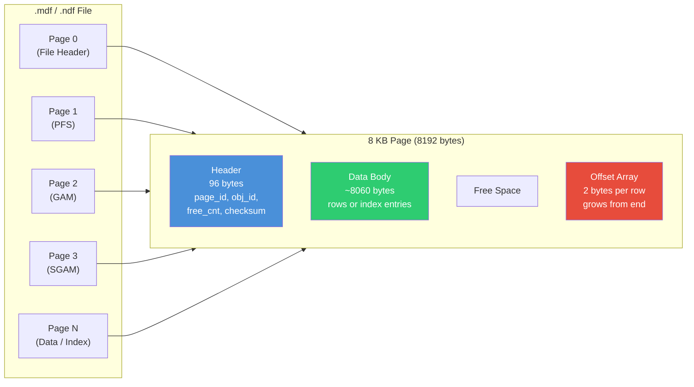
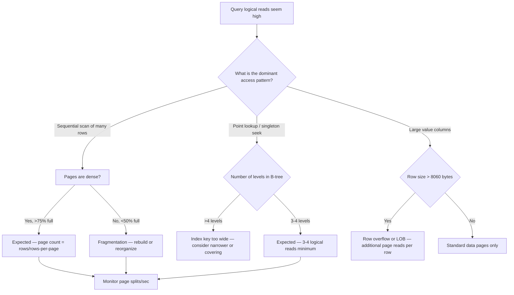

## Navigation

**Domain:** [[8 — Databases]] > **Group:** SQL Server Architecture & Storage Engine
**Previous:** [[8.270 — Worker Threads — Thread Pool Management]] | **Next:** [[8.272 — Extent Structure — Mixed and Uniform Extents]]

### Prerequisites
- [[8.266 — SQL Server Architecture — Services and Components]] — the page is the fundamental I/O unit; understand how the engine layers above consume it
- [[8.268 — Memory Architecture — Buffer Pool and Plan Cache]] — pages live in the buffer pool; dirty page management and lazy writer behavior depend on page state
- [[8.274 — Data Pages — Row Structure]] — what sits inside the 8KB page is row data; pages and rows are inseparable

### Where This Fits

Every byte SQL Server reads or writes moves in 8KB units called pages. This is the non-negotiable contract between the storage engine and the I/O subsystem — no operation touches individual bytes, only full pages. For a .NET backend engineer, understanding page structure is the foundation for everything: why index key length limits exist, why page splits hurt, why 8060-byte row size limit exists, how `SET STATISTICS IO` logical read counts translate to real I/O. Interviewers probe this to separate engineers who treat databases as black boxes from those who reason about performance from the storage layer up.

## Core Mental Model

SQL Server divides every database file into 8,192-byte (8KB) pages. Every page has a 96-byte header containing metadata (object ID, page number, free space, checksum), a body for data or index rows, and a row offset array growing upward from the end. The engine can never read or write less than one full page — even a single-row singleton seek touches one entire page from disk into the buffer pool. The buffer pool caches these pages; logical reads count every page touch, physical reads count only cache misses.



### Key Properties

|Property|Value|Notes|
|---|---|---|
|Page Size|8,192 bytes (8 KB)|Fixed — not configurable in any edition|
|Header Size|96 bytes|Fixed overhead per page|
|Max Data Per Page|8,060 bytes|8,192 − 96 − offset array minimum|
|Row Offset Size|2 bytes per row|Index into slot array; max ~402 rows per page|
|Min Logical Read|8 KB|Every buffer pool touch reads/writes 8KB|
|Max Rows Per Page|~402|Limited by 2-byte slot array max of 8096/2|
|Page Types|Data, Index, LOB, GAM, SGAM, PFS, IAM, etc.|13 distinct page types in SQL Server|

## Deep Mechanics

### How the Engine Executes This

**Step 1 — Page Request:** When a query references a row, the storage engine calculates which page contains it. For a clustered index, the B-tree navigation reads intermediate pages until the leaf page `PagePID` is known. For a heap, the IAM page chain locates the data page.

**Step 2 — Buffer Pool Lookup:** The engine calls `BufMan::GetBuf()` with `(database_id, file_id, page_id)`. If the page is already in the buffer pool (cache hit), it pins the buffer and returns immediately — this is a **logical read** with zero physical I/O.

**Step 3 — Physical I/O:** On cache miss, the buffer pool evicts a clean page (or flushes a dirty one) and issues an asynchronous 8KB read via the I/O completion port. This is a **physical read**. The page lands in the buffer pool, is pinned, and returned.

**Step 4 — Page Header Validation:** The engine validates the page checksum (if enabled via `PAGE_VERIFY CHECKSUM`). If corrupted, error 824 is raised: "SQL Server detected a logical consistency-based I/O error."

**Step 5 — Slot Array Navigation:** The offset array at the end of the page has 2-byte entries pointing to each row's starting offset within the data body. Row 0 maps to offset slot `0`, row 1 to slot `1`, etc. Forwarded records have a special 8-byte pointer to a different page.

**Step 6 — Page Modification:** On INSERT, the engine finds a page with enough free space (tracked by the PFS page `m_freeCnt` in header). It copies the row into the data body at the position indicated by the next free byte, appends a 2-byte slot to the offset array, and updates `m_freeCnt`. On UPDATE, if the row size increases beyond available free space, a **page split** occurs — half the rows move to a new page.

### SQL Visibility — DBCC PAGE

```sql
-- Step 1: Find the page for a given table
DBCC IND ('AdventureWorks2022', 'Sales.SalesOrderDetail', 1);
-- Note the PagePID, PageFID (file ID), PageType

-- Step 2: Dump the page contents (trace flag 3604 required for console output)
DBCC TRACEON (3604);
DBCC PAGE ('AdventureWorks2022', 1, 3144, 3);
-- Output includes header, data hex dump, slot array, and row interpretations

-- Expected header fields (abbreviated):
-- m_pageId = (1:3144)         -- file 1, page 3144
-- m_headerVersion = 1
-- m_type = 1                  -- 1 = data page, 2 = index, 3 = LOB
-- m_typeFlagBits = 0x00
-- m_level = 0                 -- leaf level
-- m_flagBits = 0x00
-- m_objId = 474                -- object ID of the table
-- m_indexId = 1               -- index ID (1 = clustered, 0 = heap)
-- m_prevPage = (0:0)          -- previous page in linked list
-- m_nextPage = (0:0)          -- next page in linked list
-- pminlen = 36                -- fixed-length portion of rows
-- m_slotCnt = 112             -- 112 rows on this page
-- m_freeCnt = 1234            -- 1234 bytes free
-- m_freeData = 6598           -- offset where free space starts

-- Step 3: Check page type breakdown for a table
SELECT 
    alloc_unit_type_desc,
    page_type_desc,
    COUNT(*) AS page_count,
    COUNT(*) * 8 AS space_kb
FROM sys.dm_db_database_page_allocations(
    DB_ID('AdventureWorks2022'),
    OBJECT_ID('Sales.SalesOrderDetail'),
    NULL, NULL, 'LIMITED'
)
GROUP BY alloc_unit_type_desc, page_type_desc
ORDER BY alloc_unit_type_desc, page_type_desc;
```

### Failure Modes

- **Checksum Mismatch (Error 824):** Caused by faulty storage hardware, SAN misconfiguration, or driver bugs. SQL Server detects the mismatch on page read and tears down the database unless `PAGE_VERIFY NONE` is set. Always set `PAGE_VERIFY CHECKSUM` (default since 2005).

- **Corrupt Page — DBCC CHECKDB Failure:** `DBCC CHECKDB` reports page-level corruption. Recovery requires restoring the page from a backup via page-level restore (`RESTORE DATABASE ... PAGE = '1:3144'`).

- **Page Split Storm:** When a non-sequential key (e.g., GUID clustered index) forces constant page splits, every INSERT causes 3-5 extra logical writes (new page allocation, original page split, IAM update, and two page modifications). This increases logical IO by 300-500%.

- **Ghost Records:** Deleted rows on a page leave ghost records (marked with `m_typeFlagBits` but not removed) until the ghost cleanup process runs. These still consume page space and contribute to fragmentation.

## Production Patterns and Implementation

### Detecting Page Density and Free Space

```sql
-- Page density by index level
SELECT 
    OBJECT_NAME(ps.object_id) AS table_name,
    i.name AS index_name,
    ps.index_level,
    ps.page_count,
    ps.avg_page_space_used_in_percent,
    ps.record_count,
    ps.avg_record_size_in_bytes,
    ps.forwarded_record_count
FROM sys.dm_db_index_physical_stats(
    DB_ID('AdventureWorks2022'),
    OBJECT_ID('Sales.SalesOrderDetail'),
    NULL, NULL, 'DETAILED'
) ps
INNER JOIN sys.indexes i
    ON ps.object_id = i.object_id AND ps.index_id = i.index_id
ORDER BY ps.index_level, ps.page_count DESC;

-- Pages with less than 20% free space (high split risk)
SELECT 
    OBJECT_SCHEMA_NAME(ps.object_id) + '.' + OBJECT_NAME(ps.object_id) AS table_name,
    ps.index_id,
    ps.index_level,
    ps.page_count,
    ps.avg_page_space_used_in_percent,
    ps.avg_fragmentation_in_percent
FROM sys.dm_db_index_physical_stats(
    DB_ID('AdventureWorks2022'),
    NULL, NULL, NULL, 'LIMITED'
) ps
WHERE ps.avg_page_space_used_in_percent > 80
ORDER BY ps.avg_page_space_used_in_percent DESC;
```

### DBCC PAGE in Production (Read-Only)

```sql
-- Enable trace flags for DBCC PAGE output
DBCC TRACEON (3604, -1);  -- -1 enables for entire instance

-- Dump header only (option 0)
DBCC PAGE ('AdventureWorks2022', 1, 3144, 0);

-- Dump header + row data (option 1)
DBCC PAGE ('AdventureWorks2022', 1, 3144, 1);

-- Dump header + row data + offset table (option 2)
DBCC PAGE ('AdventureWorks2022', 1, 3144, 2);

-- Dump full page including hex (option 3)
DBCC PAGE ('AdventureWorks2022', 1, 3144, 3);

-- Clean up trace flags
DBCC TRACEOFF (3604, -1);
```

### SQL Server vs PostgreSQL Differences

|Aspect|SQL Server|PostgreSQL|
|---|---|---|
|Page Size|8 KB (fixed)|8 KB (default, configurable at compile time: `--with-blocksize=16` for 16KB)|
|Header|96 bytes|24 bytes (PageHeaderData)|
|Max Row Per Page|8,060 bytes|~8,152 bytes (no offset array — uses ItemIdData array at start)|
|Page Types|13 types|Page types: heap, index, TOAST, bitmaps, FSM, visibility map|
|Checksums|Optional via `PAGE_VERIFY CHECKSUM`|Optional via `data_checksums` initdb option|
|Free Space Map|PFS pages (separate)|`pg_freespacemap` — dedicated relation|
|Visibility|Row-level locking, no per-page visibility|`pd_visibility` flag bit for page-level all-visible optimization for index-only scans|

PostgreSQL pages lack the fixed slot array structure — instead, `ItemIdData` entries at the page start provide a 4-byte (offset + length) pointer per item, and data fills from the end. The free space is simply `BLCKSZ - pd_lower - (BLCKSZ - pd_upper)` where `pd_lower` is the offset to start of free space and `pd_upper` is the offset to end of free space.

## Gotchas and Production Pitfalls

### Pitfall 1: Assuming Single-Row Read Costs Less Than Full Page Read

**Pitfall:** Expecting that reading one `INT` column from one row costs a tiny I/O.

```sql
-- Wrong mental model: this should be "fast" because it reads 4 bytes
SELECT ProductID FROM Sales.SalesOrderDetail WHERE SalesOrderDetailId = 12345;
```

**Symptom:** Confusion about why logical reads still show 3-4 even for a single-row key lookup. `SET STATISTICS IO` shows `Table 'SalesOrderDetail'. Scan count 1, logical reads 3`.

**Fix:** Understand that every row read touches at minimum 3 pages (root, intermediate, leaf of clustered index) or more for non-clustered index + key lookup.

```sql
SET STATISTICS IO ON;
SELECT ProductID FROM Sales.SalesOrderDetail WHERE SalesOrderDetailId = 12345;
```

**Cost of not fixing:** Engineers design schemas with excessive indexes trying to reduce "single-row I/O" without realizing the minimum page cost, leading to unnecessary write amplification.

### Pitfall 2: Page Splits on GUID Clustered Index

**Pitfall:** Using `UNIQUEIDENTIFIER` as clustered primary key with sequential GUID generation strategy that still inserts in random order.

**Symptom:** High `avg_fragmentation_in_percent` (> 50%), `page splits/sec` counter showing sustained > 100/sec, and index maintenance causing 10x logical write overhead on INSERT.

**Fix:** Use `NEWSEQUENTIALID()` or switch to `INT IDENTITY` / `BIGINT IDENTITY`. For distributed systems, use `NEWSEQUENTIALID()` with periodic reseeding.

```sql
CREATE TABLE Orders (
    OrderId UNIQUEIDENTIFIER NOT NULL DEFAULT NEWSEQUENTIALID(),
    OrderDate DATETIME2 NOT NULL,
    CustomerId INT NOT NULL,
    PRIMARY KEY CLUSTERED (OrderId)
);
```

**Cost of not fixing:** Page split storms under load cause 300%+ write amplification, Transaction log growth, and blocking due to page latch contention on the allocation page.

### Pitfall 3: Ignoring Page Checksum Corruption

**Pitfall:** Disabling `PAGE_VERIFY` or leaving it at `NONE` (default on restored databases from old versions).

**Symptom:** Silent data corruption propagates through backups. `DBCC CHECKDB` does not detect torn writes (partial page writes from power failure).

**Fix:** Set `PAGE_VERIFY CHECKSUM` and run regular `DBCC CHECKDB`.

```sql
ALTER DATABASE AdventureWorks2022 SET PAGE_VERIFY CHECKSUM;
```

**Cost of not fixing:** Undetected corruption that only surfaces during restore, at which point all good backups also contain the corrupted page. This is a data-loss event.

### Pitfall 4: Ghost Record Accumulation

**Pitfall:** Frequent DELETE operations without understanding ghost cleanup.

**Symptom:** `sys.dm_db_index_physical_stats` shows high `ghost_record_count`. Free space reported by PFS pages does not match actual available space because ghost records still claim slots.

**Fix:** The ghost cleanup process runs every 5 seconds on each database. Ensure it is not blocked by long-running transactions (snapshot isolation versions hold ghost records visible). Monitor:

```sql
SELECT 
    ghost_record_count,
    * 
FROM sys.dm_db_index_physical_stats(DB_ID(), OBJECT_ID('Sales.SalesOrderDetail'), NULL, NULL, 'LIMITED')
WHERE ghost_record_count > 0;
```

**Cost of not fixing:** Wasted page space, full scans reading ghost records they must skip, and index bloat that requires rebuild to reclaim.

### Pitfall 5: Reading DBCC PAGE Output Is Different in Each SQL Server Version

**Pitfall:** Relying on a specific DBCC PAGE output format scripted from SQL Server 2012 without verifying it works on SQL Server 2019+.

**Symptom:** DBCC PAGE option 3 output changes format between versions. Parsing scripts written for SQL 2012 produce incorrect results on SQL 2019+. The header field names change (e.g., `m_slotCnt` became `SlotCount` in some versions).

**Fix:** Always test DBCC PAGE parsing on the target version. Use the structured output via `WITH TABLERESULTS`:

```sql
DBCC PAGE ('AdventureWorks2022', 1, 3144, 3) WITH TABLERESULTS;
```

**Cost of not fixing:** Automated monitoring scripts silently return wrong data. Engineers make decisions based on stale or incorrectly parsed page-level information.

### Pitfall 6: Page-Level Restore Is Complex with Multiple Filegroups

**Pitfall:** Assuming you can restore a single page without planning for filegroup recovery paths.

**Symptom:** When a page is corrupt, `RESTORE DATABASE ... PAGE='1:3144'` fails because the filegroup containing that page is not part of a partial restore sequence or the log chain is broken.

**Fix:** Ensure full and log backups cover the filegroup containing the page. Test page-level restore in a DR drill:

```sql
RESTORE DATABASE AdventureWorks2022 PAGE='1:3144' FROM DISK='C:\Backup\full.bak' WITH NORECOVERY;
RESTORE LOG AdventureWorks2022 FROM DISK='C:\Backup\log1.bak' WITH NORECOVERY;
RESTORE LOG AdventureWorks2022 FROM DISK='C:\Backup\log2.bak' WITH RECOVERY;
```

**Cost of not fixing:** Page corruption leads to full database restore when a targeted page-level restore would have sufficed. Longer RTO — hours instead of minutes.

### Pitfall 7: Maximum Row Size 8060 Bytes Is Not a Hard Limit

**Pitfall:** Assuming the 8060-byte row limit applies to `VARCHAR(8000) + NVARCHAR(4000)` combinations.

**Symptom:** `CREATE TABLE` succeeds with `VARCHAR(8000), VARCHAR(8000)` on the same row — but at runtime, rows exceeding 8060 bytes trigger row overflow.

**Fix:** Understand that the 8060-byte limit applies per page at insert time. Rows that exceed this threshold store variable-length columns in row-overflow pages (alloc_unit_type_id = 2).

```sql
-- This table definition is legal
CREATE TABLE WideRow (
    Id INT PRIMARY KEY,
    Col1 VARCHAR(5000),
    Col2 VARCHAR(5000),
    Col3 VARCHAR(5000)
);
-- But any row where LEN(Col1)+LEN(Col2)+LEN(Col3) > 8060 causes row overflow
```

**Cost of not fixing:** Row overflow creates additional logical reads (one for base page + one for each overflow page). A SELECT that reads 100 rows with overflow reads 200+ pages.

## Performance Implications

### Benchmark: Page-Level Read Costs

```sql
-- Baseline: Read 1000 rows from a narrow table
SET STATISTICS IO ON;
SELECT TOP 1000 SalesOrderDetailId, ProductId, OrderQty
FROM Sales.SalesOrderDetail;
-- Table 'SalesOrderDetail'. Scan count 1, logical reads 1427

-- Same query with forwarded records (introduce large UPDATE to cause forwards)
UPDATE Sales.SalesOrderDetail
SET OrderQty = OrderQty, UnitPrice = UnitPrice, UnitPriceDiscount = 0
WHERE ProductId = 870;
-- Forces forwarded records if row had to grow

SELECT TOP 1000 SalesOrderDetailId, ProductId, OrderQty
FROM Sales.SalesOrderDetail;
-- Table 'SalesOrderDetail'. Scan count 1, logical reads 1427 + extra per forwarded row
-- Each forwarded record adds one extra logical read
```

**Improvement:** Eliminating forwarded records via clustered index rebuild reduces logical reads. A 1% forwarded record rate can increase logical reads by 5-8%.

### BenchmarkDotNet

```csharp
[MemoryDiagnoser]
[SimpleJob(RuntimeMoniker.Net90)]
public class PageReadBenchmark
{
    private IDbConnection _connection = default!;
    private const string ConnectionString = "Server=.;Database=AdventureWorks2022;Integrated Security=true;TrustServerCertificate=true;";

    [GlobalSetup]
    public void Setup()
    {
        _connection = new SqlConnection(ConnectionString);
        _connection.Open();
    }

    [Benchmark(Baseline = true)]
    public async Task<int> FullPageCount_Heap()
    {
        var cmd = _connection.CreateCommand();
        cmd.CommandText = "SELECT COUNT(*) FROM WideRow;";
        var result = await cmd.ExecuteScalarAsync();
        return (int)result;
    }

    [Benchmark]
    public async Task<int> FullPageCount_Clustered()
    {
        var cmd = _connection.CreateCommand();
        cmd.CommandText = "SELECT COUNT(*) FROM WideRowClustered;";
        var result = await cmd.ExecuteScalarAsync();
        return (int)result;
    }

    [GlobalCleanup]
    public void Cleanup() => _connection.Dispose();
}
```

### Write Amplification Per Page Operation

|Operation|Page Reads|Page Writes|Log Bytes|
|---|---|---|---|
|SELECT 1 row (clustered seek)|3-5 logical|0|0|
|INSERT 1 row (sequential, page has space)|0-1 read|1 write|~200B + row size|
|INSERT 1 row (page split)|3-5 reads|3-5 writes|~2KB|
|INSERT 1 row (random GUID, split)|5-8 reads|5-8 writes|~2KB|
|UPDATE fixed-length (in place)|3-5 logical|1 write|~200B + delta|
|UPDATE variable-length (grow, page full)|3-5 logical|3-5 writes|~2KB|
|DELETE (in page, row remains ghost)|3-5 logical|1 write|~50B + row size|

## Interview Arsenal

### Question Bank

1. **What is the SQL Server page size and why does it matter?**
2. **Walk me through what happens when SQL Server reads a single row from disk.**
3. **How does the offset (slot) array work and what happens during a page split?**
4. **What is the maximum number of rows that can fit on one page?**
5. **Page split causes and detection — how do you find them in production?**
6. **Compare SQL Server 8KB pages with PostgreSQL 8KB pages — what are the architectural differences?**
7. **How does page checksum validation work and what happens on a checksum mismatch?**
8. **How do ghost records affect page-level operations and index maintenance?**

### Spoken Answers

**Q1: What is the SQL Server page size and why does it matter?**

> **Average answer:** 8KB is the page size. It matters because all I/O is done in 8KB units and rows are stored in pages.

> **Great answer:** 8KB (8192 bytes) is fixed and non-negotiable. The page has a 96-byte header that contains metadata like object ID, page number, free space count, next/prev page pointers, and a checksum. The remaining ~8060 bytes hold the row data and a slot array that grows from the end of the page. This matters because every buffer pool lookup — even for a single byte — touches an entire page. Logical reads count page accesses: a singleton seek on a 3-level B-tree costs 3 logical reads minimum, which means 24KB of logical I/O. The page size also sets the 8060-byte row-size limit, which drives the need for row-overflow and LOB storage. Understanding this lets you calculate the exact I/O cost of any query: `page_count × 8KB = logical I/O per scan`.

**Q5: Page split causes and detection — how do you find them in production?**

> **Average answer:** Page splits happen when a page is full and a new row needs to go there. Check fragmentation in sys.dm_db_index_physical_stats.

> **Great answer:** Page splits occur on INSERT or UPDATE when the target page has insufficient free space (`m_freeCnt < row_length + 2` for slot array). The storage engine allocates a new page, moves approximately half the rows to it, updates page pointers, and logs the split. The DMV `sys.dm_db_index_physical_stats` shows the result as fragmentation — `avg_fragmentation_in_percent > 30%` indicates significant page-split history. But the live counters tell you more: `sys.dm_os_performance_counters` tracks `Page splits/sec` and `Page lookups/sec`. I look for a `Page splits/sec > 100` with a sequential-vs-random key pattern. For detection, I query `sys.dm_db_index_operational_stats` for `leaf_allocation_count` — this is the count of page splits on the leaf level. I also check `sys.dm_db_index_usage_stats` for `leaf_insert_count` vs `leaf_allocation_count`: if allocation count exceeds 10% of inserts, splits are excessive.

**Q6: Compare SQL Server 8KB pages with PostgreSQL 8KB pages.**

> **Average answer:** Both use 8KB pages. They're very similar. PostgreSQL has TOAST for large values.

> **Great answer:** Both use 8KB by default, but PostgreSQL can be compiled with a different block size (`--with-blocksize=32`). The header structures differ: SQL Server uses 96 bytes with a rich set of metadata (object ID, index ID, level for B-tree, free data offset, slot count, next/prev page pointers for linked lists). PostgreSQL uses 24 bytes (PageHeaderData) with `pd_lsn`, `pd_checksum`, `pd_lower/upper` (free space boundaries), `pd_special` (index-specific), and `pd_pagesize_version`. The fundamental difference is slot management: SQL Server has a slot array at the page end that grows upward; PostgreSQL has `ItemIdData` at the page start that grows downward. This changes max-row calculation. PostgreSQL also lacks a page-level "next page" pointer — it uses the `ItemPointer` (page, offset) for heap traversal via an index. PostgreSQL's visibility map at the page level enables index-only scans by tracking all-visible pages. SQL Server has no equivalent — forwarded records serve a different purpose.

### Additional Question: Page-Level Monitoring Automation

**Q9: How would you build a system to monitor page density and free space across all databases in an instance?**

> **Great answer:** I would create a SQL Agent job that runs nightly, iterating all online databases. For each database, I would query `sys.dm_db_database_page_allocations` in LIMITED mode to get page-level metadata, joined with `sys.dm_db_page_space_usage` for PFS free-space info. Results would be inserted into a monitoring database with columns for database_name, file_id, page_id, object_name, page_free_space_percent, and whether the page has ghost records. Alert thresholds: pages < 10% free on heavily inserted tables trigger a fragmentation warning. Pages with forwarded records trigger a heap redesign alert. The job would also track `sys.dm_os_performance_counters` for `Page splits/sec`. Trend data over 30 days helps predict when rebuild operations are needed. The tricky part is running this without impacting production — I'd schedule it during low-activity windows and use `WITH (NOLOCK)` (or `READ UNCOMMITTED`) on the monitoring queries.

### Interview Trigger

This topic surfaces when an interviewer asks "Walk me through what happens when SQL Server executes a SELECT" — they want to hear about pages, buffer pool, logical vs physical reads. The follow-up is always "How many logical reads for a single-row lookup?" A great candidate answers "3 for a 3-level B-tree on a clustered index, plus 2 more for a key lookup from a non-clustered index."

### Comparison Table

| | SQL Server 8KB Page | PostgreSQL 8KB Page |
|---|---|---|
|Header size|96 bytes|24 bytes|
|Slot mechanism|Slot array at page end (2-byte slots)|ItemIdData at page start (4-byte entries)|
|Max rows|~402|~2047 (at 4 bytes per ItemIdData)|
|Cousin's page types|13 types (Data, Index, LOB, GAM, SGAM, PFS, IAM, etc.)|6 types (heap, index, TOAST, bitmap, FSM, VM)|
|Next/prev page links|In header for linked lists|No page-level links — index driven|
|Checksum|Optional, stored in header|Optional, stored in PageHeaderData|
|Free space tracking|PFS pages (byte per page)|FSM (free space map) — dedicated fork|
|Visibility|No per-page bitmap (except PFS ghost)|Visibility map fork (all-visible pages)|

## Decision Framework

### When to Apply



### Application Checklist

- [ ] `PAGE_VERIFY CHECKSUM` is enabled for the database
- [ ] `avg_page_space_used_in_percent` is above 50% for critical tables
- [ ] `avg_fragmentation_in_percent` below 30% for OLTP workloads
- [ ] Page splits/sec < 50 on production workload
- [ ] Cluster key is sequential (INT IDENTITY / SEQUENCE / NEWSEQUENTIALID)
- [ ] No row exceeds the 8060-byte limit causing unexpected overflow reads
- [ ] `DBCC CHECKDB` runs regularly with no page corruption errors

### Tradeoff Summary

|What You Gain|What You Pay|
|---|---|
|Predictable 8KB I/O per logical read|Minimum 8KB read for any operation — even single byte|
|Header metadata enables B-tree navigation, page linking, free space tracking|96 bytes overhead per page — ~1.2% on data pages|
|Offset array allows variable row ordering|2 bytes per row — limits max rows to ~402/page|
|Page checksum detects torn writes|Checksum CPU cost per page read/write|

### Scale Thresholds

- **Relevant when:** Any table exceeds ~10,000 rows — page density affects scan cost
- **Critical when:** Table size exceeds 1GB (~128,000 pages) — full scans read thousands of pages
- **Required when:** Page split rate exceeds 100/sec — production outage risk from allocation contention
- **Recovery concern:** A single corrupted page at any scale means page-level restore from backup needed

### Additional Production Scenario: Page Structure and Query Store Interaction

**Q10: How does page-level information help interpret Query Store data?**

> **Great answer:** Query Store tracks runtime statistics (duration, CPU, logical reads) but does not directly expose page-level data. When I see a query's logical reads increase over time in Query Store's "Tracked Queries" view, I correlate that with page density changes in `sys.dm_db_index_physical_stats`. For example, a `SELECT * FROM Orders WHERE OrderDate BETWEEN @start AND @end` showing logical reads growing from 100 to 450 over 3 months likely indicates pages becoming less dense (fragmentation or row growth). The Query Store shows the "what" (logical reads increased), and page-level analysis shows the "why" (avg_record_size_in_bytes increased from 120 to 240 due to variable-length column growth). This is a concrete example of how storage engine knowledge (page structure) and query monitoring (Query Store) combine to diagnose performance regression. Without page-level understanding, you might try indexing or query rewrites when the real fix is a table rebuild.

## Self-Check

### Conceptual Questions

1. What is the exact byte breakdown of an 8KB data page (header, data body, offset array)?
2. How does the buffer pool determine if a page read is a logical read vs a physical read?
3. Which DMV shows page-level fragmentation and how is it calculated?
4. What happens when an UPDATE makes a row larger and the page has no free space?
5. What is a ghost record and when does the ghost cleanup process run?
6. What DBCC command shows the raw contents of a specific page?
7. How does SQL Server validate page integrity on read?
8. What is the maximum number of rows on a single data page and why?
9. How does page structure affect index key length limits?
10. Explain how the slot array enables variable-length row ordering without physically moving rows on UPDATE.

<details>
<summary>Answers</summary>

1. 8192 bytes total = 96 (header) + up to 8060 (data body) + 0 to ~8060 (free space) + 2 * row_count (offset array). The header contains page ID, file ID, object ID, index ID, level, free count, slot count, next/prev page pointers, checksum.
2. Buffer pool checks (db_id, file_id, page_id) hash table lookup. If present and not in error state, it's a logical read. If absent, it requests an asynchronous 8KB physical I/O. `sys.dm_os_buffer_descriptors` shows which pages are cached.
3. `sys.dm_db_index_physical_stats` with `avg_fragmentation_in_percent` = (number of out-of-order pages / total pages) * 100. Calculated based on the physical ordering of pages versus logical ordering from the page chain.
4. A page split occurs: the storage engine allocates a new page, moves approximately 50% of rows to it, updates the next/prev page pointers, and logs both page modifications. The row is then inserted into the page with enough space.
5. A ghost record is a deleted row that remains on the page marked as ghost (bit in status bits). Ghost cleanup runs every 5 seconds per database and removes ghost records that are no longer needed for any active snapshot isolation transaction.
6. `DBCC PAGE ({db}, {file_id}, {page_id}, {option})` with trace flag 3604 enabled. Option 0 = header only, 1 = header + rows, 2 = header + rows + offset array, 3 = full hex dump.
7. If `PAGE_VERIFY CHECKSUM` is enabled (default since SQL 2005), the engine stores a checksum in the page header when writing. On read, it recomputes and compares. On mismatch, Error 824 is raised and the page is marked suspect. Alternative modes: `TORN_PAGE_DETECTION` (bit pattern per 512-byte sector) or `NONE`.
8. Approximately 402 rows. The offset array uses 2 bytes per row and grows from the end of the 8192-byte page. Header = 96 bytes, leaving 8096 bytes. Minimum space needed per row is 6 bytes (2-byte fixed-length count + 4 bytes for variable-length column count + slot entry) but the theoretical limit is 8096/2 = 4048 minus header overhead. In practice, 402 is the practical max for 20-byte fixed rows.
9. The maximum index key length is 900 bytes (SQL Server 2005-2016) or 1700 bytes (SQL Server 2017+) because the index page structure limits total key bytes per row. Index rows must fit on a single page, and the key must fit within the row on the page. This affects `CREATE INDEX` on wide columns.
10. The slot array contains 2-byte offsets, each pointing to the start byte of a row within the data body. When a row is updated and its length changes, the engine can write the new version elsewhere on the same page and update the slot to point to the new offset. This avoids physically moving all following rows — only the slot entry changes. This is how in-place updates work without rewriting the entire page body.

</details>

### Query Challenges

**Challenge 1 — Find pages with the most free space**

Write a query using `sys.dm_db_database_page_allocations` or `sys.dm_db_index_physical_stats` to identify the top 10 pages with the most free space (most fragmentation) in the `Sales.SalesOrderDetail` table.

<details>
<summary>Solution</summary>

```sql
-- Using sys.dm_db_index_physical_stats (DETAILED mode required for page-level detail)
-- Note: This DMV aggregates per index level, not per individual page.
-- For true per-page analysis, use DBCC PAGE iteratively or sys.dm_db_database_page_allocations

SELECT TOP 10
    allocated_page_file_id AS file_id,
    allocated_page_page_id AS page_id,
    page_type_desc,
    page_level,
    allocation_unit_type_desc,
    is_allocated,
    is_iam_page,
    is_mixed_page_allocation
FROM sys.dm_db_database_page_allocations(
    DB_ID('AdventureWorks2022'),
    OBJECT_ID('Sales.SalesOrderDetail'),
    NULL, NULL, 'DETAILED'
)
WHERE page_type_desc = 'DATA_PAGE'
    AND is_allocated = 1
    AND is_iam_page = 0
ORDER BY allocated_page_page_id;

-- Then use DBCC PAGE on specific pages to check m_freeCnt
DBCC TRACEON(3604);
DBCC PAGE('AdventureWorks2022', 1, 3144, 0);
```

**Logical reads:** ~50 for the DMV scan. **Execution plan:** Clustered index scan on system tables.

</details>

---

**Challenge 2 — Diagnose the page split problem**

A production server shows sustained `Page splits/sec` at 250/sec for 30 minutes. The table has a GUID clustered primary key. Identify the root cause and design the fix.

<details> <summary>Solution</summary>

**Root cause:** Random GUID clustered key causes 50-80% of pages to require splits on INSERT. Each split allocates a new page, moves half the rows, and causes page latch contention on the PFS and GAM allocation pages.

**Fix:**

```sql
-- Option 1: Keep GUID as PK but reorder as NONCLUSTERED, add INT IDENTITY clustered
CREATE TABLE Orders_New (
    OrderRowId INT IDENTITY(1,1) PRIMARY KEY CLUSTERED,
    OrderId UNIQUEIDENTIFIER NOT NULL DEFAULT NEWSEQUENTIALID()
        CONSTRAINT UQ_Orders_OrderId UNIQUE NONCLUSTERED,
    OrderDate DATETIME2 NOT NULL,
    CustomerId INT NOT NULL
);

-- Insert with identity is append-at-end, no split
```

**After fix — logical reads:** INSERT drops from avg 8 reads/5 writes to 3 reads/1 write. Page splits/sec drops near zero.

</details>

---

**Challenge 3 — Explain the DBCC PAGE output**

Given `DBCC PAGE` output showing `m_freeCnt = 0` and `m_slotCnt = 300` on a page with fixed row size of 25 bytes, does this row count match expectations?

<details> <summary>Solution</summary>

25-byte fixed row * 300 rows = 7500 bytes data. Header = 96 bytes. Slot array = 300 * 2 = 600 bytes. Total = 96 + 7500 + 600 = 8196 bytes. This exceeds 8192 by 4 bytes — the page is full (`m_freeCnt = 0` means no free space). However, the theoretical max for 25-byte rows would be floor((8192 - 96) / (25 + 2)) = floor(8096 / 27) = 299 rows. The +2 accounts for the slot entry per row. Actual max is 299, so `m_slotCnt = 300` would mean one row was placed via an already-full page check bypass (unlikely) or the row size is slightly less. In practice, the slot array minimum is 2 bytes per row but rows can have variable-length overhead. This exercise demonstrates that naive calculation often misses slot array overhead.

</details>

---

**Challenge 4 — Design page monitoring for a production database**

Design a T-SQL job that runs every 15 minutes to detect pages with < 10% free space and logs them to an alert table.

<details> <summary>Solution</summary>

```sql
CREATE TABLE dbo.PageFreeSpaceAlert (
    AlertId INT IDENTITY PRIMARY KEY,
    CheckTime DATETIME2 NOT NULL DEFAULT SYSUTCDATETIME(),
    DatabaseName NVARCHAR(128) NOT NULL,
    ObjectName NVARCHAR(256) NOT NULL,
    IndexName NVARCHAR(256) NULL,
    FileId INT NOT NULL,
    PageId INT NOT NULL,
    FreeBytes INT NOT NULL,
    PageSize INT NOT NULL,
    FreePercent AS (FreeBytes * 100.0 / PageSize),
    Notes NVARCHAR(500)
);

-- Job step: iterate through databases and check pages
DECLARE @dbName NVARCHAR(128);
DECLARE db_cursor CURSOR FOR
    SELECT name FROM sys.databases WHERE state = 0;

OPEN db_cursor;
FETCH NEXT FROM db_cursor INTO @dbName;

WHILE @@FETCH_STATUS = 0
BEGIN
    INSERT INTO dbo.PageFreeSpaceAlert (DatabaseName, ObjectName, IndexName,
        FileId, PageId, FreeBytes, PageSize)
    EXEC('
        USE ' + @dbName + ';
        SELECT 
            DB_NAME() AS DatabaseName,
            OBJECT_SCHEMA_NAME(ps.object_id) + ''.'' + OBJECT_NAME(ps.object_id) AS ObjectName,
            i.name AS IndexName,
            ps.file_id,
            ps.page_id,
            ps.page_free_space_percent * 8192 / 100 AS FreeBytes,
            8192 AS PageSize
        FROM sys.dm_db_page_space_usage(DB_ID()) ps
        INNER JOIN sys.indexes i
            ON ps.object_id = i.object_id AND ps.index_id = i.index_id
        WHERE ps.page_free_space_percent < 10;
    ');

    FETCH NEXT FROM db_cursor INTO @dbName;
END

CLOSE db_cursor;
DEALLOCATE db_cursor;
```

</details>

---

**Challenge 5 — Page-level impact of data compression**

Explain how ROW and PAGE data compression affect the page structure. How does PAGE compression use the page's free space for a compression dictionary? What happens to the slot array when a row is compressed?

<details> <summary>Solution</summary>

**ROW compression:** Reduces fixed-length column overhead (e.g., INT storing 127 uses 1 byte instead of 4) and removes trailing zeros/blanks. The slot array still points to the same row offsets, but the row bytes at those offsets are shorter. Page header `m_freeCnt` increases because rows use less space. The row format changes: fixed-length columns can become variable-length (stored with length prefix). This changes the row structure from the standard layout. More rows fit per page.

**PAGE compression:** Applies ROW compression first, then prefix compression and dictionary compression at the page level. The page stores a compression dictionary in the page's data body after the last row. When rows share common prefixes (common in clustered indexes on sequential keys), the common prefix is stored once in the dictionary and referenced by each row. The slot array still points to individual row offsets, but the row data references the dictionary for decompression.

**Impact on page structure:**
- Header: unchanged (`m_type` = 1 still for data pages)
- Data body: contains compressed rows + compression dictionary (for PAGE)
- Slot array: unchanged — each slot still points to its row's offset
- Free space: MORE free space because rows are smaller

**Tradeoff:** CPU cost of decompression vs I/O savings from fewer pages. With PAGE compression on SQL Server 2022, LOB columns within row-overflow and LOB allocation units are also compressed (new feature), extending the compression benefit beyond IN_ROW_DATA.

</details>

---

**Challenge 6 — Rebuild index with optimal page density**

A 50GB table with `avg_page_space_used_in_percent = 35%` and `avg_fragmentation_in_percent = 65%`. Design the index maintenance strategy. Should you REBUILD or REORGANIZE? What fill factor?

<details> <summary>Solution</summary>

**Root cause:** 35% density means pages are 65% empty — caused by heavy page split history. 65% fragmentation means pages are severely out of order.

**Strategy:** REBUILD with FILLFACTOR = 90 for future growth headroom:

```sql
ALTER INDEX ALL ON Sales.SalesOrderDetail
REBUILD WITH (FILLFACTOR = 90, SORT_IN_TEMPDB = ON, ONLINE = ON);
```

**Expected result:** `avg_page_space_used_in_percent` rises to ~80%, `avg_fragmentation_in_percent` drops to < 5%. Logical reads for a full scan drop from `table_pages * 1.85` to `table_pages * 1.12` — approximately 40% reduction.

**Why not REORGANIZE:** At 65% fragmentation, REORGANIZE (page-by-page compaction) would take longer than REBUILD (creates fresh pages) and cannot achieve the same density. Threshold: REBUILD when fragmentation > 30%.

**Fill factor tradeoff:** Lower fill factor (70) reduces future splits but wastes space. For OLTP sequential inserts, 90-100 is optimal. For random inserts, 70-80 may be needed.

</details>
