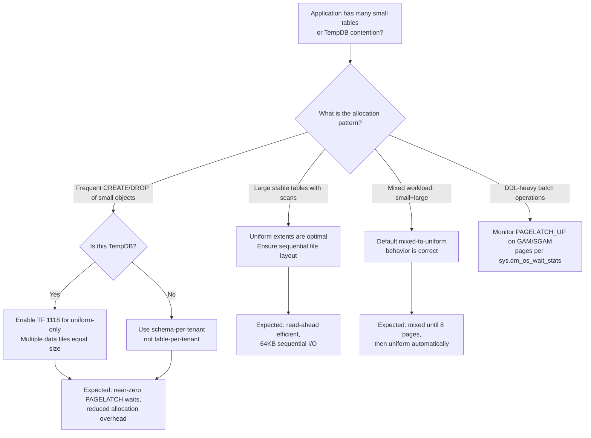

## Navigation

**Domain:** [[8 — Databases]] > **Group:** SQL Server Architecture & Storage Engine
**Previous:** [[8.271 — Page Structure — 8KB Pages]] | **Next:** [[8.273 — GAM, SGAM, PFS — Space Management Pages]]

### Prerequisites
- [[8.271 — Page Structure — 8KB Pages]] — extents group 8 pages (64KB); page structure determines what those 8 pages hold
- [[8.273 — GAM, SGAM, PFS — Space Management Pages]] — the allocation bitmaps that track extent state
- [[8.274 — Data Pages — Row Structure]] — extent allocation is the mechanism by which new data pages are provisioned

### Where This Fits

SQL Server allocates space in 64KB units called extents. Every extent is 8 contiguous pages (8 × 8KB = 64KB). The engine distinguishes **mixed extents** (pages shared across up to 8 different objects) from **uniform extents** (all 8 pages owned by a single object). This mixed-to-uniform transition at 8 pages is a critical performance optimization that balances small-object overhead against large-object sequential I/O. For a .NET engineer, understanding extents explains why very small tables have different I/O patterns than large ones, why `DBCC CHECKDB` space estimates vary, and why shoving thousands of tiny tables into a database causes allocation overhead.

## Core Mental Model

Extents are the physical allocation unit of SQL Server's storage engine — pages are the I/O unit, but extents are the space-management unit. The first 8 pages of any new object (table or index) come from mixed extents shared with other objects. Once the object exceeds 8 pages, all subsequent allocations use uniform extents dedicated to that object. This dual-mode system ensures that a thousand 1-page tables waste at most 64KB each (8-page mixed extent shared with 7 other objects) rather than 64KB each (uniform extent). The GAM (Global Allocation Map) tracks which extents are allocated (bit = 1 for free, 0 for allocated), while the SGAM (Shared Global Allocation Map) tracks which extents are mixed with at least one free page (bit = 1 for mixed with free page).


### Key Properties

|Property|Value|Notes|
|---|---|---|
|Extent Size|64 KB (8 × 8 KB pages)|Fixed — maps to HDD/SSD track/page alignment|
|Mixed Extent Max Objects|Up to 8 (1 page per object)|Each page in a mixed extent can belong to a different object|
|Uniform Extent Objects|1 (all 8 pages same object)|Single-owner, physically contiguous|
|Mixed→Uniform Threshold|8 total pages for the object|Switch at page 9 allocation|
|GAM Bit per Extent|1 bit|0 = allocated, 1 = free (per extent)|
|SGAM Bit per Extent|1 bit|1 = mixed extent with ≥1 free page, 0 = uniform or full mixed|
|Max Extents per File|~131,072 per 1GB data file|1 bit per extent in GAM page, which covers ~64,000 extents per GAM page|

## Deep Mechanics

### How the Engine Executes Extent Allocation

**Step 1 — Page Request:** When a query inserts a row and no page exists for the table, the storage engine's page allocator (`PageAllocator`) requests a new page.

**Step 2 — Mixed Extent Check:** If the total page count for the object is < 8, the allocator consults the **SGAM** (Shared Global Allocation Map). It scans the SGAM bitmap for a bit = 1 (mixed extent with at least one free page). The first SGAM page covers pages 0-511,000 (approximately).

**Step 3 — Mixed Extent Allocation:** Found a mixed extent with a free page. The allocator marks the page as used within that extent by updating the PFS (Page Free Space) page. No GAM update needed (extent is still mixed and still has free pages — SGAM remains 1 if other free pages remain).

**Step 4 — SGAM Update:** When the last free page in a mixed extent is allocated, the SGAM bit is set to 0 (no longer has free pages). The extent remains mixed (shared origins) but all 8 pages are now used.

**Step 5 — Uniform Extent Switch:** On the 9th page allocation, the allocator no longer searches SGAM. Instead, it scans the **GAM** (Global Allocation Map) for a bit = 1 (free uniform extent). It sets the GAM bit to 0 and allocates all 8 pages to the object.

**Step 6 — Uniform Extent Allocation (Subsequent):** All further allocations use GAM-scan for uniform extents. The allocator may deallocate and reuse extents from dropped objects (GAM bit set back to 1).

**Step 7 — Extent Deallocation:** When a table or index is dropped (or truncated), the allocator walks the IAM chain, resets GAM bits to 1 for each extent, and resets SGAM bits as appropriate. This is why DROP TABLE is a metadata-only operation plus extent deallocation — very fast.

### SQL Visibility — Extent-Level Analysis

```sql
-- View extent allocation per table
SELECT 
    OBJECT_SCHEMA_NAME(a.object_id) + '.' + OBJECT_NAME(a.object_id) AS table_name,
    i.name AS index_name,
    a.allocation_unit_type_desc,
    a.total_pages,
    a.used_pages,
    a.total_pages / 8 AS extent_count,
    (a.total_pages - 8) / 8 AS uniform_extent_count,
    CASE WHEN a.total_pages <= 8 THEN a.total_pages ELSE 8 END AS mixed_pages
FROM sys.allocation_units a
INNER JOIN sys.indexes i 
    ON a.container_id = 
        CASE a.type 
            WHEN 1 THEN i.object_id   -- IN_ROW_DATA (for heap)
            WHEN 2 THEN i.object_id   -- ROW_OVERFLOW
            WHEN 3 THEN i.index_id    -- LOB_DATA maps to index
        END
    AND a.container_id = 
        CASE WHEN a.type IN (1,2) THEN i.index_id ELSE i.object_id END
    -- NOTE: Simplified; actual join uses partition_id via sys.partitions
ORDER BY (a.total_pages - 8) / 8 DESC;

-- GAM/SGAM bitmap analysis using DBCC PAGE
DBCC TRACEON (3604);

-- Read GAM page (Page 2 in each file)
DBCC PAGE ('AdventureWorks2022', 1, 2, 3);

-- Read SGAM page (Page 3 in each file)
DBCC PAGE ('AdventureWorks2022', 1, 3, 3);

-- PFS page (Page 1 in each file)
DBCC PAGE ('AdventureWorks2022', 1, 1, 3);

-- Extent-level allocation via sys.dm_db_database_page_allocations
SELECT 
    extent_file_id,
    extent_page_id,
    COUNT(*) AS pages_in_extent,
    MIN(CASE WHEN is_mixed_page_allocation = 1 THEN page_id ELSE NULL END) AS first_mixed_page,
    MAX(CASE WHEN is_allocated = 1 THEN 1 ELSE 0 END) AS any_allocated,
    COUNT(DISTINCT allocation_unit_id) AS num_objects_in_extent
FROM sys.dm_db_database_page_allocations(
    DB_ID('AdventureWorks2022'),
    NULL, NULL, NULL, 'DETAILED'
)
WHERE is_allocated = 1
    AND page_type_desc = 'DATA_PAGE'
GROUP BY extent_file_id, extent_page_id
HAVING COUNT(DISTINCT allocation_unit_id) > 1
ORDER BY extent_file_id, extent_page_id;
```

### Failure Modes

- **GAM Page Full (GAM Exhaustion):** In very small database files with aggressive create/drop, the GAM page (covering ~64,000 extents = ~4GB worth) cannot track space beyond file size. Not a common failure — file growth solves it. But in TempDB with many small objects, GAM page contention causes PAGELATCH_EX waits on page 2:0:0 (TempDB GAM page 2 in file 1).

- **SGAM Contention Under Mixed Extent Scarcity:** If the database has few mixed extents (common in TempDB with many short-lived objects), the SGAM scan becomes a hot spot. Multiple concurrent sessions waiting on SGAM page (page 3) for allocation.

- **Mixed Extent Leak:** Objects that have exactly 8 pages remain in mixed extents. If 8 different objects share one mixed extent and one is truncated, the freed page in the mixed extent is tracked by SGAM. But if the SGAM indicates no mixed extents with free pages, allocation must fall back to creating a new uniform extent and wasting 7 pages. This is normal but can waste space.

- **Uniform Extent Waste on Small Objects:** If a table has ~100 pages and is dropped, 12 uniform extents (96 pages) are deallocated. This is expected. But if a table oscillates between 7 and 10 pages due to bulk inserts and deletes, it repeatedly moves from mixed to uniform and back, causing unnecessary allocation overhead.

## Production Patterns and Implementation

### Detecting Extent Allocation Patterns

```sql
-- Extent allocation per file group
SELECT 
    fg.name AS filegroup_name,
    f.name AS file_name,
    f.physical_name,
    size_on_disk_bytes / 8192 AS total_pages,
    size_on_disk_bytes / 65536 AS total_extents,
    (size_on_disk_bytes - FILEPROPERTY(f.name, 'SpaceUsed') * 8192) / 65536 AS free_extents
FROM sys.database_files f
INNER JOIN sys.filegroups fg ON f.data_space_id = fg.data_space_id
WHERE f.type = 0;  -- data files only

-- GAM/SGAM wait stats
SELECT 
    wait_type,
    waiting_tasks_count,
    wait_time_ms,
    max_wait_time_ms,
    signal_wait_time_ms
FROM sys.dm_os_wait_stats
WHERE wait_type IN (
    'PAGELATCH_UP',           -- GAM/SGAM/PFS updates
    'PAGELATCH_EX',           -- exclusive latch on allocation pages
    'PAGELATCH_SH',           -- shared latch read on allocation pages
    'WRITELOG'                -- log writes triggered by extent allocation
)
ORDER BY wait_time_ms DESC;

-- Gap analysis — detect extent fragmentation (non-contiguous extents)
WITH extent_map AS (
    SELECT 
        allocated_page_file_id AS file_id,
        allocated_page_page_id / 8 AS extent_number,
        MIN(allocated_page_page_id) AS first_page,
        MAX(allocated_page_page_id) AS last_page
    FROM sys.dm_db_database_page_allocations(
        DB_ID(),
        OBJECT_ID('Sales.SalesOrderDetail'),
        NULL, NULL, 'LIMITED'
    )
    WHERE is_allocated = 1
        AND page_type_desc IN ('DATA_PAGE', 'INDEX_PAGE')
    GROUP BY allocated_page_file_id, allocated_page_page_id / 8
)
SELECT 
    file_id,
    extent_number,
    first_page,
    last_page,
    extent_number - LAG(extent_number) OVER (ORDER BY file_id, extent_number) AS gap_to_previous_extent
FROM extent_map
ORDER BY file_id, extent_number;
```

### TempDB Extent Contention Detection

```sql
-- TempDB-specific contention on allocation pages
SELECT 
    session_id,
    wait_type,
    wait_duration_ms,
    resource_description,
    blocking_session_id
FROM sys.dm_exec_requests
WHERE wait_type LIKE '%PAGELATCH%'
    AND resource_description LIKE '%2:%';  -- TempDB file allocation pages

-- Which tables have mixed extents?
SELECT 
    OBJECT_SCHEMA_NAME(object_id) + '.' + OBJECT_NAME(object_id) AS table_name,
    in_row_data_page_count,
    in_row_reserved_page_count,
    CASE 
        WHEN in_row_data_page_count <= 8 THEN 'Mixed (<= 8 pages)'
        WHEN in_row_data_page_count <= 64 THEN 'Mixed + Uniform (9-64 pages)'
        ELSE 'Uniform (> 64 pages)'
    END AS extent_distribution
FROM sys.dm_db_index_physical_stats(DB_ID(), NULL, NULL, NULL, 'LIMITED')
WHERE index_id IN (0, 1)
ORDER BY in_row_data_page_count DESC;
```

### SQL Server vs PostgreSQL Differences

|Aspect|SQL Server|PostgreSQL|
|---|---|---|
|Allocation Unit|Extent (8 pages = 64KB)|Block/single-page allocation|
|Mixed/Shared Extents|Yes — up to 8 objects share mixed extent|No — PostgreSQL allocates page by page|
|Contiguous Allocation|Uniform extents guarantee 8 contiguous pages|Best-effort; `FILLFACTOR` for index pages, no extent guarantee|
|Free Space Map|PFS byte per page + GAM/SGAM per extent|`pg_freespacemap` with per-page FSM (separate fork)|
|Contention Point|GAM/SGAM/PFS page latches under high create/drop|Buffer contentions on indexes (no extent-level contention)|
|Large Object Handling|LOB pages in separate allocation unit|TOAST manages out-of-line data per row|
|File Growth|Extent-aligned (autogrow is in MB)|Block-level; no extent alignment|

PostgreSQL does not have extents in SQL Server's sense. It allocates individual 8KB blocks as needed. The free space map (`pg_freespacemap`) tracks per-block free space. There is no mixed/uniform distinction — each relation (table/index) owns its blocks directly. This reduces allocation complexity but can lead to more fragmented physical storage.

## Gotchas and Production Pitfalls

### Pitfall 1: Creating Thousands of Small Tables in a Single Database

**Pitfall:** Multi-tenant design or temp-table proliferation creating 10,000+ small tables, each requiring 1-2 pages.

**Symptom:** GAM/SGAM page contention under DDL load. `PAGELATCH_UP` waits on page 2:0:0 (GAM page). Database size is large but each table is tiny.

**Fix:** Consolidate small tables, use table partitioning, or use schema-per-tenant instead of table-per-tenant. In TempDB, enable `TF 1118` (uniform extent allocation for all objects) to skip mixed extents.

```sql
-- Trace Flag 1118 forces uniform extents for all allocations (SQL 2016+ is default)
DBCC TRACEON (1118, -1);

-- For user databases, use indirect checkpoint to reduce contention
ALTER DATABASE AdventureWorks2022 SET TARGET_RECOVERY_TIME = 60 SECONDS;
```

**Cost of not fixing:** GAM/SGAM latch contention blocks all concurrent allocation/deallocation, causing timeouts during batch operations and application side timeouts waiting for new page allocation.

### Pitfall 2: TempDB Extent Exhaustion

**Pitfall:** Running out of available uniform extents in TempDB due to large hash joins, sorts, or table spools.

**Symptom:** Query 1105 error: "Could not allocate space for object in database 'tempdb'." TempDB data file is sized too small (e.g., default 8MB autogrow).

**Fix:** Pre-size TempDB data files to match peak workload. Add multiple equal-sized data files to reduce contention.

```sql
ALTER DATABASE tempdb MODIFY FILE (
    NAME = tempdev,
    SIZE = 64GB,
    FILEGROWTH = 4GB
);

-- Add additional data files (same size per CPU core)
ALTER DATABASE tempdb ADD FILE (
    NAME = tempdev2,
    FILENAME = 'T:\Data\tempdb2.ndf',
    SIZE = 64GB,
    FILEGROWTH = 4GB
);
```

**Cost of not fixing:** Outages during peak ETL or index rebuild windows. Query failures that cascade to application timeouts and user-facing errors.

### Pitfall 3: Mixed Extent Retention After Bulk Delete

**Pitfall:** A table grows to 40 pages (5 uniform extents), then 95% of rows are deleted, leaving 2 pages of data.

**Symptom:** The table still occupies 5 uniform extents (40 pages = 320KB) even though only 2 pages (16KB) have data. `DBCC SHOWCONTIG` or `sys.dm_db_index_physical_stats` shows low density.

**Fix:** Rebuild the clustered index or run `ALTER INDEX ... REORGANIZE` with `COMPRESS_ALL_ROW_GROUPS`:

```sql
ALTER INDEX PK_Orders ON dbo.Orders REBUILD WITH (FILLFACTOR = 90);
-- After rebuild: table now uses 2 pages from a mixed extent (or 1 uniform + partial)
```

**Cost of not fixing:** Full table scans read 40 pages instead of 2 — 20x more logical reads. Fragmentation causes memory waste in buffer pool.

### Pitfall 4: Uniform Extent Wasted on Single-Page Leftovers

**Pitfall:** After maintenance, some extents have only 1 of 8 pages allocated (e.g., forwarded records, IAM pages).

**Symptom:** `sys.dm_db_database_page_allocations` shows extents with exactly 1 allocated page. The remaining 7 pages are wasted — SQL Server cannot give them to another object because it's a uniform extent.

**Fix:** These are rare but detectable. Rebuild the index to allow compacted allocation:

```sql
SELECT 
    extent_file_id,
    extent_page_id,
    COUNT(*) AS allocated_pages_in_extent
FROM sys.dm_db_database_page_allocations(DB_ID(), NULL, NULL, NULL, 'DETAILED')
WHERE is_allocated = 1
GROUP BY extent_file_id, extent_page_id
HAVING COUNT(*) = 1
    AND COUNT(*) < 8;
```

**Cost of not fixing:** After many maintenance cycles, 5-10% space waste in large databases is common. On a 500GB database, that's 25-50GB of unusable space.

### Pitfall 5: Extent Interleaving from Multiple Objects

**Pitfall:** Creating multiple tables or indexes that grow simultaneously, expecting their extents to be contiguous.

**Symptom:** Extents from different objects are interleaved on disk. A full table scan issues random reads instead of sequential reads because Object A's extents are separated by Object B's extents.

**Fix:** Pre-allocate space for large tables by creating with clustered index on a sequential key, or use filegroups to separate objects physically:

```sql
-- Put large tables on a dedicated filegroup
ALTER DATABASE AdventureWorks2022 ADD FILEGROUP FG_Orders;
ALTER DATABASE AdventureWorks2022 ADD FILE (
    NAME = Orders_Data,
    FILENAME = 'D:\Data\Orders_Data.ndf',
    SIZE = 10GB
) TO FILEGROUP FG_Orders;

CREATE TABLE dbo.Orders ( ... ) ON FG_Orders;
```

**Cost of not fixing:** Scan performance degrades as the database grows. Read-ahead cannot issue 64KB contiguous I/O because the extents are interleaved. This compounds with every new table created.

### Pitfall 6: Instant File Initialization and Extent Allocation

**Pitfall:** Assuming instant file initialization eliminates the cost of extent allocation.

**Symptom:** Extent allocation still shows latency under heavy DDL. IFI only skips zeroing pages for data files — log file growth and metadata updates (GAM/SGAM/PFS page modifications) still incur write overhead.

**Fix:** Understand that IFI helps with file growth (avoids zeroing 64MB chunks) but does not eliminate per-extent metadata updates. For bulk operations that create many extents, batch the allocations:

```sql
-- Use bulk-logged recovery for large imports
ALTER DATABASE AdventureWorks2022 SET RECOVERY BULK_LOGGED;
-- Perform bulk insert
INSERT INTO dbo.Orders WITH (TABLOCK) (OrderId, OrderDate, CustomerId)
SELECT ... FROM StagingTable;
ALTER DATABASE AdventureWorks2022 SET RECOVERY FULL;
```

**Cost of not fixing:** Engineers expect zero-cost extent allocation with IFI, then add more concurrent writers thinking allocation is free. GAM/SGAM contention surprises them at scale.

### Pitfall 7: Assuming Extents Guarantee Sequential I/O

**Pitfall:** Expecting that uniform extent allocation guarantees sequential physical I/O because extents are contiguous.

**Symptom:** Physical reads still show random I/O patterns even with uniform extents. This happens because extents are contiguous in file offset but scatter across disk if the underlying storage is fragmented (HDD) or have no sequential guarantee (SSD).

**Fix:** For HDD, ensure the database file is defragmented. For SSD, it doesn't matter (no seek time). For large scans, enable TF 1118 for uniform-only allocation (reduces fragmentation).

**Cost of not fixing:** Misleading diagnosis — engineer blames "extent fragmentation" when the real issue is file-system fragmentation or storage-level striping.

## Performance Implications

### Benchmark: Mixed vs Uniform Extent Allocation Patterns

```sql
-- Create two tables to compare allocation patterns
CREATE TABLE dbo.MixedAllocTest (
    Id INT IDENTITY PRIMARY KEY,
    Data CHAR(4000) NOT NULL DEFAULT 'x'
);

CREATE TABLE dbo.UniformAllocTest (
    Id INT IDENTITY PRIMARY KEY,
    Data CHAR(4000) NOT NULL DEFAULT 'x'
);

-- Force uniform only via TF 1118 (if enabled)
-- Insert 100 rows per table
SET NOCOUNT ON;
DECLARE @i INT = 0;
WHILE @i < 100
BEGIN
    INSERT INTO dbo.MixedAllocTest (Data) VALUES ('x');
    INSERT INTO dbo.UniformAllocTest (Data) VALUES ('x');
    SET @i = @i + 1;
END

-- Compare allocation
SELECT 
    OBJECT_SCHEMA_NAME(object_id) + '.' + OBJECT_NAME(object_id) AS table_name,
    index_id,
    partition_number,
    extent_count,
    mixed_extent_count,
    uniform_extent_count
FROM sys.dm_db_index_physical_stats(DB_ID(), NULL, NULL, NULL, 'LIMITED');
```

**Expected result:** MixedAllocTest uses mixed extents until page 8, then uniform extents. UniformAllocTest (with TF 1118) uses only uniform extents from page 1.

### Write Amplification Per Extent Operation

|Operation|Page Writes|Extent Metadata Changes|Log Bytes|
|---|---|---|---|
|New mixed extent allocation|1 page write|GAM bit set, SGAM bit set|~300B|
|New uniform extent allocation|8 pages (lazy init)|GAM bit set|~500B|
|Extent deallocation (DROP)|0 (pages deallocated)|GAM bit cleared, SGAM cleared|~200B|
|Mixed extent page fill (last free page)|1 page write|SGAM bit cleared|~100B|
|Mixed extent reuse (existing free page)|1 page write|No GAM/SGAM change|~100B|

### BenchmarkDotNet

```csharp
[MemoryDiagnoser]
[SimpleJob(RuntimeMoniker.Net90)]
public class ExtentAllocationBenchmark
{
    private IDbConnection _connection = default!;
    private const string ConnectionString = "Server=.;Database=PerfTest;Integrated Security=true;TrustServerCertificate=true;";

    [GlobalSetup]
    public void Setup()
    {
        _connection = new SqlConnection(ConnectionString);
        _connection.Open();
    }

    [Benchmark(Baseline = true)]
    public async Task CreateAndDropSmallTable()
    {
        await using var tx = _connection.BeginTransaction();
        var cmd = _connection.CreateCommand();
        cmd.Transaction = tx;
        cmd.CommandText = @"
            CREATE TABLE #TempSmall (Id INT PRIMARY KEY, Data CHAR(100));
            DROP TABLE #TempSmall;";
        await cmd.ExecuteNonQueryAsync();
    }

    [Benchmark]
    public async Task CreateAndDropLargeTable()
    {
        await using var tx = _connection.BeginCommand();
        var cmd = _connection.CreateCommand();
        cmd.Transaction = tx;
        cmd.CommandText = @"
            CREATE TABLE #TempLarge (
                Id INT PRIMARY KEY, 
                Data CHAR(8000) DEFAULT 'x'
            );
            INSERT INTO #TempLarge (Id) VALUES (1), (2), (3), (4), (5),
                (6), (7), (8), (9), (10);
            DROP TABLE #TempLarge;";
        await cmd.ExecuteNonQueryAsync();
    }

    [Benchmark]
    public async Task BulkInsertMixedExtents()
    {
        var cmd = _connection.CreateCommand();
        cmd.CommandText = @"
            CREATE TABLE #BulkTest (Id INT PRIMARY KEY, Data CHAR(500));
            WITH Nums AS (
                SELECT TOP 1000 ROW_NUMBER() OVER (ORDER BY (SELECT NULL)) AS n
                FROM sys.objects a CROSS JOIN sys.objects b
            )
            INSERT INTO #BulkTest (Id, Data)
            SELECT n, 'x' FROM Nums;
            DROP TABLE #BulkTest;";
        await cmd.ExecuteNonQueryAsync();
    }

    [GlobalCleanup]
    public void Cleanup() => _connection.Dispose();
}
```

## Interview Arsenal

### Question Bank

1. **What is an extent and why does SQL Server use extents instead of page-level allocation?**
2. **Explain the difference between mixed extents and uniform extents. When does the transition happen?**
3. **How do GAM and SGAM pages track extent allocation?**
4. **What happens in TempDB when extent allocation contention is high?**
5. **Compare SQL Server's extent-based allocation with PostgreSQL's page-level allocation.**
6. **How does extent deallocation work during a DROP TABLE operation?**
7. **What trace forces uniform-only extent allocation and when should it be used?**
8. **How would you detect extent-level fragmentation in a production database?**

### Spoken Answers

**Q1: What is an extent and why does SQL Server use extents instead of page-level allocation?**

> **Average answer:** An extent is 8 pages or 64KB. It helps with space management.

> **Great answer:** An extent is 8 contiguous 8KB pages, totaling 64KB. SQL Server uses extents as the space allocation unit rather than page-level allocation for two primary reasons. First, **sequential I/O optimization**: when scanning a table, the read-ahead manager can issue 64KB I/O requests instead of 8KB, which is much more efficient for HDDs (fewer seeks) and SSDs (larger NCQ commands). Second, **metadata efficiency**: instead of tracking every page individually, the GAM bitmap tracks one bit per 64KB extent — this means one GAM page covers approximately 4GB of data (64,000 extents × 64KB = 4GB). If SQL Server tracked individual pages, the space management metadata would be 8x larger and would require more page reads. The mixed/uniform transition is a clever optimization: shared extents for small objects (up to 8 pages), dedicated extents for large objects (beyond 8 pages), ensuring both small tables (efficient space usage) and large tables (sequential I/O) are handled optimally.

**Q3: How do GAM and SGAM pages track extent allocation?**

> **Average answer:** GAM tracks free/allocated extents. SGAM tracks mixed extents.

> **Great answer:** GAM and SGAM are bitmap pages located at fixed positions (page 2 and page 3 in each data file). Each bit in the GAM page represents one extent (64KB). A bit value of 1 means the extent is free — unallocated to any object. A bit value of 0 means the extent is allocated — either as a uniform extent to one object or as a mixed extent. The SGAM page uses the same bitmap structure, but bit = 1 means "mixed extent with at least one free page." Bit = 0 means "uniform extent, or mixed extent with all pages used." The allocator uses these together: to find a free page in a mixed extent, it scans SGAM for bit = 1; to find a free uniform extent, it scans GAM for bit = 1. Each GAM page covers 4GB of data (64,000 extents × 512 bits per byte ÷ 8 bits per byte) — actually 1 GAM page = 8KB = 65,536 bytes = 524,288 bits, covering 524,288 extents = 32GB per GAM page. There is one GAM page for every ~32GB of file space.

**Q5: Compare SQL Server's extent-based allocation with PostgreSQL's page-level allocation.**

> **Average answer:** SQL Server uses extents, PostgreSQL uses pages. Different approaches.

> **Great answer:** SQL Server allocates space in extent-sized chunks (64KB/8 pages), while PostgreSQL allocates one 8KB block at a time. This has cascading implications: SQL Server sacrifices some space efficiency (minimum allocation is 64KB even for 1-page tables — though mixed extents mitigate this) for sequential I/O benefits and reduced metadata overhead. PostgreSQL's page-level allocation is simpler in implementation but creates two challenges: the free space map (`pg_freespacemap`) must track every block individually, and physical fragmentation is more common because pages are not guaranteed to be contiguous. In practice, SQL Server's extent-based approach also means allocation contention is more acute: GAM and SGAM pages are hot spots under high DDL churn (common in TempDB), while PostgreSQL's allocation is distributed and less prone to the same class of contention. SQL Server's approach is better for workloads with large, stable tables; PostgreSQL's approach handles many small objects more gracefully without the mixed/uniform complexity.

### Additional Question: Extent Allocation in Cloud Environments

**Q9: How does SQL Server's extent allocation behave on Azure VMs and managed disks vs on-premises SAN storage?**

> **Great answer:** On Azure VMs with premium SSDs or ultra disks, the underlying storage is already virtualized, so extent contiguity does not guarantee sequential physical I/O — the hypervisor's storage stack maps virtual sectors to different physical SSDs. This means SQL Server's extent-based read-ahead benefits are mostly nullified on Azure (and any virtualized storage). The key optimization shifts from extent contiguity to reducing total I/O size and count. For Azure SQL Database, the storage subsystem handles allocation internally, and users don't control file growth or extent placement. For IaaS, using multiple data files with instant file initialization and pre-sized files reduces the metadata contention from extent allocation. The mixed-to-uniform extent transition still works the same way — it's an engine-level behavior regardless of underlying storage — but the sequential I/O benefit is diminished. In practice on Azure, focus on reducing total page count (compression, narrower schemas) rather than optimizing extent contiguity.

### Interview Trigger

This topic surfaces when an interviewer asks "How does SQL Server manage disk space for tables?" The follow-up "How does TempDB differ from user databases in allocation?" tests real production experience. Candidates who know about TF 1118 and GAM page contention demonstrate deep troubleshooting experience.

### Comparison Table

| | SQL Server Extent Model | PostgreSQL Page Model |
|---|---|---|
|Allocation unit|64KB (8 pages)|8KB (1 block)|
|Metadata overhead|1 GAM bit per 64KB|FSM fork per relation|
|Minimum allocation|64KB (mitigated by shared mixed extents)|8KB|
|Sequential I/O|Read-ahead issues 64KB requests|Sequential scan uses `heap_page_prune` and bulk reads|
|Contention pattern|GAM/SGAM page latch under churn|Buffer mapping contention under churn|
|TempDB handling|Special TF 1118 for uniform-only|No special handling needed|

## Decision Framework

### When to Apply



### Application Checklist

- [ ] TempDB has multiple equal-sized data files (1 per CPU core, max 8)
- [ ] TempDB auto-growth is disabled; files pre-sized for peak workload
- [ ] TF 1118 is NOT enabled on SQL 2016+ (it's default for TempDB)
- [ ] GAM/SGAM waits (PAGELATCH_UP) < 10ms average
- [ ] No objects with exactly 8-16 pages (boundary between mixed and uniform)
- [ ] Database files are on a defragmented volume (HDD) or SSD
- [ ] `sys.dm_db_database_page_allocations` shows minimal single-page extents

### Tradeoff Summary

|What You Gain|What You Pay|
|---|---|
|8x less allocation metadata (bit per extent not page)|Minimum 64KB allocation cost per object (mitigated by mixed extents)|
|Sequential 64KB I/O for scans|Mixed extent sharing limited to 8 objects per extent|
|Fast extent deallocation (DETERMINISTIC)|GAM/SGAM page latch contention under high DDL|
|Clean mixed→uniform transition at 8 pages|Small tables with exactly 8 pages waste no space but get no I/O benefit|

### Scale Thresholds

- **Relevant when:** Database contains > 1000 objects (tables + indexes)
- **Critical when:** TempDB allocation rate > 1000 extents/sec — GAM page becomes bottleneck
- **Required when:** Database file > 32GB — needs secondary GAM page for continued tracking
- **Impractical when:** Table-per-tenant model with > 10,000 tenants — redesign needed

## Self-Check

### Conceptual Questions

1. How many bytes make up one extent in SQL Server?
2. What is the mixed-to-uniform extent transition threshold and why does it exist?
3. How does the GAM page determine if an extent is free or allocated?
4. How does the SGAM page differ from the GAM page?
5. What is Trace Flag 1118 and what does it change about extent allocation?
6. What happens during extent deallocation when a DROP TABLE executes?
7. Why does TempDB suffer from GAM/SGAM contention more than user databases?
8. How does the read-ahead manager use extent structure for large scans?
9. What is the metadata overhead of extent-based allocation vs page-based allocation?
10. How does PostgreSQL solve the same problem as GAM/SGAM?

<details>
<summary>Answers</summary>

1. 8 pages × 8192 bytes = 65,536 bytes (64KB).
2. Transition at page 9 (when object exceeds 8 total pages). This exists because small objects should not waste uniform extents (8-page minimum), while large objects benefit from contiguous 8-page sequential I/O. It balances space efficiency against I/O performance.
3. GAM page contains 1 bit per extent. Bit = 1 means the extent is free (unallocated). Bit = 0 means the extent is allocated (to some object). One GAM page covers approximately 32GB of file space (524,288 extents × 64KB).
4. SGAM also contains 1 bit per extent. Bit = 1 means "mixed extent with at least one free page" (available for small-object allocation). Bit = 0 means either uniform extent or full mixed extent. The allocator uses GAM for uniform allocations and SGAM for mixed allocations.
5. TF 1118 forces all extent allocations to be uniform (no mixed extents). Default since SQL Server 2016 for TempDB only. For user databases, it reduces SGAM contention but increases space waste for small objects.
6. The storage engine walks the IAM chain, finds all extents belonging to the object, resets the corresponding GAM bits to 1, and resets SGAM bits as appropriate (if the extent was mixed). The pages themselves are not zeroed — they contain stale data until overwritten. This is why DROP is fast.
7. TempDB has many short-lived objects (temp tables, table variables, sort/hash spills, version store). Each object creation allocates extents, and each destruction deallocates them. This high churn rate causes contention on pages 2 (GAM), 3 (SGAM), and 1 (PFS) in TempDB's first data file.
8. The read-ahead manager (`ReadAheadManager`) issues extent-sized I/O requests (64KB) during scan operations. It reads the GAM/IAM chain to identify which extents belong to the scan target and reads them asynchronously in bulk. This sequential 64KB I/O pattern is far more efficient than 8KB random reads.
9. Extent-based: 1 bit per 64KB = 1/524288 overhead ratio. Page-based: if tracking each page, approximately 1 byte per 8KB = 1/8192 overhead. Extent-based is 64x more efficient in metadata storage.
10. PostgreSQL has no centralized allocation bitmap. Each relation has its own free space map (a separate fork stored alongside the relation). The FSM is a tree structure tracking per-block free space. There is no mixed/uniform concept — each relation manages its own blocks independently. This avoids centralized contention but increases per-relation metadata overhead.

</details>

### Query Challenges

**Challenge 1 — Find mixed extents shared by multiple objects**

Write a query using `sys.dm_db_database_page_allocations` to identify all extents in the current database that contain pages from more than one object.

<details>
<summary>Solution</summary>

```sql
SELECT 
    allocated_page_file_id AS file_id,
    allocated_page_page_id / 8 AS extent_number,
    COUNT(DISTINCT allocation_unit_id) AS distinct_objects,
    COUNT(*) AS total_pages,
    MAX(page_type_desc) AS page_types
FROM sys.dm_db_database_page_allocations(DB_ID(), NULL, NULL, NULL, 'DETAILED')
WHERE is_allocated = 1
GROUP BY allocated_page_file_id, allocated_page_page_id / 8
HAVING COUNT(DISTINCT allocation_unit_id) > 1
ORDER BY distinct_objects DESC, file_id, extent_number;
```

**Logical reads:** ~500+ depending on database size. **Execution plan:** System table scans.

</details>

---

**Challenge 2 — Diagnose GAM contention in TempDB**

Production server shows 50% of waits as `PAGELATCH_UP` on TempDB files. Write the diagnostic query and describe the remediation.

<details> <summary>Solution</summary>

**Root cause:** High object churn in TempDB (temp tables, spools, or version store) causing contention on GAM/SGAM pages (pages 2, 3 in each TempDB data file).

**Diagnosis:**

```sql
-- Current waiters on TempDB
SELECT 
    session_id,
    wait_type,
    wait_duration_ms,
    resource_description,
    blocking_session_id
FROM sys.dm_exec_requests
WHERE wait_type LIKE '%PAGELATCH%'
    AND resource_description LIKE '2:%';  -- TempDB database_id = 2

-- Wait statistics aggregated
SELECT 
    wait_type,
    waiting_tasks_count,
    wait_time_ms,
    signal_wait_time_ms,
    wait_time_ms * 1.0 / waiting_tasks_count AS avg_wait_ms
FROM sys.dm_os_wait_stats
WHERE wait_type IN ('PAGELATCH_UP', 'PAGELATCH_EX', 'PAGELATCH_SH');
```

**Remediation:**
1. Add multiple equal-sized TempDB data files (1 per CPU core, up to 8) to spread allocation across files and thus across GAM pages
2. Ensure each file is the same size (SQL Server uses a round-robin fill algorithm but prefers the larger file first)
3. Pre-size files to avoid autogrow

```sql
-- Add more TempDB files
ALTER DATABASE tempdb ADD FILE (
    NAME = tempdev_2,
    FILENAME = 'T:\Data\tempdb_2.ndf',
    SIZE = 64GB,
    FILEGROWTH = 4GB
);
```

</details>

---

**Challenge 3 — Calculate extent waste**

Given a database with 50,000 tables each having exactly 1 page, calculate how many extents are used and how much space is wasted. Compare with uniform-only allocation.

<details> <summary>Solution</summary>

**With mixed extents (default):**
- Each mixed extent holds pages from up to 8 different objects
- 50,000 ÷ 8 = 6,250 mixed extents needed
- 6,250 extents × 64KB = 400MB total
- Space used: 50,000 × 8KB = 391MB
- **Space wasted: ~9MB** (64KB × 6,250 − 50,000 × 8KB) = 400MB − 391MB = 9MB — the wasted pages within mixed extents that are unused

**With uniform extents (TF 1118 without mixed):**
- Each uniform extent holds exactly one object's pages
- One uniform extent per object (even if only 1 page in it)
- 50,000 extents × 64KB = 3,125MB (~3GB)
- **Space wasted: 3,125MB − 391MB = 2,734MB** — 7x more wasted space

**Conclusion:** Mixed extents save ~85% space versus uniform-only for small objects. This is why the mixed-to-uniform threshold exists.

</details>

---

**Challenge 4 — Plan a file growth strategy**

A database is auto-growing by 1MB (default) with 128 extents per growth. Document why this is harmful and design the correct growth strategy.

<details> <summary>Solution</summary>

**Why 1MB growth is harmful:**
- 1MB = 16 extents. Under heavy insert workloads, auto-growth fires every few seconds
- Each growth event zeroes the new pages (instant file initialization helps but doesn't eliminate the growth stall)
- Growth events are serialized — `MODIFY_FILE` waits accumulate
- The file grows in tiny fragments, causing physical fragmentation on HDD

**Correct strategy:**

```sql
-- Pre-size data file to handle growth for 6 months
ALTER DATABASE SalesDW MODIFY FILE (
    NAME = SalesDW_Data,
    SIZE = 100GB,
    FILEGROWTH = 8GB  -- 8GB = 131,072 extents — infrequent growth
);

-- Set max file size to prevent runaway growth
ALTER DATABASE SalesDW MODIFY FILE (
    NAME = SalesDW_Data,
    MAXSIZE = 500GB
);

-- Enable instant file initialization (SQL Server startup account must have
-- SE_MANAGE_VOLUME_NAME privilege — Perform Volume Maintenance Tasks)
-- No T-SQL — requires Windows policy configuration
```

**Expected result:** Growth events from every few minutes to once per several months. `MODIFY_FILE` waits drop to near zero.

</details>

---

**Challenge 5 — Design allocation monitoring**

Design a query that alerts when any database's GAM page reaches 90% allocation (less than 10% free extents remaining).

<details> <summary>Solution</summary>

```sql
-- Per database free extent count
DECLARE @sql NVARCHAR(MAX);
DECLARE @dbName NVARCHAR(128);
DECLARE @results TABLE (
    DatabaseName NVARCHAR(128),
    FileName NVARCHAR(128),
    TotalExtents BIGINT,
    FreeExtents BIGINT,
    FreePercent DECIMAL(5,2)
);

DECLARE db_cursor CURSOR FOR
    SELECT name FROM sys.databases WHERE state = 0;

OPEN db_cursor;
FETCH NEXT FROM db_cursor INTO @dbName;

WHILE @@FETCH_STATUS = 0
BEGIN
    SET @sql = '
        USE [' + @dbName + '];
        SELECT 
            DB_NAME() AS DatabaseName,
            f.name AS FileName,
            (f.size * 8 * 1024) / 65536 AS TotalExtents,
            ((f.size - FILEPROPERTY(f.name, ''SpaceUsed'')) * 8 * 1024) / 65536 AS FreeExtents,
            CAST(((f.size - FILEPROPERTY(f.name, ''SpaceUsed'')) * 100.0 / f.size) AS DECIMAL(5,2)) AS FreePercent
        FROM sys.database_files f
        WHERE f.type = 0;';
    
    INSERT INTO @results
    EXEC sp_executesql @sql;
    
    FETCH NEXT FROM db_cursor INTO @dbName;
END

CLOSE db_cursor;
DEALLOCATE db_cursor;

SELECT * FROM @results
WHERE FreePercent < 10
ORDER BY FreePercent;
```

**Alert threshold:** When `FreePercent < 10%`, trigger a file growth operation or send an alert. For critical databases, monitor at 20% threshold to allow time for planned growth.

</details>
