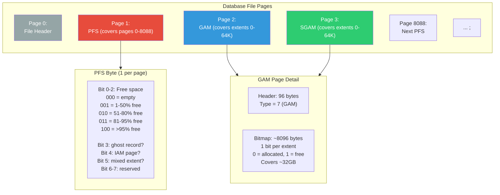

## Navigation

**Domain:** [[8 — Databases]] > **Group:** SQL Server Architecture & Storage Engine
**Previous:** [[8.272 — Extent Structure — Mixed and Uniform Extents]] | **Next:** [[8.274 — Data Pages — Row Structure]]

### Prerequisites
- [[8.271 — Page Structure — 8KB Pages]] — GAM/SGAM/PFS are built on the same 8KB page structure with specialized headers
- [[8.272 — Extent Structure — Mixed and Uniform Extents]] — GAM tracks extents, SGAM tracks mixed extents, PFS tracks pages within extents
- [[8.274 — Data Pages — Row Structure]] — PFS byte encodes free space for row INSERT decisions

### Where This Fits

GAM (Global Allocation Map), SGAM (Shared Global Allocation Map), and PFS (Page Free Space) are the three metadata page types that SQL Server uses to track which space is free, which extents are shared, and which pages have room for new rows. Every data file has these pages at fixed positions (Page 0 = file header, Page 1 = PFS, Page 2 = GAM first, Page 3 = SGAM first), with additional pages every ~8000 pages for PFS, every ~64,000 extents for GAM, and every ~64,000 extents for SGAM. For a .NET backend engineer, these pages are the invisible infrastructure that every INSERT, UPDATE, and DELETE touches — and when they become contention points, they cause "allocation page waits" that look like unexplained blocking.

## Core Mental Model

GAM, SGAM, and PFS are the SQL Server storage engine's space catalog — a three-layer metadata system that answers "where can I put data?" without scanning the entire database. The GAM uses 1 bit per extent (64KB) to indicate free (1) or allocated (0). The SGAM uses 1 bit per extent to indicate "mixed extent with at least one free page" (1) or "uniform or full mixed" (0). The PFS uses 1 byte per page (not extent) to encode free space percentage (0%, 1-50%, 51-80%, 81-95%, 96-100%) plus ghost record status, IAM page status, and mixed extent status. Every page allocation or deallocation updates one or more of these metadata pages — which means under high concurrent DDL or DML, these pages become latch contention hot spots.



### Key Properties

|Property|GAM|SGAM|PFS|
|---|---|---|---|
|Page Type|7|8|11|
|First Page|Page 2 in each file|Page 3 in each file|Page 1 in each file|
|Tracking Granularity|Per extent (64KB)|Per extent (64KB)|Per page (8KB)|
|Bits/Bytes per Unit|1 bit per extent|1 bit per extent|1 byte per page|
|Coverage|~32GB per GAM page|~32GB per SGAM page|~64MB per PFS page (8088 pages)|
|Update Frequency|Extent alloc/dealloc only|Extent alloc/dealloc (mixed only)|Every page allocation or space change|
|Contention Risk|Medium (DDL only)|Medium (small table inserts)|High (every data modification)|

## Deep Mechanics

### How the Engine Executes Space Lookup

**Step 1 — INSERT Request:** A transaction inserts a row. The storage engine knows the table's IAM chain (Index Allocation Map) and starts finding a page for the row.

**Step 2 — PFS Scan for Free Space:** The engine walks the IAM chain's extent list. For each extent, it reads the corresponding PFS byte (calculated as `PFS_PAGE_ID = page_id / 8088 * 8088 + 1`, `PFS_BYTE_OFFSET = page_id % 8088`). If the PFS byte indicates enough free space (row must fit in available space), the engine tries to latch the page.

**Step 3 — PFS Update on Page Modification:** After placing the row, the engine updates the PFS byte if the free space crosses a threshold boundary. For example, if the page goes from 80-95% free to 51-80% free (because the row used 2000 bytes), the PFS byte is updated.

**Step 4 — GAM Check for New Extent:** If no page in the IAM chain has enough space, the engine requests a new extent. It reads the GAM page, scans for a bit = 1 (free extent), sets it to 0 (allocated), and allocates the 8-page extent.

**Step 5 — SGAM Check for Mixed Extent (≤8 pages):** If the object has < 8 total pages, the engine first reads the SGAM page, scanning for a bit = 1. If found (mixed extent with free page), it allocates one page from that mixed extent. If not found, it allocates a new uniform extent via GAM and marks the SGAM bit = 1 (new mixed extent with 7 free pages).

**Step 6 — PFS for Every Operation:** Whether the row goes on an existing page or a newly allocated page, the PFS byte for that page is eventually updated to reflect the new free space state.

### SQL Visibility — GAM/SGAM/PFS Inspection

```sql
-- Identify PFS, GAM, SGAM pages in each file
SELECT 
    file_id,
    page_id,
    page_type_desc,
    page_level,
    allocation_unit_type_desc,
    is_allocated,
    is_iam_page,
    is_mixed_page_allocation
FROM sys.dm_db_database_page_allocations(DB_ID(), NULL, NULL, NULL, 'LIMITED')
WHERE page_type_desc IN ('GAM_PAGE', 'SGAM_PAGE', 'PFS_PAGE')
ORDER BY file_id, page_id;

-- Read the raw GAM page (Page 2 in file 1)
DBCC TRACEON (3604);
DBCC PAGE ('AdventureWorks2022', 1, 2, 3);
-- Look for the bitmap data showing free/allocated extents

-- Read the raw SGAM page (Page 3 in file 1)
DBCC PAGE ('AdventureWorks2022', 1, 3, 3);

-- Read the PFS page (Page 1 in file 1)
DBCC PAGE ('AdventureWorks2022', 1, 1, 3);
-- The PFS page data shows each byte representing 1 data page

-- PFS contention detection
SELECT 
    session_id,
    wait_type,
    wait_duration_ms,
    wait_resource,
    blocking_session_id
FROM sys.dm_exec_requests
WHERE wait_type LIKE '%PAGELATCH%'
    AND resource_description LIKE '%1:%';  -- File:Page 1 (PFS page)

-- Allocation page wait statistics
SELECT 
    wait_type,
    waiting_tasks_count,
    wait_time_ms,
    max_wait_time_ms,
    signal_wait_time_ms,
    wait_time_ms - signal_wait_time_ms AS resource_wait_time_ms
FROM sys.dm_os_wait_stats
WHERE wait_type IN (
    'PAGELATCH_SH', 'PAGELATCH_EX', 'PAGELATCH_UP',
    'PAGEIOLATCH_SH', 'PAGEIOLATCH_EX'
)
ORDER BY wait_time_ms DESC;
```

### Failure Modes

- **PFS Page Contention (PAGELATCH Contention):** Under very high concurrent INSERT throughput (> 10,000 inserts/sec), the PFS page in TempDB or user databases becomes a hot latch. Every page modification updates the PFS byte. This is the single most common allocation contention pattern.

- **GAM Page Full:** A single GAM page covers ~32GB. On a 100GB file, there are 3 GAM pages. If all are full (bits = 0 for allocated), no new extents can be allocated. The database must grow. Autogrow resolves this but with a performance hit.

- **SGAM No-Mixed-Extent Scenario:** If all SGAM bits are 0 (no mixed extents with free pages), every small object must allocate a full uniform extent, wasting up to 56KB per small object. This increases file size and PFS management overhead.

- **PFS Stale State:** The PFS byte can become stale if a page is deallocated without updating PFS (rare, but possible after torn writes). DBCC CHECKDB detects and fixes this.

## Production Patterns and Implementation

### Detecting Allocation Page Contention

```sql
-- Primary diagnostic: PAGELATCH waits on PFS/GAM/SGAM pages
WITH cte AS (
    SELECT 
        session_id,
        wait_type,
        wait_duration_ms,
        resource_description,
        CASE 
            WHEN resource_description LIKE '%1:%' THEN 'PFS'
            WHEN resource_description LIKE '%2:%' THEN 'GAM'
            WHEN resource_description LIKE '%3:%' THEN 'SGAM'
            ELSE 'OTHER'
        END AS allocation_page_type,
        blocking_session_id
    FROM sys.dm_exec_requests
    WHERE wait_type LIKE '%PAGELATCH%'
)
SELECT 
    allocation_page_type,
    COUNT(*) AS waiter_count,
    AVG(wait_duration_ms) AS avg_wait_ms,
    MAX(wait_duration_ms) AS max_wait_ms,
    SUM(wait_duration_ms) AS total_wait_ms
FROM cte
GROUP BY allocation_page_type
ORDER BY total_wait_ms DESC;

-- Historical wait analysis
SELECT 
    wait_type,
    waiting_tasks_count,
    wait_time_ms / 1000 AS wait_time_sec,
    signal_wait_time_ms / 1000 AS signal_wait_sec,
    (wait_time_ms - signal_wait_time_ms) / 1000 AS resource_wait_sec,
    wait_time_ms * 1.0 / NULLIF(waiting_tasks_count, 0) AS avg_wait_ms
FROM sys.dm_os_wait_stats
WHERE wait_type IN (
    'PAGELATCH_SH',   -- Shared latch (read)
    'PAGELATCH_EX',   -- Exclusive latch (write)
    'PAGELATCH_UP'    -- Update latch (modify)
)
ORDER BY wait_time_ms DESC;

-- Current active PAGELATCH waiter details
SELECT 
    er.session_id,
    er.wait_type,
    er.wait_duration_ms,
    er.wait_resource,
    est.text AS query_text,
    eqp.query_plan
FROM sys.dm_exec_requests er
CROSS APPLY sys.dm_exec_sql_text(er.sql_handle) est
OUTER APPLY sys.dm_exec_query_plan(er.plan_handle) eqp
WHERE er.wait_type LIKE '%PAGELATCH%'
ORDER BY er.wait_duration_ms DESC;

-- PFS page activity per database file
SELECT 
    DB_NAME(database_id) AS database_name,
    file_id,
    COUNT(*) AS cached_pages,
    COUNT(*) * 8 / 1024 AS cache_size_mb,
    COUNT(CASE WHEN is_modified = 1 THEN 1 END) AS dirty_pages,
    AVG(CASE WHEN is_modified = 1 THEN 1.0 ELSE 0 END) * 100 AS dirty_percent
FROM sys.dm_os_buffer_descriptors
WHERE page_type IN ('GAM_PAGE', 'SGAM_PAGE', 'PFS_PAGE')
GROUP BY database_id, file_id
ORDER BY database_name, file_id;
```

### Monitoring PFS Free Space Distribution

```sql
-- Free space distribution across all pages based on PFS
-- Note: sys.dm_db_page_space_usage decodes PFS bytes
SELECT 
    database_id,
    file_id,
    page_id,
    page_type,
    page_level,
    page_free_space_percent,
    CASE 
        WHEN page_free_space_percent = 0 THEN 'Full'
        WHEN page_free_space_percent <= 50 THEN '1-50% free'
        WHEN page_free_space_percent <= 80 THEN '51-80% free'
        WHEN page_free_space_percent <= 95 THEN '81-95% free'
        ELSE '>95% free'
    END AS free_space_category,
    has_ghost_records,
    is_iam_page,
    is_mixed_page_allocation
FROM sys.dm_db_page_space_usage(DB_ID('AdventureWorks2022'))
ORDER BY page_free_space_percent;

-- Tables with highest PFS update frequency
SELECT 
    OBJECT_NAME(ps.object_id) AS table_name,
    ps.index_id,
    ps.index_level,
    ps.page_count,
    ps.avg_page_space_used_in_percent,
    ps.forwarded_record_count
FROM sys.dm_db_index_physical_stats(
    DB_ID('AdventureWorks2022'), NULL, NULL, NULL, 'DETAILED'
) ps
WHERE ps.index_level = 0
ORDER BY ps.forwarded_record_count DESC;
```

### SQL Server vs PostgreSQL Differences

|Aspect|SQL Server|PostgreSQL|
|---|---|---|
|Space tracking pages|PFS (byte per page), GAM (bit per extent), SGAM (bit per extent for mixed)|Free Space Map (FSM) — tree structure per relation, Visibility Map (VM)|
|Contention model|Centralized metadata pages (latch contention at high concurrency)|Per-relation FSM (distributed contention, but higher per-relation overhead)|
|PFS granularity|1 byte per page encodes 5 free-space zones + 3 flag bits|FSM stores exact free space in bytes (0 to BLCKSZ) using a 3-level tree|
|Allocation page location|Fixed positions (1, 2, 3...) — directly addressable|FSM stored as separate fork `relation_fsm` — FSMPage structure|
|Page type count|3 metadata page types (GAM, SGAM, PFS) + IAM|1 FSM page type + 1 VM page type + 1 initial fork type|
|Ghost records|Tracked in PFS byte (bit 3)|No ghost records — MVCC dead tuples are cleaned by VACUUM|

PostgreSQL avoids centralized allocation contention by using per-relation FSM forks. Each relation has its own FSM tree, so concurrent INSERTs into different tables never contend on the same FSM page. However, each FSM is a multi-level tree that requires multiple page reads to find free space. SQL Server's PFS is simpler (single byte, direct positional lookup) but creates a single hot byte per 8088 pages.

## Gotchas and Production Pitfalls

### Pitfall 1: PFS Page Latch Contention Under High Insert Load

**Pitfall:** High-frequency INSERT pattern into a single table causes contention on the PFS page.

**Symptom:** `PAGELATCH_UP` waits on PFS pages. `sys.dm_exec_requests` shows many sessions waiting for update latches on page resource `1:1:0` (file 1, page 1 — PFS page).

```sql
-- Detection
SELECT COUNT(*) AS waiter_count, AVG(wait_duration_ms) AS avg_wait_ms
FROM sys.dm_exec_requests
WHERE wait_type = 'PAGELATCH_UP'
    AND resource_description LIKE '%1:1%';
```

**Fix:** Partition the table to spread pages across multiple PFS zones. Use a sequential key to reduce page allocation frequency. In TempDB, add multiple data files.

```sql
-- Partition by date to spread PFS activity
CREATE PARTITION FUNCTION pf_SalesDate (DATETIME2)
AS RANGE RIGHT FOR VALUES ('2024-01-01', '2024-04-01', '2024-07-01', '2024-10-01');

CREATE PARTITION SCHEME ps_SalesDate
AS PARTITION pf_SalesDate ALL TO ([PRIMARY]);

CREATE TABLE dbo.Sales ( ... )
ON ps_SalesDate (OrderDate);
```

**Cost of not fixing:** INSERT throughput capped at ~8,000-10,000 inserts/sec per PFS page zone. Batch inserts timeout. Application sees "transaction log full" errors or general slowdown.

### Pitfall 2: GAM Page Full in TempDB

**Pitfall:** TempDB runs out of free extents because the GAM page shows all extents allocated, even though many are unused (stale).

**Symptom:** Error 1105 "Could not allocate space for object '#temp...' in database 'tempdb'." TempDB data file has free space but GAM shows no free extents.

**Fix:** Shrink TempDB data file (as last resort) or add more TempDB files. But the real fix is to ensure `DBCC CHECKDB` runs nightly to detect allocation inconsistencies. SQL Server 2016+ introduced `USE HINT 'ENABLE_PARALLEL_PLAN'` but the foundational fix is monitoring:

```sql
-- Check for GAM consistency errors
DBCC CHECKALLOC ('tempdb');

-- Add TempDB files to distribute allocation
ALTER DATABASE tempdb ADD FILE (
    NAME = tempdev_2,
    FILENAME = 'T:\Data\tempdb_2.ndf',
    SIZE = 32GB,
    FILEGROWTH = 4GB
);
```

**Cost of not fixing:** Production outage during peak — every temp table allocation fails. ETL jobs, reporting queries, and index rebuilds all fail.

### Pitfall 3: PFS Not Updated After Bulk Operations

**Pitfall:** Bulk INSERT (`TABLOCK`, minimal logging) bypasses per-row PFS updates for efficiency. Some pages appear "full" in PFS but have free space.

**Symptom:** `sys.dm_db_page_space_usage` shows many pages at 100% free space usage, but `DBCC PAGE` shows they have significant free space. Subsequent single-row INSERTs do not use those pages.

**Fix:** Run `ALTER INDEX ... REORGANIZE` to compact pages. Or use `INSERT ... SELECT` without `TABLOCK` to get per-row PFS tracking.

```sql
ALTER INDEX ALL ON dbo.BulkLoadedTable REORGANIZE;
```

**Cost of not fixing:** Up to 50% space waste on bulk-loaded tables. Queries that scan the table read unnecessary pages.

### Pitfall 4: SGAM Contention When Mixed Extents Are Exhausted

**Pitfall:** Thousands of concurrent sessions creating small temp tables (single page each) exhaust available mixed extents. All new small-table allocations must create uniform extents.

**Symptom:** `PAGELATCH_EX` on SGAM page (file 1, page 3). Every small-table creation now allocates 64KB instead of 8KB. TempDB size balloons.

**Fix:** Enable TF 1118 globally (SQL 2016+ TempDB default is uniform-only), eliminating SGAM contention entirely. Increase TempDB file count.

**Cost of not fixing:** 8x space waste for small temp tables. TempDB file grows 8x faster than needed. SGAM scan becomes bottleneck on every allocation.

### Pitfall 5: PFS Contention from Index Build Operations

**Pitfall:** Running online index rebuilds during peak hours without accounting for PFS page contention from the rebuild process.

**Symptom:** During `ALTER INDEX ... REBUILD WITH (ONLINE = ON)`, both the old and new index structures allocate pages. The PFS page sees double the update rate. PAGELATCH_UP waits spike.

**Fix:** Schedule online index rebuilds during maintenance windows. For critical operations, use `WAIT_AT_LOW_PRIORITY` to deprioritize the rebuild:

```sql
ALTER INDEX PK_Orders ON dbo.Orders REBUILD WITH (
    ONLINE = ON,
    WAIT_AT_LOW_PRIORITY (MAX_DURATION = 120 MINUTES, ABORT_AFTER_WAIT = SELF)
);
```

**Cost of not fixing:** Online rebuilds degrade concurrent INSERT performance by 30-50% due to PFS contention. The rebuild takes longer because it competes for allocation pages.

### Pitfall 6: SGAM and TempDB Table Variable Allocation

**Pitfall:** Heavy use of table variables in stored procedures that are created and destroyed frequently in TempDB.

**Symptom:** SGAM page contention in TempDB (PAGELATCH_EX on page 3:0:0 for TempDB file 1). Table variables in SQL Server always allocate pages in TempDB, and each execution creates and drops the table variable's storage. The SGAM scans for mixed extents add up.

**Fix:** For table variables with more than a few rows, use `OPTION (RECOMPILE)` to avoid plan caching issues, or switch to temp tables which benefit from TF 1118 uniform-only allocation:

```sql
-- Instead of table variable
DECLARE @temp TABLE (Id INT PRIMARY KEY, Data VARCHAR(100));

-- Use temp table (uniform allocation reduces SGAM contention)
CREATE TABLE #temp (Id INT PRIMARY KEY, Data VARCHAR(100));
```

**Cost of not fixing:** SGAM contention under high table variable usage. This is a common but hard-to-diagnose source of TempDB contention.

### Pitfall 7: PFS Byte Staleness After Page Deallocation

**Pitfall:** After dropping a large table, the PFS pages still show some of those pages as having data (stale bytes). New allocations skip those pages.

**Symptom:** `sys.dm_db_page_space_usage` shows deallocated pages in non-zero PFS zones. Full database file with apparently less free space than expected.

**Fix:** `DBCC CHECKDB WITH DATA_PURITY` validates and repairs PFS consistency. `DBCC UPDATEUSAGE` can also correct space tracking.

```sql
DBCC CHECKDB ('AdventureWorks2022') WITH DATA_PURITY;
```

**Cost of not fixing:** Space accounting is wrong for monitoring. Engineers may trigger unnecessary file growth. Reclaiming space requires `SHRINKFILE` which is itself problematic.

## Performance Implications

### Benchmark: PFS Contention Under Concurrent Inserts

```sql
-- Create a test table with sequential PK
CREATE TABLE dbo.PFSContentionTest (
    Id INT IDENTITY(1,1) PRIMARY KEY CLUSTERED,
    CreatedDate DATETIME2 NOT NULL DEFAULT SYSUTCDATETIME(),
    Data CHAR(500) NOT NULL DEFAULT 'x'
);

-- Concurrent insert script (run from 10 sessions)
-- Each session inserts 100,000 rows with no delay
SET NOCOUNT ON;
DECLARE @i INT = 0;
WHILE @i < 100000
BEGIN
    INSERT INTO dbo.PFSContentionTest (Data) VALUES ('x');
    SET @i = @i + 1;
END

-- After: check PFS contention waits
SELECT 
    wait_type,
    waiting_tasks_count,
    wait_time_ms
FROM sys.dm_os_wait_stats
WHERE wait_type IN ('PAGELATCH_UP', 'PAGELATCH_EX', 'PAGELATCH_SH')
    AND wait_time_ms > 0;

-- Compare with partitioned version
CREATE TABLE dbo.PFSContentionPartitioned (
    Id INT IDENTITY(1,1),
    CreatedDate DATETIME2 NOT NULL DEFAULT SYSUTCDATETIME(),
    Data CHAR(500) NOT NULL DEFAULT 'x',
    PartitionId AS Id % 4 PERSISTED  -- 4 partition spread
) ON ps_PartitionScheme(PartitionId);
```

**Expected result:** Single-table inserts show 5-10x more PAGELATCH wait time than inserts spread across 4 partitions.

### Write Amplification Per Space Management Operation

|Operation|PFS Update|GAM Update|SGAM Update|
|---|---|---|---|
|INSERT (page has space)|Yes (if free space crosses threshold)|No|No|
|INSERT (new extent needed)|Yes|Yes|Maybe (first 8 pages)|
|INSERT (first page of object)|Yes|Yes|Yes (new mixed extent)|
|DELETE (ghost kept)|Yes (ghost bit set)|No|No|
|DELETE (ghost removed)|Yes|No|No|
|DROP TABLE|No (extent dealloc only)|Yes|Yes|
|Page split|Yes (both old and new pages)|Maybe (new page in existing extent)|Maybe|

### BenchmarkDotNet

```csharp
[MemoryDiagnoser]
[SimpleJob(RuntimeMoniker.Net90)]
public class AllocationContentionBenchmark
{
    private IDbConnection _connection = default!;
    private const string ConnectionString = "Server=.;Database=PerfTest;Integrated Security=true;TrustServerCertificate=true;";

    [GlobalSetup]
    public void Setup()
    {
        _connection = new SqlConnection(ConnectionString);
        _connection.Open();
        // Create test infrastructure
        using var cmd = _connection.CreateCommand();
        cmd.CommandText = @"
            IF NOT EXISTS (SELECT * FROM sys.tables WHERE name = 'AllocTest')
            CREATE TABLE dbo.AllocTest (
                Id INT IDENTITY(1,1) PRIMARY KEY CLUSTERED,
                Data CHAR(1000) NOT NULL DEFAULT 'x'
            );";
        cmd.ExecuteNonQuery();
    }

    [Benchmark(Baseline = true)]
    public async Task InsertSingleTable()
    {
        await using var tx = _connection.BeginTransaction();
        for (int i = 0; i < 100; i++)
        {
            var cmd = _connection.CreateCommand();
            cmd.Transaction = tx;
            cmd.CommandText = "INSERT INTO dbo.AllocTest (Data) VALUES ('x');";
            await cmd.ExecuteNonQueryAsync();
        }
        await tx.RollbackAsync();  // cleanup
    }

    [Benchmark]
    public async Task InsertPartitioned()
    {
        await using var tx = _connection.BeginTransaction();
        for (int i = 0; i < 100; i++)
        {
            var cmd = _connection.CreateCommand();
            cmd.Transaction = tx;
            cmd.CommandText = @"
                INSERT INTO dbo.AllocTestPartitioned (Data) VALUES ('x');";
            await cmd.ExecuteNonQueryAsync();
        }
        await tx.RollbackAsync();
    }

    [GlobalCleanup]
    public void Cleanup() => _connection.Dispose();
}
```

## Interview Arsenal

### Question Bank

1. **What are GAM, SGAM, and PFS pages and what does each track?**
2. **How does the storage engine decide where to place a new row? Walk through the allocation sequence.**
3. **What is PFS latch contention and how do you detect and resolve it?**
4. **Why does TempDB suffer from allocation page contention more than user databases?**
5. **Compare SQL Server's PFS with PostgreSQL's Free Space Map.**
6. **What happens to GAM/SGAM when a DROP TABLE executes?**
7. **How do PFS bytes encode free space information and what are the threshold zones?**
8. **What trace flag eliminates mixed extent allocation and when should it be used?**

### Spoken Answers

**Q1: What are GAM, SGAM, and PFS pages and what does each track?**

> **Average answer:** They track space allocation. GAM tracks allocated extents, SGAM tracks mixed extents, PFS tracks free space per page.

> **Great answer:** They form a three-tier space catalog. **GAM** (Global Allocation Map, page type 7) lives at page 2 of each data file and uses 1 bit per extent (64KB). A bit value of 1 means free, 0 means allocated. One GAM page covers ~32GB of data. **SGAM** (Shared Global Allocation Map, page type 8) lives at page 3 and uses 1 bit per extent with a different meaning: bit = 1 means "mixed extent with at least one free page" — available for small objects to share. **PFS** (Page Free Space, page type 11) lives at page 1 and repeats every ~8000 pages. It uses 1 byte per page, where 3 bits encode the free-space zone (empty, 1-50%, 51-80%, 81-95%, >95%), and the other 5 bits track ghost records, IAM page status, mixed extent membership, and two reserved flags. Every page allocation or modification updates the PFS byte. Every extent allocation updates GAM or SGAM. These are the pages that appear as `PAGELATCH_UP` wait resources when allocation contention occurs.

**Q3: What is PFS latch contention and how do you detect and resolve it?**

> **Average answer:** When many sessions try to insert at the same time, they compete for the PFS page. You see PAGELATCH waits.

> **Great answer:** PFS latch contention occurs because every concurrent INSERT or UPDATE that changes a page's free-space zone must take an update latch (PAGELATCH_UP) on the PFS page byte for that data page. Since one PFS page covers ~8000 pages (64MB), high-frequency inserts into any of those 8000 pages will serialize on the PFS page's latch. The detection query is: `SELECT * FROM sys.dm_exec_requests WHERE wait_type = 'PAGELATCH_UP' AND resource_description LIKE '%1:1%'` (file 1, page 1). The resolution strategies are: (1) Partition the table so inserts spread across PFS pages on different filegroups; (2) Use a sequential key to cluster inserts in a small page range (reduces the number of PFS bytes that need updating); (3) Reduce concurrency with a service broker queue for batch inserts; (4) In TempDB, add multiple data files of equal size to distribute the PFS page load.

**Q5: Compare SQL Server's PFS with PostgreSQL's Free Space Map.**

> **Average answer:** They both track free space. PostgreSQL uses a different structure.

> **Great answer:** SQL Server's PFS is a fixed-position, 1-byte-per-page bitmap with only 5 free-space zones (>95%, 81-95%, 51-80%, 1-50%, 0%). This is coarse-grained but extremely fast to read — the PFS page for any data page is found by a simple arithmetic calculation. PostgreSQL's FSM is a separate relation fork with a 3-level tree structure storing exact free space in bytes. The FSM provides finer granularity (you can find a page with exactly 2000 bytes free) but requires traversing a multi-level tree (2-3 page reads). SQL Server's approach favors simplicity and speed at the cost of coarse granularity; PostgreSQL's approach favors space efficiency at the cost of additional page reads. Under high concurrency, SQL Server's PFS becomes a centralized contention point, while PostgreSQL's per-relation FSM distributes the load. This architectural difference means SQL Server often needs partitioning or data file striping for high-throughput OLTP, while PostgreSQL's FSM handles it naturally.

### Additional Question: Monitoring Allocation Contention in Real-Time

**Q9: Build a real-time monitoring dashboard for allocation page contention using Extended Events or DMVs.**

> **Great answer:** I'd create an Extended Events session capturing `sqlserver.latch_suspend_begin` where the resource type is `PAGE` and the page_id is 1, 2, or 3 (PFS, GAM, SGAM). The session would capture `session_id`, `wait_type`, `duration`, and `database_id`. Output would go to a ring buffer target polled every 30 seconds. The dashboard would show: (1) Current PAGELATCH wait count per database per allocation page type (PFS/GAM/SGAM), (2) Average wait duration in ms, (3) Trend over the last hour. Threshold alerts: > 50 concurrent PAGELATCH_UP waits on any PFS page triggers an incident. Additionally, I would track `sys.dm_os_wait_stats` deltas for PAGELATCH waits captured every minute into a monitoring table. The specific wait resources `1:1:0`, `1:2:0`, `1:3:0` map to PFS, GAM, and SGAM pages in the primary data file. For TempDB, the same pages in database_id = 2 are critical to monitor separately.

### Interview Trigger

This topic surfaces in the "I see many PAGELATCH waits — what does that mean?" scenario. The interviewer wants to know if the candidate has dealt with real allocation contention. The follow-up "What is the difference between PAGELATCH and PAGEIOLATCH?" distinguishes those who understand latches vs locks.

### Comparison Table

| | PFS (SQL Server) | FSM (PostgreSQL) |
|---|---|---|
|Storage|Fixed page 1 and every ~8000 pages|Separate fork (`relation_fsm`)|
|Granularity|5 zones (coarse)|Exact free bytes (fine)|
|Lookup cost|Single page read (direct address)|2-3 tree level reads|
|Contention profile|Centralized (latch on single page)|Per-relation (distributed)|
|Page writes per alloc|1 PFS byte update|Multiple FSM tree node updates|
|Ghost tracking|Yes (bit 3)|No (VACUUM handles)|

## Decision Framework

### When to Apply

```mermaid
flowchart TD
    A[High INSERT throughput\nor allocation waits] --> B{PAGELATCH waits?}
    B -->|Yes, on PFS (page 1)| C{What database?}
    C -->|TempDB| D[Add equal-sized data files<br/>Pre-size to peak]
    C -->|User DB| E{Table partitioned?}
    E -->|No| F[Consider partitioning by date/key<br/>to spread PFS pages]
    E -->|Yes| G[Verify each partition is on<br/>separate filegroup]
    B -->|Yes, on GAM/SGAM (p2/p3)| H{Object count per extent?}
    H -->|Many small objects| I[Enable uniform extents<br/>TF 1118 if not default]
    H -->|Few large objects| J[Normal — check for allocation<br/>errors during bulk ops]
    B -->|No — low contention| K[Monitor PFS free space distribution<br/>to optimize scan efficiency]
```

### Application Checklist

- [ ] Monitored PAGELATCH wait types are < 10% of total wait time
- [ ] TempDB has multiple equal-sized data files (1 per core, max 8)
- [ ] PFS page contention check runs weekly: `sys.dm_os_wait_stats` for `PAGELATCH_UP`
- [ ] GAM/SGAM pages have sufficient free extents (> 10% free)
- [ ] No database has `PAGE_VERIFY NONE` — checksums are on
- [ ] Instant file initialization is enabled for data files
- [ ] `PAGE_VERIFY CHECKSUM` is set on all databases

### Tradeoff Summary

|What You Gain|What You Pay|
|---|---|
|Fast O(1) free-space lookup via PFS|Coarse granularity (5 zones, not exact bytes)|
|Minimal metadata overhead (1 byte per page, 1 bit per extent)|Centralized contention on metadata pages|
|Fixed known page IDs for space management|PFS page becomes bottleneck under extreme INSERT concurrency|
|Ghost record tracking in PFS byte|Stale PFS data after bulk operations|

### Scale Thresholds

- **Relevant when:** INSERT rate exceeds ~1000/sec per table — PFS page starts showing contention
- **Critical when:** INSERT rate exceeds ~8000/sec — PFS page becomes bottleneck
- **Required when:** Database file > 32GB — need monitoring for secondary GAM/SGAM page sufficiency
- **TempDB critical when:** Total wait for PAGELATCH exceeds 10% of all waits

## Self-Check

### Conceptual Questions

1. What page number in each data file is the first PFS page? How often do additional PFS pages appear?
2. How many bytes of PFS data fit on one PFS page? How many data pages does one PFS page cover?
3. What are the five PFS free-space zones and their encoded values?
4. What does SGAM bit = 1 mean? What does SGAM bit = 0 mean?
5. What happens to GAM/SGAM/PFS during a page split?
6. How does the storage engine determine which PFS byte to update for a given data page?
7. What is the difference between PAGELATCH and PAGEIOLATCH?
8. Why does TempDB suffer more from PFS contention than a user database?
9. How does PostgreSQL's FSM avoid the centralized contention problem of PFS?
10. What DBCC command validates GAM/SGAM consistency?

<details>
<summary>Answers</summary>

1. First PFS at page 1. Additional PFS pages appear every 8088 pages: pages 1, 8089, 16177, etc. Each PFS covers 8088 data pages because each byte covers one page, and the PFS page itself uses 96 bytes for header + 8088 bytes for PFS data = 8184 bytes (fits in one page).
2. One PFS page has ~8088 usable bytes for PFS data. Each byte covers one data page, so one PFS page covers 8088 data pages. 8088 × 8KB = ~64MB per PFS page.
3. Bit 0-2 encoding: 000 = empty (0% free), 001 = 1-50% free, 010 = 51-80% free, 011 = 81-95% free, 100 = >95% free. Bits 3-7 are flags: ghost record, IAM page, mixed extent, and two reserved.
4. SGAM bit = 1: the extent is a mixed extent with at least one free page (available for allocation). SGAM bit = 0: the extent is either a uniform extent (full or partial) or a mixed extent with all 8 pages allocated.
5. Page split involves two pages: the original page (page A) and the new page (page B). The PFS bytes for both pages are updated to reflect their new free space. If the new page is in a newly allocated extent, the GAM bit for that extent is set to 0 (allocated), and if it's a mixed extent allocation, the SGAM is updated.
6. PFS page ID = (data_page_id / 8088) * 8088 + 1. PFS byte offset = data_page_id % 8088. This allows O(1) direct addressing — the engine knows exactly which PFS byte to update.
7. PAGELATCH is a latch on an in-memory buffer pool page (no disk I/O). PAGEIOLATCH is a latch while waiting for a page to be read from or written to disk. PAGELATCH waits are CPU/memory contention; PAGEIOLATCH waits are disk I/O contention.
8. TempDB has many short-lived objects (temp tables, table variables, spools, version store). Each object creation modifies PFS bytes for allocation. User databases typically have fewer concurrent allocations for stable objects.
9. PostgreSQL's FSM is per-relation (table/index). Each table has its own FSM tree fork. When sessions insert into different tables, they update different FSM pages — no cross-session contention. SQL Server's PFS is per-file — all tables in a file share the same PFS bytes. PostgreSQL distributes the metadata; SQL Server centralizes it for simplicity.
10. `DBCC CHECKALLOC (database_name)` validates GAM, SGAM, PFS, and IAM page consistency. It checks that each extent's allocation is correctly tracked by GAM/SGAM and that PFS bytes match the actual page states.

</details>

### Query Challenges

**Challenge 1 — Calculate PFS coverage for a given database**

Write a query that shows each PFS page in a database and how many data pages each PFS page covers, along with the percentage of pages in each free-space zone.

<details>
<summary>Solution</summary>

```sql
WITH pfs_pages AS (
    SELECT 
        file_id,
        page_id,
        page_type_desc,
        page_free_space_percent,
        has_ghost_records,
        is_mixed_page_allocation
    FROM sys.dm_db_page_space_usage(DB_ID('AdventureWorks2022'))
    WHERE page_type = 'PFS_PAGE'
),
data_pages AS (
    SELECT 
        file_id,
        page_id,
        page_type_desc,
        page_free_space_percent,
        CASE 
            WHEN page_free_space_percent = 0 THEN 'Full'
            WHEN page_free_space_percent <= 50 THEN '1-50%'
            WHEN page_free_space_percent <= 80 THEN '51-80%'
            WHEN page_free_space_percent <= 95 THEN '81-95%'
            ELSE '>95%'
        END AS free_zone
    FROM sys.dm_db_page_space_usage(DB_ID('AdventureWorks2022'))
    WHERE page_type IN ('DATA_PAGE', 'INDEX_PAGE')
)
SELECT 
    pfs.page_id AS pfs_page_id,
    COUNT(dp.page_id) AS data_pages_covered,
    SUM(CASE WHEN dp.free_zone = 'Full' THEN 1 ELSE 0 END) AS full_pages,
    SUM(CASE WHEN dp.free_zone = '>95%' THEN 1 ELSE 0 END) AS empty_pages,
    AVG(dp.page_free_space_percent) AS avg_free_percent
FROM pfs_pages pfs
INNER JOIN data_pages dp 
    ON dp.page_id BETWEEN pfs.page_id AND pfs.page_id + 8087
    AND dp.file_id = pfs.file_id
GROUP BY pfs.page_id
ORDER BY pfs.page_id;
```

**Logical reads:** ~200-500 depending on database size.

</details>

---

**Challenge 2 — Find the page with the most free space for a given table**

Using PFS data, identify which page in a specific table has the most free space for new row placement.

<details> <summary>Solution</summary>

```sql
DECLARE @tableName NVARCHAR(128) = 'Sales.SalesOrderDetail';

SELECT TOP 5
    allocated_page_file_id AS file_id,
    allocated_page_page_id AS page_id,
    page_free_space_percent,
    CASE 
        WHEN page_free_space_percent = 0 THEN 'Full'
        WHEN page_free_space_percent <= 50 THEN '1-50%'
        WHEN page_free_space_percent <= 80 THEN '51-80%'
        WHEN page_free_space_percent <= 95 THEN '81-95%'
        ELSE '>95%'
    END AS free_space_category,
    8192 * page_free_space_percent / 100 AS free_bytes
FROM sys.dm_db_page_space_usage(DB_ID())
WHERE page_id IN (
    SELECT allocated_page_page_id
    FROM sys.dm_db_database_page_allocations(
        DB_ID(), OBJECT_ID(@tableName), NULL, NULL, 'LIMITED'
    )
    WHERE is_allocated = 1
        AND page_type_desc = 'DATA_PAGE'
)
ORDER BY page_free_space_percent DESC;
```

</details>

---

**Challenge 3 — Diagnose PFS contention in production**

A customer reports that INSERT performance drops by 80% during peak hours. You observe PAGELATCH_UP waits. Design the complete diagnostic and remediation plan.

<details> <summary>Solution</summary>

**Diagnostic steps:**

```sql
-- Step 1: Confirm contention type
SELECT 
    session_id,
    wait_type,
    wait_duration_ms,
    resource_description
FROM sys.dm_exec_requests
WHERE wait_type = 'PAGELATCH_UP';

-- Step 2: Check wait statistics impact
SELECT 
    wait_type,
    waiting_tasks_count,
    wait_time_ms / 1000 AS wait_sec,
    (wait_time_ms * 1.0 / NULLIF(waiting_tasks_count, 0)) AS avg_wait_ms
FROM sys.dm_os_wait_stats
WHERE wait_type IN ('PAGELATCH_UP', 'PAGELATCH_EX', 'PAGELATCH_SH')
ORDER BY wait_time_ms DESC;

-- Step 3: Identify target table(s) with highest write activity
SELECT 
    OBJECT_NAME(object_id) AS table_name,
    index_id,
    leaf_insert_count,
    leaf_update_count,
    leaf_delete_count,
    leaf_allocation_count
FROM sys.dm_db_index_operational_stats(DB_ID(), NULL, NULL, NULL)
ORDER BY leaf_insert_count DESC;
```

**Remediation:**
1. If TempDB: add equal-sized data files
2. If user database: partition the hot table or batch inserts
3. Short-term: use delayed durability (`ALTER DATABASE ... SET DELAYED_DURABILITY = ALLOWED`) + `COMMIT WITH (DELAYED_DURABILITY = ON)`
4. Long-term: move to sequential clustered key to reduce PFS updates

</details>

---

**Challenge 4 — Simulate PFS contention**

Design a T-SQL script that creates 10 concurrent sessions, each inserting into a single table to demonstrate PFS contention. Measure the PAGELATCH_UP wait time.

<details> <summary>Solution</summary>

```sql
-- Create test table
CREATE TABLE dbo.PFSLoadTest (
    Id INT IDENTITY(1,1),
    Data CHAR(500) NOT NULL DEFAULT 'x',
    CreatedDate DATETIME2 NOT NULL DEFAULT SYSUTCDATETIME()
);

-- Create a stored procedure for concurrent execution
CREATE OR ALTER PROCEDURE dbo.InsertPFSLoad
    @RowCount INT = 10000
AS
SET NOCOUNT ON;
DECLARE @i INT = 0;
WHILE @i < @RowCount
BEGIN
    INSERT INTO dbo.PFSLoadTest (Data) VALUES ('x');
    SET @i = @i + 1;
END
GO

-- Run this in 10 query windows simultaneously
-- EXEC dbo.InsertPFSLoad @RowCount = 10000;

-- Monitor during the run:
SELECT 
    wait_type,
    waiting_tasks_count,
    wait_time_ms
FROM sys.dm_os_wait_stats
WHERE wait_type LIKE '%PAGELATCH%';

-- Compare with partitioned version:
CREATE TABLE dbo.PFSLoadTestPartitioned (
    Id INT IDENTITY(1,1),
    PartitionId AS (Id % 4) PERSISTED,
    Data CHAR(500) NOT NULL DEFAULT 'x',
    CreatedDate DATETIME2 NOT NULL DEFAULT SYSUTCDATETIME()
) ON ps_PartitionId(PartitionId);
```

</details>

---

**Challenge 5 — Correlate PFS free space with actual page density**

For a specific table, compare the PFS-reported free space (`sys.dm_db_page_space_usage`) with the actual free space from `DBCC PAGE`. Explain any discrepancies.

<details> <summary>Solution</summary>

```sql
-- Step 1: Find a page with reported free space
SELECT TOP 3
    allocated_page_file_id,
    allocated_page_page_id,
    page_free_space_percent
FROM sys.dm_db_page_space_usage(DB_ID())
WHERE page_free_space_percent BETWEEN 10 AND 90
ORDER BY page_free_space_percent;

-- Step 2: Use DBCC PAGE to verify
DBCC TRACEON(3604);
DBCC PAGE('AdventureWorks2022', 1, <page_id>, 0);
-- Note the m_freeCnt field in header

-- Step 3: Calculate expected PFS zone
-- m_freeCnt as bytes free / 8192 * 100 = actual free percent
-- Compare with page_free_space_percent from DMV

-- Discrepancy explanation:
-- PFS zones are coarse: 1-50%, 51-80%, 81-95%, >95%.
-- A page with 82% free and 94% free both map to "81-95%".
-- Bulk operations may not update PFS per-row, so PFS bytes can be stale.
-- The DMV reports the PFS zone, not exact free space.
```

</details>
