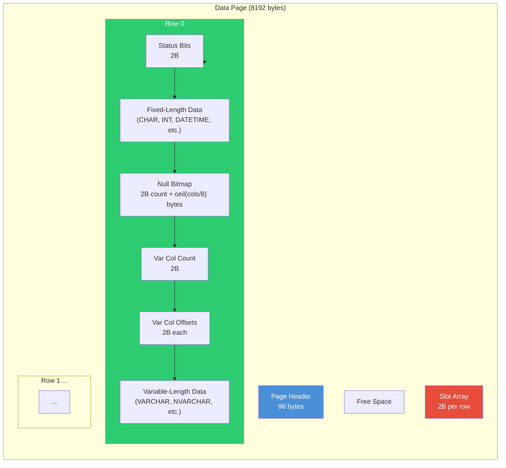
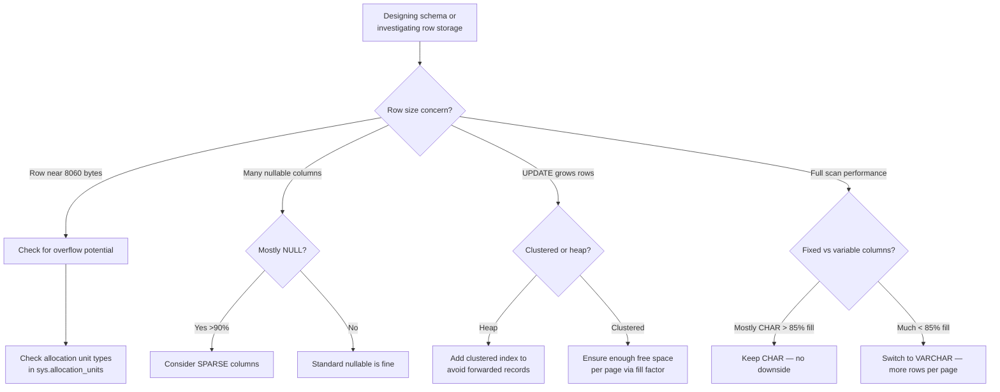

## Navigation

**Domain:** [[8 — Databases]] > **Group:** SQL Server Architecture & Storage Engine
**Previous:** [[8.273 — GAM, SGAM, PFS — Space Management Pages]] | **Next:** [[8.275 — Row Overflow — Large Row Handling]]

### Prerequisites
- [[8.271 — Page Structure — 8KB Pages]] — the 8192-byte page with header, body, and offset array is the container for row data
- [[8.273 — GAM, SGAM, PFS — Space Management Pages]] — row placement decisions start with PFS free-space lookup
- [[8.275 — Row Overflow — Large Row Handling]] — rows exceeding 8060 bytes trigger special overflow handling at the row level

### Where This Fits

Every row in SQL Server is stored as a structured record within the data page body. The row format has a fixed header (status bits, fixed-length count, variable-length count), fixed-length columns stored first, then null bitmap, then variable-length column offsets, then variable-length column data. Understanding row structure is critical for .NET engineers because it determines max row size limits, index key length limits, the cost of NULL columns (they still consume space in the null bitmap), and why variable-length columns (`VARCHAR`, `NVARCHAR`) have different performance characteristics than fixed-length columns (`CHAR`, `NCHAR`). Interviewers use row structure questions to test whether you understand the physical storage implications of schema design decisions.

## Core Mental Model

A data row is a self-describing byte sequence with a format that allows the engine to locate any column by its position without scanning the entire row. The row always starts with a 2-byte status bitmap (bits for versioning, null bitmap presence, variable-length column presence), followed by the fixed-length portion of the row (columns defined as fixed-size types sit here at predictable offsets), then a 2-byte null bitmap count and the null bitmap itself (1 bit per column, 1 = null), then a 2-byte variable-column count and a 2-byte offset array per variable column (pointing to each variable column's start position within the variable data area), and finally the actual variable-length column data. The slot array in the page header points to each row's byte offset, so rows can be reordered logically without physically moving data on UPDATE.



### Key Properties

|Property|Value|Notes|
|---|---|---|
|Max Row Size|8,060 bytes|Hard limit for IN_ROW_DATA allocation unit|
|Min Row Size|~6 bytes|Status (2) + var col count (2) + fixed portion minimum|
|Fixed-column offset|Predictable per schema|O(1) access if column offset known at compile time|
|Variable-column offset|2-byte per column lookup|O(n) where n = variable column count|
|Null bitmap cost|2 bytes + ceil(columns/8) bytes|Even when no NULLs present (for non-nullable columns, no bitmap)|
|Row version|14 bytes (if row versioning active)|Snapshot isolation adds version info in status bits + pointer|
|Forwarded record|16 bytes|8 bytes pointer to new location + 8 bytes original page info|

## Deep Mechanics

### How the Engine Reads a Row

**Step 1 — Page Latch:** The buffer manager has the page pinned and latched (shared latch for reads). The page header's `m_slotCnt` tells how many rows are on the page.

**Step 2 — Slot Array Lookup:** The engine reads slot array entry `slot[i]` (located at `8192 - (slot_cnt - i) * 2`). This gives the starting byte offset of row `i` within the page data body.

**Step 3 — Row Header Parsing:** At the row offset, the engine reads the first 2 bytes (status bits):

- Bit 0: Version info present (for snapshot isolation)
- Bit 1: Row has null bitmap
- Bit 2: Row has variable-length columns
- Bit 3: Version info from version store in TempDB
- Bit 4: Row has been forwarded (forwarding record)
- Bit 5: Row is a forwarded record (the actual data after forwarding)
- Bit 6: 14-byte row version exists in the row
- Bit 7: Ghost record flag

**Step 4 — Fixed-Length Columns:** After the 2 status bytes, the engine reads the fixed-length portion. The layout is determined at compile time from the schema: `col1_offset = 2`, `col2_offset = 2 + col1_size`, etc. For fixed-length types (INT = 4, BIGINT = 8, DATETIME = 8, CHAR(n) = n), the engine reads by direct offset — O(1) per column.

**Step 5 — Null Bitmap:** If status bit 1 is set, the engine reads 2 bytes for the null bitmap column count (`N_cols / 8` rounded up), then the bitmap itself. If the bitmap bit for a column is 1, the column is NULL and no data is stored in the variable-length area for that column.

**Step 6 — Variable-Length Columns:** If status bit 2 is set, the engine reads 2 bytes for the number of variable-length columns, then 2 bytes per variable column for the offset (from row start) where that column's data begins. The last offset also tells the total variable-data length. The engine finds each variable column by reading the offset array.

**Step 7 — Column Data Return:** The engine now knows the exact position and length of the requested column. It copies the bytes from the buffer pool page into the network buffer and returns them.

### SQL Visibility — Row Structure Inspection

```sql
-- Create a table to examine row structure
CREATE TABLE dbo.RowStructureDemo (
    Id INT NOT NULL,                          -- fixed-length, 4 bytes
    AccountId INT NULL,                        -- fixed-length, nullable, 4 bytes
    Name VARCHAR(100) NOT NULL,                -- variable-length
    Email VARCHAR(255) NULL,                   -- variable-length, nullable
    CreatedDate DATETIME2 NOT NULL,            -- fixed-length, 8 bytes
    StatusCode CHAR(3) NOT NULL,               -- fixed-length, 3 bytes
    IsActive BIT NOT NULL,                     -- fixed-length, 1 byte (BIT is stored as INT for row)
    Notes VARCHAR(2000) NULL,                  -- variable-length, nullable
    RowVersion ROWVERSION NOT NULL             -- fixed-length, 8 bytes (binary(8))
);

INSERT INTO dbo.RowStructureDemo (Id, AccountId, Name, Email, CreatedDate, StatusCode, IsActive, Notes)
VALUES (1, 1001, 'John Smith', 'john@example.com', '2024-01-15', 'ACT', 1, 'Standard account');

-- Find the page for this table
DBCC IND ('AdventureWorks2022', 'dbo.RowStructureDemo', 1);
-- Note PagePID from output

-- Dump the row structure
DBCC TRACEON (3604);
DBCC PAGE ('AdventureWorks2022', 1, <PagePID>, 3);

-- The row dump will show:
-- Row - Offset 0x00 (slot 0):
--   Status Bits: 0x06  (bits 1 and 2 =has null bitmap, has variable-length cols)
--   Fixed length data: offset 0x02
--   Column 1 (Id): offset 0x02, size 4 (0x00000001 = 1)
--   Column 5 (CreatedDate): offset 0x06, size 8
--   Column 6 (StatusCode): offset 0x0E, size 3 ('ACT')
--   Column 7 (IsActive): offset 0x11, size 4 (1 = true)
--   Column 2 (AccountId): offset 0x15, size 4 (1001)
--   Column 8 (RowVersion): offset 0x19, size 8
--   Number of null bitmap columns: 9 (for all 9 columns)
--   Null bitmap: 0x00 (no nulls)
--   Number of variable-length columns: 3 (Name, Email, Notes)
--   Variable offset array:
--     Column 3 (Name) at 0x24
--     Column 4 (Email) at 0x34
--     Column 9 (Notes) at 0x48
--   Variable data:
--     Name: 'John Smith'
--     Email: 'john@example.com'
--     Notes: 'Standard account'

-- Using sys.dm_db_database_page_allocations to find row counts
SELECT 
    allocated_page_file_id,
    allocated_page_page_id,
    page_level,
    page_type_desc,
    record_count,
    min_record_size_in_bytes,
    max_record_size_in_bytes,
    avg_record_size_in_bytes
FROM sys.dm_db_index_physical_stats(
    DB_ID('AdventureWorks2022'),
    OBJECT_ID('dbo.RowStructureDemo'),
    NULL, NULL, 'DETAILED'
);
```

### Failure Modes

- **Row Version Overflow (Error 601):** Under snapshot isolation, if a row has too many versions (frequent UPDATEs), the version chain exhausts the row's ability to store version pointers. Error: "Could not continue scan with NOLOCK due to data movement." Rare — typically indicates runaway UPDATE cycles.

- **Forwarding Record Explosion:** When a row in a heap is updated and the new version is larger, the original page gets a 16-byte forwarding record pointing to the new page. Forwarded records add one extra logical read per forwarded row during scans. High forwarded record count (visible in `sys.dm_db_index_physical_stats`) indicates poorly designed heap.

- **Row Size Exceeds 8060 (Runtime Error):** At INSERT time, if the sum of fixed columns + max variable columns exceeds 8060, the row must overflow. But if SQL Server cannot move columns to row-overflow pages (because of schema constraints like `VARCHAR(8000)` with data > 8060 total), the INSERT fails with error 511: "Cannot create a row of size X which is greater than the allowable maximum row size of 8060."

- **Page Splits from Row Growth:** An UPDATE that increases variable-column length (e.g., updating `Notes` from 10 chars to 500) can cause a page split if the row no longer fits on the current page. This is the most common row-related performance issue in production.

## Production Patterns and Implementation

### Detecting Row Structure Issues

```sql
-- Forwarded record detection
SELECT 
    OBJECT_SCHEMA_NAME(ps.object_id) + '.' + OBJECT_NAME(ps.object_id) AS table_name,
    i.name AS index_name,
    ps.forwarded_record_count,
    ps.page_count,
    ps.record_count,
    ps.avg_record_size_in_bytes,
    (ps.forwarded_record_count * 100.0 / NULLIF(ps.record_count, 0)) AS forwarded_percent
FROM sys.dm_db_index_physical_stats(
    DB_ID(), NULL, NULL, NULL, 'DETAILED'
) ps
INNER JOIN sys.indexes i 
    ON ps.object_id = i.object_id AND ps.index_id = i.index_id
WHERE ps.index_id = 0  -- Heaps only (clustered indexes use key forwarding, different)
    AND ps.forwarded_record_count > 0
ORDER BY ps.forwarded_record_count DESC;

-- Row size estimation query
SELECT 
    OBJECT_SCHEMA_NAME(c.object_id) + '.' + OBJECT_NAME(c.object_id) AS table_name,
    SUM(c.max_length) AS total_max_schema_bytes,
    MAX(CASE 
        WHEN c.system_type_id IN (34, 35, 99, 167, 175, 231, 241)
        THEN c.max_length ELSE 0 
    END) AS max_variable_column_size,
    SUM(CASE 
        WHEN c.system_type_id IN (34, 35, 99, 167, 175, 231, 241)
        THEN 0 ELSE c.max_length 
    END) AS total_fixed_schema_bytes,
    SUM(CASE WHEN c.is_nullable = 1 THEN 1 ELSE 0 END) AS nullable_columns,
    2 +  -- status bits
    SUM(CASE 
        WHEN c.system_type_id IN (34, 35, 99, 167, 175, 231, 241)
        THEN 0 ELSE c.max_length 
    END) +  -- fixed data
    2 + 2 +  -- null bitmap count + null bitmap bytes
    CEILING(MAX(c.column_id) * 1.0 / 8) +  -- null bitmap actual
    2 +  -- var col count
    (SELECT COUNT(*) FROM sys.columns c2 
     WHERE c2.object_id = c.object_id AND c2.system_type_id IN (34, 35, 99, 167, 175, 231, 241)
    ) * 2 +  -- var col offsets
    MAX(CASE 
        WHEN c.system_type_id IN (34, 35, 99, 167, 175, 231, 241)
        THEN c.max_length ELSE 0 
    END)  -- max variable data
    AS estimated_min_row_size
FROM sys.columns c
WHERE c.object_id = OBJECT_ID('dbo.SalesOrder')
GROUP BY c.object_id
ORDER BY table_name;

-- Version store pollution detection
SELECT 
    session_id,
    transaction_id,
    elapsed_time_seconds = DATEDIFF(SECOND, start_time, GETDATE()),
    is_snapshot,
    database_id
FROM sys.dm_tran_active_snapshot_database_transactions
ORDER BY elapsed_time_seconds DESC;
```

### DBCC Command Examples

```sql
-- Enable trace flags for DBCC output
DBCC TRACEON (3604);

-- View row-level details with option 3
DBCC PAGE ('AdventureWorks2022', 1, <PagePID>, 3);

-- Display page header only
DBCC PAGE ('AdventureWorks2022', 1, <PagePID>, 0);

-- Show row offsets (slot array)
DBCC PAGE ('AdventureWorks2022', 1, <PagePID>, 2);
-- Output includes:
-- Slot 0 Offset 0x60, Length 45
-- Slot 1 Offset 0x8D, Length 45
-- Slot 2 Offset 0xBA, Length 45
-- This shows each row's offset within the page and its length
```

### SQL Server vs PostgreSQL Differences

|Aspect|SQL Server|PostgreSQL|
|---|---|---|
|Row header|~2-12+ bytes depending on features|23 bytes (HeapTupleHeader)|
|Column ordering|Fixed then variable; column order is schema order|Fixed-width then variable-width; column order matched to schema|
|NULL storage|Null bitmap (1 bit per column, always present if any nullable column exists)|Null bitmap in HeapTupleHeader (optional, 1 bit per column + infomask)|
|TOAST/Overflow|Separate allocation unit (ROW_OVERFLOW)|Inline TOAST pointer followed by separate TOAST table|
|Variable-length offset|2 bytes per variable column (offset from row start)|4 bytes per variable column (length + pointer)|
|Forwarding|16-byte forwarding record in heap for row movement|No forwarding — UPDATE = DELETE + INSERT (new tuple)|
|Row version|Status bit + 14-byte version pointer in-row when snapshot isolation active|xmin/xmax in HeapTupleHeader (4 bytes each) + commit status|

PostgreSQL's tuple header is larger (23 bytes) but contains more built-in information: xmin (creating XID), xmax (deleting/updating XID), t_ctid (next tuple version pointer), t_infomask (status flags including null bitmap presence, has large values, etc.). SQL Server keeps the row header minimal and uses status bits to indicate which optional structures follow.

## Gotchas and Production Pitfalls

### Pitfall 1: NULL Bitmap Overhead on Wide Tables

**Pitfall:** Creating tables with many columns (e.g., 200 columns) where most are nullable, assuming "NULL takes no space."

**Symptom:** Row size is larger than expected. The null bitmap costs 2 bytes for the column count + `ceil(200/8)` = 27 bytes for the bitmap itself. With all columns nullable, the bitmap is always present. Total null bitmap cost: 29 bytes per row. On a 10M row table, that's 290MB just for the null bitmap.

**Fix:** For truly fixed-column tables, consider redesigning with narrower schemas or using sparse columns:

```sql
-- Use SPARSE for columns that are mostly NULL (saves 4 bytes per null column)
ALTER TABLE dbo.WideTable
ALTER COLUMN OptionalAddressLine2 VARCHAR(100) SPARSE NULL;

-- Or normalize wide tables into vertical/attribute tables
```

**Cost of not fixing:** 290MB wasted on a 10M-row table. Full scans read unnecessary additional pages. Buffer pool memory is wasted on null bitmap data.

### Pitfall 2: Row Version Explosion Under Snapshot Isolation

**Pitfall:** Running snapshot isolation with long-running transactions that cause row version pointers to accumulate.

**Symptom:** Row size appears to grow. `sys.dm_tran_version_store` shows millions of version records. `sys.dm_db_index_physical_stats` shows larger `avg_record_size_in_bytes` for the same schema.

**Fix:** Keep snapshot transactions as short as possible. Monitor version store cleanup:

```sql
-- Check version store size
SELECT 
    DB_NAME(database_id) AS database_name,
    COUNT(*) AS version_records,
    SUM(record_length_bytes) AS total_bytes,
    SUM(record_length_bytes) / 1024 / 1024 AS total_mb
FROM sys.dm_tran_version_store
GROUP BY database_id;

-- Find longest-running snapshot transactions
SELECT 
    transaction_id,
    elapsed_time_seconds = DATEDIFF(SECOND, transaction_begin_time, GETDATE()),
    database_id,
    is_snapshot
FROM sys.dm_tran_active_transactions
WHERE transaction_begin_time < DATEADD(MINUTE, -5, GETDATE());
```

**Cost of not fixing:** Row version pointer in the row (14 bytes) means every row touched by frequent UPDATEs grows. Full table reads must traverse the version chain. In extreme cases, version store fills TempDB, causing 1105 errors.

### Pitfall 3: Forwarded Records in Heap Tables

**Pitfall:** Using HEAP tables (no clustered index) with frequent UPDATEs that increase row size.

**Symptom:** `sys.dm_db_index_physical_stats` shows `forwarded_record_count > 0`. Full table scans show additional logical reads proportional to forwarded record count. Each forwarded row requires reading two pages instead of one.

**Fix:** Add a clustered index to eliminate forwarded records entirely (clustered tables use key forwarding instead, which is more efficient):

```sql
-- Add clustered index on an appropriate key
CREATE CLUSTERED INDEX CX_Orders_OrderDate ON dbo.Orders(OrderDate);

-- After rebuild, forwarded records are eliminated
ALTER TABLE dbo.Orders REBUILD;
```

**Cost of not fixing:** A 100M-row heap with 5% forwarded records adds 5M extra page reads on every full scan. That's 40GB of extra logical I/O per scan.

### Pitfall 4: Row Version Pointer Overhead Under Read Committed Snapshot Isolation

**Pitfall:** Enabling RCSI without accounting for the 14-byte row version pointer that is added to every updated row.

**Symptom:** After enabling `READ_COMMITTED_SNAPSHOT ON`, `sys.dm_db_index_physical_stats` shows `avg_record_size_in_bytes` increased by 14+ bytes for frequently updated tables. Row density per page decreases, increasing logical reads for full scans.

**Fix:** Monitor the version pointer overhead. If the overhead is significant (> 5% of row size), consider whether RCSI is necessary for all queries or only specific ones:

```sql
-- Check version store size
SELECT COUNT(*) AS version_records, SUM(record_length_bytes) / 1024 / 1024 AS version_store_mb
FROM sys.dm_tran_version_store;

-- Compare row size with and without version overhead
SELECT 
    OBJECT_NAME(object_id) AS table_name,
    index_id,
    avg_record_size_in_bytes,
    forwarded_record_count,
    record_count
FROM sys.dm_db_index_physical_stats(DB_ID(), NULL, NULL, NULL, 'DETAILED')
WHERE index_level = 0
ORDER BY avg_record_size_in_bytes DESC;
```

**Cost of not fixing:** Unexplained 10-15% increase in logical reads after enabling RCSI. Engineers may revert RCSI (losing the concurrency benefit) instead of understanding and accepting the version overhead tradeoff.

### Pitfall 5: Fixed-Length vs Variable-Length Column Confusion

**Pitfall:** Using `CHAR(200)` instead of `VARCHAR(200)` for columns that store variable-length data (e.g., customer names).

**Symptom:** Row size is 200 bytes for every row, even when names average 15 characters. The storage engine stores trailing spaces in the fixed-length area. Page density is low because large fixed columns leave little room for other rows.

**Fix:** Always use `VARCHAR` for variable-length strings:

```sql
-- Before: CHAR(200) — wastes 185 bytes per row on average
ALTER TABLE dbo.Customers ALTER COLUMN FullName VARCHAR(200) NOT NULL;
```

**Cost of not fixing:** On a 50M-row table, switching from `CHAR(200)` to `VARCHAR(15-avg)` reduces storage from ~10GB to ~2GB. Full scans read 5x fewer pages.

## Performance Implications

### Benchmark: Row Structure Impact on Query Performance

```sql
-- Create two tables with same logical data but different physical storage
CREATE TABLE dbo.FixedWidthTest (
    Id INT PRIMARY KEY,
    Col1 CHAR(100) NOT NULL DEFAULT 'x',
    Col2 CHAR(100) NOT NULL DEFAULT 'x',
    Col3 CHAR(100) NOT NULL DEFAULT 'x',
    Col4 CHAR(100) NOT NULL DEFAULT 'x'
);

CREATE TABLE dbo.VariableWidthTest (
    Id INT PRIMARY KEY,
    Col1 VARCHAR(100) NOT NULL DEFAULT 'x',
    Col2 VARCHAR(100) NOT NULL DEFAULT 'x',
    Col3 VARCHAR(100) NOT NULL DEFAULT 'x',
    Col4 VARCHAR(100) NOT NULL DEFAULT 'x'
);

-- Insert 10000 rows into both
INSERT INTO dbo.FixedWidthTest (Id) SELECT TOP 10000 ROW_NUMBER() OVER (ORDER BY (SELECT NULL)) FROM sys.objects a, sys.objects b;
INSERT INTO dbo.VariableWidthTest (Id) SELECT TOP 10000 ROW_NUMBER() OVER (ORDER BY (SELECT NULL)) FROM sys.objects a, sys.objects b;

-- Compare performance
SET STATISTICS IO ON;
-- Fixed width: reads 412 bytes per row, few rows per page
SELECT COUNT(*) FROM dbo.FixedWidthTest;
-- Variable width: reads 5 bytes per row, many rows per page
SELECT COUNT(*) FROM dbo.VariableWidthTest;
```

**Expected results:** FixedWidthTest reads ~50 pages, VariableWidthTest reads ~5 pages. 10x difference due to row density.

### Write Amplification Per Row Operation

|Operation|Page Writes (In-Place)|Log Bytes|Notes|
|---|---|---|---|
|INSERT (fixed-length row, page fits)|1|~row_size + overhead|~50B overhead per INSERT|
|INSERT (with variable data, page fits)|1|~row_size + overhead|Variable data logged as actual length|
|UPDATE (fixed-length, same size)|1|~row_size + delta|Logged as difference, not full row|
|UPDATE (variable-length, larger, page split)|2-3|~2KB|Split + row write|
|UPDATE (variable-length, smaller)|1|~row_size + delta|Space freed on page|
|DELETE (row becomes ghost)|1|~50B + row_size|Minimal logging|
|Row version (snapshot)|1 (version store)|~row_size|Version copied to TempDB|

### BenchmarkDotNet

```csharp
[MemoryDiagnoser]
[SimpleJob(RuntimeMoniker.Net90)]
public class RowStructureBenchmark
{
    private IDbConnection _connection = default!;
    private const string ConnectionString = "Server=.;Database=PerfTest;Integrated Security=true;TrustServerCertificate=true;";

    [GlobalSetup]
    public void Setup()
    {
        _connection = new SqlConnection(ConnectionString);
        _connection.Open();
    }

    [Benchmark(Baseline = true)]
    public async Task InsertFixedWidthRows()
    {
        await using var tx = _connection.BeginTransaction();
        for (int i = 0; i < 1000; i++)
        {
            var cmd = _connection.CreateCommand();
            cmd.Transaction = tx;
            cmd.CommandText = "INSERT INTO dbo.FixedWidthTest (Id) VALUES (@Id);";
            cmd.Parameters.AddWithValue("@Id", i);
            await cmd.ExecuteNonQueryAsync();
        }
        await tx.RollbackAsync();
    }

    [Benchmark]
    public async Task InsertVariableWidthRows()
    {
        await using var tx = _connection.BeginTransaction();
        for (int i = 0; i < 1000; i++)
        {
            var cmd = _connection.CreateCommand();
            cmd.Transaction = tx;
            cmd.CommandText = "INSERT INTO dbo.VariableWidthTest (Id) VALUES (@Id);";
            cmd.Parameters.AddWithValue("@Id", i);
            await cmd.ExecuteNonQueryAsync();
        }
        await tx.RollbackAsync();
    }

    [GlobalCleanup]
    public void Cleanup() => _connection.Dispose();
}
```

## Interview Arsenal

### Question Bank

1. **Describe the physical layout of a row in SQL Server. What fields does the row header contain?**
2. **How does the storage engine locate a specific column within a row?**
3. **What is the null bitmap and when is it included in a row?**
4. **What are forwarded records and how do they affect SELECT performance?**
5. **Compare fixed-length (CHAR) vs variable-length (VARCHAR) storage in SQL Server rows.**
6. **How does snapshot isolation row versioning affect row structure?**
7. **What happens when an UPDATE causes a row to exceed the page's available free space?**
8. **How does the slot array enable logical row reordering without physical row movement?**

### Spoken Answers

**Q1: Describe the physical layout of a row in SQL Server.**

> **Average answer:** Rows have a header, then fixed-length columns, then variable-length columns. The header has status bits.

> **Great answer:** The row starts with a 2-byte status bits field encoding up to 8 flags: version info presence, null bitmap present, variable columns present, version store info, forwarded record indicator, forwarded record source, 14-byte row version, and ghost record. Next comes the fixed-length data portion where columns defined with fixed-size types (INT, BIGINT, DATETIME, CHAR, etc.) are laid out contiguously at compile-time-predicted offsets — enabling O(1) direct access. If any column is nullable, a 2-byte null column count follows (always equal to total column count), then a bitmap of `ceil(column_count / 8)` bytes where each bit=1 indicates NULL. Variable-length columns come next: a 2-byte count of variable columns in the row (note: this can differ from schema count if a variable column has less data), then a 2-byte offset array (one entry per variable column, pointing to the byte where that column's data starts within the row). Finally, the actual variable data. The slot array in the page header points to each row's starting byte offset, so the engine reads `page[slot_array[i]]` to find row `i`. This entire structure ensures that SQL Server can decode any row without schema metadata — the row is self-describing.

**Q5: Compare fixed-length (CHAR) vs variable-length (VARCHAR) storage in SQL Server rows.**

> **Average answer:** CHAR uses fixed space, VARCHAR adjusts to data length. VARCHAR saves space for variable data.

> **Great answer:** Fixed-length columns are stored by value in the fixed-portion of the row. They always consume their declared size (e.g., CHAR(100) always takes 100 bytes), with trailing spaces preserved. Variable-length columns add 2 bytes of overhead per column in the slot array (for the offset pointer) AND the actual data stored. So VARCHAR(100) storing 10 bytes uses 2 + 10 = 12 bytes. The breakeven point is approximately at 85% fill: if the average string exceeds 85% of the declared max, CHAR becomes more space-efficient due to the 2-byte overhead. But the real performance difference is in page density: a CHAR(100) row limits you to ~80 rows per page (8000/100), while a VARCHAR(100) averaging 30 bytes can fit ~240 rows per page (8000/33). That's 3x fewer logical reads for full scans. For fixed-length access patterns (seeks by key), the difference matters less. For update patterns, VARCHAR avoids the page-split risk when data grows — CHAR always stores max length, so UPDATE cannot outgrow the row's reserved space.

**Q7: What happens when an UPDATE causes a row to exceed the page's available free space?**

> **Average answer:** A page split happens — the engine moves the row to a new page.

> **Great answer:** If the row's variable-length columns grow and the page's `m_freeCnt` is insufficient, the engine has different behavior based on table type. For a **clustered table**, the engine evaluates whether the row can stay on the same page by moving other rows (page compaction). If that fails, a page split occurs: a new page is allocated from the same extent (or a new uniform extent if the current extent is full), approximately 50% of the rows from the original page are moved to the new page, the next/prev page pointers are updated, and both pages' PFS bytes are updated. The UPDATE then inserts the new version of the row into the appropriate page. For a **heap**, if the row grows, the engine tries to keep it in place by moving other rows on the page. If the page is full, it creates a **forwarding record**: the original slot gets a 16-byte pointer (8 bytes for page ID + offset, 8 bytes for original location info), and the actual row is moved to a new page. The forwarding record is transparent to queries but adds one extra page read during scans. In both cases, the transaction log records the full page split operation — the log record typically includes the old and new page images.

### Additional Question: Row Structure in Columnstore vs Rowstore

**Q9: How does the row structure differ between rowstore tables and columnstore indexes?**

> **Great answer:** Rowstore stores complete rows contiguously per page with the status-bit + fixed-data + null-bitmap + variable-offsets + variable-data structure. Columnstore stores values from the same column together in compressed segments. The row structure concept does not apply directly to columnstore — instead, each column segment is a separate compression unit. However, the delta store in columnstore indexes (for recent INSERTs) uses a standard rowstore page structure exactly as described in this note, with the same slot array and row format. Once the delta store reaches 1M rows, the tuple mover compresses those rows into columnar format, discarding the row structure. This means: the row structure we discussed applies to all rowstore pages (including columnstore delta stores) but not to compressed columnstore segments. For .NET engineers using Entity Framework, rowstore tables use the standard `INSERT` path writing full rows; columnstore bulk inserts bypass per-row overhead entirely.

### Interview Trigger

This topic surfaces when asked "Describe how SQL Server stores a row physically." The interviewer wants to hear about the status bits, fixed/variable split, null bitmap, and slot array. The follow-up "How does this affect schema design?" tests whether the candidate applies this knowledge to production decisions like `CHAR` vs `VARCHAR` or nullable column cost.

### Comparison Table

| | Fixed-Length Column | Variable-Length Column |
|---|---|---|
|Storage cost|Declared size exactly|2 bytes overhead + actual data length|
|Access cost|O(1) direct offset|O(n) offset array lookup per column|
|UPDATE risk|None (size is fixed)|Grow can cause page split|
|Page density|Low (fixed max per row)|High (density adjusts to data)|
|NULL cost|Still occupies fixed slot|No data stored; 1 bit in null bitmap + 2 bytes saved in var-offset array|
|Index support|Full (can be key column)|Full (key length limited to 900/1700 bytes)|

## Decision Framework

### When to Apply



### Application Checklist

- [ ] No heap table has `forwarded_record_count > 1000`
- [ ] Nullable columns are justified — null bitmap cost is understood
- [ ] `VARCHAR` is preferred over `CHAR` for variable-length strings unless fill factor > 85%
- [ ] Tables under snapshot isolation have < 5% overhead for row version pointers
- [ ] Row size estimated: `SELECT SUM(max_length) FROM sys.columns` confirms < 8060 bytes
- [ ] No `ROP` column data types (old LOB types like TEXT, NTEXT, IMAGE) are in use
- [ ] SPARSE columns considered for tables with > 10 nullable columns and > 90% NULL

### Tradeoff Summary

|What You Gain|What You Pay|
|---|---|
|Self-describing rows (no schema needed for decode)|~12+ bytes overhead per row (status + null bitmap + var offsets)|
|O(1) fixed-column access via compile-time offsets|Variable-column access requires offset array traversal|
|Forwarded records avoid page splits in heaps (temporarily)|Forwarded records degrade scan performance permanently|
|Null bitmap enables efficient NULL storage|Null bitmap overhead grows with column count (1 bit per column)|

### Scale Thresholds

- **Relevant when:** Table width > 20 columns or row size > 2000 bytes
- **Critical when:** Row size > 7000 bytes (page split risk for any variable-column growth)
- **Required when:** Table under snapshot isolation with > 10M rows and frequent UPDATEs — row version pointers create significant overhead
- **Impractical when:** > 500 columns per table — null bitmap alone costs 64 bytes per row

## Self-Check

### Conceptual Questions

1. What is the minimum and maximum row size for IN_ROW_DATA allocation?
2. What bits are in the 2-byte row status field and what does each mean?
3. How does the null bitmap save space for NULL values? What is its overhead?
4. How does the slot array in the page header relate to the row offset within a page?
5. What is a forwarding record, under what condition is it created, and how does it affect queries?
6. How does SQL Server locate a specific column in a row — walk through the offset calculation?
7. What is the difference between row versioning in-row (14-byte pointer) vs version store in TempDB?
8. How does an UPDATE on a VARCHAR column that doubles the data length from 50 to 100 bytes get processed when the page has only 20 bytes free?
9. How many bytes does a NULL VARCHAR(255) column consume in the row? Does it differ from a NULL INT column?
10. How does PostgreSQL's tuple header differ from SQL Server's row header?

<details>
<summary>Answers</summary>

1. Minimum: ~6 bytes (2 status + 2 var-col count + minimal data). Maximum: 8060 bytes for IN_ROW_DATA. Rows exceeding 8060 bytes trigger ROW_OVERFLOW allocation (some variable columns moved to separate pages) or fail with error 511 if fixed-length columns alone exceed 8060.
2. Bit 0: Version info present. Bit 1: Row has null bitmap. Bit 2: Row has variable-length columns. Bit 3: Version store info (TempDB version store). Bit 4: Row is a forwarded record (source record). Bit 5: Row is a forwarded record (destination record). Bit 6: 14-byte row version pointer present. Bit 7: Ghost record.
3. The null bitmap uses 1 bit per column (2 bytes count + ceil(cols/8) bytes). If a column is NULL, its bit = 1, and for variable-length columns, the data is not stored at all — no bytes consumed. For fixed-length columns, the fixed data area still reserves the space, but the value is considered NULL. So NULL varchar columns save space; NULL int columns do not (the space is reserved but unused).
4. The slot array is at the end of the page. Entry `slot[i]` contains the 2-byte offset from the page start to row `i`. The engine does NOT assume rows are in slot order — the slot array can be reordered to reflect logical sort order without physically moving rows. This is how index key ordering is maintained: the non-clustered index's leaf-level slot array is ordered by key, but the row data stays at its physical offset.
5. A forwarding record is created when a row in a HEAP table is updated and the new version is too large for the current page. The original slot gets a 16-byte forwarding pointer (file ID + page ID + slot number of the new location). All subsequent reads of that row first read the original page, find the forwarding pointer, then read the target page. This doubles the logical reads for that row.
6. Fixed columns: offset = row_start + 2 (status) + sum of all fixed-column sizes before this column (determined at compile time by schema). Variable columns: offset = row_start + 2 (status) + fixed_length_size + null_bitmap_size + 2 (var col count) + (index_of_var_col - 1) * 2 (offset array entry). The engine reads the offset value from the array at that position.
7. In-row versioning stores a 14-byte version pointer directly in the row (status bit 6 = 1). Version store versioning stores the version chain in TempDB and only a small version tag in the row (status bit 0/3 = 1). In-row versioning is used by `READ COMMITTED SNAPSHOT` and `SNAPSHOT ISOLATION` for minimal reads. Version store is used when `ALTER DATABASE ... SET ALLOW_SNAPSHOT_ISOLATION ON` or `READ_COMMITTED_SNAPSHOT ON`.
8. The row on the current page grows beyond the available 20 bytes. The engine checks the page's total free space. If other rows on the page can be rearranged (freeing space), it does so. If the page is full, a page split occurs: a new page is allocated, ~50% of the rows are moved from the original page to the new page, the page chain pointers are updated, and the updated row is placed on the page with enough space.
9. A NULL VARCHAR(255) consumes: 2 bytes (status) + fixed-length portion (0 bytes — it's var) + null bitmap entry (1 bit, cost spread across null bitmap bytes) + 2 bytes (var col count, if any var cols in row) + 2 bytes (offset slot for this column, if any var cols — but if this is the only var col and it's NULL, the var-length count is 0 and no offset array). So approximately 4-6 bytes total. A NULL INT consumes: 2 bytes status + 4 bytes (fixed data area for the INT, even if null) + null bitmap bit. So approximately 6 bytes. NULL INT DOES NOT save space because the fixed-data slot is still reserved.
10. PostgreSQL's HeapTupleHeader is 23 bytes and contains: t_xmin (4 bytes — creating transaction ID), t_xmax (4 bytes — deleting/updating transaction ID), t_cid (4 bytes — command ID), t_ctid (6 bytes — tuple ID pointing to next version or self), t_infomask2 (2 bytes — field count and hint bits), t_infomask (2 bytes — status flags), t_hoff (1 byte — header length). SQL Server's row header is 2 bytes minimum, with optional extensions (null bitmap, var-length info). PostgreSQL embeds transaction visibility info directly in the tuple; SQL Server uses the status bits to reference version info or the version store.

</details>

### Query Challenges

**Challenge 1 — Calculate actual row sizes for all tables**

Write a query using `sys.dm_db_index_physical_stats` that lists all user tables, their average row size, and the estimated rows per page considering the 8060 byte limit.

<details>
<summary>Solution</summary>

```sql
SELECT 
    OBJECT_SCHEMA_NAME(ps.object_id) + '.' + OBJECT_NAME(ps.object_id) AS table_name,
    i.name AS index_name,
    i.type_desc AS index_type,
    ps.record_count,
    ps.avg_record_size_in_bytes,
    ps.min_record_size_in_bytes,
    ps.max_record_size_in_bytes,
    -- Estimated rows per 8KB page
    CASE 
        WHEN ps.avg_record_size_in_bytes = 0 THEN 0
        ELSE CAST(8096.0 / ps.avg_record_size_in_bytes AS INT)
    END AS est_rows_per_page,
    ps.page_count,
    ps.forwarded_record_count
FROM sys.dm_db_index_physical_stats(
    DB_ID(), NULL, NULL, NULL, 'DETAILED'
) ps
INNER JOIN sys.indexes i 
    ON ps.object_id = i.object_id AND ps.index_id = i.index_id
WHERE ps.index_level = 0  -- Leaf level only
    AND ps.record_count > 0
    AND ps.avg_record_size_in_bytes > 0
ORDER BY ps.record_count DESC;
```

</details>

---

**Challenge 2 — Find tables at risk of page splits**

Identify tables where the average row size is > 50% of page capacity and UPDATE activity is high.

<details> <summary>Solution</summary>

```sql
SELECT 
    OBJECT_SCHEMA_NAME(s.object_id) + '.' + OBJECT_NAME(s.object_id) AS table_name,
    s.record_count,
    s.avg_record_size_in_bytes,
    s.page_count,
    s.avg_page_space_used_in_percent,
    ops.leaf_update_count,
    ops.leaf_insert_count,
    (s.avg_record_size_in_bytes * 100.0 / 8060) AS row_size_percent_of_page,
    CASE 
        WHEN s.avg_page_space_used_in_percent > 80 
            AND s.avg_record_size_in_bytes > 4000 THEN 'HIGH RISK'
        WHEN s.avg_page_space_used_in_percent > 70 
            AND s.avg_record_size_in_bytes > 6000 THEN 'MEDIUM RISK'
        ELSE 'LOW RISK'
    END AS split_risk
FROM sys.dm_db_index_physical_stats(DB_ID(), NULL, NULL, NULL, 'LIMITED') s
LEFT JOIN sys.dm_db_index_operational_stats(DB_ID(), NULL, NULL, NULL) ops
    ON s.object_id = ops.object_id AND s.index_id = ops.index_id
WHERE s.index_level = 0
    AND s.record_count > 10000
ORDER BY s.avg_page_space_used_in_percent DESC;
```

</details>

---

**Challenge 3 — Simulate forward record growth**

Given a heap table, perform UPDATEs that grow the row size and measure the forwarded record increase.

<details> <summary>Solution</summary>

```sql
-- Create a heap table (no clustered index)
CREATE TABLE dbo.HeapForwardTest (
    Id INT NOT NULL,
    Data VARCHAR(100) NOT NULL DEFAULT 'x',
    GrowingColumn VARCHAR(100) NOT NULL DEFAULT 'x'
);

-- Insert 1000 rows
INSERT INTO dbo.HeapForwardTest (Id)
SELECT TOP 1000 ROW_NUMBER() OVER (ORDER BY (SELECT NULL))
FROM sys.objects a CROSS JOIN sys.objects b;

-- Measure before
SELECT forwarded_record_count, record_count, page_count
FROM sys.dm_db_index_physical_stats(DB_ID(), OBJECT_ID('dbo.HeapForwardTest'), 0, NULL, 'DETAILED');

-- UPDATE to grow the row significantly
UPDATE dbo.HeapForwardTest
SET GrowingColumn = REPLICATE('x', 100);

-- Measure after — forwarded_record_count should increase
SELECT forwarded_record_count, record_count, page_count
FROM sys.dm_db_index_physical_stats(DB_ID(), OBJECT_ID('dbo.HeapForwardTest'), 0, NULL, 'DETAILED');

-- Fix: Add clustered index
CREATE CLUSTERED INDEX CX_HeapForwardTest ON dbo.HeapForwardTest(Id);

-- After rebuild — forwarded records resolved
SELECT forwarded_record_count FROM sys.dm_db_index_physical_stats(
    DB_ID(), OBJECT_ID('dbo.HeapForwardTest'), 1, NULL, 'DETAILED'
);
```

</details>

---

**Challenge 4 — Estimate row size from schema**

Given a table with 15 columns (INT PK, 2 INT NULL, 3 VARCHAR(200) NOT NULL, 4 VARCHAR(50) NULL, 2 DATETIME2 NOT NULL, 1 CHAR(3) NOT NULL, 1 BIT NOT NULL, 1 NVARCHAR(500) NULL), calculate the minimum, maximum, and average row sizes.

<details> <summary>Solution</summary>

**Column breakdown:**
- Status bits: 2 bytes
- Fixed columns: INT PK (4), 2 INT NULL (8), 2 DATETIME2 (16), CHAR(3) (3), BIT (4 — stored as INT) = 35 bytes fixed
- Null bitmap: 2 bytes count + ceil(15/8) = 2 bytes data = 4 bytes total
- Variable columns present: yes (status bit 2)
- Var col count: 2 bytes
- Var offset array: 4 var columns (2 VARCHAR(200) NOT NULL, 4 VARCHAR(50) NULL = 6, but 2 NOT NULL are always present and 4 NULL are conditional) — actually all variable columns are counted if any one has data. So 6 var col offsets × 2 = 12 bytes
- **Minimum row (all variable columns NULL, or empty):** 2 + 35 + 4 + 2 + 12 + 0 (no var data) = 55 bytes (but variable column count would be 0 if all NULL, saving 12 bytes offset). Actually if all var columns are NULL, the var col count = 0 and no offsets. So min = 2 + 35 + 4 + 2 = 43 bytes.
- **Maximum row (all var columns at max):** 2 + 35 + 4 + 2 + 12 + (2 × 200 + 4 × 50 + 1 × 500) = 43 + 12 + 400 + 200 + 500 = 1,155 bytes.
- **Average (50% fill for VARCHARs):** 43 + 0 + (assume 4 of 6 var cols have data at 50% avg) approximate = 43 + 12 + 400 = 455 bytes.

</details>

---

**Challenge 5 — Design a table to minimize row overhead**

Design a schema for a `SalesOrder` table with 30 columns (including audit fields) minimizing row overhead for the given access patterns: 95% single-row SELECT by OrderId, 5% INSERT, no UPDATE to growing data.

<details> <summary>Solution</summary>

```sql
-- Design: minimize null bitmap and variable-length overhead
CREATE TABLE dbo.SalesOrder (
    -- Key
    OrderId BIGINT NOT NULL IDENTITY(1,1),
    OrderDate DATETIME2 NOT NULL,
    
    -- Customer info (always present)
    CustomerId INT NOT NULL,
    CustomerName VARCHAR(100) NOT NULL,
    CustomerEmail VARCHAR(255) NOT NULL,
    
    -- Order details (variable but always present)
    ShippingAddress VARCHAR(500) NOT NULL,
    BillingAddress VARCHAR(500) NOT NULL,
    
    -- Financial
    SubTotal MONEY NOT NULL,
    TaxAmount MONEY NOT NULL,
    ShippingAmount MONEY NOT NULL,
    TotalAmount MONEY NOT NULL,
    
    -- Optional contact info (sparse — mostly null)
    AlternatePhone VARCHAR(20) SPARSE NULL,
    DeliveryInstructions VARCHAR(500) SPARSE NULL,
    GiftNote NVARCHAR(200) SPARSE NULL,
    PreferredDeliveryDate DATE SPARSE NULL,
    
    -- Status tracking
    StatusCode CHAR(3) NOT NULL,
    LastModified DATETIME2 NOT NULL,
    
    -- Audit fields
    CreatedDate DATETIME2 NOT NULL DEFAULT SYSUTCDATETIME(),
    ModifiedDate DATETIME2 NOT NULL DEFAULT SYSUTCDATETIME(),
    CreatedByUserId INT NOT NULL,
    ModifiedByUserId INT NOT NULL,
    
    -- Constraints
    CONSTRAINT PK_SalesOrder PRIMARY KEY CLUSTERED (OrderId)
);

-- SPARSE columns save 4 bytes per null column (but add overhead for non-null)
-- With > 90% NULL rate, SPARSE saves significant space
-- All NOT NULL columns avoid null bitmap overhead when possible
-- BIGINT key vs GUID: 8 bytes vs 16 bytes — saves 8 bytes per index entry
```

</details>
