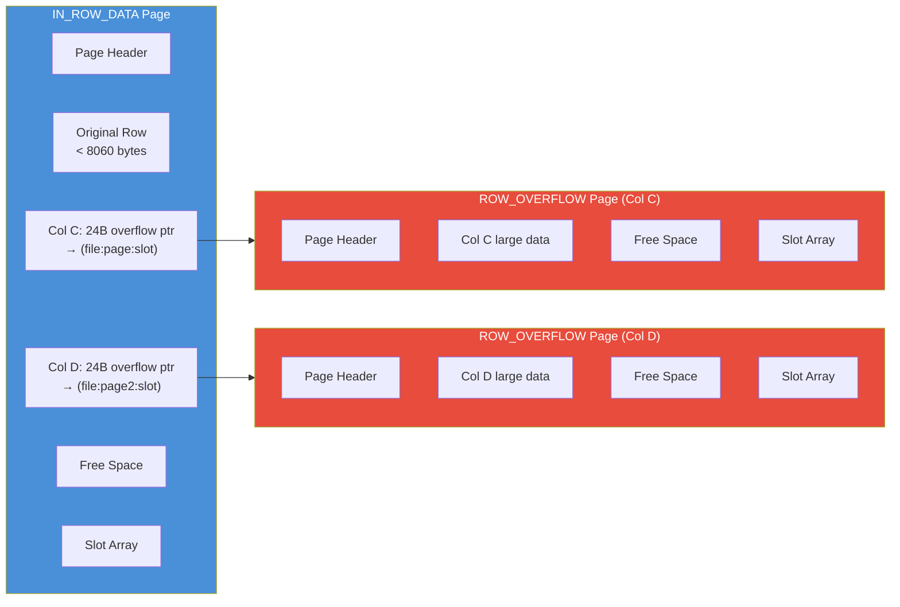

## Navigation

**Domain:** [[8 — Databases]] > **Group:** SQL Server Architecture & Storage Engine
**Previous:** [[8.274 — Data Pages — Row Structure]] | **Next:** [[8.276 — LOB Storage — Large Object Pages]]

### Prerequisites
- [[8.274 — Data Pages — Row Structure]] — overflow is triggered when a row exceeds the 8060-byte limit; know the base row format
- [[8.271 — Page Structure — 8KB Pages]] — the 8KB page limit is the root cause of the overflow mechanism
- [[8.277 — Allocation Units — IN_ROW, ROW_OVERFLOW, LOB]] — overflow rows are stored in the ROW_OVERFLOW allocation unit type and tracked by IAM pages

### Where This Fits

SQL Server's 8060-byte row-size limit means that rows with multiple large variable-length columns (e.g., `VARCHAR(5000)`, `NVARCHAR(4000)`) cannot always fit on a single data page. When a row exceeds 8060 bytes, SQL Server moves one or more variable-length columns to separate ROW_OVERFLOW pages, leaving a 24-byte pointer (root) in the original row. This is transparent to queries — SELECT reads the overflow page automatically. For a .NET backend engineer, row overflow matters because it silently doubles or triples the logical reads per row, affects index builds (overflow columns cannot be index key columns), and can cause unexpected performance degradation when tables designed near the 8060 limit receive their first large UPDATE.

## Core Mental Model

Row overflow is SQL Server's mechanism for storing rows whose total length exceeds 8060 bytes by moving some variable-length columns off the original data page onto separate 8KB overflow pages. The original row keeps a 24-byte overflow pointer (status bit, length, and a (page, slot) reference) for each moved column. The ROW_OVERFLOW allocation unit (`sys.allocation_units.type = 2`) manages these pages independently from IN_ROW_DATA. The overflow is invisible at the query level — SELECT returns all columns normally — but adds at minimum one extra logical read per overflowed column per row. The engine only moves columns to overflow when necessary: it evaluates total row size at INSERT and UPDATE time and moves the largest variable-length columns first.



### Key Properties

|Property|Value|Notes|
|---|---|---|
|Max IN_ROW size|8,060 bytes|Sum of all fixed columns + actual variable data (not max)|
|Overflow pointer size|24 bytes per overflowed column|9 bytes file:page:slot + 10 bytes length/offset + 5 bytes system|
|Max overflowed columns|Unlimited (fits in page chain)|Each overflow column can be up to its max type size|
|Overflow page size|8 KB (same as data pages)|Uses the same 8KB page structure|
|Allocation unit|ROW_OVERFLOW_DATA|type = 2 in sys.allocation_units|
|Index key limitation|Overflow columns cannot be index keys|Exception: SQL 2012+ allows overflow INCLUDE columns|
|Detection|sys.dm_db_index_physical_stats|column_count_tallied + avg_record_size vs fixed-length sum|

## Deep Mechanics

### How the Engine Decides to Overflow

**Step 1 — Row Size Calculation at INSERT:** The storage engine calculates the actual row size at INSERT time: status bits (2) + fixed-length data (sum of fixed column sizes) + null bitmap (2 + ceil(cols/8)) + variable column count (2) + variable offset array (2 per variable column) + actual variable data (sum of `LEN(data)` for each variable column). If this total > 8060, overflow is triggered.

**Step 2 — Column Selection for Overflow:** The engine identifies variable-length columns that will be moved. It sorts them by actual data length descending and selects the largest ones such that removing them brings the row under 8060 bytes. It prefers moving variable-length columns farthest from the start of the variable data area to minimize changes to the offset array.

**Step 3 — Overflow Pointer Creation:** For each overflowed column, the engine replaces the variable-length data with a 24-byte pointer: 1 byte status + 10 bytes (page + slot reference) + 10 bytes (original column length) + 3 bytes system overhead. The status byte indicates this is an overflow pointer. The page:slot reference points to the ROW_OVERFLOW page where the actual data resides.

**Step 4 — Overflow Page Allocation:** The engine allocates a new page in the ROW_OVERFLOW allocation unit. This page is tracked by a separate IAM chain from the IN_ROW_DATA pages. The overflow data is stored as a single row on that page (or spans multiple pages if > 8060 bytes).

**Step 5 — Normal Query Execution:** When a query selects an overflowed column, the storage engine reads the IN_ROW page first, finds the overflow pointer in the variable-length offset array, reads the ROW_OVERFLOW page, and returns the data. This is transparent — the query plan shows no extra operators for the overflow read.

**Step 6 — UPDATE Handling:** If an UPDATE changes an overflowed column's data, the engine may keep the same overflow page (if it fits) or allocate a new one. If a column that was NOT overflowed grows large enough to push the row over 8060, the engine may now overflow it. Conversely, if all columns shrink, the engine may bring them back in-row (but this is lazy — only on page split or rebuild).

### SQL Visibility — Row Overflow Detection

```sql
-- Identify tables with row overflow
SELECT 
    OBJECT_SCHEMA_NAME(a.object_id) + '.' + OBJECT_NAME(a.object_id) AS table_name,
    i.name AS index_name,
    a.total_pages,
    a.used_pages,
    a.data_pages,
    a.type_desc AS allocation_type
FROM sys.allocation_units a
INNER JOIN sys.indexes i 
    ON a.container_id = 
        CASE WHEN a.type IN (1, 2) 
            THEN i.object_id 
            ELSE i.index_id 
        END
    AND a.container_id = 
        CASE WHEN a.type IN (1, 2) 
            THEN i.index_id 
            ELSE i.object_id 
        END
WHERE a.type = 2  -- ROW_OVERFLOW_DATA
    AND a.total_pages > 0;

-- Row overflow details per table
SELECT 
    OBJECT_SCHEMA_NAME(ps.object_id) + '.' + OBJECT_NAME(ps.object_id) AS table_name,
    ps.index_id,
    i.name AS index_name,
    ps.partition_number,
    ps.index_type_desc,
    ps.alloc_unit_type_desc,
    ps.index_depth,
    ps.index_level,
    ps.page_count,
    ps.record_count,
    ps.avg_record_size_in_bytes,
    ps.min_record_size_in_bytes,
    ps.max_record_size_in_bytes
FROM sys.dm_db_index_physical_stats(
    DB_ID(), NULL, NULL, NULL, 'DETAILED'
) ps
INNER JOIN sys.indexes i 
    ON ps.object_id = i.object_id AND ps.index_id = i.index_id
WHERE ps.alloc_unit_type_desc = 'ROW_OVERFLOW_DATA'
ORDER BY ps.page_count DESC;

-- Find tables at risk (columns that could trigger overflow)
SELECT 
    OBJECT_SCHEMA_NAME(c.object_id) + '.' + OBJECT_NAME(c.object_id) AS table_name,
    COUNT(*) AS total_columns,
    SUM(c.max_length) AS max_possible_row_size,
    SUM(CASE 
        WHEN c.system_type_id IN (167, 175, 231, 241)  -- VARCHAR, CHAR, NVARCHAR, NCHAR
        THEN c.max_length ELSE 0 
    END) AS total_variable_max_length,
    SUM(CASE 
        WHEN c.system_type_id NOT IN (167, 175, 231, 241, 34, 35, 99, 189)
        THEN c.max_length ELSE 0 
    END) AS total_fixed_length,
    CEILING(COUNT(*) / 8.0) AS null_bitmap_bytes
FROM sys.columns c
WHERE c.object_id = OBJECT_ID('dbo.Orders')
GROUP BY c.object_id
HAVING SUM(c.max_length) > 8060
ORDER BY max_possible_row_size DESC;

-- DBCC IND to find ROW_OVERFLOW pages
DBCC IND ('AdventureWorks2022', 'dbo.WideTable', -1);
-- Look for PageType = 1 and allocation = ROW_OVERFLOW_DATA

-- View overflow page via DBCC PAGE
DBCC TRACEON (3604);
DBCC PAGE ('AdventureWorks2022', 1, <OverflowPagePID>, 3);
```

### Failure Modes

- **Error 511 — Row Size Exceeds 8060 with No Overflow Candidates:** If the total of all fixed-length columns alone exceeds 8060 bytes, SQL Server cannot overflow any columns (fixed columns cannot be moved to overflow). The INSERT or UPDATE fails with error 511: "Cannot create a row of size X which is greater than the allowable maximum row size of 8060."

- **Overflow Pointer Overhead:** Each overflowed column adds 24 bytes to the base row. If many columns overflow, the base row could itself grow close to 8060 bytes just from pointers. In extreme cases, the overflow pointers themselves cause a secondary overflow cascade — but SQL Server prevents this by ensuring pointers fit.

- **Overflow Page Chaining (LOB-like):** If a single overflow column's data exceeds 8060 bytes, it spans multiple ROW_OVERFLOW pages linked in a chain. Each overflow page read adds a logical read. A column with `VARCHAR(8000)` and 7500 bytes of data needs one overflow page; with all 8000 bytes, it needs two (8000 + 24 pointer < 8060 for first, but the overflow pages themselves are 8KB).

- **In-Row to Overflow Transition on UPDATE:** An UPDATE that grows a row from 7000 to 9000 bytes triggers overflow at UPDATE time. This is a synchronous operation — the UPDATE query waits for the overflow allocation. Under load, this causes unexpected latency spikes.

## Production Patterns and Implementation

### Monitoring Row Overflow

```sql
-- Track row overflow allocation over time
SELECT 
    DB_NAME() AS database_name,
    OBJECT_NAME(ps.object_id) AS table_name,
    ps.index_id,
    ps.partition_number,
    ps.alloc_unit_type_desc,
    ps.page_count,
    ps.record_count,
    ps.avg_record_size_in_bytes,
    ps.forwarded_record_count,
    ps.ghost_record_count
FROM sys.dm_db_index_physical_stats(
    DB_ID(), NULL, NULL, NULL, 'DETAILED'
) ps
WHERE ps.alloc_unit_type_desc = 'ROW_OVERFLOW_DATA'
ORDER BY ps.page_count DESC;

-- Row overflow I/O impact
SELECT 
    OBJECT_NAME(s.object_id) AS table_name,
    s.index_id,
    COALESCE(s.user_seeks + s.user_scans + s.user_lookups, 0) AS reads,
    s.user_updates AS writes,
    ps.alloc_unit_type_desc,
    ps.page_count
FROM sys.dm_db_index_usage_stats s
INNER JOIN sys.dm_db_index_physical_stats(
    DB_ID(), NULL, NULL, NULL, 'LIMITED'
) ps ON s.object_id = ps.object_id AND s.index_id = ps.index_id
WHERE ps.alloc_unit_type_desc = 'ROW_OVERFLOW_DATA'
    AND s.database_id = DB_ID();

-- Detect columns that could or are using row overflow
SELECT 
    c.name AS column_name,
    TYPE_NAME(c.system_type_id) AS data_type,
    c.max_length,
    c.is_nullable,
    c.is_sparse,
    c.column_id
FROM sys.columns c
WHERE c.object_id = OBJECT_ID('dbo.Orders')
    AND c.system_type_id IN (167, 175, 231, 241)  -- Variable-length types
    AND c.max_length > 8000  -- Can potentially overflow
ORDER BY c.column_id;
```

### Prevention Strategies

```sql
-- Option 1: Redesign to avoid overflow by splitting wide tables
-- Before: One wide table
CREATE TABLE dbo.Orders_Wide (
    OrderId INT PRIMARY KEY,
    OrderDate DATETIME2 NOT NULL,
    CustomerId INT NOT NULL,
    Notes VARCHAR(8000) NULL,        -- potential overflow
    Comments VARCHAR(8000) NULL,      -- potential overflow
    InternalMemo VARCHAR(8000) NULL    -- potential overflow
);

-- After: Normalized — separate overflow into related table
CREATE TABLE dbo.Orders (
    OrderId INT PRIMARY KEY,
    OrderDate DATETIME2 NOT NULL,
    CustomerId INT NOT NULL
);

CREATE TABLE dbo.OrderNotes (
    OrderNoteId INT IDENTITY PRIMARY KEY,
    OrderId INT NOT NULL REFERENCES dbo.Orders(OrderId),
    NoteType VARCHAR(20) NOT NULL,  -- 'Notes', 'Comments', 'InternalMemo'
    NoteText VARCHAR(8000) NOT NULL,
    CreatedDate DATETIME2 NOT NULL DEFAULT SYSUTCDATETIME()
);

-- Option 2: Use LOB types for very large data (if row still fits)
-- VARCHAR(MAX) uses LOB pages instead of row overflow
ALTER TABLE dbo.Orders ALTER COLUMN Notes VARCHAR(MAX) NULL;

-- Option 3: Check current usage patterns before redesign
SELECT 
    AVG(LEN(Notes)) AS avg_notes_len,
    AVG(LEN(Comments)) AS avg_comments_len,
    MAX(LEN(Notes)) AS max_notes_len,
    MAX(LEN(Comments)) AS max_comments_len
FROM dbo.Orders;
```

### SQL Server vs PostgreSQL Differences

|Aspect|SQL Server|PostgreSQL|
|---|---|---|
|Overflow mechanism|ROW_OVERFLOW allocation unit (separate pages)|TOAST (The Oversized-Attribute Storage Technique)|
|Threshold|8060 bytes total row size|~2KB per column (TOAST_TUPLE_THRESHOLD, default ~2000 bytes)|
|Trigger condition|Row exceeds 8060 bytes|Any column exceeds TOAST_TUPLE_THRESHOLD (per column)|
|Overflow unit|Per column (largest moved first)|Per column (individually toasted)|
|Pointer size|24 bytes per overflowed column|Variable — TOAST pointer stored in original tuple|
|User control|None — automatic|`ALTER TABLE ... ALTER COLUMN ... SET STORAGE {PLAIN|MAIN|EXTERNAL|EXTENDED}`|
|Compression|None at row overflow level|TOAST compression (pglz) — automatic when enabled|
|Indexing|Overflow columns cannot be index keys|TOASTed columns cannot be index keys (but can be non-TOASTED with SET STORAGE PLAIN)|

PostgreSQL's TOAST is more flexible: it can compress data before storing externally, it operates per-column (not per-row), and it offers explicit storage control. SQL Server's row overflow is simpler — activate only when the 8060-byte row limit is hit, no compression, no user control.

## Gotchas and Production Pitfalls

### Pitfall 1: Silent Performance Degradation After Schema Change

**Pitfall:** Adding a large VARCHAR column to an existing table that was previously under 8060 bytes. The table now exceeds the limit on some rows.

**Symptom:** SELECT queries that were reading 1 page per 10 rows now read 1 page + 1 overflow page per overflowed row. Logical reads double or triple without any plan change.

```sql
-- Before: Table fits in row perfectly
-- After adding Comments VARCHAR(5000):
UPDATE dbo.Orders SET Comments = REPLICATE('x', 5000) WHERE OrderId = 123;
-- This row now overflows. Every SELECT * reads 2 pages instead of 1.
```

**Fix:** Monitor `sys.dm_db_index_physical_stats` for ROW_OVERFLOW allocation units after schema changes. Rebuild clustered index to compress overflow pages.

```sql
ALTER INDEX PK_Orders ON dbo.Orders REBUILD;
```

**Cost of not fixing:** A formerly efficient table becomes 2-3x more expensive to read. Production queries that were within SLA exceed thresholds after a schema change that "should be safe."

### Pitfall 2: Overflow Columns Cannot Be Index Key Columns

**Pitfall:** Creating a non-clustered index on a `VARCHAR(5000)` column that has overflowed rows.

**Symptom:** `CREATE NONCLUSTERED INDEX IX_Orders_Notes ON dbo.Orders(Notes)` fails with: "Warning! The maximum key length is 900 bytes. The index ... has maximum length of 5000 bytes." Even if data is small, the system must reserve max length for the key.

**Fix:** Only index columns that stay in-row. For large columns, use full-text indexing or create a separate indexed table:

```sql
-- Cannot index Notes if it's VARCHAR(5000) and may overflow
-- Instead, create a separate table for indexed large data
CREATE TABLE dbo.OrderNotesForSearch (
    OrderId INT NOT NULL REFERENCES dbo.Orders(OrderId),
    NoteText VARCHAR(5000) NOT NULL
);
CREATE INDEX IX_OrderNotesForSearch_NoteText 
    ON dbo.OrderNotesForSearch(NoteText) 
    WHERE NoteText IS NOT NULL;
```

**Cost of not fixing:** Application cannot efficiently search or sort by large text columns. Forcing index creation on overflow-capable columns causes index build failure (if key > 900 bytes) or run-time error (when data overflows).

### Pitfall 3: Row Overflow Causes Page Split Cascade

**Pitfall:** An UPDATE on one row causes overflow, which allocates a new ROW_OVERFLOW page. The IN_ROW page's free space decreased (because the update may have also changed in-row data), potentially causing other rows to overflow on subsequent updates.

**Symptom:** One UPDATE causes multiple IAM chain modifications. Overflow page allocations cause GAM/SGAM contention.

**Fix:** Rebuild the table to give each row a fresh, compact layout:

```sql
ALTER TABLE dbo.Orders REBUILD WITH (ONLINE = ON);
```

**Cost of not fixing:** Fragmented overflow chains cause increasingly worse read performance as more rows overflow. Each overflow read is an additional page access.

### Pitfall 4: Assuming Row Overflow Is the Same as LOB Storage

**Pitfall:** Using `VARCHAR(MAX)` to avoid overflow without understanding that LOBs are stored differently with different performance characteristics.

**Symptom:** Confusion about why `VARCHAR(5000)` with 2000 bytes of data uses overflow pages while `VARCHAR(MAX)` with 2000 bytes stays in-row (actually `VARCHAR(MAX)` can be in-row if < 8000 bytes).

**Fix:** Understand the storage rules: `VARCHAR(n)` where `n <= 8000` stores data in-row if total row < 8060, or overflows if row > 8060. `VARCHAR(MAX)` stores data in-row for values < 8000 bytes (in SQL 2005+ with `large value types out of row = 0`) or uses LOB pages only for values > 8000 bytes. The key difference: overflow uses ROW_OVERFLOW pages (same structure as data pages), while MAX types use LOB pages (separate allocation unit with different I/O pattern).

**Cost of not fixing:** Misunderstanding leads to wrong column type choice. Using `VARCHAR(MAX)` when `VARCHAR(5000)` is sufficient adds unnecessary LOB overhead (LOB pages are always read separately; row overflow pages are read only if the column is queried).

### Pitfall 5: Row Overflow Columns in DISTINCT and ORDER BY Queries

**Pitfall:** Using `SELECT DISTINCT OverflowColumn` or `ORDER BY OverflowColumn` where OverflowColumn is a column that uses row overflow.

**Symptom:** DISTINCT and ORDER BY operations on overflow columns require sorting, but the sort operator must read the overflow pages for each row to compare values. This massively increases memory grant requirements and can cause TempDB spills. The sort operation cannot use the overflow column for direct comparison without materializing the full value.

**Fix:** Avoid DISTINCT and ORDER BY on large variable-length columns that risk overflow. Instead, use a hash-based approach or pre-compute a hash value for comparison:

```sql
-- Anti-pattern: sorting on overflow column
SELECT DISTINCT Notes FROM dbo.Orders ORDER BY Notes;

-- Better: limit scope or use hash for uniqueness
SELECT DISTINCT Notes FROM dbo.Orders WHERE Notes IS NOT NULL;
-- Or: pre-compute a checksum for comparison
SELECT Notes FROM dbo.Orders
WHERE CHECKSUM(Notes) IN (SELECT CHECKSUM(Notes) FROM dbo.Orders GROUP BY CHECKSUM(Notes));
```

**Cost of not fixing:** Sort operations on overflow columns consume excessive memory and spill to TempDB. Queries that ran fine in development with small data fail in production when data exceeds the overflow threshold.

### Pitfall 6: UPDATE Statistics Out of Date After Overflow

**Pitfall:** After a bulk UPDATE that causes many rows to overflow, statistics are stale. The optimizer estimates row sizes incorrectly.

**Symptom:** Bad cardinality estimates leading to hash joins instead of nested loops, or memory grants that are too small (causing TempDB spills).

**Fix:** Update statistics after bulk operations that change row size characteristics:

```sql
UPDATE STATISTICS dbo.Orders WITH FULLSCAN;
```

**Cost of not fixing:** Query performance degrades from inefficient join strategies. The optimizer underestimates data volume and chooses suboptimal plans for 2-3 days until auto-update statistics kicks in.

## Performance Implications

### Benchmark: Row Overflow Query Cost

```sql
-- Create test tables
CREATE TABLE dbo.OverflowTest_InRow (
    Id INT IDENTITY(1,1) PRIMARY KEY,
    Data VARCHAR(8000) NOT NULL DEFAULT 'x'
);

CREATE TABLE dbo.OverflowTest_Overflow (
    Id INT IDENTITY(1,1) PRIMARY KEY,
    Data1 VARCHAR(4000) NOT NULL DEFAULT 'x',
    Data2 VARCHAR(4000) NOT NULL DEFAULT 'x'
);

-- Insert 5000 rows into both
-- InRow table: 1 byte data fits in row
-- Overflow table: 2 bytes data, row < 8060
INSERT INTO dbo.OverflowTest_InRow (Data) 
SELECT TOP 5000 'x' FROM sys.objects a CROSS JOIN sys.objects b;

-- Insert and move to overflow by filling Data2
INSERT INTO dbo.OverflowTest_Overflow (Data1, Data2)
SELECT TOP 5000 REPLICATE('x', 4000), REPLICATE('x', 4000)
FROM sys.objects a CROSS JOIN sys.objects b;

-- Measure in-row read
SET STATISTICS IO ON;
PRINT '--- In-Row Table (1 byte data) ---';
SELECT COUNT(*) FROM dbo.OverflowTest_InRow;
-- Expected: ~10-20 logical reads (all rows fit ~100 per page)

PRINT '--- Overflow Table (2 x 4000 bytes) ---';
SELECT COUNT(*) FROM dbo.OverflowTest_Overflow;
-- Expected: ~5000 logical reads (each row needs 1 IN_ROW + ~1 overflow page = 2 pages)

-- Now SELECT the overflowed column specifically
PRINT '--- SELECT Data1 (overflowed column) ---';
SELECT Data1 FROM dbo.OverflowTest_Overflow WHERE Id = 1;
-- Logical reads: 2 (1 IN_ROW + 1 ROW_OVERFLOW)
```

**Improvement:** Rebuilding with `MAX` types may reduce overflow reads for single-column queries. The `SET LARGE_VALUE_TYPES_OUT_OF_ROW = ON` option forces all MAX values to LOB pages, but for `VARCHAR(8000)` types, row overflow is the only option.

### Write Amplification

|Operation|Pages Written (In-Row)|Pages Written (Overflow)|Overhead|
|---|---|---|---|
|INSERT (row < 8060)|1|0|None|
|INSERT (row > 8060)|1|1+ (per overflow column)|100%+ page writes|
|UPDATE (grow row to overflow)|1 (split)|1+|200%+ page writes|
|SELECT * (no overflow)|1|0|None|
|SELECT * (with overflow)|1|1+ per overflowed column|100%+ page reads|
|SELECT overflow column only|1|1|100% page reads|
|DELETE (with overflow)|1|1+|200% page writes|

### BenchmarkDotNet

```csharp
[MemoryDiagnoser]
[SimpleJob(RuntimeMoniker.Net90)]
public class RowOverflowBenchmark
{
    private IDbConnection _connection = default!;
    private const string ConnectionString = "Server=.;Database=PerfTest;Integrated Security=true;TrustServerCertificate=true;";

    [GlobalSetup]
    public void Setup()
    {
        _connection = new SqlConnection(ConnectionString);
        _connection.Open();
    }

    [Benchmark(Baseline = true)]
    public async Task ReadWithoutOverflow()
    {
        var cmd = _connection.CreateCommand();
        cmd.CommandText = "SELECT TOP 1000 Id, Data FROM dbo.OverflowTest_InRow ORDER BY Id;";
        using var reader = await cmd.ExecuteReaderAsync();
        while (await reader.ReadAsync()) { }
    }

    [Benchmark]
    public async Task ReadWithOverflow()
    {
        var cmd = _connection.CreateCommand();
        cmd.CommandText = "SELECT TOP 1000 Id, Data1, Data2 FROM dbo.OverflowTest_Overflow ORDER BY Id;";
        using var reader = await cmd.ExecuteReaderAsync();
        while (await reader.ReadAsync()) { }
    }

    [Benchmark]
    public async Task ReadAllColumnsWithOverflow()
    {
        var cmd = _connection.CreateCommand();
        cmd.CommandText = "SELECT TOP 1000 * FROM dbo.OverflowTest_Overflow ORDER BY Id;";
        using var reader = await cmd.ExecuteReaderAsync();
        while (await reader.ReadAsync()) { }
    }

    [GlobalCleanup]
    public void Cleanup() => _connection.Dispose();
}
```

## Interview Arsenal

### Question Bank

1. **What is row overflow and under what condition does SQL Server use it?**
2. **How does the storage engine decide which columns to move to overflow pages?**
3. **What is the size and structure of an overflow pointer?**
4. **Can overflow columns be used as index key columns? Why or why not?**
5. **Compare row overflow (VARCHAR(8000)) with LOB storage (VARCHAR(MAX)).**
6. **How do you detect row overflow in a production database?**
7. **What happens when an UPDATE causes a row to cross the 8060-byte threshold?**
8. **Compare SQL Server's row overflow with PostgreSQL's TOAST.**

### Spoken Answers

**Q1: What is row overflow and under what condition does SQL Server use it?**

> **Average answer:** When a row is too big for one page, some columns are moved to another page. It happens when the row exceeds 8060 bytes.

> **Great answer:** Row overflow is activated when the total actual row size at INSERT or UPDATE time exceeds 8060 bytes. The engine calculates the precise row byte count including status bits (2), fixed-length data, null bitmap (2 + ceil(cols/8) bytes), variable-length column count (2), variable-length offset array (2 bytes per variable column present), and actual variable-length data. If this sum exceeds 8060, the engine identifies the largest variable-length columns — sorted by actual data length descending — and moves sufficient columns out to bring the row under 8060 bytes. Each moved column is replaced with a 24-byte overflow pointer containing (file_id, page_id, slot) information plus the original column length. The overflowed data lives in the ROW_OVERFLOW_DATA allocation unit (type = 2 in `sys.allocation_units`). The critical point is that this happens automatically and transparently — there's no schema change or warning. The first large INSERT or UPDATE silently triggers the overflow and adds additional page reads to every subsequent SELECT that touches the overflow columns.

**Q3: What is the size and structure of an overflow pointer?**

> **Average answer:** 24 bytes. It points to the overflow page.

> **Great answer:** The overflow pointer is exactly 24 bytes embedded in the variable-length area of the original row. Its structure is: 1 byte for pointer status (identifying this as an overflow pointer rather than actual data), 10 bytes for the location (8 bytes for the page ID + file ID, 2 bytes for the slot number within the overflow page), 10 bytes for the original column length and offset information, and 3 bytes reserved for system use. When the engine reads the row's variable-length offset array and encounters this 24-byte structure instead of variable-length data, it knows to follow the pointer to the ROW_OVERFLOW page. This is similar in concept but different in detail from a forwarding record pointer (16 bytes for in-heap forwarding vs 24 bytes for row overflow). The 24-byte overhead means that a row with two overflowed columns adds 48 bytes of pointer data to the base row — which can itself push the base row toward the 8060 limit if many columns overflow.

**Q5: Compare row overflow (VARCHAR(8000)) with LOB storage (VARCHAR(MAX)).**

> **Average answer:** VARCHAR(MAX) uses LOB pages. VARCHAR(8000) might use overflow. Both store large data separately.

> **Great answer:** The key difference is **when** separate storage is used and **how** it behaves. For `VARCHAR(8000)` (and similar), the data stays IN_ROW as long as the total row fits in 8060 bytes. Overflow activates only when the row exceeds 8060 bytes — the engine moves columns reactively. For `VARCHAR(MAX)`, the behavior depends on a table option: by default (`large value types out of row = 0`), VARCHAR(MAX) values up to 8000 bytes stay IN_ROW (like a regular VARCHAR). For values > 8000 bytes, they move to LOB pages (allocation unit type 3). With `large value types out of row = 1`, ALL VARCHAR(MAX) values go to LOB pages even if 1 byte long. LOB pages have a different read pattern: LOB data is read on demand when the column is included in the SELECT list; row overflow data is read every time the IN_ROW page is read (if the column is in SELECT). For index purposes, neither overflowed columns (from VARCHAR(8000)) nor LOB columns can be key columns, but INCLUDE columns can include MAX types in SQL 2012+. The performance tradeoff: overflow adds 1 page read per row per overflowed column; LOB adds similar reads but LOB pages can be shared across rows (for identical values). In practice, avoid row overflow by normalizing wide tables, or accept it and monitor logical reads carefully.

### Additional Question: Row Overflow and Snapshot Isolation Interaction

**Q9: How does row overflow interact with snapshot isolation and the version store?**

> **Great answer:** When a row is updated under snapshot isolation, the engine creates a version of the row in TempDB's version store. If the row has overflowed columns, the version store contains the complete row image — including both the IN_ROW portion and the overflow data. This means overflow amplifies the version store size: each new version stores the IN_ROW base plus the overflow data separately. The version store cleanup process must also track overflow page ghost cleanup. If long-running snapshot transactions hold versions active, overflow pages cannot be deallocated because the version chain references them. This is a critical interaction: a table with frequent updates to overflow-capable columns under RCSI or SI will consume significantly more TempDB version store space and retain overflow ghost pages longer than an in-row-only table. Monitoring `sys.dm_tran_version_store` and `sys.dm_db_index_physical_stats` for ghost records becomes essential for such tables.

### Interview Trigger

This topic surfaces in schema design interviews: "You have a table with OrderId, CustomerId, Notes VARCHAR(8000), Comments VARCHAR(8000), InternalMemo VARCHAR(8000). What happens at INSERT?" The follow-up is usually about detection: "How would you find out if any rows have overflowed?"

### Comparison Table

| | Row Overflow (VARCHAR(8000)) | LOB (VARCHAR(MAX)) |
|---|---|---|
|Trigger|Total row > 8060 bytes|Value > 8000 bytes (or option forced)|
|Allocation unit|ROW_OVERFLOW_DATA (type 2)|LOB_DATA (type 3)|
|Pointer in base row|24 bytes per overflowed column|16 bytes per LOB value|
|Toggle control|None — automatic|`sp_tableoption 'large value types out of row'`|
|Index key|Not allowed|Not allowed|
|Index INCLUDE|Allowed (SQL 2012+)|Allowed (SQL 2012+)|
|Multiple overflow values|Separate page per column|Can share LOB page|
|Inline threshold (same page)|8060 total row|8000 bytes per value (default)|

## Decision Framework

### When to Apply

```mermaid
flowchart TD
    A[Row size approaching 8060?] --> B{What access pattern?}
    B -->|Mostly SELECT narrow columns\n(never or rarely read wide columns)| C[Normalize wide columns\ninto separate table]
    B -->|Frequently SELECT all columns| D{Are wide columns\nactually large?}
    D -->|Yes — avg > 4000 bytes| E[Accept overflow\nMonitor logical reads]
    D -->|No — avg < 200 bytes| F[Row will fit in-row\nbut max is large — safe]
    B -->|Frequent UPDATEs that\nmay grow wide columns| G[Risk of overflow cascade\nConsider redesign]
    C --> H[Result: no overflow,\nbetter I/O per query]
    E --> I[Monitor sys.dm_db_index_physical_stats\nfor ROW_OVERFLOW growth]
    F --> J[Schema is fine —\nmax_length alone doesn't\ncause overflow]
    G --> K[Overflow at UPDATE =\nsync page alloc =\nlatency spike]
```

### Application Checklist

- [ ] No table has actual row size > 7500 bytes (leaving 500+ buffer before overflow)
- [ ] `sys.allocation_units WHERE type = 2` returns zero rows for critical OLTP tables
- [ ] Tables with `VARCHAR(8000)` or `NVARCHAR(4000)` columns are monitored for overflow
- [ ] Index rebuild jobs run weekly to compact overflow pages
- [ ] No overflow column is attempted as an index key column
- [ ] Entity Framework `[MaxLength(8000)]` is understood to NOT guarantee in-row storage
- [ ] For `VARCHAR(MAX)` columns, decision between in-row vs LOB is explicit

### Tradeoff Summary

|What You Gain|What You Pay|
|---|---|
|Rows > 8060 bytes still allowed in a single table|24 bytes pointer per overflowed column in base row|
|Columns stay in-row until threshold — no premature overflow|Overflow detection is reactive (at INSERT/UPDATE) — can cause unexpected latency|
|Automatic and transparent — no schema changes needed|Additional logical reads for every overflowed column access|
|Overflow pages use same 8KB page structure|No compression on overflow data (unlike PostgreSQL TOAST)|

### Scale Thresholds

- **Relevant when:** Table has any column with `VARCHAR(8000)` or `NVARCHAR(4000)` that actually stores > 4000 bytes
- **Critical when:** Overflow page count > 10% of IN_ROW page count — each read costs double
- **Required redesign when:** `SELECT *` queries touch overflow columns frequently — logical reads double permanently
- **Avoid when:** Table is updated frequently with growing data — each overflow allocation is a synchronous page write

## Self-Check

### Conceptual Questions

1. What is the exact byte threshold that triggers row overflow?
2. How does the storage engine choose which columns to overflow?
3. What is the byte breakdown of a 24-byte overflow pointer?
4. Can an overflow column be part of a non-clustered index key?
5. What is the difference between row overflow and forwarded records?
6. How does sys.allocation_units differentiate IN_ROW_DATA from ROW_OVERFLOW_DATA?
7. What happens if all the variable-length columns overflow but the fixed-length columns alone are near 8060 bytes?
8. How does an INSERT that creates 1000 rows with 7000 bytes each perform vs an INSERT of 1000 rows with 9000 bytes each?
9. How does PCTFREE / FILLFACTOR relate to row overflow prevention?
10. Compare the pointer structures: forwarding record vs row overflow pointer vs LOB pointer.

<details>
<summary>Answers</summary>

1. 8061 bytes of actual row data. The calculation includes all row overhead: 2 (status) + fixed_data + null_bitmap (2 + ceil(cols/8)) + 2 (var count) + (2 per var column with data) + actual_var_data. Once this sum exceeds 8060, the largest variable-length columns are moved out.
2. The engine sorts all variable-length columns that have data by their actual data length (descending). It then moves the largest ones, one at a time, until the remaining in-row size is <= 8060 bytes. It does not move fixed-length columns (they cannot be overflowed). If all variable-length columns are moved and the row still exceeds 8060 (because fixed-length columns alone exceed the threshold), error 511 is raised.
3. 24 bytes total: 1 byte status byte (identifies this as an overflow pointer), 10 bytes location (file_id + page_id as 8 bytes, slot number as 2 bytes), 10 bytes original column length and offset within original row, 3 bytes system reserved.
4. No — overflow columns cannot be index key columns because the key must fit within the index page's max key length (900 bytes for SQL 2005-2016, 1700 bytes for SQL 2017+). However, overflow columns CAN be included as INCLUDE columns in a non-clustered index (SQL 2012+). For LOB types (MAX), the same restriction applies.
5. Forwarded records are for HEAP tables when a row grows and must move to a new page within the same page structure. The original slot gets a 16-byte pointer. Row overflow is for any table (heap or clustered) when the row exceeds 8060 bytes — 24-byte pointers replace column data. Forwarded records move the entire row; row overflow moves individual columns.
6. `sys.allocation_units.type`: 1 = IN_ROW_DATA (standard data/index pages), 2 = ROW_OVERFLOW_DATA (overflow column pages), 3 = LOB_DATA (large object pages for MAX types). Each allocation unit has its own IAM chain tracking its pages.
7. If fixed-length columns alone sum to > 8060 bytes, SQL Server cannot overflow any of them (they're not variable-length). The operation fails with error 511: "Cannot create a row of size X which is greater than the allowable maximum row size of 8060." This is a schema design error — the table's fixed-length columns must sum to <= 8060.
8. The 7000-byte rows all fit in-row: ~1 page per row (a bit more than 1 because one page holds 8060 bytes, so each row fits). This means 1000 pages for 1000 rows = 1000 page writes and 1000 logical reads for a full scan. The 9000-byte rows overflow: each row has 1 IN_ROW page + 1 overflow page = 2 page writes. 2000 page writes, and 2000 logical reads for a full scan. Plus the GAM/SGAM allocation overhead for the extra overflow extents. The 9000-byte INSERT is ~2x slower and the scan is ~2x more expensive.
9. FILLFACTOR controls free space on index pages (including leaf-level data pages for clustered indexes). A lower FILLFACTOR (e.g., 70%) reserves 30% free space per page. This does NOT directly prevent row overflow (which is about per-row size, not page space), but more free space reduces page splits when rows grow via UPDATE.
10. **Forwarding record (16 bytes):** 8 bytes (file:page:slot of new location) + 8 bytes (original row location). Used for heap row movement. **Row overflow pointer (24 bytes):** 1 status + 10 location (file:page:slot) + 10 original length/offset + 3 reserved. Used when individual column data exceeds row limit. **LOB pointer (16 bytes):** 9 bytes file:page:slot + 2 bytes slot + 2 bytes length + 3 bytes flags. Used for MAX type values stored in LOB allocation unit.

</details>

### Query Challenges

**Challenge 1 — Find all tables with row overflow**

Write a query using `sys.allocation_units` and `sys.objects` to list all tables that have ROW_OVERFLOW_DATA pages.

<details>
<summary>Solution</summary>

```sql
SELECT 
    OBJECT_SCHEMA_NAME(a.object_id) + '.' + OBJECT_NAME(a.object_id) AS table_name,
    a.type_desc AS allocation_type,
    a.total_pages,
    a.used_pages,
    a.data_pages,
    a.total_pages * 8 AS total_space_kb,
    p.rows AS row_count
FROM sys.allocation_units a
INNER JOIN sys.partitions p 
    ON a.container_id = p.partition_id
    AND a.type IN (1, 2, 3)
WHERE a.type = 2  -- ROW_OVERFLOW_DATA
ORDER BY a.total_pages DESC;
```

**Logical reads:** ~50-200 for system table scan.

</details>

---

**Challenge 2 — Estimate logical read increase from overflow**

Given a table with 100,000 rows, each requiring 1 IN_ROW page and 2 overflow pages, calculate the total logical reads for a full table scan of `SELECT *`. Compare with an in-row-only table of the same row count.

<details> <summary>Solution</summary>

**Overflow table:**
- 100,000 rows × 1 IN_ROW page per row = 100,000 IN_ROW pages
- 100,000 rows × 2 overflow pages per row = 200,000 overflow pages
- Total: 300,000 logical reads = 2.4GB logical I/O

**In-row table (100 rows per page):**
- 100,000 / 100 = 1,000 pages
- Total: 1,000 logical reads = 8MB logical I/O

**Ratio:** Overflow version costs 300x more logical reads.

**Detection query:**
```sql
SELECT 
    ps.record_count,
    ps.page_count AS in_row_pages,
    (ps.record_count * 1.0 / NULLIF(ps.page_count, 0)) AS rows_per_page,
    (SELECT page_count FROM sys.dm_db_index_physical_stats(
        DB_ID(), OBJECT_ID('dbo.Orders'), NULL, NULL, 'DETAILED'
    ) WHERE alloc_unit_type_desc = 'ROW_OVERFLOW_DATA') AS overflow_pages,
    ps.page_count + ISNULL(
        (SELECT TOP 1 page_count FROM sys.dm_db_index_physical_stats(
            DB_ID(), OBJECT_ID('dbo.Orders'), NULL, NULL, 'DETAILED'
        ) WHERE alloc_unit_type_desc = 'ROW_OVERFLOW_DATA'), 0
    ) AS total_scan_pages
FROM sys.dm_db_index_physical_stats(
    DB_ID(), OBJECT_ID('dbo.Orders'), 1, NULL, 'LIMITED'
) ps;
```

</details>

---

**Challenge 3 — Simulate and measure row overflow**

Design a T-SQL script that creates a table, inserts rows under 8060 bytes, then updates them to exceed 8060, and measures the logical read increase.

<details> <summary>Solution</summary>

```sql
-- Create table
CREATE TABLE dbo.OverflowDemo (
    Id INT IDENTITY(1,1) PRIMARY KEY,
    Data1 VARCHAR(4000) NOT NULL DEFAULT '',
    Data2 VARCHAR(4000) NOT NULL DEFAULT '',
    Data3 VARCHAR(4000) NOT NULL DEFAULT ''
);

-- Insert rows under 8060 bytes
INSERT INTO dbo.OverflowDemo (Data1, Data2)
SELECT TOP 1000 REPLICATE('x', 2000), REPLICATE('x', 2000)
FROM sys.objects a CROSS JOIN sys.objects b;

-- Measure reads before overflow
SET STATISTICS IO ON;
SELECT COUNT_BIG(*) FROM dbo.OverflowDemo;
-- Record logical reads — should be ~2000 pages (1000 rows / ~1 row per page)

-- Now cause overflow by filling all three columns
UPDATE dbo.OverflowDemo
SET Data1 = REPLICATE('x', 4000),
    Data2 = REPLICATE('x', 4000),
    Data3 = REPLICATE('x', 4000);

-- Measure reads after overflow
SELECT COUNT_BIG(*) FROM dbo.OverflowDemo;
-- Logical reads should more than double

-- Check overflow stats
SELECT 
    alloc_unit_type_desc,
    page_count,
    avg_record_size_in_bytes,
    record_count
FROM sys.dm_db_index_physical_stats(
    DB_ID(), OBJECT_ID('dbo.OverflowDemo'), 1, NULL, 'DETAILED'
);
```

</details>

---

**Challenge 4 — Compare VARCHAR(8000) overflow with VARCHAR(MAX)**

Write a script that creates two identical tables except for column type (VARCHAR(8000) vs VARCHAR(MAX)), inserts the same data, and compares logical reads for a full scan.

<details> <summary>Solution</summary>

```sql
-- Create tables
CREATE TABLE dbo.CompareOverflow (
    Id INT IDENTITY(1,1) PRIMARY KEY,
    Data VARCHAR(8000) NOT NULL DEFAULT ''
);

CREATE TABLE dbo.CompareMax (
    Id INT IDENTITY(1,1) PRIMARY KEY,
    Data VARCHAR(MAX) NOT NULL DEFAULT ''
);

-- Insert large data (exceeds 8060 row size together)
INSERT INTO dbo.CompareOverflow (Data)
SELECT TOP 1000 REPLICATE('x', 6000)
FROM sys.objects a CROSS JOIN sys.objects b;

INSERT INTO dbo.CompareMax (Data)
SELECT TOP 1000 REPLICATE('x', 6000)
FROM sys.objects a CROSS JOIN sys.objects b;

-- Compare reads
SET STATISTICS IO ON;
SELECT COUNT(*) FROM dbo.CompareOverflow;
SELECT COUNT(*) FROM dbo.CompareMax;

-- Check allocation units
SELECT 
    OBJECT_NAME(object_id) AS table_name,
    type_desc,
    total_pages,
    used_pages
FROM sys.allocation_units a
INNER JOIN sys.partitions p ON a.container_id = p.partition_id
WHERE p.object_id IN (OBJECT_ID('dbo.CompareOverflow'), OBJECT_ID('dbo.CompareMax'));
```

</details>

---

**Challenge 5 — Redesign a table to avoid overflow**

Given a table with OrderId (INT), OrderDate (DATETIME2), CustomerId (INT), Notes (VARCHAR(8000)), Comments (VARCHAR(8000)), InternalMemo (VARCHAR(8000)), ShippingInstructions (VARCHAR(8000)) — all with average fill of 20% — design a normalized schema that avoids row overflow while maintaining query performance for: (a) SELECT by OrderId returning all columns, and (b) SELECT Notes only for a date range.

<details> <summary>Solution</summary>

```sql
-- Main order table (always in row — stays under 100 bytes)
CREATE TABLE dbo.Orders (
    OrderId INT NOT NULL,
    OrderDate DATETIME2 NOT NULL,
    CustomerId INT NOT NULL,
    CONSTRAINT PK_Orders PRIMARY KEY CLUSTERED (OrderId)
);

-- Wide text data normalized to vertical table
-- Each order can have multiple notes of different types
CREATE TABLE dbo.OrderExtendedData (
    OrderExtendedDataId BIGINT IDENTITY(1,1) PRIMARY KEY NONCLUSTERED,
    OrderId INT NOT NULL REFERENCES dbo.Orders(OrderId),
    DataType VARCHAR(30) NOT NULL,  -- 'Notes', 'Comments', 'InternalMemo', 'ShippingInstructions'
    DataContent VARCHAR(MAX) NOT NULL,
    CreatedDate DATETIME2 NOT NULL DEFAULT SYSUTCDATETIME()
);

CREATE CLUSTERED INDEX CX_OrderExtendedData_OrderId 
    ON dbo.OrderExtendedData(OrderId, DataType);

-- Query (a): SELECT * by OrderId — needs join but both use clustered index seeks
SELECT o.*, ed.DataType, ed.DataContent
FROM dbo.Orders o
LEFT JOIN dbo.OrderExtendedData ed ON o.OrderId = ed.OrderId
WHERE o.OrderId = 12345;

-- Query (b): SELECT Notes for date range
SELECT o.OrderId, o.OrderDate, ed.DataContent
FROM dbo.Orders o
INNER JOIN dbo.OrderExtendedData ed 
    ON o.OrderId = ed.OrderId AND ed.DataType = 'Notes'
WHERE o.OrderDate >= '2024-01-01' AND o.OrderDate < '2024-02-01'
ORDER BY o.OrderDate;
```

**Performance note:** The join adds a small cost for combined queries, but eliminates all overflow reads. For the "SELECT * by OrderId" pattern, the clustered index seeks cost ~3 reads each (Orders) + 2 reads (OrderExtendedData). Without normalization, the same query on a wide table with 4 overflow columns costs 3 (IN_ROW) + 4 (overflow) = 7+ reads. The normalized design wins for most workloads.

</details>
