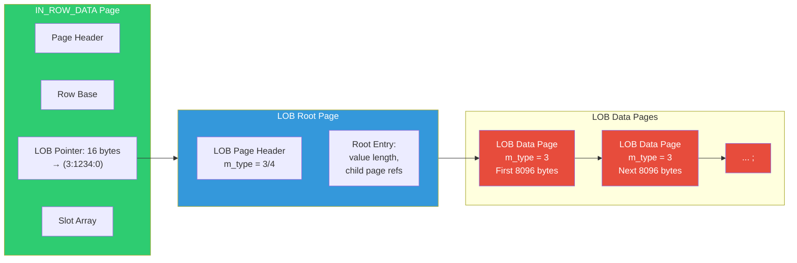

## Navigation

**Domain:** [[8 — Databases]] > **Group:** SQL Server Architecture & Storage Engine
**Previous:** [[8.275 — Row Overflow — Large Row Handling]] | **Next:** [[8.277 — Allocation Units — IN_ROW, ROW_OVERFLOW, LOB]]

### Prerequisites
- [[8.275 — Row Overflow — Large Row Handling]] — LOB and row overflow serve different value-size ranges; understand the overlap and distinction
- [[8.274 — Data Pages — Row Structure]] — LOB columns leave a 16-byte pointer in the row structure
- [[8.277 — Allocation Units — IN_ROW, ROW_OVERFLOW, LOB]] — LOB is allocation unit type 3 with its own IAM chain

### Where This Fits

LOB (Large Object) storage handles columns declared with MAX types (`VARCHAR(MAX)`, `NVARCHAR(MAX)`, `VARBINARY(MAX)`), as well as legacy types `TEXT`, `NTEXT`, `IMAGE`. When a MAX column's value exceeds 8000 bytes (or when the table option `large value types out of row = 1` forces it), the data is stored in a separate LOB page structure with a 16-byte pointer in the base row. Unlike row overflow, LOB pages have a tree-like structure (LOB Tree) that can efficiently handle values up to 2GB. For .NET engineers, LOB storage matters when using `[MaxLength]` or `[Column(TypeName = "nvarchar(max)")]` in EF Core — the choice between `VARCHAR(8000)` and `VARCHAR(MAX)` determines the storage engine path and performance characteristics for all reads and writes.

## Core Mental Model

LOB data lives in a separate B-tree-like structure called the LOB Tree (not a true B-tree but a tree of LOB pages). The base row contains a 16-byte LOB pointer (`LOB_ptr`): 4 bytes for the database ID, 4 bytes for the page ID, 2 bytes for slot number, 2 bytes for timestamp, and 4 bytes for length. The LOB Tree root page (type = 3 or 4, depending on version) points to intermediate pages (if the LOB value is very large) or directly to data pages. Single-page LOB values (up to ~8080 bytes) are stored on one page; multi-page values form a linked list called a LOB chain. LOB reads are lazy — the engine only reads LOB pages when the LOB column is included in the SELECT list. This means queries that don't touch LOB columns avoid the I/O entirely, unlike row overflow which always reads overflow pages when reading the base row.



### Key Properties

|Property|Value|Notes|
|---|---|---|
|LOB pointer size|16 bytes per LOB column|Fits in base row variable-length area|
|Min LOB page threshold|8001 bytes (value > 8000)|Or forced by table option|
|Max LOB value size|2^31 - 1 bytes (~2GB)|Per MAX column (VARCHAR/NVARCHAR/VARBINARY)|
|Legacy type max|2^31 - 1 bytes|TEXT, NTEXT, IMAGE (deprecated, use MAX types)|
|LOB Tree depth|1 (single page) for < ~8000 bytes|2+ levels for very large values (> ~32KB)|
|Page type|3 (Text Tree index page) / 4 (Text Tree data page)|DBCC PAGE output shows m_type = 3 or 4|
|Read cost|0 if column not in SELECT|Lazy evaluation — only reads LOB pages when column is referenced|
|Default in-row threshold|8000 bytes per value|sp_tableoption 'large value types out of row' = 0|

## Deep Mechanics

### How the Engine Stores a LOB Value

**Step 1 — Value Size Check:** At INSERT or UPDATE, the engine evaluates the actual length of the MAX column value. If length <= 8000 bytes AND the table option `large value types out of row = 0` (default), the value stays in-row as a regular variable-length column. No LOB storage is used.

**Step 2 — LOB Trigger:** If length > 8000 bytes, or if `large value types out of row = 1`, the engine prepares LOB storage. It also creates a 16-byte LOB pointer in the base row's variable-length area.

**Step 3 — LOB Tree Root Page Allocation:** The engine allocates a LOB Tree root page (type 3 = text tree index page) from the LOB_DATA allocation unit. This root page contains a slot array where each slot points to a LOB data page.

**Step 4 — LOB Data Pages:** For single-page values (<= ~8080 bytes), the root page points directly to one data page (type 4 = text tree data page). For multi-page values, the root page points to multiple data pages that form a linked list (chain). For very large values (> ~32KB), there can be intermediate levels forming a shallow B-tree.

**Step 5 — LOB Pointer in Base Row:** The 16-byte pointer structure: 4 bytes (database ID), 4 bytes (page ID of root page), 2 bytes (slot number in root page), 2 bytes (timestamp — for versioning), 4 bytes (actual data length). This pointer is embedded in the variable-length area of the base row.

**Step 6 — LOB Read (Lazy):** When a query SELECTs a LOB column, the engine reads the base row (from buffer pool or disk), extracts the 16-byte LOB pointer from the variable-length area, navigates the LOB Tree to find the data pages, reads those pages, and returns the data. If the LOB column is NOT in the SELECT list, the engine never reads the LOB pages — this is the key performance advantage over row overflow.

### SQL Visibility — LOB Storage Inspection

```sql
-- Check table option for LOB behavior
SELECT 
    name,
    CAST(value AS VARCHAR(10)) AS lob_out_of_row_value
FROM sys.tables t
INNER JOIN sys.sysobjvalues ov ON t.object_id = ov.objid
WHERE ov.valclass = 4  -- Table option flag
    AND t.name = 'Orders';

-- Check which tables have LOB columns
SELECT 
    OBJECT_SCHEMA_NAME(c.object_id) + '.' + OBJECT_NAME(c.object_id) AS table_name,
    c.name AS column_name,
    TYPE_NAME(c.system_type_id) AS data_type,
    c.max_length,
    CASE 
        WHEN c.max_length = -1 THEN 'MAX'
        ELSE CAST(c.max_length AS VARCHAR(10))
    END AS declared_size
FROM sys.columns c
WHERE c.system_type_id IN (35, 99, 167, 175, 231, 241)  -- text, ntext, varchar, char, nvarchar, nchar
    AND c.max_length = -1  -- MAX types
ORDER BY table_name, c.column_id;

-- Detect LOB space usage per table
SELECT 
    OBJECT_SCHEMA_NAME(a.object_id) + '.' + OBJECT_NAME(a.object_id) AS table_name,
    a.type_desc AS alloc_type,
    a.total_pages,
    a.used_pages,
    a.data_pages,
    a.total_pages * 8 AS total_space_kb,
    a.used_pages * 8 AS used_space_kb
FROM sys.allocation_units a
INNER JOIN sys.partitions p ON a.container_id = p.partition_id
WHERE a.type = 3  -- LOB_DATA
ORDER BY a.total_pages DESC;

-- LOB page details via sys.dm_db_database_page_allocations
SELECT 
    allocated_page_file_id,
    allocated_page_page_id,
    page_type_desc,
    page_level,
    allocation_unit_type_desc,
    is_allocated,
    is_iam_page
FROM sys.dm_db_database_page_allocations(
    DB_ID(), OBJECT_ID('dbo.Orders'), NULL, NULL, 'DETAILED'
)
WHERE allocation_unit_type_desc = 'LOB_DATA'
ORDER BY allocated_page_page_id;

-- View LOB page contents
DBCC TRACEON (3604);
DBCC PAGE ('AdventureWorks2022', 1, <lob_page_id>, 3);
-- Look for m_type = 3 (index page) or m_type = 4 (data page)

-- LOB fragmentation — how many LOB data pages per value
SELECT 
    OBJECT_SCHEMA_NAME(object_id) + '.' + OBJECT_NAME(object_id) AS table_name,
    index_id,
    partition_number,
    alloc_unit_type_desc,
    page_count,
    avg_record_size_in_bytes,
    record_count
FROM sys.dm_db_index_physical_stats(
    DB_ID(), NULL, NULL, NULL, 'DETAILED'
)
WHERE alloc_unit_type_desc = 'LOB_DATA'
ORDER BY page_count DESC;
```

### Failure Modes

- **LOB Fragmentation (High Page Count):** When LOB values are frequently updated and the new version is a different size, the LOB chain becomes fragmented. A single LOB value may span many small pages instead of a few well-packed ones. This increases logical reads.

- **Large Value Out of Row = 1 Overhead:** Forcing ALL MAX values out of row means even 10-byte `VARCHAR(MAX)` values use LOB pages. This breaks the in-row optimization and creates unnecessary LOB reads. Default (0) should be used unless there's a specific reason to force out-of-row (e.g., replication that requires LOB page tracking).

- **TEXT/IMAGE Legacy Types:** The legacy `TEXT`, `NTEXT`, and `IMAGE` types use the same LOB page structure but have additional limitations: no index on these columns (even INCLUDE), no parallelism in queries that use them, and no VARCHAR(MAX) functions like `STRING_AGG`. Always migrate to MAX types.

- **LOB Write Amplification with Update:** Updating a LOB value typically writes the entire new value to new LOB pages and creates a new LOB pointer in the base row. The old LOB pages are cleaned up later by ghost cleanup. This means a 1MB LOB UPDATE writes 1MB to the LOB pages + log + the base row pointer change = 1MB+ logical I/O.

## Production Patterns and Implementation

### Monitoring LOB Storage

```sql
-- LOB read/write tracking via index operational stats
SELECT 
    OBJECT_NAME(ios.object_id) AS table_name,
    ios.partition_number,
    ios.lob_fetch_in_pages,
    ios.lob_fetch_in_pages * 8 / 1024 AS lob_read_mb,
    ios.lob_orphan_cleanup_operations,
    ios.lob_wait_time_ms,
    ios.lob_fetch_small_in_pages,
    ios.lob_fetch_small_in_pages * 8 / 1024 AS lob_small_read_mb
FROM sys.dm_db_index_operational_stats(DB_ID(), NULL, NULL, NULL) ios
WHERE ios.lob_fetch_in_pages > 0
ORDER BY ios.lob_fetch_in_pages DESC;

-- Track per-query LOB reads
SELECT 
    qs.query_hash,
    qs.total_logical_reads,
    qs.total_elapsed_time / 1000 AS total_elapsed_ms,
    qs.execution_count,
    SUBSTRING(st.text, 
        (qs.statement_start_offset/2)+1,
        ((CASE qs.statement_end_offset
            WHEN -1 THEN DATALENGTH(st.text)
            ELSE qs.statement_end_offset
        END - qs.statement_start_offset)/2) + 1
    ) AS query_text
FROM sys.dm_exec_query_stats qs
CROSS APPLY sys.dm_exec_sql_text(qs.sql_handle) st
WHERE qs.total_logical_reads > 100000
ORDER BY qs.total_logical_reads DESC;

-- LOB columns that could stay in-row (avg size < 8000)
SELECT 
    OBJECT_SCHEMA_NAME(c.object_id) + '.' + OBJECT_NAME(c.object_id) AS table_name,
    c.name AS column_name,
    TYPE_NAME(c.system_type_id) AS data_type,
    AVG(DATALENGTH(DataColumn)) AS avg_data_length
FROM dbo.YourTable
CROSS APPLY (
    SELECT CAST('x' AS VARBINARY(MAX)) AS DataColumn
) x;
-- Note: This requires a real table to analyze

-- SQL Server 2022 LOB compression
SELECT 
    OBJECT_SCHEMA_NAME(i.object_id) + '.' + OBJECT_NAME(i.object_id) AS table_name,
    i.name AS index_name,
    i.type_desc,
    i.data_compression_desc,
    p.partition_number,
    p.rows
FROM sys.indexes i
INNER JOIN sys.partitions p ON i.object_id = p.object_id AND i.index_id = p.index_id
WHERE i.data_compression = 4  -- PAGE_COMPRESSION includes LOB compression (SQL 2022+)
ORDER BY table_name;
```

### T-SQL LOB Operations

```sql
-- Enable/disable out-of-row for LOB types
EXEC sp_tableoption 'dbo.Orders', 'large value types out of row', '0';  -- In-row if <= 8000
EXEC sp_tableoption 'dbo.Orders', 'large value types out of row', '1';  -- Always out-of-row

-- Check current setting
SELECT 
    name,
    CAST(value AS INT) AS large_value_types_out_of_row
FROM sys.tables
WHERE object_id = OBJECT_ID('dbo.Orders');

-- Rebuild to move LOB data based on new setting
ALTER TABLE dbo.Orders REBUILD;

-- Migrate from TEXT to VARCHAR(MAX)
ALTER TABLE dbo.Orders ALTER COLUMN Notes VARCHAR(MAX) NULL;

-- LOB data compression (SQL Server 2022+)
ALTER TABLE dbo.Orders REBUILD 
WITH (DATA_COMPRESSION = PAGE);  -- Compresses LOB data when PAGE is set

-- Update statistics on LOB columns
UPDATE STATISTICS dbo.Orders Notes WITH FULLSCAN;
```

### SQL Server vs PostgreSQL Differences

|Aspect|SQL Server LOB|PostgreSQL TOAST|
|---|---|---|
|Threshold|8000 bytes per value for MAX types|~2000 bytes per column (TOAST_TUPLE_THRESHOLD)|
|Storage type|LOB Tree (shallow B-tree)|TOAST table (separate heap) with chunked rows|
|Compression|Page compression (SQL 2022+ includes LOB)|Automatic pglz compression when beneficial|
|Pointer in row|16 bytes (db_id, page_id, slot, timestamp, length)|Variable — TOAST pointer with chunk OID|
|Multiple values|Separate LOB Tree per column|All TOASTed values in same TOAST table|
|Read pattern|Lazy — only when column is selected|Lazy — only when column is selected|
|Max size|~2GB (VARCHAR/NVARCHAR/VARBINARY)|~1GB per column (limited by TOAST chunk structure)|
|Inline control|`sp_tableoption 'large value types out of row'`|`ALTER COLUMN ... SET STORAGE {PLAIN|EXTENDED|EXTERNAL|MAIN}`|

PostgreSQL's TOAST chops a large value into 2000-byte chunks stored as rows in a TOAST table. This means a 1MB value becomes ~512 TOAST rows. SQL Server's LOB stores the value in contiguous or linked 8KB pages. PostgreSQL's approach allows TOAST data to benefit from MVCC; SQL Server's LOB uses its own version chain separate from row versioning.

## Gotchas and Production Pitfalls

### Pitfall 1: VARCHAR(MAX) Default In-Row Behavior Surprise

**Pitfall:** Assuming `VARCHAR(MAX)` always goes to LOB pages. Using it for columns that always store < 8000 bytes, expecting LOB behavior.

**Symptom:** By default, values <= 8000 bytes stay IN_ROW. The column behaves like `VARCHAR(8000)` for small values but with 16 bytes less space per row for the LOB pointer (even when no LOB page is used, the pointer is reserved). The table may not use LOB pages at all.

**Fix:** If you always expect LOB behavior, set the table option:

```sql
EXEC sp_tableoption 'dbo.Orders', 'large value types out of row', '1';
```

**Cost of not fixing:** Decision to use MAX vs non-MAX is based on wrong assumptions. A column declared `VARCHAR(MAX)` that stores 100-byte strings behaves IDENTICALLY to `VARCHAR(100)` in terms of storage (in-row) but has additional overhead: 16 bytes reserved per row for the LOB pointer (even when unused) + inability to use as index INCLUDE + potential fragmentation during upgrades.

### Pitfall 2: LOB Page Fragmentation Under Update Patterns

**Pitfall:** Frequently updating LOB columns (e.g., incrementally appending to a `VARCHAR(MAX)` column storing JSON).

**Symptom:** Each UPDATE creates a new LOB value, which allocates new LOB pages. The old LOB pages become ghost records. `sys.dm_db_index_physical_stats` shows LOB_DATA allocation unit page count growing faster than data volume. LOB logical read cost per query increases over time.

**Fix:** Instead of updating LOB in place, use append patterns with separate row entries:

```sql
-- Anti-pattern: update LOB incrementally
UPDATE dbo.AuditLog SET LogData = LogData + @newEntry WHERE LogId = @id;

-- Better: append-only design
CREATE TABLE dbo.AuditLogEntries (
    LogId INT NOT NULL,
    EntryId INT IDENTITY NOT NULL,
    EntryData VARCHAR(MAX) NOT NULL,
    EntryDate DATETIME2 NOT NULL DEFAULT SYSUTCDATETIME()
);
```

**Cost of not fixing:** LOB growth at 10% per day due to fragmentation, requiring weekly index rebuilds. Query performance degrading from 3 logical reads to 50+ per row as LOB chains lengthen.

### Pitfall 3: LOB Column in SELECT * Causes Unexpected I/O

**Pitfall:** Using `SELECT *` in applications that read from tables with LOB columns, when the LOB data is not needed.

**Symptom:** Queries show high logical reads even for simple lookups. The LOB data is read every time the row is fetched, even when only the primary key and status column are needed.

**Fix:** Always specify needed columns explicitly:

```csharp
// Anti-pattern
var order = await dbContext.Orders.FindAsync(orderId);

// Better: project only needed columns
var orderSummary = await dbContext.Orders
    .Where(o => o.Id == orderId)
    .Select(o => new { o.Id, o.OrderDate, o.StatusCode })
    .FirstOrDefaultAsync();
```

**Cost of not fixing:** Every row fetch reads potentially MBs of LOB data. Network time increases. Application throughput decreases. Easy fix with explicit column selection.

### Pitfall 4: LOB and Replication Issues

**Pitfall:** Using transactional replication with tables that have LOB columns. LOB data types require special handling in replication.

**Symptom:** Replication latency increases for LOB updates. The log reader agent reads LOB data to send to the distributor, causing extra I/O. Large LOB values can cause the distribution database to grow significantly.

**Fix:** For large LOB replication, consider using CDC instead of transactional replication, or pre-process LOB data into separate files and replicate only the file path:

```sql
-- Store large blobs as files, replicate only path
CREATE TABLE dbo.Documents (
    DocumentId INT PRIMARY KEY,
    OrderId INT NOT NULL,
    FilePath NVARCHAR(500) NOT NULL,  -- Path to file on shared storage
    FileHash VARBINARY(32) NOT NULL,
    FileSize BIGINT NOT NULL,
    UploadedDate DATETIME2 NOT NULL
);
```

**Cost of not fixing:** Replication backlog growing by hours. Distribution database filling up. LOB data causing page splits in replication metadata tables.

### Pitfall 5: LOB and Table Partitioning Interaction

**Pitfall:** Partitioning a table with LOB columns without understanding that partition switching requires LOB alignment.

**Symptom:** `ALTER TABLE ... SWITCH` fails with: "The partition switching statement failed because the table is partitioned on a column that is not aligned with the LOB data."

**Fix:** Ensure all LOB columns have the same nullability and storage attributes across both source and target partitions. Use `SWITCH` with `WITH (WAIT_AT_LOW_PRIORITY)` for online operations:

```sql
-- Verify LOB alignment before partition switch
SELECT 
    c.name AS column_name,
    c.max_length,
    c.is_nullable,
    c.is_sparse
FROM sys.columns c
WHERE c.object_id = OBJECT_ID('dbo.StagingPartition')
    AND c.system_type_id IN (167, 231, 165, 173)
    AND c.max_length = -1;

-- After ensuring alignment:
ALTER TABLE dbo.Sales SWITCH PARTITION 1 TO dbo.SalesArchive PARTITION 1;
```

**Cost of not fixing:** Partition management operations fail during maintenance windows. Engineers have to redesign partition schemas to accommodate LOB column alignment.

### Pitfall 6: MAX Types Cannot Be Used in Certain SQL Contexts

**Pitfall:** Expecting `VARCHAR(MAX)` to work everywhere `VARCHAR(100)` works.

**Symptom:** Operations that work on regular VARCHAR fail: `CREATE INDEX ON dbo.Orders(Notes)` fails because MAX types cannot be index keys (even as INCLUDE in SQL before 2012). `DISTINCT Notes` may fail if the query plan requires sorting MAX values. `GROUP BY Notes` fails.

**Fix:** Use `VARCHAR(8000)` if the column will never exceed 8000 bytes and needs indexing. For full-text search on large text, use full-text indexes:

```sql
CREATE FULLTEXT CATALOG FTCatalog AS DEFAULT;
CREATE FULLTEXT INDEX ON dbo.Orders(Notes) KEY INDEX PK_Orders;
```

**Cost of not fixing:** Application queries that worked in development fail in production when data exceeds the 100-character sample size. Late-night deployment rollbacks.

## Performance Implications

### Benchmark: LOB Read Cost

```sql
-- Create test tables
CREATE TABLE dbo.LOBPerformanceTest (
    Id INT IDENTITY(1,1) PRIMARY KEY,
    SmallData VARCHAR(100) NOT NULL DEFAULT 'x',
    LargeData VARCHAR(MAX) NULL,
    CreatedDate DATETIME2 NOT NULL DEFAULT SYSUTCDATETIME()
);

-- Option: force LOB out of row for testing
EXEC sp_tableoption 'dbo.LOBPerformanceTest', 
    'large value types out of row', '1';

-- Insert 1000 rows with varying LOB sizes
DECLARE @i INT = 0;
WHILE @i < 1000
BEGIN
    INSERT INTO dbo.LOBPerformanceTest (LargeData)
    SELECT REPLICATE(CAST('x' AS VARCHAR(MAX)), 
        CASE WHEN @i % 3 = 0 THEN 100           -- Small
             WHEN @i % 3 = 1 THEN 10000         -- Medium (LOBs)
             ELSE 100000                        -- Large (LOBs)
        END);
    SET @i = @i + 1;
END

-- Compare reads
SET STATISTICS IO ON;

-- SELECT with LOB column
PRINT '--- With LOB column ---';
SELECT Id, LargeData FROM dbo.LOBPerformanceTest WHERE Id BETWEEN 1 AND 10;
-- Each large LOB reads ~12-13 pages per row

-- SELECT without LOB column
PRINT '--- Without LOB column ---';
SELECT Id, SmallData, CreatedDate FROM dbo.LOBPerformanceTest WHERE Id BETWEEN 1 AND 10;
-- Reads only 1-2 pages (base row only)
```

**Improvement:** Excluding LOB columns from SELECT reduces logical reads by 10-90% depending on LOB size.

### Write Amplification Per LOB Operation

|Operation|IN_ROW Pages|LOB Pages|Log Bytes|
|---|---|---|---|
|INSERT 100-byte VARCHAR(MAX) (in-row)|1|0|~150B|
|INSERT 10000-byte VARCHAR(MAX) (LOB)|1|~2|~12KB|
|INSERT 1MB VARCHAR(MAX) (LOB)|1|~128|~1MB+|
|UPDATE LOB (same length, new pages)|1|~same pages + 0 (overwrite)|Full LOB size + base row|
|UPDATE LOB (from 100 to 10000 bytes)|1|~2 new LOB pages|~12KB|
|DELETE with LOB|1|~LOB pages (ghost cleanup)|~50B + base row|
|SELECT LOB column|1|~LOB pages|N/A (read only)|
|SELECT without LOB column|1|0|N/A|

### BenchmarkDotNet

```csharp
[MemoryDiagnoser]
[SimpleJob(RuntimeMoniker.Net90)]
public class LOBReadBenchmark
{
    private IDbConnection _connection = default!;
    private const string ConnectionString = "Server=.;Database=PerfTest;Integrated Security=true;TrustServerCertificate=true;";

    [GlobalSetup]
    public void Setup()
    {
        _connection = new SqlConnection(ConnectionString);
        _connection.Open();
    }

    [Benchmark(Baseline = true)]
    public async Task<int> SelectWithoutLOBs()
    {
        var cmd = _connection.CreateCommand();
        cmd.CommandText = "SELECT Id, SmallData FROM dbo.LOBPerformanceTest WHERE Id < 100;";
        var count = 0;
        using var reader = await cmd.ExecuteReaderAsync();
        while (await reader.ReadAsync()) count++;
        return count;
    }

    [Benchmark]
    public async Task<int> SelectWithLOBs()
    {
        var cmd = _connection.CreateCommand();
        cmd.CommandText = "SELECT Id, LargeData FROM dbo.LOBPerformanceTest WHERE Id < 100;";
        var count = 0;
        using var reader = await cmd.ExecuteReaderAsync();
        while (await reader.ReadAsync()) count++;
        return count;
    }

    [GlobalCleanup]
    public void Cleanup() => _connection.Dispose();
}
```

## Interview Arsenal

### Question Bank

1. **What is LOB storage and what types trigger it?**
2. **What is the size and structure of a LOB pointer in the base row?**
3. **How does the LOB Tree structure work for single-page vs multi-page values?**
4. **What is the difference between `large value types out of row = 0` and `= 1`?**
5. **Compare row overflow (VARCHAR(8000)) with LOB storage (VARCHAR(MAX)).**
6. **How do you detect LOB fragmentation in production?**
7. **What happens to LOB storage when you UPDATE a VARCHAR(MAX) column?**
8. **Compare SQL Server LOB storage with PostgreSQL TOAST.**

### Spoken Answers

**Q1: What is LOB storage and what types trigger it?**

> **Average answer:** LOB is for large objects. VARCHAR(MAX), NVARCHAR(MAX), VARBINARY(MAX) use it.

> **Great answer:** LOB (Large Object) storage is the mechanism SQL Server uses for MAX type columns (`VARCHAR(MAX)`, `NVARCHAR(MAX)`, `VARBINARY(MAX)`) and legacy types (`TEXT`, `NTEXT`, `IMAGE`). The trigger for LOB page usage depends on the `large value types out of row` table option. By default (0), values > 8000 bytes per column are stored in LOB pages; values <= 8000 bytes stay in-row like regular VARCHAR columns. With option = 1, ALL MAX values are stored in LOB pages regardless of size — even 1-byte values. The LOB data lives in a LOB Tree structure: a root page (type 3) that points to data pages (type 4) containing the actual bytes. The base row gets a 16-byte LOB pointer — broken down as 4 bytes database ID, 4 bytes page ID, 2 bytes slot, 2 bytes timestamp, 4 bytes length — which the engine uses to navigate to the LOB Tree root. The critical performance characteristic is that LOB reads are **lazy**: the engine only reads LOB pages when the LOB column appears in the SELECT list. This is fundamentally different from row overflow, where overflow pages are always read when the base page is read.

**Q3: How does the LOB Tree structure work for single-page vs multi-page values?**

> **Average answer:** Small LOBs fit on one page. Large LOBs span multiple pages.

> **Great answer:** The LOB Tree is a shallow structure optimized for large values. For values up to ~8,080 bytes (one LOB data page), the root page (m_type = 3) has a single slot pointing to one data page (m_type = 4). The root page stores the total value length and the pointer to the single data page. A read in this case costs 2 page reads: 1 for the base row, 1 for the LOB root, 0 for the data page (the root already contains the data offset) — actually 2 pages total: base row + LOB page. For multi-page values, the root page's slot array points to multiple data pages in order. For very large values exceeding ~32KB which would require many root slots, intermediate pages form a second level — a shallow B-tree of height 2 or 3. The maximum value is ~2GB, requiring at most 3 levels of the LOB Tree. The linked list within the chain is maintained by next-page pointers in the LOB page header, similar to the page chain in the standard B-tree. The key difference from regular B-trees is that LOB Trees have no concept of key ordering — the slots represent byte-range positions, not sort keys.

**Q5: Compare row overflow (VARCHAR(8000)) with LOB storage (VARCHAR(MAX)).**

> **Average answer:** Row overflow is for VARCHAR(8000) that exceeds page size. LOB is for MAX types with values > 8000.

> **Great answer:** The comparison must be made across three dimensions: **trigger condition**, **read pattern**, and **performance**. *Trigger*: Row overflow is reactive — it only activates when the total ROW exceeds 8060 bytes. Individual columns within the row overflow only when necessary to bring the total under 8060. LOB storage is value-size-based — values > 8000 (or any value if forced out-of-row) use LOB pages. *Read pattern*: This is the most important distinction. Row overflow pages are ALWAYS read when the base page is read — the IN_ROW page and the ROW_OVERFLOW page are read together during the same I/O operation. LOB pages are read ONLY when the LOB column is in the SELECT list. A `SELECT Id FROM TableWithLOBs` reads ZERO LOB pages. A `SELECT Id FROM TableWithOverflow` reads ALL overflow pages even though only Id is selected. *Performance*: Row overflow adds deterministic overhead per row (at least 1 page per overflowed column). LOB adds overhead only when the column is needed. This makes LOB storage far more efficient for wide tables where LOB columns are rarely queried. The tradeoff: LOB pointer overhead (16 bytes per column) vs row overflow pointer overhead (24 bytes per overflowed column). For columns that are ALWAYS queried with the row, row overflow may be more efficient because it avoids the second pointer navigation.

### Additional Question: LOB and FILESTREAM Comparison

**Q9: Compare LOB storage (VARBINARY(MAX)) with FILESTREAM for storing large binary data. When would you choose each?**

> **Great answer:** LOB storage (VARBINARY(MAX)) stores binary data in the database's LOB pages, managed by the buffer pool and transaction log. FILESTREAM stores binary data as files on the NTFS file system, with the database storing a file-system path and maintaining transactional consistency via a special FILESTREAM filegroup container. FILESTREAM benefits: avoids 2GB LOB limit (only file system limits apply), avoids buffer pool pollution from large blobs (FILESTREAM data goes through a separate non-buffer-pool I/O path), supports streaming access (SqlFileStream), and can be faster for multi-MB values. LOB benefits: full transactional consistency within the database, no special file system configuration, simpler backup/restore (everything in one backup file), and supports values up to 2GB. For .NET engineers: EF Core supports both via `[Column(TypeName = "varbinary(max)")]` for LOB and `FileStream` for FILESTREAM (via raw SQL). The decision threshold: if binary data exceeds 1MB per value and the count is > 10,000, FILESTREAM may be more efficient. For most OLTP schemas storing < 100KB blobs (photos, thumbnails, documents), standard LOB is simpler.

### Interview Trigger

This topic surfaces in "What happens when you SELECT * from a table with a VARCHAR(MAX) column?" The interviewer wants to hear about lazy LOB reads. Follow-up: "What's the difference between row overflow and LOB for this query?" separates candidates who understand the read pattern difference.

### Comparison Table

| | Row Overflow | LOB Storage |
|---|---|---|
|Trigger|Row > 8060 bytes total|Value > 8000 bytes (or forced)|
|Allocation unit|ROW_OVERFLOW_DATA (type 2)|LOB_DATA (type 3)|
|Pointer in base row|24 bytes per overflowed column|16 bytes per LOB column|
|Read pattern|Always read with base row|Lazy — only when in SELECT|
|Max value per column|8,000 bytes (VARCHAR limit)|~2GB (MAX type limit)|
|Index support|No key; INCLUDE allowed (SQL 2012+)|Not allowed in any index context|
|User control|None|`sp_tableoption 'large value types out of row'`|

## Decision Framework

### When to Apply

```mermaid
flowchart TD
    A[Need to store large values > 8000 bytes?] --> B{What is the access pattern?}
    B -->|LOB column rarely selected| C[Use VARCHAR(MAX) with default\nin-row option (0)]
    B -->|LOB column always selected with row| D{Value size?}
    D -->|Always > 8000 bytes| E[VARCHAR(MAX) — LOB is unavoidable]
    D -->|Varies, sometimes < 8000| F[Careful: in-row vs LOB varies\nMonitor page reads]
    B -->|LOB column never selected| G[Use VARCHAR(MAX) —\nlazy reads save I/O]
    B -->|Need to search/index the data| H{Search type?}
    H -->|Full-text search| I[VARCHAR(MAX) + Full-Text Index]
    H -->|Exact match / prefix| J[Use VARCHAR(n) with row limit\nor normalized search table]
    C --> K[Expected: near-zero read cost\nfor queries without LOB]
    I --> L[Full-text index in separate structure\navoid LOB page reads for search]
```

### Application Checklist

- [ ] `VARCHAR(MAX)` / `NVARCHAR(MAX)` columns are intentional — not lazy schema design
- [ ] SELECT queries explicitly list needed columns — never `SELECT *` for wide LOB tables
- [ ] `large value types out of row` option is explicitly set and documented
- [ ] No legacy `TEXT`, `NTEXT`, or `IMAGE` types remain — migrated to MAX types
- [ ] LOB_DATA allocation unit is monitored for fragmentation
- [ ] For LOB UPDATE patterns, append-only design is preferred over in-place updates
- [ ] Replication or CDC plans account for LOB data volume
- [ ] EF Core `[MaxLength]` is used appropriately (`8000` for in-row, `-1` for MAX)

### Tradeoff Summary

|What You Gain|What You Pay|
|---|---|
|Lazy read: no LOB page I/O when column not in SELECT|16-byte LOB pointer per MAX column in every row (even for NULL/missing)|
|Values up to 2GB per column|Single-page LOB value still requires 2 page reads (base + LOB)|
|Automatic in-row threshold for values <= 8000 (default)|Performance unpredictability: small values stay in-row, but LOB pointer is still present|
|Full-text search compatibility|Cannot be indexed in non-clustered index key|

### Scale Thresholds

- **Relevant when:** Any MAX column stores > 8000 bytes of data in a single row
- **Critical when:** LOB_DATA allocation unit page count exceeds IN_ROW_DATA page count
- **Performance concern:** A single LOB read > 128 pages (1MB) — consider file storage for blobs
- **Avoid SELECT * when:** Table has LOB columns — always project to specific columns

## Self-Check

### Conceptual Questions

1. What are the six MAX data types and which legacy types do they replace?
2. What is the exact byte breakdown of a 16-byte LOB pointer?
3. What conditions cause a VARCHAR(MAX) value to be stored in-row vs in LOB pages?
4. What page types are used in the LOB Tree structure (m_type values)?
5. How does lazy LOB evaluation differ from row overflow read behavior?
6. What happens to LOB pages when the base row is updated but the LOB value is unchanged?
7. How do you force all VARCHAR(MAX) values to be stored in LOB pages regardless of size?
8. What is the maximum LOB Tree depth for a 2GB value?
9. How does LOB storage affect replication latency?
10. What happens when you run DBCC CHECKDB against a table with LOB pages?

<details>
<summary>Answers</summary>

1. VARCHAR(MAX), NVARCHAR(MAX), VARBINARY(MAX) — replaces TEXT, NTEXT, IMAGE respectively. Also XML (stored as internally similar to MAX) and FILESTREAM (special file-system-backed LOB). The MAX types are preferred because they support T-SQL string functions, indexing (in INCLUDE), parallelism, and have no deprecated behaviors.
2. 4 bytes database ID (not used for navigation — internal routing), 4 bytes page ID of LOB root page, 2 bytes slot number within root page, 2 bytes timestamp (for versioning/freshness), 4 bytes actual data length in bytes. Total: 16 bytes.
3. With `large value types out of row = 0` (default): values <= 8000 bytes are stored in-row (like VARCHAR(8000)); values > 8000 bytes are stored in LOB pages. With `large value types out of row = 1`: ALL values are stored in LOB pages. Also, if the row cannot accommodate even 1 more byte (page completely full), the column will go to LOB regardless of value size.
4. m_type = 3: Text Tree index page (root/intermediate LOB Tree page). m_type = 4: Text Tree data page (leaf LOB data page containing actual bytes). These page types are visible in DBCC PAGE output and sys.dm_db_database_page_allocations.
5. Row overflow: The engine reads the overflow page whenever the base page is accessed, even if the overflowed column is not in the SELECT list. LOB: The engine reads LOB pages ONLY when the LOB column is in the SELECT list. This is because row overflow columns are part of the "row" logically (they were moved out of necessity); LOB columns are self-identified as large values. The query optimizer includes LOB reads as a separate operation only when the column is needed.
6. If the base row is updated (non-LOB columns) but the LOB value is unchanged, the LOB pointer in the base row is typically replaced with a new pointer to the SAME LOB pages — the LOB pages themselves are not read or modified. However, in some update patterns (especially with snapshot isolation), the new row version may get a new LOB pointer referencing the same LOB data. The old pointer still works because LOB data is version-independent.
7. Execute `EXEC sp_tableoption 'TableName', 'large value types out of row', '1'` followed by `ALTER TABLE TableName REBUILD`. After that, all MAX values use LOB pages regardless of size.
8. With each LOB data page storing ~8080 bytes, a 2GB value needs 2GB / 8KB = ~262,144 pages. With each root page slot covering one data page directly, that's 262,144 slots. Each root page can hold ~8000/2 = 4000 slots. So 262,144 / 4000 = 66 intermediate pages in second level. These can all be referenced by one root page (4000+ slots). So depth = 2 (root + 1 level of intermediates + data pages = 3 levels total). For extremely large values, depth could reach 4, but typically it's 2-3.
9. Transactional replication logs LOB changes as full values in the distribution database. Each LOB UPDATE logs the entire new value. For 1MB LOBs, each change writes 1MB+ to the distribution database. This can cause the dist DB to grow rapidly and the Log Reader Agent to have high latency (reading LOB from the log and writing to distribution). Consider using `@subscribe_to = 'all'` with `@streams = 1` for large LOB replication.
10. DBCC CHECKDB validates LOB page consistency: it checks that:
- LOB pointers in base rows reference valid LOB root pages
- LOB Tree structure is intact (root→data page slot mappings are correct)
- LOB data pages have correct checksums
- No orphaned LOB pages (pages not referenced by any base row)
- LOB chain links (next-page pointers) are consistent
DBCC CHECKDB WITH DATA_PURITY also validates LOB data integrity.

</details>

### Query Challenges

**Challenge 1 — Find all MAX type columns and their LOB allocation**

Write a query that lists all user tables with MAX type columns and their LOB_DATA allocation unit page counts.

<details>
<summary>Solution</summary>

```sql
WITH max_columns AS (
    SELECT 
        c.object_id,
        c.name AS column_name,
        TYPE_NAME(c.system_type_id) AS data_type,
        c.max_length,
        c.column_id
    FROM sys.columns c
    WHERE c.system_type_id IN (167, 231, 165, 173)  -- VARCHAR, NVARCHAR, VARBINARY (types)
        AND c.max_length = -1  -- MAX type
)
SELECT 
    OBJECT_SCHEMA_NAME(mc.object_id) + '.' + OBJECT_NAME(mc.object_id) AS table_name,
    STRING_AGG(mc.column_name, ', ') AS lob_columns,
    COUNT(DISTINCT mc.column_id) AS lob_column_count,
    COALESCE(SUM(a.total_pages), 0) AS lob_total_pages,
    COALESCE(SUM(a.used_pages), 0) AS lob_used_pages,
    COALESCE(SUM(a.total_pages) * 8, 0) AS lob_space_kb
FROM max_columns mc
LEFT JOIN sys.partitions p 
    ON mc.object_id = p.object_id
LEFT JOIN sys.allocation_units a 
    ON p.partition_id = a.container_id AND a.type = 3
GROUP BY mc.object_id
HAVING SUM(a.total_pages) > 0
ORDER BY lob_space_kb DESC;
```

</details>

---

**Challenge 2 — Simulate LOB fragmentation over time**

Design a script that repeatedly updates a LOB column with different-size values and measures the increase in LOB page count.

<details> <summary>Solution</summary>

```sql
-- Create test table
CREATE TABLE dbo.LOBFragTest (
    Id INT IDENTITY(1,1) PRIMARY KEY,
    Data VARCHAR(MAX) NULL
);

-- Insert initial data
INSERT INTO dbo.LOBFragTest (Data)
SELECT TOP 100 REPLICATE(CAST('x' AS VARCHAR(MAX)), 10000)
FROM sys.objects a CROSS JOIN sys.objects b;

-- Check LOB pages before
SELECT 'Before updates' AS phase, COUNT(*) AS lob_pages, SUM(used_page_count) * 8 AS lob_space_kb
FROM sys.dm_db_database_page_allocations(DB_ID(), OBJECT_ID('dbo.LOBFragTest'), NULL, NULL, 'LIMITED')
WHERE allocation_unit_type_desc = 'LOB_DATA' AND is_allocated = 1;

-- Simulate 10 updates with varying sizes
DECLARE @i INT = 1;
WHILE @i <= 10
BEGIN
    UPDATE dbo.LOBFragTest 
    SET Data = REPLICATE(CAST('x' AS VARCHAR(MAX)), 
        CASE WHEN @i % 3 = 0 THEN 5000      -- Different sizes each time
             WHEN @i % 3 = 1 THEN 20000
             ELSE 50000
        END)
    WHERE Id > 0;
    
    SET @i = @i + 1;
END

-- Check LOB pages after
SELECT 'After updates' AS phase, COUNT(*) AS lob_pages, SUM(used_page_count) * 8 AS lob_space_kb
FROM sys.dm_db_database_page_allocations(DB_ID(), OBJECT_ID('dbo.LOBFragTest'), NULL, NULL, 'LIMITED')
WHERE allocation_unit_type_desc = 'LOB_DATA' AND is_allocated = 1;

-- The old LOB pages may now be ghost records
SELECT 'Ghost LOB' AS phase, COUNT(*) AS ghost_lob_pages
FROM sys.dm_db_database_page_allocations(DB_ID(), OBJECT_ID('dbo.LOBFragTest'), NULL, NULL, 'LIMITED')
WHERE allocation_unit_type_desc = 'LOB_DATA' AND is_allocated = 1
    AND page_type_desc = 'LOB_DATA_PAGE';
```

</details>

---

**Challenge 3 — Design a file-storage vs LOB-storage decision**

A system stores user-uploaded documents: average 500KB, max 10MB. Design the storage strategy — in-database LOB vs file system with path in DB. Compare logical reads, backup impact, and recoverability.

<details> <summary>Solution</summary>

**Option A: In-database LOB (VARBINARY(MAX))**

```sql
CREATE TABLE dbo.Documents (
    DocumentId INT IDENTITY PRIMARY KEY,
    OrderId INT NOT NULL REFERENCES dbo.Orders(OrderId),
    FileName NVARCHAR(255) NOT NULL,
    FileData VARBINARY(MAX) NOT NULL,  -- Up to 10MB
    FileSize BIGINT NOT NULL,
    ContentType VARCHAR(100) NOT NULL,
    UploadedDate DATETIME2 NOT NULL DEFAULT SYSUTCDATETIME()
);
```

**Option B: File system + path**

```sql
CREATE TABLE dbo.Documents_FS (
    DocumentId INT IDENTITY PRIMARY KEY,
    OrderId INT NOT NULL REFERENCES dbo.Orders(OrderId),
    FileName NVARCHAR(255) NOT NULL,
    FilePath NVARCHAR(500) NOT NULL,  -- UNC path to file server
    FileHash VARBINARY(32) NOT NULL,
    FileSize BIGINT NOT NULL,
    ContentType VARCHAR(100) NOT NULL,
    UploadedDate DATETIME2 NOT NULL DEFAULT SYSUTCDATETIME()
);
```

**Decision factors:**

|Factor|In-DB LOB|File System|
|---|---|---|
|Logical reads (SELECT DocId)|0 (lazy eval)|0 (path stored in row)|
|Backup size|Full 10MB per doc|Only path (100 bytes)|
|Transactional consistency|Yes (same transaction)|No (external file)|
|Restore complexity|Standard DB restore|File + DB must be in sync|
|Maximum size|Up to 2GB|Unlimited|
|SQL Server access|Full SELECT/UPDATE|Read from file via .NET|
|Backup time|Longer (blobs included)|Shorter (only metadata)|

**Recommendation:** For < 1MB average and < 10,000 documents, use in-DB LOB. For larger or more documents, use file system with FileStream or separate file storage.

</details>

---

**Challenge 4 — Measure lazy LOB read benefit**

Write a benchmark that compares SELECT performance with and without LOB columns for the same table.

<details> <summary>Solution</summary>

```sql
-- Create table with LOB and non-LOB data
CREATE TABLE dbo.LOBLazyTest (
    Id INT IDENTITY PRIMARY KEY,
    StatusCode CHAR(1) NOT NULL DEFAULT 'A',
    CreatedDate DATETIME2 NOT NULL DEFAULT SYSUTCDATETIME(),
    Comments VARCHAR(MAX) NOT NULL DEFAULT REPLICATE('x', 50000)
);

-- Insert 500 rows
INSERT INTO dbo.LOBLazyTest (StatusCode)
SELECT 'B' FROM (SELECT TOP 500 1 FROM sys.objects a CROSS JOIN sys.objects b) x;

-- Benchmark
SET STATISTICS IO ON;

-- Query 1: Only non-LOB columns
PRINT '=== Without LOB column ===';
SET STATISTICS TIME ON;
SELECT Id, StatusCode, CreatedDate FROM dbo.LOBLazyTest;
SET STATISTICS TIME OFF;
-- Expected: ~10-25 logical reads

-- Query 2: Including LOB column
PRINT '=== With LOB column ===';
SET STATISTICS TIME ON;
SELECT Id, StatusCode, CreatedDate, Comments FROM dbo.LOBLazyTest;
SET STATISTICS TIME OFF;
-- Expected: ~250-500 logical reads (LOBs are 50KB each)

-- Query 3: SELECT *
PRINT '=== SELECT * ===';
SET STATISTICS TIME ON;
SELECT * FROM dbo.LOBLazyTest;
SET STATISTICS TIME OFF;
-- Identical to Query 2 in this case (both include Comments)
```

</details>

---

**Challenge 5 — Diagnose LOB fragmentation**

A table with 1000 rows and a VARCHAR(MAX) column shows 5000 LOB pages. The average value length is 20000 bytes. Calculate the expected LOB page count and diagnose the fragmentation.

<details> <summary>Solution</summary>

**Expected LOB pages:**
- Each row with 20000 bytes VARCHAR(MAX): needs ~3 LOB pages (20000 / 8080 = 2.47, rounded up to 3)
- 1000 rows × 3 pages = ~3000 expected LOB pages
- Actual: 5000 pages
- **Excess:** 2000 pages (66% more than expected)
- **Fragmentation rate:** ~40% (5000 - 3000) / 5000 = 40% wasted

**Root cause:** Frequent UPDATEs to the LOB column with different-size values causing ghost LOB pages (old LOB pages not yet cleaned up).

**Fix:**
```sql
-- Check ghost record count on LOB pages
SELECT ghost_record_count, * 
FROM sys.dm_db_index_physical_stats(DB_ID(), OBJECT_ID('dbo.MyTable'), NULL, NULL, 'DETAILED')
WHERE alloc_unit_type_desc = 'LOB_DATA';

-- Rebuild table to consolidate LOB pages
ALTER TABLE dbo.MyTable REBUILD WITH (ONLINE = ON);

-- After rebuild: expected ~2500-3000 LOB pages
```

</details>
