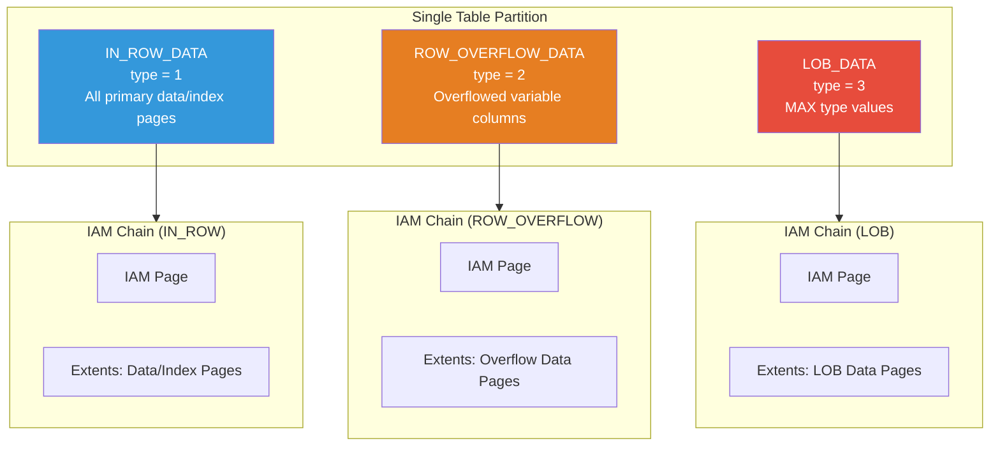
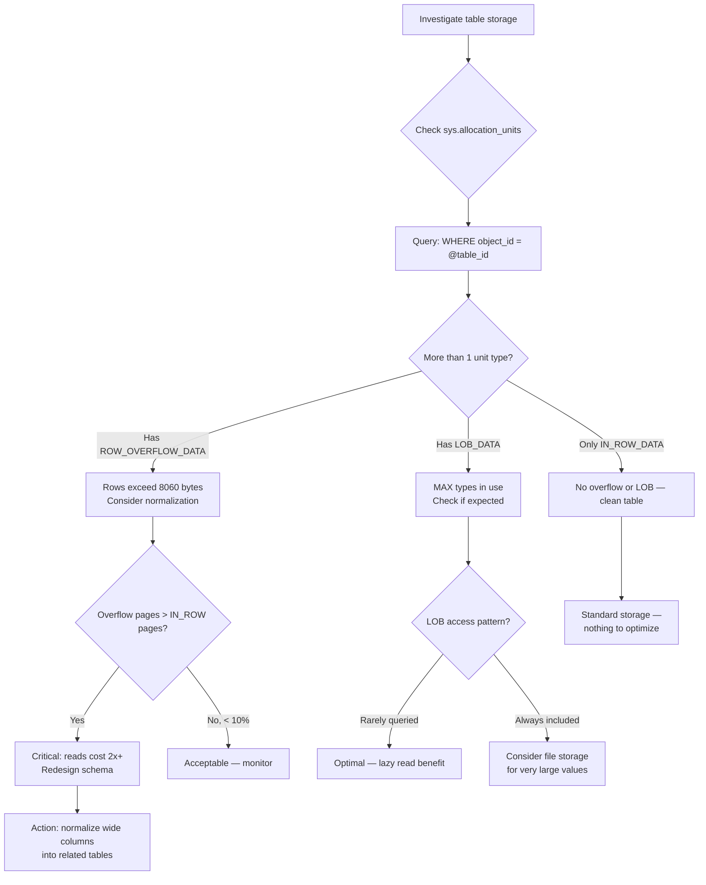

## Navigation

**Domain:** [[8 — Databases]] > **Group:** SQL Server Architecture & Storage Engine
**Previous:** [[8.276 — LOB Storage — Large Object Pages]] | **Next:** [[8.278 — Table Heap — Structure Without Clustered Index]]

### Prerequisites
- [[8.271 — Page Structure — 8KB Pages]] — all three allocation units use the same 8KB page template, but with different page types and headers
- [[8.275 — Row Overflow — Large Row Handling]] — allocation unit type 2 (ROW_OVERFLOW) stores off-row variable-length data
- [[8.276 — LOB Storage — Large Object Pages]] — allocation unit type 3 (LOB) stores MAX type values and uses the LOB Tree structure

### Where This Fits

Every table and index in SQL Server is composed of up to three allocation units, each managing a specific category of page storage: **IN_ROW_DATA** (type 1) for the primary row data and index pages, **ROW_OVERFLOW_DATA** (type 2) for variable-length column data moved off the primary page due to the 8060-byte row limit, and **LOB_DATA** (type 3) for large object data stored by MAX type columns. Each allocation unit has its own IAM chain, its own extent allocation pattern, and its own page-type structure. For a .NET backend engineer, understanding the three allocation unit types explains why `sys.allocation_units` has multiple rows per partition, why `sys.dm_db_index_physical_stats` returns separate rows for each unit, and how to interpret the storage footprint of tables with large columns.

## Core Mental Model

A single table partition maps to exactly three allocation units, each tracking a distinct page set. IN_ROW_DATA holds everything that fits within the 8060-byte limit: fixed-length columns, the variable-length portion of rows that don't overflow, index pages (root, intermediate, leaf for B-trees), and LOB/overflow pointers. ROW_OVERFLOW_DATA activates only when rows exceed 8060 bytes; it stores the variable-length columns that were pushed out, each on a separate 8KB page with a 24-byte pointer from the IN_ROW row. LOB_DATA activates only when MAX type values exceed 8000 bytes (or when forced by table option); it stores those values in a LOB Tree of pages. Each allocation unit type is tracked independently: separate IAM pages, separate extent allocation, separate `sys.dm_db_index_physical_stats` reporting, and separate `sys.allocation_units` row.



### Key Properties

|Property|IN_ROW_DATA (type 1)|ROW_OVERFLOW_DATA (type 2)|LOB_DATA (type 3)|
|---|---|---|---|
|Storage target|Primary rows, index pages|Overflowed VARCHAR/ NVARCHAR/ VARBINARY columns|VARCHAR(MAX), NVARCHAR(MAX), VARBINARY(MAX), XML, legacy TEXT/IMAGE|
|Page type|1 (Data), 2 (Index)|1 (Data page with overflow rows)|3 (Text Tree index), 4 (Text Tree data)|
|Always present?|Yes (every table/index)|Only if rows exceed 8060 bytes|Only if MAX type columns have LOB-sized values|
|Pointer in base row|N/A|24 bytes per overflowed column|16 bytes per LOB value|
|IAM chain|Per partition|Per partition (separate)|Per partition (separate)|
|sys.allocation_units.type|1|2|3|
|Rows in DMV|`sys.dm_db_index_physical_stats` shows separately|`sys.dm_db_index_physical_stats` shows separately for same index|`sys.dm_db_index_physical_stats` shows separately for same index|
|Index support|Primary key/index pages|Overflow columns cannot be keys; INCLUDE allowed (SQL 2012+)|Cannot be in any index (except full-text)|
|Minimum allocation|1 extent (mixed or uniform)|1 page (within existing extent)|1 page (LOB Tree root)|

## Deep Mechanics

### How the Engine Manages Allocation Units

**Step 1 — Partition Creation:** When a table is created, the engine creates one partition (unless partitioned). For that partition, it creates an IN_ROW_DATA allocation unit (type = 1). ROW_OVERFLOW and LOB allocation units are created on demand — they do not exist until their storage is needed.

**Step 2 — IAM Chain Allocation:** Each allocation unit has its own IAM (Index Allocation Map) page, which tracks which extents belong to that allocation unit. The IAM page for IN_ROW_DATA is allocated first; the others are allocated when their respective data types are first used.

**Step 3 — IN_ROW_DATA Management:** All INSERTs into standard columns (non-MAX types) go to IN_ROW_DATA pages. When rows exceed 8060 bytes, some variable columns are moved to ROW_OVERFLOW pages — the 24-byte pointer is placed in the IN_ROW row, and the data goes to a ROW_OVERFLOW page. The allocation unit type that "owns" the data stays IN_ROW for the base row.

**Step 4 — ROW_OVERFLOW Activation:** When the first overflow occurs, the engine creates a new ROW_OVERFLOW allocation unit for that partition. It allocates an IAM page, then allocates overflow pages as needed from the database's extent pool (via GAM/SGAM). These pages are tracked independently from IN_ROW_DATA pages.

**Step 5 — LOB_DATA Activation:** When the first MAX type column exceeds 8000 bytes (or if `large value types out of row = 1`), the LOB_DATA allocation unit is created. It gets its own IAM page. LOB root and data pages are allocated from this unit.

**Step 6 — Space Accounting (sys.allocation_units):** The `sys.allocation_units` system view reports per-allocation-unit statistics: `total_pages`, `used_pages`, `data_pages`. These are calculated from the IAM chain and GAM bitmap.

**Step 7 — Index Pages Always IN_ROW_DATA:** All index pages (B-tree non-leaf and leaf) are stored in IN_ROW_DATA. Index rows never overflow or use LOB pages. This is why index key length is limited — the key must fit within an IN_ROW_DATA page.

### SQL Visibility — Allocation Unit Analysis

```sql
-- Primary allocation unit view
SELECT 
    OBJECT_SCHEMA_NAME(a.object_id) + '.' + OBJECT_NAME(a.object_id) AS table_name,
    i.name AS index_name,
    i.type_desc AS index_type,
    p.partition_number,
    a.type_desc AS allocation_type,
    a.total_pages,
    a.used_pages,
    a.data_pages,
    a.total_pages * 8 AS total_space_kb,
    a.used_pages * 8 AS used_space_kb
FROM sys.allocation_units a
INNER JOIN sys.partitions p ON a.container_id = 
    CASE a.type
        WHEN 1 THEN p.partition_id     -- IN_ROW_DATA
        WHEN 2 THEN p.partition_id     -- ROW_OVERFLOW_DATA (same partition_hobt_id)
        WHEN 3 THEN p.partition_id     -- LOB_DATA (same partition_hobt_id)
    END
INNER JOIN sys.indexes i 
    ON p.object_id = i.object_id AND p.index_id = i.index_id
WHERE a.total_pages > 0
ORDER BY table_name, index_name, a.type_desc;

-- Per-allocation-unit page breakdown
SELECT 
    allocated_page_file_id,
    allocated_page_page_id,
    page_type_desc,
    page_level,
    allocation_unit_type_desc,
    is_allocated,
    is_iam_page
FROM sys.dm_db_database_page_allocations(
    DB_ID(), OBJECT_ID('dbo.Orders'), NULL, NULL, 'DETAILED'
)
ORDER BY allocation_unit_type_desc, page_id;

-- Allocation unit with largest space usage
SELECT TOP 10
    OBJECT_SCHEMA_NAME(a.object_id) + '.' + OBJECT_NAME(a.object_id) AS table_name,
    a.type_desc,
    a.total_pages,
    a.total_pages * 8 / 1024 AS total_mb,
    p.rows
FROM sys.allocation_units a
INNER JOIN sys.partitions p 
    ON a.container_id = p.partition_id
    OR a.container_id = p.hobt_id
ORDER BY a.total_pages DESC;

-- Space distribution across allocation units per table
SELECT 
    OBJECT_SCHEMA_NAME(a.object_id) + '.' + OBJECT_NAME(a.object_id) AS table_name,
    SUM(CASE WHEN a.type = 1 THEN a.total_pages ELSE 0 END) * 8 AS in_row_kb,
    SUM(CASE WHEN a.type = 2 THEN a.total_pages ELSE 0 END) * 8 AS overflow_kb,
    SUM(CASE WHEN a.type = 3 THEN a.total_pages ELSE 0 END) * 8 AS lob_kb,
    SUM(a.total_pages) * 8 AS total_kb,
    CAST(
        SUM(CASE WHEN a.type = 1 THEN a.total_pages ELSE 0 END) * 100.0 / 
        NULLIF(SUM(a.total_pages), 0) AS DECIMAL(5,1)
    ) AS in_row_pct,
    CAST(
        SUM(CASE WHEN a.type = 2 THEN a.total_pages ELSE 0 END) * 100.0 / 
        NULLIF(SUM(a.total_pages), 0) AS DECIMAL(5,1)
    ) AS overflow_pct,
    CAST(
        SUM(CASE WHEN a.type = 3 THEN a.total_pages ELSE 0 END) * 100.0 / 
        NULLIF(SUM(a.total_pages), 0) AS DECIMAL(5,1)
    ) AS lob_pct
FROM sys.allocation_units a
INNER JOIN sys.partitions p ON 
    a.container_id = p.partition_id
    OR a.container_id = p.hobt_id
WHERE a.object_id > 100  -- User objects
GROUP BY a.object_id
ORDER BY total_kb DESC;

-- Per-allocation-unit index physical stats
SELECT 
    OBJECT_SCHEMA_NAME(ps.object_id) + '.' + OBJECT_NAME(ps.object_id) AS table_name,
    i.name AS index_name,
    ps.partition_number,
    ps.index_type_desc,
    ps.alloc_unit_type_desc,
    ps.page_count,
    ps.record_count,
    ps.avg_record_size_in_bytes,
    ps.forwarded_record_count,
    ps.ghost_record_count
FROM sys.dm_db_index_physical_stats(
    DB_ID(), NULL, NULL, NULL, 'DETAILED'
) ps
INNER JOIN sys.indexes i 
    ON ps.object_id = i.object_id AND ps.index_id = i.index_id
ORDER BY table_name, index_name, ps.alloc_unit_type_desc;
```

### Failure Modes

- **Allocation Unit Orphan:** Rare corruption scenario where an IAM page references extents for a specific allocation unit, but `sys.allocation_units` has no corresponding row. `DBCC CHECKALLOC` detects and can fix this.

- **LOB/Overflow Unit Without Corresponding IN_ROW Unit:** If a ROW_OVERFLOW or LOB allocation unit exists but the IN_ROW_DATA unit is missing or corrupted, the data is unrecoverable. Page-level restore is needed.

- **Allocation Unit ID Exhaustion (Extremely Rare):** `container_id` mapping uses `hobt_id` which is a `BIGINT`. Exhaustion is not a practical concern.

- **Ghost Records in Non-IN_ROW Units:** Deleted overflow and LOB pages leave ghost records that must be cleaned up. If ghost cleanup falls behind (long-running snapshot transactions), LOB ghost pages accumulate and waste space.

## Production Patterns and Implementation

### Monitoring Allocation Unit Balance

```sql
-- Detect tables where overflow or LOB dominates storage
SELECT 
    a.object_id,
    OBJECT_SCHEMA_NAME(a.object_id) + '.' + OBJECT_NAME(a.object_id) AS table_name,
    a.type_desc,
    a.total_pages,
    a.used_pages,
    a.data_pages,
    a.total_pages * 8 / 1024 AS total_mb,
    ISNULL(p.rows, 0) AS row_count
FROM sys.allocation_units a
LEFT JOIN sys.partitions p 
    ON a.container_id = p.partition_id
    OR a.container_id = p.hobt_id
WHERE a.total_pages > 1000  -- Only significant usage
ORDER BY a.total_pages DESC;

-- Tables where overflow pages exceed IN_ROW pages
WITH unit_totals AS (
    SELECT 
        a.object_id,
        OBJECT_SCHEMA_NAME(a.object_id) + '.' + OBJECT_NAME(a.object_id) AS table_name,
        SUM(CASE WHEN a.type = 1 THEN a.total_pages ELSE 0 END) AS in_row_pages,
        SUM(CASE WHEN a.type = 2 THEN a.total_pages ELSE 0 END) AS overflow_pages,
        SUM(CASE WHEN a.type = 3 THEN a.total_pages ELSE 0 END) AS lob_pages
    FROM sys.allocation_units a
    INNER JOIN sys.partitions p 
        ON a.container_id = p.partition_id OR a.container_id = p.hobt_id
    GROUP BY a.object_id
)
SELECT 
    table_name,
    in_row_pages,
    overflow_pages,
    lob_pages,
    overflow_pages * 8 / 1024 AS overflow_mb,
    lob_pages * 8 / 1024 AS lob_mb
FROM unit_totals
WHERE overflow_pages > in_row_pages OR lob_pages > in_row_pages
ORDER BY (overflow_pages + lob_pages) DESC;

-- Track allocation unit growth over time (requires history table)
-- Create a baseline
SELECT 
    GETDATE() AS snapshot_time,
    a.type_desc,
    COUNT(*) AS unit_count,
    SUM(a.total_pages) AS total_pages_sum,
    SUM(a.total_pages * 8) / 1024 / 1024 AS total_gb
INTO dbo.AllocationUnitHistory
FROM sys.allocation_units a
GROUP BY a.type_desc;

-- Compare later
INSERT INTO dbo.AllocationUnitHistory
SELECT 
    GETDATE(),
    a.type_desc,
    COUNT(*),
    SUM(a.total_pages),
    SUM(a.total_pages * 8) / 1024 / 1024
FROM sys.allocation_units a
GROUP BY a.type_desc;

SELECT * FROM dbo.AllocationUnitHistory ORDER BY snapshot_time, type_desc;
```

### Rebuilding for Allocation Unit Optimization

```sql
-- Rebuild table to consolidate all allocation units
ALTER TABLE dbo.Orders REBUILD WITH (ONLINE = ON);
-- This rebuilds IN_ROW_DATA and may reduce ROW_OVERFLOW and LOB pages
-- by compacting overflowed data back in-row if possible

-- Rebuild a specific index (same effect for its allocation units)
ALTER INDEX PK_Orders ON dbo.Orders REBUILD WITH (ONLINE = ON);

-- Move LOB data to separate filegroup for I/O management
ALTER TABLE dbo.Documents REBUILD WITH (LOB_FILEGROUP = 'LOBFileGroup');

-- Check allocation unit layout after rebuild
SELECT 
    object_name(a.object_id) AS table_name,
    a.type_desc,
    a.total_pages,
    a.used_pages
FROM sys.allocation_units a
WHERE a.object_id = OBJECT_ID('dbo.Orders');
```

### SQL Server vs PostgreSQL Differences

|Aspect|SQL Server Allocation Units|PostgreSQL Storage|
|---|---|---|
|Storage organization|3 allocation units per partition per index|1 heap per table + TOAST table per table with TOAST-able columns|
|Overhead for small tables|3 allocation units potentially created but 0 pages|1 heap + 1 TOAST table created on demand|
|Index storage|All index pages in IN_ROW_DATA|Indexes are separate structures (no allocation unit concept)|
|Space accounting|sys.allution_units + sys.dm_db_index_physical_stats|pg_relation_size(), pg_total_relation_size(), pg_table_size()|
|LOB control|`sp_tableoption` + index maintenance|`ALTER COLUMN SET STORAGE` per column|
|Multi-unit consistency|Atomic — transaction covers all units|MVCC ensures TOAST consistency via chunk-level visibility|

PostgreSQL does not have allocation units. Each table has a heap relation (the main table) and optionally a TOAST table (created when any column is TOAST-able). Indexes are separate relations with their own forks. The SQL Server model explicitly tracks three storage categories; PostgreSQL's model is simpler per-table but requires understanding that TOAST storage is separate.

## Gotchas and Production Pitfalls

### Pitfall 1: sys.allocation_units JOIN Confusion

**Pitfall:** Incorrectly joining `sys.allocation_units` to `sys.partitions` or `sys.indexes`, assuming `container_id` always maps to `partition_id`.

**Symptom:** Missing allocation units in queries. **For IN_ROW_DATA (type 1)** and **ROW_OVERFLOW_DATA (type 2)**: `container_id = partition_id` (or `hobt_id` for non-partitioned heaps). **For LOB_DATA (type 3)**: `container_id = partition_id` for non-partitioned or `container_id = hobt_id` for partitioned. The correct join is:

```sql
-- Correct join pattern
SELECT ...
FROM sys.allocation_units a
INNER JOIN sys.partitions p 
    ON a.container_id = 
        CASE a.type
            WHEN 1 THEN p.hobt_id
            WHEN 2 THEN p.hobt_id
            WHEN 3 THEN p.hobt_id
        END;
```

**Fix:** Use `hobt_id` (HoBT ID = Heap or B-tree ID) which consistently maps all three types:

```sql
INNER JOIN sys.partitions p ON a.container_id = p.hobt_id
```

**Cost of not fixing:** Space accounting queries return NULL for some allocation units. Monitoring shows incorrect storage distribution.

### Pitfall 2: ROW_OVERFLOW Unit Exists with Zero Pages

**Sitfall:** A table may have a ROW_OVERFLOW allocation unit row in `sys.allocation_units` with `total_pages = 0` and `used_pages = 0`. This unit was created (metadata allocated) but no data has overflowed yet.

**Symptom:** `sys.allocation_units` shows three rows for a table, but two have zero pages. This is normal — the unit is created lazily when first needed but the system view always shows it.

**Fix:** No action needed. However, during space estimations, remember that zero-page units contribute negligible storage.

**Cost of not fixing:** Engineers misinterpret zero-page allocation units as fragmentation or corruption. No performance impact.

### Pitfall 3: Index Maintenance Does Not Rebuild All Units

**Pitfall:** Running `ALTER INDEX ... REBUILD` only rebuilds the IN_ROW_DATA pages for that index. ROW_OVERFLOW and LOB pages are rebuilt only when the base table is rebuilt.

**Symptom:** After `ALTER INDEX PK_Orders REBUILD`, overflow and LOB page counts remain high. Fragmentation in LOB_DATA allocation units is not resolved.

**Fix:** Use `ALTER TABLE ... REBUILD` instead of per-index rebuild to compact all allocation units:

```sql
ALTER TABLE dbo.Orders REBUILD WITH (ONLINE = ON);
```

**Cost of not fixing:** LOB fragmentation persists after index maintenance. Engineers think maintenance completed successfully but LOB performance continues to degrade.

### Pitfall 4: Allocation Unit Count Explosion with Partitioning

**Pitfall:** Partitioned tables create a separate set of allocation units per partition. A table with 365 daily partitions and 3 allocation units per partition = 1095 allocation units.

**Symptom:** `sys.allocation_units` has 1000+ rows for a single table. Monitoring queries that scan this system view become slow.

**Fix:** Use partition-level filtering when monitoring allocation units:

```sql
SELECT * FROM sys.allocation_units a
INNER JOIN sys.partitions p ON a.container_id = p.hobt_id
WHERE p.partition_number = 1  -- Only current partition
    AND p.object_id = OBJECT_ID('dbo.PartitionedTable');
```

**Cost of not fixing:** Monitoring queries timeout or cause excessive I/O. Backup estimates become inaccurate because total_pages includes all partitions.

### Pitfall 5: Allocation Units in Heaps vs Clustered Indexes

**Pitfall:** Assuming allocation units behave identically for heap tables (no clustered index) and clustered indexes.

**Symptom:** For a heap table, `sys.allocation_units` shows IN_ROW_DATA with `container_id` mapping to the heap's HoBT ID. But forwarded records in heaps are tracked at the IN_ROW_DATA unit level, not separately. For clustered indexes, the clustered index IS the table — all IN_ROW_DATA pages belong to the clustered index leaf level. When rebuilding a clustered index, all allocation units (including ROW_OVERFLOW and LOB) are rebuilt. When rebuilding a heap (via `ALTER TABLE ... REBUILD`), the same happens. However, the key difference: heaps have index_id = 0 in `sys.indexes`, and `sys.allocation_units` shows the same three allocation units, but their `container_id` maps to `partition_id` (not `hobt_id` for type 1). The join logic differs.

**Fix:** Always join using `hobt_id` from `sys.partitions` to ensure heap and clustered index consistency:

```sql
-- Universal join pattern
SELECT *
FROM sys.allocation_units a
INNER JOIN sys.partitions p ON a.container_id = p.hobt_id;
```

**Cost of not fixing:** Queries that work for clustered indexes break for heaps. Monitoring scripts show NULLs for heap allocation units, leading to missed space tracking.

### Pitfall 6: Confusing Index-Level Allocation Units with Partition-Level

**Pitfall:** Assuming a non-clustered index has only IN_ROW_DATA (no overflow/LOB). Non-clustered indexes CAN have LOB/overflow columns as INCLUDE columns (SQL 2012+).

**Symptom:** Space accounting for non-clustered indexes shows ROW_OVERFLOW or LOB pages.

**Fix:** Understand that INCLUDE columns in non-clustered indexes are stored in the index's leaf pages (which are IN_ROW_DATA for the index's allocation unit). But the base table's LOB allocation unit is separate.

**Cost of not fixing:** Engineers delete indexes thinking they are corrupt, when the LOB/overflow pages belong to the base table, not the index.

## Performance Implications

### Benchmark: Space Distribution Across Allocation Units

```sql
-- Create a table that exercises all three allocation unit types
CREATE TABLE dbo.AllAllocationTypes (
    Id INT IDENTITY(1,1) PRIMARY KEY,
    ShortData VARCHAR(100) NOT NULL DEFAULT 'x',
    OverflowData VARCHAR(8000) NULL,      -- Potential row overflow
    LargeData VARCHAR(MAX) NULL,          -- LOB
    CreatedDate DATETIME2 NOT NULL DEFAULT SYSUTCDATETIME()
);

-- Insert rows that trigger all types
DECLARE @i INT = 0;
WHILE @i < 5000
BEGIN
    -- Mixed row sizes to trigger different allocation patterns
    INSERT INTO dbo.AllAllocationTypes (
        OverflowData, LargeData
    )
    SELECT 
        -- Make some rows overflow with long data
        CASE WHEN @i % 10 = 0 
            THEN REPLICATE('x', 7000) 
            ELSE 'small'
        END,
        -- LOB data for some rows
        CASE WHEN @i % 5 = 0 
            THEN REPLICATE(CAST('x' AS VARCHAR(MAX)), 10000)
            ELSE NULL
        END;
    
    SET @i = @i + 1;
END

-- Check allocation unit distribution
SELECT 
    a.type_desc,
    a.total_pages,
    a.used_pages,
    a.data_pages,
    a.total_pages * 8 / 1024 AS total_mb,
    a.used_pages * 8 / 1024 AS used_mb
FROM sys.allocation_units a
WHERE a.object_id = OBJECT_ID('dbo.AllAllocationTypes');

-- Expected pattern:
-- IN_ROW_DATA: ~600 pages (5000 rows / ~8 per page)
-- ROW_OVERFLOW_DATA: ~430 pages (500 overflow rows)
-- LOB_DATA: ~620 pages (1000 rows with 10KB LOBs, ~1.25 pages each)
```

### Write Amplification by Allocation Unit

|Operation|IN_ROW Page Writes|OVERFLOW Page Writes|LOB Page Writes|
|---|---|---|---|
|Small INSERT (< 100 bytes)|1|0|0|
|Large INSERT (overflow)|1|1+|0|
|INSERT with LOB|1|0|1+ per LOB value|
|UPDATE (grow to overflow)|1 (split)|1+|0|
|UPDATE (grow to LOB)|1|0|1+ per LOB value|
|DELETE (small row)|1 (ghost)|0|0|
|DELETE (with LOB)|1 (ghost)|0|1+ (ghost)|
|Index rebuild (table)|All new|All new (compacted)|All new (compacted)|

### BenchmarkDotNet

```csharp
[MemoryDiagnoser]
[SimpleJob(RuntimeMoniker.Net90)]
public class AllocationUnitBenchmark
{
    private IDbConnection _connection = default!;
    private const string ConnectionString = "Server=.;Database=PerfTest;Integrated Security=true;TrustServerCertificate=true;";

    [GlobalSetup]
    public void Setup()
    {
        _connection = new SqlConnection(ConnectionString);
        _connection.Open();
    }

    [Benchmark(Baseline = true)]
    public async Task ReadInRowOnly()
    {
        var cmd = _connection.CreateCommand();
        cmd.CommandText = "SELECT Id, ShortData FROM dbo.AllAllocationTypes WHERE Id < 100;";
        using var reader = await cmd.ExecuteReaderAsync();
        while (await reader.ReadAsync()) { }
    }

    [Benchmark]
    public async Task ReadWithOverflow()
    {
        var cmd = _connection.CreateCommand();
        cmd.CommandText = "SELECT Id, OverflowData FROM dbo.AllAllocationTypes WHERE OverflowData IS NOT NULL AND Id < 100;";
        using var reader = await cmd.ExecuteReaderAsync();
        while (await reader.ReadAsync()) { }
    }

    [Benchmark]
    public async Task ReadWithLOB()
    {
        var cmd = _connection.CreateCommand();
        cmd.CommandText = "SELECT Id, LargeData FROM dbo.AllAllocationTypes WHERE LargeData IS NOT NULL AND Id < 100;";
        using var reader = await cmd.ExecuteReaderAsync();
        while (await reader.ReadAsync()) { }
    }

    [Benchmark]
    public async Task ReadAllColumns()
    {
        var cmd = _connection.CreateCommand();
        cmd.CommandText = "SELECT * FROM dbo.AllAllocationTypes WHERE Id < 100;";
        using var reader = await cmd.ExecuteReaderAsync();
        while (await reader.ReadAsync()) { }
    }

    [GlobalCleanup]
    public void Cleanup() => _connection.Dispose();
}
```

## Interview Arsenal

### Question Bank

1. **What are the three allocation unit types and what does each store?**
2. **How does sys.allocation_units map to sys.partitions? (The container_id join)**
3. **When are ROW_OVERFLOW_DATA and LOB_DATA allocation units created — at table creation or on first use?**
4. **Can a non-clustered index have its own ROW_OVERFLOW or LOB allocation units?**
5. **How does `ALTER TABLE REBUILD` affect all three allocation units?**
6. **What is the IAM chain and how does it relate to allocation units?**
7. **How does partitioning affect allocation unit count?**
8. **Compare the three allocation units in terms of page types (m_type) used.**

### Spoken Answers

**Q1: What are the three allocation unit types and what does each store?**

> **Average answer:** IN_ROW stores rows, ROW_OVERFLOW stores overflowed data, LOB stores large objects.

> **Great answer:** The three types are defined in `sys.allocation_units.type`. **IN_ROW_DATA (type = 1)** stores all standard data pages (page type 1 for data, page type 2 for index B-tree pages) — this includes primary row data, all index pages at all levels, and variable-length columns that fit within the 8060-byte page limit. It's the only allocation unit that every table and index has. **ROW_OVERFLOW_DATA (type = 2)** stores variable-length column data that was pushed off the primary page when the row exceeded 8060 bytes. Each overflowed column gets a 24-byte pointer in the base IN_ROW row and the actual data lives on a type 1 page in this allocation unit. This unit only exists if at least one row has overflowed. **LOB_DATA (type = 3)** stores data from MAX type columns (VARCHAR(MAX), NVARCHAR(MAX), VARBINARY(MAX)) when the value exceeds 8000 bytes or when the table option forces out-of-row storage. It uses page type 3 (Text Tree index) and page type 4 (Text Tree data) in a LOB Tree structure. This unit only exists if LOB data has been stored. All three units are tracked independently with their own IAM chains, extent allocations, and space accounting in `sys.dm_db_index_physical_stats`.

**Q4: Can a non-clustered index have its own ROW_OVERFLOW or LOB allocation units?**

> **Average answer:** No — overflow and LOB only exist for base tables.

> **Great answer:** Since SQL Server 2012, non-clustered indexes can INCLUDE columns of MAX type or overflow-capable types. When a non-clustered index INCLUDEs a `VARCHAR(MAX)` column, the index's leaf page stores the LOB pointer (16 bytes) in the INCLUDE portion of the index row. The LOB data itself lives in the **base table's** LOB_DATA allocation unit, not in a separate unit for the index. The same applies to ROW_OVERFLOW: if an INCLUDE column causes the index row to exceed 8060 bytes (which is very rare given index row size limits), the overflow would go to the base table's allocation units. Index pages themselves (B-tree pages) always use IN_ROW_DATA — they never have their own separate overflow or LOB units. The only exception is filtered indexes: the filter predicate cannot reference LOB or overflow columns.

**Q7: How does partitioning affect allocation unit count?**

> **Average answer:** Each partition has its own allocation units.

> **Great answer:** Each partition of a partitioned table gets a complete set of allocation units — one IN_ROW_DATA, potentially one ROW_OVERFLOW_DATA, and potentially one LOB_DATA — for each index on the table. So for a table with 365 daily partitions, two indexes (clustered + one non-clustered), and assuming all three unit types exist, that's: 365 partitions × 2 indexes × 3 allocation units = 2190 allocation units. Each of these has its own IAM page chain. This creates metadata overhead: `sys.allocation_units` grows large, `sys.dm_db_index_physical_stats` must scan all units, and `DBCC CHECKDB` validates all units. For this reason, very high partition counts (1000+) require careful monitoring. The `sys.allocation_units` view joins to `sys.partitions` via `container_id = hobt_id` (the HoBT ID, which is unique per partition per index). When querying space usage, always filter by `p.partition_number` to limit the scan to relevant partitions.

### Additional Question: Allocation Units in Azure SQL Database

**Q9: How does allocation unit management differ in Azure SQL Database vs on-premises SQL Server?**

> **Great answer:** In Azure SQL Database, the same three allocation unit types exist (IN_ROW_DATA, ROW_OVERFLOW_DATA, LOB_DATA), and the engine internals are identical. However, you have reduced visibility: `sys.dm_db_database_page_allocations` is available but has restricted output (no file-level details because Azure SQL hides file internals). `sys.allocation_units` works normally. `DBCC PAGE` is partially supported — it can be executed but the output is limited. The key practical difference: in Azure SQL Database, space accounting via `sys.allocation_units` is essential because you cannot access file system or GAM/SGAM pages directly. The allocation behavior (row overflow threshold, LOB threshold, mixed vs uniform extents) is identical. However, the underlying storage uses Azure Blob Storage, so the concept of sequential extent I/O is moot. For the DTU/vCore purchasing model, allocation unit totals contribute to the database size limit (max size per tier). Monitoring `sys.allocation_units` for LOB_DATA growth is especially important on Azure SQL Database because large LOB columns can quickly consume the database size quota.

### Interview Trigger

This topic surfaces when asked "How does SQL Server track space for a table?" The candidate should mention allocation units and IAM chains. The follow-up "How many allocation units does a 1-page table have vs a 10000-page table?" tests depth.

### Comparison Table

| | IN_ROW_DATA | ROW_OVERFLOW_DATA | LOB_DATA |
|---|---|---|---|
|Always exists|Yes|Only when needed|Only when needed|
|Contains|Rows, index pages|Overflow column data|MAX column data|
|Page types used|1 (Data), 2 (Index)|1 (Data)|3 (Text index), 4 (Text data)|
|Pointer in base row|N/A|24 bytes per overflow column|16 bytes per LOB value|
|Index allowed?|Yes (all index pages)|No|No|
|IAM chain|Yes|Yes|Yes|
|Parallelism|Fully supported|Fully supported|Supported but reader must merge|

## Decision Framework

### When to Apply



### Application Checklist

- [ ] `sys.allocation_units` reviewed for all large tables — understanding which unit types are active
- [ ] ROW_OVERFLOW_DATA unit (if exists) has page count < IN_ROW_DATA page count
- [ ] LOB_DATA unit (if exists) is intentional — MAX columns justified by access pattern
- [ ] Partitioned tables account for allocation unit multiplication
- [ ] Index maintenance strategy includes `ALTER TABLE ... REBUILD` to compact all units (not just per-index)
- [ ] `sys.dm_db_index_physical_stats` queries filter by `alloc_unit_type_desc` to understand per-unit fragmentation
- [ ] No confusing `container_id` joins — use `hobt_id` for correctness

### Tradeoff Summary

|What You Gain|What You Pay|
|---|---|
|Clean separation of storage concerns (fits on page vs overflow vs LOB)|Metadata overhead — 3x sys.allocation_units rows per partition per index|
|Lazy LOB read saves I/O when columns not in SELECT|Engine must navigate between allocation units via pointers|
|Each unit has its own IAM for efficient extent management|Index maintenance must understand per-unit behavior (ALTER TABLE vs ALTER INDEX)|
|Overflow/LOB units created only when needed|Space accounting queries require correct joins to avoid missing units|

### Scale Thresholds

- **Relevant when:** Table has varchar(8000) or MAX type columns — potential for > 1 allocation unit
- **Critical when:** ROW_OVERFLOW page count exceeds IN_ROW_DATA page count — table redesign needed
- **Monitoring needed when:** Partition count exceeds 100 — 300+ allocation units
- **Rebuild required when:** LOB_DATA fragmentation > 30% — seen in avg_record_size vs page_count anomalies

## Self-Check

### Conceptual Questions

1. What are the three allocation unit types and their type codes in sys.allocation_units?
2. How does container_id map to sys.partitions for each allocation unit type?
3. Under what conditions does a ROW_OVERFLOW allocation unit get created?
4. Under what conditions does a LOB allocation unit get created?
5. Can a non-clustered index have its own ROW_OVERFLOW pages?
6. What DBCC command or DMV shows per-allocation-unit page counts?
7. How does ALTER TABLE REBUILD differ from ALTER INDEX REBUILD for allocation units?
8. How many allocation units does a partitioned table with 100 partitions and 2 indexes have (assuming all three types exist)?
9. What page types (m_type) are used by each allocation unit?
10. How does PostgreSQL's storage model compare to SQL Server's three allocation units?

<details>
<summary>Answers</summary>

1. Type 1 = IN_ROW_DATA (primary row data and index pages). Type 2 = ROW_OVERFLOW_DATA (overflowed variable-length column data). Type 3 = LOB_DATA (MAX type values, TEXT/NTEXT/IMAGE). The type_desc column provides human-readable names.
2. For all three types since SQL Server 2012: `a.container_id = p.hobt_id` (the HoBT ID — Heap or B-tree ID). Pre-2012, IN_ROW_DATA used `partition_id` and LOB/OVERFLOW used `partition_id` via the partition's `hobt_id`. The safest join is `a.container_id = p.hobt_id`.
3. ROW_OVERFLOW_DATA is created when the first row exceeds the 8060-byte per-page limit, causing the engine to move variable-length columns out of the IN_ROW page. The allocation unit is created at that moment — not at table creation.
4. LOB_DATA is created when: (a) a MAX type column is inserted with a value > 8000 bytes (with `large value types out of row = 0` default), OR (b) a MAX type column is inserted/updated with ANY value when `large value types out of row = 1`, OR (c) a legacy TEXT/NTEXT/IMAGE column is created (these always use LOB pages).
5. Since SQL Server 2012, a non-clustered index can INCLUDE overflow-capable or MAX columns. However, the INCLUDE column's overflow data still lives in the BASE TABLE's ROW_OVERFLOW or LOB allocation units — not in a separate unit for the index. The index leaf page stores the 24-byte or 16-byte pointer. Index B-tree pages themselves never overflow or use LOB storage.
6. `sys.allocation_units` (total_pages, used_pages, data_pages). `sys.dm_db_index_physical_stats` (page_count, alloc_unit_type_desc). `sys.dm_db_database_page_allocations` (page-level detail per allocation unit).
7. `ALTER INDEX ... REBUILD` rebuilds only that index's IN_ROW_DATA allocation unit. `ALTER TABLE ... REBUILD` rebuilds the table AND compacts all its allocation units (IN_ROW, ROW_OVERFLOW, LOB). For a clustered index, `ALTER INDEX ... REBUILD` IS the same as `ALTER TABLE ... REBUILD` because the clustered index is the table. For a heap, `ALTER TABLE ... REBUILD` is the only way to rebuild all allocation units.
8. 100 partitions × 2 indexes × 3 allocation unit types = 600 allocation units (assuming all three types exist per partition). In practice, ROW_OVERFLOW and LOB may not exist for all partitions, but the unit count can still be significant.
9. **IN_ROW_DATA:** page m_type = 1 (Data Page) for leaf data, m_type = 2 (Index Page) for B-tree non-leaf pages. **ROW_OVERFLOW_DATA:** page m_type = 1 (Data Page — same structure as IN_ROW data pages but used for overflow data). **LOB_DATA:** page m_type = 3 (Text Tree Index — root/intermediate LOB Tree pages), m_type = 4 (Text Tree Data — LOB data pages).
10. PostgreSQL does not have allocation units. Each table has one heap relation (main data) and optionally one TOAST table (created when a TOAST-able column exists). Indexes are separate relations. There is no ROW_OVERFLOW equivalent — PostgreSQL uses TOAST per-value (not per-row). SQL Server's model is more structured with three explicit categories, while PostgreSQL's is simpler per-table but has the TOAST complexity of chunked storage.

</details>

### Query Challenges

**Challenge 1 — Map allocation units for all tables**

Write a query that shows every user table, its indexes, and how many pages each allocation unit type uses.

<details>
<summary>Solution</summary>

```sql
SELECT 
    OBJECT_SCHEMA_NAME(a.object_id) + '.' + OBJECT_NAME(a.object_id) AS table_name,
    i.name AS index_name,
    i.type_desc AS index_type,
    p.partition_number,
    a.type_desc AS allocation_type,
    a.total_pages,
    a.used_pages,
    a.data_pages,
    a.total_pages * 8 / 1024 AS total_mb
FROM sys.allocation_units a
INNER JOIN sys.partitions p ON a.container_id = p.hobt_id
INNER JOIN sys.indexes i ON p.object_id = i.object_id AND p.index_id = i.index_id
WHERE a.object_id > 100  -- User objects only
ORDER BY table_name, index_name, a.type_desc;
```

**Logical reads:** ~100-500 depending on database size. **Execution plan:** System table scans with nested loops.

</details>

---

**Challenge 2 — Find tables that have ROW_OVERFLOW pages**

Write a query to identify tables where ROW_OVERFLOW_DATA exists and its page count is > 0.

<details> <summary>Solution</summary>

```sql
WITH overflow_units AS (
    SELECT 
        a.object_id,
        SUM(a.total_pages) AS overflow_pages,
        SUM(a.used_pages) AS overflow_used_pages
    FROM sys.allocation_units a
    WHERE a.type = 2  -- ROW_OVERFLOW_DATA
    GROUP BY a.object_id
)
SELECT 
    OBJECT_SCHEMA_NAME(o.object_id) + '.' + OBJECT_NAME(o.object_id) AS table_name,
    o.overflow_pages,
    o.overflow_used_pages,
    o.overflow_pages * 8 / 1024 AS overflow_mb,
    COALESCE(in_row.total_pages, 0) AS in_row_pages,
    CAST(o.overflow_pages * 100.0 / NULLIF(o.overflow_pages + COALESCE(in_row.total_pages, 0), 0) AS DECIMAL(5,1)) AS overflow_pct
FROM overflow_units o
OUTER APPLY (
    SELECT SUM(total_pages) AS total_pages
    FROM sys.allocation_units a2
    WHERE a2.object_id = o.object_id AND a2.type = 1
) in_row
ORDER BY o.overflow_pages DESC;
```

</details>

---

**Challenge 3 — Calculate total storage per allocation unit type**

Write a query that aggregates total database storage by allocation unit type, showing total pages, total MB, and percentage.

<details> <summary>Solution</summary>

```sql
SELECT 
    a.type_desc,
    COUNT(*) AS unit_count,
    SUM(a.total_pages) AS total_pages_all_units,
    SUM(a.used_pages) AS total_used_pages,
    SUM(a.total_pages) * 8 / 1024 AS total_mb,
    SUM(a.used_pages) * 8 / 1024 AS used_mb,
    CAST(SUM(a.total_pages) * 100.0 / NULLIF(SUM(SUM(a.total_pages)) OVER (), 0) AS DECIMAL(5,1)) AS pct_of_db
FROM sys.allocation_units a
WHERE a.object_id > 100
GROUP BY a.type_desc
ORDER BY SUM(a.total_pages) DESC;
```

</details>

---

**Challenge 4 — Design a monitoring query for allocation unit growth**

Create a query that can be run daily to detect sudden growth in ROW_OVERFLOW or LOB allocation units.

<details> <summary>Solution</summary>

```sql
CREATE TABLE dbo.AllocationUnitGrowth (
    SnapshotId INT IDENTITY PRIMARY KEY,
    SnapshotDate DATETIME2 NOT NULL DEFAULT SYSUTCDATETIME(),
    ObjectId INT NOT NULL,
    IndexId INT NOT NULL,
    PartitionNumber INT NOT NULL,
    AllocUnitTypeDesc NVARCHAR(60) NOT NULL,
    TotalPages INT NOT NULL
);

-- Daily monitoring insert
INSERT INTO dbo.AllocationUnitGrowth (ObjectId, IndexId, PartitionNumber, AllocUnitTypeDesc, TotalPages)
SELECT 
    a.object_id,
    p.index_id,
    p.partition_number,
    a.type_desc,
    a.total_pages
FROM sys.allocation_units a
INNER JOIN sys.partitions p ON a.container_id = p.hobt_id
WHERE a.type IN (2, 3)  -- Only overflow and LOB
    AND a.total_pages > 0;

-- Detection query for sudden growth
WITH growth AS (
    SELECT 
        g1.ObjectId,
        g1.IndexId,
        g1.PartitionNumber,
        g1.AllocUnitTypeDesc,
        g1.TotalPages AS current_pages,
        LAG(g1.TotalPages, 1, 0) OVER (
            PARTITION BY g1.ObjectId, g1.IndexId, g1.PartitionNumber, g1.AllocUnitTypeDesc
            ORDER BY g1.SnapshotDate
        ) AS previous_pages,
        g1.SnapshotDate,
        g1.TotalPages - LAG(g1.TotalPages, 1, 0) OVER (
            PARTITION BY g1.ObjectId, g1.IndexId, g1.PartitionNumber, g1.AllocUnitTypeDesc
            ORDER BY g1.SnapshotDate
        ) AS page_growth
    FROM dbo.AllocationUnitGrowth g1
)
SELECT 
    OBJECT_SCHEMA_NAME(g.ObjectId) + '.' + OBJECT_NAME(g.ObjectId) AS table_name,
    g.AllocUnitTypeDesc,
    g.previous_pages,
    g.current_pages,
    g.page_growth,
    g.SnapshotDate
FROM growth g
WHERE g.page_growth > 10000  -- Alert on 10K+ page growth
ORDER BY g.page_growth DESC;
```

</details>

---

**Challenge 5 — Correlate allocation unit space with table row count**

Write a query that shows pages-per-row ratio broken down by allocation unit type, identifying tables where overflow or LOB pages per row are excessive.

<details> <summary>Solution</summary>

```sql
SELECT 
    OBJECT_SCHEMA_NAME(a.object_id) + '.' + OBJECT_NAME(a.object_id) AS table_name,
    i.name AS index_name,
    p.rows AS row_count,
    SUM(CASE WHEN a.type = 1 THEN a.total_pages ELSE 0 END) AS in_row_pages,
    SUM(CASE WHEN a.type = 2 THEN a.total_pages ELSE 0 END) AS overflow_pages,
    SUM(CASE WHEN a.type = 3 THEN a.total_pages ELSE 0 END) AS lob_pages,
    -- Pages per row ratios
    CAST(SUM(CASE WHEN a.type = 1 THEN a.total_pages ELSE 0 END) * 1.0 / NULLIF(p.rows, 0) AS DECIMAL(6,2)) AS in_row_ppr,
    CAST(SUM(CASE WHEN a.type = 2 THEN a.total_pages ELSE 0 END) * 1.0 / NULLIF(p.rows, 0) AS DECIMAL(6,2)) AS overflow_ppr,
    CAST(SUM(CASE WHEN a.type = 3 THEN a.total_pages ELSE 0 END) * 1.0 / NULLIF(p.rows, 0) AS DECIMAL(6,2)) AS lob_ppr,
    CAST(SUM(a.total_pages) * 1.0 / NULLIF(p.rows, 0) AS DECIMAL(6,2)) AS total_ppr
FROM sys.allocation_units a
INNER JOIN sys.partitions p ON a.container_id = p.hobt_id
INNER JOIN sys.indexes i ON p.object_id = i.object_id AND p.index_id = i.index_id
WHERE p.rows > 10000
GROUP BY a.object_id, i.name, p.rows
HAVING SUM(CASE WHEN a.type = 2 THEN a.total_pages ELSE 0 END) * 1.0 / NULLIF(p.rows, 0) > 0.5
    OR SUM(CASE WHEN a.type = 3 THEN a.total_pages ELSE 0 END) * 1.0 / NULLIF(p.rows, 0) > 0.5
ORDER BY total_ppr DESC;
```

**Expected pattern:** Tables with overflow_ppr > 1.0 mean more overflow pages than rows — every row needs at least one overflow page read. This is an indicator of poor schema design (overwide rows).

</details>
