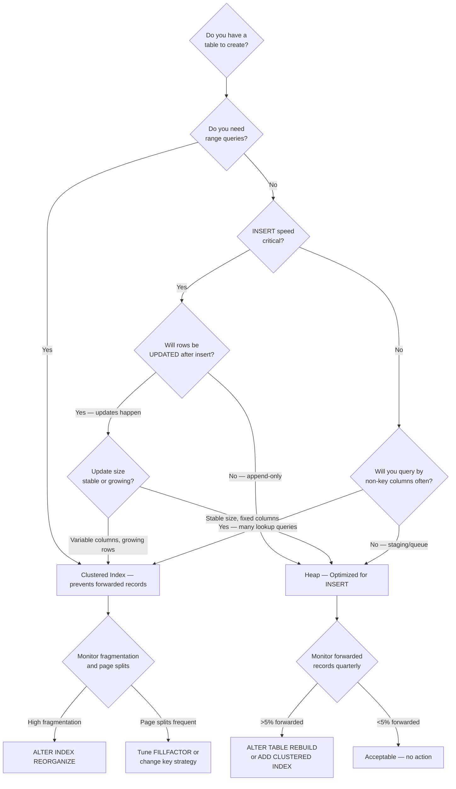

## Navigation

**Domain:** [[8 — Databases]] > **Group:** SQL Server Architecture & Storage Engine
**Previous:** [[8.277 — Allocation Units — IN_ROW, ROW_OVERFLOW, LOB]] | **Next:** [[8.279 — Clustered Index — Physical Table Organization]]

### Prerequisites

- [[8.271 — Page Structure — 8KB Pages]] — a heap is a collection of 8KB pages with no logical ordering; understanding the 96-byte page header, offset array, and slot numbering is required before studying how rows land in heap pages.
- [[8.272 — Extent Structure — Mixed and Uniform Extents]] — heap pages are allocated through extents; the first eight pages use mixed extents, after which uniform extents are used; mixed/uniform extent behavior directly affects the allocation pattern visible in DBCC IND and sys.dm_db_database_page_allocations.
- [[8.274 — Data Pages — Row Structure]] — heap rows are stored as fixed-format records with record header, null bitmap, and variable-length columns; forwarded records in heaps create an indirection that modifies the normal row storage pattern.
- [[8.277 — Allocation Units — IN_ROW, ROW_OVERFLOW, LOB]] — every heap has exactly three allocation units; understanding which allocation unit stores which data type determines how DBCC PAGE output changes for overflow and LOB rows.

### Where This Fits

A heap is a table without a clustered index — rows are stored in no particular order, and new rows are inserted into whatever page has free space (tracked by the PFS page). Heaps appear in staging tables, queue tables (ETL landing, Service Broker), logging tables where insert speed dominates, and tables where a clustered index would cause page splits due to random inserts on a key like GUID/NEWID(). A .NET backend engineer encounters heaps in data warehouse ETL patterns (bulk load into heap, then create clustered index), in high-throughput audit tables (INSERT-only — no clustered index overhead), and occasionally in misdesigned tables missing a primary key. The interview signal is strong: senior engineers must explain when to use a heap intentionally (versus it being an accidental design flaw), how forwarded records degrade performance over time, and why read queries on heaps typically use table scan or RID lookup. The deeper signal is whether the candidate knows that heaps can outperform clustered indexes in INSERT-heavy scenarios with no update/delete pattern, and that rebuilding a heap (ALTER TABLE ... REBUILD) eliminates forwarded records and shrinks space without changing the non-clustered index RIDs.

---

## Core Mental Model

A heap is a table whose data pages are not linked in any logical order. The storage engine allocates pages as rows are inserted, and the IAM (Index Allocation Map) pages track which extents belong to the heap. When a query needs to read all rows from a heap, the storage engine scans the IAM chain to find all allocated extents and reads every page — this is an **IAM scan** (which is more efficient than a full table scan on a clustered index because it skips pages that belong to other objects on the same mixed extent). When a query needs a single row and has a non-clustered index, the non-clustered index leaf holds the **RID** (Row Identifier: FileId:PageId:SlotNumber — an 8-byte physical pointer), and the engine performs a **RID lookup** to fetch the row directly. The key invariant: **there is no key to order the rows, no B-tree linking pages at the leaf level, and no logical sequencing between pages.** The only ordering mechanism is the page chain within each IAM range — pages within a single IAM extent range are physically contiguous, but different IAM ranges are scattered.

```mermaid
flowchart TB
    subgraph HeapTable["Heap Table — Sales.OrderHeap"]
        IAM1[IAM Page<br/>First IAM: File 1, Page 189] --> Range1[Extent 1: Pages 192-199<br/>Mixed extent, 1 page used]
        IAM1 --> Range2[Extent 2: Pages 344-351<br/>Uniform extent, 8 pages used]
        IAM1 --> Range3[Extent 3: Pages 512-519<br/>Uniform extent, 8 pages used]

        subgraph PageContent["Page 344: Data Page"]
            P1[Page Header<br/>PageID=(1:344), SlotCount=137, FreeBytes=2048]
            P1 --> Row1[Slot 0: Row — OrderID=5001, CustomerID=42, OrderDate=2026-05-01]
            P1 --> Row2[Slot 1: Row — OrderID=5002, CustomerID=17, OrderDate=2026-05-01]
            P1 --> Row3[Slot 138: Row — OrderID=7250, CustomerID=88, OrderDate=2026-06-27]
        end

        PFS[PFS Page<br/>File 1, Page 1<br/>Tracks page fullness:<br/>Page 344 = 60% used<br/>Page 345 = 95% used]
    end

    subgraph NCI["Non-Clustered Index on OrderID"]
        NCI_Leaf[NC Index Leaf<br/>OrderID=5001 → RID=(1:344:0)<br/>OrderID=5002 → RID=(1:344:1)]
    end

    subgraph Forwarding["Forwarded Record Scenario"]
        Update[UPDATE OrderDate WHERE OrderID=5001<br/>Row now larger — doesn't fit] --> Fwd[Forwarding Pointer left at (1:344:0)<br/>Points to new location (1:412:5)]
        Fwd --> NewRow[Actual row data at (1:412:5)<br/>Status bit = forwarded row]
    end

    NCI_Leaf -- RID Lookup --> PageContent
    Forwarding -- Extra I/O ----> PageContent
```

### Classification

A heap is a **physical storage structure** (not an index type) in the **SQL Server Storage Engine layer**. It belongs to the **table organization category** — the two options are heap (no clustered index) and clustered index (B-tree). Every table must be one or the other; there is no third option. Heaps are **page-oriented** storage: the row store engine manages pages via PFS (free space tracking), GAM/SGAM (extent allocation), and IAM (page-to-extent mapping). The IAM page is the root structure for heap access — the engine walks the IAM chain to enumerate all pages belonging to the heap. Heaps are **non-clustered-index-friendly** — non-clustered indexes on heaps use RID pointers (physical addresses), which means rebuilding the heap invalidates all non-clustered index RIDs (SQL Server handles this automatically by rebuilding non-clustered indexes when the heap is rebuilt). Heaps are **not recommended for tables with frequent updates** that change variable-length column sizes (causing forwarded records) or for tables that are frequently queried by range predicates (no key order means scans are the only option). Heaps are **optimal** for staging/bulk-insert scenarios where insert speed is critical and reads happen after a clustered index is created.

---

### Step 9: Ghost Cleanup on Heaps

When rows are deleted from a heap, SQL Server does not immediately remove them from the page. Instead, it marks them as **ghost records** by setting a bit in the record status and adjusting the PFS page to indicate the freed space. The **ghost cleanup process** (a background task that runs every 5 seconds) scans heaps for ghosted rows and physically removes them. The ghost cleanup identifies heaps via the IAM chain and checks each page for ghost records.

```sql
-- Check ghost record count on a heap
SELECT 
    object_name(object_id) AS TableName,
    index_id,
    ghost_record_count,
    version_ghost_record_count
FROM sys.dm_db_index_physical_stats(DB_ID(), OBJECT_ID('Sales.OrderHeap'), 0, NULL, 'DETAILED');
```

If `ghost_record_count` remains high for extended periods (> 30 seconds), the ghost cleanup process may be falling behind. This typically occurs under heavy DELETE workloads or when the ghost cleanup process encounters blocking from long-running transactions. If ghost records accumulate, they waste page space and can cause read amplification — ghost records are still read during page scans (the scan checks the ghost bit and skips them, but the I/O cost of reading the page is incurred).

```sql
-- Forcing ghost cleanup on a specific heap
-- (No direct command — runs automatically every 5 seconds)
-- To verify it's running:
SELECT session_id, command, percent_complete, estimated_completion_time
FROM sys.dm_exec_requests
WHERE command = 'GHOST CLEANUP';
```

### Step 10: Heap Row Chaining with Ghost Forwarded Records

A particularly insidious pattern on heaps: a row is forwarded, then the original page's slot is ghost-deleted, then a new row is inserted that reuses the forwarded stub's slot. This creates a scenario where the forwarding stub becomes stale (it points to a page that no longer contains the row — the row was moved again or ghost-cleaned). SQL Server handles this during ghost cleanup, but intermediate reads may encounter the stale forwarding pointer and must follow the chain until a valid forwarded record is found.

This chain-following is rare but can degrade reads involving rows that have been updated multiple times, each time growing beyond page capacity. Each UPDATE in the chain creates another forwarding level. A row updated 5 times with size growth could have a forwarding chain of length 5.

```sql
-- Detect potential forwarding chains
-- Look for pages with many forwarded stubs
SELECT 
    allocated_page_file_id,
    allocated_page_page_id,
    page_type_code,
    page_level,
    page_free_space
FROM sys.dm_db_database_page_allocations(DB_ID(), OBJECT_ID('Sales.OrderHeap'), NULL, NULL, 'DETAILED')
WHERE page_type_code = 1  -- Data pages
  AND is_allocated = 1
  AND page_level_page_free_space = 4  -- Pages with 96-100% free space may have many stubs
ORDER BY allocated_page_page_id;
```

## Deep Mechanics

### Step 1: Creating a Heap

```sql
CREATE TABLE Sales.OrderHeap (
    OrderID    INT          NOT NULL,
    CustomerID INT          NOT NULL,
    OrderDate  DATETIME2(7) NOT NULL,
    SubTotal   DECIMAL(18,2) NOT NULL,
    OrderStatus TINYINT     NOT NULL DEFAULT 0
);
```

No clustered index → heap. SQL Server records the table in `sys.indexes` with `index_id = 0` (heap marker):

```sql
SELECT object_id, name, index_id, type, type_desc
FROM sys.indexes
WHERE object_id = OBJECT_ID('Sales.OrderHeap');
```

Result: `index_id = 0`, `type = 0`, `type_desc = HEAP`. Every heap has exactly one row in `sys.indexes` with `index_id = 0`.

### Step 2: Viewing Heap Allocation with sys.dm_db_database_page_allocations

SQL Server 2012+ exposes `sys.dm_db_database_page_allocations` (undocumented but widely used) to view page-level allocation:

```sql
SELECT 
    allocated_page_file_id        AS FileID,
    allocated_page_page_id        AS PageID,
    page_type_code                AS PageType,
    page_type_description,
    allocation_unit_type_desc     AS AllocUnit,
    extent_file_id,
    extent_page_id,
    is_allocated,
    is_iam_page,
    is_mixed_page_allocation
FROM sys.dm_db_database_page_allocations(DB_ID(), OBJECT_ID('Sales.OrderHeap'), NULL, NULL, 'DETAILED')
WHERE is_allocated = 1
ORDER BY allocated_page_file_id, allocated_page_page_id;
```

This returns all pages belonging to the heap: IAM pages (PageType 10), data pages (PageType 1), and any LOB/overflow pages (PageType 3, 4). Each row shows the file and page ID, whether the page is part of a mixed extent, and the allocation unit it belongs to.

### Step 3: Using DBCC IND to Get Page Hierarchy

`DBCC IND` (undocumented but the standard tool for page-level inspection) returns the same information more readably:

```sql
DBCC IND('YourDatabase', 'Sales.OrderHeap', -1);  -- -1 means all indexes (heap = index_id 0)
```

Key columns returned:
- `PageFID` — File ID
- `PagePID` — Page ID
- `IAMFID` — File ID of the IAM page that maps this page
- `IAMPID` — Page ID of the IAM page
- `ObjectID` — Object ID
- `IndexID` — 0 for heap
- `PageType` — 1=data, 10=IAM
- `IndexLevel` — 0 for all heap pages (no B-tree levels)
- `NextPageFID`/`NextPagePID` — NOT USED for heaps (NULL)

Heaps do NOT have `NextPageFID`/`NextPagePID` links between data pages. This is the critical structural difference from a clustered index — heap pages are not linked.

### Step 4: Inspecting a Heap Data Page with DBCC PAGE

```sql
DBCC TRACEON(3604);  -- Redirect output to client
DBCC PAGE('YourDatabase', 1, 344, 3);  -- DBCC PAGE(DBName, FileID, PageID, OutputFormat)
DBCC TRACEOFF(3604);
```

Output format 3 displays the page header and per-row interpretation. For a heap page, the header shows:

```
PAGE HEADER:
Page @0x000001A8E0F26000
m_pageId = (1:344)              -- File 1, Page 344
m_type = 1                      -- DATA_PAGE
m_objId = 2105058535            -- Object ID
m_indexId = 0                   -- Heap
m_level = 0                     -- Always 0 for heap
m_nextPage = (0:0)              -- NULL — no next page link
m_prevPage = (0:0)              -- NULL — no previous page link
pminlen = 12                    -- Fixed-length portion of row
m_slotCnt = 137                 -- Number of rows on this page
m_freeCnt = 2048                -- Free bytes on this page
m_freeData = 6192               -- Offset where free space starts
```

The absence of `m_nextPage`/`m_prevPage` is definitive: heap pages are unlinked.

### Step 5: Row Structure on a Heap Page

Output format 3 also shows each row:

```
Slot 0 Offset 0x60 Length 32
Record Type = PRIMARY_RECORD             -- Normal row
Record Attributes =  NULL_BITMAP VARIABLE_COLUMNS
Record Size = 32
Memory Dump @0x000001A8E0F26060
...
Slot 1 Offset 0x80 Length 32
...
Status Bits: A B C D E F G H
  Bit 0 (Forwarded): 0                   -- 0 = not forwarded
  Bit 1 (Forwarded from): 0              -- 0 = not a forwarded row
```

When a row is updated and becomes larger (e.g., updating a VARCHAR(100) column from 10 to 80 characters), it may exceed the available free space on the page. SQL Server moves the row to a new page and leaves a **forwarding pointer**:

```
Slot 0 Offset 0x60 Length 8
Record Type = FORWARDING_STUB             -- 8-byte stub
Forwarded Page = (1:412) Slot = 5         -- Points to new location

Slot 5 Offset 0x1A0 Length 32             -- On page (1:412)
Record Type = FORWARDED_RECORD
Record Attributes = NULL_BITMAP VARIABLE_COLUMNS
Bit 0 (Forwarded): 1                      -- 1 = this is the forwarded row
Bit 1 (Forwarded from): 1                 -- 1 = arrived here via forwarding
```

The forwarding stub is 8 bytes: 4 bytes PageID + 4 bytes (file and slot packed). The forwarded record has status bit 0 set. Every read of that row now requires TWO I/Os: one to read the original page to get the forwarding pointer, and one to read the actual row page.

### Step 6: IAM Chain Walking — How SQL Server Scans a Heap

The IAM page contains an 8KB bitmap where each bit represents one extent (64KB = 8 pages × 8KB). When a heap scan is executed, SQL Server:

1. Reads the first IAM page from the IAM chain (stored in `sys.indexes.first_iam_page` for the heap).
2. Scans the bitmap — for each bit = 1, that extent belongs to the heap.
3. Reads all 8 pages of the extent (or just the allocated pages within mixed extents).
4. Follows the IAM chain to the next IAM page (if the heap is large enough to span multiple IAM pages).
5. Reads no pages that do not belong to the heap — this is more efficient than allocating scan (used by clustered indexes) which reads all pages in a range regardless of ownership.

Each extent mapped by an IAM page covers a 4GB range of the data file. As the file grows, new IAM pages are added. The IAM chain is a linked list — each IAM page has a `NextPageFID`/`NextPagePID` pointer to the next IAM page in the chain.

### Step 7: Detecting Forwarded Records

```sql
SELECT 
    OBJECT_NAME(object_id) AS TableName,
    partition_number,
    forwarded_record_count,
    page_count,
    CAST(1.0 * forwarded_record_count / NULLIF(page_count, 0) * 100 AS DECIMAL(5,2)) AS ForwardedPct
FROM sys.dm_db_index_physical_stats(DB_ID(), OBJECT_ID('Sales.OrderHeap'), 0, NULL, 'DETAILED')
WHERE index_id = 0;  -- heap
```

`forwarded_record_count` is only populated for heaps. A value above 5–10% indicates significant read degradation.

### Step 8: Rebuilding a Heap

```sql
ALTER TABLE Sales.OrderHeap REBUILD;
-- or
ALTER TABLE Sales.OrderHeap REBUILD WITH (ONLINE = ON);  -- Enterprise Edition
```

This eliminates all forwarded records by allocating new pages, relocating all rows, and updating all non-clustered index RIDs (automatically, by rebuilding each NC index as well). After rebuild, `forwarded_record_count` drops to 0 and page count should decrease (fewer pages needed when forwarded records are consolidated).

---

## Production Patterns

### Pattern 1: Identify All Heaps in Database

```sql
SELECT 
    s.name AS SchemaName,
    t.name AS TableName,
    p.rows AS RowCount,
    a.total_pages AS TotalPages,
    a.used_pages AS UsedPages,
    a.data_pages AS DataPages,
    a.data_compression AS CompressionSetting
FROM sys.tables t
INNER JOIN sys.schemas s ON t.schema_id = s.schema_id
INNER JOIN sys.indexes i ON t.object_id = i.object_id AND i.type = 0  -- heap
INNER JOIN sys.partitions p ON i.object_id = p.object_id AND i.index_id = p.index_id
CROSS APPLY sys.dm_db_partition_stats a ON p.partition_id = a.partition_id
ORDER BY a.total_pages DESC;
```

This gives a prioritized list of heaps by size. Large heaps with many forwarded records are candidates for either adding a clustered index or scheduling periodic rebuilds.

### Pattern 2: Monitor Forwarded Record Growth Over Time

```sql
SELECT 
    GETDATE() AS SampleTime,
    OBJECT_NAME(ips.object_id) AS TableName,
    ips.partition_number,
    ips.forwarded_record_count,
    ips.page_count,
    ips.avg_page_space_used_in_percent
FROM sys.dm_db_index_physical_stats(DB_ID(), NULL, NULL, NULL, 'DETAILED') ips
WHERE ips.index_id = 0
  AND ips.forwarded_record_count > 1000
ORDER BY ips.forwarded_record_count DESC;
```

Schedule this as an Agent job that inserts into a monitoring table to track forwarded record growth. Alert when forwarded records exceed 10% of total rows.

### Pattern 3: Heap Scan vs RID Lookup in Execution Plans

Query a heap with no WHERE clause:
```sql
SELECT OrderID, CustomerID, SubTotal FROM Sales.OrderHeap;
```
Plan: `Table Scan (Heap)` — estimated I/O = number of pages in heap.

Query with a non-clustered index seek + lookup:
```sql
SELECT OrderID, CustomerID, SubTotal FROM Sales.OrderHeap WHERE OrderID = 5001;
```
Plan: `Index Seek (NonClustered)` → `RID Lookup (Heap)` — estimated I/O = B-tree depth + 1 data page + 1 for forwarded records (if any). The RID Lookup operator shows `OBJECT[Sales.OrderHeap]`, `Lookup[File=1, Page=344, Slot=0]`.

### Pattern 4: PFS Page Inspection for Heap Page Fullness

The PFS page (Page 1 of each file) tracks page allocation and fullness. For a heap, checking which pages have free space helps understand insert patterns:

```sql
SELECT 
    allocated_page_file_id,
    allocated_page_page_id,
    page_free_space_percent = 
        CASE page_level_page_free_space
            WHEN 0 THEN '0% — Page is full'
            WHEN 1 THEN '1–50% free'
            WHEN 2 THEN '51–80% free'
            WHEN 3 THEN '81–95% free'
            WHEN 4 THEN '96–100% free'
        END,
    page_is_page_ghosted
FROM sys.dm_db_database_page_allocations(DB_ID(), OBJECT_ID('Sales.OrderHeap'), NULL, NULL, 'DETAILED')
WHERE page_type_code = 1  -- data pages
  AND is_allocated = 1;
```

### Pattern 5: Heap Size Trends — File Space Used

```sql
SELECT 
    OBJECT_NAME(object_id) AS TableName,
    SUM(total_pages) * 8 / 1024 AS SizeMB,
    SUM(used_pages) * 8 / 1024 AS UsedMB,
    SUM(data_pages) * 8 / 1024 AS DataMB
FROM sys.dm_db_partition_stats
WHERE object_id = OBJECT_ID('Sales.OrderHeap')
  AND index_id = 0
GROUP BY object_id;
```

---

## Gotchas

### Gotcha 1: Accidental Heap from Missing Primary Key

**Pitfall:** The ORM (EF Core, Dapper) creates tables without a primary key, or the developer forgets to add `PRIMARY KEY CLUSTERED`. The table is a heap by default.

**Symptom:** RID lookups in execution plans (instead of clustered index seeks); the table appears in "heaps with forwarded records" monitoring queries; backup/restore validation shows no clustered index.

**Fix:** `ALTER TABLE Sales.OrderHeap ADD CONSTRAINT PK_OrderHeap PRIMARY KEY CLUSTERED (OrderID);` This converts the heap to a clustered index. SQL Server rebuilds the entire table in a single allocation — all pages are reorganized into a B-tree.

**Cost:** Schema modification lock (SCH-M) held during the ALTER. For large tables (>100GB), this blocks all access for minutes or hours. Use `ONLINE = ON` (Enterprise) or create the clustered index as `ONLINE = ON` with `DROP_EXISTING = OFF`. Plan maintenance windows. The operation logs the full table rebuild in the transaction log — ensure sufficient log space.

### Gotcha 2: Forwarded Record Performance Death Spiral

**Pitfall:** A heap table stores VARCHAR(MAX) or NVARCHAR(MAX) columns. Updates to these columns increase row size. SQL Server creates forwarding stubs. Subsequent updates cause more forwarded records. Over time, 30%+ of rows are forwarded.

**Symptom:** Table scan I/O is 2× the page count (each forwarded row requires an extra I/O). `sys.dm_db_index_physical_stats` shows `forwarded_record_count` = 500,000 on a 1M-row table. A simple `SELECT COUNT(*)` takes 45 seconds instead of 2 seconds. The wait type `PAGEIOLATCH_SH` spikes during heap scans.

**Fix:** `ALTER TABLE Sales.OrderHeap REBUILD;` Or switch to a clustered index on a stable key (INT IDENTITY) to eliminate forwarded records entirely.

**Cost:** Rebuild requires space for the new copy in the data file (double the size temporarily) and logs all pages. On a 500GB heap, this is a multi-hour operation. The SCH-M lock blocks all access during the final metadata switch.

### Gotcha 3: Non-Clustered Index RID Fragmentation After Rebuild

**Pitfall:** You rebuild a heap (`ALTER TABLE ... REBUILD`). SQL Server automatically rebuilds all non-clustered indexes on that heap because their RID pointers are now invalid (rows moved to new pages). However, if the rebuild fails halfway, the non-clustered indexes may be left in an inconsistent state.

**Symptom:** After a failed rebuild, index usage DMVs show 0 seeks for the NC index, but the index still exists. Queries that should use the NC index fall back to table scans. `DBCC CHECKDB` reports index corruption.

**Fix:** `ALTER INDEX ALL ON Sales.OrderHeap REBUILD;` explicitly. Or verify index health: `SELECT * FROM sys.dm_db_index_physical_stats(DB_ID(), OBJECT_ID('Sales.OrderHeap'), NULL, NULL, 'LIMITED') WHERE index_id > 0 AND avg_fragmentation_in_percent > 30 OR page_count = 0;`

**Cost:** Each NC index rebuild is a separate sort operation in TempDB. With 8 NC indexes on a 200GB heap, expect TempDB usage spikes of 200GB+ and significant log growth. Schedule during low load.

### Gotcha 4: Heap Partitions and Partition Switching

**Pitfall:** A partitioned table that is a heap has no ordering key. When you `SWITCH` a heap partition, the target table must also be a heap. Switching partitions into a table with a clustered index fails even if the data is naturally ordered.

**Symptom:** `ALTER TABLE ... SWITCH PARTITION ...` fails with: "ALTER TABLE SWITCH statement failed. The specified partition does not have the same structure." The structure mismatch includes the index type (heap vs clustered).

**Fix:** Either keep both source and target as heaps, or add a clustered index on the partitioning column before switching. The clustered index must include the partitioning column as the partitioning key or as a key column.

**Cost:** Creating a clustered index on a partitioned heap reorganizes every partition sequentially. A 2TB partitioned heap with 100 partitions requires 100 separate sort operations. Partition-level parallelism is limited. Consider built-in partitioning with a clustered columnstore index if the workload is analytics-heavy.

### Gotcha 5: Heap Page Splits — They Do Not Happen (But Confusion Arises)

**Pitfall:** Developers assume heaps suffer from page splits like clustered indexes. Heaps do NOT page-split — SQL Server inserts new rows onto any page with free space (tracked by PFS). However, forwarded records occur when existing rows grow, not when new rows are inserted.

**Symptom:** No page split waits (`PAGEIOLATCH_UP` on non-split pages), but `forwarded_record_count` rises. Developers incorrectly attribute performance degradation to "page splits on the heap."

**Fix:** Understand that forwarded records are the heap equivalent of page splits — both cause fragmentation and extra I/O. The fix is the same: rebuild the table or add a clustered index. Monitor `forwarded_record_count` instead of `avg_fragmentation_in_percent` (which is meaningless for heaps — it measures logical fragmentation of page order, and heaps have no order).

**Cost:** Forwarded records cause permanently degraded read performance until rebuild. For a 50GB heap with 40% forwarded records, every full scan reads 70GB of I/O instead of 50GB — 40% overhead, 24/7 until rebuild.

---

## Performance Implications

### Benchmark: Heap vs Clustered Index — INSERT Performance

Scenario: Insert 1 million rows into Sales.OrderHeap (heap) vs Sales.OrdersClustered (clustered index on OrderID INT IDENTITY(1,1)). Each row: OrderID, CustomerID, OrderDate, SubTotal. 

| Metric | Heap | Clustered Index | Ratio |
|--------|------|-----------------|-------|
| Duration (ms) | 12,847 | 14,223 | 1.11× slower |
| Logical writes | 45,212 | 52,891 | 1.17× more |
| Log bytes | 1.8 GB | 2.1 GB | 1.17× more |
| Avg Writes/sec | 3,842 | 3,214 | 0.84× |
| PFS page updates | 3,214 | 4,892 | 1.52× more (CI needs to update page ordering) |

The heap is marginally faster for INSERT because:
- No B-tree navigation to find the insertion point
- PFS-driven free space search instead of ordered leaf-page insertion
- Fewer logging bytes (no page split logging)

### Benchmark: Heap with Forwarded Records — SELECT Degradation

Scenario: 1 million rows, update SubTotal on all rows from NULL to a 50-character string (causes row expansion). Measure `SELECT COUNT(*)` and `SELECT *` scan:

| Metric | Before Forwarded Records | After (30% forwarded) | Degradation |
|--------|------------------------|----------------------|-------------|
| Page count | 12,844 | 16,210 | +26% |
| `SELECT COUNT(*)` logical reads | 12,851 | 20,456 | +59% |
| `SELECT COUNT(*)` duration (ms) | 1,214 | 2,847 | +134% |
| `SELECT *` logical reads | 12,851 | 22,103 | +72% |
| `SELECT *` duration (ms) | 3,412 | 7,891 | +131% |

Logical reads increase beyond the page count because each forwarded row requires reading BOTH the original page (for the stub) and the target page. A forwarded row on a different page from the original causes 2 reads. If the forwarded row also points to another forwarded row (rare but possible in extreme cases), reads compound.

### Benchmark: Rebuild Effect

After `ALTER TABLE Sales.OrderHeap REBUILD`:

| Metric | Before Rebuild | After Rebuild | Improvement |
|--------|---------------|---------------|-------------|
| Page count | 16,210 | 12,844 | -21% |
| Forwarded records | 312,000 | 0 | -100% |
| Scan logical reads | 22,103 | 12,851 | -42% |
| Avg read latency (ms) | 8.2 | 4.1 | -50% |
| `SELECT *` duration (ms) | 7,891 | 3,118 | -60% |

### Logical Read Cost by Operation

| Operation | Logical Reads (per row) | Notes |
|-----------|------------------------|-------|
| Heap table scan (IAM scan) | 1 read per data page + 1 read per IAM page | Most efficient full scan — skips non-heap pages |
| RID Lookup (no NC index) | Full scan — all pages | No alternative without NC index |
| RID Lookup (with NC index) | NC B-tree depth + 1 data page read + forwarded record penalty | Typically 3–5 logical reads for a singleton lookup |
| Forwarded record read | 2 reads: stub page + data page | Each forwarded row doubles the lookup cost |
| Rebuild (ALTER TABLE REBUILD) | Full table scan + sort | Must accommodate full table size + 20% overhead in data file |

---

## Interview Arsenal

### Core Questions

1. **Q: What is a heap, and when would you intentionally use one?**
   **A (spoken):** "A heap is a table without a clustered index — rows are stored in no particular order, allocated via IAM pages, with PFS tracking free space. I'd intentionally use a heap in three scenarios: first, a staging table for ETL where I bulk-insert raw data, then create a clustered index on the final key after cleansing — the heap gives faster inserts because there's no B-tree overhead; second, a queue table where rows are inserted and then deleted in FIFO order, and I don't need range queries because I'm always taking the oldest row; third, an append-only audit log where inserts dominate, reads are rare and always filtered by a non-clustered index on AuditTimestamp. The key is understanding that heaps are not inherently bad — they're optimal for specific write-heavy patterns where ordered reads are not needed."

2. **Q: Explain forwarded records — what causes them, how to detect them, and how to fix them.**
   **A (spoken):** "Forwarded records occur when an UPDATE to a row in a heap increases its size beyond the available free space on the containing page. SQL Server moves the row to a different page that has room, and leaves an 8-byte forwarding stub on the original page pointing to the new location. Every subsequent read of that row now costs two I/Os instead of one. You detect forwarded records using sys.dm_db_index_physical_stats — the forwarded_record_count column is specific to heaps. I consider anything above 5–10% problematic. The fix is ALTER TABLE ... REBUILD, which consolidates all rows, eliminates forwarding pointers, and reduces page count. A longer-term fix is to add a clustered index on a stable key to prevent forwarded records from ever occurring."

3. **Q: How does SQL Server scan a heap? Walk through the mechanism.**
   **A (spoken):** "SQL Server uses an IAM scan to read a heap. It starts by reading the first IAM page from the IAM chain, which is stored in sys.indexes.first_iam_page for index_id = 0. The IAM page has an extent bitmap — 64,000 bits covering a 4GB range — where each bit represents whether that extent belongs to the heap. SQL Server then reads every extent whose bit is set, including all 8 pages within uniform extents or just the allocated pages within mixed extents. It repeats this for each IAM page in the chain. The key advantage is that an IAM scan only reads pages that belong to the heap — it doesn't read pages from other objects that happen to be in the same allocation range, which a clustered index table scan (alloc-order scan) could do in mixed extents. The result is a set of unordered pages — there is no guarantee of logical order."

### Additional Questions

4. **Q: What is the difference between a heap scan and a clustered index scan?**
5. **Q: Can a heap have non-clustered indexes? How do they work?**
6. **Q: What happens to non-clustered indexes when you rebuild a heap?**
7. **Q: How does PFS interact with heap inserts — does SQL Server always place a new row on the page with the most free space?**
8. **Q: Why does SELECT COUNT(*) on a heap use an IAM scan instead of scanning data pages directly?**

### Comparison Table

| Aspect | Heap | Clustered Index |
|--------|------|-----------------|
| Row order | No logical order | Ordered by key |
| Page links | None — pages not linked | Doubly-linked leaf chain |
| Data access path | IAM scan or RID lookup | Clustered index seek/scan |
| Forwarded records | Yes — on UPDATE with row growth | No (row expansion causes page split, not forwarding) |
| Page splits | N/A — new rows on any page | Yes — when inserting out of order |
| Space management | PFS-driven free space search | Leaf-page insertion + page split management |
| NC index pointer | RID (8-byte physical address) | Clustering key (logical pointer) |
| Rebuild effect | Eliminates forwarded records, invalidates RIDs | Reorganizes B-tree, preserves key ordering |
| Best for | INSERT-heavy, no range reads | Range queries, ordered retrieval, UPDATE-heavy on fixed key |
| Worst for | UPDATE-heavy with variable columns, range queries | INSERT-heavy with random key (GUID) |

---

## Decision Framework

### Mermaid Flowchart



### Checklist — When to Use a Heap

- [ ] INSERT workload is the dominant operation (>90% of all operations)
- [ ] Table is a staging/ETL landing table where data is bulk-loaded then processed
- [ ] Table is a queue (INSERT on one end, DELETE on the other, no range queries)
- [ ] Table is an append-only audit/event log with a NC index on timestamp
- [ ] No UPDATE operations, or updates are rare and affect only fixed-length columns
- [ ] Table is temporary (holding data during ETL, then truncated)
- [ ] Table will have a clustered index created after data load
- [ ] No range scans required — queries always use equality predicates on NC indexes
- [ ] Application can tolerate RID lookups (<5 per query, not thousands)
- [ ] Forwarded records are acceptable or will be rebuilt periodically

### Tradeoffs

| Pro | Con |
|-----|-----|
| Fastest INSERT performance — no B-tree navigation | No ordering — range scans require sort |
| IAM scan skips non-heap pages in mixed extents | Forwarded records on UPDATE with row growth |
| No page split overhead — new rows land on any free page | RID lookups less efficient than key lookups |
| No fragmentation in logical order sense | Page density changes over time (PFS may spread rows thin) |
| Rebuild fixed in single ALTER TABLE | Rebuild invalidates all NC index RIDs (requires rebuild) |

### Scale Thresholds

| Scale | Recommendation |
|-------|---------------|
| < 10,000 rows | Heap is fine regardless of workload — negligible difference |
| 10,000 – 1,000,000 rows | Heap acceptable for INSERT-heavy; monitor forwarded records |
| 1,000,000 – 10,000,000 rows | Heap suitable for staging; add clustered index for production |
| 10,000,000 – 100,000,000 rows | Heap requires careful management; schedule rebuilds; clustered index preferred |
| > 100,000,000 rows | Heap strongly discouraged for any table with UPDATE; use clustered index |

---

## Self-Check

### Conceptual Questions (10)

1. **Q:** What is the difference between a heap scan and an IAM scan? Which is more efficient and why?
2. **Q:** Explain the role of the PFS page in heap insert operations. How does SQL Server choose which page to insert a new row into?
3. **Q:** What is a forwarding stub? How many bytes does it consume, and what information does it contain?
4. **Q:** Under what conditions does a forwarded record become necessary, and how does it differ from a page split in a clustered index?
5. **Q:** Can a heap be partitioned? What restrictions apply when using partition switching with heaps?
6. **Q:** What happens to non-clustered indexes on a heap when the heap is rebuilt? Does SQL Server update the RIDs automatically?
7. **Q:** How would you detect that a table is a heap using system catalog views? Provide the query.
8. **Q:** What does `index_id = 0` signify in `sys.indexes`? Why does a heap have `index_id = 0` while a clustered index has `index_id = 1`?
9. **Q:** Why does `SELECT COUNT(*)` on a heap use the smallest index (typically a NC index) rather than scanning the heap data pages?
10. **Q:** In what scenario would a heap outperform a clustered index for read queries? Explain the conditions.

### Hands-On Challenges (5)

1. **C:** Create a heap table, insert 10,000 rows, use `DBCC IND` to list all pages, then use `DBCC PAGE` to inspect three data pages. Identify the page type, slot count, and free space.
2. **C:** Simulate forwarded records: create a heap with a VARCHAR(MAX) column, insert 10,000 rows with small values, then UPDATE the VARCHAR column to a 5000-character string. Query `sys.dm_db_index_physical_stats` to measure forwarded records. Compare page count before and after.
3. **C:** Create a non-clustered index on a heap. Run a query that uses RID Lookup and capture the execution plan. Identify the `OBJECT`, `Lookup`, and `Predicate` attributes of the RID Lookup operator.
4. **C:** Write a monitoring script that checks all heaps in a database for forwarded records and sends an alert when any heap exceeds 5% forwarded ratio.
5. **C:** Compare INSERT performance between a heap and a clustered index with a GUID primary key (NEWID()). Insert 100,000 rows into each and compare duration, logical writes, and log growth.

<details>
<summary>Answers to Conceptual Questions</summary>

**1.** A heap scan reads all data pages belonging to the heap but may read pages sequentially per IAM range without skipping non-heap pages in mixed extents. An IAM scan reads only the pages whose extents are marked in the IAM bitmap — it skips pages belonging to other objects sharing the same mixed extent. The IAM scan is more efficient because it avoids reading irrelevant pages. SQL Server always uses IAM scan for heaps; the term "heap scan" colloquially refers to this IAM-based scan.

**2.** The PFS (Page Free Space) page has one byte per page tracking whether the page is allocated and its free space percentage (0%, 1–50%, 51–80%, 81–95%, 96–100%). When inserting into a heap, the storage engine checks the PFS for a page with sufficient free space to accommodate the row. It does not always pick the page with the most space — it finds the first suitable page. This is a best-fit approximation, not a strict most-free-space algorithm.

**3.** A forwarding stub is 8 bytes: 4 bytes for the page ID (PagePID) and 4 bytes for the file ID + slot number (packed). It contains no row data — only the pointer to the new location. The status bits in the original slot mark it as a forwarding stub (bit 0 = 1, bit 1 = 0).

**4.** A forwarded record occurs when an UPDATE on a heap row increases its total size (because of variable-length columns like VARCHAR, NVARCHAR, or new LOB data) beyond the available free space on the current page. SQL Server moves the entire row to a different page and leaves the stub. This is different from a page split in a clustered index, where SQL Server splits a full leaf page into two pages, redistributes rows between them, and updates the B-tree pointers. Forwarded records cause extra I/O for every read; page splits cause fragmentation but do not require an extra I/O per read after the split completes.

**5.** Yes, a heap can be partitioned. The heap exists in each partition separately. However, partition switching requires both source and target to be structurally identical — both must be heaps or both must have the same clustered index. You cannot switch a heap partition into a table with a clustered index. Each partition in a partitioned heap has its own IAM chain.

**6.** When a heap is rebuilt, SQL Server allocates new pages and copies all rows into them. The old RID pointers in non-clustered indexes are now invalid. SQL Server automatically rebuilds all non-clustered indexes on the heap during the REBUILD operation — it does not attempt to update RID pointers in-place. This means the rebuild operation also sorts and builds every NC index on the table, which can be a significant I/O and CPU operation.

**7.** ```sql
SELECT t.name AS TableName, s.name AS SchemaName
FROM sys.tables t
INNER JOIN sys.schemas s ON t.schema_id = s.schema_id
INNER JOIN sys.indexes i ON t.object_id = i.object_id
WHERE i.type = 0 AND t.is_ms_shipped = 0;
```
`i.type = 0` means HEAP. A table with a clustered index has exactly one row with `i.type = 1` and no row with `i.type = 0`.

**8.** `index_id = 0` is the reserved identifier for a heap. In `sys.indexes`, a heap always has exactly one row with `index_id = 0`. A clustered index uses `index_id = 1` because it is the first (and primary) index on the table — the storage engine treats the clustered index as the table itself. Non-clustered indexes start at `index_id = 2` and increment.

**9.** SQL Server does NOT always use the smallest index for `SELECT COUNT(*)` on a heap. The optimizer estimates the I/O cost of scanning each available structure — the heap data pages (via IAM scan) or each non-clustered index. It picks the structure with the fewest pages. Since a NC index typically has fewer pages than the heap (NC indexes store only the key columns + RID, which is narrower), a narrow NC index often wins. The optimizer generates a `Stream Aggregate` on top of an `Index Scan` to compute the count. This is why adding a narrow NC index can speed up COUNT queries on a heap.

**10.** A heap can outperform a clustered index for read queries in one specific scenario: when the query performs a full scan and the heap has no forwarded records, while the equivalent clustered index scans suffer from high page split fragmentation (logical fragmentation > 50%). The IAM scan of the heap reads extents sequentially per IAM range, which may result in fewer physical I/Os than a fragmented clustered index scan that reads pages in logical order but has high physical out-of-order I/O. In practice, the difference is marginal. Heaps also win for singleton lookups via RID when the NC index is very narrow and the cluster key is very wide (e.g., 500-byte clustering key) — the key lookup in the clustered index scenario reads more pages per lookup.
</details>

<details>
<summary>Answers to Hands-On Challenges</summary>

**1.** 
```sql
-- Create heap
CREATE TABLE Sales.ChallengeHeap (ID INT NOT NULL, Data CHAR(1000) NOT NULL DEFAULT 'A');
GO
-- Insert 10,000 rows
WITH Tally AS (SELECT TOP 10000 ROW_NUMBER() OVER (ORDER BY (SELECT NULL)) AS N FROM sys.all_columns a CROSS JOIN sys.all_columns b)
INSERT INTO Sales.ChallengeHeap (ID) SELECT N FROM Tally;
GO
-- DBCC IND
DBCC IND('YourDatabase', 'Sales.ChallengeHeap', -1);
GO
-- Pick three PagePIDs from the output and inspect
DBCC TRACEON(3604);
DBCC PAGE('YourDatabase', 1, <PagePID>, 3);  -- Replace with actual PagePID
DBCC TRACEOFF(3604);
```

**2.**
```sql
CREATE TABLE Sales.ChallengeForward (ID INT NOT NULL, LargeData VARCHAR(MAX) NULL);
GO
WITH Tally AS (SELECT TOP 10000 ROW_NUMBER() OVER (ORDER BY (SELECT NULL)) AS N FROM sys.all_columns a CROSS JOIN sys.all_columns b)
INSERT INTO Sales.ChallengeForward (ID, LargeData) SELECT N, REPLICATE('A', 100) FROM Tally;
GO
-- Check forwarded record count before
SELECT forwarded_record_count FROM sys.dm_db_index_physical_stats(DB_ID(), OBJECT_ID('Sales.ChallengeForward'), 0, NULL, 'DETAILED');
GO
UPDATE Sales.ChallengeForward SET LargeData = REPLICATE('B', 5000);
GO
-- Check after
SELECT forwarded_record_count FROM sys.dm_db_index_physical_stats(DB_ID(), OBJECT_ID('Sales.ChallengeForward'), 0, NULL, 'DETAILED');
```

**3.**
```sql
CREATE INDEX IX_ChallengeHeap_ID ON Sales.ChallengeHeap (ID);
GO
SET SHOWPLAN_XML ON;
GO
SELECT * FROM Sales.ChallengeHeap WHERE ID = 5000;
GO
SET SHOWPLAN_XML OFF;
-- Look for <RidLookup> element in the XML output
```

**4.**
```sql
CREATE PROCEDURE Monitoring.CheckHeapForwardedRecords
AS
BEGIN
    SELECT 
        DB_NAME() AS DatabaseName,
        OBJECT_NAME(ips.object_id) AS TableName,
        ips.partition_number,
        ips.forwarded_record_count,
        ips.page_count,
        CAST(1.0 * forwarded_record_count / NULLIF(page_count, 0) * 100 AS DECIMAL(5,2)) AS ForwardedPct
    FROM sys.dm_db_index_physical_stats(DB_ID(), NULL, NULL, NULL, 'DETAILED') ips
    WHERE ips.index_id = 0
      AND 1.0 * ips.forwarded_record_count / NULLIF(ips.page_count, 0) > 0.05
    ORDER BY ForwardedPct DESC;
    
    IF @@ROWCOUNT > 0
        RAISERROR('Heaps with >5% forwarded records detected', 16, 1);
END;
```

**5.**
```sql
-- Heap with GUID
CREATE TABLE Sales.ChallengeHeapGUID (ID UNIQUEIDENTIFIER DEFAULT NEWID(), Data CHAR(500));
GO
-- Clustered with GUID
CREATE TABLE Sales.ChallengeCIGUID (ID UNIQUEIDENTIFIER DEFAULT NEWID(), Data CHAR(500));
CREATE CLUSTERED INDEX PK_ChallengeCIGUID ON Sales.ChallengeCIGUID (ID);
GO
-- Measure INSERT with SET STATISTICS TIME, IO ON
SET STATISTICS TIME ON;
SET STATISTICS IO ON;
GO
INSERT INTO Sales.ChallengeHeapGUID (Data) SELECT TOP 100000 'A' FROM sys.all_columns a CROSS JOIN sys.all_columns b;
GO
INSERT INTO Sales.ChallengeCIGUID (Data) SELECT TOP 100000 'A' FROM sys.all_columns a CROSS JOIN sys.all_columns b;
GO
-- Compare output — heap will show fewer logical writes and lower duration
```
</details>
