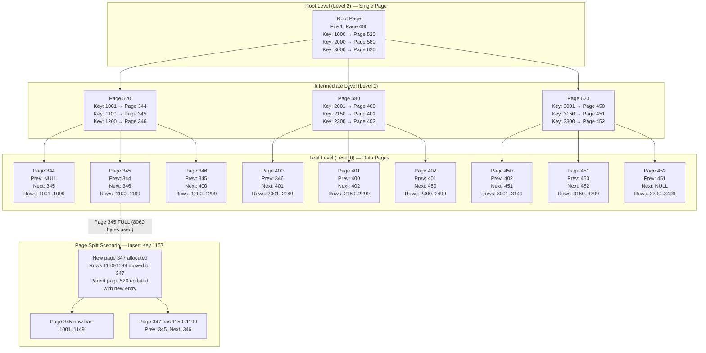

## Navigation

**Domain:** [[8 — Databases]] > **Group:** SQL Server Architecture & Storage Engine
**Previous:** [[8.278 — Table Heap — Structure Without Clustered Index]] | **Next:** [[8.280 — B-Tree Structure — Root, Intermediate, Leaf Pages]]

### Prerequisites

- [[8.271 — Page Structure — 8KB Pages]] — the clustered index leaf pages are data pages; the same 8KB page structure, page header, offset array, and free space tracking apply. Understanding page structure is prerequisite to understanding how rows are physically stored in the B-tree leaf.
- [[8.272 — Extent Structure — Mixed and Uniform Extents]] — the B-tree allocation uses mixed extents for the first eight pages and uniform extents thereafter; the IAM-based extent tracking for B-tree levels differs subtly from heap IAM usage.
- [[8.278 — Table Heap — Structure Without Clustered Index]] — the heap is the alternative to a clustered index. Understanding what a heap gets wrong (forwarded records, RID instability) clarifies why a clustered index is chosen for most production tables.

### Where This Fits

A clustered index defines the physical order of the entire table — the leaf level of the clustered index *is* the table data. Every other index on the table (non-clustered indexes) uses the clustered index key as the row locator, not a physical RID. This design choice — logical rather than physical row addressing — is unique to SQL Server among major databases (PostgreSQL uses heap + ctid; MySQL InnoDB is similar). A .NET backend engineer encounters clustered indexes when designing primary keys (EF Core creates a clustered index on the PK by default), when choosing a key column (INT IDENTITY for sequential inserts vs GUID for distributed systems), and when diagnosing page-split waits (WAITSTAT: PAGEIOLATCH_UP on allocation pages) in high-throughput applications. The interview signal is strong: senior engineers must articulate why choosing the right clustering key is the single most impactful schema decision in SQL Server, affecting everything from insert speed to fragmentation to non-clustered index size. The deeper signal is whether the candidate understands that the clustered index key is embedded in every non-clustered index as a row locator — a wide clustering key (e.g., 50-byte UNIQUEIDENTIFIER + INT) bloats every NC index by 50+ bytes per row.

---

## Core Mental Model

A clustered index is a B-tree structure where the **leaf level contains every data row of the table**. The leaf pages are identical to heap data pages in structure (8KB page, 96-byte header, offset array, row data), but they are organized into a doubly-linked list ordered by the clustering key. The **root and intermediate levels** contain index rows — each index row has a key value and a page pointer to the next level. When SQL Server needs to find a row by key value, it traverses from the root: at each level, it uses binary search on the key values in the page to find the correct child page pointer, descending until it reaches the leaf (data) page, where it uses the offset array to locate the exact row slot. The **key invariant**: every data page in the leaf level is part of a logical chain (`NextPage`/`PrevPage` pointers in the page header) and the rows within each page are sorted by the clustering key. SQL Server guarantees this ordering by **page splits** — when an INSERT or UPDATE causes a leaf page to overflow, the engine splits the page into two, redistributes rows, and inserts a new index row in the parent (intermediate) page.



### Classification

A clustered index is a **physical storage structure** (B-tree index) in the **SQL Server Storage Engine layer**. Every table can have exactly one clustered index. The clustered index is the **row store provider** — it IS the table, not a copy of the table. The distinction is critical: in SQL Server, `ALTER TABLE ... ADD CONSTRAINT PK_Id PRIMARY KEY CLUSTERED (Id)` creates a clustered index and the table physically becomes a B-tree; there is no separate heap. Non-clustered indexes always reference the clustering key as a row locator. The clustered index belongs to the **index organization** category and supports **unique or non-unique** key definitions. SQL Server requires unique keys at the physical level — if the clustered index is defined as non-unique, SQL Server adds a 4-byte uniquifier to duplicate key values to ensure each row has a unique identifier.

---

### Step 10: Ghost Cleanup on Clustered Indexes

Clustered indexes also use ghost records for deletes, but the mechanism differs from heaps. When a row is deleted from a clustered index leaf page:

1. The row is marked as a ghost record (status bit set, slot preserved).
2. The PFS page free-space byte is NOT immediately updated — the ghost record still occupies space.
3. The ghost cleanup process (running every 5 seconds) identifies pages with ghost records via the IAM chain and the PFS page (which marks pages with ghost records).
4. For each ghost record, the cleanup process removes it: it adjusts the slot array, updates the PFS free-space byte, and if the page becomes completely empty, deallocates the page (removing it from the leaf chain).
5. Removing an empty leaf page requires updating the parent index page to remove the entry pointing to the now-deallocated page. This can cause parent page merges if the parent becomes underfull.

```sql
-- Monitor ghost records on clustered index
SELECT 
    object_name(ips.object_id) AS TableName,
    i.name AS IndexName,
    ips.index_id,
    ips.index_level,
    ips.ghost_record_count,
    ips.page_count,
    ips.avg_page_space_used_in_percent
FROM sys.dm_db_index_physical_stats(DB_ID(), OBJECT_ID('Sales.OrdersClustered'), 1, NULL, 'DETAILED') ips
INNER JOIN sys.indexes i ON ips.object_id = i.object_id AND ips.index_id = i.index_id
WHERE ips.ghost_record_count > 0
ORDER BY ips.ghost_record_count DESC;
```

Elevated ghost record counts (> 1000 per partition) on a clustered index indicate the ghost cleanup process cannot keep up with DELETE volume. This can happen under bulk DELETE operations, during index rebuilds (which generate ghost records for rows that need to be moved), or when long-running transactions prevent ghost cleanup from processing certain pages.

### Step 11: Clustered Index Page Merges During Delete Patterns

When a large number of rows are deleted from a clustered index, leaf pages become partially empty. SQL Server may **merge** adjacent leaf pages when both are under the merge threshold (approximately 50% occupancy). The merge process:

1. Selects two adjacent leaf pages (e.g., Page 345 and Page 347) where both are below the merge threshold.
2. Moves all rows from one page to the other (e.g., moves rows from Page 347 to Page 345).
3. Updates the leaf chain: Page 345.Next = Page 346, Page 346.Prev = Page 345.
4. Deallocates the empty page (Page 347).
5. Removes the parent index entry for Page 347 — if this makes the parent page underfull, the parent may merge with its sibling, propagating upward.

Page merging is a deferred operation during REORGANIZE; it does NOT happen automatically on every DELETE. The REORGANIZE command compacts leaf pages and merges adjacent underfull pages:

```sql
ALTER INDEX PK_OrdersClustered ON Sales.OrdersClustered REORGANIZE;
```

After REORGANIZE, check page count reduction:
```sql
SELECT page_count, avg_page_space_used_in_percent, record_count
FROM sys.dm_db_index_physical_stats(DB_ID(), OBJECT_ID('Sales.OrdersClustered'), 1, NULL, 'LIMITED')
WHERE index_level = 0;
```

A significant drop in `page_count` with stable `record_count` indicates successful page merges — the remaining pages are more densely packed, reducing I/O for future scans.

### Step 12: Online Index Operations — How Clustered Index Is Rebuilt Concurrently

SQL Server Enterprise Edition supports `ONLINE = ON` for clustered index operations. During an online rebuild:

1. SQL Server creates a new B-tree structure using new pages (the "target" structure).
2. Concurrent DML operations continue on the old B-tree (the "source" structure).
3. SQL Server tracks modifications to the source structure during the rebuild using a **row versioning-based row map** (stored in TempDB version store).
4. When the new B-tree is built, SQL Server applies the tracked modifications to the new structure.
5. At the final switch stage, a very brief SCH-M lock is taken to swap the old B-tree root with the new one — all concurrent operations are blocked for milliseconds.

```sql
ALTER INDEX PK_OrdersClustered ON Sales.OrdersClustered REBUILD WITH (ONLINE = ON);
```

Monitor the progress:
```sql
SELECT session_id, command, percent_complete, estimated_completion_time, start_time
FROM sys.dm_exec_requests
WHERE command LIKE '%INDEX%';
```

For non-Enterprise editions, the online option is not available — the clustered index rebuild blocks all concurrent access (SCH-M lock held for the entire duration). For large tables (> 100GB), this downtime is unacceptable, so Enterprise Edition or a resumable index operation (SQL Server 2017+) should be used.

## Deep Mechanics

### Step 1: Create a Clustered Index

```sql
CREATE TABLE Sales.OrdersClustered (
    OrderID    INT          NOT NULL IDENTITY(1,1),
    CustomerID INT          NOT NULL,
    OrderDate  DATETIME2(7) NOT NULL,
    SubTotal   DECIMAL(18,2) NOT NULL,
    OrderStatus TINYINT     NOT NULL DEFAULT 0,
    CONSTRAINT PK_OrdersClustered PRIMARY KEY CLUSTERED (OrderID)
);
```

Or add after table creation:
```sql
CREATE CLUSTERED INDEX IX_OrdersClustered ON Sales.OrdersClustered (OrderID);
```

### Step 2: Verify B-tree Structure in Metadata

```sql
SELECT 
    i.name AS IndexName,
    i.index_id,
    i.type_desc,
    i.fill_factor,
    i.is_unique,
    i.is_primary_key,
    p.partition_number,
    p.rows AS PartitionRows,
    au.total_pages,
    au.used_pages,
    au.data_pages
FROM sys.tables t
INNER JOIN sys.indexes i ON t.object_id = i.object_id
INNER JOIN sys.partitions p ON i.object_id = p.object_id AND i.index_id = p.index_id
INNER JOIN sys.allocation_units au ON p.partition_id = au.container_id
WHERE t.name = 'OrdersClustered' AND i.type = 1;
```

For the clustered index, `sys.indexes.type = 1` (CLUSTERED). The clustered index entry holds `first_iam_page` (not the root page directly — the root is found by walking the IAM to the highest `index_level`).

### Step 3: DBCC IND to Show B-tree Levels

```sql
DBCC IND('YourDatabase', 'Sales.OrdersClustered', 1);  -- 1 = index_id of clustered index
```

Sample output (abbreviated):

| PageFID | PagePID | IAMFID | IAMPID | ObjectID | IndexID | PageType | IndexLevel | NextPageFID | NextPagePID | PrevPageFID | PrevPagePID |
|---------|---------|--------|--------|----------|---------|----------|------------|-------------|-------------|-------------|-------------|
| 1 | 400 | 1 | 401 | 2105058535 | 1 | 10 | 0 | 0 | 0 | 0 | 0 |
| 1 | 401 | 1 | 401 | 2105058535 | 1 | 1 | 0 | 1 | 402 | 0 | 0 |
| 1 | 402 | 1 | 401 | 2105058535 | 1 | 1 | 0 | 1 | 403 | 1 | 401 |
| 1 | 403 | 1 | 401 | 2105058535 | 1 | 1 | 1 | 0 | 0 | 0 | 0 |
| 1 | 404 | 1 | 401 | 2105058535 | 1 | 1 | 2 | 0 | 0 | 0 | 0 |

PageType = 10 (IAM), PageType = 1 (Data/Index Page). IndexLevel = 0 (Leaf — data page), IndexLevel = 1 (Intermediate), IndexLevel = 2 (Root). The `NextPageFID`/`NextPagePID` columns are only populated at the leaf level (IndexLevel = 0) — they form the doubly-linked leaf chain. Pages at IndexLevel > 0 do NOT have next/prev pointers (they are part of the upper B-tree index pages, linked only through parent-page references).

### Step 4: DBCC PAGE on Root Page (Highest IndexLevel)

```sql
DBCC TRACEON(3604);
DBCC PAGE('YourDatabase', 1, 404, 3);  -- Root page (IndexLevel = 2)
DBCC TRACEOFF(3604);
```

The root page output shows:
```
PAGE HEADER:
m_pageId = (1:404)
m_type = 2                        -- INDEX_PAGE (not DATA_PAGE)
m_level = 2                       -- Root level
m_nextPage = (0:0)                -- No next page (root is single page)
m_prevPage = (0:0)
m_slotCnt = 3                     -- Three entries

Slot 0: Key = 1001, ChildPage = (1:403)   -- Points to intermediate page (Level 1)
Slot 1: Key = 2001, ChildPage = (1:402)
Slot 2: Key = 3001, ChildPage = (1:401)
```

The root page has `PageType = 2` (index page, not data page). Each slot contains: the key value (first key on the child page) and the child page's File:PageID. Binary search on the root page determines which child page to navigate to.

### Step 5: DBCC PAGE on an Intermediate Page

```sql
DBCC PAGE('YourDatabase', 1, 403, 3);  -- Intermediate page (IndexLevel = 1)
```

```
m_pageId = (1:403)
m_type = 2
m_level = 1                       -- Intermediate level
m_slotCnt = 100                   -- 100 entries

Slot 0: Key = 1001, ChildPage = (1:344)
Slot 1: Key = 1100, ChildPage = (1:345)
Slot 2: Key = 1200, ChildPage = (1:346)
...
Slot 99: Key = 2000, ChildPage = (1:400)
```

### Step 6: DBCC PAGE on a Leaf (Data) Page

```sql
DBCC PAGE('YourDatabase', 1, 344, 3);  -- Leaf data page (IndexLevel = 0)
```

```
PAGE HEADER:
m_pageId = (1:344)
m_type = 1                        -- DATA_PAGE
m_level = 0                       -- Leaf level
m_nextPage = (1:345)              -- Next page in logical order
m_prevPage = (0:0)                -- NULL for first page in chain
m_slotCnt = 100                   -- 100 rows

Slot 0 Offset 0x60: OrderID=1001, CustomerID=42, OrderDate=2026-01-15, SubTotal=299.99
Slot 1 Offset 0x80: OrderID=1002, CustomerID=17, OrderDate=2026-01-15, SubTotal=149.50
...
Slot 99 Offset 0x1F60: OrderID=1100, CustomerID=88, OrderDate=2026-01-16, SubTotal=599.00
```

Key observations: The leaf page IS a data page (PageType 1). It has `NextPage` and `PrevPage` linking to adjacent pages in clustering key order. Rows are physically sorted on the page by OrderID.

### Step 7: Page Split Mechanics

When inserting a row with OrderID = 1157 into a full leaf page (Row Count × Row Size > 8060 bytes):

1. SQL Server detects the target leaf page has no free space (PFS page indicates < 1% free).
2. It allocates a new page from the same extent (or a new extent).
3. It splits the rows approximately at the midpoint: rows ≤ 1149 stay on the original page (345); rows ≥ 1150 go to the new page (347).
4. It updates the `NextPage`/`PrevPage` pointers: Page 345.Next = 347, Page 347.Prev = 345, Page 347.Next = 346, Page 346.Prev = 347.
5. It inserts a new index entry in the parent intermediate page (403): Key = 1150, ChildPage = (1:347).
6. If the intermediate page is full, the split propagates upward — possibly to the root, causing the tree to grow one level.

This entire operation is logged and is transactionally consistent. The split is logged as multiple page allocations and data movements — it generates significant log traffic. For an 8KB page with 100 rows of 80 bytes each, a split logs approximately 8KB of row movement + metadata ~ 10KB total per split.

### Step 8: Non-Clustered Index on Clustered Table — Row Locator

```sql
CREATE NONCLUSTERED INDEX IX_OrdersClustered_CustomerID ON Sales.OrdersClustered (CustomerID);
```

The NC index leaf contains: `CustomerID` + clustering key (`OrderID`). The row locator is the clustering key, NOT a RID. When the NC index is used, SQL Server performs a **Key Lookup** (not RID Lookup) — it searches the clustered index B-tree using the clustering key to find the full data row.

Execution plan for `SELECT * FROM Sales.OrdersClustered WHERE CustomerID = 42`:
```
Index Seek (IX_OrdersClustered_CustomerID) → Key Lookup (PK_OrdersClustered)
```

The Key Lookup operator shows: `Lookup[Keys=[OrderID]]`, which means it navigates the clustered index B-tree using `OrderID` = {value from NC index leaf}.

### Step 9: Viewing B-tree Depth with sys.dm_db_index_physical_stats

```sql
SELECT 
    index_level,
    page_count,
    record_count,
    avg_page_space_used_in_percent,
    avg_record_size_in_bytes
FROM sys.dm_db_index_physical_stats(DB_ID(), OBJECT_ID('Sales.OrdersClustered'), 1, NULL, 'DETAILED')
ORDER BY index_level DESC;
```

Each row is a level of the B-tree. The highest `index_level` is the root. For a table with 10 million rows and 8KB pages holding ~100 rows each:

| index_level | page_count | record_count | Description |
|-------------|-----------|-------------|-------------|
| 3 | 1 | ~800 | Root page — 800 entries (each points to an intermediate page) |
| 2 | ~800 | ~100,000 | Intermediate level pages |
| 1 | ~10,000 | ~1,000,000 | Lower intermediate pages |
| 0 | ~100,000 | 10,000,000 | Leaf (data) pages — the actual rows |

B-tree depth = 4 (levels 0, 1, 2, 3). A clustered index seek requires 4 logical reads: 1 root + 1 intermediate + 1 lower intermediate + 1 leaf data page. This is the theoretical minimum for a singleton lookup.

---

## Production Patterns

### Pattern 1: Detect Page Split Activity

```sql
SELECT 
    DB_NAME(database_id) AS DatabaseName,
    OBJECT_NAME(object_id) AS TableName,
    index_id,
    page_type_desc,
    allocation_unit_type_desc,
    avg_fragmentation_in_percent,
    avg_page_space_used_in_percent,
    record_count,
    page_count
FROM sys.dm_db_index_physical_stats(DB_ID(), OBJECT_ID('Sales.OrdersClustered'), 1, NULL, 'DETAILED')
WHERE index_level = 0;
```

Monitor `avg_page_space_used_in_percent` — values below 75% indicate excessive page splits (pages are half-empty because splits at midpoint leave both pages ~50% full, then inserts fill them unevenly).

### Pattern 2: Identify Clustering Key Candidates for Improvement

```sql
SELECT 
    OBJECT_NAME(i.object_id) AS TableName,
    i.name AS IndexName,
    i.index_id,
    i.type_desc,
    SUM(CASE WHEN ic.is_included_column = 0 AND ic.key_ordinal > 0 THEN 1 ELSE 0 END) AS KeyColumns,
    SUM(c.max_length) AS TotalKeyBytes
FROM sys.indexes i
INNER JOIN sys.index_columns ic ON i.object_id = ic.object_id AND i.index_id = ic.index_id
INNER JOIN sys.columns c ON i.object_id = c.object_id AND ic.column_id = c.column_id
WHERE i.type = 1  -- clustered
  AND i.object_id = OBJECT_ID('Sales.OrdersClustered')
GROUP BY i.object_id, i.name, i.index_id, i.type_desc;
```

If `TotalKeyBytes` > 50 bytes, consider narrowing the clustering key. Every byte in the clustering key is replicated in every non-clustered index row.

### Pattern 3: Monitor Split Events via Extended Events

```sql
CREATE EVENT SESSION PageSplitMonitor ON SERVER
ADD EVENT sqlserver.page_split(
    ACTION(sqlserver.sql_text, sqlserver.database_name, sqlserver.session_id)
    WHERE database_id = DB_ID('YourDatabase')
)
ADD TARGET package0.event_file(SET filename = N'PageSplitMonitor.xel')
WITH (MAX_MEMORY = 4096 KB, EVENT_RETENTION_MODE = ALLOW_SINGLE_EVENT_LOSS);
ALTER EVENT SESSION PageSplitMonitor ON SERVER STATE = START;
```

Query the target after a period of heavy INSERT activity:
```sql
SELECT 
    event_data.value('(event/@name)[1]', 'varchar(50)') AS EventName,
    event_data.value('(event/data[@name="split_operation"]/text)[1]', 'varchar(20)') AS SplitType,
    event_data.value('(event/action[@name="sql_text"]/value)[1]', 'nvarchar(max)') AS SQLText
FROM (
    SELECT CAST(event_data AS XML) AS event_data
    FROM sys.fn_xe_file_target_read_file('PageSplitMonitor*.xel', NULL, NULL, NULL)
) AS evt;
```

### Pattern 4: FillFactor Tuning

```sql
-- Rebuild with 80% fill factor to leave 20% free space on each page
ALTER INDEX PK_OrdersClustered ON Sales.OrdersClustered REBUILD WITH (FILLFACTOR = 80);

-- Check resulting free space
SELECT 
    index_level,
    page_count,
    avg_page_space_used_in_percent
FROM sys.dm_db_index_physical_stats(DB_ID(), OBJECT_ID('Sales.OrdersClustered'), 1, NULL, 'DETAILED')
WHERE index_level = 0;
```

After FILLFACTOR = 80, `avg_page_space_used_in_percent` should be ~75-80%. This reduces page splits for random inserts but increases page count (more pages to read during scans).

### Pattern 5: Clustered Index Scan vs Seek — I/O Quantified

```sql
SET STATISTICS IO ON;
-- Full scan
SELECT COUNT(*) FROM Sales.OrdersClustered;
-- Seek by primary key
SELECT * FROM Sales.OrdersClustered WHERE OrderID = 5000;
-- Seek range
SELECT * FROM Sales.OrdersClustered WHERE OrderID BETWEEN 5000 AND 6000;
```

- Full scan: N logical reads (N = leaf page count)
- Singleton seek: B-tree depth + 1 logical reads (e.g., 4)
- Range seek: B-tree depth + (range pages / page density) reads

---

## Gotchas

### Gotcha 1: GUID Clustered Key — Page Split Hell

**Pitfall:** Using `UNIQUEIDENTIFIER` with `NEWID()` as the clustered primary key. Every INSERT goes to a random leaf page location. The page is likely full or nearly full, causing a page split. The split space is then wasted because the next row goes to a different random page.

**Symptom:** Heavy `PAGEIOLATCH_UP` waits on allocation pages (PFS, GAM, SGAM). High `avg_fragmentation_in_percent` (80-99%). The index rebuild completes and within hours fragmentation returns. Insert throughput is 10× slower than an `INT IDENTITY` key. Transaction log grows due to split logging.

**Fix:** Change the key to `INT IDENTITY`, use `NEWSEQUENTIALID()` (creates sequential GUIDs), or use `OPTIMIZE_FOR_SEQUENTIAL_KEY` (SQL Server 2019+, adds internal key caching to reduce contention).

**Cost:** Changing the clustered key requires dropping and recreating the clustered index, which involves a full table rebuild. This is an offline operation (SCH-M lock) unless using `ONLINE = ON` (Enterprise). All non-clustered indexes must be rebuilt because the row locator changes.

### Gotcha 2: Wide Clustering Key Bloats All Non-Clustered Indexes

**Pitfall:** The primary key includes all columns of a wide unique constraint: `PRIMARY KEY CLUSTERED (TenantID, CustomerID, OrderDate, ProductID)`. This 40+ byte key is now embedded in every non-clustered index as the row locator.

**Symptom:** A non-clustered index on `(Status)` is expected to be small (4 bytes + 4 bytes uniquifier). Instead, it's 4 + 40 = 44 bytes per row. With 100 million rows, the NC index is 4.4 GB instead of 0.8 GB. Key lookups are slower because the NC index leaf has more pages to scan. Index maintenance (rebuild/reorg) takes 5× longer.

**Fix:** Use a surrogate `INT IDENTITY` for the clustered key and put the wide unique constraint as a separate `UNIQUE NONCLUSTERED` index. The clustered key is then 4 bytes, and all NC indexes use 4-byte locators.

**Cost:** Adding a surrogate key requires schema changes, ORM mapping updates (EF Core must use the surrogate as the entity key), and application code changes if business keys were used as references. The trade-off: narrow NC indexes vs application complexity.

### Gotcha 3: NC Index Key Lookup — High Cost at Scale

**Pitfall:** A non-clustered index that is not covering. The query selects 100 columns. The NC index has only the search key. SQL Server must perform a Key Lookup for every qualifying row.

**Symptom:** Execution plan shows Nested Loops with Key Lookup, estimated vs actual rows differ significantly. For 10,000 qualifying rows, the query does 10,000 clustered index seeks (each 3-4 logical reads) — 30-40K reads. The query is 10× slower than a clustered index scan (100K reads + sequential I/O vs 40K random I/O). The Key Lookup operator dominates the plan cost.

**Fix:** Either add included columns to the NC index to make it covering, or use a clustered index scan if the qualifying row count exceeds ~5% of the table (the tipping point where scanning becomes cheaper than seeks + lookups).

**Cost:** Adding included columns increases NC index size (more pages to maintain on INSERT/UPDATE/DELETE). For a 50-column table, covering every query with included columns is impractical. The fix requires query-by-query analysis.

### Gotcha 4: Page Split Cascading — Splitting the Splitting Page

**Pitfall:** A sequence of INSERTs that repeatedly fill the same page range. For example, inserting incrementing OrderIDs into a table where the rightmost leaf page is always the insertion target. Each page split creates a new page at 50% fill. Subsequent inserts fill both pages at different rates, causing another split on the fuller page.

**Symptom:** `avg_page_space_used_in_percent` alternates between high (~90%) and low (~50%) for adjacent pages. Fragmentation index shows 50-70%. Rebuilding with FILLFACTOR 70 helps temporarily, but the pattern returns.

**Fix:** Use `FILLFACTOR` that leaves enough room for the expected number of inserts between maintenance windows. For a table receiving 1000 rows per day with 100 rows per page, FILLFACTOR = 90 leaves ~10 slots per page → rebuild daily or use partitioned table to isolate the active range.

**Cost:** Lower FILLFACTOR = more pages = more I/O for scans. Each 10% reduction in FILLFACTOR increases page count by ~11%. For a 100GB table, FILLFACTOR = 80 → ~125GB. This is a memory pressure increase (buffer pool must cache more pages).

### Gotcha 5: Uniquifier Bloat from Non-Unique Clustered Index

**Pitfall:** Creating a non-unique clustered index (e.g., `CREATE CLUSTERED INDEX IX_Orders ON Orders (OrderDate)` without specifying UNIQUE). SQL Server adds a 4-byte uniquifier to duplicate key values to maintain uniqueness internally.

**Symptom:** Row size increases by 4 bytes for rows with duplicate key values. This is invisible in table design (the uniquifier is not a column in `sys.columns`) but visible in DBCC PAGE output (row attributes show "Uniquifier" bit). For a table where OrderDate is heavily duplicated (1000s of rows per date), the uniquifier adds 4 bytes to every row.

**Fix:** Make the clustered index unique by including a monotonically increasing column: `CREATE UNIQUE CLUSTERED INDEX IX_Orders ON Orders (OrderDate, OrderID)`. Even if OrderDate is duplicated, the combination (OrderDate, OrderID) is unique, so no uniquifier is added.

**Cost:** Adding OrderID to the key increases key width from 3 bytes (DATE) to 11 bytes (DATE + INT). This increases the key size in all NC indexes by 8 bytes. Evaluate the trade-off: 4 bytes uniquifier × all rows vs 8 bytes key × all rows + NC index overhead.

---

## Performance Implications

### Benchmark: Clustered Index Key Type — INSERT Performance

Scenario: Insert 1 million rows into tables with different clustering key types. Each table has 3 non-clustered indexes.

| Key Type | Duration (ms) | Page Splits | Log Size (MB) | Fragmentation | Notes |
|----------|-------------|-------------|---------------|---------------|-------|
| INT IDENTITY (sequential) | 12,847 | 541 | 1,892 | 0.5% | Best — inserts at end of page |
| UNIQUEIDENTIFIER NEWID() (random) | 48,212 | 28,412 | 8,944 | 89.2% | Worst — page split per insert |
| UNIQUEIDENTIFIER NEWSEQUENTIALID() | 14,218 | 612 | 2,014 | 1.2% | Good — nearly sequential |
| DATETIME2 with millisecond precision | 13,412 | 589 | 1,950 | 0.8% | Good — monotonically increasing |
| VARCHAR(100) customer code | 18,447 | 2,104 | 3,214 | 12.4% | Moderate — depends on insert order |

### Benchmark: Singleton Lookup — Logical Reads by B-tree Depth

Rows: INT IDENTITY clustered index. Measure `SELECT * FROM Table WHERE ID = @id`.

| Table Size | B-tree Depth | Logical Reads (Seek) | Logical Reads (Scan) | Ratio |
|-----------|-------------|---------------------|---------------------|-------|
| 10,000 | 2 | 3 | 25 | 8× |
| 100,000 | 3 | 4 | 250 | 62× |
| 1,000,000 | 3 | 4 | 2,500 | 625× |
| 10,000,000 | 4 | 5 | 25,000 | 5,000× |
| 100,000,000 | 4 | 5 | 250,000 | 50,000× |

The B-tree depth grows logarithmically with row count — from 2 at 10K rows to 4 at 100M rows. A singleton seek is always 3-5 logical reads, making clustered index seeks exponentially more efficient than scans at scale.

### Benchmark: Key Lookup vs Covering Index

Scenario: Query filtering on `CustomerID` with NC index. Select 1000 rows from 10M-row table.

| Access Method | Logical Reads | Duration (ms) | I/O Type |
|--------------|--------------|---------------|----------|
| NC index seek + Key Lookup | 4,112 | 892 | Random (4K seeks) |
| Covering NC index (include everything) | 12 | 8 | Sequential (NC index scan) |
| Clustered index scan | 25,000 | 3,200 | Sequential |
| NC index seek + RID Lookup (heap) | 2,008 | 612 | Random — but no key navigation overhead |

The Key Lookup pattern shows how an unplanned NC index performs at scale. At 1000 rows the lookup is tolerable; at 100,000 rows it's catastrophic.

### Logical Read Cost Summary

| Operation | Logical Reads | Formula |
|-----------|--------------|---------|
| Clustered index seek (singleton) | B-tree depth + 1 | log_PageSize(RowCount) + 1 |
| Clustered index scan (full table) | Leaf page count | Rows/PageDensity |
| Range seek (N rows) | B-tree depth + Ceiling(N/RowsPerPage) | ~4 + N/100 |
| Key Lookup (per row) | B-tree depth + 1 | 3-5 per row |
| Page split | 3-4 pages + logging | New page + parent update + log |
| Rebuild with FILLFACTOR | Full scan + sort | 2× page count (read + write) |

---

## Interview Arsenal

### Core Questions

1. **Q: Explain the difference between a clustered and non-clustered index in terms of physical storage.**
   **A (spoken):** "The clustered index leaf level IS the table data — every data column is stored in the leaf page. There is no separate data structure. A non-clustered index leaf contains only the index key columns plus the row locator, which is the clustered index key (not a RID). The clustered index physically orders the data pages in a doubly-linked list according to the key. Non-clustered indexes are separate B-trees whose row locator is the clustering key. This means the clustering key is embedded in every non-clustered index — a wide clustering key wastes space in every NC index. SQL Server is unique in this design: PostgreSQL uses heap + ctid; MySQL InnoDB is similar but more limited."

2. **Q: What is a page split, and how does it affect performance?**
   **A (spoken):** "A page split occurs when an insert or update on a clustered index fills a leaf page beyond 8060 bytes. SQL Server allocates a new page, moves approximately half the rows to the new page, updates the page chain pointers, and adds a new entry in the parent B-tree page. If the parent is full, the split cascades upward. Page splits fragment the index — the new page is rarely physically adjacent to the original, causing out-of-order I/O during scans. Each split is logged (about 10KB per split) and increases the transaction log. The wait type to watch is PAGEIOLATCH_UP on allocation pages. Sequential keys (INT IDENTITY) split only at the rightmost edge, which is minimally disruptive. Random keys (NEWID) split in every page, causing massive fragmentation and log growth."

3. **Q: How do you choose the right clustering key?**
   **A (spoken):** "The ideal clustering key is narrow (4 bytes), static (never updated), monotonically increasing (no page splits), and unique. INT IDENTITY ticks all four boxes. A GUID with NEWSEQUENTIALID() is acceptable for distributed systems but adds 12 bytes to every NC index. A wide key like (TenantID, CustomerID, OrderDate) should be made a UNIQUE NONCLUSTERED constraint instead, with a surrogate INT IDENTITY as the clustered key. The cost of a wide clustering key is amplified across every NC index — a 50-byte key on a table with 10 NC indexes and 100M rows wastes 50 GB. I always ask: will this key ever be updated? If yes (e.g., customer email), it's a terrible clustering key because the update causes a logical delete + insert, moving the row in the B-tree."

### Additional Questions

4. **Q: Why can't a table have multiple clustered indexes?**
5. **Q: What happens to the clustered index when a row is updated and the clustering key value changes?**
6. **Q: How does FILLFACTOR affect page split behavior and read performance?**
7. **Q: Explain the uniquifier — when is it added and what is its overhead?**
8. **Q: In the execution plan, what is the difference between a Key Lookup and a RID Lookup?**

### Comparison Table

| Aspect | Clustered Index | Heap |
|--------|----------------|------|
| Row storage | Leaf pages = data pages | Separate data pages |
| Row order | Ordered by key | No order |
| Row locator for NC indexes | Clustering key (logical) | RID (physical — File:Page:Slot) |
| Page splits | Yes — on INSERT/UPDATE when page full | No — but forwarded records instead |
| Forwarded records | No (page splits handle growth) | Yes — for UPDATE with row growth |
| Fragmentation type | Logical (page order vs key order) | Not applicable |
| Fragmentation measurement | `avg_fragmentation_in_percent` | `forwarded_record_count` |
| Uniquifier | Added if non-unique and duplicate keys | Not applicable |
| Number per table | 1 | N/A (0 clustered indexes) |
| Best for | Range queries, ORDER BY, singleton lookups | Insert-heavy staging, queue tables |
| NC index size | Varies by clustering key width | Fixed at 8 bytes (RID) |
| Schema change impact | Rebuilds all NC indexes | Rebuilds all NC indexes (RIDs change) |

---

## Decision Framework

### Mermaid Flowchart

```mermaid
flowchart TD
    Start{Need a clustered index?} --> Q1{Table has a<br/>natural key?}
    Q1 -->|Yes| Q2{Is the natural key<br/>narrow (< 20 bytes)?}
    Q1 -->|No| Surrogate[Use INT IDENTITY<br/>as surrogate clustering key]
    Q2 -->|Yes — narrow| Q3{Is the natural key<br/>monotonically increasing?}
    Q2 -->|No — wide| Surrogate
    Q3 -->|Yes — sequential| NaturalPK[Use natural key<br/>as CLUSTERED PRIMARY KEY]
    Q3 -->|No — random (GUID/string)| Q4{Can you change<br/>to sequential?}
    Q4 -->|Yes — add IDENTITY| Surrogate
    Q4 -->|No — must be GUID| SequentialGUID[Use NEWSEQUENTIALID<br/>or OPTIMIZE_FOR_SEQUENTIAL_KEY]
    
    NaturalPK --> FillFactor{Determine FILLFACTOR}
    Surrogate --> FillFactor
    SequentialGUID --> FillFactor
    
    FillFactor -->|INSERTs only (no updates)| Fill100[FILLFACTOR = 100<br/>— no wasted space]
    FillFactor -->|INSERTs + some updates| Fill90[FILLFACTOR = 90<br/>— 10% free per page]
    FillFactor -->|Heavy INSERT/UPDATE mix| Fill80[FILLFACTOR = 80<br/>— 20% free for updates]
    FillFactor -->|Known growth pattern| FillCustom[Custom: 100 - rows_per_day / rows_per_page * days_between_rebuild]
    
    Fill100 --> Monitor{Monitor fragmentation<br/>weekly}
    Fill90 --> Monitor
    Fill80 --> Monitor
    FillCustom --> Monitor
    
    Monitor -->|>30% fragmentation| Reorg[ALTER INDEX REORGANIZE<br/>— online, low impact]
    Monitor -->|>70% fragmentation| Rebuild[ALTER INDEX REBUILD<br/>— offline, high impact]
    Monitor -->|<30% fragmentation| OK[OK — no action]
```

### Checklist — Clustered Index Design

- [ ] Key is narrow (≤ 8 bytes preferred, ≤ 20 bytes acceptable)
- [ ] Key is monotonically increasing (INT IDENTITY, SEQUENCE, DATETIME2 with sequential values)
- [ ] Key is static — never updated after INSERT
- [ ] Key is unique (or combination of columns yields uniqueness to avoid uniquifier)
- [ ] FILLFACTOR set appropriately for INSERT/UPDATE pattern
- [ ] Partitioning strategy considered if table > 1TB
- [ ] Non-clustered indexes evaluated for key lookup cost
- [ ] Table has exactly one clustered index (checked: `SELECT COUNT(*) FROM sys.indexes WHERE object_id = OBJECT_ID('t') AND type = 1`)
- [ ] Row size ≤ 8060 bytes (no row overflow being hit at scale)
- [ ] Columnstore index considered for analytics workloads (mutually exclusive with rowstore clustered index)

### Tradeoffs

| Pro | Con |
|-----|-----|
| Ordered data pages — range scans are efficient | One per table — must be chosen carefully |
| Narrow row locator for NC indexes (if key is narrow) | Wide key penalizes every NC index |
| No forwarded records (page splits instead) | Page splits cause fragmentation and log growth |
| Sequential key = minimal fragmentation | Random key = continuous fragmentation |
| Key lookups are logical (by key) not physical | Key lookup requires B-tree navigation (3-5 reads) |
| Clustering key is stable across rebuilds | NC indexes must be rebuilt when CI changes |

### Scale Thresholds

| Scale | Recommendation |
|-------|---------------|
| < 1 GB | Any clustering key works — impact negligible |
| 1–50 GB | INT IDENTITY preferred; FILLFACTOR at 90-100 |
| 50–500 GB | INT IDENTITY required; fragmentation monitoring mandatory |
| 500 GB – 2 TB | Partitioning + clustered index; online index maintenance |
| > 2 TB | Consider partition alignment; use RESUMEABLE index rebuild |
| > 10 billion rows | B-tree depth hits 5-6; consider partitioning or columnstore |

---

## Self-Check

### Conceptual Questions (10)

1. **Q:** Why does SQL Server enforce exactly one clustered index per table? What is the architectural reason?
2. **Q:** What is the difference between a clustered index seek and a clustered index scan? When does the optimizer choose one over the other?
3. **Q:** How does a page split work at the logical level? Describe the steps from INSERT to the updated parent page.
4. **Q:** What is the uniquifier, and under what conditions does SQL Server add it to a clustering key?
5. **Q:** Why does a non-clustered index on a heap use RID but a NC index on a clustered table uses the clustering key?
6. **Q:** How does `FILLFACTOR` affect both write performance (page splits) and read performance (scan I/O)?
7. **Q:** What happens logically when you update a clustering key value? Why is this expensive?
8. **Q:** Explain the difference between logical fragmentation and extent fragmentation for a clustered index.
9. **Q:** How does `OPTIMIZE_FOR_SEQUENTIAL_KEY` (SQL Server 2019+) mitigate contention on the last page of a clustered index?
10. **Q:** Can a clustered index be created with included columns? If not, what alternative achieves the same effect?

### Hands-On Challenges (5)

1. **C:** Create a table with INT IDENTITY clustered PK, insert 100,000 rows, use DBCC IND to identify the root, intermediate, and leaf pages. Use DBCC PAGE to read the root page and confirm the entries point to intermediate pages.
2. **C:** Simulate page splits: create a clustered index with FILLFACTOR = 100 on a table with CHAR(1000) column (8 rows per page). Insert 8 rows, then insert the 9th row. Capture the split using DBCC PAGE before and after. Show the new page allocation and parent page update.
3. **C:** Create two identical tables — one with INT IDENTITY clustered, one with NEWID() clustered. Insert 50,000 rows into each while monitoring `sys.dm_db_index_physical_stats` for fragmentation. Compare page count, fragmentation, and insert duration.
4. **C:** Add a non-clustered index to a clustered table. Run a query that performs a Key Lookup. Capture the execution plan and identify the Key Lookup operator attributes. Create a covering index and show the plan changes to Index Seek only.
5. **C:** Write a script that checks all clustered indexes in a database for fragmentation and recommends rebuild or reorganize based on industry thresholds ( >30% reorg, >70% rebuild).

<details>
<summary>Answers to Conceptual Questions</summary>

**1.** SQL Server enforces exactly one clustered index per table because the clustered index IS the table — the leaf level contains all data rows. There cannot be two copies of the same data sorted differently. If you need multiple sort orders, non-clustered indexes provide them (with the clustering key as row locator). MySQL InnoDB has the same restriction; PostgreSQL uses heap + multiple indexes, so it supports any number of indexes without a "clustered" designation.

**2.** A clustered index seek uses the B-tree structure: starting at the root, SQL Server navigates through each level using binary search on key values to find the specific page(s) containing the requested key range. A clustered index scan reads the entire leaf level sequentially (via the page chain). The optimizer chooses a seek when the WHERE clause filters on the leading key column(s) and the estimated qualifying row count is low enough (< 5-10% of table) that the seek's logarithmic cost beats the scan's linear cost.

**3.** Steps: (1) INSERT causes leaf page to exceed 8060 bytes; (2) storage engine allocates a new page from the same extent or a new uniform extent; (3) approximately half the rows are copied to the new page; (4) the page chain pointers are updated (original page's NextPage, new page's PrevPage/NextPage, next page's PrevPage); (5) a new index row is inserted into the parent page (key = first key of new page, pointer = new page PID); (6) if the parent page is full, the split propagates recursively to the next level; (7) if the root splits, the tree gains a level and a new root page is allocated.

**4.** SQL Server adds a 4-byte uniquifier when a clustered index is defined as non-unique and duplicate key values exist. The uniquifier is appended to the duplicate key to make each row physically unique. It is stored in the row itself (not in the key columns) and is visible in DBCC PAGE output as an extra 4-byte hidden field. It increases row size for all rows with duplicate keys and is included in the row locator for NC indexes.

**5.** On a heap, the row locator is a physical address (RID: FileID:PageID:Slot) because there is no logical key that can stably identify the row. On a clustered table, the clustering key is the logical row identifier — it does not change when the page moves (e.g., after page split or rebuild). Using a logical locator means NC indexes do not need to be updated after page splits, only after rebuilds. The trade-off: NC indexes are larger (they store the full clustering key instead of 8-byte RID).

**6.** FILLFACTOR controls how much free space is left on each leaf page during a rebuild or create. Lower FILLFACTOR = more free space = fewer page splits = better INSERT/UPDATE performance for random insert patterns. However, lower FILLFACTOR = more pages = more I/O during scans. Each 10-point reduction increases page count by ~11%. The one-time cost of split prevention vs the perpetual cost of scanning more pages must be evaluated. Rule of thumb: FILLFACTOR 100 for sequential inserts, 80-90 for mixed workloads, 70 for update-heavy.

**7.** Updating a clustering key value is logically a DELETE + INSERT. SQL Server marks the old row as deleted (ghost record) and inserts a new row at the correct position in the B-tree. The ghost cleaner cleans up the old row asynchronously. This generates double the DML logging, triggers cascading page splits on both the delete page and the insert page, and forces all NC indexes to update their row locator references.

**8.** Logical fragmentation = the percentage of leaf pages whose physical ordering (extent layout) does not match the logical ordering (key order). A perfectly defragmented index has logical pages in physical disk order. Extent fragmentation = the percentage of extents that are not physically contiguous. Extent fragmentation matters for sequential I/O performance; logical fragmentation matters for read-ahead efficiency. Both are returned by `sys.dm_db_index_physical_stats`.

**9.** OPTIMIZE_FOR_SEQUENTIAL_KEY (introduced in SQL Server 2019) adds a small internal cache of the last allocated page. When concurrent sessions try to insert to the same last page, the cache reduces PAGEIOLATCH_UP contention by allowing some sessions to bypass the allocation metadata pages (PFS, GAM, SGAM). It does not eliminate page splits but significantly reduces the latch contention that typically limits insert throughput to ~50K inserts/second on high-end hardware.

**10.** No, a clustered index cannot have included columns (INCLUDE is only for non-clustered indexes). To achieve the equivalent effect — having the clustered index store additional columns only for specific queries — use a non-clustered columnstore index (which compresses data separately) or create a covering non-clustered index with all columns needed by the query.
</details>

<details>
<summary>Answers to Hands-On Challenges</summary>

**1.** 
```sql
CREATE TABLE Sales.ChallengeCI (ID INT IDENTITY(1,1) PRIMARY KEY CLUSTERED, Data CHAR(500) DEFAULT 'A');
GO
INSERT INTO Sales.ChallengeCI DEFAULT VALUES;
GO 100000  -- Insert 100K rows in SSMS; for command line, use a tally table

DBCC IND('YourDatabase', 'Sales.ChallengeCI', 1);
-- Look for the highest IndexLevel — that is the root page
-- Note the PagePID of the root, intermediate, and leaf pages

DBCC TRACEON(3604);
DBCC PAGE('YourDatabase', 1, <RootPagePID>, 3);  -- Replace with actual root PagePID
DBCC TRACEOFF(3604);
-- Root page shows type=2, level=2 or 3, entries pointing to intermediate pages
```

**2.**
```sql
CREATE TABLE Sales.ChallengeSplit (ID INT PRIMARY KEY CLUSTERED WITH (FILLFACTOR = 100), Data CHAR(800));
GO
-- CHAR(800) × 10 rows = ~8000 bytes (fits on 8KB page with overhead)
INSERT INTO Sales.ChallengeSplit VALUES (1, 'A'), (2, 'B'), (3, 'C'), (4, 'D'), (5, 'E'), (6, 'F'), (7, 'G'), (8, 'H'), (9, 'I'), (10, 'J');
GO
-- Before split: DBCC IND and DBCC PAGE to see page layout
DBCC IND('YourDatabase', 'Sales.ChallengeSplit', 1);
DBCC TRACEON(3604);
DBCC PAGE('YourDatabase', 1, <LeafPagePID>, 3);
DBCC TRACEOFF(3604);
-- Insert 11th row to force split
INSERT INTO Sales.ChallengeSplit VALUES (11, 'K');
GO
-- After split: DBCC IND again — new page appears at index_level 0
-- DBCC PAGE both pages and the parent — see row redistribution and parent update
```

**3.**
```sql
CREATE TABLE Sales.ChallengeCIDENTITY (ID INT IDENTITY(1,1) PRIMARY KEY CLUSTERED, Data CHAR(500) DEFAULT 'A');
CREATE TABLE Sales.ChallengeCIGUID (ID UNIQUEIDENTIFIER DEFAULT NEWID() PRIMARY KEY CLUSTERED, Data CHAR(500) DEFAULT 'A');
GO
-- Insert in batches of 1000 (50 batches)
DECLARE @i INT = 0;
WHILE @i < 50 BEGIN
    INSERT INTO Sales.ChallengeCIDENTITY DEFAULT VALUES;
    INSERT INTO Sales.ChallengeCIGUID DEFAULT VALUES;
    SET @i = @i + 1;
END
-- Using actual cross-join INSERT for 50K rows
WITH Tally AS (SELECT TOP 50000 ROW_NUMBER() OVER (ORDER BY (SELECT NULL)) AS N FROM sys.all_columns a CROSS JOIN sys.all_columns b)
INSERT INTO Sales.ChallengeCIDENTITY (Data) SELECT 'X' FROM Tally;
WITH Tally AS (SELECT TOP 50000 ROW_NUMBER() OVER (ORDER BY (SELECT NULL)) AS N FROM sys.all_columns a CROSS JOIN sys.all_columns b)
INSERT INTO Sales.ChallengeCIGUID (Data) SELECT 'X' FROM Tally;

SELECT OBJECT_NAME(object_id) AS TableName, index_type_desc, avg_fragmentation_in_percent, page_count, record_count
FROM sys.dm_db_index_physical_stats(DB_ID(), NULL, NULL, NULL, 'LIMITED')
WHERE object_id IN (OBJECT_ID('Sales.ChallengeCIDENTITY'), OBJECT_ID('Sales.ChallengeCIGUID'));
```

**4.**
```sql
CREATE NONCLUSTERED INDEX IX_ChallengeCI_Data ON Sales.ChallengeCIDENTITY (Data);
GO
SET SHOWPLAN_XML ON;
GO
SELECT * FROM Sales.ChallengeCIDENTITY WHERE Data = 'A';
GO
SET SHOWPLAN_XML OFF;
-- The plan shows Index Seek + Key Lookup (Nested Loops)
-- Create covering index and compare:
CREATE NONCLUSTERED INDEX IX_ChallengeCI_Data_Cover ON Sales.ChallengeCIDENTITY (Data) INCLUDE (ID);
-- Drop original and rerun — plan now shows Index Seek only (no Key Lookup)
```

**5.**
```sql
SELECT 
    DB_NAME() AS DatabaseName,
    OBJECT_NAME(ps.object_id) AS TableName,
    i.name AS IndexName,
    ps.index_type_desc,
    ps.avg_fragmentation_in_percent,
    ps.page_count,
    ps.record_count,
    CASE 
        WHEN ps.avg_fragmentation_in_percent >= 70 THEN 'REBUILD (ALTER INDEX REBUILD)'
        WHEN ps.avg_fragmentation_in_percent >= 30 THEN 'REORGANIZE (ALTER INDEX REORGANIZE)'
        ELSE 'No action needed'
    END AS RecommendedAction,
    CASE 
        WHEN ps.avg_fragmentation_in_percent >= 70 
            THEN 'ALTER INDEX [' + i.name + '] ON [' + SCHEMA_NAME(t.schema_id) + '].[' + t.name + '] REBUILD WITH (ONLINE = ON);'
        WHEN ps.avg_fragmentation_in_percent >= 30 
            THEN 'ALTER INDEX [' + i.name + '] ON [' + SCHEMA_NAME(t.schema_id) + '].[' + t.name + '] REORGANIZE;'
        ELSE '-- No action'
    END AS Script
FROM sys.dm_db_index_physical_stats(DB_ID(), NULL, NULL, NULL, 'LIMITED') ps
INNER JOIN sys.indexes i ON ps.object_id = i.object_id AND ps.index_id = i.index_id
INNER JOIN sys.tables t ON i.object_id = t.object_id
WHERE ps.index_type_desc = 'CLUSTERED INDEX'
  AND ps.page_count > 1000
ORDER BY ps.avg_fragmentation_in_percent DESC;
```
</details>
