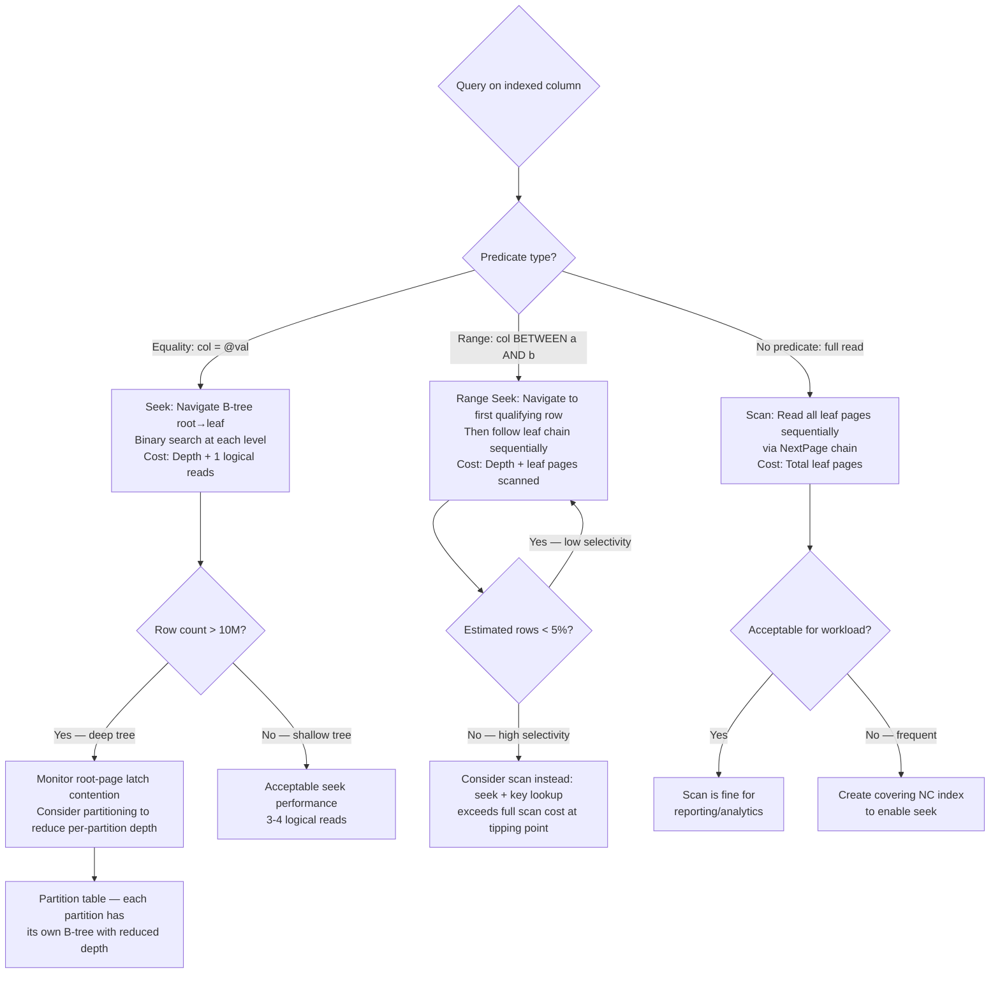

## Navigation

**Domain:** [[8 — Databases]] > **Group:** SQL Server Architecture & Storage Engine
**Previous:** [[8.279 — Clustered Index — Physical Table Organization]] | **Next:** [[8.281 — IAM Pages — Index Allocation Map]]

### Prerequisites

- [[8.271 — Page Structure — 8KB Pages]] — the B-tree is composed of 8KB index pages (PageType = 2) and leaf data pages (PageType = 1); understanding the 96-byte page header, slot array, and free space tracking is foundational to reading B-tree pages.
- [[8.272 — Extent Structure — Mixed and Uniform Extents]] — B-tree levels map to extents; the root page is typically a single page in a mixed extent; intermediate and leaf levels use uniform extents.
- [[8.279 — Clustered Index — Physical Table Organization]] — the B-tree is the backbone of the clustered index; understanding that the clustered index IS the table clarifies why the B-tree structure applies to both data organization and non-clustered index organization.

### Where This Fits

The SQL Server B-tree is a balanced tree structure where every leaf page is at the same depth from the root. This balance guarantees that the number of logical reads for any singleton lookup is bounded by the tree depth (typically 3-5 for tables up to 100M rows). A .NET backend engineer encounters B-tree structure when diagnosing why a query uses a scan instead of a seek (the optimizer estimates the B-tree depth + row count vs full scan cost), when tuning index key column order (the leftmost column determines the B-tree sort order), and when observing page-split waits (PAGEIOLATCH_UP) that indicate B-tree maintenance overhead. The interview signal is strong: candidates must explain how SQL Server navigates from root to leaf using binary search on index rows, what happens during a page split (row redistribution + parent page update), and why B-tree depth grows logarithmically with row count. The deeper signal is understanding that SQL Server's B-tree is not a classic B-tree (data-only at leaves) but a B+ tree variant where the leaf pages form a linked list for range scans.

---

## Core Mental Model

A SQL Server B-tree (technically a B+ tree) has three page type levels: **root** (single page at the top), **intermediate** (zero or more levels of index pages), and **leaf** (data pages for clustered index, key+locator pages for non-clustered). At every non-leaf level, pages contain **index rows** — each index row has a key value and a child page pointer (FileID:PageID, 6 bytes). The key values on a page represent the minimum key on each child page. Navigation from the root uses binary search: for a given search key, SQL Server examines the root page's slot array, finds the slot with the largest key ≤ search key, reads the child page pointer, and repeats at the next level until reaching the leaf. All leaf pages are at the same `IndexLevel = 0`. The leaf pages form a **doubly-linked list** via `NextPage`/`PrevPage` pointers in each page header, enabling efficient forward and backward range scans without returning to the parent level. The tree is **balanced** — the distance from root to every leaf is identical. The tree grows **upward**: when the root is full and needs to split, SQL Server allocates a new root page, increasing the tree depth by one.

```mermaid
flowchart TB
    subgraph Nav["Root-to-Leaf Navigation for Key = 2157"]
        R[Root Page — Level 3<br/>Page (1:400)<br/>Binary search on slot array] -->|"Key ≤ 2157?<br/>Slot 0: Max=1000<br/>Slot 1: Max=2000<br/>Slot 2: Max=3000<br/>→ Choose Slot 1 (child=1:520)"| I1[Intermediate Page — Level 2<br/>Page (1:520)]
        I1 -->|"Binary search:<br/>Slot 0: Max=2100<br/>Slot 1: Max=2200<br/>Slot 2: Max=2300<br/>→ Choose Slot 0 (child=1:344)"| I2[Intermediate Page — Level 1<br/>Page (1:344)]
        I2 -->|"Binary search:<br/>Slot 0: Max=2150<br/>Slot 1: Max=2200<br/>→ Choose Slot 0 (child=1:412)"| Leaf[Leaf Data Page — Level 0<br/>Page (1:412)<br/>Rows 2151..2199]
        Leaf -->|"Offset array slot 6:<br/>Row at offset 0x360<br/>ID=2157, CustomerID=42"| Row[Row Data Returned]
    end

    subgraph PageLayout["Index Page Layout (Root/Intermediate)"]
        IP[Index Page — PageType = 2<br/>96-byte header<br/>Slot array] --> Entry1[Index Row:<br/>Key = 1000<br/>ChildFile = 1, ChildPage = 344<br/>Length = 10 bytes]
        IP --> Entry2[Index Row:<br/>Key = 2000<br/>ChildFile = 1, ChildPage = 520<br/>Length = 10 bytes]
        IP --> Entry3[Index Row:<br/>Key = 3000<br/>ChildFile = 1, ChildPage = 580<br/>Length = 10 bytes]
    end

    subgraph LeafChain["Leaf Page Chain (Doubly-Linked)"]
        L1[Page 410<br/>Prev: NULL<br/>Next: 411<br/>Keys 1000-1099]
        L2[Page 411<br/>Prev: 410<br/>Next: 412<br/>Keys 1100-1199]
        L3[Page 412<br/>Prev: 411<br/>Next: 413<br/>Keys 1200-1299]
        L4[Page 413<br/>Prev: 412<br/>Next: NULL<br/>Keys 1300-1399]
    end

    subgraph RowStructure["Index Row Structure (6 bytes + key)"]
        RS[Index Row Body] --> ChildPage[4 bytes: Child Page ID]
        RS --> ChildFile[2 bytes: Child File ID]
        RS --> Key[Variable: Key Column(s)]
    end
```

### Classification

The SQL Server B-tree is a **balanced tree index structure** (technically a B+ tree variant) in the **Storage Engine layer**. Every index in SQL Server — clustered, non-clustered, unique, non-unique, filtered — uses this same B-tree structure. The B-tree is also used for **indexed views** (materialized view indexes). Columnstore indexes use a completely different structure (column segments + row groups) and are not B-trees. The B-tree is a **page-level structure** — all operations (search, insert, delete, split, merge) operate on whole pages. The SQL Server B-tree is **not a classic B-tree**: classic B-trees store data in every node (root and intermediate nodes can contain data rows), while SQL Server stores data only in leaf pages. This is the defining characteristic of a B+ tree. The leaf chain enables efficient range scans without intermediate page visits.

---

### Step 11: Optimizer Estimate — B-tree Depth Calculation

The SQL Server query optimizer estimates B-tree depth to compute the cost of an index seek operation. The cost model uses the formula:

```
IndexSeekCost = TreeDepth + 1 logical reads (for the leaf page)
```

Where TreeDepth is estimated as:
```sql
-- Optimizer's internal estimate (conceptual)
TreeDepth = CEILING(LOG(PageCount, EntriesPerPage)) + 1
-- Where EntriesPerPage for non-leaf pages ≈ 8060 / (KeySize + 6)
-- KeySize = sum of key column sizes + 2 bytes per variable-length column overhead
```

The optimizer uses `sys.sysindexes` (legacy) or system-internal statistics to get the page count at each level. If the statistics are stale, the optimizer may underestimate or overestimate the tree depth, leading to suboptimal plan choices (seeks when scan would be better, or vice versa).

### Step 12: Key Lookup Operator — Internals of Bookmark Lookup

When a non-clustered index is used and the query requires columns not in the NC index, SQL Server uses the **Key Lookup** operator (for clustered indexes) or **RID Lookup** operator (for heaps). The Key Lookup operator:

1. Reads the clustering key values from the NC index leaf row (e.g., OrderID = 2157).
2. Performs a clustered index seek using those key values.
3. Returns the full data row from the clustered index leaf page.

The Key Lookup is implemented as a **Nested Loops** join between the NC index and the clustered index, with an implied equality predicate on the clustering key:

```
Nested Loops (Inner Join)
  |-- Index Seek (IX_Orders_CustomerID) — NonClustered
  |-- Key Lookup (PK_OrdersClustered) — Clustered
```

The Key Lookup is a **Clustered Index Seek** operation internally — it navigates the B-tree from root to leaf:

```sql
-- Force Key Lookup for analysis
SELECT * FROM Sales.OrdersClustered WITH (INDEX(IX_Orders_CustomerID))
WHERE CustomerID = 42;
```

Examine the execution plan XML for the Key Lookup operator:
```
<KeyLookup>
  <Object Database="YourDatabase" Schema="Sales" Table="OrdersClustered" Index="PK_OrdersClustered" />
  <ColumnReference Column="OrderID" />
  <ColumnReference Column="OrderDate" />
  <ColumnReference Column="SubTotal" />
  <SeekPredicates>
    <SeekPredicate>
      <Prefix>
        <RangeColumns>
          <ColumnReference Column="OrderID" />
        </RangeColumns>
        <RangeExpressions>
          <ScalarOperator ScalarString="Scalar Operator(OrderID = Scalar Operator([YourDatabase].[Sales].[OrdersClustered].[OrderID] as [o].[OrderID]))" />
        </RangeExpressions>
      </Prefix>
    </SeekPredicate>
  </SeekPredicates>
</KeyLookup>
```

The Key Lookup has three performance characteristics:
- **Random I/O**: Each Key Lookup reads a different leaf page (scattered across the data file)
- **B-tree depth cost**: Each Key Lookup traverses the full B-tree depth (3-5 logical reads)
- **Amplification cost**: For 10,000 NC index rows, the Key Lookup performs 10,000 B-tree traversals

### Step 13: B-tree Page Splits — Diagnosing with sys.dm_db_index_operational_stats

The DMV `sys.dm_db_index_operational_stats` provides page-split counters at the index level:

```sql
SELECT 
    OBJECT_NAME(object_id) AS TableName,
    index_id,
    leaf_insert_count,
    leaf_delete_count,
    leaf_update_count,
    leaf_ghost_count,
    leaf_page_split_count,
    nonleaf_insert_count,
    nonleaf_delete_count,
    nonleaf_page_split_count,
    page_latch_wait_count,
    page_io_latch_wait_count
FROM sys.dm_db_index_operational_stats(DB_ID(), OBJECT_ID('Sales.OrdersClustered'), 1, NULL);
```

Key metrics:
- `leaf_page_split_count`: Number of page splits at the leaf level — correlates directly with INSERT/UPDATE activity on a full leaf page
- `nonleaf_page_split_count`: Number of page splits at intermediate/root levels — more expensive and indicates split cascading
- `page_latch_wait_count`: Latch contention on B-tree pages (including PFS/GAM during splits)
- `leaf_ghost_count`: Ghost records (a high count indicates delete-heavy workload)

A high `leaf_page_split_count` with low `nonleaf_page_split_count` indicates that page splits are not cascading — the parent pages have enough free space to accommodate new entries. If both are high, the FILLFACTOR may be too high or the insert pattern is causing cascading splits up to the root.

### Step 14: Deep Dive — Row Locator Structure in Non-Clustered Index Pages

A non-clustered index on a clustered table stores the **clustering key** as the row locator in its leaf pages. The structure of a non-clustered index leaf row is:

```
[Index Key Columns] + [Clustering Key Columns] + [4-bytye uniquifier if needed]
```

For `Sales.OrdersClustered` with:
- Clustered PK on `OrderID INT` (4 bytes)
- Non-clustered index on `CustomerID INT`

The NC index leaf row is: `CustomerID (4 bytes) + OrderID (4 bytes) + internal overhead` ≈ 10-12 bytes per row.

For a wider clustering key like `(TenantID INT, CustomerID INT, OrderDate DATETIME2)` = 12 bytes, the NC index leaf row grows to 4 + 12 = 16 bytes per row, plus overhead. This 60% increase in NC index row size translates directly to more leaf pages, more I/O for NC index scans, and larger memory grant requirements for sort operations that spill the NC index.

```sql
-- Reveal NC index leaf row size (actual, not estimated)
SELECT 
    i.name AS IndexName,
    ips.index_level,
    ips.avg_record_size_in_bytes,
    ips.min_record_size_in_bytes,
    ips.max_record_size_in_bytes,
    ips.page_count,
    ips.record_count
FROM sys.dm_db_index_physical_stats(DB_ID(), OBJECT_ID('Sales.OrdersClustered'), 2, NULL, 'DETAILED') ips
INNER JOIN sys.indexes i ON ips.object_id = i.object_id AND ips.index_id = i.index_id;
```

Compare `avg_record_size_in_bytes` for the NC index vs the clustering key width. If the NC index row is significantly larger than the NC key columns, the clustering key width is dominating the NC index size.

## Deep Mechanics

### Step 1: Determine B-tree Depth

```sql
SELECT 
    index_level,
    page_count,
    record_count,
    avg_page_space_used_in_percent,
    avg_record_size_in_bytes,
    min_record_size_in_bytes,
    max_record_size_in_bytes
FROM sys.dm_db_index_physical_stats(
    DB_ID(), 
    OBJECT_ID('Sales.OrdersClustered'), 
    1,   -- index_id = 1 (clustered)
    NULL, 
    'DETAILED'
)
ORDER BY index_level DESC;
```

The highest `index_level` value is the root. The number of rows returned = tree depth. Example output:

| index_level | page_count | record_count | Description |
|-------------|-----------|-------------|-------------|
| 3 | 1 | 412 | Root — 412 entries (each points to an intermediate page) |
| 2 | 412 | 51,220 | Upper intermediate — ~124 entries per page |
| 1 | 51,220 | 6,400,000 | Lower intermediate — ~125 entries per page |
| 0 | 6,400,000 | 100,000,000 | Leaf — ~15.6 rows per page (wide rows) |

Depth = 4 (levels 3, 2, 1, 0). Each seek needs 4 logical reads.

### Step 2: Find the Root Page Using DBCC IND

```sql
DBCC IND('YourDatabase', 'Sales.OrdersClustered', 1);
```

Filter the output manually or query the IAM chain to find the page with the highest `IndexLevel`:

```sql
SELECT PageFID, PagePID, IndexLevel, PageType
FROM DBCC_IND_OUTPUT  -- Capture DBCC IND output into a temp table or parse
WHERE IndexLevel = (SELECT MAX(IndexLevel) FROM DBCC_IND_OUTPUT WHERE IndexID = 1);
```

Alternatively, use `sys.dm_db_database_page_allocations` (SQL Server 2012+):

```sql
SELECT 
    allocated_page_file_id AS PageFID,
    allocated_page_page_id AS PagePID,
    page_level AS IndexLevel,
    page_type_code
FROM sys.dm_db_database_page_allocations(DB_ID(), OBJECT_ID('Sales.OrdersClustered'), 1, NULL, 'DETAILED')
WHERE page_type_code = 2  -- Index pages only
  AND is_allocated = 1
ORDER BY page_level DESC;
```

### Step 3: Inspect the Root Page

```sql
DBCC TRACEON(3604);
DBCC PAGE('YourDatabase', 1, 400, 3);  -- Root page PID from Step 2
DBCC TRACEOFF(3604);
```

Root page header:
```
PAGE HEADER:
m_pageId = (1:400)
m_type = 2                    -- INDEX_PAGE (not DATA_PAGE)
m_level = 3                   -- Root (highest level)
m_nextPage = (0:0)            -- No page chain at non-leaf levels
m_prevPage = (0:0)
m_slotCnt = 412               -- 412 index rows
m_freeCnt = 2048              -- Free space remaining
m_freeData = 6192
```

Index rows (slot data):
```
Slot 0 Offset 0x60 Length 10
Index Row:
  Key = 1001
  ChildFileID = 1, ChildPageID = 520

Slot 1 Offset 0x6A Length 10
Index Row:
  Key = 2001
  ChildFileID = 1, ChildPageID = 580

...
Slot 411 Offset 0x1F60 Length 10
Index Row:
  Key = 999001
  ChildFileID = 1, ChildPageID = 4100
```

The root page has exactly as many entries as there are intermediate pages at level 2.

### Step 4: Navigate to the Correct Intermediate Page

For search key 2157: SQL Server does a binary search on the root page's slot array. It compares the search key to the key values in the slots.

- Slot 0: Key=1001, Child=(1:520). Is 1001 <= 2157? Yes.
- Slot 1: Key=2001, Child=(1:580). Is 2001 <= 2157? Yes.
- Slot 2: Key=3001, Child=(1:620). Is 3001 <= 2157? No.

So SQL Server picks Slot 1 → Page (1:580) as the next intermediate page.

### Step 5: Inspect Intermediate Page

```sql
DBCC PAGE('YourDatabase', 1, 580, 3);  -- Intermediate page
```

```
PAGE HEADER:
m_pageId = (1:580)
m_type = 2                    -- INDEX_PAGE
m_level = 2                   -- Intermediate level
m_slotCnt = 124               -- ~124 entries

Slot 0 Offset 0x60: Key=2001, Child=(1:401)
Slot 1 Offset 0x6A: Key=2100, Child=(1:402)
Slot 2 Offset 0x74: Key=2200, Child=(1:403)
...
Slot 123: Key=3000, Child=(1:450)
```

Binary search on this page for key 2157:
- Slot 0: Key=2001 ≤ 2157 → proceed
- Slot 1: Key=2100 ≤ 2157 → proceed
- Slot 2: Key=2200 > 2157 → stop

Pick Slot 1 → Page (1:402). Navigate to level 1.

### Step 6: Navigate to the Correct Level-1 Page

```sql
DBCC PAGE('YourDatabase', 1, 402, 3);  -- Level 1 intermediate
```

```
m_level = 1
Slot 0: Key=2101, Child=(1:410)
Slot 1: Key=2120, Child=(1:411)
Slot 2: Key=2140, Child=(1:412)
Slot 3: Key=2160, Child=(1:413)
...

Binary search for 2157: Slot 2 (Key=2140 ≤ 2157) → Child=(1:412)
```

### Step 7: Read the Leaf (Data) Page

```sql
DBCC PAGE('YourDatabase', 1, 412, 3);  -- Leaf data page
```

```
PAGE HEADER:
m_pageId = (1:412)
m_type = 1                    -- DATA_PAGE
m_level = 0                   -- Leaf
m_nextPage = (1:413)          -- Next page in leaf chain
m_prevPage = (1:411)          -- Previous page in leaf chain
m_slotCnt = 100

Slot 0: OrderID=2141, CustomerID=33, OrderDate=2026-03-12, SubTotal=299.99
Slot 1: OrderID=2142, CustomerID=17, OrderDate=2026-03-12, SubTotal=149.50
...
Slot 16: OrderID=2157, CustomerID=42, OrderDate=2026-03-14, SubTotal=599.99
```

The offset array directs to slot 16, and the row data is returned. Total logical reads: 4 (root + level 2 + level 1 + leaf). This is the minimum possible for a singleton lookup on a 100M-row table.

### Step 8: Range Scan — Following the Leaf Chain

For the query `SELECT * FROM Sales.OrdersClustered WHERE OrderID BETWEEN 2157 AND 2199`:

1. Navigate root → intermediate → leaf to find the first qualifying row (OrderID=2157), Page (1:412), Slot 16.
2. Read rows sequentially on Page 412 until slot 99 (OrderID=2199 or end of page).
3. Follow `m_nextPage` to Page (1:413) and continue reading.
4. No intermediate page visits needed until the B-tree must be navigated again for a new seek.

This is the key efficiency of the B+ tree: after the initial seek, the leaf chain provides sequential access without additional B-tree navigation.

### Step 9: Page Split — The B-tree Grows Upward

When an INSERT causes a leaf page to overflow:

1. **Allocate** a new page (e.g., Page 414) from the same extent or a new uniform extent.
2. **Move** ~50% of rows from the full page (412) to the new page (414). Typically, the split point is the median key value.
3. **Link** the chain: Page 412.Next = 414, Page 414.Prev = 412, Page 414.Next = 413, Page 413.Prev = 414.
4. **Insert** a new index row in the parent page (402) at level 1: Key = (first key on new page), Child = (1:414).
5. If the parent page (402) is also full, **split propagates** upward — the parent splits, adding an entry at level 2.
6. If the root (400) splits, a **new root page** is allocated at the next level (level 4), and the tree depth increases.

After the split, DBCC IND shows:
- Pages 412 and 414 are both IndexLevel = 0 (leaf), linked via NextPage/PrevPage.
- Parent page 402 at IndexLevel = 1 now has an additional entry.

### Step 10: Page Merging

When rows are deleted and the leaf page occupancy falls below a threshold (the merge threshold, which is not documented but is approximately 50% of the page capacity), SQL Server may **merge** two adjacent leaf pages. This is a deferred operation during index maintenance (REORGANIZE) or can happen automatically in certain conditions. Page merge reverses a split: rows from two pages are consolidated into one, the freed page is deallocated, and the parent index entry is removed. Merging is less common than splitting because deletes typically leave ghost records rather than immediately freeing space.

---

## Production Patterns

### Pattern 1: Measure B-tree Depth Across All Indexes

```sql
SELECT 
    OBJECT_NAME(ips.object_id) AS TableName,
    i.name AS IndexName,
    i.type_desc,
    ips.index_level,
    ips.page_count,
    ips.record_count,
    ips.avg_page_space_used_in_percent
FROM sys.dm_db_index_physical_stats(DB_ID(), NULL, NULL, NULL, 'DETAILED') ips
INNER JOIN sys.indexes i ON ips.object_id = i.object_id AND ips.index_id = i.index_id
WHERE ips.index_level = (SELECT MAX(ips2.index_level) 
                         FROM sys.dm_db_index_physical_stats(DB_ID(), ips.object_id, ips.index_id, NULL, 'DETAILED') ips2)
  AND ips.page_count > 0
ORDER BY ips.record_count DESC;
```

This returns the root page for every index (highest index_level). The `index_level` value directly indicates the number of non-leaf reads required for a seek.

### Pattern 2: Identify Page Split–Heavy Indexes via Log Scans

```sql
SELECT 
    OBJECT_NAME(ls.object_id) AS TableName,
    i.name AS IndexName,
    COUNT(*) AS SplitEvents
FROM sys.dm_tran_database_transactions dt
INNER JOIN sys.dm_tran_active_transactions at ON dt.transaction_id = at.transaction_id
-- This is a simplified pattern; production uses Extended Events
WHERE EXISTS (
    SELECT 1 FROM sys.fn_dblog(NULL, NULL) 
    WHERE AllocUnitName LIKE '%.OrdersClustered%' 
      AND Operation = 'LOP_MODIFY_ROW' 
      AND Context IN ('LCX_INDEX_INTERIOR', 'LCX_INDEX_LEAF')
)
GROUP BY ls.object_id, i.name;
```

A more practical approach: use the `page_split` Extended Event.

### Pattern 3: Visualize B-tree with Custom Query

```sql
-- Parse DBCC IND output into levels
CREATE TABLE #DBCCInd (
    PageFID INT, PagePID INT, IAMFID INT, IAMPID INT,
    ObjectID INT, IndexID INT, PageType INT, IndexLevel INT,
    NextPageFID INT, NextPagePID INT, PrevPageFID INT, PrevPagePID INT
);
INSERT INTO #DBCCInd
EXEC('DBCC IND(''YourDatabase'', ''Sales.OrdersClustered'', 1)');

SELECT 
    CASE IndexLevel 
        WHEN (SELECT MAX(IndexLevel) FROM #DBCCInd) THEN 'ROOT'
        WHEN 0 THEN 'LEAF'
        ELSE 'LEVEL ' + CAST(IndexLevel AS VARCHAR)
    END AS Level,
    PageFID, PagePID, PageType,
    CASE WHEN IndexLevel = 0 THEN 
        'Prev: ' + CAST(PrevPageFID AS VARCHAR) + ':' + CAST(PrevPagePID AS VARCHAR) + 
        ' | Next: ' + CAST(NextPageFID AS VARCHAR) + ':' + CAST(NextPagePID AS VARCHAR)
    ELSE '---' END AS PageChain,
    COUNT(*) OVER (PARTITION BY IndexLevel) AS PagesAtLevel
FROM #DBCCInd
ORDER BY IndexLevel DESC, PagePID;

DROP TABLE #DBCCInd;
```

### Pattern 4: Detect Imbalanced B-tree

In a perfectly balanced B-tree, all leaf pages should be at the same `IndexLevel = 0`. An imbalanced tree would have some leaves at level 0 and others at level 1 or higher — this indicates corruption. Detect it:

```sql
SELECT 
    allocated_page_file_id,
    allocated_page_page_id,
    page_level,
    page_type_code
FROM sys.dm_db_database_page_allocations(DB_ID(), OBJECT_ID('Sales.OrdersClustered'), 1, NULL, 'DETAILED')
WHERE page_type_code = 1  -- Data pages
  AND is_allocated = 1
  AND page_level <> 0;  -- Data pages should all be level 0
```

Any result here indicates corruption. Run `DBCC CHECKDB` immediately.

### Pattern 5: Estimate B-tree Depth from Row Count

```sql
-- Approximate depth for a given table
DECLARE @RowCount BIGINT, @RowsPerPage INT;
SELECT @RowCount = SUM(rows) FROM sys.partitions WHERE object_id = OBJECT_ID('Sales.OrdersClustered') AND index_id = 1;
SELECT @RowsPerPage = 100;  -- Estimate based on avg row size

-- Non-leaf pages hold roughly 1 entry per ~100 bytes of key size
-- A 10-byte key (INT = 4, overhead = 6) fits ~800 entries per page
DECLARE @EntriesPerPage INT = 800;  -- 8060 / (key_size + 6 + 2)
DECLARE @LeafPages INT = CEILING(1.0 * @RowCount / @RowsPerPage);
DECLARE @Depth INT = 1;

WHILE @LeafPages > 1
BEGIN
    SET @LeafPages = CEILING(1.0 * @LeafPages / @EntriesPerPage);
    SET @Depth = @Depth + 1;
END;

SELECT 
    @RowCount AS RowCount,
    @Depth AS EstimatedBTeeDepth,
    @Depth + 1 AS LogicalReadsPerSeek;
```

For 100M rows, ~100 rows per leaf page → 1M leaf pages. At 800 entries per index page: 1M/800 = 1250 level-1 pages; 1250/800 = 2 level-2 pages; 2/800 = 1 root. Depth = 4.

---

## Gotchas

### Gotcha 1: Non-Clustered Index Depth Exceeds Clustered Depth

**Pitfall:** A non-clustered index on a VARCHAR(500) key column with low density may have a deeper B-tree than the clustered index. Each index row stores the full 500-byte key + the clustering key (another 4-8 bytes). Only ~15 rows fit per page, so 10M rows require 667K leaf pages and the tree depth is 5-6.

**Symptom:** `SELECT COUNT(*) FROM Table WHERE KeyColumn = @value` takes 50 logical reads (depth 6) for a single lookup, instead of the expected 4 reads. The index seek is the bottleneck in execution plans.

**Fix:** Reduce key width — use hash-based or shorter keys, or use included columns to avoid wide keys. For long string lookups, consider `CHECKSUM` column with an index on the hash.

**Cost:** Adding a hash column requires schema change, ORM updates, and trigger/maintenance code to keep the hash in sync with the base column.

### Gotcha 2: Key Lookup from Deep B-tree — Amplified Cost

**Pitfall:** The key lookup operator in a Nested Loops join reads one row at a time from the clustered index. For 10,000 rows, it performs 10,000 clustered index seeks — each requiring 4-5 logical reads on a deep B-tree. Total: 40K-50K reads.

**Symptom:** The Key Lookup operator shows `Actual Rebinds = 10000` and the plan cost is dominated by the clustered index seek (75%+). The query takes seconds instead of milliseconds.

**Fix:** Create a covering non-clustered index that includes all columns needed by the query, eliminating the key lookup. Alternatively, use `MAXDOP 1` to force a scan (if the lookup count exceeds the table size tipping point).

**Cost:** Covering index increases index size. For each additional column in INCLUDE, the NC index grows by that column's width × row count. Evaluate the storage trade-off.

### Gotcha 3: Root Page as a Hot Spot

**Pitfall:** The root page is a single page. All index navigation starts here. On extremely high-concurrency OLTP systems (50K+ singleton lookups/sec), the root page experiences latch contention (LATCH_SH waits on the root page buffer). While the root page is read-only in steady state, it is frequently accessed and must be pinned in the buffer pool.

**Symptom:** `sys.dm_os_wait_stats` shows high `PAGELATCH_SH` or `PAGELATCH_EX` waits on the root page. The root page has high `page_io_latch_wait_count` in `sys.dm_os_buffer_descriptors`. The specific page ID in the wait stats matches the root page ID from DBCC IND.

**Fix:** Use `OPTIMIZE_FOR_SEQUENTIAL_KEY` (SQL Server 2019+) to reduce contention. Use a shorter key to reduce the root page size and fit more entries per page, potentially reducing depth by one. Ensure sufficient buffer pool memory so the root page is never evicted.

**Cost:** Adding memory is straightforward but expensive. Reducing key width requires schema changes. `OPTIMIZE_FOR_SEQUENTIAL_KEY` is a DDL option on the index and requires no schema changes.

### Gotcha 4: Fragmentation at Upper Levels Is Invisible

**Pitfall:** `sys.dm_db_index_physical_stats` reports fragmentation for every level. The leaf level fragmentation is well-known (page ordering vs logical key order), but intermediate and root level fragmentation is rarely monitored. Upper-level pages can become fragmented when page splits cascade, causing the new intermediate page to be allocated far from its siblings.

**Symptom:** Scan reads that touch many intermediate pages (wide range scans) show high physical I/O despite low leaf-level fragmentation. The read-ahead mechanism fails because intermediate pages are scattered across the file.

**Fix:** Rebuild the index (ALTER INDEX REBUILD) — this reorganizes all levels, not just the leaf. ONLINE rebuild also reorganizes upper-level pages. REORGANIZE only compacts the leaf level.

**Cost:** Full rebuild is the only fix for upper-level fragmentation. It requires space for the new copy and is I/O intensive. For indexes > 500GB, use resumable rebuild (SQL Server 2017+) to checkpoint progress.

### Gotcha 5: Estimated B-tree Depth Misleads in Partitioned Tables

**Pitfall:** Each partition of a partitioned table has its own B-tree with its own root page. The total table may have depth 4 on a single partition, but a query that touches all 100 partitions will perform the seek 100 times — one per partition B-tree.

**Symptom:** Queries that filter on the partitioning key perform as expected (one seek to the single partition). Queries that do NOT filter on the partitioning key must seek each partition's B-tree separately. A singleton lookup across 100 partitions costs 100 × 4 = 400 logical reads instead of 4.

**Fix:** Ensure queries always filter on the partitioning key to enable partition elimination. If partition elimination is not possible, consider a global non-clustered index (not supported in all scenarios) or redesign the partitioning scheme.

**Cost:** Partition elimination depends on query predicates. Missing partition key filter is a query design issue, not a storage issue. The fix requires application changes to include the partitioning column in WHERE clauses.

---

## Performance Implications

### Benchmark: B-tree Depth vs Logical Reads

Table: 100M rows, clustered index on INT IDENTITY (4-byte key). Row size: 200 bytes.

| Depth | Pages per Level | Seek Reads | Scan Reads | Scan Duration (ms) |
|-------|----------------|------------|------------|-------------------|
| 2 | Root: 1, Leaf: 1K | 3 | 1,000 | 120 |
| 3 | Root: 1, Int: 10, Leaf: 100K | 4 | 100,000 | 8,400 |
| 4 | Root: 1, Int1: 800, Int2: 1, Leaf: 1M | 5 | 1,000,000 | 82,000 |
| 5 | Root: 1, Int1: 64K, Int2: 800, Int3: 1, Leaf: 10M | 6 | 10,000,000 | Unusable for scan |

Each additional depth level adds exactly 1 logical read per seek but represents a 10× increase in row count. At depth 5, the table has 1 billion rows.

### Benchmark: Seek vs Scan by Row Count

| Rows | Depth | Seek Reads | Scan Reads | Break-Even Point (% rows) |
|------|-------|-----------|------------|--------------------------|
| 10,000 | 2 | 3 | 100 | >3% |
| 100,000 | 3 | 4 | 1,000 | >0.4% |
| 1,000,000 | 3 | 4 | 10,000 | >0.04% |
| 10,000,000 | 4 | 5 | 100,000 | >0.005% |
| 100,000,000 | 4 | 5 | 1,000,000 | >0.0005% |

The optimizer compares seek cost (depth + pages) vs scan cost (total leaf pages). For a 100M-row table, if the query returns more than 0.0005% of rows (500 rows), a scan may be cheaper than a seek + key lookup. This is the **tipping point** concept.

### Benchmark: Page Split Cost by Tree Depth

| Depth | Split Type | Logged Bytes | Duration (μs) | Pages Touched |
|-------|-----------|-------------|---------------|---------------|
| 2 | Leaf split | ~10 KB | 200 | 3 (new page, update old, update parent) |
| 3 | Leaf split, parent split | ~20 KB | 450 | 5 (new leaf, update old leaf, new int, update old int, update root) |
| 4 | Leaf split, both parents split, root split | ~30 KB | 800 | 7+ (entire new level allocated) |
| 4 | Leaf split (no parent split) | ~10 KB | 220 | 3 |

The cost of a page split increases non-linearly when the split cascades up the tree. Root splits are the most expensive because they add a new level to every subsequent seek.

### Logical Read Cost Summary

| Operation | Logical Reads | Formula |
|-----------|--------------|---------|
| Singleton seek | Tree depth + 1 | ~4 for 100M rows |
| Range seek (N rows) | Depth + Ceiling(N/RowsPerLeafPage) | 4 + N/100 |
| Index scan (full) | All leaf pages | ~1M for 100M rows |
| Key Lookup (per row) | Tree depth + 1 | ~4 per row |
| Page split (no cascade) | 3 pages | New + old + parent |
| Page split (root cascade) | Depth + 1 pages | Each level + new root |
| Rebuild (full index) | 2× page count | Read all pages, write all pages |
| REORGANIZE | Page count + overhead | Leaf pages only |

---

## Interview Arsenal

### Core Questions

1. **Q: Walk me through how SQL Server finds a row by primary key in a clustered index.**
   **A (spoken):** "SQL Server starts at the root page of the B-tree. It reads the root page (which is an index page, not a data page) and performs a binary search on the slot array. Each slot contains a key value and a child page pointer — the key represents the minimum key on the child page. SQL Server finds the slot with the largest key ≤ the search key, reads the child page pointer (FileID:PageID), and navigates to that page. It repeats this at each intermediate level until it reaches index_level = 0 — the leaf page. The leaf page is a data page (for a clustered index) containing the actual rows. SQL Server binary-searches the leaf page's offset array to find the exact slot containing the requested key, then reads the row at that offset. For a table of 100 million rows, this requires exactly 4-5 page reads regardless of where the row is in the table."

2. **Q: What is the difference between a B-tree and a B+ tree, and which does SQL Server use?**
   **A (spoken):** "SQL Server uses a B+ tree variant. The key difference: in a classic B-tree, data rows can be stored in any node — root, intermediate, or leaf. In a B+ tree, data rows are stored ONLY in leaf nodes; root and intermediate nodes contain only index entries (key + page pointer). The B+ tree also has a doubly-linked list connecting leaf pages, enabling sequential range scans without navigating back up the tree. SQL Server's B-tree is definitively a B+ tree because: (1) data only at leaves, (2) leaf pages linked via NextPage/PrevPage, (3) upper pages contain only separator keys. However, Microsoft documentation and most DBAs still call it a B-tree."

3. **Q: How does SQL Server keep the B-tree balanced?**
   **A (spoken):** "SQL Server maintains balance through two mechanisms: page splits for inserts and page merges for deletes. When a leaf page becomes full, it splits into two pages at the median key value, each about 50% full, and the split propagates upward through parent pages if they also become full. When a page becomes underfull (below the merge threshold), SQL Server may merge it with an adjacent page during index maintenance — this is deferred and primarily happens during REORGANIZE. The tree grows upward: if the root splits, a new root is allocated and the tree gains a level. All leaf pages are always at the same IndexLevel, which is guaranteed by the split-cascade mechanism. The tree can never become unbalanced — every leaf is exactly the same number of page reads from the root."

### Additional Questions

4. **Q: Explain the structure of an index row in a non-leaf (intermediate) B-tree page. What fields does it contain?**
5. **Q: How does binary search work on a B-tree page? Why does the page's slot array enable binary search even when keys are variable-length?**
6. **Q: What happens to the B-tree when you delete a row? How are ghost records cleaned up?**
7. **Q: Why can't a B-tree page store more than 8060 bytes of index entries? What happens if an index row itself exceeds 8060 bytes?**
8. **Q: How does SQL Server decide whether to do a seek or a scan? Include the role of B-tree depth.**

### Comparison Table

| Aspect | Root Page | Intermediate Page | Leaf Page |
|--------|-----------|-------------------|-----------|
| PageType | 2 (INDEX_PAGE) | 2 (INDEX_PAGE) | 1 (DATA_PAGE) for CI; 2 for NCI |
| IndexLevel | Highest (e.g., 3) | Middle (e.g., 1-2) | 0 |
| Number of pages | Exactly 1 | Depends on table size | Millions |
| Contains data rows? | No | No | Yes (CI) or key+locator (NCI) |
| Contains child pointers? | Yes | Yes | No |
| NextPage/PrevPage links | No | No | Yes (doubly-linked chain) |
| Binary search target | Keys from intermediate pages | Keys from next-level pages | Row keys in data |
| Slot count | ~800 (10-byte entries) | ~800 (10-byte entries) | ~100 (for 80-byte rows) |
| Split behavior | New root allocated | Split propagates upward | New leaf allocated (most common) |
| Hot-spot contention | Yes — single page accessed on every seek | Low — distributed across many pages | High on rightmost page (sequential insert) |

---

## Decision Framework

### Mermaid Flowchart



### Checklist — B-tree Health and Optimization

- [ ] B-tree depth known for each large index (from `sys.dm_db_index_physical_stats`)
- [ ] Root page ID identified (highest index_level)
- [ ] `PAGELATCH_*` waits checked for root page contention
- [ ] Leaf page chain verified via DBCC PAGE (NextPage/PrevPage links)
- [ ] Key length optimized (≤ 8 bytes preferred for non-leaf efficiency)
- [ ] FILLFACTOR set to balance split frequency vs scan I/O
- [ ] Partitioning considered for tables > 100M rows to limit per-partition depth
- [ ] NC indexes evaluated for key lookup cascading cost
- [ ] Page split Extended Event configured for monitoring
- [ ] B-tree level fragmentation checked (not just leaf fragmentation)
- [ ] Ghost cleanup process enabled and monitored
- [ ] Online rebuild capability verified (Enterprise Edition or use REORGANIZE)

### Tradeoffs

| Pro | Con |
|-----|-----|
| Logarithmic search — O(log_PageSize N) | Page splits cause fragmentation and log growth |
| Balanced — guarantees consistent access time | Root page is a single point of contention |
| Leaf chain enables efficient range scans | Upper-level fragmentation invisible in standard reports |
| Separator keys in upper pages minimize reads | Wide keys reduce entries per page, increasing depth |
| Online maintenance available (Enterprise) | Rebuild requires 2× space |

### Scale Thresholds

| Row Count | Depth | Seek Reads | Notes |
|-----------|-------|-----------|-------|
| < 100,000 | 2-3 | 3-4 | No special considerations |
| 100,000 – 10M | 3 | 4 | Monitor leaf page splits |
| 10M – 100M | 3-4 | 4-5 | Monitor root page contention |
| 100M – 1B | 4-5 | 5-6 | Consider partitioning; 1B rows per partition hits depth ~5 |
| > 1B | 5+ | 6+ | Strongly consider partitioning, columnstore, or scaled-out architecture |

---

## Self-Check

### Conceptual Questions (10)

1. **Q:** Explain why SQL Server's B-tree is technically a B+ tree. What specific structural features make it a B+ tree rather than a classic B-tree?
2. **Q:** How does SQL Server perform binary search on a B-tree page? What data structure within the page enables this?
3. **Q:** What is the maximum number of index entries that can fit on a B-tree page with a 10-byte key (4-byte INT + 6-byte overhead)?
4. **Q:** Describe the chain of events when a leaf page split cascades to the root. How many new pages are allocated?
5. **Q:** Why do all leaf pages have the same index_level? What mechanism guarantees this invariant?
6. **Q:** What is the role of the slot array (offset array) in B-tree page navigation? How does it differ between leaf and non-leaf pages?
7. **Q:** How does the B-tree handle duplicate keys in a non-unique clustered index? How does the uniquifier affect the B-tree structure?
8. **Q:** Can a B-tree index have more than one root page? Under what conditions?
9. **Q:** How does the leaf page chain improve range scan performance compared to navigating the tree for each row?
10. **Q:** What happens to the B-tree when a large number of rows are deleted? How does ghost cleanup eventually merge pages?

### Hands-On Challenges (5)

1. **C:** Create a table with a clustered index and insert 1 million rows. Use DBCC IND and a custom query to determine the B-tree depth, root page ID, and number of pages at each level.
2. **C:** Simulate a root split: create a narrow table (INT PK, insert many rows until the B-tree depth increases). Track depth using `sys.dm_db_index_physical_stats` after each 10× increase in row count.
3. **C:** Use DBCC PAGE to read the root page and manually navigate to a leaf page using the slot array entries. Verify the leaf page contains data for the key range expected.
4. **C:** Set up an Extended Events session to capture page_split events. Insert rows to trigger splits and verify the event captures the split details.
5. **C:** Compare B-tree depth for two indexes on the same table: one with a 4-byte key (INT) and one with a 100-byte key (VARCHAR(100)). Show the difference in depth and pages per level.

<details>
<summary>Answers to Conceptual Questions</summary>

**1.** SQL Server's B-tree is a B+ tree because: (a) data rows are stored only in leaf pages — root and intermediate pages contain only index entries (key + child page pointer), never full data rows; (b) leaf pages are linked into a doubly-linked list via NextPage/PrevPage pointers in the page header, enabling sequential range scans without traversing the upper tree; (c) upper-level pages contain only separator keys — the minimum key value of each child page. Classic B-trees store data in any node, do not have horizontal leaf chains, and do not use separator keys in the same way. The industry commonly calls these "B-tree indexes" despite the technical distinction.

**2.** SQL Server uses binary search on the slot array of a B-tree page. The slot array is at the end of the page (offset is in the page header) and contains 2-byte pointers to each index row on the page. The rows themselves are sorted by key value in the page body. Binary search examines the middle slot, compares its key to the search key, eliminates half the search space, and repeats. The slot array provides indirection — rows can be physically reordered on the page without changing the slot array structure.

**3.** A 10-byte index entry (4-byte INT key + 6 bytes for ChildFileID(2) + ChildPageID(4)) fits approximately 8060/10 = 806 entries per page. Adding slot array overhead (2 bytes per entry = 1612 bytes) reduces this to approximately floor((8060 - 96 header) / (10 + 2)) = floor(7964/12) = 663 entries. In practice, SQL Server includes additional internal overhead, so ~600-650 entries per page is realistic.

**4.** When a leaf page split cascades to the root: (1) the leaf page splits, and a new leaf page is allocated; (2) the parent intermediate page receives a new entry; if full, it splits, and a new intermediate page is allocated; (3) this propagates upward through each level; (4) when the root page receives the new entry and is full, SQL Server allocates TWO new pages: one becomes the new root (at the new highest level), and the other becomes a new sibling (the old root is demoted to the next level). The total new pages = split cascade depth + 1 (new root). In a depth-4 tree, a full cascade allocates 5 new pages (new leaf, 1-2 new intermediate, new root).

**5.** All leaf pages must have the same index_level (0) because the B-tree split mechanism always adds a new level at the top, never increases the depth of individual leaves. When a page split occurs at any level, the new page and the existing page are at the same level. If the root splits, the new root is at level+1, and the old root and its sibling are at the same level. This ensures all leaf pages (level 0) remain at the same distance from the root.

**6.** The slot array (also called offset array) on a B-tree page stores 2-byte (or sometimes larger) offsets to each row on the page. On an index page (root/intermediate), the slot array entries point to index rows sorted by key. On a leaf data page, the slot array entries point to data rows, also sorted by key. SQL Server uses the slot array for binary search at all levels. The slot array also enables logical row reordering without physically moving row data — updating a slot pointer is cheaper than moving the entire row.

**7.** For a non-unique clustered index with duplicate keys, SQL Server adds a 4-byte uniquifier to each duplicate key value to ensure physical uniqueness. The uniquifier is appended to the key in the B-tree navigation — it is part of the index entry on all B-tree pages. This increases the key width by 4 bytes for all pages (root, intermediate, leaf) for rows with duplicate keys. The uniquifier is not stored as a table column but as an internal row attribute.

**8.** A B-tree index always has exactly one root page per partition. A partitioned index has one B-tree per partition, so a table with 100 partitions has 100 root pages. A non-partitioned index always has exactly one root page. There is no condition under which a single partition has multiple root pages — that would be corruption.

**9.** The leaf page chain allows range scans to read pages sequentially via the NextPage pointer without returning to the upper B-tree levels. After the initial seek finds the first qualifying row on a leaf page, SQL Server reads rows sequentially from that page's offset array, then reads the next page via NextPage, and continues. This eliminates the cost of root→intermediate navigation for every row in the range. Without the leaf chain, each row would require a full B-tree seek from root to leaf — O(log N) per row instead of O(1) per row.

**10.** When rows are deleted, SQL Server marks them as ghost records (leaving the slot entry but marking the row as deleted). The ghost cleanup process (background task running every 5 seconds) removes ghost records from pages. When a leaf page's slot count drops significantly (below about 50% occupancy), SQL Server may merge the page with an adjacent leaf page during an index reorganize operation. The merged pages free one page. The parent index entry for the freed page is removed; if the parent page becomes underfull, it may also merge with its sibling. Page merging is less aggressive than splitting — deletes often leave partially empty pages rather than triggering immediate merges.
</details>

<details>
<summary>Answers to Hands-On Challenges</summary>

**1.** 
```sql
CREATE TABLE Sales.ChallengeBtree (ID INT IDENTITY(1,1) PRIMARY KEY CLUSTERED, Data CHAR(200) DEFAULT 'A');
GO
-- Insert 1 million rows
WITH Tally AS (SELECT TOP 1000000 ROW_NUMBER() OVER (ORDER BY (SELECT NULL)) AS N FROM sys.all_columns a CROSS JOIN sys.all_columns b CROSS JOIN sys.all_columns c)
INSERT INTO Sales.ChallengeBtree (Data) SELECT 'X' FROM Tally;
GO
-- Get B-tree depth
SELECT index_level, page_count, record_count
FROM sys.dm_db_index_physical_stats(DB_ID(), OBJECT_ID('Sales.ChallengeBtree'), 1, NULL, 'DETAILED')
ORDER BY index_level DESC;
GO
-- DBCC IND for page layout
DBCC IND('YourDatabase', 'Sales.ChallengeBtree', 1);
```

**2.**
```sql
CREATE TABLE Sales.ChallengeDepth (ID INT IDENTITY(1,1) PRIMARY KEY CLUSTERED, Data CHAR(50) DEFAULT 'A');
GO
-- Track depth after each insert batch
-- @batch sizes: 1K, 10K, 100K, 1M, 10M
INSERT INTO Sales.ChallengeDepth (Data) SELECT TOP 1000 'X' FROM sys.all_columns;
SELECT index_level, page_count FROM sys.dm_db_index_physical_stats(DB_ID(), OBJECT_ID('Sales.ChallengeDepth'), 1, NULL, 'DETAILED') ORDER BY index_level DESC;
-- Repeat with larger batch sizes, observe index_level max value increasing
```

**3.**
```sql
-- Get root page ID
DECLARE @RootPageID INT;
SELECT TOP 1 @RootPageID = allocated_page_page_id
FROM sys.dm_db_database_page_allocations(DB_ID(), OBJECT_ID('Sales.ChallengeBtree'), 1, NULL, 'DETAILED')
WHERE page_type_code = 2 AND is_allocated = 1
ORDER BY page_level DESC;

-- DBCC PAGE on root
DBCC TRACEON(3604);
DBCC PAGE('YourDatabase', 1, @RootPageID, 3);
DBCC TRACEOFF(3604);

-- Pick a child page pointer from the root output and navigate
-- DBCC PAGE on intermediate, then on leaf, verify data
```

**4.**
```sql
CREATE EVENT SESSION ChallengePageSplits ON SERVER
ADD EVENT sqlserver.page_split(
    ACTION(sqlserver.sql_text)
    WHERE database_id = DB_ID('YourDatabase'))
ADD TARGET package0.event_file(SET filename = N'ChallengePageSplits.xel');
GO
ALTER EVENT SESSION ChallengePageSplits ON SERVER STATE = START;
GO
-- Cause splits by inserting into a full clustered index
INSERT INTO Sales.ChallengeBtree (Data) SELECT TOP 1000 'X' FROM sys.all_columns;
GO
ALTER EVENT SESSION ChallengePageSplits ON SERVER STATE = STOP;
GO
-- Read the event file
SELECT event_data FROM sys.fn_xe_file_target_read_file('ChallengePageSplits*.xel', NULL, NULL, NULL);
```

**5.**
```sql
CREATE TABLE Sales.ChallengeKeyWidth (
    ShortKey INT IDENTITY(1,1) PRIMARY KEY CLUSTERED,
    WideKey VARCHAR(100),
    Data CHAR(200) DEFAULT 'A'
);
CREATE UNIQUE CLUSTERED INDEX IX_WideKey ON Sales.ChallengeKeyWidth (WideKey, ShortKey);
GO
-- Insert data — same rows, two indexes
INSERT INTO Sales.ChallengeKeyWidth (WideKey) SELECT TOP 50000 LEFT(NEWID(), 50) FROM sys.all_columns a CROSS JOIN sys.all_columns b;
GO
SELECT 'ShortKey (INT)' AS IndexType, index_level, page_count, record_count
FROM sys.dm_db_index_physical_stats(DB_ID(), OBJECT_ID('Sales.ChallengeKeyWidth'), 1, NULL, 'DETAILED')
UNION ALL
SELECT 'WideKey (VARCHAR(100))' AS IndexType, index_level, page_count, record_count
FROM sys.dm_db_index_physical_stats(DB_ID(), OBJECT_ID('Sales.ChallengeKeyWidth'), 2, NULL, 'DETAILED')
ORDER BY IndexType, index_level DESC;
```
</details>
