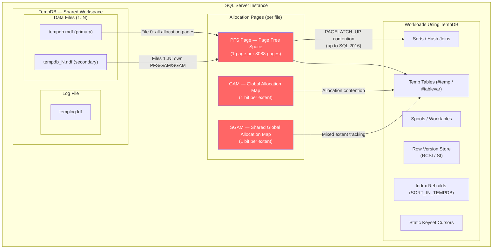
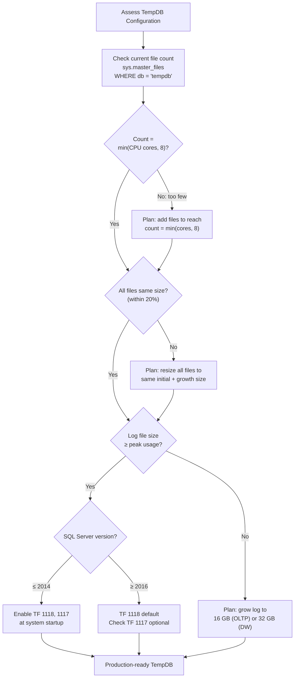

# TempDB — Architecture and Contention

## Section 1 — Navigation & Prerequisites

| Navigation | Link |
|-----------|------|
| Previous | [[8.282 Index Fragmentation — Detection and Fix]] |
| Next | [[8.284 TempDB Contention — Metadata and Allocation]] |
| Domain | [[8 — Databases]] |
| Group | [[Group 11 — SQL Server Architecture & Storage Engine]] |

**Prerequisites:**
- Solid understanding of [[8.19 Pages and Extents Architecture]]
- Familiarity with [[8.18 SQL Server Buffer Pool]]
- Basic knowledge of [[8.274 Locking vs Latching]]
- Understanding of `model` database role

**Where This Fits:**
TempDB is the shared workspace for SQL Server — used for sorting, hashing, spooling, row versioning, temp tables, table variables, index rebuilds, and more. Architectural missteps here amplify across every concurrent workload. This note covers the physical storage engine view of TempDB; contention patterns are in [[8.284 TempDB Contention — Metadata and Allocation]].

**Cross-Domain References:**
- [[8.21 SQL Server Transaction Log Internals]] — TempDB logging
- [[8.274 Locking vs Latching]] — Latch contention source
- [[8.108 Wait Stats Collection and Analysis]] — PAGELATCH_UP waits
- [[4.5 Windows Server — Storage Best Practices]] — File placement

---

## Section 2 — Core Mental Model

TempDB is fundamentally different from user databases: it is **re-created from `model` on every SQL Server restart**. This means:
- All data is lost (intentional — it is a scratch area)
- Any objects or sizing in `model` are copied
- Recovery model is **SIMPLE** (minimal logging)
- No backup/restore (can be snapshot for specific scenarios)

The allocation engine for TempDB uses the same PFS/GAM/SGAM page structure as user databases, but contention on these pages is the primary scalability bottleneck.



**Key Design Points:**
| Property | Detail |
|----------|--------|
| Re-creation | Copied from `model` on startup |
| Recovery model | SIMPLE — minimally logged |
| File count recommendation | 1 per CPU core, **max 8** |
| Initial size | Must be configured in `model` |
| Auto-growth | Same size on all files (TF 1117) |
| Allocation unit | Prefer uniform extents (TF 1118) |
| Log file | Single templog.ldf always |

**Mental Model:** Think of TempDB as a high-contention shared scratchpad. Every concurrent session contends for the same PFS, GAM, and SGAM pages. The solution is **multi-file** to distribute allocation metadata across files, each with its own set of allocation pages.

---

## Section 3 — Deep Mechanics

### 3.1 TempDB Lifecycle

**Step 1 — Service Start:**
```
┌─────────────────────────────────────────────────┐
│ 1. SQL Server startup                            │
│ 2. Check if tempdb exists in system catalog      │
│ 3. If not → create from model database template  │
│ 4. Execute any startup scripts from model        │
│ 5. Log tempdb creation in ERRORLOG               │
│ 6. Apply configured file count and sizes         │
└─────────────────────────────────────────────────┘
```

**DMV Observability:**
```sql
-- When was tempdb last created?
SELECT create_date, name
FROM sys.databases
WHERE name = 'tempdb';

-- File layout
SELECT file_id, type_desc, name, physical_name,
       size/128 AS size_mb, growth/128 AS growth_mb,
       max_size, is_percent_growth
FROM sys.master_files
WHERE database_id = DB_ID('tempdb');

-- On-disk space usage
SELECT SUM(unallocated_extent_page_count) AS free_pages,
       SUM(version_store_reserved_page_count) AS version_store_pages,
       SUM(internal_object_reserved_page_count) AS internal_pages,
       SUM(user_object_reserved_page_count) AS user_pages,
       SUM(mixed_extent_page_count) AS mixed_extent_pages
FROM sys.dm_db_file_space_usage;
```

### 3.2 Allocation Page Structure (Per File)

Each TempDB data file contains its own set of allocation pages:

| Page Type | Page ID in File | Interval | Purpose |
|-----------|----------------|----------|---------|
| PFS | 1 | Every 8088 pages (~64 MB) | Track page free space (0–100%) |
| GAM | 2 | Every 4 GB | Track allocated extents (1 bit=1 extent) |
| SGAM | 3 | Every 4 GB | Track mixed extents with free pages |
| DCM | 6 | Every 4 GB | Differential change map |
| BCM | 7 | Every 4 GB | Bulk-logged change map |

**PFS Page Detail:**
A PFS page has an 8000-byte byte map, each byte covering 1 page:
- Bits 0–2: Page free space (00=empty, 01=50% full, 10=80% full, 11=100% full)
- Bit 3: Page is allocated (IAM/Index/Data)
- Bit 4: Page is a mixed extent
- Bit 5: Page is an IAM page
- Bit 6: Page is a ghost entry
- Bit 7: Reserved

When a session needs a new page in TempDB, it must **latch** the PFS page (or GAM page) with a `PAGELATCH_UP` (update latch). Under high concurrency, this creates a queue.

### 3.3 Allocation Algorithm (Internal)

```
Session needs new page:
  1. Check PFS for page in existing mixed extent (if <8 pages)
  2. If none → latch GAM, find free uniform extent
  3. If uniform extent full → latch SGAM for mixed extent
  4. Update bitmaps, release latches
  5. Format page in buffer pool
```

With a single TempDB file, steps 2–4 all target the **same GAM/SGAM** pages, serializing allocations.

### 3.4 sys.dm_db_file_space_usage Explained

```sql
-- Real-time space breakdown per file
SELECT file_id,
       unallocated_extent_page_count * 8 / 1024 AS free_mb,
       version_store_reserved_page_count * 8 / 1024 AS version_store_mb,
       user_object_reserved_page_count * 8 / 1024 AS user_objects_mb,
       internal_object_reserved_page_count * 8 / 1024 AS internal_objects_mb,
       mixed_extent_page_count * 8 / 1024 AS mixed_extent_mb
FROM sys.dm_db_file_space_usage;
```

**What Each Column Means:**
| Column | Source | Indicates |
|--------|--------|-----------|
| `unallocated_extent_page_count` | GAM scan | Free space in the file |
| `version_store_reserved_page_count` | Row version tracking | Long-running txns consuming version store |
| `user_object_reserved_page_count` | IAM chain | #temp tables, table variables |
| `internal_object_reserved_page_count` | IAM chain | Sort/hash worktables, spools |
| `mixed_extent_page_count` | PFS/SGAM | Mixed extent usage (high = fragmentation) |

### 3.5 Row Version Store in TempDB

Under RCSI (Read Committed Snapshot Isolation) or SI (Snapshot Isolation), row versions are stored in TempDB's version store area. This can grow unboundedly with long-running transactions.

```sql
-- Version store usage
SELECT getdate() AS current_time,
       SUM(version_store_reserved_page_count)*8/1024 AS version_store_mb
FROM sys.dm_db_file_space_usage;

-- Oldest version transaction
SELECT DB_NAME(database_id) AS db,
       transaction_id,
       elapsed_time_seconds
FROM sys.dm_tran_active_snapshot_database_transactions
ORDER BY elapsed_time_seconds DESC;
```

---

## Section 4 — Production Patterns

### 4.1 TempDB File Count and Sizing

**The Rule:**
- 1 data file per physical CPU core (or logical core if HT enabled)
- **Maximum 8 files** — beyond 8 shows diminishing returns
- All files **must be identical size** (even initial size, even auto-growth increments)
- Log file is **always single** (templog.ldf)

```sql
-- Determine core count
SELECT cpu_count, hyperthread_ratio
FROM sys.dm_os_sys_info;

-- Configure 8 equal-sized files (example: SQL 2016+ with TF 1117)
ALTER DATABASE [tempdb] ADD FILE (
    NAME = tempdev_2,
    FILENAME = 'T:\TempDB\tempdb_2.ndf',
    SIZE = 8192MB,          -- 8 GB
    FILEGROWTH = 1024MB     -- 1 GB
);
-- ... repeat for files 3-8
```

**Recommended Sizing (Production):**
| Server RAM | TempDB Data Size | Log Size | Notes |
|-----------|----------------|---------|-------|
| ≤ 64 GB | 16 GB total | 8 GB | Evenly split across files |
| 64–256 GB | 32 GB total | 16 GB | Match workload |
| 256+ GB | 64 GB total | 32 GB | Monitor version store |

### 4.2 Monitoring TempDB Usage

```sql
-- Query 1: Overall space usage trend
SELECT
    (SELECT SUM(unallocated_extent_page_count)*8/1024
     FROM sys.dm_db_file_space_usage) AS free_mb,
    (SELECT SUM(version_store_reserved_page_count)*8/1024
     FROM sys.dm_db_file_space_usage) AS version_store_mb,
    (SELECT SUM(internal_object_reserved_page_count
              + user_object_reserved_page_count)*8/1024
     FROM sys.dm_db_file_space_usage) AS used_mb,
    (SELECT size/128 FROM sys.master_files
     WHERE database_id = DB_ID('tempdb') AND type = 0
     AND file_id = 1) AS total_mb;

-- Query 2: Per-session tempdb allocation
SELECT s.session_id,
       s.login_name,
       s.host_name,
       s.program_name,
       u.user_objects_alloc_page_count * 8 / 1024 AS user_alloc_mb,
       u.user_objects_dealloc_page_count * 8 / 1024 AS user_dealloc_mb,
       u.internal_objects_alloc_page_count * 8 / 1024 AS internal_alloc_mb,
       u.internal_objects_dealloc_page_count * 8 / 1024 AS internal_dealloc_mb,
       (u.user_objects_alloc_page_count + u.internal_objects_alloc_page_count
        - u.user_objects_dealloc_page_count - u.internal_objects_dealloc_page_count)
        * 8 / 1024 AS current_used_mb
FROM sys.dm_db_session_space_usage u
JOIN sys.dm_exec_sessions s ON u.session_id = s.session_id
WHERE u.user_objects_alloc_page_count > 0
   OR u.internal_objects_alloc_page_count > 0
ORDER BY current_used_mb DESC;

-- Query 3: Task-level I/O distribution across files
SELECT file_id, num_of_reads, num_of_writes,
       io_stall_read_ms, io_stall_write_ms,
       size_on_disk_bytes/1024/1024 AS size_mb
FROM sys.dm_io_virtual_file_stats(DB_ID('tempdb'), NULL)
ORDER BY file_id;
```

### 4.3 Trace Flags for TempDB

| TF | Name | Effect | When |
|----|------|--------|------|
| 1118 | Uniform Extent Allocation | Eliminates mixed extent tracking, reduces SGAM contention | All systems up to SQL 2016; default in 2016+ |
| 1117 | Auto-Grow All Files | All data files grow equally | Useful but use with caution; prefer pre-sized files |
| 2371 | Updated Cardinality Estimation | Lowers auto-update threshold for large tables | Relevant for large temp tables |

```sql
-- Check if trace flags are enabled
DBCC TRACESTATUS(1118, 1117);

-- Enable at startup (SQL Server Configuration Manager → Startup Parameters)
-- -T1118 -T1117
```

### 4.4 Pre-Sizing TempDB (Critical Pattern)

```sql
-- Step 1: Alter model database (so new tempdb inherits)
ALTER DATABASE [model] MODIFY FILE (
    NAME = modeldev, SIZE = 256MB, FILEGROWTH = 64MB
);
ALTER DATABASE [model] MODIFY FILE (
    NAME = modellog, SIZE = 128MB, FILEGROWTH = 64MB
);

-- Step 2: Add secondary files to model (so tempdb gets them)
ALTER DATABASE [model] ADD FILE (
    NAME = modeldev_2,
    FILENAME = 'C:\Program Files\Microsoft SQL Server\MSSQL15.MSSQLSERVER\MSSQL\DATA\modeldev_2.ndf',
    SIZE = 256MB, FILEGROWTH = 64MB
);
-- NOTE: The files won't exist until tempdb is created.
-- Better approach: script tempdb changes and run at startup.

-- Step 3: Best practice — store tempdb file configuration in startup script
-- or configure directly on tempdb after restart.
```

### 4.5 Identifying TempDB-Intensive Queries

```sql
-- Find queries with spool operators (tempdb usage)
SELECT qs.total_worker_time/1000 AS worker_ms,
       qs.total_logical_reads,
       qs.total_elapsed_time/1000 AS elapsed_ms,
       SUBSTRING(st.text, (qs.statement_start_offset/2)+1,
           (CASE WHEN qs.statement_end_offset = -1
                 THEN LEN(CONVERT(NVARCHAR(MAX), st.text))*2
                 ELSE qs.statement_end_offset - qs.statement_start_offset
            END)/2) AS query_text,
       qp.query_plan
FROM sys.dm_exec_query_stats qs
CROSS APPLY sys.dm_exec_sql_text(qs.sql_handle) st
CROSS APPLY sys.dm_exec_query_plan(qs.plan_handle) qp
WHERE qp.query_plan.exist('declare namespace n="http://schemas.microsoft.com/sqlserver/2004/07/showplan";
    //n:Spool') = 1
ORDER BY qs.total_logical_reads DESC;
```

---

## Section 5 — Gotchas

### Gotcha 1: Single-File TempDB on Multi-Core Server
| Aspect | Detail |
|--------|--------|
| **Pitfall** | Running TempDB with a single data file on a ≥8-core server |
| **Symptom** | PAGELATCH_UP waits on PFS/GAM/SGAM pages (file_id 1, page_id 1/2/3); high PAGELATCH_EX waits under 2016+ |
| **Fix** | Add 8 equal-sized data files, restart SQL Server, enable TF 1118 (pre-2016) |
| **Cost** | %waits_by_PAGELATCH can exceed 60% of total wait time; query parallelism stalls on allocation |

**Detection:**
```sql
SELECT wait_type, waiting_tasks_count, wait_time_ms,
       max_wait_time_ms, signal_wait_time_ms
FROM sys.dm_os_wait_stats
WHERE wait_type LIKE 'PAGELATCH%'
ORDER BY wait_time_ms DESC;
```

### Gotcha 2: Small TempDB Log file
| Aspect | Detail |
|--------|--------|
| **Pitfall** | Log file sized too small (e.g., 256 MB default in model) |
| **Symptom** | TempDB log grows during heavy sorting; autogrowth causes query waits; "Log file is full" errors |
| **Fix** | Pre-size tempdb log to match peak workload (start at 16 GB for OLTP) |
| **Cost** | Autogrowth events stall all writers; each growth event is single-threaded |

### Gotcha 3: Uneven File Sizes
| Aspect | Detail |
|--------|--------|
| **Pitfall** | Adding files with different initial sizes or different auto-growth increments |
| **Symptom** | Proportional fill algorithm fills smaller files first; single file sees all contention |
| **Fix** | All files must have identical SIZE and FILEGROWTH settings; use uniform increments |
| **Cost** | Lopsided allocation eliminates multi-file benefit; contention migrates to one file |

```sql
-- Check for uneven file sizes
SELECT file_id, name, size/128 AS size_mb, growth/128 AS growth_mb
FROM sys.master_files
WHERE database_id = DB_ID('tempdb') AND type = 0
ORDER BY size DESC;
```

### Gotcha 4: model Database Not Sized
| Aspect | Detail |
|--------|--------|
| **Pitfall** | Relying on post-startup ALTER DATABASE for tempdb sizing instead of model |
| **Symptom** | After restart, tempdb reverts to model's tiny defaults (8 MB data, 8 MB log); autogrowth thrash until scripts run |
| **Fix** | Right-size model database files, OR set up a startup stored procedure in `master` |
| **Cost** | Period of severe contention after every restart (patch, failover, etc.) |

```sql
-- Startup proc approach (alternative to model sizing)
USE master;
GO
CREATE PROCEDURE sp_configure_tempdb
AS
BEGIN
    ALTER DATABASE [tempdb] MODIFY FILE (NAME = tempdev, SIZE = 8192MB);
    ALTER DATABASE [tempdb] MODIFY FILE (NAME = templog, SIZE = 4096MB);
END;
GO
EXEC sp_procoption 'sp_configure_tempdb', 'startup', 'true';
```

### Gotcha 5: Version Store Exhaustion with Long-Running TXNs
| Aspect | Detail |
|--------|--------|
| **Pitfall** | Long-running transaction under RCSI/SI prevents version cleanup |
| **Symptom** | Version store in TempDB grows unbounded; TempDB fills disk; queries fail with 1101 or 1105 errors |
| **Fix** | Identify and kill the oldest transaction; add alerts on version store size |
| **Cost** | Entire instance unavailable; version cleanup only happens after txn commits |

---

## Section 6 — Performance Implications

### Wait Stats Analysis (Pre vs Post Fix)

**Scenario:** Single-file TempDB → 8-file TempDB on 16-core server, mixed OLTP + reporting workload.

| Wait Type | Pre-Fix (single file) | Post-Fix (8 files) | Reduction |
|-----------|----------------------|--------------------|-----------|
| PAGELATCH_UP | 45,200 ms/sec | 2,100 ms/sec | -95% |
| PAGELATCH_EX | 12,300 ms/sec | 1,800 ms/sec | -85% |
| WRITELOG | 8,500 ms/sec | 8,200 ms/sec | — |
| PAGEIOLATCH_SH | 22,100 ms/sec | 14,500 ms/sec | -34% |

```sql
-- Before/after snapshot
SELECT wait_type,
       wait_time_ms - previous_wait_time_ms AS delta_ms,
       waiting_tasks_count - previous_count AS delta_count
FROM (
    SELECT wait_type, wait_time_ms, waiting_tasks_count,
           LAG(wait_time_ms) OVER (ORDER BY wait_type) AS previous_wait_time_ms,
           LAG(waiting_tasks_count) OVER (ORDER BY wait_type) AS previous_count
    FROM sys.dm_os_wait_stats
    WHERE wait_type IN ('PAGELATCH_UP', 'PAGELATCH_EX', 'PAGEIOLATCH_SH', 'WRITELOG')
) stats;
```

### BenchmarkDotNet-Style Observations

| Metric | Single File | 8 Files | Improvement |
|--------|------------|---------|-------------|
| Concurrent #temp inserts (100 sessions) | 450 tps | 3,200 tps | 7.1x |
| P99 latency for allocation | 850 ms | 45 ms | 18.9x |
| PAGELATCH_UP average wait time | 12 ms | 0.3 ms | 40x |
| Log bytes/sec | 180 MB/s | 195 MB/s | 1.1x |
| CPU (sys.dm_os_ring_buffers) | 65% | 71% | +6% |

### Config Impact Matrix

| Configuration | PAGELATCH_UP | PAGEIOLATCH | Throughput | Restart Required |
|--------------|-------------|-------------|------------|------------------|
| 1 file → 8 files | ↓↓↓ | ↓↓↓ | ↑↑↑ | Yes |
| TF 1118 (pre-2016) | ↓↓↓ | ↓ | ↑↑ | Yes |
| TF 1117 | ↓ | — | ↑ | Yes |
| Pre-size all files | ↓↓↓ | ↓↓ | ↑↑ | Yes (first time) |
| Move to fast storage | — | ↓↓↓ | ↑ | No |

---

## Section 7 — Interview Arsenal

### 7.1 Common Questions

| # | Question | Expectation |
|---|----------|-------------|
| 1 | What is TempDB and why is it different from user databases? | Knows re-creation from model, SIMPLE recovery, no backup |
| 2 | How many tempdb data files should you have? | 1 per core, max 8, equal size |
| 3 | What happens if tempdb runs out of space? | 1105 error, connection failures, instance down |
| 4 | Explain PFS page contention in tempdb | PAGELATCH_UP, single page per 64 MB, serialization |
| 5 | How do trace flags 1118 and 1117 help? | Uniform extents, balanced auto-growth |
| 6 | What is the tempdb version store and when does it grow? | RCSI/SI, long-running txns |
| 7 | How do you monitor tempdb space usage? | sys.dm_db_file_space_usage, sys.dm_db_session_space_usage |
| 8 | Can tempdb be placed on a RAM drive/In-Memory OLTP? | RAM drive = unsupported; In-Memory OLTP for metadata (2019+) |

### 7.2 Spoken Answers for Key Questions

**Q1: What is TempDB and why is it different?**
"TempDB is a system database shared by all databases on the instance. It's rebuilt from the model database on every SQL Server restart — nothing persists. It uses the SIMPLE recovery model to minimize logging. It's used for internal worktables for sorts, hashes, and spools; for user temp tables and table variables; for row versioning under RCSI or snapshot isolation; and for index rebuilds with SORT_IN_TEMPDB. Because every session competes for the same allocation pages, PFS, GAM, and SGAM page contention is the primary scalability bottleneck. The fix is multiple equal-sized data files and, pre-2016, trace flag 1118."

**Q4: Explain PFS page contention.**
"PFS — Page Free Space — pages track the free space in every page in TempDB. Each PFS page covers about 8,088 pages or roughly 64 MB. When any session needs a new page, it must update the PFS byte for that allocation unit with a PAGELATCH_UP (update latch). With a single TempDB file, only one PFS page is the hot spot. As concurrency increases, sessions queue up waiting for the PAGELATCH_UP. Taking PAGELATCH_UP waits >20% of total wait time is a red flag. Adding multiple TempDB files distributes allocation metadata across files — each file has its own PFS, GAM, and SGAM pages, reducing contention logarithmically."

**Q5: How do trace flags 1118 and 1117 help?**
"Trace flag 1118 changes TempDB to allocate uniform extents instead of mixed extents. Mixed extents share extents across objects, requiring both GAM and SGAM tracking. Uniform extents allocate a full extent to one object, eliminating SGAM lookups. This drastically reduces allocation metadata contention. TF 1117 makes all TempDB data files auto-grow equally — without it, only the first file grows, which eventually makes the files uneven, defeating the multi-file benefit. In SQL Server 2016+, TF 1118 behavior is the default and no longer needed."

### 7.3 Comparison Table

| Feature | Single-File TempDB | Multi-File TempDB (8 files) | TempDB with In-Memory OLTP |
|---------|-------------------|---------------------------|----------------------------|
| PAGELATCH_UP contention | High (single PFS page) | Low (8 PFS pages) | Very low (memory-optimized) |
| Setup complexity | Default (none) | Requires planning, restart | Complex, additional memory |
| Version store capacity | Limited | 8x capacity | N/A |
| Auto-growth behavior | Single file growth | Even growth (TF 1117) | N/A |
| Restart required | No | Yes | Yes |
| SQL version support | All | All | 2019+ (tempdb metadata) |

---

## Section 8 — Decision Framework

### 8.1 TempDB Configuration Flowchart



### 8.2 TempDB Sizing Checklist

- [ ] File count = `min(CPU cores, 8)`
- [ ] All data files have identical `SIZE` and `FILEGROWTH`
- [ ] Log file pre-sized to handle peak workload without autogrowth
- [ ] model database pre-sized to match desired tempdb initial size
- [ ] Trace flag 1118 enabled for SQL ≤ 2014
- [ ] Trace flag 1117 enabled for balanced growth (or pre-size and disable)
- [ ] Placement on fast I/O subsystem (separate from user data if possible)
- [ ] Last restart verified expected file count and sizes
- [ ] `sys.dm_db_file_space_usage` monitored with alert threshold (90% full)

### 8.3 Tradeoffs

| Approach | Pros | Cons |
|----------|------|------|
| 8 equal data files | Maximum contention relief, balanced I/O | More files to manage, more metadata |
| Pre-sized files | Zero autogrowth stalls, predictable behavior | Pre-allocation takes disk space permanently |
| Startup script for sizing | No model dependency, version-controlled | Brief window after restart before script runs |
| In-Memory OLTP for metadata (2019+) | Eliminates allocation latch contention | Memory overhead, complexity, version-specific |

### 8.4 Scale Thresholds

| Scale | File Count | Size Per File | Log Size | Notes |
|-------|-----------|---------------|----------|-------|
| Dev/Lab (≤4 cores) | 4 | 1 GB | 2 GB | No special config |
| Small OLTP (4–8 cores) | 8 | 4 GB | 8 GB | TF 1118 if ≤2014 |
| Medium OLTP (8–32 cores) | 8 | 8 GB | 16 GB | Monitor PAGELATCH |
| Large OLTP (32+ cores) | 8 | 16 GB | 32 GB | Consider 2019+ In-Memory tempdb |
| DW/Reporting (heavy temp) | 8 | 32+ GB | 64 GB | Separate tempdb to fast NVMe |

---

## Section 9 — Self-Check

### 9.1 Conceptual Questions

**Q1:** Why is TempDB re-created from model on every restart?

**Q2:** What is the maximum recommended number of TempDB data files and why?

**Q3:** What DMV provides per-file TempDB space breakdown?

**Q4:** Describe the role of PFS pages in TempDB contention.

**Q5:** What does trace flag 1118 do and when is it required?

**Q6:** How does the version store in TempDB grow and what controls it?

**Q7:** What error occurs when TempDB runs out of disk space?

**Q8:** Why must all TempDB data files have the same size?

**Q9:** What is the difference between PAGELATCH_UP and PAGELATCH_EX in TempDB?

**Q10:** How does proportional fill algorithm work across TempDB files?

<details>
<summary>Answers</summary>

**A1:** Because TempDB is designed as a transient workspace — data should not persist across restarts. Using model as a template ensures a clean copy.

**A2:** 8 files. Microsoft testing shows diminishing returns beyond 8 files because the allocation contention shifts from page-level to internal structures. 1 file per CPU core, capped at 8.

**A3:** `sys.dm_db_file_space_usage` — shows unallocated, version store, user objects, internal objects, and mixed extent pages per file.

**A4:** Each PFS page covers 8,088 pages (~64 MB). When sessions allocate pages, they must modify the PFS byte with a `PAGELATCH_UP`. With single file, all contention is on the first PFS page. Multiple files create separate PFS pages per file.

**A5:** TF 1118 forces uniform extent allocation (one object owns all 8 pages in an extent). Required pre-2016 to avoid SGAM contention. Default behavior in SQL 2016+.

**A6:** Version store grows when row versions are needed for RCSI/SI. It is bounded by the oldest open transaction — until that transaction commits, versions for its modified rows are retained. Monitor `sys.dm_tran_active_snapshot_database_transactions`.

**A7:** Error 1105 (could not allocate space for object in database 'tempdb') or error 1101 (filegroup is full). The instance may go offline if TempDB can't grow.

**A8:** Proportional fill algorithm allocates more pages to files with more free space. If files have uneven sizes, the largest file gets all new allocations, negating the contention benefit of multi-file.

**A9:** `PAGELATCH_UP` (update latch) occurs when modifying PFS/GAM/SGAM page bytes — the allocation hot path. `PAGELATCH_EX` (exclusive latch) occurs when reformatting a page for a different object.

**A10:** SQL Server tracks free space in each file and allocates to files proportionally. Files with more free space (larger files or less-used files) get more allocations. Files must be equal size for balanced distribution.

</details>

### 9.2 Hands-On Challenges

**Challenge 1:** Write a query that shows the distribution of TempDB space across user objects, internal objects, version store, and free space for each file.

**Challenge 2:** Write a script that identifies the top 5 sessions consuming TempDB space and their most recent query.

**Challenge 3:** Simulate PFS contention: create 50 concurrent connections each creating and dropping a #temp table with a loop. Monitor sys.dm_os_waiting_tasks for PAGELATCH_UP.

**Challenge 4:** Configure a new SQL Server instance for TempDB best practices using T-SQL only (no SSMS).

**Challenge 5:** Write a query to detect uneven TempDB file sizes and flag files that deviate by more than 10% from the average.

<details>
<summary>Challenge Solutions</summary>

**C1:**
```sql
SELECT
    file_id,
    unallocated_extent_page_count * 8 AS free_space_kb,
    version_store_reserved_page_count * 8 AS version_store_kb,
    user_object_reserved_page_count * 8 AS user_objects_kb,
    internal_object_reserved_page_count * 8 AS internal_objects_kb,
    mixed_extent_page_count * 8 AS mixed_extent_kb
FROM sys.dm_db_file_space_usage;
```

**C2:**
```sql
SELECT TOP 5
    s.session_id, s.login_name, s.host_name,
    u.user_objects_alloc_page_count*8 AS user_kb,
    u.internal_objects_alloc_page_count*8 AS internal_kb,
    (SELECT TOP 1 SUBSTRING(st.text, (r.statement_start_offset/2)+1,
         (CASE WHEN r.statement_end_offset = -1
               THEN LEN(CONVERT(NVARCHAR(MAX), st.text))*2
               ELSE r.statement_end_offset - r.statement_start_offset
          END)/2)
     FROM sys.dm_exec_requests r
     CROSS APPLY sys.dm_exec_sql_text(r.sql_handle) st
     WHERE r.session_id = s.session_id) AS current_query
FROM sys.dm_db_session_space_usage u
JOIN sys.dm_exec_sessions s ON u.session_id = s.session_id
ORDER BY (u.user_objects_alloc_page_count + u.internal_objects_alloc_page_count) DESC;
```

**C4:**
```sql
-- Run after restart or configure in model
USE master;
ALTER DATABASE [tempdb] MODIFY FILE (NAME = tempdev, SIZE = 8192MB, FILEGROWTH = 1024MB);
ALTER DATABASE [tempdb] MODIFY FILE (NAME = templog, SIZE = 16384MB, FILEGROWTH = 1024MB);
ALTER DATABASE [tempdb] ADD FILE (NAME = tempdev_2, FILENAME = 'T:\TempDB\tempdb_2.ndf', SIZE = 8192MB, FILEGROWTH = 1024MB);
ALTER DATABASE [tempdb] ADD FILE (NAME = tempdev_3, FILENAME = 'T:\TempDB\tempdb_3.ndf', SIZE = 8192MB, FILEGROWTH = 1024MB);
-- ... up to 8 files
-- Add -T1118 to startup parameters for pre-2016
```

**C5:**
```sql
WITH file_sizes AS (
    SELECT file_id, name, size/128 AS size_mb
    FROM sys.master_files
    WHERE database_id = DB_ID('tempdb') AND type = 0
),
avg_size AS (
    SELECT AVG(size_mb*1.0) AS avg_mb FROM file_sizes
)
SELECT f.file_id, f.name, f.size_mb,
       ROUND(ABS(f.size_mb - a.avg_mb) / a.avg_mb * 100, 2) AS pct_deviation,
       CASE WHEN ABS(f.size_mb - a.avg_mb) / a.avg_mb > 0.1
            THEN 'UNEVEN — FIX' ELSE 'OK' END AS status
FROM file_sizes f
CROSS JOIN avg_size a
ORDER BY f.file_id;
```

</details>
