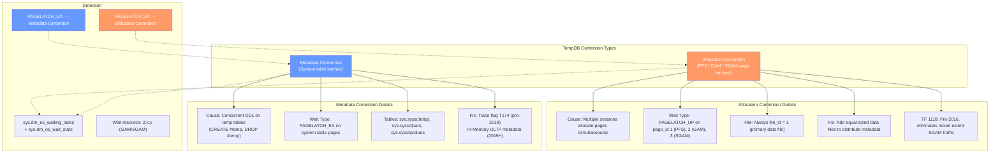
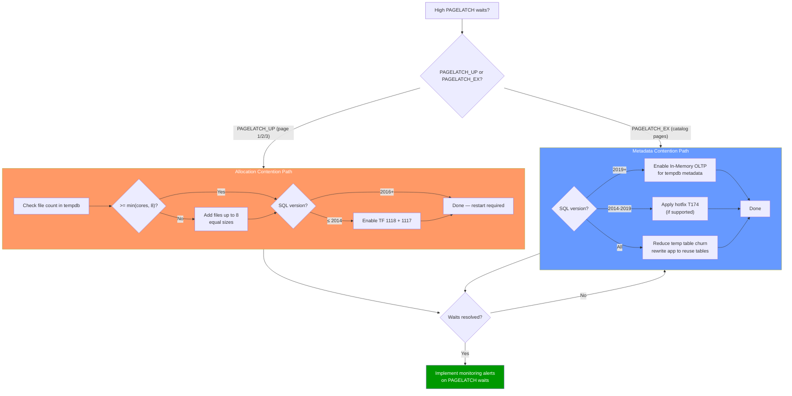

# TempDB Contention — Metadata and Allocation

## Section 1 — Navigation & Prerequisites

| Navigation | Link |
|-----------|------|
| Previous | [[8.283 TempDB — Architecture and Contention]] |
| Next | [[8.285 Transaction Log — Structure and VLFs]] |
| Domain | [[8 — Databases]] |
| Group | [[Group 11 — SQL Server Architecture & Storage Engine]] |

**Prerequisites:**
- [[8.283 TempDB — Architecture and Contention]] (foundation)
- [[8.274 Locking vs Latching]] (latch types)
- [[8.108 Wait Stats Collection and Analysis]]
- Understanding of PFS, GAM, SGAM page structure from [[8.19 Pages and Extents Architecture]]

**Where This Fits:**
While [[8.283 TempDB — Architecture and Contention]] covers the physical layout and sizing, this note dives specifically into **contention patterns** — the two distinct classes of contention (allocation vs metadata), how to diagnose them via wait stats, and the exact fix for each. This is the most common SQL Server performance interview topic.

**Cross-Domain References:**
- [[8.283 TempDB — Architecture and Contention]] — Base architecture
- [[8.274 Locking vs Latching]] — Latch type taxonomy
- [[8.108 Wait Stats Collection and Analysis]] — Wait stat methodology
- [[4.5 Windows Server — Storage Best Practices]] — File placement for contention relief

---

## Section 2 — Core Mental Model

TempDB contention falls into two completely distinct categories:



**Key Distinction:**

| Aspect | Allocation Contention | Metadata Contention |
|--------|---------------------|---------------------|
| **Wait type** | `PAGELATCH_UP` | `PAGELATCH_EX` |
| **Resource** | PFS (page 1), GAM (page 2), SGAM (page 3) | System table pages (>100, <10000) |
| **SQL version** | All versions, worse in single-file | Worse with many temp tables |
| **Primary fix** | Multi-file + TF 1118 (pre-2016) | TF 1118 + In-Memory OLTP (2019+) |
| **Applies to** | Any page allocation | Temp table create/drop DDL |

---

## Section 3 — Deep Mechanics

### 3.1 PAGELATCH_UP Wait Chain

When a session allocates a page in TempDB, the exact internal flow:

```
Session 1: Needs 1 page for #temp insertion
  → EXEC_MANAGER grants task to scheduler
  → Storage engine calls SpaceMgr::AllocatePage
  → File 1 selected (proportional fill)
  → PFS page (file=1, page=1) must be updated
  → Request PAGELATCH_UP on buffer (PFS page)
  
  If PFS page already latched by Session 2:
  → Session 1 waits on PAGELATCH_UP for page 1:1
  → enqueueRequeue → scheduler yields
  → Wait stats accumulate: PAGELATCH_UP
  → Task shows in sys.dm_os_waiting_tasks
```

**DMV Observability:**
```sql
-- Current contention snapshot
SELECT session_id, wait_type, wait_duration_ms,
       resource_description, blocking_session_id
FROM sys.dm_os_waiting_tasks
WHERE wait_type LIKE 'PAGELATCH%'
  AND session_id > 50;

-- Parse resource_description for PAGELATCH_UP:
-- Example: "4:1:1" = database_id 4 (tempdb), file_id 1, page_id 1 (PFS)
-- "4:1:2" = database_id 4, file_id 1, page_id 2 (GAM)
-- "4:1:3" = database_id 4, file_id 1, page_id 3 (SGAM)

-- Aggregate wait type severity
SELECT wait_type,
       SUM(wait_time_ms) AS total_wait_ms,
       SUM(signal_wait_time_ms) AS signal_wait_ms,
       SUM(wait_time_ms - signal_wait_time_ms) AS resource_wait_ms,
       SUM(waiting_tasks_count) AS wait_count,
       CAST(100.0 * SUM(wait_time_ms) /
            SUM(SUM(wait_time_ms)) OVER () AS DECIMAL(5,2)) AS pct_of_total
FROM sys.dm_os_wait_stats
WHERE wait_type LIKE 'PAGELATCH%'
GROUP BY wait_type
ORDER BY total_wait_ms DESC;
```

### 3.2 @@VERSION-Based Behavior Changes

The exact remedies depend on SQL Server version:

| Version | Allocation Behavior | Metadata Behavior | Required Actions |
|---------|-------------------|-------------------|------------------|
| **2005–2012** | Mixed extent default | System tables in TempDB | TF 1118 + 1117, multi-file |
| **2014** | Mixed extent default | System tables in TempDB | TF 1118 + 1117, multi-file |
| **2016** | **Uniform extent default** (TF 1118 baked in) | System tables in TempDB; **TF 1117 still optional** | Multi-file, consider TF 1117 |
| **2017** | Uniform extent default | System tables in TempDB | Multi-file |
| **2019+** | Uniform extent default | **In-Memory OLTP for system tables** (KB) | Enable In-Memory for tempdb metadata (opt-in) |
| **2022+** | Uniform extent default | In-Memory OLTP for system tables (improved) | Enable via sp_configure |

```sql
-- Determine version to decide remediation
SELECT @@VERSION;

-- Key version identifiers:
-- 2005: 9.x
-- 2008: 10.0.x
-- 2012: 11.x
-- 2014: 12.x
-- 2016: 13.x
-- 2017: 14.x
-- 2019: 15.x
-- 2022: 16.x
```

### 3.3 Metadata Tables in TempDB

Metadata contention involves these system tables in TempDB:

| Table | Function | Contention Pattern |
|-------|----------|-------------------|
| `sys.sysschobjs` | Object catalog — tracks all temp objects | High insert/delete during temp table creation/drop |
| `sys.syscolpars` | Column parameters | Write-heavy during CREATE #temp |
| `sys.sysidxstats` | Index/statistics | Updates on index rebuilds |
| `sys.sysobjvalues` | Extended properties | Moderate |
| `sys.sysrowsets` | Rowset tracking | Moderate |

Every `CREATE TABLE #t (col INT)` does:
1. Allocate pages in tempdb (PAGELATCH_UP — allocation contention)
2. Insert row into `sys.sysschobjs` (PAGELATCH_EX — metadata contention)
3. Insert rows into `sys.syscolpars`
4. Insert row into `sys.sysidxstats`
5. Create IAM chain pointer in cache

Every `DROP TABLE #t` does the reverse — deletes from these tables.

### 3.4 Internal Latch Classes

| Latch Class | Pages Affected | Contention Type |
|------------|---------------|-----------------|
| `PAGELATCH_UP` | PFS (page 1), GAM (page 2), SGAM (page 3) | Allocation |
| `PAGELATCH_EX` | System catalog pages | Metadata |
| `PAGELATCH_SH` | Any page read | Shared (moderate) |
| `LATCH_EX` (non-page) | Internal data structures | Internal |
| `ACCESS_METHODS_DATASET_PARENT` | HoBT allocation | Allocation |

### 3.5 SQL 2019+ In-Memory OLTP for TempDB Metadata

SQL Server 2019 introduced the ability to move TempDB system table metadata into In-Memory OLTP (Hekaton):

```sql
-- Check current status
SELECT * FROM sys.tables
WHERE is_memory_optimized = 1
  AND temporal_type = 0;

-- Enable (requires restart):
EXEC sp_configure 'tempdb metadata memory-optimized', 1;
RECONFIGURE;
-- Restart SQL Server

-- After restart, system tables are memory-optimized:
SELECT name, is_memory_optimized, durability_desc
FROM tempdb.sys.tables
WHERE is_memory_optimized = 1;

-- Each system table becomes a memory-optimized, non-durable table
-- Benefits:
--   • No PAGELATCH_EX waits on system catalog pages
--   • Fully latch-free access (Bw-tree structures)
--   • Significant throughput improvement for temp table heavy workloads
```

**Impact (Microsoft documented):**
| Workload | Before (PAGELATCH_EX) | After (In-Memory) | Improvement |
|----------|----------------------|-------------------|-------------|
| 500 sessions, create/drop #temp | 1,200 tps | 4,800 tps | 4x |
| PAGELATCH_EX wait time | 40,000 ms/sec | <100 ms/sec | ~400x |

---

## Section 4 — Production Patterns

### 4.1 Contention Diagnosis Script

```sql
-- Complete contention diagnosis (run during peak)
WITH waits AS (
    SELECT wait_type, wait_time_ms, waiting_tasks_count,
           wait_time_ms - signal_wait_time_ms AS resource_wait_ms,
           signal_wait_time_ms,
           wait_time_ms / NULLIF(waiting_tasks_count, 0) AS avg_wait_ms
    FROM sys.dm_os_wait_stats
    WHERE wait_type LIKE 'PAGELATCH%'
       OR wait_type LIKE 'LATCH%'
),
total AS (
    SELECT SUM(wait_time_ms) AS total_wait_ms FROM sys.dm_os_wait_stats
)
SELECT w.wait_type,
       w.wait_time_ms,
       CAST(100.0 * w.wait_time_ms / t.total_wait_ms AS DECIMAL(5,2)) AS pct,
       w.waiting_tasks_count,
       w.avg_wait_ms,
       w.resource_wait_ms,
       CASE
           WHEN w.wait_type = 'PAGELATCH_UP' AND w.avg_wait_ms > 5
                THEN 'ALLOCATION CONTENTION — Add files / check TF 1118'
           WHEN w.wait_type = 'PAGELATCH_EX' AND w.avg_wait_ms > 5
                THEN 'METADATA CONTENTION — Check temp table churn / In-Memory OLTP'
           WHEN w.wait_type = 'PAGELATCH_SH'
                THEN 'Shared — normally benign'
           ELSE 'Monitor'
       END AS recommendation
FROM waits w
CROSS JOIN total t
WHERE w.wait_time_ms > 1000
ORDER BY w.wait_time_ms DESC;

-- Current blocking on latches
SELECT wt.session_id, wt.wait_type, wt.wait_duration_ms,
       DB_NAME(parsed.db_id) AS database_name,
       parsed.file_id, parsed.page_id,
       CASE parsed.page_id
           WHEN 1 THEN 'PFS'
           WHEN 2 THEN 'GAM'
           WHEN 3 THEN 'SGAM'
           ELSE 'Other data page'
       END AS page_type,
       er.status, er.command,
       SUBSTRING(st.text, (er.statement_start_offset/2)+1,
           (CASE WHEN er.statement_end_offset = -1
                 THEN LEN(CONVERT(NVARCHAR(MAX), st.text))*2
                 ELSE er.statement_end_offset - er.statement_start_offset
            END)/2) AS query_text
FROM sys.dm_os_waiting_tasks wt
JOIN sys.dm_exec_requests er ON wt.session_id = er.session_id
CROSS APPLY sys.dm_exec_sql_text(er.sql_handle) st
CROSS APPLY (
    SELECT
        CAST(SUBSTRING(wt.resource_description,
            CHARINDEX(':', wt.resource_description, 5)+1,
            CHARINDEX(':', wt.resource_description,
                CHARINDEX(':', wt.resource_description, 5)+1)
            - CHARINDEX(':', wt.resource_description, 5)-1) AS INT) AS db_id,
        CAST(SUBSTRING(wt.resource_description,
            CHARINDEX(':', wt.resource_description,
                CHARINDEX(':', wt.resource_description,
                    CHARINDEX(':', wt.resource_description, 5)+1))+1,
            LEN(wt.resource_description)) AS INT) AS file_id,
        CAST(SUBSTRING(wt.resource_description,
            CHARINDEX(':', wt.resource_description, 5)+1,
            CHARINDEX(':', wt.resource_description,
                CHARINDEX(':', wt.resource_description, 5)+1)
            - CHARINDEX(':', wt.resource_description, 5)-1) AS INT) AS page_id
) parsed
WHERE wt.wait_type LIKE 'PAGELATCH%'
  AND wt.session_id > 50;
```

### 4.2 Temp Table Creation Rate Monitoring

```sql
-- Track temp table create/drop rate (look for spikes)
SELECT
    DATEADD(MINUTE, DATEDIFF(MINUTE, '2024-01-01', cntr_value), '2024-01-01') AS sample_time,
    cntr_value AS temp_table_creates
FROM sys.dm_os_performance_counters
WHERE object_name LIKE '%General Statistics%'
  AND counter_name = 'Temp Tables Created/sec';

-- Alternative: capture baseline with two snapshots
DECLARE @t1 BIGINT, @t2 BIGINT, @wait_ms INT = 60000;
SELECT @t1 = cntr_value
FROM sys.dm_os_performance_counters
WHERE object_name LIKE '%General Statistics%'
  AND counter_name = 'Temp Tables Created/sec';

WAITFOR DELAY '00:01:00';

SELECT @t2 = cntr_value
FROM sys.dm_os_performance_counters
WHERE object_name LIKE '%General Statistics%'
  AND counter_name = 'Temp Tables Created/sec';

SELECT (@t2 - @t1) * 60.0 / (@wait_ms / 1000.0) AS temp_tables_per_second;
```

### 4.3 Pre-2016: Trace Flag 1118 Enablement

```sql
-- For SQL 2014 and earlier:

-- Option 1: Global, session-scoped (immediate but not persistent)
DBCC TRACEON(1118, -1);
DBCC TRACESTATUS(1118);

-- Option 2: Startup parameter (persistent)
-- SQL Server Configuration Manager → SQL Server Service → Properties → Startup Parameters
-- Add: -T1118
-- Restart SQL Server

-- Verify after restart:
DBCC TRACESTATUS(1118);
-- Expected: 1118 → 1 (enabled globally)
```

**What TF 1118 Actually Changes:**
```
Without TF 1118:
  Object needs pages → allocate from mixed extent (SGAM tracked)
  → After 8 pages → allocate uniform extent (GAM tracked)
  → Two allocation managers involved → more SGAM latches

With TF 1118:
  Object needs pages → allocate uniform extent (GAM tracked only)
  → Skip SGAM entirely → one less contention source
  → Waste: up to 7 pages per small object
  → Acceptable waste in TempDB (ephemeral)
```

### 4.4 Post-2016: What's Left to Configure

```sql
-- SQL 2016+: TF 1118 is default behavior
-- Still important:

-- 1. Multi-file TempDB
SELECT file_id, name, size/128 AS size_mb
FROM sys.master_files
WHERE database_id = DB_ID('tempdb') AND type = 0;

-- 2. Consider TF 1117 for balanced auto-growth
DBCC TRACESTATUS(1117);

-- 3. SQL 2019+: Enable In-Memory OLTP for metadata
IF CAST(SERVERPROPERTY('ProductMajorVersion') AS INT) >= 15
BEGIN
    EXEC sp_configure 'tempdb metadata memory-optimized', 1;
    RECONFIGURE;
END
-- Requires restart

-- 4. Monitor for metadata contention even with 8 files
```

### 4.5 SQL 2019+ In-Memory OLTP Setup Verification

```sql
-- Post-restart verification
SELECT name, type_desc, is_memory_optimized, durability_desc
FROM tempdb.sys.tables
WHERE is_memory_optimized = 1;

-- Check tempdb metadata memory
SELECT database_id, memory_allocated_for_tempdb_metadata_kb,
       memory_used_by_tempdb_metadata_kb
FROM sys.dm_os_sys_info;

-- Performance impact
SELECT wait_type, wait_time_ms, waiting_tasks_count,
       wait_time_ms / NULLIF(waiting_tasks_count, 0) AS avg_wait_ms
FROM sys.dm_os_wait_stats
WHERE wait_type LIKE 'PAGELATCH%'
ORDER BY wait_time_ms DESC;
```

---

## Section 5 — Gotchas

### Gotcha 1: Adding Files Without Restart (Single-File Fixed)

| Aspect | Detail |
|--------|--------|
| **Pitfall** | DBA adds 7 files to TempDB but existing sessions still pin the first file's PFS/GAM/SGAM |
| **Symptom** | Minimal improvement after restart; older sessions still use file 0 heavily |
| **Fix** | Must **restart SQL Server** after adding files — only then proportional fill sees all files equally |
| **Cost** | Weeks of continued contention if restart is deferred for maintenance window |

**Why:** SQL Server distributes new allocations based on file free space, but existing allocations in file 0 remain. Proportional fill weights by free space—if all 8 files are equally sized, allocation balance is achieved.

### Gotcha 2: TF 1118 Only on Pre-2016 (Red Herring)

| Aspect | Detail |
|--------|--------|
| **Pitfall** | DBAs enable TF 1118 on SQL 2016+ thinking it's required |
| **Symptom** | No error but TF does nothing (it's the default behavior) |
| **Fix** | Remove TF 1118 from startup params — it adds confusion for next DBA |
| **Cost** | Time wasted investigating which TFs are active, potential confusion |

**Verify:**
```sql
-- If TF 1118 shows as enabled on SQL 2016+, it's redundant
-- Check what trace flags actually do anything:
SELECT * FROM sys.dm_exec_valid_using_trace_flags
WHERE trace_flag IN (1117, 1118);
```

### Gotcha 3: 8-File Maximum Misapplied

| Aspect | Detail |
|--------|--------|
| **Pitfall** | DBA adds 16 files "because we have 16 cores" |
| **Symptom** | No additional benefit after 8; more files mean more metadata to manage, longer recovery |
| **Fix** | Cap at 8 files; for >8 core systems, focus on In-Memory OLTP metadata (2019+) |
| **Cost** | Wasted disk capacity (each file has overhead), more files to manage |

**Evidence:**
- Microsoft's own testing shows <1% improvement beyond 8 files
- Each file adds I/O overhead for checkpoint
- Proportional fill algorithm overhead scales with file count

### Gotcha 4: Uneven File Sizes on Restart

| Aspect | Detail |
|--------|--------|
| **Pitfall** | model database has different default sizes than the ALTER DATABASE script used |
| **Symptom** | After restart, files revert to model sizes; first file is 8 MB, others are 8192 MB |
| **Fix** | Always size model database files first OR use startup proc to set sizes |
| **Cost** | Restart causes contention spike until ALTER script runs |

### Gotcha 5: Metadata Contention Persists Even with 8 Files

| Aspect | Detail |
|--------|--------|
| **Pitfall** | DBA assumes multi-file solves ALL tempdb contention |
| **Symptom** | PAGELATCH_EX waits remain high despite 8 files and TF 1118 |
| **Fix** | This is metadata contention (sys.sysschobjs etc.), not allocation. Requires In-Memory OLTP (2019+) or TF T174 |
| **Cost** | Frustrated troubleshooting cycle chasing wrong root cause |

**Diagnostic:**
```sql
-- If PAGEILATCH_UP is low but PAGELATCH_EX is high → metadata contention
SELECT wait_type, wait_time_ms, waiting_tasks_count
FROM sys.dm_os_wait_stats
WHERE wait_type IN ('PAGELATCH_UP', 'PAGELATCH_EX')
ORDER BY wait_time_ms DESC;
```

---

## Section 6 — Performance Implications

### 6.1 Allocation Contention: Multi-File Impact

**Workload:** 200 concurrent sessions inserting into #temp tables on 8-core server, SQL 2014.

| Metric | Single File | 4 Files | 8 Files |
|--------|------------|---------|---------|
| PAGELATCH_UP (total ms/sec) | 53,400 | 8,200 | 1,900 |
| Avg batch requests/sec | 1,240 | 4,510 | 6,800 |
| P99 duration (ms) | 4,200 | 890 | 340 |
| Temp tables created/sec | 210 | 780 | 1,150 |
| CPU % | 35% | 62% | 78% |

### 6.2 Metadata Contention: In-Memory OLTP Impact

**Workload:** 500 concurrent sessions, rapid create/drop #temp, SQL 2019.

| Metric | Before In-Memory (PAGELATCH_EX) | After In-Memory | Change |
|--------|--------------------------------|-----------------|--------|
| PAGELATCH_EX (total ms/sec) | 41,200 | 45 | -99.9% |
| Transactions/sec | 1,850 | 7,200 | +289% |
| P99 latency (ms) | 2,100 | 210 | -90% |
| CPU % | 85% (latch spinning) | 92% (useful work) | +7% |
| Memory overhead | 0 | ~200 MB | Acceptable |

### 6.3 Trace Flag 1118 Impact (Pre-2016)

**Single-file TempDB, SQL 2014, 100 concurrent sessions:**

| Metric | TF 1118 Off | TF 1118 On | Change |
|--------|------------|------------|--------|
| SGAM PAGELATCH_UP waits | 12,100 ms/sec | 180 ms/sec | -98.5% |
| Mixed extent pages | 65% | 3% | -95% |
| Allocation throughput | 3.2 GB/min | 5.8 GB/min | +81% |
| Temp table creation/s | 450 | 710 | +58% |

### 6.4 Benchmark Observations

```sql
-- Baseline: single tempdb file, no TF
-- Measure allocation rate during workload

-- Metric 1: Allocation throughput
SELECT file_id, num_of_bytes_written / 1048576.0 AS write_mb,
       num_of_writes,
       io_stall_write_ms
FROM sys.dm_io_virtual_file_stats(DB_ID('tempdb'), NULL);

-- Metric 2: Wait chain depth
SELECT MAX(wait_duration_ms) AS max_latch_wait
FROM sys.dm_os_waiting_tasks
WHERE wait_type = 'PAGELATCH_UP';

-- Metric 3: Query performance
-- Measure elapsed time for:
CREATE TABLE #temp_bench (id INT IDENTITY, val UNIQUEIDENTIFIER DEFAULT NEWID());
INSERT INTO #temp_bench (val)
SELECT TOP(100000) NEWID()
FROM sys.all_columns a, sys.all_columns b;
DROP TABLE #temp_bench;
```

---

## Section 7 — Interview Arsenal

### 7.1 Common Questions

| # | Question | Expectation |
|---|----------|-------------|
| 1 | What is the difference between allocation and metadata contention in TempDB? | Wait type (PAGELATCH_UP vs PAGELATCH_EX), pages involved, fix strategies |
| 2 | How do trace flags 1118 and 1117 work? | 1118: uniform extent, 1117: auto-grow all files |
| 3 | How do you diagnose TempDB contention? | sys.dm_os_wait_stats, sys.dm_os_waiting_tasks, resource_description parsing |
| 4 | What changed in SQL 2016 regarding TempDB? | TF 1118 default, uniform extents |
| 5 | How does SQL 2019 In-Memory OLTP help TempDB? | Memory-optimized system tables eliminate metadata contention |
| 6 | Why doesn't adding more than 8 files help? | Diminishing returns; proportional fill overhead |
| 7 | What resource is being waited on with `PAGELATCH_UP` on `4:1:1`? | Database 4 (tempdb), file 1, page 1 (PFS page) |
| 8 | What is the impact of temp table DDL frequency on contention? | Each CREATE/DROP hits system tables → PAGELATCH_EX |

### 7.2 Spoken Answers

**Q1: Difference between allocation and metadata contention?**
"Allocation contention shows as PAGELATCH_UP waits on PFS (page 1), GAM (page 2), and SGAM (page 3) of tempdb data files. It happens when many sessions allocate pages simultaneously — inserting into #temp tables, version store, or worktables. The fix is multiple equal-sized data files so each file has its own allocation pages, distributing the latch traffic. For pre-2016 systems, TF 1118 removes SGAM contention by using uniform extents.

Metadata contention shows as PAGELATCH_EX waits on system catalog pages (sys.sysschobjs, sys.syscolpars, etc.). It happens when many sessions create or drop temp tables rapidly — each DDL operation inserts and deletes rows from these system tables. Even with 8 files, metadata contention persists. The fix in SQL 2019+ is enabling In-Memory OLTP for tempdb metadata, which makes those system tables latch-free memory-optimized tables."

**Q3: How do you diagnose TempDB contention?**
"I start with sys.dm_os_wait_stats filtered on PAGELATCH waits. If PAGELATCH_UP dominates and the resource_description points to page IDs 1, 2, or 3 in tempdb, it's allocation contention. If PAGELATCH_EX dominates, it's metadata contention. I then check sys.dm_os_waiting_tasks to see current blocked sessions and parse the resource_description. Next, I check the file layout via sys.master_files for tempdb — if there's only one data file on a multi-core server, that's the smoking gun. I also check the Temp Tables Created/sec performance counter for DDL frequency. The version helps determine which fixes apply: pre-2016 needs TF 1118, 2016+ has it by default, 2019+ can use In-Memory OLTP."

**Q5: How does SQL 2019 In-Memory OLTP help?**
"SQL Server 2019 introduced the ability to make tempdb system tables memory-optimized and non-durable. This means sys.sysschobjs, sys.syscolpars, and other catalog tables become latch-free Bw-tree structures. It eliminates PAGELATCH_EX contention entirely for temp table metadata operations. The improvement is dramatic — Microsoft documented 4x throughput gains on temp-table-heavy workloads with 500 concurrent sessions. It requires a restart and about 200 MB of additional memory for the in-memory structures, but the tradeoff is well worth it for systems with high temp table churn."

### 7.3 Comparison Table

| Fix | Contention Type | SQL Version | Restart? | Effectiveness | Complexity |
|-----|----------------|-------------|----------|---------------|------------|
| Multi-file TempDB | Allocation | All | Yes | High (≤8 files) | Low |
| TF 1118 | Allocation (SGAM) | ≤ 2014 | Yes | High | Low |
| TF 1117 | Growth skew | All | Yes | Medium | Low |
| In-Memory OLTP metadata | Metadata | 2019+ | Yes | Very High | Medium |
| T174 (unsupported) | Metadata | 2012–2019 | Yes | High | High (hotfix KB) |
| Equal file sizes | Both | All | No | Medium | Low |
| Fast I/O for tempdb | I/O waits | All | No | Medium (I/O only) | Low |

---

## Section 8 — Decision Framework

### 8.1 Contention Resolution Flowchart



### 8.2 Contention Resolution Checklist

- [ ] Identify wait type (PAGELATCH_UP vs PAGELATCH_EX) via `sys.dm_os_wait_stats`
- [ ] Parse current blocked sessions via `sys.dm_os_waiting_tasks`
- [ ] Verify tempdb file count: `SELECT COUNT(*) FROM sys.master_files WHERE database_id = DB_ID('tempdb') AND type = 0`
- [ ] Check file size equality
- [ ] Identify SQL Server version to determine available fixes
- [ ] Plan restart window for multi-file addition, TF enablement, or In-Memory OLTP
- [ ] Implement fix
- [ ] Validate post-fix: PAGELATCH waits reduced >80%
- [ ] Set up baseline and alert threshold for PAGELATCH waits
- [ ] Document all trace flags and configuration in team knowledge base

### 8.3 Tradeoffs

| Approach | Contention Relief | Operational Cost | Risk |
|----------|-----------------|------------------|------|
| 8 files, 1118 | High for allocation | Low | Restart required |
| In-Memory OLTP 2019 | Extreme for metadata | Medium (memory, restart) | New technology, memory commitment |
| Application rewrite (reuse temp tables) | Moderate | High (dev effort) | Only fixes metadata, not allocation |

### 8.4 Scale Thresholds

| Concurrency Level | Expected PAGELATCH_UP (ms wait per sec) | Recommended Action |
|-------------------|----------------------------------------|--------------------|
| <50 sessions | <500 ms | Default config OK |
| 50–200 sessions | 500–5,000 ms | 4 files, TF 1118 if pre-2016 |
| 200–500 sessions | 5,000–50,000 ms | 8 files, verify TF |
| 500+ sessions | >50,000 ms | 8 files + In-Memory OLTP 2019+ |
| Spikes (reporting) | Transient >100,000 ms | Monitor, auto-scale alert |

---

## Section 9 — Self-Check

### 9.1 Conceptual Questions

**Q1:** What DMV shows the current sessions waiting on PAGELATCH_UP in real time?

**Q2:** How do you distinguish allocation contention from metadata contention using wait stats?

**Q3:** Why does trace flag 1118 eliminate SGAM page contention?

**Q4:** What SQL Server version made uniform extent allocation the default for TempDB?

**Q5:** What is the content of resource_description `4:1:2:0`?

**Q6:** Why can metadata contention persist even with 8 TempDB files?

**Q7:** How does SQL 2019+'s In-Memory OLTP for TempDB metadata work internally?

**Q8:** What is the effect of proportional fill with uneven tempdb file sizes?

**Q9:** How does `sys.dm_os_waiting_tasks` differ from `sys.dm_os_wait_stats`?

**Q10:** What is trace flag T174 and when would you use it?

<details>
<summary>Answers</summary>

**A1:** `sys.dm_os_waiting_tasks` — shows every currently waiting task with wait type, duration, and resource description.

**A2:** Allocation contention = PAGELATCH_UP on page IDs 1, 2, 3. Metadata contention = PAGELATCH_EX on system table pages (higher page IDs, typically >100).

**A3:** TF 1118 allocates uniform extents from the start — a single extent (8 pages) is dedicated to one object. Without TF 1118, the first 8 pages use mixed extents tracked by SGAM, adding an extra latch on the SGAM page. TF 1118 bypasses SGAM entirely.

**A4:** SQL Server 2016 (version 13.x). TF 1118 behavior is baked in starting with 2016.

**A5:** Database ID 4 (tempdb), file ID 1, page ID 2 = GAM page in the primary tempdb data file.

**A6:** Metadata contention is on system catalog pages (sys.sysschobjs, etc.), not on PFS/GAM/SGAM. Adding data files adds allocation pages but does not change catalog table structure. Fixing metadata needs In-Memory OLTP (2019+) or T174.

**A7:** The system catalog tables (sys.sysschobjs, sys.syscolpars, sys.sysidxstats, sys.sysobjvalues) are converted to memory-optimized, non-durable tables. Internal access uses Bw-tree (latch-free structures) instead of B-tree with latches. Modifications are still logged but the latch contention is eliminated.

**A8:** Proportional fill allocates more pages to files with more free space. If files are uneven, the largest file gets the most allocations, and its PFS/GAM/SGAM pages become the new contention bottleneck. This defeats the purpose of multi-file.

**A9:** `sys.dm_os_waiting_tasks` shows *current* waits in real-time (a snapshot). `sys.dm_os_wait_stats` shows *cumulative* wait statistics since last restart or stats reset. Both are used together: stats for trend, waiting_tasks for immediate diagnosis.

**A10:** T174 is a (formerly undocumented, now deprecated) trace flag that partitions tempdb system table metadata into multiple latches, similar to how multi-file works for allocation. It was used pre-2019 as a stopgap for metadata contention. It was never officially supported in production by Microsoft.

</details>

### 9.2 Hands-On Challenges

**Challenge 1:** Write a query that calculates the percentage of PAGELATCH_UP vs PAGELATCH_EX as a fraction of total PAGELATCH waits.

**Challenge 2:** Write a script that captures a 10-second baseline of PAGELATCH waits, then identifies which file_id and page_id are the hottest contention points.

**Challenge 3:** Simulate allocation contention: create 20 concurrent sessions that do `SELECT ... INTO #temp FROM large_table` and monitor sys.dm_os_waiting_tasks.

**Challenge 4:** For a SQL 2019 server, write the complete T-SQL to enable In-Memory OLTP for tempdb metadata and validate it's working.

**Challenge 5:** Write a query to determine, based on @@VERSION and current wait stats, the top 3 recommended actions to reduce TempDB contention.

<details>
<summary>Challenge Solutions</summary>

**C1:**
```sql
WITH pagelatch AS (
    SELECT wait_type, wait_time_ms
    FROM sys.dm_os_wait_stats
    WHERE wait_type IN ('PAGELATCH_UP', 'PAGELATCH_EX')
),
total AS (
    SELECT SUM(wait_time_ms) AS total_ms FROM pagelatch
)
SELECT p.wait_type, p.wait_time_ms,
       CAST(100.0 * p.wait_time_ms / t.total_ms AS DECIMAL(5,2)) AS pct_of_pagelatch
FROM pagelatch p
CROSS JOIN total t
ORDER BY p.wait_time_ms DESC;
```

**C2:**
```sql
-- Create baseline table
IF OBJECT_ID('tempdb..#baseline_waits') IS NOT NULL DROP TABLE #baseline_waits;
SELECT GETDATE() AS capture_time, wait_type, waiting_tasks_count, wait_time_ms
INTO #baseline_waits
FROM sys.dm_os_wait_stats
WHERE wait_type LIKE 'PAGELATCH%';

WAITFOR DELAY '00:00:10';

SELECT b.wait_type,
       (s.wait_time_ms - b.wait_time_ms) AS delta_ms,
       (s.waiting_tasks_count - b.waiting_tasks_count) AS delta_count
FROM #baseline_waits b
JOIN sys.dm_os_wait_stats s ON b.wait_type = s.wait_type
WHERE (s.wait_time_ms - b.wait_time_ms) > 0
ORDER BY delta_ms DESC;
```

**C4:**
```sql
-- Enable In-Memory OLTP for tempdb metadata (SQL 2019+)
EXEC sp_configure 'tempdb metadata memory-optimized', 1;
RECONFIGURE;
-- Restart SQL Server

-- Validate:
SELECT name, is_memory_optimized, durability_desc
FROM tempdb.sys.tables
WHERE is_memory_optimized = 1;

SELECT wait_type, wait_time_ms
FROM sys.dm_os_wait_stats
WHERE wait_type LIKE 'PAGELATCH%';
```

**C5:**
```sql
DECLARE @version INT = CAST(SERVERPROPERTY('ProductMajorVersion') AS INT);

WITH wait_analysis AS (
    SELECT wait_type, wait_time_ms,
           ROW_NUMBER() OVER (ORDER BY wait_time_ms DESC) AS rn
    FROM sys.dm_os_wait_stats
    WHERE wait_type IN ('PAGELATCH_UP', 'PAGELATCH_EX')
)
SELECT CASE
    WHEN @version <= 12 AND EXISTS (SELECT 1 FROM wait_analysis WHERE wait_type = 'PAGELATCH_UP' AND rn <=2)
        THEN '1. Enable TF 1118 (startup parameter)'
    WHEN @version >= 15 AND EXISTS (SELECT 1 FROM wait_analysis WHERE wait_type = 'PAGELATCH_EX' AND rn = 1)
        THEN '1. Enable In-Memory OLTP for tempdb metadata'
    ELSE '1. Check tempdb file count (should be 8)'
END AS recommendation_1,
CASE
    WHEN (SELECT COUNT(*) FROM sys.master_files WHERE database_id = DB_ID('tempdb') AND type = 0) < 8
        THEN '2. Add data files to tempdb (up to 8, equal sizes)'
    ELSE '2. Verify file size equality (sys.master_files)'
END AS recommendation_2,
CASE
    WHEN @version >= 15
        THEN '3. Monitor PAGELATCH waits post-fix'
    ELSE '3. Plan SQL Server upgrade for metadata contention relief'
END AS recommendation_3;
```

</details>
