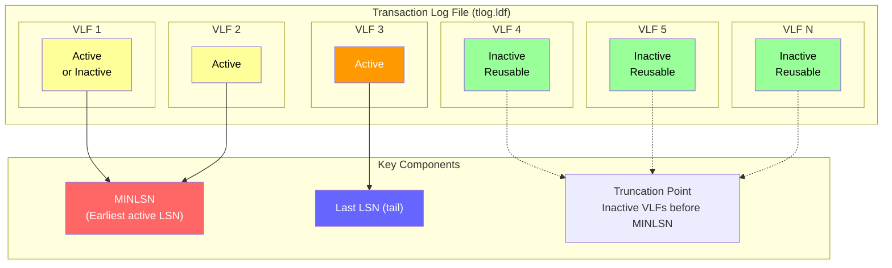
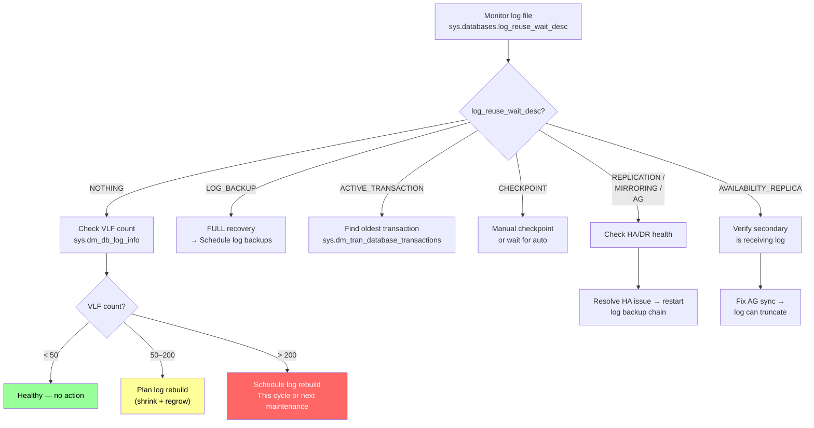

# Transaction Log — Structure and VLFs

## Section 1 — Navigation & Prerequisites

| Navigation | Link |
|-----------|------|
| Previous | [[8.284 TempDB Contention — Metadata and Allocation]] |
| Next | [[8.286 Log File Growth — Auto-Growth Anti-Pattern]] |
| Domain | [[8 — Databases]] |
| Group | [[Group 11 — SQL Server Architecture & Storage Engine]] |

**Prerequisites:**
- [[8.21 SQL Server Transaction Log Internals]] — High-level transaction log concepts
- [[8.19 Pages and Extents Architecture]] — Physical storage structure
- Basic understanding of ACID transactions
- Familiarity with checkpoints and recovery models

**Where This Fits:**
The transaction log is the most critical component for data integrity and recovery in SQL Server. This note covers the internal structure — Virtual Log Files (VLFs), how they are created, how SQL Server manages them, and how to observe this via DMVs and DBCC commands. The next file ([[8.286 Log File Growth — Auto-Growth Anti-Pattern]]) covers operational pitfalls; [[8.287 VLF Fragmentation — Detection and Fix]] covers remediation.

**Cross-Domain References:**
- [[8.286 Log File Growth — Auto-Growth Anti-Pattern]] — Next in sequence
- [[8.287 VLF Fragmentation — Detection and Fix]] — VLF remediation
- [[8.21 SQL Server Transaction Log Internals]] — Foundational concepts
- [[8.274 Locking vs Latching]] — WAL protocol relationship
- [[4.5 Windows Server — Storage Best Practices]] — Log file placement

---

## Section 2 — Core Mental Model

The transaction log is a **circular, append-only write-ahead log (WAL)**:

- **Write-Ahead Logging:** Log records are hardened to disk *before* the data page modification
- **Append-Only:** New log records are appended sequentially; no random I/O
- **Circular:** After a checkpoint and log backup (or log truncation), the inactive portion is reusable

The log is divided into **Virtual Log Files (VLFs)** — variable-sized internal segments that SQL Server manages for easier allocation and truncation.



**VLF Lifecycle:**

| State | Meaning | Color in Diagram |
|-------|---------|------------------|
| Inactive (reusable) | Log records have been checkpointed and backed up | Green |
| Active | Contains uncheckpointed or unbacked-up log records | Yellow/Orange |
| Currently being written | VLF containing the tail of the log (LASTLSN) | Orange |
| MINLSN Earliest | The earliest log record needed for recovery | Red |

**Key Properties:**
- VLF count is determined at **log file creation or growth** time
- VLFs are fixed in size for any given physical segment
- SQL Server tracks VLFs internally in `sys.dm_db_log_info` (2016+) and via `DBCC LOGINFO`
- Active VLFs cannot be truncated — they block log reuse

---

## Section 3 — Deep Mechanics

### 3.1 Write-Ahead Logging Protocol

Every data modification follows this strict sequence:

```
1. BEGIN TRANSACTION (or implicit auto-commit)
2. Log record written to log buffer in memory
3. Data page modified in buffer pool (dirty page)
4. On COMMIT:
   a. Log buffer flushed to disk (log file) — HARDENED
   b. Transaction marked as committed
5. Later, CHECKPOINT writes dirty pages to data files
   a. Writes checkpoint log record
   b. All dirty pages up to that LSN are flushed
   c. Recovery interval tracked
```

**WAL Guarantee:** If a dirty page is written to disk, the corresponding log record is *always* written to disk first (or simultaneously).

```sql
-- DMV to see current active transactions in the log
SELECT database_id, transaction_id,
       database_transaction_begin_time,
       database_transaction_log_record_count,
       database_transaction_log_bytes_used,
       database_transaction_log_bytes_reserved,
       database_transaction_state,
       database_transaction_type
FROM sys.dm_tran_database_transactions
WHERE database_id = DB_ID('YourDatabase');

-- State meanings:
-- 1 = transaction not yet initialized
-- 2 = transaction active
-- 3 = transaction committed
-- 4 = transaction aborted
-- 5 = transaction recovering (recovery phase)
```

### 3.2 VLF Structure Determination

When a log file is created or grown, SQL Server divides the new space into VLFs. The algorithm:

| Log File Size (new or growth increment) | VLF Count | VLF Size |
|----------------------------------------|-----------|----------|
| < 64 MB | 4 | size/4 |
| 64 MB – 1 GB | 8 | size/8 |
| > 1 GB | 16 | size/16 |

**Example:**
- Creating a 1 GB log file → 8 VLFs × 128 MB each
- Growing from 1 GB to 10 GB (+9 GB increment) → 16 VLFs × 576 MB each? No — growth increment of 9 GB > 1 GB, so 16 VLFs × 9/16 GB = 16 × 576 MB

**Critical Implication:**
If you grow the log with many small increments (e.g., 100 MB growth 100 times), each 100 MB growth creates 8 VLFs of 12.5 MB — giving 800 VLFs. This is VLF fragmentation.

```sql
-- See exact VLF breakdown
DBCC LOGINFO('YourDatabase');
-- Result columns:
-- FileId: log file ID (almost always 2)
-- FileSize: VLF size in bytes
-- StartOffset: byte offset in log file
-- FSeqNo: VLF sequence number (monotonically increasing)
-- Status: 0 = inactive (reusable), 2 = active
-- Parity: hardware alignment
-- CreateLSN: LSN when VLF was created
```

### 3.3 Log Reuse Wait Description

The single most important log diagnostic — why the log can't truncate:

```sql
-- Primary diagnostic query
SELECT name, log_reuse_wait, log_reuse_wait_desc
FROM sys.databases
WHERE name = 'YourDatabase';
```

| log_reuse_wait_desc | Meaning | Resolution |
|---------------------|---------|------------|
| NOTHING | Log can be truncated — healthy | None needed |
| CHECKPOINT | No checkpoint has occurred since last log usage | Automatic or manual checkpoint |
| LOG_BACKUP | Log backup hasn't been run (FULL recovery model) | Take a log backup |
| ACTIVE_BACKUP_OR_RESTORE | Backup/restore in progress | Wait for it to complete |
| ACTIVE_TRANSACTION | Long-running transaction | Identify and commit/kill old transaction |
| DATABASE_MIRRORING | Mirroring paused or disconnected | Fix mirroring |
| REPLICATION | Transaction pending replication | Resolve replication latency |
| AVAILABILITY_REPLICA | AG secondary not confirmed receipt | Check AG health |
| ACTIVE_TRANSACTION (with versioning) | Snapshot/DDL with row versioning | Snapshot reads keep version store pinned |

### 3.4 Checkpoint Mechanics

```sql
-- Manual checkpoint
CHECKPOINT [checkpointDuration];

-- Checkpoint types (via undocumented but observable):
/*
  - AUTOMATIC: Based on recovery interval (default 60 seconds)
  - MANUAL: User-issued CHECKPOINT
  - INTERNAL: System events (shutdown, ALTER DB, etc.)
  - INDIRECT: Target recovery time (SQL 2016+, preferred)
     ALTER DATABASE ... SET TARGET_RECOVERY_TIME = 60 (SECONDS)
*/
```

**Checkpoint Behavior:**

| Checkpoint Type | Trigger | Frequency | VLF Effect |
|----------------|---------|-----------|------------|
| Automatic | Recovery interval reached (default ~60s) | Regular | Marks inactive VLFs |
| Manual | User executes CHECKPOINT | On demand | Immediate VLF deactivation |
| Indirect | Based on estimated recovery time | Adaptive | More frequent, smaller batches |
| Internal | ALTER DATABASE, shutdown, etc. | As needed | Varies |

### 3.5 fn_dblog — Reading the Log

The undocumented `fn_dblog()` function reads log records directly:

```sql
-- Count log records
SELECT COUNT(*) AS log_record_count,
       COUNT(DISTINCT TransactionID) AS transaction_count
FROM fn_dblog(NULL, NULL);

-- Find largest transactions by log volume
SELECT [Transaction ID],
       COUNT(*) AS records,
       SUM([Log Record Length]) / 1024.0 AS total_log_kb,
       MIN([Begin Time]) AS begin_time,
       MAX([Commit Time]) AS commit_time
FROM fn_dblog(NULL, NULL)
WHERE [Operation] IN ('LOP_INSERT_ROWS', 'LOP_MODIFY_ROW',
                       'LOP_DELETE_ROWS', 'LOP_BEGIN_XACT', 'LOP_COMMIT_XACT')
GROUP BY [Transaction ID]
ORDER BY total_log_kb DESC;

-- Find log records by operation type
SELECT [Current LSN], [Operation], [Transaction ID],
       [Begin Time], [Transaction Name],
       [Log Record Length], [Page ID]
FROM fn_dblog(NULL, NULL)
WHERE [Operation] LIKE '%INSERT%'
ORDER BY [Current LSN];

-- Important LOP operations:
-- LOP_BEGIN_XACT = Transaction start
-- LOP_COMMIT_XACT = Transaction commit
-- LOP_ABORT_XACT = Transaction rollback
-- LOP_INSERT_ROWS, LOP_MODIFY_ROW, LOP_DELETE_ROWS = Data modifications
-- LOP_CREATE_INDEX, LOP_DROP_INDEX = DDL
-- LOP_MODIFY_HEADER = Page header modification
-- LOP_SET_BITS = Allocation page modifications
-- LOP_CHECKPOINT_START/LOP_CHECKPOINT_END = Checkpoint boundaries
```

### 3.6 sys.dm_tran_database_transactions Deep Dive

```sql
-- Active transaction log consumption
SELECT dt.database_id, DB_NAME(dt.database_id) AS database_name,
       dt.transaction_id,
       dt.database_transaction_begin_time AS begin_time,
       DATEDIFF(SECOND, dt.database_transaction_begin_time, GETDATE()) AS seconds_open,
       dt.database_transaction_log_record_count AS log_records,
       dt.database_transaction_log_bytes_used AS log_bytes_used,
       dt.database_transaction_log_bytes_reserved AS log_bytes_reserved,
       dt.database_transaction_state,
       dt.database_transaction_type,
       CASE dt.database_transaction_type
           WHEN 1 THEN 'Read/Write'
           WHEN 2 THEN 'Read-only'
           WHEN 3 THEN 'System'
           WHEN 4 THEN 'Distributed'
       END AS transaction_type_desc,
       dt.database_transaction_begin_lsn AS begin_lsn,
       -- Format: (vlfuifile:lsn_slot)
       ses.host_name, ses.program_name, ses.login_name
FROM sys.dm_tran_database_transactions dt
JOIN sys.dm_tran_session_transactions st ON dt.transaction_id = st.transaction_id
JOIN sys.dm_exec_sessions ses ON st.session_id = ses.session_id
WHERE dt.database_id > 4  -- exclude system dbs
ORDER BY dt.database_transaction_log_bytes_used DESC;
```

### 3.7 VLF Active/Inactive States

A VLF transitions from active to inactive under these conditions:

```
VLF remains active IF:
  └─ It contains the MINLSN (oldest active log record)
  └─ Any log record in the VLF hasn't been checkpointed +
     └─ Log backup (FULL recovery)
     └─ Checkpoint (SIMPLE recovery)
  └─ A long-running transaction has records in it
  └─ Replication/mirroring hasn't acknowledged up to this point

VLF becomes inactive (reusable) WHEN:
  └─ All log records are checkpointed AND
  └─ Either: log backup taken (FULL) OR checkpoint passed (SIMPLE)
  └─ No active transaction references this VLF
```

```sql
-- VLF count query (key diagnostic)
SELECT COUNT(*) AS vlf_count,
       SUM(CASE WHEN status = 2 THEN 1 ELSE 0 END) AS active_vlfs,
       SUM(CASE WHEN status = 0 THEN 1 ELSE 0 END) AS inactive_vlfs,
       MIN(CASE WHEN status = 2 THEN file_size ELSE NULL END) / 1048576.0 AS min_active_size_mb,
       MAX(CASE WHEN status = 2 THEN file_size ELSE NULL END) / 1048576.0 AS max_active_size_mb
FROM sys.dm_db_log_info(DB_ID('YourDatabase'));

-- Alternative via DBCC LOGINFO (all versions)
CREATE TABLE #vlf_info (
    fileid INT, file_size BIGINT, start_offset BIGINT,
    fseqno INT, status INT, parity INT, create_lsn NUMERIC(25,0)
);
INSERT INTO #vlf_info
EXEC sp_executesql N'DBCC LOGINFO(''YourDatabase'')';
SELECT * FROM #vlf_info;
DROP TABLE #vlf_info;
```

---

## Section 4 — Production Patterns

### 4.1 Log Space Monitoring

```sql
-- Primary log space usage query
SELECT db.name,
       db.log_reuse_wait_desc,
       mf.size/128 AS log_size_mb,
       mf.size/128 - CAST(mf.size AS BIGINT)/128 + 
           CAST(FILEPROPERTY(mf.name, 'SpaceUsed') AS INT)/128 AS log_free_mb,
       CAST(100.0 * (CAST(mf.size AS BIGINT)/128 - 
           CAST(FILEPROPERTY(mf.name, 'SpaceUsed') AS INT)/128) /
           (mf.size/128) AS DECIMAL(5,2)) AS free_pct
FROM sys.databases db
JOIN sys.master_files mf ON db.database_id = mf.database_id
WHERE mf.type = 1  -- log files only
ORDER BY free_pct;
```

### 4.2 VLF Analysis Script

```sql
-- Complete VLF health check
WITH vlf AS (
    SELECT DB_NAME(database_id) AS db_name,
           vlf_sequence_number,
           vlf_active,
           vlf_size_bytes / 1048576.0 AS vlf_size_mb
    FROM sys.dm_db_log_info(DB_ID())
),
vlf_summary AS (
    SELECT db_name,
           COUNT(*) AS total_vlfs,
           SUM(CASE WHEN vlf_active = 1 THEN 1 ELSE 0 END) AS active_vlfs,
           SUM(CASE WHEN vlf_active = 0 THEN 1 ELSE 0 END) AS inactive_vlfs,
           AVG(vlf_size_mb) AS avg_vlf_size_mb,
           MIN(vlf_size_mb) AS min_vlf_size_mb,
           MAX(vlf_size_mb) AS max_vlf_size_mb,
           SUM(vlf_size_mb) AS total_log_size_mb
    FROM vlf
    GROUP BY db_name
)
SELECT db_name, total_vlfs, active_vlfs, inactive_vlfs,
       avg_vlf_size_mb, min_vlf_size_mb, max_vlf_size_mb,
       total_log_size_mb,
       CASE
           WHEN total_vlfs < 50 THEN 'Healthy'
           WHEN total_vlfs BETWEEN 50 AND 200 THEN 'Warning — schedule rebuild'
           WHEN total_vlfs BETWEEN 200 AND 1000 THEN 'Critical — plan rebuild soon'
           ELSE 'Severe — rebuild log immediately'
       END AS vlf_health
FROM vlf_summary;

-- VLF size variance (indicator of mixed-growth VLFs)
SELECT vlf_sequence_number, vlf_size_mb,
       CASE
           WHEN vlf_size_mb < (SELECT AVG(vlf_size_bytes)/1048576.0
                               FROM sys.dm_db_log_info(DB_ID())) * 0.5
               THEN 'Small VLF — fragmentation indicator'
           ELSE 'Normal'
       END AS size_assessment
FROM (
    SELECT vlf_sequence_number,
           vlf_size_bytes / 1048576.0 AS vlf_size_mb,
           vlf_active
    FROM sys.dm_db_log_info(DB_ID())
) vlf_data;
```

### 4.3 Log Backup Monitoring (FULL Recovery)

```sql
-- Log backup frequency check
SELECT database_name,
       MAX(backup_finish_date) AS last_log_backup,
       DATEDIFF(MINUTE, MAX(backup_finish_date), GETDATE()) AS minutes_since_last_backup,
       CASE
           WHEN DATEDIFF(MINUTE, MAX(backup_finish_date), GETDATE()) > 60
               THEN 'OVERDUE — log will not truncate'
           ELSE 'OK'
       END AS status
FROM msdb.dbo.backupset
WHERE type = 'L'  -- Log backup
  AND database_name = DB_NAME()
GROUP BY database_name;

-- Log growth rate estimation
DECLARE @start_size BIGINT, @end_size BIGINT, @hours INT = 24;
SELECT @start_size = size
FROM msdb.dbo.backupfile
WHERE database_name = DB_NAME()
  AND file_type = 'L'
  AND backup_set_id = (SELECT MAX(backup_set_id) FROM msdb.dbo.backupset
                       WHERE database_name = DB_NAME() AND type = 'L'
                       AND backup_finish_date < DATEADD(HOUR, -@hours, GETDATE()));

SELECT @end_size = size
FROM msdb.dbo.backupfile
WHERE database_name = DB_NAME()
  AND file_type = 'L'
  AND backup_set_id = (SELECT MAX(backup_set_id) FROM msdb.dbo.backupset
                       WHERE database_name = DB_NAME() AND type = 'L');

SELECT (@end_size - @start_size) * 8.0 / 1024 / @hours AS growth_mb_per_hour;
```

### 4.4 Recovery Model and Truncation Logic

```sql
-- Recovery model check
SELECT name, recovery_model_desc,
       log_reuse_wait_desc,
       is_auto_shrink_on,
       is_auto_create_stats_on
FROM sys.databases
WHERE name NOT IN ('master', 'tempdb', 'model', 'msdb');

-- In SIMPLE recovery: log truncates at CHECKPOINT
-- In FULL recovery: log truncates at LOG BACKUP
-- In BULK_LOGGED: log truncates at LOG BACKUP (minimally logged ops are full)

-- Test how much log a single transaction generates
DECLARE @before BIGINT, @after BIGINT;
SELECT @before = database_transaction_log_bytes_used
FROM sys.dm_tran_database_transactions
WHERE database_id = DB_ID();

-- Run your operation here
UPDATE TOP(10000) YourTable SET col = col;

SELECT @after = database_transaction_log_bytes_used
FROM sys.dm_tran_database_transactions
WHERE database_id = DB_ID();

SELECT (@after - @before) / 1024.0 AS log_bytes_used_by_txn;
```

### 4.5 Log File Performance Counters

```sql
-- Log flush wait stats
SELECT wait_type, wait_time_ms, waiting_tasks_count,
       wait_time_ms / NULLIF(waiting_tasks_count, 0) AS avg_wait_ms
FROM sys.dm_os_wait_stats
WHERE wait_type IN ('WRITELOG', 'LOGBUFFER', 'LOG_RATE_GOVERNOR',
                    'LOGMGR_RESERVE_APPEND', 'LOGMGR_FLUSH',
                    'LOGMGR_PMM_LOG', 'HADR_LOGCAPTURE_SYNC');

-- Log throughput
SELECT counter_name, cntr_value,
       CASE WHEN counter_name LIKE '%Flush%' THEN cntr_value
            WHEN counter_name LIKE '%Bytes%' THEN cntr_value / 1048576.0
            ELSE cntr_value
       END AS value_with_units
FROM sys.dm_os_performance_counters
WHERE object_name LIKE '%Database%'
  AND instance_name = DB_NAME()
  AND counter_name IN (
      'Log Bytes Flushed/sec',
      'Log Flushes/sec',
      'Log Flush Wait Time',
      'Log Flush Waits/sec',
      'Log Growths',
      'Log Shrinks'
  );
```

---

## Section 5 — Gotchas

### Gotcha 1: Log File Not in SIMPLE Recovery Mode

| Aspect | Detail |
|--------|--------|
| **Pitfall** | User database left in FULL recovery with infrequent log backups |
| **Symptom** | `log_reuse_wait_desc = LOG_BACKUP`; log file grows unbounded; VLF count skyrockets |
| **Fix** | Schedule regular log backups or switch to SIMPLE if point-in-time recovery not needed |
| **Cost** | Log fills disk; VLFs exceed 10,000 (severe fragmentation); restore time increases |

**Detection:**
```sql
-- Databases with log backup issues
SELECT name, recovery_model_desc, log_reuse_wait_desc,
       (SELECT COUNT(*) FROM sys.dm_db_log_info(database_id)) AS vlf_count
FROM sys.databases
WHERE log_reuse_wait_desc NOT IN ('NOTHING', 'CHECKPOINT')
  AND database_id > 4;
```

### Gotcha 2: Long-Running Transaction Blocks VLF Reuse

| Aspect | Detail |
|--------|--------|
| **Pitfall** | An open transaction holds MINLSN at its first log record |
| **Symptom** | `log_reuse_wait_desc = ACTIVE_TRANSACTION`; all VLFs after MINLSN are active; log cannot shrink |
| **Fix** | Identify and commit or kill the blocking transaction; never shrink as permanent fix |
| **Cost** | Log expansion forced; growth events slow all writers; eventual disk-full condition |

```sql
-- Find the offending transaction
SELECT dt.database_transaction_begin_time,
       DATEDIFF(MINUTE, dt.database_transaction_begin_time, GETDATE()) AS minutes_active,
       s.host_name, s.program_name, s.login_name,
       s.session_id,
       r.command, r.status,
       SUBSTRING(t.text, (r.statement_start_offset/2)+1,
           (CASE WHEN r.statement_end_offset = -1
                 THEN LEN(CONVERT(NVARCHAR(MAX), t.text))*2
                 ELSE r.statement_end_offset - r.statement_start_offset
            END)/2) AS query_text
FROM sys.dm_tran_database_transactions dt
JOIN sys.dm_tran_session_transactions st ON dt.transaction_id = st.transaction_id
JOIN sys.dm_exec_sessions s ON st.session_id = s.session_id
LEFT JOIN sys.dm_exec_requests r ON s.session_id = r.session_id
OUTER APPLY sys.dm_exec_sql_text(r.sql_handle) t
WHERE dt.database_id = DB_ID()
ORDER BY dt.database_transaction_begin_time;
```

### Gotcha 3: Small Growth Increments Create VLF Fragmentation

| Aspect | Detail |
|--------|--------|
| **Pitfall** | Default auto-growth of 10% or small fixed increments (e.g., 100 MB) |
| **Symptom** | Thousands of VLFs; DBCC LOGINFO shows 50+ rows; log operations slower |
| **Fix** | Pre-size log file to target size; set growth increment to a large value (≥4 GB) |
| **Cost** | VLF > 1000 → CHECKPOINT, log backup, and crash recovery all severely degraded |

### Gotcha 4: Shrinking Log Then Growing (Cycle)

| Aspect | Detail |
|--------|--------|
| **Pitfall** | Regular pattern: shrink log file → it grows again → shrink again |
| **Symptom** | Alternating small and large VLFs; fragmentation; extra 16 VLFs per shrink-then-grow |
| **Fix** | Stop shrinking log. Set appropriate file size. Use growth increment that yields proper VLFs. |
| **Cost** | Performance seesaw; fragmentation buildup; DBA time wasted on cycle |

### Gotcha 5: Indirect Checkpoint with Very Large Log

| Aspect | Detail |
|--------|--------|
| **Pitfall** | Setting TARGET_RECOVERY_TIME too aggressive (e.g., 5 seconds) on OLTP with large log |
| **Symptom** | Very frequent checkpoints; high WRITELOG waits; checkpoint writes hammer I/O |
| **Fix** | Set TARGET_RECOVERY_TIME to 60–120 seconds; test impact on recovery time vs runtime overhead |
| **Cost** | Up to 30% throughput reduction from excessive checkpoint I/O |

---

## Section 6 — Performance Implications

### 6.1 VLF Count Impact on Operations

| VLF Count | CHECKPOINT Impact | Log Backup Duration | Crash Recovery Time |
|-----------|-------------------|---------------------|---------------------|
| <50 | Minimal | Baseline | Baseline |
| 50–200 | 20–50% slower | 20% slower | 20% slower |
| 200–1,000 | 2–5x slower | 50% slower | 50% slower |
| 1,000–10,000 | 5–20x slower | 2–5x slower | 2–5x slower |
| >10,000 | >20x slower | >5x slower | >5x slower |

### 6.2 WRITELOG Wait Analysis

```sql
-- Log-related waits
SELECT wait_type,
       wait_time_ms,
       waiting_tasks_count,
       wait_time_ms / NULLIF(waiting_tasks_count, 0) AS avg_wait_ms,
       max_wait_time_ms
FROM sys.dm_os_wait_stats
WHERE wait_type IN ('WRITELOG', 'LOGBUFFER', 'LOGMGR_RESERVE_APPEND')
ORDER BY wait_time_ms DESC;
```

**Benchmark Observations:**
| Wait Type | Healthy (ms/sec) | Problematic (ms/sec) | Action Threshold |
|-----------|-----------------|---------------------|------------------|
| WRITELOG | <1,000 | >10,000 | Check log disk latency |
| LOGBUFFER | <100 | >1,000 | Check log buffer sizing |
| LOG_RATE_GOVERNOR | 0 | >5,000 | Resource Governor throttling |

### 6.3 Log Throughput by VLF Health

| Configuration | Log Throughput (MB/s) | P99 Flush Duration (ms) | Notes |
|--------------|----------------------|------------------------|-------|
| <50 VLFs, proper size | 200+ | <5 | Optimal |
| 200 VLFs, mixed sizes | 120 | 15 | Moderate degradation |
| 1,000 VLFs | 45 | 42 | Significant impact |
| 5,000+ VLFs | 12 | 180 | Severe — needs rebuild |

### 6.4 Auto-Growth Cost Model

```
Each auto-growth event:
  1. Space in log file must be zero-initialized (instant file init NOT available for log)
  2. Zero-fill time = growth_size / write_speed
  3. During zero-fill, all log writes are blocked
  4. After zero-fill, new VLFs are created

Example: 1 GB growth on 200 MB/s disk
  → 5 seconds of blocking
  → 16 new VLFs added
  → Transaction latency spikes by 5+ seconds
```

---

## Section 7 — Interview Arsenal

### 7.1 Common Questions

| # | Question | Expectation |
|---|----------|-------------|
| 1 | What is a VLF and how is it created? | Internal log segment; count determined by growth size |
| 2 | How does write-ahead logging work? | Log first, data second; WAL protocol |
| 3 | What DMV shows log reuse wait reasons? | sys.databases.log_reuse_wait_desc |
| 4 | What is MINLSN and why does it matter? | Earliest active log record; blocks VLF reuse ahead of it |
| 5 | How does checkpoint affect VLF status? | Marks VLFs as inactive (reusable) after pages flushed |
| 6 | What log operations can fn_dblog reveal? | All transaction log records including DDL and DML |
| 7 | What is the ideal VLF count for a database? | <50 per file; never exceed 200 without a plan |
| 8 | How does the recovery model affect log truncation? | SIMPLE: checkpoint; FULL: log backup |

### 7.2 Spoken Answers

**Q1: What is a VLF?**
"A Virtual Log File is an internal segment that SQL Server uses to manage the transaction log space. When the log file is created or grows, SQL Server divides the new space into VLFs. The number of VLFs depends on the size: less than 64 MB gets 4 VLFs, between 64 MB and 1 GB gets 8 VLFs, and larger than 1 GB gets 16 VLFs. VLFs cycle through active and inactive states. When a VLF is inactive, its space can be reused. The total number of VLFs is critical — under 50 is healthy, 200 is a warning, and over 1,000 causes significant performance degradation for checkpoints, log backups, and crash recovery."

**Q4: What is MINLSN?**
"MINLSN — Minimum Log Sequence Number — is the oldest log record that is still needed for recovery or other operations. It's the earliest point that recovery must start from if SQL Server crashes. All VLFs containing log records before MINLSN are inactive and reusable. All VLFs at or after MINLSN are active. The MINLSN position is determined by the oldest open transaction, the oldest replication or mirroring transaction not yet acknowledged, or the oldest log backup not yet taken in full recovery mode. A long-running transaction causes MINLSN to stay old and prevents VLF reuse."

**Q6: What information can you get from fn_dblog?**
"fn_dblog(NULL, NULL) reads the active portion of the transaction log. It exposes every log record including transaction boundaries, data modifications, page allocations, index operations, and checkpoints. You can analyze log record count per transaction, total log bytes used by a transaction, page-level changes in LOP_INSERT_ROWS or LOP_MODIFY_ROW operations, and identify which transactions consumed the most log space. It's invaluable for troubleshooting log growth, identifying large transactions, and understanding what operations are generating the most log volume."

### 7.3 Comparison Table

| Feature | DBCC LOGINFO | sys.dm_db_log_info | fn_dblog |
|---------|-------------|-------------------|----------|
| Available since | All versions | SQL 2016+ | All versions |
| Returns | VLF list | VLF list | Log records |
| Performance | Reads metadata | Lightweight | Heavy (scans log) |
| Use case | VLF count, size, status | Same, T-SQL-compatible | Log record analysis |
| Columns | 7 | 17+ | 120+ |
| Active VLF status | Status = 2 | vlf_active = 1 | Not directly |

---

## Section 8 — Decision Framework

### 8.1 Log Management Flowchart



### 8.2 Log File Configuration Checklist

- [ ] Log pre-sized to match peak workload (never rely on autogrowth)
- [ ] Growth increment set to a large fixed value (≥4 GB), never percent
- [ ] VLF count < 50 verified via `sys.dm_db_log_info`
- [ ] Recovery model aligned with business RPO requirements
- [ ] Log backups scheduled with frequency matching log generation rate
- [ ] `log_reuse_wait_desc` checked daily as part of health check
- [ ] Log file on low-latency, write-optimized storage (separate from data if possible)
- [ ] `WRITELOG` waits monitored and compared to baseline
- [ ] Long-running transaction monitoring in place
- [ ] TARGET_RECOVERY_TIME configured appropriately (indirect checkpoint)

### 8.3 Tradeoffs

| Approach | Pros | Cons |
|----------|------|------|
| Pre-sized log (large) | No autogrowth, low VLF count | Upfront disk allocation |
| Percent growth | Automatic, simple | Exponential growth, tiny VLFs |
| Fixed growth | Predictable VLF size | Requires manual estimation |
| SIMPLE recovery | Log auto-truncates | No point-in-time restore |
| Indirect checkpoint | Controlled recovery time | More frequent I/O |

### 8.4 Scale Thresholds

| Database Size | Log Size | VLF Target | Growth Increment | Recovery Model |
|---------------|----------|------------|------------------|----------------|
| OLTP < 50 GB | 8 GB | <50 | 2 GB | SIMPLE or FULL |
| OLTP 50–500 GB | 32 GB | <50 | 4 GB | FULL + log backup |
| OLTP > 500 GB | 64 GB | <50 | 8 GB | FULL + frequent log backups |
| DW/Reporting | 64 GB+ | <50 | 16 GB | SIMPLE or BULK_LOGGED |
| TempDB | 16 GB | <50 | 4 GB | SIMPLE (always) |

---

## Section 9 — Self-Check

### 9.1 Conceptual Questions

**Q1:** What determines the number of VLFs created during a log file growth event?

**Q2:** How does `log_reuse_wait_desc = ACTIVE_TRANSACTION` happen and what is the fix?

**Q3:** What is the difference between automatic, manual, and indirect checkpoint?

**Q4:** Why can't instant file initialization be used for transaction log files?

**Q5:** What columns in `sys.dm_db_log_info` indicate VLF health?

**Q6:** How does the write-ahead logging (WAL) protocol guarantee durability?

**Q7:** What is the impact of having 5,000+ VLFs on crash recovery time?

**Q8:** How does the SIMPLE recovery model truncate the log differently from FULL?

**Q9:** What does `fn_dblog` return and when would you use it?

**Q10:** What is the relationship between MINLSN and VLF state?

<details>
<summary>Answers</summary>

**A1:** The growth increment size: <64 MB → 4 VLFs; 64 MB–1 GB → 8 VLFs; >1 GB → 16 VLFs. The VLF size = growth_increment / VLF_count.

**A2:** A long-running transaction holds a reference to the first log record it generated, advancing MINLSN not past that point. Fix: commit or kill the oldest transaction. Detect via `sys.dm_tran_database_transactions` joined with `sys.dm_exec_sessions`.

**A3:** Automatic checkpoint triggers based on recovery interval (default 60s, ~20% of log filled). Manual is user-issued CHECKPOINT. Indirect checkpoint targets a specific recovery time goal (TARGET_RECOVERY_TIME, 2016+), adapting checkpoint frequency and dirty page threshold per database.

**A4:** Log files contain sequential records that must be zero-initialized to ensure all bytes are physically allocated for consistent crash recovery. Instant file init would create sparse files, risking 'log file is full' errors and corruption on recovery.

**A5:** `vlf_size_bytes` (consistency), `vlf_active` (active count), `vlf_sequence_number` (monotonic — gaps may indicate corruption). The count of rows = total VLFs.

**A6:** WAL ensures that log records are hardened to disk *before* the associated dirty page is written. On crash recovery, the log is replayed from MINLSN to the last hardened record. Any in-flight transactions at crash are rolled back. This guarantees atomicity and durability (A and D in ACID).

**A7:** Crash recovery reads all VLFs from MINLSN to end. With 5,000+ VLFs, scanning the VLF boundary metadata takes significantly longer. Each VLF must be examined for active records. Recovery time can increase 5–10x compared to <50 VLFs.

**A8:** SIMPLE: log truncation happens automatically at checkpoint — inactive VLFs become reusable immediately. FULL: log truncation only happens when a log backup is taken. The log cannot reuse space until the backup captures those records.

**A9:** fn_dblog(NULL, NULL) returns a table of all current transaction log records with 120+ columns of metadata. Use it to analyze log record distribution, find large transactions, investigate index rebuild log usage, or audit page-level changes.

**A10:** MINLSN determines which VLFs are active. Every VLF that contains log records from MINLSN to the tail of the log is active (status=2). VLFs containing only records before MINLSN are inactive and reusable. A long-running transaction at LSN X means MINLSN = X, making all VLFs from the one containing X forward active.

</details>

### 9.2 Hands-On Challenges

**Challenge 1:** Write a query that returns the VLF count, active VLF count, average VLF size, and health assessment for every database on the instance.

**Challenge 2:** Write a script to capture log space usage, log reuse wait reason, and VLF count, and insert the results into a monitoring table with a timestamp.

**Challenge 3:** Use fn_dblog to identify the largest transaction by log bytes in the last hour.

**Challenge 4:** Write a query that finds all databases where VLF count exceeds 200 and recovery model is FULL but log backups are more than 24 hours old.

**Challenge 5:** Create a procedure that rebuilds a log file to a target size with proper VLF count (e.g., 8 GB log with 16 VLFs of 512 MB each).

<details>
<summary>Challenge Solutions</summary>

**C1:**
```sql
SELECT DB_NAME(database_id) AS database_name,
       COUNT(*) AS vlf_count,
       SUM(CASE WHEN vlf_active = 1 THEN 1 ELSE 0 END) AS active_vlfs,
       AVG(vlf_size_bytes / 1048576.0) AS avg_vlf_size_mb,
       CASE
           WHEN COUNT(*) < 50 THEN 'Healthy'
           WHEN COUNT(*) BETWEEN 50 AND 200 THEN 'Warning'
           ELSE 'Critical'
       END AS health
FROM sys.dm_db_log_info(NULL)
GROUP BY database_id
ORDER BY vlf_count DESC;
```

**C2:**
```sql
IF OBJECT_ID('dbo.log_monitor') IS NULL
    CREATE TABLE dbo.log_monitor (
        database_name NVARCHAR(128),
        capture_time DATETIME2 DEFAULT GETDATE(),
        log_size_mb INT,
        log_used_mb INT,
        log_free_pct DECIMAL(5,2),
        log_reuse_wait_desc NVARCHAR(60),
        vlf_count INT
    );

INSERT INTO dbo.log_monitor (database_name, log_size_mb, log_used_mb,
                              log_free_pct, log_reuse_wait_desc, vlf_count)
SELECT db.name,
       mf.size/128,
       mf.size/128 - CAST(FILEPROPERTY(mf.name, 'SpaceUsed') AS INT)/128,
       CAST(100.0 * (mf.size/128 - CAST(FILEPROPERTY(mf.name, 'SpaceUsed') AS INT)/128) /
            (mf.size/128) AS DECIMAL(5,2)),
       db.log_reuse_wait_desc,
       (SELECT COUNT(*) FROM sys.dm_db_log_info(db.database_id))
FROM sys.databases db
JOIN sys.master_files mf ON db.database_id = mf.database_id
WHERE mf.type = 1;
```

**C3:**
```sql
SELECT TOP 5 [Transaction ID],
       COUNT(*) AS log_records,
       SUM([Log Record Length]) / 1048576.0 AS total_log_mb,
       MIN([Begin Time]) AS first_record_time,
       MAX([Commit Time]) AS last_commit_time
FROM fn_dblog(NULL, NULL)
WHERE [Operation] IN ('LOP_BEGIN_XACT', 'LOP_COMMIT_XACT')
GROUP BY [Transaction ID]
ORDER BY total_log_mb DESC;
```

**C4:**
```sql
WITH vlf_counts AS (
    SELECT database_id, COUNT(*) AS vlf_count
    FROM sys.dm_db_log_info(NULL)
    GROUP BY database_id
),
last_log_backup AS (
    SELECT database_name, MAX(backup_finish_date) AS last_backup
    FROM msdb.dbo.backupset
    WHERE type = 'L'
    GROUP BY database_name
)
SELECT db.name, db.recovery_model_desc, vlf_count,
       llb.last_backup,
       DATEDIFF(HOUR, llb.last_backup, GETDATE()) AS hours_since_log_backup
FROM sys.databases db
JOIN vlf_counts vc ON db.database_id = vc.database_id
LEFT JOIN last_log_backup llb ON db.name = llb.database_name
WHERE db.database_id > 4
  AND vlf_count > 200
  AND db.recovery_model_desc = 'FULL'
  AND (llb.last_backup IS NULL OR DATEDIFF(HOUR, llb.last_backup, GETDATE()) > 24)
ORDER BY vlf_count DESC;
```

**C5:**
```sql
CREATE PROCEDURE dbo.RebuildTransactionLog
    @DatabaseName NVARCHAR(128),
    @TargetSizeMB INT = 8192
AS
BEGIN
    SET NOCOUNT ON;
    DECLARE @sql NVARCHAR(MAX);

    -- 1. Backup log (if FULL recovery)
    IF (SELECT recovery_model_desc FROM sys.databases
        WHERE name = @DatabaseName) = 'FULL'
    BEGIN
        SET @sql = 'BACKUP LOG ' + QUOTENAME(@DatabaseName) +
                   ' TO DISK = ''NUL:''';
        EXEC sp_executesql @sql;
    END

    -- 2. Shrink log to minimal
    SET @sql = 'DBCC SHRINKFILE(' +
               (SELECT mf.name FROM sys.master_files mf
                WHERE mf.database_id = DB_ID(@DatabaseName) AND mf.type = 1) +
               ', 1)';
    EXEC sp_executesql @sql;

    -- 3. Grow to target size (creates 16 VLFs)
    SET @sql = 'ALTER DATABASE ' + QUOTENAME(@DatabaseName) +
               ' MODIFY FILE (NAME = ' +
               (SELECT mf.name FROM sys.master_files mf
                WHERE mf.database_id = DB_ID(@DatabaseName) AND mf.type = 1) +
               ', SIZE = ' + CAST(@TargetSizeMB AS NVARCHAR) + 'MB)';
    EXEC sp_executesql @sql;

    -- 4. Verify VLF count
    EXEC sp_executesql N'SELECT COUNT(*) AS vlf_count
        FROM sys.dm_db_log_info(DB_ID(@db))',
        N'@db NVARCHAR(128)', @DatabaseName;
END;
```

</details>
