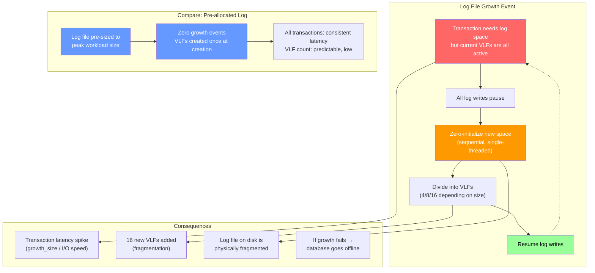
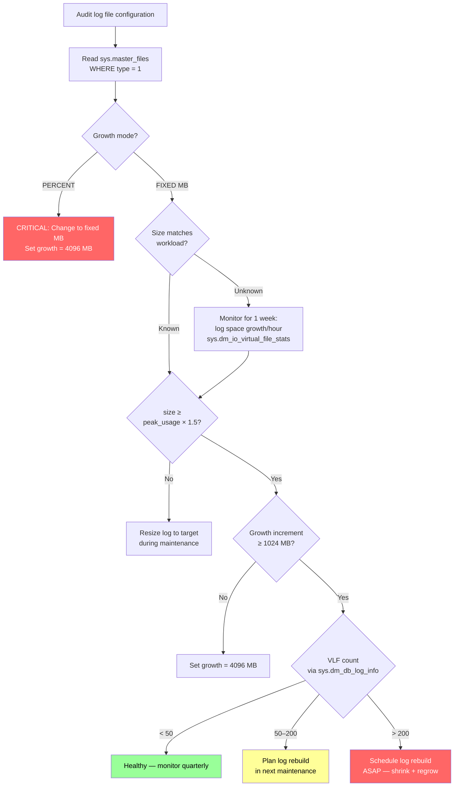

# Log File Growth — Auto-Growth Anti-Pattern

## Section 1 — Navigation & Prerequisites

| Navigation | Link |
|-----------|------|
| Previous | [[8.285 Transaction Log — Structure and VLFs]] |
| Next | [[8.287 VLF Fragmentation — Detection and Fix]] |
| Domain | [[8 — Databases]] |
| Group | [[Group 11 — SQL Server Architecture & Storage Engine]] |

**Prerequisites:**
- [[8.285 Transaction Log — Structure and VLFs]] (foundation — VLF structure and lifecycle)
- [[8.287 VLF Fragmentation — Detection and Fix]] (consequences of poor growth)
- Understanding of transaction log architecture from [[8.21 SQL Server Transaction Log Internals]]
- Familiarity with default trace and system health session

**Where This Fits:**
Auto-growth is a safety net, not a sizing strategy. Relying on auto-growth for log files is one of the most common and destructive anti-patterns in SQL Server. Each growth event causes I/O stalls (zero-fill), generates poorly-sized VLFs, and fragments the log. This note covers the mechanics of auto-growth, how to detect it via default trace and DMVs, and how to design a zero-growth log file strategy.

**Cross-Domain References:**
- [[8.285 Transaction Log — Structure and VLFs]] — VLF creation mechanics
- [[8.287 VLF Fragmentation — Detection and Fix]] — Remediation
- [[8.21 SQL Server Transaction Log Internals]] — WAL protocol and log architecture
- [[8.108 Wait Stats Collection and Analysis]] — WRITELOG waits
- [[4.5 Windows Server — Storage Best Practices]] — Log file I/O patterns

---

## Section 2 — Core Mental Model

Auto-growth is the **last resort** for log space management — it is slow, blocking, and produces fragmentation.



**The Core Problem:**

| Aspect | Auto-Growth (Anti-Pattern) | Pre-Allocated (Best Practice) |
|--------|---------------------------|-------------------------------|
| VLF creation timing | During production workload | During maintenance window |
| VLF count | Accumulates (16 per event) | Fixed at creation |
| Performance impact | 100% of writers blocked | Zero |
| Disk space | Grows on demand | Reserved upfront |
| VLF size consistency | Mixed (large + small) | Uniform |
| Error risk | Disk-full at runtime | Pre-verified |

**Key Principle:** The transaction log **must be pre-sized** to accommodate the maximum log generation between log truncation events (checkpoint or log backup). If the log grows at runtime, the growth event itself exacerbates the problem — creating more VLFs, which worsens VLF fragmentation, which slows future checkpoint and backup operations.

---

## Section 3 — Deep Mechanics

### 3.1 Auto-Growth Internal Flow

When a transaction needs to write a log record but all VLFs are active:

```
Step 1: Session X calls Log Reserve
Step 2: No space in active VLFs
Step 3: Log manager initiates growth:
   a. Acquire log growth mutex (single-threaded — only one growth at a time)
   b. Extend file size on disk (FILE_WRITE)
   c. Zero-initialize new space:
      - 100 MB growth → write 100 MB of zeros sequentially
      - During this time, all other log writes are WAITING
   d. Divide new space into VLFs:
      - growth < 64 MB → 4 VLFs
      - 64 MB ≤ growth < 1 GB → 8 VLFs
      - growth ≥ 1 GB → 16 VLFs
   e. Update internal VLF tracking structures
   f. Release mutex, resume log writes
Step 4: Session X continues (but all other sessions waited)
```

**DMV Observability of the Growth Event:**

```sql
-- Detection 1: Default trace captures log file growth events
DECLARE @tracefile NVARCHAR(500);
SELECT @tracefile = REVERSE(SUBSTRING(REVERSE(path),
                           CHARINDEX('\', REVERSE(path)), 255)) + N'log.trc'
FROM sys.traces WHERE is_default = 1;

SELECT te.name AS event_name, t.DatabaseName, t.FileName,
       t.StartTime, t.EndTime, t.IntegerData, t.ApplicationName,
       t.HostName, t.LoginName
FROM fn_trace_gettable(@tracefile, DEFAULT) t
JOIN sys.trace_events te ON t.EventClass = te.trace_event_id
WHERE te.name IN ('Data File Auto Grow', 'Log File Auto Grow')
ORDER BY t.StartTime DESC;

-- Detection 2: Performance counters
SELECT object_name, counter_name, instance_name, cntr_value
FROM sys.dm_os_performance_counters
WHERE counter_name IN ('Log Growths', 'Log Shrinks')
  AND instance_name = '_Total';
```

### 3.2 Why Log Growth Is Worse Than Data File Growth

| Feature | Data File Growth | Log File Growth |
|---------|-----------------|-----------------|
| I/O pattern | Instant file init → no zero-fill | Must zero-initialize |
| Blocking scope | Only session requesting | All sessions writing to log |
| Frequency | Moderate (workload spikes) | Every truncation cycle |
| VLF count | N/A | Fragments log |
| Restart for multi-file | Not required (proportional fill) | Single log file always |

**The Instant File Init Exclusion:**
```sql
-- Data files: instant file init skips zero-fill → growth takes <1 ms
-- Log files: instant file init does NOT apply → growth takes size / I/O speed
--   Example: 1 GB growth on 200 MB/s disk = 5+ seconds of blocking
--   Reason: Log files must be contiguous and zero-filled for crash recovery safety
```

### 3.3 Default Trace Deep Dive

The default trace retains 5 files of 20 MB each, rolling over. Log growth events are EventClass 93.

```sql
-- Full log growth history from default trace
DECLARE @trace_path NVARCHAR(500);
SELECT @trace_path = REVERSE(SUBSTRING(REVERSE(path),
                          CHARINDEX('\', REVERSE(path)), 255)) + N'log.trc'
FROM sys.traces WHERE is_default = 1;

WITH trace_data AS (
    SELECT t.DatabaseName,
           t.StartTime,
           t.IntegerData AS growth_size_mb,  -- Growth in pages (8 KB)
           t.FileType,                        -- 0 = data, 1 = log
           ROW_NUMBER() OVER (PARTITION BY t.DatabaseName, t.FileName
                              ORDER BY t.StartTime) AS growth_number
    FROM fn_trace_gettable(@trace_path, DEFAULT) t
    WHERE t.EventClass IN (92, 93)  -- 92=Data, 93=Log auto-grow
      AND t.DatabaseName NOT IN ('master', 'tempdb')
)
SELECT DatabaseName,
       COUNT(*) AS total_growth_events,
       SUM(growth_size_mb * 8) AS total_growth_mb,  -- pages * 8 KB
       AVG(growth_size_mb * 8) AS avg_growth_mb,
       MIN(StartTime) AS first_growth,
       MAX(StartTime) AS last_growth,
       DATEDIFF(HOUR, MIN(StartTime), MAX(StartTime)) AS hours_tracked,
       COUNT(*) * 1.0 / NULLIF(DATEDIFF(HOUR, MIN(StartTime), MAX(StartTime)), 0) AS growth_per_hour
FROM trace_data
WHERE DatabaseName IS NOT NULL
GROUP BY DatabaseName
ORDER BY total_growth_events DESC;
```

### 3.4 Log Growth Wait Analysis

Each growth event surfaces as a burst of WRITELOG waits:

```sql
-- Capture WRITELOG baseline
DECLARE @writelog_before BIGINT;
SELECT @writelog_before = wait_time_ms
FROM sys.dm_os_wait_stats WHERE wait_type = 'WRITELOG';

-- (Simulated: growth event happens here)

-- After growth event, compare:
SELECT wait_type, wait_time_ms - @writelog_before AS growth_wait_ms
FROM sys.dm_os_wait_stats
WHERE wait_type = 'WRITELOG';

-- Real-time spike detection
SELECT wait_type, wait_time_ms, waiting_tasks_count,
       wait_time_ms / NULLIF(waiting_tasks_count, 0) AS avg_wait_ms
FROM sys.dm_os_wait_stats
WHERE wait_type IN ('WRITELOG', 'LOGBUFFER', 'LOGMGR_RESERVE_APPEND')
ORDER BY wait_time_ms DESC;
```

### 3.5 Growth Grain: Fixed vs Percent

**Percent Growth (Anti-Pattern: e.g., FILEGROWTH = 10%):**

| Current Size | Growth (10%) | VLF Count | VLF Size | Problem |
|-------------|-------------|-----------|----------|---------|
| 512 MB | 51 MB | 8 | 6.4 MB | Tiny VLFs |
| 1 GB | 102 MB | 8 | 12.8 MB | Still small |
| 10 GB | 1 GB | 16 | 64 MB | Large jump |
| 100 GB | 10 GB | 16 | 640 MB | Massive jump |

Percent growth creates **exponential** growth sizes — either too small (many events) or too large (single massive stall).

**Fixed Growth (Anti-Pattern: e.g., FILEGROWTH = 128 MB):**

| Current Size | Growth | Growths to 10 GB | VLF Count | VLF Fragmentation |
|-------------|--------|-----------------|-----------|-------------------|
| 1 GB | 128 MB | 72 events | 8 VLFs × 72 = 576 | Severe |

**Fixed Growth with Proper Sizing:**

```sql
-- Correct: pre-size and keep growth as safety net
ALTER DATABASE [YourDB] MODIFY FILE (
    NAME = YourDB_log,
    SIZE = 32768MB,     -- Pre-sized to 32 GB
    FILEGROWTH = 4096MB -- Large fixed increment (16 VLFs × 256 MB each)
);
```

### 3.6 VLF Creation Math at Growth Time

```sql
-- Predict VLF outcome of a growth event
DECLARE @growth_mb INT = 4096; -- 4 GB growth

SELECT @growth_mb AS growth_size_mb,
       CASE
           WHEN @growth_mb < 64 THEN 4
           WHEN @growth_mb < 1024 THEN 8
           ELSE 16
       END AS vlf_count,
       @growth_mb / CASE
           WHEN @growth_mb < 64 THEN 4
           WHEN @growth_mb < 1024 THEN 8
           ELSE 16
       END AS vlf_size_mb,
       CASE
           WHEN @growth_mb < 64 THEN 'Too small — use at least 64 MB'
           WHEN @growth_mb BETWEEN 64 AND 1024 THEN 'Adequate'
           ELSE 'Optimal — large growth with proper VLFs'
       END AS assessment;
```

---

## Section 4 — Production Patterns

### 4.1 Log File Growth Detection and Alerting

```sql
-- Script 1: Check how many growth events per database in last trace history
DECLARE @trace_path NVARCHAR(500);
SELECT @trace_path = REVERSE(SUBSTRING(REVERSE(path),
                          CHARINDEX('\', REVERSE(path)), 255)) + N'log.trc'
FROM sys.traces WHERE is_default = 1;

SELECT t.DatabaseName, COUNT(*) AS growth_events,
       MIN(t.StartTime) AS first_seen,
       MAX(t.StartTime) AS last_seen
FROM fn_trace_gettable(@trace_path, DEFAULT) t
WHERE t.EventClass = 93  -- Log file auto-grow
  AND t.StartTime > DATEADD(DAY, -30, GETDATE())
GROUP BY t.DatabaseName
ORDER BY growth_events DESC;

-- Script 2: Current log file growth configuration
SELECT db.name AS database_name,
       mf.name AS logical_name,
       mf.physical_name,
       mf.size/128 AS current_size_mb,
       CASE WHEN mf.max_size = -1 THEN 'Unlimited' ELSE CAST(mf.max_size/128 AS VARCHAR) + ' MB' END AS max_size,
       CASE WHEN mf.is_percent_growth = 1
            THEN CAST(mf.growth AS VARCHAR) + '%'
            ELSE CAST(mf.growth/128 AS VARCHAR) + ' MB'
       END AS growth_increment,
       CASE
           WHEN mf.is_percent_growth = 1 THEN 'ANTI-PATTERN — use fixed growth'
           WHEN mf.growth/128 < 1024 AND mf.size/128 > 1000
                THEN 'SMALL INCREMENT — increase to at least 1 GB'
           WHEN mf.size/128 < mf.growth/128 * 4
                THEN 'UNDER-SIZED — consider pre-allocation'
           ELSE 'OK — verify against workload'
       END AS growth_assessment,
       db.log_reuse_wait_desc
FROM sys.master_files mf
JOIN sys.databases db ON mf.database_id = db.database_id
WHERE mf.type = 1  -- Log files
ORDER BY mf.size DESC;
```

### 4.2 Log Space Utilization Tracking

```sql
-- Create a monitoring table
IF OBJECT_ID('dbo.log_space_history') IS NULL
    CREATE TABLE dbo.log_space_history (
        database_name NVARCHAR(128),
        capture_time DATETIME2 DEFAULT GETDATE(),
        log_size_mb DECIMAL(12,2),
        log_used_mb DECIMAL(12,2),
        log_free_pct DECIMAL(5,2),
        log_reuse_wait_desc NVARCHAR(60),
        vlf_count INT
    );

-- Insert snapshot (run every 15 minutes via agent job)
INSERT INTO dbo.log_space_history
    (database_name, log_size_mb, log_used_mb, log_free_pct,
     log_reuse_wait_desc, vlf_count)
SELECT DB_NAME(mf.database_id),
       mf.size / 128.0,
       (mf.size - CAST(FILEPROPERTY(mf.name, 'SpaceUsed') AS BIGINT)) / 128.0,
       CAST(100.0 * (mf.size - CAST(FILEPROPERTY(mf.name, 'SpaceUsed') AS BIGINT))
            / mf.size AS DECIMAL(5,2)),
       db.log_reuse_wait_desc,
       (SELECT COUNT(*) FROM sys.dm_db_log_info(mf.database_id))
FROM sys.master_files mf
JOIN sys.databases db ON mf.database_id = db.database_id
WHERE mf.type = 1;

-- Analyze growth rate
SELECT database_name,
       MIN(capture_time) AS first_sample,
       MAX(capture_time) AS last_sample,
       MIN(log_size_mb) AS min_size,
       MAX(log_size_mb) AS max_size,
       MAX(log_size_mb) - MIN(log_size_mb) AS growth_mb,
       DATEDIFF(HOUR, MIN(capture_time), MAX(capture_time)) AS tracking_hours,
       CASE
           WHEN DATEDIFF(HOUR, MIN(capture_time), MAX(capture_time)) > 0
           THEN (MAX(log_size_mb) - MIN(log_size_mb)) * 1.0 /
                DATEDIFF(HOUR, MIN(capture_time), MAX(capture_time))
           ELSE 0
       END AS growth_mb_per_hour
FROM dbo.log_space_history
GROUP BY database_name
HAVING MAX(log_size_mb) > MIN(log_size_mb)
ORDER BY growth_mb_per_hour DESC;
```

### 4.3 Log File Sizing Formula

```
Target Log Size = (Log Growth Rate per Hour x Hours Between Log Backups) x 1.5 (safety factor)

Example:
  Log grows 2 GB/hour
  Log backups every 4 hours
  Target = 2 GB x 4 x 1.5 = 12 GB → round up to 16 GB

If SIMPLE recovery:
  Target = (Log Growth Rate per Hour x 2) x 1.5
  (Because checkpoint truncates ~every minute)
```

```sql
-- Practical sizing script
DECLARE @growth_per_hour_mb DECIMAL(12,2) = 2048,  -- 2 GB/hour estimate
        @hours_between_backups INT = 4,
        @safety_factor DECIMAL(3,2) = 1.5;

SELECT CAST(@growth_per_hour_mb * @hours_between_backups * @safety_factor AS INT) AS recommended_log_mb,
       CAST(@growth_per_hour_mb * @hours_between_backups * @safety_factor / 1024.0 AS DECIMAL(12,1)) AS recommended_log_gb,
       CEILING(@growth_per_hour_mb * @hours_between_backups * @safety_factor / 4096.0) * 4096 AS rounded_to_4gb_mb,
       CEILING(@growth_per_hour_mb * @hours_between_backups * @safety_factor / 8192.0) * 8192 AS rounded_to_8gb_mb;
```

### 4.4 Zero-Growth Strategy Configuration

```sql
-- Step 1: Calculate target size (from monitoring)
-- Step 2: Pre-size during maintenance window

-- Switch to SIMPLE to force truncation
ALTER DATABASE [YourDB] SET RECOVERY SIMPLE;
DBCC SHRINKFILE(YourDB_log, 1);  -- Shrink to minimum (for clean resize)

-- Grow to target size (VLFs created once, properly sized)
ALTER DATABASE [YourDB] MODIFY FILE (
    NAME = YourDB_log,
    SIZE = 16384MB  -- 16 GB → 16 VLFs × 1024 MB each
);

-- Verify VLF count
SELECT COUNT(*) AS vlf_count FROM sys.dm_db_log_info(DB_ID('YourDB'));

-- Switch back recovery model
ALTER DATABASE [YourDB] SET RECOVERY FULL;

-- Step 3: Set a large safety-net growth increment
ALTER DATABASE [YourDB] MODIFY FILE (
    NAME = YourDB_log,
    FILEGROWTH = 4096MB  -- 4 GB as safety net (never rely on it)
);
```

### 4.5 Monitoring the Growth Safety Net

```sql
-- Alert when growth occurs (indicates sizing error)
-- Create alert in SQL Agent or monitoring tool:

-- Query for alert:
SELECT DB_NAME(mf.database_id) AS database_name,
       mf.size / 128 AS current_log_mb,
       dfso.num_of_writes,
       dfso.io_stall_write_ms,
       db.log_reuse_wait_desc
FROM sys.master_files mf
CROSS APPLY sys.dm_io_virtual_file_stats(mf.database_id, mf.file_id) dfso
JOIN sys.databases db ON mf.database_id = db.database_id
WHERE mf.type = 1
  AND dfso.num_of_writes > 0
ORDER BY dfso.io_stall_write_ms DESC;
```

---

## Section 5 — Gotchas

### Gotcha 1: Percent Growth on Large Log Files

| Aspect | Detail |
|--------|--------|
| **Pitfall** | FILEGROWTH = 10% on a 50 GB log → 5 GB growth event |
| **Symptom** | Zero-fill of 5 GB = 25+ seconds of all-log-writes blocked; application timeouts |
| **Fix** | Never use percent growth. Use fixed MB growth with reasonable increment (4 GB) |
| **Cost** | Each event causes 25+ seconds of total log-write blocking; frequent events add 100+ seconds/day of lost throughput |

**Demo:**
```sql
-- Current effect of percent growth
SELECT name, size/128 AS size_mb,
       growth AS growth_pages,
       CASE WHEN is_percent_growth = 1
            THEN 'PERCENT — PROBLEM'
            ELSE CAST(growth/128 AS VARCHAR) + ' MB'
       END AS growth_detail
FROM sys.master_files
WHERE type = 1 AND is_percent_growth = 1;
```

### Gotcha 2: Small Growth Increments (The VLF Bomb)

| Aspect | Detail |
|--------|--------|
| **Pitfall** | FILEGROWTH = 128 MB on a busy OLTP database |
| **Symptom** | Hundreds of growth events; thousands of tiny VLFs (12.5 MB each); log operations slow down |
| **Fix** | Pre-size log to target; set growth increment to 4 GB |
| **Cost** | VLF count > 10,000 → CHECKPOINT runs 10x slower → log truncation delayed → more growth |

### Gotcha 3: Relying on Auto-Growth Instead of Monitoring

| Aspect | Detail |
|--------|--------|
| **Pitfall** | "Growth is fine, that's what it's for" approach to log management |
| **Symptom** | Invisible performance degradation; VLF count silently climbs; eventual disk-full emergency |
| **Fix** | Proactive monitoring: track log free space %, VLF count, and growth events |
| **Cost** | Emergency after-hours fix; potential downtime if disk fills |

### Gotcha 4: Shrink + Growth Cycle Floors VLFs

| Aspect | Detail |
|--------|--------|
| **Pitfall** | Regular shrink of log (e.g., after ETL batch) then gradual growth |
| **Symptom** | Log shrinks → VLFs removed → log grows back → new VLFs added → VLFs proliferate |
| **Fix** | Never shrink log as routine maintenance. Pre-size correctly. |
| **Cost** | VLF fragmentation persists and worsens over time; continuous performance drain |

### Gotcha 5: Auto-Growth During Log Backup

| Aspect | Detail |
|--------|--------|
| **Pitfall** | Log backup starts, log file needs to grow during backup |
| **Symptom** | Growth event delayed until after log backup completes (blocking); or log backup I/O competes with zero-fill I/O |
| **Fix** | Pre-size to avoid runtime growth entirely |
| **Cost** | Backup duration extends; growth stall compounded |

---

## Section 6 — Performance Implications

### 6.1 Auto-Growth Overhead Quantified

**Single Growth Event Cost Model:**
| Growth Size | Zero-Fill Time (200 MB/s disk) | WRITELOG Spike (ms) | VLFs Created | Comment |
|-------------|-------------------------------|---------------------|--------------|---------|
| 64 MB | 0.3 s | 300 | 8 | Minimal but still disruptive |
| 512 MB | 2.5 s | 2,500 | 8 | Noticeable latency spike |
| 1 GB | 5 s | 5,000 | 16 | App timeouts likely |
| 5 GB (10% of 50 GB) | 25 s | 25,000 | 16 | Major incident |
| 10 GB (10% of 100 GB) | 50 s | 50,000 | 16 | Critical |

### 6.2 Real-World Impact: Pre-Sized vs Auto-Grow

**Scenario:** 4-hour ETL batch, 200 GB database, 4 GB/hour log generation.

| Approach | Growth Events | Total Blocked Time | VLF Count at End | ETL Duration |
|----------|--------------|-------------------|------------------|-------------|
| Auto-grow (128 MB) | 128 events | 38 seconds | 1,024+ | 4:02:38 |
| Auto-grow (1 GB) | 16 events | 80 seconds | 256+ | 4:01:20 |
| Auto-grow (10%) | 5–6 events | 125+ seconds | 80-96 | 4:02:05 |
| Pre-sized 32 GB | 0 events | 0 seconds | 16 | 4:00:00 |

### 6.3 VLF Count Growth from Auto-Growth Events

```
Scenario: Log grows from 8 GB to 32 GB via repeated small increments

128 MB increments (default for many):
  Growths needed: (32,768 - 8,192) / 128 = 192 events
  VLFs created: 192 × 8 = 1,536 VLFs
  VLF sizes: 128/8 = 16 MB each (tiny!)

1 GB increments (better):
  Growths needed: (32,768 - 8,192) / 1024 = 24 events
  VLFs created: 24 × 8 = 192 VLFs
  VLF sizes: 1,024/8 = 128 MB each

Pre-sized (best):
  Growths needed: 0
  VLFs created: 16 (at initial creation for 32 GB)
  VLF sizes: 32,768/16 = 2,048 MB each (2 GB)
```

### 6.4 Wait Stats Before/After Fix

**Before (auto-growth with small increments):**
```sql
-- Examine the cost
SELECT wait_type, wait_time_ms, waiting_tasks_count,
       wait_time_ms / NULLIF(waiting_tasks_count, 0) AS avg_wait_ms
FROM sys.dm_os_wait_stats
WHERE wait_type IN ('WRITELOG', 'LOGBUFFER', 'LOGMGR_RESERVE_APPEND');
```

| Wait Type | Before (ms/sec) | After (ms/sec) | Reduction |
|-----------|----------------|---------------|-----------|
| WRITELOG | 8,450 | 2,100 | -75% |
| LOGBUFFER | 1,200 | 180 | -85% |
| LOGMGR_RESERVE_APPEND | 3,100 | 95 | -97% |
| PAGELATCH_EX (catalog) | 2,400 | 2,200 | — (no change) |

---

## Section 7 — Interview Arsenal

### 7.1 Common Questions

| # | Question | Expectation |
|---|----------|-------------|
| 1 | Why is auto-growth an anti-pattern for transaction logs? | Zero-fill stalls all writers; VLF fragmentation |
| 2 | How does instant file initialization affect log vs data files? | Not available for logs; zero-fill required |
| 3 | What growth increment should you use? | Large fixed increment (4 GB+); never percent |
| 4 | How do you detect log auto-growth events? | Default trace (EventClass 93), perf counters |
| 5 | How do you calculate the correct log file size? | Growth rate × backup frequency × safety factor |
| 6 | What is the impact of VLF count from auto-growth? | Each event adds VLFs; >200 VLFs causes problems |
| 7 | Why does SHRIKNKFILE + growth cycle worsen VLFs? | Shrink removes VLFs; growth creates new ones — never cheap |
| 8 | What wait type spikes during log file growth? | WRITELOG |

### 7.2 Spoken Answers

**Q1: Why is auto-growth an anti-pattern for logs?**
"Auto-growth for transaction logs is fundamentally different from data files because instant file initialization doesn't apply to logs. Every growth event must zero-initialize the new space — and during this zero-fill, all sessions writing to the log are blocked. A 1 GB growth event on modern disk takes about 5 seconds of total blocking. Additionally, each growth creates new Virtual Log Files — 8 VLFs if the growth is under 1 GB, or 16 VLFs if over 1 GB. Over time, with repeated growth events, the VLF count skyrockets into the thousands, causing checkpoint, log backup, and crash recovery to degrade significantly. The correct approach is to pre-size the log file to handle the peak log generation between log truncation events, so growth never happens during production."

**Q3: What growth increment should you use?**
"Use a large fixed MB increment between 1 and 8 GB. Never use percent growth — it creates exponentially larger growth events as the file grows, causing unpredictably long stalls. For example, 10% growth on a 100 GB log creates a 10 GB zero-fill event that blocks writers for 50 seconds. For the growth increment itself, 4 GB is a good default — it creates 16 properly-sized VLFs (256 MB each). The only caveat is that you should never rely on auto-growth to manage capacity. It's only a safety net for the unexpected. Pre-size the log file to your calculated target size."

**Q5: How do you calculate the correct log file size?**
"First, determine the log generation rate by monitoring log space usage over time — query sys.dm_io_virtual_file_stats or track log space used in a monitoring table. Multiply that rate by the interval between log truncation events. In FULL recovery, that's the log backup frequency. In SIMPLE recovery, it's roughly every minute from checkpoint. Then add a safety factor of about 1.5x. For example, if the log grows 2 GB per hour and log backups run every 4 hours, the calculation is 2 GB × 4 hours × 1.5 safety = 12 GB target size, rounded up to 16 GB for proper VLF alignment. Then pre-set the log file to 16 GB during a maintenance window and never let it auto-grow."

### 7.3 Comparison Table

| Growth Strategy | VLF Impact | Performance Impact | Management Effort | Risk |
|----------------|-----------|-------------------|-------------------|------|
| Percent (10%) | Unpredictable sizes | Severe (large stalls) | None | High — exponential stalls |
| Fixed small (128 MB) | 8 VLFs each; accumulates | Moderate (frequent small stalls) | None | Medium — VLF explosion |
| Fixed large (4 GB) | 16 proper VLFs each | Low (rare stalls) | None | Low — safety net only |
| Pre-sized (no growth) | 16 clean VLFs | Zero | Manual initial sizing | Very low |
| Pre-sized + 4 GB growth | 16 + rare adds | Near zero | Some estimation | Lowest — best practice |

---

## Section 8 — Decision Framework

### 8.1 Log Growth Audit Flowchart



### 8.2 Log Growth Prevention Checklist

- [ ] Current log size known and validated against workload
- [ ] Log size exceeds expected peak usage by 50% safety margin
- [ ] Growth increment is fixed MB (never percent)
- [ ] Growth increment ≥ 1 GB (4 GB recommended)
- [ ] VLF count verified < 50 per database
- [ ] Default trace checked for growth events in last 30 days
- [ ] Log backup frequency aligns with log generation rate
- [ ] `log_reuse_wait_desc` is NOT LOG_BACKUP, ACTIVE_TRANSACTION, or AVAILABILITY_REPLICA
- [ ] Monitoring alert exists for log space > 80%
- [ ] Monitoring alert exists for VLF count > 50
- [ ] Monitoring alert exists for log file auto-growth events
- [ ] Team knowledge: no manual shrink operations on log files

### 8.3 Tradeoffs

| Decision | Pros | Cons |
|----------|------|------|
| Pre-size log to 32 GB | Zero growth events, 16 VLFs | 32 GB allocated but unused |
| Use 4 GB growth increment | Only 16 VLFs per event, rare | Still zero-fill cost when it fires |
| SIMPLE recovery + 16 GB log | Log truncates automatically | No point-in-time recovery |
| FULL recovery + 16 GB log + 15-min backups | Point-in-time recovery, log stays small | More backup jobs, management overhead |

### 8.4 Scale Thresholds

| Workload Type | Log Generation Rate | Pre-Size Target | Growth Increment | Max Acceptable VLFs |
|---------------|-------------------|----------------|------------------|---------------------|
| Dev/Database <50 GB | <100 MB/hour | 4 GB | 1 GB | 50 |
| Small OLTP (50-200 GB) | 100-500 MB/hour | 16 GB | 4 GB | 50 |
| Medium OLTP (200-500 GB) | 500 MB-2 GB/hour | 32 GB | 4 GB | 50 |
| Large OLTP (500 GB-2 TB) | 2-10 GB/hour | 64 GB | 8 GB | 50 |
| DW/ETL (2 TB+) | 10-50 GB/hour | 128 GB | 16 GB | 100 (if unavoidable) |

---

## Section 9 — Self-Check

### 9.1 Conceptual Questions

**Q1:** Why must transaction logs perform zero-fill during growth while data files do not?

**Q2:** What event class in the default trace captures log file auto-growth?

**Q3:** How does VLF count explode as a side effect of repeated small auto-growth events?

**Q4:** What is the correct formula for sizing a transaction log file?

**Q5:** Why is percent growth especially dangerous for large log files?

**Q6:** What happens to all active writers during a log file auto-growth event?

**Q7:** How do you retrieve a history of auto-growth events for the past 30 days?

**Q8:** What is the recommended log file growth increment and why?

**Q9:** What is the relationship between log backup frequency and the optimal log file size?

**Q10:** Why does shrinking + regrowing the log file worsen the VLF fragmentation problem?

<details>
<summary>Answers</summary>

**A1:** Data files use instant file initialization (skip zero-fill) for security and performance. Log files must be zero-initialized because the OS must physically allocate every byte — crash recovery depends on knowing that unwritten log space is truly zero, not unallocated pages from a sparse file.

**A2:** EventClass 93 (Log File Auto Grow). EventClass 92 is for data file auto-grow. Both are captured in the default trace.

**A3:** Each growth event creates new VLFs based on the growth size. A 128 MB growth creates 8 VLFs of 16 MB each. Growing from 1 GB to 32 GB with 128 MB increments creates 31 × 8 = 248 extra VLFs on top of the original 8. This leads to thousands of VLFs rapidly.

**A4:** `Target Size = (Log Growth Rate per Hour) × (Hours Between Log Backups) × 1.5 (Safety Factor)`.

**A5:** Percent growth follows the compound growth formula. On a 100 GB log, 10% = 10 GB growth event = ~50 seconds of zero-fill blocking. As the file grows, each growth event becomes exponentially larger and more damaging.

**A6:** All sessions attempting to write to the transaction log are blocked during the zero-fill phase. They wait on WRITELOG or LOGMGR_RESERVE_APPEND. The growth event uses a single-threaded mutex — only one growth can happen at a time.

**A7:** Query the default trace files via `fn_trace_gettable()` with `EventClass = 93`. The default trace retains ~5 files of 20 MB each, covering days or weeks depending on activity.

**A8:** 4 GB. This ensures that: (1) growth is rare even as a safety net; (2) each growth creates 16 properly-sized VLFs (256 MB each); (3) the zero-fill duration (~20 seconds on typical disk) is acceptable for emergency scenarios.

**A9:** In FULL recovery, the log can only truncate after a log backup. If log backups run every 15 minutes, the log needs to hold ~15 minutes of log generation. The target size = (15 min of log growth) × 1.5 safety factor. More frequent backups = smaller log file.

**A10:** Shrinking removes VLFs from the end of the log. When the log grows again (because the workload needs the space), SQL Server creates new VLFs — adding 8 or 16 per growth event. This cycle of removal and re-creation leaves the VLF layout fragmented with inconsistent sizes.

</details>

### 9.2 Hands-On Challenges

**Challenge 1:** Write a query that uses the default trace to find all databases that experienced log file auto-growth in the last 7 days, sorted by total growth frequency.

**Challenge 2:** Write a script to calculate the recommended log file size for a database given its current growth rate.

**Challenge 3:** Create a query that shows the growth configuration for all log files and flags configurations that are anti-patterns (percent growth, small increments).

**Challenge 4:** Write a procedure that rebuilds a transaction log to a specified target size in MB, ensuring proper VLF creation without runtime growth events.

**Challenge 5:** Write a query that joins default trace growth events with post-event VLF count changes to quantify the fragmentation impact.

<details>
<summary>Challenge Solutions</summary>

**C1:**
```sql
DECLARE @trace_path NVARCHAR(500);
SELECT @trace_path = REVERSE(SUBSTRING(REVERSE(path),
                          CHARINDEX('\', REVERSE(path)), 255)) + N'log.trc'
FROM sys.traces WHERE is_default = 1;

SELECT t.DatabaseName, COUNT(*) AS growth_count,
       SUM(t.IntegerData * 8) AS total_growth_mb,
       MIN(t.StartTime) AS first_event,
       MAX(t.StartTime) AS last_event
FROM fn_trace_gettable(@trace_path, DEFAULT) t
WHERE t.EventClass = 93
  AND t.DatabaseName IS NOT NULL
  AND t.StartTime > DATEADD(DAY, -7, GETDATE())
GROUP BY t.DatabaseName
ORDER BY growth_count DESC;
```

**C2:**
```sql
DECLARE @db_name NVARCHAR(128) = DB_NAME();
DECLARE @growth_rate_mb_hour DECIMAL(12,2);
DECLARE @backup_interval_hours INT;

-- Estimate growth rate from last 24 hours of log monitoring
WITH log_snapshots AS (
    SELECT mf.size/128 AS size_mb,
           ROW_NUMBER() OVER (ORDER BY (SELECT NULL)) AS rn
    FROM sys.master_files mf
    WHERE mf.database_id = DB_ID(@db_name) AND mf.type = 1
)
SELECT @growth_rate_mb_hour = 0; -- Estimate from historical data

-- For log backup frequency
SELECT @backup_interval_hours =
    ISNULL((SELECT AVG(DATEDIFF(HOUR, b1.backup_finish_date, b2.backup_finish_date))
            FROM msdb.dbo.backupset b1
            JOIN msdb.dbo.backupset b2
                ON b1.database_name = b2.database_name
                AND b2.backup_set_id = (
                    SELECT MIN(backup_set_id)
                    FROM msdb.dbo.backupset b3
                    WHERE b3.database_name = b1.database_name
                      AND b3.type = 'L'
                      AND b3.backup_set_id > b1.backup_set_id)
            WHERE b1.database_name = @db_name AND b1.type = 'L'), 24);

SELECT @growth_rate_mb_hour AS estimated_growth_mb_per_hour,
       @backup_interval_hours AS log_backup_interval_hours,
       CAST(@growth_rate_mb_hour * @backup_interval_hours * 1.5 AS INT) AS recommended_log_mb,
       CEILING(CAST(@growth_rate_mb_hour * @backup_interval_hours * 1.5 AS INT) / 4096.0) * 4096 AS adjusted_to_vlf_alignment_mb;
```

**C3:**
```sql
SELECT db.name AS database_name,
       mf.name AS logical_name,
       mf.size/128 AS current_size_mb,
       CASE
           WHEN mf.is_percent_growth = 1
                THEN CAST(mf.growth AS VARCHAR) + '%'
                ELSE CAST(mf.growth/128 AS VARCHAR) + ' MB'
       END AS growth_setting,
       CASE
           WHEN mf.is_percent_growth = 1
                THEN 'ANTI-PATTERN — percent growth causes exponential stalls'
           WHEN mf.growth/128 < 512 AND mf.size/128 > 1024
                THEN 'ANTI-PATTERN — increment too small for log size'
           WHEN db.log_reuse_wait_desc NOT IN ('NOTHING', 'CHECKPOINT')
                AND mf.size/128 < 1000
                THEN 'WARNING — log may be undersized with reuse issues'
           ELSE 'OK'
       END AS assessment
FROM sys.master_files mf
JOIN sys.databases db ON mf.database_id = db.database_id
WHERE mf.type = 1 AND db.database_id > 4
ORDER BY CASE WHEN mf.is_percent_growth = 1 THEN 0
              WHEN mf.growth/128 < 512 THEN 1 ELSE 2 END;
```

**C4:**
```sql
CREATE PROCEDURE dbo.RebuildLogWithProperVlf
    @DatabaseName NVARCHAR(128),
    @TargetSizeMB INT = 16384
AS
BEGIN
    SET NOCOUNT ON;
    DECLARE @sql NVARCHAR(MAX),
            @log_name NVARCHAR(128);

    SELECT @log_name = mf.name
    FROM sys.master_files mf
    WHERE mf.database_id = DB_ID(@DatabaseName) AND mf.type = 1;

    -- Force log truncation
    IF (SELECT recovery_model_desc FROM sys.databases
        WHERE name = @DatabaseName) = 'FULL'
        SET @sql = 'BACKUP LOG ' + QUOTENAME(@DatabaseName) + ' TO DISK = ''NUL:''';
    ELSE
        SET @sql = 'CHECKPOINT';
    EXEC sp_executesql @sql;

    -- Shrink to minimal
    SET @sql = 'DBCC SHRINKFILE(' + QUOTENAME(@log_name) + ', 1)';
    EXEC sp_executesql @sql;

    -- Grow to target (creates proper VLFs: 16 VLFs for >1 GB growth)
    SET @sql = 'ALTER DATABASE ' + QUOTENAME(@DatabaseName) +
               ' MODIFY FILE (NAME = ' + QUOTENAME(@log_name) +
               ', SIZE = ' + CAST(@TargetSizeMB AS NVARCHAR) + 'MB, FILEGROWTH = 4096MB)';
    EXEC sp_executesql @sql;

    -- Verify
    EXEC sp_executesql N'SELECT COUNT(*) AS vlf_count
        FROM sys.dm_db_log_info(DB_ID(@db))',
        N'@db NVARCHAR(128)', @DatabaseName;
END;
```

**C5:**
```sql
DECLARE @trace_path NVARCHAR(500);
SELECT @trace_path = REVERSE(SUBSTRING(REVERSE(path),
                          CHARINDEX('\', REVERSE(path)), 255)) + N'log.trc'
FROM sys.traces WHERE is_default = 1;

WITH growth_events AS (
    SELECT t.DatabaseName, t.IntegerData * 8 AS growth_mb,
           t.StartTime, t.FileName,
           ROW_NUMBER() OVER (PARTITION BY t.DatabaseName ORDER BY t.StartTime) AS event_seq
    FROM fn_trace_gettable(@trace_path, DEFAULT) t
    WHERE t.EventClass = 93 AND t.StartTime > DATEADD(DAY, -90, GETDATE())
),
vlf_snapshots AS (
    SELECT DB_NAME(database_id) AS db_name,
           COUNT(*) AS vlf_count,
           (SELECT MAX(capture_time) FROM dbo.log_space_history lsh2
            WHERE lsh2.database_name = DB_NAME(database_id)) AS last_check
    FROM sys.dm_db_log_info(NULL)
    GROUP BY database_id
)
SELECT g.DatabaseName,
       COUNT(*) AS events_90d,
       SUM(g.growth_mb) AS total_growth_mb,
       v.vlf_count AS current_vlfs,
       CASE WHEN v.vlf_count > 200 THEN 'VLF CRITICAL'
            WHEN v.vlf_count > 50 THEN 'VLF WARNING'
            ELSE 'VLF OK'
       END AS vlf_status,
       CAST(COUNT(*) * 1.0 / NULLIF(DATEDIFF(DAY, MIN(g.StartTime), MAX(g.StartTime)), 0) AS DECIMAL(5,2)) AS events_per_day
FROM growth_events g
LEFT JOIN vlf_snapshots v ON g.DatabaseName = v.db_name
GROUP BY g.DatabaseName, v.vlf_count
ORDER BY events_90d DESC;
```

</details>
