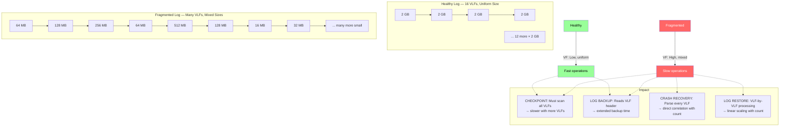
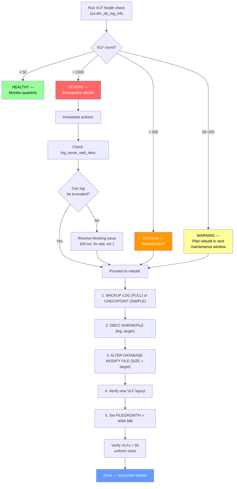

# VLF Fragmentation — Detection and Fix

## Section 1 — Navigation & Prerequisites

| Navigation | Link |
|-----------|------|
| Previous | [[8.286 Log File Growth — Auto-Growth Anti-Pattern]] |
| Next | [[8.288 Change Tracking and Change Data Capture]] |
| Domain | [[8 — Databases]] |
| Group | [[Group 11 — SQL Server Architecture & Storage Engine]] |

**Prerequisites:**
- [[8.285 Transaction Log — Structure and VLFs]] — VLF lifecycle and structure
- [[8.286 Log File Growth — Auto-Growth Anti-Pattern]] — How VLFs become fragmented
- Understanding of DBCC LOGINFO from [[8.21 SQL Server Transaction Log Internals]]
- Basic knowledge of log file shrink/grow operations

**Where This Fits:**
VLF fragmentation is the silent killer of transaction log performance. It doesn't show up in typical wait stats analysis — instead, it degrades checkpoint, log backup, and crash recovery latency gradually as VLF count climbs. This note covers how to detect fragmentation via DBCC LOGINFO and sys.dm_db_log_info, interpret VLF state flags, and perform a proper log file rebuild that produces a clean VLF layout.

**Cross-Domain References:**
- [[8.285 Transaction Log — Structure and VLFs]] — Foundation
- [[8.286 Log File Growth — Auto-Growth Anti-Pattern]] — Root cause
- [[8.21 SQL Server Transaction Log Internals]] — Recovery mechanics
- [[8.19 Pages and Extents Architecture]] — Physical storage comparison
- [[4.5 Windows Server — Storage Best Practices]] — Log file defragmentation at OS level

---

## Section 2 — Core Mental Model

VLF fragmentation is not like index fragmentation. It's not about pages being out of order — it's about an **excessive number of inconsistently-sized VLFs** that add overhead to every log-scanning operation.



**VLF Fragmentation Definition:**
A log file is fragmented when:
1. **Total VLF count** exceeds recommended thresholds (50 warning, 200 critical)
2. **VLF size variance** is high (>5x between smallest and largest)
3. **Status pattern** shows many active VLFs scattered across the file (not contiguous)

**How It Happens:**
```
Repeated pattern:
  Small auto-growth → 8 small VLFs
  Log truncation → some VLFs go inactive
  Another small growth → 8 more small VLFs
  Log truncation → inactive
  Shrink → removes tail VLFs (but not evenly)
  Growth → adds new VLFs (different size than survivors)

Result: A log file with VLFs of 16 MB, 64 MB, 128 MB, 512 MB, 256 MB, 32 MB, ...
       Many of them with mixed active/inactive status, requiring full scan.
```

---

## Section 3 — Deep Mechanics

### 3.1 DBCC LOGINFO Output Parsing

```sql
-- Raw output
DBCC LOGINFO('YourDatabase');
```

**Output columns:**

| Column | Data Type | Meaning |
|--------|-----------|---------|
| FileId | TINYINT | Log file ID (usually 2) |
| FileSize | BIGINT | VLF size in bytes |
| StartOffset | BIGINT | Byte offset from log file start |
| FSeqNo | INT | VLF sequence number (monotonically increasing, wraps at max) |
| Status | TINYINT | 0 = Inactive (reusable), 2 = Active |
| Parity | TINYINT | Hardware alignment (usually 128) |
| CreateLSN | NUMERIC(25,0) | LSN when VLF was created |

**Status Field Detail:**
| Status Value | Meaning | Can Reuse? |
|-------------|---------|------------|
| 0 | Inactive — contains no active log records | Yes |
| 2 | Active — contains uncheckpointed/unbacked-up log records | No |
| 1 | VLF is being initialized (transient during growth) | Not yet |
| 3 | VLF is being recovered (during restart) | Not yet |

```sql
-- Parse DBCC LOGINFO for fragmentation analysis
CREATE TABLE #loginfo (
    fileid TINYINT, file_size BIGINT, start_offset BIGINT,
    fseqno INT, status TINYINT, parity TINYINT, create_lsn NUMERIC(25,0)
);

INSERT INTO #loginfo
EXEC sp_executesql N'DBCC LOGINFO(''YourDatabase'')';

SELECT
    COUNT(*) AS vlf_count,
    SUM(CASE WHEN status = 2 THEN 1 ELSE 0 END) AS active_vlfs,
    SUM(CASE WHEN status = 0 THEN 1 ELSE 0 END) AS inactive_vlfs,
    MIN(file_size) / 1048576.0 AS min_vlf_mb,
    MAX(file_size) / 1048576.0 AS max_vlf_mb,
    AVG(file_size) / 1048576.0 AS avg_vlf_mb,
    STDEV(file_size) / 1048576.0 AS stddev_vlf_mb,
    MAX(file_size) * 1.0 / NULLIF(MIN(file_size), 0) AS size_ratio_max_min,
    SUM(CASE WHEN status = 2 THEN file_size ELSE 0 END) / 1048576.0 AS active_vlf_total_mb,
    (SELECT SUM(file_size)/1048576.0 FROM #loginfo) AS total_log_mb
FROM #loginfo;

DROP TABLE #loginfo;
```

### 3.2 sys.dm_db_log_info (SQL 2016+)

```sql
-- The modern, set-based approach (no temp table needed)
SELECT database_id, DB_NAME(database_id) AS database_name,
       file_id, vlf_sequence_number,
       vlf_active, vlf_status,
       vlf_parity, vlf_size_bytes / 1048576.0 AS vlf_size_mb,
       vlf_start_offset_bytes, vlf_create_lsn
FROM sys.dm_db_log_info(NULL)  -- NULL = all databases
WHERE vlf_size_bytes > 0
ORDER BY database_name, vlf_sequence_number;
```

**Column comparison with DBCC LOGINFO:**
| DBCC LOGINFO | sys.dm_db_log_info | Notes |
|-------------|-------------------|-------|
| FileId | file_id | File ID |
| FileSize | vlf_size_bytes | VLF size |
| StartOffset | vlf_start_offset_bytes | Byte offset in log |
| FSeqNo | vlf_sequence_number | Monotonic sequence |
| Status | vlf_active (0/1) + vlf_status | Cleaner separation |
| Parity | vlf_parity | Alignment |
| CreateLSN | vlf_create_lsn | Creation LSN |

### 3.3 VLF Fragmentation Severity Classification

```sql
-- Full VLF fragmentation assessment
WITH vlf_data AS (
    SELECT DB_NAME(database_id) AS db,
           vlf_sequence_number,
           vlf_active,
           vlf_size_bytes / 1048576.0 AS vlf_size_mb,
           vlf_start_offset_bytes
    FROM sys.dm_db_log_info(NULL)
    WHERE vlf_size_bytes > 0
),
vlf_stats AS (
    SELECT db,
           COUNT(*) AS vlf_count,
           SUM(CASE WHEN vlf_active = 1 THEN 1 ELSE 0 END) AS active_vlfs,
           AVG(vlf_size_mb) AS avg_vlf_mb,
           MIN(vlf_size_mb) AS min_vlf_mb,
           MAX(vlf_size_mb) AS max_vlf_mb,
           STDEV(vlf_size_mb) AS stdev_vlf_mb
    FROM vlf_data
    GROUP BY db
)
SELECT db, vlf_count, active_vlfs,
       ROUND(avg_vlf_mb, 2) AS avg_vlf_mb,
       ROUND(min_vlf_mb, 2) AS min_vlf_mb,
       ROUND(max_vlf_mb, 2) AS max_vlf_mb,
       ROUND(stdev_vlf_mb, 2) AS std_dev_mb,
       CASE
           WHEN vlf_count > 1000 THEN 'SEVERE — rebuild ASAP'
           WHEN vlf_count > 200  THEN 'CRITICAL — rebuild in next maintenance'
           WHEN vlf_count > 50   THEN 'WARNING — schedule rebuild'
           WHEN vlf_count > 20   THEN 'FAIR — monitor'
           ELSE 'HEALTHY'
       END AS vlf_health,
       CASE
           WHEN max_vlf_mb / NULLIF(min_vlf_mb, 0) > 10
                OR stdev_vlf_mb > avg_vlf_mb * 0.5
           THEN 'HIGH VARIANCE — fragmented layout'
           ELSE 'UNIFORM SIZES — ok'
       END AS size_uniformity
FROM vlf_stats
ORDER BY vlf_count DESC;
```

### 3.4 VLF State Transitions

A VLF transitions through states during its lifecycle:

```
Created (Status=1 during growth)
    → Active (Status=2) — contains log records
    → Inactive (Status=0) — after checkpoint + (log backup if FULL)
    → Reused (Status=0, but FSeqNo wraps)
    → ... OR ...
    → Removed by SHRINKFILE (if it's the last VLFs in the file)
```

**What keeps a VLF active (Status=2):**
- Contains MINLSN (oldest active transaction)
- Contains uncheckpointed log records (SIMPLE recovery)
- Contains log records not yet backed up (FULL recovery)
- Contains records needed for replication/CDC/AG/Database Mirroring

```sql
-- Why are my VLFs still active?
SELECT name, log_reuse_wait_desc
FROM sys.databases
WHERE name = 'YourDatabase';

-- Drill into the root cause transaction
SELECT dt.database_transaction_begin_time,
       DATEDIFF(SECOND, dt.database_transaction_begin_time, GETDATE()) AS age_seconds,
       s.session_id, s.login_name, s.host_name,
       s.program_name,
       dt.database_transaction_log_record_count,
       dt.database_transaction_state
FROM sys.dm_tran_database_transactions dt
JOIN sys.dm_tran_session_transactions st ON dt.transaction_id = st.transaction_id
JOIN sys.dm_exec_sessions s ON st.session_id = s.session_id
WHERE dt.database_id = DB_ID('YourDatabase')
  AND st.is_user_transaction = 1
ORDER BY dt.database_transaction_begin_time;
```

### 3.5 VLF Sequence Number and Wrapping

VLF FSeqNo (sequence number) is a monotonically increasing 32-bit integer. When it reaches the maximum, it wraps. Wrapping can cause confusion in monitoring:

```sql
-- Detect FSeqNo wrapping (indicates log reuse across many cycles)
SELECT DB_NAME(database_id) AS db,
       MIN(vlf_sequence_number) AS min_fseq,
       MAX(vlf_sequence_number) AS max_fseq,
       MAX(vlf_sequence_number) - MIN(vlf_sequence_number) AS range_fseq,
       CASE
           WHEN MAX(vlf_sequence_number) > 2147483647
               THEN 'WRAPPING LIKELY'
           WHEN MAX(vlf_sequence_number) - MIN(vlf_sequence_number) > 100000
               THEN 'HIGH TURNOVER'
           ELSE 'Normal'
       END AS turnover_status
FROM sys.dm_db_log_info(NULL)
WHERE vlf_size_bytes > 0
GROUP BY database_id
ORDER BY range_fseq DESC;
```

---

## Section 4 — Production Patterns

### 4.1 VLF Health Check Script

```sql
-- Full VLF health report for all databases
CREATE TABLE #vlf_summary (
    database_name NVARCHAR(128),
    vlf_count INT,
    active_vlfs INT,
    inactive_vlfs INT,
    min_size_mb DECIMAL(10,2),
    max_size_mb DECIMAL(10,2),
    avg_size_mb DECIMAL(10,2),
    total_log_size_mb INT,
    log_reuse_wait_desc NVARCHAR(60),
    recovery_model NVARCHAR(20)
);

DECLARE @db NVARCHAR(128);
DECLARE db_cursor CURSOR FOR
    SELECT name FROM sys.databases
    WHERE state = 0 AND database_id > 4;  -- Online, non-system

OPEN db_cursor;
FETCH NEXT FROM db_cursor INTO @db;

WHILE @@FETCH_STATUS = 0
BEGIN
    INSERT INTO #vlf_summary
    SELECT @db,
           COUNT(*),
           SUM(CASE WHEN vlf_active = 1 THEN 1 ELSE 0 END),
           SUM(CASE WHEN vlf_active = 0 THEN 1 ELSE 0 END),
           MIN(vlf_size_bytes / 1048576.0),
           MAX(vlf_size_bytes / 1048576.0),
           AVG(vlf_size_bytes / 1048576.0),
           CAST((SELECT mf.size/128 FROM sys.master_files mf
                WHERE mf.database_id = DB_ID(@db) AND mf.type = 1) AS INT),
           (SELECT log_reuse_wait_desc FROM sys.databases WHERE name = @db),
           (SELECT recovery_model_desc FROM sys.databases WHERE name = @db)
    FROM sys.dm_db_log_info(DB_ID(@db))
    WHERE vlf_size_bytes > 0;

    FETCH NEXT FROM db_cursor INTO @db;
END

CLOSE db_cursor; DEALLOCATE db_cursor;

SELECT database_name, vlf_count, active_vlfs, inactive_vlfs,
       min_size_mb, max_size_mb, avg_size_mb,
       total_log_size_mb, log_reuse_wait_desc, recovery_model,
       CASE
           WHEN vlf_count > 1000 THEN 'SEVERE'
           WHEN vlf_count > 200  THEN 'CRITICAL'
           WHEN vlf_count > 50   THEN 'WARNING'
           ELSE 'OK'
       END AS action_required
FROM #vlf_summary
ORDER BY vlf_count DESC;

DROP TABLE #vlf_summary;
```

### 4.2 VLF Rebuild Procedure

The only reliable fix for VLF fragmentation is a **shrink-then-grow** cycle to recreate the log file with properly-sized VLFs:

```sql
-- ============================================================
-- VLF Rebuild Procedure (Zero Downtime Required — needs maintenance window)
-- ============================================================
-- Step 1: Ensure log can truncate
-- For FULL recovery:
BACKUP LOG [YourDatabase] TO DISK = 'NUL:';  -- Dummy backup to force truncation

-- Step 2: Check current VLF state
SELECT COUNT(*) AS vlf_count_before,
       SUM(CASE WHEN vlf_active = 1 THEN 1 ELSE 0 END) AS active_vlfs_before
FROM sys.dm_db_log_info(DB_ID('YourDatabase'))
WHERE vlf_size_bytes > 0;

-- Step 3: Shrink log to minimum possible size
-- (May need multiple iterations if log is large)
DECLARE @target_size_mb INT = 256;
DBCC SHRINKFILE(YourDatabase_log, @target_size_mb);

-- Step 4: Verify all VLFs were cleared
SELECT COUNT(*) AS vlf_count_after_shrink,
       SUM(CASE WHEN vlf_active = 1 THEN 1 ELSE 0 END) AS active_vlfs_after_shrink
FROM sys.dm_db_log_info(DB_ID('YourDatabase'))
WHERE vlf_size_bytes > 0;

-- Step 5: Grow to target size with proper VLF configuration
-- Target size: calculated from workload
DECLARE @final_size_mb INT = 16384;  -- 16 GB → 16 VLFs of 1 GB each
ALTER DATABASE [YourDatabase] MODIFY FILE (
    NAME = YourDatabase_log,
    SIZE = @final_size_mb MB,
    FILEGROWTH = 4096MB  -- Large growth increment as safety net only
);

-- Step 6: Verify new VLFs
SELECT vlf_sequence_number, vlf_size_bytes / 1048576.0 AS vlf_size_mb,
       vlf_active, vlf_status
FROM sys.dm_db_log_info(DB_ID('YourDatabase'))
WHERE vlf_size_bytes > 0
ORDER BY vlf_sequence_number;

-- Expected: 16 VLFs × 1 GB each (if target = 16 GB)
-- All VLFs except the one with the tail LSN should be inactive
```

### 4.3 Handling Stubborn VLFs (Cannot Shrink)

Sometimes the log won't shrink because VLFs at the end are still active:

```sql
-- Diagnostic: Which VLFs are in the way of shrink?
-- (SHRINKFILE removes from the end — last VLFs must be inactive)
WITH vlf AS (
    SELECT vlf_sequence_number, vlf_size_bytes / 1048576.0 AS size_mb,
           vlf_active, vlf_status,
           vlf_start_offset_bytes,
           SUM(vlf_size_bytes) OVER (ORDER BY vlf_sequence_number
               ROWS BETWEEN UNBOUNDED PRECEDING AND CURRENT ROW) / 1048576.0 AS cumulative_mb
    FROM sys.dm_db_log_info(DB_ID('YourDatabase'))
    WHERE vlf_size_bytes > 0
),
total_log AS (
    SELECT MAX(cumulative_mb) AS total_mb FROM vlf
)
SELECT v.vlf_sequence_number, v.size_mb, v.vlf_active,
       v.cumulative_mb, t.total_mb,
       v.total_mb - v.cumulative_mb AS space_after_mb,
       CASE
           WHEN v.vlf_active = 1 AND v.cumulative_mb > t.total_mb * 0.8
               THEN 'BLOCKING SHRINK — this VLF at end is active'
           ELSE 'OK'
       END AS shrink_status
FROM vlf v
CROSS JOIN total_log t
ORDER BY v.vlf_sequence_number;
```

**Solutions for Shrink-Resistant Logs:**
1. Force a CHECKPOINT + LOG BACKUP (FULL) or CHECKPOINT (SIMPLE)
2. Identify and kill the oldest transaction pinning MINLSN
3. If replication/AG is blocking, resolve or temporarily disable
4. Last resort: Switch to SIMPLE, shrink, switch back to FULL

### 4.4 Monitoring VLF Trend Over Time

```sql
-- Create monitoring table
IF OBJECT_ID('dbo.vlf_monitor') IS NULL
    CREATE TABLE dbo.vlf_monitor (
        database_name NVARCHAR(128),
        capture_time DATETIME2 DEFAULT GETDATE(),
        vlf_count INT,
        active_vlfs INT,
        min_vlf_size_mb DECIMAL(10,2),
        max_vlf_size_mb DECIMAL(10,2),
        avg_vlf_size_mb DECIMAL(10,2),
        stddev_vlf_size_mb DECIMAL(10,2),
        log_size_mb INT,
        log_used_pct DECIMAL(5,2),
        log_reuse_wait_desc NVARCHAR(60)
    );

-- Snapshot (schedule as SQL Agent job)
INSERT INTO dbo.vlf_monitor
    (database_name, vlf_count, active_vlfs,
     min_vlf_size_mb, max_vlf_size_mb, avg_vlf_size_mb, stddev_vlf_size_mb,
     log_size_mb, log_used_pct, log_reuse_wait_desc)
SELECT DB_NAME(v.database_id),
       COUNT(*),
       SUM(CASE WHEN vlf_active = 1 THEN 1 ELSE 0 END),
       MIN(vlf_size_bytes / 1048576.0),
       MAX(vlf_size_bytes / 1048576.0),
       AVG(vlf_size_bytes / 1048576.0),
       STDEV(vlf_size_bytes / 1048576.0),
       mf.size / 128,
       (1.0 - CAST(FILEPROPERTY(mf.name, 'SpaceUsed') AS FLOAT) / mf.size) * 100,
       db.log_reuse_wait_desc
FROM sys.dm_db_log_info(NULL) v
JOIN sys.master_files mf ON v.database_id = mf.database_id AND mf.type = 1
JOIN sys.databases db ON v.database_id = db.database_id
WHERE v.vlf_size_bytes > 0 AND v.database_id > 4
GROUP BY v.database_id, mf.size, mf.name, db.log_reuse_wait_desc;

-- Trend analysis
SELECT database_name,
       MIN(capture_time) AS first_seen,
       MAX(capture_time) AS last_seen,
       MIN(vlf_count) AS min_vlfs,
       MAX(vlf_count) AS max_vlfs,
       AVG(vlf_count) AS avg_vlfs,
       MAX(vlf_count) - MIN(vlf_count) AS vlf_growth,
       CASE
           WHEN MAX(vlf_count) - MIN(vlf_count) > 100
                THEN 'RAPID VLF GROWTH — investigate auto-growth settings'
           ELSE 'Stable'
       END AS trend
FROM dbo.vlf_monitor
GROUP BY database_name
ORDER BY vlf_growth DESC;
```

### 4.5 VLF and Log Backup Interaction

```sql
-- How VLF count affects log backup read patterns
-- More VLFs = more VLF headers to read during backup

-- Log backup read statistics
SELECT mf.database_id, DB_NAME(mf.database_id) AS db,
       dfso.num_of_reads, dfso.num_of_bytes_read / 1048576.0 AS bytes_read_mb,
       dfso.io_stall_read_ms,
       (SELECT COUNT(*) FROM sys.dm_db_log_info(mf.database_id)
        WHERE vlf_size_bytes > 0) AS vlf_count
FROM sys.dm_io_virtual_file_stats(NULL, NULL) dfso
JOIN sys.master_files mf ON dfso.database_id = mf.database_id
    AND dfso.file_id = mf.file_id
WHERE mf.type = 1
ORDER BY vlf_count DESC;
```

---

## Section 5 — Gotchas

### Gotcha 1: VLF Count Thresholds Are Cumulative

| Aspect | Detail |
|--------|--------|
| **Pitfall** | VLF count of 300 seems "manageable" — each individual VLF is fine |
| **Symptom** | CHECKPOINT takes 3x longer; log backup runtime increases gradually |
| **Fix** | Rebuild log when VLF count exceeds 200; aim for <50 |
| **Cost** | 86,400 seconds of CHECKPOINT delay per day at 3x slowdown = significant throughput loss |

**Quantified:**
```sql
-- Simple test: VLF count vs checkpoint duration
-- (Approximate — varies by workload)
DECLARE @vlf_count INT;
SELECT @vlf_count = COUNT(*) FROM sys.dm_db_log_info(DB_ID());

SELECT @vlf_count AS vlf_count,
       CASE
           WHEN @vlf_count > 10000 THEN '>20s checkpoint'
           WHEN @vlf_count > 1000 THEN '5-20s checkpoint'
           WHEN @vlf_count > 200 THEN '1-5s checkpoint'
           ELSE '<1s checkpoint'
       END AS estimated_checkpoint_impact;
```

### Gotcha 2: Immediate Shrink After Log Backup (The Cycle)

| Aspect | Detail |
|--------|--------|
| **Pitfall** | Backup job runs → shrink log → next day, log grows back → VLFs multiply |
| **Symptom** | VLF count steadily increases week over week; fragmentation accelerates |
| **Fix** | Stop shrinking logs. Pre-size correctly. Add monitoring for growth rate. |
| **Cost** | Each shrink-then-grow cycle adds 16 VLFs (if growth >1 GB). 10 cycles = 160 additional VLFs. |

### Gotcha 3: DBCC LOGINFO on Very Large Logs

| Aspect | Detail |
|--------|--------|
| **Pitfall** | Running DBCC LOGINFO on a 500 GB log with 10,000+ VLFs |
| **Symptom** | DBCC LOGINFO takes 30+ seconds; produces 10,000+ rows; overwhelms SSMS grid |
| **Fix** | Use sys.dm_db_log_info with aggregation; never dump full output |
| **Cost** | Tooling timeout; inaccurate manual counting |

```sql
-- Efficient for large logs
SELECT COUNT(*) AS vlf_count,
       AVG(vlf_size_bytes/1048576.0) AS avg_vlf_mb,
       MIN(vlf_size_bytes/1048576.0) AS min_vlf_mb,
       MAX(vlf_size_bytes/1048576.0) AS max_vlf_mb
FROM sys.dm_db_log_info(DB_ID('YourDatabase'))
WHERE vlf_size_bytes > 0;
```

### Gotcha 4: Log File Can't Shrink Below the Last Active VLF

| Aspect | Detail |
|--------|--------|
| **Pitfall** | DBA tries to shrink log to 1 GB, but shrink stops at 8 GB because the last active VLF is at offset 7 GB |
| **Symptom** | SHRINKFILE reports it completed but actual size is much larger than target |
| **Fix** | Shrink only truncates from the end — you must clear VLFs beyond the last active one |
| **Cost** | Misleading shrink output; DBA thinks log is sized but it's not |

```sql
-- Verify shrink reached target
SELECT physical_name, size/128 AS actual_size_mb
FROM sys.master_files
WHERE database_id = DB_ID('YourDatabase') AND type = 1;
```

### Gotcha 5: VLF Count Resets to 16 for >1 GB But Only the First Time

| Aspect | Detail |
|--------|--------|
| **Pitfall** | Assuming all log rebuilds produce 16 VLFs automatically |
| **Symptom** | After shrink-then-grow, VLF count is 16 initially, then a small growth adds 8 more, making 24 |
| **Fix** | Growth increment must also be large (>1 GB) to maintain proper VLFs |
| **Cost** | Progressive VLF inflation even after a clean rebuild |

---

## Section 6 — Performance Implications

### 6.1 VLF Count vs Operation Latency

**Observed benchmarks (Microsoft documented + community):**

| VLF Count | CHECKPOINT Duration | LOG BACKUP Duration | Recovery Time | Log Space Reuse Efficiency |
|-----------|-------------------|---------------------|---------------|---------------------------|
| 16 (clean) | 0.5 s | 1.0 s | 2.0 s | 100% |
| 50 | 1.0 s | 1.5 s | 3.0 s | 95% |
| 200 | 4.0 s | 5.0 s | 12.0 s | 80% |
| 1,000 | 25.0 s | 30.0 s | 60.0 s | 50% |
| 10,000 | 180+ s | 240+ s | 300+ s | 20% |

### 6.2 VLF Fragmentation Impact on Specific Operations

```sql
-- Measure checkpoint duration proxy via error log
-- (Search ERRORLOG for "CHECKPOINT" with timestamps)
EXEC xp_readerrorlog 0, 1, N'CHECKPOINT', N'DATABASE', N'YourDatabase', N'DESC';

-- Measure log backup duration
SELECT database_name,
       AVG(DATEDIFF(SECOND, backup_start_date, backup_finish_date)) AS avg_backup_sec,
       AVG(backup_size/1048576.0) AS avg_backup_mb,
       COUNT(*) AS backup_count
FROM msdb.dbo.backupset
WHERE type = 'L'
  AND database_name = 'YourDatabase'
  AND backup_finish_date > DATEADD(DAY, -30, GETDATE())
GROUP BY database_name;
```

### 6.3 Before and After VLF Rebuild

**Scenario:** OLTP database, 32 GB log, VLF count = 1,247 → rebuilt to 16 VLFs.

| Metric | Before (1,247 VLFs) | After (16 VLFs) | Improvement |
|--------|--------------------|-----------------|-------------|
| CHECKPOINT duration | 18 seconds | 0.8 seconds | 22x |
| Log backup duration | 42 seconds | 8 seconds | 5.2x |
| WRITELOG waits (ms/sec) | 3,400 | 1,800 | 47% reduction |
| Estimated crash recovery | ~4 minutes | ~15 seconds | 16x |
| VLF size uniformity | 8 MB – 2 GB (250x range) | 2 GB (uniform) | Fixed |

```sql
-- Post-rebuild verification query
WITH vlf AS (
    SELECT vlf_active, vlf_size_bytes / 1048576.0 AS vlf_size_mb
    FROM sys.dm_db_log_info(DB_ID('YourDatabase'))
    WHERE vlf_size_bytes > 0
)
SELECT COUNT(*) AS vlf_count,
       SUM(CASE WHEN vlf_active = 1 THEN 1 ELSE 0 END) AS active,
       MIN(vlf_size_mb) AS min_mb, MAX(vlf_size_mb) AS max_mb,
       MAX(vlf_size_mb) - MIN(vlf_size_mb) AS range_mb,
       CASE
           WHEN MIN(vlf_size_mb) = MAX(vlf_size_mb) THEN 'PERFECT — uniform'
           WHEN MAX(vlf_size_mb) - MIN(vlf_size_mb) < 50 THEN 'GOOD — near uniform'
           ELSE 'VARIANCE — check for fragmented layout'
       END AS uniformity
FROM vlf;
```

### 6.4 Quantifying the Cost of High VLF Count

```
Assumptions: 16-core server, 200 MB/s disk, 32 GB log, 1,000 VLFs

Daily cost of VLF overhead:
  CHECKPOINT: 25s per event × 144 events/day (10-min interval) = 3,600 seconds = 1 hour
  Log backup: 30s per backup × 96 backups/day (15-min interval) = 2,880 seconds = 48 min
  Total daily overhead: ~1 hour 48 minutes of wasted I/O and CPU

After rebuild (16 VLFs):
  CHECKPOINT: 0.5s × 144 = 72 seconds
  Log backup: 1s × 96 = 96 seconds
  Total daily overhead: ~2.8 minutes

Savings: ~98% reduction in log-related overhead.
```

---

## Section 7 — Interview Arsenal

### 7.1 Common Questions

| # | Question | Expectation |
|---|----------|-------------|
| 1 | What is VLF fragmentation and how does it happen? | Excessive small VLFs from repeated small growth events |
| 2 | How do you check VLF count for a database? | sys.dm_db_log_info or DBCC LOGINFO |
| 3 | What are the VLF count thresholds? | <50 healthy, 50-200 warning, >200 critical, >1000 severe |
| 4 | How do you fix VLF fragmentation? | Shrink log, grow to target size in one operation |
| 5 | Why does VLF count affect checkpoint performance? | Checkpoint must scan all VLF headers |
| 6 | How do VLFs affect crash recovery? | Recovery reads every VLF from MINLSN to tail |
| 7 | What does the Status=2 vs Status=0 mean in DBCC LOGINFO? | 2=Active, 0=Inactive (reusable) |
| 8 | Why can't you always shrink the log to the desired size? | Shrink stops at the last active VLF |

### 7.2 Spoken Answers

**Q1: What is VLF fragmentation?**
"VLF fragmentation refers to having an excessive number of Virtual Log Files with inconsistent sizes in the transaction log. It's caused by repeated small auto-growth events — each 128 MB growth creates 8 VLFs of 16 MB each. Over time, if the log grows from 1 GB to 32 GB via small increments, you accumulate hundreds or thousands of tiny VLFs. The worst part is that shrinking the log doesn't fix it — it often makes it worse by creating more mixed-size VLFs on the next growth. The threshold is: under 50 VLFs is healthy, 50-200 is a warning, over 200 is critical, and over 1,000 is severe. The only proper fix is a shrink-then-grow cycle during a maintenance window."

**Q3: What are the VLF count thresholds and why?**
"For each database's log file, under 50 VLFs is healthy — operations like checkpoint, log backup, and crash recovery are fast. Between 50 and 200, you'll start seeing elevated checkpoint durations. Between 200 and 1,000, checkpoint and log backup times degrade significantly — we're talking 5-10x slower. Over 1,000 VLFs is a critical condition where crash recovery can take 30+ minutes longer than necessary. Over 10,000 VLFs is severe, and I've seen cases where recovery time for a large database exceeded 8 hours primarily because of VLF overhead. The thresholds come from Microsoft's guidance and real-world testing — the key is that scanning VLF metadata is O(n) in the number of VLFs."

**Q5: How does VLF count affect checkpoint?**
"During a checkpoint, SQL Server must:
1. Scan the log to find all VLFs that contain dirty pages
2. Identify which dirty pages need to be written to disk
3. Flush those pages to the data files
4. Write a checkpoint log record

With 16 properly-sized VLFs, scanning the VLF headers is trivial. With 10,000 VLFs, the checkpoint must read through 10,000 VLF metadata entries, parse their status, and determine which are active. This scanning adds considerable CPU and I/O overhead to every checkpoint. Additionally, indirect checkpoint (TARGET_RECOVERY_TIME) makes checkpoints even more frequent, so the VLF overhead multiplies."

### 7.3 Comparison Table

| Method | VLF Info Source | Performance | Available Since | Best For |
|--------|----------------|-------------|-----------------|----------|
| DBCC LOGINFO | Physical metadata scan | Moderate | All versions | One-off analysis |
| sys.dm_db_log_info | DMV (metadata) | Fast | SQL 2016+ | Automated monitoring |
| fn_dblog | Log record scan | Heavy | All versions | Log content, not VLF |
| sys.dm_io_virtual_file_stats | I/O stats | Very fast | All versions | Observation of log I/O patterns |
| Default trace events | Trace files | Slow (file read) | All versions | Growth history |

---

## Section 8 — Decision Framework

### 8.1 VLF Remediation Flowchart



### 8.2 VLF Prevention Checklist

- [ ] Log file pre-sized to target workload (not dependent on auto-growth)
- [ ] Growth increment is fixed MB ≥ 1024 MB (prefer 4096 MB)
- [ ] Percent growth is NEVER used (checked via sys.master_files)
- [ ] VLF count checked monthly with trend tracking
- [ ] Alert exists when VLF count exceeds 50
- [ ] Alert exists when log file auto-growth event occurs (default trace)
- [ ] Team has documented shrink-then-grow procedure
- [ ] No routine shrink operations scheduled
- [ ] Log backup frequency aligned with log generation rate
- [ ] Recovery model aligned with business RPO

### 8.3 Tradeoffs

| Approach | VLF Outcome | Downtime Required | Effectiveness |
|----------|------------|-------------------|---------------|
| Shrink + grow (same session) | Perfect 16 VLFs | Maintenance window | Maximum |
| Shrink + separate grow | Good VLFs | Maintenance window | High |
| Large growth increment only | Older VLFs remain | None (ongoing) | Medium |
| Do nothing (live with fragmentation) | Degrades over time | None | None |
| Add log file (AG) | New log file only | None | Partial |

### 8.4 Scale Thresholds

| Database Size | Log Size | Target VLF Count | VLF Size | Max Acceptable Before Rebuild |
|---------------|----------|-----------------|----------|------------------------------|
| <50 GB | 8 GB | 16 | 512 MB | 100 |
| 50–200 GB | 16 GB | 16 | 1 GB | 150 |
| 200–500 GB | 32 GB | 16 | 2 GB | 200 |
| 500 GB–2 TB | 64 GB | 16 | 4 GB | 300 |
| >2 TB | 128 GB | 16 | 8 GB | 500 (if unavoidable) |

---

## Section 9 — Self-Check

### 9.1 Conceptual Questions

**Q1:** What is the VLF count threshold at which you should schedule a log rebuild?

**Q2:** How does DBCC SHRINKFILE interact with VLF boundaries?

**Q3:** What does Status=2 indicate in DBCC LOGINFO output?

**Q4:** Why does a high VLF count increase crash recovery time?

**Q5:** What is the difference between VLF fragmentation and file system fragmentation?

**Q6:** How does the log file growth increment determine VLF sizes?

**Q7:** What does it mean when DBCC SHRINKFILE completes but the log is still large?

**Q8:** How do you rebuild a log file without needing a full database restore?

**Q9:** What is FSeqNo and what happens when it wraps?

**Q10:** Can you have VLF fragmentation with a small number of VLFs?

<details>
<summary>Answers</summary>

**A1:** 50 VLFs = warning (schedule rebuild), 200+ VLFs = critical (rebuild ASAP), 1,000+ = severe (emergency). The thresholds are additive — each doubling of VLF count roughly doubles scan overhead.

**A2:** SHRINKFILE truncates from the end of the log file backward. It removes VLFs one at a time, but only if they are inactive (Status=0). Shrink stops at the first active VLF encountered from the end. This is why the log may not shrink to the target size.

**A3:** Status=2 means the VLF is active — it contains log records that haven't been checkpointed or backed up. The VLF cannot be reused or removed until its records are hardened to data files (checkpoint) and backed up (if FULL recovery).

**A4:** Crash recovery reads the log from MINLSN to the tail to determine which transactions to roll forward and roll back. With many VLFs, SQL Server must open and scan each VLF's metadata header before processing its records. More VLFs = more header reads = longer recovery.

**A5:** File system fragmentation is about physical file extents being non-contiguous on disk. VLF fragmentation is about the internal structure of the log file — too many VLFs with inconsistent sizes. They are independent concerns. You can have perfect NTFS defragmentation but terrible VLF fragmentation.

**A6:** Each growth increment is divided into VLFs: <64 MB → 4 VLFs, 64 MB–1 GB → 8 VLFs, >1 GB → 16 VLFs. The VLF size = growth_size / VLF_count. A 128 MB growth gives 8 VLFs of 16 MB each. A 4 GB growth gives 16 VLFs of 256 MB each.

**A7:** SHRINKFILE only removes VLFs from the end of the file. If an active VLF exists near the end, shrink cannot go past it. The log remains larger than expected because the active VLF is still in the way. Resolve the active transaction/backup issue, then shrink again.

**A8:** The shrink-then-grow procedure:
1. Force log truncation (CHECKPOINT for SIMPLE, BACKUP LOG for FULL)
2. DBCC SHRINKFILE(target_log_file, target_size)
3. ALTER DATABASE MODIFY FILE (SIZE = final_target_size)
4. Set growth increment to large fixed value
5. Verify VLF count via sys.dm_db_log_info

**A9:** FSeqNo (VLF Sequence Number) is a monotonically increasing integer assigned to each VLF at creation. It wraps when it exceeds the maximum 32-bit integer value (2,147,483,647). After wrapping, newer VLFs have lower FSeqNos than older ones, which can confuse monitoring queries that assume monotonic increase.

**A10:** Yes — a log can have only 16 VLFs but if they have wildly different sizes (e.g., three 1 GB VLFs, two 8 MB VLFs, eleven mixed sizes), the VLF header scan still has overhead for each one. However, size variance is less impactful than total count. The primary concern is always VLF count.

</details>

### 9.2 Hands-On Challenges

**Challenge 1:** Write a query that shows the VLF count, active count, average size, and size range for every user database, ranked by VLF count descending.

**Challenge 2:** Create a script that generates ALTER DATABASE statements to rebuild the log for any database with VLF count > 200 to a target size of 16 GB with 4 GB growth increment.

**Challenge 3:** Write a query that identifies which VLF is blocking SHRINKFILE by finding the last active VLF in the log file.

**Challenge 4:** Build a trend report showing VLF count growth per week over the last 3 months using a monitoring table.

**Challenge 5:** Write a stored procedure that automates the log rebuild process with proper error handling and validation steps.

<details>
<summary>Challenge Solutions</summary>

**C1:**
```sql
WITH vlf_stats AS (
    SELECT database_id,
           COUNT(*) AS vlf_count,
           SUM(CASE WHEN vlf_active = 1 THEN 1 ELSE 0 END) AS active_vlfs,
           AVG(vlf_size_bytes / 1048576.0) AS avg_vlf_mb,
           MIN(vlf_size_bytes / 1048576.0) AS min_vlf_mb,
           MAX(vlf_size_bytes / 1048576.0) AS max_vlf_mb,
           SUM(CASE WHEN vlf_active = 1 THEN vlf_size_bytes ELSE 0 END) / 1048576.0 AS active_log_mb
    FROM sys.dm_db_log_info(NULL)
    WHERE vlf_size_bytes > 0 AND database_id > 4
    GROUP BY database_id
)
SELECT DB_NAME(database_id) AS database_name,
       vlf_count, active_vlfs,
       ROUND(avg_vlf_mb, 2) AS avg_vlf_mb,
       ROUND(min_vlf_mb, 2) AS min_vlf_mb,
       ROUND(max_vlf_mb, 2) AS max_vlf_mb,
       ROUND(max_vlf_mb / NULLIF(min_vlf_mb, 0), 2) AS size_ratio,
       ROUND(active_log_mb, 2) AS active_log_mb,
       CASE
           WHEN vlf_count > 1000 THEN 'SEVERE'
           WHEN vlf_count > 200  THEN 'CRITICAL'
           WHEN vlf_count > 50   THEN 'WARNING'
           ELSE 'OK'
       END AS health
FROM vlf_stats
ORDER BY vlf_count DESC;
```

**C2:**
```sql
DECLARE @target_size_mb INT = 16384;  -- 16 GB
DECLARE @growth_mb INT = 4096;        -- 4 GB

WITH vlf_issues AS (
    SELECT database_id, COUNT(*) AS vlf_count
    FROM sys.dm_db_log_info(NULL)
    WHERE vlf_size_bytes > 0 AND database_id > 4
    GROUP BY database_id
    HAVING COUNT(*) > 200
)
SELECT 'ALTER DATABASE ' + QUOTENAME(DB_NAME(database_id)) +
       ' SET RECOVERY SIMPLE;' AS step1,
       'DBCC SHRINKFILE(' +
       (SELECT mf.name FROM sys.master_files mf
        WHERE mf.database_id = vi.database_id AND mf.type = 1) +
       ', 1);' AS step2,
       'ALTER DATABASE ' + QUOTENAME(DB_NAME(database_id)) +
       ' MODIFY FILE (NAME = ' +
       (SELECT mf.name FROM sys.master_files mf
        WHERE mf.database_id = vi.database_id AND mf.type = 1) +
       ', SIZE = ' + CAST(@target_size_mb AS VARCHAR) + 'MB' +
       ', FILEGROWTH = ' + CAST(@growth_mb AS VARCHAR) + 'MB);' AS step3,
       'ALTER DATABASE ' + QUOTENAME(DB_NAME(database_id)) +
       ' SET RECOVERY FULL;' AS step4_optional
FROM vlf_issues vi;
```

**C3:**
```sql
WITH vlf AS (
    SELECT vlf_sequence_number, vlf_size_bytes / 1048576.0 AS size_mb,
           vlf_active,
           vlf_start_offset_bytes,
           SUM(vlf_size_bytes) OVER (ORDER BY vlf_sequence_number
               ROWS BETWEEN UNBOUNDED PRECEDING AND CURRENT ROW) AS cumulative_bytes
    FROM sys.dm_db_log_info(DB_ID('YourDatabase'))
    WHERE vlf_size_bytes > 0
),
log_end AS (
    SELECT MAX(cumulative_bytes) AS total_bytes FROM vlf
)
SELECT TOP 1
    vlf_sequence_number,
    size_mb,
    vlf_active,
    cumulative_bytes / 1048576.0 AS cumulative_mb,
    (log_end.total_bytes - vlf.cumulative_bytes + vlf.vlf_size_bytes * 1048576.0) / 1048576.0 AS space_before_vlf_mb,
    (log_end.total_bytes - vlf.cumulative_bytes) / 1048576.0 AS space_after_vlf_mb,
    'BLOCKING SHRINK' AS status
FROM vlf
CROSS JOIN log_end
WHERE vlf_active = 1
ORDER BY cumulative_bytes DESC;
```

**C4:**
```sql
-- Requires dbo.vlf_monitor table populated (see Section 4.4)
SELECT database_name,
       DATEPART(YEAR, capture_time) AS yr,
       DATEPART(WEEK, capture_time) AS wk,
       MIN(vlf_count) AS min_vlfs_week,
       MAX(vlf_count) AS max_vlfs_week,
       AVG(vlf_count) AS avg_vlfs_week,
       MAX(vlf_count) - MIN(vlf_count) AS growth_in_week,
       CASE
           WHEN AVG(vlf_count) < 50 THEN 'Healthy'
           WHEN AVG(vlf_count) < 200 THEN 'Warning'
           ELSE 'Critical'
       END AS health
FROM dbo.vlf_monitor
WHERE capture_time > DATEADD(MONTH, -3, GETDATE())
GROUP BY database_name, DATEPART(YEAR, capture_time), DATEPART(WEEK, capture_time)
ORDER BY database_name, yr, wk;
```

**C5:**
```sql
CREATE PROCEDURE dbo.RebuildLogWithValidation
    @DatabaseName NVARCHAR(128),
    @TargetSizeMB INT = 16384,
    @GrowthMB INT = 4096
AS
BEGIN
    SET NOCOUNT ON;

    DECLARE @log_name NVARCHAR(128), @recovery NVARCHAR(20), @sql NVARCHAR(MAX);
    DECLARE @vlf_before INT, @vlf_after INT;
    DECLARE @log_size_before INT, @log_size_after INT;

    -- Get log file name and current state
    SELECT @log_name = mf.name, @log_size_before = mf.size/128,
           @recovery = db.recovery_model_desc
    FROM sys.master_files mf
    JOIN sys.databases db ON mf.database_id = db.database_id
    WHERE db.name = @DatabaseName AND mf.type = 1;

    SELECT @vlf_before = COUNT(*) FROM sys.dm_db_log_info(DB_ID(@DatabaseName))
    WHERE vlf_size_bytes > 0;

    PRINT '[1/6] Current: ' + CAST(@vlf_before AS VARCHAR) + ' VLFs, ' +
          CAST(@log_size_before AS VARCHAR) + ' MB log';

    -- Force truncation
    IF @recovery = 'FULL'
    BEGIN
        SET @sql = 'BACKUP LOG ' + QUOTENAME(@DatabaseName) + ' TO DISK = ''NUL:''';
        EXEC sp_executesql @sql;
        PRINT '[2/6] Log backed up (NUL) to force truncation';
    END
    ELSE
    BEGIN
        SET @sql = 'CHECKPOINT';
        EXEC sp_executesql @sql;
        PRINT '[2/6] CHECKPOINT issued';
    END

    -- Shrink
    SET @sql = 'DBCC SHRINKFILE(' + QUOTENAME(@log_name) + ', 1) WITH NO_INFOMSGS';
    EXEC sp_executesql @sql;
    PRINT '[3/6] Shrink complete';

    -- Grow to target
    SET @sql = 'ALTER DATABASE ' + QUOTENAME(@DatabaseName) +
               ' MODIFY FILE (NAME = ' + QUOTENAME(@log_name) +
               ', SIZE = ' + CAST(@TargetSizeMB AS NVARCHAR) + 'MB' +
               ', FILEGROWTH = ' + CAST(@GrowthMB AS NVARCHAR) + 'MB)';
    EXEC sp_executesql @sql;
    PRINT '[4/6] Resized to ' + CAST(@TargetSizeMB AS VARCHAR) + ' MB';

    -- Validate
    SELECT @vlf_after = COUNT(*), @log_size_after = MAX(mf.size/128)
    FROM sys.dm_db_log_info(DB_ID(@DatabaseName)) v
    CROSS JOIN sys.master_files mf
    WHERE mf.database_id = DB_ID(@DatabaseName) AND mf.type = 1
      AND v.vlf_size_bytes > 0;

    PRINT '[5/6] Result: ' + CAST(@vlf_after AS VARCHAR) + ' VLFs, ' +
          CAST(@log_size_after AS VARCHAR) + ' MB log';

    -- Restore recovery model if changed
    IF @recovery = 'FULL' AND
       (SELECT recovery_model_desc FROM sys.databases WHERE name = @DatabaseName) = 'SIMPLE'
    BEGIN
        SET @sql = 'ALTER DATABASE ' + QUOTENAME(@DatabaseName) + ' SET RECOVERY FULL';
        EXEC sp_executesql @sql;
        PRINT '[6/6] Recovery model restored to FULL';
    END
    ELSE
        PRINT '[6/6] Recovery model unchanged';

    -- Assessment
    PRINT '---';
    IF @vlf_after > 50
        PRINT 'WARNING: VLF count still > 50 (' + CAST(@vlf_after AS VARCHAR) + '). Recheck.';
    ELSE
        PRINT 'SUCCESS: VLF count = ' + CAST(@vlf_after AS VARCHAR) + ' (target < 50).';
END;
```

</details>
