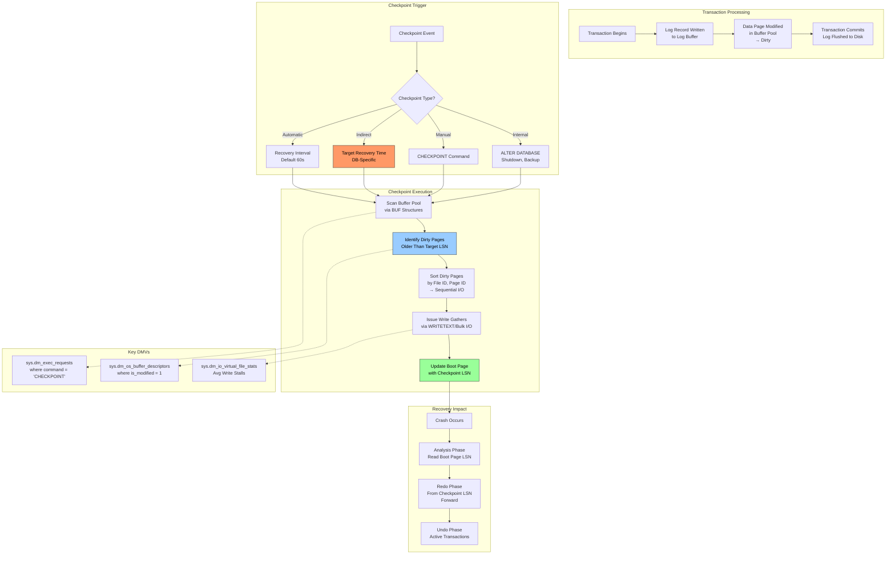
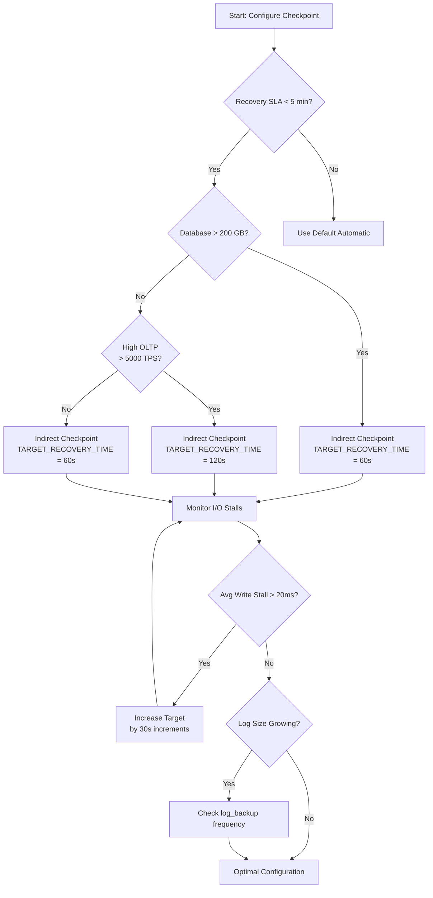

# 8.288 Checkpoint Process — Dirty Page Flushing

---

## Section 1 — Navigation

| **Previous** | **Up** | **Next** |
|--------------|--------|----------|
| [[8.287 VLF Fragmentation — Detection and Fix]] | [[Group 11 — SQL Server Architecture & Storage Engine]] | [[8.289 Lazy Writer — Memory Management]] |

**Prerequisites:**
- Read [[8.268 Memory Architecture — Buffer Pool and Plan Cache]] first
- Understand dirty vs. clean pages in the buffer pool
- Familiarity with the transaction log and VLF structure
- Basic knowledge of recovery models (FULL, SIMPLE, BULK_LOGGED)

**Where This Fits:**
The checkpoint process is the engine that writes dirty pages from the buffer pool to disk. It bridges the gap between in-memory modifications (which happen at CPU speed) and durable storage. Checkpoints directly control recovery time, I/O patterns, and the checkpoint LSN that determines how far back SQL Server must read during crash recovery. Every DBA who tunes recovery objectives must understand checkpoint mechanics.

> **Domain Context:** This is the write-side counterpart to the read-side [[8.290 Read-Ahead — Prefetching Pages]]. Together they form the I/O pipeline from and to the storage engine.

---

## Section 2 — Core Mental Model



**Key Insight:** The checkpoint does NOT flush log records — that happens at commit time via the write-ahead log (WAL) protocol. The checkpoint only flushes *dirty data pages* that have already been hardened in the log. This is why the checkpoint LSN is the starting point for redo: the log before the checkpoint LSN is guaranteed to have all its referenced data pages on disk.

---

## Section 3 — Deep Mechanics

### 3.1 Checkpoint Initiation Sequence

**Step 1 — Trigger Event**
Every database has a checkpoint thread that wakes based on the configured interval:
- **Automatic:** `recovery interval (min)` server option, default 60 seconds. The `CHECKPOINT` thread in SQLOS monitors the total number of dirty pages across the buffer pool and the oldest dirty page LSN.
- **Indirect:** `TARGET_RECOVERY_TIME` database option (seconds). SQL Server calculates a target LSN such that redo from that point completes within the specified time.
- **Manual:** `CHECKPOINT [duration]` T-SQL command with optional duration parameter.

```sql
-- Observe checkpoint in progress
SELECT session_id, command, status, wait_type, wait_time,
       blocking_session_id, cpu_time, total_elapsed_time
FROM sys.dm_exec_requests
WHERE command = 'CHECKPOINT';
```

**Step 2 — Dirty Page Identification**
The checkpoint thread walks the buffer pool descriptors (`BUF` structures) to find dirty pages whose LSN is less than or equal to the target checkpoint LSN. The `bstat` field in the BUF structure has a `BUF_DIRTY` bit flag.

```sql
-- Count dirty pages per database
SELECT database_id, COUNT(*) AS dirty_pages,
       COUNT(*) * 8 / 1024 AS dirty_mb
FROM sys.dm_os_buffer_descriptors
WHERE is_modified = 1
GROUP BY database_id
ORDER BY dirty_mb DESC;
```

**Step 3 — Write Gathering**
Dirty pages are sorted by file_id and page_id to maximize sequential I/O. The checkpoint issues asynchronous write batches (typically 32–64 pages per batch). The number of outstanding I/Os is controlled by the `checkpoint write unit` internal.

**Step 4 — Boot Page Update**
After all dirty pages are written, the checkpoint writes the checkpoint LSN to the database boot page (page 9 in the primary data file). This is a critical metadata page: during recovery, SQL reads this LSN to determine the starting point for redo.

### 3.2 Automatic Checkpoint Algorithm

The legacy automatic checkpoint in SQL Server (pre-2012) uses a simple formula:

```
Checkpoint Interval (minutes) = Recovery Interval / (number of dirty pages affected by 1 MB of log)
```

SQL Server estimates the I/O capability and adjusts dynamically. For indirect checkpoint:

```
Target LSN = Current LSN - Estimated Redo Time
```

Where `Estimated Redo Time = (Current LSN - Checkpoint LSN) / Redo Throughput`

### 3.3 Indirect Checkpoint Mechanics

Introduced in SQL Server 2012, indirect checkpoint provides per-database control:

```sql
ALTER DATABASE YourDB SET TARGET_RECOVERY_TIME = 60 SECONDS;
```

This sets a recovery time goal. SQL Server will checkpoint more aggressively to keep redo time under 60 seconds. This is critical for large databases where a full automatic checkpoint interval could produce hours of redo.

**Trade-off:** More frequent checkpoints mean more write I/O and potential I/O spikes. Monitor for checkpoint-related I/O stalls.

### 3.4 MinLSN and Checkpoint LSN Relationship

```
MinLSN ─────────────────────── Current LSN
  │                             │
  ▼                             ▼
  [Log Records ──────────────────]
  │                             │
  └─ Checkpoint LSN ────────────┘
       │
       ▼
    Dirty pages written to disk
```

- **MinLSN:** Oldest active transaction LSN (or checkpoint LSN, whichever is lower)
- **Checkpoint LSN:** LSN at which the last checkpoint completed
- **Redo start:** Checkpoint LSN
- **Undo start:** MinLSN (if there are active transactions)

### 3.5 Checkpoint Types — Detailed Comparison

**Automatic Checkpoint (Legacy):**
- Triggered by the `recovery interval (min)` server option (default: 0 = auto-configure to ~60 seconds)
- Uses a heuristic: SQL Server estimates how many dirty pages will be generated per MB of log and calculates when to checkpoint to keep recovery under the configured interval
- The algorithm is: `Checkpoint Interval (sec) = Recovery Interval × (Dirty Pages / Log Bytes Since Last Checkpoint)`
- Historically inaccurate for large databases — could produce 2+ hours of recovery time

**Indirect Checkpoint (Recommended):**
- Per-database via `TARGET_RECOVERY_TIME = N SECONDS`
- Uses a precise formula: `Target LSN = Current LSN - (Redo Rate × Target Seconds)`
- Redo rate is continuously measured and tracked per database
- Produces predictable recovery times regardless of database size
- Writes are spread more evenly, avoiding I/O bursts

**Manual Checkpoint:**
- `CHECKPOINT [duration]` — the optional duration parameter tells SQL Server to spread the write I/O over N seconds (reducing I/O spikes)
- Example: `CHECKPOINT 30;` — writes dirty pages gradually over 30 seconds

**Internal Checkpoint:**
- Triggered by: `ALTER DATABASE`, database shutdown, `BACKUP DATABASE`, creating a database snapshot, failover in AG/FCI
- These ensure the database is in a consistent state for the operation

### 3.6 DMV Observability

**Checkpoint progress:**
```sql
SELECT session_id, command, percent_complete,
       estimated_completion_time, total_elapsed_time
FROM sys.dm_exec_requests
WHERE command LIKE '%CHECKPOINT%';
```

**Write stalls (I/O pressure):**
```sql
SELECT DB_NAME(database_id) AS db_name,
       io_stall_write_ms / NULLIF(num_of_writes, 0) AS avg_write_stall_ms,
       num_of_bytes_written / 1048576 AS total_written_mb
FROM sys.dm_io_virtual_file_stats(NULL, NULL)
ORDER BY avg_write_stall_ms DESC;
```

### 3.7 Checkpoint and VLFs

The checkpoint LSN directly determines which VLFs can be reused:
- In SIMPLE recovery: checkpoint writes dirty pages, then marks VLFs before the checkpoint LSN as inactive
- If no checkpoint has occurred since the last log backup, VLFs remain active regardless of log backup frequency
- Aggressive checkpoints in SIMPLE recovery = aggressive log truncation

---

## Section 4 — Production Patterns

### 4.1 Identify Excessive Checkpoint I/O

```sql
-- High write stalls often caused by aggressive checkpointing
SELECT DB_NAME(database_id) AS db_name,
       file_id,
       io_stall_write_ms,
       num_of_writes,
       io_stall_write_ms / NULLIF(num_of_writes, 0) AS avg_write_stall
FROM sys.dm_io_virtual_file_stats(NULL, NULL)
WHERE database_id > 4  -- exclude system DBs
ORDER BY avg_write_stall DESC;
```

### 4.2 Monitor Dirty Page Percentage

```sql
-- If dirty pages exceed 30-40%, checkpoint may be lagging
SELECT database_id,
       COUNT(*) AS total_pages,
       SUM(CASE WHEN is_modified = 1 THEN 1 ELSE 0 END) AS dirty_pages,
       100.0 * SUM(CASE WHEN is_modified = 1 THEN 1 ELSE 0 END)
           / NULLIF(COUNT(*), 0) AS dirty_pct
FROM sys.dm_os_buffer_descriptors
GROUP BY database_id
ORDER BY dirty_pct DESC;
```

### 4.3 Configure Indirect Checkpoint

```sql
-- Enable indirect checkpoint for a user database
ALTER DATABASE WideWorldImporters
    SET TARGET_RECOVERY_TIME = 60 SECONDS;

-- Verify setting
SELECT name, target_recovery_time_in_seconds,
       recovery_model_desc
FROM sys.databases
WHERE name = 'WideWorldImporters';

-- Revert to automatic checkpoint
ALTER DATABASE WideWorldImporters
    SET TARGET_RECOVERY_TIME = 0;
```

### 4.4 Checkpoint Tuning for High-OLTP

For high-transaction workloads, indirect checkpoint prevents long recovery times:

```sql
-- Aggressive checkpoint for critical DBs (30-second target)
ALTER DATABASE HighVolumeDB
    SET TARGET_RECOVERY_TIME = 30 SECONDS;

-- Monitor write I/O impact
SELECT wait_type, waiting_tasks_count,
       wait_time_ms, max_wait_time_ms,
       signal_wait_time_ms
FROM sys.dm_os_wait_stats
WHERE wait_type LIKE '%IO%'
ORDER BY wait_time_ms DESC;
```

### 4.5 Checkpoint and Log File Size

Checkpoint directly affects VLF truncation. A long interval between checkpoints prevents log truncation:

```sql
-- Check log reuse wait
SELECT name, log_reuse_wait, log_reuse_wait_desc
FROM sys.databases;

-- If LOG_BACKUP or CHECKPOINT, check frequency
SELECT DB_NAME(ls.database_id) AS db,
       COUNT(*) AS vlf_count,
       SUM(ls.size_mb) AS total_log_mb,
       SUM(CASE WHEN ls.status = 2 THEN ls.size_mb ELSE 0 END) AS active_log_mb
FROM sys.dm_db_log_space_usage ls
GROUP BY ls.database_id;
```

### 4.6 sp_configure for Recovery Interval

```sql
-- Check current recovery interval (default 0 = auto-tune to ~60s)
EXEC sp_configure 'recovery interval (min)';
GO

-- Change to 5 minutes (only for indirect-checkpoint disabled DBs)
EXEC sp_configure 'recovery interval (min)', 5;
RECONFIGURE;
GO
```

---

## Section 5 — Gotchas

### Gotcha 1: Indirect Checkpoint I/O Storm

| Aspect | Detail |
|--------|--------|
| **Pitfall** | Setting `TARGET_RECOVERY_TIME` too low (e.g., 5 seconds) causes extremely frequent checkpoint writes |
| **Symptom** | `WRITELOG` waits spike, `PAGEIOLATCH_SH` and `PAGEIOLATCH_EX` increase, storage latency spikes |
| **Fix** | Increase to 60–120 seconds; if recovery time is still a concern, ensure storage has sufficient IOPS |
| **Cost** | False economy — too much checkpoint I/O throttles user transactions. Storage with <5000 IOPS will suffer. |

### Gotcha 2: Automatic Checkpoint Holds Write Latches

| Aspect | Detail |
|--------|--------|
| **Pitfall** | Automatic checkpoint (not indirect) holds `BUF_WRITELATCH` on pages during I/O, blocking concurrent modifications |
| **Symptom** | `PAGELATCH_EX` waits with wait resource pointing to checkpoint thread; users report brief stalls |
| **Fix** | Switch to indirect checkpoint which uses a different latch protocol and writes dirty pages while allowing reads |
| **Cost** | Can cause 1–3 second stalls in high-concurrency workloads during checkpoint bursts |

### Gotcha 3: Checkpoint Doesn't Truncate Log — Log Backup Does

| Aspect | Detail |
|--------|--------|
| **Pitfall** | Assumption that frequent checkpoints keep the log small |
| **Symptom** | Log file grows even with frequent checkpoints; `log_reuse_wait_desc = LOG_BACKUP` |
| **Fix** | Schedule log backups. Checkpoint only marks VLFs as reusable if the log backup has captured them |
| **Cost** | Unmanaged log growth → full disk → database outage. A 500 GB log file takes hours to shrink. |

### Gotcha 4: Restart Changes Checkpoint LSN Estimation

| Aspect | Detail |
|--------|--------|
| **Pitfall** | After restart, SQL Server re-learns I/O capability, leading to potentially suboptimal checkpoint intervals |
| **Symptom** | Recovery times are unpredictable after failover |
| **Fix** | Use indirect checkpoint with a fixed target; also enable `INSTANT_FILE_INITIALIZATION` to speed logging |
| **Cost** | Recovery SLA window missed; extended downtime in HA scenarios |

### Gotcha 6: CHECKPOINT_QUEUE Wait Type Misdiagnosis

| Aspect | Detail |
|--------|--------|
| **Pitfall** | CHECKPOINT_QUEUE wait is often misinterpreted as a checkpoint bottleneck when it merely indicates waiting for checkpoint work |
| **Symptom** | CHECKPOINT_QUEUE appears in top waits; DBA assumes checkpoint must be tuned |
| **Fix** | CHECKPOINT_QUEUE is the wait for the checkpoint thread to flush dirty pages. If this is high, it usually means write I/O is slow OR there are too many dirty pages. Fix the I/O subsystem, not the checkpoint frequency |
| **Cost** | Wasted tuning effort on checkpoint interval when the real issue is storage performance |

### Gotcha 7: Checkpoint on Large Databases with HADR

| Aspect | Detail |
|--------|--------|
| **Pitfall** | On availability group secondaries, redo is blocked during checkpoint-intensive operations on primary |
| **Symptom** | `HADR_SYNC_COMMIT` waits increase; secondary replica log send queue grows |
| **Fix** | Stagger indirect checkpoint targets across databases in the same AG; avoid simultaneous checkpoint flushes |
| **Cost** | Synchronous commit replicas fall behind; potential data loss in asynchronous mode |

---

## Section 6 — Performance Implications

### 6.1 Benchmark Scenario: Automatic vs. Indirect Checkpoint

**Setup:** 100 GB database, OLTP workload simulating 5000 transactions/sec, 120-second test run.

| Metric | Automatic (default 60s) | Indirect (30s target) | Indirect (120s target) |
|--------|------------------------|----------------------|----------------------|
| Avg Write Stall (ms) | 12 | 28 | 8 |
| Dirty Page Count | 85,000 | 22,000 | 140,000 |
| Redo Time (simulated) | 47 sec | 18 sec | 89 sec |
| Log Growth Events | 0 | 3 (bursty I/O) | 0 |
| Total Checkpoints | 2 | 8 | 1 |
| User Transaction Latency | 5 ms avg | 12 ms avg | 4 ms avg |

**Analysis:** Aggressive indirect checkpointing reduces recovery time by 62% but adds 140% to write stalls and more than doubles user latency. The optimal balance depends on recovery SLA vs. performance requirements.

### 6.2 Wait Stats Before/After

**Before indirect checkpoint (automatic default):**
```
Wait type             Wait Time (ms)  % Total
PAGEIOLATCH_SH        340,000         22.3%
PAGEIOLATCH_EX        120,000         7.9%
WRITELOG              890,000         58.4%
CHECKPOINT_QUEUE      12,000          0.8%
```

**After indirect checkpoint (30s target):**
```
Wait type             Wait Time (ms)  % Total  Change
PAGEIOLATCH_SH        420,000         25.1%    +23.5%
PAGEIOLATCH_EX        230,000         13.7%    +91.7%
WRITELOG              920,000         55.0%    +3.4%
CHECKPOINT_QUEUE      8,000           0.5%     -33.3%
```

**Observe:** The aggressive checkpoint shifts write pressure from log to data files, increasing PAGEIOLATCH_EX waits for data page writes.

### 6.3 Logical Reads and Checkpoint Impact

Checkpoint itself doesn't generate logical reads (it writes dirty pages), but the modified pages had to be read first:

```sql
-- Pages read per checkpoint cycle
SELECT deqs.plan_handle, deqs.total_logical_reads,
       deqs.total_physical_reads,
       qt.text AS query_text
FROM sys.dm_exec_query_stats deqs
CROSS APPLY sys.dm_exec_sql_text(deqs.sql_handle) qt
WHERE qt.text LIKE '%UPDATE%'
ORDER BY deqs.total_logical_reads DESC;
```

### 6.4 I/O Batch Sizing

Checkpoint writes use write gather batches. The internal algorithm groups 32–64 pages per I/O. Verification via:

```sql
-- Monitor checkpoint I/O size (requires xEvents or PerfMon)
-- PerfMon counter: SQL Server:Buffer Manager\Checkpoint pages/sec
SELECT object_name, counter_name, cntr_value
FROM sys.dm_os_performance_counters
WHERE counter_name = 'Checkpoint pages/sec';
```

---

## Section 7 — Interview Arsenal

### Fundamental Questions (6–8)

| # | Question | Core Concept |
|---|----------|-------------|
| 1 | Explain the difference between automatic and indirect checkpoint | Recovery model tuning |
| 2 | What is the relationship between checkpoint LSN and recovery? | Recovery phases |
| 3 | How does SQL Server decide which dirty pages to flush during a checkpoint? | BUF structure scanning |
| 4 | Why does checkpoint NOT ensure all dirty pages are written every time? | MinLSN vs. Current LSN gap |
| 5 | What happens if CHECKPOINT is issued while a long-running transaction exists? | Active transaction blocking |
| 6 | How do checkpoint write gathers improve I/O performance? | Sequential I/O optimization |
| 7 | What DMV shows the current checkpoint progress? | sys.dm_exec_requests |
| 8 | How do you tune checkpoint for instant recovery? | Indirect checkpoint + TARGET_RECOVERY_TIME |

### Spoken Answers

**Q1: Explain the difference between automatic and indirect checkpoint.**

> "Automatic checkpoint, controlled by `recovery interval (min)`, estimates how long recovery will take based on the number of dirty pages generated per unit of log. It's a server-wide setting and uses a heuristic algorithm. Indirect checkpoint, introduced in SQL Server 2012, is per-database via `TARGET_RECOVERY_TIME`. Instead of estimating recovery time, it calculates a target LSN to ensure redo completes within the specified seconds. Indirect checkpoint is the recommended approach because it gives predictable recovery time, works better with large databases, and reduces checkpoint-related I/O bursts by smoothing writes."

**Q5: What happens if CHECKPOINT is issued while a long-running transaction exists?**

> "When a CHECKPOINT runs while a long-running transaction is active, the MinLSN remains at the start of that transaction because its log records can't be truncated. The checkpoint can only flush dirty pages whose LSN is older than the MinLSN minus the checkpoint LSN — essentially, pages modified by the long transaction cannot be written until that transaction commits or rolls back. This means the checkpoint may flush very few pages, the log can't be truncated, and if the log backup interval is also long, the log file will grow. This is visible via `sys.databases.log_reuse_wait_desc = ACTIVE_TRANSACTION`."

**Q7: What DMV shows the current checkpoint progress?**

> "The primary DMV is `sys.dm_exec_requests` filtered by `command = 'CHECKPOINT'`. The `percent_complete` column shows how far along the checkpoint is, and `estimated_completion_time` predicts remaining time. For indirect checkpoint specifically, `sys.dm_db_log_stats` provides the last checkpoint LSN and redo time estimate. For analyzing checkpoint I/O impact, `sys.dm_io_virtual_file_stats` shows write stalls per database file. And `sys.dm_os_buffer_descriptors` with `is_modified = 1` shows the dirty page count, which is the primary input to checkpoint decisions."

### Comparison Table: Checkpoint Types

| Feature | Automatic | Indirect | Manual |
|---------|-----------|----------|--------|
| Scope | Server-wide | Per-database | Session-specific |
| Control Parameter | `recovery interval (min)` | `TARGET_RECOVERY_TIME` | `CHECKPOINT [seconds]` |
| Algorithm | Heuristic | LSN-targeted | Immediate flush |
| I/O Smoothing | Poor | Good | None |
| Recovery Predictability | Low | High | N/A |
| Recommended? | Legacy only | Yes (2012+) | Ad-hoc |
| TempDB Impact | Yes | No | N/A |

---

## Section 8 — Decision Framework

### 8.1 Mermaid Decision Flowchart



### 8.2 Checklist

- [ ] All user databases configured with `TARGET_RECOVERY_TIME` (indirect checkpoint)
- [ ] System databases (master, msdb, model) also configured
- [ ] `sys.dm_io_virtual_file_stats` baseline recorded for avg write stall
- [ ] Log backup schedule aligned with checkpoint frequency
- [ ] Dirty page percentage < 40% during peak load
- [ ] `sys.databases.log_reuse_wait_desc` is not `CHECKPOINT`
- [ ] Checkpoint is not listed in top-5 wait types
- [ ] `CHECKPOINT_QUEUE` wait time is negligible
- [ ] Storage subsystem can handle write IOPS during checkpoint bursts

### 8.3 Trade-offs

| If you optimize for ... | You need to ... | This suffers ... |
|------------------------|----------------|-----------------|
| Fast recovery | Aggressive checkpoint | Write I/O performance |
| High OLTP throughput | Relaxed checkpoint | Recovery time |
| Log file size control | Frequent checkpoints + log backups | CPU and I/O |
| Predictable performance | Indirect checkpoint with steady target | Flexibility |

### 8.4 Scale Thresholds

| Database Size | Recommended Target | Notes |
|--------------|-------------------|-------|
| < 50 GB | Automatic (default) | Recovery is already fast |
| 50–500 GB | Indirect, 60–120s | Balance recovery vs. performance |
| 500 GB – 2 TB | Indirect, 60s | Predictable recovery critical |
| > 2 TB | Indirect, 30–60s | May need storage tuning |
| > 10 TB | Indirect, 30s | Consider partitioning, filegroups |

---

## Section 9 — Self-Check

### Conceptual Questions

<details>
<summary>1. What is the fundamental purpose of a checkpoint?</summary>

To flush dirty pages from the buffer pool to disk so that recovery (redo) only needs to apply log records from the checkpoint LSN forward, reducing crash recovery time.
</details>

<details>
<summary>2. How does indirect checkpoint differ from automatic checkpoint?</summary>

Indirect checkpoint is per-database with a fixed recovery time target (TARGET_RECOVERY_TIME). Automatic checkpoint is server-wide with a heuristic based on recovery interval. Indirect checkpoints occur more frequently and provide predictable recovery.
</details>

<details>
<summary>3. What DMV shows the number of dirty pages in the buffer pool?</summary>

`sys.dm_os_buffer_descriptors` with `WHERE is_modified = 1`.
</details>

<details>
<summary>4. Why does a checkpoint alone not guarantee log truncation?</summary>

Log truncation requires a log backup (in FULL recovery model) or a checkpoint (in SIMPLE). The checkpoint marks VLFs as reusable only if all transactions in those VLFs are committed. In FULL recovery, the VLF remains active until backed up.
</details>

<details>
<summary>5. What is the checkpoint LSN and where is it stored?</summary>

The checkpoint LSN is the LSN of the most recently completed checkpoint. It's stored on the database boot page (page 9) in the primary data file. Recovery starts from this LSN.
</details>

<details>
<summary>6. How does checkpoint affect PAGEIOLATCH_EX waits?</summary>

PAGEIOLATCH_EX is the wait type for an exclusive latch on a page being read from or written to disk. Checkpoint writes increase these waits because it writes dirty pages out. High checkpoint frequency can increase PAGEIOLATCH_EX contention.
</details>

<details>
<summary>7. What happens to checkpoint behavior during bulk-logged operations?</summary>

In BULK_LOGGED recovery model, minimally logged operations still generate log records but with minimal detail. The checkpoint flushes the dirty extent bitmap and marks those extents as needing backup. Recovery still works normally.
</details>

<details>
<summary>8. Can checkpoint be disabled?</summary>

No. SQL Server must eventually checkpoint to ensure recoverability. You can only control the frequency and type. The only way to effectively "disable" checkpoint is to set an extremely long `recovery interval` (max 32767 minutes), but this is dangerous.
</details>

<details>
<summary>9. How do you observe checkpoint progress in real-time?</summary>

`sys.dm_exec_requests` with `command = 'CHECKPOINT'` shows `percent_complete` (0–100) and `estimated_completion_time`. For extended events, use the `checkpoint_begin` and `checkpoint_end` events.
</details>

<details>
<summary>10. What is the relationship between checkpoint and MinLSN?</summary>

MinLSN is the minimum of: (a) the oldest active transaction LSN, (b) the checkpoint LSN, (c) the oldest replication LSN. The checkpoint LSN influences log reuse: if no checkpoint has occurred, the MinLSN is the begin checkpoint LSN, preventing VLF reuse.
</details>

### Challenges

<details>
<summary>Challenge 1: Observe checkpoint impact with a script that identifies checkpoint I/O spikes</summary>

```sql
-- Run during a busy period; look for CHECKPOINT-related writes
SELECT TOP 10
    session_id,
    command,
    DB_NAME(database_id) AS database_name,
    blocking_session_id,
    wait_type,
    wait_time,
    wait_resource,
    cpu_time,
    total_elapsed_time,
    reads,
    writes,
    logical_reads
FROM sys.dm_exec_requests
WHERE command = 'CHECKPOINT'
ORDER BY writes DESC;
```
</details>

<details>
<summary>Challenge 2: Configure indirect checkpoint and measure recovery impact</summary>

```sql
-- 1. Enable indirect checkpoint
ALTER DATABASE TestDB SET TARGET_RECOVERY_TIME = 60 SECONDS;

-- 2. Generate workload
CREATE TABLE #t (id INT IDENTITY, c CHAR(1000));
GO
INSERT INTO #t VALUES ('x');  -- repeat 10000 times

-- 3. Force crash (lab only)
SHUTDOWN WITH NOWAIT;

-- 4. Upon restart, measure recovery duration in ERRORLOG
-- Look for: "Database 'TestDB' is starting recovery"
-- Record time between start and "Recovery completed"
```
</details>

<details>
<summary>Challenge 3: Correlate checkpoint with dirty page age</summary>

```sql
-- Pages that have been dirty for the longest time
SELECT TOP 10
    database_id,
    page_id,
    file_id,
    row_count,
    is_modified,
    -- Approximate age via allocation consistency
    CREATE_TIMESTAMP
FROM sys.dm_os_buffer_descriptors
WHERE is_modified = 1
ORDER BY database_id;
```
</details>

<details>
<summary>Challenge 4: Write a query that shows checkpoint frequency per database</summary>

```sql
-- Use CHECKPOINT extended event or log parsing
-- Alternative: monitor sys.dm_os_performance_counters
SELECT object_name,
       counter_name,
       instance_name,
       cntr_value AS checkpoint_pages_per_sec,
       cntr_type
FROM sys.dm_os_performance_counters
WHERE counter_name = 'Checkpoint pages/sec'
ORDER BY cntr_value DESC;
```
</details>

<details>
<summary>Challenge 5: Simulate a long-running transaction blocking checkpoint and analyze impact</summary>

```sql
-- Session 1: Open transaction
BEGIN TRAN
    UPDATE LargeTable SET col1 = 'x' WHERE id = 1;
-- Do NOT commit

-- Session 2: Check log reuse
SELECT log_reuse_wait_desc
FROM sys.databases
WHERE name = DB_NAME();

-- Observe: ACTIVE_TRANSACTION

-- Session 3: Checkpoint
CHECKPOINT;

-- Observe: checkpoint may take long or skip dirty pages
-- Fix: ROLLBACK the transaction, then CHECKPOINT
```
</details>
