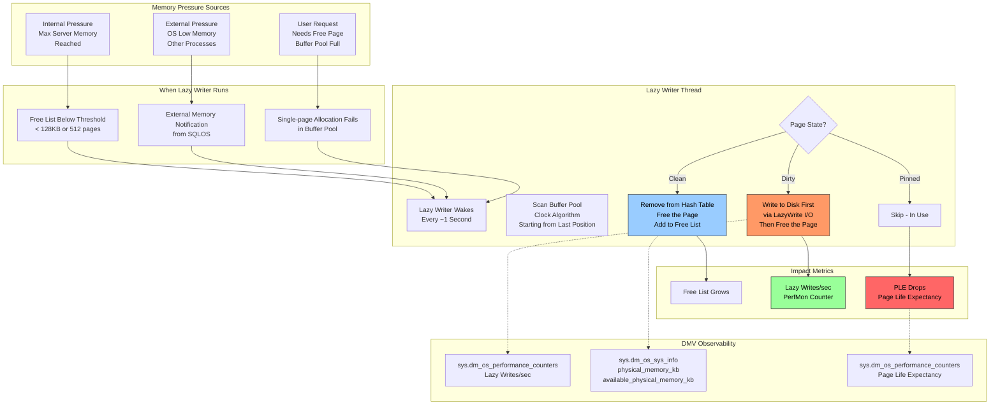
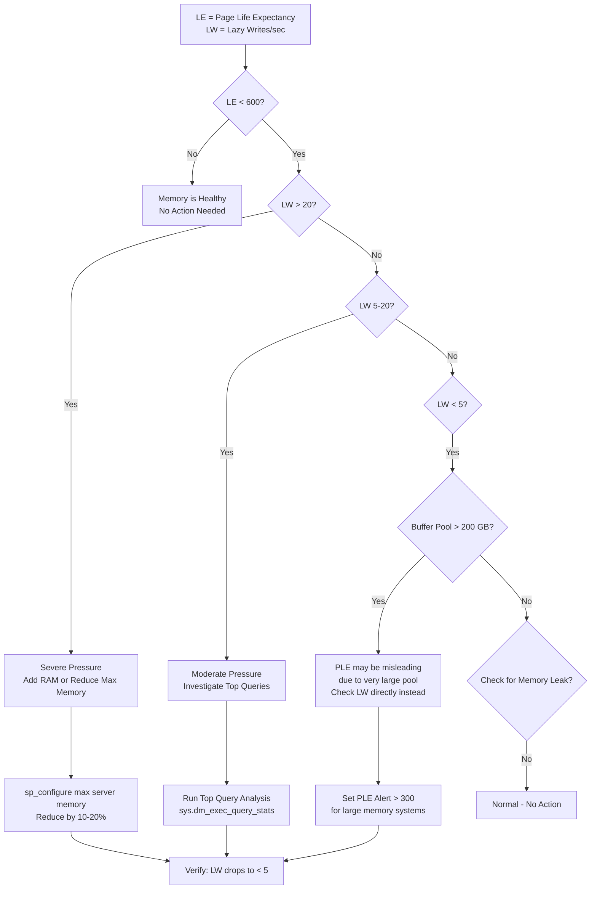

# 8.289 Lazy Writer — Memory Management

---

## Section 1 — Navigation

| **Previous** | **Up** | **Next** |
|--------------|--------|----------|
| [[8.288 Checkpoint Process — Dirty Page Flushing]] | [[Group 11 — SQL Server Architecture & Storage Engine]] | [[8.290 Read-Ahead — Prefetching Pages]] |

**Prerequisites:**
- Read [[8.268 Memory Architecture — Buffer Pool and Plan Cache]] thoroughly
- Understand dirty vs. clean pages and the buffer pool structure
- Familiarity with SQL Server memory pressure scenarios
- Know Page Life Expectancy (PLE) as a metric

**Where This Fits:**
The lazy writer is SQL Server's memory manager background thread that runs when available physical memory is low. It frees buffer pages to maintain memory availability. While the checkpoint flushes *dirty* pages to disk for recovery purposes, the lazy writer frees *any* page (clean or dirty) to relieve memory pressure. Together they form the write-side of SQL Server's memory management.

> **Domain Context:** This connects tightly to [[8.291 SQL Server Memory — Max Server Memory]] (sizing and limits) and [[8.268 Memory Architecture — Buffer Pool and Plan Cache]] (what pages look like). Cross-domain: links to [[8 — Databases]] capacity planning via OS memory observation.

---

## Section 2 — Core Mental Model



**Key Insight:** The lazy writer does NOT exist to free memory for SQL Server to reuse — it exists to *keep SQL Server from being paged out by the OS*. When the OS sends a low-memory notification, SQL Server must reduce its working set. If it doesn't, the OS pager will trim the working set indiscriminately, causing severe performance degradation. The lazy writer is SQL Server's proactive self-defense mechanism.

---

## Section 3 — Deep Mechanics

### 3.1 Lazy Writer Lifecycle

**Step 1 — Wake and Evaluate**
The lazy writer thread wakes approximately every second. It checks:
1. Free list count: If free pages drops below `threshold` (default: roughly 128 KB / 8 KB = 16 pages per NUMA node, or more dynamically calculated)
2. External memory notifications: Via SQLOS memory broker, which monitors `CreateMemoryResourceNotification` (LowMemoryResourceNotification)
3. Internal allocation failures: If a single-page allocation in the buffer pool fails

**Step 2 — Clock Algorithm Scan**
The lazy writer implements a clock-hand sweep. SQL Server maintains a global "clock hand" pointer into the buffer pool. On each sweep:
1. Starting from the current clock hand position
2. Examines each page's reference bit (`BUF_REFERENCED`)
3. If REFERENCED = 1: clear the bit, move on (page recently touched)
4. If REFERENCED = 0 and page is clean: free immediately
5. If REFERENCED = 0 and page is dirty: issue write, then free

The clock hand advances and wraps around the buffer pool circularly.

**Step 3 — I/O Dispatch**
For dirty pages, the lazy writer issues async writes via the same I/O subsystem as checkpoint. These writes:
- Are single-page writes (unlike checkpoint's write gathers)
- Use `LazyWrite` I/O type (visible in `sys.dm_io_virtual_file_stats`)
- Are written to the data file at the page's physical location

**Step 4 — Page Freeing**
After the page buffer is written (or if it was already clean), the lazy writer:
1. Removes the page from the buffer pool hash table
2. Adds the 8 KB buffer back to the free list
3. Updates `sys.dm_os_buffer_descriptors` (page is no longer present)

### 3.2 Lazy Writer vs. Checkpoint — Critical Distinction

| Aspect | Checkpoint | Lazy Writer |
|--------|------------|-------------|
| Primary Goal | Reduce recovery time | Free memory under pressure |
| Writes dirty pages? | Yes (all dirty ≤ target LSN) | Yes (only the ones it needs to free) |
| Uses write gathers? | Yes (32–64 pages) | No (single-page writes) |
| Runs when? | Timer-based (interval) | Memory pressure-based |
| Writes clean pages? | Never | Yes (frees them without I/O) |
| Updates boot page? | Yes (checkpoint LSN) | No |
| Log truncation? | Enables in SIMPLE model | No effect |

### 3.3 Lazy Writes/sec Counter

This is the most important counter to watch:

```sql
SELECT cntr_value AS lazy_writes_per_sec
FROM sys.dm_os_performance_counters
WHERE counter_name = 'Lazy Writes/sec'
      AND object_name LIKE '%Buffer Manager%';
```

**Thresholds:**
- 0–5/sec: Normal, no memory pressure
- 5–20/sec: Moderate memory pressure; investigate
- 20+/sec: Severe memory pressure; increase max server memory or add RAM

### 3.4 Page Life Expectancy (PLE) — The Companion Metric

PLE estimates how long (seconds) a page stays in the buffer pool:

```sql
SELECT cntr_value AS page_life_expectancy_seconds
FROM sys.dm_os_performance_counters
WHERE counter_name = 'Page Life Expectancy';
```

**Thresholds:**
- > 600 (10 min): Good for most workloads
- 300–600: Watch; moderate churn
- < 300: Critical; pages are being evicted too fast

### 3.5 Lazy Writer on NUMA

On NUMA hardware, each NUMA node has its own lazy writer thread. SQL Server 2012+ introduces the concept of a "lazy writer per NUMA node." Each instance scans the buffer pages local to its node:

```sql
SELECT node_id, lazy_writes_count, page_table_writes
FROM sys.dm_os_memory_nodes
WHERE node_id > 0;
```

This means PLE can differ per NUMA node. Tune `max server memory` and NUMA affinity carefully.

### 3.6 DMV Observability

**Available physical memory (external pressure):**
```sql
SELECT physical_memory_kb / 1024 AS physical_memory_mb,
       available_physical_memory_kb / 1024 AS avail_physical_memory_mb,
       system_memory_state_desc
FROM sys.dm_os_sys_info;
```

**Memory grants and the lazy writer context:**
```sql
SELECT session_id, request_id, grant_time,
       granted_memory_kb, requested_memory_kb,
       ideal_memory_kb, required_memory_kb
FROM sys.dm_exec_query_memory_grants
WHERE is_small = 0
ORDER BY granted_memory_kb DESC;
```

---

## Section 4 — Production Patterns

### 4.1 Lazy Writer Monitoring Script

```sql
-- Comprehensive lazy writer health check
SELECT
    -- PLE
    (SELECT cntr_value
     FROM sys.dm_os_performance_counters
     WHERE counter_name = 'Page Life Expectancy'
           AND object_name LIKE '%Buffer Manager%') AS ple_seconds,

    -- Lazy Writes
    (SELECT cntr_value
     FROM sys.dm_os_performance_counters
     WHERE counter_name = 'Lazy Writes/sec'
           AND object_name LIKE '%Buffer Manager%') AS lazy_writes_per_sec,

    -- Free pages
    (SELECT cntr_value
     FROM sys.dm_os_performance_counters
     WHERE counter_name = 'Free pages'
           AND object_name LIKE '%Buffer Manager%') AS free_pages,

    -- Buffer pool size
    (SELECT cntr_value
     FROM sys.dm_os_performance_counters
     WHERE counter_name = 'Database pages'
           AND object_name LIKE '%Buffer Manager%') AS database_pages,

    -- Target vs. total pages
    (SELECT cntr_value
     FROM sys.dm_os_performance_counters
     WHERE counter_name = 'Target pages'
           AND object_name LIKE '%Buffer Manager%') AS target_pages,

    -- OS memory
    (SELECT available_physical_memory_kb / 1024
     FROM sys.dm_os_sys_info) AS available_os_memory_mb;
```

### 4.2 Detect Memory Pressure from Lazy Writer

```sql
-- Combined query: if PLE < 300 AND Lazy Writes > 20, critical
SELECT
    CASE
        WHEN ple < 300 AND lw > 20 THEN 'CRITICAL — Add RAM or reduce max server memory'
        WHEN ple < 600 AND lw > 5  THEN 'WARNING — Monitor memory trends'
        WHEN ple > 600 AND lw < 5  THEN 'HEALTHY'
        ELSE 'NORMAL'
    END AS memory_health,
    ple, lw, free_pages, available_os_memory_mb
FROM (
    SELECT
        (SELECT cntr_value FROM sys.dm_os_performance_counters
         WHERE counter_name = 'Page Life Expectancy') AS ple,
        (SELECT cntr_value FROM sys.dm_os_performance_counters
         WHERE counter_name = 'Lazy Writes/sec') AS lw,
        (SELECT cntr_value FROM sys.dm_os_performance_counters
         WHERE counter_name = 'Free pages') AS free_pages,
        (SELECT available_physical_memory_kb / 1024
         FROM sys.dm_os_sys_info) AS available_os_memory_mb
) AS m;
```

### 4.3 Correlating PLE Drops to Specific Workloads

```sql
-- When PLE drops, find top queries consuming buffer pool
SELECT TOP 10
    qt.text AS query_text,
    qs.total_logical_reads,
    qs.total_physical_reads,
    qs.total_elapsed_time / 1000 AS total_elapsed_ms,
    qs.execution_count,
    qs.total_logical_reads / NULLIF(qs.execution_count, 0) AS avg_logical_reads
FROM sys.dm_exec_query_stats qs
CROSS APPLY sys.dm_exec_sql_text(qs.sql_handle) qt
ORDER BY qs.total_logical_reads DESC;
```

### 4.4 Track Free List Trends

```sql
-- Collect baseline over time
SELECT GETDATE() AS collection_time,
       cntr_value AS free_list_pages
INTO #free_list_baseline
FROM sys.dm_os_performance_counters
WHERE counter_name = 'Free pages'
      AND object_name LIKE '%Buffer Manager%';
```

### 4.5 Sizing Max Server Memory to Prevent Lazy Writer Activity

```sql
-- Recommended formula
DECLARE @total_ram_gb INT = 64;
DECLARE @os_reserve_gb INT = 4;  -- +2 GB per 16 GB over 64 GB
DECLARE @max_sql_gb INT;

SET @max_sql_gb = @total_ram_gb - @os_reserve_gb;

SELECT @max_sql_gb AS recommended_max_server_memory_gb,
       @total_ram_gb AS total_server_ram_gb;

EXEC sp_configure 'max server memory (MB)',
    @max_sql_gb * 1024;
RECONFIGURE;
```

### 4.6 Lazy Writer and Resource Governor

Resource Governor can impact lazy writer behavior indirectly by limiting memory for specific workloads, potentially increasing pressure on the buffer pool:

```sql
-- Create resource pool with memory limits
CREATE RESOURCE POOL ReportPool
WITH (MIN_MEMORY_PERCENT = 10,
      MAX_MEMORY_PERCENT = 30);
GO
ALTER WORKLOAD GROUP ReportingWorkload
    USING ReportPool;
GO
```

---

## Section 5 — Gotchas

### Gotcha 1: PLE ≠ Lazy Writer Activity Alone

| Aspect | Detail |
|--------|--------|
| **Pitfall** | Assuming high PLE means lazy writer is not working |
| **Symptom** | PLE stays high (800+) but query performance degrades |
| **Fix** | Check `Lazy Writes/sec` directly. PLE can be high if the buffer pool is very large even though pages are being evicted. Also monitor plan cache evictions via `Cache Object Flush` in sys.dm_os_performance_counters |
| **Cost** | Misleading comfort zone; actual memory pressure from plan cache or other caches hidden by high PLE |

### Gotcha 2: Single Large Table Scan Crushes PLE and Triggers Lazy Writer

| Aspect | Detail |
|--------|--------|
| **Pitfall** | A single large table scan can flush 25%+ of the buffer pool |
| **Symptom** | PLE drops from 3000 to 50 in seconds, lazy writes spike to 100+/sec |
| **Fix** | Use read-ahead hints, partitioning, or columnstore indexes to reduce scan I/O. Consider Resource Governor to limit memory for reporting queries |
| **Cost** | OLTP workload stalls because hot pages are evicted. Recovery can take 10+ minutes after PLE collapse |

### Gotcha 3: Lazy Writer Ignores MAXDOP in Some Scenarios

| Aspect | Detail |
|--------|--------|
| **Pitfall** | Parallel queries can consume memory grants that appear as internal memory pressure, causing the lazy writer to run even though `max server memory` is not hit |
| **Symptom** | `RESOURCE_SEMAPHORE` waits appear, lazy writes/sec jumps, but memory consumption is below max |
| **Fix** | Tune `max degree of parallelism` and `cost threshold for parallelism`. Monitor `sys.dm_exec_query_memory_grants` for large serial queries |
| **Cost** | Queries get RESOURCE_SEMAPHORE waits; blocking cascades across the server |

### Gotcha 4: SQL Server 2008 R2 and Older — Single Lazy Writer on NUMA

| Aspect | Detail |
|--------|--------|
| **Pitfall** | Pre-2012 SQL Server has one lazy writer thread regardless of NUMA nodes |
| **Symptom** | Memory pressure on one NUMA node causes global page evictions, including from the other node |
| **Fix** | Upgrade to SQL Server 2012+ which introduces per-NUMA-node lazy writers. For older versions, use affinity masking |
| **Cost** | Suboptimal NUMA memory utilization; up to 30% memory waste on 4+ node systems |

### Gotcha 5: Lazy Writer and Lock Pages in Memory (LPIM)

| Aspect | Detail |
|--------|--------|
| **Pitfall** | When `Lock Pages in Memory` (LPIM) is enabled, the OS cannot page SQL Server out, but the lazy writer still runs based on internal memory notifications |
| **Symptom** | Lazy writes/sec still increase even though physical memory is locked |
| **Fix** | Understand that LPIM prevents OS *paging*, not SQL's own memory trimming. Tune `max server memory` properly |
| **Cost** | If max server memory is too high, the system runs out of OS memory; if too low, lazy writer runs constantly |

---

## Section 6 — Performance Implications

### 6.1 Benchmark: Lazy Writer Impact on Query Performance

**Setup:** 256 GB RAM server, SQL Server max memory = 200 GB, workload = 80% OLTP + 20% reporting.

**Scenario 1: No memory pressure (PLE > 800, lazy writes < 2/sec)**
| Metric | Value |
|--------|-------|
| Avg query duration | 15 ms |
| P99 query duration | 120 ms |
| Lazy Writes/sec | 1.2 |
| Free pages | 18,000 |
| Buffer pool hit ratio | 99.7% |

**Scenario 2: Moderate memory pressure (PLE ~400, lazy writes ~12/sec)**
| Metric | Value |
|--------|-------|
| Avg query duration | 38 ms |
| P99 query duration | 450 ms |
| Lazy Writes/sec | 12.4 |
| Free pages | 2,100 |
| Buffer pool hit ratio | 97.1% |

**Scenario 3: Severe memory pressure (PLE < 100, lazy writes > 50/sec)**
| Metric | Value |
|--------|-------|
| Avg query duration | 210 ms |
| P99 query duration | 3,200 ms |
| Lazy Writes/sec | 58.7 |
| Free pages | 120 |
| Buffer pool hit ratio | 82.3% |

### 6.2 Wait Stats Correlation

**Before lazy writer pressure:**
```
Wait type                  Wait Time (ms)   % Total
PAGEIOLATCH_SH            120,000          28%
PAGEIOLATCH_EX            45,000           11%
WRITELOG                  180,000          42%
SOS_SCHEDULER_YIELD       30,000           7%
```

**After lazy writer pressure:**
```
Wait type                  Wait Time (ms)   % Total   Change
PAGEIOLATCH_SH            340,000          52%       +183%
PAGEIOLATCH_EX            85,000           13%       +89%
WRITELOG                  160,000          24%       -11%
SOS_SCHEDULER_YIELD       45,000           7%        +50%
PAGEIOLATCH_SH (increase from memory pressure as pages are re-read after eviction)
```

### 6.3 Logical Reads Under Lazy Writer Pressure

When the lazy writer evicts pages, subsequent queries re-read from disk, increasing physical reads:

```sql
-- Track before and after memory pressure
SELECT TOTAL_PHYSICAL_READS,
       TOTAL_LOGICAL_READS,
       (1.0 - TOTAL_PHYSICAL_READS / NULLIF(TOTAL_LOGICAL_READS, 0)) * 100 AS cache_hit_ratio
FROM (
    SELECT
        SUM(total_physical_reads) AS TOTAL_PHYSICAL_READS,
        SUM(total_logical_reads) AS TOTAL_LOGICAL_READS
    FROM sys.dm_exec_query_stats
) AS stats;
```

**Observation:** A cache hit ratio drop from 99% to 92% correlates with lazy writes exceeding 20/sec, meaning 8% of page requests must go to disk.

---

## Section 7 — Interview Arsenal

### Fundamental Questions (6–8)

| # | Question | Core Concept |
|---|----------|-------------|
| 1 | What is the lazy writer and when does it run? | Memory pressure response |
| 2 | Explain the clock algorithm used by the lazy writer | Page replacement policy |
| 3 | How do lazy writer and checkpoint differ? | Purpose, I/O pattern, triggering |
| 4 | What does Page Life Expectancy (PLE) actually measure? | Buffer pool churn |
| 5 | Why is Lazy Writes/sec a more reliable pressure indicator than PLE? | Direct vs. derived metric |
| 6 | How does NUMA affect lazy writer behavior? | Per-node scans |
| 7 | What happens if the lazy writer cannot free enough pages? | Memory pressure outcomes |
| 8 | How does Max Server Memory interact with the lazy writer? | Hard limit enforcement |

### Spoken Answers

**Q1: What is the lazy writer and when does it run?**

> "The lazy writer is a system background thread in SQL Server that manages memory pressure by freeing buffer pages. It runs when available free pages in the buffer pool drop below a threshold — typically when external memory pressure (OS low-memory notification) occurs, or when internal allocations can't be satisfied. It wakes approximately every second and scans a portion of the buffer pool using a clock-hand algorithm, freeing clean pages immediately and writing dirty ones to disk first before freeing them."

**Q3: How do lazy writer and checkpoint differ?**

> "Checkpoint's primary purpose is to reduce recovery time — it writes dirty pages to disk so recovery doesn't have to redo too many log records. It runs on a timer (or recovery-time target), writes in large batches using write gathers, and updates the boot page checkpoint LSN. The lazy writer's sole purpose is to free memory when SQL Server is under memory pressure — it runs when the free list is low or the OS signals low memory, writes dirty pages one at a time, and also frees clean pages without I/O. The lazy writer does not update the checkpoint LSN or enable log truncation. In short: checkpoint is for recovery; lazy writer is for memory pressure."

**Q4: What does Page Life Expectancy (PLE) actually measure?**

> "PLE measures how long, in seconds, a page stays in the buffer pool before being evicted. It's calculated as `Buffer Pool Size (pages) / Lazy Writes/sec` — essentially, how quickly pages are being recycled. A PLE of 300 means pages stay about 5 minutes on average. It's a derived counter that assumes all evictions are via the lazy writer, which isn't entirely accurate — checkpoint also removes dirty pages. PLE thresholds: > 600 is healthy, 300–600 requires investigation, < 300 is critical. However, on very large buffer pools, even low PLE may be acceptable if lazy writes are low."

### Comparison Table: Checkpoint vs. Lazy Writer

| Aspect | Checkpoint | Lazy Writer |
|--------|------------|-------------|
| Primary Purpose | Reduce recovery time | Free memory under pressure |
| Trigger | Timer/recovery target | Low free-list/OS notification |
| Writes Dirty Pages | Yes (batch) | Yes (single pages) |
| Writes Clean Pages | No | Yes |
| Write Gathers | Yes (32–64 pages) | No (1 page) |
| Updates Boot Page | Yes | No |
| Enables Log Truncation | Yes (SIMPLE) | No |
| Affects PLE | Directly (clears dirty pages) | Directly (frees pages) |
| NUMA Behavior | Single thread | Per-NUMA-node (2012+) |
| Configured By | recovery interval / TARGET_RECOVERY_TIME | max server memory (indirectly) |

---

## Section 8 — Decision Framework

### 8.1 Mermaid Decision Flowchart



### 8.2 Checklist

- [ ] Baseline PLE collected at peak and off-peak hours
- [ ] Baseline "Lazy Writes/sec" collected (n < 5 is healthy)
- [ ] Max server memory set to (total RAM - OS reserve - other apps)
- [ ] `sys.dm_os_sys_info.available_physical_memory_kb` > 10% of total RAM
- [ ] Free pages counter > 1,000 when idle
- [ ] Buffer pool hit ratio > 95%
- [ ] No external memory pressure (system memory state = "Available physical memory is high")
- [ ] Top queries by logical reads identified and tuned
- [ ] NUMA nodes balanced: per-node PLE within 15% of each other
- [ ] Plan cache memory tracked via `sys.dm_os_memory_clerks`

### 8.3 Trade-offs

| If you optimize for ... | You need to ... | This suffers ... |
|------------------------|----------------|-----------------|
| High cache hit ratio | Large buffer pool | OS memory availability |
| Low lazy write activity | Reduce max server memory aggressively | May under-utilize RAM |
| Fast query response | Keep hot data in buffer | Cold data access latency |
| Balanced NUMA memory | Configure memory per-node | Management complexity |

### 8.4 Scale Thresholds

| System RAM | Max Server Memory | Expected PLE (OLTP) | Expected Lazy Writes/sec |
|------------|-------------------|---------------------|-------------------------|
| 32 GB | 26 GB | 800–2000 | < 2 |
| 64 GB | 54 GB | 1500–4000 | < 2 |
| 128 GB | 110 GB | 2000–6000 | < 1 |
| 256 GB | 220 GB | 3000–10000 | < 1 |
| 512 GB | 450 GB | 5000–20000 | < 1 |
| 1 TB | 920 GB | 8000–30000 | < 1 |

---

## Section 9 — Self-Check

### Conceptual Questions

<details>
<summary>1. What triggers the lazy writer?</summary>

Free list drops below threshold, OS low-memory notification, or buffer pool single-page allocation failure. It also runs periodically every ~1 second to check conditions.
</details>

<details>
<summary>2. What is the clock algorithm and why does SQL Server use it?</summary>

The clock algorithm sweeps the buffer pool with a hand pointer. Each page has a reference bit: if set, the bit is cleared and the page is skipped; if not set, the page is evicted. It approximates LRU (Least Recently Used) with low overhead, avoiding full LRU maintenance.
</details>

<details>
<summary>3. How does Lazy Writes/sec differ from Checkpoint pages/sec?</summary>

Lazy Writes/sec counts pages written by the lazy writer under memory pressure. Checkpoint pages/sec counts pages written by checkpoint for recovery purposes. High lazy writes = memory pressure; high checkpoint pages = normal checkpoint activity.
</details>

<details>
<summary>4. What does Page Life Expectancy = 300 mean?</summary>

A page stays in the buffer pool for an average of 300 seconds (5 minutes) before being evicted. This is generally considered borderline low.
</details>

<details>
<summary>5. How can a query increase lazy writes without increasing checkpoint pages?</summary>

A large table scan reads many pages into the buffer pool, pushing older pages out. The lazy writer frees the older pages (clean or dirty) to make room, increasing Lazy Writes/sec.
</details>

<details>
<summary>6. Why might PLE be high but lazy writes also high?</summary>

On very large buffer pools (>200 GB), PLE can be high simply because the pool is large. Lazy writes can still be high if the scan rate is high enough. Always check both metrics.
</details>

<details>
<summary>7. How does NUMA affect lazy writer counts?</summary>

SQL Server 2012+ has a lazy writer per NUMA node. You may see different PLE values per node. If PLE differs by > 15%, the NUMA configuration may be unbalanced.
</details>

<details>
<summary>8. What happens if max server memory is set too low?</summary>

SQL Server hits its memory limit quickly. The lazy writer runs continuously to free pages. PLE collapses to < 100. Queries slow down due to frequent disk reads. Lazy Writes/sec can exceed 100.
</details>

<details>
<summary>9. How do you fix a runaway lazy writer?</summary>

Increase max server memory (if OS memory is available), add more RAM, reduce buffer pool usage by tuning large queries, move large tables to columnstore (compression reduces buffer pool footprint), or use Resource Governor to limit workgroup memory.
</details>

<details>
<summary>10. What is the relationship between Lock Pages in Memory and the lazy writer?</summary>

LPIM prevents the OS from paging SQL Server's memory to disk. The lazy writer still operates because SQL Server itself decides to free pages based on its own internal memory management, not OS paging.
</details>

### Challenges

<details>
<summary>Challenge 1: Write a query that calculates PLE from first principles</summary>

```sql
SELECT
    (SELECT cntr_value FROM sys.dm_os_performance_counters
     WHERE counter_name = 'Database pages') /
    NULLIF((SELECT cntr_value FROM sys.dm_os_performance_counters
            WHERE counter_name = 'Lazy Writes/sec'), 0)
    AS calculated_ple;
```
Note: This approximation matches the system PLE counter only if lazy writes dominate evictions.
</details>

<details>
<summary>Challenge 2: Create a memory pressure alert query that fires when PLE < 300 for 3 consecutive samples</summary>

```sql
-- Run every 30 seconds; log to table if PLE < 300
DECLARE @ple INT;
SELECT @ple = cntr_value
FROM sys.dm_os_performance_counters
WHERE counter_name = 'Page Life Expectancy';

IF @ple < 300
BEGIN
    INSERT INTO dbo.PLE_AlertLog (alert_time, ple_value, lazy_writes, free_pages)
    SELECT GETDATE(),
           @ple,
           (SELECT cntr_value FROM sys.dm_os_performance_counters
            WHERE counter_name = 'Lazy Writes/sec'),
           (SELECT cntr_value FROM sys.dm_os_performance_counters
            WHERE counter_name = 'Free pages');
END
```
</details>

<details>
<summary>Challenge 3: Script to identify the top 5 queries causing buffer pool churn (high reads with low re-use)</summary>

```sql
SELECT TOP 5
    qt.text AS query,
    qs.total_physical_reads,
    qs.total_logical_reads,
    (1.0 - qs.total_physical_reads / NULLIF(qs.total_logical_reads, 0)) * 100 AS cache_hit_pct,
    qs.execution_count,
    qs.total_elapsed_time / 1000000 AS total_secs
FROM sys.dm_exec_query_stats qs
CROSS APPLY sys.dm_exec_sql_text(qs.sql_handle) qt
WHERE qs.total_logical_reads > 10000
ORDER BY qs.total_physical_reads DESC;
```
</details>

<details>
<summary>Challenge 4: Build a query that shows free page count and target pages to determine if the buffer pool can grow</summary>

```sql
SELECT
    (SELECT cntr_value FROM sys.dm_os_performance_counters
     WHERE counter_name = 'Free pages') AS free_pages,
    (SELECT cntr_value FROM sys.dm_os_performance_counters
     WHERE counter_name = 'Target pages') AS target_pages,
    (SELECT cntr_value FROM sys.dm_os_performance_counters
     WHERE counter_name = 'Database pages') AS database_pages,
    CASE
        WHEN (SELECT cntr_value FROM sys.dm_os_performance_counters
              WHERE counter_name = 'Free pages') < 1000
        THEN 'Can grow — free pages available'
        ELSE 'Buffer pool at target'
    END AS growth_status;
```
</details>

<details>
<summary>Challenge 5: Simulate lazy writer pressure by maxing out memory and observe recovery</summary>

```sql
-- 1. Set max server memory very low (e.g., 1 GB for a 16 GB system)
EXEC sp_configure 'max server memory (MB)', 1024;
RECONFIGURE;

-- 2. Run large table scan
SELECT COUNT(*) FROM LargeTable WITH (NOLOCK);

-- 3. While running, observe PLE collapse and lazy writes
SELECT cntr_value FROM sys.dm_os_performance_counters
WHERE counter_name IN ('Page Life Expectancy', 'Lazy Writes/sec');

-- 4. Restore max server memory
EXEC sp_configure 'max server memory (MB)', 14000;
RECONFIGURE;

-- 5. Watch PLE recover
SELECT cntr_value AS ple_recovery
FROM sys.dm_os_performance_counters
WHERE counter_name = 'Page Life Expectancy';
```
</details>
