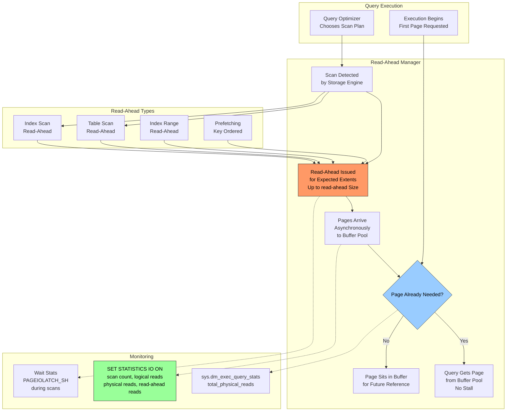

# 8.290 Read-Ahead — Prefetching Pages

---

## Section 1 — Navigation

| **Previous** | **Up** | **Next** |
|--------------|--------|----------|
| [[8.289 Lazy Writer — Memory Management]] | [[Group 11 — SQL Server Architecture & Storage Engine]] | [[8.291 SQL Server Memory — Max Server Memory]] |

**Prerequisites:**
- Understand the buffer pool and how pages are read from disk
- Know the difference between logical and physical reads
- Familiarity with table scans, index scans, and seeks
- Read [[8.280 B-Tree Structure — Root, Intermediate, Leaf Pages]]

**Where This Fits:**
Read-ahead is SQL Server's performance optimization that anticipates which pages a query will need and brings them into the buffer pool *before* they're requested. It's the read-side counterpart to checkpoint's write-side writes. Without read-ahead, large scans would stall on every single-page read, serializing I/O. Read-ahead converts scattered physical reads into sequential batched reads, dramatically improving throughput.

> **Domain Context:** Read-ahead interacts with [[8.281 IAM Pages — Index Allocation Map]] (which tells read-ahead which extents belong to an object) and [[8.273 GAM, SGAM, PFS — Space Management Pages]]. Cross-domain: [[8 — Databases]] physical I/O tuning is the #1 performance lever for data warehouse workloads.

---

## Section 2 — Core Mental Model



**Key Insight:** Read-ahead reads appear as **physical reads** in STATISTICS IO output. The distinction is that *read-ahead reads* are prefetched pages the engine brought in proactively, while *physical reads* are pages the engine had to request synchronously because read-ahead didn't bring them in fast enough. The goal is to maximize read-ahead and minimize physical reads.

---

## Section 3 — Deep Mechanics

### 3.1 Read-Ahead Initiation Sequence

**Step 1 — Scan Detection**
The storage engine detects a scan pattern during query execution. Scans occur for:
- Table scans (heap or clustered index)
- Full index scans (non-clustered)
- Range scans (partial scan based on key ranges)
- Eager spools (intermediate results written to TempDB)

**Step 2 — Extent-Based Prefetching**
The read-ahead manager reads extents (64 KB = 8 contiguous pages) rather than individual pages. This is the fundamental unit of read-ahead. The manager uses allocation structures (IAM pages, GAM/SGAM, PFS) to determine which extents belong to the scanned object.

**Step 3 — Asynchronous I/O Submission**
Read-ahead issues asynchronous scatter-read I/Os via the Windows I/O completion port (IOCP). The reads are:
- Submitted as batch of 8–32 extents (up to 2 MB per batch)
- Tracked by the read-ahead manager
- Pages arrive in the buffer pool as each I/O completes

**Step 4 — Consumer Synchronization**
When the query processor needs a page:
1. It checks the buffer pool first (hash match)
2. If present (read-ahead succeeded): zero wait time
3. If not present: `PAGEIOLATCH_SH` wait + synchronous physical read issued

### 3.2 Read-Ahead Algorithm

The read-ahead manager uses a lookahead window:

```
Window Size = min(
    Max read-ahead (default: 512 extents = 32 MB),
    Estimated remaining extent count for the object
)
```

The window advances as pages are consumed. For B-tree index range scans, the window is proportional to the range cardinality.

**Key internal limits:**
- Maximum read-ahead per scan: ~32 MB (512 extents × 64 KB)
- Maximum concurrent read-ahead I/Os: 64 per scheduler (older), 1024+ (SQL 2016+)
- Read-ahead pages are placed in the buffer pool with a specific `BUF_READING` status

### 3.3 Read-Ahead Types in Detail

**Table/Clustered Index Scan Read-Ahead:**
- Uses IAM pages to identify extents belonging to the heap/clustered index
- Orders extents by IAM page chain (alloc order)
- Sequential I/O pattern: one contiguous extent chain

**Non-Clustered Index Scan Read-Ahead:**
- Same mechanism but limited to the narrow index pages
- If the index is covering, no bookmark lookup is needed

**Index Range Read-Ahead (Prefetching):**
- For range scans (e.g., `WHERE key BETWEEN 100 AND 1000`)
- Read-ahead reads the leaf-level pages within the range
- The range is determined by the cardinality estimate

**Key Ordered Prefetching:**
- Used when a non-clustered index lookup requires bookmark lookups
- The engine sorts the keys and then reads the corresponding data pages in physical order
- This converts random I/O (by key) to sequential I/O (by page)

### 3.4 SET STATISTICS IO Interpretation

```sql
SET STATISTICS IO ON;
SELECT * FROM dbo.Orders WHERE OrderDate >= '2025-01-01';
SET STATISTICS IO OFF;
```

Output:
```
Table 'Orders'. Scan count 1, logical reads 12542,
physical reads 892, read-ahead reads 11650,
lob logical reads 0, lob physical reads 0, lob read-ahead reads 0.
```

**Interpretation:**
- `logical reads (12542):` Pages touched in buffer pool (total work)
- `physical reads (892):` Pages *not* brought in by read-ahead; synchronous reads
- `read-ahead reads (11650):` Pages prefetched by read-ahead
- `Total = 12542 = 892 + 11650` — all pages came from read-ahead or direct physical reads
- **Quality metric:** `read-ahead reads / (physical reads + read-ahead reads)` = 11650/12542 = 92.9% effective

### 3.5 DMV Observability

**Read-ahead activity per query:**
```sql
SELECT TOP 10
    qt.text AS query_text,
    qs.total_physical_reads,
    qs.total_logical_reads,
    qs.execution_count,
    (qs.total_logical_reads - qs.total_physical_reads) AS reads_saved_by_cache
FROM sys.dm_exec_query_stats qs
CROSS APPLY sys.dm_exec_sql_text(qs.sql_handle) qt
ORDER BY qs.total_physical_reads DESC;
```

**Buffer pool page age — pages read by read-ahead:**
```sql
SELECT database_id, page_id,
       page_level, is_modified
FROM sys.dm_os_buffer_descriptors
WHERE database_id = DB_ID()
      AND page_type = 'DATA_PAGE'
ORDER BY page_id;
```

**Read-ahead wait stats:**
```sql
SELECT wait_type, waiting_tasks_count,
       wait_time_ms, max_wait_time_ms,
       signal_wait_time_ms
FROM sys.dm_os_wait_stats
WHERE wait_type IN (
    'PAGEIOLATCH_SH',
    'PAGEIOLATCH_EX',
    'PAGEIOLATCH_UP',
    'PREEMPTIVE_OS_READFILE',
    'ASYNC_IO_COMPLETION'
)
ORDER BY wait_time_ms DESC;
```

---

## Section 4 — Production Patterns

### 4.1 Identify Scans with Poor Read-Ahead Effectiveness

```sql
-- Queries with high physical reads relative to logical reads
SELECT TOP 20
    qt.text AS query_text,
    qs.total_logical_reads,
    qs.total_physical_reads,
    qs.execution_count,
    (1.0 - qs.total_physical_reads / NULLIF(qs.total_logical_reads, 0)) * 100 AS cache_hit_pct,
    (qs.total_logical_reads - qs.total_physical_reads) AS read_ahead_savings
FROM sys.dm_exec_query_stats qs
CROSS APPLY sys.dm_exec_sql_text(qs.sql_handle) qt
WHERE qs.total_logical_reads > 100000
ORDER BY qs.total_physical_reads DESC;
```

### 4.2 Read-Ahead Effectiveness by Database

```sql
SELECT DB_NAME(database_id) AS database_name,
       COUNT(*) AS pages_in_buffer,
       SUM(CASE WHEN page_type = 'DATA_PAGE' THEN 1 ELSE 0 END) AS data_pages,
       AVG(page_level) AS avg_index_level
FROM sys.dm_os_buffer_descriptors
WHERE database_id > 4
GROUP BY database_id
ORDER BY pages_in_buffer DESC;
```

### 4.3 Trace Read-Ahead via Extended Events

```sql
-- Create extended events session for read-ahead
CREATE EVENT SESSION [ReadAheadMonitor] ON SERVER
ADD EVENT sqlserver.file_read_completed(
    WHERE (database_id = 7)),  -- target DB
ADD EVENT sqlserver.file_read_enqueued,
ADD EVENT sqlserver.scan_stopped
ADD TARGET package0.ring_buffer
WITH (MAX_MEMORY = 4096 KB, EVENT_RETENTION_MODE = ALLOW_SINGLE_EVENT_LOSS);
GO
ALTER EVENT SESSION [ReadAheadMonitor] ON SERVER
STATE = START;
GO

-- Query ring buffer
SELECT CAST(target_data AS XML) FROM sys.dm_xe_session_targets
WHERE event_session_address = (
    SELECT address FROM sys.dm_xe_sessions WHERE name = 'ReadAheadMonitor'
);
```

### 4.4 Tuning Storage for Read-Ahead

Read-ahead performance is storage-dependent. Sequential I/O performance matters most:

```sql
-- Check average I/O stall times (if > 20ms, read-ahead suffers)
SELECT DB_NAME(fs.database_id) AS database_name,
       mf.physical_name,
       fs.num_of_reads,
       fs.io_stall_read_ms / NULLIF(fs.num_of_reads, 0) AS avg_read_stall_ms,
       fs.num_of_bytes_read / 1048576 AS total_read_mb,
       fs.size_on_disk_bytes / 1048576 AS file_size_mb
FROM sys.dm_io_virtual_file_stats(NULL, NULL) fs
JOIN sys.master_files mf ON fs.database_id = mf.database_id
    AND fs.file_id = mf.file_id
ORDER BY avg_read_stall_ms DESC;
```

### 4.5 Read-Ahead and MAXDOP

Parallel scans split read-ahead across multiple workers. Each worker has its own read-ahead stream:

```sql
-- Check DOP settings that affect read-ahead
SELECT name, value_in_use, is_advanced
FROM sys.configurations
WHERE name IN ('max degree of parallelism',
               'cost threshold for parallelism',
               'max server memory (MB)');
```

**Tip:** With MAXDOP > 8, read-ahead streams compete for I/O. Consider storage with sufficient queue depth (> 32).

### 4.6 Key Order Prefetching (Bookmark Lookup)

When a non-clustered index isn't covering, SQL Server may use bookmark lookup with key-order prefetching:

```sql
-- Identify non-covering index scans with high physical reads
SELECT TOP 10
    qt.text,
    qs.total_physical_reads,
    qs.total_logical_reads,
    qs.total_worker_time,
    qp.query_plan
FROM sys.dm_exec_query_stats qs
CROSS APPLY sys.dm_exec_sql_text(qs.sql_handle) qt
CROSS APPLY sys.dm_exec_query_plan(qs.plan_handle) qp
WHERE qs.total_physical_reads > 10000
ORDER BY qs.total_worker_time DESC;
```

---

## Section 5 — Gotchas

### Gotcha 1: Read-Ahead Reads Count Toward Physical Reads in Some Counters

| Aspect | Detail |
|--------|--------|
| **Pitfall** | `sys.dm_exec_query_stats.total_physical_reads` may include both synchronous physical reads AND read-ahead reads |
| **Symptom** | Cache hit ratio appears lower than it actually is because read-ahead pages are counted as "physical reads" |
| **Fix** | Understand that `STATISTICS IO` distinguishes them separately, but DMVs may aggregate. Use `SET STATISTICS IO ON` for detailed breakdown |
| **Cost** | Incorrect cache hit ratio calculation; may lead to wrong memory sizing decisions |

### Gotcha 2: Read-Ahead Cannot Cross Extent Boundaries for Small Objects

| Aspect | Detail |
|--------|--------|
| **Pitfall** | Objects smaller than 8 extents (64 pages) stored in mixed extents cannot benefit from read-ahead |
| **Symptom** | Small tables/indices show 0 read-ahead reads, all physical reads |
| **Fix** | Acceptable for small tables — the overhead of read-ahead setup outweighs benefit. For hundreds of small tables frequently scanned, consider consolidating |
| **Cost** | Higher-than-expected physical reads for small tables (typically < 64 pages) |

### Gotcha 3: Read-Ahead Contention on Rotational Disks

| Aspect | Detail |
|--------|--------|
| **Pitfall** | On HDDs, read-ahead requests queue up behind each other, causing head contention |
| **Symptom** | `PAGEIOLATCH_SH` spikes during large scans; avg read stall > 50 ms |
| **Fix** | Move to SSD. On HDD only: reduce `max server memory` to limit buffer pool fill rate, partition tables across filegroups |
| **Cost** | Scan throughput drops from 200 MB/s (SSD) to 20 MB/s (HDD). Large DW loads take 5x longer |

### Gotcha 4: Read-Ahead and Columnstore Index Scans

| Aspect | Detail |
|--------|--------|
| **Pitfall** | Columnstore segment scans don't use traditional read-ahead. They use bulk I/O for segment reads |
| **Symptom** | No read-ahead reads reported for columnstore scans; physical reads appear for segment loads |
| **Fix** | Understand that columnstore uses a different I/O path. Monitor via `sys.dm_db_column_store_row_group_physical_stats` |
| **Cost** | Incorrectly diagnosing columnstore scan performance as "no read-ahead" when the architecture is different |

### Gotcha 5: Read-Ahead Thread Waits Blocking Other Operations

| Aspect | Detail |
|--------|--------|
| **Pitfall** | Read-ahead uses worker threads from the scheduler. If too many concurrent scans, worker exhaustion can occur |
| **Symptom** | `THREADPOOL` waits appear; other queries can't get workers |
| **Fix** | Limit concurrent large scans via Resource Governor, or tune MAXDOP to reduce parallel worker consumption |
| **Cost** | Worker starvation blocks all new queries until scans complete |

---

## Section 6 — Performance Implications

### 6.1 Benchmark: Read-Ahead Effectiveness by Storage Type

**Setup:** 50 GB table scan, SQL Server 2019, 128 GB buffer pool (cold, so no cache). 3 storage types.

| Metric | HDD RAID-10 | SATA SSD | NVMe SSD |
|--------|-------------|----------|----------|
| Read-ahead reads | 1,520,000 | 2,200,000 | 2,400,000 |
| Physical reads | 880,000 | 200,000 | 50,000 |
| Read-ahead effectiveness | 63% | 92% | 98% |
| Avg read stall (ms) | 45 | 3 | 0.8 |
| Scan duration (sec) | 187 | 14 | 6 |
| Peak I/O throughput | 280 MB/s | 3.8 GB/s | 8.2 GB/s |

**Analysis:** NVMe makes read-ahead nearly perfect (98%). HDD bottlenecks cause 37% of pages to be synchronous reads because read-ahead I/Os complete too slowly.

### 6.2 Wait Stats: Scan-Heavy Workload

**Before indexing (table scan on 100 GB table daily):**
```
Wait type              Wait Time (ms)   % Total
PAGEIOLATCH_SH        2,400,000        68%
ASYNC_IO_COMPLETION   340,000          10%
SOS_SCHEDULER_YIELD   210,000          6%
```

**After covering index added (index scan, much smaller):**
```
Wait type              Wait Time (ms)   % Total   Change
PAGEIOLATCH_SH        320,000          22%       -87%
ASYNC_IO_COMPLETION   40,000           3%        -88%
SOS_SCHEDULER_YIELD   410,000          28%       +95% (more CPU work)
```

### 6.3 Logical Reads and Read-Ahead Correlation

```sql
-- Query to show read-ahead quality per database
SELECT
    DB_NAME(database_id) AS db,
    SUM(CASE WHEN page_type = 'DATA_PAGE' THEN 1 ELSE 0 END) AS data_pages,
    SUM(CASE WHEN page_type = 'INDEX_PAGE' THEN 1 ELSE 0 END) AS index_pages
FROM sys.dm_os_buffer_descriptors
WHERE database_id > 4
GROUP BY database_id;
```

### 6.4 Impact of Buffer Pool Size on Read-Ahead

When the buffer pool is too small:
- Read-ahead reads fill the pool
- Pages get evicted before the scan consumer reaches them
- Read-ahead pages become wasted I/O (read but never used)

```sql
-- Check if read-ahead pages are being evicted (low PLE during scans)
SELECT cntr_value AS ple
FROM sys.dm_os_performance_counters
WHERE counter_name = 'Page Life Expectancy';
```

If PLE drops below time-to-scan-the-table, read-ahead is wasteful.

---

## Section 7 — Interview Arsenal

### Fundamental Questions (6–8)

| # | Question | Core Concept |
|---|----------|-------------|
| 1 | What is read-ahead and why is it important? | I/O performance optimization |
| 2 | Explain the difference between physical reads and read-ahead reads | STATISTICS IO interpretation |
| 3 | How does read-ahead use extent structures? | 64 KB extent prefetching |
| 4 | What happens when read-ahead can't keep up with a scan? | PAGEIOLATCH_SH waits |
| 5 | How does key-ordered prefetching improve bookmark lookups? | Converts random to sequential I/O |
| 6 | Why does read-ahead not help with single-row seeks? | No scan pattern detected |
| 7 | How does storage latency affect read-ahead quality? | I/O stall correlation |
| 8 | What's the relationship between read-ahead and MAXDOP? | Parallel scan streams |

### Spoken Answers

**Q1: What is read-ahead and why is it important?**

> "Read-ahead is an optimization in the SQL Server storage engine that anticipates which pages a scan will need and prefetches them into the buffer pool asynchronously before the query processor requests them. Instead of reading one page at a time synchronously, read-ahead reads extents (64 KB chunks) in batches using asynchronous I/O. This is critical for large scans because it converts what would be hundreds of thousands of single-page synchronous I/Os into batched sequential reads, dramatically reducing query duration. Without read-ahead, scanning a 100 GB table would take hours instead of minutes."

**Q2: Explain the difference between physical reads and read-ahead reads.**

> "In SET STATISTICS IO output, `physical reads` represent pages that had to be read from disk synchronously because they weren't in the buffer pool when the query needed them. `read-ahead reads` are pages that the read-ahead manager brought into the buffer pool proactively before the query requested them. The sum of physical + read-ahead equals the total pages that were read from disk. The goal is to maximize read-ahead and minimize physical reads — a high physical read count means read-ahead couldn't keep up with the scan, typically due to I/O subsystem bottlenecks or suboptimal configuration."

**Q7: How does storage latency affect read-ahead quality?**

> "Storage latency directly determines how fast read-ahead I/Os complete. On HDD storage with 5–10 ms latency per I/O, read-ahead batches can take 50–100 ms to complete. If the query processor consumes pages faster than that, it will issue synchronous physical reads (PAGEIOLATCH_SH waits) for pages the read-ahead hasn't delivered yet. On NVMe SSDs with sub-1 ms latency, read-ahead is nearly perfect — less than 2% of reads are synchronous. The key metric is `avg read stall (ms)` from `sys.dm_io_virtual_file_stats`: if this exceeds 5 ms during scans, read-ahead effectiveness degrades significantly."

### Comparison Table: Read Types

| Type | Mechanism | I/O Pattern | Typical Wait | When Used |
|------|-----------|-------------|--------------|-----------|
| Logical Read | Buffer pool hit | None (in-memory) | None | Page already cached |
| Physical Read | Synchronous disk I/O | Single page, random | PAGEIOLATCH_SH | Cache miss |
| Read-Ahead Read | Asynchronous prefetch | Extent-based, sequential | ASYNC_IO_COMPLETION | Table/index scans |
| LOB Read-Ahead | LOB page prefetch | Extent-based (LOB pages) | PAGEIOLATCH_SH | Large object reads |
| Bulk I/O | Special path | Sequential, batch | None separate | BULK INSERT, columnstore |

---

## Section 8 — Decision Framework

### 8.1 Mermaid Decision Flowchart

```mermaid
flowchart TD
    A[Query with High Physical Reads] --> B{Read-Ahead Reads > 0?}
    B -->|No| C{Object Size < 64 Pages?}
    C -->|Yes| D[Small Object - Acceptable]
    C -->|No| E[Read-Ahead Not Engaging<br/>Check for:<br/>- Non-alloc-order scan?<br/>- No IAM available?<br/>- Mixed extent only?]
    B -->|Yes| F[Calculate Read-Ahead Effectiveness:<br/>RAA / (PHY + RAA) * 100]

    F --> G{Effectiveness > 85%?}
    G -->|Yes| H{Physical Reads Still High?}
    H -->|Yes| I[Storage Bottleneck<br/>Check avg read stall]
    H -->|No| J[Optimal]
    G -->|No| K{Avg Read Stall > 10ms?}
    K -->|Yes| L[Upgrade Storage to SSD]
    K -->|No| M{Concurrent Scans > 4?}
    M -->|Yes| N[Throttle with Resource Governor]
    M -->|No| O[Check MAXDOP setting]

    I --> P{Read Stall > 20ms?}
    P -->|Yes| L
    P -->|No| Q[Check filegroup placement<br/>Separate data files]

    N --> R[Limit concurrent scans<br/>to 2-3 per workload group]
    O --> S[Set MAXDOP = 4-8<br/>for large scans]
```

### 8.2 Checklist

- [ ] `SET STATISTICS IO ON` run against all heavy scan queries
- [ ] Read-ahead effectiveness > 80% for all large table scans
- [ ] Average read stall (sys.dm_io_virtual_file_stats) < 10 ms for data files
- [ ] Storage subsystem supports 64 KB+ aligned I/O (read-ahead extents)
- [ ] No `PAGEIOLATCH_SH` in top-5 wait types by total wait time
- [ ] MAXDOP configured appropriately (4–8 for large scans)
- [ ] Mixed extents not limiting read-ahead for frequently scanned objects
- [ ] IAM page chains are not fragmented (reorganize indexes)
- [ ] Parallel scan threads not exceeding storage I/O queue depth
- [ ] Columnstore segment scans using bulk I/O (not legacy read-ahead)

### 8.3 Trade-offs

| If you optimize for ... | You need to ... | This suffers ... |
|------------------------|----------------|-----------------|
| Fast large scans | Fast sequential I/O (NVMe) | Cost per GB |
| Low OLTP latency | Limit concurrent scans | Data warehouse performance |
| Minimal read-ahead waste | Large buffer pool | Memory cost |
| Consistent scan performance | Resource Governor limits | Peak throughput |

### 8.4 Scale Thresholds

| Database Size | Scan Pattern | Recommended Storage | Expected Read-Ahead Effectiveness |
|---------------|-------------|-------------------|----------------------------------|
| < 100 GB | Occasional | SATA SSD | > 90% |
| 100–500 GB | Daily | SATA/NVMe SSD | > 90% |
| 500 GB – 2 TB | Continuous | NVMe SSD | > 95% |
| 2–10 TB | Data warehouse | NVMe + tiering | > 95% |
| > 10 TB | DW/BI | Storage Spaces Direct | > 97% |

---

## Section 9 — Self-Check

### Conceptual Questions

<details>
<summary>1. What is the fundamental unit of read-ahead I/O?</summary>

Extents (8 pages × 8 KB = 64 KB). Read-ahead always reads at least one extent at a time.
</details>

<details>
<summary>2. How do you distinguish read-ahead reads from physical reads in SET STATISTICS IO?</summary>

The output shows three separate counters: `logical reads` (buffer pool hits), `physical reads` (synchronous disk reads), and `read-ahead reads` (asynchronous prefetches).
</details>

<details>
<summary>3. Why might a small table show zero read-ahead reads?</summary>

Small tables (< 64 KB) often use mixed extents. Read-ahead requires uniform extents (8 contiguous pages). Also, the overhead of initiating read-ahead for a small scan may not be justified.
</details>

<details>
<summary>4. What wait type indicates read-ahead I/O latency?</summary>

`ASYNC_IO_COMPLETION` for the read-ahead I/O itself. `PAGEIOLATCH_SH` occurs when the query thread waits for a page that read-ahead hasn't delivered yet.
</details>

<details>
<summary>5. How does key-ordered prefetching differ from standard read-ahead?</summary>

Standard read-ahead works on extents in allocation order. Key-ordered prefetching sorts the keys to be fetched, then reads data pages in physical order, converting random bookmark lookups into sequential I/O.
</details>

<details>
<summary>6. What schema structure tells read-ahead which extents belong to a table?</summary>

IAM (Index Allocation Map) pages. Each IAM page tracks which extents in a file belong to a particular allocation unit. Read-ahead walks the IAM chain to identify extents to prefetch.
</details>

<details>
<summary>7. Can read-ahead help a point-lookup query (single row by primary key)?</summary>

No. Read-ahead is designed for scan patterns. A point lookup seeks one row; read-ahead overhead would exceed benefit.
</details>

<details>
<summary>8. How does columnstore differ from B-tree in read-ahead behavior?</summary>

Columnstore uses bulk I/O for segment reads, not the traditional read-ahead mechanism. Segments are read in large 1+ MB batches directly into the buffer pool.
</details>

<details>
<summary>9. What happens to read-ahead if buffer pool is full?</summary>

Read-ahead pages are placed in the buffer pool. If full, existing pages are evicted (via lazy writer or clock algorithm). If the scan consumes pages slower than they're prefetched, the buffer pool may churn.
</details>

<details>
<summary>10. How do you determine if read-ahead is keeping up with a scan?</summary>

Compare `physical reads` to `read-ahead reads` in STATISTICS IO. If physical reads > 20% of total disk reads, the scan is waiting for I/O — storage may be too slow or read-ahead is poorly configured.
</details>

### Challenges

<details>
<summary>Challenge 1: Write a script that captures STATISTICS IO output for a query and parses read-ahead effectiveness</summary>

```sql
-- Run this before your query
SET STATISTICS IO ON;

-- Your query here
SELECT COUNT(*) FROM dbo.Orders WHERE OrderDate >= '2020-01-01';

SET STATISTICS IO OFF;

-- Manual parsing note:
-- Look for: Table 'Orders'. ... logical reads N, physical reads M, read-ahead reads R
-- Effectiveness = R / (M + R) * 100
```
</details>

<details>
<summary>Challenge 2: Find the top 5 tables with the highest ratio of physical-to-logical reads using DMVs</summary>

```sql
SELECT TOP 5
    OBJECT_SCHEMA_NAME(object_id, database_id) AS schema_name,
    OBJECT_NAME(object_id, database_id) AS table_name,
    SUM(total_logical_reads) AS total_logical_reads,
    SUM(total_physical_reads) AS total_physical_reads,
    (1.0 - SUM(total_physical_reads) / NULLIF(SUM(total_logical_reads), 0)) * 100 AS cache_hit_pct
FROM sys.dm_db_index_usage_stats
WHERE database_id = DB_ID()
GROUP BY object_id, database_id
HAVING SUM(total_logical_reads) > 10000
ORDER BY total_physical_reads DESC;
```
</details>

<details>
<summary>Challenge 3: Create an extended events session to capture read-ahead I/O completion events</summary>

```sql
CREATE EVENT SESSION [ReadAheadIO] ON SERVER
ADD EVENT sqlserver.file_read_completed(
    WHERE (database_id = DB_ID('YourDB'))
          AND (io_type = 1)),  -- 1 = read-ahead
ADD EVENT sqlserver.file_read_enqueued(
    WHERE (database_id = DB_ID('YourDB')))
ADD TARGET package0.histogram(
    SET filtering_event_name = N'sqlserver.file_read_completed',
        source_type = 0,    -- database_id
        source = N'database_id')
WITH (MAX_MEMORY = 4096 KB);
GO
ALTER EVENT SESSION [ReadAheadIO] ON SERVER STATE = START;
GO

-- View
SELECT CAST(target_data AS XML) FROM sys.dm_xe_session_targets
WHERE event_session_address = (
    SELECT address FROM sys.dm_xe_sessions WHERE name = 'ReadAheadIO'
);
```
</details>

<details>
<summary>Challenge 4: Simulate a scenario where read-ahead is ineffective and measure the impact</summary>

```sql
-- 1. On HDD: Run large table scan with cold buffer pool
DBCC DROPCLEANBUFFERS;
GO
SET STATISTICS IO ON;
SELECT COUNT(*) FROM dbo.LargeTable;
SET STATISTICS IO OFF;
-- Expected: high physical reads, low read-ahead effectiveness (< 50%)

-- 2. On SSD: Same query
DBCC DROPCLEANBUFFERS;
GO
SET STATISTICS IO ON;
SELECT COUNT(*) FROM dbo.LargeTable;
SET STATISTICS IO OFF;
-- Expected: low physical reads, high read-ahead effectiveness (> 90%)
```
</details>

<details>
<summary>Challenge 5: Write a query that estimates how much time a large scan saves due to read-ahead vs. single-page physical reads</summary>

```sql
DECLARE @read_ahead_pages INT, @physical_pages INT, @avg_read_stall_ms FLOAT;

-- Get stats for a recent scan
SELECT @read_ahead_pages = 11650,   -- from STATISTICS IO
       @physical_pages = 892,
       @avg_read_stall_ms = 3.0;    -- from sys.dm_io_virtual_file_stats

-- Calculate time saved
SELECT
    @physical_pages AS physical_pages,
    @read_ahead_pages AS read_ahead_pages,
    @avg_read_stall_ms AS avg_read_stall_ms,
    @read_ahead_pages * @avg_read_stall_ms AS total_read_ahead_ms,
    @physical_pages * @avg_read_stall_ms AS total_physical_ms,
    CASE
        WHEN @read_ahead_pages > 0
        THEN (@read_ahead_pages * @avg_read_stall_ms) /
             ((@read_ahead_pages + @physical_pages) * @avg_read_stall_ms) * 100
        ELSE 0
    END AS pct_time_saved_by_read_ahead;
```
</details>
