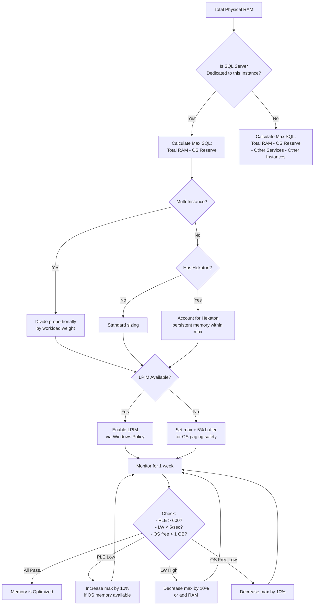

# 8.291 SQL Server Memory — Max Server Memory

---

## Section 1 — Navigation

| **Previous** | **Up** | **Next** |
|--------------|--------|----------|
| [[8.290 Read-Ahead — Prefetching Pages]] | [[Group 11 — SQL Server Architecture & Storage Engine]] | [[8.292 NUMA Architecture — Memory and CPU Affinity]] |

**Prerequisites:**
- Understand the buffer pool and how SQL Server uses memory
- Know the lazy writer and checkpoint roles
- Familiarity with Windows memory management
- Read [[8.268 Memory Architecture — Buffer Pool and Plan Cache]] first

**Where This Fits:**
Max server memory is THE most critical SQL Server configuration setting. It determines the upper bound of memory SQL Server will consume, including the buffer pool, plan cache, memory-optimized tables (Hekaton), columnstore segment cache, and all memory clerks. Setting it incorrectly causes performance degradation (too low → constant lazy writer activity, too high → OS paging). This topic connects every memory-related concept in the engine.

> **Domain Context:** Directly affects [[8.289 Lazy Writer — Memory Management]] (when max is exceeded), [[8.268 Memory Architecture — Buffer Pool and Plan Cache]] (primary consumer), and [[8.292 NUMA Architecture — Memory and CPU Affinity]] (NUMA memory distribution). Cross-domain: [[8 — Databases]] capacity planning.

---

## Section 2 — Core Mental Model

```mermaid
graph TB
    subgraph "SQL Server Memory Architecture"
        M1[Total Virtual Address Space<br/>8 TB (x64)]
        M2[SQLOS Memory Manager]
        M3[Buffer Pool<br/>Largest Consumer]
        M4[Plan Cache]
        M5[Columnstore<br/>Segment Cache]
        M6[Memoíy-Optimized<br/>Tables (Hekaton)]
        M7[Connection<br/>Memory]
        M8[Lock Memory]
        M9[CLR / Extended<br/>Procedures]
    end

    M1 --> M2
    M2 --> M3
    M2 --> M4
    M2 --> M5
    M2 --> M6
    M2 --> M7
    M2 --> M8
    M2 --> M9

    subgraph "Configuration"
        C1[sp_configure<br/>'max server memory (MB)']
        C2[sp_configure<br/>'min server memory (MB)']
    end

    subgraph "Memory Brokers"
        B1[Buffer Pool<br/>Broker]
        B2[Plan Cache<br/>Broker]
        B3[Columnstore<br/>Object Pool Broker]
        B4[Memory-Optimized<br/>Broker]
    end

    C1 --> B1
    C1 --> B2
    C1 --> B3
    C1 --> B4

    subgraph "Pressure Detection"
        P1[OS Low-Memory<br/>Notification]
        P2[SQLOS Memory<br/>Pressure Notification]
        P3[Lazy Writer<br/>Activity]
    end

    B1 --> P3
    P1 --> B1
    P2 --> B1

    subgraph "DMVs"
        C1 -.-> D1[sys.dm_os_process_memory]
        M2 -.-> D2[sys.dm_os_sys_info]
        M3 -.-> D3[sys.dm_os_buffer_descriptors]
        P3 -.-> D4[sys.dm_os_performance_counters]
    end

    style C1 fill:#f96,stroke:#333,color:#000
    style M2 fill:#9cf,stroke:#333,color:#000
    style B1 fill:#9f9,stroke:#333,color:#000
```

**Key Insight:** SQL Server is a dynamic memory consumer. It will grow its memory usage up to `max server memory` and will not exceed that bound (except for certain thread stacks and heap allocations that live outside the memory manager). Setting this value correctly is the single most important performance tuning knob.

---

## Section 3 — Deep Mechanics

### 3.1 Memory Allocation Lifecycle

**Step 1 — SQL Server Starts**
On startup, SQL Server allocates a small base memory set. The memory manager initializes:
- 8 MB per scheduler for the buffer pool (very small initial)
- Plan cache starts empty
- Memory brokers start

**Step 2 — Memory Growth**
As queries execute:
- Buffer pool grows via page allocations (each 8 KB page)
- Plan cache compiles plans
- Hekaton memory grows (if in-memory OLTP is used)
- Lock memory grows with concurrent transactions

Each allocation checks against the current memory consumption vs. `max server memory`.

**Step 3 — Internal Memory Pressure Detection**
The SQLOS memory manager monitors:
- Total allocation across all memory clerks
- `sys.dm_os_process_memory.physical_memory_in_use_kb`
- Lazy writer/sec counter
- OS memory notifications

**Step 4 — Pressure Response**
When memory consumption approaches `max server memory`:
1. Buffer pool broker shrinks the pool via clock algorithm
2. Plan cache broker ages out plans
3. Columnstore segment cache releases segments
4. Hekaton broker initiates garbage collection
5. Lazy writer increases eviction frequency

**Step 5 — External Pressure Response**
If OS sends low-memory notification:
1. SQLOS reduces target memory by 15-25%
2. All brokers resize downward
3. Lazy writer becomes aggressive
4. Memory grants are reduced

### 3.2 Min Server Memory

Min server memory is NOT an allocation floor — it's a *commitment* floor. SQL Server doesn't grab this memory on startup. Instead, if it has allocated memory that falls below this value, it will NOT release it to the OS. It's more of a "don't shrink below this" guard.

```sql
EXEC sp_configure 'min server memory (MB)', 4096;
RECONFIGURE;
```

**Usage pattern:** Set min server memory to ensure SQL Server doesn't release memory that another process might grab, preventing the "sawtooth" pattern where SQL gives memory to OS and later has to reclaim it.

### 3.3 Max Server Memory Calculation

The standard formula for a dedicated SQL Server:

```sql
-- For a dedicated SQL Server instance
DECLARE @total_ram_gb INT = 128;
DECLARE @os_overhead_gb INT = 4;
DECLARE @max_sql_gb INT;

-- OS reserve formula
IF @total_ram_gb <= 16
    SET @os_overhead_gb = 2;
ELSE IF @total_ram_gb <= 64
    SET @os_overhead_gb = 4;
ELSE IF @total_ram_gb <= 128
    SET @os_overhead_gb = 6;
ELSE
    SET @os_overhead_gb = 8;

SET @max_sql_gb = @total_ram_gb - @os_overhead_gb;

SELECT @max_sql_gb AS recommended_max_sql_gb,
       @os_overhead_gb AS os_reserve_gb,
       @total_ram_gb AS total_ram_gb;
```

**Microsoft recommendation:**
- Reserve 1–2 GB for the OS (minimum)
- Reserve 1 GB per 16 GB of RAM over 16 GB
- Reserve additional memory for other applications

**Quick table:**
| Total RAM | OS Reserve | Max SQL | Notes |
|-----------|-----------|---------|-------|
| 16 GB | 2 GB | 14 GB | Small server |
| 32 GB | 4 GB | 28 GB | Typical |
| 64 GB | 4 GB | 60 GB | Common mid-range |
| 128 GB | 6 GB | 122 GB | Large server |
| 256 GB | 8 GB | 248 GB | High-end |
| 512 GB | 12 GB | 500 GB | Very large |
| 1 TB | 20 GB | 1004 GB | Extreme |

### 3.4 Memory Beyond Max Server Memory

Not all SQL Server memory is governed by `max server memory`:

```sql
SELECT type, name, pages_kb / 1024 AS pages_mb,
       virtual_memory_committed_kb / 1024 AS virtual_mb,
       awe_allocated_kb / 1024 AS awe_mb
FROM sys.dm_os_memory_clerks
ORDER BY pages_kb DESC;
```

**Memory that may exceed max server memory:**
- **Thread stacks:** 1–4 MB per worker thread (up to max worker threads)
- **CLR allocations:** Managed code allocations outside SQLOS
- **COM objects:** Some OLE automation
- **Linked Server providers:** External provider allocations
- **Extended Stored Procedure DLLs:** Unmanaged allocations
- **Non-uniform memory access (NUMA) structures:** Node-level allocations

Typically, this "unaccounted" memory is 5–15% of max server memory.

### 3.5 DMV Observability

**Current memory in use:**
```sql
SELECT physical_memory_in_use_kb / 1024 AS physical_memory_in_use_mb,
       locked_page_allocations_kb / 1024 AS locked_page_allocations_mb,
       page_fault_count,
       memory_utilization_percentage,
       available_commit_limit_kb / 1024 AS available_commit_limit_mb,
       process_physical_memory_low,
       process_virtual_memory_low
FROM sys.dm_os_process_memory;
```

**Memory breakdown by clerk:**
```sql
SELECT type, name, pages_kb / 1024 AS pages_mb,
       single_pages_kb / 1024 AS single_pages_mb,
       multi_pages_kb / 1024 AS multi_pages_mb,
       virtual_memory_committed_kb / 1024 AS virtual_mb
FROM sys.dm_os_memory_clerks
ORDER BY pages_kb DESC;
```

**Memory grants:**
```sql
SELECT session_id, request_id, grant_time,
       granted_memory_kb, requested_memory_kb,
       ideal_memory_kb, required_memory_kb,
       query_cost, timeout_sec,
       resource_semaphore_id,
       is_small
FROM sys.dm_exec_query_memory_grants
ORDER BY granted_memory_kb DESC;
```

---

## Section 4 — Production Patterns

### 4.1 Current Config and Usage

```sql
-- One query to rule them all: config, usage, and reserve
SELECT
    (SELECT value_in_use FROM sys.configurations
     WHERE name = 'max server memory (MB)') AS max_server_memory_mb,
    (SELECT value_in_use FROM sys.configurations
     WHERE name = 'min server memory (MB)') AS min_server_memory_mb,
    (SELECT physical_memory_in_use_kb / 1024
     FROM sys.dm_os_process_memory) AS physical_memory_in_use_mb,
    (SELECT locked_page_allocations_kb / 1024
     FROM sys.dm_os_process_memory) AS locked_allocations_mb,
    (SELECT physical_memory_kb / 1024
     FROM sys.dm_os_sys_info) AS total_os_memory_mb,
    (SELECT available_physical_memory_kb / 1024
     FROM sys.dm_os_sys_info) AS available_os_memory_mb;
```

### 4.2 Detect Memory Pressure

```sql
-- Comprehensive memory pressure detection
SELECT
    'Process memory low' AS check_name,
    process_physical_memory_low AS status
FROM sys.dm_os_process_memory
UNION ALL
SELECT
    'Virtual address space low',
    process_virtual_memory_low
FROM sys.dm_os_process_memory
UNION ALL
SELECT
    'PLE < 300',
    CASE WHEN (SELECT cntr_value FROM sys.dm_os_performance_counters
               WHERE counter_name = 'Page Life Expectancy') < 300
         THEN 1 ELSE 0 END
UNION ALL
SELECT
    'Available OS memory < 2 GB',
    CASE WHEN (SELECT available_physical_memory_kb / 1024
               FROM sys.dm_os_sys_info) < 2048
         THEN 1 ELSE 0 END;
```

### 4.3 Change Max Server Memory Online

```sql
-- Set max server memory (online, no restart)
EXEC sp_configure 'max server memory (MB)', 122880;  -- 120 GB
RECONFIGURE;
GO

-- Verify the change
SELECT value, value_in_use
FROM sys.configurations
WHERE name = 'max server memory (MB)';
```

**Note:** `value` shows configured value; `value_in_use` shows running value. RECONFIGURE applies immediately.

### 4.4 Enable Lock Pages in Memory (LPIM)

LPIM ensures SQL Server's memory is not paged out by the OS:

```sql
-- 1. Grant "Lock Pages in Memory" to SQL Server service account via
--    Windows Group Policy (secpol.msc → Local Policies → User Rights Assignment)

-- 2. Verify LPIM is enabled
SELECT locked_page_allocations_kb / 1024 AS locked_mb
FROM sys.dm_os_process_memory;
```

**When to use:** Single-instance dedicated SQL Server with >= 64 GB RAM. Do NOT use with multiple instances.

### 4.5 Track Memory Trend Over Time

```sql
-- Create baseline table
CREATE TABLE dbo.MemoryBaseline (
    collection_time DATETIME2 NOT NULL DEFAULT SYSDATETIME(),
    max_server_memory_mb INT,
    physical_memory_in_use_mb BIGINT,
    buffer_pool_mb BIGINT,
    plan_cache_mb BIGINT,
    available_os_memory_mb BIGINT,
    ple_seconds BIGINT,
    lazy_writes BIGINT
);

-- Populate (run every 15 minutes via SQL Agent)
INSERT INTO dbo.MemoryBaseline (
    max_server_memory_mb, physical_memory_in_use_mb,
    buffer_pool_mb, plan_cache_mb, available_os_memory_mb,
    ple_seconds, lazy_writes
)
SELECT
    (SELECT value_in_use FROM sys.configurations
     WHERE name = 'max server memory (MB)'),
    (SELECT physical_memory_in_use_kb / 1024
     FROM sys.dm_os_process_memory),
    (SELECT cntr_value * 8 / 1024 FROM sys.dm_os_performance_counters
     WHERE counter_name = 'Database pages'),
    (SELECT SUM(pages_kb) / 1024 FROM sys.dm_os_memory_clerks
     WHERE type = 'CACHESTORE_OBJCP' OR type = 'CACHESTORE_SQLCP'),
    (SELECT available_physical_memory_kb / 1024
     FROM sys.dm_os_sys_info),
    (SELECT cntr_value FROM sys.dm_os_performance_counters
     WHERE counter_name = 'Page Life Expectancy'),
    (SELECT cntr_value FROM sys.dm_os_performance_counters
     WHERE counter_name = 'Lazy Writes/sec');
```

### 4.6 Reserved Memory for SQL Server Agent and Other Services

```sql
-- Account for SQL Agent, SSIS, SSRS, etc.
-- Rule: Reserve 500 MB per additional service beyond Database Engine
SELECT
    'SQL Server' AS service_name,
    (SELECT value_in_use FROM sys.configurations
     WHERE name = 'max server memory (MB)') AS memory_mb
UNION ALL
SELECT 'SQL Agent', 200
UNION ALL
SELECT 'SSIS', 250
UNION ALL
SELECT 'SSRS', 500;
```

---

## Section 5 — Gotchas

### Gotcha 1: Max Server Memory Is NOT a Hard Limit for All Allocations

| Aspect | Detail |
|--------|--------|
| **Pitfall** | Believing SQL Server will never exceed max server memory |
| **Symptom** | SQL Server's `Process\Private Bytes` counter exceeds max server memory by 5–15% |
| **Fix** | The extra comes from non-buffer-pool allocations (thread stacks, CLR, extended procedures). Monitor `sys.dm_os_process_memory.physical_memory_in_use_kb` vs. the configured max |
| **Cost** | If max server memory is set too close to total RAM, the unaccounted overhead causes OS paging |

### Gotcha 2: Raising Max Server Memory Doesn't Immediately Allocate Pages

| Aspect | Detail |
|--------|--------|
| **Pitfall** | After increasing max server memory, expecting the buffer pool to immediately consume more |
| **Symptom** | Database pages counter stays flat for hours after increasing max server memory |
| **Fix** | SQL Server only grows memory as needed. To force growth, run a large scan: `SELECT COUNT(*) FROM LargeTable` |
| **Cost** | False assumption that more RAM is available; workload must demand it |

### Gotcha 3: Min Server Memory Can Cause Memory Wastage on Multi-Instance

| Aspect | Detail |
|--------|--------|
| **Pitfall** | Setting min server memory too high on one instance prevents other instances from getting needed memory |
| **Symptom** | One SQL instance has idle memory while another instance is starved |
| **Fix** | Keep min server memory low (0 or 512 MB) on multi-instance servers. Use min memory only for reserved scenarios |
| **Cost** | Total system memory utilization is suboptimal; workload on other instance degrades |

### Gotcha 4: Max Server Memory Affects Resource Governor Behavior

| Aspect | Detail |
|--------|--------|
| **Pitfall** | Resource Governor's MIN_MEMORY_PERCENT is relative to max server memory, not total RAM |
| **Symptom** | A pool with 10% MIN_MEMORY on a 200 GB max gets 20 GB guaranteed, but if max is 50 GB, it gets only 5 GB |
| **Fix** | Recalculate Resource Governor pool sizes after changing max server memory |
| **Cost** | Resource Governor guarantees become meaningless; workloads may fail to get requested memory grants |

### Gotcha 5: Memory-Optimized Tables (Hekaton) Have Separate Bounds

| Aspect | Detail |
|--------|--------|
| **Pitfall** | Memory-optimized tables consume memory that counts toward max server memory, but they cannot be paged out |
| **Symptom** | Out-of-memory errors on memory-optimized tables even when buffer pool is below max server memory |
| **Fix** | When using Hekaton, account for database memory as a subset of max server memory. Use `sp_configure 'max server memory (MB)'` including Hekaton data |
| **Cost** | Server running out of memory for Hekaton; `CREATE TABLE` or data insertion fails |

---

## Section 6 — Performance Implications

### 6.1 Benchmark: Impact of Incorrect Max Server Memory

**Setup:** 64 GB server, typical OLTP workload, 200 concurrent users.

| Scenario | Max SQL | Physical Memory In Use | PLE | Lazy Writes/sec | Avg Query Duration |
|----------|---------|----------------------|-----|-----------------|-------------------|
| Too low | 16 GB | 15.2 GB | 120 | 45/sec | 340 ms |
| Optimal | 56 GB | 54.1 GB | 4500 | 0.8/sec | 18 ms |
| Too high | 62 GB | 61.5 GB (OS has 0.5 GB) | 6000 | 0.2/sec | 12 ms (OS paging!) |

**Analysis:** The "too high" scenario shows fast queries until the OS starts paging due to insufficient free memory. At that point, OS paging degrades ALL processes including SQL Server itself.

### 6.2 Wait Stats Before/After

**Before tuning (max = 16 GB on 64 GB server):**
```
Wait type              Wait Time (ms)   % Total
PAGEIOLATCH_SH        3,200,000        52%
WRITELOG              1,800,000        29%
RESOURCE_SEMAPHORE    450,000          7%
SOS_SCHEDULER_YIELD   310,000          5%
```

**After tuning (max = 56 GB):**
```
Wait type              Wait Time (ms)   % Total   Change
PAGEIOLATCH_SH        340,000          14%       -89%
WRITELOG              1,200,000        51%       -33%
RESOURCE_SEMAPHORE    12,000           0.5%      -97%
SOS_SCHEDULER_YIELD   520,000          22%       +68% (more CPU work in buffer)
```

### 6.3 Logical Reads with Proper Memory

With sufficient memory, a 10 GB table stays cached. Without it:

```sql
-- Compare logical reads for the same query
-- Cache hit ratio = logical reads / (logical reads + physical reads)

-- Before (16 GB max):    logical = 120,000, physical = 95,000, ratio = 55.8%
-- After (56 GB max):     logical = 215,000, physical = 2,100, ratio = 99.0%
```

### 6.4 Memory and Performance Counters

Set up a baseline dashboard:

```sql
SELECT
    (SELECT cntr_value FROM sys.dm_os_performance_counters
     WHERE counter_name = 'Page Life Expectancy') AS ple,
    (SELECT cntr_value FROM sys.dm_os_performance_counters
     WHERE counter_name = 'Lazy Writes/sec') AS lazy_writes,
    (SELECT cntr_value FROM sys.dm_os_performance_counters
     WHERE counter_name = 'Free pages') AS free_pages,
    (SELECT cntr_value FROM sys.dm_os_performance_counters
     WHERE counter_name = 'Buffer cache hit ratio') AS cache_hit_ratio;
```

---

## Section 7 — Interview Arsenal

### Fundamental Questions (6–8)

| # | Question | Core Concept |
|---|----------|-------------|
| 1 | What is max server memory and what does it control? | Memory hard limit |
| 2 | How do you calculate the correct max server memory value? | Sizing formula |
| 3 | What is the difference between max and min server memory? | Ceiling vs. floor |
| 4 | What happens when SQL Server hits max server memory? | Memory pressure response |
| 5 | Does max server memory cover Hekaton (in-memory OLTP)? | Yes, it's included |
| 6 | What DMV shows if SQL Server is under memory pressure? | sys.dm_os_process_memory |
| 7 | How does Lock Pages in Memory interact with max server memory? | LPIM protection |
| 8 | What SQL Server components can exceed max server memory? | Thread stacks, CLR, etc. |

### Spoken Answers

**Q1: What is max server memory and what does it control?**

> "Max server memory is the primary configuration setting that controls how much virtual address space SQL Server will commit to its memory manager. It controls the buffer pool, plan cache, columnstore segment cache, Hekaton memory-optimized tables, connection memory, lock memory, and all memory clerks governed by the SQLOS memory manager. It is set via `sp_configure 'max server memory (MB)'` and takes effect immediately after RECONFIGURE. Some allocations exist outside this boundary — specifically thread stacks, CLR allocations, and certain COM objects — which typically add 5–15% overhead."

**Q2: How do you calculate the correct max server memory value?**

> "The golden rule is: max server memory = total physical RAM - memory for the OS - memory for other applications. For a dedicated SQL Server with 128 GB, I'd reserve 4 GB minimum for the OS plus 1 GB for every additional 16 GB of RAM over 16 GB. So for 128 GB, OS reserve would be about 6 GB, giving a max of 122 GB. I also check `sys.dm_os_process_memory` to ensure `available_commit_limit_kb` stays positive. After setting, I monitor PLE (target > 600), lazy writes/sec (target < 5), and OS available memory (> 1 GB baseline)."

**Q7: How does Lock Pages in Memory interact with max server memory?**

> "Lock Pages in Memory (LPIM) is a Windows privilege that prevents SQL Server's committed memory from being paged out by the OS. When enabled, SQL Server's physical memory pages are locked in RAM. This does NOT change how max server memory works — SQL Server still honors the max value. LPIM is beneficial for servers with > 64 GB RAM where OS paging of SQL memory would be catastrophic. However, LPIM can mask misconfigured max server memory — if max is set too high, the OS can't page SQL, so other processes crash instead. Always set max server memory correctly first, then enable LPIM."

### Comparison Table: Memory Settings

| Setting | Scope | Online? | Purpose | Impact Level |
|---------|-------|---------|---------|-------------|
| `max server memory (MB)` | Instance | Yes | Hard cap on memory manager | Critical |
| `min server memory (MB)` | Instance | Yes | Prevents releasing memory below floor | Moderate |
| `Lock Pages in Memory` | OS/Service | Restart | Prevents OS paging | High (large systems) |
| Resource Governor Pools | Per-pool | Yes | Distribute memory among workloads | Moderate |
| `index create memory (KB)` | Instance | Yes | Index build sort memory | Low |
| `min memory per query (KB)` | Instance | Yes | Minimum query grant | Low |

---

## Section 8 — Decision Framework

### 8.1 Mermaid Decision Flowchart



### 8.2 Checklist

- [ ] Max server memory set to (total RAM – OS reserve – other apps)
- [ ] Min server memory is low (0 or 512 MB) unless single-instance dedicated
- [ ] `sys.dm_os_process_memory.process_physical_memory_low` = 0
- [ ] `sys.dm_os_process_memory.process_virtual_memory_low` = 0
- [ ] PLE > 600 during peak hours
- [ ] Lazy writes/sec < 5
- [ ] `Lock Pages in Memory` granted to SQL service account (if > 64 GB)
- [ ] Memory baseline collected and trended
- [ ] Hekaton memory accounted for within max server memory
- [ ] Resource Governor pool sizes recalculated after memory changes

### 8.3 Trade-offs

| If you optimize for ... | You need to ... | This suffers ... |
|------------------------|----------------|-----------------|
| Maximum SQL performance | High max server memory | OS stability (if too high) |
| OS stability | Conservative max memory | SQL buffer pool size |
| Multi-instance fairness | Proportional division | Peak SQL performance |
| Predictable recovery | Uniform memory across restarts | Dynamic memory flexibility |

### 8.4 Scale Thresholds

| Server RAM | Recommended Max SQL | Approach |
|-----------|-------------------|----------|
| 16–32 GB | 85% of RAM | Reserve 2–4 GB for OS |
| 32–64 GB | 88% of RAM | Reserve 4 GB for OS |
| 64–128 GB | 92% of RAM | Reserve 6 GB for OS, enable LPIM |
| 128–256 GB | 94% of RAM | Reserve 8 GB for OS, LPIM required |
| 256–512 GB | 96% of RAM | Reserve 12 GB for OS, LPIM required |
| > 512 GB | 97% of RAM | Reserve 16 GB+ for OS, LPIM required |

---

## Section 9 — Self-Check

### Conceptual Questions

<details>
<summary>1. What is max server memory?</summary>

The configuration setting that limits the total memory that SQL Server's memory manager will allocate. It includes buffer pool, plan cache, columnstore cache, Hekaton, connection memory, lock memory, and all clerks.
</details>

<details>
<summary>2. How do you set max server memory?</summary>

`EXEC sp_configure 'max server memory (MB)', <value>; RECONFIGURE;`
</details>

<details>
<summary>3. Why is setting max server memory too high dangerous?</summary>

It starves the OS of memory, potentially causing OS-level paging. When the OS pages, all processes (including SQL Server) slow down. In extreme cases, the OS may kill SQL Server or crash.
</details>

<details>
<summary>4. What is the recommended OS memory reserve for a 128 GB server?</summary>

Approximately 6 GB: 4 GB base + 2 GB for having > 64 GB RAM. This gives max server memory = 122 GB.
</details>

<details>
<summary>5. What DMV shows the current physical memory usage of SQL Server?</summary>

`sys.dm_os_process_memory` — specifically the `physical_memory_in_use_kb` column.
</details>

<details>
<summary>6. How does min server memory differ from max?</summary>

Min server memory is a floor — SQL Server will not release memory below this value to the OS. It's NOT a pre-allocation; SQL only reaches it through normal growth. It prevents SQL from shrinking too aggressively.
</details>

<details>
<summary>7. What memory components are NOT governed by max server memory?</summary>

Thread stacks (1–4 MB per worker), CLR managed-code allocations, COM objects, linked server provider allocations, and extended stored procedure DLL allocations.
</details>

<details>
<summary>8. How does Lock Pages in Memory (LPIM) help?</summary>

LPIM prevents the Windows OS from paging SQL Server's committed memory to disk. This ensures SQL Server memory stays in physical RAM, critical for large buffer pools (> 64 GB) where paging recovery would be extremely slow.
</details>

<details>
<summary>9. What happens to query performance when max server memory is too low?</summary>

PLE drops below 300, lazy writes/sec exceeds 20, cache hit ratio falls below 90%, queries experience frequent PAGEIOLATCH_SH waits as pages are repeatedly evicted and re-read. Query duration can increase 5–20x.
</details>

<details>
<summary>10. Should max server memory include Hekaton memory-optimized tables?</summary>

Yes. Max server memory includes all memory manager-allocated memory, which includes Hekaton. Always account for Hekaton data size when setting max server memory.
</details>

### Challenges

<details>
<summary>Challenge 1: Write a query that calculates the recommended max server memory based on OS RAM</summary>

```sql
DECLARE @total_ram_gb INT = (
    SELECT physical_memory_kb / 1024 / 1024
    FROM sys.dm_os_sys_info
);
DECLARE @os_reserve_gb INT;

SET @os_reserve_gb = CASE
    WHEN @total_ram_gb <= 16 THEN 2
    WHEN @total_ram_gb <= 64 THEN 4
    WHEN @total_ram_gb <= 128 THEN 6
    WHEN @total_ram_gb <= 256 THEN 8
    ELSE 12
END;

SELECT
    @total_ram_gb AS total_ram_gb,
    @os_reserve_gb AS os_reserve_gb,
    @total_ram_gb - @os_reserve_gb AS recommended_max_server_memory_gb,
    (@total_ram_gb - @os_reserve_gb) * 1024 AS recommended_max_server_memory_mb;
```
</details>

<details>
<summary>Challenge 2: Create a query that shows memory usage breakdown by category</summary>

```sql
SELECT
    type AS memory_clerk_type,
    SUM(pages_kb) / 1024 AS memory_mb,
    SUM(virtual_memory_committed_kb) / 1024 AS virtual_mb,
    SUM(awe_allocated_kb) / 1024 AS awe_mb
FROM sys.dm_os_memory_clerks
GROUP BY type
ORDER BY memory_mb DESC;
```
</details>

<details>
<summary>Challenge 3: Detect if Lock Pages in Memory is active and working</summary>

```sql
SELECT
    physical_memory_in_use_kb / 1024 AS physical_memory_mb,
    locked_page_allocations_kb / 1024 AS locked_memory_mb,
    CASE
        WHEN locked_page_allocations_kb > 0
        THEN 'LPIM is ACTIVE'
        ELSE 'LPIM is NOT active — check Windows policy'
    END AS lpim_status,
    memory_utilization_percentage
FROM sys.dm_os_process_memory;
```
</details>

<details>
<summary>Challenge 4: Simulate memory pressure by reducing max server memory and observe recovery</summary>

```sql
-- 1. Record baseline
SELECT physical_memory_in_use_kb / 1024 AS before_mb
FROM sys.dm_os_process_memory;

-- 2. Reduce max server memory by 50%
DECLARE @current_max INT;
SELECT @current_max = value_in_use
FROM sys.configurations
WHERE name = 'max server memory (MB)';

EXEC sp_configure 'max server memory (MB)', @current_max / 2;
RECONFIGURE;

-- 3. Wait 30 seconds, observe lazy writer and PLE
SELECT cntr_value AS ple
FROM sys.dm_os_performance_counters
WHERE counter_name = 'Page Life Expectancy';

-- 4. Restore original max
EXEC sp_configure 'max server memory (MB)', @current_max;
RECONFIGURE;

-- 5. Observe PLE recovery
SELECT cntr_value AS ple_recovery
FROM sys.dm_os_performance_counters
WHERE counter_name = 'Page Life Expectancy';
```
</details>

<details>
<summary>Challenge 5: Write a query that forecasts memory needs for the next 6 months based on historical data growth</summary>

```sql
-- Assuming you track database size weekly
WITH SizeHistory AS (
    SELECT
        collection_date,
        SUM(database_size_mb) AS total_size_mb
    FROM dbo.DatabaseGrowthHistory
    WHERE collection_date >= DATEADD(MONTH, -6, GETDATE())
    GROUP BY collection_date
)
SELECT
    MIN(collection_date) AS earliest,
    MAX(collection_date) AS latest,
    MIN(total_size_mb) AS min_size_mb,
    MAX(total_size_mb) AS max_size_mb,
    (MAX(total_size_mb) - MIN(total_size_mb)) / 6 AS avg_monthly_growth_mb,
    MAX(total_size_mb) + (MAX(total_size_mb) - MIN(total_size_mb)) AS forecast_6mo_mb
FROM SizeHistory;
```
</details>
