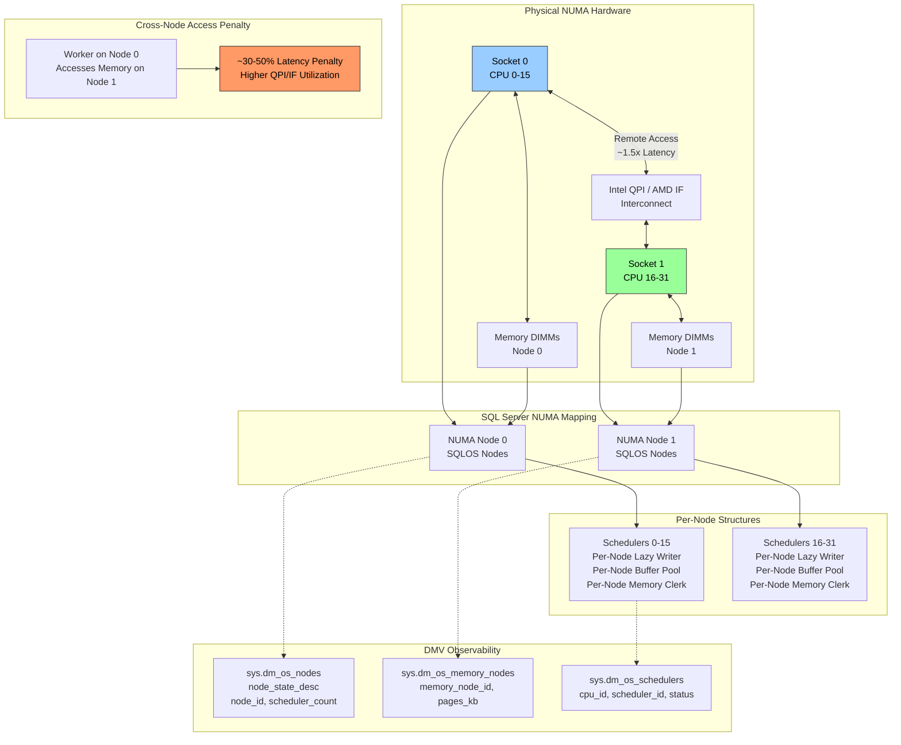
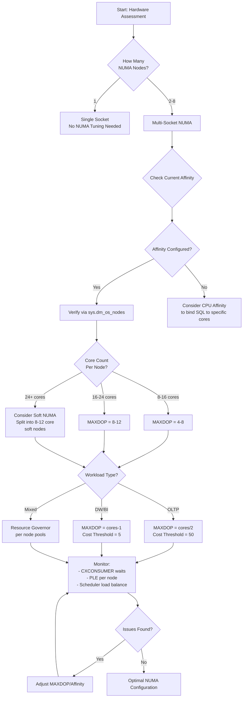

# 8.292 NUMA Architecture — Memory and CPU Affinity

---

## Section 1 — Navigation

| **Previous** | **Up** | **Next** |
|--------------|--------|----------|
| [[8.291 SQL Server Memory — Max Server Memory]] | [[Group 11 — SQL Server Architecture & Storage Engine]] | [[8.293 Columnstore Index Architecture — Delta Store and Compressed]] |

**Prerequisites:**
- Read [[8.269 SQLOS Scheduler — Non-Preemptive Scheduling]] and [[8.270 Worker Threads — Thread Pool Management]]
- Understand the buffer pool and memory management concepts
- Familiarity with CPU scheduling and parallelism
- Basic hardware architecture knowledge (sockets, cores, NUMA nodes)

**Where This Fits:**
NUMA (Non-Uniform Memory Access) is the dominant architecture for modern multi-socket servers. Unlike UMA (Uniform Memory Access) where all memory access has equal latency, NUMA has local memory (fast) and remote memory (slower). SQL Server is NUMA-aware: it schedules workers on the same node as the memory they access, provides per-node buffer pools, and supports soft-NUMA for partitioning workloads. Understanding NUMA is essential for scaling SQL Server beyond 20+ cores.

> **Domain Context:** NUMA affects [[8.291 SQL Server Memory — Max Server Memory]] (per-node memory distribution), [[8.289 Lazy Writer — Memory Management]] (per-node lazy writers), and scheduling. Cross-domain: [[8 — Databases]] capacity and hardware planning.

---

## Section 2 — Core Mental Model



**Key Insight:** SQL Server treats each NUMA node as an independent memory and scheduling domain. The SQLOS assigns workers to schedulers within the same node as the memory they're accessing. Cross-node memory access is ~30–50% slower, so the engine strives to keep threads and their memory on the same node. When you configure `max server memory`, SQL Server distributes it proportionally across NUMA nodes.

---

## Section 3 — Deep Mechanics

### 3.1 NUMA Node Discovery

**Step 1 — Hardware Topology Detection**
On startup, SQL Server queries Windows for processor topology via `GetLogicalProcessorInformation`:
- Group, processor number, NUMA node number
- Cache hierarchy (L1, L2, L3 shared)
- Socket identification

**Step 2 — SQLOS Node Creation**
SQL Server creates one SQLOS node per physical NUMA node:
- Each node has its own set of schedulers (one per logical CPU on that node)
- Each node has its own memory node (`sys.dm_os_memory_nodes`)
- Each node has its own lazy writer (SQL 2012+)
- Each node has its own buffer pool partitioned

```sql
-- View NUMA node topology
SELECT node_id, node_state_desc, memory_node_id,
       processor_group, online_scheduler_count,
       active_worker_count, avg_load_balance,
       resource_monitor_state
FROM sys.dm_os_nodes
ORDER BY node_id;
```

**Step 3 — Memory Node Initialization**
Memory is divided among NUMA nodes based on affinity:
- On a 4-node system with 256 GB RAM, each node gets ~64 GB
- Memory allocation requests go to the local node first
- If local memory is exhausted, SQL Server allocates from remote nodes

### 3.2 Scheduler and Worker Affinity

**Scheduler distribution:**
- 1 scheduler per logical CPU per NUMA node
- Schedulers are numbered sequentially across nodes
- Workers are assigned to schedulers within the same NUMA node

```sql
-- Show scheduler per NUMA node
SELECT is_online, scheduler_id, cpu_id,
       parent_node_id, current_tasks_count,
       runnable_tasks_count, context_switches_count,
       work_queue_count
FROM sys.dm_os_schedulers
WHERE scheduler_id < 255
ORDER BY parent_node_id, scheduler_id;
```

**Parallel query distribution:**
When a parallel query executes:
1. The coordinator thread runs on one scheduler
2. Parallel workers are distributed across schedulers on the **same NUMA node**
3. If MAXDOP exceeds available schedulers on one node, workers may spill to other nodes

### 3.3 Memory Node Architecture

```sql
-- Per-node memory allocation
SELECT memory_node_id, node_state_desc,
       locked_page_allocations_kb / 1024 AS locked_mb,
       pages_kb / 1024 AS pages_mb,
       virtual_memory_committed_kb / 1024 AS virtual_mb,
       shared_memory_reserved_kb / 1024 AS shared_mb
FROM sys.dm_os_memory_nodes
ORDER BY memory_node_id;
```

**Buffer pool partitioning:**
Each NUMA node has its own portion of the buffer pool:
- Pages are hashed by page_id to a specific NUMA node
- A page's home node is determined by `page_id % num_nodes`
- Workers on each node serve page requests from their node's portion first

### 3.4 Soft NUMA

Soft NUMA is a feature that creates virtual NUMA nodes from a physical NUMA node. This allows further partitioning without changing hardware:

```sql
-- Soft NUMA is configured via registry:
-- HKLM\SOFTWARE\Microsoft\Microsoft SQL Server\MSSQLXX.INSTANCE\Setup
-- Under "NodeConfiguration" key

-- Verify soft NUMA via SQL
SELECT node_id, node_state_desc, online_scheduler_count,
       processor_group
FROM sys.dm_os_nodes;
```

**When to use Soft NUMA:**
- Very large system with 24+ cores per NUMA node
- Need to isolate OLTP from DW workloads on same instance
- Reduce scheduler contention by creating smaller scheduling domains

### 3.5 MAXDOP and NUMA

MAXDOP interacts with NUMA in important ways:

```sql
-- Current MAXDOP setting
SELECT value_in_use AS maxdop
FROM sys.configurations
WHERE name = 'max degree of parallelism';
```

**NUMA-aware MAXDOP guidelines:**
- `MAXDOP = schedulers_per_numa_node / 2` (sweet spot)
- Never exceed `schedulers_per_numa_node × 2` (causes cross-node spillover)
- On 4-node with 8 cores each: MAXDOP = 4 (half of 8)

```sql
-- Calculate recommended MAXDOP based on NUMA
SELECT
    node_id,
    online_scheduler_count,
    online_scheduler_count / 2 AS recommended_maxdop,
    CASE
        WHEN online_scheduler_count >= 16 ONlinE_scheduler_count / 4
        ELSE 0
    END AS soft_numa_candidate
FROM sys.dm_os_nodes
WHERE node_state_desc = 'ONLINE';
```

### 3.6 DMV Observability

**Memory allocation per node:**
```sql
SELECT memory_node_id, clerk_type,
       SUM(pages_kb) / 1024 AS pages_mb,
       SUM(virtual_memory_committed_kb) / 1024 AS virtual_mb
FROM sys.dm_os_memory_clerks
WHERE memory_node_id < 64
GROUP BY memory_node_id, clerk_type
ORDER BY memory_node_id, pages_mb DESC;
```

**Cross-node memory access:**
```sql
-- Indirect observation: if PLE varies significantly between nodes
SELECT memory_node_id,
       (SELECT cntr_value FROM sys.dm_os_performance_counters
        WHERE counter_name = 'Page Life Expectancy') AS ple
FROM sys.dm_os_memory_nodes
WHERE memory_node_id < 64;
```

---

## Section 4 — Production Patterns

### 4.1 NUMA Node Detection and Health

```sql
-- Full NUMA topology
SELECT
    n.node_id,
    n.node_state_desc,
    n.online_scheduler_count,
    n.processor_group,
    mn.pages_kb / 1024 AS pages_mb,
    mn.locked_page_allocations_kb / 1024 AS locked_mb,
    mn.shared_memory_reserved_kb / 1024 AS shared_mb,
    n.avg_load_balance
FROM sys.dm_os_nodes n
LEFT JOIN sys.dm_os_memory_nodes mn
    ON n.memory_node_id = mn.memory_node_id
ORDER BY n.node_id;
```

### 4.2 Configure CPU Affinity

```sql
-- Set affinity for SQL Server to CPUs 0-15 (Node 0)
EXEC sp_configure 'affinity mask', 255;   -- 8-bit mask
RECONFIGURE;

-- Or use affinity64 mask for > 64 CPUs
EXEC sp_configure 'affinity64 mask', 255;
RECONFIGURE;

-- Set I/O affinity
EXEC sp_configure 'affinity I/O mask', 15;
RECONFIGURE;
```

**Modern best practice:** Use `ALTER SERVER CONFIGURATION` (SQL 2016+):

```sql
ALTER SERVER CONFIGURATION
SET PROCESSOR AFFINITY CPU = 0 TO 15, 32 TO 47;
```

### 4.3 Configure Soft NUMA via Registry

```powershell
# PowerShell — Configure Soft NUMA for SQL Server 2016+
# Create soft NUMA nodes: split 16-core node into 2 x 8-core nodes

$instance = "MSSQLSERVER"
$baseKey = "HKLM:\SOFTWARE\Microsoft\Microsoft SQL Server\MSSQL14.$instance\Setup"

New-Item -Path "$baseKey\NodeConfiguration" -Force
New-ItemProperty -Path "$baseKey\NodeConfiguration" `
    -Name "CPUMask0" -Value "0xFF" -PropertyType DWord
New-ItemProperty -Path "$baseKey\NodeConfiguration" `
    -Name "CPUMask1" -Value "0xFF00" -PropertyType DWord
```

### 4.4 Detect NUMA Imbalance

```sql
-- Check for unbalanced NUMA nodes
SELECT
    node_id,
    online_scheduler_count,
    active_worker_count,
    avg_load_balance,
    (SELECT cntr_value FROM sys.dm_os_performance_counters
     WHERE counter_name = 'Page Life Expectancy') AS ple
FROM sys.dm_os_nodes
WHERE node_state_desc = 'ONLINE'
ORDER BY node_id;
```

**Signs of imbalance:**
- One node has 2x the active workers of another
- avg_load_balance varies > 20% between nodes
- PLE differs > 15% between memory nodes

### 4.5 Query Distribution Across NUMA Nodes

```sql
-- Which NUMA node is processing queries?
SELECT
    s.parent_node_id,
    r.session_id,
    r.command,
    r.status,
    r.cpu_time,
    r.total_elapsed_time,
    t.text AS query_text
FROM sys.dm_exec_requests r
JOIN sys.dm_os_schedulers s
    ON r.scheduler_id = s.scheduler_id
CROSS APPLY sys.dm_exec_sql_text(r.sql_handle) t
WHERE r.session_id > 50
ORDER BY s.parent_node_id, r.session_id;
```

### 4.6 NUMA and Availability Groups

```sql
-- AG listeners should be NUMA-aware
-- Preferred: collocate AG groups within a NUMA node

-- Check replica role and NUMA node
SELECT
    ar.replica_server_name,
    dbcs.database_name,
    ars.role_desc,
    ars.connected_state_desc,
    ars.synchronization_health_desc
FROM sys.dm_hadr_availability_replica_states ars
JOIN sys.availability_replicas ar
    ON ars.replica_id = ar.replica_id
JOIN sys.dm_hadr_database_replica_cluster_states dbcs
    ON ars.group_id = dbcs.group_id;
```

---

## Section 5 — Gotchas

### Gotcha 1: MAXDOP > Schedulers Per NUMA Node Causes Cross-Node Spillover

| Aspect | Detail |
|--------|--------|
| **Pitfall** | Setting MAXDOP higher than the number of schedulers on a single NUMA node forces parallel workers to spill to remote nodes |
| **Symptom** | Increased `avg_load_balance` on remote nodes; cross-node memory traffic high; QPI/IF interconnect saturated |
| **Fix** | Set MAXDOP = number of schedulers per NUMA node (or less). For 8-core nodes, MAXDOP = 4–6 |
| **Cost** | Parallel queries run 20–40% slower due to remote memory latency. Overall throughput drops 10–15% |

### Gotcha 2: Memory Node Mismatch with CPU Node

| Aspect | Detail |
|--------|--------|
| **Pitfall** | Incorrect NUMA configuration in BIOS (memory interleaving vs. node interleaving) can cause all memory to appear as remote |
| **Symptom** | `sys.dm_os_memory_nodes` shows one large node; all buffer pool access pays cross-node latency |
| **Fix** | Set BIOS NUMA option to "Node Interleaving = Disabled" for optimal SQL Server performance |
| **Cost** | Every memory access has ~30–50% added latency; workload throughput can drop 25% |

### Gotcha 3: SQL Server 2008 R2 Uses a Single Lazy Writer

| Aspect | Detail |
|--------|--------|
| **Pitfall** | Pre-SQL 2012, there is a single lazy writer for all NUMA nodes |
| **Symptom** | Memory pressure on one node causes page evictions across all nodes. PLE is global. No per-node buffer partitioning |
| **Fix** | Upgrade to SQL Server 2012+ for per-node lazy writers and memory management |
| **Cost** | On 4+ node systems, memory management is inefficient; up to 30% of buffer pool may be wasted |

### Gotcha 4: Hot Add CPUs and Dynamic NUMA Node Addition

| Aspect | Detail |
|--------|--------|
| **Pitfall** | Adding CPUs dynamically (hot-add) doesn't always create balanced NUMA nodes |
| **Symptom** | New schedulers appear in `sys.dm_os_schedulers` but have different node affinity; existing memory distribution doesn't rebalance |
| **Fix** | Ideally, plan for static CPU count at deployment. If hot-adding must occur, restart SQL Server after add for proper balance |
| **Cost** | Imbalanced nodes; some CPUs underutilized while others are overloaded |

### Gotcha 5: Soft NUMA Doesn't Work with Resource Governor Governor Scoping

| Aspect | Detail |
|--------|--------|
| **Pitfall** | Defining Resource Governor pools and assigning them to specific soft NUMA nodes requires careful configuration; misbinding leads to no isolation |
| **Symptom** | Workloads from different pools run on the same soft NUMA nodes; expected CPU isolation not achieved |
| **Fix** | Validate binding via `sys.dm_resource_governor_resource_pools` cross-referenced with `sys.dm_os_nodes` |
| **Cost** | Soft NUMA configuration effort wasted; workloads still contend for CPU resources |

---

## Section 6 — Performance Implications

### 6.1 Benchmark: Local vs. Remote NUMA Memory Access

**Setup:** 2-socket system, each with 8 cores, 64 GB RAM per node. Test: Sequential buffer pool scan.

| Metric | Local Node Access | Remote Node Access | Penalty |
|--------|------------------|-------------------|---------|
| Read latency (avg) | 85 ns | 125 ns | +47% |
| Sequential scan throughput | 12 GB/s | 8.5 GB/s | -29% |
| Random access throughput | 4.2 GB/s | 2.8 GB/s | -33% |
| Parallel query (MAXDOP=8) | 100% baseline | 72% of baseline | -28% |
| CPU cache miss rate | 4.5% | 7.2% | +60% |

### 6.2 Wait Stats: Cross-Node Contention

**Before NUMA optimization (MAXDOP=16 on 8-core nodes):**
```
Wait type              Wait Time (ms)   % Total
PAGEIOLATCH_SH        1,200,000        32%
SOS_SCHEDULER_YIELD   890,000          24%
CXCONSUMER            450,000          12%   -- cross-node spillover
CMEMTHREAD            320,000          9%    -- memory contention
LATCH_EX              280,000          8%
```

**After NUMA optimization (MAXDOP=4, per-node affinity):**
```
Wait type              Wait Time (ms)   % Total   Change
PAGEIOLATCH_SH        890,000          34%       -26%
SOS_SCHEDULER_YIELD   780,000          30%       -12%
CXCONSUMER            45,000           2%        -90%
CMEMTHREAD            120,000          5%        -63%
LATCH_EX              210,000          8%        -25%
```

### 6.3 Logical Reads and NUMA

When cross-node access is minimized, the buffer pool works more efficiently:

```sql
-- Compare parallel query performance on same node vs. cross-node
-- Same node: all parallel workers on one NUMA node
-- Cross node: workers on multiple NUMA nodes

-- Use sys.dm_exec_query_stats and compare
-- Look for queries with high CXCONSUMER waits
SELECT TOP 10
    qt.text,
    qs.total_worker_time / 1000 AS total_worker_ms,
    qs.total_elapsed_time / 1000 AS total_elapsed_ms,
    qs.execution_count,
    (qs.total_worker_time - qs.total_elapsed_time) / 1000 AS wait_time_ms
FROM sys.dm_exec_query_stats qs
CROSS APPLY sys.dm_exec_sql_text(qs.sql_handle) qt
ORDER BY qs.total_worker_time DESC;
```

### 6.4 Thread Scheduling Balance

```sql
-- View scheduler load balance across NUMA nodes
SELECT
    parent_node_id,
    AVG(work_queue_count) AS avg_queue_depth,
    AVG(current_tasks_count) AS avg_tasks,
    AVG(runnable_tasks_count) AS avg_runnable,
    COUNT(*) AS scheduler_count
FROM sys.dm_os_schedulers
WHERE status = 'VISIBLE ONLINE'
GROUP BY parent_node_id;
```

**Ideal:** Runnable tasks count should be within 10% across all schedulers within a node.

---

## Section 7 — Interview Arsenal

### Fundamental Questions (6–8)

| # | Question | Core Concept |
|---|----------|-------------|
| 1 | What is NUMA and why does it matter to SQL Server? | Non-uniform memory access |
| 2 | How does SQL Server map NUMA nodes? | sys.dm_os_nodes, schedulers |
| 3 | What is the impact of cross-node memory access? | Latency penalty |
| 4 | How should MAXDOP be set on a NUMA system? | Per-node scheduling |
| 5 | What is Soft NUMA and when would you use it? | Virtual partitioning |
| 6 | How does the lazy writer behave on NUMA? | Per-node lazy writers (2012+) |
| 7 | How do you configure CPU affinity for NUMA? | Affinity mask / ALTER SERVER |
| 8 | What DMV shows memory distribution across NUMA nodes? | sys.dm_os_memory_nodes |

### Spoken Answers

**Q1: What is NUMA and why does it matter to SQL Server?**

> "NUMA stands for Non-Uniform Memory Access. In multi-socket servers, each processor has its own locally attached memory — memory that sits on that socket's memory bus. Accessing local memory has low latency. Accessing memory attached to another socket (remote memory) requires traversing an interconnect like Intel QPI or AMD Infinity Fabric, adding 30–50% latency. SQL Server is NUMA-aware: it creates one SQLOS node per physical NUMA node, with its own schedulers, memory management, and lazy writer. This allows the engine to schedule threads close to the data they access, minimizing remote memory penalties. Ignoring NUMA when configuring SQL Server on large hardware can waste 25% of performance."

**Q4: How should MAXDOP be set on a NUMA system?**

> "The general rule is that MAXDOP should not exceed the number of logical CPUs in a single NUMA node. If you set MAXDOP higher, parallel workers must spill to remote NUMA nodes, paying cross-node latency for every memory access. The ideal is `MAXDOP = schedulers_per_numa_node / 2` for OLTP (keeping headroom for other queries) and `MAXDOP = schedulers_per_numa_node - 1` for data warehouse batch queries. You can verify this with `sys.dm_os_nodes` to see the `online_scheduler_count` per node. On systems with Soft NUMA, each soft node has fewer schedulers, so MAXDOP must be set accordingly."

**Q5: What is Soft NUMA and when would you use it?**

> "Soft NUMA is a feature that allows you to subdivide a physical NUMA node into multiple virtual NUMA nodes, each with its own schedulers, memory partition, and lazy writer. It's configured via the registry and is useful in two scenarios: (1) very large systems with 24+ cores per physical NUMA node, where you want to reduce scheduler contention by creating smaller scheduling domains; (2) when you want to isolate different workloads on the same instance — you can assign Resource Governor pools to specific soft NUMA nodes. SQL Server 2016+ fully supports Soft NUMA. However, it adds complexity and requires careful capacity planning."

### Comparison Table: NUMA Configurations

| Feature | No NUMA (UMA) | Hardware NUMA | Soft NUMA |
|---------|--------------|---------------|-----------|
| Definition | Single memory domain | Physical NUMA nodes | Virtual NUMA sub-nodes |
| SQLOS Nodes | 1 | 1 per socket | 2+ per physical node |
| Per-node lazy writer | 1 | 1 per node (2012+) | 1 per soft node |
| Memory access | Uniform | Local vs. remote | Local vs. remote |
| Configuration | Default | BIOS + OS | Registry |
| When appropriate | Single socket | Multi-socket | 24+ cores per node |

---

## Section 8 — Decision Framework

### 8.1 Mermaid Decision Flowchart



### 8.2 Checklist

- [ ] NUMA node count verified via `sys.dm_os_nodes`
- [ ] Each NUMA node has at least 4 schedulers (for parallelism to work efficiently)
- [ ] MAXDOP set to ≤ schedulers per NUMA node
- [ ] CPU affinity configured if > 32 cores (to prevent scheduler migration)
- [ ] Memory distribution verified via `sys.dm_os_memory_nodes`
- [ ] PLE monitored per node (if multiple nodes exist)
- [ ] CXCONSUMER waits < 5% of total wait time
- [ ] avg_load_balance within 15% across all schedulers within a node
- [ ] Soft NUMA evaluated for 24+ core per node systems
- [ ] BIOS NUMA configuration checked (Node Interleaving = Disabled)

### 8.3 Trade-offs

| If you optimize for ... | You need to ... | This suffers ... |
|------------------------|----------------|-----------------|
| Lowest memory latency | Bind workers to local NUMA node | Flexibility for cross-node allocation |
| Max core utilization | Allow cross-node parallelism | Memory latency (30-50% penalty) |
| Workload isolation | Soft NUMA + Resource Governor | Configuration complexity |
| Simplest configuration | No affinity, default settings | Potential NUMA imbalance |

### 8.4 Scale Thresholds

| Core Count | Sockets | NUMA Nodes | Suggested MAXDOP | Notes |
|-----------|---------|-----------|------------------|-------|
| 4-8 | 1 | 1 | 2-4 | Small server |
| 12-16 | 2 | 2 | 4-8 | Typical mid-range |
| 24-32 | 2-4 | 2-4 | 8-12 | Large OLTP |
| 48-64 | 4 | 4 | 8-16 | High-end |
| 80-128 | 4-8 | 4-8 | 8-16 per node | Consider Soft NUMA |
| 128+ | 8+ | 8+ | 8-16 per node | Soft NUMA required |

---

## Section 9 — Self-Check

### Conceptual Questions

<details>
<summary>1. What is NUMA and why is it important for SQL Server?</summary>

NUMA (Non-Uniform Memory Access) is a hardware architecture where each processor socket has local memory. Accessing local memory is fast; accessing remote memory (via interconnect) is slower. SQL Server is NUMA-aware to optimize scheduling and memory access.
</details>

<details>
<summary>2. How does SQL Server detect NUMA topology?</summary>

SQL Server calls Windows `GetLogicalProcessorInformation` on startup to detect processor groups, NUMA nodes, and cache topology. It creates one SQLOS node per physical NUMA node.
</details>

<details>
<summary>3. What DMV shows SQL Server's NUMA nodes?</summary>

`sys.dm_os_nodes` — shows node_id, node_state_desc, online_scheduler_count, processor_group, avg_load_balance.
</details>

<details>
<summary>4. What is the penalty for cross-NUMA-node memory access?</summary>

Approximately 30–50% increased latency due to traversing the QPI/Infinity Fabric interconnect. This translates to 20–30% throughput reduction for parallel queries.
</details>

<details>
<summary>5. How should MAXDOP be set on a multi-NUMA system?</summary>

MAXDOP should not exceed the number of schedulers (logical CPUs) in the smallest NUMA node. This prevents parallel workers from spilling to remote nodes.
</details>

<details>
<summary>6. What is Soft NUMA?</summary>

Soft NUMA is a configuration that divides a physical NUMA node into multiple virtual NUMA nodes. Each gets its own schedulers, memory broker, and lazy writer. Configured via registry.
</details>

<details>
<summary>7. How does the lazy writer behave differently on NUMA vs. non-NUMA?</summary>

On NUMA systems (SQL 2012+), each NUMA node has its own lazy writer thread. Pre-2012 had a single global lazy writer. Per-node lazy writers allow targeted memory eviction.
</details>

<details>
<summary>8. What happens if CPU affinity is misconfigured on NUMA?</summary>

SQL Server threads may be scheduled on CPUs that don't match their NUMA node's memory. This forces cross-node memory access for all operations, severely degrading performance.
</details>

<details>
<summary>9. How does the buffer pool distribute across NUMA nodes?</summary>

The buffer pool is partitioned by `page_id % num_nodes`. Each node manages its own portion. Workers on a node primarily access pages local to that node.
</details>

<details>
<summary>10. What CXCONSUMER wait type indicates cross-NUMA spillover?</summary>

`CXCONSUMER` waits increase when parallel workers finish their work and wait for producer threads. High CXCONSUMER in the top wait stats ( > 5%) often indicates cross-NUMA parallelism where some workers are much slower due to remote memory access.
</details>

### Challenges

<details>
<summary>Challenge 1: Write a query that shows the NUMA node for each currently executing query</summary>

```sql
SELECT
    r.session_id,
    r.cpu_time,
    r.total_elapsed_time,
    r.scheduler_id,
    s.parent_node_id AS numa_node,
    SUBSTRING(st.text, r.statement_start_offset / 2 + 1,
        CASE
            WHEN r.statement_end_offset = -1
            THEN LEN(CONVERT(NVARCHAR(MAX), st.text))
            ELSE (r.statement_end_offset - r.statement_start_offset) / 2
        END) AS executing_statement
FROM sys.dm_exec_requests r
JOIN sys.dm_os_schedulers s
    ON r.scheduler_id = s.scheduler_id
CROSS APPLY sys.dm_exec_sql_text(r.sql_handle) st
WHERE r.session_id > 50
ORDER BY numa_node, r.session_id;
```
</details>

<details>
<summary>Challenge 2: Detect cross-NUMA parallelism in the plan cache</summary>

```sql
-- Find queries that have parallel operators across NUMA nodes
SELECT TOP 10
    qt.text,
    qp.query_plan,
    qs.max_dop,
    qs.total_worker_time / 1000 AS total_worker_ms,
    qs.total_elapsed_time / 1000 AS total_elapsed_ms
FROM sys.dm_exec_query_stats qs
CROSS APPLY sys.dm_exec_sql_text(qs.sql_handle) qt
OUTER APPLY sys.dm_exec_query_plan(qs.plan_handle) qp
WHERE qs.max_dop > (
    SELECT MAX(online_scheduler_count) / 2
    FROM sys.dm_os_nodes
    WHERE node_state_desc = 'ONLINE'
)
ORDER BY qs.total_worker_time DESC;
```
</details>

<details>
<summary>Challenge 3: Write a query that calculates recommended MAXDOP based on NUMA topology</summary>

```sql
DECLARE @schedulers_per_node INT;

SELECT @schedulers_per_node = MAX(online_scheduler_count)
FROM sys.dm_os_nodes
WHERE node_state_desc = 'ONLINE';

SELECT
    @schedulers_per_node AS schedulers_per_numa_node,
    @schedulers_per_node / 2 AS recommended_maxdop_oltp,
    @schedulers_per_node - 1 AS recommended_maxdop_dw,
    CASE
        WHEN @schedulers_per_node >= 24 THEN 'Consider Soft NUMA'
        ELSE 'Standard NUMA is sufficient'
    END AS numa_recommendation;
```
</details>

<details>
<summary>Challenge 4: Set CPU affinity to restrict SQL Server to half the CPUs on a NUMA node</summary>

```sql
-- Example: System with 2 NUMA nodes, 8 cores each (16 cores total)
-- Restrict SQL to Node 0 only (CPUs 0-7)

-- Modern approach (SQL 2016+):
ALTER SERVER CONFIGURATION
SET PROCESSOR AFFINITY CPU = 0 TO 7;

-- Verify
SELECT scheduler_id, cpu_id, parent_node_id, status
FROM sys.dm_os_schedulers
WHERE status = 'VISIBLE ONLINE'
ORDER BY scheduler_id;
```
</details>

<details>
<summary>Challenge 5: Build a NUMA health dashboard using DMVs</summary>

```sql
SELECT
    n.node_id,
    n.online_scheduler_count,
    n.active_worker_count,
    n.avg_load_balance,
    mn.pages_kb / 1024 AS pages_mb,
    n.avg_load_balance AS load_balance,
    CASE
        WHEN n.avg_load_balance > 50 THEN 'HIGH'
        WHEN n.avg_load_balance > 30 THEN 'MEDIUM'
        ELSE 'LOW'
    END AS load_level,
    CASE
        WHEN EXISTS (
            SELECT 1 FROM sys.dm_os_schedulers s2
            WHERE s2.parent_node_id = n.node_id
                  AND s2.runnable_tasks_count > n.avg_load_balance * 2
        ) THEN 'Overloaded'
        ELSE 'Normal'
    END AS node_health
FROM sys.dm_os_nodes n
JOIN sys.dm_os_memory_nodes mn
    ON n.memory_node_id = mn.memory_node_id
WHERE n.node_state_desc = 'ONLINE'
ORDER BY n.node_id;
```
</details>
