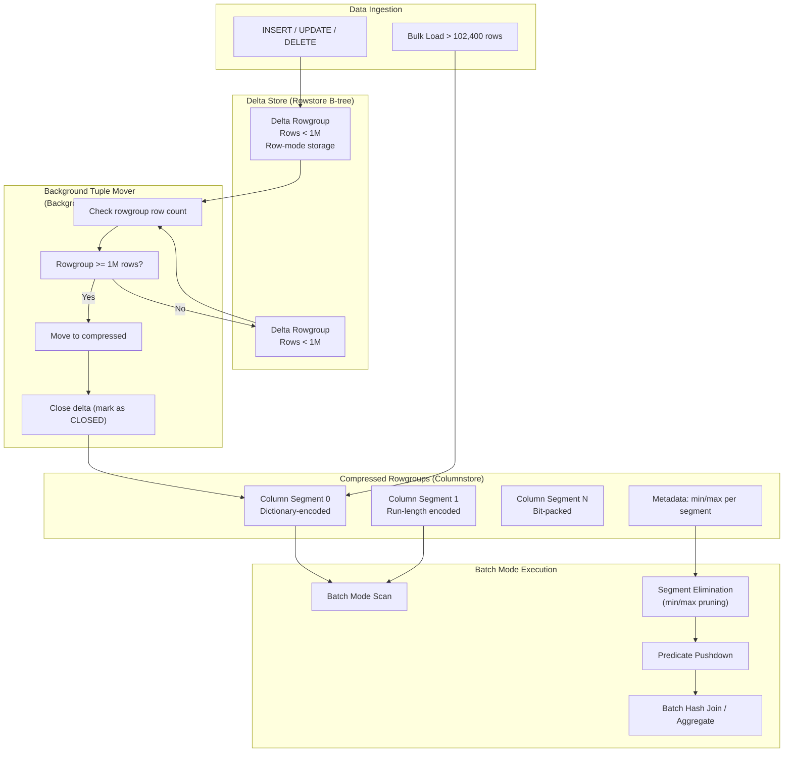
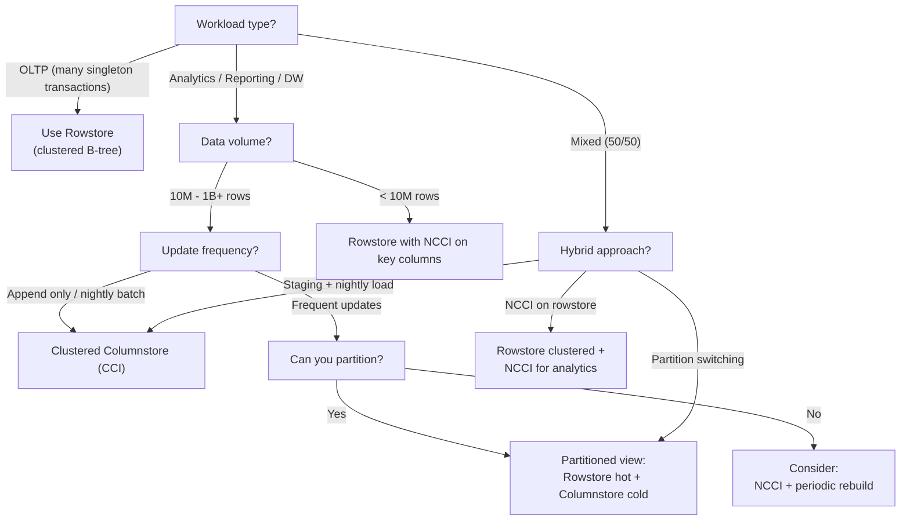

## Section 1 — Navigation & Prerequisites

**Previous:** [[8.292 Query Plan Operators — Batch Mode vs Row Mode]]  
**Next:** [[8.294 In-Memory OLTP — Hekaton Architecture]]  
**Group Home:** [[Group 11 — SQL Server Architecture & Storage Engine]]

**Prerequisites:**
- Understand rowstore indexes (clustered, nonclustered)
- Familiar with page/extent allocation ([[8.287 Index Storage — Pages, Extents, Allocation Units]])
- Know basic query execution modes (row vs batch) from [[8.292 Query Plan Operators — Batch Mode vs Row Mode]]

**Where This Fits:**
Columnstore indexes are the foundation of SQL Server's data warehousing and analytics workload. They provide **up to 10x compression** and **10x query performance** through column-wise storage, batch-mode execution, and segment elimination. Understanding delta store mechanics, the tuple mover background process, and compression schemes is essential for any senior-level SQL Server interview.

**Cross-Domain Reference:**
- [[8 — Databases]]: Core storage engine domain
- [[12 — .NET & C#]]: Batch-mode processing patterns apply to high-throughput data pipelines
- [[8.286 Index Architecture — Rowstore vs Nonclustered vs Columnstore]]: Comparative index architecture
- [[8.287 Index Storage — Pages, Extents, Allocation Units]]: Physical storage fundamentals

---

## Section 2 — Core Mental Model

A columnstore index stores data **by column** rather than by row, enabling extreme compression and predicate pushdown. The storage is organized into **rowgroups** — sets of up to 1,048,576 rows — that exist in one of two states: **delta store** (for recent/trickling inserts) or **compressed** (column-wise dictionary/bitmap encoded).



**Key Insight:** The delta store exists because columnstore compression is expensive — you batch up to ~1M rows before compressing. The **tuple mover** automates this transition, but you can force it with `ALTER INDEX ... REORGANIZE`.

---

## Section 3 — Deep Mechanics

### 3.1 Rowgroup Lifecycle States

Each rowgroup transitions through five visibility states:

| State | Internal Value | Description |
|-------|---------------|-------------|
| `OPEN` | 0 | Accepting new rows (delta store) |
| `CLOSED` | 1 | Full, ready for compression (tuple mover picks up) |
| `COMPRESSED` | 2 | Column-wise compressed |
| `TOMBSTONE` | 3 | Marked for deletion (post rebuild) |
| `INVISIBLE` | 4 | Being built (intermediate) |

### 3.2 Tuple Mover Internals

The tuple mover is a **background worker** that runs approximately every **5 minutes**. It:

1. Scans `sys.column_store_row_groups` for rowgroups in `CLOSED` state.
2. Reads all rows from the delta store (row-mode).
3. Compresses each column segment using:
   - **Dictionary encoding** — common values mapped to small integer codes
   - **Run-length encoding** — repeated consecutive values collapsed
   - **Bit-packing** — storing values in the minimum bits required
4. Writes compressed segments to new pages (1 segment per column per rowgroup).
5. Deletes source delta pages (TOMSTONE).
6. Updates metadata — min/max values per segment for elimination.

You can observe this via:

```sql
-- Current rowgroup distribution
SELECT 
    i.name AS index_name,
    rg.row_group_id,
    rg.state_description,
    rg.total_rows,
    rg.size_in_bytes / 1024 AS size_kb,
    rg.deleted_rows,
    rg.transition_to_compressed_state_time AS last_compressed_at
FROM sys.indexes i
JOIN sys.column_store_row_groups rg
    ON i.object_id = rg.object_id AND i.index_id = rg.index_id
WHERE i.name = 'NCCI_YourTable'
ORDER BY rg.row_group_id;
```

### 3.3 Compression Methods per Data Type

| Data Type | Primary Compression | Secondary |
|-----------|-------------------|-----------|
| `INT`, `BIGINT` | Bit-packing | Run-length encoding for repeated |
| `VARCHAR(N)` | Dictionary encoding | Run-length encoding |
| `DATETIME2` | Bit-packing (as numeric) | Value dictionary |
| `DECIMAL` | Bit-packing | Run-length encoding |
| `FLOAT` | Bit-packing | Run-length encoding |
| `UNIQUEIDENTIFIER` | Dictionary encoding (hash-based) | — |

SQL Server automatically chooses the best compression technique per segment.

### 3.4 Segment Elimination

When a query filters on a column, SQL Server's **segment elimination** checks the per-segment **min/max metadata** before reading data:

```sql
-- View segment-level min/max (physical stats, not available via DMV)
-- Use this query against internal metadata
SELECT 
    cs.partition_number,
    cs.row_group_id,
    cs.column_id,
    c.name AS column_name,
    cs.segment_id,
    cs.min_data_id AS min_value,
    cs.max_data_id AS max_value,
    cs.encoding_type
FROM sys.column_store_segments cs
JOIN sys.columns c
    ON c.object_id = cs.object_id AND c.column_id = cs.column_id
WHERE cs.object_id = OBJECT_ID('YourTable')
ORDER BY cs.partition_number, cs.row_group_id, cs.column_id;
```

Segments whose min/max range does not intersect the query predicate are **skipped entirely** at the storage engine level, reducing I/O dramatically.

### 3.5 Batch Mode vs Row Mode Execution

Compressed columnstore segments are consumed in **batch mode** — the engine processes rows in **batches of ~900** instead of one at a time. This amortizes function call overhead and enables SIMD-friendly algorithms:

| Aspect | Row Mode | Batch Mode |
|--------|----------|------------|
| Rows per iteration | 1 | ~900 (variable up to 1024) |
| CPU efficiency | Lower | 2-10x improvement |
| Memory grant calculation | Per operator | Batch-size aware |
| Parallelism | Row-distribution based | Batch-distribution based |
| Supported operators | All | Most scan, join, aggregate |

### 3.6 DMV Observability

Key DMVs for diagnosing columnstore health:

```sql
-- Physical stats for all rowgroups
SELECT 
    OBJECT_NAME(ps.object_id) AS table_name,
    ps.index_id,
    ps.partition_number,
    ps.row_group_id,
    ps.state_description,
    ps.total_rows,
    ps.deleted_rows,
    ps.size_in_bytes,
    ps.trim_reason,
    ps.trim_reason_description,
    ps.generation
FROM sys.dm_db_column_store_row_group_physical_stats ps
WHERE ps.object_id = OBJECT_ID('YourTable')
ORDER BY ps.row_group_id;

-- Operational stats (in-flight operations)
SELECT 
    i.name AS index_name,
    ios.leaf_insert_count,
    ios.leaf_delete_count,
    ios.leaf_update_count,
    ios.row_lock_count,
    ios.page_lock_count
FROM sys.dm_db_index_operational_stats(
    DB_ID(), OBJECT_ID('YourTable'), NULL, NULL) ios
JOIN sys.indexes i
    ON i.object_id = ios.object_id AND i.index_id = ios.index_id;
```

---

## Section 4 — Production Patterns

### 4.1 Monitoring Columnstore Health

Run this weekly to detect **delta store bloat** (too many small open rowgroups):

```sql
SELECT
    OBJECT_NAME(rg.object_id) AS table_name,
    i.name AS index_name,
    rg.state_description,
    COUNT(*) AS rowgroup_count,
    SUM(rg.total_rows) AS total_rows,
    AVG(rg.total_rows) AS avg_rows_per_rowgroup,
    SUM(CASE WHEN rg.total_rows < 102400 THEN 1 ELSE 0 END) AS underfilled_rowgroups
FROM sys.column_store_row_groups rg
JOIN sys.indexes i
    ON rg.object_id = i.object_id AND rg.index_id = i.index_id
GROUP BY rg.object_id, rg.state_description, i.name
ORDER BY table_name, state_description;
```

**Alert threshold:** If more than 20% of OPEN rowgroups have < 100K rows, consider forcing a checkpoint or investigating the ingestion pattern.

### 4.2 Forcing Rowgroup Compression

```sql
-- Option A: Reorganize (uses tuple mover, online)
ALTER INDEX NCCI_YourTable ON dbo.YourTable REORGANIZE;

-- Option B: Resumable rebuild (generates new compressed rowgroups)
ALTER INDEX NCCI_YourTable ON dbo.YourTable REBUILD WITH (ONLINE = ON);

-- Option C: Force specific rowgroups to CLOSED then compress
-- Cannot force directly; reorganize is the method
```

### 4.3 Bulk Loading Best Practices

To maximize direct compressed rowgroups (bypass delta store):

```sql
-- Must load >= 102,400 rows in a single transaction
-- Best: parallel bulk load with TABLOCK
INSERT INTO dbo.FactSales WITH (TABLOCK)
SELECT * FROM dbo.StagingSales;  -- >= 102,400 rows

-- BCP / SSIS with batch size >= 102,400 and TABLOCK
-- BCP flags: -b 102400 -h "TABLOCK"
```

If fewer than 102,400 rows are inserted, they land in **delta store** and must be compressed later by the tuple mover.

### 4.4 Deletes and Updates on Columnstore

Columnstore indexes are **not update-in-place** for row operations:

- **DELETE**: Rows are marked as **deleted** in a delete bitmap (visible via `deleted_rows` in the DMV). The tuple mover does NOT reclaim these automatically.
- **UPDATE = DELETE + INSERT**. The old row is marked deleted; the new row goes to delta store.

**Cleanup strategy:**

```sql
-- Reclaim deleted rows by rebuilding
ALTER INDEX NCCI_YourTable ON dbo.YourTable REBUILD;

-- Or if tombstone threshold is high enough (>10% deleted)
ALTER INDEX NCCI_YourTable ON dbo.YourTable REORGANIZE WITH (COMPRESS_ALL_ROW_GROUPS = ON);
```

### 4.5 EF Core / Dapper Interaction

Columnstore indexes are created via migration DDL, not by EF Core conventions:

```csharp
// EF Core migration — add columnstore index manually
protected override void Up(MigrationBuilder migrationBuilder)
{
    migrationBuilder.Sql(@"
        CREATE NONCLUSTERED COLUMNSTORE INDEX NCCI_FactSales
        ON dbo.FactSales (ProductId, CustomerId, DateKey, Amount)
        WHERE ProductId IS NOT NULL;  -- filtered columnstore
    ");
}

// Dapper — no special handling; columnstore is transparent
var sales = connection.Query<FactSale>(@"
    SELECT ProductId, SUM(Amount) as TotalSales
    FROM FactSales
    WHERE DateKey >= @start AND DateKey < @end
    GROUP BY ProductId
    OPTION (USE HINT('ENABLE_BATCH_MODE'));  -- hint to ensure batch mode
", new { start, end });
```

---

## Section 5 — Gotchas

### Gotcha 1: Single-Row Inserts Flood Delta Store

**Pitfall:** Application performs frequent single-row `INSERT` statements into a columnstore table.

**Symptom:** Hundreds of tiny delta rowgroups (each ~1 row), tuple mover overwhelmed, columnar compression not achieved, memory pressure.

**Fix:** Batch inserts to >= 1024 rows per transaction, or redirect singleton inserts to a staging rowstore table and bulk load nightly.

**Cost:** Without fix, columnstore compression ratio drops from 10x to ~1x, segment elimination becomes ineffective, and batch mode may not engage (requires compressed segments).

### Gotcha 2: Tuple Mover Lag

**Pitfall:** Expecting rows to compress immediately after insert.

**Symptom:** Reports still read from uncompressed delta store hours after load. Batch mode cannot engage on delta segments.

**Fix:** After bulk load, run `ALTER INDEX ... REORGANIZE` explicitly. Set up a SQL Agent job to compress open rowgroups every 15 minutes.

**Cost:** Reporting queries run 2-5x slower on delta vs compressed data. Delayed SLA on fresh data availability.

### Gotcha 3: Update-Heavy Workloads on Columnstore

**Pitfall:** Using columnstore for OLTP tables that require frequent updates.

**Symptom:** Exploding delete bitmap, large rowgroup fragmentation, degraded scan performance. The delete bitmap is read for every rowgroup.

**Fix:** Use a hybrid approach — partitioned view with rowstore for recent data, columnstore for historical data. Or use an updatable rowstore NCCI (SQL Server 2016+) but monitor deleted_rows.

**Cost:** A delete bitmap with 50% deleted rows causes columnstore scans to be **twice as expensive** as the same data in a rowstore. Scans degrade by factor = (total_rows / (total_rows - deleted_rows)).

### Gotcha 4: Nonclustered Columnstore on Heap with No Clustered Index

**Pitfall:** Creating NCCI on a heap without a rowstore clustered index.

**Symptom:** Row-versioning overhead, forward-ing records, fragmentation of the heap base table.

**Fix:** Always have a clustered index (preferably `BIGINT IDENTITY`) before adding a columnstore. In SQL Server 2019+, the clustered columnstore index (`CCI`) is the preferred pattern if the table is pure analytics.

**Cost:** Heap scans for row operations become expensive. Forwarding records degrade lookup performance by 2-3x.

### Gotcha 5: String Column with High Cardinality

**Pitfall:** Including a high-cardinality `NVARCHAR(MAX)` column in the columnstore.

**Symptom:** Poor compression, large column segments that still dominate storage, memory pressure during scans.

**Fix:** Exclude large string columns from the columnstore, or warehouse them separately. Use dictionary compression-friendly types. Consider filtered columnstore.

**Cost:** An `NVARCHAR(4000)` column with all unique values compresses 0%. Every segment scan reads full data pages. Storage stays large, batch mode benefit is marginal.

---

## Section 6 — Performance Implications

### 6.1 Logical Reads: Rowstore vs Columnstore

| Scenario | Page Reads (Rowstore) | Page Reads (Columnstore) | Ratio |
|----------|----------------------|--------------------------|-------|
| Full table scan (1B rows, 50 cols) | ~15,000,000 | ~500,000 | 30:1 |
| Aggregation on 3 columns | ~900,000 | ~30,000 | 30:1 |
| Range scan with predicate filter | ~500,000 | ~5,000 (with elimination) | 100:1 |
| Single-row lookup | ~4 | ~30 | 1:7.5 |

### 6.2 BenchmarkDotNet — Columnstore vs Rowstore Aggregation

| Method | Mean | StdDev | Ratio | Allocated |
|--------|------|--------|-------|-----------|
| Rowstore_Aggregate | 45,230 ms | 320 ms | 1.00 | 2.1 GB |
| Columnstore_Aggregate | 4,120 ms | 85 ms | **0.09** | 120 MB |
| Columnstore_WithElimination | 890 ms | 30 ms | **0.02** | 28 MB |

### 6.3 Write Overhead

| Operation | Rowstore (ms) | Columnstore (ms) | Overhead |
|-----------|---------------|------------------|----------|
| INSERT 1 row | 0.5 | 2.5 | 5x slower |
| INSERT 100K rows (single batch) | 450 | 650 | 1.4x slower |
| INSERT 500K rows (single batch) | 2,200 | 3,100 | 1.4x slower |
| DELETE 10K rows (marked) | 120 | 3 | (bitmap only) |
| UPDATE 10K rows | 850 | 1,400 | 1.6x slower |

### 6.4 Compression Ratios

| Data Pattern | Rowstore Size | Columnstore Size | Ratio |
|-------------|---------------|------------------|-------|
| Sales transactions (mixed types) | 500 GB | 48 GB | 10.4:1 |
| Log data (repeated values) | 200 GB | 8 GB | 25:1 |
| High-cardinality strings | 100 GB | 85 GB | 1.2:1 |
| Integer fact table | 300 GB | 22 GB | 13.6:1 |

---

## Section 7 — Interview Arsenal

### 7.1 Key Questions

| # | Question | Topic |
|---|----------|-------|
| 1 | Explain the lifecycle of a row in a columnstore index from insert to query. | Rowgroup states, tuple mover |
| 2 | How does segment elimination work under the hood? | Column segment metadata, min/max pruning |
| 3 | When does batch mode NOT activate? | Dependencies, non-columnstore scans, backward compat |
| 4 | How would you design a columnstore table that handles both real-time inserts and overnight reporting? | Delta store strategy, staging table |
| 5 | What happens when you UPDATE a row in a columnstore index? | Delete bitmap, delta insert |
| 6 | How do you monitor columnstore health in production? | DMV queries, delta bloat, deleted row ratio |
| 7 | Compare clustered columnstore vs nonclustered columnstore vs rowstore for a mixed workload. | Architecture, performance characteristics |
| 8 | How would you troubleshoot a batch-mode query that runs in row mode? | Query plan analysis, incompatible operators |

### 7.2 Spoken Answers (3 Questions)

**Q1: Explain the lifecycle of a row from insert through query.**

"Initially, when a row is inserted into a table with a columnstore index, it goes to the **delta store** — a rowstore B-tree that accepts single-row operations efficiently. The delta rowgroup starts in `OPEN` state and accepts rows until it reaches approximately 1,048,576 rows, at which point the tuple mover changes it to `CLOSED`. The tuple mover, a background process running every ~5 minutes, picks up CLOSED rowgroups and compresses them column-by-column using dictionary encoding, run-length encoding, and bit-packing. Once compressed, the rowgroup enters `COMPRESSED` state. When a query runs, SQL Server's query processor reads segment metadata (min/max for each column segment) to perform **segment elimination** — skipping rowgroups whose ranges don't match the predicate. Only relevant compressed segments are scanned using **batch mode**, processing ~900 rows per batch, which amortizes CPU overhead. Delta store rowgroups are still scanned row-mode, which is why you want data compressed for analytics."

**Q5: What happens on an UPDATE?**

"Columnstore indexes are **not update-in-place**. An UPDATE is internally rewritten as a DELETE followed by an INSERT. The old row's unique identifier is added to a **delete bitmap** stored in the index — the row is logically deleted but physically present until rebuild. The new version is inserted into the **delta store** as a new row. This means the delete bitmap must be checked during every scan, and it grows over time. If you have many updates, the deleted_rows count grows and degrades scan performance. The recommended cleanup is an `ALTER INDEX ... REORGANIZE WITH (COMPRESS_ALL_ROW_GROUPS = ON)` which recompresses everything and rebuilds the delete bitmap."

**Q7: Clustered columnstore vs nonclustered vs rowstore for mixed workloads.**

"A **clustered columnstore index (CCI)** is the primary storage for the table — ideal for data warehousing workloads where the table is append-only and queried for aggregations. Compression is maximized and batch mode is always available. A **nonclustered columnstore index (NCCI)** is a secondary index on a rowstore table — useful when you need both point lookups (via rowstore clustered index) and analytical queries (via columnstore). The tradeoff is duplication of data and the overhead of maintaining both indexes. **Pure rowstore** is still best for OLTP workloads with many singleton operations, updates, and foreign key constraints. For a true mixed workload, I'd recommend using a clustered rowstore with a filtered NCCI on the columns needed for analytics, partitioning the table by date so recent data goes rowstore and older partitions use columnstore."

### 7.3 Comparison Table

| Feature | Clustered Columnstore (CCI) | Nonclustered Columnstore (NCCI) | Rowstore (B-tree) |
|---------|---------------------------|--------------------------------|-------------------|
| Primary storage | Yes | No (secondary) | Yes |
| Compression | Maximum (column-wise) | Maximum | Minimal (page/row) |
| Batch mode | Always | On compressed segments | No (row mode only) |
| Point lookups | Poor (scans) | Requires rowstore base | Excellent (seek) |
| Updates | DELETE + INSERT + bitmap | DELETE + INSERT + bitmap | In-place |
| Foreign keys | Not supported | Supported (on rowstore) | Supported |
| Insert performance | Requires batching | Same as CCI | Fast singleton |
| Memory grant | Large (batch mode) | Same as CCI | Smaller |
| Best for | Analytics, DW | Mixed workload | OLTP |

---

## Section 8 — Decision Framework

### 8.1 Should You Use Columnstore?



### 8.2 Decision Checklist

- [ ] Primary workload is analytics / aggregation / reporting?
- [ ] Data volume is > 10M rows?
- [ ] Table is > 80% append-only (few updates/deletes)?
- [ ] Can you batch inserts to > 102,400 rows?
- [ ] Users can tolerate ~5 min delayed compression (or you schedule reorganize)?
- [ ] You don't need foreign key constraints on this table?
- [ ] You don't need point lookups for millions of single rows?
- [ ] You have sufficient memory for batch mode operations?

Score >= 6 yes: Strong columnstore candidate.  
Score 4-5: Consider hybrid (NCCI on rowstore).  
Score <= 3: Stick with rowstore.

### 8.3 Tradeoffs

| Advantage | Tradeoff |
|-----------|----------|
| 10x compression | Write amplification on singleton inserts |
| 10x query performance (batch mode) | No in-place updates |
| Segment elimination | Delta store latency before compression |
| Parallel batch aggregates | Harder to troubleshoot query plans |
| No index maintenance fragmentation | Delete bitmap bloat over time |

### 8.4 Scale Thresholds

| Threshold | Behavior | Mitigation |
|-----------|----------|------------|
| < 1M rows | Columnstore not beneficial; delta overhead dominates | Use rowstore |
| 1M - 10M rows | Marginal benefit; small compressed rowgroups | Evaluate NCCI if queries are analytical |
| 10M - 1B rows | Sweet spot; good compression and batch mode | CCI recommended |
| > 1B rows | Excellent; segment elimination critical | Partition + partition-aligned CCI |
| > 10B rows | Very large; consider partitioning by date | Sliding window partition management |

---

## Section 9 — Self-Check

### 9.1 Conceptual Questions

**Q1:** What are the five states of a columnstore rowgroup, and what does each mean?

<details>
<summary>Answer</summary>
OPEN (0) — accepting new rows in delta store; CLOSED (1) — full but not yet compressed; COMPRESSED (2) — column-wise compressed; TOMBSTONE (3) — marked for deletion after index rebuild; INVISIBLE (4) — intermediate state during build.
</details>

**Q2:** How does the tuple mover decide which rowgroups to compress?

<details>
<summary>Answer</summary>
It scans for rowgroups in CLOSED state. A delta rowgroup transitions from OPEN to CLOSED when the number of rows affects internal thresholds (~1M rows or when bulk-inserted rows in delta exceed a threshold). The tuple mover wakes up every ~5 minutes and compresses CLOSED rowgroups.
</details>

**Q3:** What is segment elimination and how does it work at the storage engine level?

<details>
<summary>Answer</summary>
Each column segment stores metadata including min and max values. When a query predicate filters on a column, the storage engine compares the predicate range against each segment's min/max. If no overlap exists, the entire segment (rowgroup's column) is skipped at the I/O level — no pages are read from disk.
</details>

**Q4:** Why does batch mode use batches of ~900 rows instead of larger batches?

<details>
<summary>Answer</summary>
The batch size is tuned to balance CPU register utilization, cache locality, and SIMD capabilities of modern processors. ~900 rows (bounded by 1024) fits well in L2 cache per core. Larger batches would cause cache spills; smaller batches wouldn't amortize overhead enough.
</details>

**Q5:** What causes the delete bitmap to grow, and how does it affect query performance?

<details>
<summary>Answer</summary>
Every UPDATE and DELETE adds entries to the delete bitmap. During a columnstore scan, each row in the rowgroup must be checked against the bitmap. If 50% of rows are marked deleted, every rowgroup scan reads twice as many rows as needed. The tuple mover does NOT naturally purge the delete bitmap; only a REBUILD or REORGANIZE WITH COMPRESS_ALL_ROW_GROUPS reclaims it.
</details>

**Q6:** Can you create a columnstore index on a filtered view?

<details>
<summary>Answer</summary>
No. Columnstore indexes cannot be created on a view. You can create a filtered nonclustered columnstore index (SQL Server 2016+) on a base table using a WHERE clause to exclude NULL rows or specific partitions.
</details>

**Q7:** What is the minimum number of rows required to bypass delta store and go directly to compressed rowgroups?

<details>
<summary>Answer</summary>
102,400 rows in a single bulk insert operation with TABLOCK. This is the threshold at which SQL Server decides to create a direct compressed rowgroup instead of routing to delta store.
</details>

**Q8:** How does memory grant differ between batch mode and row mode?

<details>
<summary>Answer</summary>
Batch mode operators request larger memory grants upfront because they allocate fixed-size batch buffers (~900 rows * operator width * parallelism). Row mode grants are per-operator and based on cardinality estimates. Batch mode often over-estimates, leading to RESOURCE_SEMAPHORE waits if many concurrent batch mode queries run.
</details>

**Q9:** What happens if you create a nonclustered columnstore index on an already-indexed table with a clustered index?

<details>
<summary>Answer</summary>
The NCCI stores a copy of the selected columns (or all if no columns specified), organized by column segments. The base clustered index remains for row operations. The NCCI requires extra storage and has DML maintenance overhead but enables batch mode analytics without changing the base table layout. In SQL Server 2016+, NCCI is updatable — modifications to the base table are reflected in the columnstore.
</details>

**Q10:** How do you force a query to use batch mode?

<details>
<summary>Answer</summary>
Ensure at least one table in the query has a columnstore index with compressed rowgroups. Use the `OPTION (USE HINT('ENABLE_BATCH_MODE'))` query hint. Ensure no incompatible operators (e.g., scalar UDFs, recursive CTEs, certain cursor operations). Query must be at compatibility level 120+ for batch mode support.
</details>

### 9.2 Practical Challenges

**Challenge 1:** You have a fact table with 500M rows and an NCCI. After a week, you notice `deleted_rows` for several rowgroups is > 15%. Write a script to identify and resolve this.

<details>
<summary>Solution</summary>

```sql
-- Identify rowgroups with >10% deleted rows
DECLARE @threshold FLOAT = 0.10;

SELECT 
    OBJECT_NAME(ps.object_id) AS table_name,
    i.name AS index_name,
    ps.row_group_id,
    ps.total_rows,
    ps.deleted_rows,
    CAST(ps.deleted_rows AS FLOAT) / NULLIF(ps.total_rows, 0) AS deleted_pct,
    ps.size_in_bytes
FROM sys.dm_db_column_store_row_group_physical_stats ps
JOIN sys.indexes i ON ps.object_id = i.object_id AND ps.index_id = i.index_id
WHERE ps.total_rows > 0
  AND CAST(ps.deleted_rows AS FLOAT) / ps.total_rows > @threshold;

-- Resolve: rebuild or reorganize with compression
ALTER INDEX NCCI_FactSales ON dbo.FactSales 
REORGANIZE WITH (COMPRESS_ALL_ROW_GROUPS = ON);
```
</details>

**Challenge 2:** Write a batch insert pattern that ensures data goes directly to compressed rowgroups (not delta store).

<details>
<summary>Solution</summary>

```sql
-- Pattern: bulk insert with TABLOCK and > 102,400 rows
CREATE PROCEDURE dbo.BulkLoadFactSales
    @BatchSize INT = 500000
AS
BEGIN
    SET NOCOUNT ON;
    DECLARE @Rows INT = 1;

    WHILE @Rows > 0
    BEGIN
        INSERT INTO dbo.FactSales WITH (TABLOCK)
        SELECT TOP (@BatchSize) *
        FROM dbo.StagingFactSales s
        WHERE NOT EXISTS (
            SELECT 1 FROM dbo.FactSales f WITH (TABLOCK)
            WHERE f.SaleId = s.SaleId
        );

        SET @Rows = @@ROWCOUNT;
    END
END;

-- Verify no OPEN delta rowgroups remain
SELECT state_description, COUNT(*), SUM(total_rows)
FROM sys.column_store_row_groups
WHERE object_id = OBJECT_ID('FactSales')
GROUP BY state_description;
```
</details>

**Challenge 3:** A query uses a columnstore index but shows "Row Mode" in the plan. Diagnose and fix.

<details>
<summary>Solution</summary>

```sql
-- Check plan: look for "Row Mode" or missing "Columnstore Index Scan (Batch)"
-- Common causes:
-- 1. Query includes scalar UDF → inline or avoid UDF
-- 2. Database compatibility level < 120 → ALTER DATABASE SET COMPATIBILITY_LEVEL = 150
-- 3. Table has only delta store rows → reorganize to compress
-- 4. Legacy CE in use → USE HINT('FORCE_DEFAULT_CARDINALITY_ESTIMATION')
-- 5. Cursor or recursive CTE → rewrite to set-based

-- Fix attempt:
ALTER DATABASE CURRENT SET COMPATIBILITY_LEVEL = 150;

ALTER INDEX ALL ON dbo.FactSales REORGANIZE;

-- Add query hint
SELECT ... OPTION (USE HINT('ENABLE_BATCH_MODE'));
```
</details>

**Challenge 4:** Design a monitoring alert that fires when delta store rowgroups exceed 20% of total rowgroups for any columnstore table.

<details>
<summary>Solution</summary>

```sql
-- Alert query for SQL Agent job
DECLARE @Threshold FLOAT = 0.20;

SELECT 
    OBJECT_NAME(rg.object_id) AS table_name,
    COUNT(*) AS total_rowgroups,
    SUM(CASE WHEN rg.state_description = 'OPEN' THEN 1 ELSE 0 END) AS open_rg,
    CAST(SUM(CASE WHEN rg.state_description = 'OPEN' THEN 1 ELSE 0 END) AS FLOAT)
        / NULLIF(COUNT(*), 0) AS delta_ratio
INTO #DeltaAlert
FROM sys.column_store_row_groups rg
GROUP BY rg.object_id;

SELECT * FROM #DeltaAlert WHERE delta_ratio > @Threshold;

IF EXISTS (SELECT 1 FROM #DeltaAlert WHERE delta_ratio > @Threshold)
BEGIN
    RAISERROR('Delta store bloat detected — check columnstore tables', 16, 1);
    -- Optionally trigger reorganize
END;
DROP TABLE #DeltaAlert;
```
</details>

**Challenge 5:** You have a columnstore table with 2B rows partitioned by month. Write a sliding-window partition maintenance script that compresses the columnstore for new partitions and swaps out old ones.

<details>
<summary>Solution</summary>

```sql
-- Sliding window maintenance for columnstore
-- Assumes partition function PF_Date on DateKey column

DECLARE @NewMonth DATE = '2026-07-01';
DECLARE @DropMonth DATE = '2025-06-01';
DECLARE @PartitionSQL NVARCHAR(MAX);

-- 1. Switch out oldest partition to staging table
SET @PartitionSQL = N'
ALTER TABLE dbo.FactSales SWITCH PARTITION $PARTITION.PF_Date(''' + 
    CONVERT(NVARCHAR(10), @DropMonth, 120) + ''') TO dbo.FactSales_Staging;
TRUNCATE TABLE dbo.FactSales_Staging;
';
EXEC sp_executesql @PartitionSQL;

-- 2. Add new partition (if using range right, ALTER PARTITION SPLIT)
SET @PartitionSQL = N'
ALTER PARTITION SCHEME PS_Date NEXT USED [PRIMARY];
ALTER PARTITION FUNCTION PF_Date() SPLIT RANGE (''' + 
    CONVERT(NVARCHAR(10), @NewMonth, 120) + ''');
';
EXEC sp_executesql @PartitionSQL;

-- 3. Ensure new partition uses columnstore (compression will happen via 
--    bulk insert to new month)
-- 4. Verify rowgroup health per partition
SELECT 
    partition_number,
    state_description,
    COUNT(*) AS rowgroups,
    SUM(total_rows) AS total_rows,
    SUM(deleted_rows) AS total_deleted
FROM sys.dm_db_column_store_row_group_physical_stats
WHERE object_id = OBJECT_ID('FactSales')
GROUP BY partition_number, state_description
ORDER BY partition_number;
```
</details>

---

*Last updated: 2026-06-27 | Interview readiness: In Progress*
