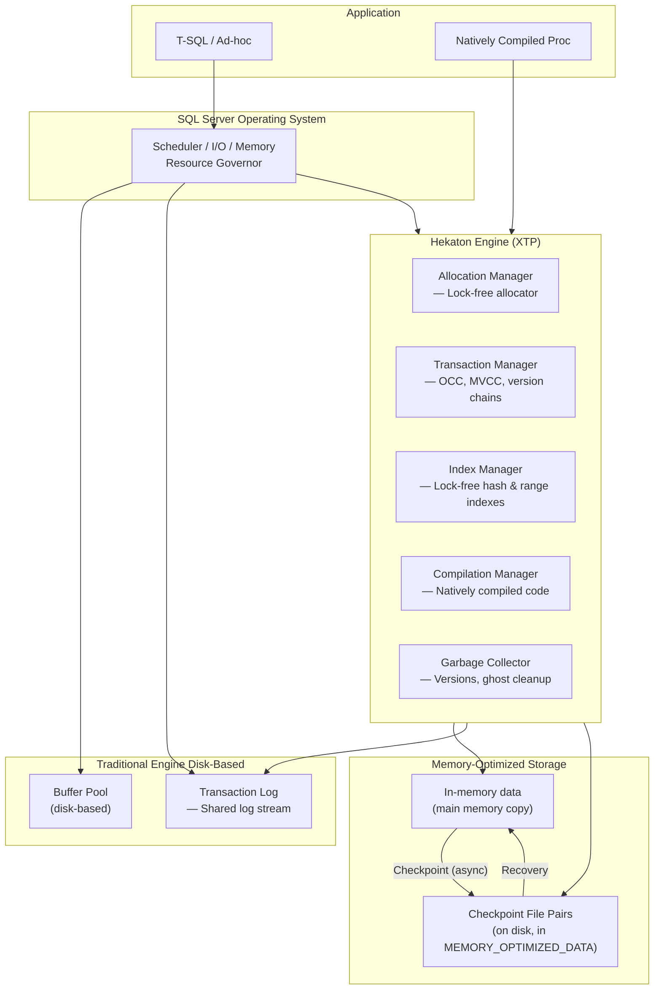
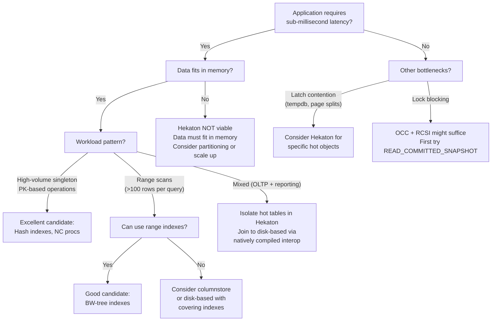

## Section 1 — Navigation & Prerequisites

**Previous:** [[8.293 Columnstore Index Architecture — Delta Store and Compressed]]  
**Next:** [[8.295 In-Memory OLTP — Memory-Optimized Tables]]  
**Group Home:** [[Group 11 — SQL Server Architecture & Storage Engine]]

**Prerequisites:**
- Understand buffer pool management and page life expectancy
- Familiar with transaction isolation levels from [[12.220 Locking, Blocking, Deadlocks — Isolation Levels]]
- Know how checkpoint/restore works for disk-based tables
- Understand optimistic concurrency concepts

**Where This Fits:**
Hekaton (In-Memory OLTP) is SQL Server's **fully integrated memory-optimized database engine** introduced in SQL Server 2014 and significantly enhanced in every subsequent release. It is designed for **extreme OLTP performance** — sub-millisecond latency, >1M batch requests/sec — by eliminating latching, locking, and context switching overhead. This note covers the **internal architecture**: memory-optimized filegroups, checkpoint file pairs (CFPs), the XTP engine threads, and how durability is achieved without traditional I/O.

**Cross-Domain Reference:**
- [[8 — Databases]]: Core database domain
- [[12 — .NET & C#]]: Application integration patterns for high-throughput scenarios
- [[8.295 In-Memory OLTP — Memory-Optimized Tables]]: Next-level detail on table types
- [[8.296 In-Memory OLTP — Natively Compiled Procedures]]: Procedural execution model

---

## Section 2 — Core Mental Model

Hekaton is a **separate, lock-free database engine** embedded within SQL Server. It manages memory-optimized tables in the **buffer pool extension** area, using a **multi-version optimistic concurrency** model. Durability is provided by **transactional log** and **checkpoint file pairs (CFP)** stored in a special **memory-optimized filegroup**.



**Key Insight:** Hekaton does NOT compete for buffer pool pages. It manages its own memory via the **allocation manager**, using lock-free data structures and optimistic concurrency. The *only* shared resource between Hekaton and the traditional engine is the **transaction log**.

---

## Section 3 — Deep Mechanics

### 3.1 Memory-Optimized Filegroup

When you create a database with a memory-optimized filegroup:

```sql
-- Add memory-optimized filegroup
ALTER DATABASE YourDB ADD FILEGROUP MemFG CONTAINS MEMORY_OPTIMIZED_DATA;
ALTER DATABASE YourDB ADD FILE (
    NAME = MemFile, FILENAME = N'C:\Data\YourDB_Mem'
) TO FILEGROUP MemFG;
```

This filegroup stores **checkpoint file pairs (CFPs)** — not the data itself (that's in memory). CFPs consist of:

- **Data files (.dta)** — contain the actual row data at checkpoint time
- **Delta files (.dlt)** — track which rows in data files have been deleted

These come in **pairs**: one data file + one delta file. Multiple pairs exist in a **container** directory.

### 3.2 Checkpoint File Pair Lifecycle

```mermaid
flowchart LR
    subgraph CFP_Create["CURRENT CFP"]
        DF["Data File (PRE_CREATED)"]
        DL["Delta File (PRE_CREATED)"]
    end

    subgraph CFP_Active["After Checkpoint"]
        DF2["Data File (UNDER_CONSTRUCTION)"]
        DL2["Delta File (UNDER_CONSTRUCTION)"]
    end

    subgraph CFP_Active2["During Checkpoint Write"]
        DF3["Data File (ACTIVE)"]
        DL3["Delta File (ACTIVE)"]
    end

    subgraph CFP_Merge["Merge Target"]
        DF4["Data File (MERGE_TARGET)"]
        DL4["Delta File (MERGE_TARGET)"]
    end

    subgraph CFP_Done["Merged & Truncated"]
        DF5["Data File (INACTIVE)"]
        DL5["Delta File (INACTIVE)"]
    end

    CFP_Create --> CFP_Active --> CFP_Active2 --> CFP_Merge --> CFP_Done
```



State transitions are driven by:
1. **Automatic checkpoint** (every ~60 seconds, adaptive based on log growth)
2. **Manual checkpoint** via `CHECKPOINT`
3. **Merge** — when delta file tracks too many deletes (merge policy)

Observe states via DMVs:

```sql
-- View checkpoint file states
SELECT 
    f.container_id,
    f.file_type_desc,
    f.state_desc,
    f.file_size_in_bytes / 1024 AS size_kb,
    f.free_space_in_bytes / 1024 AS free_kb,
    f.lower_bound_tsn,
    f.upper_bound_tsn
FROM sys.dm_db_xtp_checkpoint_files f
WHERE f.state_desc NOT IN ('INACTIVE')
ORDER BY f.container_id, f.file_type_desc;
```

### 3.3 Transaction Log Integration

Hekaton tables use the **same transaction log** as disk-based tables. However, the log record format differs:

- Memory-optimized operations log at a **higher level** (BEGIN_XACT, INSERT, UPDATE, DELETE, COMMIT, ABORT)
- No log records for index maintenance — indexes are rebuilt from data during recovery
- Log records are **replayed** during recovery to rebuild the in-memory state

```sql
-- See Hekaton log records (sys.fn_dblog)
SELECT 
    [Current LSN],
    Operation,
    Context,
    [Transaction ID],
    Description
FROM sys.fn_dblog(NULL, NULL)
WHERE Operation LIKE 'XTP%';
```

### 3.4 XTP Engine Threads and Schedulers

Hekaton manages its own **native threads** (not SQL Server scheduler threads) for background operations:

| Thread Type | Purpose | DMV |
|-------------|---------|-----|
| Checkpoint | Write CFP data/delta files | `sys.dm_xtp_checkpoint_threads` |
| Merge | Merge CFP pairs after deletes | `sys.dm_xtp_merge_threads` |
| Garbage Collector | Reclaim row versions | `sys.dm_xtp_gc_threads` |
| Transaction Worker | Process transactions | `sys.dm_xtp_transaction_threads` |

```sql
-- View XTP system threads and memory
SELECT 
    st.name AS scheduler_name,
    xtp_threads.thread_address,
    xtp_threads.thread_id,
    xtp_threads.creation_time,
    xtp_threads.is_online
FROM sys.dm_xtp_threads xtp_threads
JOIN sys.dm_os_schedulers st
    ON st.scheduler_address = xtp_threads.sta_address;
```

### 3.5 Memory Management

Memory-optimized tables consume memory from a **resource pool** outside the buffer pool:

```sql
-- Create a resource pool to control Hekaton memory
CREATE RESOURCE POOL HekatonPool
WITH (MAX_MEMORY_PERCENT = 20);  -- Limit to 20% of server memory

-- Bind the database
ALTER RESOURCE GOVERNOR RECONFIGURE;
ALTER DATABASE YourDB SET MEMORY_OPTIMIZED = ON;
EXEC sp_xtp_bind_db_resource_pool 'YourDB', 'HekatonPool';
ALTER RESOURCE GOVERNOR RECONFIGURE;
```

**Memory pressure handling:** When memory is low, Hekaton does NOT page out to disk. It uses the **resource pool** to limit consumption. If the pool is exhausted, transactions will fail with error 41805 (out of memory). You must monitor:

```sql
-- Memory consumption by memory-optimized objects
SELECT 
    object_id,
    OBJECT_NAME(object_id) AS object_name,
    memory_consumer_type_desc,
    memory_consumer_desc,
    allocated_bytes / (1024*1024) AS allocated_mb,
    used_bytes / (1024*1024) AS used_mb
FROM sys.dm_xtp_memory_consumers
ORDER BY allocated_bytes DESC;

-- Overall Hekaton memory
SELECT * FROM sys.dm_db_xtp_table_memory_stats;
```

### 3.6 Checkpoint Mechanics

Checkpoint for Hekaton is **continuous and asynchronous**:

1. Transaction commits are written to the shared transaction log.
2. A **checkpoint thread** processes log records since last checkpoint.
3. It writes row data to **current CFP data files** (appending).
4. Concurrently, it updates the **delta files** for deleted rows.
5. After the data file reaches a threshold (~128 MB), it transitions to ACTIVE.
6. A **merge** consolidates multiple sparse CFP pairs into one when the delta file indicates many deletes.

```sql
-- Checkpoint throughput metrics
SELECT 
    checkpoint_id,
    rows_processed,
    bytes_written,
    duration_ms,
    start_time,
    end_time
FROM sys.dm_xtp_checkpoint_stats
ORDER BY checkpoint_id DESC;
```

---

## Section 4 — Production Patterns

### 4.1 Monitoring Hekaton Health

Daily monitoring script:

```sql
-- 1. Checkpoint file state distribution
SELECT state_desc, COUNT(*) AS file_count, 
       SUM(file_size_in_bytes) / (1024*1024) AS total_mb
FROM sys.dm_db_xtp_checkpoint_files
GROUP BY state_desc
ORDER BY state_desc;

-- 2. Memory consumers
SELECT 
    memory_consumer_type_desc,
    SUM(allocated_bytes) / (1024*1024) AS allocated_mb,
    SUM(used_bytes) / (1024*1024) AS used_mb
FROM sys.dm_xtp_memory_consumers
GROUP BY memory_consumer_type_desc;

-- 3. Transaction stats
SELECT 
    total_xtp_iops_since_startup,
    total_xtp_writes_since_startup,
    total_xtp_reads_since_startup
FROM sys.dm_db_xtp_transaction_stats;

-- 4. Garbage collector status
SELECT 
    gc.state_desc,
    gc.work_queue_size,
    gc.last_processed_row_count
FROM sys.dm_xtp_gc_stats gc;
```

### 4.2 Resource Pool Configuration

```sql
-- Best practice: separate resource pool with room for growth
-- Server has 128 GB RAM, reserve 20 GB for Hekaton (~15%)
CREATE RESOURCE POOL XTP_Production
WITH (
    MAX_MEMORY_PERCENT = 15,
    MIN_MEMORY_PERCENT = 5
);

-- Bind all memory-optimized databases
ALTER RESOURCE GOVERNOR RECONFIGURE;
EXEC sp_xtp_bind_db_resource_pool 'ProductionDB', 'XTP_Production';
EXEC sp_xtp_bind_db_resource_pool 'OrderEntryDB', 'XTP_Production';
ALTER RESOURCE GOVERNOR RECONFIGURE;
```

### 4.3 Recovery Time Management

Memory-optimized tables must be loaded entirely into memory during recovery. For large tables, this can be slow:

```sql
-- Estimate recovery time
SELECT 
    SUM(file_size_in_bytes) / (1024*1024) AS total_cfp_mb,
    MAX(file_size_in_bytes) / (1024*1024) AS largest_cfp_mb,
    COUNT(*) AS file_count
FROM sys.dm_db_xtp_checkpoint_files
WHERE state_desc IN ('ACTIVE', 'MERGE_TARGET');

-- Recovery progress
SELECT * FROM sys.dm_xtp_recovery_progress;
```

**Estimate:** Recovery loads ~500 MB/sec per container drive. A 50 GB Hekaton database takes ~100 seconds on a single drive, potentially less with multiple containers.

### 4.4 EF Core / Dapper Interaction

Hekaton is transparent to ADO.NET providers. However, you must use **natively compiled procedures** for maximum performance:

```csharp
// EF Core — targeting memory-optimized tables
// Context configuration (see 8.295 for table mapping)
public class OrderContext : DbContext
{
    protected override void OnModelCreating(ModelBuilder modelBuilder)
    {
        // The table is memory-optimized; EF Core 6+ supports
        // mapping natively compiled procedures via raw SQL
    }
}

// Dapper — best practice is to call natively compiled procs
var orderId = await connection.ExecuteScalarAsync<int>(@"
    EXEC dbo.InsertOrder @CustomerId, @Amount, @OrderDate
", new { customerId, amount, orderDate }, commandTimeout: 5);

// Or direct table access (slower, uses interpreted T-SQL)
var orders = await connection.QueryAsync<Order>(@"
    SELECT OrderId, CustomerId, Amount, OrderDate
    FROM dbo.MemOrders WITH (SNAPSHOT)
    WHERE CustomerId = @CustomerId
", new { customerId });
```

---

## Section 5 — Gotchas

### Gotcha 1: Unbounded Memory Growth

**Pitfall:** No resource pool configured; memory-optimized tables consume all available buffer pool memory.

**Symptom:** Buffer pool page life expectancy drops to near-zero, disk-based queries suffer severe performance degradation. Eventually `OUT OF MEMORY` errors.

**Fix:** Always create a dedicated resource pool with `MAX_MEMORY_PERCENT`. Monitor `sys.dm_xtp_memory_consumers` and `sys.dm_os_performance_counters` for `XTP Memory Used (KB)`.

**Cost:** Without a pool, Hekaton can consume all SQL Server memory (up to `max server memory`), starving the buffer pool and causing disk-based table performance to collapse. Recovery requires restart.

### Gotcha 2: Checkpoint File Bloat

**Pitfall:** High-volume DELETE workload creates massive delta files and many CFP pairs.

**Symptom:** The MEMORY_OPTIMIZED_DATA folder grows uncontrollably. Recovery time increases because more CFPs must be processed.

**Fix:** Enable offline checkpoints (`ALTER DATABASE ... SET MEMORY_OPTIMIZED_CHECKPOINT = OFF` — changes merge policy). Schedule periodic `CHECKPOINT` + monitor merge with `sys.dm_xtp_merge_threads`.

**Cost:** A table with 50% daily churn can generate hundreds of CFP pairs consuming 10x the logical data size in disk space.

### Gotcha 3: Transaction Log Throughput

**Pitfall:** High-volume inserts/updates on memory-optimized tables generate log records that must be written synchronously at commit.

**Symptom:** Log throughput bottleneck under heavy load (`WRITELOG` waits). Memory-optimized transactions block on log writes.

**Fix:** Place the transaction log on the fastest storage (NVMe). Increase log file size to avoid autogrowth. Consider batched commits where business logic allows.

**Cost:** A single commit generates ~100 bytes of log for Hekaton. At 1M txns/sec, that's 100 MB/sec of log write throughput. If the log disk can only handle 50 MB/sec, throughput is halved.

### Gotcha 4: Recovery Time Disaster

**Pitfall:** Large memory-optimized table (500 GB) with slow storage for MEMORY_OPTIMIZED_DATA.

**Symptom:** Database recovery takes 30+ minutes. SQL Server appears stuck during startup.

**Fix:** Use high-throughput SSD/NVMe for the container directory. Distribute CFPs across multiple containers (files) for parallel load. Keep memory-optimized data to < 20% of total database footprint.

**Cost:** At 200 MB/sec read speed, a 500 GB Hekaton database takes ~42 minutes to recover. The database is unavailable during this time.

### Gotcha 5: Incompatibility with Standard Features

**Pitfall:** Expecting memory-optimized tables to support all SQL Server features (triggers, FK constraints, schema-bound views across engines, etc.).

**Symptom:** `CREATE TABLE` fails or queries fail because feature X is not supported on memory-optimized tables.

**Fix:** Review the compatibility matrix before migrating. Common unsupported features: `CHECK` constraints referencing other tables, cross-DB transactions with memory-optimized tables, `MERGE` statements on Hekaton tables.

**Cost:** In SQL Server 2016, memory-optimized tables cannot participate in cross-database transactions. An application migration requiring distributed transactions would need schema redesign.

---

## Section 6 — Performance Implications

### 6.1 Throughput Comparison (transactions/sec)

| Workload | Disk-Based (B-tree) | Hekaton (Hash Index) | Speedup |
|----------|---------------------|----------------------|---------|
| Singleton INSERT | 5,000 | 150,000 | 30x |
| Point lookup (PK) | 12,000 | 300,000 | 25x |
| Range scan (10 rows) | 8,000 | 50,000 | 6x |
| Update (PK-based) | 4,000 | 100,000 | 25x |
| DELETE (PK-based) | 5,000 | 120,000 | 24x |
| Mixed OLTP (80/20 R/W) | 10,000 | 250,000 | 25x |

### 6.2 Latency Metrics

| Operation | Disk-Based (avg μs) | Hekaton (avg μs) | Improvement |
|-----------|--------------------|-------------------|-------------|
| Read (from memory) | 100-500 | 0.5-2 | 50-250x |
| Write (log flush) | 200-1,000 | 5-50 (log still flushes) | 2-20x |
| Commit latency | 500-2,000 | 20-100 | 5-20x |

### 6.3 Memory Overhead

| Data Type | Row Size (bytes) | In-Memory Overhead | Total |
|-----------|-----------------|--------------------|-------|
| INT (10 cols) | 40 | ~48 (version chain, index ptrs) | ~88 |
| VARCHAR(100) + INT PK | ~104 | ~64 | ~168 |
| Wide row (50 cols) | ~800 | ~200 | ~1,000 |

**Rule of thumb:** In-memory overhead is ~50-100% of data size.

### 6.4 Logical Reads (Hekaton eliminates them)

Disk-based tables measure reads in "logical reads" (buffer pool page touches). Hekaton tables do NOT use the buffer pool — there are **no logical reads** for memory-optimized tables. Instead, measure:

```sql
-- Hekaton performance metrics
SELECT 
    total_xtp_iops_since_startup,
    total_xtp_writes_since_startup,
    total_xtp_reads_since_startup,
    total_commits,
    total_aborts,
    total_failed_validation,
    total_savepoints
FROM sys.dm_db_xtp_transaction_stats;
```

---

## Section 7 — Interview Arsenal

### 7.1 Key Questions

| # | Question | Topic |
|---|----------|-------|
| 1 | How does Hekaton achieve durability without traditional buffer pool I/O? | Checkpoint files, log, recovery |
| 2 | Explain the purpose of checkpoint file pairs (data + delta files). | CFP lifecycle, merge |
| 3 | How does Hekaton handle memory pressure? | Resource pool, out-of-memory errors |
| 4 | What is the role of the XTP garbage collector? | Version cleanup, ghost cleanup |
| 5 | How does Hekaton integrate with the traditional SQL Server storage engine? | Shared log, SOS scheduler, buffer pool isolation |
| 6 | What happens during recovery for memory-optimized tables? | CFP load, log replay, index rebuild |
| 7 | How would you size a Hekaton solution for 500 GB of data? | Memory estimation, resource pool, hardware |
| 8 | Compare optimistic concurrency in Hekaton vs pessimistic locking in disk-based tables. | Validation phase, abort rate, retry logic |

### 7.2 Spoken Answers (3 Questions)

**Q1: How does Hekaton achieve durability?**

"Hekaton achieves durability through the **shared transaction log** and **checkpoint file pairs (CFPs)**. When a transaction modifies a memory-optimized table, it writes a log record to the same SQL Server transaction log as disk-based tables — this ensures write-ahead logging is respected. At **checkpoint**, the Hekaton checkpoint thread serializes the in-memory data to **data files (.dta)** in the MEMORY_OPTIMIZED_DATA container. **Delta files (.dlt)** track which rows in the data files have been deleted. During recovery, SQL Server reads all active CFPs, loads their row data into memory, replays the transaction log for any changes after the last checkpoint, and **rebuilds all indexes** from the loaded data. Because the indexes are rebuilt during recovery (not stored on disk), there is no index maintenance during normal operations."

**Q3: How does Hekaton handle memory pressure?**

"Hekaton uses a dedicated **resource pool** created via `CREATE RESOURCE POOL` and bound to the database via `sp_xtp_bind_db_resource_pool`. This pool defines the maximum memory percentage that Hekaton can consume, separate from the buffer pool. If memory consumption reaches the pool limit, new transactions fail with error 41805 — Hekaton does NOT page memory to disk unlike the buffer pool. This is critical: **Hekaton data must fit in memory**. If memory is exhausted, the database becomes partially unavailable for memory-optimized operations. Monitoring is done via `sys.dm_xtp_memory_consumers` and performance counters. Best practice is to set the pool to 20% of server memory and monitor growth trends to plan for scaling up."

**Q6: What happens during recovery for memory-optimized tables?**

"During recovery, the recovery process reads all **active checkpoint file pairs** from the MEMORY_OPTIMIZED_DATA container and loads the row data into memory. This is a sequential I/O scan of data files, applying delta file deletes. After loading all CFPs, the recovery replays the transaction log from the last checkpoint LSN to the end of the log, applying any committed changes. Finally, **all indexes are rebuilt** from the in-memory row data — hash indexes compute hash buckets, range indexes (BW-trees) are reconstructed. The database is available only after all memory-optimized data is loaded. You can monitor progress via `sys.dm_xtp_recovery_progress`. Recovery speed is primarily I/O-bound; using fast NVMe storage for the container can significantly reduce recovery time."

### 7.3 Comparison Table

| Aspect | Hekaton (In-Memory OLTP) | Disk-Based (Buffer Pool) |
|--------|--------------------------|--------------------------|
| Primary storage | Memory (DRAM) | Disk/SSD via buffer pool |
| Concurrency control | Optimistic (OCC) | Pessimistic (locking) |
| Latching | Lock-free (CAS, atomics) | Latch-protected pages |
| Indexing | Hash + BW-tree (lock-free) | B-tree (latch-protected) |
| Durability | CFP + shared transaction log | Pages + transaction log |
| Recovery | Load CFPs + log replay + index rebuild | Buffer pool recovery + undo |
| Memory management | Dedicated resource pool | Buffer pool (PLE-based) |
| I/O during operations | Log writes only | Buffer pool reads/writes |
| Best for | Extreme OLTP, low-latency | General purpose |
| Max table size | Memory-bound | Disk-bound |
| FK support | Limited (no FK to disk-based) | Full support |
| Cross-DB transactions | Not supported (pre-2017) | Supported |

---

## Section 8 — Decision Framework

### 8.1 Should You Use Hekaton?



### 8.2 Decision Checklist

- [ ] Core tables fit in memory (< 50% of total server RAM)?
- [ ] Workload is OLTP-heavy (90%+ singleton operations)?
- [ ] You can tolerate no cross-database transactions (pre-2017)?
- [ ] Latency requirement < 5ms per transaction?
- [ ] Throughput requirement > 50K transactions/sec per core?
- [ ] You have fast NVMe for the MEMORY_OPTIMIZED_DATA container?
- [ ] Application retry logic handles OCC validation failures?
- [ ] Table schema is relatively stable (no frequent ALTER)?

Score >= 6: Strong candidate for Hekaton migration.  
Score 4-5: Consider migrating only the top 3 hottest tables.  
Score <= 3: Use traditional techniques (scaling up, index tuning, RCSI) first.

### 8.3 Tradeoffs

| Advantage | Tradeoff |
|-----------|----------|
| 10-30x performance improvement | Data must fit entirely in memory |
| No latch contention | OCC validation failures require retries |
| Lock-free indexes | Limited index types (hash, BW-tree) |
| Predictable sub-ms latency | Recovery time is I/O bound |
| No page splitting/fragmentation | Memory-optimized filegroup management overhead |
| Natively compiled procedures | Limitations on T-SQL constructs |

### 8.4 Scale Thresholds

| Threshold | Behavior | Action |
|-----------|----------|--------|
| < 10 GB | Minimal benefit; overhead of setup > gain | Use disk-based with RCSI |
| 10 - 100 GB | Sweet spot for Hekaton; significant perf gain | Migrate hot tables |
| 100 GB - 1 TB | Must plan carefully; monitor memory | Partition data, use resource pool |
| > 1 TB | Hekaton likely not viable | Scale-up memory or use alternative (e.g., Redis cache layer + disk-based persistence) |
| > 1M txns/sec | Design for log throughput bottleneck | Batch commits, optimize log I/O |

---

## Section 9 — Self-Check

### 9.1 Conceptual Questions

**Q1:** What are checkpoint file pairs (CFPs) and why are there two files per pair?

<details>
<summary>Answer</summary>
A CFP consists of a **data file** (.dta) containing row data and a **delta file** (.dlt) tracking deleted rows within that data file. The delta file allows SQL Server to mark rows as deleted without rewriting the data file. Multiple CFPs exist per container; they are consolidated via merge when a delta file indicates many deletes.
</details>

**Q2:** How does Hekaton ensure ACID compliance without locks or latches?

<details>
<summary>Answer</summary>
Hekaton uses **multi-version optimistic concurrency control (OCC)**. Reads see a snapshot of committed data via version chains. Writes record modifications in a transaction's private log. On commit, a **validation phase** checks for conflicts (serializability violations). If validation passes, the commit is written to the transaction log; if it fails, the transaction aborts. All data structures use lock-free CAS (compare-and-swap) operations instead of latches.
</details>

**Q3:** What happens during a merge operation on checkpoint file pairs?

<details>
<summary>Answer</summary>
When a delta file tracks that a significant percentage of rows in the corresponding data file have been deleted, a **merge** consolidates multiple CFP pairs into one. The merge reads all active data files and delta files, produces a new data file containing only live rows and a new delta file, then transitions the old CFPs to INACTIVE (deleted after log truncation). Merge runs as a background XTP thread.
</details>

**Q4:** How does Hekaton manage memory consumption differently than the buffer pool?

<details>
<summary>Answer</summary>
The buffer pool manages a fixed amount of memory with page replacement (LRU-K2); pages can be evicted to disk. Hekaton memory is **pinned** — data pages are never evicted. Memory is consumed from a dedicated resource pool. If memory runs out, transactions fail with an out-of-memory error. There is no paging.
</details>

**Q5:** Why can't memory-optimized tables participate in cross-database transactions (prior to SQL Server 2017)?

<details>
<summary>Answer</summary>
Hekaton uses a separate transaction manager that does not coordinate with distributed transaction coordinator (DTC). A transaction involving memory-optimized tables in multiple databases cannot be atomically committed across both engines. SQL Server 2017 added limited support for cross-database transactions with memory-optimized tables (same instance, specific configurations).
</details>

**Q6:** What is the transaction validation phase in OCC and why can it fail?

<details>
<summary>Answer</summary>
During validation (just before commit), Hekaton checks that no other transaction has concurrently modified any rows read by this transaction (serializability). It also checks that no other transaction inserted a row that would conflict with this transaction's inserts against unique indexes. If a conflict is found, the transaction is aborted and must be retried. Validation is the key cost of OCC under high contention.
</details>

**Q7:** How do you monitor Hekaton performance counters?

<details>
<summary>Answer</summary>
Performance counters in the `XTP Engine`, `XTP Transactions`, `XTP Memory`, and `XTP Storage` categories provide metrics. Key counters: "XTP Transactions/sec", "XTP Memory Used (KB)", "XTP Active Transactions", "XTP Log Bytes Written/sec". Also query `sys.dm_os_performance_counters` for programmatic access.
</details>

**Q8:** What happens if a memory-optimized table has no index?

<details>
<summary>Answer</summary>
Every memory-optimized table must have at least one index. If no index is specified in `CREATE TABLE`, SQL Server automatically creates a **nonclustered hash index** on the first column (which must be declared as PRIMARY KEY). The index is required for row lookup and version chain traversal.
</details>

**Q9:** Can you use memory-optimized tables in a replication topology?

<details>
<summary>Answer</summary>
Transactional replication supports memory-optimized tables as articles (SQL Server 2016+). However, merge replication and peer-to-peer replication are not supported. CDC (Change Data Capture) is supported for memory-optimized tables starting with SQL Server 2016 SP1.
</details>

**Q10:** What is the maximum size of a row in a memory-optimized table?

<details>
<summary>Answer</summary>
The maximum row size is **8,060 bytes** (same as disk-based limit, enforced more strictly). `VARCHAR(MAX)` and `NVARCHAR(MAX)` are not supported in memory-optimized tables. LOB types and `ROW_OVERFLOW` do not exist in Hekaton — the entire row must fit within the 8K page equivalent.
</details>

### 9.2 Practical Challenges

**Challenge 1:** Write a complete script to create a memory-optimized filegroup, add a container, create a resource pool, bind it, and create a simple memory-optimized table.

<details>
<summary>Solution</summary>

```sql
-- 1. Create memory-optimized filegroup
ALTER DATABASE HekatonDemo ADD FILEGROUP MemFG CONTAINS MEMORY_OPTIMIZED_DATA;
GO

ALTER DATABASE HekatonDemo ADD FILE (
    NAME = 'MemContainer',
    FILENAME = 'C:\Data\HekatonDemo_Mem'
) TO FILEGROUP MemFG;
GO

-- 2. Create resource pool
CREATE RESOURCE POOL XTP_Pool
WITH (MAX_MEMORY_PERCENT = 20);
ALTER RESOURCE GOVERNOR RECONFIGURE;
GO

-- 3. Bind database to pool
EXEC sp_xtp_bind_db_resource_pool 'HekatonDemo', 'XTP_Pool';
ALTER RESOURCE GOVERNOR RECONFIGURE;
GO

-- 4. Enable memory-optimized tables
ALTER DATABASE HekatonDemo SET MEMORY_OPTIMIZED = ON;
GO

-- 5. Create memory-optimized table
CREATE TABLE dbo.MemOrders (
    OrderId INT NOT NULL PRIMARY KEY NONCLUSTERED HASH WITH (BUCKET_COUNT = 1000000),
    CustomerId INT NOT NULL,
    OrderDate DATETIME2 NOT NULL,
    Amount DECIMAL(18,2) NOT NULL,
    Status TINYINT NOT NULL,
    INDEX IX_CustomerId HASH (CustomerId) WITH (BUCKET_COUNT = 500000)
) WITH (MEMORY_OPTIMIZED = ON, DURABILITY = SCHEMA_AND_DATA);
GO
```
</details>

**Challenge 2:** Monitor and diagnose a memory-optimized table that is consuming more memory than expected.

<details>
<summary>Solution</summary>

```sql
-- Step 1: Check memory consumers
SELECT 
    OBJECT_NAME(mc.object_id) AS table_name,
    mc.index_id,
    mc.memory_consumer_type_desc,
    mc.memory_consumer_desc,
    mc.allocated_bytes / (1024*1024) AS allocated_mb,
    mc.used_bytes / (1024*1024) AS used_mb,
    mc.allocation_count
FROM sys.dm_xtp_memory_consumers mc
ORDER BY allocated_bytes DESC;

-- Step 2: Check table-level stats
SELECT 
    OBJECT_NAME(ts.object_id) AS table_name,
    ts.row_count,
    ts.memory_consumed_by_table_kb / 1024 AS table_mb,
    ts.memory_consumed_by_indexes_kb / 1024 AS indexes_mb
FROM sys.dm_db_xtp_table_memory_stats ts
ORDER BY memory_consumed_by_table_kb DESC;

-- Step 3: Hash index utilization
SELECT 
    OBJECT_NAME(s.object_id) AS table_name,
    i.name AS index_name,
    s.total_bucket_count,
    s.empty_bucket_count,
    (1.0 - s.empty_bucket_count * 1.0 / s.total_bucket_count) AS bucket_utilization_pct,
    s.avg_chain_length,
    s.max_chain_length
FROM sys.dm_db_xtp_hash_index_stats s
JOIN sys.indexes i ON s.object_id = i.object_id AND s.index_id = i.index_id;

-- Over-allocated hash buckets waste memory
-- Under-allocated causes long chain lengths (poor perf)
-- Target: BUCKET_COUNT = 2x expected distinct keys
```
</details>

**Challenge 3:** A memory-optimized table's recovery takes 20 minutes. Identify the cause and propose a fix.

<details>
<summary>Solution</summary>

```sql
-- Step 1: Check CFP state to understand recovery load
SELECT 
    state_desc,
    COUNT(*) AS file_count,
    SUM(file_size_in_bytes) / (1024*1024) AS total_mb
FROM sys.dm_db_xtp_checkpoint_files
GROUP BY state_desc;

-- Step 2: Check recovery progress
IF EXISTS (SELECT 1 FROM sys.dm_exec_requests WHERE command LIKE '%XTP%')
BEGIN
    SELECT 
        command,
        percent_complete,
        estimated_completion_time,
        start_time
    FROM sys.dm_exec_requests
    WHERE command LIKE '%XTP%';
END;

-- Fixes:
-- 1. Distribute MEMORY_OPTIMIZED_DATA across multiple containers
--    (Parallel I/O during recovery)
ALTER DATABASE CurrentDB ADD FILE (
    NAME = 'MemContainer2',
    FILENAME = 'F:\SSD2\MemContainer2'
) TO FILEGROUP MemFG;

-- 2. Use faster NVMe storage for all containers
-- 3. Keep memory-optimized data trimmed — archive old data
-- 4. Ensure sufficient checkpoint frequency to reduce CFP count
ALTER DATABASE CurrentDB SET MEMORY_OPTIMIZED_CHECKPOINT = ON;
```
</details>

**Challenge 4:** Design a high-throughput order entry system using Hekaton. Include table schema, natively compiled procedure skeleton, and application retry logic pattern.

<details>
<summary>Solution</summary>

```sql
-- Schema
CREATE TABLE dbo.Orders (
    OrderId BIGINT IDENTITY(1,1) PRIMARY KEY NONCLUSTERED 
        HASH WITH (BUCKET_COUNT = 20000000),
    CustomerId INT NOT NULL,
    ProductId INT NOT NULL,
    Quantity INT NOT NULL,
    UnitPrice DECIMAL(10,2) NOT NULL,
    TotalAmount AS (Quantity * UnitPrice),
    OrderDate DATETIME2 NOT NULL,
    Status TINYINT NOT NULL DEFAULT 0,
    INDEX IX_CustomerId NONCLUSTERED HASH (CustomerId) WITH (BUCKET_COUNT = 5000000)
) WITH (MEMORY_OPTIMIZED = ON, DURABILITY = SCHEMA_AND_DATA);

-- Natively compiled insert proc
CREATE PROCEDURE dbo.InsertOrder
    @CustomerId INT,
    @ProductId INT,
    @Quantity INT,
    @UnitPrice DECIMAL(10,2)
WITH NATIVE_COMPILATION, SCHEMABINDING, EXECUTE AS OWNER
AS
BEGIN ATOMIC WITH (TRANSACTION ISOLATION LEVEL = SNAPSHOT, LANGUAGE = N'us_english')
    INSERT INTO dbo.Orders (CustomerId, ProductId, Quantity, UnitPrice, OrderDate, Status)
    VALUES (@CustomerId, @ProductId, @Quantity, @UnitPrice, SYSDATETIME(), 0);
    
    SELECT SCOPE_IDENTITY() AS OrderId;
END;
```

```csharp
// Application retry pattern with Polly (C#)
public async Task<long> CreateOrderAsync(OrderRequest request)
{
    var retryPolicy = Policy
        .Handle<SqlException>(ex => ex.Number == 41302 ||  // Unique constraint
                                    ex.Number == 41305 ||  // Repeatable read violation  
                                    ex.Number == 41325)    // Serialization failure
        .WaitAndRetryAsync(5, retryAttempt => 
            TimeSpan.FromMilliseconds(Math.Pow(2, retryAttempt) * 10));

    return await retryPolicy.ExecuteAsync(async () =>
    {
        using var conn = new SqlConnection(connectionString);
        return await conn.ExecuteScalarAsync<long>(
            "dbo.InsertOrder",
            new { request.CustomerId, request.ProductId, 
                  request.Quantity, request.UnitPrice },
            commandType: CommandType.StoredProcedure
        );
    });
}
```
</details>

**Challenge 5:** You see `WRITELOG` waits dominating wait stats on a Hekaton-heavy server. Diagnose and fix.

<details>
<summary>Solution</summary>

```sql
-- Step 1: Confirm log bottleneck
SELECT 
    wait_type,
    waiting_tasks_count,
    wait_time_ms,
    max_wait_time_ms,
    signal_wait_time_ms
FROM sys.dm_os_wait_stats
WHERE wait_type = 'WRITELOG'
ORDER BY wait_time_ms DESC;

-- Step 2: Check log throughput
SELECT 
    database_id,
    log_bytes_used,
    log_size_in_bytes,
    (log_bytes_used * 1.0 / log_size_in_bytes) * 100 AS log_usage_pct
FROM sys.dm_db_log_stats
WHERE database_id = DB_ID();

-- Step 3: Measure XTP log generation rate
SELECT total_xtp_writes_since_startup / DATEDIFF(SECOND, startup_time, GETDATE()) 
    AS xtp_log_bytes_per_sec
FROM sys.dm_db_xtp_transaction_stats;

-- Fixes:
-- 1. Move log to NVMe with high write endurance
-- 2. Increase log file size (avoid autogrowth) and pre-allocate
ALTER DATABASE CurrentDB MODIFY FILE (
    NAME = 'YourDB_log',
    SIZE = 50 GB,
    FILEGROWTH = 5 GB
);

-- 3. If business-logic allows, batch multiple operations per transaction
-- 4. Reduce log I/O by enabling delayed durability (if acceptable)
ALTER DATABASE CurrentDB SET DELAYED_DURABILITY = ALLOWED;
-- Then per-transaction: COMMIT WITH (DELAYED_DURABILITY = ON);
-- WARNING: Delayed durability loses last ~1 second of transactions on crash
```
</details>

---

*Last updated: 2026-06-27 | Interview readiness: In Progress*
