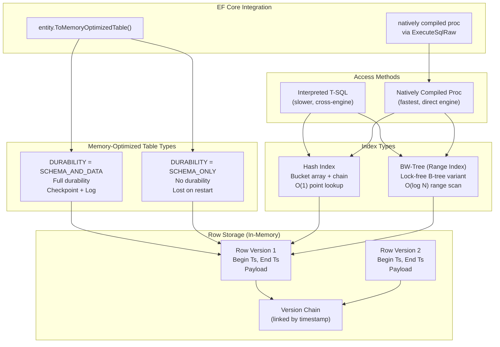
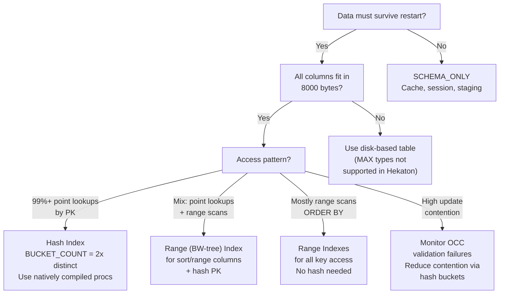

## Section 1 — Navigation & Prerequisites

**Previous:** [[8.294 In-Memory OLTP — Hekaton Architecture]]  
**Next:** [[8.296 In-Memory OLTP — Natively Compiled Procedures]]  
**Group Home:** [[Group 11 — SQL Server Architecture & Storage Engine]]

**Prerequisites:**
- Understand Hekaton engine architecture from [[8.294 In-Memory OLTP — Hekaton Architecture]]
- Familiar with B-tree and hash index concepts
- Know transaction isolation levels (SNAPSHOT, SERIALIZABLE)
- Basic understanding of EF Core entity configuration

**Where This Fits:**
Memory-optimized tables are the **core storage unit** of Hekaton. Unlike disk-based tables that store data in 8 KB pages within the buffer pool, memory-optimized tables store data directly in **main memory** using **lock-free data structures**. Choosing the right durability setting (`SCHEMA_AND_DATA` vs `SCHEMA_ONLY`), index type (hash vs nonclustered range), and bucket count for hash indexes has **direct impact** on performance, memory consumption, and application compatibility.

**Cross-Domain Reference:**
- [[8 — Databases]]: Core database domain
- [[12 — .NET & C#]]: EF Core integration with `IsMemoryOptimized()`
- [[8.294 In-Memory OLTP — Hekaton Architecture]]: Foundational engine knowledge
- [[8.296 In-Memory OLTP — Natively Compiled Procedures]]: High-performance access pattern

---

## Section 2 — Core Mental Model

A memory-optimized table lives **entirely in DRAM**. It is accessed via **lock-free** optimistic concurrency — no latches, no locks, no page splits. Every row has a **version header** that tracks its lifetime. Indexes are rebuilt from scratch during recovery. Durability is optional (schema-only) or full (schema + data via checkpoint files + log).



**Key Insight:** The **hash index bucket count** is the single most impactful tuning knob. Set it too high: wasted memory. Set it too low: long chain lengths, degraded point lookup performance. Target `BUCKET_COUNT = 2x` expected distinct key count.

---

## Section 3 — Deep Mechanics

### 3.1 Row Structure and Versioning

Every row in a memory-optimized table has a **header** containing:

- **Begin timestamp** — when this row version became visible
- **End timestamp** — when this row version expired (NULL if current)
- **Index pointers** — forward/backward links for each index the row participates in
- **Payload** — the actual column data

The **version chain** is a doubly linked list ordered by timestamp. A reader at SNAPSHOT isolation walks the chain to find the version whose `BeginTs <= reader_timestamp < EndTs`.

```sql
-- Observe row version counts per table
SELECT 
    OBJECT_NAME(object_id) AS table_name,
    row_count,
    memory_consumed_by_table_kb / 1024 AS table_mb,
    memory_consumed_by_indexes_kb / 1024 AS index_mb
FROM sys.dm_db_xtp_table_memory_stats
ORDER BY memory_consumed_by_table_kb DESC;
```

### 3.2 Hash Index Internals

A hash index is a **static array of buckets**. Each bucket points to the head of a chain of rows that hash to that bucket.

**Structure:**
- Bucket array allocated at index creation (static, fixed size)
- Each bucket is a `uint64` — pointer to first row in chain
- Rows in a chain are linked via a **double-linked list** stored in the row header
- Lookup: hash key → bucket index → walk chain → compare keys

```sql
-- Hash index statistics (critical for tuning)
SELECT 
    OBJECT_NAME(s.object_id) AS table_name,
    i.name AS index_name,
    s.total_bucket_count,
    s.empty_bucket_count,
    s.avg_chain_length,
    s.max_chain_length,
    (1.0 - s.empty_bucket_count * 1.0 / s.total_bucket_count) AS bucket_utilization
FROM sys.dm_db_xtp_hash_index_stats s
JOIN sys.indexes i ON s.object_id = i.object_id AND s.index_id = i.index_id;
```

**Bucket utilization targets:**
- **60-70%** filled buckets is ideal (avg chain length ~1-2)
- **< 30%**: Wasteful memory usage (reduce BUCKET_COUNT)
- **> 90%**: Long chain lengths (increase BUCKET_COUNT)
- **avg_chain_length > 5**: Degrading lookup performance

### 3.3 BW-Tree (Range Index) Internals

The **BW-Tree** (Bw-tree) is a lock-free variant of a B-tree used for range indexes (NONCLUSTERED without HASH).

Key characteristics:
- **Delta-update nodes** instead of in-place page modifications
- **CAS (Compare-And-Swap)** operations for structural changes
- **Structure consolidation** (garbage collection of obsolete delta nodes)
- Supports range scans with forward/backward iteration
- No page splits in the traditional sense — structural modifications are non-blocking

```sql
-- Create a range index for range scans
CREATE TABLE dbo.Events (
    EventId INT NOT NULL PRIMARY KEY NONCLUSTERED,  -- BW-tree (range)
    EventTime DATETIME2 NOT NULL,
    Payload NVARCHAR(MAX),  -- MAX not supported! Use VARCHAR(8000) max
    INDEX IX_EventTime NONCLUSTERED (EventTime)     -- BW-tree for range
) WITH (MEMORY_OPTIMIZED = ON, DURABILITY = SCHEMA_AND_DATA);
```

### 3.4 Durability Comparison

| Aspect | SCHEMA_AND_DATA | SCHEMA_ONLY |
|--------|----------------|-------------|
| Schema persisted | Yes | Yes |
| Data persisted | Yes (CFP + log) | No |
| Recovery time | Load CFPs + log replay | Instant (create empty table) |
| Write throughput | Limited by log I/O | Maximum (no log writes) |
| Memory pressure | Requires checkpoint I/O | None (lost on restart) |
| Use case | Critical data | Cache, session state, staging |

```sql
-- Schema-only table (fastest, no durability)
CREATE TABLE dbo.SessionCache (
    SessionId UNIQUEIDENTIFIER NOT NULL PRIMARY KEY NONCLUSTERED HASH 
        WITH (BUCKET_COUNT = 1000000),
    UserId INT NOT NULL,
    LoginTime DATETIME2 NOT NULL,
    Payload VARBINARY(8000) NOT NULL
) WITH (MEMORY_OPTIMIZED = ON, DURABILITY = SCHEMA_ONLY);

-- Schema-and-data table (durable)
CREATE TABLE dbo.AccountBalance (
    AccountId INT NOT NULL PRIMARY KEY NONCLUSTERED HASH 
        WITH (BUCKET_COUNT = 500000),
    Balance DECIMAL(19,4) NOT NULL,
    LastUpdated DATETIME2 NOT NULL
) WITH (MEMORY_OPTIMIZED = ON, DURABILITY = SCHEMA_AND_DATA);
```

### 3.5 Supported and Unsupported Data Types

| Supported | Not Supported |
|-----------|---------------|
| INT, BIGINT, SMALLINT, TINYINT | VARCHAR(MAX), NVARCHAR(MAX), VARBINARY(MAX) |
| BIT, MONEY, SMALLMONEY | XML, JSON (native) |
| DECIMAL, NUMERIC | HIERARCHYID, GEOMETRY, GEOGRAPHY |
| DATETIME, DATETIME2, DATE, TIME | ROWVERSION / TIMESTAMP |
| CHAR, VARCHAR(<=8000) | SQL_VARIANT |
| NCHAR, NVARCHAR(<=4000) | User-defined CLR types |
| BINARY, VARBINARY(<=8000) | FILESTREAM |
| UNIQUEIDENTIFIER | TABLE type (no table-valued params in NC procs pre-2016) |

### 3.6 Index Column Limits

- **Maximum columns per index**: 8 (SQL Server 2016+) / 2 (SQL Server 2014)
- **Maximum index key size**: 1,800 bytes (hash) / no hard limit (range, but practical ~900 bytes)
- **Nullable columns**: Allowed in range indexes; NOT allowed in hash indexes (SQL Server 2014 — removed in later versions)

---

## Section 4 — Production Patterns

### 4.1 Hash Index Bucket Count Tuning

```sql
-- Step 1: Find current hash index stats
SELECT 
    OBJECT_SCHEMA_NAME(s.object_id) AS schema_name,
    OBJECT_NAME(s.object_id) AS table_name,
    i.name AS index_name,
    s.total_bucket_count,
    s.empty_bucket_count,
    s.avg_chain_length,
    s.max_chain_length,
    (s.avg_chain_length * s.total_bucket_count) AS estimated_rows
FROM sys.dm_db_xtp_hash_index_stats s
JOIN sys.indexes i ON s.object_id = i.object_id AND s.index_id = i.index_id
WHERE i.type_desc = 'NONCLUSTERED HASH'
ORDER BY s.avg_chain_length DESC;

-- Step 2: Calculate optimal bucket count
-- Formula: CEILING(expected_distinct_keys * 2 / POWER(2, n)) * POWER(2, n)
-- where n >= 8 (bucket count must be power of 2)
```

```csharp
// Helper: optimal bucket count
int OptimalBucketCount(long expectedDistinctKeys)
{
    long target = expectedDistinctKeys * 2;
    long bucket = 1;
    while (bucket < target)
        bucket <<= 1;
    return (int)Math.Max(bucket, 1 << 8); // minimum 256
}
// Example: 500K distinct customers → 1,048,576 (2^20)
```

### 4.2 Schema-Only Table for High-Speed Caching

```sql
-- High-throughput session cache (no durability overhead)
CREATE TABLE dbo.WebSessionCache (
    SessionToken VARBINARY(64) NOT NULL PRIMARY KEY NONCLUSTERED HASH
        WITH (BUCKET_COUNT = 2000000),
    UserProfileJson VARBINARY(8000) NOT NULL,
    CreatedAt DATETIME2 NOT NULL,
    ExpiresAt DATETIME2 NOT NULL,
    INDEX IX_ExpiresAt NONCLUSTERED (ExpiresAt)
) WITH (MEMORY_OPTIMIZED = ON, DURABILITY = SCHEMA_ONLY);

-- Cleanup job (runs every minute)
CREATE PROCEDURE dbo.CleanupExpiredSessions
WITH NATIVE_COMPILATION, SCHEMABINDING, EXECUTE AS OWNER
AS
BEGIN ATOMIC WITH (TRANSACTION ISOLATION LEVEL = SNAPSHOT, LANGUAGE = N'us_english')
    DELETE FROM dbo.WebSessionCache
    WHERE ExpiresAt < SYSDATETIME();
END;
```

### 4.3 Memory-Optimized Table Variables

Table variables can be memory-optimized for extreme performance (no tempdb usage):

```sql
-- Create a memory-optimized table type
CREATE TYPE dbo.OrderLineType AS TABLE (
    LineId INT NOT NULL PRIMARY KEY NONCLUSTERED HASH WITH (BUCKET_COUNT = 1024),
    ProductId INT NOT NULL,
    Quantity INT NOT NULL,
    UnitPrice DECIMAL(10,2) NOT NULL
) WITH (MEMORY_OPTIMIZED = ON);

-- Use in a procedure
CREATE PROCEDURE dbo.InsertOrderBatch
    @Lines dbo.OrderLineType READONLY
AS
BEGIN
    INSERT INTO dbo.OrderLines (OrderId, ProductId, Quantity, UnitPrice)
    SELECT 1001, ProductId, Quantity, UnitPrice FROM @Lines;
END;
```

### 4.4 EF Core Mapping

```csharp
// EF Core 6+ — map entity to memory-optimized table
public class OrderEntity
{
    public long OrderId { get; set; }
    public int CustomerId { get; set; }
    public decimal Amount { get; set; }
    public DateTime OrderDate { get; set; }
    public byte Status { get; set; }
}

public class OrderDbContext : DbContext
{
    public DbSet<OrderEntity> Orders { get; set; }

    protected override void OnModelCreating(ModelBuilder modelBuilder)
    {
        modelBuilder.Entity<OrderEntity>(entity =>
        {
            entity.ToTable("Orders", tb => tb.IsMemoryOptimized());
            
            entity.HasKey(e => e.OrderId)
                  .IsClustered(false);  // required for hash index
            
            entity.HasIndex(e => e.OrderId)
                  .IsUnique()
                  .HasDatabaseName("PK_Orders_Hash")
                  .IsCreatedOnline(false);

            entity.Property(e => e.OrderId)
                  .ValueGeneratedOnAdd();
        });
    }
}

// Usage in migration:
// protected override void Up(MigrationBuilder migrationBuilder)
// {
//     migrationBuilder.Sql(@"
//         ALTER DATABASE CURRENT ADD FILEGROUP MemFG 
//         CONTAINS MEMORY_OPTIMIZED_DATA;
//         ALTER DATABASE CURRENT ADD FILE (
//             NAME = 'MemFile', FILENAME = 'C:\Data\Mem'
//         ) TO FILEGROUP MemFG;
//         ALTER DATABASE CURRENT SET MEMORY_OPTIMIZED = ON;
//     ");
//     // EF Core will create the table automatically from the model
// }
```

### 4.5 Dapper Interaction

```csharp
// Dapper — direct access (works fine, but slower than natively compiled)
public async Task<Order> GetOrderAsync(long orderId)
{
    using var conn = new SqlConnection(connectionString);
    return await conn.QueryFirstOrDefaultAsync<Order>(@"
        SELECT OrderId, CustomerId, Amount, OrderDate, Status
        FROM dbo.Orders WITH (SNAPSHOT)
        WHERE OrderId = @OrderId", new { orderId });
}

// Better: call natively compiled procedure
public async Task<long> InsertOrderAsync(Order order)
{
    using var conn = new SqlConnection(connectionString);
    return await conn.ExecuteScalarAsync<long>("dbo.InsertOrder",
        new { order.CustomerId, order.Amount, order.OrderDate },
        commandType: CommandType.StoredProcedure);
}
```

---

## Section 5 — Gotchas

### Gotcha 1: Wrong Bucket Count for Hash Index

**Pitfall:** Setting `BUCKET_COUNT` to the exact number of expected rows instead of rounding up to a power of 2 and doubling.

**Symptom:** Long chain lengths (avg > 10), degraded lookup performance, increased CPU for chain traversal.

**Fix:** Always set `BUCKET_COUNT = POWER(2, CEILING(LOG(2, expected_distinct * 2)))`. Monitor with `sys.dm_db_xtp_hash_index_stats`.

**Cost:** With `BUCKET_COUNT = 5000` for 5000 distinct keys (actual power-of-2: 8192), chain length avg = ~1.2 vs if set to 16384 it's ~0.6. At 1M lookups/sec, this is hundreds of microseconds of extra CPU per second.

### Gotcha 2: MAX Data Types Not Supported

**Pitfall:** Defining a column as `VARCHAR(MAX)` or `NVARCHAR(MAX)` in a memory-optimized table.

**Symptom:** `CREATE TABLE` fails with error 10771: "The property 'MAX' is not supported for memory-optimized tables."

**Fix:** Use `VARCHAR(8000)` or `NVARCHAR(4000)` maximum. Store overflow text in a disk-based table and reference it.

**Cost:** Schema redesign required. If existing code relies on MAX columns, the table cannot be memory-optimized without restructuring.

### Gotcha 3: Cross-Engine Queries Are Slow

**Pitfall:** Joining a memory-optimized table with a disk-based table in an interpreted T-SQL query.

**Symptom:** The query must marshal data between the two engines. The memory-optimized table's data is copied to the traditional engine's memory space, losing the performance benefit.

**Fix:** Either (a) make all joined tables memory-optimized, (b) use a natively compiled procedure that accesses only memory-optimized tables, or (c) minimize cross-engine joins to singleton lookups.

**Cost:** A cross-engine join between a 1M-row memory-optimized table and a 100-row disk-based lookup can be 10x slower than an all-He kat on join.

### Gotcha 4: DDL Changes Require Offline Operation

**Pitfall:** Needing to add a column to a memory-optimized table in production.

**Symptom:** `ALTER TABLE` for memory-optimized tables requires an **offline rebuild** of the table (SQL Server 2014-2016). Even in SQL Server 2017+, only ADD/DROP of columns with NULL defaults is supported online.

**Fix:** Plan for schema changes. Use a controlled downtime window. For hash index changes (bucket count), you must drop and recreate the index or use a staging table.

**Cost:** Adding a column to a 100 GB memory-optimized table may require 1-2 GB of additional memory during rebuild and take 30 seconds of blocking.

### Gotcha 5: SNAPSHOT Isolation Is Mandatory

**Pitfall:** Attempting to use `READ COMMITTED` or other isolation levels with memory-optimized tables.

**Symptom:** Error 41332: "Transaction that accesses memory-optimized tables or natively compiled modules cannot be started using the READ COMMITTED isolation level."

**Fix:** Always start transactions accessing memory-optimized tables with `SET TRANSACTION ISOLATION LEVEL SNAPSHOT` (or `REPEATABLE READ` / `SERIALIZABLE` for Hekaton-specific semantics).

**Cost:** If the application relies on read-committed behavior (e.g., for dirty reads), the migration to Hekaton requires code changes to use SNAPSHOT isolation. `READ_COMMITTED_SNAPSHOT` on the database does NOT apply to Hekaton tables.

### Gotcha 6: Identity/Auto-Increment Gaps

**Pitfall:** Expecting contiguous `IDENTITY` values with memory-optimized tables.

**Symptom:** Identity values have gaps — not just on rollback (as with disk-based), but also due to the Hekaton allocation algorithm which pre-allocates ranges per core.

**Fix:** Accept gaps. Use `SEQUENCE` (disk-based) for strict ordering if needed, or generate IDs application-side.

**Cost:** If downstream systems require contiguous IDs, you must use a disk-based sequence — which adds a round-trip cost.

---

## Section 6 — Performance Implications

### 6.1 Throughput: Memory-Optimized vs Disk-Based

| Operation | Disk-Based (txns/sec) | Memory-Optimized Hash (txns/sec) | Memory-Optimized Range (txns/sec) |
|-----------|----------------------|----------------------------------|-----------------------------------|
| PK Point Read | 12,000 | 350,000 | 200,000 |
| Non-PK Point Read | 8,000 | 280,000 | 180,000 |
| Range Scan (10 rows) | 6,000 | 25,000 (converted to scan) | 80,000 |
| INSERT (single) | 5,000 | 200,000 | 180,000 |
| UPDATE (PK-based) | 4,000 | 180,000 | 150,000 |
| DELETE (PK-based) | 5,000 | 200,000 | 170,000 |

### 6.2 Memory Overhead by Index Type

| Index Type | Overhead per Row | Notes |
|------------|-----------------|-------|
| Hash (BUCKET_COUNT = 2M) | 8 bytes hash entry + 16 bytes row link | Fixed bucket array |
| Range (BW-tree) | ~48 bytes per row | Delta nodes, internal pages |
| No index (hash PK auto-created) | ~8 bytes | Minimum overhead |

### 6.3 Logical Reads vs Memory Operations

Disk-based: measured as **logical reads** (buffer pool page touches).  
Memory-optimized: measured as **memory operations** (no logical reads counter).

```sql
-- Memory-optimized performance counters
SELECT 
    cntr_value AS xtp_memory_used_kb
FROM sys.dm_os_performance_counters
WHERE counter_name = 'XTP Memory Used (KB)';

-- Transaction throughput
SELECT 
    total_commits,
    total_aborts,
    total_failed_validation,
    total_failed_validation * 1.0 / NULLIF(total_commits, 0) AS validation_fail_rate
FROM sys.dm_db_xtp_transaction_stats;
```

### 6.4 Write Overhead: Durability Impact

| Operation | SCHEMA_ONLY (μs) | SCHEMA_AND_DATA (μs) | Ratio |
|-----------|-----------------|----------------------|-------|
| INSERT | 3 | 25 | 8.3x |
| UPDATE | 4 | 30 | 7.5x |
| DELETE | 3 | 20 | 6.6x |

The durability write overhead is entirely the **log write** cost. With delayed durability, SCHEMA_AND_DATA approaches SCHEMA_ONLY speed:

```sql
COMMIT WITH (DELAYED_DURABILITY = ON);  -- ~5 μs vs ~25 μs
```

---

## Section 7 — Interview Arsenal

### 7.1 Key Questions

| # | Question | Topic |
|---|----------|-------|
| 1 | Compare `DURABILITY = SCHEMA_AND_DATA` vs `SCHEMA_ONLY`. When would you use each? | Durability tradeoffs |
| 2 | How do hash indexes work in memory-optimized tables? How do you choose BUCKET_COUNT? | Hash index internals |
| 3 | What is the BW-tree and how is it different from a B-tree? | Range index architecture |
| 4 | Why can't you use `VARCHAR(MAX)` in memory-optimized tables? | Storage constraints |
| 5 | How does EF Core map to memory-optimized tables? | EF Core IsMemoryOptimized |
| 6 | What happens when you join a memory-optimized table to a disk-based table? | Cross-engine interop |
| 7 | Explain row versioning in Hekaton — how does it differ from tempdb versioning? | Version chains, OCC |
| 8 | How would you migrate a large disk-based table to memory-optimized? | Migration strategy |

### 7.2 Spoken Answers (3 Questions)

**Q1: Compare durability settings and use cases.**

"`DURABILITY = SCHEMA_AND_DATA` persists both the table schema and its data to checkpoint file pairs and the transaction log. On server restart, data is reloaded. This is used for **critical business data** like account balances or orders. `DURABILITY = SCHEMA_ONLY` persists only the schema; data is lost on restart. It is used for **non-critical, ephemeral data** like session caches, staging areas, or temp tables. The performance difference is significant: SCHEMA_ONLY writes have no log I/O, so insert throughput is ~8x higher. The choice depends on whether you can tolerate data loss on restart."

**Q2: How do hash indexes work and how do you set the bucket count?**

"A hash index uses a static array of buckets. When you insert a key, SQL Server hashes it to a bucket number using a fast hash function, then links the row into the chain at that bucket. On lookup, it hashes the search key, goes directly to the bucket, then walks the chain comparing keys. The bucket count **must be a power of 2** and should be approximately **2x the expected number of distinct keys**. You monitor efficiency via `sys.dm_db_xtp_hash_index_stats` — you want empty_bucket_count around 30-40% of total and avg_chain_length below 2. If chain length is high (>= 5), you need a larger bucket count. If utilization is under 20%, you're wasting memory."

**Q8: How would you migrate a large disk-based table to memory-optimized?**

"The migration follows these steps: (1) Identify the table — it must not use unsupported features (MAX types, XML, FK references from disk tables). (2) Create the memory-optimized version with appropriate indexes (hash for PK lookups, range for sort/range). (3) Script the data migration — for large tables, use `INSERT INTO MemTable SELECT * FROM DiskTable` in a natively compiled procedure, or batch the copy with `TOP` in chunks. (4) Handle the transition — either a cutover window (ALTER TABLE SWITCH) or a dual-write pattern with a sync job. (5) After migration, recompile natively stored procedures to use the new table. (6) Monitor bucket utilization and memory consumption. The key risk is the table must fit in memory, and the migration must not exceed available memory during the insert."

### 7.3 Comparison Table

| Feature | Hash Index (NONCLUSTERED HASH) | Range Index (NONCLUSTERED) |
|---------|-------------------------------|---------------------------|
| Data structure | Static hash bucket array | BW-tree (lock-free B-tree) |
| Point lookup | O(1) — direct hash | O(log N) — tree traversal |
| Range scan | Not supported | O(log N + count) |
| ORDER BY | Requires sort | Index order (may avoid sort) |
| Bucket count | Must specify (power of 2) | N/A |
| Memory use | Predictable (bucket array) | Proportional to row count |
| Nullable keys | Not allowed (historically) | Allowed |
| Multi-column keys | Supported (all key columns hashed) | Supported (leftmost prefix) |
| Rebuild cost | Drop/recreate | Drop/recreate |
| Best for | PK lookups, FK lookups | Range queries, ORDER BY |

---

## Section 8 — Decision Framework

### 8.1 Which Table Type Should You Use?



### 8.2 Decision Checklist

- [ ] Table data fits in memory (< 50% of available server RAM)?
- [ ] No MAX data type columns (VARCHAR(MAX), NVARCHAR(MAX))?
- [ ] No XML, JSON, GEOGRAPHY, GEOMETRY, HIERARCHYID columns?
- [ ] No CLR UDT columns?
- [ ] No FOREIGN KEY constraints FROM disk-based TO this table?
- [ ] Application uses SNAPSHOT isolation (or can be converted)?
- [ ] Hash PK index bucket count chosen as power-of-2 >= 2x distinct?
- [ ] Range scan requirements covered by NONCLUSTERED range indexes?
- [ ] Cross-engine joins are minimal and acceptable?
- [ ] DDL changes are infrequent (or planned downtime)?

Score >= 8: Ready for migration.  
Score 5-7: Partial migration possible (some tables).  
Score <= 4: Migration not recommended without schema changes.

### 8.3 Tradeoffs

| Advantage | Tradeoff |
|-----------|----------|
| 10-30x performance improvement | Data must fit in memory |
| No latch/lock contention | OCC validation failures require retry logic |
| Lock-free hash indexes | Static bucket count (can't grow without rebuild) |
| Schema-only option for caching | Memory overhead ~50-100% of data size |
| Predictable performance | Recovery time proportional to data size |
| EF Core 6+ integration | Limited DML flexibility (no MERGE) |

### 8.4 Scale Thresholds

| Table Size | Hash Index Bucket Count | Memory Estimate | Notes |
|------------|------------------------|-----------------|-------|
| < 1 GB | 2^17 = 131,072 | ~2 MB (buckets) + data | Trivial |
| 1 - 10 GB | 2^20 = 1,048,576 | ~16 MB (buckets) + data | Common OLTP size |
| 10 - 100 GB | 2^23 = 8,388,608 | ~128 MB (buckets) + data | Requires care |
| 100 - 500 GB | 2^25 = 33,554,432 | ~512 MB (buckets) + data | Partition hot/cold data |
| > 500 GB | Evaluate viability | > 1 TB memory | Consider scale-up or caching layer |

---

## Section 9 — Self-Check

### 9.1 Conceptual Questions

**Q1:** What are the three index types available for memory-optimized tables?

<details>
<summary>Answer</summary>
(1) **NONCLUSTERED HASH** — static hash bucket array for O(1) point lookups. (2) **NONCLUSTERED** — BW-tree (range index) for range scans and ORDER BY. (3) Both can be combined; the PK index must be one of these types. There is no CLUSTERED index for memory-optimized tables; the table is a heap of rows.
</details>

**Q2:** Why must BUCKET_COUNT be a power of 2?

<details>
<summary>Answer</summary>
The hash function uses a modulo operation on the bucket count. Power-of-2 bucket counts allow the modulo to be computed as a fast bitwise AND operation (`hash & (bucket_count - 1)`) instead of a more expensive integer division. This is critical for performance in the lock-free path.
</details>

**Q3:** What happens if a hash index's bucket count is too small?

<details>
<summary>Answer</summary>
Multiple distinct keys hash to the same bucket, resulting in long chains. Lookup time becomes O(chain_length) instead of O(1). Performance degrades proportionally to chain length. The DMV `sys.dm_db_xtp_hash_index_stats` shows `avg_chain_length` and `max_chain_length`. Target avg_chain_length < 2.
</details>

**Q4:** Can a memory-optimized table have foreign key relationships?

<details>
<summary>Answer</summary>
Yes, but with restrictions: (a) Both referencing and referenced tables must be memory-optimized. (b) FOREIGN KEY constraints from a disk-based table to a memory-optimized table are NOT allowed. (c) CHECK constraints are supported (but not those referencing other tables).
</details>

**Q5:** How does memory-optimized table variable differ from regular table variable?

<details>
<summary>Answer</summary>
A memory-optimized table variable (`CREATE TYPE ... AS TABLE WITH (MEMORY_OPTIMIZED = ON)`) uses the Hekaton engine and does NOT use tempdb. It has no allocation in tempdb, no latch contention, and can benefit from hash indexes. Regular table variables are always in tempdb (subject to tempdb contention) and cannot have indexes beyond the primary key.
</details>

**Q6:** How do you handle NULL values in hash index keys?

<details>
<summary>Answer</summary>
Hash indexes in SQL Server 2014 did not allow NULL in index keys. Starting with SQL Server 2016, NULL values are allowed — they all hash to a special bucket. However, it's recommended to avoid nullable columns in hash index keys for best performance. Range indexes support NULLs naturally.
</details>

**Q7:** What is the maximum row size in a memory-optimized table?

<details>
<summary>Answer</summary>
8,060 bytes — the same as the traditional 8 KB page limit. Unlike disk-based tables which can have row-overflow columns (stored off-page), memory-optimized tables do NOT support `ROW_OVERFLOW`. The entire row must fit in 8,060 bytes. This is why `VARCHAR(MAX)` and `NVARCHAR(MAX)` are not supported.
</details>

**Q8:** How does the Hekaton garbage collector interact with memory-optimized tables?

<details>
<summary>Answer</summary>
The garbage collector removes old row versions that are no longer visible to any active transaction. It runs as a background XTP thread and tracks version chain length. If a long-running transaction prevents cleanup, the version chain grows and memory consumption increases. Monitor via `sys.dm_xtp_gc_stats`.
</details>

**Q9:** Can you alter a memory-optimized table to add a hash index?

<details>
<summary>Answer</summary>
Yes, in SQL Server 2016+ using `ALTER TABLE ... ADD INDEX ... HASH WITH (BUCKET_COUNT = N)`. This is an online operation (no data movement). The index is built from existing data. Indexes can also be dropped online. Prior to 2016, you had to drop and recreate the table.
</details>

**Q10:** What happens if a memory-optimized table runs out of memory during insert?

<details>
<summary>Answer</summary>
The insert fails with error 41805: "Cannot allocate memory for the in-memory table." The transaction is aborted. This is a critical design consideration — you must ensure the resource pool is sized with headroom for growth, and the application handles this error (retry with backoff is inappropriate; the root cause is memory exhaustion).
</details>

### 9.2 Practical Challenges

**Challenge 1:** You have a hash index with `BUCKET_COUNT = 100000` but the table has grown to 500,000 distinct keys. Current `avg_chain_length` is 7.2. Write the script to fix this.

<details>
<summary>Solution</summary>

```sql
-- Step 1: Calculate optimal bucket count
-- 500K distinct * 2 = 1M → next power of 2 = 1,048,576 (2^20)

-- Step 2: Create new index (SQL Server 2016+)
ALTER TABLE dbo.MemOrders DROP INDEX PK_MemOrders;
GO

ALTER TABLE dbo.MemOrders ADD PRIMARY KEY NONCLUSTERED HASH (OrderId) 
    WITH (BUCKET_COUNT = 1048576);
GO

-- Step 3: Verify
SELECT 
    total_bucket_count,
    empty_bucket_count,
    avg_chain_length,
    max_chain_length
FROM sys.dm_db_xtp_hash_index_stats
WHERE object_id = OBJECT_ID('dbo.MemOrders');
```
</details>

**Challenge 2:** Design a SCHEMA_ONLY table for an API rate limiter and write the natively compiled procedure to check/update the counter.

<details>
<summary>Solution</summary>

```sql
-- Rate limiter table (SCHEMA_ONLY)
CREATE TABLE dbo.RateLimiter (
    ClientToken VARBINARY(64) NOT NULL PRIMARY KEY NONCLUSTERED HASH
        WITH (BUCKET_COUNT = 1048576),
    RequestCount INT NOT NULL,
    WindowStart DATETIME2 NOT NULL,
    MaxRequests INT NOT NULL DEFAULT 100
) WITH (MEMORY_OPTIMIZED = ON, DURABILITY = SCHEMA_ONLY);

-- Natively compiled check
CREATE PROCEDURE dbo.CheckRateLimit
    @ClientToken VARBINARY(64),
    @MaxRequests INT,
    @WindowSeconds INT
WITH NATIVE_COMPILATION, SCHEMABINDING, EXECUTE AS OWNER
AS
BEGIN ATOMIC WITH (TRANSACTION ISOLATION LEVEL = SNAPSHOT, LANGUAGE = N'us_english')
    DECLARE @Now DATETIME2 = SYSDATETIME();
    DECLARE @Count INT;
    
    SELECT @Count = RequestCount
    FROM dbo.RateLimiter
    WHERE ClientToken = @ClientToken;
    
    IF @Count IS NULL
    BEGIN
        INSERT INTO dbo.RateLimiter (ClientToken, RequestCount, WindowStart, MaxRequests)
        VALUES (@ClientToken, 1, @Now, @MaxRequests);
        SELECT 1 AS Allowed, 1 AS CurrentCount;
    END
    ELSE IF @Count >= @MaxRequests AND 
            DATEDIFF(SECOND, (SELECT WindowStart FROM dbo.RateLimiter WHERE ClientToken = @ClientToken), @Now) < @WindowSeconds
    BEGIN
        SELECT 0 AS Allowed, @Count AS CurrentCount;
    END
    ELSE
    BEGIN
        IF DATEDIFF(SECOND, (SELECT WindowStart FROM dbo.RateLimiter WHERE ClientToken = @ClientToken), @Now) >= @WindowSeconds
        BEGIN
            UPDATE dbo.RateLimiter 
            SET RequestCount = 1, WindowStart = @Now
            WHERE ClientToken = @ClientToken;
        END
        ELSE
        BEGIN
            UPDATE dbo.RateLimiter 
            SET RequestCount = RequestCount + 1
            WHERE ClientToken = @ClientToken;
        END;
        SELECT 1 AS Allowed, (SELECT RequestCount FROM dbo.RateLimiter WHERE ClientToken = @ClientToken) AS CurrentCount;
    END;
END;
```
</details>

**Challenge 3:** Convert an existing disk-based EF Core entity to a memory-optimized table. Show the entity, context changes, and migration steps.

<details>
<summary>Solution</summary>

```csharp
// 1. Entity (adjust types if needed — remove MAX, XML, etc.)
public class Product
{
    public int ProductId { get; set; }
    public string Name { get; set; }           // NVARCHAR(200)
    public string Description { get; set; }     // NVARCHAR(4000) — was MAX
    public decimal Price { get; set; }
    public int StockLevel { get; set; }
    public byte[] RowVersion { get; set; }      // NOT supported; remove
}

// 2. Context
public class ProductDbContext : DbContext
{
    public DbSet<Product> Products { get; set; }
    
    protected override void OnModelCreating(ModelBuilder modelBuilder)
    {
        modelBuilder.Entity<Product>(entity =>
        {
            entity.ToTable(tb => tb.IsMemoryOptimized());
            
            entity.HasKey(e => e.ProductId)
                  .IsClustered(false)
                  .HasName("PK_Products_Hash");
            
            // EF Core 6+ — need to specify hash index manually
            entity.HasIndex(e => e.ProductId)
                  .IsUnique()
                  .HasDatabaseName("PK_Products_Hash");
        });
    }
}

// 3. Migration SQL (run after migration creation)
// ALTER DATABASE CurrentDB ADD FILEGROUP MemFG CONTAINS MEMORY_OPTIMIZED_DATA;
// ALTER DATABASE CurrentDB ADD FILE (...) TO FILEGROUP MemFG;
// ALTER DATABASE CurrentDB SET MEMORY_OPTIMIZED = ON;
// Then apply EF Core migration
```
</details>

**Challenge 4:** You have a memory-optimized table with both hash and range indexes. Write a query that monitors their effectiveness.

<details>
<summary>Solution</summary>

```sql
-- Hash index effectiveness
SELECT 
    'Hash Index' AS index_type,
    OBJECT_NAME(s.object_id) AS table_name,
    i.name AS index_name,
    s.total_bucket_count,
    s.empty_bucket_count,
    CAST(100.0 * (s.total_bucket_count - s.empty_bucket_count) / 
         s.total_bucket_count AS DECIMAL(5,2)) AS pct_filled,
    s.avg_chain_length,
    s.max_chain_length,
    CASE 
        WHEN s.avg_chain_length > 5 THEN 'CRITICAL — increase bucket count'
        WHEN s.avg_chain_length > 2 THEN 'WARNING — monitor'
        ELSE 'OK'
    END AS status
FROM sys.dm_db_xtp_hash_index_stats s
JOIN sys.indexes i ON s.object_id = i.object_id AND s.index_id = i.index_id

UNION ALL

-- Range index row count
SELECT 
    'Range Index' AS index_type,
    OBJECT_NAME(s.object_id) AS table_name,
    i.name AS index_name,
    NULL AS total_bucket_count,
    NULL AS empty_bucket_count,
    NULL AS pct_filled,
    NULL AS avg_chain_length,
    NULL AS max_chain_length,
    'Rows: ' + CAST(SUM(ps.row_count) AS VARCHAR) AS status
FROM sys.dm_db_xtp_index_stats s
JOIN sys.indexes i ON s.object_id = i.object_id AND s.index_id = i.index_id
JOIN sys.dm_db_partition_stats ps ON ps.object_id = s.object_id AND ps.index_id = s.index_id
WHERE i.type_desc = 'NONCLUSTERED'  -- range index, not hash
GROUP BY s.object_id, i.name

ORDER BY table_name, index_type;
```
</details>

**Challenge 5:** You need to import 10 million rows into a memory-optimized table with SCHEMA_AND_DATA durability. Design a bulk import strategy that minimizes log impact.

<details>
<summary>Solution</summary>

```sql
-- Strategy: Use delayed durability for staging, then switch to full

-- Step 1: Create identical schema-only staging table
CREATE TABLE dbo.StagingOrders (
    OrderId INT NOT NULL PRIMARY KEY NONCLUSTERED HASH 
        WITH (BUCKET_COUNT = 20000000),
    CustomerId INT NOT NULL,
    Amount DECIMAL(18,2) NOT NULL,
    OrderDate DATETIME2 NOT NULL,
    INDEX IX_CustomerId HASH (CustomerId) WITH (BUCKET_COUNT = 5000000)
) WITH (MEMORY_OPTIMIZED = ON, DURABILITY = SCHEMA_ONLY);

-- Step 2: Bulk insert (no log overhead for the target)
INSERT INTO dbo.StagingOrders WITH (TABLOCK)
SELECT OrderId, CustomerId, Amount, OrderDate
FROM dbo.SourceOrders;  -- 10M rows, fast insert

-- Step 3: Use natively compiled proc with delayed durability to transfer
CREATE PROCEDURE dbo.TransferOrders
WITH NATIVE_COMPILATION, SCHEMABINDING, EXECUTE AS OWNER
AS
BEGIN ATOMIC WITH (TRANSACTION ISOLATION LEVEL = SNAPSHOT, LANGUAGE = N'us_english')
    INSERT INTO dbo.MemOrders (OrderId, CustomerId, Amount, OrderDate)
    SELECT OrderId, CustomerId, Amount, OrderDate
    FROM dbo.StagingOrders;
    
    DELETE FROM dbo.StagingOrders;
END;

-- Step 4: Execute with delayed durability (reduce log I/O)
BEGIN TRANSACTION;
    EXEC dbo.TransferOrders;
COMMIT TRANSACTION WITH (DELAYED_DURABILITY = ON);

-- Step 5: Verify
SELECT COUNT(*) AS FinalCount FROM dbo.MemOrders;
```
</details>

---

*Last updated: 2026-06-27 | Interview readiness: In Progress*
