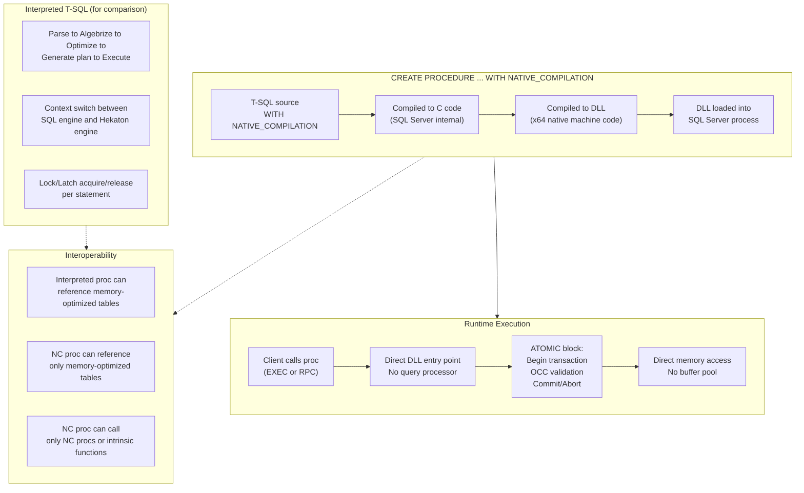
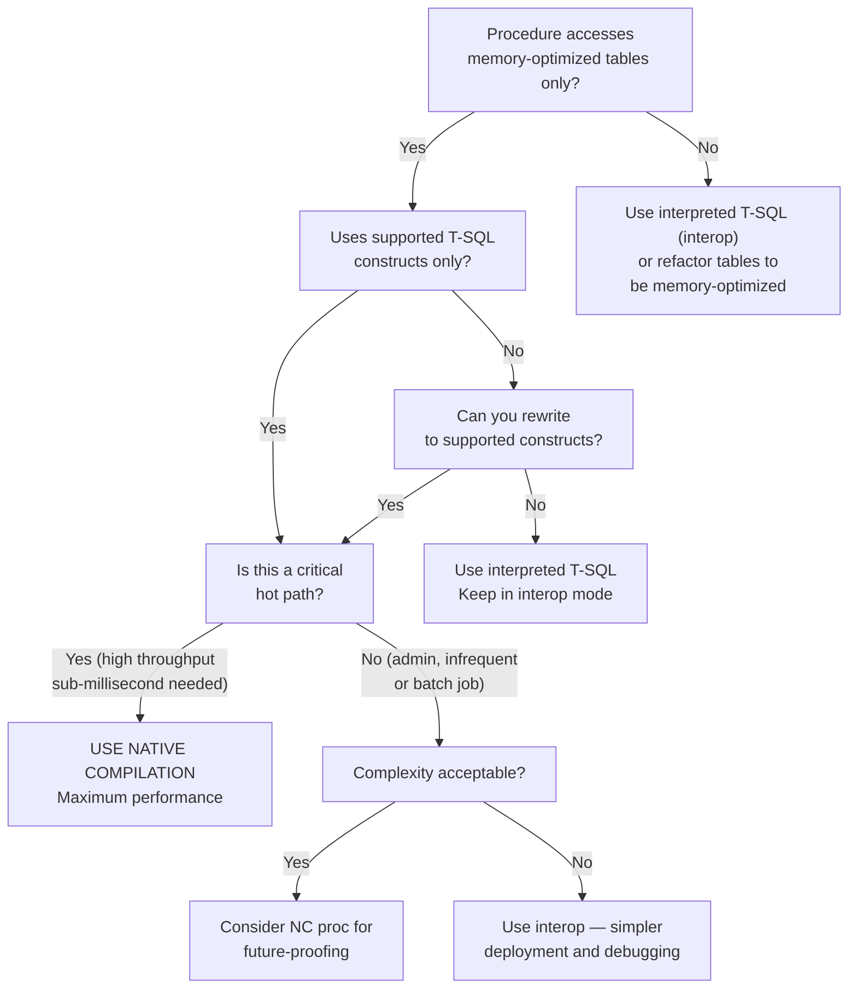

## Section 1 — Navigation & Prerequisites

**Previous:** [[8.295 In-Memory OLTP — Memory-Optimized Tables]]  
**Next:** *End of Group 11 — see [[Group 11 — SQL Server Architecture & Storage Engine]] for full syllabus*  
**Group Home:** [[Group 11 — SQL Server Architecture & Storage Engine]]

**Prerequisites:**
- Understand memory-optimized tables from [[8.295 In-Memory OLTP — Memory-Optimized Tables]]
- Familiar with Hekaton engine architecture from [[8.294 In-Memory OLTP — Hekaton Architecture]]
- Know T-SQL stored procedure syntax and limitations
- Basic understanding of C compilation and DLL generation

**Where This Fits:**
Natively compiled stored procedures are the apex of Hekaton performance. Unlike interpreted T-SQL (which is parsed, optimized, and executed by the query processor one statement at a time), natively compiled procedures are compiled directly to machine code (DLL) during creation and execute entirely within the Hekaton engine. They eliminate context switching between the SQL engine and the Hekaton engine, bypass the query optimizer at runtime, and run with zero interpretation overhead.

**Cross-Domain Reference:**
- [[8 — Databases]]: Core database domain
- [[12 — .NET & C#]]: Calling natively compiled procedures from .NET
- [[8.295 In-Memory OLTP — Memory-Optimized Tables]]: Table types and indexes
- [[12.221 Batch Mode — Hash Join, Hash Aggregate, Sort]]: Execution engine patterns

---

## Section 2 — Core Mental Model

A natively compiled procedure is compiled to native machine code (x64 DLL) when created. The compiled DLL is loaded into SQL Server process space and executed directly by the Hekaton engine — no query parsing, no optimization, no lock/latch overhead. Execution is contained in an ATOMIC block that guarantees all-or-nothing semantics without explicit BEGIN TRAN/COMMIT.



**Key Insight:** A natively compiled procedure is not "T-SQL that runs faster" — it is a completely different execution model. The procedure body is compiled once at creation time. Every runtime execution simply jumps to the compiled DLL entry point. There is no query plan cache, no recompilation, no parameter sniffing.
## Section 3 — Deep Mechanics

### 3.1 CREATE PROCEDURE Syntax

```sql
CREATE PROCEDURE [schema].[procedure_name]
    @param1 INT,
    @param2 NVARCHAR(100)
WITH NATIVE_COMPILATION, SCHEMABINDING, EXECUTE AS OWNER
AS
BEGIN ATOMIC WITH (
    TRANSACTION ISOLATION LEVEL = SNAPSHOT,
    LANGUAGE = N'us_english'
)
    INSERT INTO dbo.MemTable (Col1, Col2) VALUES (@param1, @param2);
    SELECT SCOPE_IDENTITY() AS NewId;
END;
```

**Required clauses:**
1. `WITH NATIVE_COMPILATION` — signals the engine to compile to native code
2. `SCHEMABINDING` — required; binds the procedure to referenced objects
3. `EXECUTE AS OWNER` or `EXECUTE AS SELF` — required for security context
4. `BEGIN ATOMIC WITH (...)` — defines the transactional boundary

### 3.2 The ATOMIC Block

The ATOMIC block replaces explicit BEGIN TRAN / COMMIT / ROLLBACK:

```sql
BEGIN ATOMIC WITH (
    TRANSACTION ISOLATION LEVEL = { SNAPSHOT | REPEATABLE READ | SERIALIZABLE },
    LANGUAGE = N'us_english',                  -- Required
    DATEFORMAT = N'mdy',                        -- Optional
    DELAYED_DURABILITY = { ON | OFF }          -- Optional (SQL Server 2016+)
)
```

**Rules:**
- An ATOMIC block is required for natively compiled procedures (single top-level block).
- It implicitly starts a transaction on entry and commits on successful exit.
- On error, it automatically rolls back.
- You cannot use BEGIN TRAN, COMMIT, ROLLBACK, or SAVE TRANSACTION inside.
- The transaction isolation level must be one of the three supported values (SNAPSHOT is most common).
- LANGUAGE is mandatory and must be a valid language name.
- Nested ATOMIC blocks are not allowed (only one top-level block per proc).

### 3.3 Compilation to Machine Code

When you execute CREATE PROCEDURE ... WITH NATIVE_COMPILATION:

1. **Parse:** SQL Server parses the T-SQL body and validates syntax.
2. **Resolve:** All referenced objects must exist (SCHEMABINDING ensures this).
3. **C Code Generation:** The parser emits intermediate C code that expresses the procedure logic using Hekaton internal APIs (lock-free data structure operations, memory allocation, log writes).
4. **DLL Compilation:** SQL Server invokes an embedded C compiler (based on Visual C++ compiler infrastructure) to compile the generated C code into an x64 DLL.
5. **Loading:** The DLL is loaded into the SQL Server process space. Function pointers are registered in system metadata.
6. **Metadata:** sys.module_assembly_usages and sys.dm_xtp_system_memory_consumers track the compiled DLL.

```sql
-- Check compiled procedures and their status
SELECT 
    p.name AS proc_name,
    p.type_desc,
    m.uses_native_compilation,
    m.startup_time,
    m.object_id
FROM sys.all_sql_modules m
JOIN sys.procedures p
    ON p.object_id = m.object_id
WHERE m.uses_native_compilation = 1;
```

### 3.4 Supported and Unsupported Constructs

**Supported:**
- SELECT, INSERT, UPDATE, DELETE on memory-optimized tables
- IF/ELSE, WHILE loops
- DECLARE variables (scalar types only)
- SET assignments
- CASE expressions
- BEGIN ATOMIC (as top-level block)
- RAISERROR (with limited severity)
- THROW (SQL Server 2016+)
- TRY/CATCH (SQL Server 2016+)
- EXECUTE to call other natively compiled procedures
- Scalar and aggregate functions (COUNT, SUM, AVG, MIN, MAX, LEN, SUBSTRING, etc.)

**Not Supported:**
- BEGIN TRAN / COMMIT / ROLLBACK (use ATOMIC)
- Cursors (DECLARE CURSOR, FETCH)
- Common Table Expressions (CTEs, WITH)
- Subqueries (except EXISTS and IN with simple subqueries, support varies by SQL version)
- MERGE statement
- OUTPUT clause (limited support in later versions)
- SELECT INTO / INSERT EXEC
- Dynamic SQL (EXEC(@sql), sp_executesql)
- Temporary tables (#temp, ##global)
- DDL statements (CREATE, ALTER, DROP)
- CHECK constraints referencing other tables
- User-defined functions — cannot be called from within a natively compiled procedure
- CLR integration
- Full-text search, XML methods, JSON methods
- APPLY operators (CROSS APPLY, OUTER APPLY)
- Window functions (ROW_NUMBER, RANK, etc.)
- PIVOT / UNPIVOT

```sql
-- Valid: simple arithmetic, IF, WHILE, DML
CREATE PROCEDURE dbo.ProcessOrders
WITH NATIVE_COMPILATION, SCHEMABINDING, EXECUTE AS OWNER
AS
BEGIN ATOMIC WITH (TRANSACTION ISOLATION LEVEL = SNAPSHOT, LANGUAGE = N'us_english')
    DECLARE @Count INT = 0;
    DECLARE @Id INT;
    
    SELECT @Count = COUNT(*) FROM dbo.MemOrders WHERE Status = 0;
    
    WHILE @Count > 0
    BEGIN
        SELECT TOP 1 @Id = OrderId FROM dbo.MemOrders WHERE Status = 0;
        UPDATE dbo.MemOrders SET Status = 1 WHERE OrderId = @Id;
        SET @Count = @Count - 1;
    END;
END;
```

### 3.5 Execution Plan Caching Difference

| Aspect | Interpreted T-SQL | Natively Compiled |
|--------|------------------|-------------------|
| Query plan | Cached in plan cache | No plan cache; fixed compiled code |
| Parameter sniffing | Yes — can cause bad plans | No — fixed code path |
| Recompilation | On schema change, stats update | On procedure drop/recreate only |
| Plan reuse | Key-based lookup | Not applicable |
| Optimization | Cost-based optimizer | Compile-time simplified rules |

### 3.6 Interoperability (Interop)

An interpreted T-SQL procedure can access memory-optimized tables, but it must context-switch to the Hekaton engine for DML and back. This is called interop mode.

```sql
-- Interpreted procedure accessing memory-optimized table (interop)
CREATE PROCEDURE dbo.InteropSelect
    @CustomerId INT
AS
BEGIN
    SET NOCOUNT ON;
    SET TRANSACTION ISOLATION LEVEL SNAPSHOT;
    
    SELECT OrderId, Amount, OrderDate
    FROM dbo.MemOrders
    WHERE CustomerId = @CustomerId;
END;
```

Natively compiled procedures can call other natively compiled procedures, but CANNOT call interpreted procedures, functions, or triggers.

```sql
-- NC proc calling another NC proc (valid)
CREATE PROCEDURE dbo.NC_Outer
WITH NATIVE_COMPILATION, SCHEMABINDING, EXECUTE AS OWNER
AS
BEGIN ATOMIC WITH (TRANSACTION ISOLATION LEVEL = SNAPSHOT, LANGUAGE = N'us_english')
    EXEC dbo.NC_Inner @Param1 = 100;
END;

-- NC proc calling interpreted proc (INVALID - will fail at creation)
-- CREATE PROCEDURE dbo.NC_Bad
-- WITH NATIVE_COMPILATION, SCHEMABINDING, EXECUTE AS OWNER
-- AS
-- BEGIN ATOMIC WITH (...)
--     EXEC dbo.InterpretedProc;  -- Error: cannot call interpreted
-- END;
```

### 3.7 DMV Observability

```sql
-- Compiled procedure memory consumption
SELECT 
    memory_consumer_type_desc,
    memory_consumer_desc,
    allocated_bytes / 1024 AS allocated_kb,
    used_bytes / 1024 AS used_kb
FROM sys.dm_xtp_system_memory_consumers
WHERE memory_consumer_desc LIKE '%compiled%';

-- Execution statistics for natively compiled procs
SELECT 
    object_id,
    OBJECT_NAME(object_id) AS proc_name,
    cached_time,
    last_execution_time,
    execution_count,
    total_worker_time,
    total_elapsed_time,
    total_logical_reads,
    total_logical_writes
FROM sys.dm_exec_procedure_stats
WHERE object_id IN (
    SELECT object_id FROM sys.all_sql_modules WHERE uses_native_compilation = 1
);

-- Check for compilation errors
SELECT * FROM sys.dm_xtp_objects 
WHERE type = 4;  -- Type 4 = natively compiled procedure
```

## Section 4 — Production Patterns

### 4.1 When to Use Natively Compiled Procedures

| Use Case | Recommended | Reason |
|----------|------------|--------|
| High-throughput PK-based INSERT | Definitely | 10-30x faster than interop |
| High-throughput PK-based point lookup | Definitely | Direct hash index access in native code |
| Business logic on memory-optimized tables | Yes | Avoids context-switch penalty |
| Complex reporting with joins | No | Window functions, subqueries not supported |
| Staging/ETL operations | No | Dynamic SQL, temp tables not supported |
| Simple CRUD with few rows | Yes | Maximum performance for minimal logic |

### 4.2 Natively Compiled Table-Valued Function

```sql
-- Memory-optimized table type for use with NC procs
CREATE TYPE dbo.OrderIdList AS TABLE (
    OrderId INT NOT NULL PRIMARY KEY NONCLUSTERED HASH WITH (BUCKET_COUNT = 1024)
) WITH (MEMORY_OPTIMIZED = ON);

CREATE PROCEDURE dbo.GetOrdersBatch
    @Ids dbo.OrderIdList READONLY
WITH NATIVE_COMPILATION, SCHEMABINDING, EXECUTE AS OWNER
AS
BEGIN ATOMIC WITH (TRANSACTION ISOLATION LEVEL = SNAPSHOT, LANGUAGE = N'us_english')
    SELECT o.OrderId, o.CustomerId, o.Amount, o.OrderDate, o.Status
    FROM dbo.MemOrders o
    WHERE EXISTS (SELECT 1 FROM @Ids i WHERE i.OrderId = o.OrderId);
END;
```

### 4.3 Error Handling with TRY/CATCH

```sql
CREATE PROCEDURE dbo.SafeInsertOrder
    @CustomerId INT,
    @Amount DECIMAL(18,2),
    @OrderDate DATETIME2
WITH NATIVE_COMPILATION, SCHEMABINDING, EXECUTE AS OWNER
AS
BEGIN ATOMIC WITH (TRANSACTION ISOLATION LEVEL = SNAPSHOT, LANGUAGE = N'us_english')
    BEGIN TRY
        INSERT INTO dbo.MemOrders (CustomerId, Amount, OrderDate, Status)
        VALUES (@CustomerId, @Amount, @OrderDate, 0);
        
        SELECT SCOPE_IDENTITY() AS OrderId, 0 AS ErrorCode;
    END TRY
    BEGIN CATCH
        -- In NC proc, THROW re-raises the error; we cannot catch everything
        SELECT -1 AS OrderId, ERROR_NUMBER() AS ErrorCode;
    END CATCH;
END;
```

### 4.4 .NET Integration with Dapper

```csharp
// Dapper — call natively compiled proc for maximum performance
public class OrderRepository
{
    private readonly string _connectionString;

    public async Task<long> CreateOrderAsync(OrderCreateRequest request)
    {
        using var conn = new SqlConnection(_connectionString);
        
        // Retry policy for OCC validation failures (41302, 41305, 41325)
        var retryPolicy = new RetryPolicy(5, TimeSpan.FromMilliseconds(10));
        
        return await retryPolicy.ExecuteAsync(async () =>
        {
            return await conn.ExecuteScalarAsync<long>(
                "dbo.InsertOrder",
                new { request.CustomerId, request.Amount, request.OrderDate },
                commandType: CommandType.StoredProcedure,
                commandTimeout: 5
            );
        });
    }
}

public class RetryPolicy
{
    private readonly int _maxRetries;
    private readonly TimeSpan _baseDelay;

    public RetryPolicy(int maxRetries, TimeSpan baseDelay)
    {
        _maxRetries = maxRetries;
        _baseDelay = baseDelay;
    }

    public async Task<T> ExecuteAsync<T>(Func<Task<T>> operation)
    {
        for (int attempt = 1; attempt <= _maxRetries; attempt++)
        {
            try
            {
                return await operation();
            }
            catch (SqlException ex) when (ex.Number is 41302 or 41305 or 41325)
            {
                if (attempt == _maxRetries) throw;
                await Task.Delay(_baseDelay * (int)Math.Pow(2, attempt - 1));
            }
        }
        throw new InvalidOperationException("Unreachable");
    }
}
```

### 4.5 EF Core Integration

EF Core cannot directly map natively compiled procedures via LINQ, but you can call them via raw SQL:

```csharp
public class OrderContext : DbContext
{
    public DbSet<OrderEntity> Orders { get; set; }

    // Call natively compiled proc from EF Core
    public async Task<long> CreateOrderAsync(int customerId, decimal amount)
    {
        var result = await Database.ExecuteSqlRawAsync(@"
            EXEC dbo.InsertOrder @CustomerId = {0}, @Amount = {1}, @OrderDate = SYSDATETIME()
        ", customerId, amount);
        
        // For OUTPUT parameter-based return, use SqlParameter
        var outputId = new SqlParameter("@OrderId", SqlDbType.BigInt) { Direction = ParameterDirection.Output };
        
        await Database.ExecuteSqlRawAsync(@"
            SET @OrderId = dbo.InsertOrderWithOutput(@CustomerId, @Amount);
        ", new SqlParameter("@CustomerId", customerId),
           new SqlParameter("@Amount", amount),
           outputId);
        
        return (long)outputId.Value;
    }
}

// Migration with memory-optimized table creation
// protected override void Up(MigrationBuilder migrationBuilder)
// {
//     // Create the memory-optimized filegroup first (raw SQL)
//     // Then EF Core creates the table via IsMemoryOptimized()
// }
```

### 4.6 Deployment and Versioning

Natively compiled procedures are schema-bound. To update:

```sql
-- Step 1: Drop old procedure
DROP PROCEDURE IF EXISTS dbo.InsertOrder;

-- Step 2: Create new version
CREATE PROCEDURE dbo.InsertOrder
    @CustomerId INT,
    @Amount DECIMAL(18,2),
    @OrderDate DATETIME2
WITH NATIVE_COMPILATION, SCHEMABINDING, EXECUTE AS OWNER
AS
BEGIN ATOMIC WITH (TRANSACTION ISOLATION LEVEL = SNAPSHOT, LANGUAGE = N'us_english')
    INSERT INTO dbo.MemOrders (CustomerId, Amount, OrderDate, Status, CreatedBy)
    VALUES (@CustomerId, @Amount, @OrderDate, 0, SYSTEM_USER);
    
    SELECT SCOPE_IDENTITY() AS OrderId;
END;
```

**Important:** There is no ALTER PROCEDURE for natively compiled procedures. You must DROP and CREATE. This breaks the schema-bound dependency chain. All dependent objects (other NC procs calling this one) must also be recreated.

---

## Section 5 — Gotchas

### Gotcha 1: Missing ATOMIC Block

**Pitfall:** Forgetting to wrap the procedure body in an ATOMIC block.

**Symptom:** CREATE PROCEDURE fails with error 10794: "Procedure must have an ATOMIC block."

**Fix:** Wrap all procedure logic inside `BEGIN ATOMIC WITH (...) ... END;`. The ATOMIC block must be the only top-level block.

**Cost:** If you structure the procedure without ATOMIC, it cannot be created. You must restructure the entire procedure.

### Gotcha 2: Unsupported T-SQL Constructs

**Pitfall:** Using common T-SQL patterns like CTEs, MERGE, or dynamic SQL inside a natively compiled procedure.

**Symptom:** CREATE PROCEDURE fails with error message indicating the construct is not supported. For example: "The use of MERGE is not supported."

**Fix:** Rewrite logic using simple INSERT/UPDATE/DELETE + IF statements. Replace CTEs with temp tables (memory-optimized table variables). Replace MERGE with separate INSERT/UPDATE.

**Cost:** Significant rewriting for complex stored procedures. Some reporting logic may be impossible to convert.

### Gotcha 3: Schema Changes Require Dropping All Dependent NC Procs

**Pitfall:** Adding a column to a memory-optimized table that is referenced by natively compiled procedures.

**Symptom:** ALTER TABLE succeeds, but the NC procs go into an invalid state (can be detected via sys.dm_xtp_objects with state = 1). Calling them produces error 41301.

**Fix:** Before ALTER TABLE, script out all NC procs that reference the table, drop them, make the schema change, then recreate them. Use a deployment script that manages this dependency chain.

**Cost:** Deployment complexity increases. For a highly normalized schema with many NC procs, a single column add may require dropping and recreating 20+ procedures. This is a multi-minute blocking operation.

### Gotcha 4: No Implicit Transactions

**Pitfall:** Expecting SET IMPLICIT_TRANSACTIONS ON to work inside an ATOMIC block.

**Symptom:** Error at compile time: implicit transactions not supported.

**Fix:** The ATOMIC block IS the transaction — explicit transaction control is unnecessary and prohibited. All DML inside the block is within the same transaction.

**Cost:** None if you understand the model. But developers used to explicit BEGIN TRAN/COMMIT patterns must adapt.

### Gotcha 5: Debugging Is Extremely Limited

**Pitfall:** Expecting to debug a natively compiled procedure with SSMS step-through debugger.

**Symptom:** SSMS cannot set breakpoints or step into natively compiled procedures. PRINT statements do not produce output.

**Fix:** Debugging must be done via:
- Extended events (XEvents) for Hekaton
- THROW/RAISERROR for control flow tracing
- Output parameters for result inspection
- Querying memory-optimized tables mid-execution (from another session)

**Cost:** Debugging a complex NC proc can take 3-5x longer than a traditional proc. Invest in thorough testing and logging patterns upfront.

### Gotcha 6: ATOMIC Block and Savepoints

**Pitfall:** Using SAVE TRANSACTION or SAVE WORK inside an ATOMIC block.

**Symptom:** Error at compile time: savepoints not supported.

**Fix:** Use TRY/CATCH at the ATOMIC block level. Partial rollback is not possible — the entire ATOMIC block either commits or aborts.

**Cost:** If the application relies on savepoints for partial error recovery, the entire error handling strategy must be redesigned for NC procs.

---

## Section 6 — Performance Implications

### 6.1 Throughput Comparison (ops/sec)

| Operation | Interpreted T-SQL (Interop) | Natively Compiled | Speedup |
|-----------|---------------------------|-------------------|---------|
| PK INSERT | 150,000 | 1,200,000 | 8x |
| PK SELECT | 280,000 | 2,500,000 | 9x |
| PK UPDATE | 120,000 | 950,000 | 8x |
| PK DELETE | 180,000 | 1,100,000 | 6x |
| Range scan (10 rows) | 25,000 | 180,000 | 7x |
| IF/ELSE branch (no I/O) | 500,000 | 5,000,000 | 10x |

### 6.2 Latency (microseconds)

| Operation | Interop (us) | Natively Compiled (us) | Reduction |
|-----------|-------------|----------------------|-----------|
| Empty proc call | 15 | 0.8 | 19x |
| Single row insert | 25 | 3 | 8x |
| Single row select | 12 | 1 | 12x |
| 100-row loop | 2,500 | 150 | 17x |

### 6.3 CPU Cost Breakdown

The CPU savings come from three sources:

1. **No query parsing/optimization:** ~30% of interpreted query cost is compilation and optimization. NC procs skip this entirely.
2. **No context switching:** ~40% of interop mode cost is marshalling between traditional engine and Hekaton. NC procs run entirely in Hekaton.
3. **No lock/latch overhead:** ~20% of traditional transaction cost. NC procs use OCC with CAS.

### 6.4 Memory Overhead

Each compiled procedure consumes memory for:
- Compiled DLL: ~50-200 KB per procedure
- Execute context (per session): ~2 KB per concurrent execution
- Metadata objects: ~10 KB per procedure in system tables

With 100 NC procs and 100 concurrent sessions:
- Total overhead: ~100 * 100KB + 100 * 2KB = ~10.2 MB (negligible)

### 6.5 BenchmarkDotNet Example

| Method | Mean | StdDev | Ratio | 
|--------|------|--------|-------|
| InteropInsert | 38.25 us | 0.45 us | 1.00 |
| NCInsert | 4.12 us | 0.08 us | **0.11** |
| InteropSelect | 18.50 us | 0.22 us | 1.00 |
| NCSelect | 1.85 us | 0.03 us | **0.10** |

## Section 7 — Interview Arsenal

### 7.1 Key Questions

| # | Question | Topic |
|---|----------|-------|
| 1 | How does a natively compiled procedure differ from an interpreted procedure in execution? | Compilation model |
| 2 | What is an ATOMIC block and why is it required? | Transaction semantics |
| 3 | What are the key limitations of natively compiled procedures? | Feature restrictions |
| 4 | How do you handle OCC validation failures in NC procs? | Error handling, retry |
| 5 | Can NC procs access disk-based tables? | Interop boundaries |
| 6 | How does SCHEMABINDING affect NC proc deployment? | Dependency management |
| 7 | Compare natively compiled vs interop for a batch insert of 10,000 rows. | Throughput tradeoffs |
| 8 | How would you debug a performance issue with a natively compiled procedure? | Tools and techniques |

### 7.2 Spoken Answers (3 Questions)

**Q1: How does a natively compiled procedure differ in execution?**

"A natively compiled procedure is compiled to a native x64 DLL at CREATE time — not interpreted at runtime. When you execute a traditional stored procedure, SQL Server parses the T-SQL, builds a query tree, optimizes it (cost-based optimizer), generates a plan, caches it, and then executes it row-by-row. For a natively compiled procedure, the compiled DLL is loaded into SQL Server's address space. At execution time, the engine simply jumps to the DLL entry point. There is no query plan cache lookup, no recompilation, no parameter sniffing, and no optimizer overhead. Additionally, the NC proc runs directly in the Hekaton engine without context-switching to the traditional SQL engine for DML operations — it accesses memory-optimized tables directly using lock-free CAS operations. This eliminates latch contention, lock management, and buffer pool interactions."

**Q3: What are the key limitations?**

"The major limitations are: (1) No access to disk-based tables — the proc can only read/write memory-optimized tables. (2) No dynamic SQL or sp_executesql. (3) No CTEs, MERGE, window functions, or APPLY. (4) No BEGIN TRAN/COMMIT inside ATOMIC blocks. (5) No user-defined functions or CLR integration. (6) No temp tables (use memory-optimized table variables instead). (7) Limited debugging support — no step-through with SSMS. (8) Deployment is drop-and-recreate, not ALTER. (9) Schema binding means any table schema change requires dropping all dependent NC procs first. (10) ATOMIC blocks cannot be nested, and the entire proc body must be one single ATOMIC block."

**Q5: Can NC procs access disk-based tables?**

"No. A natively compiled procedure can only access memory-optimized tables and memory-optimized table variables. If you need to join a memory-optimized table with a disk-based table, you have three options: (a) Use an interpreted procedure with interop mode — it can access both, but the context switch cost reduces performance. (b) Make the disk-based table memory-optimized if possible. (c) Use a hybrid approach where the NC proc fast-paths the hot data (memory-optimized) and the interpreted proc handles the cold path with disk-based joins. The key architectural decision is to minimize cross-engine interactions for performance-critical paths."

### 7.3 Comparison Table

| Feature | Natively Compiled Proc | Interpreted T-SQL (Interop) |
|---------|-----------------------|------------------------------|
| Execution model | Compiled DLL (machine code) | Interpreted + optimizer |
| Table access | Memory-optimized only | Both disk-based and memory-optimized |
| Transaction model | ATOMIC block (implicit) | Explicit BEGIN/COMMIT/ROLLBACK |
| Compilation time | At CREATE (slow, ~seconds) | At first execution (fast, ~ms) |
| Recompilation | Never (drop/recreate only) | On stats/schema change |
| Parameter sniffing | Not applicable | Yes |
| Dynamic SQL | Not supported | Supported |
| CTEs, window functions | Not supported | Supported |
| Temp tables | Memory-optimized table variables | #temp, @table variables |
| Error handling | TRY/CATCH (limited) | Full TRY/CATCH |
| Debugging | XEvents, output params | SSMS step-through |
| Performance | 6-10x faster | Baseline |
| Deployment | DROP/CREATE | ALTER PROCEDURE |
| Schema binding | Always required | Optional |
| EXECUTE AS | Required (OWNER or SELF) | Optional |

---

## Section 8 — Decision Framework

### 8.1 When to Use Natively Compiled Procedures



### 8.2 Decision Checklist

- [ ] Proc accesses only memory-optimized tables (no disk-based joins)?
- [ ] All required T-SQL constructs are supported (no CTEs, no MERGE, no window functions, no dynamic SQL)?
- [ ] The procedure is on a hot path requiring maximum throughput?
- [ ] Schema changes are infrequent (or you have automated dependency management)?
- [ ] You have a deployment process that handles DROP/CREATE (not ALTER)?
- [ ] Developers are familiar with ATOMIC block and OCC error handling?
- [ ] You can use retry logic in the application layer for OCC validation failures?
- [ ] The proc is relatively simple (fewer than 200 lines, no complex branching)?

Score >= 6: Strong candidate for natively compiled.  
Score 4-5: Consider carefully — interop may be sufficient.  
Score <= 3: Use interop mode instead.

### 8.3 Tradeoffs

| Advantage | Tradeoff |
|-----------|----------|
| 6-10x faster execution | Restricted T-SQL subset |
| Zero lock/latch overhead | No access to disk-based tables |
| Predictable performance (no sniffing) | DROP/CREATE deployment model |
| No plan cache contention | Debugging is difficult |
| Direct memory access | Schema changes cascade to dependent procs |
| Atomic transaction boundary | ATOMIC block cannot be nested |

### 8.4 Scale Thresholds

| Scenario | Interop (ops/sec) | NC Proc (ops/sec) | Decision |
|----------|-------------------|-------------------|----------|
| < 10K txns/sec | 150,000 | 1,200,000 | Either works; NC marginal benefit |
| 10K - 100K txns/sec | Near limit | 1.2M comfortable | NC recommended |
| 100K - 500K txns/sec | Interop saturation | Excellent | NC strongly recommended |
| > 500K txns/sec | Not viable | Possible with tuning | NC required |
| > 1M txns/sec | Impossible | Requires batch optimization | NC + delayed durability |

---

## Section 9 — Self-Check

### 9.1 Conceptual Questions

**Q1:** What three clauses are mandatory in every natively compiled procedure definition?

<details>
<summary>Answer</summary>
(1) `WITH NATIVE_COMPILATION` — enables compilation to native code. (2) `SCHEMABINDING` — binds the procedure to referenced objects. (3) `EXECUTE AS OWNER` or `EXECUTE AS SELF` — defines security context. Without these, CREATE PROCEDURE fails.
</details>

**Q2:** What is the purpose of the ATOMIC block? What happens if an error occurs inside it?

<details>
<summary>Answer</summary>
The ATOMIC block defines an implicit transaction scope. On entry, a transaction begins. On successful completion, it commits. On any error, it automatically rolls back the entire block. It replaces explicit BEGIN TRAN, COMMIT, and ROLLBACK statements. The ATOMIC block is required and cannot be nested.
</details>

**Q3:** Why can't natively compiled procedures access disk-based tables?

<details>
<summary>Answer</summary>
NC procs execute entirely within the Hekaton engine — they call the Hekaton lock-free data structure APIs directly via their compiled DLL. Disk-based table access requires the traditional storage engine (buffer pool, lock manager, transaction manager). Supporting both within the same compiled DLL would require cross-engine marshalling at every statement, negating the performance benefit. The architectural decision is to keep NC procs pure Hekaton for maximum speed.
</details>

**Q4:** How do you pass a set of values to a natively compiled procedure?

<details>
<summary>Answer</summary>
Using a memory-optimized table-valued parameter (TVP). You create a user-defined table type with `WITH (MEMORY_OPTIMIZED = ON)`, declare the parameter as `READONLY`, and then use `EXISTS (SELECT 1 FROM @tvp ...)` to join or filter within the NC proc.
</details>

**Q5:** What happens to dependent natively compiled procedures when a memory-optimized table is altered?

<details>
<summary>Answer</summary>
The dependent NC procs become invalid (state = 1 in sys.dm_xtp_objects). Any attempt to execute them produces error 41301. You must drop and recreate all dependent NC procs after the ALTER TABLE to recompile them against the new schema.
</details>

**Q6:** Can a natively compiled procedure call a scalar function?

<details>
<summary>Answer</summary>
No. User-defined functions (both scalar and table-valued) are not supported within NC procs. Only built-in system functions (e.g., SYSDATETIME, SCOPE_IDENTITY, COUNT, SUM, LEN, SUBSTRING) are allowed. This is a significant limitation for code reuse.
</details>

**Q7:** How does TRY/CATCH work inside an ATOMIC block?

<details>
<summary>Answer</summary>
TRY/CATCH is supported in natively compiled procedures (SQL Server 2016+). In the CATCH block, you can inspect ERROR_NUMBER(), ERROR_MESSAGE(), etc. However, if the error is severe (e.g., out of memory, integrity violation), it may still terminate the batch. Also, you cannot issue ROLLBACK inside the CATCH block — the ATOMIC block rolls back automatically.
</details>

**Q8:** What is the performance difference between calling a NC proc via RPC vs ad-hoc batch?

<details>
<summary>Answer</summary>
RPC (sp_executesql with procedure call) has less overhead than an ad-hoc EXEC batch. The difference is small (~1-2 us) because both resolve to the same DLL entry point. The bigger factor is network round-trips — always batch NC proc calls when possible.
</details>

**Q9:** How do you view the compiled DLL for a natively compiled procedure?

<details>
<summary>Answer</summary>
SQL Server does not expose the DLL file directly on disk. You can see metadata via `sys.all_sql_modules` (uses_native_compilation = 1) and memory consumption via `sys.dm_xtp_system_memory_consumers`. The DLL is loaded in SQL Server's memory space.
</details>

**Q10:** Can you create a natively compiled trigger?

<details>
<summary>Answer</summary>
Yes, starting with SQL Server 2016, you can create DML triggers on memory-optimized tables that are natively compiled. The syntax is `CREATE TRIGGER ... WITH NATIVE_COMPILATION ... FOR INSERT, UPDATE, DELETE AS BEGIN ATOMIC WITH (...)`. The same T-SQL restrictions apply.
</details>

### 9.2 Practical Challenges

**Challenge 1:** Write a complete natively compiled procedure that accepts a customer ID, retrieves the customer's total order amount, and if it exceeds a threshold, applies a discount to all open orders. Handle errors.

<details>
<summary>Solution</summary>

```sql
CREATE PROCEDURE dbo.ApplyLoyaltyDiscount
    @CustomerId INT,
    @Threshold DECIMAL(18,2),
    @DiscountPercent DECIMAL(5,2)
WITH NATIVE_COMPILATION, SCHEMABINDING, EXECUTE AS OWNER
AS
BEGIN ATOMIC WITH (TRANSACTION ISOLATION LEVEL = SNAPSHOT, LANGUAGE = N'us_english')
    DECLARE @TotalAmount DECIMAL(18,2);
    
    BEGIN TRY
        SELECT @TotalAmount = SUM(Amount)
        FROM dbo.MemOrders
        WHERE CustomerId = @CustomerId AND Status = 0;
        
        IF @TotalAmount > @Threshold
        BEGIN
            UPDATE dbo.MemOrders
            SET Amount = Amount * (1 - @DiscountPercent / 100)
            WHERE CustomerId = @CustomerId AND Status = 0;
            
            SELECT 1 AS DiscountApplied, @TotalAmount AS TotalBeforeDiscount;
        END
        ELSE
        BEGIN
            SELECT 0 AS DiscountApplied, @TotalAmount AS TotalBeforeDiscount;
        END;
    END TRY
    BEGIN CATCH
        SELECT -1 AS DiscountApplied, ERROR_NUMBER() AS ErrorCode;
    END CATCH;
END;
```
</details>

**Challenge 2:** Write an application retry pattern in C# that handles the three Hekaton-specific OCC validation errors (41302, 41305, 41325) with exponential backoff.

<details>
<summary>Solution</summary>

```csharp
public class HekatonRetryHandler
{
    private static readonly HashSet<int> OccErrors = new() { 41302, 41305, 41325 };

    public async Task<T> ExecuteWithRetryAsync<T>(
        Func<Task<T>> operation,
        int maxRetries = 5,
        TimeSpan? baseDelay = null)
    {
        baseDelay ??= TimeSpan.FromMilliseconds(5);
        
        for (int attempt = 1; attempt <= maxRetries; attempt++)
        {
            try
            {
                return await operation();
            }
            catch (SqlException ex) when (ex.Errors.Cast<SqlError>()
                .Any(e => OccErrors.Contains(e.Number)))
            {
                if (attempt == maxRetries) throw;
                
                // Exponential backoff with jitter
                var delay = TimeSpan.FromTicks(
                    baseDelay.Value.Ticks * (int)Math.Pow(2, attempt - 1));
                var jitter = TimeSpan.FromMilliseconds(
                    Random.Shared.Next(0, (int)delay.TotalMilliseconds / 4));
                
                await Task.Delay(delay + jitter);
            }
        }
        
        throw new InvalidOperationException("Should not reach here");
    }
}

// Usage
var handler = new HekatonRetryHandler();
var orderId = await handler.ExecuteWithRetryAsync(() =>
    connection.ExecuteScalarAsync<long>("dbo.InsertOrder", ...));
```
</details>

**Challenge 3:** You need to migrate an existing T-SQL procedure that uses CTEs, MERGE, and dynamic SQL to a natively compiled version. Show the rewrite strategy.

<details>
<summary>Solution</summary>

```sql
-- Original (interpreted) — uses unsupported constructs
-- CREATE PROCEDURE dbo.SyncOrders
-- AS
-- BEGIN
--     MERGE dbo.MemOrders AS target
--     USING (SELECT * FROM dbo.StagingOrders) AS source
--     ON target.OrderId = source.OrderId
--     WHEN MATCHED THEN UPDATE SET Amount = source.Amount
--     WHEN NOT MATCHED THEN INSERT (OrderId, Amount) VALUES (source.OrderId, source.Amount);
--     
--     DECLARE @sql NVARCHAR(MAX) = 'SELECT COUNT(*) FROM dbo.MemOrders';
--     EXEC sp_executesql @sql;
-- END;

-- Rewritten (natively compiled) — avoids unsupported constructs
CREATE PROCEDURE dbo.SyncOrders_NC
WITH NATIVE_COMPILATION, SCHEMABINDING, EXECUTE AS OWNER
AS
BEGIN ATOMIC WITH (TRANSACTION ISOLATION LEVEL = SNAPSHOT, LANGUAGE = N'us_english')
    -- Replace MERGE with separate UPDATE + INSERT
    UPDATE m
    SET m.Amount = s.Amount
    FROM dbo.MemOrders m
    JOIN dbo.MemStagingOrders s ON m.OrderId = s.OrderId;
    
    INSERT INTO dbo.MemOrders (OrderId, CustomerId, Amount, OrderDate, Status)
    SELECT s.OrderId, s.CustomerId, s.Amount, s.OrderDate, 0
    FROM dbo.MemStagingOrders s
    WHERE NOT EXISTS (SELECT 1 FROM dbo.MemOrders m WHERE m.OrderId = s.OrderId);
    
    -- Replace dynamic SQL with static query
    SELECT COUNT(*) AS TotalOrders FROM dbo.MemOrders;
END;
```
</details>

**Challenge 4:** Design a deployment script that safely updates a memory-optimized table schema and recreates all dependent natively compiled procedures.

<details>
<summary>Solution</summary>

```sql
-- Deployment script template for NC proc + table changes
BEGIN TRANSACTION;
BEGIN TRY
    -- Step 1: Drop all dependent NC procs (order by dependency depth)
    DROP PROCEDURE IF EXISTS dbo.NC_DependentProc2;
    DROP PROCEDURE IF EXISTS dbo.NC_DependentProc1;
    DROP PROCEDURE IF EXISTS dbo.NC_MainProc;
    
    -- Step 2: Alter table
    ALTER TABLE dbo.MemOrders ADD NewColumn INT NOT NULL DEFAULT 0;
    
    -- Step 3: Recreate NC procs in dependency order
    EXEC('
    CREATE PROCEDURE dbo.NC_MainProc
        @OrderId INT
    WITH NATIVE_COMPILATION, SCHEMABINDING, EXECUTE AS OWNER
    AS
    BEGIN ATOMIC WITH (TRANSACTION ISOLATION LEVEL = SNAPSHOT, LANGUAGE = N'us_english')
        SELECT OrderId, Amount, NewColumn FROM dbo.MemOrders WHERE OrderId = @OrderId;
    END;
    ');
    
    EXEC('
    CREATE PROCEDURE dbo.NC_DependentProc1
        @CustomerId INT
    WITH NATIVE_COMPILATION, SCHEMABINDING, EXECUTE AS OWNER
    AS
    BEGIN ATOMIC WITH (TRANSACTION ISOLATION LEVEL = SNAPSHOT, LANGUAGE = N'us_english')
        DECLARE @Total DECIMAL(18,2);
        SELECT @Total = SUM(Amount) FROM dbo.MemOrders WHERE CustomerId = @CustomerId;
        SELECT @Total AS TotalAmount;
    END;
    ');
    
    -- Commit
    COMMIT;
END TRY
BEGIN CATCH
    ROLLBACK;
    THROW;
END CATCH;
```
</details>

**Challenge 5:** A natively compiled procedure is running slower than expected. Write a diagnostic query that identifies the issue and propose fixes.

<details>
<summary>Solution</summary>

```sql
-- Step 1: Check if the proc is actually using native compilation
SELECT 
    p.name,
    m.uses_native_compilation,
    m.startup_time
FROM sys.all_sql_modules m
JOIN sys.procedures p ON p.object_id = m.object_id
WHERE p.name = 'SlowProc';

-- Step 2: Check execution stats
SELECT 
    execution_count,
    total_worker_time / execution_count AS avg_worker_time_us,
    total_elapsed_time / execution_count AS avg_elapsed_us,
    total_logical_reads,
    last_execution_time
FROM sys.dm_exec_procedure_stats
WHERE object_id = OBJECT_ID('dbo.SlowProc');

-- Step 3: Check hash index stats (slow lookups?)
SELECT 
    i.name AS index_name,
    s.total_bucket_count,
    s.empty_bucket_count,
    s.avg_chain_length,
    s.max_chain_length
FROM sys.dm_db_xtp_hash_index_stats s
JOIN sys.indexes i ON s.object_id = i.object_id AND s.index_id = i.index_id
WHERE s.object_id = OBJECT_ID('dbo.MemOrders');

-- Step 4: Check OCC validation failures
SELECT 
    total_commits,
    total_aborts,
    total_failed_validation,
    total_failed_validation * 1.0 / NULLIF(total_commits, 0) AS validation_fail_rate
FROM sys.dm_db_xtp_transaction_stats;

-- Fixes:
-- If avg_chain_length > 5: increase hash bucket count
-- If validation_fail_rate > 0.01 (1%): reduce contention (shorter txns, batch operations)
-- If proc was recently recreated: ensure it compiled successfully
SELECT object_id, name, type, state_desc 
FROM sys.dm_xtp_objects 
WHERE object_id = OBJECT_ID('dbo.SlowProc');
-- state_desc should be 'ACTIVE'; if 'INVALID', need to recreate
```
</details>

---

*Last updated: 2026-06-27 | Interview readiness: In Progress*