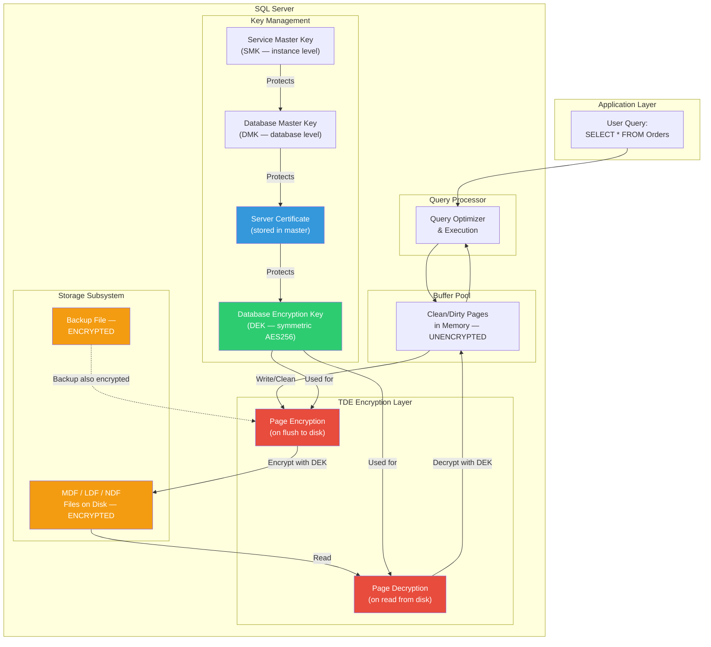
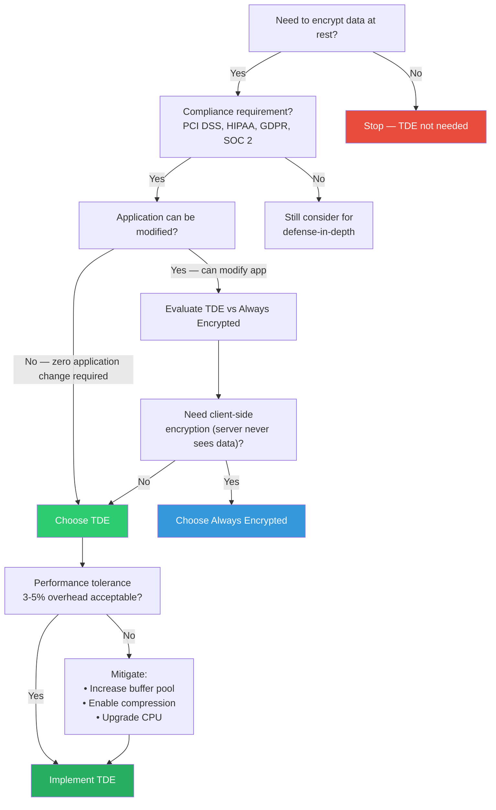

## Navigation

**Domain:** [[8 — Databases]] > **Group:** SQL Server Architecture & Storage Engine
**Previous:** (entry point — encryption) | **Next:** [[8.298 — Always Encrypted — Client-Side Encryption]]

### Prerequisites

- [[8.315 — SQL Server Storage Engine — Pages, Extents, Allocation]] — TDE operates at the page level; understanding page I/O, 8 KB page structure, and the difference between data and log file I/O is required to reason about encryption overhead.
- [[8.320 — Buffer Pool and Data Caching Architecture]] — TDE decrypts pages when they are read into the buffer pool; you must understand BPOLICY (buffer pool extension), lazy writer, and checkpoint behavior to assess performance impact.
- [[15.010 — SQL Server Security Principals and Permissions]] — Certificate and key management in TDE uses the SQL Server extensible key management (EKM) hierarchy; you must understand the difference between symmetric and asymmetric keys, and the `CONTROL SERVER` / `ALTER ANY CERTIFICATE` permissions.

### Where This Fits

Transparent Data Encryption (TDE) is SQL Server's **encryption-at-rest** feature. It encrypts data and log files on disk (the `.mdf`, `.ldf`, `.ndf` files) so that if physical media is stolen, the database files are unreadable without the certificate. TDE does **not** protect data in transit (network) or data in use (memory) — it only secures data at rest. A senior backend engineer evaluates TDE when a compliance requirement (PCI DSS, HIPAA, GDPR, SOC 2) mandates encryption of stored data. The key interview insight is: TDE is invisible to the application — queries do NOT change, indexes do NOT change, and the application does not know TDE is enabled. When this understanding is absent, engineers confuse TDE with column-level encryption (Always Encrypted) and either apply TDE when they need client-side encryption or vice versa. TDE is a last-line-of-defense feature: it stops a storage administrator, a stolen backup tape, or a discarded hard drive from exposing data, but it does NOT stop a user with `SELECT` permission from reading all rows.

---

## Core Mental Model

TDE is a **page-level encryption layer** between the SQL Server buffer pool and the disk I/O subsystem. When a page is written from the buffer pool to disk (by the lazy writer, checkpoint, or eager write), the storage engine encrypts the page before issuing the write. When a page is read from disk into the buffer pool (by a user query scan, read-ahead, or prefetching), the storage engine decrypts the page before placing it in the buffer pool. The database encryption key (DEK) is stored in the database boot page and is itself encrypted by the server-level certificate stored in `master`. The application never sees encrypted data — all encryption and decryption happens below the query processor.

### Flow



### Key Properties

|Property|Value|Notes|
|---|---|---|
|Encryption scope|Page-level (8 KB pages)|Entire database file is encrypted; individual columns cannot be selected|
|Encryption algorithm|AES-256 (with 3DES option)|AES-256 is the default and recommended; 3DES deprecated|
|Key hierarchy|SMK → DMK → Certificate → DEK|DEK is stored in database boot page and encrypted by certificate|
|Performance overhead|3–5% typical, up to 28% on OLTP|CPU overhead for encrypt/decrypt per page I/O; higher if storage is fast (CPU-bound)|
|Compression interaction|None|TDE encrypts pages AFTER compression; data compression still works|
|Backup impact|Backup files also encrypted|`BACKUP DATABASE` produces encrypted output; restore requires certificate|
|Tempdb impact|Tempdb is NOT encrypted by default|User data in tempdb (temp tables, table variables) written as plaintext|
|Application change|Zero|No schema, query, or connection string changes required|
|Memory state|Data in buffer pool is unencrypted|Memory dumps or page-file swaps expose plaintext data|
|Filestream data|Not encrypted|FILESTREAM and FileTable data stored outside the database file is not encrypted by TDE|

---

## Deep Mechanics

### Step-by-Step TDE Lifecycle

**Phase 1 — Key Hierarchy Creation**

Step 1. The Service Master Key (SMK) is created at instance installation. It is protected by the Windows Data Protection API (DPAPI) using the machine account. The SMK is the root of the SQL Server encryption hierarchy.

Step 2. A Database Master Key (DMK) must be created in the target user database. The DMK is a symmetric key protected by the SMK (and optionally a password). It is stored in the `sys.symmetric_keys` catalog view.

```sql
USE Master;
CREATE MASTER KEY ENCRYPTION BY PASSWORD = 'StrongPassword!2026';
```

Step 3. A certificate is created in `master` database. This certificate is protected by the DMK. The certificate is the server-level artifact that protects the DEK.

```sql
USE Master;
CREATE CERTIFICATE TDE_Certificate
    WITH SUBJECT = 'TDE Certificate for Production Databases',
    EXPIRY_DATE = '2028-12-31';
```

Step 4. The certificate must be backed up immediately. If the certificate is lost, the database is unrecoverable (even with the password).

```sql
BACKUP CERTIFICATE TDE_Certificate
    TO FILE = 'C:\Security\TDE_Certificate.cer'
    WITH PRIVATE KEY (
        FILE = 'C:\Security\TDE_Certificate_Key.pvk',
        ENCRYPTION BY PASSWORD = 'CertBackupPassword!2026'
    );
```

**Phase 2 — DEK Creation and TDE Enablement**

Step 5. In the target database, create the Database Encryption Key (DEK). The DEK is protected by the server certificate created in Step 3.

```sql
USE TargetDatabase;
CREATE DATABASE ENCRYPTION KEY
    WITH ALGORITHM = AES_256
    ENCRYPTION BY SERVER CERTIFICATE TDE_Certificate;
```

Step 6. Enable TDE on the database. This is a metadata-only operation that sets `encryption_state` to 1 (unencrypted → 2 → 1: encryption in progress).

```sql
ALTER DATABASE TargetDatabase
    SET ENCRYPTION ON;
```

**Phase 3 — Encryption Scan**

Step 7. SQL Server begins an **encryption scan** in the background. This is a background process that reads every page from disk, encrypts it, and writes it back. The scan runs at a rate that does not overwhelm the workload. You can observe progress via:

```sql
SELECT
    DB_NAME(database_id) AS DatabaseName,
    encryption_state,
    encryption_state_desc = CASE encryption_state
        WHEN 0 THEN 'No encryption'
        WHEN 1 THEN 'Unencrypted'
        WHEN 2 THEN 'Encryption in progress'
        WHEN 3 THEN 'Encrypted'
        WHEN 4 THEN 'Key change in progress'
        WHEN 5 THEN 'Decryption in progress'
        WHEN 6 THEN 'Protection change in progress'
    END,
    percent_complete,
    encryptor_thumbprint,
    encryptor_type,
    create_date,
    regenerate_date,
    modify_date
FROM sys.dm_database_encryption_keys
WHERE database_id = DB_ID('TargetDatabase');
```

The encryption scan is a **resumable operation**. If the server is restarted during the scan, it resumes from where it left off. The `percent_complete` column shows the progress.

**Phase 4 — Runtime Encryption/Decryption**

Step 8. At runtime, every time a page is read from disk:
- The storage engine checks `encryption_state` (stored in the database boot page, cached in memory).
- If `encryption_state = 3` (encrypted), the page is decrypted using the DEK before it enters the buffer pool.
- The decrypted page is placed in the buffer pool as a clean page (if read-only) or dirty page (if modified).

Step 9. Every time a dirty page is written to disk:
- The buffer manager passes the page to the TDE layer.
- The TDE layer encrypts the page using the DEK.
- The encrypted page is passed to the I/O subsystem for disk write.

Step 10. Log records are also encrypted. Each log block is encrypted before being written to the transaction log file. The log block header contains the encryption information.

### DMV Observability

The primary DMV for TDE is `sys.dm_database_encryption_keys`:

```sql
-- Comprehensive TDE status query
SELECT
    d.name AS DatabaseName,
    dek.encryption_state,
    CASE dek.encryption_state
        WHEN 0 THEN 'No encryption'
        WHEN 1 THEN 'Unencrypted'
        WHEN 2 THEN 'Encryption in progress'
        WHEN 3 THEN 'Encrypted'
        WHEN 4 THEN 'Key change in progress'
        WHEN 5 THEN 'Decryption in progress'
        WHEN 6 THEN 'Protection change in progress'
    END AS EncryptionStateDescription,
    dek.percent_complete,
    dek.encryptor_type,
    dek.encryptor_thumbprint,
    c.name AS CertificateName,
    c.subject AS CertificateSubject,
    c.start_date AS CertificateStartDate,
    c.expiry_date AS CertificateExpiryDate,
    dek.create_date AS DEKCreateDate,
    dek.regenerate_date AS DEKRegenerateDate,
    dek.modify_date AS DEKLastModifyDate,
    d.is_encrypted,
    d.log_reuse_wait_desc
FROM sys.databases d
LEFT JOIN sys.dm_database_encryption_keys dek
    ON d.database_id = dek.database_id
LEFT JOIN master.sys.certificates c
    ON dek.encryptor_thumbprint = c.thumbprint
WHERE d.database_id > 4 -- Exclude system databases
ORDER BY d.name;
```

Additional DMVs to monitor TDE performance:

```sql
-- I/O stall breakdown per database (TDE increases CPU per I/O)
SELECT
    DB_NAME(database_id) AS DatabaseName,
    io_stall_read_ms,
    io_stall_write_ms,
    num_of_reads,
    num_of_writes,
    io_stall_read_ms / NULLIF(num_of_reads, 0) AS AvgReadStallMs,
    io_stall_write_ms / NULLIF(num_of_writes, 0) AS AvgWriteStallMs
FROM sys.dm_io_virtual_file_stats(NULL, NULL)
WHERE database_id = DB_ID('TargetDatabase');

-- Wait statistics related to encryption
SELECT
    wait_type,
    waiting_tasks_count,
    wait_time_ms,
    max_wait_time_ms,
    signal_wait_time_ms
FROM sys.dm_os_wait_stats
WHERE wait_type LIKE '%CRYPT%'
   OR wait_type LIKE '%ENCRYPT%'
ORDER BY wait_time_ms DESC;
```

### Cryptographic Process Detail

1. The DEK is a symmetric AES-256 key stored **inside the database file** (on the boot page, page 0 of file 0). It is encrypted by the server certificate.
2. When SQL Server starts and the database comes online, it reads the boot page, finds the encrypted DEK, loads the server certificate from `master` (which requires the DMK, which requires the SMK), decrypts the DEK, and holds it in memory (in the `sos_async_mem_mgr` memory clerk).
3. For each page I/O:
   - **Write**: The page is encrypted with AES-256 in CBC (Cipher Block Chaining) mode. An initialization vector (IV) is computed from the page ID to ensure the same data at different page locations produces different ciphertext.
   - **Read**: The page is decrypted using the same IV (derived from the page ID) and the DEK. Authentication is checked via a message authentication code (MAC) embedded in the page header.
4. The encryption overhead is **per I/O, not per row**. A query that reads 10,000 pages from disk pays 10,000 decrypt operations. A query that reads 10 pages from an already-cached buffer pool pays 0 decrypt operations (pages are cached decrypted).

---

## Production Patterns

### Enabling TDE with Monitoring

```sql
-- Complete TDE enablement script with logging
DECLARE @StartTime DATETIME2 = SYSDATETIME();
RAISERROR('Starting TDE enablement for TargetDatabase', 0, 1) WITH NOWAIT;

USE Master;
-- Step 1: Create DMK if not exists
IF NOT EXISTS (SELECT 1 FROM sys.symmetric_keys WHERE name = '##MS_DatabaseMasterKey##')
BEGIN
    CREATE MASTER KEY ENCRYPTION BY PASSWORD = 'StrongMasterKey!2026';
    RAISERROR('Created DMK in master', 0, 1) WITH NOWAIT;
END

-- Step 2: Create certificate if not exists
IF NOT EXISTS (SELECT 1 FROM sys.certificates WHERE name = 'TDE_Certificate')
BEGIN
    CREATE CERTIFICATE TDE_Certificate
        WITH SUBJECT = 'TDE Certificate for Production',
        EXPIRY_DATE = '2028-12-31';
    RAISERROR('Created certificate', 0, 1) WITH NOWAIT;
END

-- Step 3: Backup certificate (CRITICAL — store in secure location)
BACKUP CERTIFICATE TDE_Certificate
    TO FILE = '\\secure-backup\certificates\TDE_Certificate.cer'
    WITH PRIVATE KEY (
        FILE = '\\secure-backup\certificates\TDE_Certificate_Key.pvk',
        ENCRYPTION BY PASSWORD = 'CertBackupPass!2026'
    );
RAISERROR('Backed up certificate to secure share', 0, 1) WITH NOWAIT;

USE TargetDatabase;
-- Step 4: Create DEK
IF NOT EXISTS (SELECT 1 FROM sys.dm_database_encryption_keys WHERE database_id = DB_ID())
BEGIN
    CREATE DATABASE ENCRYPTION KEY
        WITH ALGORITHM = AES_256
        ENCRYPTION BY SERVER CERTIFICATE TDE_Certificate;
    RAISERROR('Created DEK', 0, 1) WITH NOWAIT;
END

-- Step 5: Enable TDE
ALTER DATABASE TargetDatabase SET ENCRYPTION ON;
RAISERROR('TDE enabled — encryption scan started', 0, 1) WITH NOWAIT;

-- Step 6: Monitor progress
WHILE (1 = 1)
BEGIN
    SELECT
        percent_complete,
        encryption_state,
        CASE encryption_state
            WHEN 2 THEN 'Encryption in progress'
            WHEN 3 THEN 'Encrypted — COMPLETE'
            WHEN 5 THEN 'Decryption in progress'
            ELSE 'Other'
        END AS Status
    FROM sys.dm_database_encryption_keys
    WHERE database_id = DB_ID('TargetDatabase');

    IF EXISTS (SELECT 1 FROM sys.dm_database_encryption_keys
               WHERE database_id = DB_ID('TargetDatabase')
               AND encryption_state = 3)
        BREAK;

    WAITFOR DELAY '00:01:00'; -- Wait 1 minute
END

DECLARE @EndTime DATETIME2 = SYSDATETIME();
RAISERROR('TDE enablement completed in %d seconds',
    0, 1, DATEDIFF(SECOND, @StartTime, @EndTime)) WITH NOWAIT;
```

### Monitoring Encryption Scan Progress

```sql
-- Real-time encryption scan progress
SELECT
    DB_NAME(database_id) AS DatabaseName,
    encryption_state,
    percent_complete,
    DATEDIFF(MINUTE, create_date, GETDATE()) AS MinutesSinceStart,
    estimated_completion_time_minutes =
        CASE
            WHEN percent_complete > 0
            THEN DATEDIFF(MINUTE, create_date, GETDATE()) * 100 / percent_complete
                - DATEDIFF(MINUTE, create_date, GETDATE())
            ELSE NULL
        END,
    page_count = (
        SELECT cntr_value
        FROM sys.dm_os_performance_counters
        WHERE counter_name = 'Page reads/sec'
        AND instance_name = DB_NAME(database_id)
    )
FROM sys.dm_database_encryption_keys
WHERE database_id = DB_ID('TargetDatabase');
```

### Backup and Restore with TDE

```sql
-- Backup of TDE-encrypted database (output is encrypted)
BACKUP DATABASE TargetDatabase
    TO DISK = 'N:\Backups\TargetDatabase_TDE.bak'
    WITH COMPRESSION,  -- Compression works before encryption
         CHECKSUM,
         STATS = 5;    -- Report progress every 5%

-- Restore requires the certificate from the original server
-- On destination server (must have same certificate):
USE Master;
CREATE CERTIFICATE TDE_Certificate
    FROM FILE = 'C:\Security\TDE_Certificate.cer'
    WITH PRIVATE KEY (
        FILE = 'C:\Security\TDE_Certificate_Key.pvk',
        DECRYPTION BY PASSWORD = 'CertBackupPass!2026'
    );

RESTORE DATABASE TargetDatabase
    FROM DISK = 'N:\Backups\TargetDatabase_TDE.bak'
    WITH MOVE 'TargetDatabase' TO 'D:\Data\TargetDatabase.mdf',
         MOVE 'TargetDatabase_log' TO 'L:\Logs\TargetDatabase_log.ldf',
         REPLACE,
         STATS = 5;
```

### Dapper and TDE

TDE requires **zero changes** to Dapper or any ORM. The application code is identical:

```csharp
public class OrderRepository
{
    private readonly string _connectionString;

    public OrderRepository(string connectionString)
    {
        _connectionString = connectionString;
    }

    public async Task<IEnumerable<Order>> GetOrdersAsync()
    {
        await using var connection = new SqlConnection(_connectionString);
        return await connection.QueryAsync<Order>(
            "SELECT OrderId, CustomerId, OrderDate, TotalAmount FROM Orders");
    }

    public async Task InsertOrderAsync(Order order)
    {
        await using var connection = new SqlConnection(_connectionString);
        await connection.ExecuteAsync(
            "INSERT INTO Orders (CustomerId, OrderDate, TotalAmount) VALUES (@CustomerId, @OrderDate, @TotalAmount)",
            order);
    }
}
```

The application has no awareness that TDE is enabled. All encryption/decryption is handled by the SQL Server storage engine below the TDS protocol layer.

### EF Core and TDE

EF Core also requires **zero changes**:

```csharp
public class OrdersDbContext : DbContext
{
    public DbSet<Order> Orders { get; set; }

    protected override void OnConfiguring(DbContextOptionsBuilder optionsBuilder)
    {
        optionsBuilder.UseSqlServer(
            "Server=prod-db-01;Database=Orders;Integrated Security=True;TrustServerCertificate=True;");
    }
}

// Query — TDE is transparent
var orders = await context.Orders
    .Where(o => o.CustomerId == 42)
    .ToListAsync();
```

---

## Gotchas

### Gotcha 1 — Certificate Loss Equals Data Loss

**Pitfall:** You enable TDE but do not back up the server certificate. A DR scenario requires restoring the database to a new server. The certificate is missing.

**Symptom:** `RESTORE DATABASE` succeeds, but the database cannot be opened:
```
Msg 33111, Level 16, State 3: Cannot find server certificate with thumbprint '0x...'.
Msg 3013, Level 16, State 1: RESTORE DATABASE is terminating abnormally.
```

**Fix:** Always back up the certificate and private key immediately after creation. Store in a secure, backed-up location with documented restore procedure. Use Azure Key Vault or a hardware security module (HSM) for production.

```sql
BACKUP CERTIFICATE TDE_Certificate
    TO FILE = '\\hsm-storage\certificates\TDE_Certificate.cer'
    WITH PRIVATE KEY (
        FILE = '\\hsm-storage\certificates\TDE_Certificate_Key.pvk',
        ENCRYPTION BY PASSWORD = 'HSMBackupPassword!2026'
    );
```

**Cost:** **Critical** — Complete data loss if the certificate is lost and no backup exists. The database files are cryptographically unreadable. This is a career-ending mistake.

### Gotcha 2 — Tempdb Is Not Encrypted

**Pitfall:** You assume TDE protects all copies of sensitive data. User data written to tempdb (temp tables, table variables, hash join spill, sort spill) is stored as plaintext.

**Symptom:** A query uses a temp table to hold sensitive data (e.g., `SELECT * INTO #TempPatients FROM Patients`). The temp table data is written to `tempdb.mdf` on disk as plaintext. A storage administrator with access to the disk can read this data.

**Fix:** Enable TDE on tempdb explicitly (SQL Server 2019+):

```sql
USE Master;
CREATE CERTIFICATE TempDB_TDE_Cert
    WITH SUBJECT = 'TempDB TDE Certificate';
GO
USE TempDB;
CREATE DATABASE ENCRYPTION KEY
    WITH ALGORITHM = AES_256
    ENCRYPTION BY SERVER CERTIFICATE TempDB_TDE_Cert;
GO
ALTER DATABASE TempDB SET ENCRYPTION ON;
```

Or avoid writing sensitive data to tempdb. Use `OPTION (HASH GROUP)` hints to force in-memory hash joins.

**Cost:** **High** — Silent data exposure. Sensitive intermediate results stored in tempdb are not protected by TDE.

### Gotcha 3 — TDE Does Not Protect Data in Motion or in Use

**Pitfall:** You pass a compliance audit that requires encryption, and enable TDE assuming all data is encrypted. The auditor notes that data is transmitted as plaintext over the network and is stored as plaintext in memory.

**Symptom:** Compliance violation. Data captured via network sniffing (Wireshark) shows plaintext SQL queries and result sets. A memory dump of the SQL Server process (`taskdump /ma`) shows plaintext data pages.

**Fix:** Combine TDE with:
- **Always Encrypted** for sensitive columns that must be encrypted in memory ([[8.298 — Always Encrypted — Client-Side Encryption]]).
- **TLS/SSL** for data in transit (`Encrypt=True; TrustServerCertificate=True;` in the connection string).
- **Row-Level Security** for row-level access control ([[8.299 — Row-Level Security — Architecture and Predicates]]).

**Cost:** **Critical** — False sense of security. Regulatory fines ($100k–$10M for HIPAA/GDPR violations).

### Gotcha 4 — Performance Overhead Can Spike Unexpectedly

**Pitfall:** You enable TDE on a large OLTP database with fast storage (NVMe). The CPU overhead of encryption/decryption per page I/O becomes the bottleneck.

**Symptom:** After enabling TDE, average query latency increases by 15–28% (not the expected 3–5%). Page life expectancy drops. `sys.dm_os_wait_stats` shows `PAGEIOLATCH_*` waits decreasing but `SOS_SCHEDULER_YIELD` waits increasing. CPU usage jumps from 40% to 70%.

**Fix:**
1. Measure baseline performance counters before enabling TDE.
2. Increase buffer pool size to reduce physical I/O (fewer pages to encrypt/decrypt).
3. Enable data compression (page or row) — compression runs before encryption, and compressed pages are smaller (less I/O).
4. Consider upgrading CPU cores (encryption parallelizes well).
5. Use the `MAXDOP` setting to control parallelism for encryption scan.

```sql
-- Monitor encryption-related CPU
SELECT
    counter_name,
    cntr_value,
    CASE
        WHEN counter_name LIKE '%CPU%' THEN cntr_value / 100.0
        ELSE cntr_value
    END AS DisplayValue
FROM sys.dm_os_performance_counters
WHERE counter_name IN (
    '% Processor Time (SQL Server)',
    'Page reads/sec',
    'Page writes/sec');
```

**Cost:** **High** — Application performance degradation. May require database migration to larger SKU or more CPU cores.

### Gotcha 5 — TDE and Compression Order Matters

**Pitfall:** You assume that TDE encrypts the page before compression, making compression useless.

**Symptom:** Backup files are not smaller than expected. Data compression ratios remain unchanged before/after TDE.

**Fix:** TDE applies **after** compression. The page is compressed (row or page compression), the compressed page is encrypted, and the encrypted page is written to disk. Compression reduces the page size before encryption, so compression still works:

```
Raw Page → Page Compression → Compressed Page → AES-256 Encryption → Encrypted Page → Disk
```

The backup pipeline is:
```
Backup Read → Decrypt → Compress (backup compression) → Write to backup file
```

**Cost:** **Low** — Misconception but no actual negative impact. Compression is just as effective with TDE as without it.

---

## Performance Implications

### Encryption Overhead Breakdown

The TDE performance overhead has three components:

|Component|Typical Overhead|Measurement|
|---|---|---|
|Page write encryption|1–2%|CPU cost of AES-256 encryption per 8 KB page|
|Page read decryption|1–2%|CPU cost of AES-256 decryption per 8 KB page|
|Encryption scan (initial)|Burst of I/O + CPU|One-time; can be throttled with resource governor|
|Log write encryption|0.5–1%|Encryption of log blocks before write|
|**Total (steady state)**|**3–5%**|Typical for OLTP with reasonable page cache hit ratio (>95%)|

### BenchmarkDotNet Pattern

```csharp
[MemoryDiagnoser]
[HtmlExporter("TDE_Performance.html")]
public class TdeOverheadBenchmark
{
    private string _connectionStringTde;
    private string _connectionStringNoTde;

    [GlobalSetup]
    public void Setup()
    {
        // Two identical databases on the same server:
        // One with TDE enabled, one without
        _connectionStringTde =
            "Server=localhost;Database=Orders_TDE;Integrated Security=True;TrustServerCertificate=True;";
        _connectionStringNoTde =
            "Server=localhost;Database=Orders_NoTDE;Integrated Security=True;TrustServerCertificate=True;";
    }

    [Benchmark(Baseline = true)]
    public async Task<List<Order>> ReadWithoutTde()
    {
        await using var conn = new SqlConnection(_connectionStringNoTde);
        return (await conn.QueryAsync<Order>(
            "SELECT * FROM Orders WHERE OrderDate >= @Date",
            new { Date = new DateTime(2025, 1, 1) })).AsList();
    }

    [Benchmark]
    public async Task<List<Order>> ReadWithTde()
    {
        await using var conn = new SqlConnection(_connectionStringTde);
        return (await conn.QueryAsync<Order>(
            "SELECT * FROM Orders WHERE OrderDate >= @Date",
            new { Date = new DateTime(2025, 1, 1) })).AsList();
    }

    [Benchmark(Baseline = true)]
    public async Task WriteWithoutTde()
    {
        await using var conn = new SqlConnection(_connectionStringNoTde);
        for (int i = 0; i < 100; i++)
        {
            await conn.ExecuteAsync(
                "INSERT INTO Orders (CustomerId, OrderDate, TotalAmount) VALUES (@C, @D, @T)",
                new { C = 42, D = DateTime.UtcNow, T = 99.99m });
        }
    }

    [Benchmark]
    public async Task WriteWithTde()
    {
        await using var conn = new SqlConnection(_connectionStringTde);
        for (int i = 0; i < 100; i++)
        {
            await conn.ExecuteAsync(
                "INSERT INTO Orders (CustomerId, OrderDate, TotalAmount) VALUES (@C, @D, @T)",
                new { C = 42, D = DateTime.UtcNow, T = 99.99m });
        }
    }

    public record Order
    {
        public int OrderId { get; set; }
        public int CustomerId { get; set; }
        public DateTime OrderDate { get; set; }
        public decimal TotalAmount { get; set; }
    }
}
```

### Mitigation Strategies

|Strategy|Reduction|Cost/Complexity|
|---|---|---|
|Increase buffer pool size|30–50% of read overhead|Requires more memory; effective if workload is cacheable|
|Data compression (page)|15–25% of I/O overhead|CPU cost for compression/decompression; net positive for I/O-bound workloads|
|Faster CPU cores|Proportional to core speed|Hardware cost; AES-NI instructions make encryption fast|
|Resource governor for encryption scan|Prevents scan from starving OLTP|Requires configuration and testing during scan window|
|NVMe storage|5–15% reduction in per-I/O latency|Reduces I/O wait time but does not reduce CPU encryption cost|

---

## Interview Arsenal

### Conceptual Questions

**Q1: How does TDE differ from Always Encrypted?**
*A: TDE encrypts data at rest (on disk) at the page level — every page is encrypted before writing to the MDF/LDF files and decrypted when read into the buffer pool. Always Encrypted encrypts column data at the client level — the client driver encrypts values before sending them to SQL Server, and the server never sees the plaintext. TDE protects against physical theft of media; Always Encrypted protects against DBAs and server administrators who have access to the database but not the column master key.*

**Q2: What is the encryption scan and how can you monitor it?**
*A: The encryption scan is a background process that reads every page of the database, encrypts it with the DEK, and writes it back. It runs after `ALTER DATABASE SET ENCRYPTION ON`. You monitor it via `sys.dm_database_encryption_keys.percent_complete`. The scan is resumable — it continues from where it left off after a server restart.*

**Q3: Can you restore a TDE-encrypted database to a different server?**
*A: Yes, but the target server must have the same certificate (by thumbprint) with the same private key, installed in `master`. The certificate must be created from the backup files (`.cer` and `.pvk`). Without the certificate, the database is unreachable. This is why certificate backup is the most critical step in TDE management.*

**Q4: Does TDE affect tempdb?**
*A: By default, no. tempdb is not encrypted. However, if user queries write sensitive data to tempdb (temp tables, table variables, sort spills, hash spills), that data is on disk as plaintext. SQL Server 2019+ supports TDE on tempdb explicitly via `ALTER DATABASE TempDB SET ENCRYPTION ON`.*

**Q5: What happens to the DEK when the server is restarted?**
*A: The DEK is stored in the database boot page, encrypted by the server certificate. On restart, when the database comes online, SQL Server reads the boot page, loads the certificate from master, decrypts the DEK, and holds it in memory. The DEK is never stored in plaintext on disk.*

**Q6: How does TDE interact with data compression?**
*A: Data compression applies before encryption. A page is compressed (row or page compression), then the compressed page is encrypted with AES-256. This means compression and TDE work together — you get both storage savings and encryption.*

**Q7: What DMV do you query to check TDE status?**
*A: `sys.dm_database_encryption_keys` — it shows `encryption_state`, `percent_complete`, `encryptor_thumbprint`, `create_date`, and `regenerate_date` per database. Join with `sys.databases` for the database name and with `sys.certificates` (in master) for certificate details.*

**Q8: Can TDE be applied to individual tables or columns?**
*A: No. TDE operates at the database level. It encrypts the entire database file (data and log). For column-level encryption, use Always Encrypted. For individual filegroup encryption in SQL Server 2019+, you can use file-level TDE but it still operates at the file level, not the table level.*

### Comparison Table

|Feature|TDE|Always Encrypted|Dynamic Data Masking|Row-Level Security|
|---|---|---|---|---|
|Protection scope|Data at rest|Data in use + at rest|Output masking|Row access control|
|Encryption location|Storage engine|Client driver|None (masking in query processor)|None (predicate filtering)|
|Application changes|None|Connection string + column attributes|Column DDL|Security policy + predicate function|
|Server sees plaintext|Yes|No|Depends on privilege|Depends on predicate|
|Performance impact|3–5%|5–20% per encrypted column|Trivial|Predicate execution cost|
|Can DBA see data?|Yes (can access cert)|No (no master key)|No (without UNMASK)|No (without predicate bypass)|

### Cross-Domain References

- [[8.298 — Always Encrypted — Client-Side Encryption]] — complementary client-side encryption feature for column-level protection
- [[8.299 — Row-Level Security — Architecture and Predicates]] — row-level access control that can be combined with TDE for defense-in-depth
- [[8.300 — Dynamic Data Masking — Architecture]] — output masking for non-privileged users, often used alongside TDE
- [[15.015 — SQL Server Encryption — Key Management]] — the full encryption key hierarchy in SQL Server
- [[3.042 — EF Core — Connection Resiliency and Security]] — how EF Core handles encrypted connections and secure configurations
- [[7.210 — Data Security Architecture — Encryption at Rest and in Transit]] — system design perspective on encryption strategies in distributed systems

---

## Decision Framework

### When to Choose TDE



### Decision Checklist

- [ ] Compliance requirement explicitly requires encryption at rest (PCI DSS 3.4, HIPAA 164.312(a)(1), GDPR Art. 32)
- [ ] Application cannot be modified (legacy app, third-party, no developer resources)
- [ ] Physical media theft is a credible threat model (cloud storage, colocation, portable media)
- [ ] Backup security is a concern (backup files also encrypted)
- [ ] Server administrator trust boundary is acceptable (DBA can access decrypted data)
- [ ] Performance overhead of 3–5% is acceptable or can be mitigated
- [ ] Certificate backup and DR procedures are documented and tested
- [ ] Tempdb encryption requirement is evaluated and addressed
- [ ] Log shipping, mirroring, or Availability Group compatibility is verified

### Tradeoff Matrix

|Factor|TDE|AlwaysEncrypted|NoEncryption|
|---|---|---|---|
|Implementation effort|30 minutes|2–3 days per column|None|
|Performance overhead|3–5%|5–20%|None|
|Application change|None|Significant|None|
|DBA can see data|Yes|No|Yes|
|Protects backups|Yes|Partial|No|
|Protects memory dumps|No|Yes|No|
|Protects network traffic|No|No (needs TLS)|No|
|Cloud/RDS support|All tiers|Most tiers|All tiers|

### Scale Thresholds

|Database Size|TDE Recommendation|Notes|
|---|---|---|
|< 50 GB|Safe to enable anytime|Encryption scan completes in minutes|
|50–500 GB|Plan during maintenance window|Scan may take 1–4 hours; use resource governor|
|500 GB – 5 TB|Schedule carefully, consider staged approach|Scan may take 4–24 hours; monitor tempdb log growth|
|> 5 TB|Evaluate need; test on replica first|Scan can take days; consider using Availability Group replica to take the performance hit|

---

## Self-Check

### Conceptual Questions

1. At what level does TDE encrypt data — row, page, or database file?
2. What DMV reports the encryption state and progress of a TDE operation?
3. What happens if you lose the certificate used to protect the DEK?
4. Does TDE protect data in tempdb by default?
5. Can a query that reads from the buffer pool be slowed down by TDE?
6. What is the default encryption algorithm used by TDE?
7. How does TDE interact with FILESTREAM data?
8. What is the purpose of the initialization vector (IV) in TDE page encryption?
9. Can TDE be enabled on a replica in an Availability Group?
10. What is the difference between `encryption_state = 2` and `encryption_state = 3`?

### Challenges

1. Write a T-SQL script that reports the TDE status of all user databases, including certificate thumbprint, encryption state, and percent complete.
2. Write a T-SQL backup command that creates an encrypted backup with checksum and compression for a TDE-enabled database.
3. Write a PowerShell script that connects to a SQL Server instance, exports the TDE certificate with its private key, and imports it on a second server.
4. Given a production database with TDE enabled, design a monitoring query that alerts when encryption scan progress stalls for more than 10 minutes.
5. Write a T-SQL query that compares I/O stall times before and after TDE enablement using the system health session data in the ring buffer.

<details>
<summary>Answers</summary>

**Q1:** Page level. Every 8 KB page in the data file and log file is encrypted before being written to disk. The encryption is transparent to the query processor.

**Q2:** `sys.dm_database_encryption_keys`. The `encryption_state` column shows the current state (0=no encryption, 1=unencrypted, 2=encryption in progress, 3=encrypted) and `percent_complete` shows the scan progress.

**Q3:** The database becomes inaccessible. `RESTORE` or `ALTER DATABASE SET ONLINE` will fail with error 33111. Without the certificate, the DEK cannot be decrypted and the database is effectively lost. This is why certificate backup is mandatory.

**Q4:** No. tempdb is not encrypted unless explicitly enabled. SQL Server 2019+ supports `ALTER DATABASE TempDB SET ENCRYPTION ON`.

**Q5:** No. TDE only affects physical I/O (reading from or writing to disk). Pages already in the buffer pool are decrypted and serve queries at full speed. TDE overhead is proportional to the page read/write rate, not the query execution rate.

**Q6:** AES-256. The `CREATE DATABASE ENCRYPTION KEY WITH ALGORITHM = AES_256` statement specifies the algorithm. 3DES is deprecated.

**Q7:** FILESTREAM data is stored outside the database file and is NOT encrypted by TDE. FILESTREAM containers must be encrypted separately (e.g., BitLocker, NTFS EFS).

**Q8:** The IV ensures that identical data stored on different pages produces different ciphertext. The IV is derived from the page ID (file ID + page number). This prevents attackers from identifying pages with identical content.

**Q9:** TDE encryption scan runs on the primary replica. The secondary replicas receive the encrypted pages through the log stream and apply them. TDE is fully supported in Availability Groups.

**Q10:** `encryption_state = 2` means encryption is in progress (the background scan is running). `encryption_state = 3` means encryption is complete — all pages are encrypted.

**Challenge 1:**
```sql
SELECT
    d.name AS DatabaseName,
    dek.encryption_state,
    CASE dek.encryption_state
        WHEN 0 THEN 'No encryption'
        WHEN 1 THEN 'Unencrypted'
        WHEN 2 THEN 'Encryption in progress'
        WHEN 3 THEN 'Encrypted'
        WHEN 4 THEN 'Key change in progress'
        WHEN 5 THEN 'Decryption in progress'
        WHEN 6 THEN 'Protection change in progress'
    END AS EncryptionState,
    dek.percent_complete,
    dek.encryptor_thumbprint,
    c.name AS CertificateName,
    c.subject AS CertificateSubject
FROM sys.databases d
LEFT JOIN sys.dm_database_encryption_keys dek
    ON d.database_id = dek.database_id
LEFT JOIN master.sys.certificates c
    ON dek.encryptor_thumbprint = c.thumbprint
WHERE d.database_id > 4;
```

**Challenge 2:**
```sql
BACKUP DATABASE TargetDatabase
    TO DISK = '\\backup-server\backups\TargetDatabase_TDE.bak'
    WITH COMPRESSION,
         CHECKSUM,
         STATS = 5;
```

**Challenge 3:**
```powershell
# Export certificate from source server
$sourceConn = "Server=SourceServer;Database=master;Integrated Security=True;"
$exportQuery = @"
BACKUP CERTIFICATE TDE_Certificate
    TO FILE = 'C:\temp\TDE_Certificate.cer'
    WITH PRIVATE KEY (
        FILE = 'C:\temp\TDE_Certificate_Key.pvk',
        ENCRYPTION BY PASSWORD = 'ExportPassword!2026'
    );
"@
Invoke-Sqlcmd -ConnectionString $sourceConn -Query $exportQuery

# Import on destination server
$destConn = "Server=DestServer;Database=master;Integrated Security=True;"
$importQuery = @"
CREATE CERTIFICATE TDE_Certificate
    FROM FILE = 'C:\temp\TDE_Certificate.cer'
    WITH PRIVATE KEY (
        FILE = 'C:\temp\TDE_Certificate_Key.pvk',
        DECRYPTION BY PASSWORD = 'ExportPassword!2026'
    );
"@
Invoke-Sqlcmd -ConnectionString $destConn -Query $importQuery
```

**Challenge 4:**
```sql
-- Alert when encryption scan progress doesn't change in 10+ minutes
CREATE PROCEDURE dbo.CheckTDEScanStall
AS
BEGIN
    DECLARE @Progress1 INT, @Progress2 INT;

    SELECT @Progress1 = percent_complete
    FROM sys.dm_database_encryption_keys
    WHERE database_id = DB_ID()
    AND encryption_state = 2;

    WAITFOR DELAY '00:10:00'; -- Wait 10 minutes

    SELECT @Progress2 = percent_complete
    FROM sys.dm_database_encryption_keys
    WHERE database_id = DB_ID()
    AND encryption_state = 2;

    IF @Progress1 = @Progress2
    BEGIN
        -- Log alert or send email via Database Mail
        RAISERROR('TDE encryption scan stalled at %d%%', 16, 1, @Progress1);
    END
END;
```

**Challenge 5:**
```sql
-- Compare I/O stalls before and after TDE
SELECT
    DB_NAME(database_id) AS DBName,
    file_id,
    num_of_reads,
    num_of_writes,
    io_stall_read_ms,
    io_stall_write_ms,
    io_stall_read_ms / NULLIF(num_of_reads, 0) AS AvgReadStallMs,
    io_stall_write_ms / NULLIF(num_of_writes, 0) AS AvgWriteStallMs,
    GETDATE() AS SnapshotTime
INTO #TDE_IO_Baseline
FROM sys.dm_io_virtual_file_stats(DB_ID('TargetDatabase'), NULL);

-- Run this after TDE enablement and compare
-- SELECT * FROM #TDE_IO_Baseline;

-- Get current stats after TDE
SELECT
    DB_NAME(database_id) AS DBName,
    file_id,
    num_of_reads,
    num_of_writes,
    io_stall_read_ms,
    io_stall_write_ms,
    io_stall_read_ms / NULLIF(num_of_reads, 0) AS AvgReadStallMs,
    io_stall_write_ms / NULLIF(num_of_writes, 0) AS AvgWriteStallMs,
    GETDATE() AS SnapshotTime
FROM sys.dm_io_virtual_file_stats(DB_ID('TargetDatabase'), NULL);
```
</details>
